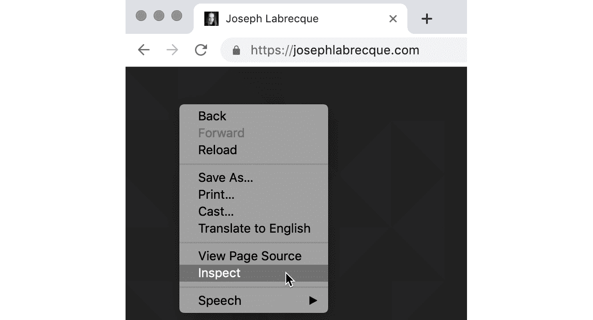
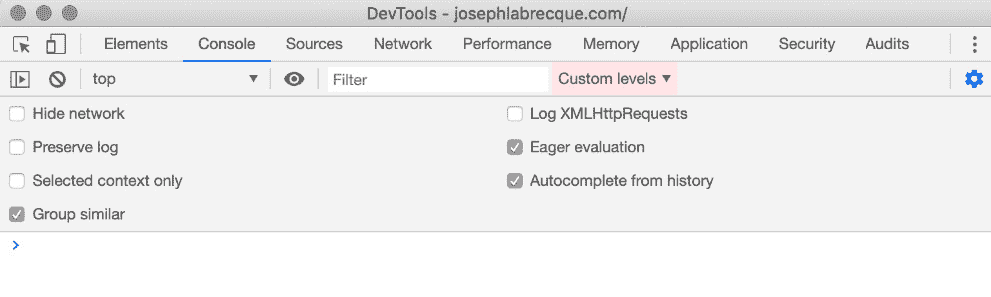
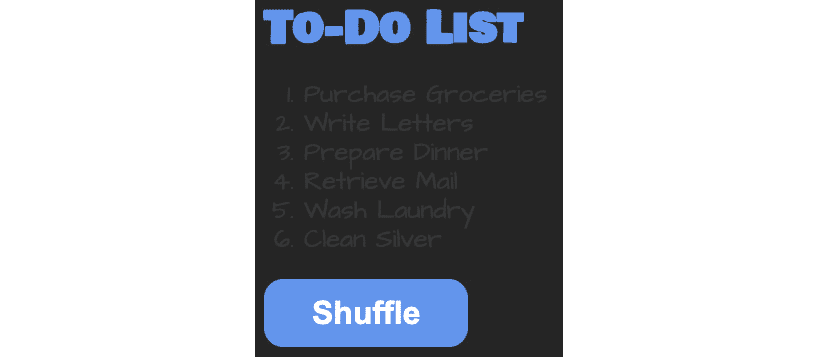
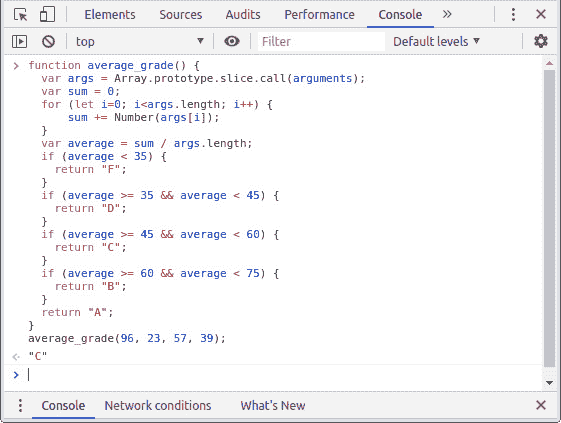
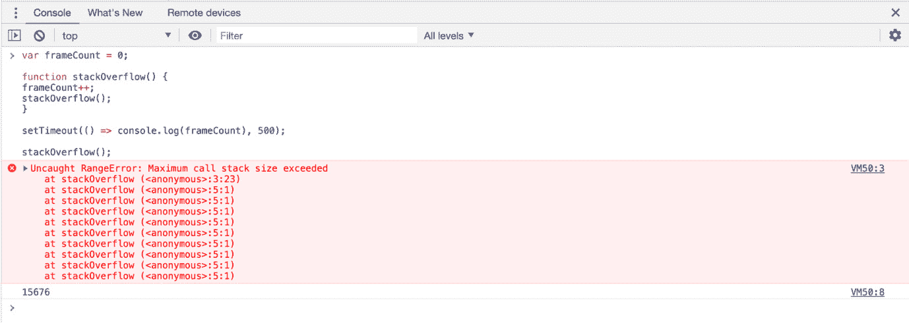
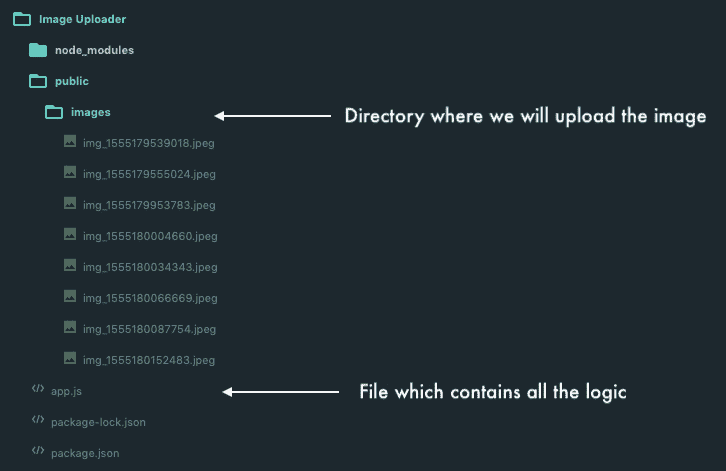
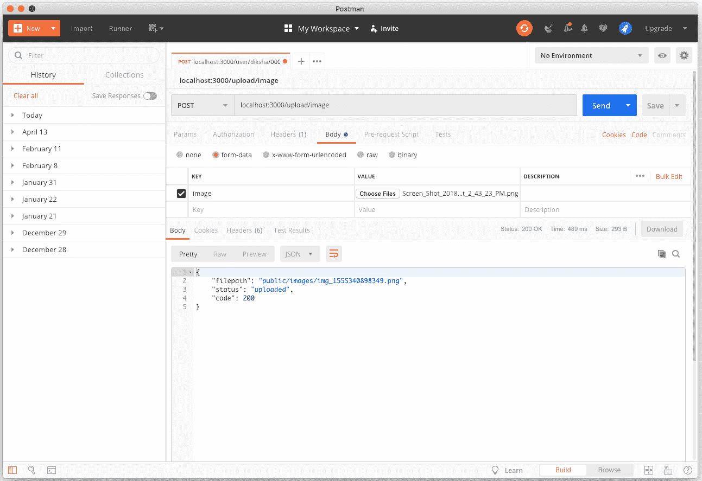
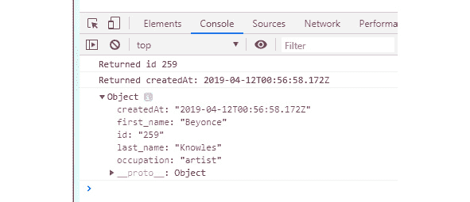
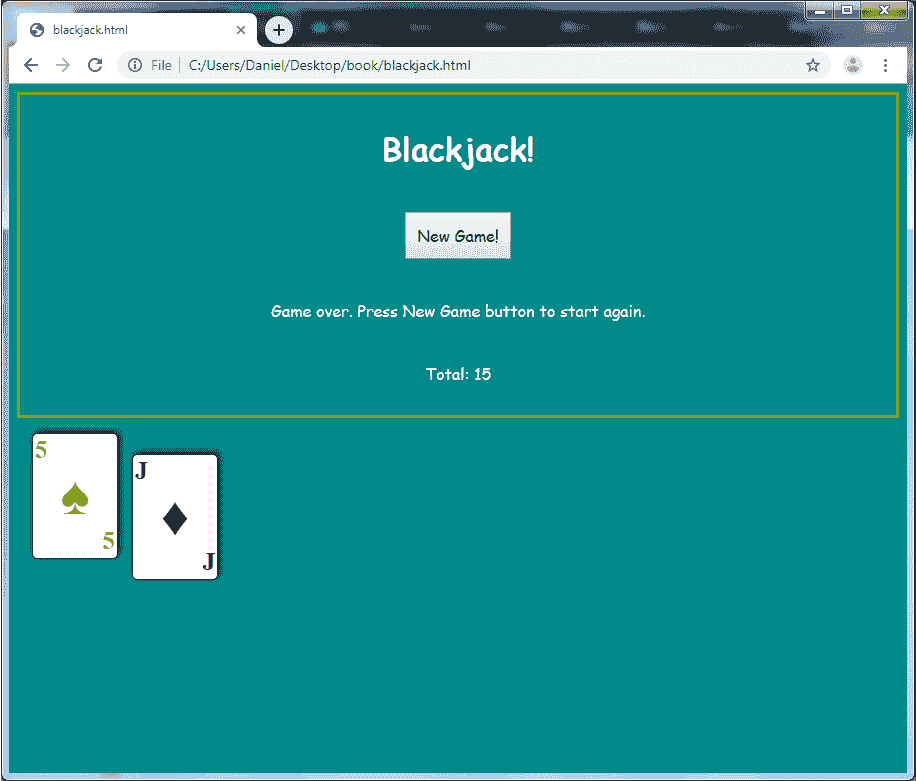

# 附录

## 关于

本节包含的内容旨在帮助学生执行书中提到的活动。它包括学生为完成和实现本书目标而需要执行的详细步骤。

# 第一章：了解 JavaScript

## 活动 1.01：在网页浏览器中创建一个警告框弹出

### 解决方案

1.  按 *F12* 打开集成在其内的开发者工具。如果不起作用，右键点击可能会弹出一个提示，让你也能这样做：

    图 1.18：在 Google Chrome 中选择“检查”

1.  开发者工具默认可能是控制台。如果不是，可能有一个可以点击的 `Console` 选项卡来激活它。控制台允许你在网页浏览器中直接编写 JavaScript 代码：

    图 1.19：Google Chrome 中的开发者工具控制台选项卡

1.  在控制台中，输入以下命令：

    ```js
    var greeting = 'Hello from JavaScript!';
    alert(greeting);
    ```

1.  按 *Return*/*Enter* 执行代码。代码将在浏览器环境中执行。

    你应该在浏览器视口中看到一个弹出的警告框显示你的消息，如图所示：


图 1.20：出现带有我们消息的警告

这段代码做了什么？它在第一行使用 `var` 关键字声明了一个名为 `greeting` 的变量。作为同一行代码的一部分，我们使用 `=` 赋值运算符将一个 `'Hello from JavaScript!'` 文本字符串值赋给我们的变量。

在第二行，我们使用 `alert()` 函数并将我们的 `greeting` 标识符作为参数传递。结果是，网页浏览器显示了一个带有我们传递给标识符的文本值的警告叠加层。

# 第二章：使用 JavaScript

## 活动 2.01：向待办事项列表中添加和修改项

### 解决方案

1.  创建 HTML 文件并粘贴 HTML 代码以开始：

    图 2.28：待办事项列表的初始外观

1.  我们首先需要为我们的列表分配一个 ID，以便通过代码来识别它。为此，将一个 `id` 属性添加到 `ol` 元素中，并给它赋值为 `todo-list`。完成这些后，我们就可以直接使用 JavaScript 来引用这个元素：

    ```js
    <ol id="todo-list">
    ```

1.  使用一些 JavaScript 代码，我们现在可以创建一个名为 `parentContainer` 的新变量。这将引用包含所有列表项的有序列表容器元素。我们将使用之前步骤中分配的 ID，通过 `getElementById()` 方法直接引用这个元素：

    ```js
    var parentContainer = document.getElementById('todo-list');
    ```

1.  通过 JavaScript 创建一个新的 HTML `<li>` 列表项元素。目前，这个元素只存在于内存中，因为我们必须将其添加到一个可视容器中。它也没有与它关联的文本内容：

    ```js
    var newItem = document.createElement('li');
    ```

1.  现在，让我们用数据值填充列表项。将`newItem`节点的`innerText`设置为字符串。该字符串的值可以是任何您喜欢的，但它应该符合待办事项列表的概念：

    ```js
    newItem.innerText = "Research Wines";
    ```

1.  现在新的 HTML 元素已经创建并填充了文本，我们可以通过将其附加到已存在的父容器中将其添加到视觉文档中：

    ```js
    parentContainer.appendChild(newItem);
    ```

1.  我们还需要在所有其他现有的`<script>`标签下方添加一行额外的 JavaScript 代码来修改元素的外观。我们将引用有序列表中的最后一个子元素，并将`style`属性更改为添加 CSS 颜色规则。您可以将文本的实际颜色设置为任何您喜欢的颜色——我将使用`crimson`：

    ```js
    parentContainer.lastChild.style.color = "crimson";
    ```

1.  现在，为了通过代码验证执行顺序，直接在`parentContainer`的初始声明下方添加以下 JavaScript 行：

    ```js
    console.log('Beginning List Count: ' + parentContainer.children.length);
    ```

1.  然后，在关闭`<script>`标签之前添加以下行：

    ```js
    console.log('End List Count: ' + parentContainer.children.length);
    ```

1.  完成后，刷新您的浏览器视图，您的列表中应该会出现第七个项目。请务必关注开发者工具控制台以验证代码的执行顺序！不仅新项目将被添加到现有的有序列表中，而且它还将以深红色文本而不是通常的白色显示：

图 2.29：已将一个列表项添加到我们的待办事项列表中，并使用深红色进行了样式设置

完整的代码如下：

```js
activity-complete.html
30    <ol id="todo-list">
31        <li>Wash Laundry</li>
32        <li>Clean Silver</li>
33        <li>Write Letters</li>
34        <li>Purchase Groceries</li>
35        <li>Retrieve Mail</li>
36        <li>Prepare Dinner</li>
37    </ol>
38    <script>
39        var parentContainer = document.getElementById('todo-list');
The full code is available at: https://packt.live/2q8CGY1
```

这只是一个简单的例子，说明了 JavaScript 如何直接影响其运行环境的其他方面。

# 第三章：编程基础

## 活动 3.01：待办事项列表洗牌程序

### 解决方案

1.  所有编码都在`activity.js`文件中完成。在每个步骤中添加显示的注释后的代码。创建待办事项的数组：

    ```js
    // Declare and initialize the todo list array
    let todoList = [
     "Wash Laundry",
     "Clean Silver",
     "Write Letters",
     "Purchase Groceries",
     "Retrieve Mail",
     "Prepare Dinner"
    ];
    ```

1.  检查名为`activity.html`的 HTML 文档文件中的`ol`元素，注意它有一个值为`todo-list`的`id`属性：

    ```js
     <ol id="todo-list">
     </ol>
    ```

1.  您可以创建一个对象变量，使用`document.getElementById`方法引用`ol`元素：

    ```js
    // The todo list element
    let todoEle = document.getElementById('todo-list');
    ```

1.  接下来，编写一个函数，该函数接受一个列表元素对象和一个值数组。该函数从列表元素中删除`li`元素，然后遍历数组，为数组中的每个值创建新的`li`元素：

    ```js
    // Function to replace an HTML DOM list li elements with array items.
    function replaceListElements(listEle, listItems){
     listEle.innerHTML = "";
     for (let i= 0; i<= listItems.length - 1; i++){
      let liEle = document.createElement("li");
      liEle.appendChild(document.createTextNode(listItems[i]));
      listEle.appendChild(liEle);
     }
    }
    ```

    第一行使用`innerHTML`属性删除列表元素对象的全部内容。`for`循环遍历数组。`for`循环中的第一行创建了一个名为`liEle`的`li`元素对象。下一行使用`liEle`对象的`addChild`方法将文本节点附加到`liEle`对象上。`document.createTextNode`方法提供了数组中的项作为适当的节点对象。最后一行将`liEle`对象附加到`listEle`对象上。

1.  最后一步是调用该函数：

    ```js
    // Update the todo list view with initial list of items
    replaceListElements(todoEle, todoList);
    ```

    此函数将在`activity.js`文件加载时执行。

1.  保存 `activity.js` 文件并在网络浏览器中重新加载 `activity.html` 文件。它应该如下所示：

    图 3.24：`activity.js` 和 `activity.html` 文件输出

1.  检查名为 `activity.html` 的 HTML 文档文件中的 `button` 元素，注意它有一个值为 `shuffle-button` 的 `id` 属性：

    ```js
     <button id="shuffle-button">Shuffle</button>
    ```

    你可以使用 `document.getElementById` 方法创建一个对象变量来引用 `button` 元素：

    ```js
    // The shuffle button element.
    let shuffleButtonEle = document.getElementById('shuffle-button');
    ```

1.  接下来，你需要监听点击事件并调用一个处理该事件的函数。`shuffleButtonEle` 对象的 `addEventListener` 方法可以为你完成这个任务。第一个参数是事件名称，第二个参数是函数名称：

    ```js
    // Add event listener function for the shuffle button element.
    shuffleButtonEle.addEventListener('click', shuffleButtonClicked);
    ```

1.  现在，我们需要编写 `shuffleButtonClicked` 函数：

    ```js
    // Function to handle click events for the Shuffle button
    function shuffleButtonClicked(e){
     replaceListElements(todoEle, getNewShuffledArray(todoList));
    }
    ```

    代码的唯一一行用于调用 `replaceListElements` 函数。第一个参数是 `ol` 元素的 `todoEle` 对象。第二个参数是 `getNewShuffledArray` 函数，它使用 `todoList` 数组作为参数。`getNewShuffledArray` 函数返回一个已打乱顺序的数组。

1.  保存 `activity.js` 文件并在网络浏览器中重新加载 `activity.html` 文件。然后，点击 Shuffle 按钮，以查看列表的变化。

1.  花点时间检查 `getNewShuffledArray` 函数中的注释，看看它是如何工作的。它打乱数组元素，看起来如下：

    ```js
     function getNewShuffledArray(sourceArray){
    ```

1.  现在，复制 `sourceArray` 并设置索引以进行交换，从最后一个开始：

    ```js
     var newArray = [].concat(sourceArray);
     let swapIndex = newArray.length;
    ```

1.  创建一个索引与 `swapIndex` 交换，并交换 `swapIndex` 的值：

    ```js
     let swapWithIndex;
     let swapIndexValue;
    ```

1.  创建一个名为 `swapIndex` 的 `while` 循环，其值不等于 `0`，并从 `0` 到当前的 `swapIndex` 选择一个索引进行交换：

    ```js
     while (0 !== swapIndex) {
      swapWithIndex = Math.floor(Math.random() * swapIndex);
    ```

1.  现在，将 `swapIndex` 减少到 `1` 并复制 `swapIndex` 的值。然后，将 `swapIndex` 的值替换为 `swapWithIndex` 的值，并将 `swapWithIndex` 的值替换为 `temporaryValue` 的值：

    ```js
      swapIndex -= 1;
      swapIndexValue = newArray[swapIndex];
      newArray[swapIndex] = newArray[swapWithIndex];
      newArray[swapWithIndex] = swapIndexValue;
     }
     return newArray;
    ```

打乱的 To-Do 列表看起来可能如下所示：


图 3.25：打乱列表 1

另一个打乱 To-Do 列表的例子如下：


图 3.26：打乱列表 2

# 第四章：JavaScript 库和框架

## 活动 4.01：为 Todo 列表应用程序添加动画

### 解决方案：

1.  前往 [cdnjs.com](http://cdnjs.com) 获取 jQuery CDN URL。

1.  将库通过脚本标签加载到现有的 Todo-List-HTML 的 head 标签中。这将允许你在代码中使用 jQuery：

    ```js
    <head>
        // ... links and meta tags from the previous activity
    <script src="img/jquery.min.js"></script>
    </head>
    ```

    在 `activity.js` 中，你需要更改 `todoEle` 变量。将其更改为 jQuery 元素：

    ```js
    // The todo list element
    // let todoEle = document.getElementById('todo-list'); // old
    let todoEle = $('#todo-list'); // new
    ```

    在 `replaceListElements` 函数内部，你现在可以使用 jQuery 提供的函数在 `todoEle` 元素上使用。

1.  使用必要的 jQuery 函数隐藏并清除元素内部的内容：

    ```js
    function replaceListElements(listEle, listItems){
     // listEle.innerHTML = „"; // old
     listEle.hide();
     listEle.empty();
     for (let i= 0; i<= listItems.length - 1; i++){
      let liEle = document.createElement("li");
      liEle.appendChild(document.createTextNode(listItems[i]));
      listEle.appendChild(liEle);
     }
    }
    ```

1.  在 for 循环内部，创建`liEle`列表项元素，设置文本内容，并将其附加到`listEle`列表元素上：

    ```js
    function replaceListElements(listEle, listItems){
     listEle.hide();
     listEle.empty();
     for (let i= 0; i<= listItems.length - 1; i++){
      // let liEle = document.createElement("li");
      // liEle.appendChild(document.createTextNode(listItems[i]));
      // listEle.appendChild(liEle);
      let liEle = $(document.createElement("li"));
      liEle.append(document.createTextNode(listItems[i]));
      liEle.appendTo(listEle);
     }
    }
    ```

1.  最后，缓慢淡入新的排序后的待办事项列表，即`listEle`：

    ```js
    function replaceListElements(listEle, listItems){
     listEle.hide();
     listEle.empty();
     for (let i= 0; i<= listItems.length - 1; i++){
      let liEle = $(document.createElement("li"));
      liEle.append(document.createTextNode(listItems[i]));
      liEle.appendTo(listEle)
     }
     listEle.fadeIn('slow');
    }
    ```

1.  现在，在您的浏览器中打开 HTML 文件，并点击“Shuffle”按钮。待办事项列表应该淡出、打乱顺序，然后再次淡入：

    ```js
    <head>
        // ... previous links and meta tags
    <script src="img/velocity.min.js"></script>
    </head>
    ```

1.  在`replaceListElements`函数内部，现在可以使用 Velocity 将列表元素`listEle`隐藏（通过设置不透明度为 0），然后清空其内部元素：

    ```js
    function replaceListElements(listEle, listItems){
     Velocity(listEle, { opacity: 0 }, { duration: 0 })
     listEle.innerHTML = "";
     for (let i= 0; i<= listItems.length - 1; i++){
      let liEle = document.createElement("li");
      liEle.appendChild(document.createTextNode(listItems[i]));
      listEle.appendChild(liEle)
     }
    }
    ```

1.  要将列表元素淡入，使用 Velocity 对`listEle`进行动画处理，并将不透明度设置为`1`。在 for 循环之后设置代码：

    ```js
    function replaceListElements(listEle, listItems){
     Velocity(listEle, { opacity: 0 }, { duration: 0 })
     listEle.innerHTML = "";
     for (let i= 0; i<= listItems.length - 1; i++){
      let liEle = document.createElement("li");
      liEle.appendChild(document.createTextNode(listItems[i]));
      listEle.appendChild(liEle)
     }
     Velocity(listEle, { opacity: 1 }, { duration: 500 })
    }
    ```

1.  现在，在您的浏览器中打开 HTML 文件，并点击*Shuffle*按钮。`todo`列表应该淡出、打乱顺序，然后再次淡入。

1.  最后，使用 Anime 方法，前往[courseds.com](http://cdnjs.com)并获取`Anime.js`的 CDN URL。它将看起来与之前的输出相同。

1.  使用 script 标签将库加载到现有的 Todo-List-HTML 的 head 标签中。这将允许您在代码中使用`Anime.js`：

    ```js
    <head>
        // ... previous links and meta tags
    <script src="img/anime.min.js"></script>
    </head>
    ```

1.  在`replaceListElements`函数内部，现在可以使用`Anime.js`通过设置`translateX = -1000`将列表元素`listEle`移出视图，然后清空其内部元素：

    ```js
    function replaceListElements(listEle, listItems){
     anime({
      targets: listEle,
      translateX: -1000
     });
     listEle.innerHTML = "";
     for (let i= 0; i<= listItems.length - 1; i++){
      let liEle = document.createElement("li");
      liEle.appendChild(document.createTextNode(listItems[i]));
      listEle.appendChild(liEle)
     }
    }
    ```

1.  要显示新打乱的待办事项列表，使用`Anime.js`对`listEle`列表元素进行动画处理，使其回到视图（通过使用`translateX = 0`）。在超时内这样做，以确保打乱操作已经完成：

    ```js
    activity.anime.js
    21 function replaceListElements(listEle, listItems){
    22  anime({
    23   // ANIME SOLUTION
    24   targets: listEle,
    25   translateX: -1000
    26  });
    27  listEle.innerHTML = "";
    28 
    29 
    30  for (let i= 0; i<= listItems.length - 1; i++){
    31   let liEle = document.createElement("li");
    32   liEle.appendChild(document.createTextNode(listItems[i]));
    33   listEle.appendChild(liEle)
    34  }
    The full code is available at: https://packt.live/2Kd08dx
    ```

1.  现在，在您的浏览器中打开 HTML 文件，并点击*Shuffle*按钮。`todo`列表应该淡出、打乱顺序，然后再次淡入。它将看起来与之前的输出相同。

# 第五章：超越基础

## 活动 5.01：简单的数字比较

### 解答

1.  创建函数签名：

    ```js
    function average_grade() {
    ```

1.  将函数参数复制到一个变量中。这应该是一个新的 Array 实例：

    ```js
        var args = Array.prototype.slice.call(arguments);
    ```

1.  将所有参数的值相加，并将它们存储在一个变量中：

    ```js
        var sum = 0;    for (let i=0; i<args.length; i++) {
            sum += Number(args[i]);
        }
    ```

    记得将成绩值转换为 Number 实例，以便它们可以正确相加。

1.  计算总和的平均值并将其存储在一个变量中：

    ```js
        var average = sum / args.length;
    ```

1.  使用平均值计算学生的成绩并返回。这可以简单地是一个条件列表：

    ```js
        if (average < 35) {
          return "F";
        }
        if (average >= 35 && average < 45) {
          return "D";
        }
        if (average >= 45 && average < 60) {
          return "C";
        }
        if (average >= 60 && average < 75) {
          return "B";
        }
        return "A";
    }
    ```

输出将如下所示：



图 5.26：活动 5.01 输出

注意

如果其他条件失败，最终条件始终为真，因此可以跳过条件本身。如果上一个条件已经从函数返回，则不会评估每个条件。

## 活动 5.02：创建 TODO 模型

### 解答

1.  第一步是声明状态。它必须在任何函数之外声明，以便在函数调用之间存在：

    ```js
    let todos = [];
    ```

1.  接下来，创建一个辅助函数，该函数将用于从 `state` 数组中通过 `id` 查找 TODO。为此，只需遍历数组，一旦找到就返回索引。如果没有找到并且到达数组的末尾，则返回 `-1` 以表示不存在具有特定 `id` 的 TODO：

    ```js
    function modelFindIndex(state, id) {
      for (let i=0; i<state.length; i++) {
        if (state[i].id == id) {
          return i;
        }
      }
      return -1;
    }
    ```

1.  现在，创建描述中所述的函数：

    ```js
    function modelStateChange(state, action, data) {
    ```

1.  该函数的行为将根据 `action` 的值而有所不同。在成功修改数据时，它应该返回新的状态。首先，处理 `CREATE` 动作向状态中添加新的 TODO：

    ```js
      if (action == "CREATE") {
        console.log("created:", data);
        return state.concat(data);
      }
    ```

    记住，需要使用 `console.log` 将数据写入控制台。

1.  接下来，处理 `REMOVE` 功能。这将利用 `modelFindIndex` 函数定位要删除的 `TODO`：

    ```js
      if (action == "REMOVE") {
       let data = modelFindIndex(todos, ev.detail);
        if (i > -1) {
          state = state.splice(i, 1);
          console.log("removed", data);
          return state
        }
      }
    ```

1.  最后，处理 `MODIFY` 功能。这一步稍微复杂一些，因为需要在不更改对象引用的情况下更改原始数据：

    ```js
      if (action == "MODIFY") {
        let data = modelFindIndex(todos, ev.detail);
        if (i > -1) {
          state = state.splice(i, 1);
          console.log("removed", data);
          return state
        }
      }
    }
    ```

# 第六章：理解核心概念

## 活动第 6.01：对模型进行更改

### 解决方案：

1.  表单所在的页面有一个区域用于显示消息。表单本身包含标题 `textfield` 和 `textarea` 字段的描述。

    页面加载了上一章中的模型代码，但也包含了一个新脚本，该脚本将很快被创建。`body` 标签被分配了一个页面事件处理程序，该处理程序将包含在 `create_todos.js` 文件中。

    为了使用具有事件的模型模块，您需要通过为每个动作类型提供事件处理程序来扩展它。将以下代码添加到 `model.js` 文件的底部：

    ```js
    function modelInit() {
      document.addEventListener("CREATE", modelCreateHandler);
    }
    function modelCreateHandler(ev) {
      todos = modelStateChange(todos, "CREATE", ev.detail);
      document.dispatchEvent(new Event("CHANGED", {detail: {type: "added", value: ev.detail}}));
    }
    ```

1.  在 `create_todos.js` 文件中，添加 `loadHandler` 函数：

    ```js
    function loadHandler() {
      model_init();
      let form = document.getElementById("todo_form");
      form.addEventListener("submit", createHandler);
      document.addEventListener("CHANGED", changedHandler);
    }
    ```

    此函数将初始化模型并设置任何必要的处理程序。如您所见，它将 `CHANGED` 事件分配给 `changedHandler` 函数。让我们接下来创建它。

1.  `changedHandler` 是一件简单的事情。它只是等待 `CHANGED` 事件被触发，然后在它发生时更新通知区域：

    ```js
    function changedHandler() {
      let msg = document.getElementById("notifications");
      msg.innerHTML = "The TODO model has been updated";
      setTimeout(() => {
        msg.innerHTML = "";
      }, 3000);
    }
    ```

    `changedHandler` 在三秒后将通知区域清除，以保持整洁。

1.  最后，您需要添加 `createHandler` 函数，该函数处理表单的提交：

    ```js
    create_todos.js
    16 function createHandler(ev) {
    17   ev.preventDefault();
    18   let title = document.getElementById("title").value,
    19       description = document.getElementById("description").value,
    20       msg = document.getElementById("notifications");
    21   let errors = [];
    22   if (title.trim() == "") {
    23     errors = errors.concat(["Title is not valid"]);
    24   }
    25   if (description.trim() == "") {
    26     errors = errors.concat(["Description is not valid"]);
    27   }
    28   if (errors.length > 0) {
    29     msg.innerHTML = errors.join("/n");
    30     setTimeout(() => {
    The full code is available at: https://packt.live/2Xbd34R
    ```

    这段代码的主要作用是在提交表单之前确保提供了值，如果没有提供，则会提醒用户。

1.  现在，运行应用程序。如果一切顺利，在提交表单时应该会短暂显示通知，具体消息取决于字段是否已填充。例如，打开浏览器控制台并简单地输入以下内容：

    ```js
    todos;
    ```

    您应该会看到提交的 `TODO` 对象在这里展示，如下所示：


图 6.28：待办事项提交表单

使用事件提供了一种强大的方法来保持你的应用程序简单。更重要的是，它还赋予了抽象能力，允许脚本发送数据，而无需知道应用程序的其他哪些区域对这些事件感兴趣。这促进了代码的整洁设计和易于维护。

# 第七章：揭开盖子

## 活动 7.01：找出栈帧的数量

### 解决方案

+   建立调用栈限制的函数如下：

    var frameCount = 0;

    ```js
    function stackOverflow() {
      frameCount++;
      stackOverflow();
    }
    ```

    解决方案从将`frameCount`变量初始化为`0`开始。声明了`stackOverflow()`函数，该函数将`frameCount`变量的值增加 1，然后调用自身，从而引发栈溢出。

+   现在，启动`setTimout()`函数，该函数将在至少 500 毫秒后将`frameCount`的值记录到控制台。现在，调用`stackOverflow()`函数。

    ```js
    setTimeout(() => console.log(frameCount), 500);
    stackOverflow();
    ```

    这将`console.log`函数从主执行线程中移除，允许它在抛出栈溢出错误后调用：

    

图 7.22：显示解决方案和触发栈溢出之前推入的栈帧数量

# 第八章：浏览器 API

## 活动 8.01：创建一个简单的分形

### 解决方案

1.  我们初始化画布和上下文，就像之前做的那样，但这次我们添加了一个点变量，并用画布中心的坐标初始化它：

    ```js
    let canvas = document.getElementById('canvas');
    const width = window.innerWidth;
    const height = window.innerHeight;
    canvas.width = width;
    canvas.height = height;
    let context = canvas.getContext('2d');
    // Set the starting point to the center of the canvas
    let point = [width / 2, height / 2];
    ```

1.  然后，我们开始一个新的路径，并将点移动到分配给点变量的坐标：

    ```js
    context.beginPath();
    context.moveTo(point[0], point[1]);
    ```

1.  我们声明`i`，我们将使用它作为乘数来告诉函数线条应该有多长。我们还声明了两个常量来保存分形与画布边缘之间的边距值以及一个乘数，该乘数用于增加绘制的线条长度。然后，我们开始一个 while 循环，该循环将在点保持在画布边界内（加上每边的边距）时继续进行：

    ```js
    let i = 1;
    const OFFSET = 10;
    const MARGIN = 5;
    while (
      point[0] > MARGIN &&
      point[0] < width - MARGIN &&
      point[1] > MARGIN &&
      point[1] < height - MARGIN
    ) {
    ```

1.  在 while 循环内部，根据线条的绘制方向和`i`的值，增加或减少点数组中的值：

    ```js
    point[1] = point[1] - OFFSET * i;
    ```

1.  然后，使用点变量中的值调用 lineTo 函数。每次绘制线条时，`i`都会增加。这意味着线条的长度在每次绘制线条后都会加倍。你也可以在每次绘制线条时增加`i`，这样线条之间的间隔就会更大：

    ```js
    context.lineTo(point[0], point[1]);
      point[0] = point[0] + OFFSET * i;
      i++;
      context.lineTo(point[0], point[1]);
      point[1] = point[1] + OFFSET * i;
      context.lineTo(point[0], point[1]);
      point[0] = point[0] - OFFSET * i;
      i++;
      context.lineTo(point[0], point[1]);
    }
    ```

1.  最后，当 while 循环的终止条件满足时（当点达到画布边缘的 5 像素以内时），上下文的 stroke()方法被调用，为描述的线条添加描边：

    ```js
    context.stroke();
    ```

    Canvas API 中有更多可用方法，以及许多使用它们的可能性。你可以绘制复杂的图案、图片和图表，并使你绘制的任何东西都动起来。你应该更深入地探索 Canvas API，以了解它能做什么。

## 活动 8.02：使用两个振荡器播放声音和控制频率

### 解决方案

1.  初始化一个音频上下文和一个音量节点：

    ```js
    let context = new AudioContext();
    let volume = context.createGain();
    ```

1.  创建一个增益节点并将其连接到上下文的输出：

    ```js
    volume.connect(context.destination);
    ```

1.  初始化两个振荡器（一个用于光标的每个坐标）：

    ```js
    let osciA = context.createOscillator();
    let osciB = context.createOscillator();
    ```

1.  设置振荡器类型（你可以自由使用你喜欢的任何类型），将它们连接到音量节点，并调用它们的 start() 方法：

    ```js
    osciA.type = 'sawtooth';
    osciB.type = 'square';
    osciA.connect(volume);
    osciB.connect(volume);
    osciA.start();
    osciB.start();
    ```

1.  创建一个事件监听器，监听 `document` 上的 `mousemove` 事件，并根据光标的位置设置振荡器的频率：

    ```js
    document.addEventListener('mousemove', event => {
      osciA.frequency.value = event.clientY;
      osciB.frequency.value = event.clientX;
    });
    ```

传递给事件监听器的回调函数在每次 'mousemove' 事件触发时将光标的 x 和 y 值分配给两个振荡器节点的频率值。这是一个简单的解决方案：它本质上限制了每个振荡器的最高频率值，这取决于浏览器窗口的宽度和高度。这对于演示来说是可以的，但更好的实现方式是在文档的最右侧和最下侧分配相同的任意最高频率值，无论其尺寸如何。

## 活动 8.03：音频可视化

### 解决方案

1.  创建一个简单的 HTML 文件，其中包含对名为 scripts.js（或你想要命名的任何名称）的 JavaScript 文件的链接，在 body 中包含一个 <canvas> 元素，并在 DevTools 控制台中具有 ID 为 canvas：

    ```js
    <!-- index.html -->
    <!DOCTYPE html>
    <html>
      <head>
        <script src='scripts.js'></script>
      </head>
      <body>
        <canvas id='canvas'></canvas>
      </body>
    </html>
    ```

1.  在 scripts.js 文件中，我们将在文档上添加一个事件监听器，监听点击事件。正如我们在本章的 *音频 API* 部分所看到的，在许多现代浏览器中，音频在用户与页面交互之前是禁用的，所以等待点击事件是一个简单的方法来确保我们在这方面不会遇到任何错误：

    ```js
    // scripts.js
    document.addEventListener('click', () => {
    ```

1.  然后，我们获取 canvas 元素，创建一个 canvas 上下文，设置 canvas 的宽度和高度，并获取其中心 x/y 坐标。我们还实例化一个将保存鼠标位置 Y 值的变量：

    ```js
      // initialise canvas and related variables
      let canvas = document.getElementById('canvas');
      let canvasContext = canvas.getContext('2d');
      let width = window.innerWidth;
      let height = window.innerHeight;
      canvas.width = width;
      canvas.height = height;
      let centerX = width / 2;
      let centerY = height / 2;
      let mouseY; // this will be set in the 'mousemove' event handler
    ```

1.  然后，我们将创建一个音频上下文、一个增益节点、一个振荡器节点和一个分析器节点。我们将振荡器连接到音量节点和分析器节点，然后将音量节点连接到音频上下文的输出：

    ```js
      // initialise Audio context, nodes and related variables
      let audioContect = new AudioContext();
      let volume = audioContect.createGain();
      let osciA = audioContect.createOscillator();
      let analyser = audioContect.createAnalyser();
      let waveform = new Float32Array(analyser.frequencyBinCount);
      osciA.type = 'sine';
      osciA.connect(volume);
      osciA.connect(analyser);
      volume.connect(audioContect.destination);
      volume.gain.value = 1;
      osciA.start();
    ```

1.  接下来，我们监听鼠标移动事件，并在事件回调函数中，将光标的 X 位置分配给振荡器的频率值，将光标的 Y 位置分配给 mouseY 变量。这意味着光标的 X 位置将控制振荡的频率。我们很快就会看到 mouseY 变量是用来做什么的：

    ```js
      // set oscillator frequency from mouse's x-position
      document.addEventListener('mousemove', event => {
        osciA.frequency.value = event.clientX;
        mouseY = event.clientY;
      });
    ```

1.  现在，我们来到了应用程序的核心部分。我们调用 draw() 函数。这个函数告诉浏览器我们想要绘制动画的一帧，并通过将 draw() 函数作为回调，它在每次页面渲染时重复这个函数一次：

    ```js
    // start drawing
      draw();
    ```

1.  接下来，我们从分析仪获取波形数据，并将其复制到波形数组中。然后，我们清除画布上的任何先前 stroke()方法，并开始一个新的路径：

    ```js
      // the draw function
      function draw() {
        let drawing = window.requestAnimationFrame(draw); // Repeat the drawing function on every animation frame
        analyser.getFloatTimeDomainData(waveform);
        canvasContext.clearRect(0,0,canvas.width,canvas.height); // empty the canvas, so we don't get arcs drawn on top of each other
        canvasContext.beginPath();
    ```

1.  现在，我们来遍历波形数组。对于数组中的每个项目（代表波形点），我们将绘制圆的小部分。圆将被分成与数组中项目数量一样多的部分。每个部分的半径是画布宽度的一半减去鼠标的 Y 位置，加上当前波形块振幅的当前块（乘以一个任意数，即 15）。如果鼠标在屏幕的一半以上，结果可能是一个负数，所以我们用 Math.abs()将整个包裹起来，它返回一个数字的绝对值（没有负数）：

    ```js
        // plot a section of the circle for each part of the waveform
        for(let i = 0; i<waveform.length; i++) {
          let radius = Math.abs(((width / 2) - mouseY) + (waveform[i] * 15));
    ```

1.  接下来，我们需要设置圆弧的起始角度和结束角度（以弧度为单位）。整个圆是 2*π弧度，但我们将圆分成与波形数组中项目数量一样多的弧。因此，我们可以计算出起始角度为((2 / waveform.length) * i) *π，其中 waveforms.length 是项目数量，i 是当前波形/我们的圆的部分。我们只需将 i 加 1，即为结束角度，因为每个块的最后角度与下一个块的起始角度相同：

    ```js
          let startAngle = ((2 / waveform.length) * i) * Math.PI;
    ```

    let endAngle = ((2 / waveform.length) * i) * Math.PI;

1.  在完成所有这些，并调用画布上下文的 arc()方法之后，我们可以调用 stroke()方法来为刚刚绘制的所有弧添加描边：

    ```js
          canvasContext.arc(centerX, centerY, radius, startAngle, endAngle);
        }
    ```

1.  将所有这些放在一起，运行它，然后点击页面：我们应该得到一个非常漂亮的振荡圆，其直径随着光标的 y 位置增加，其振荡与扬声器发出的正弦波声音相匹配。顺便说一下，这可以通过光标的 x 位置来控制。非常有趣：

    ```js
        canvasContext.stroke();
      };
    })
    ```

# 第九章：使用 Node.js

## 活动九.01：创建一个用于上传、存储和保存图像详情的 Web 应用程序

### 解决方案

1.  让我们先通过目录结构，并定义上传图像的文件夹：

    图 9.22：此活动的目录结构

    如您所见，在这个项目中，您将尝试在`public/images`目录中上传图像。此目录必须位于项目的根目录，并且当前用户应具有对此目录的读写权限。默认情况下，您将获得对此目录的权限。

    注意

    源代码将只包含两个文件（`app.js`和`package.json`）。在前面的图中显示的`images`目录中的所有其他文件将不会存在。一旦您开始上传文件，您将看到所有上传的图像在那里。

    在继续之前，请确保在与此项目的`app.js`和`package.json`相关的项目根目录中创建一个`public/images`目录。您的机器当前登录用户必须具有在此目录中添加文件的权限。

1.  第一步是导入所有依赖项：

    ```js
    const express   = require('express');
    const multer            = require('multer');
    const MySQL             = require('MySQL');
    const morgan    = require('morgan')
    const app               = express();
    const port              = 3000;
    ```

1.  然后让我们配置 `morgan` 以在控制台中记录每个请求的详细信息。您可以将 `morgan` 作为中间件使用：

    ```js
    // Middleware for logging requests
    app.use(morgan(':method :status :url - :response-time ms'));
    ```

1.  现在，让我们配置数据库。在这个项目中，您将使用 `MySQL` 数据库：

    ```js
    /*
    * Database
    */
    // Creating MySQL Connection
    let connection = MySQL.createConnection({
       host         : 'localhost',
       user         : 'root',
       password     : '12345678',
       database     : 'packt_JavaScript'
    });

    // Connection to db
    connection.connect();
    ```

    确保在通过 *设置数据库* 部分时传递您之前创建的用户凭据。

1.  当您的应用程序建立数据库连接时，是时候通过项目根目录中的终端执行以下命令来安装 `multer` 了：

    ```js
    npm i multer --save
    ```

1.  现在，让我们通过添加 `app.js` 文件中的代码来配置 `multer`：

    ```js
    /*
    * File Upload Settings
    */
    let storage = multer.diskStorage({
            destination: (req, file, cb) => {
                      cb(null, 'public/images')
            },
            filename: (req, file, cb) => {
                    let ext = file.originalname.split('.').pop();
                      cb(null, 'img_' + Date.now() + '.' + ext);
            }
    });
    let upload = multer({storage: storage});    
    ```

    此代码将设置所有文件上传的目的地，即 `public/images`，并且在上传后更改 `filename` 以避免重复文件名的问题。

1.  现在让我们配置您应用程序中的某些路由：

    ```js
    app.js
    39 /*
    40 * Routing
    41 */
    42 // Landing route
    43 app.get('/', (req, res) => res.send('Hello World!'))
    44 
    45 // Upload image route
    46 app.post('/upload/image', upload.single('image'), function (req, re s) {
    47        // Column name: values
    48        let payload = {
    49                filename: req.file.filename,
    50                type: req.file.mimetype,
    51                original_name: req.file.originalname,
    52                path: req.file.path,
    53                size: req.file.size
    54 }
    The full code is available at: https://packt.live/2NIE6RR
    ```

1.  最后一步是启动服务器：

    ```js
    // Start listening to requests
    app.listen(port, () => console.log(`App listening on port http://localhost:${port}!`))
    ```

1.  就这样。服务器现在已启动并运行。最后一件事是向服务器发送上传图片的请求。为此，我们将使用 Postman（Chrome 扩展）作为我们的客户端：



图 9.23：Postman 中的 API 响应

# 第十章：访问外部资源

## 活动 10.01：使用各种技术实现 REST 服务调用

### 解答：

1.  使用 `$.ajax()` 并设置 `method: 'post'` 和 `dataType: 'json'`：

    ```js
    solution_using_jquery_ajax.html
        $.ajax({
            method: 'post',
            dataType: 'json',
            url: 'https://reqres.in/api/users',
    ```

1.  在对象 `{}` 中封装您的数据字段：

    ```js
            data: {
                "name": "Beyonce Knowles",
                "occupation": "artist"
            },
    ```

1.  创建一个 `success` 函数以输出预期的值：

    ```js
            success: function (data) {
                console.log("Returned id " + data.id + 
                            ", createdAt " + data.createdAt);
                console.log(data);
                }
            });
    ```

    省略了样板 HTML，并将其留作您的练习。前面的代码在 Google Chrome 的 JavaScript 控制台中会产生类似以下的内容。（所有提供的解决方案都有类似的输出）：

    

    图 10.17：JavaScript 控制台输出

1.  现在，让我们使用 `$.post()` 方法以及文件 `solution_using_jquery_post.html` 来获取相同的输出。

    ```js
    $.post('https://reqres.in/api/users',
    ```

1.  在对象 `{}` 中封装您的数据字段：

    ```js
    {
                "name": "Beyonce Knowles",
                "occupation": "artist"
            },
    ```

1.  创建一个 `success` 函数以输出预期的值：

    ```js
    function (data) {
                console.log("Returned id " + data.id + 
                            ", createdAt " + data.createdAt);
                console.log(data);
            },
    ```

1.  作为 `$.post()` 的最后一个参数，使用 `'json'` 值来指示预期的 JSON 返回类型：

    ```js
    'json'
        );
    ```

    输出将与 *图 10.17* 中显示的相同。

1.  最后，创建一个新的 `XMLHttpRequest` 对象：

    ```js
    const url = "https://reqres.in/api/users";
    var xhttp = new XMLHttpRequest();
    ```

1.  调用 `open('POST')`：

    ```js
    xhttp.open('POST', url);
    ```

1.  将 `Content-type` 和 `Accept` 请求头设置为适当的值：

    ```js
    xhttp.setRequestHeader("Content-type", "application/json");
    xhttp.setRequestHeader('Accept', 'application/json');
    ```

1.  为 `onreadystatechange` 创建一个函数，检查状态码为 `201 (已创建)` 并使用 `JSON.parse()` 解析 JSON 数据：

    ```js
    xhttp.onreadystatechange = function() {
        if (this.readyState == 4 && this.status == 201) {
            const data = JSON.parse(this.response);
            console.log("Returned id " + data.id + 
                        ", createdAt " + data.createdAt);
            console.log(data);
        }
    }
    ```

1.  在输入数据上调用 `JSON.stringify()` 以将其转换为 JSON 格式：

    ```js
    var data = JSON.stringify({
        "name": "Beyonce Knowles",
        "occupation": "artist"
    });
    ```

1.  在调用 `send()` 时发送 JSON 数据：

    ```js
    xhttp.send(data);
    ```

    输出将与 *图 10.17* 中显示的相同。

# 第十一章：创建干净且易于维护的代码

## 活动 11.01：扩展电话号码匹配模式以接受多种格式

### 解答：

1.  注意到每个模式的开头字符不同，但两种模式中的最后字符 `XXX-XXXX` 是相同的。

1.  对于不同的字符，为了使我们的正则表达式正确匹配两种格式，你可以指定与每种格式对应的正则表达式片段，作为交替表达式的替代表达式。回想一下，交替表达式具有 (`expression1|expression2`) 的形式：

    ```js
        ([2-9]\d{2}-|\([2-9]\d{2}\) )
    where Regex for XXX-\Regex for (XXX)
    ```

1.  将其与原始正则表达式的其余部分结合，以获得完整的正则表达式：

    ```js
        ^([2-9]\d{2}-|\([2-9]\d{2}\) )\d{3}-\d{4}$
    ```

1.  记住，原始正则表达式 `\d{3}-\d{4}` 匹配 `XXX-XXXX`，这在两种模式中都是相同的。我们只需要交替每个模式的不同部分。`^` 和 `$` 字符还强制执行没有其他字符在可接受字符之前或之后。

    现在，当你将这个正确的正则表达式替换到我们的工具中时，只有前两个测试字符串匹配（正如预期的那样）

![图 11.23：使用正确的正则表达式后，只有前两个测试字符串匹配（正如预期的那样）]

](img/C14377_11_23.jpg)

图 11.23：使用正确的正则表达式后，只有前两个测试字符串匹配（正如预期的那样）

在 *练习 11.01，g 标志的影响* 和此活动中，我们创建了接受美国号码格式的正则表达式。现在，我们将修改正则表达式以接受非美国号码格式。

## 活动 11.02：扩展电话号码匹配模式以接受特定格式

### 解决方案：

1.  构建用于 `+XXX` 模式的正则表达式（其中 1-3 位数字是可接受的）：

    ```js
        (\+\d{1,3} )?
    ```

    这里我们需要两件事：

    第一个 `+` 需要转义，因为它是一个特殊字符。

    注意后面的 `?` 后面的括号。这指定了括号内的整个表达式可以发生 0 次或 1 次。换句话说，表达式中的字符是可选的。`\d{1,3}` 表达式是一个范围量词，需要 1 到 3 位数字。

1.  通过将其添加到前面的活动中的正则表达式之前，整个正则表达式现在如下所示：

    ```js
        ^(\+\d{1,3} )?([2-9]\d{2}-|\([2-9]\d{2}\) )\d{3}-\d{4}$
    ```

    注意

    请参阅前面的活动，以了解正则表达式后部分的完整描述。

1.  为了再提高一个层次，以下是一些我们可以对正则表达式进行的更改，允许我们使用空格或点字符作为数字分隔符，而不是仅使用破折号：

    ```js
        ^(\+\d{1,3} )?([2-9]\d{2}|\([2-9]\d{2}\))[-. ] set allows a dash, dot, or space character to be used as the separator.This modification now allows all the formats shown in the following screenshot to match:NoteOne flaw with this regex is that it allows you to mix and match what characters are used as separators. For example, you can use a dash and dot, like so: 234-567.8910\. It is possible to make the regex stronger, but the result will end up being very long and convoluted.
    ```

## 活动 11.03：重构为简洁代码

### 解决方案：

注意

代码可以通过多种方式进行重构。以下解决方案代表了一种方式，并附有解释性注释。

1.  使用 `activity_solution.html` 文件。HTML 代码与原始代码相同。只有 `<script>` 部分的内文被替换。

1.  我们通过创建一个名为 `processForm()` 的函数开始重构代码：

    ```js
    document.getElementById("calc_button").addEventListener("click ", processForm);
    function processForm() {
        resetErrorsAndResults();
        const formFields = getFormFields();
        const validationError = formFields.validate();
        if (validationError) {
            displayError(validationError);
            return;
        }
        const result = doCalculation(formFields);
        displayResult(result);
    }
    ```

    原始代码有一个非常长的函数，它处理了所有表单字段处理、验证和计算。新代码为不同的关注点创建了新的方法。这些方法简短，主要专注于单一任务。

    代码读起来像是一个叙事故事，段落和句子主要是用普通的英语写的。仅通过阅读它，就可以很容易地看到逻辑和流程，而且没有太多杂乱：重置错误和结果，获取表单字段，验证字段并显示错误（如果有），进行计算，并显示结果。每个这些的详细信息都包含在其他方法中。

1.  我们还将创建一个名为 `resetErrorsAndResults()` 的函数。根据名称和实现，很容易判断这个函数的目的是什么，并且这个函数仅限于这个特定目的：

    ```js
    function resetErrorsAndResults() {
        document.getElementById("error").innerHTML = "";
        document.getElementById("result").innerHTML = "";
    }
    ```

1.  对于下一个重构，我们决定创建一个类来保存表单字段值并执行验证：

    ```js
    activity_solution.html
    63 class FormFields {
    64     constructor(numHours, payRate, workerType) {
    65         this.numHours = numHours;
    66         this.payRate = payRate;
    67         this.workerType = workerType;
    68     }
    69
    70     validate() {
    71         let validationError = this.validateNumHours();
    72         if (validationError) {
    73             return validationError;
    74         }
    The full code is available at: https://packt.live/372KXxp
    ```

    验证方法简单，如果正则表达式测试失败，则仅返回一个包含错误信息的字符串。显示错误信息是一个独立的问题（与原始代码不同，原始代码将这些问题合并在一起）。它包含一个构造函数，其中表单字段的值被传递进来，而不是我们需要直接从表单中获取这些值，从而允许类和验证独立于表单本身进行测试。

1.  接下来，我们创建一个名为 `getFormFields()` 的函数。这个函数仅限于从表单中获取值并创建 `FormFields` 类的实例：

    ```js
    function getFormFields() {
        const numHours = document.getElementById("numHours").value;
        const payRate = document.getElementById("payRate").value;
        const workerType =
            document.querySelector('input[name="workerType"]:checked').value;
        return new FormFields(numHours, payRate, workerType);
    }
    ```

    这些方法没有副作用，因为它们便于测试。这是因为对于给定的一组输入参数，返回值总是可预测的。

1.  `displayError()` 和 `displayResult()` 函数简单，只做一件事：

    ```js
    function displayError(error) {
        document.getElementById("error").innerHTML = error;
    }
    function displayResult(result) {
        document.getElementById("result").innerHTML =
            `Total pay check: ${result.toFixed(2)}`;
    }
    ```

    原始代码中的 `switch` 语句正大声疾呼“重构我”，以便为每个情况分离出函数！我们将重构它，使其使用一个名为 `calculateFunctions` 的关联数组。数组中每个条目的键是 `workerType`，以及从单选按钮中选定的用户，以及包含相应计算逻辑的函数的引用。这些注释是最小的，因为方法、对象和变量名都是自文档化的。

1.  此外，`calculateStandardWorkerPay()`、`calculateNoOvertimeWorkerPay()` 和 `calculateDoubleOvertimeWorkerPay()` 函数接受相同的两个参数，并且具有相同的返回值定义，因此它们可以在 `doCalculation()` 中抽象地调用：

```js
activity_solution.html
108 const calculateFunctions = {
109     "standard": calculateStandardWorkerPay,
110     "no_overtime": calculateNoOvertimeWorkerPay,
111     "double_overtime": calculateDoubleOvertimeWorkerPay
112 };
113 
114 function doCalculation(formFields) {
115     // determine function to use for calculation based on worker type
116     const calculateFunction = calculateFunctions[formFields.workerType];
117     return calculateFunction(formFields.numHours, formFields.payRate);
118 }
119 
120 function calculateStandardWorkerPay(numHours, payRate) {
121     if (numHours < 40) {
122         return numHours * payRate;
123     }
The full code is available at: https://packt.live/373ThN5
```

在实际应用中，你可能考虑使用许多可用的验证框架之一，而不是自己编写。为了计算目的，这个实现选择使用关联数组中的函数。可以考虑的一个替代方案是创建一个类层次结构，其中子类在基类中实现或覆盖一个计算方法。

# 第十二章：使用下一代 JavaScript

## 活动 12.01：创建一个用于识别和编译 TypeScript 文件的项目

### 解决方案：

1.  第一步是创建一个新的项目目录，然后使用 `cd` 命令进入该目录，并使用 npm 初始化它：

    ```js
    mkdir my_app
    cd my_app
    npm init
    ```

1.  接下来，全局安装 Parcel 库：

    ```js
    npm install -g parcel
    ```

1.  现在，你需要安装 TypeScript，你也可以将其保存为全局库：

    ```js
    npm install -g typescript
    ```

1.  要生成 TypeScript 的配置，你只需调用 TypeScript CLI 工具`tsc`，并传递`--init`标志：

    ```js
    tsc --init
    ```

    如果一切顺利，你应该会看到一个类似以下的消息：

    ```js
    message TS6071: Successfully created a tsconfig.json file.
    ```

    你还应该在项目文件夹的根目录中找到一个名为`tsconfig.json`的新文件。

1.  接下来，创建一个名为`src`的目录，并在其中放置一个`index.ts`文件。将以下代码作为文件的内容添加进去：

    ```js
    const message:string = "Hello, World!";
    console.log(message);
    ```

1.  一切准备就绪后，更新`package.json`文件以包含以下脚本：

    ```js
    "build": "parcel build src/index.ts"
    ```

1.  最后，通过调用`npm`可执行文件来运行脚本：

    ```js
    npm run build
    ```

    你应该在屏幕上看到一个成功的`Built`消息输出，以及包含在项目根目录中的预期`dist`文件夹，其中包含转换后的`js`文件。

# 第十三章：JavaScript 编程范式

## 活动 13.01：创建计算器应用程序

### 解决方案

1.  创建一个空文件，并将其命名为`procedural.js`。

1.  初始化一个数组，它将维护函数调用的历史记录：

    ```js
    lethistoryList = [];
    ```

1.  现在，创建简单的加法、减法、乘法、除法和幂函数：

    ```js
    procedural.js
    3 function add(m, n){
    4 historyList.push(['ADD', m, n]);
    5 return m+n;
    6 }
    7 
    8 function subtract(m, n){
    9 historyList.push(['SUB', m, n]);
    10 return m-n;
    11 }
    12 
    13 function multiply(m, n){
    14 historyList.push(['MUL', m, n]);
    15 return m*n;
    16 }
    The full code is available at: https://packt.live/2Xf6kHk
    ```

1.  创建一个`history`函数，它将维护函数调用的历史记录：

    ```js
    function history(){
     historyList.map((command, index)=>{
      console.log(index+1+'.', command.join(' '));
     })
    }Call all the functions one by one with some random numbers as parameters:
    console.log('ADD 2 3 :', add(2, 3));
    console.log('SUB 2 3 :', subtract(2, 3));
    console.log('MUL 2 3 :', multiply(2, 3));
    console.log('DIV 2 3 :', divide(2, 3));
    console.log('POW 2 3 :', pow(2, 3));
    ```

1.  现在，打印`history`：

    ```js
    console.log('----------------HISTORY---------------');
    history();
    ```

    这段代码的输出结果如下：

    ![图 13.15：过程式方法的输出

    ![img/C14377_14_151.jpg]

    图 13.15：过程式方法的输出

1.  现在，创建一个类，并将其命名为`calculator`：

    ```js
    class Calculator {}
    ```

1.  然后，初始化一个`historyList`数组，它将维护所有函数调用的历史记录：

    ```js
     constructor() {
      this.historyList = []
     }
    ```

1.  现在，创建简单的`add`、`subtract`、`multiply`、`divide`和`pow`方法：

    ```js
    oop.js
    6  add(m, n) {
    7   this.historyList.push(['ADD', m, n]);
    8   return m+n;
    9  }
    10 
    11  subtract(m, n) {
    12   this.historyList.push(['SUB', m, n]);
    13   return m-n;
    14  }
    15 
    16  multiply(m, n) {
    17   this.historyList.push(['MUL', m, n]);
    18   return m*n;
    19  }
    The full code is available at: https://packt.live/2O70oMi
    ```

1.  添加一个额外的函数，它将显示操作的历史记录：

    ```js
     history() {
      this.historyList.map((command, index)=>{
       console.log(index+1+'.', command.join(' '));
      })
     }
    ```

1.  最后，创建这个类的实例，并用简单的数字调用其方法以执行数学运算：

    ```js
    let calc = new Calculator();
    console.log('ADD 2 3 :', calc.add(2, 3));
    console.log('SUB 2 3 :', calc.subtract(2, 3));
    console.log('MUL 2 3 :', calc.multiply(2, 3));
    console.log('DIV 2 3 :', calc.divide(2, 3));
    console.log('POW 2 3 :', calc.pow(2, 3));
    ```

1.  要检查其历史记录，调用`calculator`类的`history`方法：

    ```js
    calc.history();
    ```

    这段代码的输出结果如下：

![图 13.16：面向对象方法的输出

![img/C14377_14_161.jpg]

图 13.16：面向对象方法的输出

# 第十四章：理解函数式编程

## 活动 14.01：黑杰克牌函数

### 解决方案：

1.  在`blackjack/start.html`文件中，找到打开的脚本标签，并添加一些定义牌元素和创建有序牌组的函数：

    ```js
    solution.html
    88 const suits =
    89     () => [
    90        { suit: "hearts", symbol: '&#9829;' },    // symbol: '♥'
    91        { suit: 'diamonds', symbol: '&#9830;' },  // symbol: '♦'
    92        { suit: 'spades', symbol: '&#9824;' },    // symbol: '♠'
    93        { suit: 'clubs', symbol: '&#9827;' }      // symbol: '♣'
    94     ];
    95 const rankNames =
    96     () => ['A', '2', '3', '4', '5', '6', '7', '8', '9', '10', 'J', 'Q', 'K'];
    97 
    98 const ranks =
    99     rankNames => rankNames.map(
    100         (rank, index) => ({ rank, value: Math.min(10, index + 1) 101 }));
    The full code is available at: https://packt.live/2QgJ0Y2
    ```

1.  在此代码下方，定义如何通过添加核心函数式编程方法来创建一副牌：

    ```js
    const compose =
        (...fns) => input => fns.reduceRight((prev, fn) => fn(prev), input);
    const pipe = (...fns) => input => fns.reduce((prev, fn) => fn(prev), input);
    const map = fx => arr => arr.map(fx);
    ```

1.  接下来，添加洗牌函数，就像我们在*练习 14.09：使用管道方法创建洗牌函数*中做的那样：

    ```js
    solution.html
    117 const addRandom =
    118     randomizer => deck => deck.map(card => ({
    119         random: randomizer(),
    120         card
    121     }));
    122 
    123 const sortByRandom =
    124     deck => [...deck].sort((a, b) => a.random - b.random);
    125 
    126 const shuffle =
    127     (deck, randomizer) => {
    128         const doShuffle = pipe(
    129             addRandom(randomizer),
    130             sortByRandom,
    131             map(card => card.card)
    132         );
    The full code is available at: https://packt.live/2QlDGCZ
    ```

1.  现在，我们将添加抽牌、计算玩家牌的总和、检查手牌是否超过 21 点以及检查游戏是否结束的函数：

    ```js
    const draw =
        (deck, n = 1) => [deck.slice(0, n), deck.slice(n)];
    const sumCards =
        cards => cards.reduce((total, card) => total + card.value, 0);
    const isBust =
        total => total > 21;
    const isGameOver =
        (bust, stay) => bust || stay;
    ```

1.  接下来，我们需要添加一种更新视觉显示和向用户显示的牌的方法。以下是一种实现方式：

    ```js
    const updateCardDisplay =
        ({ updateHTML }, hand) => {
            const cardHtml = hand.map((card, index) => 
                `<div class="card ${card.suit}"
                    style="top: -${index * 120}px; 
                           left: ${index * 100}px;">
                    <div class="top rank">${card.rank}</div>
                    <div class="bigsuit">${card.symbol}</div>
                    <div class="bottom rank">${card.rank}</div>
                 </div>`);
            updateHTML("cards", cardHtml.join(""));
        };
    ```

1.  下一个视觉显示部分是状态显示，它告诉用户他们的手牌总和以及游戏是否结束。在这个解决方案中将要使用的实现包括以下代码中显示的两个函数：

    ```js
    const showOrHide =
        (updateStyle, element, hide) =>
            updateStyle(element, "display", hide ? "none" : "");
    const updateStatusDisplay =
        ({ updateStyle, updateHTML }, hand, stay) => {
            const total = sumCards(hand);
            updateHTML("totalSpan", total);
            const bust = isBust(total);
            const gameover = isGameOver(bust, stay);
            showOrHide(updateStyle, "playBtn", !gameover);
            showOrHide(updateStyle, "hitBtn", gameover);
            showOrHide(updateStyle, "stayBtn", gameover);
            let statusMsg = gameover ?
                "Game over.  Press New Game button to start again." :
                "Select Hit or Stay";
            statusMsg = bust ? "You went bust!!! " + statusMsg : statusMsg;
            updateHTML("statusMsg", statusMsg);
        };
    ```

1.  现在，我们将为用户可以采取的每个动作添加函数，例如 `play`、`stay` 和 `hit`。我们将调用这些处理程序：

    ```js
    const playHandler = (randomizer, { getState, setState }) => () => {
         const orderedDeck = createOrderedDeck(suits(), ranks(rankNames()));
         let gameDeck = shuffle(orderedDeck, randomizer);
         [hand, gameDeck] = draw(gameDeck, 2);
         setState(hand, gameDeck);
     };

    const hitHandler = ({ getState, setState }) => () => {
         [hand, gameDeck] = getState();
         [card, gameDeck] = draw(gameDeck, 1);
         setState(hand.concat(card), gameDeck);
     };

    const stayHandler = ({ getState, setState }) => () => {
         [hand, gameDeck] = getState();
    setState(hand, gameDeck, true);
    };
    ```

1.  你可能已经注意到，在解决方案步骤中，有一些变量尚未定义。我们将这些保存到了一个包含所有非纯函数代码的末尾部分：

    ```js
    Solution.html
    206 // impure functions
    207 
    208 const byId =
    209     elementId => document.getElementById(elementId);
    210 
    211 const updateHTML =
    212     (elementId, html) => byId(elementId).innerHTML = html;
    213 
    214 const updateStyle =
    215     (elementId, style, value) => byId(elementId).style[style] = value;
    216 
    217 const randomizer =
    218     Math.random;
    The full code is available at: https://packt.live/2FnuFCH
    ```

1.  我们现在几乎有一个完全工作的游戏。我们只需要设置状态并调用它来告诉游戏开始：

    ```js
    const createState = (dom) => {
        let _state;
        const getState = () => [..._state];
        const setState =
            (hand, gameDeck, stay = false) => {
                _state = [hand, gameDeck];
                updateCardDisplay(dom, hand);
                updateStatusDisplay(dom, hand, stay);
            };
        return { getState, setState };
    }
    startGame(createState(dom));
    ```

完成这些步骤后，你现在应该能够在一个浏览器中打开 HTML 文件，并运行游戏的版本，如下面的截图所示：

![图 14.17：Blackjack 游戏截图]



![图 14.17：Blackjack 游戏截图]

如果你不确定是否正确地遵循了解决方案步骤，请随意查看 `blackjack/solution.html` 文件，并将其与你的实现进行比较。

# 第十五章：异步任务

## 活动 15.01：将 Promise 代码重构为 await/async 语法

### 解决方案

这里是使用 `async/await` 的一种等效代码实现：

1.  按照以下方式定义 promise 变量：

    ```js
    (async () => {  
        let p1 = use1(); 
        let p2 = use2(); 
        let p3 = use3(); 
    ```

1.  在调用每个函数时，将 `await` 关键字放置在初始块中是不正确的：

    ```js
        let p1 = await use1();
        let p2 = await use2();
        let p3 = await use3();
    ```

    这是因为每个用例都有一个不同的超时定义。如果你在调用 `use1()` 时使用了 `await`，它会在 `use2()` 甚至开始之前造成 3 秒的延迟，这并不是你想要的。相反，我们的愿望是所有三个用例都一个接一个地触发，没有任何延迟，以便它们并发执行。

1.  你有三个 `await` 关键字：

    ```js
        await p1;
        await p2;
        await p3;
    ```

1.  将每个情况重构为其自己的异步函数：`use1()`、`use2()` 和 `use3()`。`async` 关键字表示这些函数是异步的（你也可以使用内联 `async` 函数，但这会使语法变得相当混乱和尴尬）：

```js
activity1_solution.js
31     console.log("All done!");
32 })();
33 
34 async function use1() {
35     let response = await addDelay(3000, fetch(nextEventUrl));
36     let nextEvents = await response.json();
37     console.log("Use case 1: " + nextEvents.events[0].strEvent);
38 }
39 
40 async function use2() {
41     let response = await fetch(nextEventUrl);
42     await addDelay(1000);
43     let nextEvents = await response.json();
44     console.log("Use case 2: " + nextEvents.events[1].strEvent);
The full code is available at: https://packt.live/32JulHw
```

在这个活动中，你等待 promises 的顺序并不重要。尽管 `await use1` 最终会等待 3 秒，但在调用 `await use2` 和 `await use3` 的时候，这两个 promises 已经在前一两秒内完成了，所以它们会立即继续执行。

## 活动 15.02：进一步简化 Promise 代码以删除函数参数

### 解决方案

这里是可能的一种实现。这两个函数非常相似，为了演示目的，使用了两种不同的风格进行重构。然而，使用其中一种技术来解决这两个函数的挑战是完全可接受的：

1.  在技术 #1 中，重构 `getTeamsInLeague`，使其现在只接受一个参数 `(leagueName)`，而不是两个参数来确定完整的结果 `(leagueData, leagueName)`。另一个参数被延迟到以后：

    ```js
    function getTeamsInLeague(leagueName) {
    ```

1.  在技术 #1 中，你并不是直接从 `myFetch` 返回承诺，而是返回另一个以 `leagueData` 作为其参数的柯里化函数（你在最后一步中延迟的参数）。在这个阶段，它只是一个部分应用过的函数：

    ```js
    return leagueData => {
        const leagueId = findLeagueId(leagueData, leagueName);
            return myFetch(ALL_TEAMS_URL, {id: leagueId});
        }
    }
    ```

1.  技术编号 #2 实际上是一个相同的概念，但它使用函数变量和多层箭头函数，而不是常规函数：

    ```js
    // technique #2 – use a function variable and multiple arrow functions
    const getPlayersOnTeam = teamName => teamData => {
        const teamId = findTeamId(teamData, teamName);
        return myFetch(ALL_PLAYERS_URL, {id: teamId});
    }
    ```

1.  最后，当在 `then()` 子句中调用 `getTeamsInLeague(LEAGUE_NAME)` 时，上面返回的函数会被完全应用，上一个承诺解析出的值作为隐含的 `leagueData` 参数传入：

    ```js
    myFetch(ALL_LEAGUES_URL)
      .then(getTeamsInLeague(LEAGUE_NAME))
      .then(getPlayersOnTeam(TEAM_NAME))
      .then(getPlayerHonors)
      .catch(console.log)
    ```

1.  为了可能使这更清晰，让我们假设这是用 `async/await` 语法编写的。参考以下代码。在第二行，调用 `getTeamsInLeague(LEAGUE_NAME)` 的过程在那个点是不完整的，并返回另一个函数来完成它。只有当你在第三行调用这个部分应用过的函数时，你才会最终得到期望的结果：

    ```js
    const allLeagueData = await myFetch(ALL_LEAGUES_URL);
    const partiallyAppliedFunction = getTeamsInLeague(LEAGUE_NAME);
    const league = await partiallyAppliedFunction(allLeagueData);
    ```
