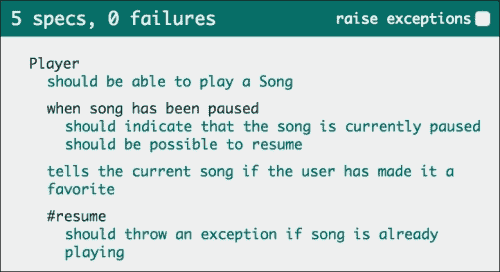

# 第一章. 使用 Jasmine 入门

对 JavaScript 开发者来说，这是一个激动人心的时代；技术已经成熟，网络浏览器更加标准化，每天都有新事物可以探索。JavaScript 已经成为一门成熟的语言，而网络是当今真正的开放平台。我们见证了单页网络应用的兴起，**模型-视图-控制器**（MVC）框架，如 Backbone.js 和 AngularJS 的普及，Node.js 在服务器端的 JavaScript 使用，甚至使用 PhoneGap 等技术完全用 HTML、JavaScript 和 CSS 创建的移动应用。

从最初处理 HTML 表单的朴素起点，到今天的大规模应用，JavaScript 语言已经走得很远，与之相伴的是，许多工具已经成熟，以确保你可以像使用任何其他语言一样，使用它达到相同的质量水平。

这本书是关于帮助你控制 JavaScript 开发的工具。

# JavaScript – 不好的一面

处理客户端 JavaScript 代码时存在许多复杂问题；最明显的一个问题是，你无法控制客户端的运行时。在服务器端，你可以运行你 Node.js 服务器的特定版本，但你无法强迫你的客户端运行最新版本的 Chrome 或 Firefox。

JavaScript 语言由 ECMAScript 规范定义；因此，每个浏览器都可以有自己的运行时实现，这意味着它们之间可能存在细微的差异或错误。

此外，你还会遇到语言本身的问题。布兰登·艾奇在 Netscape 的巨大管理压力下仅用 10 天就开发了 JavaScript。尽管它在简洁性、一等函数和对象原型方面做得很好，但它也试图使语言具有可塑性并允许其进化，这引入了一些问题。

每个 JavaScript 对象都是可变的；这意味着你无法阻止一个模块覆盖其他模块的部分。以下代码说明了覆盖全局 `console.log` 函数是多么简单：

```js
console.log('test');
>> 'test'
console.log = 'break';
console.log('test');
>> TypeError: Property 'log' of object #<Console> is not a function

```

这是在语言设计上做出的一个有意识的决定；它允许开发者对语言进行修改并添加缺失的功能。但鉴于这种强大的能力，犯错相对容易。

ECMA 规范的第五版引入了 `Object.seal` 函数，它可以在调用后防止对任何对象的进一步更改。但它的当前支持并不广泛；例如，Internet Explorer 只在它的第 9 版中实现了它。

另一个问题，是 JavaScript 处理类型的方式。在其他语言中，像 `'1' + 1` 这样的表达式可能会引发错误；在 JavaScript 中，由于一些不直观的类型强制规则，上述代码的结果是 `'11'`。但主要问题是其不一致性；在乘法运算中，字符串会被转换为数字，所以 `'3' * 4` 实际上是 `12`。

这可能导致在大表达式上出现一些难以发现的问题。假设你从服务器获取了一些数据，尽管你期望得到数字，但其中一个值却是一个字符串：

```js
var a = 1, b = '2', c = 3, d = 4;
var result = a + b + c * d;
```

前一个示例的结果是字符串`'1212'`。

这些只是开发者面临的两个常见问题。在本书中，你将应用最佳实践并编写测试，以确保你不会陷入这些以及其他陷阱。

# Jasmine 和行为驱动开发

Jasmine 是由 Pivotal Labs 的开发者创建的一个小型**行为驱动开发**（BDD）测试框架，允许你编写自动化的 JavaScript 单元测试。

但在我们继续前进之前，首先我们需要确保一些基本概念的正确性，从测试单元的定义开始。

测试单元是一段代码，用于测试应用程序代码的功能单元。但有时，理解功能单元可能有些棘手，因此，丹·诺斯（Dan North）提出了一个解决方案，即行为驱动开发（BDD），这是对**测试驱动开发**（**TDD**）的重新思考。

在传统的单元测试实践中，开发者只能得到一些关于如何开始测试过程、测试什么、测试应该有多大或者甚至如何调用测试的模糊指导。

为了解决这些问题，丹从标准的敏捷结构中借鉴了**用户故事**的概念，作为编写测试的模型。

例如，一个音乐播放器应用程序可能有一个验收标准，如下所示：

**Given**一个玩家，**when**歌曲被暂停，**then**应该指示歌曲当前处于暂停状态。

如以下列表所示，这个验收标准是按照一个基本模式编写的：

+   **Given**：这提供了一个初始上下文

+   **When**：这定义了发生的事件

+   **Then**：这确保了结果

在 Jasmine 中，这转化为一种非常表达性的语言，允许测试以反映实际业务价值的方式编写。前面编写的验收标准作为 Jasmine 测试单元将如下所示：

```js
describe("Player", function() {
  describe("when song has been paused", function() {
    it("should indicate that the song is paused", function() {

    });
  });
});
```

你可以看到标准如何很好地转换为 Jasmine 语法。在下一章中，我们将详细介绍这些函数的工作原理。

与其他 BDD 框架一样，使用 Jasmine，每个验收标准直接对应一个测试单元。因此，每个测试单元通常被称为**spec**，即规格的缩写。在本书的整个过程中，我们将使用这个术语。

# 下载 Jasmine

开始使用 Jasmine 实际上非常简单。

打开 Jasmine 网站[`jasmine.github.io/2.1/introduction.html#section-Downloads`](http://jasmine.github.io/2.1/introduction.html#section-Downloads)，下载**独立发布版**（本书中将使用版本 2.1.3）。

当你在 Jasmine 网站上时，你可能会注意到它实际上是一个执行其中包含的规格的实时页面。这是由 Jasmine 框架的简单性所实现的，允许它在最多样化的环境中执行。

在你下载了发行版并解压缩之后，你可以在浏览器中打开 `SpecRunner.html` 文件。它将显示一个示例测试套件的结果（包括我们之前展示的验收标准）：



这显示了在浏览器中打开的 SpecRunner.html 文件

这个 `SpecRunner.html` 文件是一个 Jasmine 浏览器规格运行器。它是一个简单的 HTML 文件，引用了 Jasmine 代码、源文件和测试文件。为了方便起见，我们将把这个文件简单地称为 **运行器**。

你可以通过在文本编辑器中打开它来看到它的简单性。它是一个小的 HTML 文件，引用了 Jasmine 源代码：

```js
<script src="img/jasmine.js"></script>
<script src="img/jasmine-html.js"></script>
<script src="img/boot.js"></script>
```

运行器引用了源文件：

```js
<script type="text/javascript" src="img/Player.js"></script>
<script type="text/javascript" src="img/Song.js"></script>
```

跑步者引用了一个特殊的 `SpecHelper.js` 文件，该文件包含在规格之间共享的代码：

```js
<script type="text/javascript" src="img/SpecHelper.js"></script>
```

运行器还引用了规格文件：

```js
<script type="text/javascript" src="img/PlayerSpec.js"></script>
```

### 小贴士

**下载示例代码**

你可以从你购买的所有 Packt 书籍的账户中下载示例代码文件。[`www.packtpub.com`](http://www.packtpub.com)。如果你在其他地方购买了这本书，你可以访问 [`www.packtpub.com/support`](http://www.packtpub.com/support) 并注册以直接将文件通过电子邮件发送给你。

Jasmine 框架设置在 `lib/jasmine-2.1.3/boot.js` 文件中，尽管它是一个庞大的文件，但其中大部分内容是关于设置实际发生情况的文档。建议你在文本编辑器中打开它并研究其内容。

虽然现在我们是在浏览器中运行规格，但在第八章 构建自动化 中，我们将使相同的规格和代码在 **无头浏览器**（如 PhantomJS）上运行，并将结果写入控制台。

无头浏览器是一个没有图形用户界面的浏览器环境。它可以是实际的浏览器环境，例如使用 WebKit 渲染引擎的 PhantomJS，或者是一个模拟的浏览器环境，例如 Envjs。

尽管本书没有涉及，但 Jasmine 也可以用来测试为 Node.js 等环境编写的服务器端 JavaScript 代码。

这种 Jasmine 的灵活性非常令人惊叹，因为你可以使用相同的工具来测试各种 JavaScript 代码。

# 摘要

在本章中，你看到了测试 JavaScript 应用程序的某些动机。我向你展示了 JavaScript 语言的常见陷阱以及 BDD 和 Jasmine 如何帮助你编写更好的测试。

你也看到了下载并开始使用 Jasmine 是多么简单。

在下一章中，你将学习如何用 BDD 思考并编写你的第一个规格。
