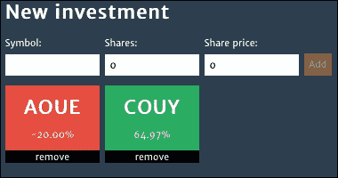
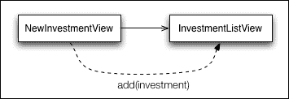
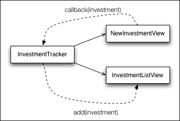
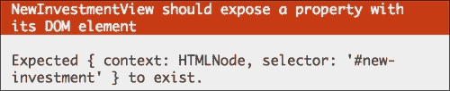
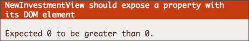

# 第三章：测试前端代码

测试 JavaScript 浏览器代码一直被认为很难，尽管在处理跨浏览器测试时有许多复杂性，但最常见的问题不是测试过程，而是应用代码本身不可测试。

由于浏览器文档中的每个元素都是全局可访问的，因此很容易编写一个处理整个页面的单一 JavaScript 代码块。这导致了一系列问题，其中最大的问题是很难进行测试。

在本章中，我们将了解如何编写可维护和可测试的浏览器代码的最佳实践。

为了实现用户界面，我们将使用 jQuery，这是一个知名的 JavaScript 库，它通过一个干净简单的 API 抽象了浏览器的 DOM，并在不同的浏览器中工作。

为了使编写规格说明更容易，我们将使用 Jasmine jQuery，这是一个向 Jasmine 添加新匹配器的 Jasmine 扩展，用于对 jQuery 对象进行断言。为了安装它及其 jQuery 依赖项，请下载以下文件：

+   [`raw.githubusercontent.com/velesin/jasmine-jquery/2.1.0/lib/jasmine-jquery.js`](https://raw.githubusercontent.com/velesin/jasmine-jquery/2.1.0/lib/jasmine-jquery.js)

+   [`raw.githubusercontent.com/velesin/jasmine-jquery/2.1.0/vendor/jquery/jquery.js`](https://raw.githubusercontent.com/velesin/jasmine-jquery/2.1.0/vendor/jquery/jquery.js)

将这些文件分别保存为`jasmine-jquery.js`和`jquery.js`，存放在`lib`文件夹中，并将它们添加到`SpecRunner.html`中，如下所示：

```js
<script src="img/jquery.js"></script>
<script src="img/jasmine-jquery.js"></script>
```

如至今所见，我们已创建了处理投资及其相关股票的独立抽象。现在，是时候开发这个应用的用户界面并取得良好的结果了，这完全是组织良好和良好实践的问题。

在编写前端 JavaScript 代码时，我们应用于服务器端代码的软件工程原则不应被忽视。考虑组件和适当的关注点分离仍然很重要。

# 从组件（视图）的角度思考

我们已经讨论了困扰大多数 Web 应用的单一 JavaScript 代码库，这些代码库是无法测试的。避免陷入这个陷阱的最佳方法是通过测试驱动的应用开发来编写代码。

考虑我们的投资跟踪应用的原型界面：



这展示了投资跟踪应用的原型界面

我们将如何实现它？很容易看出这个应用有两个不同的职责：

+   一个职责是添加投资

+   另一个职责是列出已添加的投资

因此，我们可以从将这个界面拆分为两个不同的组件开始。为了更好地描述它们，我们将借鉴**MVC 框架**（如`Backbone.js`）的概念，并称它们为**视图**。

所以，这就是它，在接口的最高级别，有两个基本组件：

+   `NewInvestmentView`: 这将负责创建新的投资

+   `InvestmentListView`: 这将是一个所有添加的投资列表

# 模块模式

因此，我们理解了如何拆分代码，但我们应该如何组织它？到目前为止，我们为每个新函数创建了一个文件。这是一个好的做法，我们将看到我们如何改进这一点。

让我们先思考一下我们的`NewInvestmentView`组件。我们可以遵循到目前为止使用的模式，创建一个新的文件，`NewInvestmentView.js`，并将其放置在`src`文件夹中，如下所示：

```js
(function ($, Investment, Stock) {
  function NewInvestmentView (params) {

  }

  this.NewInvestmentView = NewInvestmentView;
})(jQuery, Investment, Stock);
```

你可以看到，这个 JavaScript 文件比到目前为止展示的例子更健壮。我们已经在**立即调用的函数表达式**（**IIFE**）中包装了所有的`NewInvestmentView`代码。

它被称为 IIFE，因为它声明了一个函数并立即调用它，有效地创建了一个新的作用域来声明局部变量。

一个好的做法是在 IIFE 内部只使用局部变量。如果它需要使用全局依赖项，可以通过参数传递。在这个例子中，它已经将三个依赖项传递给`NewInvestmentView`代码：`jQuery`、`Investment`和`Stock`。

你可以在函数声明中看到这一点：

```js
function ($, Investment, Stock)
```

立即调用：

```js
})(jQuery, Investment, Stock);
```

这种做法的最大优点是，我们不再需要担心污染全局命名空间，因为我们声明的所有内容都在 IIFE 内部是局部的。这使得干扰全局作用域变得更加困难。

如果我们需要使任何内容成为全局的，我们可以通过将全局对象附加来实现，如下所示：

```js
this.NewInvestmentView = NewInvestmentView;
```

另一个优点是显式依赖项声明。通过查看文件的第一行，我们可以了解一个文件的所有外部依赖项。

虽然这种做法现在没有很大的优势（因为所有组件都被公开为全局的），但我们将看到如何在第八章 *构建自动化* 中从中受益。

这种模式也被称为**模块模式**，我们将在本书的其余部分使用它（尽管有时为了简化目的会省略）。

# 使用 HTML fixtures

继续开发`NewInvestmentView`组件，我们可以编写一些基本的验收标准，如下所示：

+   `NewInvestmentView`应允许输入股票代码

+   `NewInvestmentView`应允许输入股份

+   `NewInvestmentView`应允许输入股价

还有更多，但这是一个好的开始。

在`spec`文件夹中的新文件`NewInvestmentViewSpec.js`中为这个组件创建一个新的规范文件，然后我们可以开始翻译这些规范，如下所示：

```js
describe("NewInvestmentView", function() {
  it("should allow the input of the stock symbol", function() {
  });

  it("should allow the input of shares", function() {
  });

  it("should allow the input of the share price", function() {
  });
});
```

然而，在我们开始实施这些之前，我们首先必须理解**HTML fixtures**的概念。

测试固定文件提供了测试运行的基态。这可能是一个类的实例化、对象的定义或一段 HTML。换句话说，为了测试处理表单提交的 JavaScript 代码，在运行测试时我们需要有可用的表单。包含表单的 HTML 代码是一个 HTML 固定文件。

处理此要求的一种方法是在设置函数中手动附加所需的 DOM 元素，如下所示：

```js
beforeEach(function() {
  $('body').append('<form id="my-form"></form>');
});
```

然后，在拆卸过程中将其移除，如下所示：

```js
afterEach(function() {
  $('#my-form').remove();
});
```

否则，规格可能会在文档内部附加大量垃圾，这可能会干扰其他规格的结果。

### 小贴士

重要的是要知道，规格应该是独立的，并且它们可以以任何特定的顺序运行。因此，通常情况下，将规格完全独立于彼此处理。

更好的方法是，在文档中有一个容器，我们总是将 HTML 固定文件放在那里，如下所示：

```js
<div id="html-fixtures">
</div>
```

将代码更改为以下内容：

```js
beforeEach(function() {
  $('#html-fixtures').html('<form id="my-form"></form>');
});
```

这样，下次运行规格时，它会自动用其自己的内容覆盖之前的固定文件。

但是，随着固定文件变得更加复杂，这可能会很快变成难以理解的混乱：

```js
beforeEach(function() {
  $('#html-fixtures').html('<form id="new-investment"><h1>New  investment</h1><label>Symbol:<input type="text" class="new-investment-stock-symbol" name="stockSymbol"  value=""></label><input type="submit" name="add"  value="Add"></form>');
});
```

如果这个固定文件可以从外部文件加载，那岂不是很好？这正是 Jasmine jQuery 扩展程序通过其 **HTML 固定** 模块所做的事情。

我们可以将该 HTML 代码放在一个外部文件中，并通过简单的 `loadFixtures` 调用将其加载到文档中，如下所示：

```js
beforeEach(function() {
  loadFixtures('MyFixture.html');
});
```

默认情况下，扩展程序会在 `spec/javascripts/fixtures` 文件夹内查找文件（对于前面的示例，将是 `spec/javascripts/fixtures/MyFixture.html`），并在容器内加载其内容，如下所示：

```js
<div id="jasmine-fixtures">
  <form id="new-investment">
    <h1>New investment</h1>
    <label>
      Symbol:
      <input type="text" class="new-investment-stock-symbol" name="stockSymbol" value="">
    </label>
    <input type="submit" name="add" value="Add">
  </form>
</div>
```

我们还可以使用扩展程序的另一个全局函数来重新创建第一个示例。`setFixtures(html)` 函数接受一个参数，其中包含要放置在容器中的内容：

```js
beforeEach(function() {
  setFixtures('<form id="my-form"></form>');
});
```

其他可用的函数如下：

+   `appendLoadFixtures(fixtureUrl[, fixtureUrl, …])`：而不是覆盖固定容器的内容，它会将其附加到内容上

+   `readFixtures(fixtureUrl[, fixtureUrl, …])`：这个函数读取一个固定容器的内容，但不是将其附加到文档中，而是返回一个包含其内容的字符串

+   `appendSetFixtures(html)`：这与 `appendLoadFixtures` 相同，但使用 HTML 字符串而不是文件

Jasmine jQuery 固定模块缓存每个文件，因此我们可以在测试套件的速率下多次加载相同的固定文件，而不会受到惩罚。

它使用 AJAX 加载固定文件，有时，一个测试可能想要修改 JavaScript 或 jQuery AJAX 的内部工作方式，正如我们将在第六章（“Light Speed Unit Testing”）中看到的，这可能会破坏固定文件的加载。解决此问题的方法是使用 `preloadFixtures()` 函数在缓存中预加载所需的固定文件。

`preloadFixtures(fixtureUrl[, fixtureUrl, …])` 函数在缓存中加载一个或多个文件，但不将它们附加到文档中。

然而，在使用 HTML 时存在一个问题。Jasmine jQuery 使用 AJAX 加载 HTML 固定装置，但由于**同源策略**（**SOP**），现代浏览器在用`file://`协议打开`SpecRunner.html`时将阻止所有 AJAX 请求。

解决这个问题的方法是通过 HTTP 服务器提供 spec 运行器，如第四章异步测试 – AJAX 中所述。

目前，在 Chrome 中，可以通过**命令行界面**（**CLI**）参数`--allow-file-access-from-files`找到一个解决方案。

例如，在 Mac OS X 中，需要以下 bash 命令来以该标志打开 Chrome：

```js
$ open "Google Chrome.app" --args --allow-file-access-from-files

```

更多关于这个问题的细节可以在 GitHub 问题跟踪[`github.com/velesin/jasmine-jquery/issues/4`](https://github.com/velesin/jasmine-jquery/issues/4)中查看。

回到`NewInvestmentView`组件，我们可以借助这个 HTML 固定装置插件开始 spec 的开发。

在`spec`文件夹内创建一个名为`fixtures`的文件夹。根据模拟界面，我们可以在`fixtures`文件夹内创建一个新的 HTML 固定装置，名为`NewInvestmentView.html`，如下所示：

```js
<form id="new-investment">
  <h1>New investment</h1>
  <label>
    Symbol:
    <input type="text" class="new-investment-stock-symbol" name="stockSymbol" value="">
  </label>
  <label>
    Shares:
    <input type="number" class="new-investment-shares" name="shares" value="0">
  </label>
  <label>
    Share price:
    <input type="number" class="new-investment-share-price" name="sharePrice" value="0">
  </label>
  <input type="submit" name="add" value="Add">
</form>
```

这是一个 HTML 固定装置，因为它否则会被服务器渲染，JavaScript 代码将简单地附加到它并添加行为。

由于我们没有在插件的默认路径上保存这个固定装置，我们需要在`SpecHelper.js`文件的末尾添加一个新的配置，如下所示：

```js
jasmine.getFixtures().fixturesPath = 'spec/fixtures';
```

在`NewInvestmentSpec.js`文件中，添加一个调用以加载固定装置：

```js
describe("NewInvestmentView", function() {
  beforeEach(function() {
    loadFixtures('NewInvestmentView.html');
  });
});
```

最后，在添加`Stock.js`和`Investment.js`文件之后，将 spec 和源代码添加到运行器中，如下所示：

```js
<script src="img/NewInvestmentView.js"></script>
<script src="img/NewInvestmentViewSpec.js"></script>
```

# 基本视图编码规则

现在，是时候开始编写第一个视图组件的代码了。为了帮助我们完成这个过程，我们将为视图编码制定两个基本规则：

+   视图应该封装一个 DOM 元素

+   将视图与观察者集成

因此，让我们看看它们是如何单独工作的。

## 视图应该封装一个 DOM 元素

如前所述，视图是与 DOM 元素关联的行为，因此将此元素与视图相关联是有意义的。一个好的模式是在视图实例化时传递一个 CSS`选择器`，以指示它应该引用的元素。以下是`NewInvestmentView`组件的 spec：

```js
describe("NewInvestmentView", function() {
  var view;
  beforeEach(function() {
    loadFixtures('NewInvestmentView.html');
    view = new NewInvestmentView({
      selector: '#new-investment'
    });
  });
});
```

在`NewInvestmentView.js`文件的构造函数中，它使用 jQuery 获取此选择器的元素并将其存储在实例变量`$element`（来源）中，如下所示：

```js
function NewInvestmentView (params) {
  this.$element = $(params.selector);
}
```

为了确保这段代码能正常工作，我们应该在`NewInvestmentViewSpec.js`文件中为它编写以下测试：

```js
it("should expose a property with its DOM element", function() {
  expect(view.$element).toExist();
});
```

`toExist`匹配器是 Jasmine jQuery 扩展提供的自定义匹配器，用于检查元素是否存在于文档中。它验证 JavaScript 对象上属性的存在性，以及与 DOM 元素的关联是否成功。

将`selector`模式传递给视图允许它被实例化多次，以不同的文档元素。

明确关联的一个优点是知道这个视图不会改变文档中的其他任何内容，正如我们接下来将要看到的。

视图是与 DOM 元素关联的行为，因此它不应该在页面的任何地方胡乱操作。它应该只更改或访问与其关联的元素。

为了演示这个概念，让我们实现另一个关于视图默认状态的验收标准，如下所示：

```js
it("should have an empty stock symbol", function() {
  expect(view.getSymbolInput()).toHaveValue('');
});
```

`getSymbolInput`方法的简单实现可能会使用全局 jQuery 查找来找到输入并返回其值：

```js
NewInvestmentView.prototype = {
  getSymbolInput: function () {
    return $('.new-investment-stock-symbol')
  }
};
```

然而，这可能会导致问题；如果文档的另一个地方有相同类名的输入，它可能会得到错误的结果。

一个更好的方法是使用视图关联的元素来执行范围查找，如下所示：

```js
NewInvestmentView.prototype = {
  getSymbolInput: function () {
    return this.$element.find('.new-investment-stock-symbol')
  }
};
```

`find`函数将只查找`this.$element`的子元素。就像`this.$element`代表视图的整个文档一样。

由于我们将在视图代码的每个地方使用这个模式，我们可以创建一个函数并使用它，如下面的代码所示：

```js
NewInvestmentView.prototype = {
  $: function () {
    return this.$element.find.apply(this.$element, arguments);
  },
  getSymbolInput: function () {
    return this.$('.new-investment-stock-symbol')
  }
};
```

现在假设我们从应用程序的另一个地方想要更改`NewInvestmentView`表单输入的值。我们知道它的类名，所以这可能就像这样简单：

```js
$('.new-investment-stock-symbol').val('from outside the view');
```

然而，这种简单性隐藏了一个严重的封装问题。这一行代码正在创建与`NewInvestmentView`的实现细节应该分离的耦合。

如果另一个开发者更改`NewInvestmentView`，将输入类的名称从`.new-investment-stock-symbol`更改为`.new-investment-symbol`，那么这一行就会出错。

为了修复这个问题，开发者需要查看整个代码库中对该类名的引用。

一个更安全的做法是尊重视图并使用其 API，如下面的代码所示：

```js
newInvestmentView.setSymbol('from outside the view');
```

当实施时，它看起来如下所示：

```js
NewInvestmentView.prototype.setSymbol = function(value) {
  this.$('.new-investment-stock-symbol').val(value);
};
```

这样，当代码被重构时，只有一个地方需要执行更改——在`NewInvestmentView`实现内部。

由于浏览器文档中没有沙箱机制，这意味着从 JavaScript 代码的任何地方，我们都可以在文档的任何地方进行更改，因此除了良好的实践之外，我们几乎无法做任何事情来防止这些错误。

## 将视图与观察者集成

随着投资跟踪应用程序的开发，我们最终需要实现投资列表。但你是如何将`NewInvestmentView`和`InvestmentListView`集成的呢？

你可以为`NewInvestmentView`编写一个验收标准，如下所示：

给定新的投资视图，当其添加按钮被点击时，它应该将投资添加到投资列表中。

这种思考方式非常直接，从写作中我们可以看到我们正在在两个视图之间创建直接关系。将此转化为规范可以澄清这一认识，如下所示：

```js
describe("NewInvestmentView", function() {
  beforeEach(function() {
    loadFixtures('NewInvestmentView.html');
    appendLoadFixtures('InvestmentListView.html');

    listView = new InvestmentListView({
      id: 'investment-list'
    });

    view = new NewInvestmentView({
      id: 'new-investment',
      listView: listView
    });
  });

  describe("when its add button is clicked", function() {
    beforeEach(function() {
      // fill form inputs
      // simulate the clicking of the button
    });

    it("should add the investment to the list", function() {
      expect(listView.count()).toEqual(1);
    });
  });
});
```

这个解决方案在两个视图之间创建了一个依赖关系。`NewInvestmentView` 构造函数现在接收一个 `InvestmentListView` 实例作为其 `listView` 参数。

在其实施过程中，`NewInvestmentView` 在表单提交时会调用 `listView` 对象的 `addInvestment` 方法：

```js
function NewInvestmentView (params) {
  this.listView = params.listView;

  this.$element.on('submit', function () {
    this.listView.addInvestment(/* new investment */);
  }.bind(this));
}
```

为了更好地阐明这段代码的工作原理，以下是集成是如何进行的图示：



这显示了两个视图之间的直接关系。

虽然很简单，但这个解决方案引入了许多架构问题。首先，也是最明显的，是 `NewInvestmentView` 规范的复杂性增加。

其次，由于紧密耦合，这使得这些组件的演变变得更加困难。

为了更好地阐明最后一个问题，想象一下，在未来，我们还想在表格中列出投资。这将要求对 `NewInvestmentView` 进行更改以支持列表和表格视图，如下所示：

```js
function NewInvestmentView (params) {
  this.listView = params.listView;
  this.tableView = params.tableView;

  this.$element.on('submit', function () {
    this.listView.addInvestment(/* new investment */);
    this.tableView.addInvestment(/* new investment */);
  }.bind(this));
}
```

重新思考验收标准，我们可以得到一个更好、更具前瞻性的解决方案。让我们将其重写如下：

在投资跟踪器应用程序中，当创建新的投资时，它应该将投资添加到投资列表中。

通过验收标准，我们可以看到它引入了一个新的待测试主题：投资跟踪器。这暗示了新的源文件和规范文件。在相应地创建这两个文件并将它们添加到运行器之后，我们可以将此验收标准作为规范编写，如下面的代码所示：

```js
describe("InvestmentTracker", function() {
  beforeEach(function() {
    loadFixtures('NewInvestmentView.html');
    appendLoadFixtures('InvestmentListView.html');

    listView = new InvestmentListView({
      id: 'investment-list'
    });

    newView = new NewInvestmentView({
      id: 'new-investment'
    });

    application = new InvestmentTracker({
      listView: listView,
      newView: newView
    });
  });

  describe("when a new investment is created", function() {
    beforeEach(function() {
      // fill form inputs
      newView.create();
    });

    it("should add the investment to the list", function() {
      expect(listView.count()).toEqual(1);
    });
  });
});
```

我们可以看到之前在 `NewInvestmentView` 规范中曾有的相同设置代码。它加载了两个视图所需的固定数据，实例化了 `InvestmentListView` 和 `NewInvestmentView`，并创建了一个新的 `InvestmentTracker` 实例，将两个视图作为参数传递。

在后来描述行为 `when a new investment is created` 时，我们可以看到调用 `newView.create` 函数来创建新的投资。

之后，它通过检查 `listView.count()` 是否等于 `1` 来确认是否向 `listView` 对象添加了新项。

但集成是如何发生的呢？我们可以通过查看 `InvestmentTracker` 的实现来了解：

```js
function InvestmentTracker (params) {
  this.listView = params.listView;
  this.newView = params.newView;

  this.newView.onCreate(function (investment) {
    this.listView.addInvestment(investment);
  }.bind(this));
}
```

它使用 `onCreate` 函数在 `newView` 上注册一个观察函数作为回调。这个观察函数将在创建新投资时被调用。

`NewInvestmentView` 内部的实现相当简单。`onCreate` 方法将 `callback` 参数存储为对象的属性，如下所示：

```js
NewInvestmentView.prototype.onCreate = function(callback) {
  this._callback = callback;
};
```

`_callback` 属性的命名约定可能听起来有些奇怪，但将其作为私有成员的约定是一个好习惯。

虽然前置的下划线字符实际上不会改变属性的可见性，但它至少会通知用户这个对象，`_callback` 属性可能会在未来更改或甚至被删除。

当调用 `create` 方法时，它会调用 `_callback`，并将新的投资作为参数传递，如下所示：

```js
NewInvestmentView.prototype.create = function() {
  this._callback(/* new investment */);
};
```

一个更完整的实现需要允许多次调用 `onCreate`，并存储每个传递的回调。

这里是用于更好理解的解决方案图示：



使用回调来集成两个视图

在后面的 第七章，*测试 React.js 应用程序* 中，我们将看到 `NewInvestmentView` 规范的实现结果。

# 使用 jQuery 匹配器测试视图

除了其 HTML 固件模块之外，Jasmine jQuery 扩展还附带了一套自定义匹配器，这些匹配器有助于使用 DOM 元素编写期望。

如所示，使用这些自定义匹配器的最大优势是它们生成更好的错误信息。因此，尽管我们可以编写所有规范而不使用这些匹配器，但如果我们在出错时使用匹配器，我们会得到更多有用的信息。

为了更好地理解这个优势，我们可以回顾一下 `should expose a property with its DOM element` 规范的示例。在那里，它使用了 `toExist` 匹配器：

```js
it("should expose a property with its DOM element", function() {
  expect(view.$element).toExist();
});
```

如果这个规范失败，我们会得到一个如以下截图所示的错误信息：



这显示了自定义匹配器错误信息的示例

现在，我们重写这个规范，不使用自定义匹配器（仍然进行相同的验证）：

```js
it("should expose a property with its DOM element", function() {
  expect($(document).find(view.$element).length).toBeGreaterThan(0);
});
```

这次，错误信息变得不那么有信息量：



读取错误后，我们无法理解它真正测试的是什么

因此，每当可能的时候，使用这些匹配器来获取更好的错误信息。让我们通过一些示例来回顾一下可用的自定义匹配器，这些示例展示了 `NewInvestmentView` 类的验收标准：

+   `NewInvestmentView` 应该允许输入股票符号

+   `NewInvestmentView` 应该允许输入股份

+   `NewInvestmentView` 应该允许输入股价

+   `NewInvestmentView` 应该有一个空的股票符号

+   `NewInvestmentView` 应该将其股份值设置为零

+   `NewInvestmentView` 应该将其股价值设置为零

+   `NewInvestmentView` 的股票符号输入应该在获得焦点时

+   `NewInvestmentView` 不应该允许添加

重要的是要理解，尽管以下示例对于演示 Jasmine jQuery 匹配器的工作方式很有用，但它们实际上并没有测试任何 JavaScript 代码，只是测试了由 HTML 固件模块加载的 HTML 元素。

## toBeMatchedBy jQuery 匹配器

这个匹配器检查元素是否匹配传递的 CSS 选择器，如下所示：

```js
it("should allow the input of the stock symbol", function() {
  expect(view.$element.find('.new-investment-stock-symbol')).toBeMatchedBy('input[type=text]');
});
```

## toContainHtml jQuery 匹配器

此匹配器检查元素的内容是否与传递的 HTML 匹配，如下所示：

```js
it("should allow the input of shares", function() {
  expect(view.$element).toContainHtml('<input type="number" class="new-investment-shares" name="shares" value="0">');
});
```

## The toContainElement jQuery matcher

此匹配器检查元素是否包含任何匹配传递的 CSS 选择器的子元素，如下所示

```js
it("should allow the input of the share price", function() {
  expect(view.$element).toContainElement('input[type=number].new-investment-share-price');
});
```

## The toHaveValue jQuery matcher

仅对输入有效，此验证将预期值与元素的值属性进行比较，以下代码为：

```js
it("should have an empty stock symbol", function() {
  expect(view.$element.find('.new-investment-stock-symbol')).toHaveValue('');
});

it("should have its shares value to zero", function() {
  expect(view.$element.find('.new-investment-shares')).toHaveValue('0');
});
```

## The toHaveAttr jQuery matcher

此匹配器测试元素是否具有指定的名称和值的任何属性。以下示例展示了如何使用此匹配器测试输入的值属性，这可以用`toHaveValue`匹配器来编写预期：

```js
it("should have its share price value to zero", function() {
  expect(view.$element.find('.new-investment-share-price')).toHaveAttr('value', '0');
});
```

## The toBeFocused jQuery matcher

以下代码说明了如何检查输入元素是否聚焦：

```js
it("should have its stock symbol input on focus", function() {
 expect(view.$element.find('.new-investment-stock-symbol')).toBeFocused();
});
```

## The toBeDisabled jQuery matcher

此匹配器检查元素是否被禁用，以下代码为：

```js
function itShouldNotAllowToAdd () {
 it("should not allow to add", function() {
  expect(view.$element.find('input[type=submit]')).toBeDisabled();
});
```

## 更多匹配器

该扩展提供了更多可用的匹配器；请确保检查项目的文档，[`github.com/velesin/jasmine-jquery#jquery-matchers`](https://github.com/velesin/jasmine-jquery#jquery-matchers)。

# 摘要

在本章中，你了解到一旦通过测试驱动应用程序开发，测试可以变得多么简单。你看到了如何使用模块模式更好地组织项目代码，以及视图模式如何帮助创建更易于维护的浏览器代码。

你学习了如何使用 HTML 固定文件，使你的规格更加可读和易懂。我还展示了如何通过使用自定义 jQuery 匹配器来测试与浏览器 DOM 交互的代码。

在下一章中，我们将更进一步，开始测试服务器集成和异步代码。
