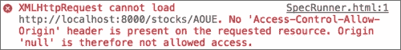

# 第四章. 异步测试 – AJAX

在每个 JavaScript 应用程序中，不可避免地会有一个时刻需要测试异步代码。

异步意味着你不能以线性方式处理它——一个函数可能在执行后立即返回，但结果会在稍后到来，通常是通过回调。

在处理 AJAX 请求时，这是一个非常常见的模式，例如，通过 jQuery：

```js
$.ajax('http://localhost/data.json', {
  success: function (data) {
    // handle the result
  }
});
```

在本章中，我们将学习 Jasmine 允许我们以不同方式编写异步代码测试的不同方法。

# 验收标准

为了展示 Jasmine 对异步测试的支持，我们将实现以下验收标准：

股票在取回时，应更新其股价

使用我们至今为止向您展示的技术，您可以在`spec`文件夹中的`StockSpec.js`文件中编写以下验收标准：

```js
describe("Stock", function() {
  var stock;
  var originalSharePrice = 0;

  beforeEach(function() {
    stock = new Stock({
      symbol: 'AOUE',
      sharePrice: originalSharePrice
    });
  });

  it("should have a share price", function() {
    expect(stock.sharePrice).toEqual(originalSharePrice);
  });

  describe("when fetched", function() {
 var fetched = false;
 beforeEach(function() {
 stock.fetch();
 });

 it("should update its share price", function() {
 expect(stock.sharePrice).toEqual(20.18);
 });
 });
});
```

这将导致在`src`文件夹中的`Stock.js`文件中实现`fetch`函数，如下所示：

```js
Stock.prototype.fetch = function() {
  var that = this;
  var url = 'http://localhost:8000/stocks/'+that.symbol;

  $.getJSON(url, function (data) {
    that.sharePrice = data.sharePrice;
  });
};
```

上述代码中的重要部分是`$.getJSON`调用，一个期望包含更新股价的 JSON 响应的 AJAX 请求，如下所示：

```js
{
  "sharePrice": 20.18
}
```

到目前为止，你可以看到我们陷入了困境；为了运行此规范，我们需要一个正在运行的服务器。

# 设置场景

由于这本书全部关于 JavaScript，我们将创建一个非常简单的**Node.js**服务器，用于规范测试。Node.js 是一个允许使用 JavaScript 开发网络应用程序的平台，例如 Web 服务器。

在第六章中，我们将看到测试 AJAX 请求而不需要服务器的替代解决方案。在第八章中，我们将看到如何将 Node.js 作为高级构建系统的基础。

## 安装 Node.js

如果您已经安装了 Node.js，您可以跳到下一节。

提供了适用于 Windows 和 Mac OS X 的安装程序。按照以下步骤安装 Node.js：

1.  前往 Node.js 网站[`nodejs.org/`](http://nodejs.org/)。

1.  点击**安装**按钮。

1.  下载完成后，运行安装程序并按照步骤操作。

要检查其他安装方法和有关如何在 Linux 发行版上安装 Node.js 的说明，请查看官方文档[`github.com/joyent/node/wiki/Installing-Node.js-via-package-manager`](https://github.com/joyent/node/wiki/Installing-Node.js-via-package-manager)。

完成后，你应该可以在命令行上使用`node`和`npm`命令。

## 编写服务器代码

为了学习如何编写异步规范，我们将创建一个返回一些假数据的服务器。在项目的根目录中创建一个名为`server.js`的新文件，并将其中的以下代码添加到该文件中：

```js
var express = require('express');
var app = express();

app.get('/stocks/:symbol', function (req, res) {
  res.setHeader('Content-Type', 'application/json');
  res.send({ sharePrice: 20.18 });
});

app.use(express.static(__dirname));

app.listen(8000);
```

为了处理 HTTP 请求，我们使用 **Express**，一个 Node.js 网络应用程序框架。通过阅读代码，您可以看到它定义了一个到 `/stocks/:symbol` 的路由，因此它接受 `http://localhost:8000/stocks/AOUE` 这样的请求，并返回 JSON 数据。

我们还使用 `express.static` 模块在 `http://localhost:8000/SpecRunner.html` 上提供规范运行器。

有一个绕过 SOP 的要求。这是一项政策，出于安全原因，规定 AJAX 请求不允许在与应用程序不同的域上执行。

这个问题是在使用 HTML 固定值时首次在 第三章 *测试前端代码* 中演示的。

使用 Chrome 浏览器检查器，您可以在使用 `file://` 协议打开 `SpecRunner.html` 文件时在控制台中看到错误（基本上，这就是您到目前为止一直在做的方式）：



这显示了相同的源策略错误

通过提供运行器，以及所有应用程序和测试代码在相同的基 URL 下，我们防止了这个问题发生，并且能够在任何浏览器上运行规范。

## 运行服务器

要运行服务器，首先您需要使用 Node 的包管理器安装其依赖项（Express）。在应用程序根文件夹内，运行 `npm` 命令：

```js
$ npm install express

```

此命令将下载 Express 并将其放置在项目文件夹内名为 `node_modules` 的新文件夹中。

现在，您应该能够通过调用以下 `node` 命令来运行服务器：

```js
$ node server.js

```

要检查它是否工作，请在您的浏览器中输入 `http://localhost:8000/stocks/AOUE`，您应该会收到 JSON 响应：

```js
{"sharePrice": "20.18"}
```

现在我们已经让服务器依赖项工作正常，我们可以回到编写规范。

# 编写规范

服务器运行后，在 `http://localhost:8000/SpecRunner.html` 上打开您的浏览器，以查看我们的规范结果。

您可以看到，尽管服务器正在运行，规范看起来似乎是正确的，但它失败了。这是因为 `stock.fetch()` 是异步的。对 `stock.fetch()` 的调用会立即返回，允许 Jasmine 在 AJAX 请求完成之前运行预期：

```js
it("should update its share price", function() {
  expect(stock.sharePrice).toEqual(20.18);
});
```

要修复这个问题，我们需要接受 `stock.fetch()` 函数的异步性，并指导 Jasmine 在运行预期之前等待其执行。

## 异步设置和清理

在所显示的示例中，我们在规范的设置阶段（`beforeEach` 函数）中调用 `fetch` 函数。

我们需要做的唯一一件事是，为了识别这个设置步骤是异步的，将其函数定义中添加一个 `done` 参数：

```js
describe("when fetched", function() {
  beforeEach(function(done) {

  });

  it("should update its share price", function() {
    expect(stock.sharePrice).toEqual(20.18);
  });
});
```

一旦 Jasmine 识别出这个 `done` 参数，它就会传递一个函数作为异步操作完成后必须调用的值。

因此，我们可以将这个 `done` 函数作为 `fetch` 函数的 `success` 回调传递：

```js
beforeEach(function(done) {
  stock.fetch({
 success: done
 });
});
```

在实现中，在 AJAX 操作完成后调用它：

```js
Stock.prototype.fetch = function(params) {
  params = params || {};
  var that = this;
  var success = params.success || function () {};
 var url = 'http://localhost:8000/stocks/'+that.symbol;

  $.getJSON(url, function (data) {
    that.sharePrice = data.sharePrice;
 success(that);
  });
};
```

这就是全部内容；Jasmine 将等待 AJAX 操作完成，然后测试将通过。

当需要时，也可以使用相同的`done`参数来定义异步的`afterEach`。

## 异步规格说明

另一种方法是在异步设置中有一个异步的规格说明。为了演示这将如何工作，我们需要重写我们之前的验收标准：

```js
describe("Stock", function() {
  var stock;
  var originalSharePrice = 0;

  beforeEach(function() {
    stock = new Stock({
      symbol: 'AOUE',
      sharePrice: originalSharePrice
    });
  });

  it("should be able to update its share price", function(done) {
    stock.fetch();
    expect(stock.sharePrice).toEqual(20.18);
  });
});
```

再次强调，我们只需将其函数定义中添加一个`done`参数，并在测试完成后调用`done`函数即可：

```js
it("should be able to update its share price", function(done) {
  stock.fetch({
    success: function () {
      expect(stock.sharePrice).toEqual(20.18);
      done();
    }
  });
});
```

这里的不同之处在于，我们必须将期望它完成的操作移动到在调用`done`函数之前的`success`回调中。

## 超时

当编写异步规格说明时，Jasmine 默认会等待 5 秒钟，直到`done`回调被调用，如果在此超时之前没有调用，则规格说明将失败。

在这个假设的例子中，服务器是一个简单的存根，返回静态数据，那个超时并没有问题，但有些情况下，默认时间不足以完成异步任务。

虽然不建议有长时间运行的规格说明，但了解可以通过更改 Jasmine 中称为`jasmine.DEFAULT_TIMEOUT_INTERVAL`的简单配置变量来绕过这种默认行为，这很好。

要在整个套件中使其生效，可以在`SpecHelper.js`文件中设置它，如下所示：

```js
beforeEach(function() {
  jasmine.DEFAULT_TIMEOUT_INTERVAL = 10000;

  jasmine.addMatchers({
    // matchers code
  });
});

jasmine.getFixtures().fixturesPath = 'spec/fixtures';
```

要使其在一个特定的规格说明中生效，请在`beforeEach`中更改其值，并在`afterEach`期间恢复它：

```js
describe("Stock", function() {
 var defaultTimeout;

  beforeEach(function() {
 defaultTimeout = jasmine.DEFAULT_TIMEOUT_INTERVAL;
 jasmine.DEFAULT_TIMEOUT_INTERVAL = 10000;
  });

  afterEach(function() {
 jasmine.DEFAULT_TIMEOUT_INTERVAL = defaultTimeout;
  });

  it("should be able to update its share price", function(done) {

  });
});
```

# 摘要

在本章中，您已经了解了如何测试异步代码，这在测试服务器交互（AJAX）时是一个常见的场景。

我还向您介绍了 Node.js 平台，并使用它编写了一个简单的服务器，用作测试工具。

在第六章中，*光速单元测试*，我们将看到不同的 AJAX 测试解决方案——这些解决方案不需要运行服务器。

在下一章中，我们将学习关于间谍的知识，以及我们如何使用它们来执行行为检查。
