# 第一章. 使用 KnockoutJS 入门

欢迎来到 KnockoutJS 世界中的力量与奇迹。在本章中，我们将开始踏上使用 AJAX HTML 应用程序的道路。本章将重点关注：

+   安装 KnockoutJS

+   理解 MVVM 的含义

+   使用 Knockout 库绑定元素

+   使用现代浏览器中的开发者工具加速和简化编码

+   使用 Knockout 创建消费函数

+   使用 Knockout 直接自动化值的计算

+   在 Knockout 之外使用函数

# 安装 KnockoutJS

首先，确保你在服务器上设置了一个可以正常工作的网站。如果你只想学习那些功能，或者使用任何现成的生产型网络平台（如 ASP.NET、ColdFusion/Railo、NodeJS、PHP、Python、Ruby 等），它可以是简单的 HTML；只需在安装 Knockout 之前确保服务正在运行。然而，有一个例外。如果你使用 Knockout 为 PhoneGap 或类似的应用程序创建 HTML 应用程序，那么你不需要 Web 服务器来处理内部功能。

安装 Knockout 有多种方式。你需要选择最适合你的方式。本书文件已被打包成一个 ZIP 文件，可在 [`knockout.developers.zone/books/knockout-js-web-development/`](http://knockout.developers.zone/books/knockout-js-web-development/) 下载。点击链接下载产品的当前稳定版本。如果有任何需要修复的，我们将保持更新。我们还会在该页面上创建一个视频，展示如何在 Mac 和 Windows 上至少安装这些内容。

如果你直接从 Knockout 网站下载页面 [`knockoutjs.com`](http://knockoutjs.com)，将文本复制并粘贴到你的网站文件夹中的 JS 文件中。

现在，可能还有其他人将来会使用更复杂的工具。有几个包安装器会拉取所需的文件。如果你使用这些工具来安装本书，请检查 KnockoutJS 的版本是否为 3.2 或更高。我建议除非你已经熟悉它们，否则现在不要使用这些工具。了解它们是有价值的，但不是运行 Knockout 所必需的。

我的示例中包含了 Bootstrap 库，因为我想要改善展示效果，并为本书的页面赋予独特的个性，这也可以说成是使创建这个资源对我而言更加有趣的一种方式。

我将本书中的所有示例和练习链接到网站根目录。我建议你在那里学习如何使用 Knockout，并在转向基于 Web 的应用程序开发时使用这些知识。

文件加载完成后，你应该能够点击几个示例。我的一个目标是将课程设置得如此，以便你在完成课程后，需要查找如何使用 Knockout 做不同事情时，可以将此作为快速参考文档。

您的工作页面应该放在与本书章节编号相匹配的适当文件夹中。我已经在`done`文件夹中创建了完整的工作示例，您的应该放在对应章节编号下的`do`文件夹中。

# 查看 MVVM

MVVM 是一种构建软件的设计方法。这个名字有点令人困惑，会让你想知道他们是否试图清晰表达，或者只是喜欢这些字母创造的对称性。这种设计模式在微软和苹果的开发产品中被广泛使用。

**MVVM**代表**模型-视图-视图模型**。

让我们从**视图**开始。这是 HTML 被转换为**文档对象模型**（**DOM**）的地方。

视图与一个名为 ViewModel 的对象交互。**ViewModel**是存储展示逻辑的地方。**Model**是存储数据和业务逻辑的部分。这通常以 JSON 对象的形式传递到浏览器中。

让我们澄清一个令人困惑的点。当绘制图表时，大多数人会将关系绘制为 View-ViewModel-Model，这将变成 VVMM。不要陷入语义的陷阱；只需看看以下图表，了解他们所说的 MVVM 是什么意思：

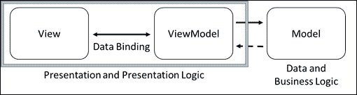

您的数据存储在 Model 中，但您并不直接与数据交互。您使用 ViewModel 与数据交互。您还应该注意，您不需要成为 MVVM 模式的专家，因为在实践中这些概念非常简单。这一点的证据就是将元素绑定到 ViewModel 的简单性。

# 使用 Knockout 绑定 DOM 元素

将您的视图元素绑定到 ViewModel 有两种基本方法。您可以通过元素的`data-bind`属性绑定，或者使用 JavaScript 中的友好代码。让我们首先在`\ko\ko-1\do\`文件夹中创建一个名为`binding.htm`的页面。以下是本书中所有`do`页面的基本标准代码：

```js
<!DOCTYPE html>
<html lang="en">
<head> 
</head>
<body>
<script src="img/knockout.js"></script>
<script type="text/javascript">
var viewModel = {
}
ko.applyBindings(viewModel);
</script>
</body>
</html>
```

### 提示

**下载示例代码**

您可以从[`www.packtpub.com`](http://www.packtpub.com)下载示例代码文件，以获取您购买的所有 Packt Publishing 书籍。如果您在其他地方购买了这本书，您可以访问[`www.packtpub.com/support`](http://www.packtpub.com/support)并注册，以便将文件直接通过电子邮件发送给您。

使用 Knockout 的第一步是包含库的 JS 文件。然后我们需要创建 ViewModel。在这个时候，ViewModel 类似于一个类文件，因为它在我们使用 Knockout 的`applyBindings`方法绑定之前不做任何事情。对于 Knockout 来说，Model 的名称并不重要，只要它不与 JS 或其他当前运行的库冲突即可。

## 绑定文本

要将文本绑定到 ViewModel，请按照以下步骤操作：

1.  将以下代码添加到 ViewModel 中：

    ```js
    var viewModel = {
      myVariable: ko.observable()}
    ```

1.  我们将使用`data-bind`属性来告诉 Knockout 如何通过 ViewModel 绑定我们的数据。我们将此 DOM 元素的文本属性绑定到 ViewModel 变量`myVariable`。在`body`标签后添加以下代码：

    ```js
    My first KnockoutJS uses text binding: <span data-bind="text: myVariable"></span>
    <hr>
    ```

1.  现在我们已经准备好运行代码。当你查看浏览器中的代码时，似乎没有任何事情发生。这是因为 ViewModel 变量没有分配任何值，所以没有东西被注入到视图中。它在浏览器窗口中给出了以下文本：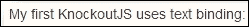

1.  让我们在绑定 ViewModel 的脚本中的下一行添加一行：

    ```js
    ko.applyBindings(viewModel);
    viewModel.myVariable("Awesome simple!");
    ```

代码给出了要分配的值，当我们运行页面时，它显示了绑定到 DOM 元素的数据。以下文本是浏览器窗口中的输出：

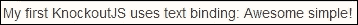

在这里，我们可以看到当变量更新时，HTML DOM 元素的文本属性也更新了。没有必要直接更新 HTML DOM 元素，因为 Knockout 的 ViewModel 功能自动化了这一功能。在大型和复杂的数据集中，Knockout 已被测试为最快的绑定库。当然，这种考虑可能会随时间而改变。

## 绑定 HTML

要将 HTML 绑定到 ViewModel，请使用以下步骤：

1.  将 HTML 代码添加到 ViewModel 中：

    ```js
    var viewModel = {
      myVariable: ko.observable(),
      myHTML: ko.observable()
    }
    ```

1.  在绑定 ViewModel 之后设置`myHTML`变量的值：

    ```js
    viewModel.myVariable("Awesome simple!");
    viewModel.myHTML("<strong>Awesome</strong> simple!");
    ```

1.  现在，我们需要绑定 DOM 元素的 HTML 属性。正如你所看到的，语法与我们上次使用的文本绑定非常相似：

    ```js
    My second KO uses HTML binding:
    <div data-bind="html: myHTML"></div>
    <hr>
    ```

如果我们将 HTML 传递给文本元素，它将无法正确显示，这就是为什么 DOM 有一个特定的 HTML 属性用于适当的标签。当我们使用文本方法时，Knockout 会转义结果，并使用 HTML 将结果放置在编辑器中看起来一样。HTML 属性并不总是存在于文本属性存在时，但当我们在这个点上找到 HTML 时，可以相当安全地假设文本确实存在。当我们再次渲染时，Knockout 将文本渲染如下所示：

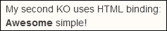

## 绑定 CSS

要将 CSS 绑定到 ViewModel，请按照以下步骤操作：

1.  将`myLeft`和`myRight`变量添加到 ViewModel 中：

    ```js
    var viewModel = {
      myVariable: ko.observable()
      ,myHTML: ko.observable()
      ,myLeft: ko.observable()
      ,myRight: ko.observable()
    }
    ```

1.  在绑定 ViewModel 之后设置`myLeft`和`myRight`变量的值：

    ```js
    viewModel.myVariable("Awesome simple!");
    viewModel.myHTML("<strong>Awesome</strong> simple!");
    viewModel.myLeft("pullLeft");
    viewModel.myRight("pushRight");

    ```

1.  使用 CSS 属性到`data-bind`设置，通过 ViewModel 动态管理 CSS。这可以在任何时候更改，元素会根据浏览器如何响应这些 CSS 设置来反映 CSS 设置。

    ```js
    <div data-bind="css: myLeft">LEFT&nbsp;</div>
    <div data-bind="css: myRight">&nbsp;RIGHT</div>
    My third KO uses CSS binding:
    <hr>
    ```

当我们再次渲染时，Knockout 将文本渲染如下所示：


## 绑定数字

以下步骤将解释如何将数字绑定到 ViewModel：

1.  将以下代码添加到 ViewModel 中：

    ```js
    var viewModel = {
      myVariable: ko.observable()
      ,myHTML: ko.observable()
      ,myLeft: ko.observable()
      ,myRight: ko.observable()
      ,myBalance: ko.observable()
    }
    ```

1.  在绑定 ViewModel 之后设置`myBalance`变量的值：

    ```js
    viewModel.myVariable("Awesome simple!"); 
    viewModel.myHTML("<strong>Awesome</strong> simple!");
    viewModel.myLeft("pullLeft");
    viewModel.myRight("pushRight");
    viewModel.myBalance(-47.23);

    ```

在这里，我们探索我们的第一个`data-bind`，我们通过 HTML 标记同时绑定到多个设置。请注意，我们还用额外的外部元素包装了该元素，以便我们可以根据余额是否为负来设置颜色。当我们这样做时，我们可以在设置中插入一些 JavaScript。当使用 JavaScript 时，我们将其作为函数而不是变量来引用`myBalance`，因为这是我们与 JavaScript 交互的方式。请看以下代码：

```js
My fourth KO uses Style binding:<br>
Balance = <span data-bind="style: { color: myBalance() < 0 ? 'red' : 'black' }"><span data-bind="text:myBalance"></span></span>
<hr>
```

当我们再次渲染时，Knockout 将文本渲染如下：

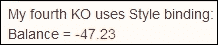

## 管理可见性

要管理 ViewModel 中元素的可见性，请使用以下步骤：

1.  将以下代码添加到 ViewModel 中：

    ```js
    var viewModel = {
      myVariable: ko.observable()
      ,myHTML: ko.observable()
      ,myLeft: ko.observable()
      ,myRight: ko.observable()
      ,myBalance: ko.observable()
      ,isVisible: ko.observable()
    }
    ```

1.  在 ViewModel 绑定后设置`isVisible`变量的值：

    ```js
    viewModel.myVariable("Awesome simple!"); 
    viewModel.myHTML("<strong>Awesome</strong> simple!");
    viewModel.myLeft("pullLeft");
    viewModel.myRight("pushRight");
    viewModel.myBalance(-47.23);
    viewModel.isVisible(true);

    ```

1.  脚本可以是一个非常强大的技术，随着 Knockout 技能的提升而使用。它可以增加自动化和用户体验的价值。在`body`标签后插入以下代码：

    ```js
    My fifth KO uses visible binding:
    <div data-bind="visible: isVisible">Warning, the visible property is set to true.</div>
    <hr>
    ```

当我们再次渲染时，Knockout 将文本渲染如下。当然，尝试将值更改为`false`并再次运行，以查看它是否正确地为您工作。

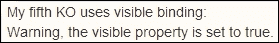

## 多绑定控件

这次 ViewModel 不需要更新，因为我们讨论的技术是从 HTML DOM 元素侧管理的。我们需要设置颜色和文本的`data-bind`变量的值如下：

```js
viewModel.myVariable("Awesome simple!");
viewModel.myHTML("<strong>Awesome</strong> simple!");

```

在这里，我们探索我们的第一个`data-bind`，我们通过 HTML 标记同时绑定到多个设置。使用括号形式，我们在标记中嵌入了少量的 JavaScript。再次提醒，当您使用 JavaScript 功能时，您必须将 ViewModel 属性作为函数而不是变量来处理。这对于新 Knockout 开发者来说是一个常见的疏忽。以下是添加到`body`标签后的代码：

```js
My sixth KO uses multi-binding:
Balance = <span data-bind="style: { color: myBalance() < 0 ? 'red' : 'black' },text:myBalance"></span>
```

当我们再次渲染时，Knockout 将文本渲染如下：

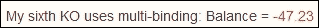

尝试更改数字并运行它，以使数字显示黑色和红色，当然，这取决于代码中正确的数字设置。您甚至可以选择更改逻辑。

# 使用浏览器开发者工具进行功率开发

我建议使用 Google Chrome 中的工具来阅读这本书。第一个真正做得好的工具是 Firefox 中的**Firebug**工具。Firebug 仍然是一个很好的工具，Firebug 内置的开发者工具已经取得了巨大的进步。如果您是 Mac 用户，您也应该享受使用 Safari 中的工具。如果您是 Internet Explorer 的忠实粉丝，他们在开发者工具方面也做得很好。我的观点是，最好在所有地方都使用开发者工具，所以不要找借口不使用您正在使用的浏览器的开发者工具。

### 注意

如果你正在工作或想要学习如何构建 Chrome 扩展和应用程序，那么以下是如何启用开发者模式的方法。在 Chrome 浏览器中，点击地址栏旁边的菜单按钮。这是一个有三个线条堆叠在一起的图标。在侧边选择项下，点击**扩展**，你会在右上角看到一个**开发者模式**的复选框。在 Google 上搜索更多详细信息，因为这只是一个激发你兴趣的小贴士。

当在 Chrome 浏览器中时，你只需按 PC 上的*F12*键或在 Mac 上使用 Command + *Alt* + *I*来加载开发者工具。你还可以通过查看 Chrome 菜单来找到它们。这个按钮位于地址栏的右侧，有三个堆叠的线条。在**更多工具**下，你会看到开发者工具的选项。

你可以在那里看到 Windows、Mac，甚至是 Chrome OS 上的浏览器。当你点击它时，以下窗口会出现在浏览器底部：

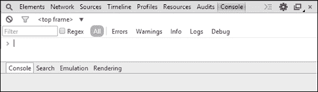

我们不会深入探讨这个工具的所有功能，因为这需要整整一本书来介绍。我们只是会关注几个关键功能，这样在学习 Knockout 的同时更容易调试你的代码。你可能想要将工具从浏览器底部分离出来。要做到这一点，点击右上角关闭（**x**）按钮旁边的堆叠框。这会使工具出现在一个单独的窗口中。

目前我们主要关注的是控制台，所以如果你没有选中它，请点击开发者工具顶部的控制台。这会给你一个看起来非常类似于命令行提示符的提示。当你开始输入文本时，如果浏览器 DOM 中有活动变量或结构，它将带有代码提示将其显示出来。

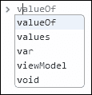

选择**viewModel**然后按住句号。注意在提示中列出了你创建的所有模型属性，以及一些其他变量设置。选择**viewModel.myHtml**然后按*Enter*键。你看到的是一个函数。要获取所需的结果，需要在变量末尾添加括号——例如，**viewModel.myHtml()**——然后再次尝试。你可以全部重新输入，也可以使用上下箭头在所需的命令提示符条目之间循环，如果需要的话。这会返回 ViewModel 变量设置中当前持有的值。

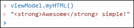

现在我们将其提升到下一个层次，并直接从命令提示符使用相同的变量来更改值。我们需要做的是在按下*Enter*键时密切注意屏幕，因为我们可以看到通过 ViewModel 将数据绑定到视图的强大功能。在命令提示符中输入以下内容：

```js
viewModel.myHTML("Knockout is <strong>Awesome</strong>!")
```

你应该看到的是我们输入的第二个绑定的 HTML 自动更新。这是一个比传统的 JavaScript 更容易与 View 一起工作的方法。对于那些想知道的人来说，它也非常兼容 jQuery。它可以与各种库一起使用，尽管在考虑它们是否匹配之前，你应该小心检查它们，以确保它们是一个好的组合。

### 注意

你还应该注意，虽然我们一直在将我们的 ViewModel 命名为`viewModel`，但它可以是任何有效的变量名。我们这样做只是为了帮助强化这个概念，即这是我们 ViewModel 的变量。

现在让我们使用命令控制台中的计算平衡。让我们尝试输入以下内容：

```js
viewModel.myBalance()*2 
```

当我们这样做时，我们应该得到-94.46 作为结果，或者如果你输入了不同的数字，则可能是另一个数字。

## Knockout 调试器

当你在**元素**视图中时，这是 Knockout 上下文显示的内容：

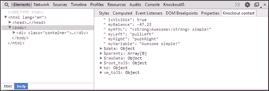

该插件可在 Chrome Web Store 中找到。这是一个很棒的商店，许多值得拥有的项目都是免费的。其中之一是**KnockoutJS 上下文调试器**，它是在 MIT 许可下发布的。这个工具的源代码在 GitHub 上，如果你处理大型嵌套 ViewModel 时，这非常有用。它具有几个功能，在学习 Knockout 和用它构建网站时提供了极大的便利。要下载此插件，请按照以下步骤操作：

1.  前往[`chrome.google.com/webstore/`](https://chrome.google.com/webstore/)。

1.  在搜索框中输入`knockout`。

1.  在**扩展**部分，你应该能看到 timstuyckens 的**Knockoutjs 上下文调试器**。

另一件在处理 Knockout 或任何数据绑定库时会有所帮助的事情是追踪正在发生的事情的能力。但这个工具将我们的能力扩展到了这个能力之外。从开发者工具的顶部选择**KnockoutJS**，你会看到一个写着**启用跟踪**的按钮。点击它，然后转到**控制台**标签。现在输入以下代码，你将看到所有对 DOM 的更改都会在控制台窗口中显示出来：

```js
for(i=0;i<10;i++){viewModel.myBalance(1.1*i);}
```

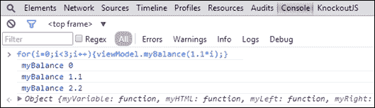

## 快捷键

对于那些从未在浏览器中打开开发者工具的人来说，这可能是一个很大的进步，但让我们看看一些可以使使用这些工具的工作变得更好的事情。其中之一就是快捷键。就在打开工具到它们自己的窗口或将它们放回浏览器窗口底部部分的按钮旁边，有一个**设置**按钮。点击它，你会看到三个侧菜单项。最后一个是**快捷键**。浏览一下这个，它将帮助所有快捷键爱好者更快地完成任务。你还可以在[`developer.chrome.com/devtools/docs/shortcuts`](https://developer.chrome.com/devtools/docs/shortcuts)找到完整的快捷键列表，你可以将其打印出来，或者也许只是将页面添加到书签中。

### DOM 检查

在包含我们`div`标签中“LEFT”内容的浏览器窗口中，右键单击它并选择**检查元素**。（在 Mac 上，您可以使用双指进行右键单击。）这会选择该元素，您将能够看到该元素可能存在的任何`data-bind`属性设置以及任何其他 DOM 功能。

您甚至可以与 DOM 玩耍，并在元素面板内部双击以实时编辑 DOM。实时编辑是我最喜欢的功能之一。您需要理解的是，当您通过脚本实例化它时，视图绑定到 ViewModel。您不能通过在该面板中编辑 DOM 代码来更改这一点。您还可以以惊人的方式编辑页面上的 CSS 和 JavaScript 进行测试和调试，在我看来，这是必须学习的开发者技能。

### AJAX 检查

当我处理 AJAX 时，这是一个不可或缺的工具，可以查看使用**网络**选项卡发送和返回的内容。您可以看到列表中有一个 XHR 项目，它允许您查看在页面工作中出现的单个请求。

### 资源检查

我们在 SOSensible 公司，我的公司，构建了各种网络应用程序。一种网络应用程序允许用户使用网络应用程序离线。我们需要在基于浏览器的数据库存储中存储数据，而这个工具让我们能够在**资源**选项卡下检查所有这些资源。

### 设备模拟

在开发者工具的底部部分，有一个名为抽屉的选项。如果它没有显示，右上角的菜单按钮有一个按钮可以隐藏或显示抽屉。一旦可见，您将有一个**模拟**菜单项。这可以让您刷新屏幕，以显示特定设备大小和旋转的视图的近似效果。

侧边栏中还有一些项目可以帮助其他功能。有一个名为**设备**的设置，用于选择要模拟的设备。有一个名为**屏幕**的设置，用于管理旋转以及您可能想要定制的许多其他功能。还有一个**用户代理**，可以欺骗服务器，使其认为它是一个不同的设备。最后，还有**传感器**，允许您设置地理位置和加速度计值。

# 使用 Knockout 的内部函数

在之前解释的绑定部分中，`applyBindings`方法使用了一种常见的结构。我们包含了这个例子，以防您遇到那种风格的代码。如果您在其他人的代码中看到使用该方法的代码，这将有助于您理解它。另一种编码风格是使用函数声明来声明模型。DOM 标记或视图代码在两种情况下都不会改变。让我们将我们的绑定示例转换为功能声明。复制`binding.htm`文件，并在同一文件夹中创建一个名为`functions.htm`的新文件。以下是原始声明：

```js
var viewModel = {
  myVariable: ko.observable()
  ,myHTML: ko.observable()
  ,myLeft: ko.observable()
  ,myRight: ko.observable()
  ,myBalance: ko.observable()
  ,isVisible: ko.observable()
};
```

注意，我们可以在声明的同时立即设置可观察者的值。如果我们那样做了，它看起来会是这样：

```js
var viewModel = {
  myVariable: ko.observable("Awesome simple!")
  ,myHTML: ko.observable("<strong>Awesome</strong> simple!")
  ,myLeft: ko.observable("pullLeft")
  ,myRight: ko.observable("pushRight")
  ,myBalance: ko.observable(-47.23)
  ,isVisible: ko.observable(true)
};
```

我们这样做是为了使本书的代码更加紧凑。你应该在选择代码中这种方式时使用良好的逻辑。有时使用这种编码风格很重要，但通常这只是程序员风格的问题。当编写代码时，要小心不要让你的风格阻碍你考虑哪种方式最好。

现在，我们将查看将代码移动到函数声明的过程。我们当然从不同类型的声明开始，因为这里是一个函数：

```js
function viewModel() {
// add declarations here}
```

将 ViewModel 声明如下也是同样有效的。没有显著的区别：

```js
viewModel = function() {
// add declarations here}
```

现在，我们将查看将我们的 ViewModel 项重新添加回去。在我们刚才描述的结构化方法中，项作为集合项以经典逗号分隔符输入。在这个模型中，每个项都是一个参数，并以分号结束：

```js
viewModel = function() {
this.myVariable = ko.observable("Awesome simple!");
this.myHTML = ko.observable("<strong>Awesome</strong> simple!");
this.myLeft = ko.observable("pullLeft");
this.myRight = ko.observable("pushRight");
this.myBalance = ko.observable(-47.23);
this.isVisible = ko.observable(true);}
```

注意，我们使用`this`作用域声明声明了这些项，它指的是 ViewModel 对象。在 JavaScript 编程中，将`this`别名以避免作用域混淆是一种常见做法。我们将再次重写之前的代码，使用`self`而不是`this`作为基础作用域：

```js
viewModel = function() {
  var self = this;
self.myVariable = ko.observable("Awesome simple!");
self.myHTML = ko.observable("<strong>Awesome</strong> simple!");
self.myLeft = ko.observable("pullLeft");
self.myRight = ko.observable("pushRight");
self.myBalance = ko.observable(-47.23);
self.isVisible = ko.observable(true);}
```

### 小贴士

注意，我们使用 var 声明设置了`self`变量。这防止了外部命名冲突的问题。

现在，如果我们从我们的浏览器运行`functions.htm`页面，它应该与我们的`binding.htm`文件运行相同。然而，这里有一个区别。这将帮助你理解为什么我们在课程中引入了开发者工具。打开工具，在命令提示符中，输入`viewModel.isHTML()`以查看你得到的结果：

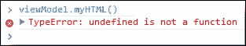

## 预防隐藏功能

在之前的屏幕截图中，我们得到了你可能认为的意外结果，因为视图显然绑定到了 ViewModel 上。这里的问题是**闭包**的概念问题。如果你愿意，可以探索更多关于闭包的内容，但只需意识到这意味着对象的部分或项目内容存在但隐藏。当以这种方式声明时，你无法从 JavaScript 中与之交互。声明应该使用`new`来从函数创建对象，如下所示：

```js
ko.applyBindings(new viewModel());
```

如果你现在运行浏览器并尝试连接到 ViewModel，你会看到它仍然存在闭包的相同问题。我们发现这是在我公司解决这个问题的最佳方式：

```js
vm = new viewModel();
ko.applyBindings(viewModel);
```

现在，我们将使用`vm`而不是`viewModel`来引用模型，这将是我们得到的结果：


我们看到，通过在传递给我们的 Knockout `applyBindings` 方法的参数外声明对象，我们避免了闭包问题。在使用 ViewModel 声明的结构化风格时，这不是一个问题。希望这能让你从数小时的代码问题或怀疑 Knockout 是否出错中解脱出来。我们不会回答我第一次遇到这个问题时浪费了多少时间，但那是在我开始使用 Knockout 之后很久。这说明即使是专家也可能犯新手错误。我谦虚地请求社区的帮助，答案很快就来了。

# 使用 Knockout 自动计算

在本节中，我们将函数提升到一个更深的层次。

在第一章的代码包中的 `do` 文件夹（`/ko_1/do/`），将 `base.htm` 文件复制为 `computed.htm` 用于此部分。在 `body` 标签之后，输入以下视图代码：

```js
<table>
    <tr>
        <th style="width:20%;">
            Item
        </th>
        <th style="width:40%;">
            Qty
        </th>
        <th>
            Price
        </th>
        <th>
            Tally
        </th>
    </tr>
    <tr>
        <td style="width:20%;">
            <em data-bind="text:item_1">Item</em>
        </td>
        <td style="width:40%;">
            <input type="text" data-bind="value:qty_1" />
        </td>
        <td>
            <span data-bind="text:price_1"></span>
        </td>
        <td>
            <span data-bind="text:tally_1"></span>
        </td>
    </tr>
</table>
```

现在我们准备创建 Knockout ViewModel 代码的脚本部分。在包含 KnockoutJS 库之后，将此代码放入 `script` 标签内：

```js
calcModel = function(){
    var self = this;
    self.item_1 = ko.observable('Cell Phone');
    self.qty_1 =  ko.observable(0);
    self.price_1 = ko.observable(149.95);
    self.tally_1 = ko.computed(function(){
        var rslt = (+self.qty_1() * self.price_1()).toFixed(2);
        return rslt;
    },self);
}
vm = new calcModel();
ko.applyBindings(vm);
```

注意，计算函数现在正在进行实时计算。我们还添加了两位固定小数位。输入一个数量进行测试：

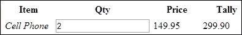

创建表格的第二行和与第一行特征匹配的 ViewModel。我希望你自己创建它，以确保你在这个过程中获得技能。当然，你可以先查看 `done` 文件夹中的示例，但你应该先自己尝试。

## 小计计算

现在将此行添加到表格底部，以创建一行用于小计。你还可以看到我们在表格中创建了一个单元格来总计 `qty_1` 和 `qty_2` 中的项目数量：

```js
<tr>
    <td style="width:20%;">
        &nbsp;
    </td>
    <td style="width:40%;">
        <span data-bind="text:t_qty"></span>
    </td>
    <td>
        <em>subTotal</em>
    </td>
    <td>
        <span data-bind="text:subTotal"></span>
    </td>
</tr>
```

你还需要将脚本代码放入正确的位置：

```js
    self.item_2 = ko.observable('Cell Case');
    self.qty_2 = ko.observable(0);
    self.price_2 = ko.observable(19.45);
    self.tally_2 = ko.computed(function(){
        var rslt = (+self.qty_2() * self.price_2()).toFixed(2);
        return rslt;
    },self);
    self.t_qty = ko.computed(function(){
        return +(self.qty_1()) + +(self.qty_2());
    },self);
    self.subTotal = ko.computed(function(){
        var rslt = (+(self.tally_1()) + +(self.tally_2())).toFixed(2);
        return rslt;
    });
```

你可能已经注意到，我们在一些变量之前放置了一个额外的 `+`。这是标准的 JavaScript 方法，确保输入框中输入的数字以数字的形式输出。在某些浏览器和某些条件下，数字是数字的字符串表示。添加 `+` 解决了这个问题。

现在运行页面并输入数量，以确保所有计算都正常工作：

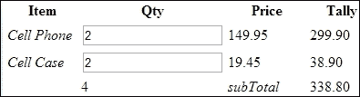

## 纳税时间

没有支付税款，买东西还有什么乐趣？好吧，无论如何，这是我们都需要做对的功能。将以下代码添加到表格中，以创建一行用于税款：

```js
    <tr>
        <td style="width:20%;">
            &nbsp;
        </td>
        <td style="width:40%;">
            ( rate  in decimal <input data-bind="value: taxRate;" /> )
        </td>
        <td>
            <em>Tax</em>
        </td>
        <td>
            <span data-bind="text:taxed"></span>
        </td>
    </tr>
```

现在将此代码添加到页面的 `script` 部分中，使我们的 ViewModel 运行得更加智能。我们的目标不是编写世界上效率最高的代码，而是让你学习如何以 Knockout 的方式思考：

```js
    self.tax = ko.observable(.05);
    self.taxed = ko.computed(function(){
        return +(self.subTotal()*self.tax()).toFixed(2);
    });
    self.taxRate = ko.computed({
        read: function(){
            return self.tax()*100 + '%';
        },
        write: function(value){
            value = parseFloat(value.replace(/[^\.\d]/g, ""));
            self.tax(+value/100);
        }
    });
```

如果我们使用标准的 JavaScript 或甚至 jQuery 来编写页面代码以获得我们所实现的功能量，那么代码量将是我们在页面上现有代码的许多倍。这种方法更加优雅，且代码量更小。

注意我们的 `taxRate` 是如何稍微不同地实现的。Knockout 中的计算函数可以读写。你也可以调用其他外部资源，因为它是标准脚本代码。请注意，在我们的脚本代码中，我们必须将值放在括号中以进行赋值，就像我们对税值所做的那样。

你还应该注意到，我们在输入框中转换数值的十进制格式，并给显示的税值添加一个百分比。如果你在更新税率时输入了百分号，它还会智能地将其去除。

### 小贴士

类似于我们在 `write` 方法中使用的那种正则表达式是让你的应用更加强大的方式。确保至少学习基本的正则表达式。如果你不知道如何进行高级操作，你通常可以在谷歌搜索中找到所需的内容，或者某个“快乐的导师”会在在线论坛中自愿提供有价值的答案来帮助你。

刷新页面以应用更新，你将看到实际税额也已经在 **总计** 列中计算出来了：

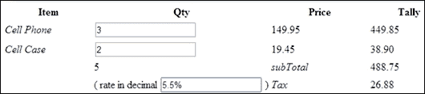

## 最终总计

在这里，我们有我们计算示例的视图代码的最后一部分：

```js
<tr>
    <td style="width:20%;">
        &nbsp;
    </td>
    <td style="width:40%;">
        &nbsp;
    </td>
    <td>
        <em>Total</em>
    </td>
    <td>
        <span data-bind="text:total"></span>
    </td>
</tr>
```

最后一段脚本代码应该添加到 ViewModel 中。这部分代码除了其完成功能的能力外，没有其他特别之处。我们在这里添加了应税项目的值，并且再次用括号包裹数字，使用 `toFixed` 函数将答案设置为两位小数。

```js
    self.total = ko.computed(function(){
        var rslt = (+self.subTotal() + self.taxed()).toFixed(2);
        return rslt;
    });
```

现在我们可以运行代码，并玩转输入框，以查看一切是否按预期工作。对于新开发者来说，看到制作这样一个页面所需的代码如此之少可能不会让你感到惊讶。过去，需要编写如此多的代码，以至于几乎没有人会花时间去尝试构建这样的工具。由于不同浏览器之间的差异，这个问题变得更加复杂。虽然这仍然是事实，但像 Knockout 这样的库消除了许多这些痛苦，并让我们能够专注于结果而不是平台。

现在运行代码应该会给出类似于以下屏幕截图的结果：

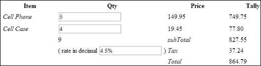

# 使用非 Knockout 函数

现在，我们将添加一个外部函数来展示在视图中格式化值的另一种方式。你将再次修改我们刚刚工作的 `computed.htm` 示例。首先在脚本顶部添加一个具有以下代码的函数：

```js
dollarFormat = function(value){
    return "$ "+value;
}
```

现在进入视图并按以下方式更改最终总计。测试以确保你做对了，然后如果你希望，更改所有这些值：

```js
<span data-bind="text:dollarFormat(total())"></span>
```

这是页面最后一条项目格式化为美元金额的样子：

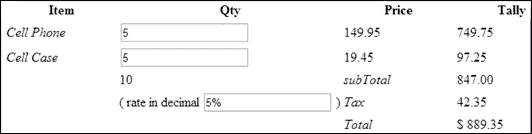

我们本可以在计算中添加一个外部函数来展示它在 ViewModel 中的使用。您仍然需要做一些工作，因为您将不得不选择最佳位置放置类似的东西。也许在几个版本之后，这些工具将神奇地为我们完成所有工作。好吧，即使它们真的做到了，也会有新的需求，我们仍然有机会通过代码为服务对象解决问题。

# 摘要

您现在已经尝到了 KnockoutJS 的好处。这仅仅是 KnockoutJS 力量的开始。Knockout 的好处在于它解决了 jQuery 等库无法解决的问题，同时如果需要，它还有能力与之并行工作。Knockout 提供了绑定和功能智能，它们可以自动化并简化 HTML 和编码，就像 jQuery 简化 JavaScript 编码一样。

在下一章中，我们将通过学习如何使用条件绑定、可观察数组、简化嵌套项以及一些关于如何处理集合的技巧来在此基础上构建知识。
