# 第五章：模板的乐趣

快速回顾历史，讲述了服务器端代码如何将模板变成魔法。数据与这些模板混合，并为客户端返回有意义的 HTML。这些模板动态适应，产生灵活且功能强大的自定义 HTML 页面。随着 AJAX 的到来，开发者失去了这种强大的编码方法。但是等等，模板又回来了！现在它们在客户端运行。本章将教你如何使用 Knockout 在客户端创建魔法。在本章中，我们将关注：

+   原生模板

+   改进的集合处理

+   渲染事件

+   第三方模板

+   令人惊叹的模板选项

Knockout 不仅仅是关于双向绑定。如果做得正确，它关乎更优雅和可持续的代码。当我们学习如何利用 KnockoutJS 的模板功能时，我们将学习如何通过另一个层次使页面创建更加简单。

# 原生模板

模板是我们合并数据和数据适合放入的东西的模式。在计算机的早期，最流行的模板形式是我们称之为邮件合并的东西。像 Microsoft Word 这样的程序会使用邮件合并文档和数据文件，并将它们合并在一起。原始目的是用于打印。

随着时间的推移，我们转向使用这种相同类型的技术来制作网页。当用户访问一个网站并请求一个网页时，服务器开始变得更聪明。数据被混合到模板中，合并后的结果以 HTML 的形式返回给浏览器。这对于购物网站和其他基本页面相同的网站来说是一个惊人的变革。这就是为什么我们把这些代码片段称为模板。

一种看待这个问题的方法是可以想到人们装饰房子的时候。我们有东西叫做模板。虽然模板定义了结果形状的样式，但它并不控制你用什么颜色来画东西。如果你有一个苹果模板，你可以画一个红色的苹果，一个绿色的 Granny Smith 风格的苹果，一个黄色的 Golden Delicious 苹果，或者偏离标准，画一个紫色和黄色的条纹苹果。模板只控制内容将被放置在内的容器。

以同样的方式，网页模板定义了内容。嗯，大多数情况下是这样的。你看，这是一个程序，它比墙画模板要聪明一些；因此，我们可以添加条件逻辑，做一些像重复信息或条件性地选择是否显示任何信息的事情。这就是模板的力量。

在本章中，我们将拥有一个稍微复杂一些的数据集，因为我们想让自己接触更多现实生活中的网站页面，这些页面我们将在这本书之外使用。以下是本页面的代码部分。这里不会使用所有数据。随着我们通过本章的进展，我们将扩展数据，所以请只关注我们实际使用的内容：

```js
var mySeminar = {
  guest1 : { name: "Pete", seating: "standard" },
  guest2 : { name: "Re-Pete", seating: "balcony" },
  conference : {
    name: "KnockOut 2K",
    byLine: "MVVM That Works"
  }, speakers : [
    { id: 1, name: "John Doe", bio: 'This is the bio for John.',
      skills: [ "jQuery","KnockoutJS","SammyJS","NodeJS" ] },
    { id: 2, name: "Mary Smith", bio: 'This is the bio for Mary.',
      skills: [ "jQuery","KnockoutJS","PHP" ] },
    { id: 3, name: "TBA", bio: 'This is the bio for ???.',
      skills: [ "HTML5","SQL","JavaScript" ] }
  ], sessions : [
    { name: "SPA Applications", speakerId: 1 },
    { name: "MVVM Best Practices", speakerId: 1 },
    { name: "Mapping Madness", speakerId: 2 },
    { name: "Custom Components", speakerId: 2 },
    { name: "Browser Database for Beginners", speakerId: 3 }
  ]
};
vm = ko.mapping.fromJS(mySeminar);
ko.applyBindings( vm );
```

你可能已经猜到了，看着我们的数据，我们将展示一个伪的，在这个情况下意味着假的，但“伪”听起来要顺耳得多，研讨会页面。你应该意识到的是，数据将以各种形式出现。你可能需要调整数据，使其最适合你的页面。不要认为这里有任何严格的模式你必须遵循。如果你需要重新排列你的数据，这是任何模板方法的一部分，你可以做到。

现在，我说这个部分将关于原生模板。这意味着你将按照 Knockout 创建模板的标准方式创建这些模板。这应该是你大多数时候应该做的事情。我们稍后会展示如何集成外部模板库；但让我一开始就明确说，在现实世界中，这是开发者如何在 Knockout 页面上使用模板的一种非常罕见的方法。

Knockout 遵循大多数浏览器端模板所采用的方法。实际的模板嵌套在一系列脚本标签内。如果你是新手，想知道为什么这样做时没有 JavaScript 错误，让我来解释一下。过去，微软的 Internet Explorer 使用一种名为 VBScript 的脚本。大多数其他浏览器使用一种名为 JavaScript 的脚本。今天，我们再次看到一些其他脚本出现在 Internet Explorer 上。TypeScript 是一个例子，但它似乎需要 Visual Studio 才能正确运行，并且不能作为原生脚本运行；因此，为了便携性，继续使用 JavaScript 似乎是正确的选择。这些标签创建了一种声明它们内部内容类型的方法。如果内容不被识别，它基本上会被忽略。

当脚本被忽略时，这意味着从标记代码中没有创建 DOM。尽管如此，JavaScript 仍然可以看到这段代码。因此，通过声明不同的类型属性，我们能够将嵌套 HTML 转换为可操作的代码，用于我们的模板。这也允许我们实际上使用熟悉的 HTML 脚本。许多人使用类似 jQuery 的东西来创建内容，但它远不如模板方法优雅。事实上，在一段时间内，jQuery 有自己的模板。它撤回的理由是模板不是其解决方案重点的一部分。

这里是我们将用于我们页面的第一个模板。我们需要在这里包含 Knockout 和映射库的代码示例。映射库不是做模板代码所必需的。我们只是用它来使我们的示例更简单。这使得对主题的关注更加集中，你在阅读本书时需要编写的代码也更少。

```js
<script type="text/html" id="guest-template">
    <h3 data-bind="text: name"></h3>
    <p>Seating: <span data-bind="text: seating"></span></p>
</script>
```

你会注意到我们在模板代码段上放置了一个`id`属性。每个模板都需要一个唯一的 ID 才能正常工作。在我们的模板中，这看起来与我们在整本书中看到的 Knockout 代码非常相似。这是 Knockout 模板的一个优点。它建立在您已经知道并使用的知识上，几乎没有例外。在制作模板时，一个重要的考虑因素是模板应该在绑定 ViewModel 的实际调用之前。以下是我们将包含的两个外部库，以使这个页面工作。`script`标签可以在这之前或之后。它只需要在绑定调用之前，以防止问题。

```js
<script src="img/knockout.js"></script>
<script src="img/knockout.mapping.js"></script>
```

我们需要做的最后一件事，为了使用模板绑定，是在代码中调用模板。模板类似于墙壁模板。你可以选择在图案中放置什么。你可以选择合并到模板中的内容。这意味着你必须有与模板匹配的数据。在这个模板中，你需要传递一个包含姓名和座位结构项的 ViewModel 结构。以下是带有声明数据的模板调用：

```js
<div data-bind="template: { name: 'guest-template', data: guest1 }"></div>
```

如果你有一个没有数据合并的模板想要使用，你可以在页面上重用它。我不确定你为什么要这样做，但这是可能的。注意，在将数据传递给模板时，我们使用的是经典的 JSON 格式方法来传递内容。让我们稍微修改一下前面的代码，并使用两个传递不同数据的模板，以及模板附近的一点点标记：

```js
<h2>Guests</h2>
These are the guests:
<div data-bind="template: { name: 'guest-template', data: guest1 }"></div>
<div data-bind="template: { name: 'guest-template', data: guest2 }"></div>
```

注意，我们连续两次使用了我们的模板，唯一的区别是它们传递给模板的 ViewModel 结构不同。你也应该注意到，模板名称是我们脚本模板声明中`id`属性的值。以下是该模板的结果截图：

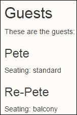

由于姓名和座位是结构中的变量，模板合并时会自动理解作用域。如果你听到这个术语，将数据与模板渲染合并是一种常见的做法。

我们合并到模板中的实际数据，在插入到 ViewModel 之前，如下所示：

```js
guest1 : { name: "Pete", seating: "standard" }
```

好吧，我们现在可以快速轻松地看到我们的数据与模板混合在一起。如果我们进入浏览器开发者工具中的控制台，我们可以输入以下命令。我们想要修改 ViewModel 内的数据，看看绑定是否会对我们的视图产生即时影响：

```js
vm.guest1.name('Peter')
```

当我们这样做时，注意模板会智能且立即更新内容。因此，我们看到我们的数据绑定已经锁定在模板中，就像模板外的绑定一样。开源市场上有很多不同的模板。Knockout 之所以强大，是因为它将渲染的内容绑定到当连接的数据发生变化时重新生成。已经有一些框架的比较，Knockout 在这方面也表现优于其他框架。所以，除非你正在做非常庞大的事情，否则让这个运行实时不会对你的用户体验产生很大影响。话虽如此，别忘了测试性能，因为这始终是最佳实践。以下是更新的截图：

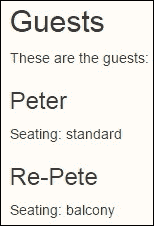

好吧，现在皮特（Pete）或彼得（Peter）在哪里，还有 Re-Pete 的嘉宾们？这是我们接下来的代码块。我们已经有了数据，但我们将要使用的数据部分是这样的：

```js
conference : {
  name: "KnockOut 2K",
  byLine: "MVVM That Works"
}
```

这里是显示和绑定到它的模板的代码：

```js
<h2>Seminar</h2>
<div data-bind="template: { name: 'tmpl-Seminar', data: conference }"></div>
```

我们需要另一个模板来演示合并不同数据集。以下是该模板的代码：

```js
<script type="text/html" id="tmpl-Seminar">
  <h3 data-bind="text:name"></h3>
  <p>Theme: <span data-bind="text:byLine"></span></p>
</script>
```

注意，我们的第一个模板使用了一个名为`name`的变量。在这个模板中，我们也在使用一个名为`name`的变量。每个模板在渲染时，只会查看传递给它的数据以合并内容。以下是本例中模板渲染到页面上的截图：

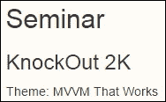

在页面上使用模板的数量或可以合并的数据量没有基本限制。我们不会假设某个开发者或客户端请求可能超过极限。然而，浏览器和计算机如此之快，这些问题很少会成为关注的焦点。唯一可能成为问题的情况是，如果你正在使用 ViewModel 中的变量进行复杂操作，而这个变量基于复杂的逻辑计算值。但到目前为止，我没有在我的公司为我们的客户制作的工作中找到这样的案例。

# 增强型收集处理

在我们的第一个部分，原生模板中，我们关注单一数据集。在 JavaScript 中，我们经常将数据存储在数组中。我们在这里将包括一个示例，以展示如何使用存储在数组中的模板。

我们可以从上一个示例页面复制数据到这个页面。这次我们将使用更多的结构。我们将首先关注演讲者。这个数组包含每个演讲者的结构化项。我们的`script`标签的代码部分应该看起来像这样：

```js
vm = ko.mapping.fromJS(mySeminar);
ko.applyBindings( vm );
```

如果你认为这看起来基本上和上一个代码示例相同，你是正确的。它很快就会改变，但我们在这里想要表达的是，数组和非数组在常规绑定功能上没有不同的编码。以下是我们将用于这部分练习的数据段：

```js
speakers : [
  { id: 1, name: "John Doe", bio: 'This is the bio for John.',
    skills: [ "jQuery","KnockoutJS","SammyJS","NodeJS" ] },
  { id: 2, name: "Mary Smith", bio: 'This is the bio for Mary.',
    skills: [ "jQuery","KnockoutJS","PHP" ] },
  { id: 3, name: "TBA", bio: 'This is the bio for ???.',
    skills: [ "HTML5","SQL","JavaScript" ] }
],
```

我们将把这个数据与以下模板结构混合，并且随着我们的进行，它将会得到增强：

```js
<script type="text/html" id="tmpl-Speakers">
  <h3 data-bind="text:name"></h3>
  <p>Bio: <span data-bind="text:bio"></span></p>
</script>
```

在这里，我们可以看到名称和简介将会混合到我们的页面中，从每个集合记录的数据中提取名称和简介。这是我们页面上将要使用的模板调用：

```js
<h2>Speakers</h2>
<div data-bind="template: { name: 'tmpl-Speakers', foreach: speakers, as: 'speaker' }"></div>
```

这次我们在模板代码中使用 foreach 而不是 data。当使用 data 时，它将一次传递整个数据结构。使用 foreach 将一次传递数据结构作为一个集合项。模板实际上对数据是如何传递给它的没有意识。这是由我们调用模板的方式控制的。以下是运行代码时我们将看到的结果：

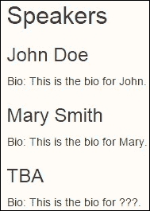

好吧，那是对集合的处理；但这一节被称为增强型集合处理。我们将深入探讨，尽管使用 Knockout，我们仍将保持事情简单，代码轻量。

如以下代码所示，在每一个演讲者记录中嵌套的还有另一个简单的演讲者技能集合。为了清晰起见，以下是集合中的第一个项目：

```js
{ id: 1, name: "John Doe", bio: 'This is the bio for John.',
    skills: [ "jQuery","KnockoutJS","SammyJS","NodeJS" ] },
```

我们可以看到，John Doe 在 jQuery、KnockoutJS、SammyJS 和 NodeJS 方面有技能。这是一个 JavaScript 高手！他可能还有其他未列出的才能，但我们只能展示他给出的那些，当然。我们如何做到这一点？嗯，Knockout 模板的一个美妙功能是能够在模板中嵌套其他模板调用。以下是我们将添加以显示技能的新模板：

```js
<script type="text/html" id="tmpl-SpeakerSkills">
    <li data-bind="text:skill"></li>
</script>
```

显然，我们需要修改主模板以使其工作。我们使用 HTML 列表来显示技能，因此我们需要在列表包装标签中嵌套列表。我们还想添加一个标题来明确这个列表代表的内容。以下是我们的修改后的模板，其中新代码被突出显示：

```js
<script type="text/html" id="tmpl-Speakers">
  <h3 data-bind="text:name"></h3>
  <p>Bio: <span data-bind="text:bio"></span></p>
  <h4>Skills</h4>
 <ul data-bind="template: { name: 'tmpl-SpeakerSkills', foreach: $data.skills, as: 'skill' }"></ul>
</script>
```

注意，还有一个 foreach 模板绑定，因为传入的数据是一个集合。上一次它是一个结构集合，这次它是一个简单值集合。Knockout 对集合中存在什么类型的项并不关心。它需要是一个集合，或者更确切地说，当你使用`foreach`传递数据时，你指定的数组。

对演讲者模板的原始调用确实需要修改。现在我们的第一个演讲者记录看起来是这样的。当然，所有其他记录也都有添加的技能，但我们想节省空间；所以请确保你在浏览器中做所有这些示例，使用你亲手输入的代码，以最大限度地提高你的学习体验。

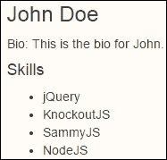

这已经相当不错了，但还不够好。我们承诺要介绍增强的集合模板技术，还有一件事我们想展示给你。嵌套是增强我们的集合模板的最简单形式。现在，我们想展示如何使用会话记录进行一些关系数据处理。以下是我们将混合的会话记录数据段：

```js
sessions : [
  { name: "SPA Applications", speakerId: 1 },
  { name: "MVVM Best Practices", speakerId: 1 },
  { name: "Mapping Madness", speakerId: 2 },
  { name: "Custom Components", speakerId: 2 },
  { name: "Browser Database for Beginners", speakerId: 3 }
]
```

你应该已经注意到`speakerId`属性是数据收集的一部分。这就是我们将如何关联记录的方式。正确关联这些记录只需要少量代码，但这确实只是少量代码。我们需要添加以下高亮代码以使此功能正常工作。我们在映射和绑定之间添加了此代码：

```js
vm = ko.mapping.fromJS(mySeminar);
vm.speakerSessions = function(speakerId){
 var mySessions = [];
 ko.utils.arrayMap(vm.sessions(),function(session){
 if(speakerId() == session.speakerId()){
 mySessions.push(session);
 }
 });
 return mySessions;
};

```

这次我们不是使用集合传递给模板；好吧，不是一个绑定数组集合。我们将通过触发一个函数来调用数据，该函数将过滤并返回一个数组集合。这意味着只要我们在调用时传递一个数组，模板调用就不关心。

我们还使用了 Knockout 工具的`arrayMap`方法来过滤数据与筛选。注意，我们通过指定将 ViewModel 作为筛选的第一个参数。然后，它将逐个传递每个会话项以查看该项是否应放置在筛选集合中。然后，它将返回结果。代码很简单。哦，是的，它在调用时确实接收了`speakerId`属性作为参数。这是使事情正常工作的关键。看看下面的`script`代码：

```js
<script type="text/html" id="tmpl-SpeakerSessions">
  <h4>Sessions</h4>
  <ul data-bind="foreach:$root.speakerSessions(id)">
    <li data-bind="text:name() +' with '+ speaker.name()"></li>
  </ul>
</script>
```

注意，我们使用了`$root`指定来调用我们的方法。这是因为我们想要提醒你，由于这是一个嵌套模板，我们需要确保我们的方法调用处于正确的级别。`$root`指定允许你访问 ViewModel 的实际根级别。传入的 ID 与演讲者数据项匹配。我们添加的`speakerSessions`代码将然后与具有相同 ID 的记录匹配。如果有多个会话，它将显示它们。

为了使此功能正常工作，我们还需要在我们的主模板中包含对会话的嵌套调用。同样，我们不需要修改对演讲者的原始调用。以下是带有新部分高亮的代码：

```js
<script type="text/html" id="tmpl-Speakers">
  <h3 data-bind="text:name"></h3>
  <p>Bio: <span data-bind="text:bio"></span></p>
 <div data-bind="template: { name: 'tmpl-SpeakerSessions', data: $data }"></div>
  <h4>Skills</h4>
  <ul data-bind="template: { name: 'tmpl-SpeakerSkills', foreach: $data.skills, as: 'skill' }"></ul>
</script>
```

抽空看看代码；发现我们调用额外嵌套模板和第一个嵌套模板之间的区别。你会看到在我们的额外方法中，我们没有使用`foreach`指定符传递数据。这次我们使用了数据指定符来传递我们的集合。这两种方法都是有效的，但我们想给你提供两种方法的示例，以供你参考。

这是结果的第一条记录（再次，为了节省空间，没有显示所有内容）。注意这次嵌套模板是如何使用 Knockout 的经典绑定来处理`foreach`指定符的：

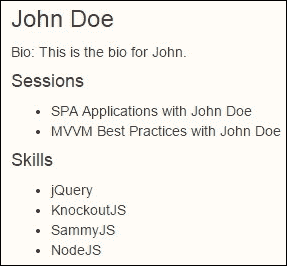

# 渲染事件处理

随着经验的增长，你越来越欣赏的是处理事件的能力。在我们构建的现场网站中，我还没有使用 Knockout 代码需要这个功能；但知道它在那里，如果需要的话，是非常棒的。

这次我们将使用以下代码。我们将为这个例子使用不同的数据集，以使我们的代码更简单，并专注于这一部分：

```js
<script>
    var ViewModel = function(){
        seasons = ko.observableArray([
            { name: 'Spring', months: [ 'March', 'April', 'May' ] },
            { name: 'Summer', months: [ 'June', 'July', 'August' ] },
            { name: 'Autumn', months: [ 'September', 'October', 'November' ] },
            { name: 'Winter', months: [ 'December', 'January', 'February' ] }
        ]);
    showRendered = function(e){
      $(e).wrapInner("<em style='color:green'></em>");
    };
    };
  vm = new ViewModel();
    ko.applyBindings(vm);
</script>
```

这也告诉我们，我们并不总是认为映射是最好的方法。在页面的早期原型设计阶段，通常最好使用映射，因为它可以加快所需内容的创建速度。然后，如果需要，我们可以迁移到一个非映射的 ViewModel，以最大化生产力。如果你的经验有所不同，那么就跟随你的直觉，使用最适合你团队的方法。

到现在为止，数据和绑定都很明显。我们添加的函数将使用 jQuery 对每个指定的项目进行包装，这些项目由 Knockout 以斜体和绿色渲染。我想到的这种实用用途之一是单元测试日志，以确保输出符合预期。无论你用它做什么，它都会向你展示一些事情。

首先，我们在使用 Knockout 时并没有完全与 jQuery 断绝联系。有一种我喜欢向那些担心使用 Knockout 会消除 jQuery 使用的人描述的方法。是的，我记得在 jQuery 出现之前，JavaScript 对大多数人来说有多难。它们都有不同的优势。Knockout 在数据绑定方面表现出色，而 jQuery 在客户端和服务器之间的 AJAX 通信以及 DOM 操作方面表现出色。它们一起组成了一支伟大的团队，每个成员都有各自的优势和不同的挑战，最适合解决。

下面是我们将在本例中使用的模板。我们还将再次使用嵌套模板。这是根模板：

```js
<script type="text/html" id="seasonTemplate">
    <li>
        <strong data-bind="text: "></strong>
        <strong data-bind="text: name"></strong>
        <ul data-bind="template: { name: 'monthTemplate', foreach: months, as: 'month' , afterRender: showRendered}"></ul>
    </li>
</script>
```

我们将月份称为嵌套模板调用。虽然我们可以只用常规标签来渲染所有这些内容，但这不会显示给我们事件处理程序是如何工作的。仔细观察模板调用中的嵌套数据绑定，你会看到一个`afterRender`的设置。你会看到它调用了我们添加到代码中的函数。由于它位于根模板中，因此它不需要使用`$root`指示符来正确调用函数方法以处理渲染事件。以下是它将调用来渲染月份项的嵌套模板：

```js
<script type="text/html" id="monthTemplate">
    <li>
        <span data-bind="text: month"></span>
        is in
        <span data-bind="text: season.name"></span>
    </li>
</script>
```

我还想要你注意这里的一些特别之处。注意我们在模板中使用了变量`season.name`。我们能够从嵌套模板中访问父级的数据结构。编写 Knockout 库的那些人将许多这样的东西组合在一起，真是令人印象深刻。那么，季节是在哪里声明的呢？看看对根模板的实际调用：

```js
<ul data-bind="template: { name: 'seasonTemplate', foreach: seasons, as: 'season' }"></ul>
```

你会看到一个 `as` 指示符，其中 `season` 字符串被声明为结构的别名。因此，我们可以在模板的第一级使用 `$data`，但在模板的第二级使用 `$data` 就不会正确工作。通过声明别名 `season`，我们可以在嵌套子项中使用它，并且它将正确地针对正确的数据集。太棒了！

现在，当我们查看我们的结果时，我们得到了正确处理和渲染的内容。我承认，虽然我从 jQuery 1.2 版本之前就开始使用了，但我的 Knockout 历史比这还要晚。如果你在使用早期版本时遇到问题，可能不支持我们在这里教授的每个功能，请加入在线小组。你将在 Knockout 网站上找到它。那里的社区在相互支持方面非常棒。

下面是这段代码的结果截图：

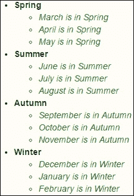

# 第三方模板选项

曾经有一段时间，jQuery 在探索创建自己的模板，但这项努力并没有成熟到完整发布的程度。因此，我们在这里不会介绍那个模板。结果是，与 Knockout 一起使用最流行的模板似乎是 **Underscore**。就我个人而言，在接触 Knockout 之前，我选择的模板是，嗯，是 **Handlebars**。然而，我非常喜欢 Knockout 模板，以至于它从未让我有动力将 Handlebars 与 Knockout 集成。

我只是玩了一下 Underscore，只是为了尝尝为什么其他人会用 Underscore 与 Knockout 一起使用；看看我是否遗漏了什么。这归结为一个开发者风格差异，一些开发者喜欢使用 Underscore 风格的模板编码，而其他人则更喜欢使用原生的 Knockout 模板。在本节中，我们将尊重 Underscore 粉丝的方法。

我们建议从示例代码的 `done` 目录中复制粘贴一些内容，以防止出现错误。如果你足够厉害，可以直接输入这些内容。再次提醒，你的示例应该放入每个章节的 `do` 文件夹中。

下面是这个示例的基础代码：

```js
<script>
var viewModel = {
    people: ko.observableArray([
        { name: ko.observable('Rod'), age: ko.observable(123) },
        { name: ko.observable('Jane'), age: ko.observable(125) }, 
        { name: ko.observable('Mary'), age: ko.observable(25) }
    ])
};
ko.applyBindings(viewModel);
</script>
```

下面是我们调用模板的代码：

```js
<h1>People</h1>
<ul data-bind="template: { name: 'peopleList' }"></ul>
```

现在，这是我们的模板。你应该注意到这里的模板风格不同。如果你习惯于 Underscore，这将工作得很好。如果你没有使用 Underscore，你不应该假设这个模板中的代码是原生 Knockout 模板的示例。

```js
<script type="text/html" id="peopleList">
    <% _.each(people(), function(person) { %>
        <li>
            <b data-bind="text: person.name"></b> is <%= person.age() %> years old
        </li>
    <% }) %>
</script>
```

这张截图显示了我们将产生的以下结果。等等！有一块缺失，但我们确实想先展示一下结果。

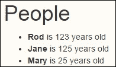

对于最终用户来说，没有任何区别。使用第三方模板是为了开发者的利益。嗯，如果你签订的合同需要使用 Underscore，那么这种方法将带来另一个好处，因为它将允许你在允许的情况下使用 Underscore 和 Knockout 完成工作。提前验证这一点可能是个好主意，以确保一切顺利。

## 使用 Underscore 修改模板处理

让我再表达一次我的感激之情，并向 Google 群组中的 Knockout 社区表示感谢。除了几个在线网站外，这里是我学习如何处理模板的地方。这项技术使我们能够管理模板引擎，并将结果传递给 Underscore 引擎进行处理。关键代码如下所示：

```js
/* ---- Begin integration of Underscore template engine with Knockout. Could go in a separate file of course. ---- */
    ko.underscoreTemplateEngine = function () { }
    ko.underscoreTemplateEngine.prototype = ko.utils.extend(new ko.templateEngine(), {
        renderTemplateSource: function (templateSource, bindingContext, options) {
            // Precompile and cache the templates for efficiency
 var precompiled = templateSource'data';
 if (!precompiled) {
 precompiled = _.template("<% with($data) { %> " + templateSource.text() + " <% } %>");
 templateSource'data';
 }
            // Run the template and parse its output into an array of DOM elements
 var renderedMarkup = precompiled(bindingContext).replace(/\s+/g, " ");
            return ko.utils.parseHtmlFragment(renderedMarkup);
        },
        createJavaScriptEvaluatorBlock: function(script) {
            return "<%= " + script + " %>";
        }
    });
    ko.setTemplateEngine(new ko.underscoreTemplateEngine());
/* ---- End integration of Underscore template engine with Knockout ---- */
```

第一个突出显示的部分将代码和数据传递给 Underscore 模板处理器以由 Underscore 渲染。Underscore 确实产生了一些需要清理才能正确工作的结果，因此第二个突出显示的部分用于清理渲染的代码。

## Knockout 中的实时更新和订阅方法

我们将创建在屏幕上添加带有编辑表单的项的能力。以下是我们将为此功能添加的视图的标记：

```js
<input data-bind="value: name" />
<input data-bind="value: age" />
<button data-bind="click: addItem">Add</button>
```

我们还需要添加 ViewModel 结构，它将包括以下项目：

```js
name: ko.observable(),
age: ko.observable(),

addItem: function() {
var item = { name: ko.observable(viewModel.name()), age: ko.observable(viewModel.age()) };
   viewModel.people.push(item);
   viewModel.name("");
   viewModel.age("");
}
```

当添加或删除项时，Knockout 给我们监控这些变化的能力，这正是我们想要展示的。这是我们用来告诉 Knockout 我们想要订阅或监听事件的代码。我们将监听的事件将是 `people` 数组集合上的 `arrayChange` 事件。以下是相应的代码。注意，我们还将结果输出到控制台。我们还将把更改的结果推送到另一个用于人员更改的属性。

```js
viewModel.people.subscribe(function(e){
  console.log(e);
}, viewModel, "arrayChange");
viewModel.people.subscribe(viewModel.peopleChange, viewModel, "arrayChange");
```

我们将传递给 `peopleChange` 的结果，将通过在视图上使用绑定将它们转换为 JSON，如下所示。每当 `peopleChange` 中的值更新时，结果将以 JSON 结构显示。

```js
<pre data-bind="text: ko.toJSON(peopleChange, null, 2)"></pre>
```

现在，以防第一次浏览时感到困惑或你不想下载代码，让我在这里提供标记视图代码：

```js
<h1>People</h1>
<ul data-bind="template: { name: 'peopleList' }"></ul>
<script type="text/html" id="peopleList">
    <% _.each(people(), function(person) { %>
        <li>
            <b data-bind="text: person.name"></b> is <%= person.age() %> years old
        </li>
    <% }) %>
</script>
<pre data-bind="text: ko.toJSON(peopleChange, null, 2)"></pre>
<input data-bind="value: name" />
<input data-bind="value: age" />
<button data-bind="click: addItem">Add</button>
```

当所有内容都在一个地方时，看起来要简单得多；嗯，对我来说是这样的。这次包含的脚本更多；以下是本例所需的脚本集合：

```js
<script  src="img/jquery.mi n.js"></script>
<script  src="img/bootstrap.min.js "></script>
<script src="img/knockout.js"></script>
<script  src="img/underscore- min.js"></script>
```

是的，这些代码也可以与当前版本的 jQuery 一起使用，如果你有这个问题的话。现在，我们将展示本例页面的代码：

```js
<script>
/* ---- Begin integration of Underscore template engine with Knockout. Could go in a separate file of course. ---- */
    ko.underscoreTemplateEngine = function () { }
    ko.underscoreTemplateEngine.prototype = ko.utils.extend(new ko.templateEngine(), {
        renderTemplateSource: function (templateSource, bindingContext, options) {
            // Precompile and cache the templates for efficiency
            var precompiled = templateSource'data';
            if (!precompiled) {
                precompiled = _.template("<% with($data) { %> " + templateSource.text() + " <% } %>");
                templateSource'data';
            }
            // Run the template and parse its output into an array of DOM elements
            var renderedMarkup = precompiled(bindingContext).replace(/\s+/g, " ");
            return ko.utils.parseHtmlFragment(renderedMarkup);
        },
        createJavaScriptEvaluatorBlock: function(script) {
            return "<%= " + script + " %>";
        }
    });
    ko.setTemplateEngine(new ko.underscoreTemplateEngine());
/* ---- End integration of Underscore template engine with Knockout ---- */
var viewModel = {
    people: ko.observableArray([
        { name: ko.observable('Rod'), age: ko.observable(123) },
        { name: ko.observable('Jane'), age: ko.observable(125) }, 
        { name: ko.observable('Mary'), age: ko.observable(25) }
    ]),
  peopleChange: ko.observable(),
    name: ko.observable(),
    age: ko.observable(),
    addItem: function() {
       var item = { name: ko.observable(viewModel.name()), age: ko.observable(viewModel.age()) };
       viewModel.people.push(item);
       viewModel.name("");
       viewModel.age("");
    },
    removeItem: function(item) {
       viewModel.people.remove(item);
    }
};
viewModel.people.subscribe(viewModel.peopleChange, viewModel, "arrayChange");
viewModel.people.subscribe(function(e){
  console.log(e);
}, viewModel, "arrayChange");
ko.applyBindings(viewModel);
</script>
```

现在，我们有代码可以显示第三方模板、订阅以及我们绑定中存储数据的动态修改。以下是屏幕将呈现的样子。嗯，在我的 `done` 版本的代码中，它被 Bootstrap 包裹起来，所以这就是它在 Bootstrap 中的样子：

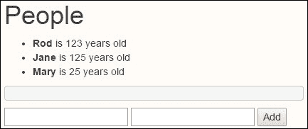

我们将继续添加`John`到列表中，并让他`40`岁。这是你将在截图中所看到的，其中`subscribe`的结果以 JSON 结构显示。如果有一条记录被删除，它也会显示出来；这也是 Knockout 之所以如此灵活的原因之一。你也会在我们的代码中注意到，一旦我们通过绑定将项目添加到我们数据结构中，我们也清除了输入框，以保持用户界面的整洁。以下是结果截图：

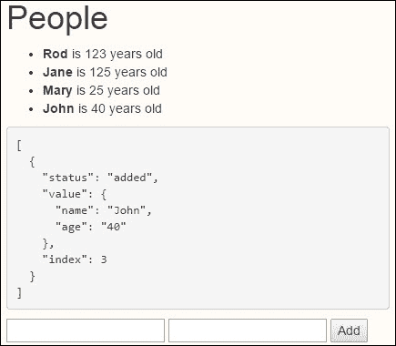

让我再重复一遍，大多数人并不使用第三方模板，因为原生模板已经非常强大。这并不意味着这样做是错误的，但这样做可能只是需要学习如何使用原生模板的能力。如果是这样的话，我们希望本章能够满足这一需求。

# 出色的模板选项

有些人可能还想用与 Knockout 纯原生风格不同的模板来做一些事情。这可能是因为你可能喜欢使用稍微不同一点的编码风格。在本章的最后部分，我们将为您提供更多选项。

我们回到了原生模板；我想我们应该提一下这一点，以防有人有疑问。以下是我们将在这个页面上使用的模板：

```js
<script type="text/html" id="guest-template">
    <h3>{{name}}</h3>
    <p>Seating: {{seating}}</p>
</script>
<script type="text/html" id="guest-template-alt">
    <h3>Others</h3>
    <p>Seating: General Seating</p>
</script>
<script type="text/html" id="tmpl-Seminar">
  <h3>{{name}}</h3>
  <p>Theme: {{byLine}}</p>
</script>
```

我们将使用本章开头使用的相同数据来演示这个例子。除此之外，我们还将添加一个插件库到这个例子中。这显然是我最喜欢的 Knockout 库之一，即**Punches**库。毕竟，没有 Punches 的 Knockout 会是什么样子？因此，我们需要包含 jQuery、Knockout、Knockout-mapping 和 Knockout punches，这样现在就可以工作了。

这里是包含在本页上的传统模板的绑定数据：

```js
<h2>Guests</h2>
These are the guests:
<div data-bind="template: { name: 'guest-template', data: guest1 }"></div>
<div data-bind="template: { name: 'guest-template', data: guest2 }"></div>
```

这里是我们从页面上的这一段代码中得到的输出。如果你花时间查看我们的模板，你可能已经注意到了一些不同之处。我们用来告诉模板我们想要合并哪些变量的编码风格现在被双大括号包围了。然而，我们的输出正如我们所预期的那样，无需深入挖掘并使用`data-bind`属性来传递结果：

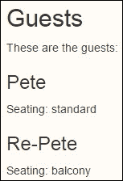

现在，我们将看看 Punches 模板语法。我们包括标准绑定的代码，以确保没有人会假设这是属于`script`标签的代码。这是 HTML 代码，应该直接添加到我们页面上的视图代码中，如下所示：

```js
<h2>Guests</h2>
These are the guests:
<div data-bind="template: { name: 'guest-template', data: guest1 }"></div>
<div data-bind="template: { name: 'guest-template', data: guest2 }"></div>
{{#template {name:'guest-template', data: guest1} /}}
{{#template {name:'guest-template', data: guest2} /}}
```

当您再次运行代码时，您将看到**Pete**和**Re-Pete**两次输出相同的结果。有些人可能因为个人风格的原因，可能更喜欢 Punches 风格的编码。您可能还记得我提到过，我以前最喜欢的编码风格是 Handlebars。这与 Handlebars 编码语法相似，因此对我来说效果最好；如果它不是您的风格，那么就把它当作开发者个性的差异吧。以下是更新后的截图：

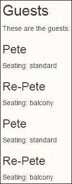

我现在还使用另一种方法在页面上放置模板。我正在使用由 Knockout 驱动的自定义标签。好吧，有点像。它们被一个我称之为"KOmponents"的库修改过。您将在下一章中了解更多关于 Knockout 自定义标签的信息，但在这里展示一个实际操作似乎很合适。我们将第三次在页面上放置输出。以下是修改后的视图标记：

```js
<h2>Guests</h2>
These are the guests:
<div data-bind="template: { name: 'guest-template', data: guest1 }"></div>
<div data-bind="template: { name: 'guest-template', data: guest2 }"></div>
{{#template {name:'guest-template', data: guest1} /}}
{{#template {name:'guest-template', data: guest2} /}}
<kom-template data="guest1" template="'guest-template'"></kom- template>
<kom-template data="guest2" template="'guest-template'"></kom- template>
```

好了，运行代码后，您将看到页面上出现了第三组**Pete**和**Re-Pete**。在我们的屏幕图像中，我们将跳过再次复制**Pete**和**Re-Pete**。目标是向您展示它们都输出了相同的内容。

我们将通过在以下所有`guest-template`部分下方添加以下内容来完成此操作：

```js
<hr>
{{#template 'guest-template-alt'/}}
<hr>
<h2>Seminar</h2>
<div data-bind="template: { name: 'tmpl-Seminar', data: conference }"></div>
```

这些将输出模板的内容，以下是一些结果。你看，我们选择在其中一个中使用 Punches 和 Handlebars 风格的组合。

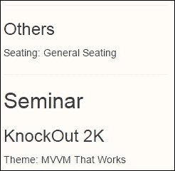

# 摘要

本章为您提供了对 Knockout 模板的全面介绍。如果您以前从未使用过模板，我们希望您能欣赏模板的概念。如果您以前使用过，我们希望您喜欢 Knockout 模板提供的数据绑定自动更新能力的丰富性。

在本章中，我们学习了模板的作用以及如何使用 Knockout 来操作它们。我们学习了如何将模板嵌套在集合和非集合结构中。我们还学习了如何使用事件触发器，并在模板结果中混合一点 jQuery 来修改。此外，我们还学习了如何混合第三方模板技术，订阅观察者的概念，以及将模板合并到页面上的几种额外方法。我们还学习了如何使用 Punches 库的替代绑定风格。

在下一章中，我们将深入探讨构建自定义 HTML 标签的奇妙之处。有没有什么时候你觉得自己使用的标准 HTML 标签有限？你实际上想要一些具有可编程交互功能的 HTML 风格标签？跳到下一章，你将在这两种情况下找到你想要的东西。
