# 第五章. Leaflet 中的 ESRI

当你开始制作更多地图并寻找用于工作的地理空间数据时，你几乎肯定会遇到文件类型 shapefile（`.shp`）。**经济和社会研究机构**（**ESRI**）是广泛使用的 GIS 系统 ArcGIS 的创建者，shapefile 是它们的数据格式之一。

你可能会看到另一种格式，称为地理数据库，具有`.gdb`扩展名。即使你从未遇到过 shapefile 或地理数据库，你最终也会遇到一个 REST 服务，它是 ArcServer 安装的端点。

### 注意

ArcServer 是 ESRI 的一个产品，用于分发 GIS 服务和网络地图应用程序。它与 ArcGIS 分开，ArcGIS 是指用于创建地图和地理数据的桌面应用程序。

你知道如何在 Leaflet 地图中消费更多数据格式，你将需要花费的时间来转换数据以适应你的需求就越少。在本章中，你将学习如何在 Leaflet 中消费 ESRI 格式和服务。

在本章中，我们将涵盖以下主题：

+   ESRI 底图

+   与 shapefile 一起工作

+   显示动态地图图层

+   热图

+   地理编码和反向地理编码

+   查询图层

# ESRI 底图

ESRI 提供了八种不同的底图，你可以在 Leaflet 地图中使用。这八个图层如下：

+   街道

+   地形

+   国家地理

+   海洋

+   灰色

+   深灰色

+   影像

+   投影

除了八个底图之外，还有六个底图标签图层，`OceansLabels`、`GrayLabels`、`DarkGrayLabels`、`ImageryLabels`、`ImageryTransportation`和`ShadedReliefLabels`，以补充底图。如果还不够，还有每个底图的视网膜版本。

要使用 ESRI 底图，请按照以下步骤操作：

1.  首先，添加对 ESRI-leaflet 文件的引用。它处于测试版，但这并不意味着它不完全功能：

    ```js
    <script src="img/esri-Leaflet"></script>
    ```

    ### 注意

    在其 GitHub 仓库中，ESRI 表示该库预计将在 2014 年从测试版移至生产版。您可以在[`github.com/Esri/esri-leaflet/`](https://github.com/Esri/esri-leaflet/)找到更多信息并下载附加文件。

1.  接下来，创建一个 ESRI 底图图层，传递八个选项之一。在这个例子中，使用`Gray`。始终记得将其添加到地图中：

    ```js
    var gray = L.esri.basemapLayer("Gray").addTo(map);
    ```

1.  现在你有一个带有 ESRI 底图图层的地图。前面的代码是添加底图所需的最小代码。ESRI 底图图层继承自 Leaflet 的`L.TileLayer`类，因此，你可以使用任何其他 Leaflet `L.TileLayer`类中可用的所有选项、方法和事件。在构建移动地图时，一个非常有用的选项是`detectRetina`选项。要使用此选项，只需将其传递给底图名称之后，如以下代码所示：

    ```js
    var gray = L.esri.basemapLayer("Gray",{detectRetina: true}).addTo(map);
    ```

你在文档中找到的许多示例将创建图层，而不将它们分配给变量，如以下来自 ESRI 网站的代码所示：

```js
var map = L.map('map').setView([37.75,-122.45], 12);
L.esri.basemapLayer("Topographic").addTo(map);
```

当你这样做时，除非你将它们链接起来，否则你无法在图层上调用方法或事件。在上面的例子中，你将底图分配给了变量`gray`，因此你可以访问所有的方法和事件，如下面的代码所示：

```js
gray.setOpacity(.75);   
gray.on("load", alertme);
function alertme(){alert("ESRI Basemap Loaded");}
```

上述代码修改了底图层的透明度，并订阅了`load`事件。当图层加载时，它执行`alertme()`函数并弹出一个提示，表明操作已完成。

你可能需要做的最后一件事是在你的 ESRI 底图层上添加相应的标签层。为此，只需添加另一个底图层，并将标签层按以下代码所示传递：

```js
var grayLabel = L.esri.basemapLayer("GrayLabels").addTo(map);
```

现在，你将拥有一个看起来像这样的地图：

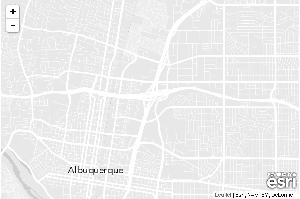

# 使用 shapefiles 在 Leaflet 中

Shapefile 是你最有可能遇到的常见地理文件类型。Shapefile 不是一个单独的文件，而是用于在地图上创建地理要素的几个文件。当你下载 shapefile 时，你至少会有`.shp`、`.shx`和`.dbf`文件。这些文件是包含几何形状、索引和属性数据库的 shapefile。你的 shapefile 很可能还包括一个投影文件（`.prj`），它将告诉应用程序数据的投影，以便坐标对应用程序有意义。在示例中，你还将有一个`.shp.xml`文件，它包含元数据和两个空间索引文件，`.sbn`和`.sbx`。

要查找 shapefiles，通常可以搜索开放数据和城市名称。在这个例子中，我们将使用来自 ABQ Data，阿尔伯克基市数据门户的 shapefile。你可以在[`www.cabq.gov/abq-data`](http://www.cabq.gov/abq-data)找到更多数据。当你下载 shapefile 时，它很可能是 ZIP 格式，因为它将包含多个文件。

要在 Leaflet 中使用`leaflet-shpfile`插件打开 shapefile，请按照以下步骤操作：

1.  首先，添加对两个 JavaScript 文件的引用。第一个是`leaflet-shpfile`插件，第二个依赖于 shapefile 解析器，`shp.js`：

    ```js
    <script src="img/leaflet.shpfile.js"></script>
    <script src="img/shp.js"></script>
    ```

1.  接下来，创建一个新的 shapefile 层并将其添加到地图中。将层路径传递给压缩的 shapefile：

    ```js
    var shpfile = new L.Shapefile('council.zip');
    shpfile.addTo(map);
    ```

你的地图应该显示如下截图所示的 shapefile：

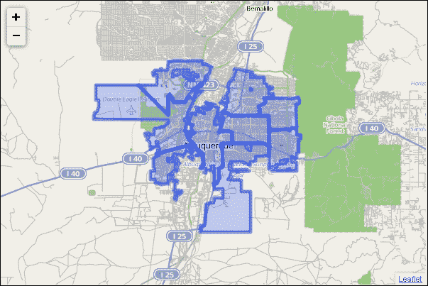

执行上述步骤将 shapefile 添加到地图上。你将无法看到任何单个要素属性。当你创建 shapefile 层时，你指定数据，然后指定选项。选项传递给`L.geoJson`类。要添加弹出窗口或样式化要素，你使用与你在第二章“映射 GeoJSON 数据”中学到的相同过程。以下代码显示了如何向你的 shapefile 层添加弹出窗口：

```js
var shpfile = new 
   L.Shapefile('council.zip',{onEachFeature:function(feature, layer) {
layer.bindPopup("<a 
href='"+feature.properties.WEBPAGE+"'>Page</a><br><a href='"+feature.properties.PICTURE+"'>Image</a>");
}});
```

在前面的代码中，你将`council.zip`传递给形状文件，并使用`onEachFeature`选项作为选项，它接受一个函数。在这种情况下，你使用匿名函数并将弹出窗口绑定到层。在弹出窗口的文本中，你将你的 HTML 与你想显示的属性的名称连接起来，使用格式`feature.properties.属性名称`。要找到形状文件中属性的名称，你可以打开`.dbf`并查看列标题。然而，这可能很麻烦，你可能想在不了解其内容的情况下添加目录中的所有形状文件。如果你不知道给定形状文件的属性名称，以下示例显示了如何获取它们，然后以它们的值在弹出窗口中显示它们：

```js
var holder=[];

for (var key in feature.properties){ 
holder.push(key+": "+feature.properties[key]+"<br>");
popupContent=holder.join("");
layer.bindPopup(popupContent);
}
shapefile.addTo(map);
```

在前面的代码中，你首先创建一个数组来存储你的弹出窗口中的所有行，每对键/值一个。然后你运行一个`for`循环，遍历对象，获取每个键并将键名与值和换行符连接起来。你将每一行推入数组，然后将所有元素连接成一个单独的字符串。当你使用`.join()`方法时，它将在新字符串中用逗号分隔数组的每个元素。

你可以传递空引号来删除逗号。最后，你将弹出窗口与字符串内容绑定，然后将形状文件添加到地图中。

你现在有一个看起来像以下屏幕截图的地图：

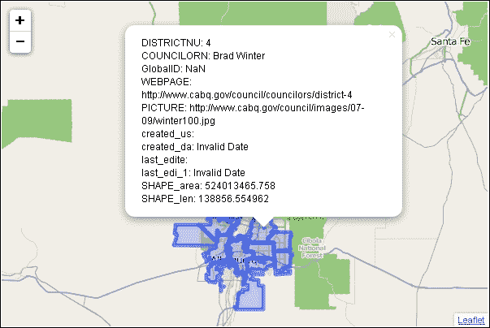

形状文件也接受样式选项。你可以传递任何路径类选项，例如颜色、不透明度或描边，以更改层的外观。以下代码创建了一个红色多边形，带有黑色轮廓，并设置它略微透明：

```js
var shpfile = new 
L.Shapefile('council.zip',{style:function(feature){return  {color:"black",fillColor:"red",fillOpacity:.75}}});
```

# 消费 ESRI 服务

在本章的第一个例子中，你学习了如何使用`esri-leaflet`插件进行底图。然后你学习了如何使用插件处理最常见的 ESRI 文件格式：形状文件。虽然你肯定会遇到形状文件，但你将越来越多地发现自己遇到提供端点以连接并消费地理服务的 ESRI 服务。使用`esri-leaflet`插件，你可以连接到这些服务，除了底图之外，还可以显示五种其他图层类型：

+   瓦片地图层

+   动态地图层

+   功能层

+   聚类功能层

+   热力图功能层

一旦你知道如何添加这些图层之一，你就可以添加任何其他的，因为过程几乎相同。唯一的不同是可用的选项和方法，这些在 API 的[`esri.github.io/esri-leaflet/api-reference/`](http://esri.github.io/esri-leaflet/api-reference/)中有很好的文档。在本章的后面，我们将学习如何创建热量功能层，但现在让我们看看如何添加动态地图层。

在阿尔伯克基市数据页面 [`www.cabq.gov/abq-data`](http://www.cabq.gov/abq-data) 上，选择公共艺术数据集。你将看到目录的内容。你可以阅读 `MetaData.pdf` 文件来了解数据源，下载一个 Google Earth `.KMZ` 文件，下载或链接到一个 JSON 文件，或者消费一个 `PublicArtREST` 服务。

### 注意

来自阿尔伯克基市数据页面的 JSON 文件是 ESRI JSON。它不是 GeoJSON，因此，没有一些转换将不会兼容。

点击 PublicArtREST 链接，你将看到该服务的详细信息。滚动到页面底部将告诉你可用的字段。在设计弹出窗口时这将非常有用。现在你知道了如何找到该服务，请按照以下步骤将其添加到你的地图中：

1.  首先，添加对 ESRI-leaflet 文件的引用：

    ```js
    <script src="img/esri-Leaflet"></script>
    ```

1.  通过复制 REST 服务的链接来创建一个动态地图图层。所有动态地图图层都以 `/mapserver` 结尾。我们已从 URL 中移除了 `/0`，这意味着我们现在正在加载整个地图文件。在以下代码中，将不透明度选项设置为 `0.75` 并将图层添加到地图中：

    ```js
    var art = L.esri.dynamicMapLayer("http://coagisweb.cabq.gov/arcgis/re st/services/public/PublicArt/MapServer).addTo(map);
    ```

1.  最后，使用一个将返回内容的函数绑定弹出窗口。在以下代码中，使用格式 `feature.features[0].properties.NAME-OF-PROPERTY`：

    ```js
    art.bindPopup(function (err, feature) { 
    return feature.features[0].properties.TITLE+"<br> by:  <b>"+feature.features[0].properties.ARTIST;  });
    ```

你的地图现在将看起来像这样：

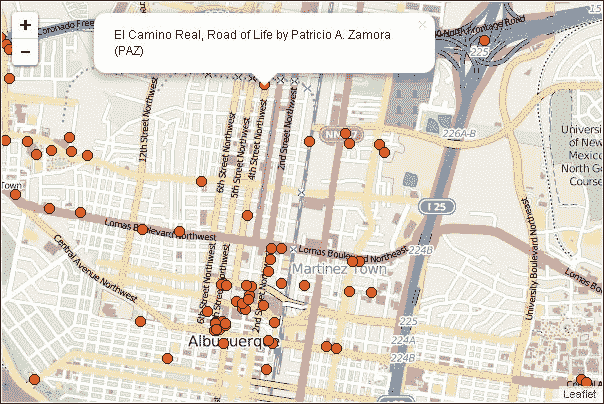

# 在 Leaflet 中使用 ESRI 的热力图

在第三章 *创建热力图和面状图* 中，你学习了几个可以用来创建热力图的插件。`esri-leaflet` 插件也包含一个热力图层，允许你传递一个 ESRI 服务作为数据。要使用 `esri-leaflet` 插件创建热力图，请按照以下步骤操作：

1.  首先，添加对 ESRI-leaflet 文件的引用，并且由于热力图层不包括在 `esri-leaflet` 插件的核心构建中，你将需要引用一个额外的 ESRI 文件，`esri-leaflet-heatmap-feature-layer.js`。ESRI 热力图层需要 `leaflet-heat.js`，因此你还需要添加对该文件的引用：

    ```js
    <script src="img/esri-Leaflet"></script>
    <script src="img/esri-leaflet-heatmap-feature- layer.js"></script>
    <script src="img/leaflet-heat.js"></script>
    ```

1.  按照常规创建你的地图和底图，然后添加热力图层。热力图层需要一个链接到要素图层服务的链接，并获取 `leaflet-heat.js` 中所有可用的选项。将图层添加到地图中：

    ```js
    url= ("http://services.arcgis.com/pmcEyn9tLWCoX7Dm/arcgis/rest/ services/USGS_Earthquakes_Excel_Layer/FeatureServer/0";
    var heatmap = new L.esri.HeatmapFeatureLayer(url, {
                radius: 50,
       blur:90,
       maxZoom:10
    }).addTo(map);
    ```

    ### 注意

    要查看 ESRI 提供的服务列表，请浏览到 [`services.arcgis.com/rOo16HdIMeOBI4Mb/ArcGIS/rest/services/`](http://services.arcgis.com/rOo16HdIMeOBI4Mb/ArcGIS/rest/services/)。ArcServer 服务的位置默认为 `http://Server Name/ ArcGIS/rest/services`。

你的地图将看起来如下截图所示：

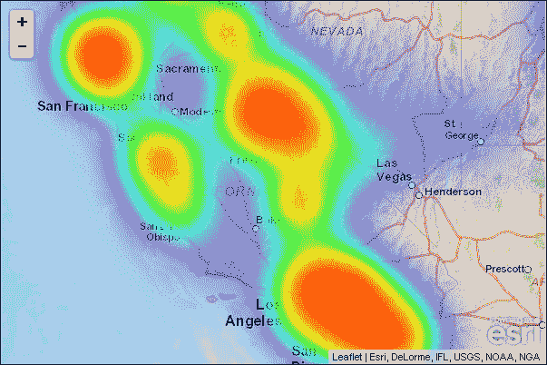

# 在 Leaflet 中进行地址地理编码

地理编码是将地址输入并带到地图上某个点的过程。地理编码功能不是 Esri-leaflet 核心的一部分，而是一个独立的插件。您可以在 esri-leaflet-geocoder GitHub 页面上找到更多信息：[`github.com/Esri/esri-leaflet-geocoder`](https://github.com/Esri/esri-leaflet-geocoder)。

## 地理编码 – 从地址到点

地理编码插件在缩放控制下方放置一个搜索框。随着您输入地址，搜索将自动完成并显示可能的选项。您可以直接输入整个地址，或者当您想要的地址可用时从列表中选择。点击选项或按回车键将在地图上该位置放置一个标记并放大。要创建具有地理编码功能的地图，请按照以下步骤操作：

1.  引用 CSS 和 JS 文件：

    ```js
    <script src="img/esri-leaflet-geocoder.js"></script>
    <link rel="stylesheet" type="text/css" href="http://cdn- geoweb.s3.amazonaws.com/esri-leaflet-geocoder/0.0.1- beta.3/esri-leaflet-geocoder.css">
    ```

1.  创建控件：

    ```js
    var searchControl = new  L.esri.Controls.Geosearch().addTo(map);
    ```

1.  创建一个放置结果的图层：

    ```js
      var results = new L.LayerGroup().addTo(map);
    ```

1.  订阅结果事件并添加标记：

    ```js
    searchControl.on("results", function(data){
    results.clearLayers();
    results.addLayer(L.marker(data.results[0].latlng));
    ```

您的地图现在在缩放控制下将有一个小放大镜，如下面的截图所示：

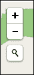

当您点击放大镜时，它将展开成一个文本框。随着您输入，文本框将自动完成并猜测您正在输入的位置。一旦您看到想要的地址，从列表中选择它。您的地图应该看起来像下面的截图：

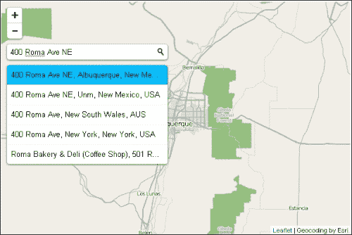

一旦您点击了选择，地图将自动在位置放置一个标记并放大。现在您将有一个看起来像下面的地图：

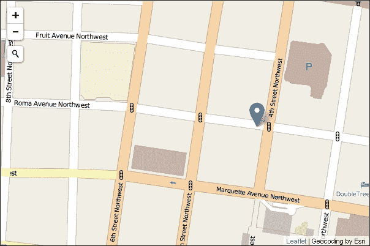

在下一个示例中，您将使用 URL 来映射地址。

## 从 URL 参数进行地理编码

在最后一个例子中，用户能够加载地图并输入地址以找到它。在这个例子中，您将允许用户在 URL 中输入地址，并显示一个放大到标记位置的地图。要创建地图，请按照以下步骤操作：

1.  首先，添加对`esri-leaflet-geocoder.js`文件的引用。由于您没有添加搜索框，因此不需要 CSS 文件，如前一个示例中所示：

    ```js
    <script src="img/esri-leaflet- geocoder.js"></script>
    ```

1.  接下来，您需要从 URL 中获取参数。在这个例子中，`a`被选为包含地址的变量。要获取 URL 参数，请使用`location.search`。这将获取问号之后的所有内容。您只需要地址，因此按等号分割，然后获取返回数组的第二个元素，`y[1]`。这将返回 URL 中每个空格处的`%20`，因此使用`decodeURIComponent(y[1])`来移除它们：

    ```js
    var x = location.search;
    var y = x.split("=");
    var temp=y[1];
    var address = decodeURIComponent(temp);
    var geocodeService = new L.esri.Services.Geocoding();
    ```

1.  创建地理编码服务，传递地址、参数和回调函数。该函数将从第一个结果创建一个标记，然后设置视图以放大标记：

    ```js
    geocodeService.geocode(address, {}, function(error,  result){
    L.marker(result[0].latlng).addTo(map);
    map.setView(result[0].latlng,8);
    });
    ```

在`URLgeocode.html`文件后添加`?a=400 roma ave ne,albuquerque,nm,usa`。您的地图将加载并看起来像这样：

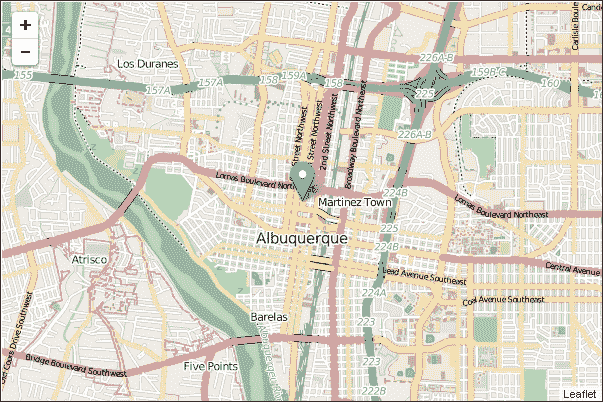

## 反向地理编码 – 使用点查找地址

反向地理编码与地理编码正好相反。它从一个地图上的点找到其地址。在这个例子中，您将允许用户点击地图并添加一个带有地址作为弹出窗口的标记。要创建地图，请按照以下步骤操作：

1.  首先，添加对 Esri-leaflet 和`esri-leaflet-geocoder.js`文件的引用：

    ```js
    <script src="img/esri-Leaflet"></script>
    <script src="img/esri-leaflet-geocoder.js"></script>
    ```

1.  创建一个新的地理编码服务：

    ```js
      var geocodeService = new L.esri.Services.Geocoding();
    ```

1.  订阅`click`事件并添加一个函数，该函数调用`reverse()`，传递经纬度选项和一个回调函数。回调函数将创建一个标记，将其添加到地图中，并绑定一个弹出窗口。地址存储在结果对象中作为`result.address`。此代码将在您每次点击地图时添加一个点。要只显示一个点，在创建标记之前添加`map.removeLayer(r)`：

    ```js
    map.on('click', function(e){
    geocodeService.reverse(e.latlng, {}, function(error,  result){
    r = L.marker(result.latlng).addTo(map).bindPopup(result.address ).openPopup();
        });
     });
    ```

当您完成时，您的地图将看起来像这样：

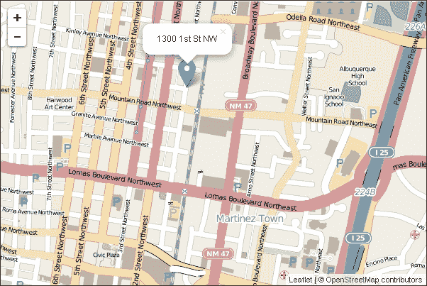

# 根据属性查询

当使用服务时，通常加载整个层。有时，您可能只想加载层数据的一个子集。使用查询将允许您只加载您感兴趣的子集。在这个例子中，您将查询涂鸦层以获取开放和关闭的案件。要创建地图，请按照以下步骤操作：

1.  参考您在先前的例子中看到的 Esri-leaflet 文件。您不需要任何额外的文件。使用 CSS 样式化`<div>`查询：

    ```js
    <style>
      #query {
        position: absolute;
        top: 10px;
        right: 10px;
        z-index: 10;
        background: white;
        padding: 1em;
      }
      #query select {
        font-size: 16px;
      }
    </style>
    ```

1.  创建选择元素并添加`Open`和`Closed`作为选项：

    ```js
    <label>
     Status
      <select id="caseStatus">
        <option value=''>Clear Screen</option>
        <option value='Open'>Open</option>
        <option value='Closed'>Closed</option>
          </select>
    </label>
    ```

1.  添加一个连接到涂鸦服务的特征层。使用`pointToLayer`选项为每个特征创建一个标记并将它们添加到地图中：

    ```js
    var graffiti =  L.esri.featureLayer('http://services.arcgis.com/ rOo16HdIMeOBI4Mb/ArcGIS/rest/services/Graffiti_Locations3 /FeatureServer/0', {
       pointToLayer: function (geojson, latlng, feature) {
          return L.marker(latlng);
        },
      }).addTo(map);
    ```

1.  创建一个`popupTemplate`变量。您可以通过浏览特征层的链接来找到参数。通过创建一个返回模板的函数来绑定弹出窗口。该模板允许您将包含在 ESRI 层中的字段传递到模板中。字段名称放在大括号中。然后，您可以使用模板作为`bindPopup()`中的字符串：

    ```js
    var popupTemplate = 
       "<h3>Details:</h3>Address:{Incident_Address_Display}<br>
    Borough: {Borough}<br>Community Board: 
    {Community_Board}<br>Police Precinct:  {Police_Precinct}<br>City_Council_District: {City_Council_District}<br>Created_Date: {Created_Date}<br>Status: {Status}<br>Resolution_Action: {Resolution_Action}<br>Closed_Date: {Closed_Date}<br>City: {City}<br>State: {State}";
    graffiti.bindPopup(function(feature){
    return L.Util.template(popupTemplate, feature.properties)
          });
    ```

1.  创建一个当选择元素改变时的事件。将当前选择的值传递给`setWhere()`方法。此方法根据`where`查询刷新特征层。在这个例子中，`where`是`status`属性的值：

    ```js
      caseStatus.addEventListener('change', function(){
      graffiti.setWhere('Status="'+caseStatus.value+'"');
      });
    ```

当您完成时，您可以选择**Closed**，地图将看起来像这样：

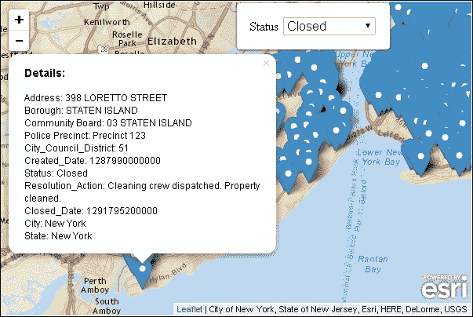

# 根据邻近度查询

在上一个例子中，您根据属性查询了特征层。您也可以根据其与点的邻近度查询特征层。在这个例子中，您将根据鼠标点击的位置查询层。以下说明将指导您创建邻近度查询：

1.  参考之前示例中的方式引用 Esri-leaflet 文件。将要素层添加到地图中。你需要传递 `pointToLayer` 选项，为每个要素返回 `circleMarker`。你需要创建圆点标记，以便在后续步骤中更改标记的颜色：

    ```js
    var graffiti = L.esri.featureLayer('http://services.arcgis.com/ rOo16HdIMeOBI4Mb/ArcGIS/rest/services/Graffiti_Locations3/FeatureServer/0', {
       pointToLayer: function (geojson, latlng) {
          return L.circleMarker(latlng);
        },
      }).addTo(map);
    ```

1.  使用要素属性创建一个弹出模板。将弹出窗口绑定到要素，如下所示：

    ```js
    var popupTemplate = "<h3>Details:</h3>Address: Incident_Address_Display}<br>Borough: {Borough}<br>Community Board: Community_Board}<br>Police Precinct: {Police_Precinct}<br>City_Council_District: City_Council_District}<br>Created_Date: {Created_Date}<br>Status: Status}<br>Resolution_Action: {Resolution_Action}<br>Closed_Date: Closed_Date}<br>City: {City}<br>State: {State}";
    graffiti.bindPopup(function(feature){
    return L.Util.template(popupTemplate, feature.properties)
      });
    ```

1.  创建一个查询。如果你浏览到该服务——在你的浏览器中放置查询的 URL 并滚动到页面底部，你将在最后一行看到这个服务支持查询。将查询传递到你想要查询的层：

    ```js
    var query = 
    L.esri.Tasks.query('http://services.arcgis.com/  rOo16HdIMeOBI4Mb/ArcGIS/rest/services/  Graffiti_Locations3/FeatureServer /0');
    ```

1.  创建一个鼠标点击事件，并使用 `runQuery()` 函数进行订阅：

    ```js
    map.on('click', runQuery);
    ```

1.  创建一个函数 `runQuery()`，当用户点击地图时执行。这个函数将执行三个操作：使用 `nearby()` 方法执行查询，传递鼠标点击的经纬度和 804 米（半英里）的距离；将所有圆点标记的样式设置为蓝色；并将查询结果传递给一个 `style` 函数，将它们变为绿色。我们在第二步使用了圆点标记，以便我们可以更改颜色以突出显示查询结果：

    ```js
    function runQuery(e){
    graffiti.query().nearby(e.latlng,804).ids(function  (error,ids){
    graffiti.setStyle(function(){return { color: "blue"};});
    for(var i=0;i<ids.length;i++){graffiti.setFeatureStyle(ids[i], {color:"green"});}});
    }
    ```

当你点击地图时，它应该看起来像这样：

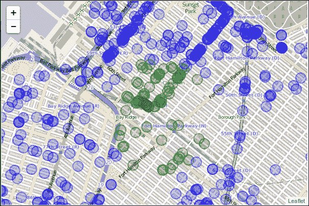

绿色标记都在用户点击位置半英里范围内。

# 摘要

在本章中，你学习了如何使用地理数据的最常见文件格式：shapefile。你还学习了如何使用 `esri-leaflet` 插件连接到 ESRI 服务，并添加底图以及五种其他 ESRI 层类型。你之前已经学习了热力图，但在这章中，你还学习了如何消费 ESRI 服务并将它们作为热力图添加。你学习了如何将地址地理编码到地图上，以及如何将点反向地理编码到街道地址。最后，你学习了如何首先通过属性然后通过位置查询 ESRI 服务。

在下一章中，你将结合所学的一切，使用 Leaflet 和其他编程语言创建一个应用程序。
