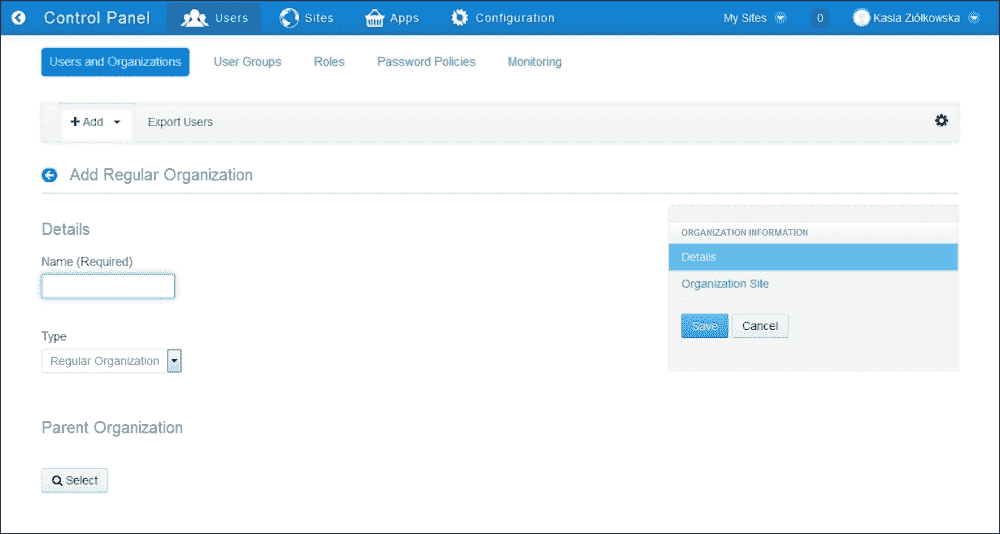
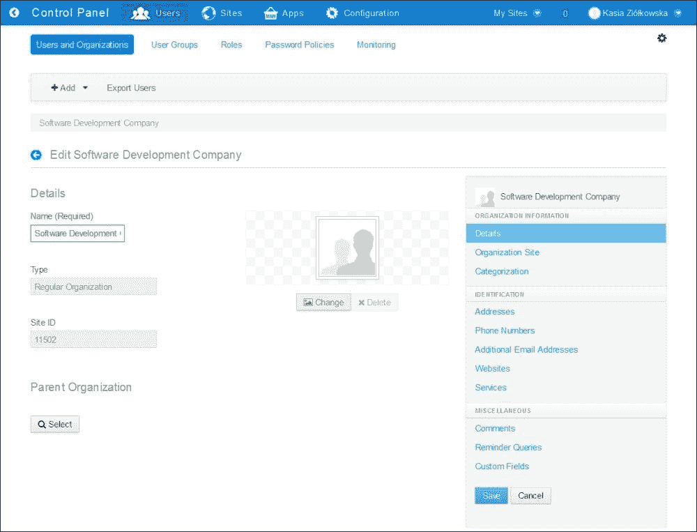
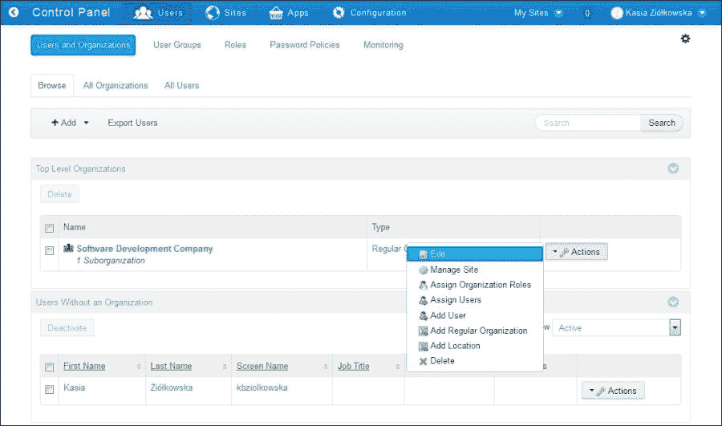
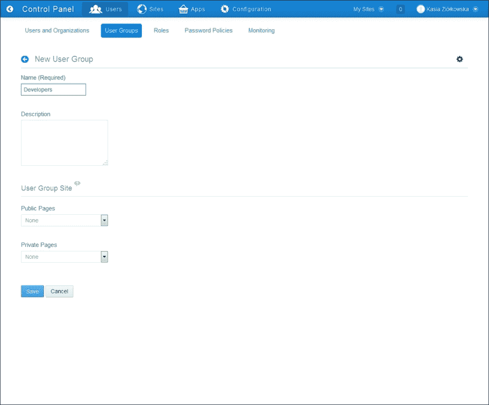
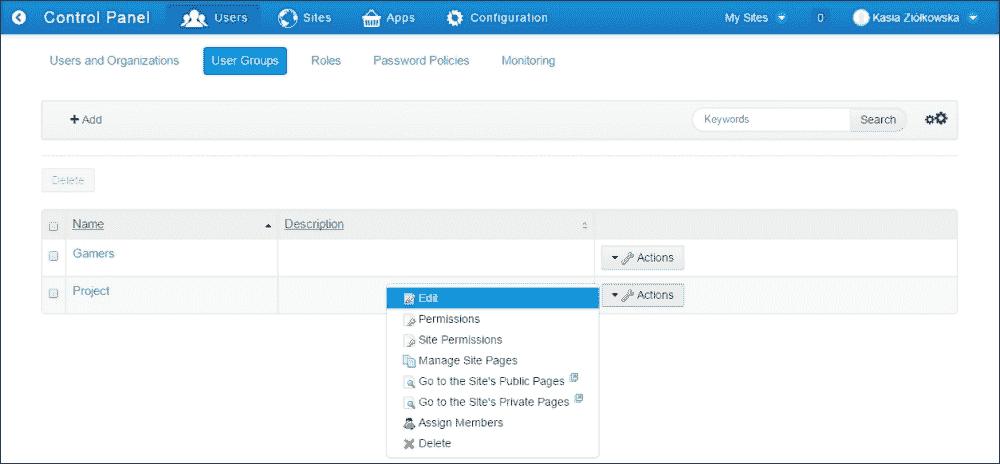
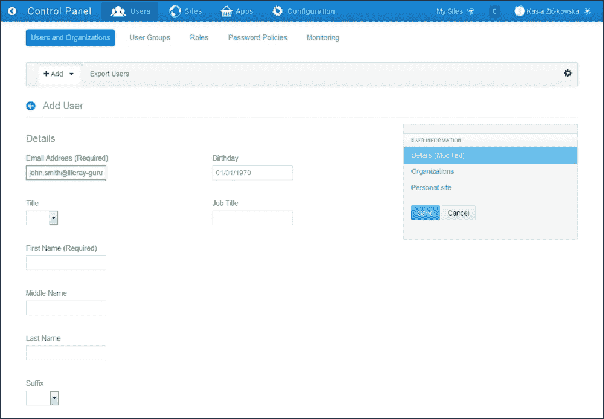
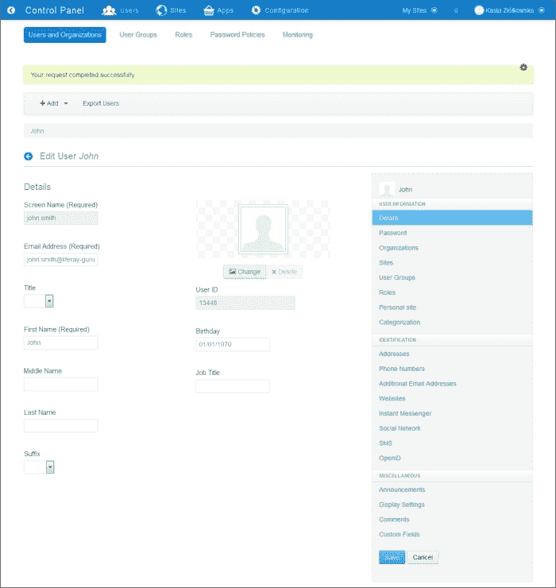
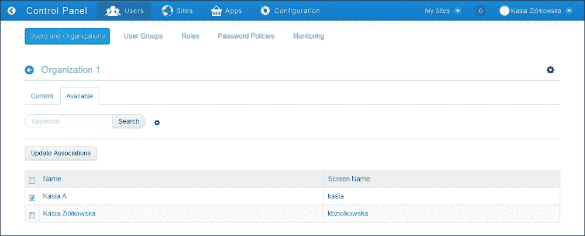
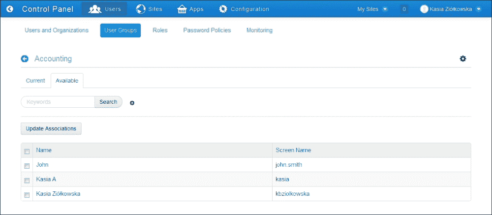
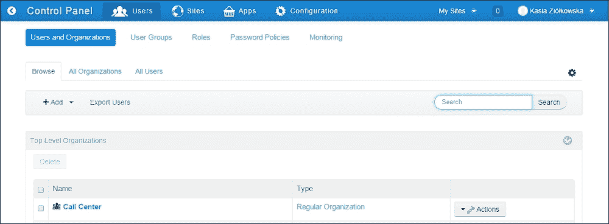

# 第三章. 与 Liferay 用户/用户组/组织协作

在本章中，我们将介绍基本功能，使我们能够管理内网的结构和用户。在本章中，我们将涵盖以下主题：

+   管理组织结构

+   创建新的用户组

+   添加新用户

+   将用户分配给组织

+   将用户分配给用户组

+   导出用户

# 简介

创建内网的第一个步骤，除了回答用户是谁的问题之外，就是确定其结构。内网的结构通常是公司或机构组织结构的衍生。Liferay Portal CMS 提供了几个工具，允许在系统中映射公司的结构。层次结构是通过与公司功能或本地化部门相匹配的组织构建的。每个组织代表一个部门或本地化，并汇集代表这些部门员工的用户。然而，有时公司中还有其他员工群体。这些群体存在于公司的组织结构之外，可以通过用户组功能在系统中反映出来。

# 管理组织结构

在 Liferay 中构建组织结构类似于在计算机驱动器上管理文件夹的过程。一个组织可以拥有其子组织，并且——除了第一级组织——同时，它也可以是另一个组织的子组织。这种类似文件夹的机制允许您创建组织的树状结构。

让我们假设我们被迫为一家软件开发公司创建一个内网。该公司的总部位于伦敦。还有两个其他办事处在利物浦和格拉斯哥。公司分为财务、市场、销售、IT、人力资源和法律部门。来自格拉斯哥和利物浦的员工属于 IT 部门。

## 如何操作…

为了创建之前描述的结构，以下是步骤：

1.  以管理员身份登录并转到**管理** | **控制面板** | **用户** | **用户和组织**。

1.  点击**添加**按钮。

1.  选择您想要创建的组织类型（在我们的示例中，它将是一个名为软件开发公司的普通组织，但也可能选择一个地点）：

1.  为顶级组织提供一个名称。

1.  选择父组织（如果创建了顶级组织，则必须跳过）。

1.  点击**保存**按钮：

1.  点击**更改**按钮并上传一个文件，其中包含您公司的图形表示（例如，标志）。

1.  使用右侧菜单导航到您想要填写信息的部分。

1.  点击**保存**按钮。

1.  通过点击返回图标（位于**编辑软件开发公司**标题旁边的左箭头图标）返回**用户和组织**列表。

1.  点击位于新创建的组织名称附近**操作**按钮。

1.  选择**添加常规组织**选项。

1.  为组织提供名称（在我们的例子中，它是 IT）。

1.  点击**保存**按钮。

1.  通过点击返回图标（位于**编辑 IT**标题旁边的左箭头图标）返回**用户和组织**列表。

1.  点击位于新创建的组织名称附近**操作**按钮（在我们的例子中，它是 IT）。

1.  选择**添加位置**选项。

1.  为组织提供名称（例如，IT 利物浦）。

1.  提供一个国家。

1.  提供一个区域（如果有的话）。

1.  点击**保存**按钮。

## 它是如何工作的...

让我们看看在前一个菜谱中我们做了什么。在第 1 步到第 6 步中，我们创建了一个名为软件开发公司的顶级新组织。在第 7 步到第 9 步中，我们定义了新创建组织的属性集。从第 11 步开始，我们创建了子组织：标准组织（IT）及其位置（IT 利物浦）。

### 创建组织

有两种类型的组织：常规组织和位置。常规组织提供了创建多层结构的能力，每个单位都可以有父组织和子组织（有一个例外：顶级组织不能有任何父组织）。定位是一种特殊的组织类型，允许我们提供一些额外的数据，例如国家和区域。然而，它不能让我们创建子组织。在创建组织树时，可以将常规组织和位置结合起来，例如，顶级组织将是常规组织，同时位置和常规组织都将用作子组织。

### 备注

在创建新组织时，非常重要的是要明智地选择组织类型，因为这是唯一不能进一步修改的组织参数。

如前所述，组织可以按树状结构排列。组织在树中的位置由父组织参数确定，该参数通过创建新组织或编辑现有组织来设置。如果没有设置父组织，则始终创建顶级组织。

创建子组织有两种方式。可以通过使用**添加**按钮并手动选择父组织来添加一个新的组织。另一种方式是进入特定组织的操作菜单，并选择**添加常规组织**操作。使用此选项创建新组织时，父组织参数将自动设置。

### 设置属性

类似地，就像现实中的对应物一样，Liferay 中的每个组织都有一组属性，这些属性被分组并可以通过组织配置文件表单进行修改。此表单在点击组织操作列表中的**编辑**按钮后可用（参见*更多内容…*部分）。所有可用属性分为以下几组：

+   **组织信息**组，其中包含以下部分：

    +   **详细信息**部分，允许我们更改组织名称、父组织、国家或地区（仅适用于位置）。组织名称是唯一的必需组织参数。它被搜索机制用于搜索组织。它也是组织站点 URL 地址的一部分。

    +   **组织站点**部分，允许我们启用组织的私有和公共页面。

    +   **分类**部分，它提供标签和分类。可以将它们分配给组织（有关标签和分类的更多信息，请参阅第八章的*标签和分类内容*配方，*搜索和内容展示工具*）。

+   **标识**，它将**地址**、**电话号码**、**附加电子邮件地址**、**网站**和**服务**部分分组。

+   **杂项**，它包括：

    +   **评论**部分，允许我们管理组织的评论。

    +   **提醒查询**部分，其中可以设置不同语言的提醒查询

    +   **自定义字段**部分，它提供了一个管理组织定义的自定义属性值的工具

### 定制组织功能

Liferay 提供了定制组织功能的可能性。在`portal-impl/src`文件夹中位于`portal.properties`文件中的**组织**部分。所有这些设置都可以在`portal-ext.properties`文件中覆盖。我们提到顶级组织不能有任何父组织。如果我们深入研究门户设置，我们可以挖掘出以下属性：

```js
organizations.rootable[regular-Organization]=true
organizations.rootable[location]=false
```

这些属性确定可以创建为根组织的组织类型。

在许多情况下，用户希望添加一个新的组织类型。为了实现这一目标，需要设置一些描述新类型的属性：

```js
organizations.types=regular-Organization,location,my-Organization
organizations.rootable[my-organization]=false
organizations.children.types[my-organization]=location
organizations.country.enabled[my-organization]=false
organizations.country.required[my-organization]=false
```

第一个属性定义了一个可用类型的列表。第二个属性禁止以根组织创建组织。下一个属性指定了我们可以创建为子组织的类型列表。在我们的案例中，这仅是位置类型。最后两个属性在创建过程中关闭了国家列表。当位置不重要时，此选项很有用。

另一个有趣的功能是能够自定义组织的个人资料表单。可以指定在创建表单上哪些部分是可用的，以及在修改表单上哪些部分是可用的。以下属性聚合了这一功能：

```js
organizations.form.add.main=details,organization-site
organizations.form.add.identification=
organizations.form.add.miscellaneous=

organizations.form.update.main=details,organization-site,categorization
organizations.form.update.identification=addresses,phone-numbers,additional-email-addresses,websites,services
organizations.form.update.miscellaneous=comments,reminder-queries,custom-fields
```

## 还有更多…

也可以修改现有的组织及其属性，并使用组织中的**操作**菜单中的操作来管理其成员。

可以对组织执行几种可能的操作：

+   **编辑**操作使我们能够修改组织的属性。

+   **管理站点**操作将用户重定向到**控制面板**中的**站点设置**部分，并允许我们管理组织的公共和私有站点（如果组织站点已经创建）。

+   **分配组织角色**操作使我们能够为组织的成员设置组织角色。

+   **分配用户**操作使我们能够将已经存在于 Liferay 数据库中的用户分配给特定的组织。

+   **添加用户**操作使我们能够创建一个新用户，该用户将自动分配到这个特定的组织。

+   **添加常规组织**操作使我们能够创建一个新的子常规组织（当前组织将自动设置为新组织的父组织）。

+   **添加位置**操作使我们能够创建一个新的位置（当前组织将自动设置为新组织的父组织）。

+   **删除**操作使我们能够删除组织。在删除组织时，所有包含端口和内容的页面也将被删除。

### 注意

如果有子组织或用户分配给组织，则无法删除组织。

为了编辑组织、分配或添加用户、创建新的子组织（常规组织或位置）或删除组织，请执行以下步骤：

1.  以管理员身份登录并转到**管理** | **控制面板** | **用户** | **用户和组织**。

1.  点击你想要修改的组织名称附近的**操作**按钮：

1.  点击所选操作的名称。

## 参见

关于组织站点信息，请参阅第四章中关于**创建组织和独立站点**以及**站点配置**的配方，来自*Liferay 站点配置*。

# 创建新的用户组

有时，除了层次结构之外，在公司内部，还有其他由共同兴趣或职业联系在一起的人群，例如从事特定项目的人、担任相同职位的人等等。在 Liferay 中，这些群体由用户组表示。此功能类似于 LDAP 用户组，其中可以设置组权限。一个用户可以被分配到多个用户组中。

## 如何操作…

为了创建一个新的用户组，请按照以下步骤操作：

1.  以管理员身份登录并前往**管理** | **控制面板** | **用户** | **用户组**。

1.  点击**添加**按钮。

1.  提供用户组的**名称**（必需）和**描述**。

1.  在**用户组站点**部分保留默认值。

1.  点击**保存**按钮。

## 它是如何工作的…

用户组功能允许我们创建用户集合，并为它们提供一个公共和/或私有站点，这些站点包含一系列协作工具。与组织不同，用户组不能用来创建多级结构。它使我们能够创建非层次结构的用户组，这些用户组可以被其他功能使用。例如，用户组可以用作公告插件的附加信息定位工具，该插件展示由授权用户发送的简短消息（公告插件允许我们将消息定向到来自特定组织或用户组的所有用户）。

还可以为用户组设置权限，并决定在此特定用户组内哪些角色可以执行哪些操作。

值得注意的是，用户组可以聚集已经是组织成员的用户。这种机制通常用于除了公司组织结构之外，还存在其他需要共同存储数据或进行信息交流的人群时。

## 更多…

还可以修改现有的用户组及其属性，并使用用户组**操作**菜单中的操作来管理其成员。

可以对用户组执行几种可能的操作。具体如下：

+   **编辑**操作允许我们修改用户组的属性

+   **权限**操作允许我们决定哪些角色可以分配此用户组的成员、删除用户组、管理公告、设置权限、更新或查看用户组

+   **管理站点页面**操作将用户重定向到**控制面板**中的站点设置部分，并允许我们管理用户组的公共和私有站点

+   **转到站点的公共页面**操作在新窗口中打开用户组的公共页面（如果已创建用户组站点的公共页面）

+   **转到站点的私有页面**操作在新窗口中打开用户组的私有页面（如果已创建用户组站点的公共页面）

+   **分配成员**操作允许我们将已经存在于 Liferay 数据库中的用户分配到这个特定的用户组

+   **删除**操作允许我们删除用户组

### 注意

如果有用户被分配到用户组，则无法删除该用户组。

为了编辑用户组、设置权限、分配成员、管理站点页面或删除用户组，请执行以下步骤：

1.  前往**管理** | **控制面板** | **用户** | **用户组**。

1.  点击位于您想要修改的用户组名称附近的**操作**按钮：

1.  点击所选操作的名称。

## 参见

关于用户组站点的信息，请参阅第四章中的*创建组织和独立站点*和*站点配置*食谱，*Liferay 站点配置*。

# 添加新用户

每个系统都是为用户创建的。Liferay Portal CMS 提供了一些不同的方法来向系统添加用户，这些方法可以根据需求启用或禁用，如第二章中所述，*认证和注册过程*。第一种方法是启用用户通过创建自己的账户来创建账户。此功能允许所有可以进入包含表单的站点的用户注册并获得访问网站指定内容的权限。在这种情况下，系统自动分配默认用户账户参数，这些参数表示他们在系统中可能执行的活动范围。第二种解决方案（我们在本食谱中介绍了）是将用户账户创建保留给管理员，管理员将决定应分配给每个账户的参数。

## 如何操作…

要添加新用户，您需要遵循以下步骤：

1.  以管理员身份登录并转到**管理** | **控制面板** | **用户** | **用户和组织**。

1.  点击**添加**按钮。

1.  选择**用户**选项。

1.  通过在**电子邮件地址（必填）**、**标题**、**名（必填）**、**中间名**、**姓**、**后缀**、**生日**和**职位**字段中提供用户的详细信息来填写表格（如果**门户设置** | **用户**部分中的**自动生成用户屏幕名称**选项被禁用，则屏幕名称字段将可用）：

1.  点击**保存**按钮：

1.  使用右侧菜单导航到您想要填写信息的数据库部分。

1.  点击**保存**按钮。

## 它是如何工作的…

在步骤 1 到 5 中，我们创建了一个新用户。通过步骤 6 和 7，我们定义了新创建用户的一组属性。此用户是活跃的，并且可以根据其成员资格和角色执行活动。要了解影响用户在系统中可能行为的所有机制，我们必须深入了解这些属性。

### 用户作为组织、用户组和站点的成员

关于用户的第一件和最重要的事情是，他们可以是组织、用户组和站点的成员。用户在其所属的每个组织、用户组或站点中执行的活动范围由分配给他们的角色决定。必须为组织中的每个用户和站点的每个用户单独分配所有角色。这意味着，例如，可以将用户指定为一个组织的管理员，而仅将其指定为另一个组织的强力用户。

### 用户属性

Liferay 中的每个用户都有一组属性，这些属性被分组，并且可以通过用户配置文件表单进行修改。此表单在点击用户操作列表中的**编辑**按钮后可用（参见*更多内容…*部分）。

所有可用的属性分为以下几组：

+   **用户信息**，包含以下部分：

    +   **详细信息**部分使我们能够提供基本用户信息，例如**屏幕名称**、**电子邮件地址**、**标题**、**名字**、**中间名**、**姓氏**、**后缀**、**生日**、**职位**和**头像**

    +   **密码**部分允许我们设置新密码或强制用户更改当前密码

    +   **组织**部分使我们能够选择用户是成员的组织

    +   **网站**部分使我们能够选择用户是成员的网站

    +   **用户组**部分使我们能够选择用户是成员的用户组

    +   **角色**选项卡允许我们分配用户角色

    +   **个人网站**部分帮助将公众和私人网站导向用户

    +   **分类**部分提供标签和分类，可以分配给用户

+   **身份验证**允许我们设置额外的用户信息，例如**地址**、**电话号码**、**附加电子邮件地址**、**网站**、**即时消息**、**社交网络**、**短信**和**OpenID**

+   **杂项**，包含以下部分：

    +   **公告**部分允许我们设置警报和公告的投递选项

    +   **显示设置**部分涵盖了**语言**、**时区**和**问候语文本**选项

    +   **评论**部分允许我们管理用户的评论

    +   **自定义字段**部分提供了一个工具来管理为用户定义的自定义属性值

### 用户网站

如前所述，Liferay 中的每个用户都可能访问不同类型的网站：组织网站、用户组网站和独立网站。然而，除此之外，用户还可以拥有自己的公共和私人网站，这些网站可以由他们自己管理。用户的公共和私人网站可以通过位于工具栏上的用户菜单（**我的个人资料**和**我的仪表板**链接）访问。也可以使用它们的地址进入这些网站，分别是`/web/username/home`和`/user/username/home`。

### 自定义用户

Liferay 在**用户**部分下提供了`portal.properties`文件中的大量设置。如果您想覆盖一些属性，请将它们放入`portal-ext.properties`文件中。

通过设置以下属性，可以阻止删除用户：

```js
users.delete=false
```

与组织的情况一样，有一个功能允许我们在创建或修改表单上自定义部分：

```js
users.form.add.main=details,Organizations,personal-site
users.form.add.identification=
users.form.add.miscellaneous=

users.form.update.main=details,password,Organizations,sites,user-groups,roles,personal-site,categorization
users.form.update.identification=addresses,phone-numbers,additional-email-addresses,websites,instant-messenger,social-network,sms,open-id
users.form.update.miscellaneous=announcements,display-settings,comments,custom-fields
```

有许多其他属性，但我们不会讨论所有这些。在`portal.properties`文件中，位于`portal-impl/src`文件夹下，在**用户**部分，可以找到所有设置，并且每一行都有注释进行说明。

## 更多信息...

系统中的每个用户都可以是活跃的或非活跃的。活跃用户可以登录到他们的用户账户，并使用他们在其角色和成员资格内可用的所有资源。非活跃用户不能进入他的账户，访问特定区域和执行活动，这些活动仅限于授权和认证的用户。

值得注意的是，活跃用户不能被删除。要从 Liferay 中删除用户，您需要先停用他们。

要停用用户，请按照以下步骤操作：

1.  以管理员身份登录并转到**管理** | **控制面板** | **用户** | **用户和组织**。

1.  点击用户名称附近的位置的**操作**按钮。

1.  前往**所有用户**选项卡。

1.  找到您想要停用的活跃用户。

1.  点击**停用**按钮。

1.  通过点击**确定**按钮确认此操作。

要激活用户，请按照以下步骤操作：

1.  以管理员身份登录并转到**管理** | **控制面板** | **用户** | **用户和组织**。

1.  前往**所有用户**选项卡。

1.  找到您想要激活的不活跃用户。

1.  点击用户名称附近的位置的**操作**按钮。

1.  点击**激活**按钮。

有时，当使用系统时，用户会报告一些异常或有些困惑，需要帮助。您需要从用户的角度查看页面。Liferay 提供了一个非常有用的功能，允许授权用户模拟其他用户。为了使用此功能，请执行以下步骤：

1.  以管理员身份登录并转到**控制面板** | **用户** | **用户和组织**。

1.  点击用户名称附近的位置的**操作**按钮。

1.  点击**模拟用户**按钮。

## 参见

+   有关用户可以执行的操作的更多信息，请参阅第五章的*分配用户角色*配方，*角色和权限*以及第九章的*用户创建过程的单一审批者工作流*配方，*Liferay 工作流功能*。

+   有关如何自定义和使用用户注册表单的信息，请参阅第二章的*自定义注册表单*配方，*认证和注册过程*。

+   有关管理用户的更多信息，请参阅以下配方

    +   本章的*导出用户*配方

    +   第五章的*分配用户角色*配方。

    +   来自第二章的*自定义注册表单*配方，*认证和注册过程*

# 将用户分配给组织

用户可以以多种方式被分配到组织。可以通过编辑已创建的用户账户来完成（请参阅*添加新用户*配方中的*用户属性*部分）或使用组织操作菜单中的**分配用户**操作。在本配方中，我们将向您展示如何使用组织操作菜单中的选项将用户分配给组织。

## 准备工作

要完成此配方，您需要一个组织和用户（参考本章中的*管理组织结构*和*添加新用户*配方）。

## 如何操作…

为了将用户从组织菜单分配到组织，请按照以下步骤操作：

1.  以管理员身份登录并转到**Admin** | **控制面板** | **用户** | **用户和组织**。

1.  点击位于您想要分配用户的组织名称附近的**操作**按钮。

1.  选择**分配用户**选项。

1.  点击**可用**选项卡。

1.  标记您想要分配的用户或用户组。

1.  点击**更新关联**按钮。

## 它是如何工作的…

Liferay 中的每个用户都可以被分配到所需的任何常规组织，并且恰好一个位置。当用户被分配到组织时，他们会在组织的用户列表中显示。他们成为组织的成员，并根据分配的角色和权限访问组织的公共和私有页面。正如前一个配方所示，在编辑组织菜单中分配用户的列表时，可以分配多个用户。

值得注意的是，管理员可以分配她或他可以管理的组织和子组织的任务。要允许组织的任何管理员将任何用户分配给该组织，请在`portal-ext.properties`文件中设置以下属性：

```js
Organizations.assignment.strict=true
```

在许多情况下，当我们的组织具有树状结构时，子组织的成员不需要访问祖先组织。要禁用此结构，请设置以下属性：

```js
Organizations.membership.strict=true
```

## 参见

+   关于如何创建用户账户的信息，请参阅

    +   本章的*添加新用户*配方

    +   来自第二章的*自定义注册表单*配方，*认证和注册过程*

+   关于将用户分配给用户组的信息，请参阅本章的*将用户分配给用户组*配方

# 将用户分配给用户组

除了是组织的成员外，每个用户还可以成为一个或多个用户组的成员。作为用户组的成员，用户可以通过访问用户组的网站或其他仅针对其成员提供的信息（例如，公告插件的发送的消息）来受益。当用户被分配到该组时，他们成为该组的成员。这种分配可以通过编辑已创建的用户账户来完成（请参阅*添加新用户*配方中的*用户属性*描述）或使用**用户组**操作菜单中的**分配成员**操作。在本配方中，我们将向您展示如何使用**用户组**操作菜单中的选项将用户分配到用户组。

## 准备工作

要逐步完成此配方，首先，您必须创建一个用户组和用户（请参阅*创建新用户组*和*添加新用户*配方）。

## 如何操作…

为了从**用户组**菜单将用户分配到用户组，请执行以下步骤：

1.  以管理员身份登录并转到**Admin** | **控制面板** | **用户** | **用户组**。

1.  点击您想要分配用户的用户组名称附近的位置的**操作**按钮。

1.  点击**分配成员**按钮。

1.  点击**可用**选项卡。

1.  标记您想要分配的用户或用户组。

1.  点击**更新关联**按钮。

## 工作原理…

如本配方所示，可以通过编辑用户组菜单中分配用户的列表将一个或多个用户分配到用户组。分配给用户组的每个用户都成为该组的成员，并根据分配的角色和权限访问用户组的公共和私有页面。

## 相关信息

+   关于如何创建用户账户的信息，请参阅

    +   本章的*添加新用户*配方

    +   第二章的*自定义注册表单*配方，*认证和注册过程*

+   关于如何将用户分配到组织的信息，请参阅本章的*将用户分配到组织*配方

# 导出用户

Liferay Portal CMS 提供了一个简单的导出机制，允许我们将数据库中存储的所有用户列表或特定组织中的所有用户列表导出到一个文件中。

## 如何操作…

为了将数据库中所有用户的列表导出到文件，请按照以下步骤操作：

1.  以管理员身份登录并转到**Admin** | **控制面板** | **用户** | **用户和组织**。

1.  点击**导出用户**按钮。

为了将特定组织的所有用户列表导出到文件，请按照以下步骤操作：

1.  以管理员身份登录并转到**Admin** | **控制面板** | **用户** | **用户和组织**。

1.  点击**所有组织**选项卡。

1.  点击用户应导出的组织的名称。

1.  点击**导出用户**按钮。

## 它是如何工作的…

如前所述，Liferay 允许我们将特定组织的用户导出为 `.csv` 文件。该 `.csv` 文件包含用户名和相应的电子邮件地址列表。您也可以通过点击位于**所有用户**选项卡上的**导出用户**按钮来导出所有用户。您可以通过访问**管理** | **控制面板** | **用户** | **用户和组织**来找到此选项卡。

## 参见

+   关于如何创建用户账户的信息，请参阅

    +   本章的*添加新用户*配方

    +   来自第二章的*自定义注册表单*配方，*认证和注册流程*

+   关于如何将用户分配给组织的信息，请参阅本章的*将用户分配给组织*配方
