# 第四章 Liferay 站点配置

在本章中，我们将涵盖以下主题：

+   创建组织和独立站点

+   站点配置

+   为站点创建和自定义公共和私有页面

+   使用页面模板和站点模板快速创建站点和页面

+   启用本地实时预览

+   启用远程实时预览

+   启用页面版本控制

# 简介

在前一章中，我们描述了如何使用组织和用户组在内部网络中建模组织结构。我们还讨论了它们的属性，如地址、电话号码、网站、服务等等。有一个属性使得组织和用户组成为 Liferay Portal CMS 非常重要的组成部分。这个属性是站点。站点是一组可能包含应用程序和内容的页面。组织或用户组内的用户可以拥有自己的站点，该站点存储和展示由其用户（文件、文章、日历事件、书签等）产生和发布的信息。也存在一些与任何结构化用户集合无关的站点。在本章中，我们将讨论如何创建、自定义和管理站点。

# 创建组织和独立站点

每个组织和用户组都可以拥有一个站点，该站点由一组公共和私有页面组成，组织成树状结构。公共页面是任何人只要拥有站点链接就可以访问的页面。私有页面是只有登录用户，即组织、用户组或独立站点的成员才能访问的页面。还可以创建一个未分配给任何组织或用户组的独立站点。独立站点还可以形成类似于前一章中描述的组织结构（例如，可以有一个顶级站点，它有子站点）。组织站点通常创建用于存储和展示内容，并为来自特定部门或公司本地化的用户提供工具。用户组站点将共享共同兴趣或属于同一项目团队的人使用的信息和工具分组。独立站点或站点结构用于在组织结构之外提供站点或站点组，这对于不同用户组的成员来说是常见的。

## 如何操作…

在这个菜谱中，我们将向您展示如何创建组织站点和独立站点。用户组站点是在设置用户组时创建的。与组织不同，没有站点无法创建用户组。

为了为现有组织创建站点，执行以下步骤：

1.  以管理员身份登录并转到**管理** | **控制面板** | **用户**| **用户和组织**。

1.  点击位于您想要修改的组织名称附近的**操作**按钮。

1.  选择**编辑**选项。

1.  在右侧菜单中点击**组织站点**链接。

1.  选择**创建站点**复选框：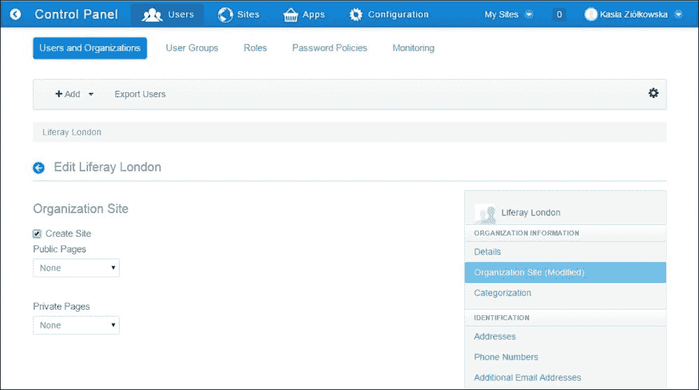

1.  点击**保存**按钮。

为了创建一个独立的站点，执行以下步骤：

1.  以管理员身份登录并转到**管理** | **控制面板** | **站点**。

1.  点击**添加**按钮。

1.  选择**空白站点**选项。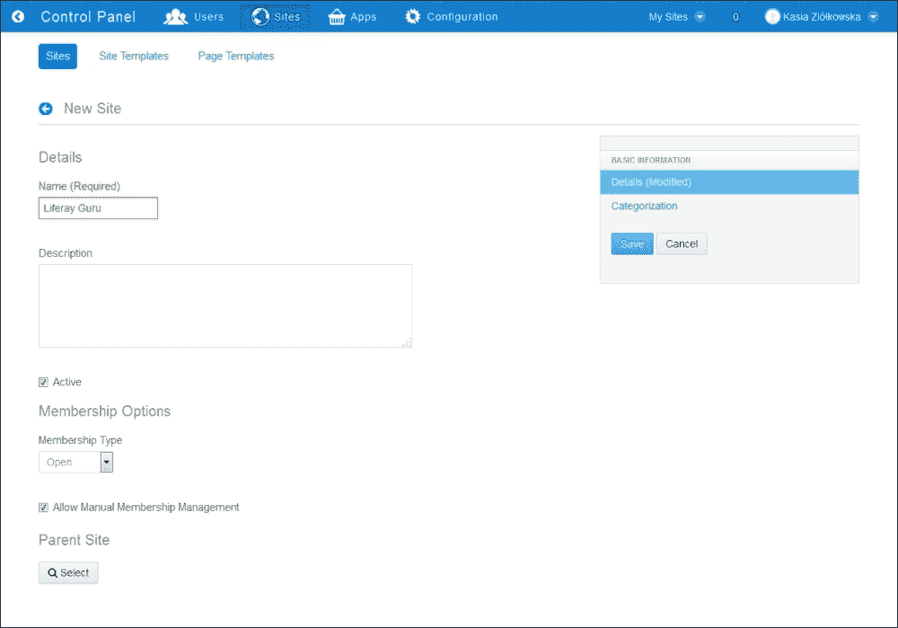

1.  为站点提供**名称（必需）**和**描述**。

1.  启用**活动**选项。

1.  选择**会员类型**。

1.  启用**允许手动会员管理**选项。

1.  选择父站点。

1.  点击**保存**按钮。

一旦创建站点，就可以添加页面，在它们上放置和配置端口，并展示内容。然而，在添加第一个页面之前，无法进入站点。有关向站点添加页面的更多信息，请参阅*为站点创建和自定义私有和公共页面*食谱。在添加第一个页面后进入站点，请执行以下步骤：

1.  转到**管理** | **控制面板** | **站点**。

1.  点击特定站点名称旁边的**操作**按钮。

1.  点击**站点管理**操作。

1.  转到**页面** | **站点页面**部分。

1.  通过点击**公共页面**或**私有页面**标签，选择您想要进入的页面集。

1.  点击**公共页面**或**私有页面**链接（取决于第 5 步中选择的标签）。

1.  点击**查看页面**链接。

您也可以通过输入 URL 来进入站点。默认 URL 地址如下：

+   `http://localhost:8080/web/site-name` 用于公共页面

+   `http://localhost:8080/group/site-name` 用于私有页面

## 它是如何工作的…

在食谱的第一部分，我们创建了一个组织站点。食谱的第二部分描述了如何添加一个独立站点。我们创建的组织和独立站点都是空的，需要我们添加和配置页面和端口。所有组织和独立站点都可以通过访问**管理** | **控制面板** | **站点**来访问。

### 活动和非活动站点

每个站点都可以设置为活动状态或非活动状态。活动站点可供用户访问。非活动站点用户无法进入，但它仍然可用，并且可以随时激活。激活选项可以在我们想要暂时关闭站点或需要永久关闭站点同时保留所有内容作为存档时使用。

### 公共和私有页面及其会员类型

每个组织、用户组或独立网站都由公共和私有页面组成，这些页面组织在两个独立的树中。公共页面是任何人只要有网站链接就可以访问的页面。在 Liferay 中，这些用户被称为访客。私有页面是只有登录用户才能访问的页面，他们是组织、用户组或独立网站的成员。当管理员将他们分配给用户或他们通过“我的网站”面板自行加入时，用户可以成为组织、用户组或独立网站的成员。我的网站面板是管理员可以放置在网站页面上的许多应用程序之一。其主要目的是显示用户是成员的网站，并列出用户可以加入或请求会员资格的其他网站。

用户成为网站成员的方式由会员资格类型定义；该参数可以在添加新网站时指定。

有三种会员资格类型：

+   **公开**: 这允许任何用户加入和离开该网站。公开网站显示在“我的网站”面板中。

+   **受限**: 在这种会员资格类型中，管理员或所有者管理用户的网站会员资格。尽管用户没有加入网站的能力，但他们可以请求会员资格并自行离开。重要的是他们的会员资格是否可以被管理员授予。受限网站也列在“我的网站”面板中。

    如果用户想加入该网站，他们可以请求会员资格。当用户发送请求或管理员批准请求时，系统会发送一封电子邮件。可以在`portal-ext.properties`中定义通知模板：

    ```js
    sites.email.from.name=
    sites.email.from.address=

    sites.email.membership.reply.subject=com/liferay/portlet/sites/dependencies/email_membership_reply_subject.tmpl
    sites.email.membership.reply.body=com/liferay/portlet/sites/dependencies/email_membership_reply_body.tmpl

    sites.email.membership.request.subject=com/liferay/portlet/sites/dependencies/email_membership_request_subject.tmpl
    sites.email.membership.request.body=com/liferay/portlet/sites/dependencies/email_membership_request_body.tmpl 
    ```

+   **私有**: 拒绝用户加入、请求会员资格或离开网站的机会。用户必须由其管理员手动分配给网站。私有网站不会显示在“我的网站”面板中。

    会员资格类型严格关联到**允许手动管理会员资格**选项，该选项确定管理员是否可以手动将用户添加到网站或从网站中删除。如果该选项启用（除手动会员管理外），它还允许用户使用“我的网站”面板加入公开网站或请求受限网站的会员资格。默认情况下，该选项对独立网站启用，对组织网站禁用，在网站管理中的用户部分不可用。

### 创建空网站与使用网站模板创建网站的方式

当创建一个新的站点时，页面树是空的。值得注意的是，当创建一个空站点（如本食谱中所述）时，在添加第一个页面之前无法进入该站点。更重要的是，新创建的站点默认设置为活动状态，这意味着用户可以立即访问它们。然而，可以使用站点模板创建预配置的公共和/或私有页面集，这些模板由预配置的站点组成，可以包含页面、小部件和内容。您可以在*使用页面模板和站点模板快速创建站点和页面*食谱中找到更多关于模板的信息。

### 技术视图

从技术角度来看，一个站点是一组布局。在数据库中，每个站点都存储在`Group_`表中。理解这个概念可能很困难。然而，它是 Liferay 中最重要功能之一。

Liferay 允许管理员在同一服务器上运行多个门户实例。在基本安装中，它被称为 Liferay.com。请记住，门户实例会将其数据与每个门户实例（在同一数据库或不同数据库中）分开存储。

每个门户实例可以聚合许多组：组织、用户组、团队、用户和站点。所有这些设置都有一个不同的`groupId`，但它们都存储在同一个名为`Group_`的表中。此外，布局（页面）可以从模板（页面模板或/和站点模板）创建。此外，用户可以有他们的私人页面和公共页面。这些信息也存储在`Group_`表中。总的来说，`Group_`包含以下设置：

+   组（站点）

+   组织

+   用户组

+   用户

+   团队

+   布局原型

+   布局集原型

为了在`Group_`表中区分这些记录，有两个列：

+   `classNameId`包含`className`（类的名称存储在`ClassName_`）表的 ID

+   `classPK`是该特定类的键，例如，用户、团队或仅仅是组

每个站点只能有私人页面或公共页面，或两者都有。公共页面对任何人可访问，特别是未登录的用户。私人页面仅对属于此站点的组织的用户可访问。每个都是一组页面（布局），定义了默认主题、语言、标志等。Liferay 将这些信息包含在`LayoutSet`表中。这些设置是每个布局的默认设置。例如，如果一个布局没有定义主题，这个设置来自`LayoutSet`。

## 更多...

同样，也可以通过站点操作菜单中的操作来管理站点。

可以在站点上执行几种可能的操作：

+   **站点管理**操作将用户重定向到**控制面板**中的站点设置部分，并允许他们管理组织的公共和私有站点

+   **添加子站点**操作允许我们创建子站点

+   **查看子站点**操作允许我们浏览子站点的列表。

+   **转到公共页面**操作在新窗口中打开站点的公共页面。

+   **转到私有页面**操作在新窗口中打开站点的私有页面。

+   **激活**操作允许我们激活站点。

+   **停用**操作允许我们停用站点。

+   **删除**操作允许我们删除一个站点。

+   **离开**操作允许用户离开站点。此选项仅当用户是站点的成员时才可用。

为了执行前面列出的操作之一，请按照以下步骤操作：

1.  前往**控制面板** | **站点**。

1.  点击位于您想要修改的站点的名称附近的**操作**按钮。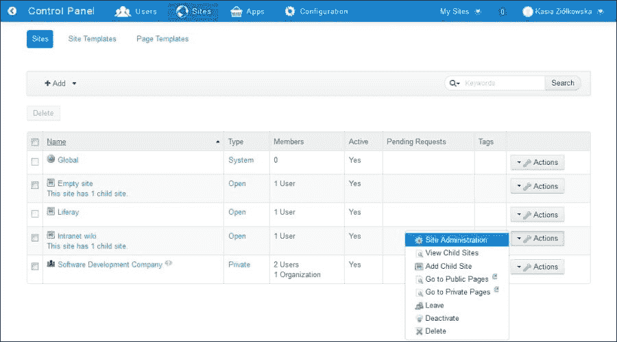

1.  点击所选操作的名称。

## 参见

您还可以参考以下菜谱：

+   有关创建组织和用户组的信息，请参阅第三章 *与 Liferay 用户/用户组/组织一起工作*中的*管理组织结构*和*创建新用户组*菜谱。

+   有关自定义站点和向其添加页面的信息，请参阅*站点配置*和*为站点创建和自定义私有和公共页面*菜谱。

+   有关创建站点的更多信息，请参阅*使用页面模板和站点模板快速创建站点和页面*菜谱。

# 站点配置

当创建站点后，您可以配置每个站点的参数，但可能的选项范围由站点的来源（它是否是组织、用户组或独立站点）决定。创建组织站点后，**站点设置**部分的链接将出现在组织菜单及其操作菜单中。所有新的组织和独立站点也将在您前往**管理** | **控制面板** | **站点**时看到的列表中可见。用户组页面不包括在这个列表中，但可以通过前往**管理** | **控制面板** | **用户组**从特定用户组的操作菜单中访问。

## 准备工作

要逐步完成这个菜谱，您必须首先创建一个站点（有关如何创建站点的更多信息，请参阅*创建组织和独立站点*菜谱）。

## 如何操作…

在这个菜谱中，我们将向您展示如何设置组织站点和独立站点的参数。

为了配置组织的站点，请按照以下步骤操作：

1.  以管理员身份登录并前往**管理** | **控制面板** | **用户和组织**。

1.  点击位于您想要配置的组织的名称附近的**操作**按钮。

1.  选择**管理站点**选项。

1.  填写**详细信息**、**搜索引擎优化**、**高级**和**杂项**字段。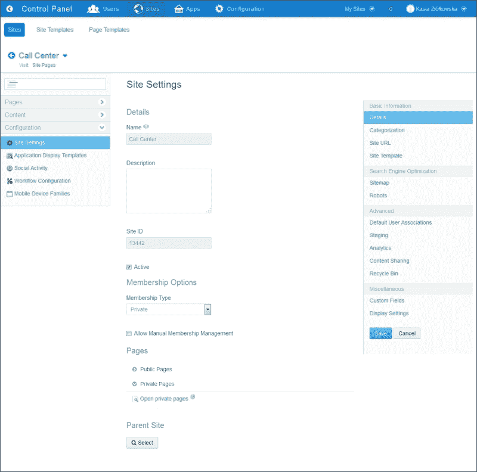

1.  点击**保存**按钮。

为了配置独立网站，请执行以下步骤：

1.  以管理员身份登录并转到**管理** | **控制面板** | **网站**。

1.  点击位于网站名称附近的**操作**按钮。

1.  选择**网站管理**选项。

1.  前往**配置**部分。

1.  填写**详细信息**、**搜索引擎优化**、**高级**和**杂项**字段。

1.  点击**保存**按钮。

## 它是如何工作的…

所有可用参数分为以下几组：

+   **基本信息**组，包含以下部分：

    +   **详细信息**部分包含一组选项，允许更改名称、描述、会员选项、创建公共和私有页面、选择父站点或激活和停用网站

    +   **分类**部分，提供了可以分配给网站的标签和分类

    +   **网站 URL**部分，允许用户输入将被公共和私有页面使用的友好 URL

    +   **网站模板**部分，显示了用于创建公共和私有页面的模板名称及其基本设置

+   **搜索引擎优化**，包括以下部分：

    +   **网站地图**部分，允许用户发送网站地图信息以进行预览

    +   **机器人**部分，允许我们为公共和私有页面设置机器人参数

+   **高级**，包括以下部分：

    +   **默认用户关联**部分，允许我们定义应分配给网站用户的默认网站角色和团队

    +   **预览**部分，允许我们启用预览功能

    +   **分析**部分，允许用户定义用于此组页面的 Google Analytics ID 或 Piwik 脚本

    +   **内容共享**部分，允许我们决定子站点是否可以显示此网站的内容

    +   **回收站**部分，允许用户启用回收站功能并移动垃圾箱中的条目；垃圾箱会在指定天数后自动删除存储的内容

+   **杂项**，包含以下部分：

    +   **自定义字段**部分，提供了一个工具来管理为网站定义的自定义属性值。

    +   **显示设置**部分，允许用户设置网站的语言。可以使用默认语言选项或定义一个自定义默认语言以及此网站的其他可用语言。

每个部分都可以通过设置以下属性在`portal-ext.properties`中进行自定义：

```js
sites.form.add.main=details,categorization
sites.form.add.seo=
sites.form.add.advanced=
sites.form.add.miscellaneous=

sites.form.update.main=details,categorization,site-url,site-template
sites.form.update.seo=sitemap,robots
sites.form.update.advanced=default-user-associations,staging,analytics,content-sharing,recycle-bin
sites.form.update.miscellaneous=custom-fields,display-settings
```

另一个有趣的功能是在网站之间共享内容（从父站点到子站点）。可以通过`sites.content.sharing.with.children.enabled`属性进行设置。以下是可能的值：

+   **0**禁用了所有网站与子站点的共享内容

+   **1**默认禁用了内容共享，同时允许网站管理员按站点启用它

+   **2**默认启用内容共享，同时允许站点管理员按站点禁用

下一个设置对应于前面的设置。管理员可以是多个站点的成员。允许或拒绝管理员管理的站点之间内容共享是可能的。要启用或禁用此功能，设置以下属性：

```js
sites.content.sharing.through.administrators.enabled=true
```

最后的属性设置对应于站点地图。每个站点地图都可以通过特定的时间单位（总是、每小时、每天、每周、每月、每年或更新）刷新。在站点地图中，页面可以有一个默认优先级（介于 0.0 到 1.0 之间）。设置以下属性以排序这些设置：

```js
sites.sitemap.default.change.frequency=daily

sites.sitemap.default.priority=
```

## 相关链接

有关创建站点的更多信息，请参阅*创建组织和独立站点*和*使用页面模板和站点模板快速创建站点和页面*指南。

# 创建和自定义站点的公共和私有页面

如前所述，一个站点内有两组页面：公共页面和私有页面。组内的每个页面都是单独的树状结构的一部分，反映了网站的信息架构层级。树中的页面可能因目的和来源而有所不同。页面可能只是显示在端口中排列的信息的地方。它可以提供一系列工具供网站内容管理员使用。还可以添加一个链接到同一站点或不同站点的另一个页面的页面。此外，页面可以创建为空页面、现有页面的副本或基于定义的模板。

## 准备工作

要逐步完成此指南，您必须首先创建一个站点（有关如何创建站点的更多信息，请参阅*创建组织和独立站点*指南）。

## 如何操作…

以下指南将说明如何创建页面并安排其结构。

为了创建公共页面，请按照以下步骤操作：

1.  以管理员身份登录并转到**管理** | **控制面板** | **站点**。

1.  点击位于站点名称附近的**操作**按钮。

1.  选择**站点管理**选项。

1.  点击左侧菜单中的**页面**部分中的**站点页面**链接。

1.  确保您处于**公共页面**选项卡。

1.  点击**添加页面**按钮（由**+**图标表示）。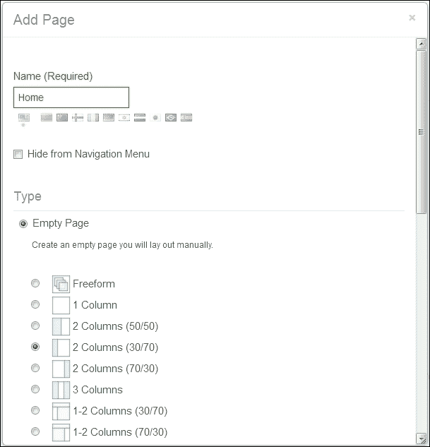

1.  提供页面的名称（在我们的例子中，它是**主页**）。

1.  启用**从导航菜单中隐藏**选项。

1.  选择**空页面**类型。

1.  选择页面布局。

1.  点击**添加页面**按钮。

1.  点击**公共页面**树中新增页面的名称。

1.  点击**添加子页面**按钮。

1.  提供页面的名称（例如，新闻）。

1.  禁用**从导航菜单中隐藏**选项。

1.  选择**空页面**类型。

1.  选择页面布局。

1.  点击**添加页面**按钮。

## 工作原理…

如前一个示例所示，创建页面是一个非常简单的操作，需要我们提供一些基本信息，例如：

+   **名称**，用于标识页面。名称将在所有列出页面的端口中显示，并且（如果未设置页面标题）将用作页面 HTML 标题。

+   页面布局决定了它是否应由一列、两列或其他列的组合组成。

+   **从导航菜单中隐藏**选项允许我们管理页面的可见性。如果启用此选项，则页面在导航菜单、导航端口、网站地图端口等中不可见。

+   **类型**选项允许用户选择新创建页面的类型。以下是一些页面类型：

    +   **空白页面**：将添加一个空白页面

    +   **面板**：这允许我们创建一个带有预定义应用程序和导航的页面

    +   **嵌入式页面**：这展示了来自另一个网站的内容

    +   **链接到 URL**：这是指向另一个网站的链接

    +   **链接到本站页面**：这是指向当前站点内另一个页面的链接

    +   **本站页面副本**：这是从本站点复制现有页面的副本

    此外，还有一个可以使用的页面模板列表。

值得注意的是，正如前一个示例所示，页面的级别是在我们点击**添加子页面**按钮之前选择的标记的页面所决定的。如果我们想创建一个顶级页面，必须选择公共页面或（私人页面）分支。更重要的是，我们还可以通过简单地将页面拖放到不同的树级别来管理页面在树中的本地化。

有许多其他参数会影响页面的外观和行为。这些参数可以通过访问**管理** | **控制面板** | **站点** | **页面** | **站点页面**来管理。

### 页面参数

页面定制选项（在**管理** | **控制面板** | **站点** | **页面** | **站点页面**）中点击页面名称链接的相应选项卡后可用，分为以下部分：

+   **详细信息**部分，允许我们更改在添加页面时设置的参数，例如**名称**、**类型**、**友好 URL**、**页面布局**，例如**1 列**、**2 列（50/50）**、**2 列（30/70）**等等，并决定是否将页面从导航菜单中隐藏。

+   **SEO**部分，允许我们提供有助于优化页面以供搜索引擎使用的信息，例如 HTML 标题、元标签、描述、关键词、机器人信息以及网站地图选项。

+   **外观和感觉**部分，允许我们决定应使用哪种外观和感觉来构建网站。可以使用与整个树相同的配置（选择**使用公共页面的外观和感觉**选项）或通过选择**为该页面定义特定的外观和感觉**选项来自定义它。

+   **JavaScript** 部分，允许我们定义将在页面底部执行的 JavaScript 代码。

+   **自定义字段** 部分，提供管理为页面定义的自定义属性值的工具。

+   **高级** 部分，允许我们设置出现在导航菜单中的页面的目标和图标。

+   **移动设备规则** 部分，允许我们决定是否使用公共页面的移动设备规则或为此页面定义特定的移动设备规则。

+   **自定义设置** 部分，允许我们决定哪些页面部分将对具有所需权限的用户可自定义。

### 整个树参数

还可以设置整个页面树的某些参数（在点击 **Admin** | **控制面板** | **站点** | **页面** | **站点页面** 对应选项卡上的公共页面或私有页面链接后可用）。以下参数如下：

+   **外观和感觉** 部分，允许我们选择此组页面的图形主题、项目符号样式和配色方案；决定是否默认显示端口边界；或插入在主题之后加载的自定义 CSS。

+   **Logo** 部分，允许我们设置此特定页面树的标志，并决定是否显示站点名称

+   **JavaScript** 部分，允许我们定义将在页面底部执行的 JavaScript 代码

+   **高级** 部分，允许我们将我们门户默认站点的公共页面与当前站点的公共页面合并。

+   **移动设备规则** 部分，允许用户定义设备组和相应的规则

### 技术视图

布局存储在 `Layout` 表中。此表有以下列：

+   `plid`: 唯一标识符

+   审计字段（`groupId`, `companyId`, `userId`, `userName`, `createDate`, `modifiedDate`）

+   `name`: 布局名称

+   `type_`: 以下值之一—`portlet`, `panel`, `embedded`, `url`, `link_to_layout`

+   `friendlyURL`: 指向特定布局的友好 URL

+   `typeSettings`: 布局聚合设置

+   任何其他对理解此配方不重要的列

## 还有更多…

还可以使用可用的操作来管理页面。

在站点页面上可以执行以下几种可能的操作：

+   **权限** 操作允许我们设置站点页面的权限

+   **复制应用程序** 操作用于从另一个页面复制所有端口（及其配置）

+   **转到私有页面** 操作在新窗口中打开站点的私有页面

+   **删除** 操作允许我们删除一个页面

为了执行前面列出的操作之一，请执行以下步骤：

1.  以管理员身份登录并转到 **Admin** | **控制面板** | **站点**。

1.  点击你想要修改的站点名称附近的 **操作** 按钮。

1.  点击 **站点管理** 选项。

1.  选择要修改的页面。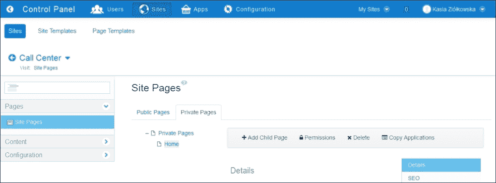

1.  点击所选操作的名称。

# 使用页面模板和站点模板快速创建站点和页面

在某些情况下，所选组或甚至整个内网中的所有站点都应该包含相同的页面集，包括相同的组件集。例如，当站点用作部门网站或项目空间时，可以采用此模型。Liferay 提供了一个非常有效的工具，允许我们使用预先准备的模板创建整个预配置的站点或页面。还可以启用模板与站点之间的连接，这将确保变更的实时传播。

## 如何操作…

在这个菜谱中，我们将向您展示如何使用站点模板创建独立站点，以及如何从页面模板创建单个页面。

为了使用站点模板创建独立站点，请执行以下步骤：

1.  以管理员身份登录并转到**管理** | **控制面板** | **站点**。

1.  点击**添加**按钮。

1.  从下拉列表中选择您想要使用的模板（例如，**社区站点**）。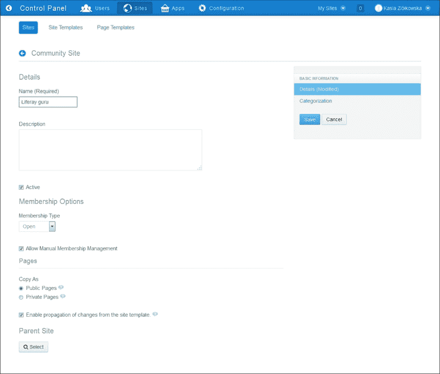

1.  提供站点的**名称（必需）**和**描述**。

1.  确保已启用**激活**选项。

1.  选择**成员类型**。

1.  启用或禁用**允许手动成员管理**选项。

1.  选择**复制为** | **公共页面**选项。

1.  设置**启用从站点模板传播变更**选项。

1.  选择**父站点**。

1.  点击**保存**按钮。

为了使用页面模板创建页面，请执行以下步骤：

1.  点击位于站点名称附近**操作**按钮。

1.  选择**站点管理**选项。

1.  点击**站点页面**部分。

1.  点击**公共页面**标签页。

1.  点击**添加页面**按钮：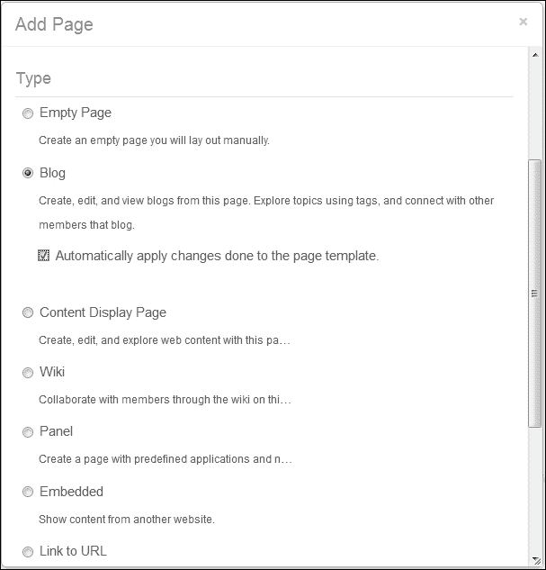

1.  提供页面的**名称**（例如，**博客**）。

1.  启用**从导航菜单中隐藏**选项。

1.  选择页面的**博客**页面类型。

1.  点击**添加页面**按钮。

## 它是如何工作的…

模板有两种类型：**页面模板**和**站点模板**。

页面模板是创建单个页面的基础，可以在创建新页面时选择。可以通过访问**管理** | **控制面板** | **页面模板**进行配置。页面模板不仅存储页面配置，还存储组件及其配置，在某些情况下，还包括内容。

站点模板用于创建整个站点，可以通过访问**管理** | **控制面板** | **站点模板**进行管理。在创建独立站点、用户组或组织站点时，可查看模板列表。站点模板可能包含一组页面及其配置、组件和内容。

### 变更传播

在创建站点表单模板时，重要的是决定是否应该启用从站点模板的更改传播。当传播被启用时，对模板所做的更改将自动应用于连接到它的站点。

值得注意的是，模板可能允许站点管理员根据模板修改站点。当模板允许修改（**启用从站点模板传播更改** 选项已启用）时，对站点页面（站点配置和端口配置）的每次修改都会导致与模板断开连接。当不允许模板修改时，站点管理员无法更改页面的配置及其端口。

### 技术视图

站点模板和页面模板存储在 `LayoutSetPrototype` 和 `LayoutPrototype` 表中。`LayoutSetPrototype` 包含属于特定布局集的布局的默认信息。如前所述，站点模板定义了一组在创建新站点后可以复制的页面。

页面模板是为了在其他页面中复制而创建的页面。`LayoutPrototype` 表存储有关页面原型的所有必要信息。

## 相关链接

关于创建新空站点的信息，请参考 *创建组织和独立站点* 菜单。

# 启用本地实时预览

预览是一个强大的工具，它允许用户在将新站点的配置投入生产之前对其进行更改、部署和测试。换句话说，它提供了一个只有管理员才能看到的测试环境。用户可以预览他们的工作；这意味着他们有在网站工作副本上工作的能力。

Liferay 为站点管理员提供了使用本地实时预览和远程实时预览的可能性。当我们谈论本地实时预览时，预览站点和实时站点位于同一个 Liferay 实例和同一服务器上。远程实时预览提供了在不同的主机（在生产环境中不可见）配置和测试更改的可能性，并将更改部署到生产环境。

## 如何操作…

要启用本地实时预览，请按照以下步骤操作：

1.  以管理员身份登录并转到 **Admin** | **站点管理** | **配置** | **站点设置**。

1.  在 **高级** 部分中选择 **预览** 选项卡。

    ### 小贴士

    当启用从站点模板传播更改时，无法使用预览功能。

1.  选择 **本地实时** 选项。

1.  决定是否需要页面版本控制。

1.  选择应进行预览的端口。Liferay 定义以下规则：

    ### 注意

    当端口被选中时，其数据将被复制到预览中，并且可能无法直接在实时中编辑。当取消选中端口时，请确保首先发布在预览中进行的任何更改；否则，它们可能会丢失。

1.  保存此配置后，网站工具栏上应该有另外两个按钮：**预览** 和 **实时**。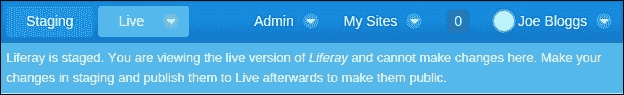

## 它是如何工作的…

预览是一个强大的功能，为用户提供了一个测试区域。启用预览后，门户为用户提供两个区域：

+   **实时**: 提供一个现实世界的视图

+   **预览**: 提供一个测试和配置特定布局或端口的区域

实时视图是一个真实视图，展示给所有有权访问该页面的用户。预览视图是一个技术区域，用户可以在此更改设置而不会影响实时视图。如果管理员准备提交和发布更改，他们可以通过点击 **发布到实时** 按钮来完成。

从技术上讲，这是一个简单的机制。Liferay 创建一个新的组，其 *友好 URL* 值带有后缀 *-staging*（例如，*/guest-staging*）。此组包含其布局、端口设置、内容等。

启用预览后，Liferay 会调用一个后台进程，该进程将布局、端口设置和特定内容复制到预览组（带有新的 `groupId`）。

### 注意

此过程可能相当耗时，因此 Liferay 提供以下信息：

**初始预览发布正在进行中。发布状态可以在发布屏幕上检查。**

此外，Liferay 还在 `Group_.typeSettings` 列中存储有关预览的信息：

```js
staged-portlet_{NUMBER}=true
stagedRemotely=false
staged=true
```

启用预览后，Liferay 会将大量数据复制到数据库中。如果您有大量数据，请小心操作并跟踪数据库性能。

## 参见

如果您想配置远程实时预览，请参阅下一道菜谱。有关启用页面版本的信息，请参阅 *启用页面版本* 菜谱

# 启用远程实时预览

Liferay 为单独的测试区域和生产环境提供远程实时预览。在本地服务器上，我们可以在发布事件更改传播到生产环境后配置和测试新的布局或整个站点。为了实现这一点，两个服务器都必须了解彼此。

## 如何操作…

假设测试环境的本地服务器名为 `STAGING_SERVER`，生产环境的服务器机器为 `PRODUCTION_SERVER`。

要正确配置远程实时预览，请按照以下步骤操作：

1.  在本地服务器（`STAGING_SERVER`）的 `portal-ext.properties` 中，设置以下属性：

    ```js
    tunnel.servlet.hosts.allowed=127.0.0.1,PRODUCTION_SERVER_IP
    axis.servlet.hosts.allowed=127.0.0.1, PRODUCTION_SERVER_IP
    tunneling.servlet.shared.secret=SHARED_SECRET
    auth.verifier.TunnelingServletAuthVerifier.hosts.allowed=
    ```

1.  在远程服务器（`PRODUCTION_SERVER`）的 `portal-ext.properties` 中，设置以下属性：

    ```js
    tunnel.servlet.hosts.allowed=127.0.0.1,LOCAL_SERVER_IP
    axis.servlet.hosts.allowed=127.0.0.1, LOCAL_SERVER_IP
    tunneling.servlet.shared.secret=SHARED_SECRET
    auth.verifier.TunnelingServletAuthVerifier.hosts.allowed=
    ```

    ### 注意

    确保共享密钥 `SHARED_SECRET` 由 16、32 或 64 个字符组成。

1.  重启两个服务器。

1.  在本地（`STAGING_SERVER`）服务器上，转到 **管理** | **站点管理** | **配置** 并从右侧菜单打开 **预览** 选项卡。

1.  选择 **远程实时** 单选按钮。

1.  在表单中填写以下输入：

    +   **远程主机/IP**: `PRODUCTION_SERVER` 的 IP 地址

    +   **远程端口**: `PRODUCTION_SERVER` 的端口号

    +   **远程路径上下文**：Liferay 实例的上下文名称（如果它是根（`/`）上下文，则留空）

    +   **远程站点 ID**：我们配置将要安装的站点的标识符（`groupId`）。如果该站点不存在，则创建它。

        ### 小贴士

        可以通过转到**站点** | **管理** | **配置** | **站点设置** | **站点 ID**来找到`groupId`编号。

1.  点击**保存**按钮。

1.  在停靠栏区域成功配置后，我们应该看到以下视图：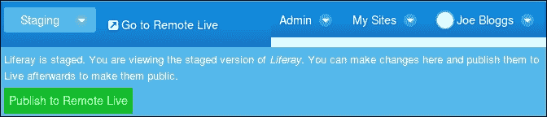

## 它是如何工作的…

远程预览比本地预览更复杂。Liferay Portal 使用两种开箱即用的机制：

+   将布局导出到本地服务器的 LAR 文件，并在远程服务器上导入

+   通过使用`StagingServiceHttp`类使用 SOAP API 传输文件

在`portal-ext.properties`中设置的属性允许我们通过外部客户端调用门户 API。为了允许这样做，我们设置了`PRODUCTION_SERVER_IP`和`LOCAL_SERVER_IP`。还有一个名为`tunneling.servlet.shared.secret`的属性，它用于创建一个授权上下文（权限检查器），以帮助确保远程发布过程的安全。

在建立服务器之间的连接后，系统将所有设置导出到 LAR 文件（一个称为 Liferay 存档文件的特殊文件）并通过调用`updateStagingRequest`进行传输。整个过程在`com.liferay.portal.lar.backgroundtask.LayoutRemoteStagingBackgroundTaskExecutor`类中实现。

远程预览的信息保存在`Group_.typeSettings`数据库列中，具有以下属性：

```js
staged-portlet_{NUMBER}=true
staged=true
stagedRemotely=true
remoteGroupId=GROUP_ID
remoteAddress=ADDRESS
remotePort=PORT_NUMBER
secureConnection=false
```

### 注意

本地实例和远程实例中的用户必须相同，包括相同的凭据以及角色和权限。

# 启用页面版本控制

页面版本控制仅在启用预览时才有效。这个功能有两个主要优点：

+   允许用户以并行方式在不同的页面版本上工作

+   保留页面历史记录并为用户提供备份点

## 如何操作…

启用页面版本控制是一个简单的过程。执行以下步骤：

1.  以管理员身份登录，转到**管理** | **站点管理** | **配置**并打开**预览**选项卡。

1.  在**版本控制**部分选择**在公共页面上启用**。

1.  通过点击**保存**按钮进行确认。

1.  启用版本控制后，停靠栏应显示以下信息：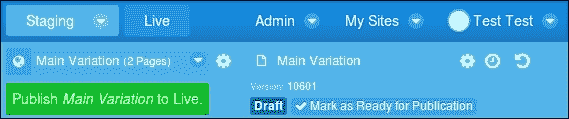

## 它是如何工作的…

使用页面版本控制与使用代码仓库（如 Git 或 Subversion）类似。此机制与所有站点（`LayoutSet`）和特定页面（`Layout`）相关联。这意味着可以版本化整个站点或单个页面。此外，Liferay 提供了一个分支更改的功能。如果用户想要重新组织整个站点，此功能将非常有用。下一个重要的按钮是停靠栏右上角的撤销/重做箭头。

从技术角度来看，Liferay 定义了另一个表来保存分支和版本：

+   `LayoutSetBranch`：存储站点分支

+   `LayoutBranch`：存储布局（页面）分支

+   `LayoutRevision`：存储布局（页面）修订——撤销/重做和版本控制功能

## 参见

如果您想配置预发布，请参考 *启用本地实时预发布* 和 *启用远程实时预发布* 的配方。
