# 第六章：Liferay 中的文档和媒体

在本章中，我们将涵盖以下主题：

+   使用文档和媒体小部件在 Liferay 中管理文件

+   管理文档类型和元数据集

+   与亚马逊 S3 云服务集成

+   之间存储钩子的数据迁移

# 简介

任何内联网的主要任务都是允许公司员工之间高效地交换信息。在大多数情况下，业务知识以文件的形式存储，如果公司没有专用的系统，则分布在邮箱、网络驱动器、FTP 服务器、员工计算机驱动器和外部数据载体之间。在这种情况下，通常存在一个问题，即确定谁拥有当前版本的文件，是否真的存在这样的文档，或者在哪里可以找到它们。Liferay 通过提供文件内部存储库来帮助处理信息的分散。

# 使用文档和媒体小部件在 Liferay 中管理文件

Liferay 中的每个站点都有自己的独立存储库，可以通过转到**管理** | **站点管理** | **内容** | **文档和媒体**来访问。此外，还可以将文档和媒体小部件放置在可以由没有访问管理功能的用户之间共享的页面之一上。文档和媒体小部件允许我们管理可以在站点内发布的所有文件夹和文档。

## 如何操作…

文档和媒体小部件提供了创建、编辑和删除文件夹、文档和快捷方式的工具。它还使我们能够通过上传整个文件组来创建多个文档。本食谱将涵盖所有基本操作，以便创建一个高效且易于搜索的文档和文件夹结构。

### 创建新文件夹

要添加新文件夹，请执行以下步骤：

1.  以管理员身份登录并转到**管理** | **站点管理** | **内容** | **文档和媒体**。

1.  点击**添加**按钮。

1.  选择**文件夹**或**子文件夹**选项。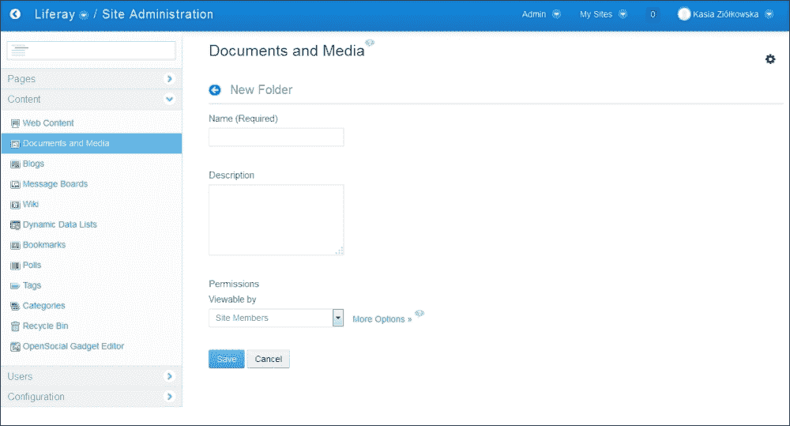

1.  输入文件夹的**名称（必填）**。

1.  输入文件夹的**描述**。

1.  通过设置特定角色可能执行的所有操作来确定文件夹的**权限**（您可以在点击**更多选项**链接后找到更多权限）。

1.  点击**保存**按钮。

### 编辑文件夹

要编辑文件夹，请执行以下步骤：

1.  以管理员身份登录并转到**管理** | **站点管理** | **内容** | **文档和媒体**。

1.  前往您想要编辑的文件夹。

1.  点击其操作图标（当悬停在文件夹缩略图上时可见的向下箭头图标）。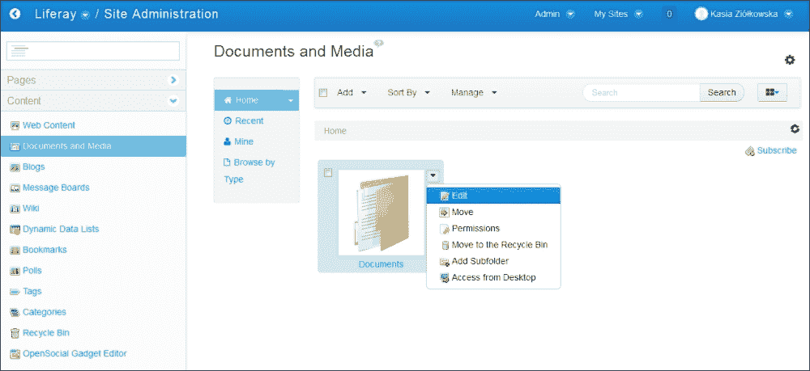

1.  点击**编辑**按钮。

1.  为文件夹提供新的**名称**。

1.  输入文件夹的新**描述**。

1.  确定文档类型限制和工作流定义设置对此特定文件夹的工作方式。您可以通过转到**文档类型限制和工作流**选项，设置**使用父文件夹的文档类型限制和工作流**。

1.  点击**保存**按钮。

### 添加新文档

要添加新文档，请执行以下步骤：

1.  以管理员身份登录并转到**管理** | **站点管理** | **内容** | **文档和媒体**。

1.  点击**添加**按钮。

1.  选择适当的文档类型，例如，基本文档。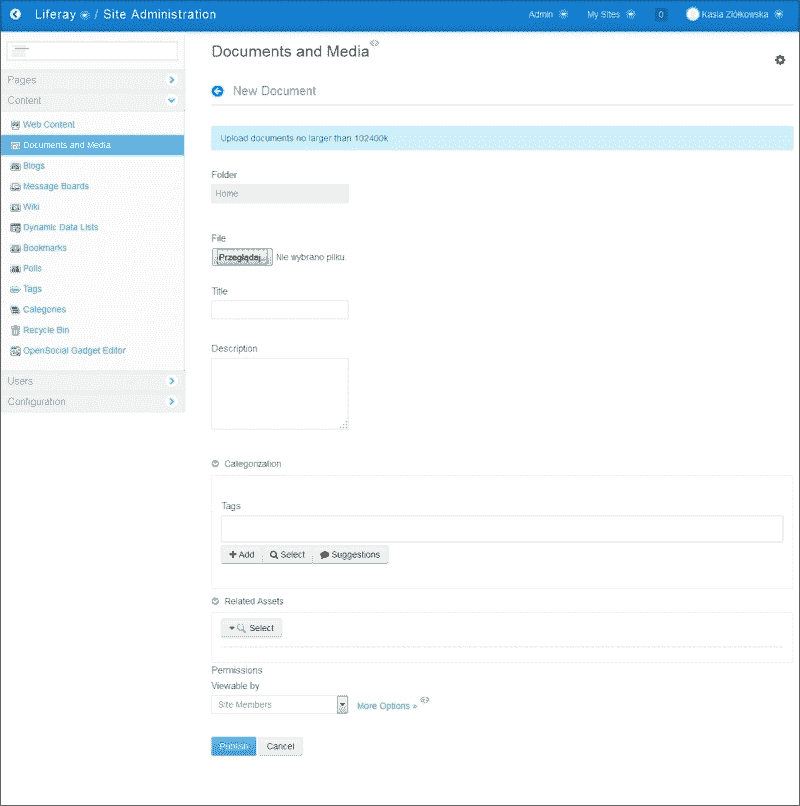

1.  点击**选择文件**按钮并从您的驱动器中选择要添加到存储库的文件。

1.  输入文档的**标题**（如果您不提供标题，将使用文件名作为标题）。

1.  输入文档的**描述**。

1.  展开分类**部分**。

1.  选择**类别**并输入或选择描述文档的**标签**。

    如果没有可见的分类可以分配给文档，这意味着要么特定站点的分类尚未创建，要么正在工作的用户的账户没有访问现有字典分类的权限。

1.  通过设置特定角色可能执行的所有操作来确定文档的权限。

1.  点击**相关资产**按钮，查找并选择将设置为相关内容的文档（或其他内容类型）。

1.  点击**发布**按钮。

### 上传多个文档

您还可以一次性添加多个文档并设置多个文档的元数据。

要添加多个文档，请转到**文档和媒体**部分。然后，按照以下步骤操作：

1.  以管理员身份登录并转到**管理** | **站点管理** | **内容** | **文档和媒体**。

1.  点击**添加**按钮。

1.  选择**多个文档**选项。

1.  点击**选择文件**按钮并选择您想要上传的所有文件。

    ### 备注

    您还可以通过拖放选择应上传的文件组。

1.  上传所有文件后，勾选与文件名相同的类型、标签组和权限旁边的复选框：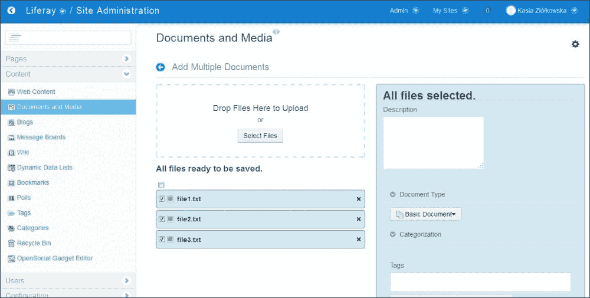

1.  输入描述，选择文档类型，并定义这些文档的分类、标签和权限。

1.  点击**保存**按钮。

1.  重复步骤 6 和 7，直到所有上传的文件都保存。

### 编辑文档

要编辑文档，请执行以下步骤：

1.  以管理员身份登录并转到**管理** | **站点管理** | **内容** | **文档和媒体**。

1.  前往您想要编辑的文档。

1.  点击其操作图标：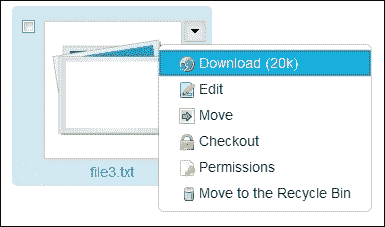

1.  点击**编辑**按钮。

1.  为编辑的文档提供新的**标题**和**描述**，选择**文档类型**，定义**分类**和**标签**，并为编辑的文档选择**相关内容**。

1.  点击**发布**按钮。

### 删除文件夹和文档

每个文件夹和文档都可以从存储库中临时或永久删除。临时和永久删除都通过**回收站**机制完成。

要临时删除文件夹或文档，请执行以下步骤：

1.  前往要删除的文件夹或文档。

1.  点击其操作图标。

1.  点击**移动到回收站**操作。

    ### 小贴士

    您可以通过点击移动文档到回收站后立即出现的撤销按钮来撤销此操作。默认情况下，回收站是启用的，并保留已删除的项目 30 天。可以通过前往**管理** | **站点管理** | **配置** | **站点设置** | **回收站**来更改特定站点的回收站可用性和回收站条目的最大年龄。

要永久删除文件夹或文档，请按照以下步骤操作：

1.  前往**管理** | **站点管理** | **内容** | **回收站**。

1.  点击要删除的文档名称附近的**操作**按钮：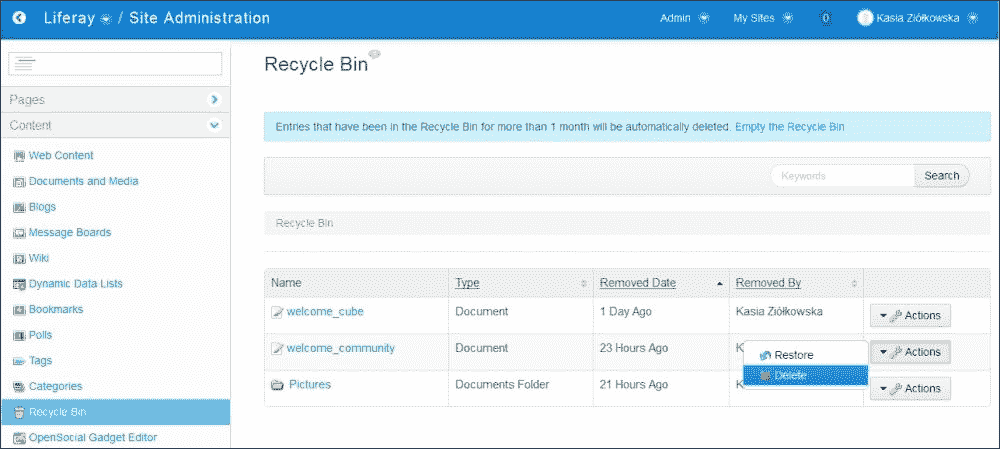

1.  点击**删除**操作，并通过点击**确定**来确认您的意愿。

### 注意

注意，删除文件夹时，其全部内容也会被删除。

还可以使用**操作**菜单中的**恢复**操作来恢复文档。

## 它是如何工作的…

Liferay 的文档和媒体库允许我们创建文件夹和文档的树状结构。这意味着每个文件夹可以包含子文件夹和文档。Liferay Portal 中的每个文档由一个文件和一组描述它的元数据组成。

Liferay 提供了许多属性来配置文档和媒体小部件。它们在`portal-impl/src/portal.properties`文件中本地化，可以被位于`${liferay.home}`文件夹中的`portal-ext.properties`覆盖。其中一个属性是拒绝文件或文件夹的名称，无论扩展名如何：

```js
dl.name.blacklist=con,prn,aux,nul,com1,com2,com3,com4,com5,com6,com7,com8,com9,lpt1,lpt2,lpt3,lpt4,lpt5,lpt6,lpt7,lpt8,lpt9
```

还可以定义扩展名的限制，并仅允许添加定义的扩展名（默认情况下，此属性允许所有文件扩展名）。要减少或添加可用的扩展名，设置以下属性：

```js
dl.file.extensions=.bmp,.css,.doc,.docx,.dot,.gif,.gz,.htm,.html,.jpg,.js,.lar,.odb,.odf,.odg,.odp,.ods,.odt,.pdf,.png,.ppt,.pptx,.rtf,.swf,.sxc,.sxi,.sxw,.tar,.tiff,.tgz,.txt,.vsd,.xls,.xlsx,.xml,.zip,.jrxml
```

下一个重要且有用的属性是文件最大大小的定义。默认情况下，它是无限的。要更改它，定义允许的字节数：

```js
dl.file.max.size=3072000
```

Liferay 搜索索引器试图索引文件的内容。可以定义应忽略哪些类型的扩展名。还可以定义索引文件的尺寸：

```js
dl.file.indexing.ignore.extensions=.exe,.sh,.pdf
dl.file.indexing.max.size=10485760
```

在文档库小部件部分中，`portal-impl/src/portal.properties`提供了更多设置。

### 文档类型

有五种默认的文档类型：基本文档、合同、营销横幅、在线培训和销售演示。每种文档类型可能包含不同的元数据集。例如，当添加新的合同时，用户可以提供有效日期、到期日期、合同类型、法律审查员、状态等信息。基本文档只包含基本信息，如名称、描述、标签、分类和权限。

非常常见的是，Liferay 提供的这些默认文档类型或元数据集不足以满足需求。需要创建包含非常特定元数据信息的个性化文档类型。这可以通过以下菜谱中描述的文档类型和元数据集创建工具来实现。

可以限制文件夹只包含一种或多种特定类型的文档。文档类型限制可以单独为每个文件夹设置，也可以从父文件夹继承。

### 权限

每个文件夹和文档都有自己的权限集，它定义了分配给不同角色的用户可以执行的操作列表。例如，可以设置这样的权限，使得具有特定角色的用户可以访问特定的文件夹，但不会看到存储在那里的某些文件。

### 注意

关于权限的更多信息，请参阅第五章，*角色和权限*。

### 分类和标签

如果一个内网包含非常大量的文档，一个设计良好的结构可能不足以帮助用户找到正确的文档。分类和标签提供了一种额外的机制来标记、列表和搜索文件，并允许通过专门的端口（如分类导航、资产发布者或标签云）进行后续选择。分类以及文档可以创建一个树状结构。每个分类都放在字典中，可以拥有子分类。相反，标签不存储在字典中，创建一个平面结构。可以为文档分配一个或多个分类和标签。

### 相关资产

在 Liferay 中，资产是可以显示在页面上的内容片段，例如文档、网页内容、博客条目等。每个文档都可以连接到另一个文档（或其他类型的资产）。这些文档将通过端口（如资产发布者）列出。

### 其他信息

让我们详细了解 Liferay 在默认配置下如何存储文件。首先，系统读取文件的元数据，如扩展名、标题、大小。接下来，它识别文件的 MIME 类型（`image/png`、`audio/mpeg`、`application/pdf`等）。此设置取决于文件的扩展名。接下来，小部件所做的下一件事是创建一个版本。默认情况下，第一个上传的文件版本为 1.0。Liferay 还识别文件添加的文件夹和存储库。所有这些信息都存储在`DLFileEntry`表中。这类数据称为元数据。

默认情况下，每个文件都存储在本地硬盘上的`${liferay.home}/data/document_library`文件夹中。文件夹的层次结构非常具体。很难识别每个文件存储的位置。让我们检查一个文件路径：`data/document_library/10157/11501/303/1.0`。

如我们之前所说，每个文件都放置在`data/document_library`文件夹中。下一个文件夹名称是`instanceId`，可以通过转到**管理** | **控制面板** | **配置** | **门户实例**来设置。下一个标识符是`folderId`。了解这个标识符是这个文件的父文件夹是很有帮助的。如果文件放置在文件夹的层次结构中，它就是最后一个文件夹的标识符。303 是存储在`DLFileEntry.name`列中的数字。每个文件只有一个版本名称。在这个例子中，文件的名称是 1.0。在现实世界中，这是一个 PNG 图像。所有必要的文件数据，如其名称，都放置在数据库中。

### 小贴士

请注意并记住，文件条目由存储在数据库中的元数据和存储在硬盘特定位置的字节组成。

## 还有更多……

用户也可以创建指向他们可以访问的任何文档的快捷方式。快捷方式上设置的权限使用户能够通过快捷方式访问原始文档。

为了创建快捷方式，请按照以下步骤操作：

1.  以管理员身份登录并转到**管理** | **站点管理** | **内容** | **文档和媒体**。

1.  点击**添加**按钮。

1.  选择合适的快捷方式。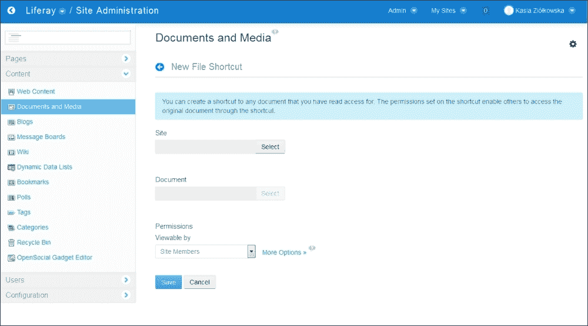

1.  点击**站点**按钮，选择包含您想要创建快捷方式的文档的站点。

1.  点击**文档**按钮并选择文档。

1.  通过设置特定角色可能执行的所有操作来确定快捷方式的权限。

1.  点击**保存**按钮。

## 参见

+   关于权限的信息，请参阅第五章的*创建和配置角色*配方，*角色和权限*

+   来自第九章的*Kaleo Web 安装*配方，*Liferay 工作流功能*

+   关于文档分类的更多信息，请参阅第八章中的*标签和内容分类*配方，*搜索和内容展示工具*。

# 管理文档类型和元数据集

如前一个配方中提到的，每个文件虽然提供了元数据，但变成了文档。默认情况下，每个文档包含诸如名称、描述、类别、标签、权限或相关资产等信息。非常常见的是，基本集是不够的。在这种情况下，可能需要创建一个新的文档类型，这样我们就可以为文件提供特定的附加信息。

## 如何做到这一点…

在本配方中，我们将描述如何定义不同类型的文档，并教授如何组合和使用元数据集。

### 使用元数据集创建新文档类型

要添加新的文档类型，请执行以下步骤：

1.  以管理员身份登录并转到**管理** | **站点管理** | **内容** | **文档和媒体**。

1.  点击**管理**按钮。

1.  选择**文档类型**选项。

1.  点击**添加**按钮。

1.  输入文档类型的**名称**。

1.  输入文档类型的描述。

1.  通过从左侧菜单拖放字段到右侧区域，确定将在此类文档中可用的**元数据字段**。

1.  通过点击每个字段并定义其属性（**字段标签**、**显示标签**、**必填**、**名称**、**预定义值**、**提示**、**可索引**、**可重复**、**选项**和**多选**）来设置所有添加的字段。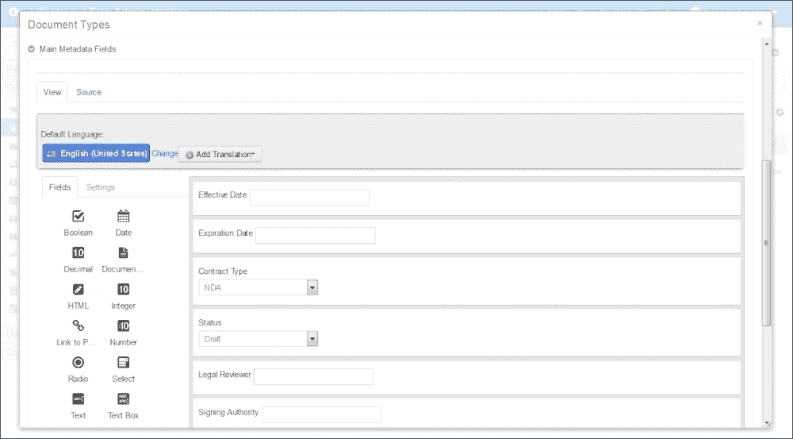

1.  点击**选择附加元数据集**并选择一个可用的元数据集（参见本配方的下一节以了解如何处理元数据集）。

1.  通过设置特定角色可能执行的所有操作来确定文档类型的权限。

1.  点击**保存**按钮。

### 定义元数据集

要定义新的元数据集，请执行以下步骤：

1.  以管理员身份登录并转到**站点管理** | **内容** | **文档和媒体**。

1.  点击**管理**按钮。

1.  选择**元数据集**选项。

1.  点击**添加**按钮。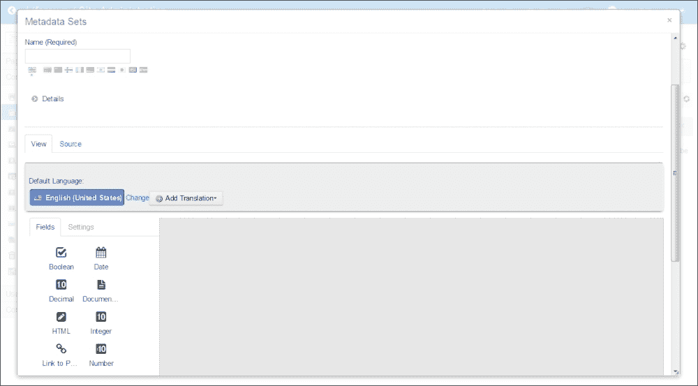

1.  输入元数据集的**名称（必填）**。

1.  输入元数据集的**描述**。

1.  选择**父元数据集**。

1.  确定将在此类文档中可用的**元数据字段**。

1.  点击**保存**按钮。

## 它是如何工作的…

当定义一种新的文档类型时，我们不仅定义了与文件存储的信息范围，还创建了一个表单，以便我们输入信息。文档类型表单和元数据集表单都可以使用简单的表单编辑器来创建。这个编辑器包含了一个不同表单字段的库，例如**布尔值**、**日期**、**十进制**、**文档和媒体**、**HTML**、**整数**、**页面链接**、**数字**、**单选按钮**、**选择**、**文本**和**文本框**。值得注意的是，也可以通过拖放一个字段（或多个）到另一个字段上来创建字段组。

当定义一种新的文档类型时，我们必须决定我们想要包含的字段集是仅用于特定文档还是用于不同的文档类型。在前一种情况下，我们可以在新的文档类型中直接创建表单。在后一种情况下，最好创建一个元数据集，它可以作为许多文档类型的一部分使用，但管理在一个地方。同样，与 Liferay 资产的情况一样，元数据集可以仅在一个特定范围内创建和使用，或者当在全局范围内创建时，可以在一个 Liferay Portal 实例的所有范围内使用。

此外，元数据集可以继承来自其他元数据集的一组字段。

字段可以通过以下属性来定义：

| 类型 | 定义字段的类型 |
| --- | --- |
| 字段标签 | 这允许我们为字段提供标签 |
| 显示标签 | 这让您决定是否显示标签 |
| 必填 | 这让您决定填写字段是否是必需的或可选的 |
| 名称 | 这允许我们定义字段的名称 |
| 预定义值 | 这允许我们定义在用户输入自己的值之前默认显示的值 |
| 提示 | 这允许您提供一段简短文本，该文本将作为字段的工具提示显示 |
| 可索引 | 这让您决定文件内容是否应该被索引和搜索 |
| 可重复 | 这允许我们确定字段是否可以被重复 |
| 选项 | 这允许您为所有字段提供可能的选项，使用户可以从定义的列表中选择选项 |
| 多选 | 这允许我们确定用户是否可以选择多个选项 |

## 参见

有关文档管理的信息，请参阅*使用“文档和媒体”小部件在 Liferay 中管理文件的食谱*。

# 与 Amazon S3 云的集成

Liferay 提供了与 Amazon S3 云通信的内置功能。这个功能为用户提供了一个非常强大的工具，可以将他们的文档存储在基于云的解决方案中。**Amazon 简单存储服务**（**Amazon S3**）是一个可扩展的、高速的、低成本且基于网络的在线备份和存档服务，适用于文档、演示文稿、电子表格、图片、照片等数据。**Amazon 存储**最伟大的特点是它声称在给定一年内对象可用性达到 99.99%。此外，这些服务提供高度可扩展的存储，可以随着数据的增加而轻松扩展。整个基础设施具有安全的 SSL 数据传输和加密。Amazon Simple Storage Service 是更大项目 **Amazon Web Services**（[`aws.amazon.com`](http://aws.amazon.com)）的一部分。这是一个包含许多网络服务的集合，如计算云、存储云、数据库、网络以及管理和安全。

Liferay 为用户提供了一个在远程存储库中存储和管理文档的功能。这种类型的存储库可以是 Amazon S3。为了允许门户与 Amazon S3 之间的通信，Liferay 使用 *JetS3t 工具包*。这是一个基于 Java 的开源项目。有关此解决方案的更多详细信息，请参阅 [`www.jets3t.org/`](http://www.jets3t.org/)。技术上，它是一个放置在已部署 Liferay 实例的 `ROOT/WEB-INF/lib/` 文件夹中的 `jets3t.jar` 归档。

## 如何操作…

Liferay 与 Amazon S3 之间的通信是通过 Amazon S3 API 实现的。为了正确配置此访问权限，您需要以下三项内容：访问密钥、秘密密钥和存储桶名称。要生成这些数据（访问密钥、秘密密钥和存储桶名称），请按照以下步骤操作：

1.  登录到 Amazon Web 服务控制台：[`console.aws.amazon.com`](https://console.aws.amazon.com)。

1.  在工具栏上，转到 **您的姓名** | **安全凭证**。

1.  展开 **访问密钥**（访问密钥 ID 和秘密访问密钥）。

1.  点击 **创建新访问密钥** 按钮。

1.  在弹出窗口中，您将看到以下消息：

    **您的访问密钥（访问密钥 ID 和秘密访问密钥）已成功创建。**

    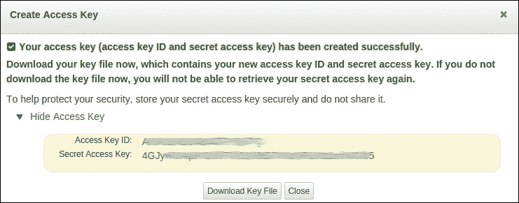

1.  点击 **显示访问密钥** 并复制 **访问密钥 ID** 和 **秘密访问密钥**。这对密钥将在稍后使用。

接下来的几个步骤负责创建一个新的存储桶，其中 Liferay 将存储其文件：

1.  在 [`console.aws.amazon.com`](https://console.aws.amazon.com)，转到 **服务** | **S3**。

1.  要创建一个新的存储桶，请点击 **创建存储桶** 按钮。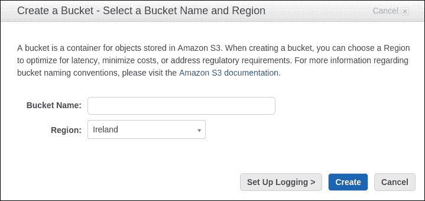

1.  填写所有必填字段并保存表单。

1.  记住您的存储桶名称。

最后一件事情是 Liferay 门户配置。正如我们一开始所说的，Liferay 提供了与 Amazon 通信的内置功能，因此配置并不困难。它只是一个简单的设置，位于 `${liferay.home}/portal-ext.properties`：

```js
dl.store.impl=com.liferay.portlet.documentlibrary.store.S3Store
dl.store.s3.access.key=<ACCESS KEY ID>
dl.store.s3.secret.key=<SECRET ACCESS KEY>
dl.store.s3.bucket.name=<BUCKET NAME>
```

最后，重新启动您的门户实例，并尝试在文档和媒体端口中上传文件。从用户的角度来看，上传操作不应该有任何不同。为了看到差异，您可以登录到 S3 存储桶以检查上传的文件。

## 如何工作…

门户提供了许多可配置的钩子，用于将文档上传到各种持久化系统。所有这些都作为 Liferay 核心功能实现。基本和默认的持久化系统是 `FileSystemStore`，它将数据存储在本地硬盘上。Liferay 提供了其他实现，例如 `AdvancedFileSystemStore`、`CMISStore`、`DBStore`、`JCRStore` 和 `S3Store`。可以在 `portal-ext.properties` 中设置其中一种类型：

```js
dl.store.impl=com.liferay.portlet.documentlibrary.store.AdvancedFileSystemStore
dl.store.impl=com.liferay.portlet.documentlibrary.store.CMISStore
dl.store.impl=com.liferay.portlet.documentlibrary.store.DBStore
dl.store.impl=com.liferay.portlet.documentlibrary.store.FileSystemStore
dl.store.impl=com.liferay.portlet.documentlibrary.store.JCRStore
dl.store.impl=com.liferay.portlet.documentlibrary.store.S3Store
```

以下描述显示了存储实现中的差异：

+   `FileSystemStore`：此工具将文档直接保存到本地文件系统。

+   `AdvancedFileSystemStore`：类似于 `FileSystemStore`，但将数据划分为桶（文件夹），从而避免了单个目录中文件过多的限制。

+   `DBStore`：将二进制数据以 blob 的形式存储在数据库中。

+   `CMISStore`：**内容管理互操作性服务**（**CMIS**）是一个规范，旨在提高 **企业内容管理**（**ECM**）系统之间的互操作性。文档和媒体允许用户连接到多个支持 CMIS 1.0、**AtomPub** 和 Web 服务协议的第三方存储库。可以与许多符合 CMIS 标准的 ECM 供应商集成 Liferay，例如 SharePoint、Alfresco、Documentum、IBM FileNet 等。

+   `JCRStore`：实现了 Java 内容存储库 API。著名的实现是 **Apache Jackrabbit**。因此，如果设置了此钩子，则可以在 Apache Jackrabbit 内容存储库中保留二进制数据。

+   `S3Store`：将数据存储在 Amazon 简单存储服务中。

让我们检查负责此集成的代码。`S3Store` 类实现了 `Store` 接口。因此，它提供了对文件的所有必要操作，例如 `addFile`、`addDirectory`、`deleteFile`、`deleteDirectory` 等。在 `portal-ext.properties` 中，我们将 `dl.store.impl` 属性设置为 `S3Store` 类。

Liferay 使用 JetS3t 工具包与 Amazon 服务进行通信。此工具包负责将文件从/到 Amazon 云传输。

在 Amazon S3 存储库中，文件夹和文件的结构与本地文件系统中的结构相同。以下截图显示了文件夹层次结构的示例：

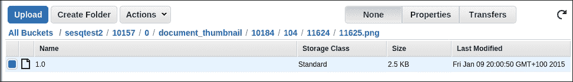

## 还有更多…

如果文档库存储库较小，与 Amazon S3 云的集成工作得非常完美。当并发用户数量和文件数量巨大时，问题就会出现。问题出在`HttpClient`和 S3 及其并行通信（并发通信线程）之间。可以通过覆盖`jets3t.properties`来增加连接数。为了正确更改它，将此文件放入 Tomcat 类路径中，例如，在`${CATALINA_BASE}/lib`文件夹中。之后，更改以下属性，并尝试将值调整到您的环境中：

```js
s3service.internal-error-retry-max=10 (Liferay 6.0 and 6.1)
cloudfront-service.internal-error-retry-max=10 (Liferay 6.2)
threaded-service.max-thread-count=100
httpclient.retry-max=10
httpclient.connection-timeout-ms=90000
httpclient.socket-timeout-ms=90000
httpclient.max-connections=100
```

在[`jets3t.s3.amazonaws.com/toolkit/configuration.html`](https://jets3t.s3.amazonaws.com/toolkit/configuration.html)的官方文档中，属性描述如下：

| 属性名称 | 描述 |
| --- | --- |
| `s3service.internal-error-retry-max` | 这指的是`ThreadedStorageService` / `SimpleThreadedStorageService`服务为上传和下载操作启动的最大并发通信线程数。这个值不应过高。否则，在传输大量大文件时，可能会由于带宽不足而出现 I/O 错误。*它仅适用于 Liferay 6.0 和 Liferay 6.1*。 |
| `cloudfront-service.internal-error-retry-max` | 这指的是当 CloudFront 连接因内部服务器错误失败时将尝试的最大重试次数。要禁用内部错误失败的重试，请将此设置为 0。*它仅适用于 Liferay 6.2*。 |
| `threaded-service.max-thread-count` | 这是指`ThreadedStorageService` / `SimpleThreadedStorageService`服务为上传和下载操作启动的最大并发通信线程数。这个值不应过高。否则，在传输大量大文件时，可能会由于带宽不足而出现 I/O 错误。默认值为`2`。这个值不能超过 JetS3t 可用的最大 HTTP 连接数，该连接数由`httpclient.max-connections`属性设置。 |
| `httpclient.retry-max` | 这决定了在连接失败时因 I/O 错误而重试连接的次数。将其设置为`0`以禁用重试。默认值为`5`。 |
| `httpclient.connection-timeout-ms` | 这决定了在连接超时之前要等待的毫秒数。`0`表示无限。默认值为`60000`。 |
| `httpclient.socket-timeout-ms` | 这决定了在套接字连接超时之前要等待的毫秒数。`0`表示无限。默认值为`60000`。 |
| `httpclient.max-connections` | 这指的是全局允许的最大并发连接数。默认值是`20`。如果你有快速的互联网连接，可以通过增加此设置以及相应的 S3 服务属性，`s3service.max-thread-count`和`s3service.admin-max-thread-count`来提高你的 S3 客户端性能。然而，请注意，如果你为你的连接增加太多，可能会超过你的可用带宽并导致通信错误。 |

## 参见

有关构建可伸缩系统的信息，请参阅第十二章中的*可伸缩基础设施*配方，*基本性能调整*。

# 存储钩子之间的数据迁移

此配方献给那些因任何原因需要从一种存储实现更改为另一种存储实现的管理员。此示例展示了我们如何将存储在文档库中的二进制文件迁移到其他存储库。在我们的示例中，我们将检查从 S3Store（Amazon S3）迁移到本地`FileSystemStore`存储钩子的过程。

## 如何操作…

Liferay 内置了在存储钩子之间迁移文档的功能。假设我们的 Liferay 实例已经启动，并且库已连接到 Amazon S3 云。为了将文档迁移到文件系统，请按照以下步骤操作：

1.  以管理员身份登录到 Liferay 实例。

1.  转到**管理** | **控制面板**。

1.  然后转到**配置** | **服务器管理** | **数据迁移**。

1.  滚动到**从一个存储库迁移文档到另一个存储库**部分。

1.  选择一个新的存储钩子，称为**com.liferay.portlet.documentlibrary.store.FileSystemStore**。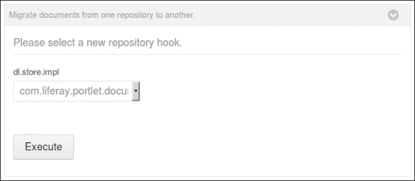

1.  点击**执行**按钮。

1.  Liferay 临时将状态更改为维护模式。

1.  查看并检查`catalina.out`日志的执行情况。日志文件应如下所示：

    ```js
    DEBUG [liferay/convert_process-1][MaintenanceUtil:64] Please set dl.store.impl in your portal-ext.properties to use com.liferay.portlet.documentlibrary.store.FileSystemStore
    [liferay/convert_process-1][ConvertProcess:47] Finished conversion for com.liferay.portal.convert.ConvertDocumentLibrary in 3010 ms
    ```

## 工作原理…

Liferay 提供了迁移存储钩子之间数据的功能。当我们的 Liferay 实例运行时，我们的项目经理或产品所有者想要将存储系统更改为另一个系统，例如 Amazon S3 或 SharePoint 时，这是一个重要的工具。此外，无需你的开发者编写自定义脚本即可完成此操作。此功能在`com.liferay.portal.convert.ConvertDocumentLibrary`类中实现。`doConvert`方法调用以下文件的迁移过程：

+   迁移图片

+   迁移文档库

+   迁移论坛附件

+   迁移维基附件

实际上，这四种方法调用*动态查询*来获取数据库中放置的所有文件定义，并将它们从一处复制到另一处。所有文件夹和文件的结构都是逐个映射的。

### 小贴士

仔细检查你的日志文件，以确保所有数据都正确迁移。

## 参见

关于如何更改数据库引擎的信息，请参考第十一章中的*从数据库迁移到另一个数据库*配方，*快速技巧和高级知识*。
