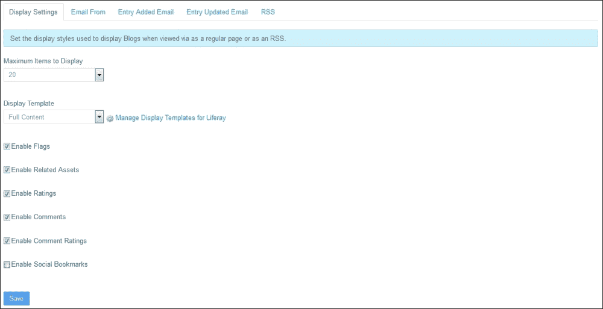

# 第十章. 协作工具

在本章中，我们将涵盖以下主题：

+   设置内网的博客

+   设置维基端口

+   设置内网的论坛

+   因不适当帖子禁止用户

+   将日历设置为个人任务管理工具

+   使用书签来存储喜欢的链接

+   跟踪站点成员的社会活动

+   使用公告端口进行群组消息传递

# 简介

Liferay 提供了一系列协作工具，这些工具可以通过鼓励员工在其项目团队、部门或整个公司内部生成和共享信息，从而有效地提高员工之间的沟通。内网用户可以创建博客、参与论坛、构建企业知识库作为一系列维基页面、收集有用的链接、接收或发布重要消息，并在日历中规划他们的工作。他们还可以跟踪其他员工的活动。

# 设置内网的博客

Liferay 中的每个站点都有自己的独立博客，可以通过访问**管理** | **站点管理** | **内容** | **博客**来访问。此外，还可以将博客端口放置在其中一个页面上，这样没有访问管理功能的用户之间也可以共享。

博客端口显示由站点成员创建的博客条目。一个博客条目可以包含文本、图形、表格、列表以及指向其他资产的链接。此外，每个博客条目都可以被标记和分类，或者提供与其相关的资产列表，这些列表将显示在博客条目主要内容下的相关资产部分。还可以定义权限，指定不同角色的用户可以执行哪些操作。

在这个菜谱中，我们将向您展示如何通过在此站点内放置博客端口来为站点成员创建一个共享博客。我们还将向您展示如何配置此博客端口以最好地满足用户的需求。

## 如何操作…

让我们假设我们公司的公关部门希望启动一个由不同部门的员工撰写的博客，向其他员工介绍有趣的商业倡议。他们希望在页面上显示 10 个最新博客条目的列表（列表中的每个博客条目应以摘要形式呈现，用户点击后可跳转到完整内容），但不想允许用户对其他用户的条目进行评论或评分。该博客还应提供一些电子邮件通知和 RSS 功能，以帮助人们保持更新。

在第一步中，我们将添加博客端口到页面。为了做到这一点，请按照以下步骤操作：

1.  以管理员身份登录并转到应放置博客端口的页面。

1.  点击添加按钮（这是左侧的**+**符号）。

1.  点击**应用程序**选项卡。

1.  使用搜索机制或通过浏览可用端口的列表（博客端口可在 **协作** 部分找到）查找博客端口。

1.  点击端口名称旁边的 **添加** 链接。带有基本配置的博客端口将被添加到页面中。

在将博客端口添加到页面后，我们可以更改其默认配置。要配置博客端口，请按照以下步骤操作：

1.  点击新添加的端口的选项图标（这将在端口的右上角显示为一个齿轮图标）。

1.  选择 **配置** 选项。

1.  将 **显示最大项数** 设置为 **10**。

1.  将 **显示模板** 设置为 **摘要**。

1.  禁用 **启用旗帜** 选项。

1.  禁用 **启用相关资产** 选项。

1.  禁用 **启用评分** 选项。

1.  禁用 **启用评论** 选项。

1.  禁用 **启用评论评分** 选项。

1.  禁用 **启用社交书签** 选项。

1.  点击 **保存** 按钮。

1.  点击 **发件人** 标签。

1.  提供发件人的 **姓名** 和 **地址**。

1.  点击 **保存** 按钮。

1.  点击 **条目添加电子邮件** 或 **条目更新电子邮件** 标签。

1.  设置 **启用** 选项。

1.  提供主题 **Subject** 和正文 **Body**。

1.  点击 **保存** 按钮。

1.  点击 **RSS** 标签。

1.  保持 **启用 RSS 订阅** 选项启用。

1.  将 **显示最大项数** 设置为 **10**。

1.  从 **显示样式** 列表中选择 **摘要** 选项。

1.  保持 **格式** 选项不变。

1.  点击 **保存** 按钮。

## 它是如何工作的…

博客端口的配置允许我们设置以下选项：

+   **显示最大项数**：此选项定义了博客端口单页上显示的博客条目数量

+   **显示模板**：此选项允许我们选择资产应如何显示（作为标题列表、完整内容、摘要等）

+   **启用旗帜**：此选项启用旗帜功能，提供用于通知异常的联系方式表单

+   **启用社交书签**：此选项显示 Google+、Facebook 和 Twitter 分享按钮

+   **启用相关资产**：此选项启用博客条目的相关资产部分，显示为每个维基页面定义的相关资产列表

+   **启用评分**：此选项启用评分功能，允许我们为每个博客条目评分，并显示每个条目的平均评分

+   **启用评论**：此选项启用评论功能，允许您对每个博客条目进行评论

+   **启用评论评分**：此选项启用评论评分功能，允许您为博客中的每个评论投票，并显示每个评论的投票数

+   **显示模板**：此选项允许您选择用于显示维基页面的模板

+   **发件人**：此标签允许您提供发件人的姓名和电子邮件地址

+   **新增条目电子邮件**和**更新条目电子邮件**：这些标签允许您启用电子邮件消息功能，并使用可用的变量设置主题和消息内容

+   **启用 RSS 订阅**：此选项允许用户使用 RSS 跟踪活动

+   **显示样式**：此选项允许您决定是否显示完整内容、摘要或标题

+   **最大显示项目数**：此选项允许我们设置 RSS 频道显示的最大项目数

+   **格式**：此选项允许我们决定 RSS 是否应以 Atom 1.0、RSS 1.0 或 RSS 2.0 格式提供服务

## 相关链接

关于如何配置 SMTP 服务器的信息，请参阅第十一章“快速技巧和高级知识”中的*配置 Liferay 与 SMTP 服务器*配方，*快速技巧和高级知识*。

# 设置维基小部件

Liferay 提供了维基功能，允许我们创建一个由员工社区协作开发的类似常见维基百科的企业数据库。可以通过访问**管理**|**站点管理**|**内容**|**维基**或使用维基小部件来访问维基功能，该小部件允许用户在位于站点页面上的页面上管理和展示维基页面。

维基小部件展示的每个维基页面都可能包含文本、标题、列表、图片、表格和链接，这些可以使用简单的 creole、MediaWiki 或 HTML 语言定义。此外，维基还包括链接跟踪机制，它提供有关传入和传出链接的信息，并允许我们通过定义到它们的链接来创建新页面。在编辑维基页面时，用户可以提供对所做工作的额外描述。这使用户能够跟踪不同用户所做的更改。

在本配方中，我们将向您展示如何配置维基小部件以最好地满足用户需求。

## 如何操作...

假设我们公司内部网络中的维基功能（除所有管理功能外）应提供对维基页面进行评论和评分的可能性。此外，当页面添加或修改时，用户应收到电子邮件通知。但是，不需要 RSS 功能。

要将维基小部件添加到页面，请执行以下步骤：

1.  以管理员身份登录并转到应放置维基小部件的页面。

1.  点击添加按钮（这是左侧的**+**号）。

1.  点击**应用程序**标签。

1.  使用搜索功能或通过浏览可用小部件列表（博客小部件可在**协作**和**维基**部分找到）来查找维基小部件。

1.  点击小部件名称旁边的**添加**链接。带有基本配置的维基小部件将被添加到页面中。

在将维基小部件添加到页面后，可以更改其默认配置。要配置维基小部件，请按照以下步骤操作：

1.  点击新添加的端口的选项图标（这将在端口的右上角显示为一个齿轮图标）。

1.  选择**配置**选项。

1.  确保您在**显示设置**选项卡上。

1.  取消勾选**启用相关资产**选项。

1.  保持**启用页面评分**选项启用。

1.  保持**启用评论**选项启用。

1.  取消勾选**启用评论评分**选项。

1.  保持**显示模板**和**可见 Wiki**选项不变。

1.  点击**保存**按钮。

1.  点击**发件人**选项卡。

1.  提供发送者的**姓名**和**地址**。

1.  点击**保存**按钮。

1.  点击**页面添加电子邮件**或**页面更新电子邮件**选项卡。

1.  设置**启用**选项。

1.  提供一个**主题**、**正文**和**签名**。

1.  点击**保存**按钮。

1.  点击**RSS**选项卡。

1.  取消勾选**启用 RSS 订阅**选项。

1.  点击**保存**按钮。

## 它是如何工作的…

Wiki 端口配置允许我们设置以下选项：

+   **启用相关资产**：此选项启用 Wiki 页面的相关资产部分，显示为每个 Wiki 页面定义的相关资产列表

+   **启用页面评分**：此选项启用评分功能，允许您对每个 Wiki 页面进行评分，并显示每个页面的平均评分

+   **启用评论**：此选项启用评论功能，允许我们在每个 Wiki 页面上进行评论

+   **启用评论评分**：此选项启用评论评分功能，允许您对 Wiki 页面上的每个评论进行投票，并显示每个评论的投票数

+   **显示模板**：此选项允许您选择用于显示 Wiki 页面的模板

+   **可见 Wiki**：此选项允许您定义哪些可用的 Wiki 应在此特定的 Wiki 端口中可见

+   **发件人**：此选项允许您提供发送者的姓名和电子邮件地址

+   **页面添加电子邮件**和**页面更新电子邮件**：这些选项卡允许您启用电子邮件消息功能，并使用可用的变量设置主题和消息内容

+   **启用 RSS 订阅**：此选项允许用户使用 RSS 跟踪活动

+   **显示样式**：此选项允许您决定是否显示完整内容、摘要或标题

+   **最大显示项目数**：此选项允许您设置 RSS 频道显示的最大项目数

+   **格式**：此选项允许您决定 RSS 应以 Atom 1.0、RSS 1.0 或 RSS 2.0 格式提供服务

## 参见

有关如何配置 SMTP 服务器的信息，请参阅第十一章*使用 SMTP 服务器配置 Liferay*配方，*快速技巧和高级知识*。

# 为内联网设置论坛

论坛是一个非常强大的协作和社会工具，允许多用户通信。Liferay Portal CMS 提供了一个基本的、现成的论坛功能，称为消息板。可以通过访问**管理** | **站点管理** | **内容** | **消息板**来使用消息板组件，使用消息板组件的是我们内网的用户。

## 如何操作…

在这个菜谱中，我们将向您展示如何将消息板组件添加到页面，以及如何设置它以最佳地满足我们的需求。

让我们从将消息板组件添加到页面开始。为此，请按照以下步骤操作：

1.  以管理员身份登录并转到应放置消息板页面的页面。

1.  点击添加按钮（这是左侧的**+**号）。

1.  点击**应用程序**标签页。

1.  使用搜索功能或通过浏览可用组件列表（消息板组件可在**协作**部分找到）查找**消息板**组件。

1.  点击组件名称旁边的**添加**链接。具有基本配置的消息板将被添加到页面。

要配置消息板组件，请按照以下步骤操作：

1.  点击新添加组件的选项图标（这将是组件右上角的齿轮图标）。

1.  选择**配置**选项。

1.  确保您位于**常规**标签页。

1.  禁用**允许匿名发布**选项。

1.  保持**默认订阅**选项启用。

1.  从**消息格式**下拉列表中选择 HTML。

1.  保持**启用旗帜**和**启用评分**选项启用。

1.  禁用**默认将线程作为问题**选项。

1.  在**显示最近帖子**列表中设置**30 天**选项。

1.  点击**保存**按钮。

1.  点击**发件人邮箱**标签页。

1.  提供发件人的**姓名**和**地址**。

1.  点击**消息添加电子邮件**或**消息更新电子邮件**标签页。

1.  设置**启用**选项。

1.  提供一个**主题**、**正文**和**签名**。

1.  点击**保存**按钮。

1.  点击**线程优先级**标签页。

1.  以降序顺序输入每个级别的名称、图像和优先级等级。

1.  点击**保存**按钮。

1.  点击**用户排名**标签页。

1.  通过输入排名和最小帖子对（例如，尤达 = 1000）来提供排名名称。

1.  点击**保存**按钮。

1.  点击**RSS**标签页。

1.  确保已启用**启用 RSS 订阅**选项。

1.  将**最大显示项目数**设置为**10**。

1.  从**显示样式**列表中选择**摘要**选项。

1.  保持**格式**选项不变。

1.  点击**保存**按钮。

## 它是如何工作的…

留言板提供典型的论坛机制，允许我们创建由类别和子类别构建的类似文件夹的结构。类别和子类别都可以包含其他子类别或线程，每个线程至少包含一个帖子。留言板中的线程可以被拆分（拆分的结果是从一个线程创建两个线程）或移动（通过移动，我们从一个已存在的两个线程中创建一个线程）。可以锁定线程以阻止用户添加更多帖子，并使其对用户以只读模式可用。更重要的是，留言板为留言板用户管理提供了禁止机制。禁止机制将在下一道菜谱中描述。

留言板端口配置允许我们设置以下选项：

+   **常规**：

    +   **允许匿名发布**：此选项允许您决定是否允许匿名用户创建帖子

    +   **默认订阅**：此选项允许您默认将用户订阅到他们参与的线程

    +   **消息格式**：此选项允许您选择添加消息的格式

    +   **启用标记**：此选项启用标记功能，提供用于通知异常的联系方式

    +   **启用评分**：此选项启用帖子评分功能，允许我们对每个帖子进行评分并显示其评分

    +   **默认将线程标记为问题**：启用此选项后，所有新线程默认标记为问题（新线程表单中的**标记为问题**选项被标记）。在线程列表中标记为问题的线程会标记为“等待回答”标志。

    +   **显示最近帖子**：此选项允许我们设置最近帖子标签页的周期。

+   **电子邮件通知**：

    留言板提供两种类型的电子邮件通知：新增留言电子邮件和更新留言电子邮件。以下是留言板电子邮件通知的配置选项：

    +   **发件人**：此标签页允许我们提供发件人的姓名和电子邮件地址

    +   **新增留言电子邮件**和**更新留言电子邮件**：这些标签页允许我们启用电子邮件消息功能，并使用可用的变量设置主题、签名和消息内容。

+   **线程优先级**：

    可以为线程设置优先级。优先级较高的线程会显示在优先级较低的线程之前。**线程优先级**标签页允许我们通过为每个线程提供以下信息来定义多个优先级：

    +   **名称**：此选项显示优先级的名称

    +   **图像**：此选项显示优先级的图像（URL 或相对于主题的路径）

+   **用户等级**：**用户等级**标签页允许我们定义用户将获得的等级，以创建指定数量的帖子。

+   **RSS**：消息板组件还允许用户使用 RSS 跟踪活动。正如前一个配方中所示，组件配置允许我们选择：

    +   RSS 频道显示的项目数量

    +   应显示全文、摘要还是标题

    +   应该以 Atom 1.0、RSS 1.0 还是 RSS 2.0 格式提供 RSS

## 参见

+   关于如何配置 SMTP 服务器的信息，请参阅第十一章的*使用 SMTP 服务器配置 Liferay*配方，*快速技巧和高级知识*

+   关于如何封禁和解封用户的信息，请参阅本章的*因不当帖子封禁用户*配方

# 因不当帖子封禁用户

消息板组件提供了一个内置的封禁机制，允许我们阻止用户查看和参与论坛。

## 如何操作…

要封禁一个用户，请执行以下步骤：

1.  以管理员身份登录并转到消息板应放置的页面。

1.  前往您想封禁的用户添加的帖子。

1.  点击位于用户屏幕名（或姓名和姓氏）下的**封禁此用户**链接。

1.  点击**消息板**菜单中的**封禁用户**选项卡。您刚刚封禁的用户将出现在列表中。

要解封一个用户，请执行以下步骤：

1.  点击**消息板**菜单中的**封禁用户**选项卡。

1.  点击位于您想解封的用户屏幕名附近的**解封此用户**链接。该用户将从列表中消失，并且不再被阻止使用消息板。

## 它是如何工作的…

如前一个配方所示，每个在消息板上添加过任何帖子的用户都可以被网站所有者和管理员（或任何具有允许执行此操作的定制角色的其他用户）封禁和解封。

被封禁的用户无法查看消息板的内容或添加新的类别、线程或帖子。如果消息板管理员（或具有封禁和解封其他用户权限的其他用户）没有解封，则被封禁的用户将在 10 天后自动解封。此默认值可以在`message.boards.expire.ban.interval`属性中更改（设置为 0 以禁用自动到期）。为了覆盖每个属性，您可以将特定属性放入`${liferay.home}/portal-ext.properties`文件中。

注意，还有一个`message.boards.expire.ban.job.interval`属性，允许我们输入解封用户作业运行的分钟数。这可能会影响解封用户的实际时间。如果封禁预计在中午 12:05 到期，而作业在下午 2 点运行，则到期将在下午 2 点的运行期间发生。

## 参见

关于如何配置消息板组件的信息，请参阅本章的*为内联网设置论坛*配方。

# 将日历设置为个人任务管理工具

Liferay 日历帮助用户管理他们的任务、时间和资源。日历端口允许我们创建事件、邀请其他用户参与，设置提醒，并管理其他用户可以预订的资源（如汽车或会议室）。事件可以按日、周、月或议程视图显示。日历端口提供了一些配置选项，有助于根据我们的需求调整日历功能。

## 如何操作…

要设置日历端口，您必须将其添加到页面上。为此，请执行以下步骤：

1.  前往应放置日历端口的页面。

1.  点击添加按钮（这是左侧的**+**号）。

1.  点击**应用程序**选项卡。

1.  使用搜索功能或浏览可用端口的列表（日历端口可在**协作**部分找到）查找**日历**端口。

1.  点击端口名称旁边的**添加**链接。带有基本配置的日历端口将被添加到页面上。

要配置日历端口，请按照以下步骤操作：

1.  点击新添加的端口的选项图标（这将在端口的右上角显示为一个齿轮图标）。

1.  选择**配置**选项。

1.  确保您处于**用户设置**选项卡。

1.  将**时间格式**设置为**24 小时**。

1.  将**默认持续时间**设置为**60 分钟**。

1.  将**默认视图**设置为**日**。

1.  将**周开始于**选项设置为**星期一**。

1.  禁用**使用全局时区**选项。

1.  将**时区**设置为**UTC**。

1.  点击**保存**按钮。

1.  点击**RSS**选项卡。

1.  保持**启用 RSS 订阅**选项启用。

1.  将**最大显示项目数**设置为**10**。

1.  从**显示样式**列表中选择**摘要**选项。

1.  保持**格式**选项不变。

1.  点击**保存**按钮。

## 它是如何工作的…

在配置日历端口时，您可以设置以下属性：

+   **时间格式**：此选项允许您决定日历是否以 A.M./P.M.或 24 小时格式显示小时

+   **默认持续时间**：此选项允许您设置事件的默认持续时间（仅适用于快速事件创建）

+   **默认视图**：此选项允许您设置日历的默认视图

+   **周开始于**：此选项允许您选择作为一周第一天的日期

+   **使用全局时区**：此选项允许您决定日历是否根据全局时区设置或日历端口配置中**时区**字段指定的时区工作

+   **启用 RSS 订阅**：此选项允许用户使用 RSS 跟踪活动

+   **显示样式**：此选项允许您决定是否显示完整内容、摘要或标题

+   **最大显示项目数**：此选项允许您设置 RSS 频道显示的最大项目数

+   **格式**：此选项允许您决定是否以 Atom 1.0、RSS 1.0 或 RSS 2.0 格式提供 RSS

# 使用书签作为存储收藏链接的良好容器

书签功能允许用户收集、组织和共享有用的或喜欢的链接。Liferay 中的每个站点都有自己的独立书签存储库，可以通过访问**管理** | **站点管理** | **内容** | **书签**来访问。此外，还可能将书签端口放置在可以由没有访问管理功能的用户之间共享的页面上。

书签端口提供创建、编辑和删除书签文件夹和书签的工具。在本教程中，我们将向您展示如何配置书签端口以适应用户的需求。

## 如何做到这一点...

首先，让我们添加一个新的书签端口。为了做到这一点，请执行以下步骤：

1.  前往应放置书签端口的页面。

1.  点击**添加**按钮。

1.  点击**应用程序**标签。

1.  使用搜索功能或通过浏览可用端口的列表（书签端口可在**社区**部分找到）查找书签端口。

1.  点击端口名称旁边的**添加**链接。带有基本配置的书签端口将被添加到页面上。

在将书签端口添加到页面后，我们可以更改其默认配置。要配置书签端口，请执行以下步骤：

1.  点击新添加端口的选项图标（这将在端口的右上角显示为一个齿轮图标）。

1.  选择**配置**选项。

1.  通过点击**选择**按钮然后点击想要设置为根的文件夹旁边的**选择**按钮来选择**根文件夹**。

1.  启用**显示搜索**选项。

1.  启用**显示子文件夹**选项。

1.  在**每页文件夹数**字段中输入**10**。

1.  在**显示列**字段中保留选定的列。

1.  点击**保存**按钮。

1.  点击**电子邮件来自**选项卡。

1.  提供发件人的**姓名**和**地址**。

1.  点击**保存**按钮。

1.  点击**条目添加电子邮件**或**条目更新电子邮件**选项卡。

1.  设置**启用**选项。

1.  提供主题**和**正文。

1.  点击**保存**按钮。

## 它是如何工作的...

书签端口配置允许我们设置文件夹列表、书签列表和电子邮件通知消息。

以下是列出文件夹的以下选项：

+   **根文件夹**：此选项允许我们选择将成为书签端口显示的最高（根）文件夹

+   **显示搜索**：此选项启用书签端口内的搜索功能

+   **显示子文件夹**：此选项允许我们定义在一页列表中显示的公告数量

+   **每页文件夹数**：此选项允许我们决定在列表单页上显示的文件夹数量

+   **显示列**：此选项允许我们在文件夹列表屏幕上选择要显示的列集。

以下是以下书签列表选项：

+   **启用相关资产**：此选项启用相关资产功能，该功能在添加/编辑资产表单中列出所有定义为相关的资产。

+   **每页文档数**：此选项允许我们决定在单个列表页面上显示的文件夹数量。

+   **显示列**：此选项允许我们在文件夹列表屏幕上选择要显示的列集。

+   **发件人电子邮件**：此选项卡允许我们提供发件人的姓名和电子邮件地址。

+   **页面添加电子邮件**和**页面更新电子邮件**：这些选项卡允许我们启用电子邮件消息功能，并使用可用的变量设置主题和消息内容。

## 相关信息

关于如何配置 SMTP 服务器的信息，请参阅第十一章“快速技巧和高级知识”中的*使用 SMTP 服务器配置 Liferay*配方，*快速技巧和高级知识*。

# 跟踪网站成员的社会活动

活动端口显示了位于其中的网站成员的社会活动，并允许我们通过显示它们的位置来跟踪这些活动的产品。端口通知我们谁在网站上执行了某些活动以及这些活动何时执行，并展示这些产品的 URL 地址。

## 如何操作…

要在页面上配置活动端口，请执行以下步骤：

1.  前往应放置活动端口的页面。

1.  点击添加按钮（这是左侧的**+**符号）。

1.  点击**应用程序**选项卡。

1.  使用搜索功能或浏览可用端口的列表（活动端口可在**社交**部分找到）来查找**活动**端口。

1.  点击端口名称旁边的**添加**链接。带有基本配置的活动端口将被添加到页面上。

1.  点击新添加端口的选项图标（这将是端口右上角的齿轮图标）。

1.  选择**配置**选项。

1.  确保您位于**设置**选项卡。

1.  从**最多显示活动数**列表中选择**10**。

1.  保持**启用 RSS 订阅**选项启用。

1.  将**最多显示项目数**设置为**10**。

1.  从**显示样式**列表中选择**摘要**选项。

1.  保持**格式**选项不变。

1.  点击**保存**按钮。

## 工作原理…

活动端口列出了用户执行的活动，例如添加或编辑网页内容、Wiki 页面、论坛分类、帖子、线程、文档、快捷方式、博客条目、书签和日历事件。端口还通知我们用户对某些内容进行了评分。

组件列出了与组件配置中指示的相同数量的活动，该数量由**最多显示活动数**选项中设置的值确定。它还允许用户通过使用 RSS 跟踪活动。如前所述的配方中所示，组件配置允许我们选择以下内容：

+   RSS 频道显示的项目数量

+   是否显示完整内容、摘要或标题

+   是否以 Atom 1.0、RSS 1.0 或 RSS 2.0 格式提供 RSS。

## 更多内容

还可以在用户个人资料页面上使用活动组件。如果组件位于用户的个人资料页面上，它只显示此用户的操作。要配置用户个人资料页面上的活动组件，请点击用户菜单中的**我的个人资料**链接，并遵循之前指示的所有步骤。

# 使用公告组件进行群组消息传递

公告组件允许我们展示和管理称为公告的群组消息。公告功能允许我们向员工提供一些提醒或重要的组织信息。在公告组件中，每个用户只能看到针对他们所属的群组的消息。用户将通过电子邮件通知新的公告。

## 如何操作…

要配置公告组件，请执行以下步骤：

1.  前往放置公告组件应放置的页面。

1.  点击添加按钮（这是左侧的**+**符号）。

1.  点击**应用程序**标签页。

1.  使用搜索功能或通过浏览可用组件列表（公告组件可在**社交**部分找到）查找**公告**组件。

1.  点击组件名称旁边的**添加**链接。带有基本配置的公告组件将被添加到页面中。

1.  点击新添加组件的选项图标（这将是组件右上角的齿轮图标）。

1.  确保您在**设置**标签页上。

1.  选择**配置**选项。

1.  从**最多显示条目数**列表中选择**10**。

1.  点击**保存**按钮。

要创建新的公告，请执行以下步骤：

1.  前往放置公告组件的页面。

1.  点击**管理条目**标签页。

1.  从**分发范围**列表中选择**站点成员**角色。将出现**添加条目**按钮：

1.  点击**添加条目**按钮。

1.  为公告提供**标题**（必填）。

1.  为用户点击公告标题后将被重定向的页面提供**URL**。

1.  为公告提供**内容**。

1.  选择**类型**，例如，**新闻**。

1.  将**优先级**设置为**重要**。

1.  保持**显示日期**不变。

1.  保持**立即显示**选项启用。

1.  设置**过期日期**。

1.  点击**保存**按钮。

要编辑公告，请执行以下步骤：

1.  前往放置公告组件的页面。

1.  点击位于您想要编辑的公告标题旁边的**编辑**链接。

1.  修改公告的标题、内容、优先级和类型。

1.  设置**显示日期**或启用**立即显示**选项。

1.  设置**过期日期**。

1.  点击**保存**按钮。

要删除公告，请执行以下步骤：

1.  前往放置公告组件的页面。

1.  前往**条目**标签页。

1.  点击位于您想要删除的公告标题旁边的**删除**链接。

1.  点击**确定**按钮。公告将被永久删除。

## 工作原理…

公告可以由网站管理员或具有创建公告权限的角色的其他用户创建。此类用户可以向特定用户组分发公告。然而，收到公告的用户无法回答或将其发送给其他用户（单向通信）。可以将公告分发给特定组织、网站、组或具有特定角色的所有用户。公告组件包含两个标签页：条目和**管理条目**标签页。条目标签页对所有用户可用，并列出针对每个用户的所有公告。管理标签页对具有管理公告权限的用户可见，允许我们创建、编辑和删除公告。

### 公告管理

在创建新的公告时，用户必须定义以下属性：

+   **分发范围**：这允许您选择将收到消息的用户组。提供分发范围是强制性的。

+   **标题**：将代表公告在列表中的标题文本。定义标题是强制性的。

+   **URL**：点击公告标题后显示的页面。

+   **内容**：公告的内容。提供内容是强制性的。

+   **类型**：公告的类型。类型在**管理条目**标签页的条目列表中显示为参数。

+   **优先级**：这允许您定义公告的优先级。优先级决定了公告在列表中的位置。具有“重要”优先级的公告列在“正常”优先级之前。

+   **显示日期**：这允许您定义公告显示的时间和日期。

+   **立即显示**：此公告将在保存后立即显示。

+   **过期日期**：这允许您定义公告过期的时间和日期。过期的公告不会在**条目**标签页中列出。

在添加新公告时，选择分发组非常重要。这是因为分发组是唯一不能通过编辑公告来更改的参数。

与其他类型的内容（如网页内容或文档，这些内容最初总是被移动到回收站）不同，删除公告会导致公告永久删除。

### 端口配置

Liferay 允许我们自定义此端口设置。为了更改设置，请将特定属性放入 `${liferay.home}/portal-ext.properties` 文件中。

公告端口配置允许我们定义一个列表页上显示的公告数量。要设置每页显示公告数量的可用值，请使用 `announcements.entry.page.delta.values=5,10,20,30,50,75` 属性。

要设置公告类型列表，请使用 `announcements.entry.types=general,news,test` 属性。

您还可以设置 `CheckEntryMessageListener` 检查新公告的频率（以分钟为单位），并在发现新公告后通过电子邮件通知用户。要设置此间隔，请使用 `announcements.entry.check.interval` 属性。
