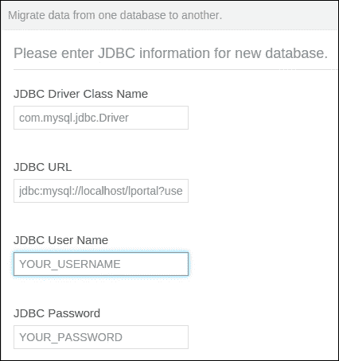

# 第十一章。快速技巧和高级知识

在本章中，我们将涵盖以下主题：

+   语言属性钩子

+   设置门户会话时间和会话策略

+   使用 SMTP 服务器配置 Liferay

+   通过 antisamy-hook 插件进行内网保护

+   将内容从一个数据库迁移到另一个数据库

+   使用 Liferay 服务总线进行插件间的通信

+   集群 Liferay 门户

# 简介

本章涵盖了各种相互之间没有关联的主题。食谱涵盖了 Liferay 管理员可能会遇到的一些标准场景，并提供了解决方案。这将帮助您为您的内网站点执行这些特定任务。几乎每个人都应该知道如何配置 SMTP 以发送电子邮件和接收通知。下一个重要方面是安全性。管理员和开发者应该知道如何安装 antisamy-hook 插件或如何设置会话时间和会话策略。这对于 Liferay 将用于任何类型的门户来说都极为重要。此外，本章还将介绍有关 Liferay 高级技巧的重要知识。它将描述 Liferay 服务总线，并展示用户如何使用它。此外，它还将详细说明 Liferay 中集群的工作原理以及如何将内容从一个数据库迁移到另一个数据库。

# 语言属性钩子

Liferay 拥有多语言架构，并允许用户添加具有多种翻译的内容。此外，它还提供了开箱即用的功能来更改语言。除此之外，内容门户还包含许多标签，这些标签也有自己的翻译。这意味着 Liferay 的设计具有一种功能，可以翻译标签或字段。如果我们查看源代码（`portal-impl/src/content`），会发现许多具有以下名称的文件：`Language_en.properties`、`Language_de.properties`、`Language_pl.properties` 等等。ISO 639-1 标准为每种语言定义了一组可能的代码，例如 **en** 代表英语，**de** 代表德语，等等。Liferay 门户支持多达 47 种语言，这些语言在名为 **locales** 的 `portal-impl/src/portal.properties` 文件中定义。默认翻译并不总是符合我们的期望。因此，在本食谱中，我们将向您展示如何使用钩子插件更改现有的标签。

## 如何做到这一点…

钩子插件的一个功能是覆盖现有翻译中的消息。我们的目标是将**登录**标签更改为**内网登录**。第一步是生成一个新的钩子，称为`language-hook`。要实现它，请使用 Liferay 插件 SDK（`${SDK_HOME}/hook/create.sh language "Language hook"`）或 Maven 存档生成器（`mvn archetype:generate -Dfilter=liferay-hook`）。如果您在生成语言钩子时遇到问题，请返回并研究第一章中的*创建自定义端口*食谱，*安装和基本配置*。我们假设用户将此插件作为 Maven 项目生成。接下来，将项目导入您喜欢的 IDE，例如 Eclipse、IntelliJ IDEA 或 NetBeans，并按照以下步骤操作：

1.  打开`src/main/webapp/WEB-INF/liferay-hook.xml`文件。

1.  定义一个新的语言属性文件：

    ```js
    <language-properties>
      i18n/Language_en.properties
    </language-properties>
    ```

1.  在`src/main/resources`中创建`i18n`文件夹，并创建`Language_en.properties`文件。

1.  在`Language_en.properties`中添加以下行：

    ```js
    sign-in=Intranet login
    ```

1.  编译插件并通过执行`mvn clean install liferay:deploy`命令来部署它。

## 它是如何工作的...

正如我们一开始所说的，Liferay 支持许多语言和翻译。每个翻译都保存在具有特定后缀的`Language.properties`文件中，例如`_pl`、`_en`、`_de`等。所有可用的区域设置都在以下门户属性中定义：

```js
locales=ar_SA,eu_ES,bg_BG,ca_AD,ca_ES,zh_CN,zh_TW,hr_HR,cs_CZ,da_DK,nl_NL,nl_BE,en_US,en_GB,en_AU,et_EE,fi_FI,fr_FR,fr_CA,gl_ES,de_DE,el_GR,iw_IL,hi_IN,hu_HU,in_ID,it_IT,ja_JP,ko_KR,lo_LA,lt_LT,nb_NO,fa_IR,pl_PL,pt_BR,pt_PT,ro_RO,ru_RU,sr_RS,sr_RS_latin,sl_SI,sk_SK,es_ES,sv_SE,tr_TR,uk_UA,vi_VN

locales.beta=ar_SA,eu_ES,bg_BG,ca_AD,zh_TW,hr_HR,cs_CZ,da_DK,nl_NL,nl_BE,en_GB,en_AU,et_EE,gl_ES,el_GR,hi_IN,in_ID,it_IT,ko_KR,lo_LA,lt_LT,nb_NO,fa_IR,pl_PL,pt_PT,ro_RO,ru_RU,sr_RS,sr_RS_latin,sl_SI,sk_SK,sv_SE,tr_TR,uk_UA,vi_VN

locales.enabled=ca_ES,zh_CN,en_US,fi_FI,fr_FR,de_DE,iw_IL,hu_HU,ja_JP,pt_BR,es_ES
```

第一个属性指定了 Liferay Portal 中所有可用的区域设置。第二个属性列出处于 beta 测试的语言。一组 beta 属性意味着翻译尚未完成，Liferay 可能包含一些错误或错误。

### 注意

您可以加入与翻译一起工作的社区，并参与其中。所有必要的信息都可在[`translate.liferay.com`](http://translate.liferay.com)找到。

最后一个属性列出 Liferay 默认支持的语言。如果我们创建一个新项目并满足我们的要求，则需要更改它。这可以在控制面板部分稍后更改。此操作在控制面板部分可用。

在本食谱中，我们向您展示了如何覆盖现有的属性。覆盖对于在`portal-impl/src/content/Language.properties`中定义的每个属性都有效。此外，在我们的`i18n/Language_en.properties`中，可以添加一个新属性，该属性可以用于我们的新功能。

在 Liferay 语言属性中，有一个`portal-impl/src/content/Language.properties`文件（没有语言后缀）。这组属性用于系统找不到特定国家/语言属性时。

## 还有更多...

除了自定义语言属性外，Liferay 允许您选择国际化如何工作。要了解此功能，您首先应该知道如何更改 Liferay 语言。默认情况下，Liferay 为特定语言提供唯一的 URL。以下是一些示例：

+   `http://localhost:8080/pl/web/guest/home`

+   `http://localhost:8080/en_US/web/guest/home`

此上下文（`/pl`，`/en_US`）由 `I18nServlet` 处理，该 Servlet 定义在 `web.xml` 文件中。此 Servlet 更改语言并渲染带有专用翻译的页面。

详细来说，有一个名为 `locale.prepend.friendly.url.style` 的属性位于 `portal-impl/src/portal.properties` 中。它有四个可能的值，如下表所示：

| 值 | 描述 |
| --- | --- |
| `0` | 本地化不会自动添加到 URL 前面。这意味着每个 URL 可能指向多种不同的语言。例如，如果用户在账户设置中设置了德语，门户默认显示英语网站。如果此属性设置为 0，页面 `http://localhost:8080/web/guest` 将以英语显示。然而，当用户登录时，它会自动翻译成德语。URI 的值相同，为 `/web/guest`，没有语言上下文。 |
| `1` | 当请求的语言不是默认语言时，本地化会自动添加到 URL 前面。这意味着每个 URL 只指向一种语言。让我们从第一个例子开始分析，其中用户设置了与默认语言不同的语言。第一次访问 `http://localhost:8080` 门户时，内容以默认语言（英语）显示。在登录操作后，用户被重定向到 `http://localhost:8080/de` URL。在每一页上，都有 `/de/web/guest/{PAGE}` URI。在注销后，门户会记住语言并显示德语翻译。 |
| `2` | 本地化会自动添加到每个 URL 前面。这意味着每个 URL 只指向一种语言。 |
| `3` | 当请求的语言不是默认用户语言时，本地化会自动添加到 URL 前面。对于访客用户，行为与值为 1 时相同。然而，在我们的情况下（用户具有与门户不同的本地化设置），存在以下情况：默认情况下，门户以英语显示内容，没有语言上下文。URL 看起来像 `http://localhost:8080/`。当用户登录时，语言是德语，但 URL 仍然是相同的，`http://localhost:8080`（没有语言上下文）。在注销操作后，URL 仍然是相同的，但语言仍然是德语。要更改语言，需要调用 `http://localhost:8080/en` URL。 |

与语言设置相关的最后一件事是默认语言定义。它位于 `portal-impl/src/system.properties` 中，可以被 `system-ext.properties` 覆盖。要设置默认语言，覆盖以下属性：

```js
user.country=PL
user.language=pl
```

## 参见

为了了解如何创建插件（尤其是端口），请参考第一章中的*创建自定义端口*配方，*安装和基本配置*

# 设置门户会话时间和会话策略

在每个项目中，尤其是在企业内部网项目中，主要功能是身份验证和授权，以便为已验证用户提供正确的权限并为他们提供专用内容。每个已登录用户都有自己的会话；到期时间可以具体设置。您还可以使用任何其他设置来设置会话，例如自动扩展会话或会话过期时的重定向。所有关于会话的设置都可以在`portal.properties`中找到。

假设我们的目标是配置以下会话策略：

+   会话在 10 分钟后过期

+   在会话过期后，系统将用户重定向到默认页面（如果所有页面都没有为未经认证的用户显示访客权限，系统应显示登录页面）

+   在会话结束前两分钟，系统应显示一个带有倒计时的警告

+   会话标识符不应在 URL 中可见

## 如何做到这一点...

如我们一开始所说，Liferay 通过`portal-ext.properties`覆盖了会话特定的属性。为了达到我们的目标，打开`portal-impl/src/portal-ext.properties`并设置以下定义：

```js
session.timeout=10
session.timeout.redirect.on.expire=true
session.timeout.auto.extend=false
session.timeout.warning=2
session.enable.url.with.session.id=false
```

除了`session.timeout`设置外，您还必须在`web.xml`中设置相同的值。为了完成此任务，打开位于`{$TOMCAT_HOME}/webapps/ROOT/WEB-INF`文件夹中的主`web.xml`文件。找到一个名为`session-config`的 XML 标签，并按以下方式更改：

```js
<session-config>
  <session-timeout>10</session-timeout>
</session-config>
```

最后，保存此文件并重新启动您的应用程序服务器。

## 它是如何工作的...

我们的首要目标是更改默认会话超时，它原本是 30 分钟。我们将其减少到 10 分钟。重要的是要知道，更改`session.timeout`属性是不够的，因为`web.xml`配置会覆盖此设置。为了完成我们的配置，我们还需要将此值更改到`web.xml`描述符中。

接下来，假设与超时后的用户重定向相关。为了达到我们的目标，我们需要更改两个属性：

+   `session.timeout.redirect.on.expire`：此设置为`true`，当会话过期时将用户重定向到默认页面

+   `session.timeout.auto.extend`：此设置为`false`以拒绝自动扩展会话

`session.timeout.warning`属性指定了在警告用户会话过期之前的时间（分钟数）。我们将此值设置为 2 分钟。

最后一个假设与安全要求相关。当然，它默认是禁用的，但我们决定展示如何进行配置。因此，最后一个名为`session.enable.url.with.session.id`的属性被设置为`false`。

# 使用 SMTP 服务器配置 Liferay

Liferay 在许多情况下发送电子邮件，例如添加日历事件和论坛帖子，或者当用户创建账户时。为了启用此功能，需要正确配置 SMTP 服务器并设置适当的属性。在本食谱中，我们将解释如何以最简单的方式配置 SMTP 服务器。

## 如何操作…

正确配置 SMTP 服务器有三种方法。最简单的方法是使用 Liferay 的控制面板，并通过 GUI 界面配置 SMTP 设置。要实现它，请转到 **管理** | **控制面板** | **服务器管理**，然后选择 **邮件** 选项卡。之后，在 **发件 SMTP 服务器** 部分下输入您的邮件会话设置，并点击 **保存** 按钮。当只有一个 SMTP 服务器实例或 SMTP 是第三方外部服务器时，这种设置是一个很好的选择。在许多情况下，这种设置是不够的。最好的例子是运行在集群环境中的应用程序，其中每个节点（Liferay 实例）都有自己的 SMTP 本地服务器。

在许多情况下，例如在集群环境中，将 SMTP 服务器安装在 Liferay 实例所在的同一节点上是一种非常常见的做法。在这种情况下，无法使用 GUI 界面配置 SMTP 服务器，但可以在 `portal-ext.properties` 中完成此设置。在这个文件中，我们可以放置以下列出的设置：

```js
mail.session.mail.pop3.host=localhost
mail.session.mail.pop3.password=
mail.session.mail.pop3.port=110
mail.session.mail.pop3.user=
mail.session.mail.smtp.auth=false
mail.session.mail.smtp.host=localhost
mail.session.mail.smtp.password=
mail.session.mail.smtp.port=25
mail.session.mail.smtp.user=
mail.session.mail.store.protocol=pop3
mail.session.mail.transport.protocol=smtp
```

最后一种可能性是使用应用服务器的邮件会话通过 **Java 命名和目录接口**（**JNDI**）来查找 Java 邮件会话。为了启用 JNDI 名称，请在 `portal-ext.properties` 文件中放置以下配置：

```js
mail.session.jndi.name=mail/MailSession
```

确保在您的 `{$TOMCAT_HOME}/conf/Catalina/localhost/ROOT.xml` 文件中定义了一个类似于以下标签的资源：

```js
<Resource name="mail/MailSession" auth="Container" type="javax.mail.Session" mail.imap.host="localhost" mail.pop3.host="localhost" mail.smtp.host="localhost" mail.store.protocol="imap" mail.transport.protocol="smtp" />
```

Liferay 门户推荐使用 SMTP 配置，而不是通过 GUI 或将属性设置为 Java 邮件的统一配置，因为这种配置不依赖于应用服务器。

## 它是如何工作的…

Liferay 有自己的消息总线实现。这是一个服务级 API，用于在 Liferay 内部交换消息。在这个特定案例中，电子邮件发送机制使用 *Liferay 消息总线*。与每个消息总线实现一样，有一个发送者，它将消息发送到目的地。这种功能在 `com.liferay.mail.service.impl.MailServiceImpl` 类的 `sendEmail` 方法中实现：

```js
public void sendEmail(MailMessage mailMessage) {
  MessageBusUtil.sendMessage(DestinationNames.MAIL, mailMessage);
}
```

如前所述的方法所示，发送操作具有相当简单的实现，仅调用 `com.liferay.portal.kernel.messaging.MessageBusUtil.sendMessage` 方法，并传递目的地和邮件消息参数。`MailMessageListener` 负责将电子邮件正确发送到指定地址。

在相反的一侧，有一个可以识别消息并消费它的监听器。例如，它会发送一封电子邮件。这是`com.liferay.mail.messaging.MailMessageListener`类，它接收事件（在这种情况下，邮件事件）并调用适当的操作来发送电子邮件。

# `antisamy-hook`插件通过内部网络进行保护

Liferay 6.x 提供了一个名为 sanitizers 的新功能。这是一个保护内容（HTML 和 JavaScript）免受用户可能传递给期刊文章、维基、论坛等恶意代码的实现。如果用户从任何互联网资源复制并粘贴内容，就可能发生这种情况。在 Liferay 核心实现中，没有 sanitizers。其中一个原因是 Liferay 允许用户实现自己的策略并将其作为钩子插件安装。幸运的是，Liferay 在官方 GitHub 仓库中有一个名为`antisamy-hook`的插件[`github.com/liferay/liferay-plugins/tree/master/hooks/antisamy-hook`](https://github.com/liferay/liferay-plugins/tree/master/hooks/antisamy-hook)。

在这个菜谱中，我们将向您展示如何安装此插件，并给您一个关于它是如何工作的想法。

## 如何做到这一点…

与其他插件一样，`antisamy-hook`插件可在官方 Liferay 市场上找到。因此，安装过程非常简单且统一。为了实现您的目标，以管理员身份登录，转到**Admin** | **Control Panel** | **Store**，找到**Antisamy CE**插件，并点击**Free**按钮购买它。如果您有一个有效的市场账户，此插件是免费的。之后，转到**Purchased**标签页并点击**Install**按钮。

在日志文件中，您应该找到以下消息：

```js
INFO  [localhost-startStop-2][HookHotDeployListener:687] Registering hook for antisamy-hook
Loading file:/home/piotr/clients/packt/project/tomcat-7.0.42/temp/6-antisamy-hook/WEB-INF/classes/portal.properties
INFO  [localhost-startStop-2][HookHotDeployListener:814] Hook for antisamy-hook is available for use
```

## 它是如何工作的…

`antisamy-hook`插件添加了一个*OWASP AntiSamy*实现，这意味着该插件包含了位于`org.owasp.validator.html.AntiSamy`包中的 OWASP `antisamy.jar`库。OWASP AntiSamy 项目是一个保护内容免受恶意代码侵害的 API。

### 注意

更多详细信息可在官方 OWASP 网站上找到[`www.owasp.org/index.php/Category:OWASP_AntiSamy_Project`](https://www.owasp.org/index.php/Category:OWASP_AntiSamy_Project)。

从技术角度来看，`antisamy-hook`插件是一个非常简单但功能强大的工具。它之所以简单，是因为它只是按照以下方式覆盖了`sanitizer.impl`属性：

```js
sanitizer.impl=com.liferay.antisamy.hook.sanitizer.AntiSamySanitizerImpl 
```

它非常强大，因为它使用了一个开源的 OWASP Antisamy 项目来过滤我们的内容。

主要实现位于`sanitize`方法中的`AntiSamySanitizerImpl`类（实际上，这个插件中只有一个类）：

```js
public String sanitize([arguments])
  throws SanitizerException {

  if (Validator.isNull(contentType) ||
    !contentType.equals(ContentTypes.TEXT_HTML)) {
    return s;
  }
  try {
    AntiSamy antiSamy = new AntiSamy();
    CleanResults cleanResults = antiSamy.scan(s, _policy);
    return cleanResults.getCleanHTML();
  }
  catch (Exception e) {
    _log.error("Unable to sanitize input", e);
    throw new SanitizerException(e);
  }
}
```

此实现会检查`contentType`是否为 HTML，然后`AntiSamy`实现会过滤内容并返回干净的结果。OWASP 库负责正确过滤内容。

# 将内容从一个数据库迁移到另一个数据库

内容迁移工具是 Liferay 提供的一个有趣的功能，作为开箱即用的核心实现。正如您所知，Liferay 允许管理员选择数据库引擎之一，例如 MySQL、PostgreSQL、Oracle 等。它允许用户在不丢失数据的情况下更改数据库引擎。

假设我们的 Liferay 实例使用的是 PostgreSQL 数据库，而我们想将其更改为 MySQL 引擎。

## 准备中…

为了迁移我们的内容，我们需要创建一个新的 MySQL 数据库。为了实现它，请登录到您的数据库：

```js
mysql -u {USER} -p

```

然后，使用以下命令创建一个新的数据库：

```js
CREATE DATABASE lportal
DEFAULT CHARACTER SET utf8
DEFAULT COLLATE utf8_general_ci;

```

## 如何操作…

此功能是开箱即用的。此外，它不需要开发人员支持。所有迁移过程都可以通过 GUI 完成。要迁移数据，请按照以下步骤操作：

1.  以管理员身份登录。

1.  前往**管理** | **控制面板** | **服务器管理**，并选择**数据迁移**选项卡。

1.  按以下方式填写表格：

    +   在**JDBC 驱动类名称**中，输入`com.mysql.jdbc.Driver`

    +   在**JDBC URL**中，输入`jdbc:mysql://localhost/lportal?useUnicode=true&characterEncoding=UTF-8&useFastDateParsing=false`

    +   在**JDBC 用户名**中，输入数据库的用户

    +   在**JDBC 密码**中，输入数据库用户的密码

    

1.  点击**执行**按钮。有关操作详细信息的所有信息都将出现在日志文件中。以下消息将逐渐出现在屏幕上：

1.  确保过程成功完成。在`catalina.out`日志文件中，您将找到以下消息：

    ```js
    Finished conversion for com.liferay.portal.convert.ConvertDatabase in 18652 ms.
    ```

1.  然后，关闭您的应用程序服务器，更改数据库属性以指示新的数据库，并使用新的配置启动应用程序服务器。

## 它是如何工作的…

数据库迁移过程由 Liferay 支持，以保留与数据库的兼容性。此过程使用 Liferay 消息总线，它公开了数据迁移的监听器。在这种情况下，一个事件准备并调用`com.liferay.portlet.admin.action.EditServerAction`类。以下列表显示了其实现方式：

```js
protected String convertProcess([Arguments]) throws Exception {
  [..]
  MaintenanceUtil.maintain(portletSession.getId(), className);
  MessageBusUtil.sendMessage(DestinationNames.CONVERT_PROCESS, className);
}
```

此方法负责准备特定数据，显示维护窗口，并向消息总线发送事件。

监听器由`com.liferay.portal.convert.ConvertDatabase`的`doConvert()`方法表示。此方法负责准备所有数据库数据并将其放入新数据库中。此方法中的所有细节都很复杂，但主要思想是取每个表、其数据和索引并将它们迁移到新的数据库模式中。

## 参见

如果您想迁移存储数据，请参考：

+   来自第六章，“Liferay 中的文档和媒体”的*与 Amazon S3 云集成*配方

+   来自第六章的*存储钩子之间的数据迁移*食谱，*Liferay 中的文档和媒体*

# 使用 Liferay 服务总线进行端口组件之间的通信

消息总线是一种将消息发送到 Liferay 中不同组件的机制。这种方法非常常见，因为它可以防止类加载问题。它非常重要，因为 Liferay 是一个端口组件容器，每个端口组件都没有关于其他组件的信息。因此，Liferay 提供了一个消息总线，允许端口组件之间进行通信。发送事件/消息的应用程序称为生产者，而接收消息的应用程序称为消费者。

消息总线架构支持异步和同步消息。同步消息等待响应，而异步消息发送消息、忘记它或接收回调。同步消息和异步消息之间的主要区别是第一个会阻塞线程并等待响应。

在本食谱中，我们将向您展示如何在真实示例中使用消息总线。假设我们的目标是编写一个具有自动完成功能的单输入搜索端口组件。这将是一个只有一个输入的简单表单，可以自动完成我们的查询。提交表单后，搜索条件应发送到现有的内置搜索端口组件。我们将使用 Liferay 消息总线与 Lucene 索引器进行通信。

由于无法展示和解释所有实现，我们将通过带有消息总线的代码片段进行解释。在下面的*如何做…*部分，我们将向您展示编译、部署和安装我们的端口组件的步骤。在本食谱的*如何工作…*部分，我们将解释消息总线实现。

## 如何做…

为了正确编译、部署和安装端口组件，请按照以下步骤操作：

1.  从[`www.liferay-guru.com/code/ch11/quicksearch-portlet.zip`](http://www.liferay-guru.com/code/ch11/quicksearch-portlet.zip)下载`quicksearch-portlet`。

1.  将端口组件复制到`工作区`文件夹。

1.  打开`quicksearch-portlet/pom.xml`，并在`<properties>`部分设置适当的路径。

1.  调用`mvn clean install liferay:deploy`命令。

1.  运行您的 Liferay 实例，并检查日志文件中是否有成功部署的消息：

    ```js
    INFO  [DispatcherPortlet:282] FrameworkPortlet 'quicksearchportlet': initialization completed in 81 ms
    INFO  [DispatcherPortlet:119] Portlet 'quicksearchportlet' configured successfully
    INFO  [localhost-startStop-3][PortletHotDeployListener:490] 1 portlet for quicksearch-portlet is available for use
    ```

1.  以管理员身份登录，创建一个名为**搜索**的页面，并将**搜索**端口组件放入左侧菜单中名为**添加**的工具类别下的**搜索**端口组件。

1.  创建第二个页面，例如，`快速搜索`，并添加**快速搜索**端口组件。

1.  打开搜索端口组件配置窗口，并将布局设置为搜索端口组件（在我们的例子中，它将是**搜索**页面）。

1.  点击**保存**按钮，并通过**X**按钮关闭弹出配置窗口。

1.  尝试在**QuickSearch**端口中输入一个单词（至少三个字母），并享受自动完成功能。

## 它是如何工作的...

在这个端口中，Liferay 消息总线用于询问搜索引擎关于自动完成的结果。在我们的例子中，生产者是一个名为`com.liferay.guru.portlet.quicksearch.util.QSMessageBusUtil`的类。其代码如下：

```js
public class QSMessageBusUtil {

  public static JSONArray sendSynchronousMessage(SearchContext searchContext)
  throws MessageBusException {
    Message message = new Message();
    message.setDestinationName(QSDestinationNames.SEARCH_AUTOCOMPLETE);
    message.setPayload(searchContext);
    message.setResponseDestinationName(DestinationNames.MESSAGE_BUS_DEFAULT_RESPONSE);

    Object response = MessageBusUtil.sendSynchronousMessage(message.getDestinationName(), message,
      SearchConstants.AUTOCOMPLETE_TIMEOUT);

    if (response instanceof JSONArray) {
      return (JSONArray) response;
    } else {
      throw new MessageBusException("Invalid message response");
    }
  }
}
```

此类只有一个方法，该方法返回一个包含搜索结果的 JSON 数组。前三行负责创建`Message`对象，该对象将被发送到消息总线。`Message`对象是`com.liferay.portal.kernel.messaging.Message`类的一个实例，具有以下字段：

+   `String _destinationName`：这是我们目标的名字。这是我们发送消息的地方

+   `Object _payload`：此字段表示一个将被发送到消费者的对象（有效载荷）

+   `Object _response`：此字段包含一个表示响应消息的对象

+   `String _responseDestinationName`：消费者（监听器）发送响应的地方。在我们的例子中，这是`DestinationNames.MESSAGE_BUS_DEFAULT_RESPONSE`，它定义了返回给目标、生产者的响应

+   `String _responseId`：此值表示响应标识符

+   `Map<String, Object> _values`：将发送到消费者或生产者的额外对象映射

在我们的实现中，我们将有效载荷设置为`SearchContext`（我们的 Lucene 查询）并将`responseDestinationName`设置为默认响应。

要将我们的消息发送到消息总线，我们调用了以下方法：

```js
Object response = MessageBusUtil.sendSynchronousMessage(
  message.getDestinationName(), message,
  SearchConstants.AUTOCOMPLETE_TIMEOUT);
```

有一个问题：哪个类应该接收我们的消息？答案和所有配置都在`applicationContext-messaging.xml`文件中，其内容如下：

```js
<util:constant id="destination.name.search.autocomplete"
  static-field="com.liferay.guru.portlet.quicksearch.util.
  QSDestinationNames.SEARCH_AUTOCOMPLETE" />
<bean id="messageListener.autocomplete.lucene" 
  class="com.liferay.guru.search.lucene.AutocompleteListener" />
<bean id="destination.search.autocomplete"
  class="com.liferay.portal.kernel.messaging.
  SynchronousDestination">
  <property name="name" ref="destination.name.
    search.autocomplete" />
</bean>
<!-- Configurator -->
<bean id="messagingConfigurator"
  class="com.liferay.portal.kernel.messaging.config.
  PluginMessagingConfigurator">
  <property name="messageListeners">
    <map key-type="java.lang.String" value-
      type="java.util.List">
      <entry key-ref="destination.name.search.autocomplete">
        <list>
          <ref bean="messageListener.autocomplete.lucene" />
        </list>
      </entry>
    </map>
  </property>
  <property name="destinations">
    <list>
      <ref bean="destination.search.autocomplete" />
    </list>
  </property>
</bean>
```

上述配置指定了以下豆类：

+   带有`messageListener.autocomplete.lucene` ID 的`listener`豆。

+   带有`destination.search.autocomplete` ID 的`destination`豆。

+   将监听器映射到其目标位置的`configurator`豆。在我们的例子中，它将我们的`destination.search.autocomplete`目标映射到`messageListener.autocomplete.lucene`豆。换句话说，它将目标与监听器连接起来。

让我们看看我们的监听器实现：

```js
public class AutocompleteListener extends BaseMessageListener {
  @Override
  protected void doReceive(Message message) throws Exception {

    Message response = MessageBusUtil.createResponseMessage( message );

    Object payload = message.getPayload();
    if ( payload instanceof SearchContext ) {
      response.setPayload( getSuggestions( (SearchContext) payload ) );
    }
    else {
      _log.error( "Message payload is invalid: " + Objects.toString( payload ) );
      response.setPayload( JSONFactoryUtil.createJSONArray() );
    }

    MessageBusUtil.sendMessage( response.getDestinationName(), response );
  }
[...]
}
```

`AutocompleteListener`扩展了`BaseMessageListener`并重写了`doReceive`方法。

此方法的主体负责创建一个新的响应并将其发送回我们的生产者。接收到的对象将被放入有效载荷字段。因此，我们的实现从有效载荷中获取一个对象，检查它是否是`SearchContext`，寻找新的建议，并将建议作为新的有效载荷设置。

总结这个配方，请记住以下事项：

+   Liferay 消息总线实现了生产者和消费者之间的通信

+   `Message`对象在生产者和消费者之间发送

+   生产者创建一个具有以下属性的`Message`对象：

    +   `payload`：此字段表示将要发送给消费者的对象（有效载荷）

    +   `responseDestinationName`：这是提供给监听器用于回复的名称

    +   可选地，`responseId`（`setResponseId`方法）和其他应作为键/值对发送给消费者的对象

+   要发送同步消息，应使用`MessageBusUtil.sendSynchronousMessage`方法

+   监听器（消费者）必须在 XML 定义中注册

+   监听器有一个`doReceive`方法，该方法发送回消息

+   消费者从消息中提取值并准备响应消息

+   应使用`MessageBusUtil.createResponseMessage`来创建响应消息

+   消费者通过`MessageBusUtil.sendMessage`方法向生产者发送消息

## 还有更多...

在本配方中，我们仅讨论了同步通信，这是使用消息总线的基本示例。实际上，在许多情况下使用同步消息并不是一个好主意。为什么？答案很简单：这种类型的通信会阻塞等待接收者的响应。消息通信基本上是为异步通信设计的。存在两种类型的异步消息：

+   **发送并忘记**：这意味着*推送一个事件然后忘记它*。这种类型的通信在通知情况下很有用，例如，如果生产者想通知监听器关于某些操作。

+   **回调**：生产者在`responseDestinationName`中为消息定义了一个回调目的地。监听器可以将消息发送回特定的`responseDestinationName`。重要的是，生产者可以自由地进行进一步处理。

从技术角度来看，异步实现与我们示例非常相似。主要区别在于它调用`MessageBusUtil`中的不同方法。要发送异步消息，应使用以下调用，正如你在发送响应时在监听器代码中所看到的：

```js
MessageBusUtil.sendMessage(message.getDestinationName(), message);
```

重要的是，`sendMessage`方法不返回任何值，因为它是一个异步消息，我们不知道是否有回调信息。所有应该发送回调的配置都放置在`messaging.xml`文件中。以下是一个示例：

```js
<entry key="YOUR_RESPONSE_DESTINATION_NAME">
  <list value-type="com.liferay.portal.kernel.messaging.MessageListener">
    <ref bean="messageListener.listener1" />
    <ref bean="messageListener.listener2" />
    <ref bean="messageListener.listenerN" />
  </list>
</entry>
```

## 参见

为了了解如何创建插件（尤其是端口组件），请参考第一章中的*创建自定义端口组件*配方，*安装和基本配置*。

# 集群 Liferay Portal

Liferay 在**社区版**（**CE**）和**企业版**（**EE**）版本中都支持开箱即用的集群功能。它旨在构建可扩展的系统，可以由拥有大量数据的大公司使用，因此它允许我们在并行服务器上运行多个门户实例。为了构建 Liferay 集群，您需要知道哪些组件对集群敏感。集群过程对以下组件有巨大影响：

+   数据库，Liferay 实例存储数据的地方

+   将文档和媒体作为硬盘上的文件夹

+   Lucene 搜索引擎文件

+   Liferay 缓存

此配方将逐点说明并展示如何正确地集群 Liferay。

## 准备工作…

此配方不是关于如何正确运行集群环境（如 Apache 服务器、负载均衡器等）的教程。相反，我们的目标是向您展示如何正确配置 Liferay，使其能够在并行环境中工作。假设您已正确配置所有组件。最后一步是配置 Liferay 以正确地在集群中工作。

## 如何操作...

正如我们一开始所说的，在运行 Liferay 集群之前，应该检查几个点。

### 检查数据库配置

第一件事，其实很简单，就是检查数据库配置。应该在所有 Liferay 节点之间共享一个数据库实例。为了检查配置的正确性，打开包含数据库访问配置的属性文件。通常，它是`portal-ext.properties`。确保在每个节点上配置都是相同的。以下是一个示例：

```js
jdbc.default.driverClassName=com.mysql.jdbc.Driver
jdbc.default.url=jdbc:mysql://localhost/lportal?useUnicode=true&characterEncoding=UTF-8&useFastDateParsing=false
jdbc.default.username=<USERNAME>
jdbc.default.password=<PASSWORD>
```

### 文档和媒体集群

在第六章中，我们解释了 Liferay 中的文档和媒体插件的工作原理。了解文件元数据存储在数据库中，但二进制数据（文件）存储在硬盘上也很重要。正如你所猜到的，当 Liferay 作为集群环境运行时，这将会成为一个问题，因为每个节点可以有自己的存储库，文件在节点之间不共享。为了解决这个问题，有三种方法：

+   通过**存储区域网络**（**SAN**）、**网络附加存储**（**NAS**）、GlusterFS 等方式在节点之间共享存储库：询问您的系统管理员在特定机器上哪种选项可用，并正确安装集群文件系统。在许多解决方案中，我们看到了一个 GlusterFS 系统，它在节点之间共享数据文件夹。此解决方案确保每个节点都有相同的文件存储库。确保以下属性指示共享磁盘存储的正确位置：

    ```js
    dl.store.file.system.root.dir=${liferay.home}/data/document_library
    ```

+   使用数据库存储：所有数据，包括二进制文件，都存储在数据库表中。要启用此配置，设置以下属性：

    ```js
    dl.store.impl=com.liferay.portlet.documentlibrary.store.DBStore
    ```

    此设置会自动使用数据库而不是文件系统。数据库应支持 BLOB 字段。

+   使用以下外部存储系统：

    +   **亚马逊云**：我们在第六章（part0050.xhtml#aid-1FLS41 "第六章。Liferay 中的文档和媒体"）*与亚马逊 S3 云的集成*配方中展示了如何配置此存储，*Liferay 中的文档和媒体*

    +   **内容管理互操作性服务**（**CMIS**）存储，例如 Alfresco：在成功安装 Alfresco（或其他 CMIS 存储系统）后，设置以下属性：

        ```js
        dl.store.impl=com.liferay.portlet.documentlibrary.store.CMISStore
        dl.store.cmis.credentials.username=none
        dl.store.cmis.credentials.password=none
        dl.store.cmis.repository.url=http://localhost:8080/alfresco/service/api/cmis
        dl.store.cmis.system.root.dir=Liferay Home
        ```

    +   **一个 Java 内容仓库**（**JCR**）存储，例如 Jackrabbit：这是一个作为 JSR-170 规范实现的 Apache 项目。Liferay 支持它，但由于性能问题和并发冲突，此配置已被弃用。在此解决方案中，Jackrabbit 仓库必须放置在 SAN 共享存储（挂载在每个节点上）。

### 搜索引擎

我们已经在第八章（part0059.xhtml#aid-1O8H61 "第八章。搜索和内容展示工具"）*搜索和内容展示工具*中提到了搜索引擎主题。我们展示了两个搜索引擎：Apache Lucene 和 Apache Solr。如果您使用 Solr 或 Solr Cloud 作为搜索引擎，一切都将完美运行，因为 Solr 是一个外部应用程序，Liferay 与其建立连接。在集群环境中，这是最佳选择，因为性能和搜索结果的质量。

正如您所知，Lucene 将其数据存储在本地存储文件系统中。在集群环境中，保持每个 Liferay 节点的最新索引是一个问题。我们不能通过 GlusterFS 复制索引文件，因为 Lucene 在写入索引或优化它时有时会锁定数据。为了解决这个冲突，Liferay 提供了一个功能，它提供了所有 Liferay 节点之间的复制机制。要启用此功能，请设置以下属性：

```js
cluster.link.enabled=true
lucene.replicate.write=true
```

这些属性需要为 Liferay 的所有节点设置。`cluster.link.enabled` 属性打开整个缓存复制机制，我们将在下一节中描述。

### 缓存复制

Liferay 使用 EhCache 缓存一些内容，例如 SQL 查询的结果。在集群环境中，缓存分布是一个非常重要的问题。每个节点都应该了解数据库上的更改和缓存失效。Phil Karlton 曾经引用：

> *"在计算机科学中，只有两件难事：缓存失效和命名事物。"*

我完全同意他的观点。

#### 多播

节点间的缓存分布与多播完美配合。请确保您的服务器支持多播。接下来，设置以下属性以启用复制：

```js
cluster.link.enabled=true
```

此属性打开集群模式。

以下属性定义了五个节点间消息分发的通道：

```js
    multicast.group.address["cluster-link-control"]=239.255.0.1
    multicast.group.port["cluster-link-control"]=23301

    multicast.group.address["cluster-link-udp"]=239.255.0.2
    multicast.group.port["cluster-link-udp"]=23302

    multicast.group.address["cluster-link-mping"]=239.255.0.3
    multicast.group.port["cluster-link-mping"]=23303

    multicast.group.address["hibernate"]=239.255.0.4
    multicast.group.port["hibernate"]=23304

    multicast.group.address["multi-vm"]=239.255.0.5
    multicast.group.port["multi-vm"]=23305
```

为前面的属性（设置）设置适当的 IP 地址和端口号。在许多环境中，它将自动运行。

#### 单播

在某些服务器上，可能无法通过多播发送消息。幸运的是，可以强制 Liferay 使用单播协议而不是多播。配置并不非常困难，但很难发现。为了减少在 Google 上花费的时间，请遵循以下配方部分并正确设置此类通信。

首先，通过将`cluster.link.enabled`属性设置为`true`值来打开集群模式。

接下来，您必须使用`JGroups`库通过 TCP 建立通信。为了实现这一点，设置以下属性：

```js
ehcache.bootstrap.cache.loader.factory=com.liferay.portal.cache.ehcache.JGroupsBootstrapCacheLoaderFactory
ehcache.cache.event.listener.factory=net.sf.ehcache.distribution.jgroups.JGroupsCacheReplicatorFactory
ehcache.cache.manager.peer.provider.factory=net.sf.ehcache.distribution.jgroups.JGroupsCacheManagerPeerProviderFactory

ehcache.multi.vm.config.location.peerProviderProperties=file=unicast-ehcache.xml
net.sf.ehcache.configurationResourceName.peerProviderProperties=file=unicast-ehcache.xml

cluster.link.channel.properties.control=unicast-ehcache.xml
cluster.link.channel.properties.transport.0=unicast-ehcache.xml

```

分析上一节中突出显示的部分。所有通道都引用了`unicast-ehcache.xml`文件。因此，在类路径上创建`unicast-ehcache.xml`文件（`${TOMCAT_HOME}webapps/ROOT/WEB-INF/classes`）。它也可以在`ext`插件中的`ext-impl/src/main/resources/unicast-ehcache.xml`创建。文件内容如下：

```js
<config 

  xsi:schemaLocation="urn:org:jgroups http://www.jgroups.org/schema/JGroups-2.8.xsd"
> 
      <TCP singleton_name="liferay" 
           bind_port="7800" 
           loopback="true" 
           recv_buf_size="${tcp.recv_buf_size:20M}" 
           send_buf_size="${tcp.send_buf_size:640K}" 
           discard_incompatible_packets="true" 
           max_bundle_size="64K"
           max_bundle_timeout="30" 
           enable_bundling="true" 
           use_send_queues="true" 
           sock_conn_timeout="300" 
           timer.num_threads="4" 
           thread_pool.enabled="true" 
           thread_pool.min_threads="1" 
           thread_pool.max_threads="10" 
           thread_pool.keep_alive_time="5000" 
           thread_pool.queue_enabled="false" 
           thread_pool.queue_max_size="100" 
           thread_pool.rejection_policy="discard" 
           oob_thread_pool.enabled="true" 
           oob_thread_pool.min_threads="1" 
           oob_thread_pool.max_threads="8" 
           oob_thread_pool.keep_alive_time="5000" 
           oob_thread_pool.queue_enabled="false" 
           oob_thread_pool.queue_max_size="100" 
           oob_thread_pool.rejection_policy="discard"/> 

    <TCPPING timeout="3000" 
             initial_hosts="${jgroups.tcpping.initial_hosts:localhost[7800],localhost[7801]}" 
             port_range="1" 
             num_initial_members="3"/> 

    <MERGE2 min_interval="10000" max_interval="30000"/> 
    <FD_SOCK/> 
    <FD timeout="3000" max_tries="3" /> 
    <VERIFY_SUSPECT timeout="1500" /> 
    <BARRIER /> 
    <pbcast.NAKACK use_mcast_xmit="false" gc_lag="0" retransmit_timeout="300,600,1200,2400,4800" discard_delivered_msgs="true"/> 
    <UNICAST timeout="300,600,1200" /> 
    <pbcast.STABLE stability_delay="1000" desired_avg_gossip="50000" max_bytes="400K"/> 
    <pbcast.GMS print_local_addr="true" join_timeout="3000" view_bundling="true"/> 
    <FC max_credits="2M" min_threshold="0.10"/> 
    <FRAG2 frag_size="60K" /> 
    <pbcast.STREAMING_STATE_TRANSFER/> 
    <!-- <pbcast.STATE_TRANSFER/> --> 
</config>
```

最后一件要启用通信的事情是告诉`JGroups`关于可用节点（Liferay 实例）的信息。假设有两个 Liferay 节点，以下 IP 地址：

+   **node1**带有 192.168.0.10 地址

+   **node2**带有 192.168.0.11 地址

为了配置它，请在您的应用服务器中设置以下`JAVA_OPTS`变量（例如，在`${TOMCAT_HOME}/bin/setenv.sh`）：

**node1**:

```js
JAVA_OPTS="${JAVA_OPTS} -Djgroups.bind_addr=192.168.0.10" JAVA_OPTS="${JAVA_OPTS} -Djgroups.tcpping.initial_hosts=192.168.0.10[7800],192.168.0.11[7800] "
```

**node2**:

```js
JAVA_OPTS="${JAVA_OPTS} -Djgroups.bind_addr=192.168.0.11" JAVA_OPTS="${JAVA_OPTS} -Djgroups.tcpping.initial_hosts=192.168.0.10[7800],192.168.0.11[7800] "
```

## 它是如何工作的…

在这个配方中，我们讨论了从数据库配置到 Ehcache 复制的几个主题。所有这些步骤都是正确在集群环境中运行 Liferay 所必需的。Liferay 是一个具有许多依赖项的庞大系统，因此在多个服务器实例中安装它相当困难。我们相信我们的建议将帮助您配置和运行 Liferay CMS。我们的目的是介绍可能的配置方式。每个公司都有自己的安装 Liferay 的想法和解决方案。根据我们的经验，以下是一些最佳配置：

+   使用带有`mod_jk`模块和负载均衡器作为反向代理的 Apache

+   Squid 作为缓存代理

+   GlusterFS 作为共享文件系统，其中文档和媒体组件端口保留其数据

+   Solr 服务器和 Zookeeper 作为搜索引擎云

+   带有主/从配置的 MySQL 数据库

+   通过多播（或单播）的 EhCache 复制

    ### 注意

    如果需要更详细的信息，请访问 Liferay 官方文档[`dev.liferay.com/discover/deployment/-/knowledge_base/6-2/liferay-clustering`](https://dev.liferay.com/discover/deployment/-/knowledge_base/6-2/liferay-clustering)。

## 参见

为了了解更多关于可伸缩基础设施的信息，请参考以下配方：

+   来自第十二章的*可伸缩基础设施*配方，*基本性能调整*

+   与亚马逊 S3 云的**集成**以及来自第六章，*Liferay 中的文档和媒体*中的*存储钩子之间的数据迁移*食谱
