# 第一章. 使用 Three.js 创建您的第一个 3D 场景

现代浏览器正逐渐获得更多可以直接通过 JavaScript 访问的功能。您可以使用新的 HTML5 标签轻松添加视频和音频，并通过使用 HTML5 画布创建交互式组件。与现代浏览器一起，HTML5 也开始支持 WebGL。使用 WebGL，您可以直接利用显卡的处理资源，创建高性能的 2D 和 3D 计算机图形。直接从 JavaScript 编程 WebGL 以创建和动画化 3D 场景是一个非常复杂且容易出错的流程。Three.js 是一个库，它使这个过程变得容易得多。以下列表显示了 Three.js 使哪些事情变得简单：

+   创建简单和复杂的 3D 几何体

+   通过 3D 场景动画和移动对象

+   将纹理和材质应用到您的对象上

+   利用不同的光源照亮场景

+   从 3D 建模软件加载对象

+   向您的 3D 场景添加高级后处理效果

+   使用您自己的自定义着色器

+   创建点云

只需几行 JavaScript 代码，您就可以创建任何东西，从简单的 3D 模型到逼真的实时场景，如下面的截图所示（您可以在浏览器中打开[`www.vill.ee/eye/`](http://www.vill.ee/eye/)自行查看）：

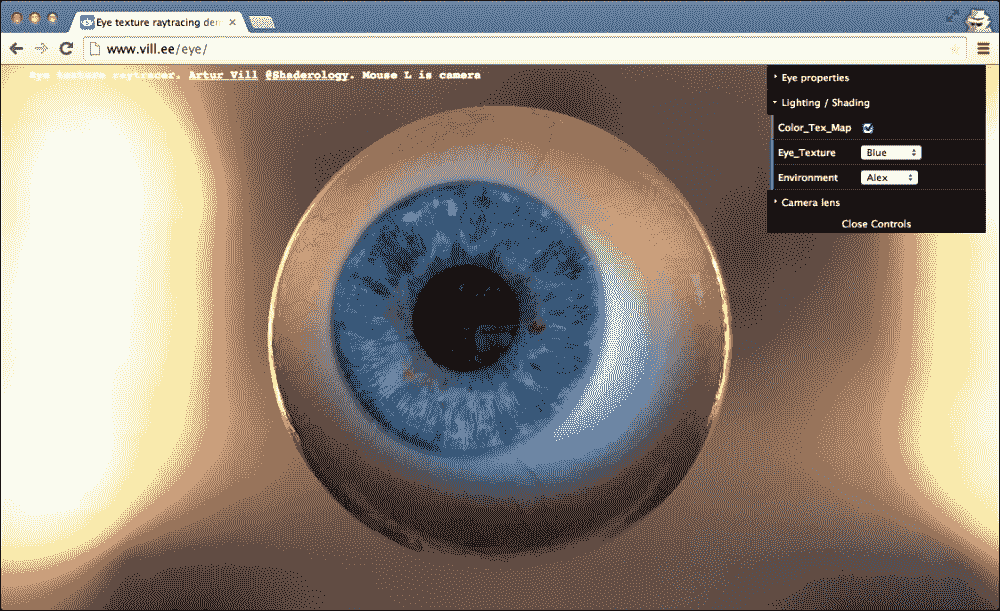

在本章中，我们将直接深入探讨 Three.js，并创建一些示例，向您展示 Three.js 的工作原理，以及您可以用来进行实验的内容。我们不会立即深入所有技术细节；这些内容将在后续章节中学习。在本章中，我们将涵盖以下要点：

+   使用 Three.js 所需工具

+   下载本书中使用的源代码和示例

+   创建您的第一个 Three.js 场景

+   通过材质、灯光和动画改进第一个场景

+   介绍一些用于统计和场景控制的辅助库

我们将从这个简短的 Three.js 介绍开始这本书，然后快速进入第一个示例和代码示例。在我们开始之前，让我们快速查看目前最重要的浏览器及其对 WebGL 的支持。

在撰写本文时，WebGL 与以下桌面浏览器兼容：

| 浏览器 | 支持 |
| --- | --- |
| Mozilla Firefox | 该浏览器自版本 4.0 开始支持 WebGL。 |
| Google Chrome | 该浏览器自版本 9 开始支持 WebGL。 |
| Safari | 安装在 Mac OS X Mountain Lion、Lion 或 Snow Leopard 上的 Safari 版本 5.1 及更高版本支持 WebGL。请确保您已启用 Safari 中的 WebGL。您可以通过转到**首选项** &#124; **高级**并勾选**在菜单栏中显示开发菜单**来完成此操作。之后，转到**开发** &#124; **启用 WebGL**。 |
| Opera | 自 12.00 版本起，此浏览器已支持 WebGL。您仍然需要通过打开 **opera:config** 并将 **WebGL** 和 **Enable Hardware Acceleration** 的值设置为 `1` 来启用此功能。之后，重新启动浏览器。 |
| Internet Explorer | Internet Explorer 一直是有史以来唯一一个不支持 WebGL 的重要浏览器。从 IE11 开始，微软添加了对 WebGL 的支持。 |

基本上，Three.js 在除旧版 IE 之外的所有现代浏览器上运行。因此，如果您想使用旧版 IE，您必须采取额外步骤。对于 IE 10 和更早版本，有一个 *iewebgl* 插件，您可以从 [`github.com/iewebgl/iewebgl`](https://github.com/iewebgl/iewebgl) 获取。此插件安装在 IE 10 和更早版本中，并为这些浏览器启用 WebGL 支持。

三.js 也可能在移动设备上运行；对 WebGL 的支持和您将获得的表现将有所不同，但两者都在迅速提高：

| 设备 | 支持 |
| --- | --- |
| Android | Android 的原生浏览器没有 WebGL 支持，并且通常也缺乏对现代 HTML5 功能的支持。如果您想在 Android 上使用 WebGL，您可以使用最新的 Chrome、Firefox 或 Opera 移动版本。 |
| iOS | 在 iOS 8 中，iOS 设备也支持 WebGL。iOS Safari 版本 8 对 WebGL 有很好的支持。 |
| Windows mobile | Windows mobile 自 8.1 版本起支持 WebGL。 |

使用 WebGL，您可以在桌面和移动设备上创建运行良好的交互式 3D 可视化。

### 小贴士

在这本书中，我们将主要关注由 Three.js 提供的基于 WebGL 的渲染器。然而，还有一个基于 CSS 3D 的渲染器，它提供了一个简单的 API 来创建基于 CSS 3D 的 3D 场景。使用基于 CSS 3D 的方法的一个大优点是，这个标准几乎在所有移动和桌面浏览器上都得到支持，并允许你在 3D 空间中渲染 HTML 元素。我们将在 第七章，*粒子、精灵和点云* 中展示如何使用 CSS 3D 浏览器。

在本章中，您将直接创建您的第一个 3D 场景，并能够在之前提到的任何浏览器中运行它。我们不会介绍太多复杂的 Three.js 功能，但在本章结束时，您将创建您可以在以下屏幕截图中看到的 Three.js 场景。

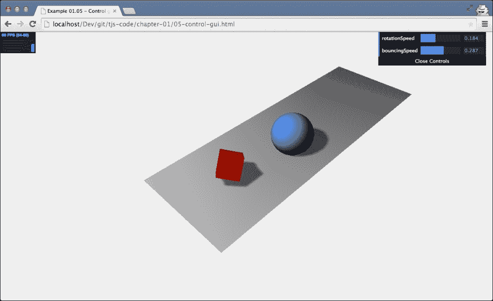

对于这个第一个场景，您将了解 Three.js 的基础知识，并创建您的第一个动画。在您开始此示例的工作之前，在接下来的几个部分中，我们将首先查看您需要轻松使用 Three.js 的工具，以及您如何下载本书中展示的示例。

# 使用 Three.js 的要求

Three.js 是一个 JavaScript 库，因此你只需要一个文本编辑器和其中一个支持的浏览器来渲染结果。我想推荐两个 JavaScript 编辑器，我在过去几年里开始专门使用它们：

+   **WebStorm**：来自 JetBrains 的这款编辑器对编辑 JavaScript 提供了极大的支持。它支持代码补全、自动部署和直接从编辑器中进行 JavaScript 调试。除此之外，WebStorm 对 GitHub（和其他版本控制系统）有极好的支持。你可以从[`www.jetbrains.com/webstorm/`](http://www.jetbrains.com/webstorm/)下载试用版。

+   **Notepad++**：Notepad++是一个通用编辑器，支持广泛编程语言的代码高亮。它可以轻松地布局和格式化 JavaScript。请注意，Notepad++仅适用于 Windows。你可以从[`notepad-plus-plus.org/`](http://notepad-plus-plus.org/)下载 Notepad++。

+   **Sublime Text 编辑器**：Sublime 是一个非常棒的编辑器，它对编辑 JavaScript 提供了非常好的支持。除此之外，它提供了许多非常有用的选择（如多行选择）和编辑选项，一旦你习惯了它们，就能提供一个真正优秀的 JavaScript 编辑环境。Sublime 也可以免费试用，可以从[`www.sublimetext.com/`](http://www.sublimetext.com/)下载。

即使你不使用这些编辑器，也有很多可用的编辑器，开源和商业的都有，你可以使用它们来编辑 JavaScript 并创建你的 Three.js 项目。你可能想看看的一个有趣的项目是[`c9.io`](http://c9.io)。这是一个基于云的 JavaScript 编辑器，可以连接到 GitHub 账户。这样，你可以直接访问这本书中的所有源代码和示例，并对其进行实验。

### 小贴士

除了这些你可以用来编辑和实验本书源代码的文本编辑器之外，Three.js 目前也提供了一个在线编辑器。

使用这个编辑器，你可以在这里找到[`threejs.org/editor/`](http://threejs.org/editor/)，你可以通过图形化的方法创建 Three.js 场景。

我提到过，大多数现代网络浏览器都支持 WebGL，并且可以用来运行 Three.js 示例。我通常在 Chrome 中运行我的代码。原因是 Chrome 通常对 WebGL 的支持和性能最好，它还有一个非常出色的 JavaScript 调试器。使用这个调试器，你可以快速定位问题，例如，使用断点和控制台输出。这将在下面的屏幕截图中进行说明。在整个这本书中，我会给你一些调试器使用和其他调试技巧的提示。

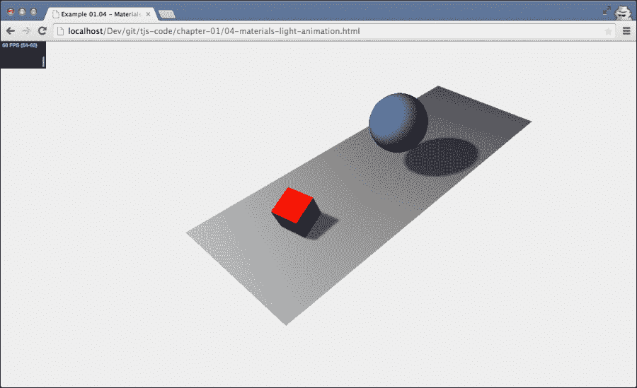

现在对于 Three.js 的介绍就到这里；让我们获取源代码，并从第一个场景开始。

# 获取源代码

本书的所有代码都可以从 GitHub([`github.com/`](https://github.com/))访问。GitHub 是一个基于 Git 的在线仓库，您可以使用它来存储、访问和版本控制源代码。您有几种方法可以获取自己的源代码：

+   克隆 Git 仓库

+   下载并提取存档

在接下来的两段中，我们将更详细地探讨这些选项。

## 使用 Git 克隆仓库

Git 是一个开源的分布式版本控制系统，我使用它来创建和版本控制本书中的所有示例。为此，我使用了 GitHub，这是一个免费的在线 Git 仓库。您可以通过[`github.com/josdirksen/learning-threejs`](https://github.com/josdirksen/learning-threejs)浏览此仓库。

要获取所有示例，您可以使用`git`命令行工具克隆此仓库。为此，您首先需要为您的操作系统下载一个 Git 客户端。对于大多数现代操作系统，您可以从[`git-scm.com`](http://git-scm.com)下载客户端，或者您可以使用 GitHub 本身提供的客户端（适用于 Mac 和 Windows）。安装 Git 后，您可以使用它来获取本书仓库的*克隆*版本。打开命令提示符并转到您想要下载源文件的目录。在该目录中，运行以下命令：

```js
# git clone https://github.com/josdirksen/learning-threejs

```

这将开始下载所有示例，如下面的截图所示：

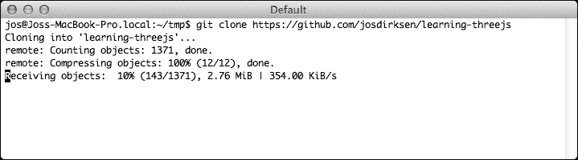

`learning-three.js`目录现在将包含本书中使用的所有示例。

## 下载并提取存档

如果您不想使用 Git 直接从 GitHub 下载源文件，您也可以下载一个存档。在浏览器中打开[`github.com/josdirksen/learning-threejs`](https://github.com/josdirksen/learning-threejs)，然后点击右侧的**下载 ZIP**按钮，如下所示：

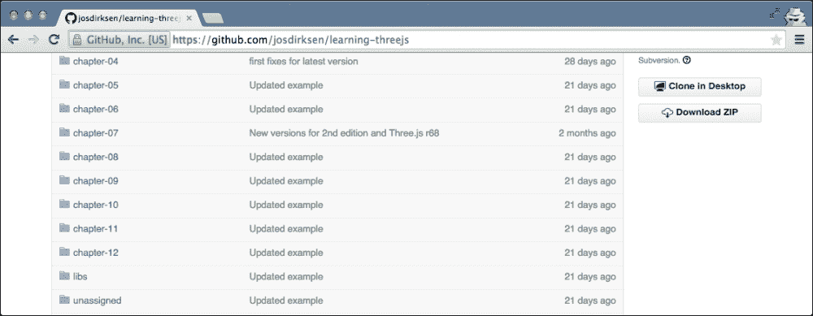

将其提取到您选择的目录中，您将拥有所有可用的示例。

## 测试示例

现在您已经下载或克隆了源代码，让我们快速检查一切是否正常工作，并让您熟悉目录结构。代码和示例按章节组织。查看示例有两种不同的方式。您可以直接在浏览器中打开提取或克隆的文件夹，查看和运行特定的示例，或者您可以安装一个本地网络服务器。第一种方法适用于大多数基本示例，但当我们开始加载外部资源，如模型或纹理图像时，仅仅打开 HTML 文件是不够的。在这种情况下，我们需要一个本地网络服务器来确保外部资源被正确加载。在下一节中，我们将解释几种不同的方法，您可以设置一个简单的本地网络服务器进行测试。如果您无法设置本地网络服务器但使用 Chrome 或 Firefox，我们还提供了如何禁用某些安全功能的说明，这样您甚至可以在没有本地网络服务器的情况下进行测试。

根据您已经安装的软件，设置本地网络服务器非常简单。在这里，我们列出了一些如何进行此操作的示例。根据您系统上已安装的软件，有多种不同的方法可以做到这一点。

### 基于 Python 的网络服务器应在大多数 Unix/Mac 系统上工作

大多数 Unix/Linux/Mac 系统已经安装了 Python。在这些系统上，您可以非常容易地启动一个本地网络服务器：

```js
 > python -m SimpleHTTPServer
 Serving HTTP on 0.0.0.0 port 8000 ...

```

在您检出/下载源代码的目录中执行此操作。

### 如果您使用过 Node.js，那么基于 npm 的网络服务器是一个不错的选择

如果您已经使用过 Node.js 做了一些工作，那么您很可能已经安装了 npm。使用 npm，您有两个简单的选项来快速设置一个用于测试的本地网络服务器。第一个选项使用 `http-server` 模块，如下所示：

```js
 > npm install -g http-server
 > http-server
Starting up http-server, serving ./ on port: 8080
Hit CTRL-C to stop the server

```

或者，您也可以使用 `simple-http-server` 选项，如下所示：

```js
> npm install -g simple-http-server
> nserver
simple-http-server Now Serving: /Users/jos/git/Physijs at http://localhost:8000/

```

然而，第二种方法的缺点是它不会自动显示目录列表，而第一种方法会。

### 适用于 Mac 和/或 Windows 的便携式 Mongoose 版本

如果您还没有安装 Python 或 npm，有一个简单、便携的网络服务器，名为 Mongoose，您可以使用。首先，从 [`code.google.com/p/mongoose/downloads/list`](https://code.google.com/p/mongoose/downloads/list) 下载您特定平台的二进制文件。如果您使用 Windows，将其复制到包含示例的目录中，然后双击可执行文件以启动一个在启动目录中提供服务的网络浏览器。

对于其他操作系统，您也必须将可执行文件复制到目标目录，但您需要从命令行启动它，而不是双击可执行文件。在两种情况下，都会在端口 `8080` 上启动一个本地网络服务器。以下截图概括了本段落的讨论内容：

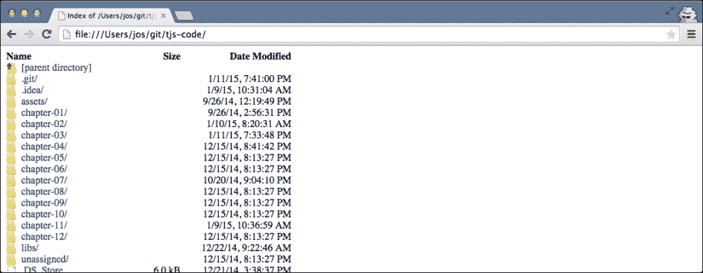

只需点击一个章节，我们就可以展示和访问该特定章节的所有示例。如果我在这本书中讨论一个示例，我会引用具体的名称和文件夹，这样你就可以直接测试并玩转代码。

### 在 Firefox 和 Chrome 中禁用安全异常

如果你使用 Chrome 运行示例，有一种方法可以禁用一些安全设置，这样你就可以使用 Chrome 查看示例，而无需 Web 服务器。为此，你必须以以下方式启动 Chrome：

+   对于 Windows 系统，你可以调用以下命令：

    ```js
    chrome.exe --disable-web-security

    ```

+   在 Linux 上，请执行以下操作：

    ```js
    google-chrome --disable-web-security

    ```

+   在 Mac OS 上，你可以通过以下方式启动 Chrome 来禁用设置：

    ```js
    open -a Google\ Chrome --args --disable-web-security

    ```

以这种方式启动 Chrome 后，你可以直接从本地文件系统中访问所有示例。

对于 Firefox 用户，我们需要采取几个不同的步骤。打开 Firefox，在 URL 栏中输入`about:config`。这就是你会看到的内容：

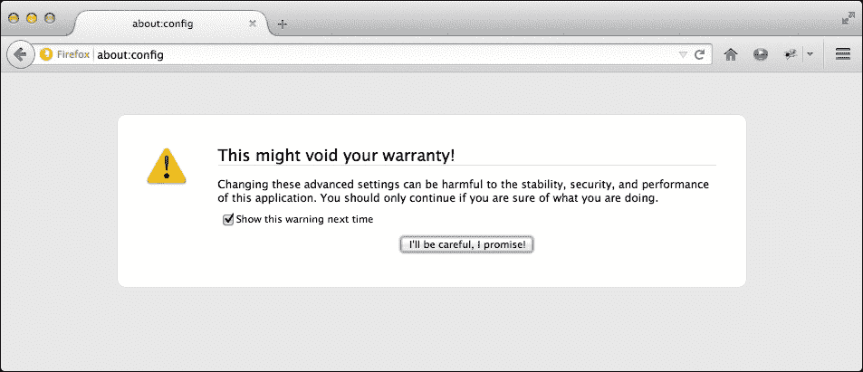

在这个屏幕上，点击**我会小心，我保证**按钮。这将显示你可以用来微调 Firefox 的所有可用属性。在这个屏幕上的搜索框中，输入`security.fileuri.strict_origin_policy`并将它的值更改为`false`，就像我们在以下截图中所做的那样：

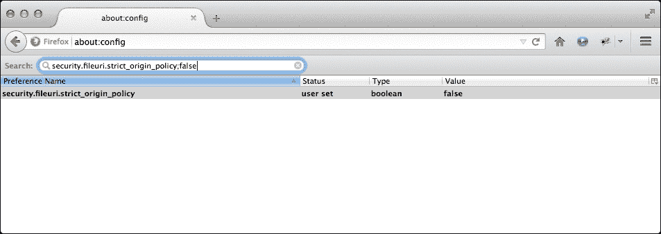

到这个阶段，你也可以使用 Firefox 直接运行这本书提供的示例。

现在你已经安装了 Web 服务器或者禁用了必要的安全设置，是时候开始创建我们的第一个 Three.js 场景了。

# 创建 HTML 骨架

我们需要做的第一件事是创建一个空白的骨架页面，我们可以将其用作所有示例的基础，如下所示：

```js
<!DOCTYPE html>

<html>

  <head>
    <title>Example 01.01 - Basic skeleton</title>
    <script src="img/three.js"></script>
    <style>
      body{
        /* set margin to 0 and overflow to hidden, to use the complete page */

        margin: 0;
        overflow: hidden;
      }
    </style>
  </head>
  <body>

    <!-- Div which will hold the Output -->
    <div id="WebGL-output">
    </div>

    <!-- Javascript code that runs our Three.js examples -->
    <script>

      // once everything is loaded, we run our Three.js stuff.
      function init() {
        // here we'll put the Three.js stuff
      };
      window.onload = init;

    </script>
  </body>
</html>
```

### 小贴士

**下载示例代码**

你可以从[`www.packtpub.com`](http://www.packtpub.com)下载你购买的所有 Packt Publishing 书籍的示例代码文件。如果你在其他地方购买了这本书，你可以访问[`www.packtpub.com/support`](http://www.packtpub.com/support)并注册，以便将文件直接通过电子邮件发送给你。

如你所见，这个列表显示，框架是一个非常简单的 HTML 页面，只有几个元素。在 `<head>` 元素中，我们加载了我们将用于示例的外部 JavaScript 库。对于所有示例，我们至少需要加载 Three.js 库，`three.js`。在 `<head>` 元素中，我们还添加了几行 CSS。这些样式元素在创建全页 Three.js 场景时移除了任何滚动条。在这个页面的 `<body>` 元素中，你可以看到一个单独的 `<div>` 元素。当我们编写 Three.js 代码时，我们将 Three.js 渲染器的输出指向该元素。在页面底部，你已经开始看到一些 JavaScript 代码。通过将 `init` 函数分配给 `window.onload` 属性，我们确保当 HTML 文档加载完成时调用此函数。在 `init` 函数中，我们将插入所有 Three.js 特定的 JavaScript。

Three.js 有两个版本：

+   **Three.min.js**：这是你在将 Three.js 网站部署到互联网上时通常会使用的库。这是使用 **UglifyJS** 创建的 Three.js 的精简版本，其大小是正常 Three.js 库的四分之一。本书中使用的所有示例和代码都是基于 2014 年 10 月发布的 Three.js **r69** 版本。

+   **Three.js**：这是正常的 Three.js 库。我们在示例中使用这个库，因为它使得当你能够阅读和理解 Three.js 源代码时，调试变得容易得多。

如果我们在浏览器中查看这个页面，结果并不令人震惊。正如你所预期的，你看到的是一个空白的页面。

在下一节，你将学习如何添加前几个 3D 对象，并将它们渲染到我们在 HTML 框架中定义的 `<div>` 元素中。

# 渲染和查看 3D 对象

在这一步，你将创建你的第一个场景，并添加一些对象和相机。我们的第一个例子将包含以下对象：

| 对象 | 描述 |
| --- | --- |
| `Plane` | 这是一个二维矩形，作为我们的地面区域。在本章的第二张截图，这个矩形被渲染为场景中间的灰色矩形。 |
| `Cube` | 这是一个三维立方体，我们将用红色渲染它。 |
| `Sphere` | 这是一个三维球体，我们将用蓝色渲染它。 |
| `Camera` | 相机决定了你将在输出中看到什么。 |
| `Axes` | 这些是 *x*、*y* 和 *z* 轴。这是一个有用的调试工具，可以查看对象在 3D 空间中的渲染位置。*x* 轴是红色，*y* 轴是绿色，*z* 轴是蓝色。 |

我首先会向你展示它在代码中的样子（带有注释的源代码可以在 `chapter-01/02-first-scene.html` 中找到），然后我会解释正在发生的事情：

```js
function init() {
  var scene = new THREE.Scene();
  var camera = new THREE.PerspectiveCamera(45, window.innerWidth /window.innerHeight, 0.1, 1000);

  var renderer = new THREE.WebGLRenderer();
  renderer.setClearColorHex(0xEEEEEE);
  renderer.setSize(window.innerWidth, window.innerHeight);

  var axes = new THREE.AxisHelper(20);
  scene.add(axes);

  var planeGeometry = new THREE.PlaneGeometry(60, 20, 1, 1);
  var planeMaterial = new THREE.MeshBasicMaterial({color: 0xcccccc});
  var plane = new THREE.Mesh(planeGeometry, planeMaterial);

  plane.rotation.x = -0.5 * Math.PI;
  plane.position.x = 15
  plane.position.y = 0
  plane.position.z = 0

  scene.add(plane);

  var cubeGeometry = new THREE.BoxGeometry(4, 4, 4)
  var cubeMaterial = new THREE.MeshBasicMaterial({color: 0xff0000, wireframe: true});
  var cube = new THREE.Mesh(cubeGeometry, cubeMaterial);

  cube.position.x = -4;
  cube.position.y = 3;
  cube.position.z = 0;

  scene.add(cube);

  var sphereGeometry = new THREE.SphereGeometry(4, 20, 20);
  var sphereMaterial = new THREE.MeshBasicMaterial({color: 0x7777ff, wireframe: true});
  var sphere = new THREE.Mesh(sphereGeometry, sphereMaterial);

  sphere.position.x = 20;
  sphere.position.y = 4;
  sphere.position.z = 2;

  scene.add(sphere);

  camera.position.x = -30;
  camera.position.y = 40;
  camera.position.z = 30;
  camera.lookAt(scene.position);

  document.getElementById("WebGL-output")
    .appendChild(renderer.domElement);
    renderer.render(scene, camera);
};
window.onload = init;
```

如果我们在浏览器中打开这个示例，我们看到的是我们想要达到的效果（参见本章开头的截图），但它仍然还有很长的路要走，如下所示：

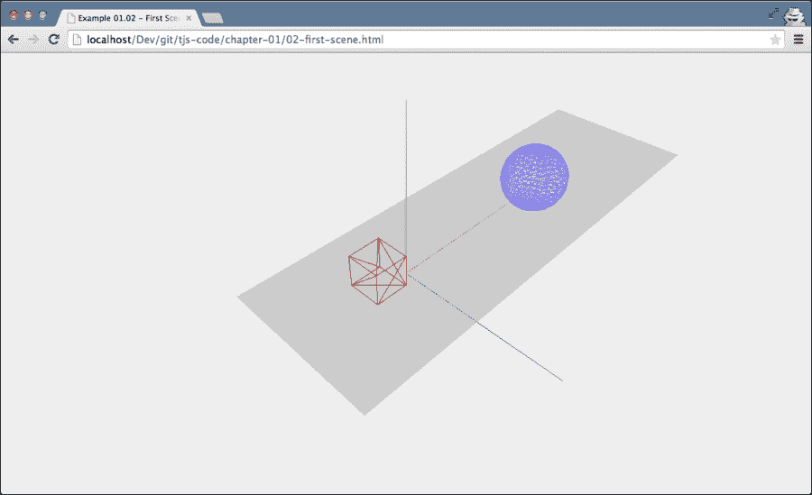

在我们开始使这个场景更加美观之前，我会一步一步地带你了解代码，这样你就能理解代码的功能：

```js
var scene = new THREE.Scene();
var camera = new THREE.PerspectiveCamera(45, window.innerWidth / window.innerHeight, 0.1, 1000);
var renderer = new THREE.WebGLRenderer();
renderer.setClearColorHex()
renderer.setClearColor(new THREE.Color(0xEEEEEE));
renderer.setSize(window.innerWidth, window.innerHeight);
```

在示例的顶部，我们定义了`scene`、`camera`和`renderer`。`scene`对象是一个容器，用于存储和跟踪我们想要渲染的所有对象以及我们想要使用的所有灯光。没有`THREE.Scene`对象，Three.js 无法渲染任何内容。关于`THREE.Scene`对象的更多信息可以在下一章找到。我们想要渲染的球体和立方体将在示例的后面部分添加到场景中。在这个第一个片段中，我们还创建了一个`camera`对象。`camera`对象定义了当我们渲染一个场景时我们会看到什么。在第二章中，*构成 Three.js 场景的基本组件*，你将了解更多关于可以传递给`camera`对象的参数。

### 提示

如果你查看 Three.js 的源代码和文档（你可以在[`threejs.org/`](http://threejs.org/)找到），你会注意到除了基于 WebGL 的渲染器之外，还有不同的渲染器可用。有一个基于画布的渲染器，甚至还有一个基于 SVG 的渲染器。尽管它们可以工作并且可以渲染简单的场景，但我不会推荐使用它们。它们非常占用 CPU 资源，并且缺乏如良好的材质支持和阴影等特性。

在这里，我们使用`setClearColor`函数将`renderer`的背景颜色设置为几乎白色（`new THREE.Color(0XEEEEEE)`），并使用`setSize`函数告诉`renderer`场景需要渲染的大小。

到目前为止，我们已经得到了一个基本的空场景、一个渲染器和一台相机。然而，目前还没有东西可以渲染。以下代码添加了辅助轴和平面：

```js
  var axes = new THREE.AxisHelper( 20 );
  scene.add(axes);

  var planeGeometry = new THREE.PlaneGeometry(60,20);
  var planeMaterial = new THREE.MeshBasicMaterial({color: 0xcccccc});
  var plane = new THREE.Mesh(planeGeometry,planeMaterial);

  plane.rotation.x=-0.5*Math.PI;
  plane.position.x=15
  plane.position.y=0
  plane.position.z=0
  scene.add(plane);
```

如您所见，我们创建了一个`axes`对象，并使用`scene.add`函数将这些轴添加到场景中。接下来，我们创建平面。这分为两个步骤。首先，我们使用新的`THREE.PlaneGeometry(60,20)`代码定义平面的外观。在这种情况下，它的宽度为`60`，高度为`20`。我们还需要告诉 Three.js 这个平面的外观（例如，其颜色和透明度）。在 Three.js 中，我们通过创建一个材质对象来实现这一点。对于这个第一个例子，我们将创建一个基本材质（`THREE.MeshBasicMaterial`），颜色为`0xcccccc`。接下来，我们将这两个元素组合成一个名为`plane`的`Mesh`对象。在我们将`plane`添加到场景之前，我们需要将其放置在正确的位置；我们通过首先围绕 x 轴旋转 90 度来实现这一点，然后使用位置属性定义其在场景中的位置。如果您已经对这一细节感兴趣，请查看第二章代码文件夹中的`06-mesh-properties.html`示例，*构成 Three.js 场景的基本组件*，它展示了旋转和定位的说明。然后我们需要做的就是将`plane`添加到`scene`中，就像我们添加`axes`一样。

`cube`和`sphere`对象以相同的方式添加，但将`wireframe`属性设置为`true`，这告诉 Three.js 渲染一个线框而不是一个实体对象。现在，让我们继续这个示例的最后一部分：

```js
  camera.position.x = -30;
  camera.position.y = 40;
  camera.position.z = 30;
  camera.lookAt(scene.position);

  document.getElementById("WebGL-output")
    .appendChild(renderer.domElement);
    renderer.render(scene, camera);
```

到目前为止，我们想要渲染的所有元素都已添加到场景的正确位置。我已经提到，相机定义了将要渲染的内容。在这段代码中，我们使用`x`、`y`和`z`位置属性定位相机，使其悬停在场景上方。为了确保相机正在注视我们的对象，我们使用`lookAt`函数将其指向场景的中心，默认位置为(0, 0, 0)。接下来要做的就是将渲染器的输出追加到我们的 HTML 骨架的`<div>`元素中。我们使用标准的 JavaScript 选择正确的输出元素，并使用`appendChild`函数将其追加到我们的`div`元素中。最后，我们告诉`renderer`使用提供的`camera`对象来渲染`scene`。

在接下来的几节中，我们将通过添加灯光、阴影、更多材质甚至动画来使这个场景更加美观。

# 添加材质、灯光和阴影

在 Three.js 中添加新的材质和灯光非常简单，基本上与我们在上一节中解释的方式相同。我们首先向场景添加一个光源（完整的源代码请查看`03-materials-light.html`），如下所示：

```js
  var spotLight = new THREE.SpotLight( 0xffffff );
  spotLight.position.set( -40, 60, -10 );
  scene.add( spotLight );
```

`THREE.SpotLight`从其位置（`spotLight.position.set( -40, 60, -10 )`）照亮我们的场景。然而，如果我们这次渲染场景，你将看不到与前一个版本有任何不同。原因是不同的材质对光线的反应不同。我们在上一个例子中使用的基材（`THREE.MeshBasicMaterial`）对场景中的光源没有任何作用。它们只是以指定的颜色渲染对象。因此，我们必须将`plane`、`sphere`和`cube`的材质更改为以下内容：

```js
var planeGeometry = new THREE.PlaneGeometry(60,20);
var planeMaterial = new THREE.MeshLambertMaterial({color: 0xffffff});
var plane = new THREE.Mesh(planeGeometry, planeMaterial);
...
var cubeGeometry = new THREE.BoxGeometry(4,4,4);
var cubeMaterial = new THREE.MeshLambertMaterial({color: 0xff0000});
var cube = new THREE.Mesh(cubeGeometry, cubeMaterial);
...
var sphereGeometry = new THREE.SphereGeometry(4,20,20);
var sphereMaterial = new THREE.MeshLambertMaterial({color: 0x7777ff});
var sphere = new THREE.Mesh(sphereGeometry, sphereMaterial);
```

在这段代码中，我们将对象的材质更改为`MeshLambertMaterial`。这种材质和`MeshPhongMaterial`是 Three.js 提供的材质，在渲染时会考虑光源。

如下截图所示的结果，然而，仍然不是我们想要的：

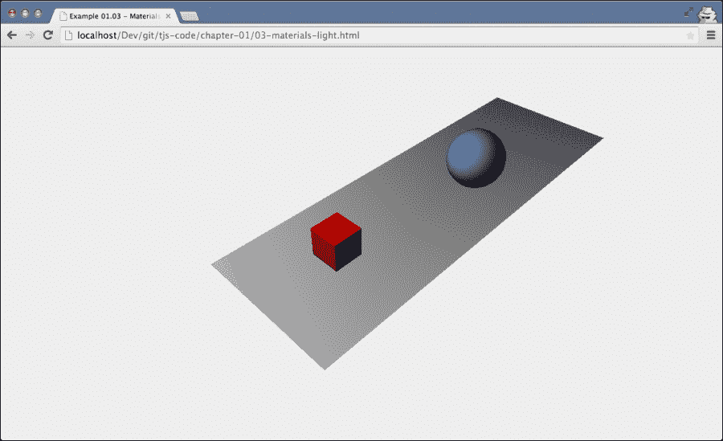

我们正在接近目标，立方体和球体看起来好多了。不过，仍然缺少的是阴影。

渲染阴影需要大量的计算能力，因此，在 Three.js 中默认禁用了阴影。但是，启用它们非常简单。对于阴影，我们需要在几个地方更改源，如下所示：

```js
renderer.setClearColor(new THREE.Color(0xEEEEEE, 1.0));
renderer.setSize(window.innerWidth, window.innerHeight);
renderer.shadowMapEnabled = true;
```

我们需要做的第一个更改是告诉`renderer`我们想要阴影。你可以通过将`shadowMapEnabled`属性设置为`true`来完成此操作。如果你查看这个更改的结果，你不会注意到任何不同。这是因为我们需要明确定义哪些对象产生阴影，哪些对象接收阴影。在我们的例子中，我们希望球体和立方体在地面平面上产生阴影。你可以通过设置这些对象上的相应属性来完成此操作：

```js
plane.receiveShadow = true;
...
cube.castShadow = true;
...
sphere.castShadow = true;
```

现在，我们只需再完成一件事就可以得到阴影。我们需要定义场景中哪些光源将产生阴影。并非所有的光源都能产生阴影，你将在下一章中了解更多关于这一点，但我们在本例中使用的`THREE.SpotLight`可以。我们只需要设置正确的属性，如下面的代码行所示，阴影最终将被渲染：

```js
spotLight.castShadow = true;
```

通过这种方式，我们得到了一个包含来自光源的阴影的场景，如下所示：

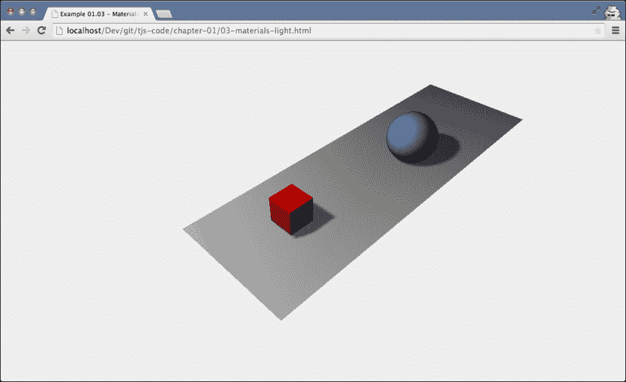

我们将添加到这个第一个场景的最后一个特性是一些简单的动画。在第九章，*动画和移动相机*中，你将了解更高级的动画选项。

# 通过动画扩展你的第一个场景

如果我们要对场景进行动画处理，首先需要做的事情是找到一种方法在特定的时间间隔重新渲染场景。在 HTML5 和相关 JavaScript API 出现之前，实现这一点的办法是使用`setInterval(function,interval)`函数。使用`setInterval`，我们可以指定一个函数，例如，每 100 毫秒被调用一次。这个函数的问题在于它没有考虑到浏览器中的情况。如果你在浏览另一个标签页，这个函数仍然会每隔几毫秒被触发。除此之外，`setInterval`与屏幕的重绘不同步。这可能导致 CPU 使用率增加和性能下降。

## 介绍 requestAnimationFrame

幸运的是，现代浏览器通过`requestAnimationFrame`函数为这个问题提供了一个解决方案。使用`requestAnimationFrame`，你可以指定一个在浏览器定义的间隔被调用的函数。你可以在提供的函数中做任何需要的绘图，浏览器将确保尽可能平滑和高效地绘制。使用它非常简单（完整的源代码可以在`04-materials-light-animation.html`文件中找到），你只需要创建一个处理渲染的函数：

```js
function renderScene() {
  requestAnimationFrame(renderScene);
  renderer.render(scene, camera);
}
```

在这个`renderScene`函数中，我们再次调用`requestAnimationFrame`以保持动画的进行。在代码中我们需要更改的唯一一件事是，在我们创建完整的场景之后，不是调用`renderer.render`，而是调用一次`renderScene`函数来启动动画：

```js
...
document.getElementById("WebGL-output")
  .appendChild(renderer.domElement);
renderScene();
```

如果你运行这段代码，与之前的例子相比，你不会看到任何变化，因为我们还没有添加动画。不过，在我们添加动画之前，我想介绍一个小型的辅助库，它可以给我们提供关于动画运行帧率的详细信息。这个库与 Three.js 的作者相同，它渲染一个小型图表，显示我们为这个动画获得的每秒帧数。

要添加这些统计信息，我们首先需要在 HTML 的`<head>`元素中包含库，如下所示：

```js
<script src="img/stats.js"></script>
```

然后我们添加一个`<div>`元素，它将被用作统计图输出的，如下所示：

```js
<div id="Stats-output"></div>
```

剩下的唯一一件事是初始化统计信息并将它们添加到这个`<div>`元素中，如下所示：

```js
function initStats() {
  var stats = new Stats();
  stats.setMode(0);
  stats.domElement.style.position = 'absolute';
  stats.domElement.style.left = '0px';
  stats.domElement.style.top = '0px';
  document.getElementById("Stats-output")
    .appendChild( stats.domElement );
     return stats;
}
```

这个函数初始化统计信息。有趣的部分是`setMode`函数。如果我们将其设置为`0`，我们将测量每秒帧数（fps），如果我们将其设置为`1`，我们可以测量渲染时间。对于这个例子，我们感兴趣的是 fps，所以是`0`。在`init()`函数的开始，我们将调用这个函数，并且我们启用了`stats`，如下所示：

```js
function init(){

  var stats = initStats();
  ...
}
```

剩下的唯一一件事是告诉`stats`对象我们在新的渲染周期中。我们通过在`renderScene`函数中添加对`stats.update`函数的调用来实现这一点，如下所示。

```js
function renderScene() {
  stats.update();
  ...
  requestAnimationFrame(renderScene);
  renderer.render(scene, camera);
}
```

如果你运行带有这些添加的代码，你将在屏幕的左上角看到统计信息，如下面的截图所示：

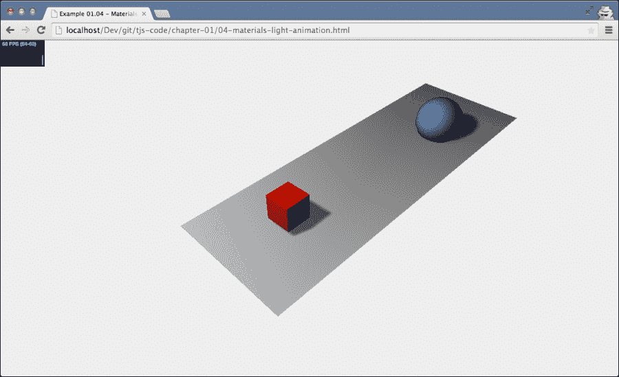

## 动画立方体

使用`requestAnimationFrame`和配置好的统计信息，我们有一个地方可以放置我们的动画代码。在本节中，我们将通过添加代码来扩展`renderScene`函数，使我们的红色立方体在其所有轴上旋转。让我们先看看代码：

```js
function renderScene() {
  ...
  cube.rotation.x += 0.02;
  cube.rotation.y += 0.02;
  cube.rotation.z += 0.02;
  ...
  requestAnimationFrame(renderScene);
  renderer.render(scene, camera);
}
```

这看起来很简单，对吧？我们做的是，每次调用`renderScene`函数时，我们将每个轴的`rotation`属性增加 0.02，这看起来就像立方体在其所有轴上平滑旋转。弹跳蓝色球体并不难。

## 弹跳球体

为了弹跳球体，我们再次在`renderScene`函数中添加几行代码，如下所示：

```js
  var step=0;
  function renderScene() {
    ...
    step+=0.04;
    sphere.position.x = 20+( 10*(Math.cos(step)));
    sphere.position.y = 2 +( 10*Math.abs(Math.sin(step)));
    ...
    requestAnimationFrame(renderScene);
    renderer.render(scene, camera);
  }
```

对于立方体，我们更改了`rotation`属性；对于球体，我们将更改场景中其`position`属性。我们希望球体以一个漂亮的、平滑的曲线从场景中的一个点到另一个点弹跳。这如图所示：

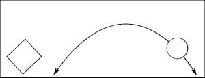

为了做到这一点，我们需要更改其在*x*轴上的位置和其在*y*轴上的位置。`Math.cos`和`Math.sin`函数帮助我们使用步进变量创建平滑的轨迹。我不会在这里详细介绍它是如何工作的。现在，你需要知道的是，`step+=0.04`定义了弹跳球体的速度。在第八章，*创建和加载高级网格和几何体*中，我们将更详细地探讨这些函数如何用于动画，并且我会解释一切。以下是球体在弹跳中间的样子：

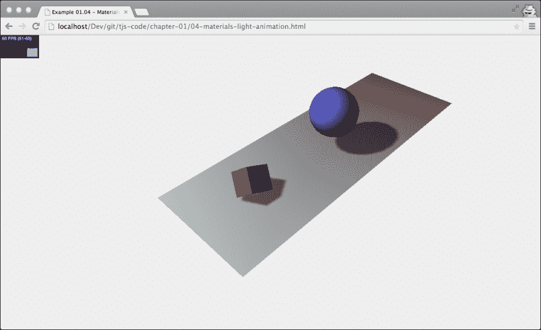

在结束本章之前，我想在我们的基本场景中添加一个额外的元素。当与 3D 场景、动画、颜色和属性等工作时，通常需要一些实验来得到正确的颜色或速度。如果能够有一个简单的 GUI，允许你即时更改这些属性，那就太容易了。幸运的是，有这样的工具！

# 使用 dat.GUI 使实验更容易

几位谷歌员工创建了一个名为 **dat.GUI** 的库（你可以在[`code.google.com/p/dat-gui/`](http://code.google.com/p/dat-gui/)上找到在线文档），它允许你非常容易地创建一个简单的用户界面组件，可以更改代码中的变量。在本章的最后部分，我们将使用 dat.GUI 为我们的示例添加一个用户界面，允许我们更改以下内容：

+   控制弹跳球体的速度

+   控制立方体的旋转

就像我们必须为统计信息做的那样，我们首先将这个库添加到我们的 HTML 页面的`<head>`元素中，如下所示：

```js
<script src="img/dat.gui.js"></script>
```

下一步我们需要配置的是，一个 JavaScript 对象将包含我们想要使用 dat.GUI 更改的属性。在我们的 JavaScript 代码的主体部分，我们添加以下 JavaScript 对象，如下所示：

```js
var controls = new function() {
  this.rotationSpeed = 0.02;
  this.bouncingSpeed = 0.03;
}
```

在这个 JavaScript 对象中，我们定义了两个属性——`this.rotationSpeed`和`this.bouncingSpeed`——以及它们的默认值。接下来，我们将这个对象传递给一个新的 dat.GUI 对象，并定义这两个属性的取值范围，如下所示：

```js
var gui = new dat.GUI();
gui.add(controls, 'rotationSpeed', 0, 0.5);
gui.add(controls, 'bouncingSpeed', 0, 0.5);
```

`rotationSpeed`和`bouncingSpeed`属性都被设置为`0`到`0.5`的范围。我们现在需要确保在我们的`renderScene`循环中直接引用这两个属性，这样当我们通过 dat.GUI 用户界面进行更改时，它将立即影响我们对象的旋转和弹跳速度，如下所示：

```js
function renderScene() {
  ...
  cube.rotation.x += controls.rotationSpeed;
  cube.rotation.y += controls.rotationSpeed;
  cube.rotation.z += controls.rotationSpeed;
  step += controls.bouncingSpeed;
  sphere.position.x = 20 +(10 * (Math.cos(step)));
  sphere.position.y = 2 +(10 * Math.abs(Math.sin(step)));
  ...
}
```

现在，当你运行这个示例（`05-control-gui.html`）时，你会看到一个简单的用户界面，你可以使用它来控制弹跳和旋转速度。以下是弹跳球和旋转立方体的截图：


如果你已经查看过浏览器中的示例，你可能已经注意到，当你改变浏览器的大小，场景不会自动缩放。在下一节中，我们将添加这个作为本章的最后一个特性。

# 当浏览器大小改变时自动调整输出大小

当浏览器大小改变时更改相机可以非常简单地进行。我们首先需要做的是注册一个像这样的事件监听器：

```js
window.addEventListener('resize', onResize, false);
```

现在，每当浏览器窗口大小改变时，我们将调用的`onResize`函数，如下所示。在这个`onResize`函数中，我们需要更新相机和渲染器，如下所示：

```js
function onResize() {
  camera.aspect = window.innerWidth / window.innerHeight;
  camera.updateProjectionMatrix();
  renderer.setSize(window.innerWidth, window.innerHeight);
}
```

对于相机，我们需要更新`aspect`属性，它包含屏幕的宽高比，而对于`renderer`，我们需要改变其大小。最后一步是将`camera`、`renderer`和`scene`的变量定义移出`init()`函数之外，这样我们就可以从不同的函数（如`onResize`函数）中访问它们，如下所示：

```js
var camera;
var scene;
var renderer;

function init() {
  ...
  scene = new THREE.Scene();
  camera = new THREE.PerspectiveCamera(45, window.innerWidth / window.innerHeight, 0.1, 1000);
  renderer = new THREE.WebGLRenderer();
  ...
}
```

要看到这个效果的实际应用，请打开`06-screen-size-change.html`示例并调整浏览器窗口的大小。

# 摘要

这就是第一章的全部内容。在本章中，我们向您展示了如何设置您的开发环境，如何获取代码，以及如何开始使用本书提供的示例。您还进一步了解到，要使用 Three.js 渲染场景，您首先必须创建一个`THREE.Scene`对象，添加一个相机、一个光源以及您想要渲染的对象。我们还向您展示了如何通过添加阴影和动画来扩展这个基本场景。最后，我们添加了几个辅助库。我们使用了 dat.GUI，它允许您快速创建控制用户界面，我们还添加了`stats.js`，它提供了关于场景渲染帧率的反馈。

在下一章中，我们将扩展这里创建的示例。你将了解更多关于你可以用于 Three.js 的最重要的构建块。
