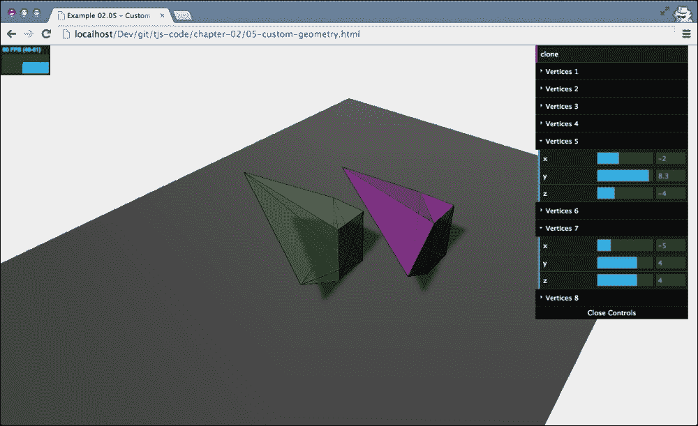
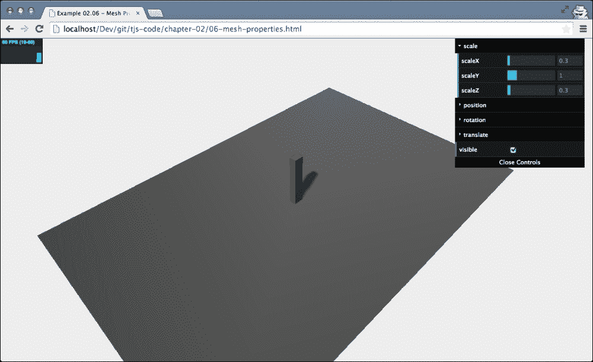

# 第二章。构成 Three.js 场景的基本组件

在上一章中，你学习了 Three.js 的基础知识。我们展示了一些示例，并且你创建了你的第一个完整的 Three.js 场景。在这一章中，我们将更深入地探讨 Three.js，并解释构成 Three.js 场景的基本组件。在本章中，你将探索以下主题：

+   在 Three.js 场景中使用的组件

+   你可以使用 `THREE.Scene` 对象做什么

+   几何体和网格之间的关系

+   正交相机和透视相机的区别

我们首先来看如何创建场景并添加对象。

# 创建场景

在上一章中，你创建了 `THREE.Scene`，因此你已经了解了 Three.js 的基础知识。我们看到了要使场景显示内容，我们需要三种类型的组件：

| 组件 | 描述 |
| --- | --- |
| 相机 | 这决定了屏幕上渲染的内容。 |
| 灯光 | 这些对创建阴影效果时材料的表现和使用有影响（在第三章中详细讨论）。 |
| 对象 | 这些是从相机视角渲染的主要对象：立方体、球体等。 |

`THREE.Scene` 是所有这些不同对象的容器。这个对象本身并没有很多选项和功能。

### 注意

`THREE.Scene` 是一种有时也称为场景图的构造。场景图是一种可以包含图形场景所有必要信息的结构。在 Three.js 中，这意味着 `THREE.Scene` 包含了所有必要的对象、灯光和其他渲染所需的对象。值得注意的是，场景图，正如其名称所暗示的，不仅仅是一个对象的数组；场景图由树结构中的一组节点组成。你可以将任何对象添加到 Three.js 场景中，甚至 `THREE.Scene` 本身，都扩展自一个名为 `THREE.Object3D` 的基本对象。一个 `THREE.Object3D` 对象也可以有自己的子对象，你可以使用这些子对象创建一个对象树，Three.js 将解释并渲染这些对象。 

## 场景的基本功能

探索场景功能的最有效方法是查看一个示例。在本章的源代码中，你可以找到 `01-basic-scene.html` 示例。我将使用这个示例来解释场景具有的各种功能和选项。当我们在这个示例中打开浏览器时，输出将类似于下一张截图所示：


这看起来几乎就像我们在上一章中看到的示例。尽管场景看起来相当空旷，但它已经包含了一些对象。查看以下源代码，我们可以看到我们使用了`THREE.Scene`对象的`scene.add(object)`函数来添加`THREE.Mesh`（你所看到的地面平面）、`THREE.SpotLight`和`THREE.AmbientLight`。`THREE.Camera`对象在渲染场景时由 Three.js 自动添加，但手动将其添加到场景中是一种良好的实践，尤其是在你使用多个相机时。查看以下源代码以了解此场景：

```js
var scene = new THREE.Scene();
var camera = new THREE.PerspectiveCamera(45, window.innerWidth / window.innerHeight, 0.1, 1000);
scene.add(camera);
...
var planeGeometry = new THREE.PlaneGeometry(60,40,1,1);
var planeMaterial = new THREE.MeshLambertMaterial({color: 0xffffff});
var plane = new THREE.Mesh(planeGeometry,planeMaterial);
...
scene.add(plane);
var ambientLight = new THREE.AmbientLight(0x0c0c0c);
scene.add(ambientLight);
...
var spotLight = new THREE.SpotLight( 0xffffff );
...
scene.add( spotLight );

```

在我们深入探讨`THREE.Scene`对象之前，我先解释一下在演示中你可以做什么，然后我们将查看一些代码。在你的浏览器中打开`01-basic-scene.html`示例，并查看右上角的控件，就像你在以下截图中所看到的那样：


使用这些控件，你可以向场景中添加一个立方体，删除最后添加到场景中的立方体，并在浏览器控制台中显示场景中包含的所有当前对象。控件部分的最后一项显示了场景中的当前对象数量。当你启动场景时，你可能会注意到场景中已经有四个对象。这些是地面平面、环境光、聚光灯以及我们之前提到的相机。我们将查看控件部分中的每个函数，并从最简单的`addCube`函数开始，如下所示：

```js
this.addCube = function() {

  var cubeSize = Math.ceil((Math.random() * 3));
  var cubeGeometry = new THREE.BoxGeometry(cubeSize,cubeSize,cubeSize);
  var cubeMaterial = new THREE.MeshLambertMaterial({color: Math.random() * 0xffffff });
  var cube = new THREE.Mesh(cubeGeometry, cubeMaterial);
  cube.castShadow = true;
 cube.name = "cube-" + scene.children.length;
  cube.position.x=-30 + Math.round(Math.random() * planeGeometry.width));
  cube.position.y= Math.round((Math.random() * 5));
  cube.position.z=-20 + Math.round((Math.random() * planeGeometry.height));

  scene.add(cube);
 this.numberOfObjects = scene.children.length;
};
```

到现在为止，这段代码应该已经很容易阅读了。这里没有引入很多新概念。当你点击**addCube**按钮时，会创建一个新的`THREE.BoxGeometry`对象，其宽、高和深度设置为 1 到 3 之间的随机值。除了随机大小外，立方体还获得一个随机颜色和一个随机位置。

### 注意

在这里我们引入的一个新元素是，我们还可以使用其`name`属性给立方体命名。其名称设置为`cube-`，后面附加当前场景中对象的数量（`scene.children.length`）。名称对于调试非常有用，也可以用来直接从你的场景中访问对象。如果你使用`THREE.Scene.getObjectByName(name)`函数，你可以直接检索一个特定的对象，例如，改变其位置，而不必将 JavaScript 对象设置为全局变量。你可能想知道最后一行做了什么。`numberOfObjects`变量被我们的控制 GUI 用于列出场景中的对象数量。因此，每当我们添加或删除对象时，我们将此变量设置为更新后的计数。

我们可以从控制 GUI 中调用的下一个函数是`removeCube`。正如其名所示，点击**removeCube**按钮会从场景中删除最后添加的立方体。在代码中，它看起来像这样：

```js
  this.removeCube = function() {
    var allChildren = scene.children;
    var lastObject = allChildren[allChildren.length-1];
    if (lastObject instanceof THREE.Mesh) {
      scene.remove(lastObject);
      this.numberOfObjects = scene.children.length;
    }
  }
```

要将一个对象添加到场景中，我们使用`add`函数。要从一个场景中移除一个对象，我们使用，不出所料，`remove`函数。由于 Three.js 将其子对象存储为列表（新添加的放在末尾），我们可以使用`children`属性，它包含场景中所有对象的数组，从`THREE.Scene`对象中获取最后添加的对象。我们还需要检查该对象是否是`THREE.Mesh`对象，以避免移除相机和灯光。在移除对象后，我们再次更新 GUI 属性`numberOfObjects`，该属性持有场景中对象的数量。

我们 GUI 上的最后一个按钮被标记为**outputObjects**。你可能已经点击了这个按钮，但似乎没有发生任何事情。这个按钮将当前场景中的所有对象打印到网络浏览器控制台，如下面的截图所示：


将信息输出到控制台的代码使用了内置的`console`对象：

```js
  this.outputObjects = function() {
    console.log(scene.children);
  }
```

这对于调试目的非常有用，尤其是在你命名了你的对象时，查找场景中特定对象的错误和问题非常有用。例如，`cube-17`的属性看起来像这样（如果你事先已经知道了名称，你也可以使用`console.log(scene.getObjectByName("cube-17")`来输出仅该单个对象）：

```js
__webglActive: true
__webglInit: true
_listeners: Object
_modelViewMatrix: THREE.Matrix4
_normalMatrix: THREE.Matrix3
castShadow: true
children: Array[0]
eulerOrder: (...)
frustumCulled: true
geometry: THREE.BoxGeometryid: 8
material: THREE.MeshLambertMaterial
matrix: THREE.Matrix4
matrixAutoUpdate: true
matrixWorld: THREE.Matrix4
matrixWorld
NeedsUpdate: false
name: "cube-17"
parent: THREE.Scene
position: THREE.Vector3
quaternion: THREE.Quaternion
receiveShadow: false
renderDepth: null
rotation: THREE.Euler
rotationAutoUpdate: true
scale: THREE.Vector3
type: "Mesh"
up: THREE.Vector3
useQuaternion: (...)
userData: Object
uuid: "DCDC0FD2-6968-44FD-8009-20E9747B8A73"
visible: true
```

到目前为止，我们已经看到了以下场景相关功能：

+   `THREE.Scene.Add`：这个函数将一个对象添加到场景中

+   `THREE.Scene.Remove`：这个函数从场景中移除一个对象

+   `THREE.Scene.children`：这个函数获取场景中所有子对象的列表

+   `THREE.Scene.getObjectByName`：这个函数通过名称从场景中获取一个特定的对象

这些是最重要的场景相关函数，而且通常你不需要比这更多的功能。然而，有几个辅助函数可能会很有用，我想根据处理立方体旋转的代码来展示它们。

正如你在上一章中看到的，我们使用了一个*渲染循环*来渲染场景。让我们看看这个循环在这个例子中的样子：

```js
function render() {
  stats.update();
  scene.traverse(function(obj) {
    if (obj instanceof THREE.Mesh && obj != plane ) {
      obj.rotation.x+=controls.rotationSpeed;
      obj.rotation.y+=controls.rotationSpeed;
      obj.rotation.z+=controls.rotationSpeed;
   }
  });

  requestAnimationFrame(render);
  renderer.render(scene, camera);
}
```

在这里，我们看到正在使用`THREE.Scene.traverse()`函数。我们可以向`traverse()`函数传递一个函数，该函数将为场景的每个子对象调用。如果一个子对象本身有子对象，请记住，一个`THREE.Scene`对象可以包含一个对象树。`traverse()`函数也将为该对象的全部子对象调用。你将遍历整个场景图。

我们使用`render()`函数来更新每个立方体的旋转（注意我们明确忽略了地面平面）。我们也可以通过使用`for`循环遍历`children`属性数组来自行完成这项工作，因为我们只向`THREE.Scene`添加了对象，并没有创建嵌套结构。

在深入探讨`THREE.Mesh`和`THREE.Geometry`的细节之前，我想展示两个你可以设置在`THREE.Scene`对象上的有趣属性：`fog`和`overrideMaterial`。

## 向场景添加雾气

**fog**属性允许你为整个场景添加雾效；对象离得越远，就越会被视线遮挡，如下面的截图所示：


在 Three.js 中启用雾气非常简单。只需在你定义场景后添加以下代码行即可：

```js
scene.fog=new THREE.Fog( 0xffffff, 0.015, 100 );
```

在这里，我们定义了一种白色雾气（`0xffffff`）。前两个属性可以用来调整雾气的外观。`0.015`值设置了`near`属性，而`100`值设置了`far`属性。使用这些属性，你可以确定雾气开始的位置以及它变浓的速度。使用`THREE.Fog`对象，雾气是线性增加的。还有另一种为场景设置雾气的方法；为此，请使用以下定义：

```js
scene.fog=new THREE.FogExp2( 0xffffff, 0.01 );
```

这次，我们没有指定`near`和`far`，只是颜色（`0xffffff`）和雾的密度（`0.01`）。最好对这些属性进行一些实验，以获得你想要的效果。注意，使用`THREE.FogExp2`，雾不是线性增加，而是随着距离的增加而指数级地变得更浓。

## 使用 overrideMaterial 属性

我们讨论场景的最后一个属性是**overrideMaterial**。当你使用这个属性时，场景中的所有对象都将使用设置到`overrideMaterial`属性的材质，并忽略对象本身设置的材质。

使用方法如下：

```js
scene.overrideMaterial = new THREE.MeshLambertMaterial({color: 0xffffff});
```

如前述代码所示，使用`overrideMaterial`属性后，场景将渲染成以下截图所示：


在前述图中，你可以看到所有立方体都使用了相同的材质和颜色。在这个例子中，我们使用了一个`THREE.MeshLambertMaterial`对象作为材质。使用这种材质类型，我们可以创建看起来不反光的物体，这些物体会对场景中存在的灯光做出反应。在第四章中，*使用 Three.js 材质*，你将了解更多关于这种材质的信息。

在本节中，我们探讨了 Three.js 的核心概念之一：`THREE.Scene`。关于场景，最重要的是记住它基本上是一个容器，用于存放你希望在渲染时使用的所有对象、灯光和相机。以下表格总结了`THREE.Scene`对象最重要的函数和属性：

| 函数/属性 | 描述 |
| --- | --- |
| `add(object)` | 用于将对象添加到场景中。你还可以使用此功能，如我们稍后将要看到的，来创建对象组。 |
| `children` | 返回场景中添加的所有对象的列表，包括相机和灯光。 |
| `getObjectByName(name, recursive)` | 当你创建一个对象时，你可以给它一个独特的名称。场景对象有一个函数，你可以使用它来直接返回具有特定名称的对象。如果你将递归参数设置为`true`，Three.js 也会搜索完整的对象树以找到具有指定名称的对象。 |
| `remove(object)` | 如果你有一个场景中对象的引用，你也可以使用此函数将其从场景中删除。 |
| `traverse(function)` | 子属性返回场景中所有子对象的列表。使用遍历函数，我们也可以访问这些子对象。使用遍历，所有子对象将逐个传递给提供的函数。 |
| `fog` | 这个属性允许你为场景设置雾。雾将渲染出一种雾气，隐藏远处的对象。 |
| `overrideMaterial` | 使用这个属性，你可以强制场景中的所有对象使用相同的材质。 |

在下一节中，我们将更仔细地查看你可以添加到场景中的对象。

# 几何体和网格

在到目前为止的每个示例中，你都看到了几何体和网格的使用。例如，要向场景中添加一个球体，我们做了以下操作：

```js
var sphereGeometry = new THREE.SphereGeometry(4,20,20);
var sphereMaterial = new THREE.MeshBasicMaterial({color: 0x7777ff);
var sphere = new THREE.Mesh(sphereGeometry,sphereMaterial);
```

我们定义了对象的形状及其几何体（`THREE.SphereGeometry`），我们定义了对象的外观（`THREE.MeshBasicMaterial`）及其材质，并将这两个结合在一个网格（`THREE.Mesh`）中，可以添加到场景中。在本节中，我们将更仔细地看看几何体是什么，网格是什么。我们将从几何体开始。

## 几何体的属性和函数

Three.js 自带了一套大量的几何体，你可以在你的 3D 场景中使用。只需添加一个材质，创建一个网格，你基本上就完成了。以下是从示例`04-geometries`中的截图，展示了 Three.js 中可用的几个标准几何体：


在第五章 *学习与几何体一起工作* 和 第六章 *高级几何体和二进制操作* 中，我们将探讨 Three.js 提供的所有基本和高级几何体。现在，我们将更详细地看看几何体实际上是什么。

在 Three.js 中，以及在大多数其他 3D 库中，几何体基本上是三维空间中点的集合，也称为顶点，以及连接这些点的多个面。以一个立方体为例：

+   一个立方体有八个角。每个角都可以定义为*x*、*y*和*z*坐标。因此，每个立方体在三维空间中有八个点。在 Three.js 中，这些点被称为顶点，单个点称为顶点。

+   立方体有六个面，每个角都有一个顶点。在 Three.js 中，一个面总是由三个顶点组成的三角形。因此，在立方体的例子中，每个面由两个三角形组成，以形成一个完整的面。

当你使用 Three.js 提供的几何体时，你不需要自己定义所有的顶点和面。对于一个立方体，你只需要定义宽度、高度和深度。Three.js 使用这些信息并创建一个具有八个顶点且位置正确的几何体，立方体的情况下是 12 个面。即使你通常使用 Three.js 提供的几何体或自动生成它们，你仍然可以使用顶点和面完全手动创建几何体。这在下述代码行中展示：

```js
var vertices = [
  new THREE.Vector3(1,3,1),
  new THREE.Vector3(1,3,-1),
  new THREE.Vector3(1,-1,1),
  new THREE.Vector3(1,-1,-1),
  new THREE.Vector3(-1,3,-1),
  new THREE.Vector3(-1,3,1),
  new THREE.Vector3(-1,-1,-1),
  new THREE.Vector3(-1,-1,1)
];

var faces = [
  new THREE.Face3(0,2,1),
  new THREE.Face3(2,3,1),
  new THREE.Face3(4,6,5),
  new THREE.Face3(6,7,5),
  new THREE.Face3(4,5,1),
  new THREE.Face3(5,0,1),
  new THREE.Face3(7,6,2),
  new THREE.Face3(6,3,2),
  new THREE.Face3(5,7,0),
  new THREE.Face3(7,2,0),
  new THREE.Face3(1,3,4),
  new THREE.Face3(3,6,4),
];

var geom = new THREE.Geometry();
geom.vertices = vertices;
geom.faces = faces;
geom.computeFaceNormals();
```

以下代码展示了如何创建一个简单的立方体。我们在这个`vertices`数组中定义了组成这个立方体的点。这些点通过创建三角形面连接起来，并存储在`faces`数组中。例如，`new THREE.Face3(0,2,1)`就是使用`vertices`数组中的点`0`、`2`和`1`创建一个三角形面。请注意，你必须注意用于创建`THREE.Face`的顶点顺序。它们定义的顺序决定了 Three.js 是否认为这是一个正面面（面向摄像机的面）还是背面面。如果你创建面，你应该为正面面使用顺时针顺序，如果你想创建背面面，则使用逆时针顺序。

### 小贴士

在这个例子中，我们使用`THREE.Face3`元素来定义立方体的六个面，每个面使用两个三角形。在 Three.js 的早期版本中，你也可以使用四边形而不是三角形。四边形使用四个顶点而不是三个来定义面。使用四边形或三角形哪个更好，在 3D 建模界是一个热烈的争论。不过，基本上，在建模过程中，使用四边形通常更受欢迎，因为它们比三角形更容易增强和光滑。然而，对于渲染和游戏引擎来说，处理三角形通常更容易，因为每个形状都可以非常高效地作为一个三角形渲染。

使用这些顶点和面，我们现在可以创建一个新的`THREE.Geometry`实例，并将顶点分配给`vertices`属性，将面分配给`faces`属性。我们需要采取的最后一步是在我们创建的几何体上调用`computeFaceNormals()`函数。当我们调用这个函数时，Three.js 会确定每个面的*法线*向量。这是 Three.js 用来根据场景中的各种灯光来确定如何着色面的信息。

使用这种几何体，我们现在可以创建一个网格，就像我们之前看到的那样。我创建了一个示例，您可以使用它来调整顶点的位置，并且它还显示了单个面。在示例 `05-custom-geometry` 中，您可以改变立方体的所有顶点的位置，并查看面是如何反应的。这在上面的屏幕截图中显示（如果控制 GUI 挡住了视线，您可以通过按 *H* 隐藏它）：


这个示例与我们的所有其他示例使用相同的设置，有一个渲染循环。每次您在下拉控制框中更改一个属性时，立方体都会根据顶点的一个变化位置进行渲染。这不是一件现成就能做到的事情。出于性能考虑，Three.js 假设网格的几何体在其生命周期内不会改变。对于大多数几何体和用例，这是一个非常有效的假设。然而，为了让我们的示例工作，我们需要确保以下内容添加到渲染循环中的代码中：

```js
mesh.children.forEach(function(e) {
  e.geometry.vertices=vertices;
  e.geometry.verticesNeedUpdate=true;
  e.geometry.computeFaceNormals();
});
```

在第一行，我们将屏幕上看到的网格顶点指向一个更新的顶点数组。我们不需要重新配置面，因为它们仍然连接到与之前相同的位置。在设置更新后的顶点之后，我们需要告诉几何体顶点需要更新。我们通过将几何体的 `verticesNeedUpdate` 属性设置为 `true` 来做到这一点。最后，我们使用 `computeFaceNormals` 函数重新计算面，以使用更新的顶点更新整个模型。

我们将要查看的最后一种几何体功能是 `clone()` 函数。我们提到几何体定义了物体的形状和形式，结合材料，我们可以创建一个可以被 Three.js 渲染的场景中的对象。正如其名所示，我们可以复制几何体，例如，使用它来创建具有不同材料的不同网格。在相同的示例 `05-custom-geometry` 中，您可以在控制 GUI 的顶部看到一个 **clone** 按钮，如下面的屏幕截图所示：



如果您点击此按钮，将根据当前的几何体创建一个副本（一个复制），创建一个新的具有不同材料的新对象，并将其添加到场景中。这个代码相当简单，但由于我使用的材料，它变得稍微复杂一些。让我们退一步，首先看看立方体的绿色材料是如何创建的，如下面的代码所示：

```js
var materials = [
  new THREE.MeshLambertMaterial( { opacity:0.6, color: 0x44ff44, transparent:true } ),
  new THREE.MeshBasicMaterial( { color: 0x000000, wireframe: true } )
];
```

如您所见，我没有使用单一材料，而是使用了两材料的阵列。原因是除了展示一个透明的绿色立方体之外，我还想向您展示线框，因为线框可以非常清晰地显示出顶点和面的位置。

当然，Three.js 在创建网格时支持使用多个材质。你可以使用`SceneUtils.createMultiMaterialObject`函数来做这件事，如下面的代码所示：

```js
var mesh = THREE.SceneUtils.createMultiMaterialObject( geom, materials);
```

在这个函数中，Three.js 所做的不是创建一个`THREE.Mesh`对象，而是为每种指定的材质创建一个，并将这些网格放入一个组（一个`THREE.Object3D`对象）。这个组可以像使用场景对象一样使用。你可以添加网格，通过名称获取对象，等等。例如，为了确保组中的所有子对象都能投射阴影，你可以这样做：

```js
mesh.children.forEach(function(e) {e.castShadow=true});
```

现在，让我们回到我们之前讨论的`clone()`函数：

```js
this.clone = function() {

  var clonedGeom = mesh.children[0].geometry.clone();
  var materials = [
    new THREE.MeshLambertMaterial( { opacity:0.6, color: 0xff44ff, transparent:true } ),
    new THREE.MeshBasicMaterial({ color: 0x000000, wireframe: true } )
  ];

  var mesh2 = THREE.SceneUtils.createMultiMaterialObject(clonedGeom, materials);
  mesh2.children.forEach(function(e) {e.castShadow=true});
  mesh2.translateX(5);
  mesh2.translateZ(5);
  mesh2.name="clone";
  scene.remove(scene.getObjectByName("clone"));
  scene.add(mesh2);
}
```

这段 JavaScript 代码在点击**克隆**按钮时被调用。在这里，我们克隆了立方体第一个子元素的几何形状。记住，mesh 变量包含两个子元素；它包含两个网格，一个对应于我们指定的每种材质。基于这个克隆的几何形状，我们创建了一个新的网格，命名为`mesh2`。我们使用平移函数（更多内容请参阅第五章，*学习与几何形状一起工作*）移动这个新网格，移除之前的克隆（如果存在），并将克隆添加到场景中。

### 小贴士

在前面的章节中，我们使用了`THREE.SceneUtils`对象的`createMultiMaterialObject`来为创建的几何形状添加线框。Three.js 还提供了一个使用`THREE.WireFrameHelper`添加线框的替代方法。要使用这个辅助对象，首先以这种方式实例化它：

```js
var helper = new THREE.WireframeHelper(mesh, 0x000000);

```

你提供你想要显示线框的网格以及线框的颜色。Three.js 现在将创建一个辅助对象，你可以将其添加到场景中，`scene.add(helper)`。由于这个辅助对象内部只是一个`THREE.Line`对象，你可以设置线框的样式。例如，要设置线框线的宽度，使用`helper.material.linewidth = 2;`。

现在关于几何形状的内容就讲到这里。

## 网格的函数和属性

我们已经了解到，要创建网格，我们需要一个几何形状和一个或多个材质。一旦我们有了网格，我们将其添加到场景中，它就会被渲染。有一些属性可以用来改变网格在场景中的位置和显示方式。在这个第一个例子中，我们将查看以下属性和函数集：

| 函数/属性 | 描述 |
| --- | --- |
| `position` | 这决定了该对象相对于其父对象的位置。通常，对象的父对象是`THREE.Scene`对象或`THREE.Object3D`对象。 |
| `rotation` | 使用这个属性，你可以设置对象围绕其任意轴的旋转。Three.js 还提供了围绕轴旋转的特定函数：`rotateX()`、`rotateY()`和`rotateZ()`。 |
| `scale` | 这个属性允许你围绕对象的*x*、*y*和*z*轴进行缩放。 |
| `translateX(amount)` | 这个属性将对象在*x*轴上移动指定的距离。 |
| `translateY(amount)` | 此属性将对象沿 *y* 轴移动指定的量。 |
| `translateZ(amount)` | 此属性将对象沿 *z* 轴移动指定的量。对于平移函数，你也可以使用 `translateOnAxis(axis, distance)` 函数，它允许你沿着特定轴平移网格一段距离。 |
| `visible` | 如果将此属性设置为 `false`，`THREE.Mesh` 将不会被 Three.js 渲染。 |

像往常一样，我们为你准备了一个示例，让你可以玩转这些属性。如果你在浏览器中打开 `06-mesh-properties.html`，你会看到一个下拉菜单，你可以更改所有这些属性并直接看到结果，如下面的截图所示：


让我带你了解它们，我会从位置属性开始。我们已经看到这个属性几次了，所以让我们快速解决这个问题。使用这个属性，你可以设置对象的 *x*、*y* 和 *z* 坐标。这个位置相对于其父对象，通常是添加对象的场景，但也可能是 `THREE.Object3D` 对象或另一个 `THREE.Mesh` 对象。当我们查看分组对象时，我们将在 第五章，*学习与几何体一起工作* 中回到这一点。我们可以以三种不同的方式设置对象的位置属性。我们可以直接设置每个坐标：

```js
cube.position.x=10;
cube.position.y=3;
cube.position.z=1;
```

然而，我们也可以一次性设置所有这些属性，如下所示：

```js
cube.position.set(10,3,1);
```

还有一个第三种选择。`position` 属性是一个 `THREE.Vector3` 对象。这意味着，我们也可以这样做来设置此对象：

```js
cube.postion=new THREE.Vector3(10,3,1)
```

在查看此网格的其他属性之前，我想快速跳过一点。我提到这个位置是相对于其父位置设置的。在上一节关于 `THREE.Geometry` 的内容中，我们使用了 `THREE.SceneUtils.createMultiMaterialObject` 来创建一个多材质对象。我解释说，这实际上并不返回一个单独的网格，而是一个包含基于每个材质相同几何形状的网格的组；在我们的例子中，它是一个包含两个网格的组。如果我们改变这些创建的网格之一的位置，你可以清楚地看到它确实是两个不同的 `THREE.Mesh` 对象。然而，如果我们现在移动这个组，偏移量将保持不变，如下面的截图所示。在 第五章，*学习与几何体一起工作* 中，我们将更深入地探讨父子关系以及分组如何影响变换，例如缩放、旋转和平移。


好的，接下来列表中的下一个是`rotation`属性。你已经在本章和上一章中看到这个属性被使用了几次。使用这个属性，你可以设置物体围绕其一个轴的旋转。你可以以与我们设置位置相同的方式设置这个值。一个完整的旋转，你可能还记得从数学课上学到的，是*2 x π*。你可以在 Three.js 中以几种不同的方式配置它：

```js
cube.rotation.x = 0.5*Math.PI;
cube.rotation.set(0.5*Math.PI, 0, 0);
cube.rotation = new THREE.Vector3(0.5*Math.PI,0,0);
```

如果你想要使用度数（从 0 到 360），我们必须将这些转换为弧度。这可以很容易地这样做：

```js
Var degrees = 45;
Var inRadians = degrees * (Math.PI / 180);
```

你可以使用`06-mesh-properties.html`示例来玩转这个属性。

我们列表中的下一个属性是我们还没有讨论过的：`scale`。这个名字几乎概括了你可以用这个属性做什么。你可以沿着特定的轴缩放对象。如果你将缩放设置为小于一的值，物体将缩小，如下面的截图所示：



当你使用大于一的值时，物体将变得更大，如下面的截图所示：


本章我们将探讨的网格的下一部分功能是**平移**。使用平移功能，你还可以改变物体的位置，但不是定义物体想要到达的绝对位置，而是定义物体相对于当前位置应该移动到的地方。例如，我们有一个添加到场景中的球体，其位置已设置为`(1,2,3)`。接下来，我们沿着物体的*x*轴进行平移：`translateX(4)`。它的位置现在将是`(5,2,3)`。如果我们想将物体恢复到原始位置，我们这样做：`translateX(-4)`。在`06-mesh-properties.html`示例中，有一个名为**平移**的菜单标签。从那里，你可以尝试这个功能。只需设置*x*、*y*和*z*的平移值，然后点击**平移**按钮。你会看到物体根据这三个值移动到新的位置。

你可以从右上角的菜单中使用的最后一个属性是**可见**属性。如果你点击**可见**菜单项，你会看到立方体变得不可见，如下所示：


当你再次点击它时，立方体再次变得可见。有关网格、几何体以及你可以用这些对象做什么的更多信息，请参阅第五章，*学习与几何体一起工作*，以及第七章，*粒子、精灵和点云*。

# 不同的用途需要不同的相机

在 Three.js 中有两种不同的摄像机类型：正交摄像机和透视摄像机。在第三章《在 Three.js 中使用不同的光源》中，我们将更详细地探讨如何使用这些摄像机，因此在本章中，我将专注于基础知识。解释这两种摄像机之间差异的最佳方式是通过查看几个示例。

## 正交摄像机与透视摄像机

在本章的示例中，你可以找到一个名为 `07-both-cameras.html` 的演示。当你打开这个示例时，你会看到如下内容：


这被称为透视视图，是最自然的视图。正如你可以从这张图中看到的，立方体离摄像机越远，渲染得越小。

如果我们将摄像机切换到 Three.js 支持的另一种类型——正交摄像机，你将看到相同场景的以下视图：


使用正交摄像机时，所有立方体都以相同的大小渲染；物体与摄像机之间的距离并不重要。这通常用于像 *SimCity 4* 和旧版本的 *Civilization* 这样的 2D 游戏。


在我们的示例中，我们将最常使用透视摄像机，因为它最接近现实世界。切换摄像机非常简单。以下代码块在点击 `07-both-cameras` 示例中的切换摄像机按钮时被调用：

```js
this.switchCamera = function() {
  if (camera instanceof THREE.PerspectiveCamera) {
    camera = new THREE.OrthographicCamera( window.innerWidth / - 16, window.innerWidth / 16, window.innerHeight / 16, window.innerHeight / - 16, -200, 500 );
    camera.position.x = 120;
    camera.position.y = 60;
    camera.position.z = 180;
    camera.lookAt(scene.position);
    this.perspective = "Orthographic";
  } else {
    camera = new THREE.PerspectiveCamera(45, window.innerWidth / window.innerHeight, 0.1, 1000);

    camera.position.x = 120;
    camera.position.y = 60;
    camera.position.z = 180;

    camera.lookAt(scene.position);
    this.perspective = "Perspective";
  }
};
```

在这个表格中，你可以看到我们在创建摄像机的方式上存在差异。让我们首先看看 `THREE.PerspectiveCamera`。这个摄像机接受以下参数：

| 参数 | 描述 |
| --- | --- |
| `fov` | **FOV** 代表 **视场**。这是从摄像机位置可以看到的场景部分。例如，人类几乎有 180 度的视场，而一些鸟类的视场甚至可能达到完整的 360 度。但由于普通计算机屏幕并不能完全填满我们的视野，通常会选择较小的值。对于游戏来说，通常选择 60 到 90 度之间的 FOV。*好的默认值：50* |
| `aspect` | 这是我们将要渲染输出的区域水平尺寸和垂直尺寸之间的宽高比。在我们的例子中，因为我们使用整个窗口，所以我们只使用那个比例。宽高比决定了水平视场和垂直视场之间的差异，正如你可以在以下图像中看到。*好的默认值：window.innerWidth / window.innerHeight* |
| `near` | `near` 属性定义了 Three.js 应该从多近的距离渲染场景。通常，我们将这个值设置得非常小，以便直接从摄像机的位置渲染一切。*好的默认值：0.1* |
| `far` | `far`属性定义了相机从相机位置可以看到多远。如果我们设置得太低，场景的一部分可能不会被渲染，如果我们设置得太高，在某些情况下可能会影响渲染性能。*好的默认值：1000* |
| `zoom` | `zoom`属性允许你放大或缩小场景。当你使用小于`1`的数字时，你会缩小场景，如果你使用大于`1`的数字，你会放大。请注意，如果你指定一个负值，场景将被渲染为颠倒的。*好的默认值：1* |

以下图像给出了这些属性如何共同工作以确定你所看到的内容的概述：


相机的`fov`属性决定了水平 FOV。基于`aspect`属性，垂直 FOV 被确定。`near`属性用于确定近平面的位置，而`far`属性确定远平面的位置。近平面和远平面之间的区域将被渲染。

要配置正交相机，我们需要使用其他属性。正交投影对使用的纵横比或观察场景的 FOV 不感兴趣，因为所有对象都以相同的大小渲染。当你定义一个正交相机时，你实际上是在定义需要渲染的立方体区域。正交相机的属性反映了这一点，如下所示：

| 参数 | 描述 |
| --- | --- |
| `left` | 在 Three.js 文档中，这被描述为**相机视锥体左平面**。你应该将其视为将要渲染的左侧边界。如果你将此值设置为`-100`，你将看不到任何位于左侧更远处的对象。 |
| `right` | `right`属性的工作方式与`left`属性类似，但这次是屏幕的另一侧。任何位于右侧更远处的对象都不会被渲染。 |
| `top` | 这是将要渲染的顶部位置。 |
| `bottom` | 这是将要渲染的底部位置。 |
| `near` | 从这个点开始，根据相机的位置，场景将被渲染。 |
| `far` | 到这个点，根据相机的位置，场景将被渲染。 |
| `zoom` | 这允许你放大或缩小场景。当你使用小于`1`的数字时，你会缩小场景；如果你使用大于`1`的数字，你会放大。请注意，如果你指定一个负值，场景将被渲染为颠倒的。默认值是`1`。 |

所有这些属性可以总结如下图所示：


## 观察特定点

到目前为止，你已经看到了如何创建摄像机以及各种参数的含义。在前一章中，你也看到了你需要将摄像机放置在场景中的某个位置，并且从该摄像机看到的视图会被渲染。通常，摄像机指向场景的中心：位置（0,0,0）。然而，我们可以很容易地改变摄像机观察的点，如下所示：

```js
camera.lookAt(new THREE.Vector3(x,y,z));
```

我添加了一个示例，其中摄像机在移动，它正在观察的点用红点标记，如下所示：


如果你打开`08-cameras-lookat`示例，你会看到场景从左向右移动。实际上场景并没有移动。摄像机正在观察不同的点（见中心的红点），这给人一种场景从左向右移动的错觉。在这个例子中，你还可以切换到正交摄像机。在那里，你会发现改变摄像机观察的点几乎与`THREE.PerspectiveCamera`有相同的效果。然而，值得注意的是，使用`THREE.OrthographicCamera`，你可以清楚地看到，无论摄像机看向哪里，所有立方体的尺寸都保持不变。


### 小贴士

当你使用`lookAt`函数时，你将摄像机指向一个特定位置。你也可以使用这个函数使摄像机围绕场景中的物体移动。由于每个`THREE.Mesh`对象都有一个位置，它是一个`THREE.Vector3`对象，你可以使用`lookAt`函数指向场景中的特定网格。你只需要做的是：`camera.lookAt(mesh.position)`。如果你在渲染循环中调用这个函数，摄像机就会随着物体在场景中的移动而移动。

# 摘要

在这个第二部分的介绍章节中，我们讨论了许多项目。我们展示了`THREE.Scene`的所有函数和属性，并解释了如何使用这些属性来配置你的主场景。我们还展示了如何创建几何体。你可以从头开始使用`THREE.Geometry`对象创建它们，或者使用 Three.js 提供的任何内置几何体。最后，我们展示了如何配置 Three.js 提供的两个摄像机。`THREE.PerspectiveCamera`使用现实世界的透视渲染场景，而`THREE.OrthographicCamera`提供了一种在游戏中也经常看到的假 3D 效果。我们还介绍了在 Three.js 中几何体是如何工作的。你现在可以轻松地创建自己的几何体。

在下一章中，我们将探讨 Three.js 中可用的各种光源。你将了解各种光源的行为，如何创建和配置它们，以及它们如何影响特定材料。
