# 第三章. 在 Three.js 中处理可用的不同灯光源

在第一章中，您学习了 Three.js 的基础知识，在前一章中，我们深入探讨了场景中最重要的一部分：几何体、网格和相机。您可能已经注意到，在那个章节中我们跳过了灯光，尽管它们是每个 Three.js 场景的重要组成部分。没有灯光，我们将看不到任何渲染的内容。由于 Three.js 包含大量具有特定用途的灯光，我们将用整个章节来解释灯光的各个细节，并为下一章关于材质的使用做准备。

### 注意

WebGL 本身并不支持内置的灯光。没有 Three.js，您将不得不编写特定的 WebGL 着色器程序来模拟这些类型的灯光。有关从头开始模拟 WebGL 中灯光的详细介绍，请参阅[`developer.mozilla.org/en-US/docs/Web/WebGL/Lighting_in_WebGL`](https://developer.mozilla.org/en-US/docs/Web/WebGL/Lighting_in_WebGL)。

在本章中，您将了解以下主题：

+   Three.js 中可用的光源

+   应该在何时使用特定的光源

+   如何调整和配置所有这些光源的行为

+   作为额外内容，我们还将快速查看如何创建镜头光晕

与所有章节一样，我们提供了许多示例，您可以使用这些示例来实验灯光的行为。本章中展示的示例可以在提供的源代码的`chapter-03`文件夹中找到。

# Three.js 提供的不同类型的灯光

在 Three.js 中提供了多种不同的灯光，它们都具有特定的行为和用法。在本章中，我们将讨论以下一组灯光：

| 名称 | 描述 |
| --- | --- |
| `THREE.AmbientLight` | 这是一种基本的光源，其颜色被添加到场景中对象的当前颜色上。 |
| `THREE.PointLight` | 这是一个空间中的单一点，光从这个点向所有方向扩散。这种灯光不能用来创建阴影。 |
| `THREE.SpotLight` | 这种光源具有类似台灯、天花板上的点或火炬的锥形效果。这种灯光可以产生阴影。 |
| `THREE.DirectionalLight` | 这也被称为无限光。从这个光源发出的光线看起来是平行的，例如，就像太阳的光线一样。这种灯光也可以用来创建阴影。 |
| `THREE.HemisphereLight` | 这是一种特殊的光源，可以通过模拟反射表面和微弱照亮的蓝天来创建更自然的外观户外照明。这种灯光也不提供任何与阴影相关的功能。 |
| `THREE.AreaLight` | 使用这种光源，您可以从一个区域指定光发出的位置，而不是空间中的一个单独点。`THREE.AreaLight`不会产生任何阴影。 |
| `THREE.LensFlare` | 这不是一个光源，但使用 `THREE.LensFlare`，您可以为场景中的灯光添加镜头光晕效果。 |

本章分为两个主要部分。首先，我们将查看基本灯光：`THREE.AmbientLight`、`THREE.PointLight`、`THREE.SpotLight` 和 `THREE.DirectionalLight`。所有这些灯光都扩展了基本的 `THREE.Light` 对象，它提供了共享的功能。这里提到的灯光是简单的灯光，设置起来相对简单，可以用来重现大多数所需的照明场景。在第二部分，我们将查看一些特殊用途的灯光和效果：`THREE.HemisphereLight`、`THREE.AreaLight` 和 `THREE.LensFlare`。您可能只有在非常特定的情况下才需要这些灯光。

# 基本灯光

我们将从最基本的灯光 `THREE.AmbientLight` 开始。

## THREE.AmbientLight

当您创建 `THREE.AmbientLight` 时，颜色是全局应用的。这种光没有特定的方向，`THREE.AmbientLight` 不会产生任何阴影。通常您不会将 `THREE.AmbientLight` 作为场景中唯一的灯光源，因为它会使所有物体着色为相同的颜色，而不管形状如何。您通常将它与其他灯光源一起使用，例如 `THREE.SpotLight` 或 `THREE.DirectionalLight`，以柔化阴影或为场景添加一些额外的颜色。理解这一点最简单的方法是查看 `chapter-03` 文件夹中的 `01-ambient-light.html` 示例。在这个示例中，您会得到一个简单的用户界面，可以用来修改场景中可用的 `THREE.AmbientLight`。请注意，在这个场景中，我们还有 `THREE.SpotLight`，它提供了额外的照明并产生阴影。

在下面的屏幕截图中，您可以看到我们使用了第一章的场景，并使 `THREE.AmbientLight` 的颜色可配置。在这个示例中，您还可以关闭聚光灯以查看 `THREE.AmbientLight` 单独的效果：

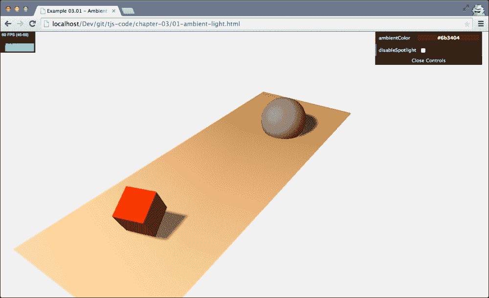

在这个场景中，我们使用的标准颜色是 `#0c0c0c`。这是颜色的十六进制表示。前两个值指定颜色的红色部分，接下来的两个值指定绿色部分，最后的两个值指定蓝色部分。

在本例中，我们使用了一种非常暗淡的灰色，我们主要用它来平滑我们的网格投射到地面上的硬阴影。您可以通过右上角的菜单将颜色更改为更鲜明的黄色/橙色（`#523318`），然后物体上就会产生类似太阳的光晕。这在上面的屏幕截图中可以显示：

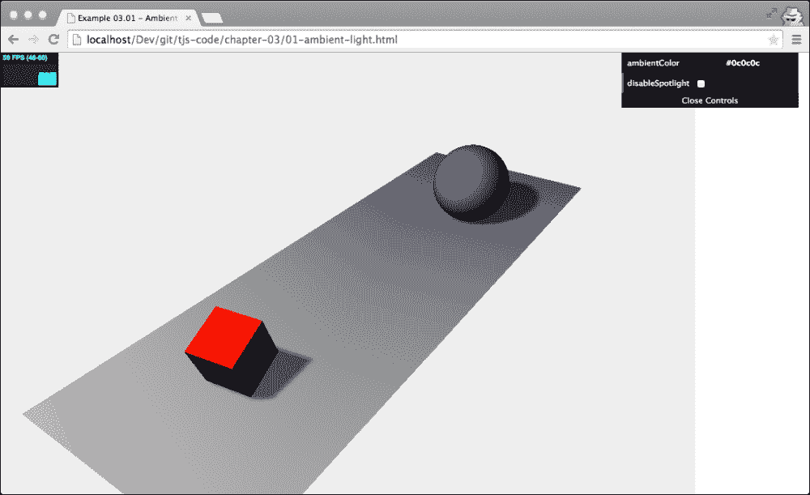

如前图所示，黄色/橙色应用于所有对象，并在整个场景上投射出绿色光芒。当你使用这种光源时，你应该记住，你应该非常谨慎地指定颜色。如果你指定的颜色太亮，你很快就会得到一个完全过饱和的图像。

现在我们已经看到了它的工作原理，让我们看看如何创建和使用 `THREE.AmbientLight`。接下来的几行代码展示了如何创建 `THREE.AmbientLight`，同时也展示了如何将其连接到 GUI 控制菜单，我们将在第十一章（Chapter 11）*自定义着色器和渲染后处理*中介绍：

```js
var ambiColor = "#0c0c0c";
var ambientLight = new THREE.AmbientLight(ambiColor);
scene.add(ambientLight);
...

var controls = new function() {
  this.ambientColor = ambiColor  ;
}

var gui = new dat.GUI();
gui.addColor(controls, 'ambientColor').onChange(function(e) {
  ambientLight.color = new THREE.Color(e);
});
```

创建 `THREE.AmbientLight` 非常简单，只需几个步骤。`THREE.AmbientLight` 没有位置，是全局应用的，所以我们只需要指定颜色（十六进制），`new THREE.AmbientLight(ambiColor)`，并将此光源添加到场景中，`scene.add(ambientLight)`。在示例中，我们将 `THREE.AmbientLight` 的颜色绑定到控制菜单。为此，你可以使用我们在前两章中使用过的相同类型的配置。唯一的变化是，我们不是使用 `gui.add(...)` 函数，而是使用 `gui.addColor(...)` 函数。这会在控制菜单中创建一个选项，我们可以直接更改传入变量的颜色。在代码中，你可以看到我们使用了 dat.GUI 的 `onChange` 功能：`gui.addColor(...).onChange(function(e){...})`。使用这个函数，我们告诉 `dat.GUI` 每次颜色改变时调用传入的函数。在这个特定的情况下，我们将 `THREE.AmbientLight` 的颜色设置为新的值。

### 使用 THREE.Color 对象

在我们继续到下一个光源之前，这里有一个关于使用 `THREE.Color` 对象的简要说明。在 Three.js 中，当你构建一个对象时，你可以（通常）指定颜色为十六进制字符串（`"#0c0c0c"`）或十六进制值（`0x0c0c0c`），这是首选的方法，或者通过指定 0 到 1 比例上的单个 RGB 值（`0.3`, `0.5`, `0.6`）。如果你想在构建后更改颜色，你必须创建一个新的 `THREE.Color` 对象或修改当前 `THREE.Color` 对象的内部属性。`THREE.Color` 对象包含以下函数来设置和获取当前对象的信息：

| 名称 | 描述 |
| --- | --- |
| `set(value)` | 将此颜色的值设置为提供的十六进制值。此十六进制值可以是字符串、数字或现有的 `THREE.Color` 实例。 |
| `setHex(value)` | 将此颜色的值设置为提供的数值十六进制值。 |
| `setRGB(r,g,b)` | 根据提供的 RGB 值设置此颜色的值。值的范围从 0 到 1。 |
| `setHSL(h,s,l)` | 根据提供的 HSL 值设置此颜色的值。值范围从 0 到 1。有关如何使用 HSL 配置颜色的良好解释，请参阅[`en.wikibooks.org/wiki/Color_Models:_RGB,_HSV,_HSL`](http://en.wikibooks.org/wiki/Color_Models:_RGB,_HSV,_HSL)。 |
| `setStyle(style)` | 根据 CSS 指定颜色的方式设置此颜色的值。例如，您可以使用`"rgb(255,0,0)"`、`"#ff0000"`、`"#f00"`或甚至是`"red"`。 |
| `copy(color)` | 从提供的`THREE.Color`实例复制颜色值到这个颜色。 |
| `copyGammaToLinear(color)` | 这主要在内部使用。根据提供的`THREE.Color`实例设置此对象的颜色。颜色首先从伽马颜色空间转换为线性颜色空间。伽马颜色空间也使用 RGB 值，但使用指数刻度而不是线性刻度。 |
| `copyLinearToGamma(color)` | 这主要在内部使用。根据提供的`THREE.Color`实例设置此对象的颜色。颜色首先从线性颜色空间转换为伽马颜色空间。 |
| `convertGammaToLinear()` | 这将当前颜色从伽马颜色空间转换为线性颜色空间。 |
| `convertLinearToGamma()` | 这将当前颜色从线性颜色空间转换为伽马颜色空间。 |
| `getHex()` | 返回此颜色对象作为数字: `435241`。 |
| `getHexString()` | 返回此颜色对象作为十六进制字符串: `"0c0c0c"`。 |
| `getStyle()` | 返回此颜色对象作为基于 CSS 的值: `"rgb(112,0,0)"`. |
| `getHSL(optionalTarget)` | 返回此颜色对象作为 HSL 值。如果您提供`optionalTarget`对象，Three.js 将设置该对象的`h`、`s`和`l`属性。 |
| `offsetHSL(h, s, l)` | 将提供的`h`、`s`和`l`值添加到当前颜色的`h`、`s`和`l`值。 |
| `add(color)` | 这将提供的颜色的`r`、`g`和`b`值添加到当前颜色。 |
| `addColors(color1, color2)` | 这主要在内部使用。将`color1`和`color2`相加，并将当前颜色的值设置为结果。 |
| `addScalar(s)` | 这主要在内部使用。向当前颜色的 RGB 组件添加一个值。请注意，内部值使用从 0 到 1 的范围。 |
| `multiply(color)` | 这主要在内部使用。将当前 RGB 值与`THREE.Color`的 RGB 值相乘。 |
| `multiplyScalar(s)` | 这主要在内部使用。这会将当前 RGB 值与提供的值相乘。请注意，内部值使用从 0 到 1 的范围。 |
| `lerp(color, alpha)` | 这主要在内部使用。这找到位于此对象颜色和提供的颜色之间的颜色。alpha 属性定义了结果颜色在当前颜色和提供的颜色之间的距离。 |
| `equals(color)` | 如果提供的 `THREE.Color` 实例的 RGB 值与当前颜色的值匹配，则返回 `true`。 |
| `fromArray(array)` | 这与 `setRGB` 有相同的功能，但现在 RGB 值可以作为数字数组提供。 |
| `toArray` | 这返回一个包含三个元素的数组，`[r, g, b]`。 |
| `clone()` | 这将创建这个颜色的精确副本。 |

在这个表中，你可以看到有很多方法可以改变当前的颜色。许多这些函数都是 Three.js 内部使用的，但它们也提供了一个很好的方法来轻松地改变灯光和材料颜色。

在我们继续讨论 `THREE.PointLight`、`THREE.SpotLight` 和 `THREE.DirectionalLight` 之前，让我们首先强调它们的主要区别，即它们如何发射光线。以下图表显示了这三个光源如何发射光线：

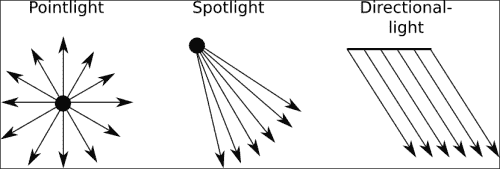

从这个图表中你可以看到以下内容：

+   `THREE.PointLight` 从一个特定的点向所有方向发射光线

+   `THREE.SpotLight` 从一个特定的点以锥形形状发射光线

+   `THREE.DirectionalLight` 不从一个单一点发射光线，而是从二维平面发射光线，其中光线是平行的。

我们将在接下来的几段中更详细地查看这些光源；让我们从 `THREE.Pointlight` 开始。

## THREE.PointLight

在 Three.js 中，`THREE.PointLight` 是一个从单个点向所有方向发射光线的光源。一个点光源的好例子是在夜空中发射的信号弹。就像所有的灯光一样，我们有一个特定的例子你可以用来玩 `THREE.PointLight`。如果你查看 `chapter-03` 文件夹中的 `02-point-light.html`，你可以找到一个例子，其中 `THREE.PointLight` 灯光在一个简单的 Three.js 场景中移动。以下截图显示了此示例：

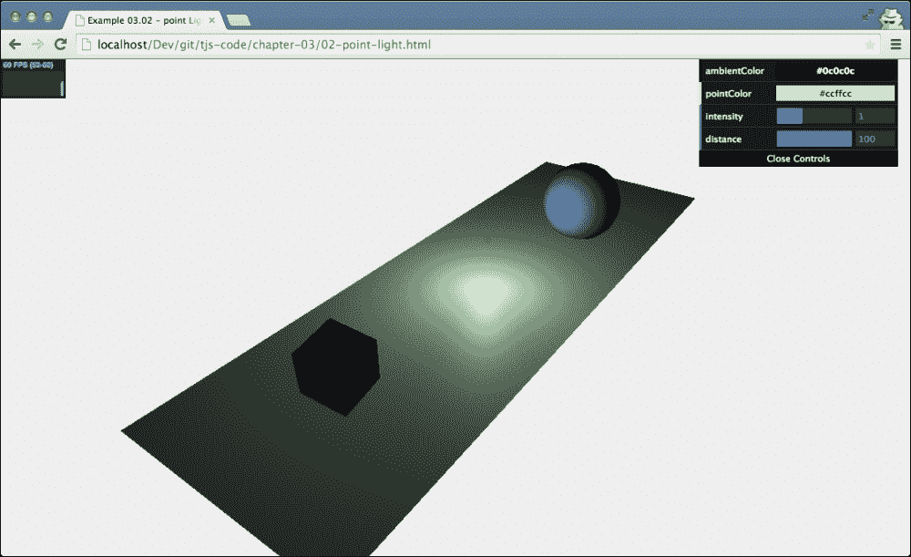

在这个例子中，`THREE.PointLight` 在我们已经在 第一章 中看到的场景中移动，*使用 Three.js 创建您的第一个 3D 场景*。为了更清楚地显示 `THREE.PointLight` 的位置，我们沿着相同的路径移动一个小橙色球体。随着这个光移动，你会看到红色立方体和蓝色球体从不同的侧面被这个光照亮。

### 小贴士

你可能会注意到在这个例子中我们没有看到任何阴影。在 Three.js 中，`THREE.PointLight` 不投射阴影。由于 `THREE.PointLight` 向所有方向发射光线，计算阴影对于 GPU 来说是一个非常繁重的过程。

使用我们之前看到的 `THREE.AmbientLight`，你只需要提供 `THREE.Color` 并将灯光添加到场景中。然而，对于 `THREE.PointLight`，我们有一些额外的配置选项：

| 属性 | 描述 |
| --- | --- |
| `color` | 这是光的颜色。 |
| `distance` | 这是灯光照射的距离。默认值是 `0`，这意味着灯光的强度不会根据距离而减弱。 |
| `intensity` | 这是灯光的照射强度。默认值为 `1`。 |
| `position` | 这是灯光在 `THREE.Scene` 中的位置。 |
| `visible` | 如果此属性设置为 `true`（默认值），则此灯光开启；如果设置为 `false`，则灯光关闭。 |

在接下来的几个示例和屏幕截图中，我们将解释这些属性。首先，让我们看看如何创建 `THREE.PointLight`：

```js
var pointColor = "#ccffcc";
var pointLight = new THREE.PointLight(pointColor);
pointLight.position.set(10,10,10);
scene.add(pointLight);
```

我们创建一个具有特定 `color` 属性的灯光（这里我们使用字符串值；我们也可以使用数字或 `THREE.Color`），设置其 `position` 属性，并将其添加到场景中。

我们将首先查看 `intensity` 属性。使用此属性，你可以设置灯光的亮度。如果你将其设置为 `0`，你将看不到任何东西；设置为 `1`，则获得默认亮度；设置为 `2`，则获得亮度加倍的光；依此类推。例如，在下面的屏幕截图中，我们将灯光的强度设置为 `2.4`：

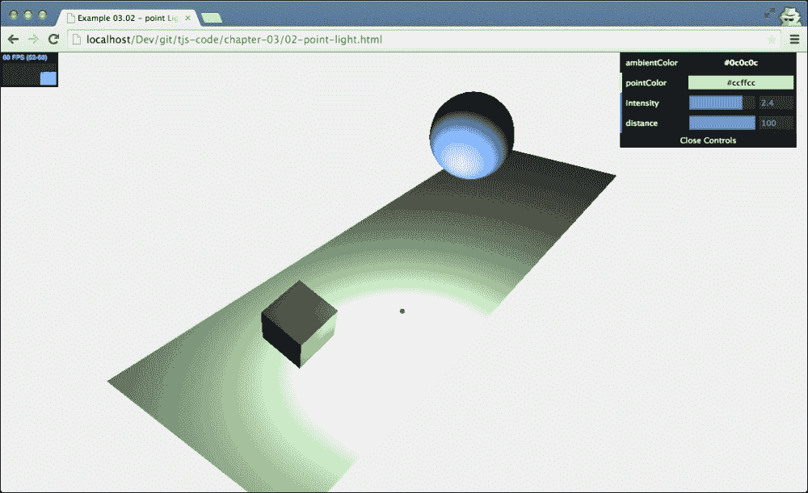

要更改灯光的强度，你只需使用 `THREE.PointLight` 的强度属性，如下所示：

```js
pointLight.intensity = 2.4;
```

或者，你可以使用 dat.GUI 监听器，如下所示：

```js
var controls = new function() {
  this.intensity = 1;
}
var gui = new dat.GUI();
  gui.add(controls, 'intensity', 0, 3).onChange(function (e) {
    pointLight.intensity = e;
  });
```

`PointLight` 的 `distance` 属性非常有趣，最好通过一个例子来解释。在下面的屏幕截图中，你再次看到了相同的场景，但这次具有非常高的 `intensity` 属性（我们有一个非常明亮的灯光），但 `distance` 很小：

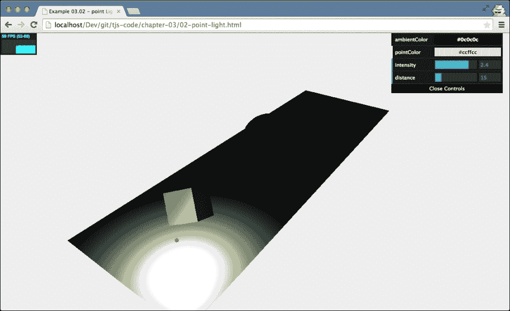

`SpotLight` 的 `distance` 属性决定了灯光从光源出发到其强度属性变为 0 的距离。你可以这样设置此属性：`pointLight.distance = 14`。在先前的屏幕截图中，灯光的亮度在距离 `14` 处逐渐减弱到 `0`。这就是为什么在示例中，你仍然可以看到一个明亮的立方体，但灯光不会达到蓝色球体。`distance` 属性的默认值是 `0`，这意味着灯光不会随距离衰减。

## THREE.SpotLight

`THREE.SpotLight` 是你将最常使用的灯光之一（尤其是如果你想使用阴影）。`THREE.SpotLight` 是一种具有锥形效果的灯光源。你可以将其与手电筒或灯笼进行比较。这种灯光有一个方向和一个产生光线的角度。以下表格列出了所有适用于 `THREE.SpotLight` 的属性：

| 属性 | 描述 |
| --- | --- |
| `angle` | 这决定了从该光源发出的光束有多宽。这个值以弧度为单位测量，默认为 `Math.PI/3`。 |
| `castShadow` | 如果设置为 `true`，则此灯光将产生阴影。 |
| `color` | 这是灯光的颜色。 |
| `distance` | 这是光线照射的距离。默认值为 `0`，这意味着光强度不会根据距离而降低。 |
| `exponent` | 在 `THREE.SpotLight` 中，发出的光强度随着你与光源距离的增加而降低。`exponent` 属性决定了这种强度降低的速度。低值时，从这个光源发出的光会照射到远处的物体，而高值时，只会照射到非常靠近 `THREE.SpotLight` 的物体。 |
| `intensity` | 这是光线照射的强度。默认值为 1。 |
| `onlyShadow` | 如果此属性设置为 `true`，则此光线只会投射阴影，而不会向场景添加任何光线。 |
| `position` | 这是光线在 `THREE.Scene` 中的位置。 |
| `shadowBias` | 阴影偏移将投射阴影的物体移动到远离或靠近物体的位置。你可以使用此功能来解决处理非常薄的对象时的一些奇怪效果（一个很好的例子可以在 [`www.3dbuzz.com/training/view/unity-fundamentals/lights/8-shadows-bias`](http://www.3dbuzz.com/training/view/unity-fundamentals/lights/8-shadows-bias) 找到）。如果你看到奇怪的阴影效果，此属性的较小值（例如，`0.01`）通常可以解决这个问题。此属性的默认值为 `0`。 |
| `shadowCameraFar` | 这决定了从光源到创建阴影的距离。默认值为 `5,000`。 |
| `shadowCameraFov` | 这决定了用于创建阴影的视野大小（请参阅 第二章 中 *不同用途的不同相机* 小节，*构成 Three.js 场景的基本组件*）。默认值为 `50`。 |
| `shadowCameraNear` | 这决定了从光源到创建阴影的距离。默认值为 `50`。 |
| `shadowCameraVisible` | 如果此设置为 `true`，你可以看到光源如何以及在哪里投射阴影（请参阅下一节中的示例）。默认值为 `false`。 |
| `shadowDarkness` | 这定义了阴影渲染的暗度。渲染场景后，此值不能更改。默认值为 `0.5`。 |
| `shadowMapWidth` 和 `shadowMapHeight` | 这决定了用于创建阴影的像素数量。当阴影边缘参差不齐或看起来不光滑时，请增加此值。渲染场景后，此值不能更改。两者的默认值均为 `512`。 |
| `target` | 在 `THREE.SpotLight` 中，其指向的方向很重要。使用 `target` 属性，你可以将 `THREE.SpotLight` 指向场景中的特定对象或位置。请注意，此属性需要一个 `THREE.Object3D` 对象（如 `THREE.Mesh`）。这与我们在上一章中看到的相机形成对比，这些相机在其 `lookAt` 函数中使用 `THREE.Vector3`。 |
| `visible` | 如果设置为 `true`（默认值），则此灯光开启；如果设置为 `false`，则灯光关闭。 |

创建 `THREE.SpotLight` 非常简单。只需指定颜色，设置你想要的属性，并将其添加到场景中，如下所示：

```js
var pointColor = "#ffffff";
var spotLight = new THREE.SpotLight(pointColor);
spotLight.position.set(-40, 60, -10);
spotLight.castShadow = true;
spotLight.target = plane;
scene.add(spotLight);
```

`THREE.SpotLight` 与 `THREE.PointLight` 并没有太大的区别。唯一的区别在于我们将 `castShadow` 属性设置为 `true`，因为我们想要阴影，并且需要为这个 `SpotLight` 设置 `target` 属性。`target` 属性决定了光线指向的位置。在这种情况下，我们将它指向名为 `plane` 的对象。当你运行示例（`03-spot-light.html`）时，你会看到一个类似于以下截图的场景：

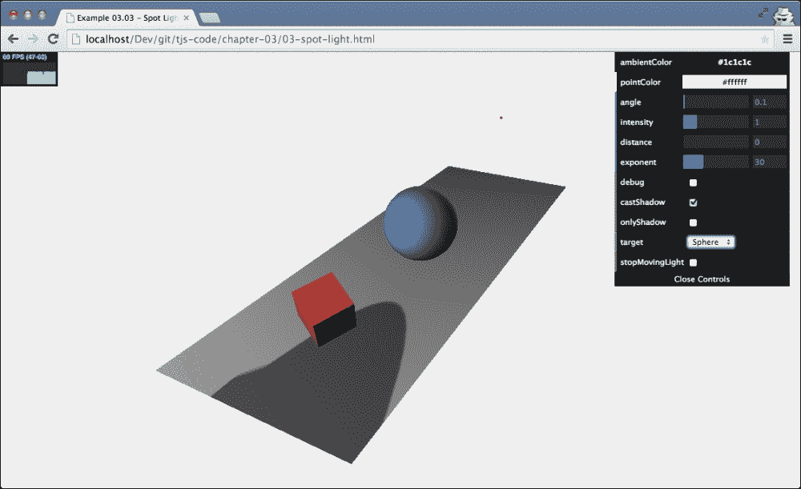

在这个例子中，你可以设置一些特定于 `THREE.SpotLight` 的属性。其中之一是 `target` 属性。如果我们把这个属性设置为蓝色球体，即使它在场景中移动，光线也会聚焦在球体的中心。当我们创建灯光时，我们将其指向地面平面，在我们的例子中，我们也可以将其指向其他两个对象。但如果你不想将灯光指向特定的对象，而是指向空间中的任意一点，你可以通过创建一个 `THREE.Object3D()` 对象来实现这一点：

```js
var target = new THREE.Object3D();
target.position = new THREE.Vector3(5, 0, 0);
```

然后，设置 `THREE.SpotLight` 的目标属性：

```js
spotlight.target = target
```

在本节开头的表格中，我们展示了一些可以用来控制 `THREE.SpotLight` 发光方式的属性。`distance` 和 `angle` 属性定义了光锥的形状。`angle` 属性定义了锥体的宽度，而 `distance` 属性则设置了锥体的长度。以下图解说明了这两个值如何共同定义将从 `THREE.SpotLight` 接收光线的区域：

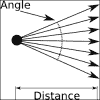

通常，你并不真的需要设置这些值，因为它们有合理的默认值，但你可以使用这些属性，例如，创建一个具有非常窄光束或快速降低光强度的 `THREE.SpotLight`。你可以用来改变 `THREE.SpotLight` 发光方式的最后一个属性是 `exponent` 属性。使用这个属性，你可以设置从光锥中心到边缘的光强度下降速度。在以下图像中，你可以看到 `exponent` 属性的作用结果。我们有一个非常明亮的光源（高 `intensity`），随着它从中心向锥体侧面移动，光强度迅速降低（高 `exponent`）：

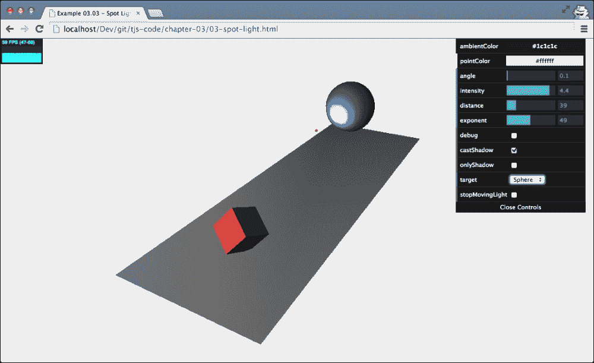

你可以用这个来突出显示特定的对象或模拟一个小手电筒。我们也可以通过使用小的`exponent`值和`angle`来创建相同的效果。在第二个方法的注意事项上，记住一个非常小的角度可以迅速导致各种渲染伪影（伪影是图形中用于描述不想要的扭曲和屏幕上奇怪渲染部分的术语）。

在继续到下一个光源之前，我们将快速查看`THREE.SpotLight`可用的与阴影相关的属性。你已经了解到，我们可以通过将`THREE.SpotLight`的`castShadow`属性设置为`true`来获取阴影（当然，确保我们为应该投射阴影的对象设置了`castShadow`属性，并且对于应该显示阴影的对象，我们在场景中的`THREE.Mesh`对象上设置了`receiveShadow`属性）。Three.js 还允许你对阴影的渲染进行非常精细的控制。这是通过本节开头表格中解释的几个属性来实现的。通过`shadowCameraNear`、`shadowCameraFar`和`shadowCameraFov`，你可以控制光线如何以及在哪里投射阴影。这与我们在前一章中解释的透视相机的视野以相同的方式工作。要看到这个动作的最简单方法是将`shadowCameraVisible`设置为`true`；你可以通过检查菜单的调试复选框来完成此操作。这显示了，正如你在下面的屏幕截图中所看到的，用于确定此光源阴影的区域：

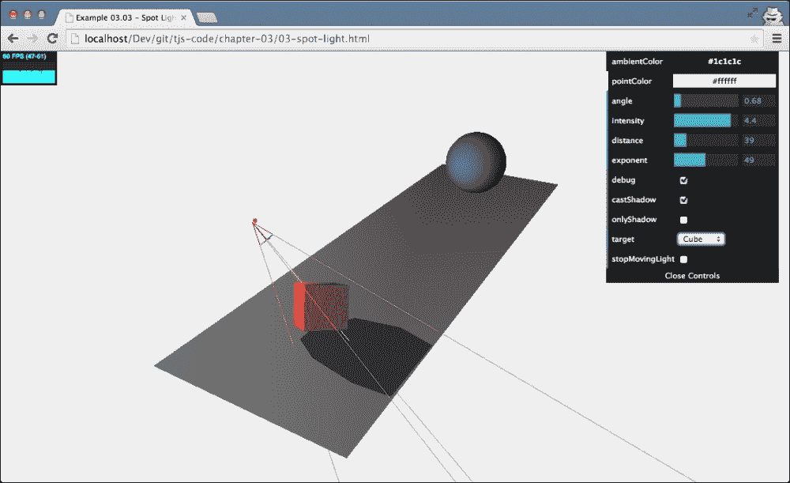

我将以几个提示结束本节，以防你在处理阴影时遇到问题：

+   启用`shadowCameraVisible`属性。这显示了受此光照影响的区域，用于阴影效果。

+   如果阴影看起来像块状，你可以增加`shadowMapWidth`和`shadowMapHeight`属性，或者确保用于计算阴影的区域紧密包裹你的对象。你可以使用`shadowCameraNear`、`shadowCameraFar`和`shadowCameraFov`属性来配置这个区域。

+   记住，你不仅要告诉光线去投射阴影，还要告诉每个几何体是否接收和/或投射阴影，这需要通过设置`castShadow`和`receiveShadow`属性来实现。

+   如果你场景中使用了细长的对象，渲染阴影时可能会看到奇怪的伪影。你可以使用`shadowBias`属性来稍微偏移阴影，这通常可以解决这类问题。

+   你可以通过设置`shadowDarkness`属性来改变投射阴影的暗度。如果你的阴影太暗或不够暗，改变这个属性可以让你精细调整阴影的渲染方式。

+   如果你想要更柔和的阴影，你可以在`THREE.WebGLRenderer`上设置不同的`shadowMapType`值。默认情况下，此属性设置为`THREE.PCFShadowMap`；如果你将此属性设置为`PCFSoftShadowMap`，你会得到更柔和的阴影。

## THREE.DirectionalLight

我们将要探讨的最后一种基本光源是 `THREE.DirectionalLight`。这种光源可以被认为是非常远的光源。它发出的所有光束都是相互平行的。一个很好的例子就是太阳。太阳距离我们非常遥远，因此我们地球上接收到的光线几乎是平行的。`THREE.DirectionalLight` 与 `THREE.SpotLight`（我们在上一节中已经讨论过）的主要区别在于，这种光不会随着距离 `THREE.DirectionalLight` 目标越来越远而减弱，就像 `THREE.SpotLight` 那样（你可以通过 `distance` 和 `exponent` 参数进行微调）。`THREE.DirectionalLight` 照亮的整个区域都会接收到相同强度的光线。

要看到这个效果，请查看 `04-directional-light` 示例，它在这里展示：

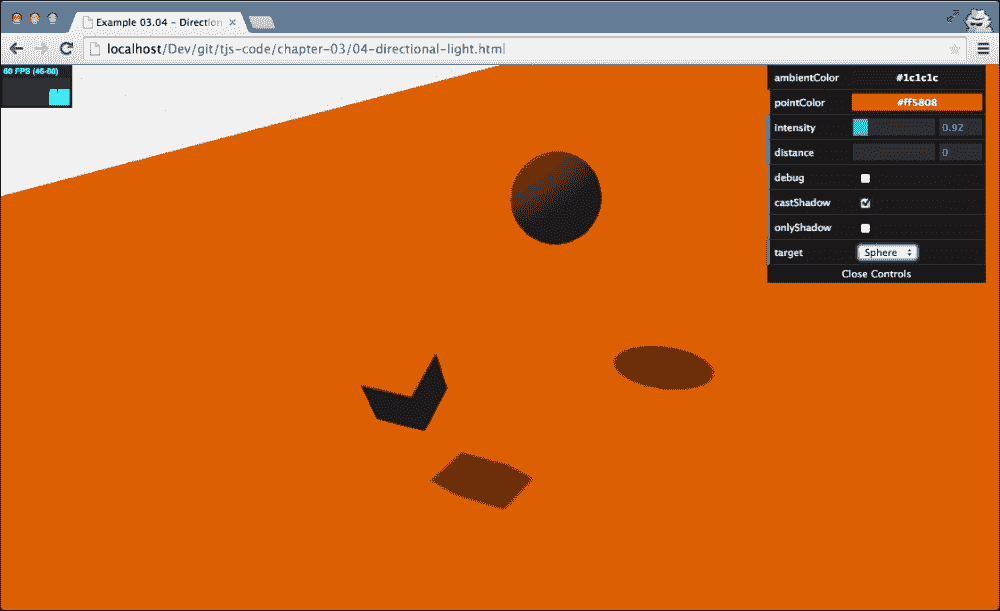

如前图所示，场景中并没有应用光锥。所有物体都接收相同数量的光线。只有光的方向、颜色和强度被用来计算颜色和阴影。

正如 `THREE.SpotLight` 一样，有一些属性你可以设置来控制光线的强度和它投射阴影的方式。`THREE.DirectionalLight` 有很多属性与 `THREE.SpotLight` 相同：`position`、`target`、`intensity`、`distance`、`castShadow`、`onlyShadow`、`shadowCameraNear`、`shadowCameraFar`、`shadowDarkness`、`shadowCameraVisible`、`shadowMapWidth`、`shadowMapHeight` 和 `shadowBias`。有关这些属性的更多信息，你可以查看关于 `THREE.SpotLight` 的前述章节。接下来的几段将讨论一些额外的属性。

如果你回顾一下 `THREE.SpotLight` 的示例，你可以看到我们必须定义应用阴影的光锥。由于对于 `THREE.DirectionalLight`，所有光线都是相互平行的，所以我们没有光锥，而是有一个长方体区域，正如你在下面的屏幕截图中所看到的（如果你想亲自查看，请将相机从场景中移远）：

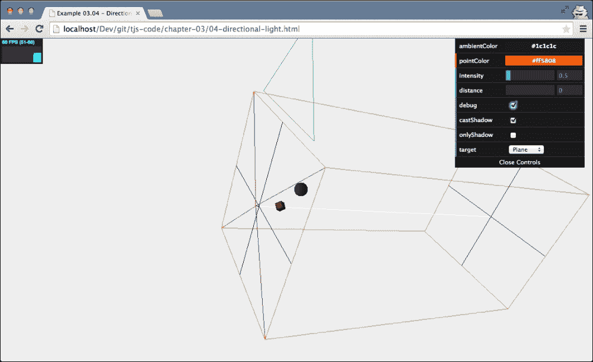

所有落在这个立方体内的物体都可以从光中投射和接收阴影。正如 `THREE.SpotLight` 一样，你定义的围绕物体的这个区域越紧密，你的阴影看起来就越好。使用以下属性来定义这个立方体：

```js
directionalLight.shadowCameraNear = 2;
directionalLight.shadowCameraFar = 200;
directionalLight.shadowCameraLeft = -50;
directionalLight.shadowCameraRight = 50;
directionalLight.shadowCameraTop = 50;
directionalLight.shadowCameraBottom = -50;
```

你可以将这比作我们在 第二章 中关于相机的部分配置正交相机的方式，*构成 Three.js 场景的基本组件*。

### 注意

对于`THREE.DirectionalLight`，有一个我们尚未解决的属性：`shadowCascade`。当您想在大型区域使用`THREE.DirectionalLight`的阴影时，可以使用此属性来创建更好的阴影。如果您将属性设置为`true`，Three.js 将使用一种替代方法来生成阴影。它将阴影生成分割到`shadowCascadeCount`指定的值。这将导致靠近相机视点的阴影更详细，而远离的阴影则不那么详细。要使用此功能，您将不得不对`shadowCascadeCount`、`shadowCascadeBias`、`shadowCascadeWidth`、`shadowCascadeHeight`、`shadowCascadeNearZ`和`shadowCascadeFarZ`的设置进行实验。您可以在[`alteredqualia.com/three/examples/webgl_road.html`](http://alteredqualia.com/three/examples/webgl_road.html)找到一个使用此设置的示例。

# 特殊灯光

在本节关于特殊灯光中，我们将讨论 Three.js 提供的两个附加灯光。首先，我们将讨论`THREE.HemisphereLight`，它有助于为户外场景创建更自然的照明，然后我们将查看`THREE.AreaLight`，它从大面积而不是单一点发射光线，最后，我们将向您展示如何为场景添加镜头光晕效果。

## THREE.HemisphereLight

我们将要查看的第一个特殊灯光是`THREE.HemisphereLight`。使用`THREE.HemisphereLight`，我们可以创建看起来更自然的户外照明。如果没有这个灯光，我们可以通过创建`THREE.DirectionalLight`来模拟户外，这可能还会添加额外的`THREE.AmbientLight`来为场景提供一些通用颜色。然而，这看起来并不真的自然。当你在户外时，并非所有的光都直接来自上方：很多光被大气散射，并被地面和其他物体反射。Three.js 中的`THREE.HemisphereLight`就是为了这种情况而创建的。这是一种获取更自然户外照明的好方法。要查看示例，请查看`05-hemisphere-light.html`：

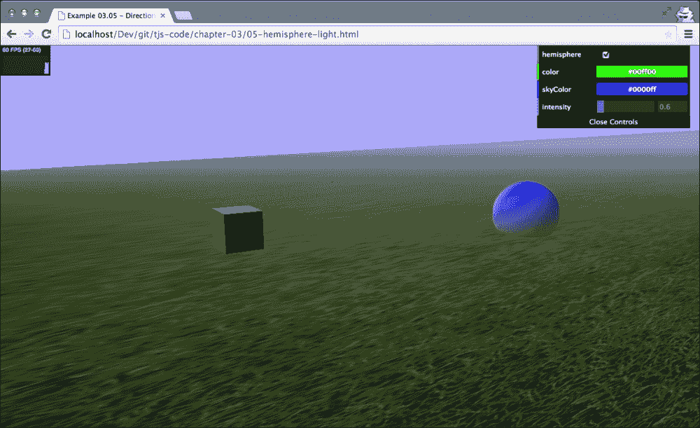

### 注意

注意，这是第一个加载额外资源的示例，不能直接从您的本地文件系统运行。所以如果您还没有这样做，请查看第一章, *使用 Three.js 创建您的第一个 3D 场景*，了解如何设置本地 Web 服务器或禁用浏览器中的安全设置，以便加载外部资源。

在这个示例中，您可以打开和关闭`THREE.HemisphereLight`，并设置颜色和强度。创建半球形灯光就像创建其他任何灯光一样简单：

```js
var hemiLight = new THREE.HemisphereLight(0x0000ff, 0x00ff00, 0.6);
hemiLight.position.set(0, 500, 0);
scene.add(hemiLight);
```

您只需指定从天空接收到的颜色、从地面接收到的颜色以及这些灯光的强度。如果您稍后想更改这些值，您可以通过以下属性访问它们：

| 属性 | 描述 |
| --- | --- |
| `groundColor` | 这是从地面发出的颜色 |
| `color` | 这是从天空发出的颜色 |
| `intensity` | 这是光线照射的强度 |

## THREE.AreaLight

我们将要查看的最后一种真实光源是 `THREE.AreaLight`。使用 `THREE.AreaLight`，我们可以定义一个发射光线的矩形区域。`THREE.AreaLight` 不包含在标准的 Three.js 库中，而是在其扩展中，因此在使用这个光源之前，我们必须采取一些额外的步骤。在我们查看细节之前，让我们首先看看我们想要达到的结果（`06-area-light.html` 打开此示例）；以下截图封装了我们想要看到的结果：

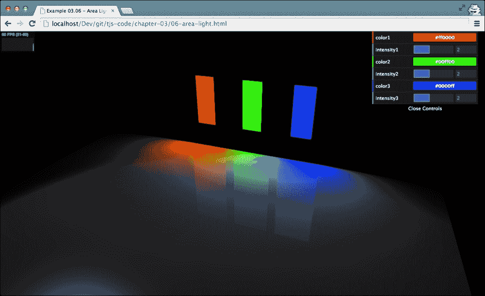

在这个截图中所看到的是，我们定义了三个 `THREE.AreaLight` 对象，每个对象都有其自己的颜色。您还可以看到这些光线如何影响整个区域。

当我们想要使用 `THREE.AreaLight` 时，我们不能使用我们至今为止使用的 `THREE.WebGLRenderer`。原因是 `THREE.AreaLight` 是一个非常复杂的光源，它会在正常的 `THREE.WebGLRenderer` 对象中造成非常严重的性能损失。它在渲染场景时采用不同的方法（将其分解成多个步骤），并且比标准的 `THREE.WebGLRenderer` 对象更好地处理复杂的光源（或者就光源数量而言，非常高的数量）。

要使用 `THREE.WebGLDeferredRenderer`，我们必须包含由 Three.js 提供的一些额外的 JavaScript 源文件。在你的 HTML 框架头部，确保你已经定义了以下 `<script>` 源代码集：

```js
<head>
  <script type="text/javascript" src="img/three.js"></script>
  <script type="text/javascript" src="img/stats.js"></script>
  <script type="text/javascript" src="img/dat.gui.js"></script>

  <script type="text/javascript" src="img/WebGLDeferredRenderer.js"></script>
  <script type="text/javascript" src="img/ShaderDeferred.js"></script>
  <script type="text/javascript" src="img/RenderPass.js"></script>
  <script type="text/javascript" src="img/EffectComposer.js"></script>
  <script type="text/javascript" src="img/CopyShader.js"></script>
  <script type="text/javascript" src="img/ShaderPass.js"></script>
  <script type="text/javascript" src="img/FXAAShader.js"></script>
  <script type="text/javascript" src="img/MaskPass.js"></script>
</head>
```

包含了这些库之后，我们可以使用 `THREE.WebGLDeferredRenderer`。我们可以以与我们在其他示例中讨论的相同的方式使用这个渲染器。它只需要额外的几个参数：

```js
var renderer = new THREE.WebGLDeferredRenderer({width: window.innerWidth,height: window.innerHeight,scale: 1, antialias: true,tonemapping: THREE.FilmicOperator, brightness: 2.5 });
```

不要过于担心这些属性在当前时刻的含义。在 第十章，*加载和使用纹理* 中，我们将更深入地探讨 `THREE.WebGLDeferredRenderer` 并为您解释它们。有了正确的 JavaScript 库和不同的渲染器，我们可以开始添加 `Three.AreaLight`。

我们以与其他所有光源几乎相同的方式做这件事：

```js
var areaLight1 = new THREE.AreaLight(0xff0000, 3);
areaLight1.position.set(-10, 10, -35);
areaLight1.rotation.set(-Math.PI / 2, 0, 0);
areaLight1.width = 4;
areaLight1.height = 9.9;
scene.add(areaLight1);
```

在这个例子中，我们创建了一个新的`THREE.AreaLight`。这个灯光的颜色值为`0xff0000`，强度值为`3`。就像其他灯光一样，我们可以使用`position`属性来设置它在场景中的位置。当你创建`THREE.AreaLight`时，它将被创建为一个水平平面。在我们的例子中，我们创建了三个垂直定位的`THREE.AreaLight`对象，因此我们需要将灯光绕其*x*轴旋转`-Math.PI/2`。最后，我们使用`width`和`height`属性设置`THREE.AreaLight`的大小，并将其添加到场景中。如果你第一次尝试这样做，你可能会想知道为什么你在灯光位置没有看到任何东西。这是因为你无法看到光源本身，只能看到它发出的光，而你只能在它接触到物体时看到光。如果你想重现我在示例中展示的内容，你可以在相同的位置（`areaLight1.position`）添加`THREE.PlaneGeometry`或`THREE.BoxGeometry`来模拟发光区域，如下所示：

```js
var planeGeometry1 = new THREE.BoxGeometry(4, 10, 0);
var planeGeometry1Mat = new THREE.MeshBasicMaterial({color: 0xff0000})
var plane = new THREE.Mesh(planeGeometry1, planeGeometry1Mat);
plane.position = areaLight1.position;
scene.add(plane);
```

你可以使用`THREE.AreaLight`创建非常漂亮的效果，但你可能需要做一些实验来得到期望的效果。如果你从右上角下拉控制面板，你会得到一些可以调整的控件来设置场景中三个灯光的颜色和强度，并立即看到效果，如下所示：

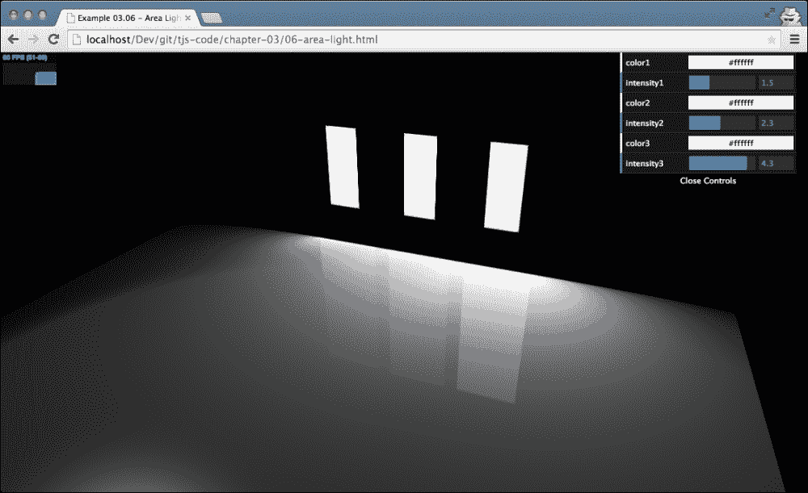

## 镜头光晕

本章我们将探讨的最后一个主题是**镜头光晕**。你可能已经对镜头光晕很熟悉了。例如，当你在阳光下或另一个明亮的光源直接拍照时，它们就会出现。在大多数情况下，你希望避免这种情况，但在游戏和 3D 生成的图像中，它提供了一个很好的效果，使场景看起来更加逼真。

Three.js 也支持镜头光晕，并使其很容易添加到场景中。在本节的最后，我们将向场景添加一个镜头光晕，并创建如下截图所示的输出；你可以通过打开`07-lensflares.html`来亲自查看：

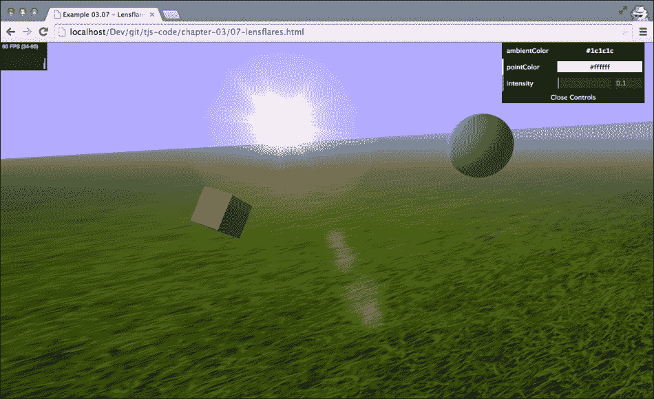

我们可以通过实例化`THREE.LensFlare`对象来创建镜头光晕。首先，我们需要创建这个对象。`THREE.LensFlare`需要以下参数：

```js
flare = new THREE.LensFlare(texture, size, distance, blending, color, opacity);
```

以下表格中解释了这些参数：

| 参数 | 描述 |
| --- | --- |
| `texture` | 纹理是一个图像，它决定了光晕的形状。 |
| `size` | 我们可以指定光晕的大小。这是以像素为单位的大小。如果你指定`-1`，则使用纹理本身的大小。 |
| `distance` | 这是光源（`0`）到相机（`1`）的距离。使用此参数来定位镜头光晕的正确位置。 |
| `blending` | 我们可以为光晕指定多个纹理。混合模式决定了这些纹理是如何混合在一起的。与 `LensFlare` 一起使用的默认混合模式是 `THREE.AdditiveBlending`。关于混合的更多内容将在下一章中介绍。 |
| `color` | 这是光晕的颜色。 |

让我们看看创建此对象所使用的代码（见 `07-lensflares.html`）：

```js
var textureFlare0 = THREE.ImageUtils.loadTexture
      ("../assets/textures/lensflare/lensflare0.png");

var flareColor = new THREE.Color(0xffaacc);
var lensFlare = new THREE.LensFlare(textureFlare0, 350, 0.0, THREE.AdditiveBlending, flareColor);

lensFlare.position = spotLight.position;
scene.add(lensFlare);
```

我们首先加载一个纹理。在这个例子中，我使用了 Three.js 示例提供的镜头光晕纹理，如下所示：

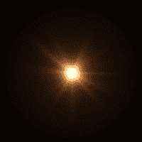

如果你将此图像与本节开头的截图进行比较，你可以看到它定义了镜头光晕的外观。接下来，我们使用 `new THREE.Color( 0xffaacc );` 定义镜头光晕的颜色，这给光晕带来了红色光芒。有了这两个对象，我们可以创建 `THREE.LensFlare` 对象。在这个例子中，我们将光晕的大小设置为 `350`，距离设置为 `0.0`（直接在光源处）。

在我们创建了 `LensFlare` 对象之后，我们将它放置在光源的位置，并将其添加到场景中，这可以在下面的截图中看到：

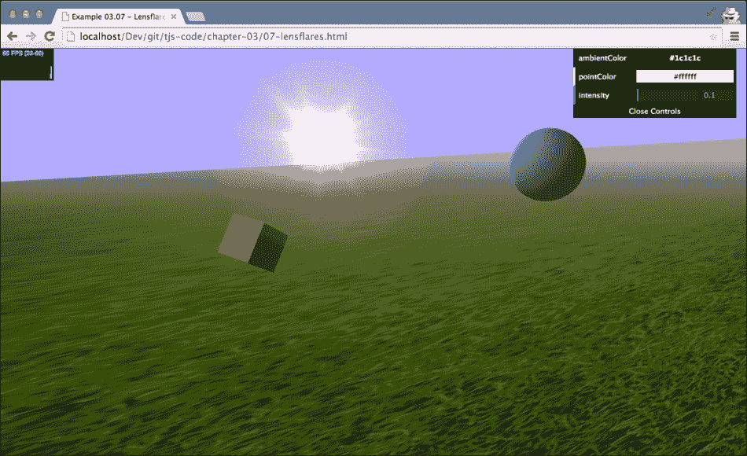

它看起来已经很不错了，但如果你将此与本章开头的图像进行比较，你会注意到我们在页面中间缺少了小的圆形碎片。我们以与创建主要光晕相同的方式创建这些碎片，如下所示：

```js
var textureFlare3 = THREE.ImageUtils.loadTexture
      ("../assets/textures/lensflare/lensflare3.png");

lensFlare.add(textureFlare3, 60, 0.6, THREE.AdditiveBlending);
lensFlare.add(textureFlare3, 70, 0.7, THREE.AdditiveBlending);
lensFlare.add(textureFlare3, 120, 0.9, THREE.AdditiveBlending);
lensFlare.add(textureFlare3, 70, 1.0, THREE.AdditiveBlending);
```

然而，这次我们并没有创建一个新的 `THREE.LensFlare` 对象，而是使用我们刚刚创建的 `LensFlare` 对象提供的 `add` 函数。在这个方法中，我们需要指定纹理、大小、距离和混合模式，然后就可以了。注意，`add` 函数可以接受两个额外的参数。你还可以将新光晕的 `color` 和 `opacity` 属性设置为 `add`。我们用于这些新光晕的纹理是一个非常轻的圆形，如下面的截图所示：

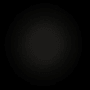

如果你再次查看场景，你会看到碎片出现在你使用 `distance` 参数指定的位置。

# 摘要

在本章中，我们介绍了关于 Three.js 中可用的不同种类灯光的大量信息。在本章中，你了解到配置灯光、颜色和阴影并不是一门精确的科学。为了得到正确的结果，你应该尝试不同的设置，并使用 dat.GUI 控件来精细调整你的配置。不同的灯光表现方式不同。`THREE.AmbientLight`的颜色被添加到场景中的每一个颜色上，通常用于平滑硬色和阴影。`THREE.PointLight`向所有方向发射光线，但不能用于创建阴影。`THREE.SpotLight`是一种类似手电筒的灯光。它具有锥形形状，可以配置为随距离渐变，并且能够投射阴影。我们还探讨了`THREE.DirectionalLight`。这种灯光可以与远处的光源相比，例如太阳，其光线相互平行，强度不会随着距离配置目标越远而减弱。除了标准灯光外，我们还探讨了几个更专业的灯光。为了获得更自然的户外效果，你可以使用`THREE.HemisphereLight`，它考虑了地面和天空的反射；`THREE.AreaLight`不是从一个点发光，而是从大面积发射光线。我们展示了如何使用`THREE.LenseFlare`对象添加摄影镜头光晕。

在前面的章节中，我们已经介绍了几种不同的材料，在本章中，你看到并不是所有材料对可用的灯光都有相同的反应。在下一章中，我们将概述 Three.js 中可用的材料。
