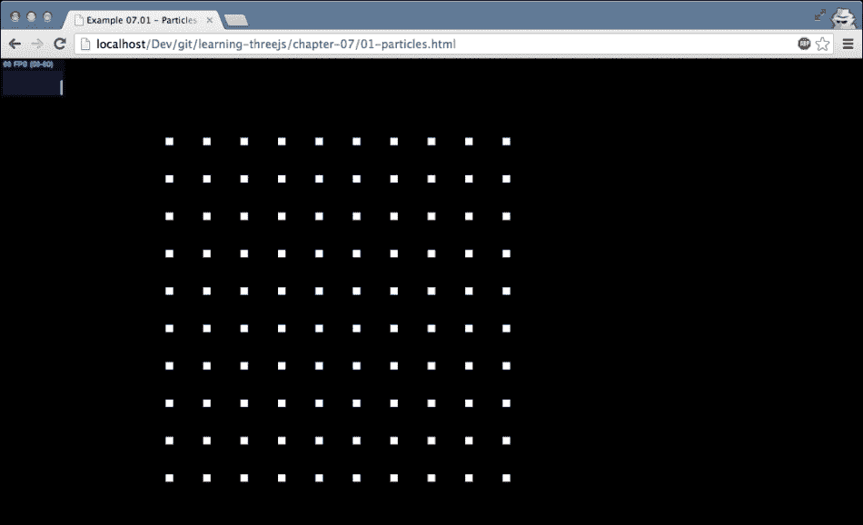

# 第七章：粒子、精灵和点云

在前几章中，我们讨论了 Three.js 提供的重要概念、对象和 API。在本章中，我们将探讨我们至今为止唯一跳过的概念：粒子。通过粒子（有时也称为精灵），可以非常容易地创建许多小对象，你可以使用它们来模拟雨、雪、烟雾和其他有趣的效果。例如，你可以将单个几何体渲染成一组粒子，并分别控制这些粒子。在本章中，我们将探索 Three.js 提供的各种粒子功能。更具体地说，本章将探讨以下主题：

+   使用`THREE.SpriteMaterial`创建和样式化粒子

+   使用点云创建一组分组的粒子

+   从现有几何体创建点云

+   粒子和粒子系统的动画

+   使用纹理样式化粒子

+   使用 canvas 通过`THREE.SpriteCanvasMaterial`样式化粒子

让我们先来探索一下什么是粒子以及如何创建一个。在我们开始之前，关于本章中使用的某些名称，有一个简短的说明。在 Three.js 的最近版本中，与粒子相关的对象名称已更改。我们本章使用的`THREE.PointCloud`曾经被称为`THREE.ParticleSystem`，`THREE.Sprite`曾经被称为`THREE.Particle`，材质也经历了一些名称变化。因此，如果你在网上看到使用这些旧名称的示例，请记住，它们讨论的是相同的概念。在本章中，我们使用的是 Three.js 最新版本中引入的新命名约定。

# 理解粒子

就像我们对大多数新概念所做的那样，我们将从一个示例开始。在本章的源代码中，你可以找到一个名为`01-particles.html`的示例。打开这个示例，你会看到一个由非常无趣的白色立方体组成的网格，如下面的截图所示：



你在屏幕上看到的这个截图中有 100 个精灵。精灵是一个始终面向摄像机的二维平面。如果你创建一个没有任何属性的精灵，它们将被渲染成小型的白色二维正方形。这些精灵是通过以下代码行创建的：

```js
function createSprites() {
  var material = new THREE.SpriteMaterial();
  for (var x = -5; x < 5; x++) {
    for (var y = -5; y < 5; y++) {
      var sprite = new THREE.Sprite(material);
      sprite.position.set(x * 10, y * 10, 0);
      scene.add(sprite);
    }
  }
}
```

在这个示例中，我们使用`THREE.Sprite(material)`构造函数手动创建精灵。我们传递的唯一项是一个材质。这必须是`THREE.SpriteMaterial`或`THREE.SpriteCanvasMaterial`之一。在本章的剩余部分，我们将更深入地探讨这两种材质。

在我们继续探讨更有趣的粒子之前，让我们更仔细地看看 `THREE.Sprite` 对象。一个 `THREE.Sprite` 对象就像 `THREE.Mesh` 一样扩展自 `THREE.Object3D` 对象。这意味着你可以使用 `THREE.Mesh` 中大多数已知属性和函数在 `THREE.Sprite` 上。你可以使用 `position` 属性设置其位置，使用 `scale` 属性缩放它，并使用 `translate` 属性进行相对移动。

### 小贴士

注意，在 Three.js 的旧版本中，你无法使用 `THREE.Sprite` 对象与 `THREE.WebGLRenderer` 一起使用，而只能与 `THREE.CanvasRenderer` 一起使用。在当前版本中，`THREE.Sprite` 对象可以与两种渲染器一起使用。

使用 `THREE.Sprite`，你可以非常容易地创建一组对象并在场景中移动它们。当你处理少量对象时，这工作得很好，但当你想要处理大量 `THREE.Sprite` 对象时，你会迅速遇到性能问题，因为每个对象都需要由 Three.js 分别管理。Three.js 提供了一种使用 `THREE.PointCloud` 处理大量精灵（或粒子）的替代方法。使用 `THREE.PointCloud`，Three.js 不需要管理许多单独的 `THREE.Sprite` 对象，而只需管理一个 `THREE.PointCloud` 实例。

要得到与之前看到的截图相同的结果，但这次使用 `THREE.PointCloud`，我们执行以下操作：

```js
function createParticles() {

  var geom = new THREE.Geometry();
  var material = new THREE.PointCloudMaterial({size: 4, vertexColors: true, color: 0xffffff});

  for (var x = -5; x < 5; x++) {
    for (var y = -5; y < 5; y++) {
      var particle = new THREE.Vector3(x * 10, y * 10, 0);
      geom.vertices.push(particle);
      geom.colors.push(new THREE.Color(Math.random() * 0x00ffff));
    }
  }

  var cloud = new THREE.PointCloud(geom, material);
  scene.add(cloud);
}
```

正如你所见，对于每个粒子（云中的每个点），我们需要创建一个顶点（由 `THREE.Vector3` 表示），将其添加到 `THREE.Geometry` 中，使用 `THREE.Geometry` 和 `THREE.PointCloudMaterial` 创建 `THREE.PointCloud`，并将云添加到场景中。`THREE.PointCloud` 的一个动作示例（带有彩色方块）可以在 `02-particles-webgl.html` 示例中找到。以下截图显示了此示例：


在接下来的几节中，我们将进一步探讨 `THREE.PointCloud`。

# 粒子、THREE.PointCloud 和 THREE.PointCloudMaterial

在上一节的结尾，我们简要介绍了`THREE.PointCloud`。`THREE.PointCloud`的构造函数接受两个属性：一个几何体和一个材质。材质用于给粒子上色和贴图（正如我们稍后将要看到的），而几何体定义了单个粒子的位置。用于定义几何体的每个顶点和每个点都显示为一个粒子。当我们基于`THREE.BoxGeometry`创建`THREE.PointCloud`时，我们得到 8 个粒子，每个粒子对应立方体的一个角。然而，通常情况下，你不会从标准 Three.js 几何体中创建`THREE.PointCloud`，而是像上一节结尾那样手动将顶点添加到从头创建的几何体（或使用外部加载的模型）中。在本节中，我们将更深入地探讨这种方法，并查看如何使用`THREE.PointCloudMaterial`来样式化粒子。我们将使用`03-basic-point-cloud.html`示例来探索这一点。以下截图显示了此示例：


在此示例中，我们创建了`THREE.PointCloud`，并用 15,000 个粒子填充它。所有粒子都使用`THREE.PointCloudMaterial`进行样式化。为了创建`THREE.PointCloud`，我们使用了以下代码：

```js
function createParticles(size, transparent, opacity, vertexColors, sizeAttenuation, color) {

  var geom = new THREE.Geometry();
  var material = new THREE.PointCloudMaterial({size: size, transparent: transparent, opacity: opacity, vertexColors: vertexColors, sizeAttenuation: sizeAttenuation, color: color});

  var range = 500;
  for (var i = 0; i < 15000; i++) {
    var particle = new THREE.Vector3(Math.random() * range - range / 2, Math.random() * range - range / 2, Math.random() * range - range / 2);
    geom.vertices.push(particle);
    var color = new THREE.Color(0x00ff00);
    color.setHSL(color.getHSL().h, color.getHSL().s, Math.random() * color.getHSL().l);
    geom.colors.push(color);
  }

  cloud = new THREE.PointCloud(geom, material);
  scene.add(cloud);
}
```

在此列表中，我们首先创建`THREE.Geometry`。我们将添加表示为`THREE.Vector3`的粒子到这个几何体中。为此，我们创建了一个简单的循环，在随机位置创建`THREE.Vector3`并将其添加。在这个相同的循环中，我们还指定了用于设置`THREE.PointCloudMaterial`的`vertexColors`属性为`true`时使用的颜色数组`geom.colors`。最后要做的事情是创建`THREE.PointCloudMaterial`并将其添加到场景中。

以下表格解释了你可以设置在`THREE.PointCloudMaterial`上的所有属性：

| 名称 | 描述 |
| --- | --- |
| `color` | 这是`ParticleSystem`中所有粒子的颜色。将`vertexColors`属性设置为 true 并使用几何体的颜色属性指定颜色将覆盖此属性（更准确地说，顶点的颜色将与该值相乘以确定最终颜色）。默认值是`0xFFFFFF`。 |
| map | 使用此属性，你可以将纹理应用到粒子上。例如，你可以使它们看起来像雪花。此属性在本示例中没有显示，但将在本章稍后进行解释。 |
| size | 这是粒子的尺寸。默认值是`1`。 |
| sizeAnnutation | 如果设置为 false，所有粒子的大小将相同，无论它们距离相机有多远。如果设置为 true，大小基于距离相机的距离。默认值是`true`。 |
| 顶点颜色 | 通常，`THREE.PointCloud` 中的所有粒子具有相同的颜色。如果此属性设置为 `THREE.VertexColors` 并且几何体的颜色数组已被填充，则将使用该数组的颜色（也请参阅此表中的颜色条目）。默认值为 `THREE.NoColors`。 |
| 透明度 | 与透明属性一起，此属性设置粒子的透明度。默认值为 `1`（无透明度）。 |
| 透明 | 如果设置为 true，则粒子将以透明度属性设置的透明度进行渲染。默认值为 `false`。 |
| 混合模式 | 这是渲染粒子时要使用的混合模式。有关混合模式的更多信息，请参阅第九章，*动画和移动相机*。 |
| 雾效 | 这决定了粒子是否受场景中添加的雾的影响。默认为 `true`。 |

之前的示例提供了一个简单的控制菜单，您可以使用它来试验 `THREE.ParticleCloudMaterial` 特定的属性。

到目前为止，我们只将粒子渲染为小立方体，这是默认行为。然而，还有一些额外的样式化粒子方式可供您使用：

+   我们可以将 `THREE.SpriteCanvasMaterial`（仅适用于 `THREE.CanvasRenderer`）应用于使用 HTML 画布元素的输出作为纹理

+   使用 `THREE.SpriteMaterial` 和基于 HTML5 的纹理，在处理 `THREE.WebGLRenderer` 时使用 HTML 画布的输出

+   使用 `THREE.PointCloudMaterial` 的 `map` 属性加载外部图像文件（或使用 HTML5 画布）以样式化 `THREE.ParticleCloud` 的所有粒子

在下一节中，我们将探讨如何实现这一点。

# 使用 HTML5 画布样式化粒子

Three.js 提供了三种不同的方式，您可以使用 HTML5 画布来样式化您的粒子。如果您使用 `THREE.CanvasRenderer`，则可以直接从 `THREE.SpriteCanvasMaterial` 引用 HTML5 画布。当您使用 `THREE.WebGLRenderer` 时，您需要采取一些额外步骤才能使用 HTML5 画布来样式化您的粒子。在接下来的两个部分中，我们将向您展示不同的方法。

## 使用 HTML5 画布与 THREE.CanvasRenderer

使用 `THREE.SpriteCanvasMaterial`，您可以将 HTML5 画布的输出用作粒子的纹理。这种材料专门为 `THREE.CanvasRenderer` 创建，并且仅在您使用此特定渲染器时才有效。在我们探讨如何使用这种材料之前，让我们首先看看您可以在此材料上设置的属性：

| 名称 | 描述 |
| --- | --- |
| `颜色` | 这是粒子的颜色。根据指定的 `混合模式`，这会影响画布图像的颜色。 |
| `程序` | 这是一个接受画布上下文作为参数的函数。当粒子被渲染时，将调用此函数。2D 绘图上下文的输出将显示为粒子。 |
| `opacity` | 这决定了粒子的不透明度。默认值是 `1`，没有不透明度。 |
| `transparent` | 这决定了粒子是否透明。这和 `opacity` 属性一起工作。 |
| `blending` | 这是将要使用的混合模式。有关更多详细信息，请参阅第九章 Animations and Moving the Camera。 |
| `rotation` | 这个属性允许你旋转画布的内容。你通常需要将其设置为 PI 以正确对齐画布的内容。请注意，这个属性不能传递给材料的构造函数，而需要显式设置。 |

要查看 `THREE.SpriteCanvasMaterial` 的实际效果，你可以打开 `04-program-based-sprites.html` 示例。以下截图显示了此示例：


在这个例子中，粒子是在 `createSprites` 函数中创建的：

```js
function createSprites() {

  var material = new THREE.SpriteCanvasMaterial({
    program: draw,
    color: 0xffffff});
   material.rotation = Math.PI;

  var range = 500;
  for (var i = 0; i < 1000; i++) {
    var sprite = new THREE.Sprite(material);
    sprite.position = new THREE.Vector3(Math.random() * range - range / 2, Math.random() * range - range / 2, Math.random() * range - range / 2);
    sprite.scale.set(0.1, 0.1, 0.1);
    scene.add(sprite);
  }
}
```

这段代码与我们在上一节中看到的代码非常相似。主要的变化是因为我们正在使用 `THREE.CanvasRenderer`，我们直接创建 `THREE.Sprite` 对象，而不是使用 `THREE.PointCloud`。在这段代码中，我们还定义了具有指向 `draw` 函数的 `program` 属性的 `THREE.SpriteCanvasMaterial`。这个 `draw` 函数定义了粒子将看起来像什么（在我们的例子中，是一个来自 *Pac-Man* 的幽灵）：

```js
var draw = function(ctx) {
  ctx.fillStyle = "orange";
  ...
  // lots of other ctx drawing calls
  ...
  ctx.beginPath();
  ctx.fill();
}
```

我们不会深入绘制我们形状所需的实际 canvas 代码。这里重要的是我们定义了一个接受 2D canvas 上下文（`ctx`）作为其参数的函数。在上下文中绘制的一切都用作 `THREE.Sprite` 的形状。

## 使用 WebGLRenderer 与 HTML5 canvas

如果我们想在 `THREE.WebGLRenderer` 中使用 HTML5 canvas，我们可以采取两种不同的方法。我们可以使用 `THREE.PointCloudMaterial` 并创建 `THREE.PointCloud`，或者我们可以使用 `THREE.Sprite` 和 `THREE.SpriteMaterial` 的 `map` 属性。

让我们从第一种方法开始，创建 `THREE.PointCloud`。在 `THREE.PointCloudMaterial` 的属性中，我们提到了 `map` 属性。通过 `map` 属性，我们可以为粒子加载一个纹理。使用 Three.js，这个纹理也可以是 HTML5 canvas 的输出。展示这个概念的例子是 `05a-program-based-point-cloud-webgl.html`。以下截图显示了此示例：


让我们看看我们编写的代码来实现这个效果。大部分代码与我们的上一个 WebGL 示例相同，所以我们将不会深入细节。为了得到这个示例所做的关键代码更改在此处显示：

```js
var getTexture = function() {
  var canvas = document.createElement('canvas');
  canvas.width = 32;
  canvas.height = 32;

  var ctx = canvas.getContext('2d');
  ...
  // draw the ghost
  ...
  ctx.fill();
  var texture = new THREE.Texture(canvas);
  texture.needsUpdate = true;
  return texture;
}

function createPointCloud(size, transparent, opacity, sizeAttenuation, color) {

  var geom = new THREE.Geometry();

  var material = new THREE.PointCloudMaterial ({size: size, transparent: transparent, opacity: opacity, map: getTexture(), sizeAttenuation: sizeAttenuation, color: color});

  var range = 500;
  for (var i = 0; i < 5000; i++) {
    var particle = new THREE.Vector3(Math.random() * range - range / 2, Math.random() * range - range / 2, Math.random() * range - range / 2);
    geom.vertices.push(particle);
  }

  cloud = new THREE.PointCloud(geom, material);
  cloud.sortParticles = true;
  scene.add(cloud);
}
```

在`getTexture`函数，这两个 JavaScript 函数中的第一个，我们根据 HTML5 画布元素创建`THREE.Texture`。在第二个函数`createPointCloud`中，我们将这个纹理分配给`THREE.PointCloudMaterial`的`map`属性。在这个函数中，你还可以看到我们将`THREE.PointCloud`的`sortParticles`属性设置为`true`。这个属性确保在粒子被渲染之前，它们根据屏幕上的*z*位置进行排序。如果你看到部分重叠的粒子或错误的透明度，将此属性设置为`true`（在大多数情况下）将修复这个问题。不过，你应该注意，将此属性设置为`true`会影响场景的性能。当设置为`true`时，Three.js 将不得不确定每个单独粒子的距离。对于一个非常大的`THREE.PointCloud`对象，这可能会对性能产生重大影响。

当我们谈论`THREE.PointCloud`的属性时，你还可以在`THREE.PointCloud`上设置一个额外的属性：`FrustumCulled`。如果这个属性设置为`true`，这意味着如果粒子落在可见相机范围之外，它们不会被渲染。如果需要，这可以用来提高性能和帧率。

结果是，我们在`getTexture()`方法中绘制到画布上的所有内容都用于`THREE.PointCloud`中的粒子。在下一节中，我们将更深入地探讨这是如何与从外部文件加载的纹理一起工作的。请注意，在这个示例中，我们只看到了使用纹理所能实现的可能性的一个非常小的一部分。在第十章，*加载和使用纹理*中，我们将深入了解可以使用纹理做什么。

在本节的开始，我们提到我们也可以使用`THREE.Sprite`与`map`属性一起创建基于画布的粒子。为此，我们使用与之前示例中相同的方法来创建`THREE.Texture`。然而，这一次，我们将其分配给`THREE.Sprite`，如下所示：

```js
function createSprites() {
  var material = new THREE.SpriteMaterial({
    map: getTexture(),
    color: 0xffffff
  });

  var range = 500;
  for (var i = 0; i < 1500; i++) {
    var sprite = new THREE.Sprite(material);
    sprite.position.set(Math.random() * range - range / 2, Math.random() * range - range / 2, Math.random() * range - range / 2);
    sprite.scale.set(4,4,4);
    scene.add(sprite);
  }
}
```

在这里，你可以看到我们使用了一个标准的`THREE.SpriteMaterial`对象，并将画布的输出作为`THREE.Texture`分配给材料的`map`属性。你可以在浏览器中打开`05b-program-based-sprites-webgl.html`来查看这个示例。这两种方法都有其自身的优缺点。使用`THREE.Sprite`，你可以对单个粒子有更多的控制，但当处理大量粒子时，性能会降低，且变得更加复杂。使用`THREE.PointCloud`，你可以轻松管理大量粒子，但对每个单独粒子的控制较少。

# 使用纹理来样式化粒子

在上一个例子中，我们看到了如何使用 HTML5 canvas 来样式化`THREE.PointCloud`和单个`THREE.Sprite`对象。由于你可以绘制任何你想要的东西，甚至可以加载外部图像，因此你可以使用这种方法为粒子系统添加各种样式。然而，有一个更直接的方法来使用图像来样式化你的粒子。你可以使用`THREE.ImageUtils.loadTexture()`函数将图像加载为`THREE.Texture`。然后，`THREE.Texture`可以被分配给材质的`map`属性。

在本节中，我们将展示两个示例并解释如何创建它们。这两个示例都使用图像作为粒子的纹理。在第一个示例中，我们创建了一个雨的模拟，`06-rainy-scene.html`。以下截图显示了此示例：


我们首先需要做的是获取一个代表雨滴的纹理。你可以在`assets/textures/particles`文件夹中找到一些示例。在第九章《动画和移动相机》中，我们将解释纹理的所有细节和需求。现在，你需要知道的是，纹理应该是正方形的，最好是 2 的幂（例如，64 x 64，128 x 128，256 x 256）。在这个例子中，我们将使用这个纹理：


这张图片使用黑色背景（用于正确混合）并显示了雨滴的形状和颜色。在我们能够将此纹理用于`THREE.PointCloudMaterial`之前，我们首先需要加载它。这可以通过以下代码行完成：

```js
var texture = THREE.ImageUtils.loadTexture("../assets/textures/particles/raindrop-2.png");
```

这行代码将使 Three.js 加载纹理，我们可以在我们的材质中使用它。对于这个例子，我们定义了材质如下：

```js
var material = new THREE.PointCloudMaterial({size: 3, transparent: true, opacity: true, map: texture, blending: THREE.AdditiveBlending, sizeAttenuation: true, color: 0xffffff});
```

在本章中，我们讨论了所有这些属性。这里要理解的主要是，`map`属性指向我们使用`THREE.ImageUtils.loadTexture()`函数加载的纹理，我们将`THREE.AdditiveBlending`指定为`blending`模式。这种`blending`模式意味着当绘制新像素时，背景像素的颜色会添加到新像素的颜色上。对于我们的雨滴纹理，这意味着黑色背景不会显示。一个合理的替代方案是将纹理中的黑色替换为透明背景，但不幸的是，这与粒子以及 WebGL 不兼容。

这就解决了`THREE.PointCloud`的样式问题。当你打开这个示例时，你还会看到粒子本身在移动。在先前的例子中，我们移动了整个粒子系统；这次，我们在`THREE.PointCloud`内部定位单个粒子。实际上，这样做非常简单。每个粒子都表示为一个顶点，它构成了用于创建`THREE.PointCloud`的几何形状。让我们看看我们是如何为`THREE.PointCloud`添加粒子的：

```js
var range = 40;
for (var i = 0; i < 1500; i++) {
  var particle = new THREE.Vector3(Math.random() * range - range / 2, Math.random() * range * 1.5, Math.random() * range - range / 2);

  particle.velocityX = (Math.random() - 0.5) / 3;
  particle.velocityY = 0.1 + (Math.random() / 5);
  geom.vertices.push(particle);
}
```

这与之前我们看到的前几个例子没有太大区别。在这里，我们为每个粒子（雨滴）添加了两个额外的属性（`THREE.Vector3`）：`velocityX`和`velocityY`。第一个定义了粒子（雨滴）在水平方向上的移动方式，第二个定义了雨滴下落的速度。水平速度范围从-0.16 到+0.16，垂直速度范围从 0.1 到 0.3。现在每个雨滴都有自己的速度，我们可以在渲染循环中移动单个粒子：

```js
var vertices = system2.geometry.vertices;
vertices.forEach(function (v) {
  v.x = v.x - (v.velocityX);
  v.y = v.y - (v.velocityY);

  if (v.x <= -20 || v.x >= 20) v.velocityX = v.velocityX * -1;
  if (v.y <= 0) v.y = 60;
});
```

在这段代码中，我们从用于创建`THREE.PointCloud`的几何体中获取所有`vertices`（粒子）。对于每个粒子，我们取`velocityX`和`velocityY`，并使用它们来改变粒子的当前位置。最后两行确保粒子保持在定义的范围内。如果`v.y`位置低于零，我们将雨滴重新添加到顶部，如果`v.x`位置达到任何边缘，我们将通过反转水平速度使其弹回。

让我们看看另一个例子。这次，我们不会制作雨，而是制作雪。此外，我们不会只使用一个纹理，而是使用五张单独的图像（来自 Three.js 示例）。让我们先再次查看结果（见`07-snowy-scene.html`）：


在前面的屏幕截图中，你可以看到，我们不是只使用一张图像作为纹理，而是使用了多张图像。你可能想知道我们是如何做到的。正如你可能记得的，我们只能为`THREE.PointCloud`有一个材质。如果我们想有多个材质，我们只需要创建多个粒子系统，如下所示：

```js
function createPointClouds(size, transparent, opacity, sizeAttenuation, color) {

  var texture1 = THREE.ImageUtils.loadTexture("../assets/textures/particles/snowflake1.png");
  var texture2 = THREE.ImageUtils.loadTexture("../assets/textures/particles/snowflake2.png");
  var texture3 = THREE.ImageUtils.loadTexture("../assets/textures/particles/snowflake3.png");
  var texture4 = THREE.ImageUtils.loadTexture("../assets/textures/particles/snowflake5.png");

  scene.add(createPointCloud("system1", texture1, size, transparent, opacity, sizeAttenuation, color));
  scene.add(createPointCloud ("system2", texture2, size, transparent, opacity, sizeAttenuation, color));
  scene.add(createPointCloud ("system3", texture3, size, transparent, opacity, sizeAttenuation, color));
  scene.add(createPointCloud ("system4", texture4, size, transparent, opacity, sizeAttenuation, color));
}
```

在这里，你可以看到我们分别加载纹理，并将如何创建`THREE.PointCloud`的所有信息传递给`createPointCloud`函数。这个函数看起来是这样的：

```js
function createPointCloud(name, texture, size, transparent, opacity, sizeAttenuation, color) {
  var geom = new THREE.Geometry();

  var color = new THREE.Color(color);
  color.setHSL(color.getHSL().h, color.getHSL().s, (Math.random()) * color.getHSL().l);

  var material = new THREE.PointCloudMaterial({size: size, transparent: transparent, opacity: opacity, map: texture, blending: THREE.AdditiveBlending, depthWrite: false, sizeAttenuation: sizeAttenuation, color: color});

  var range = 40;
  for (var i = 0; i < 50; i++) {
    var particle = new THREE.Vector3(Math.random() * range - range / 2, Math.random() * range * 1.5, Math.random() * range - range / 2);
    particle.velocityY = 0.1 + Math.random() / 5;
    particle.velocityX = (Math.random() - 0.5) / 3;
    particle.velocityZ = (Math.random() - 0.5) / 3;
    geom.vertices.push(particle);
  }

  var cloud = new THREE.ParticleCloud(geom, material);
  cloud.name = name;
  cloud.sortParticles = true;
  return cloud;
}
```

在这个函数中，我们首先定义用于渲染特定纹理的粒子的颜色。这是通过随机改变传入颜色的**亮度**来实现的。接下来，以我们之前相同的方式创建材质。这里唯一的区别是，将`depthWrite`属性设置为`false`。这个属性定义了该对象是否影响 WebGL 深度缓冲区。通过将其设置为`false`，我们确保各种点云不会相互干扰。如果这个属性没有设置为`false`，你会看到当粒子位于另一个`THREE.PointCloud`对象的粒子前面时，纹理的黑色背景有时会显示出来。在这段代码的最后一步是随机放置粒子，并为每个粒子添加一个随机速度。在渲染循环中，我们现在可以像这样更新每个`THREE.PointCloud`对象中所有粒子的位置：

```js
scene.children.forEach(function (child) {
  if (child instanceof THREE.ParticleSystem) {
    var vertices = child.geometry.vertices;
    vertices.forEach(function (v) {
      v.y = v.y - (v.velocityY);
      v.x = v.x - (v.velocityX);
      v.z = v.z - (v.velocityZ);

      if (v.y <= 0) v.y = 60;
      if (v.x <= -20 || v.x >= 20) v.velocityX = v.velocityX * -1;
      if (v.z <= -20 || v.z >= 20) v.velocityZ = v.velocityZ * -1;
    });
  }
});
```

采用这种方法，我们可以拥有具有不同纹理的粒子。然而，这种方法有点局限。我们想要的纹理越多，我们需要创建和管理的点云就越多。如果你有一组有限的不同样式的粒子，你最好使用本章开头我们展示的 `THREE.Sprite` 对象。

# 处理精灵贴图

在本章开头，我们使用 `THREE.Sprite` 对象和 `THREE.CanvasRenderer` 以及 `THREE.WebGLRenderer` 来渲染单个粒子。这些精灵被放置在 3D 世界中的某个位置，它们的大小基于与摄像机的距离（这有时也被称为 **billboarding**）。在本节中，我们将展示 `THREE.Sprite` 对象的另一种用途。我们将向您展示如何使用额外的 `THREE.OrthographicCamera` 实例使用 `THREE.Sprite` 创建一个类似于 **抬头显示**（**HUD**）的层，用于您的 3D 内容。我们还将向您展示如何使用精灵贴图选择 `THREE.Sprite` 对象的图像。

作为例子，我们将创建一个简单的 `THREE.Sprite` 对象，它在屏幕上从左到右移动。在背景中，我们将渲染一个带有移动摄像机的 3D 场景，以说明 `THREE.Sprite` 是独立于摄像机移动的。以下截图显示了我们将为第一个示例（`08-sprites.html`）创建的内容：


如果你在这个例子中打开浏览器，你会看到一个类似 Pac-Man 幽灵的精灵在屏幕上移动，并且每当它碰到右边时，颜色和形状都会改变。我们首先将研究如何创建 `THREE.OrthographicCamera` 和一个单独的场景来渲染 `THREE.Sprite`：

```js
var sceneOrtho = new THREE.Scene();
var cameraOrtho = new THREE.OrthographicCamera( 0, window.innerWidth, window.innerHeight, 0, -10, 10 );
```

接下来，让我们看看 `THREE.Sprite` 的构建以及精灵可以采取的各种形状是如何加载的：

```js
function getTexture() {
  var texture = new THREE.ImageUtils.loadTexture("../assets/textures/particles/sprite-sheet.png");
  return texture;
}

function createSprite(size, transparent, opacity, color, spriteNumber) {
  var spriteMaterial = new THREE.SpriteMaterial({
    opacity: opacity,
    color: color,
    transparent: transparent,
    map: getTexture()});

  // we have 1 row, with five sprites
  spriteMaterial.map.offset = new THREE.Vector2(1/5 * spriteNumber, 0);
  spriteMaterial.map.repeat = new THREE.Vector2(1/5, 1);
  spriteMaterial.blending = THREE.AdditiveBlending;

  // makes sure the object is always rendered at the front
  spriteMaterial.depthTest = false;
  var sprite = new THREE.Sprite(spriteMaterial);
  sprite.scale.set(size, size, size);
  sprite.position.set(100, 50, 0);
  sprite.velocityX = 5;

  sceneOrtho.add(sprite);
}
```

在 `getTexture()` 函数中，我们加载一个纹理。然而，我们不是为每个 *幽灵* 加载五张不同的图片，而是加载一个包含所有精灵的单个纹理。纹理看起来像这样：


使用 `map.offset` 和 `map.repeat` 属性，我们可以选择屏幕上显示的正确精灵。通过 `map.offset` 属性，我们确定加载的纹理在 *x* 轴（u）和 *y* 轴（v）上的偏移量。这些属性的缩放范围从 0 到 1。在我们的例子中，如果我们想选择第三个幽灵，我们将 u 偏移量（*x* 轴）设置为 0.4，因为我们只有一行，所以我们不需要改变 v 偏移量（*y* 轴）。如果我们只设置这个属性，纹理会在屏幕上显示第三个、第四个和第五个幽灵压缩在一起。如果我们只想显示一个幽灵，我们需要放大。我们通过将 `map.repeat` 属性的 u 值设置为 1/5 来实现这一点。这意味着我们只放大（仅针对 *x* 轴）以只显示纹理的 20%，这正好是一个幽灵。

我们需要采取的最后一步是更新 `render` 函数：

```js
webGLRenderer.render(scene, camera);
webGLRenderer.autoClear = false;
webGLRenderer.render(sceneOrtho, cameraOrtho);
```

我们首先使用正常相机和移动的球体渲染场景，然后渲染包含我们的精灵的场景。请注意，我们需要将 WebGLRenderer 的`autoClear`属性设置为`false`。如果我们不这样做，Three.js 将在渲染精灵之前清除场景，球体就不会显示出来。

以下表格显示了我们在上一示例中使用的所有`THREE.SpriteMaterial`属性概述：

| 名称 | 描述 |
| --- | --- |
| `color` | 这是精灵的颜色。 |
| `map` | 这是用于此精灵的纹理。这可以是一个精灵图集，如本节中的示例所示。 |
| `sizeAnnutation` | 如果设置为`false`，则精灵的大小不会受到其与相机距离的影响。默认值是`true`。 |
| `opacity` | 这设置精灵的透明度。默认值是`1`（无透明度）。 |
| `blending` | 这定义了渲染精灵时要使用的混合模式。有关混合模式的更多信息，请参阅第九章，*动画和移动相机*。 |
| `fog` | 这确定精灵是否受场景中添加的雾的影响。默认为`true`。 |

你也可以设置这个材质上的`depthTest`和`depthWrite`属性。有关这些属性的更多信息，请参阅第四章，*使用 Three.js 材质*。

我们当然也可以在 3D 中定位`THREE.Sprites`时使用精灵图（正如我们在本章开头所做的那样）。以下截图显示了这种示例（`09-sprites-3D.html`）：


通过我们在上一表中看到的属性，我们可以非常容易地创建我们在上一张截图中所看到的效果：

```js
function createSprites() {

  group = new THREE.Object3D();
  var range = 200;
  for (var i = 0; i < 400; i++) {
    group.add(createSprite(10, false, 0.6, 0xffffff, i % 5, range));
  }
  scene.add(group);
}

function createSprite(size, transparent, opacity, color, spriteNumber, range) {

  var spriteMaterial = new THREE.SpriteMaterial({
    opacity: opacity,
    color: color,
    transparent: transparent,
    map: getTexture()}
  );

  // we have 1 row, with five sprites
  spriteMaterial.map.offset = new THREE.Vector2(0.2*spriteNumber, 0);
  spriteMaterial.map.repeat = new THREE.Vector2(1/5, 1);
  spriteMaterial.depthTest = false;

  spriteMaterial.blending = THREE.AdditiveBlending;

  var sprite = new THREE.Sprite(spriteMaterial);
  sprite.scale.set(size, size, size);
  sprite.position.set(Math.random() * range - range / 2, Math.random() * range - range / 2, Math.random() * range - range / 2);
  sprite.velocityX = 5;

  return sprite;
}
```

在这个例子中，我们根据我们之前展示的精灵图集创建了 400 个精灵。你可能已经知道并理解这里展示的大多数属性和概念。由于我们将单独的精灵添加到了一个组中，所以旋转它们非常容易，可以这样做：

```js
group.rotation.x+=0.1;
```

在本章中，到目前为止我们主要关注从头开始创建精灵和点云。然而，有一个有趣的选择，那就是从现有的几何体中创建`THREE.PointCloud`。

# 从高级几何体创建 THREE.PointCloud

如你所记，`THREE.PointCloud`根据提供的几何体的顶点渲染每个粒子。这意味着如果我们提供一个复杂的几何体（例如，一个环面结或一个管），我们可以根据该特定几何体的顶点创建`THREE.PointCloud`。在本章的最后部分，我们将创建一个环面结，就像我们在上一章中看到的那样，并将其渲染为`THREE.PointCloud`。

我们已经在上一章中解释了环面结，所以这里不会过多详细说明。我们使用上一章的精确代码，并添加了一个单菜单选项，您可以使用它将渲染的网格转换为 `THREE.PointCloud`。您可以在本章的源代码中找到示例（`10-create-particle-system-from-model.html`）。以下截图显示了示例：


如前一张截图所示，用于生成环面结的每个顶点都用作粒子。在本例中，我们添加了一个基于 HTML 画布的漂亮材质，以创建这种发光效果。我们将只查看创建材质和粒子系统的代码，因为我们已经在本章中讨论了其他属性：

```js
function generateSprite() {

  var canvas = document.createElement('canvas');
  canvas.width = 16;
  canvas.height = 16;

  var context = canvas.getContext('2d');
  var gradient = context.createRadialGradient(canvas.width / 2, canvas.height / 2, 0, canvas.width / 2, canvas.height / 2, canvas.width / 2);

  gradient.addColorStop(0, 'rgba(255,255,255,1)');
  gradient.addColorStop(0.2, 'rgba(0,255,255,1)');
  gradient.addColorStop(0.4, 'rgba(0,0,64,1)');
  gradient.addColorStop(1, 'rgba(0,0,0,1)');

  context.fillStyle = gradient;
  context.fillRect(0, 0, canvas.width, canvas.height);

  var texture = new THREE.Texture(canvas);
  texture.needsUpdate = true;
  return texture;
}

function createPointCloud(geom) {
  var material = new THREE.PointCloudMaterial({
    color: 0xffffff,
    size: 3,
    transparent: true,
    blending: THREE.AdditiveBlending,
    map: generateSprite()
  });

  var cloud = new THREE.PointCloud(geom, material);
  cloud.sortParticles = true;
  return cloud;
}

// use it like this
var geom = new THREE.TorusKnotGeometry(...);
var knot = createPointCloud(geom);
```

在此代码片段中，您可以看到两个函数：`createPointCloud()` 和 `generateSprite()`。在第一个函数中，我们直接从提供的几何形状（在本例中为环面结）创建了一个简单的 `THREE.PointCloud` 对象，并使用 `generateSprite()` 函数将纹理（`map` 属性）设置为发光点（在 HTML5 画布元素上生成），该函数如下所示：


# 摘要

本章内容到此结束。我们解释了粒子、精灵和粒子系统是什么，以及如何使用可用的材料来样式化这些对象。在本章中，您看到了如何直接使用 `THREE.Sprite` 与 `THREE.CanvasRenderer` 和 `THREE.WebGLRenderer` 一起使用。然而，如果您想创建大量粒子，则应使用 `THREE.PointCloud`。使用 `THREE.PointCloud`，所有粒子共享相同的材质，您可以为单个粒子更改的唯一属性是通过将材质的 `vertexColors` 属性设置为 `THREE.VertexColors` 并在用于创建 `THREE.PointCloud` 的 `THREE.Geometry` 的 `colors` 数组中提供一个颜色值来改变其颜色。我们还展示了如何通过改变它们的位置来轻松地动画化粒子。这对单个 `THREE.Sprite` 实例和用于创建 `THREE.PointCloud` 的几何形状的顶点都适用。

到目前为止，我们已经创建了基于 Three.js 提供的几何形状的网格。这对于简单的模型（如球体和立方体）来说效果很好，但当你想要创建复杂的 3D 模型时，这不是最佳方法。对于这些模型，您通常会使用 3D 建模应用程序，如 Blender 或 3D Studio Max。在下一章中，您将学习如何加载和显示由此类 3D 建模应用程序创建的模型。
