# 第九章：动画和移动相机

在前面的章节中，我们看到了一些简单的动画，但并没有太复杂。在第一章中，*使用 Three.js 创建您的第一个 3D 场景*，我们介绍了基本的渲染循环，在随后的章节中，我们使用它来旋转一些简单的对象并展示了一些其他的基本动画概念。在本章中，我们将更详细地探讨 Three.js 如何支持动画。我们将详细探讨以下四个主题：

+   基本动画

+   移动相机

+   形变和蒙皮

+   加载外部动画

我们从动画背后的基本概念开始。

# 基本动画

在我们查看示例之前，让我们快速回顾一下在第一章中展示的内容，*使用 Three.js 创建您的第一个 3D 场景*，关于渲染循环。为了支持动画，我们需要告诉 Three.js 每隔一段时间渲染场景。为此，我们使用标准的 HTML5 `requestAnimationFrame`功能，如下所示：

```js
render();

function render() {

  // render the scene
  renderer.render(scene, camera);
  // schedule the next rendering using requestAnimationFrame
  requestAnimationFrame(render);
}
```

使用这段代码，我们只需要在初始化场景完成后调用一次`render()`函数。在`render()`函数本身中，我们使用`requestAnimationFrame`来安排下一次渲染。这样，浏览器将确保`render()`函数在正确的间隔（通常每秒大约 60 次）被调用。在`requestAnimationFrame`被添加到浏览器之前，使用的是`setInterval(function, interval)`或`setTimeout(function, interval)`。这些方法会在设定的时间间隔内调用指定的函数一次。这种方法的缺点是它没有考虑到其他正在发生的事情。即使你的动画没有显示或者是在一个隐藏的标签页中，它仍然会被调用，并且仍然在使用资源。另一个问题是，这些函数在它们被调用时更新屏幕，而不是在浏览器认为最佳的时间，这意味着更高的 CPU 使用率。使用`requestAnimationFrame`，我们不是告诉浏览器何时更新屏幕；我们请求浏览器在最适合的时候运行提供的函数。通常，这会导致大约 60 fps 的帧率。使用`requestAnimationFrame`，你的动画将运行得更平滑，并且对 CPU 和 GPU 更友好，你也不必担心自己处理时间问题。

## 简单动画

使用这种方法，我们可以通过改变对象的旋转、缩放、位置、材质、顶点、面以及你能想象到的任何其他属性来非常容易地动画化对象。在下一个渲染循环中，Three.js 将渲染这些更改的属性。一个基于我们已经在第一章中看到的简单示例，*使用 Three.js 创建您的第一个 3D 场景*，可以在`01-basic-animation.html`中找到。以下截图显示了此示例：

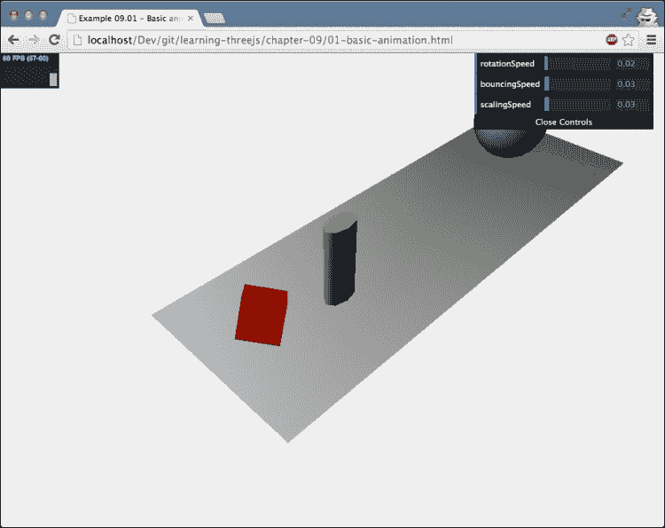

这个渲染循环非常简单。只需更改涉及的网格的属性，Three.js 就会处理其余部分。以下是我们的操作方法：

```js
function render() {
  cube.rotation.x += controls.rotationSpeed;
  cube.rotation.y += controls.rotationSpeed;
  cube.rotation.z += controls.rotationSpeed;

  step += controls.bouncingSpeed;
  sphere.position.x = 20 + ( 10 * (Math.cos(step)));
  sphere.position.y = 2 + ( 10 * Math.abs(Math.sin(step)));

  scalingStep += controls.scalingSpeed;
  var scaleX = Math.abs(Math.sin(scalingStep / 4));
  var scaleY = Math.abs(Math.cos(scalingStep / 5));
  var scaleZ = Math.abs(Math.sin(scalingStep / 7));
  cylinder.scale.set(scaleX, scaleY, scaleZ);

  renderer.render(scene, camera);
  requestAnimationFrame(render);
}
```

这里没有什么特别之处，但它很好地展示了我们在本书中讨论的基本动画背后的概念。在下一节中，我们将快速跳转一下。除了动画之外，一个重要的方面，当你使用 Three.js 在更复杂的场景中工作时，你会很快遇到，就是使用鼠标在屏幕上选择对象的能力。

## 选择对象

尽管这与动画没有直接关系，但由于我们将在本章中查看相机和动画，所以它是本章主题的一个很好的补充。我们将展示如何使用鼠标从场景中选择一个对象。在我们查看示例之前，我们首先将查看实现这一功能的代码：

```js
var projector = new THREE.Projector();

function onDocumentMouseDown(event) {
  var vector = new THREE.Vector3(event.clientX / window.innerWidth ) * 2 - 1, -( event.clientY / window.innerHeight ) * 2 + 1, 0.5);
  vector = vector.unproject(camera);

  var raycaster = new THREE.Raycaster(camera.position, vector.sub(camera.position).normalize());

  var intersects = raycaster.intersectObjects([sphere, cylinder, cube]);

  if (intersects.length > 0) {
    intersects[ 0 ].object.material.transparent = true;
    intersects[ 0 ].object.material.opacity = 0.1;
  }
}
```

在此代码中，我们使用 `THREE.Projector` 和 `THREE.Raycaster` 来确定我们是否点击了特定的对象。当我们在屏幕上点击时，发生的情况如下：

1.  首先，基于我们在屏幕上点击的位置创建 `THREE.Vector3`。

1.  接下来，使用 `vector.unproject` 函数，我们将屏幕上点击的位置转换为我们的 Three.js 场景中的坐标。换句话说，我们从屏幕坐标转换到世界坐标。

1.  接下来，我们创建 `THREE.Raycaster`。使用 `THREE.Raycaster`，我们可以将射线投射到场景中。在这种情况下，我们从相机的位置 (`camera.position`) 发射一个射线到场景中我们点击的位置。

1.  最后，我们使用 `raycaster.intersectObjects` 函数来确定是否有任何提供的对象被这个射线击中。

最后一步的结果包含有关任何被这个射线击中的对象的信息。以下信息被提供：

```js
distance: 49.9047088522448
face: THREE.Face3
faceIndex: 4
object: THREE.Mesh
point: THREE.Vector3
```

被点击的网格是对象，而 `face` 和 `faceIndex` 指向被选中的网格的面。`distance` 值是从相机到点击对象的距离，而 `point` 是点击网格的确切位置。你可以在 `02-selecting-objects.html` 示例中测试这一点。你点击的任何对象都会变得透明，并且选择详情将被打印到控制台。

如果你想看到射出的射线路径，你可以从菜单中启用 `showRay` 属性。以下截图显示了用于选择蓝色球体的射线：

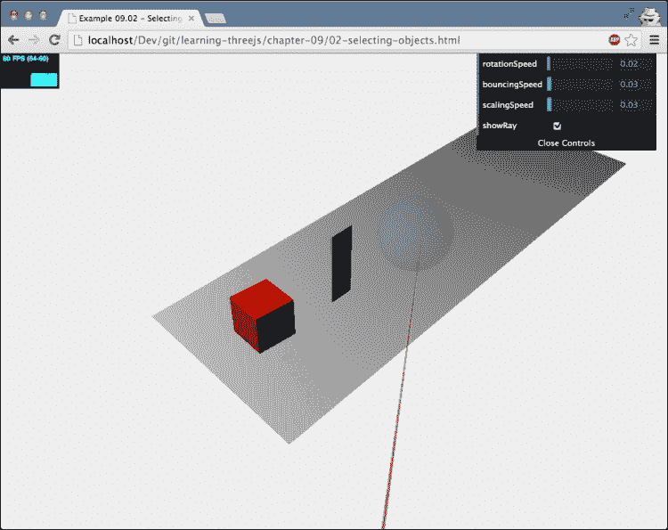

现在我们已经完成了这个小休息，让我们回到我们的动画上来。到目前为止，我们通过在渲染循环中更改属性来动画化一个对象。在下一节中，我们将查看一个小型库，它使得定义动画变得容易得多。

## 使用 Tween.js 动画

Tween.js 是一个小的 JavaScript 库，你可以从[`github.com/sole/tween.js/`](https://github.com/sole/tween.js/)下载，并可以使用它轻松地定义两个值之间属性的过渡。所有起始值和结束值之间的中间点都会为你计算。这个过程被称为**tweening**。

例如，你可以使用这个库在 10 秒内将网格的*x*位置从 10 改为 3，如下所示：

```js
var tween = new TWEEN.Tween({x: 10}).to({x: 3}, 10000).easing(TWEEN.Easing.Elastic.InOut).onUpdate( function () {
  // update the mesh
})
```

在这个例子中，我们创建了`TWEEN.Tween`。这个 tween 将确保*x*属性在 10,000 毫秒内从 10 变为 3。Tween.js 还允许你定义这个属性随时间如何变化。这可以通过线性、二次或其他任何可能性（参见[`sole.github.io/tween.js/examples/03_graphs.html`](http://sole.github.io/tween.js/examples/03_graphs.html)以获取完整概述）。随时间改变值的方式被称为**easing**。使用 Tween.js，你可以通过`easing()`函数来配置这个设置。

使用这个 Three.js 库非常简单。如果你打开`03-animation-tween.html`示例，你可以看到 Tween.js 库在行动。以下截图显示了示例的静态图像：

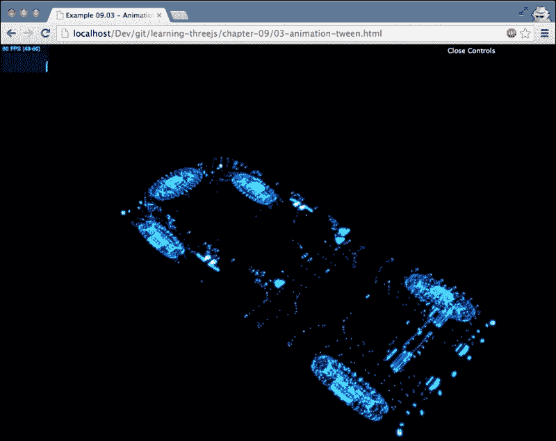

在这个例子中，我们从第七章，*粒子、精灵和点云*，取了一个粒子云，并动画化了所有粒子到地面。这些粒子的位置是基于使用 Tween.js 库创建的 tween，如下所示：

```js
// first create the tweens
var posSrc = {pos: 1}
var tween = new TWEEN.Tween(posSrc).to({pos: 0}, 5000);
tween.easing(TWEEN.Easing.Sinusoidal.InOut);

var tweenBack = new TWEEN.Tween(posSrc).to({pos: 1}, 5000);
tweenBack.easing(TWEEN.Easing.Sinusoidal.InOut);

tween.chain(tweenBack);
tweenBack.chain(tween);

var onUpdate = function () {
  var count = 0;
  var pos = this.pos;

  loadedGeometry.vertices.forEach(function (e) {
    var newY = ((e.y + 3.22544) * pos) - 3.22544;
    particleCloud.geometry.vertices[count++].set(e.x, newY, e.z);
  });

  particleCloud.sortParticles = true;
};

tween.onUpdate(onUpdate);
tweenBack.onUpdate(onUpdate);
```

使用这段代码，我们创建了两个 tween：`tween`和`tweenBack`。第一个定义了位置属性如何从 1 过渡到 0，第二个则相反。通过`chain()`函数，我们将这两个 tween 链接在一起，所以这些 tween 在启动时将开始循环。在这里我们定义的最后一件事是`onUpdate`方法。在这个方法中，我们遍历粒子系统的所有顶点，并根据 tween 提供的位置（`this.pos`）改变它们的位置。

我们在模型加载时开始 tween，所以在以下函数的末尾，我们调用`tween.start()`函数：

```js
var loader = new THREE.PLYLoader();
loader.load( "../assets/models/test.ply", function (geometry) {
  ...
  tween.start()
  ...
});
```

当 tween 开始时，我们需要告诉 Tween.js 库我们希望它在何时更新它所知道的所有 tween。我们通过调用`TWEEN.update()`函数来完成这个操作：

```js
function render() {
  TWEEN.update();
  webGLRenderer.render(scene, camera);
  requestAnimationFrame(render);
}
```

在这些步骤到位后，tween 库将负责定位点云的各个点。正如你所看到的，使用这个库比自行管理过渡要容易得多。

除了动画化和改变对象，我们还可以通过移动相机来动画化场景。在前几章中，我们已经手动更新相机位置来这样做了几次。Three.js 还提供了一些更新相机的方法。

# 与相机一起工作

Three.js 提供了一些相机控制，您可以使用这些控制来在场景中控制相机。这些控制位于 Three.js 发行版中，可以在`examples/js/controls`目录中找到。在本节中，我们将更详细地查看以下控制：

| Name | 描述 |
| --- | --- |
| `FirstPersonControls` | 这些控制的行为类似于第一人称射击游戏中的控制。使用键盘移动，使用鼠标四处查看。 |
| `FlyControls` | 这些是类似飞行模拟器的控制。使用键盘和鼠标移动和转向。 |
| `RollControls` | 这是`FlyControls`的一个简化版本。允许您在*z*轴周围移动和滚动。 |
| `TrackBallControls` | 这些是最常用的控制，允许您使用鼠标（或轨迹球）轻松地在场景中移动、平移和缩放。 |
| `OrbitControls` | 这模拟了一个围绕特定场景运行的卫星。这允许您使用鼠标和键盘移动。 |

这些控制是最有用的控制。除了这些，Three.js 还提供了一些额外的控制，您可以使用（但本书中未解释）。然而，使用这些控制的方式与前面表格中解释的方式相同：

| Name | 描述 |
| --- | --- |
| `DeviceOrientationControls` | 这根据设备的方向控制相机的移动。它内部使用 HTML 设备方向 API([`www.w3.org/TR/orientation-event/`](http://www.w3.org/TR/orientation-event/))。 |
| `EditorControls` | 这些是专门为在线 3D 编辑器创建的控制。这被 Three.js 在线编辑器使用，您可以在[`threejs.org/editor/`](http://threejs.org/editor/)找到它。 |
| `OculusControls` | 这些控制允许您使用 Oculus Rift 设备在场景中四处查看。 |
| `OrthographicTrackballControls` | 这与`TrackBallControls`相同，但专门创建用于与`THREE.OrthographicCamera`一起使用。 |
| `PointerLockControls` | 这是一个简单的控制，它使用渲染场景的 DOM 元素锁定鼠标。这为简单的 3D 游戏提供了基本功能。 |
| `TransformControls` | 这是 Three.js 编辑器使用的内部控制。 |
| `VRControls` | 这是一个使用`PositionSensorVRDevice` API 来控制场景的控制。有关此标准的更多信息，请参阅[`developer.mozilla.org/en-US/docs/Web/API/Navigator.getVRDevices`](https://developer.mozilla.org/en-US/docs/Web/API/Navigator.getVRDevices)。 |

除了使用这些相机控制外，您当然也可以通过设置`position`来自行移动相机，并使用`lookAt()`函数改变其指向的位置。

### 提示

如果您使用过 Three.js 的旧版本，您可能缺少一个名为 `THREE.PathControls` 的特定相机控制。使用这个控制，您可以定义一个路径（例如使用 `THREE.Spline`）并将相机沿着该路径移动。在 Three.js 的最新版本中，由于代码复杂性，这个控制已被移除。Three.js 背后的团队目前正在开发一个替代品，但目前还没有可用。

我们将要查看的第一个控制是 `TrackballControls`。

## TrackballControls

在您可以使用 `TrackballControls` 之前，您首先需要将正确的 JavaScript 文件包含到您的页面中：

```js
<script type="text/javascript" src="img/TrackballControls.js"></script>
```

包含这些后，我们可以创建控制并将其附加到相机上，如下所示：

```js
var trackballControls = new THREE.TrackballControls(camera);
trackballControls.rotateSpeed = 1.0;
trackballControls.zoomSpeed = 1.0;
trackballControls.panSpeed = 1.0;
```

更新相机位置是我们渲染循环中执行的操作，如下所示：

```js
var clock = new THREE.Clock();
function render() {
  var delta = clock.getDelta();
  trackballControls.update(delta);
  requestAnimationFrame(render);
  webGLRenderer.render(scene, camera);
}
```

在前面的代码片段中，我们看到一个新的 Three.js 对象，`THREE.Clock`。`THREE.Clock` 对象可以用来精确计算特定调用或渲染循环完成所需的时间。您可以通过调用 `clock.getDelta()` 函数来实现这一点。此函数将返回从上次调用 `getDelta()` 到这次调用的经过时间。为了更新相机的位置，我们调用 `trackballControls.update()` 函数。在这个函数中，我们需要提供自上次调用此更新函数以来经过的时间。为此，我们使用 `THREE.Clock` 对象的 `getDelta()` 函数。您可能会想知道为什么我们不直接将帧率（1/60 秒）传递给 `update` 函数。原因是，使用 `requestAnimationFrame`，我们期望 60 fps，但这并不保证。根据所有各种外部因素，帧率可能会变化。为了确保相机平稳地旋转和旋转，我们需要传递确切的经过时间。

一个用于此的示例可以在 `04-trackball-controls-camera.html` 中找到。以下截图显示了此示例的静态图像：

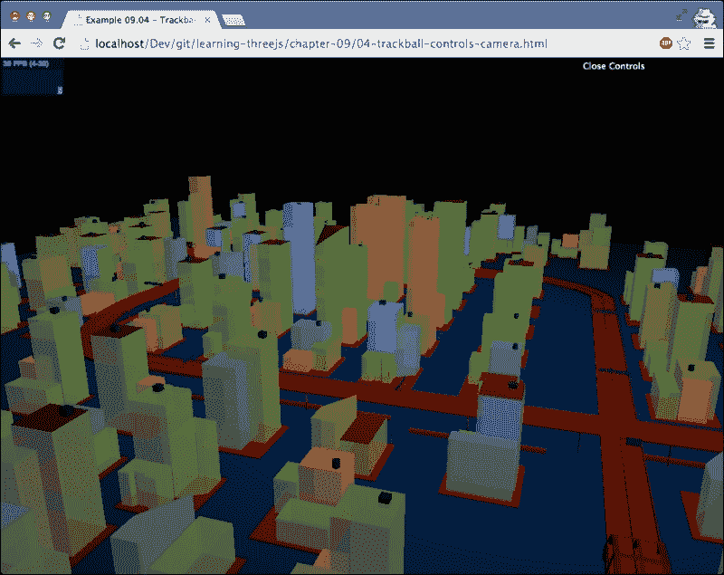

您可以使用以下方式控制相机：

| 控制 | 操作 |
| --- | --- |
| 左键点击并移动 | 在场景周围旋转和滚动相机 |
| 滚轮 | 放大和缩小 |
| 中键点击并移动 | 放大和缩小 |
| 右键点击并移动 | 在场景周围平移 |

您可以使用一些属性来微调相机的行为。例如，您可以通过 `rotateSpeed` 属性设置相机旋转的速度，并通过将 `noZoom` 属性设置为 `true` 来禁用缩放。在本章中，我们不会详细介绍每个属性的作用，因为它们基本上是自我解释的。要了解完整的概述，请查看 `TrackballControls.js` 文件源代码，其中列出了这些属性。

## FlyControls

我们将要查看的下一种控制是`FlyControls`。使用`FlyControls`，你可以使用在飞行模拟器中也能找到的控制来在场景中飞行。一个例子可以在`05-fly-controls-camera.html`中找到。以下截图显示了该示例的静态图像：

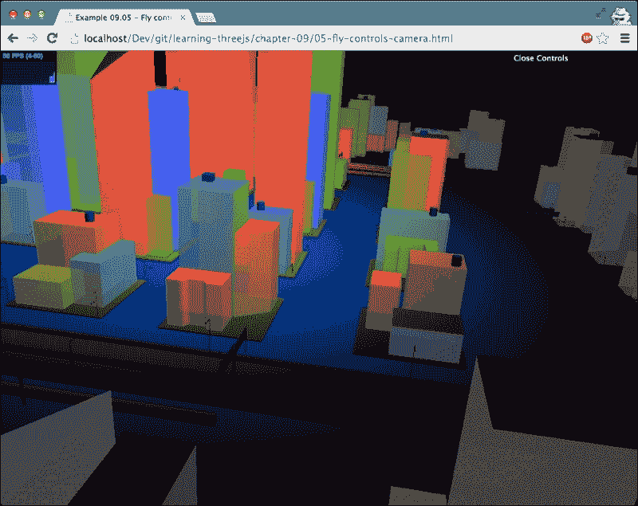

启用`FlyControls`与`TrackballControls`的方式相同。首先，加载正确的 JavaScript 文件：

```js
<script type="text/javascript" src="img/FlyControls.js"></script>
```

接下来，我们配置控制并将其附加到相机上，如下所示：

```js
var flyControls = new THREE.FlyControls(camera);
flyControls.movementSpeed = 25;
flyControls.domElement = document.querySelector('#WebGL-output');
flyControls.rollSpeed = Math.PI / 24;
flyControls.autoForward = true;
flyControls.dragToLook = false;
```

一次又一次，我们不会查看所有具体的属性。查看`FlyControls.js`文件的源代码以获取这些属性。我们只需挑选出你需要配置以使此控制工作所需的属性。需要正确设置的属性是`domElement`属性。此属性应指向我们渲染场景的元素。对于本书中的示例，我们使用以下元素作为我们的输出：

```js
<div id="WebGL-output"></div>
```

我们这样设置属性：

```js
flyControls.domElement = document.querySelector('#WebGL-output');
```

如果我们没有正确设置此属性，鼠标在周围移动会导致奇怪的行为。

你可以用以下方式用`THREE.FlyControls`控制相机：

| 控制 | 操作 |
| --- | --- |
| 左键和中间鼠标按钮 | 开始向前移动 |
| 右键鼠标 | 向后移动 |
| 鼠标移动 | 环顾四周 |
| W | 开始向前移动 |
| S | 向后移动 |
| A | 向左移动 |
| D | 向右移动 |
| R | 向上移动 |
| F | 向下移动 |
| 左右、上下箭头 | 向左、向右、向上和向下看 |
| G | 向左翻滚 |
| E | 向右翻滚 |

我们将要查看的下一种控制是`THREE.RollControls`。

## RollControls

`RollControls`的行为与`FlyControls`非常相似，所以我们不会在这里详细介绍。`RollControls`可以创建如下：

```js
var rollControls = new THREE.RollControls(camera);
rollControls.movementSpeed = 25;
rollControls.lookSpeed = 3;
```

如果你想要尝试这个控制，请查看`06-roll-controls-camera.html`示例。注意，如果你只看到一个黑色屏幕，将鼠标移到浏览器底部，城市景观就会进入视野。这个相机可以用以下控制来移动：

| 控制 | 操作 |
| --- | --- |
| 左键鼠标 | 向前移动 |
| 右键鼠标 | 向后移动 |
| 左右、上下箭头 | 向左、向右、向前和向后移动 |
| W | 向前移动 |
| A | 向左移动 |
| S | 向后移动 |
| D | 向右移动 |
| Q | 向左翻滚 |
| E | 向右翻滚 |
| R | 向上移动 |
| F | 向下移动 |

我们将要查看的最后一种基本控制是`FirstPersonControls`。

## FirstPersonControls

如其名所示，`FirstPersonControls`允许你像在第一人称射击游戏中一样控制相机。鼠标用于环顾四周，键盘用于四处走动。你可以在`07-first-person-camera.html`中找到一个示例。以下截图显示了该示例的静态图像：

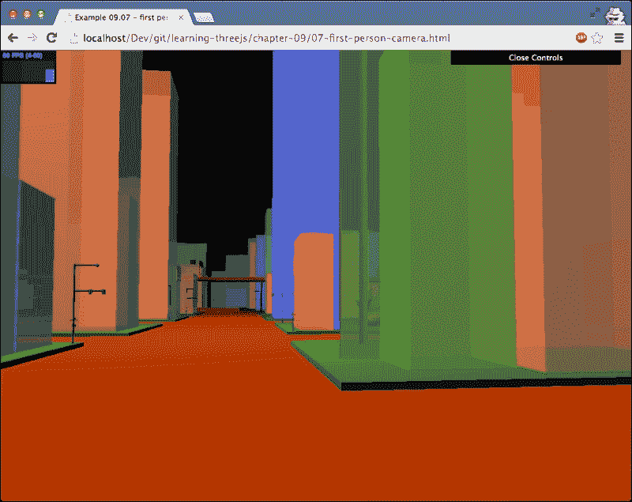

创建这些控制遵循的原则与迄今为止我们所看到的其他控制遵循的原则相同。我们刚刚显示的示例使用以下配置：

```js
var camControls = new THREE.FirstPersonControls(camera);
camControls.lookSpeed = 0.4;
camControls.movementSpeed = 20;
camControls.noFly = true;
camControls.lookVertical = true;
camControls.constrainVertical = true;
camControls.verticalMin = 1.0;
camControls.verticalMax = 2.0;
camControls.lon = -150;
camControls.lat = 120;
```

当您自己使用此控件时，您应该仔细查看的唯一属性是最后两个：`lon` 和 `lat` 属性。这两个属性定义了场景首次渲染时相机指向的位置。

此控件的控件相当直观：

| 控制 | 动作 |
| --- | --- |
| 鼠标移动 | 四处张望 |
| 左、右、上、下箭头 | 向左、右、前、后移动 |
| W | 向前移动 |
| A | 向左移动 |
| S | 向后移动 |
| D | 向右移动 |
| R | 向上移动 |
| F | 向下移动 |
| Q | 停止所有移动 |

对于下一个控件，我们将从第一个视角转向空间视角。

## OrbitControl

`OrbitControl` 控件是旋转和围绕场景中心对象平移的绝佳方式。在 `08-controls-orbit.html` 中，我们包含了一个示例，展示了该控件的工作原理。以下截图显示了此示例的静态图像：

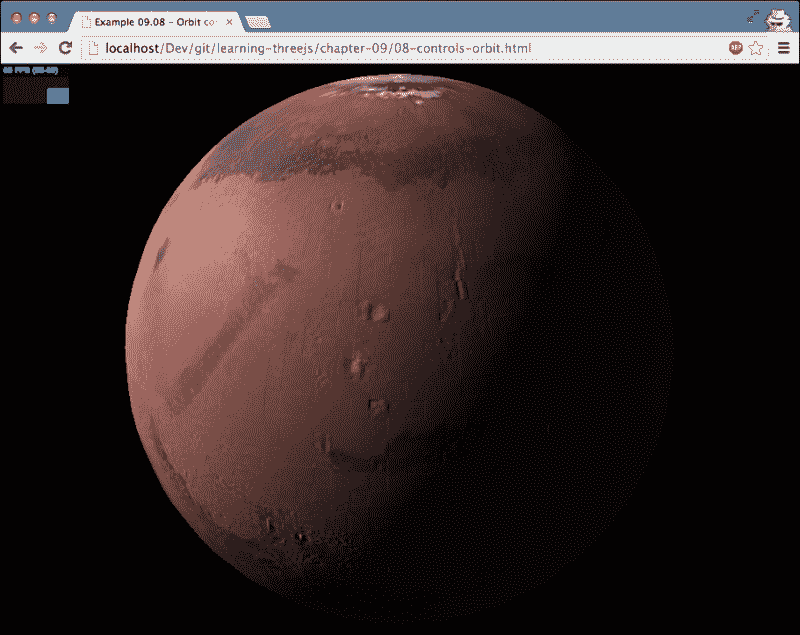

使用 `OrbitControl` 与使用其他控件一样简单。包含正确的 JavaScript 文件，使用相机设置控件，然后再次使用 `THREE.Clock` 更新控件：

```js
<script type="text/javascript" src="img/OrbitControls.js"></script>
...
var orbitControls = new THREE.OrbitControls(camera);
orbitControls.autoRotate = true;
var clock = new THREE.Clock();
...
var delta = clock.getDelta();
orbitControls.update(delta);
```

`THREE.OrbitControls` 的控件专注于使用鼠标，如下表所示：

| 控制 | 动作 |
| --- | --- |
| 左键点击 + 移动 | 围绕场景中心旋转相机 |
| 滚轮或中键点击 + 移动 | 放大和缩小 |
| 右键点击 + 移动 | 在场景周围平移 |
| 左、右、上、下箭头 | 在场景周围平移 |

关于相机及其移动就到这里。在本部分，我们看到了许多允许您创建有趣相机动作的控件。在下一节中，我们将探讨动画的更高级方式：变形和蒙皮。

# 变形和骨骼动画

当您在外部程序中创建动画（例如，Blender）时，您通常有两个主要选项来定义动画：

+   **变形目标**：使用变形目标，您定义一个变形版本，即关键位置，的网格。对于这个变形目标，所有顶点位置都被存储。要动画化形状，您只需将所有顶点从一个位置移动到另一个关键位置，并重复此过程。以下截图显示了用于显示面部表情的各种变形目标（以下图像由 Blender 基金会提供）：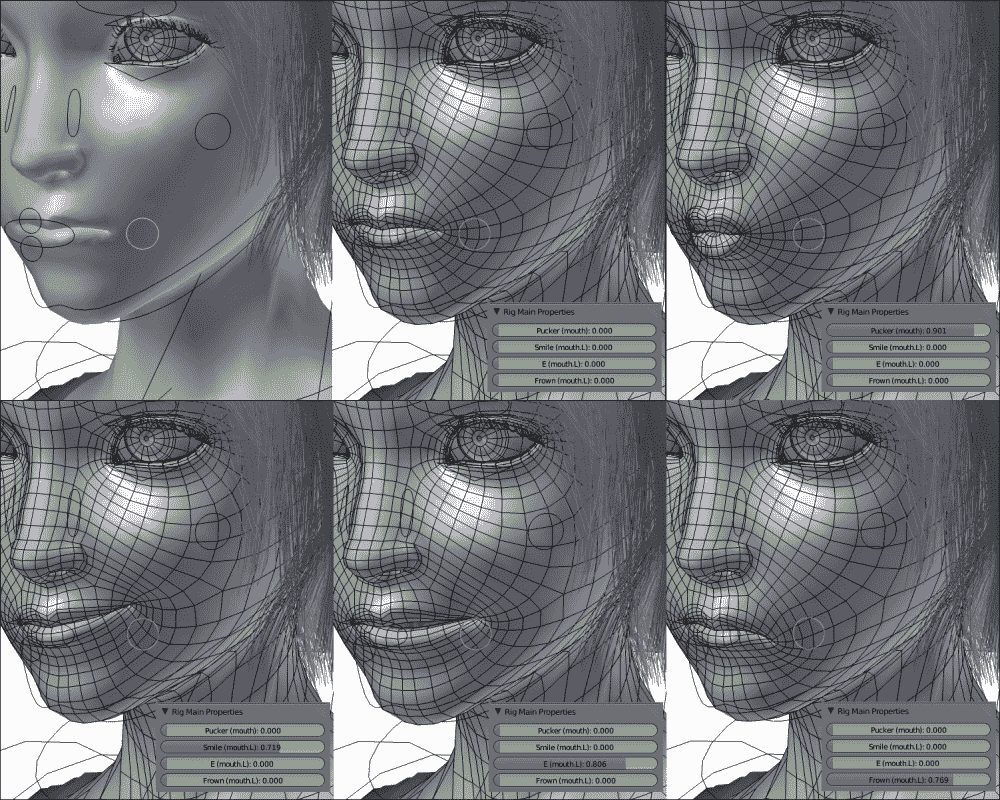

+   **骨骼动画**：另一种选择是使用骨骼动画。使用骨骼动画时，你定义网格的骨骼，即骨头，并将顶点附着到特定的骨头上。现在，当你移动一个骨头时，任何连接的骨头也会相应地移动，并且附着的顶点会根据骨头的位置、运动和缩放进行移动和变形。以下截图，再次由 Blender 基金会提供，展示了如何使用骨头来移动和变形一个对象的示例：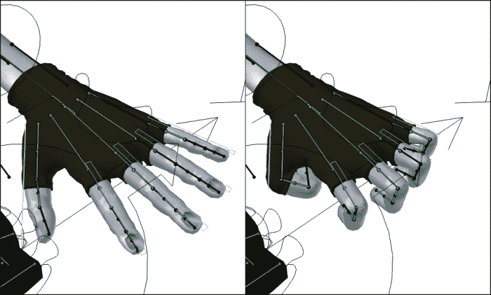

Three.js 支持这两种模式，但通常你可能会得到更好的结果使用形态目标。骨骼动画的主要问题是获得一个可以从 Blender 等 3D 程序中导出并在 Three.js 中动画化的良好模型。使用形态目标比使用骨头和皮肤更容易获得一个良好的工作模型。

在本节中，我们将探讨这两种选项，并额外探讨 Three.js 支持的一些外部格式，在这些格式中可以定义动画。

## 带有形态目标的动画

形态目标（Morph targets）是定义动画最直接的方法。你为每个重要的位置（也称为关键帧）定义所有顶点，并告诉 Three.js 将这些顶点从一个位置移动到另一个位置。然而，这种方法的一个缺点是，对于大型网格和大型动画，模型文件会变得非常大。原因是对于每个关键位置，所有的顶点位置都会被重复。

我们将通过两个示例向您展示如何使用形态目标。在第一个示例中，我们将让 Three.js 处理各种关键帧（或从现在起我们将称之为形态目标）之间的转换，而在第二个示例中，我们将手动进行此操作。

### MorphAnimMesh 的动画

对于我们的第一个变形示例，我们将使用一个也来自 Three.js 分发的模型——马。理解基于形态目标动画工作原理的最简单方法是通过打开`10-morph-targets.html`示例。以下截图显示了该示例的静态图像：

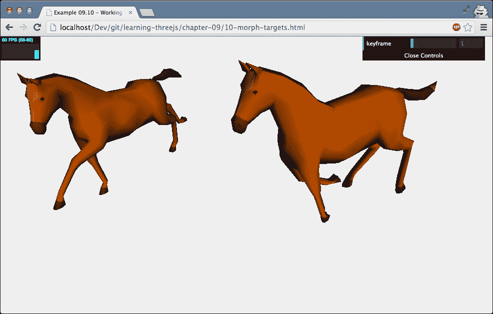

在这个例子中，右侧的马正在动画和奔跑，而左侧的马则静止不动。这第二匹马（左侧的马）是从基本模型渲染的，即原始的顶点集合。通过右上角的菜单，你可以浏览所有可用的形态目标，并看到左侧马可以采取的不同位置。

Three.js 提供了一种从当前位置移动到下一个位置的方法，但这意味着我们必须手动跟踪当前的位置和我们想要变形到的目标，一旦我们到达目标位置，就为其他位置重复此操作。幸运的是，Three.js 还提供了一个特定的网格，即 `THREE.MorphAnimMesh`，它会为我们处理这些细节。在我们继续之前，这里有一个关于 Three.js 提供的另一个与动画相关的网格的快速说明，即 `THREE.MorphBlendMesh`。如果您查看 Three.js 提供的对象，您可能会注意到这个对象。使用这个特定的网格，您可以做很多事情，就像您可以使用 `THREE.MorphAnimMesh` 一样，并且当您查看源代码时，您甚至可以看到这两个对象之间有很多重复。然而，`THREE.MorphBlendMesh` 似乎已被弃用，并且没有在官方 Three.js 示例中使用。您可以使用 `THREE.MorphAnimMesh` 做所有 `THREE.MorhpBlendMesh` 可以做的事情，因此请使用 `THREE.MorphAnimMesh` 来实现此类功能。以下代码片段显示了如何从模型中加载模型并创建 `THREE.MorphAnimMesh`：

```js
var loader = new THREE.JSONLoader();
loader.load('../assets/models/horse.js', function(geometry, mat) {

  var mat = new THREE.MeshLambertMaterial({ morphTargets: true, vertexColors: THREE.FaceColors});

  morphColorsToFaceColors(geometry);
  geometry.computeMorphNormals();
  meshAnim = new THREE.MorphAnimMesh(geometry, mat );
  scene.add(meshAnim);

},'../assets/models' );

function morphColorsToFaceColors(geometry) {

  if (geometry.morphColors && geometry.morphColors.length) {

    var colorMap = geometry.morphColors[ 0 ];
    for (var i = 0; i < colorMap.colors.length; i++) {
      geometry.faces[ i ].color = colorMap.colors[ i ];
      geometry.faces[ i ].color.offsetHSL(0, 0.3, 0);
    }
  }
}
```

这是我们加载其他模型时看到的方法。然而，这次外部模型还包含形态目标。我们不是创建一个普通的 `THREE.Mesh` 对象，而是创建 `THREE.MorphAnimMesh`。在加载动画时，您需要考虑以下几点：

+   确保您使用的材质已将 `THREE.morphTargets` 设置为 `true`。如果没有设置，您的网格将不会动画化。

+   在创建 `THREE.MorphAnimMesh` 之前，请确保对几何体调用 `computeMorphNormals`，以便计算所有形态目标的所有法向量。这对于正确的光照和阴影效果是必需的。

+   还可以为特定形态目标的表面定义颜色。这些颜色可以通过 `morphColors` 属性访问。您可以使用它来变形几何体的形状，以及单个面的颜色。使用 `morphColorsToFaceColors` 辅助方法，我们只需将面的颜色固定在 `morphColors` 数组中的第一组颜色上。

+   默认设置是一次性播放完整动画。如果有多个动画定义了相同的几何体，您可以使用 `parseAnimations()` 函数与 `playAnimation(name,fps)` 一起使用来播放定义的动画之一。我们将在本章的最后部分使用这种方法，其中我们将从 MD2 模型中加载动画。

剩下的工作是在渲染循环中更新动画。为此，我们再次使用 `THREE.Clock` 来计算 delta 并使用它来更新动画，如下所示：

```js
function render() {

  var delta = clock.getDelta();
  webGLRenderer.clear();
  if (meshAnim) {
    meshAnim.updateAnimation(delta *1000);
    meshAnim.rotation.y += 0.01;
  }

  // render using requestAnimationFrame
  requestAnimationFrame(render);
  webGLRenderer.render(scene, camera);
}
```

这种方法是最简单的，允许您快速从具有定义形态目标的模型中设置动画。另一种方法是手动设置动画，就像我们在下一节中展示的那样。

### 通过设置 morphTargetInfluence 属性创建动画

我们将创建一个非常简单的示例，其中我们将一个立方体从一个形状变形到另一个形状。这次，我们将手动控制要变形到的目标。您可以在 `11-morph-targets-manually.html` 中找到这个示例。以下截图显示了该示例的静态图像：

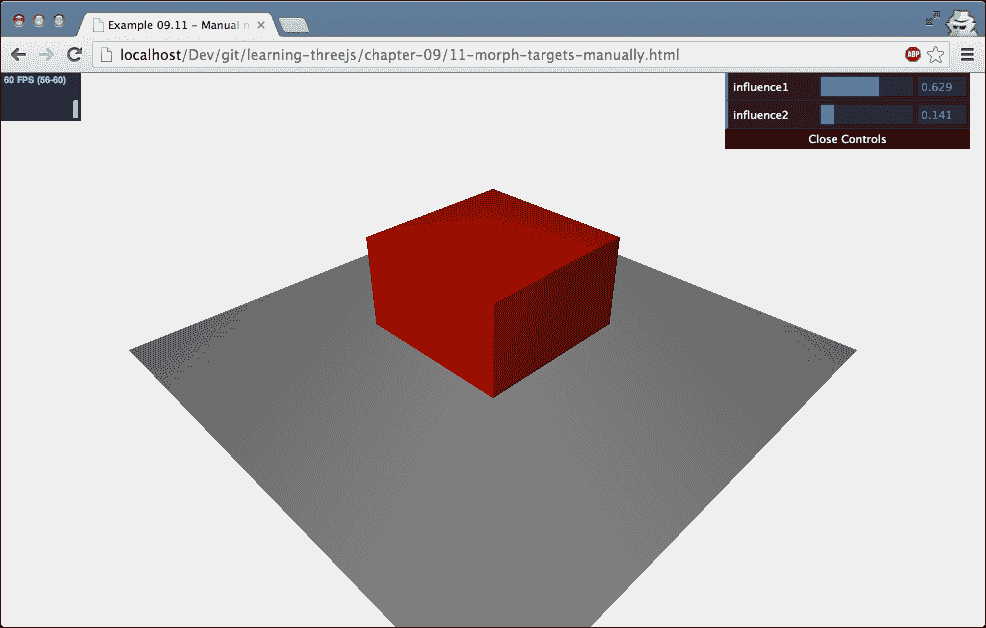

在这个例子中，我们为简单的立方体手动创建了两个形态目标，如下所示：

```js
// create a cube
var cubeGeometry = new THREE.BoxGeometry(4, 4, 4);
var cubeMaterial = new THREE.MeshLambertMaterial({morphTargets: true, color: 0xff0000});

// define morphtargets, we'll use the vertices from these geometries
var cubeTarget1 = new THREE.CubeGeometry(2, 10, 2);
var cubeTarget2 = new THREE.CubeGeometry(8, 2, 8);

// define morphtargets and compute the morphnormal
cubeGeometry.morphTargets[0] = {name: 'mt1', vertices: cubeTarget2.vertices};
cubeGeometry.morphTargets[1] = {name: 'mt2', vertices: cubeTarget1.vertices};
cubeGeometry.computeMorphNormals();

var cube = new THREE.Mesh(cubeGeometry, cubeMaterial);
```

当您打开这个示例时，您会看到一个简单的立方体。通过右上角的滑块，您可以设置 `morphTargetInfluences`。换句话说，您可以确定初始立方体应该变形到指定为 `mt1` 的立方体的程度，以及它应该变形到 `mt2` 的程度。当您手动创建形态目标时，您需要考虑形态目标具有与源几何体相同数量的顶点这一事实。您可以使用网格的 `morphTargetInfluences` 属性来设置影响：

```js
var controls = new function () {
  // set to 0.01 to make sure dat.gui shows correct output
  this.influence1 = 0.01;
  this.influence2 = 0.01;

  this.update = function () {
    cube.morphTargetInfluences[0] = controls.influence1;
    cube.morphTargetInfluences[1] = controls.influence2;
  };
}
```

注意，初始几何体可以同时受到多个形态目标的影响。这两个示例展示了形态目标动画背后的最重要的概念。在下一节中，我们将快速浏览使用骨骼和蒙皮技术的动画。

## 使用骨骼和蒙皮技术进行动画

形态动画非常直接。Three.js 知道所有的目标顶点位置，只需要将每个顶点从当前位置过渡到下一个位置。对于骨骼和蒙皮，这会变得稍微复杂一些。当您使用骨骼进行动画时，您移动骨骼，Three.js 必须确定如何相应地转换附着的皮肤（一组顶点）。对于这个例子，我们使用一个从 Blender 导出为 Three.js 格式的模型（`models` 文件夹中的 `hand-1.js`）。这是一个包含一组骨骼的手的模型。通过移动骨骼，我们可以动画化整个模型。让我们首先看看我们是如何加载模型的：

```js
var loader = new THREE.JSONLoader();
loader.load('../assets/models/hand-1.js', function (geometry, mat) {
  var mat = new THREE.MeshLambertMaterial({color: 0xF0C8C9, skinning: true});
  mesh = new THREE.SkinnedMesh(geometry, mat);

  // rotate the complete hand
  mesh.rotation.x = 0.5 * Math.PI;
  mesh.rotation.z = 0.7 * Math.PI;

  // add the mesh
  scene.add(mesh);

  // and start the animation
  tween.start();

}, '../assets/models');
```

加载用于骨骼动画的模型与其他模型没有太大区别。我们只需指定包含顶点、面和骨骼定义的模型文件，然后根据该几何体创建一个网格。Three.js 还为这种蒙皮几何体提供了一个特定的网格，称为 `THREE.SkinnedMesh`。要确保模型更新，您需要将您使用的材质的 `skinning` 属性设置为 `true`。如果您不将其设置为 `true`，您将看不到任何骨骼运动。我们在这里做的最后一件事是将所有骨骼的 `useQuaternion` 属性设置为 `false`。在这个例子中，我们将使用一个 `tween` 对象来处理动画。这个 `tween` 实例定义如下：

```js
var tween = new TWEEN.Tween({pos: -1}).to({pos: 0}, 3000).easing(TWEEN.Easing.Cubic.InOut).yoyo(true).repeat(Infinity).onUpdate(onUpdate);
```

使用这个缓动效果，我们将`pos`变量从`-1`过渡到`0`。我们还设置了`yoyo`属性为`true`，这会导致动画在下次运行时反向播放。为了确保动画持续运行，我们将`repeat`设置为`Infinity`。您还可以看到我们指定了一个`onUpdate`方法。此方法用于定位单个骨骼，我们将在下一节中探讨这一点。

在我们移动骨骼之前，让我们看看`12-bones-manually.html`的示例。下面的截图显示了该示例的静态图像：

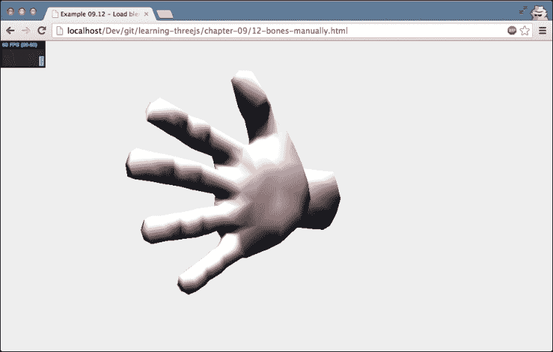

当您打开此示例时，您会看到手部做出抓取动作。我们通过在从我们的缓动动画中调用的`onUpdate`方法中设置手指骨骼的*z*旋转来实现这一点，如下所示：

```js
var onUpdate = function () {
  var pos = this.pos;

  // rotate the fingers
  mesh.skeleton.bones[5].rotation.set(0, 0, pos);
  mesh.skeleton.bones[6].rotation.set(0, 0, pos);
  mesh.skeleton.bones[10].rotation.set(0, 0, pos);
  mesh.skeleton.bones[11].rotation.set(0, 0, pos);
  mesh.skeleton.bones[15].rotation.set(0, 0, pos);
  mesh.skeleton.bones[16].rotation.set(0, 0, pos);
  mesh.skeleton.bones[20].rotation.set(0, 0, pos);
  mesh.skeleton.bones[21].rotation.set(0, 0, pos);

  // rotate the wrist
  mesh.skeleton.bones[1].rotation.set(pos, 0, 0);
};
```

每当调用此更新方法时，相关的骨骼都会设置为`pos`位置。为了确定您需要移动哪个骨骼，将`mesh.skeleton`属性打印到控制台是一个好主意。这将列出所有骨骼及其名称。

### 小贴士

Three.js 提供了一个简单的辅助工具，您可以使用它来显示模型的骨骼。将以下内容添加到代码中：

```js
helper = new THREE.SkeletonHelper( mesh );
helper.material.linewidth = 2;
helper.visible = false;
scene.add( helper );
```

骨骼被突出显示。您可以通过启用`12-bones-manually.html`示例中显示的`showHelper`属性来查看此示例。

如您所见，使用骨骼需要更多的工作，但比固定的形态目标更加灵活。在此示例中，我们只移动了骨骼的旋转；您也可以移动位置或更改缩放。在下一节中，我们将查看从外部模型加载动画。在那个部分，我们将重新审视此示例，但现在，我们将运行模型中的预定义动画，而不是手动移动骨骼。

# 使用外部模型创建动画

在第八章中，*创建和加载高级网格和几何体*，我们探讨了 Three.js 支持的一些 3D 格式。其中一些格式也支持动画。在本章中，我们将查看以下示例：

+   **Blender 与 JSON 导出器**：我们将从一个在 Blender 中创建并导出为 Three.js JSON 格式的动画开始。

+   **Collada 模型**：Collada 格式支持动画。对于此示例，我们将从 Collada 文件中加载一个动画，并使用 Three.js 进行渲染。

+   **MD2 模型**：MD2 模型是一种在较老的 Quake 引擎中使用的简单格式。尽管格式有些过时，但它仍然是一个用于存储角色动画的非常好的格式。

我们将从 Blender 模型开始。

## 使用 Blender 创建骨骼动画

要从 Blender 开始动画制作，您可以加载我们包含在模型文件夹中的示例。您可以在那里找到`hand.blend`文件，并将其加载到 Blender 中。下面的截图显示了该示例的静态图像：

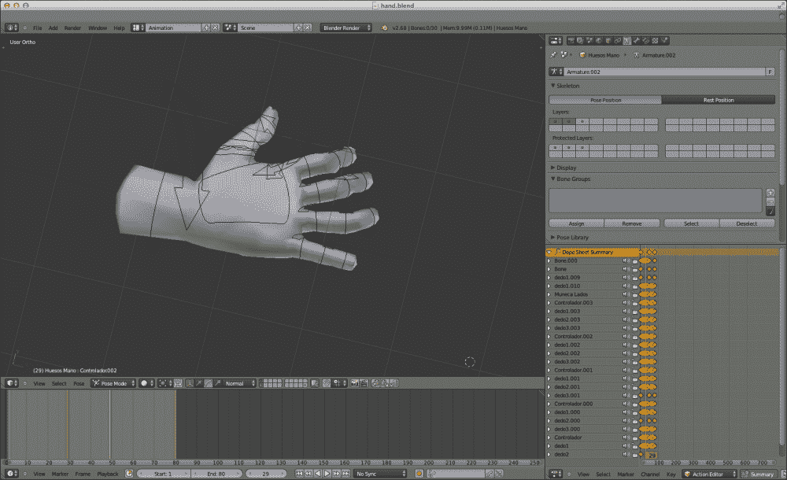

本书没有足够的空间详细介绍如何在 Blender 中创建动画，但有一些事情你需要记住：

+   你的模型中的每个顶点至少必须分配到一个顶点组。

+   你在 Blender 中使用的顶点组的名称必须与控制它的骨骼名称相匹配。这样，Three.js 就可以确定在移动骨骼时需要修改哪些顶点。

+   只导出第一个“动作”。所以请确保你想要导出的动画是第一个。

+   在创建关键帧时，即使它们没有变化，选择所有骨骼也是一个好主意。

+   在导出模型时，确保模型处于其原始姿势。如果不是这样，你会看到一个非常变形的动画。

关于在 Blender 中创建和导出动画以及上述提示的原因的更多信息，你可以查看以下优秀的资源：[`devmatrix.wordpress.com/2013/02/27/creating-skeletal-animation-in-blender-and-exporting-it-to-three-js/`](http://devmatrix.wordpress.com/2013/02/27/creating-skeletal-animation-in-blender-and-exporting-it-to-three-js/)。

当你在 Blender 中创建动画后，可以使用我们在上一章中使用过的 Three.js 导出器来导出文件。在导出文件时使用 Three.js 导出器，你必须确保以下属性被勾选：

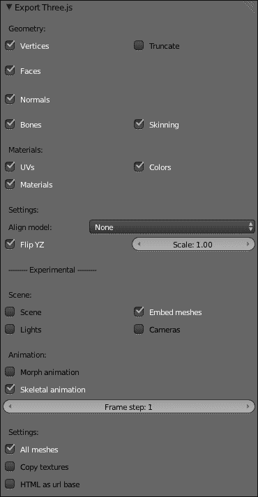

这将把你在 Blender 中指定的动画导出为骨骼动画而不是形变动画。在骨骼动画中，骨骼的运动被导出，我们可以在 Three.js 中回放。

在 Three.js 中加载模型与我们的上一个示例相同；然而，现在模型已加载，我们还将创建一个动画，如下所示：

```js
var loader = new THREE.JSONLoader();
loader.load('../assets/models/hand-2.js', function (model, mat) {

  var mat = new THREE.MeshLambertMaterial({color: 0xF0C8C9, skinning: true});
  mesh = new THREE.SkinnedMesh(model, mat);

  var animation = new THREE.Animation(mesh, model.animation);

  mesh.rotation.x = 0.5 * Math.PI;
  mesh.rotation.z = 0.7 * Math.PI;
  scene.add(mesh);

  // start the animation
  animation.play();

}, '../assets/models');
```

要运行此动画，我们只需创建一个 `THREE.Animation` 实例，并在此动画上调用 `play` 方法。在我们看到动画之前，我们还需要采取一个额外的步骤。在我们的渲染循环中，我们调用 `THREE.AnimationHandler.update(clock.getDelta())` 函数来更新动画，Three.js 将使用骨骼将模型设置在正确的位置。此示例的结果（`13-animation-from-blender.html`）是一个简单的挥手动作。

以下截图显示了此示例的静态图像：

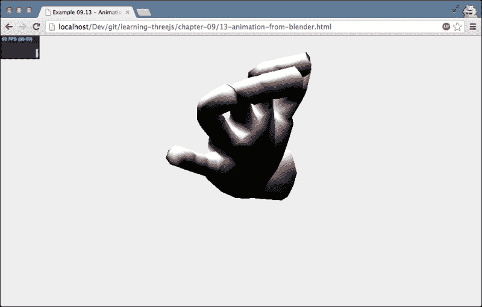

除了 Three.js 自身的格式外，我们还可以使用几种其他格式来定义动画。我们将首先查看的是加载 Collada 模型。

## 从 Collada 模型加载动画

从 Collada 文件加载模型的方式与其他格式相同。首先，你必须包含正确的加载器 JavaScript 文件：

```js
<script type="text/javascript" src="img/ColladaLoader.js"></script>
```

接下来，我们创建一个加载器，并使用它来加载模型文件：

```js
var loader = new THREE.ColladaLoader();
loader.load('../assets/models/monster.dae', function (collada) {

  var child = collada.skins[0];
  scene.add(child);

  var animation = new THREE.Animation(child, child.geometry.animation);
  animation.play();

  // position the mesh
  child.scale.set(0.15, 0.15, 0.15);
  child.rotation.x = -0.5 * Math.PI;
  child.position.x = -100;
  child.position.y = -60;
});
```

Collada 文件可以包含比单个模式多得多的内容；它可以存储完整的场景，包括摄像机、灯光、动画等。与 Collada 模型一起工作的好方法是打印出`loader.load`函数的结果到控制台，并确定您想要使用哪些组件。在这种情况下，场景中有一个单独的`THREE.SkinnedMesh`（子节点）。要渲染和动画化这个模型，我们只需像处理基于 Blender 的模型一样设置动画；甚至渲染循环也保持不变。以下是渲染和动画化模型的步骤：

```js
function render() {
  ...
  meshAnim.updateAnimation( delta *1000 );
  ...
}
```

对于这个特定的 Collada 文件，结果如下所示：

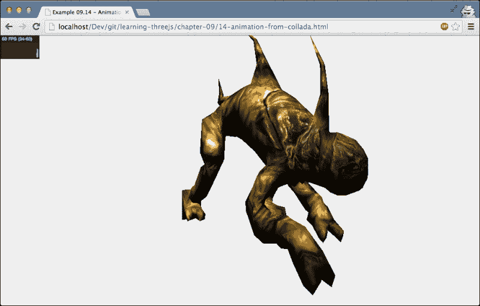

另一个使用形态目标的外部模型示例是 MD2 文件格式。

## 从 Quake 模型加载的动画

MD2 格式是为了模拟 1996 年伟大的游戏《Quake》中的角色而创建的。尽管较新的引擎使用不同的格式，但您仍然可以在 MD2 格式中找到许多有趣的模型。要使用这种格式的文件，我们首先必须将它们转换为 Three.js JavaScript 格式。您可以使用以下网站在线完成此操作：

[`oos.moxiecode.com/js_webgl/md2_converter/`](http://oos.moxiecode.com/js_webgl/md2_converter/)

转换后，您将得到一个 Three.js 格式的 JavaScript 文件，您可以使用`MorphAnimMesh`加载和渲染它。由于我们已经在前面的部分中看到了如何做到这一点，我们将跳过加载模型的代码。不过，代码中有一个有趣的现象。我们不是播放完整的动画，而是提供需要播放的动画名称：

```js
mesh.playAnimation('crattack', 10);
```

原因是 MD2 文件通常包含多个不同的角色动画。幸运的是，Three.js 提供了使用`playAnimation`函数确定可用动画并播放它们的功能。我们首先需要做的是告诉 Three.js 解析动画：

```js
mesh.parseAnimations();
```

这将生成一个可以使用`playAnimation`函数播放的动画名称列表。在我们的示例中，您可以从右上角的菜单中选择动画名称。可用的动画是这样确定的：

```js
mesh.parseAnimations();

var animLabels = [];
for (var key in mesh.geometry.animations) {
  if (key === 'length' || !mesh.geometry.animations.hasOwnProperty(key)) continue;
  animLabels.push(key);
}

gui.add(controls,'animations',animLabels).onChange(function(e) {
  mesh.playAnimation(controls.animations,controls.fps);
});
```

每当从菜单中选择一个动画时，都会调用`mesh.playAnimation`函数，并传入指定的动画名称。演示这个功能的示例可以在`15-animation-from-md2.html`中找到。以下截图展示了这个示例的静态图像：

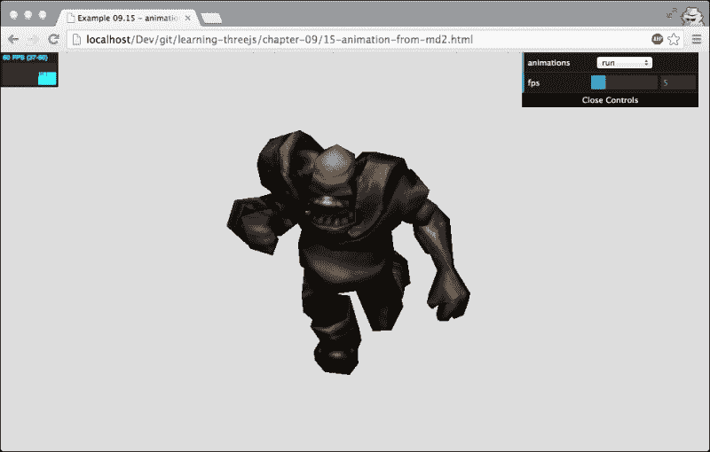

# 摘要

在本章中，我们探讨了你可以用来动画化你的场景的不同方法。我们从一些基本的动画技巧开始，接着转向相机运动和控制，最后讨论了使用变形目标和解剖/骨骼动画的动画模型。当你设置了渲染循环后，添加动画变得非常简单。只需更改网格的一个属性，在下一个渲染步骤中，Three.js 就会渲染更新后的网格。

在前面的章节中，我们探讨了你可以用来为你的对象添加外观的各种材料。例如，我们看到了如何改变这些材料的颜色、光泽度和透明度。然而，我们尚未详细讨论如何将这些外部图像（也称为纹理）与这些材料结合使用。有了纹理，你可以轻松地创建出由木材、金属、石头等材料制成的对象。在下一章中，我们将探讨纹理的所有不同方面以及它们在 Three.js 中的使用方法。
