# 第十章。加载和使用纹理

在第四章中，*使用 Three.js 材质*，我们向您介绍了 Three.js 中可用的各种材质。然而，在第四章中，我们没有讨论将纹理应用于网格。在本章中，我们将探讨这个主题。更具体地说，在本章中，我们将讨论以下主题：

+   在 Three.js 中加载纹理并将其应用于网格

+   使用凹凸图和法线图将深度和细节应用于网格

+   使用光照图创建假阴影

+   使用环境图向材质添加详细反射

+   使用高光图设置网格特定部分的光泽度

+   微调和自定义网格的 UV 贴图

+   使用 HTML5 画布和视频元素作为纹理的输入

让我们从最基本示例开始，向您展示如何加载并应用纹理。

# 在材质中使用纹理

在 Three.js 中有不同的纹理使用方式。您可以使用它们来定义网格的颜色，但您也可以使用它们来定义光泽度、凹凸和反射。然而，我们首先查看的示例是最基本的方法，其中我们使用纹理来定义网格单个像素的颜色。

## 加载纹理并将其应用于网格

纹理的最基本用法是将其设置为材质上的映射。当您使用此材质创建网格时，网格将根据提供的纹理进行着色。

加载纹理并在网格上使用的方法如下：

```js
function createMesh(geom, imageFile) {
  var texture = THREE.ImageUtils.loadTexture("../assets/textures/general/" + imageFile)

  var mat = new THREE.MeshPhongMaterial();
  mat.map = texture;

  var mesh = new THREE.Mesh(geom, mat);
  return mesh;
}
```

在此代码示例中，我们使用`THREE.ImageUtils.loadTexture`函数从特定位置加载图像文件。您可以使用 PNG、GIF 或 JPEG 图像作为纹理的输入。请注意，加载纹理是异步进行的。在我们的场景中，这不是问题，因为我们有一个每秒渲染场景约 60 次的`render`循环。如果您想等待纹理加载完成，可以使用以下方法：

```js
texture = THREE.ImageUtils.loadTexture('texture.png', {}, function() { renderer.render(scene); });
```

在此示例中，我们向`loadTexture`提供了一个回调函数。当纹理加载时，会调用此回调函数。在我们的示例中，我们不使用回调，而是依赖于`render`循环在纹理加载后最终显示纹理。

您几乎可以使用任何图像作为纹理。然而，最佳结果是在使用边长为 2 的幂的方形纹理时获得。因此，如 256 x 256、512 x 512、1024 x 1024 等尺寸效果最佳。以下图像是一个方形纹理的示例：

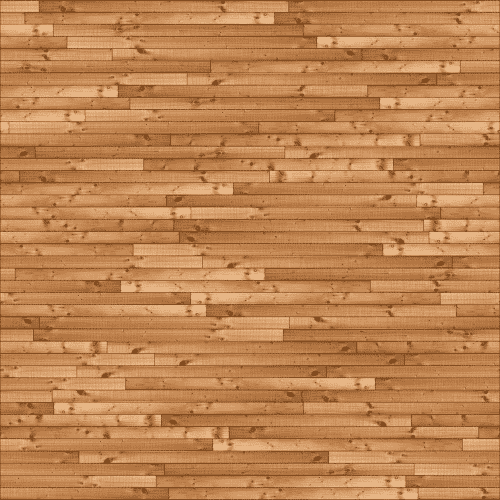

由于纹理的像素（也称为**纹理像素**）通常不会一对一地映射到面的像素上，因此需要放大或缩小纹理。为此目的，WebGL 和 Three.js 提供了一些不同的选项。你可以通过设置`magFilter`属性来指定纹理的放大方式，以及通过设置`minFilter`属性来指定缩小方式。这些属性可以设置为以下两个基本值：

| 名称 | 描述 |
| --- | --- |
| `THREE.NearestFilter` | 此过滤器使用它能够找到的最近的纹理像素的颜色。当用于放大时，这将导致块状效果，当用于缩小，结果将丢失很多细节。 |
| `THREE.LinearFilter` | 此过滤器更高级，使用四个相邻的纹理像素的颜色值来确定正确的颜色。在缩小操作中，你仍然会丢失很多细节，但放大将会更加平滑且不那么块状。 |

除了这些基本值之外，我们还可以使用米普图。**米普图**是一组纹理图像，每个图像的大小是前一个图像的一半。这些图像在加载纹理时创建，允许进行更平滑的过滤。因此，当你有一个平方纹理（作为 2 的幂）时，你可以使用一些额外的策略来获得更好的过滤效果。可以使用以下值设置属性：

| 名称 | 描述 |
| --- | --- |
| `THREE.NearestMipMapNearestFilter` | 此属性选择最佳的米普图以映射所需的分辨率，并应用我们在前表中讨论的最近邻过滤原则。放大仍然会有块状效果，但缩小看起来要好得多。 |
| `THREE.NearestMipMapLinearFilter` | 此属性选择不仅仅是单个米普图，而是两个最近的米普图级别。在这两个级别上，都应用最近邻过滤器以获得两个中间结果。这两个结果通过线性过滤器传递以获得最终结果。 |
| `THREE.LinearMipMapNearestFilter` | 此属性选择最佳的米普图以映射所需的分辨率，并应用我们在前表中讨论的线性过滤原则。 |
| `THREE.LinearMipMapLinearFilter` | 此属性选择不仅仅是单个米普图，而是两个最近的米普图级别。在这两个级别上，都应用线性过滤器以获得两个中间结果。这两个结果通过线性过滤器传递以获得最终结果。 |

如果你没有明确指定`magFilter`和`minFilter`属性，Three.js 将使用`THREE.LinearFilter`作为`magFilter`属性的默认值，并将`THREE.LinearMipMapLinearFilter`作为`minFilter`属性的默认值。在我们的示例中，我们将只使用这些默认属性。基本纹理的示例可以在`01-basic-texture.html`中找到。以下截图显示了此示例：

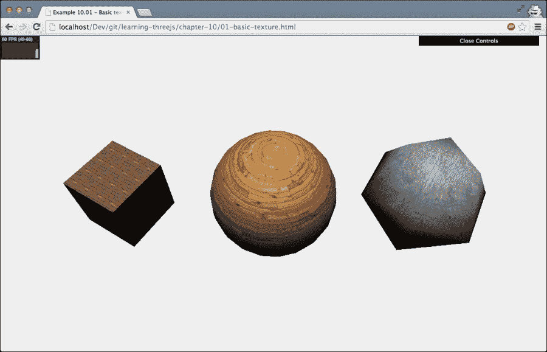

在这个例子中，我们加载了一些纹理（使用你之前看到的代码）并将它们应用到各种形状上。在这个例子中，你可以看到纹理很好地包裹在形状周围。当你使用 Three.js 创建几何体时，它会确保使用的任何纹理都得到正确应用。这是通过一种称为**UV 贴图**（本章后面会详细介绍）的方法实现的。通过 UV 贴图，我们告诉渲染器纹理的哪一部分应该应用到特定的面上。这个例子中最简单的是立方体。其中一个面的 UV 贴图看起来像这样：

```js
(0,1),(0,0),(1,0),(1,1)
```

这意味着我们使用整个纹理（UV 值从 0 到 1）来应用这个面。

除了我们可以使用`THREE.ImageUtils.loadTexture`加载的标准图像格式外，Three.js 还提供了一些自定义加载器，你可以使用这些加载器来加载不同格式的纹理。以下表格显示了你可以使用的附加加载器：

| 名称 | 描述 |
| --- | --- |

| `THREE.DDSLoader` | 使用这个加载器，你可以加载以 DirectDraw Surface 格式提供的纹理。这种格式是微软专有的格式，用于存储压缩纹理。使用这个加载器非常简单。首先，在 HTML 页面中包含`DDSLoader.js`文件，然后使用以下代码来使用纹理：

```js
var loader = new THREE.DDSLoader();
var texture = loader.load( '../assets/textures/  seafloor.dds' );

var mat = new THREE.MeshPhongMaterial();
mat.map = texture;
```

你可以在本章源代码中的`01-basic-texture-dds.html`找到一个此加载器的示例。内部，这个加载器使用了`THREE.CompressedTextureLoader`。|

| `THREE.PVRLoader` | Power VR 是另一种专有文件格式，用于存储压缩纹理。Three.js 支持 Power VR 3.0 文件格式，并可以使用这种格式提供的纹理。要使用此加载器，请在 HTML 页面中包含`PVRLoader.js`文件，然后使用以下代码来使用纹理：

```js
var loader = new THREE.DDSLoader();
var texture = loader.load( '../assets/textures/ seafloor.dds' );

var mat = new THREE.MeshPhongMaterial();
mat.map = texture;
```

你可以在本章源代码中找到一个此加载器的示例：`01-basic-texture-pvr.html`。请注意，并非所有 WebGL 实现都支持这种格式的纹理。所以当你使用它而没有看到纹理时，请检查控制台是否有错误。内部，这个加载器也使用了`THREE.CompressedTextureLoader`。|

| `THREE.TGALoader` | Targa 是一种仍然被大量 3D 软件程序使用的位图图形文件格式。使用`THREE.TGALoader`对象，你可以使用这种格式提供的纹理与你的 3D 模型一起使用。要使用这些图像文件，你首先需要在 HTML 中包含`TGALoader.js`文件，然后你可以使用以下代码来加载 TGA 纹理：

```js
var loader = new THREE.TGALoader();
var texture = loader.load( '../assets/textures/crate_color8.tga' );

var mat = new THREE.MeshPhongMaterial();
mat.map = texture;
```

本章源代码中提供了一个此加载器的示例。你可以在浏览器中打开`01-basic-texture-tga.html`来查看此示例。|

在这些示例中，我们使用了纹理来定义网格像素的颜色。我们也可以使用纹理来达到其他目的。以下两个示例用于定义如何将着色应用到材质上。你可以使用这个来在网格表面创建凹凸和皱纹。

## 使用凹凸贴图创建皱纹

**凹凸贴图**用于为材质添加更多深度。您可以通过打开`02-bump-map.html`示例来查看其效果。参考以下截图以查看示例：

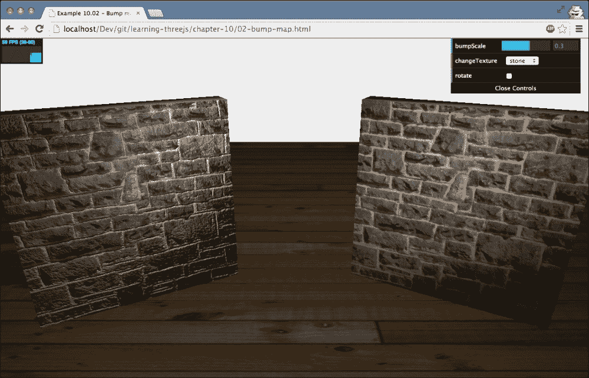

在此示例中，您可以看到，与右侧的墙面相比，左侧的墙面看起来更加详细，似乎具有更多的深度。这是通过在材质上设置一个额外的纹理，即所谓的凹凸贴图来实现的：

```js
function createMesh(geom, imageFile, bump) {
  var texture = THREE.ImageUtils.loadTexture("../assets/textures/general/" + imageFile)
  var mat = new THREE.MeshPhongMaterial();
  mat.map = texture;

  var bump = THREE.ImageUtils.loadTexture(
    "../assets/textures/general/" + bump)
  mat.bumpMap = bump;
  mat.bumpScale = 0.2;

  var mesh = new THREE.Mesh(geom, mat);
  return mesh;
}
```

在此代码中，除了设置`map`属性外，我们还设置了`bumpMap`属性为一个纹理。此外，通过`bumpScale`属性，我们可以设置凹凸的高度（或设置为负值时的深度）。此示例中使用的纹理如下所示：

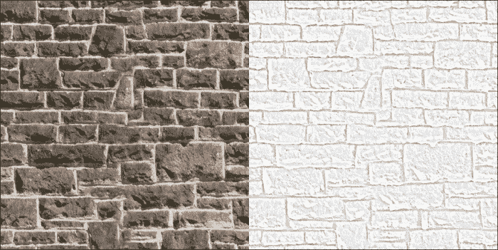

凹凸贴图是灰度图像，但您也可以使用彩色图像。像素的强度定义了凹凸的高度。凹凸贴图只包含像素的相对高度。它不涉及斜坡的方向。因此，您可以通过凹凸贴图达到的细节水平和深度感知是有限的。对于更多细节，您可以使用法线贴图。

## 使用法线贴图实现更详细的凹凸和皱纹

在法线贴图中，不存储高度（位移），但存储每个图片的法线方向。不深入细节，使用法线贴图，您可以创建看起来非常详细的模型，同时仍然只使用少量顶点和面。例如，查看`03-normal-map.html`示例。以下截图描述了此示例：

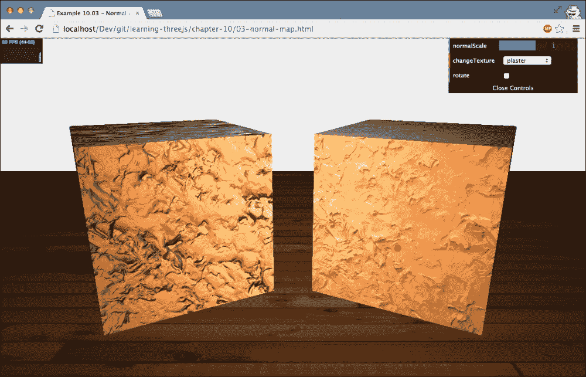

在此截图中，您可以看到左侧一个非常详细的抹灰立方体。光源在立方体周围移动，您可以看到纹理自然地响应光源。这提供了一个非常逼真的模型，并且只需要一个非常简单的模型和一些纹理。以下代码片段显示了如何在 Three.js 中使用法线贴图：

```js
function createMesh(geom, imageFile, normal) {
  var t = THREE.ImageUtils.loadTexture("../assets/textures/general/" + imageFile);
  var m = THREE.ImageUtils.loadTexture("../assets/textures/general/" + normal);

  var mat2 = new THREE.MeshPhongMaterial();
  mat2.map = t;
  mat2.normalMap = m;

  var mesh = new THREE.Mesh(geom, mat2);
  return mesh;
}
```

这里使用的方法与凹凸贴图相同。不过，这次我们将`normalMap`属性设置为法线纹理。我们还可以通过设置`normalScale`属性`mat.normalScale.set(1,1)`来定义凹凸的明显程度。使用这两个属性，您可以在*x*和*y*轴上缩放。然而，最好的方法是将这些值保持相同以获得最佳效果。请注意，一旦这些值低于零，高度将反转。以下截图显示了纹理（左侧）和法线贴图（右侧）：

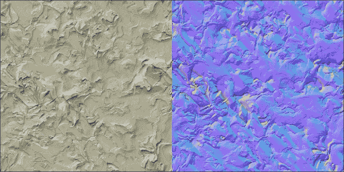

然而，正常贴图的问题在于它们并不容易创建。你需要使用专门的工具，如 Blender 或 Photoshop。它们可以使用高分辨率的渲染或纹理作为输入，并从中创建正常贴图。

Three.js 还提供了一种在运行时执行此操作的方法。`THREE.ImageUtils`对象有一个名为`getNormalMap`的函数，它接受一个 JavaScript/DOM `Image`作为输入，并将其转换为正常贴图。

## 使用光照贴图创建假阴影

在前面的例子中，我们使用了特定的地图来创建看起来真实的阴影，这些阴影会根据房间内的光照做出反应。有一种替代方案可以创建假阴影。在本节中，我们将使用光照贴图。**光照贴图**是一个预先渲染的阴影（也称为预烘焙阴影），你可以用它来创建真实阴影的错觉。以下截图，来自`04-light-map.html`示例，展示了它的样子：

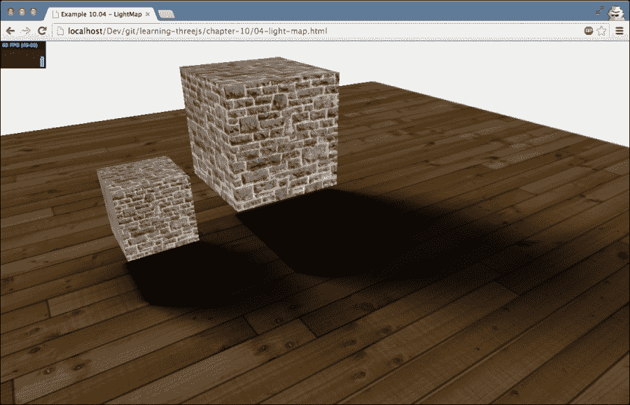

如果你查看前面的例子，它展示了几个非常漂亮的阴影，看起来像是两个立方体投射出来的。然而，这些阴影是基于以下类似的光照贴图纹理：

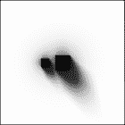

如你所见，光照贴图中指定的阴影也显示在地面平面上，从而营造出真实阴影的错觉。你可以使用这种技术来创建高分辨率的阴影，而不会产生沉重的渲染惩罚。当然，这仅适用于静态场景。使用光照贴图几乎与使用其他纹理一样，只是有几个小的不同。这是我们使用光照贴图的方法：

```js
var lm = THREE.ImageUtils.loadTexture('../assets/textures/lightmap/lm-1.png');
var wood = THREE.ImageUtils.loadTexture('../assets/textures/general/floor-wood.jpg');
var groundMaterial = new THREE.MeshBasicMaterial({lightMap: lm, map: wood});
groundGeom.faceVertexUvs[1] = groundGeom.faceVertexUvs[0];
```

要应用光照贴图，我们只需将材质的`lightMap`属性设置为刚才展示的光照贴图。然而，为了使光照贴图显示出来，还需要进行一个额外的步骤。我们需要明确定义光照贴图的 UV 贴图（纹理的哪一部分显示在表面上）。这样做是为了可以独立于其他纹理应用和映射光照贴图。在我们的例子中，我们只是使用了 Three.js 在创建地面平面时自动创建的基本 UV 贴图。更多信息和为什么需要显式 UV 贴图的背景信息可以在[`stackoverflow.com/questions/15137695/three-js-lightmap-causes-an-error-webglrenderingcontext-gl-error-gl-invalid-op`](http://stackoverflow.com/questions/15137695/three-js-lightmap-causes-an-error-webglrenderingcontext-gl-error-gl-invalid-op)找到。

当阴影贴图放置正确时，我们需要将立方体放置在正确的位置，这样看起来就像阴影是由它们投射出来的。

Three.js 还提供了另一种纹理，你可以用它来模拟高级 3D 效果。在下一节中，我们将探讨使用环境贴图来创建假反射。

## 使用环境贴图创建假反射

计算环境反射非常占用 CPU 资源，通常需要使用光线追踪方法。如果你想在 Three.js 中使用反射，你仍然可以这样做，但你必须伪造它。你可以通过创建对象所在环境的纹理并将其应用到特定对象上来实现这一点。首先，我们将向您展示我们想要达到的结果（请参阅`05-env-map-static.html`，它也在下面的屏幕截图中显示）：

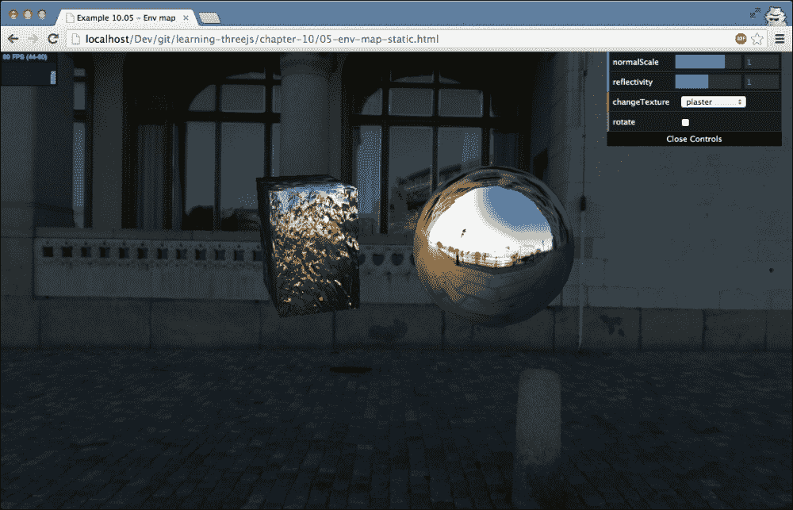

在这个屏幕截图中，你可以看到球体和立方体反射了环境。如果你移动鼠标，你还可以看到反射与你在城市环境中看到的相机角度相对应。为了创建这个示例，我们执行以下步骤：

1.  **创建一个 CubeMap 对象**：我们需要做的第一件事是创建一个`CubeMap`对象。`CubeMap`是一组可以应用到立方体每个面的六个纹理。

1.  **使用这个 CubeMap 对象创建一个盒子**：带有`CubeMap`的盒子是你移动相机时看到的环境。它给人一种你站在一个可以四处张望的环境中的错觉。实际上，你在一个立方体内部，立方体的内部渲染了纹理，以产生空间的错觉。

1.  **将 CubeMap 对象作为纹理应用**：我们用来模拟环境的同一个`CubeMap`对象也可以用作网格的纹理。Three.js 会确保它看起来像是环境的反射。

创建`CubeMap`一旦你有了源材料就相当简单。你需要的是六张图片，这些图片组合起来可以构成一个完整的环境。因此，你需要以下这些图片：向前看（`posz`）、向后看（`negz`）、向上看（`posy`）、向下看（`negy`）、向右看（`posx`）和向左看（`negx`）。Three.js 会将这些图片拼接起来，创建一个无缝的环境贴图。有几个网站可以下载这些图片。本例中使用的图片来自[`www.humus.name/index.php?page=Textures`](http://www.humus.name/index.php?page=Textures)。

一旦你有了六张单独的图片，你可以按照以下代码片段加载它们：

```js
function createCubeMap() {

  var path = "../assets/textures/cubemap/parliament/";
  var format = '.jpg';
  var urls = [
    path + 'posx' + format, path + 'negx' + format,
    path + 'posy' + format, path + 'negy' + format,
    path + 'posz' + format, path + 'negz' + format
  ];

  var textureCube = THREE.ImageUtils.loadTextureCube( urls );
  return textureCube;
}
```

我们再次使用`THREE.ImageUtils` JavaScript 对象，但这次我们传递一个纹理数组，并使用`loadTextureCube`函数创建`CubeMap`对象。如果你已经有一个 360 度的全景图像，你也可以将其转换为可以用来创建`CubeMap`的一组图片。只需访问[`gonchar.me/panorama/`](http://gonchar.me/panorama/)将图像转换为，你最终会得到六个名为`right.png`、`left.png`、`top.png`、`bottom.png`、`front.png`和`back.png`的图片。你可以通过创建`urls`变量来使用这些图片，如下所示：

```js
var urls = [
  'right.png',
  'left.png',
  'top.png',
  'bottom.png',
  'front.png',
  'back.png'
];
```

或者，你还可以在加载场景时让 Three.js 处理转换，通过创建`textureCube`如下所示：

```js
var textureCube = THREE.ImageUtils.loadTexture("360-degrees.png", new THREE.UVMapping());
```

使用`CubeMap`，我们首先创建一个盒子，可以创建如下：

```js
var textureCube = createCubeMap();
var shader = THREE.ShaderLib[ "cube" ];
shader.uniforms[ "tCube" ].value = textureCube;
var material = new THREE.ShaderMaterial( {
  fragmentShader: shader.fragmentShader,
  vertexShader: shader.vertexShader,
  uniforms: shader.uniforms,
  depthWrite: false,
  side: THREE.BackSide
});
cubeMesh = new THREE.Mesh(new THREE.BoxGeometry(100, 100, 100), material);
```

Three.js 提供了一个特定的着色器，我们可以使用`THREE.ShaderMaterial`与之结合来创建基于`CubeMap`的环境（`var shader = THREE.ShaderLib[ "cube" ];`）。我们使用`CubeMap`配置这个着色器，创建一个网格，并将其添加到场景中。从内部看，这个网格代表了我们站立的假环境。

这个相同的`CubeMap`对象应该应用于我们想要渲染的网格以创建假反射：

```js
var sphere1 = createMesh(new THREE.SphereGeometry(10, 15, 15), "plaster.jpg");
sphere1.material.envMap = textureCube;
sphere1.rotation.y = -0.5;
sphere1.position.x = 12;
sphere1.position.y = 5;
scene.add(sphere1);

var cube = createMesh(new THREE.CubeGeometry(10, 15, 15), "plaster.jpg","plaster-normal.jpg");
sphere2.material.envMap = textureCube;
sphere2.rotation.y = 0.5;
sphere2.position.x = -12;
sphere2.position.y = 5;
scene.add(cube);
```

如你所见，我们将材质的`envMap`属性设置为之前创建的`cubeMap`对象。结果是，场景看起来就像我们站在一个宽敞的户外环境中，网格反射了这一环境。如果你使用滑块，你可以设置材质的`reflectivity`属性，正如其名，这决定了材质反射环境程度的大小。

除了反射之外，Three.js 还允许你使用`CubeMap`对象来实现折射（类似玻璃的物体）。以下截图展示了这一点：

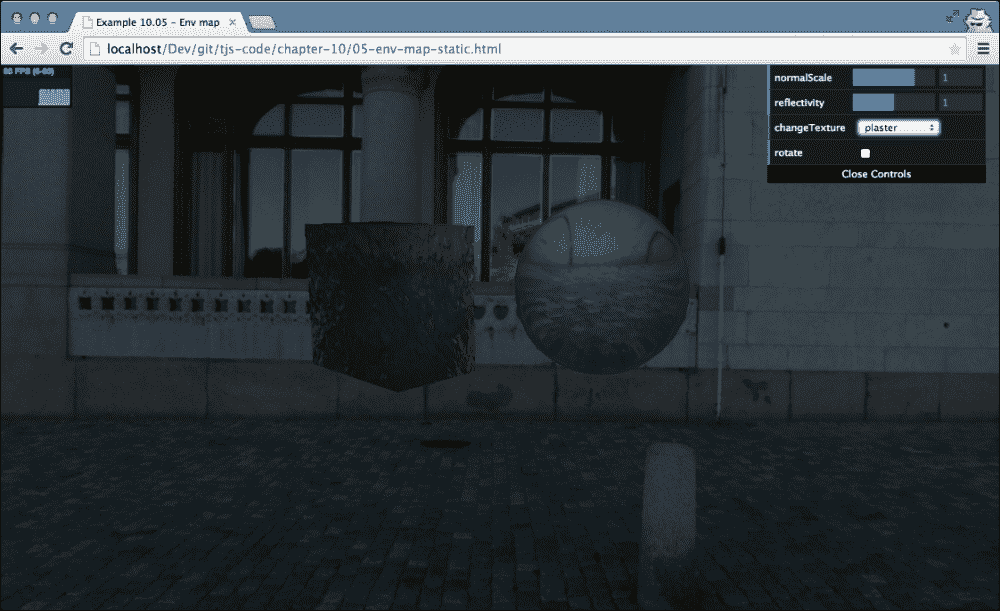

要实现这种效果，我们只需要更改纹理的加载方式为以下内容：

```js
var textureCube = THREE.ImageUtils.loadTextureCube( urls, new THREE.CubeRefractionMapping());
```

你可以通过材质上的`refraction`属性来控制折射率，就像使用`reflection`属性一样。在这个例子中，我们为网格使用了静态的环境贴图。换句话说，我们只看到了这个环境中的环境反射，而没有看到其他网格。在以下截图（你可以在浏览器中打开`05-env-map-dynamic.html`来查看其效果）中，我们将向你展示如何创建一个同时显示场景中其他物体的反射：

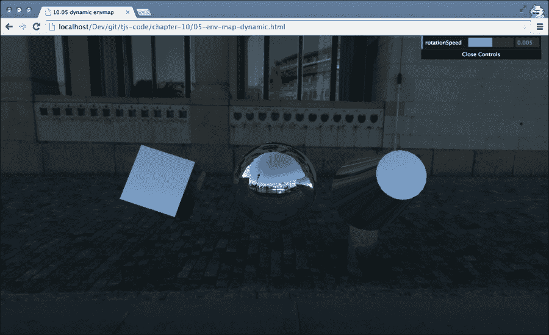

要显示场景中其他物体的反射，我们需要使用一些其他的 Three.js 组件。我们首先需要的是一个额外的相机，称为`THREE.CubeCamera`：

```js
Var cubeCamera = new THREE.CubeCamera(0.1, 20000, 256);
scene.add(cubeCamera);
```

我们将使用`THREE.CubeCamera`来捕捉渲染了所有物体的场景快照，并使用它来设置`CubeMap`。你需要确保将这个相机放置在你想要显示动态反射的`THREE.Mesh`的确切位置。对于这个例子，我们只会在中心球体上显示反射（如前一个截图所示）。这个球体位于位置 0, 0, 0，因此在这个例子中，我们不需要显式地定位`THREE.CubeCamera`。

我们只将动态反射应用于球体，因此我们需要两种不同的材质：

```js
var dynamicEnvMaterial = new THREE.MeshBasicMaterial({envMap: cubeCamera.renderTarget });
var envMaterial = new THREE.MeshBasicMaterial({envMap: textureCube });
```

与我们之前的例子相比，主要区别在于，对于动态反射，我们将`envMap`属性设置为`cubeCamera.renderTarget`而不是我们之前创建的`textureCube`。对于这个例子，我们在中心球体上使用`dynamicEnvMaterial`，在其他两个物体上使用`envMaterial`：

```js
sphere = new THREE.Mesh(sphereGeometry, dynamicEnvMaterial);
sphere.name = 'sphere';
scene.add(sphere);

var cylinder = new THREE.Mesh(cylinderGeometry, envMaterial);
cylinder.name = 'cylinder';
scene.add(cylinder);
cylinder.position.set(10, 0, 0);

var cube = new THREE.Mesh(boxGeometry, envMaterial);
cube.name = 'cube';
scene.add(cube);
cube.position.set(-10, 0, 0);
```

剩下的工作就是确保`cubeCamera`渲染场景，这样我们就可以将其输出作为中心球体的输入。为此，我们像这样更新`render`循环：

```js
function render() {
  sphere.visible = false;
  cubeCamera.updateCubeMap( renderer, scene );
  sphere.visible = true;
  renderer.render(scene, camera);
  ...
  requestAnimationFrame(render);
}
```

如你所见，我们首先禁用了`sphere`的可见性。我们这样做是因为我们只想看到其他两个对象的反射。接下来，我们通过调用`updateCubeMap`函数使用`cubeCamera`渲染场景。然后，我们再次使`sphere`可见，并正常渲染场景。结果是，在球体的反射中，你可以看到立方体和圆柱体的反射。

我们将要探讨的最后一种基本材质是反射图。

## 反射图

使用**反射图**，你可以指定一个定义材料光泽度和高光颜色的图。例如，在下面的屏幕截图中，我们使用了一个反射图和一个法线图来渲染一个地球仪。如果你在浏览器中打开`06-specular-map.html`，你可以看到这个例子。其结果也在下面的屏幕截图中显示：

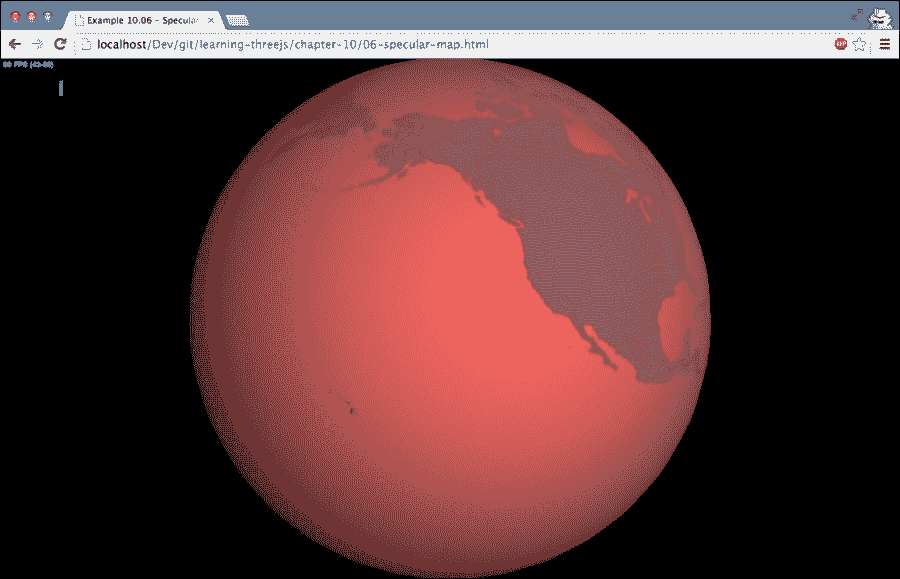

在这个屏幕截图中，你可以看到海洋被突出显示并反射光线。另一方面，大陆非常暗，不反射（很多）光线。为了实现这种效果，我们没有使用任何特定的法线纹理，而只使用了一个法线图来显示高度，以及以下反射图来突出海洋：

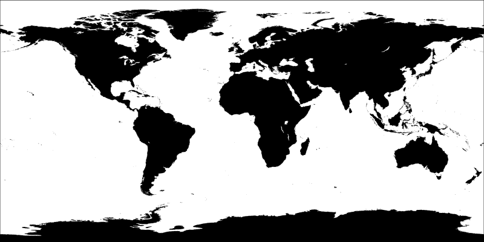

基本上，发生的情况是像素值（从黑色到白色）越高，表面看起来越亮。通常，反射图会与`specular`属性一起使用，你可以使用它来确定反射的颜色。在这种情况下，它被设置为红色：

```js
var specularTexture=THREE.ImageUtils.loadTexture("../assets/textures/planets/EarthSpec.png");
var normalTexture=THREE.ImageUtils.loadTexture("../assets/textures/planets/EarthNormal.png");

var planetMaterial = new THREE.MeshPhongMaterial();
planetMaterial.specularMap = specularTexture;
planetMaterial.specular = new THREE.Color( 0xff0000 );
planetMaterial.shininess = 1;

planetMaterial.normalMap = normalTexture;
```

还要注意，最佳效果通常是在低光泽度下实现的，但根据你所使用的照明和反射图，你可能需要实验以获得期望的效果。

# 纹理的高级用法

在上一节中，我们看到了一些基本的纹理用法。Three.js 还提供了更高级纹理用法的选项。在本节中，我们将探讨 Three.js 提供的一些选项。

## 自定义 UV 贴图

我们将首先深入探讨 UV 贴图。我们之前解释过，使用 UV 贴图，你可以指定纹理的哪个部分显示在特定的面上。当你使用 Three.js 创建几何体时，这些映射也将根据你创建的几何体类型自动创建。在大多数情况下，你实际上并不需要更改这个默认的 UV 贴图。了解 UV 贴图工作原理的一个好方法是查看 Blender 中的示例，如下面的屏幕截图所示：

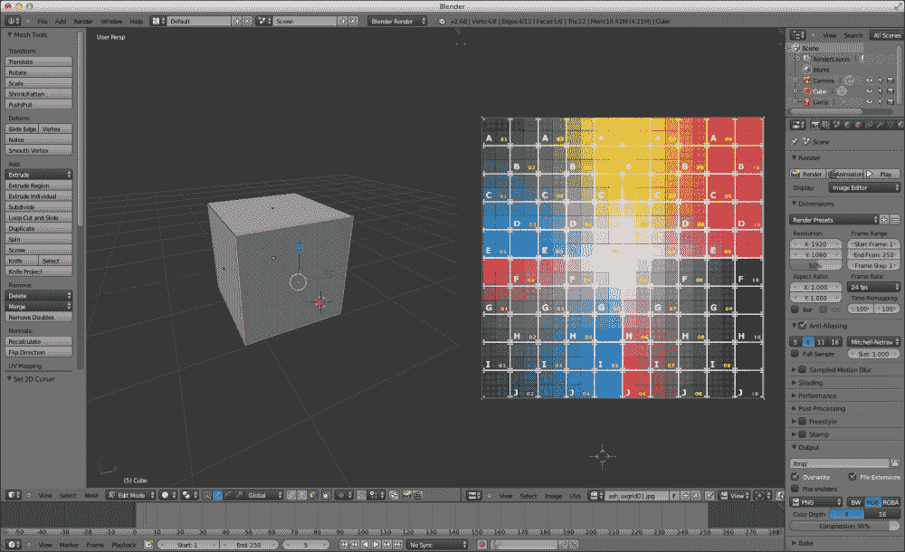

在这个例子中，你可以看到两个窗口。左侧的窗口包含一个立方体几何体。右侧的窗口是 UV 映射，我们已加载一个示例纹理来展示映射方式。在这个例子中，我们为左侧的窗口选择了一个面，右侧窗口显示了该面的 UV 映射。正如你所见，该面的每个顶点都位于右侧 UV 映射的一个角落（小圆圈）。这意味着将使用完整的纹理来覆盖该面。这个立方体的其他面也以相同的方式映射，因此结果将显示一个每个面都显示完整纹理的立方体；请参阅`07-uv-mapping.html`，它也在以下截图中显示：

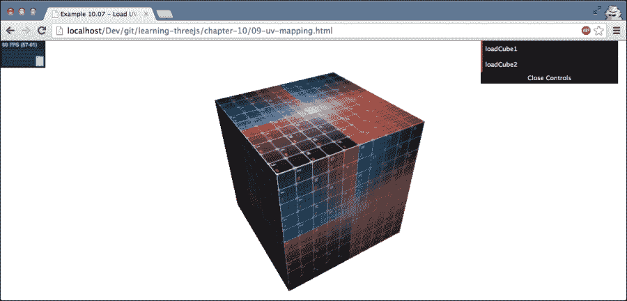

这是在 Blender（同样在 Three.js 中）中立方体的默认设置。让我们通过只选择纹理的三分之二来更改 UV（参见以下截图中的选中区域）：

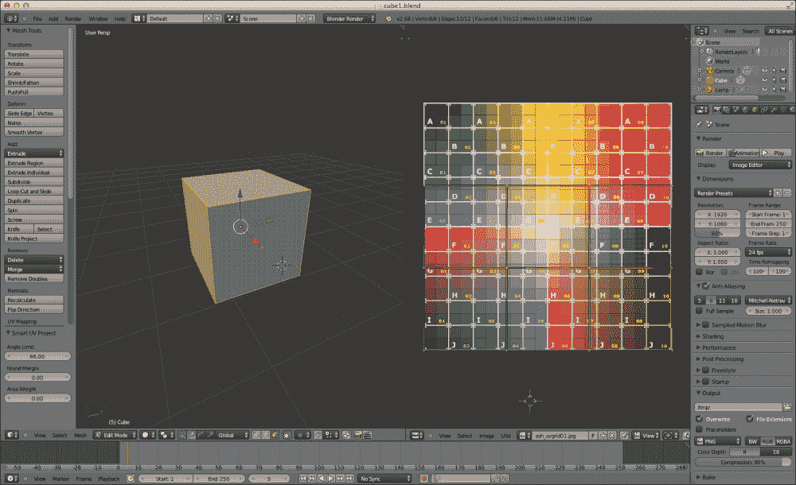

如果现在在 Three.js 中显示，你可以看到纹理的应用方式不同，如下面的截图所示：

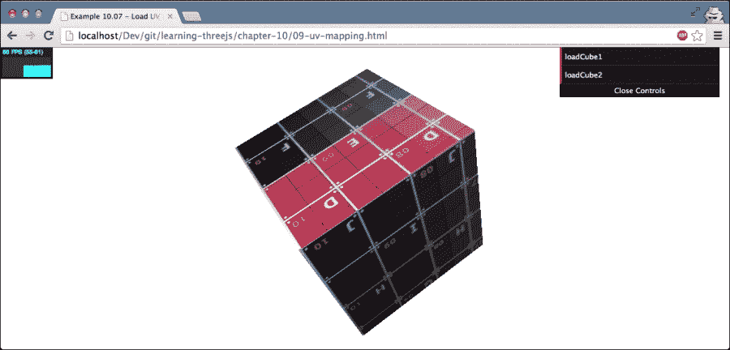

通常，从 Blender 等程序中自定义 UV 映射，特别是当模型变得更加复杂时。这里需要记住的最重要部分是 UV 映射在两个维度`u`和`v`上运行，范围从 0 到 1。要自定义 UV 映射，你需要为每个面定义纹理的哪一部分应该显示。这是通过为构成面的每个顶点定义`u`和`v`坐标来实现的。你可以使用以下代码来设置`u`和`v`值：

```js
geom.faceVertexUvs[0][0][0].x = 0.5;
geom.faceVertexUvs[0][0][0].y = 0.7;
geom.faceVertexUvs[0][0][1].x = 0.4;
geom.faceVertexUvs[0][0][1].y = 0.1;
geom.faceVertexUvs[0][0][2].x = 0.4;
geom.faceVertexUvs[0][0][2].y = 0.5;
```

此代码片段将设置第一个面的`uv`属性为指定的值。请记住，每个面由三个顶点定义，因此要设置一个面的所有`uv`值，我们需要设置六个属性。如果你打开`07-uv-mapping-manual.html`示例，你可以看到手动更改`uv`映射时会发生什么。以下截图显示了此示例：

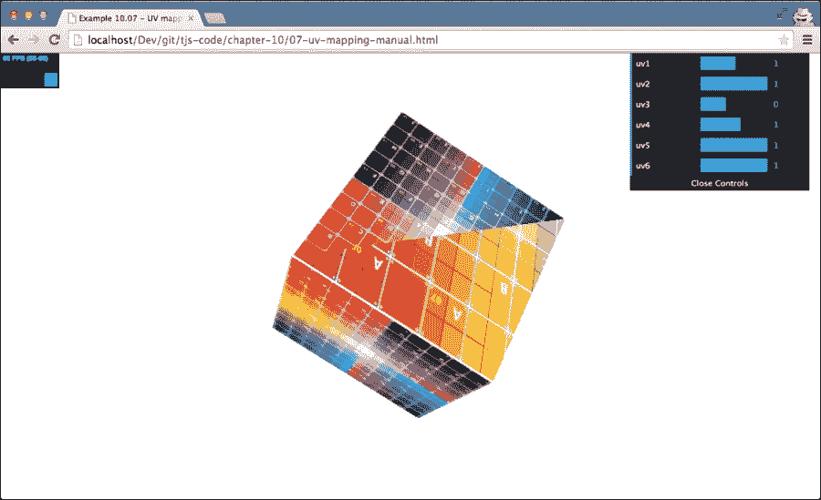

接下来，我们将探讨如何重复纹理，这是通过一些内部 UV 映射技巧实现的。

## 重复包裹

当你将纹理应用到由 Three.js 创建的几何体上时，Three.js 会尽可能优化地应用纹理。例如，对于立方体，这意味着每个面都会显示完整的纹理，而对于球体，完整的纹理会被包裹在球体上。然而，有些情况下，你可能不希望纹理在完整面上或完整几何体上扩散，而是希望纹理重复。Three.js 提供了详细的功能，允许你控制这一点。一个可以让你玩转重复属性的例子在`08-repeat-wrapping.html`示例中提供。以下截图显示了此示例：

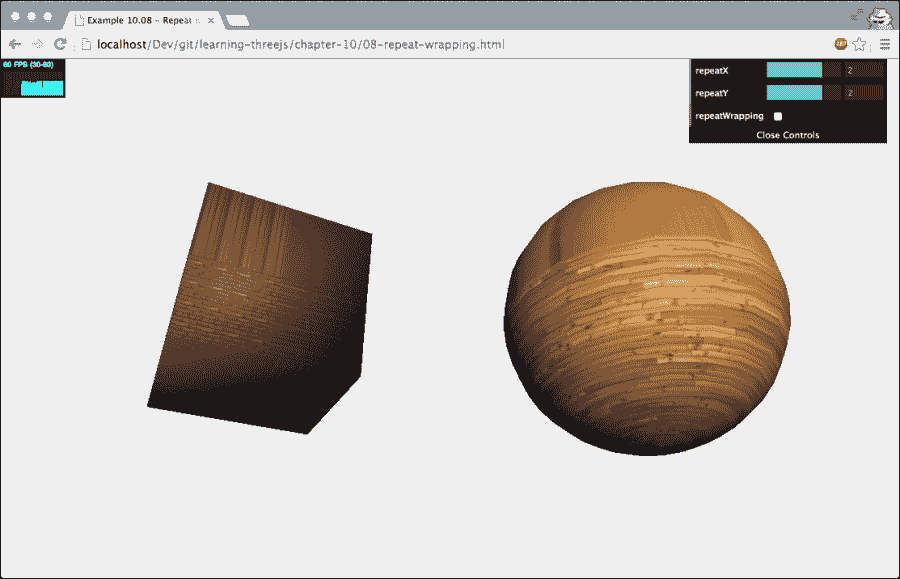

在这个例子中，你可以设置控制纹理如何重复自身的属性。

在此属性产生预期效果之前，你需要确保将纹理的包装设置为 `THREE.RepeatWrapping`，如下面的代码片段所示：

```js
cube.material.map.wrapS = THREE.RepeatWrapping;
cube.material.map.wrapT = THREE.RepeatWrapping;
```

`wrapS` 属性定义了纹理在其 *x* 轴上的行为方式，而 `wrapT` 属性定义了纹理在其 *y* 轴上的行为方式。Three.js 为此提供了两个选项，如下所示：

+   `THREE.RepeatWrapping` 允许纹理重复自身。

+   `THREE.ClampToEdgeWrapping` 是默认设置。使用 `THREE.ClampToEdgeWrapping` 时，纹理不会整体重复，只有边缘的像素会被重复。

如果你禁用了 **repeatWrapping** 菜单选项，将使用 `THREE.ClampToEdgeWrapping` 选项，如下所示：

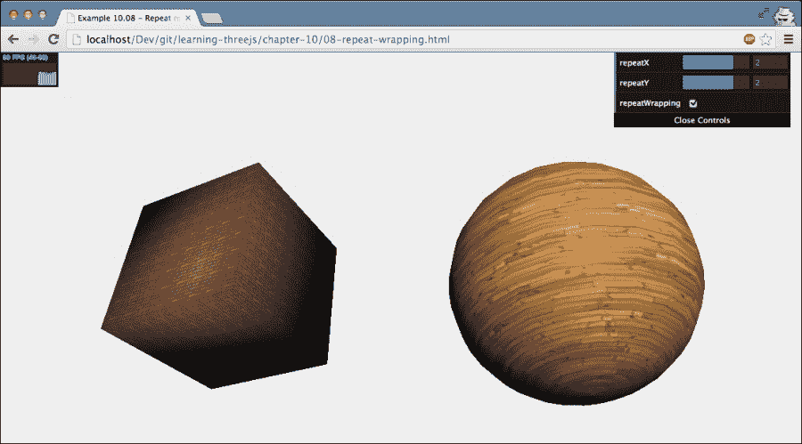

如果我们使用 `THREE.RepeatWrapping`，我们可以设置 `repeat` 属性，如下面的代码片段所示：

```js
cube.material.map.repeat.set(repeatX, repeatY);
```

`repeatX` 变量定义了纹理在其 *x* 轴上重复的频率，而 `repeatY` 变量定义了其在 *y* 轴上的相同频率。如果这些值设置为 `1`，纹理将不会重复；如果它们设置为更高的值，你会看到纹理开始重复。你也可以使用小于 1 的值。在这种情况下，你可以看到你会放大纹理。如果你将重复值设置为负值，纹理将被镜像。

当你更改 `repeat` 属性时，Three.js 会自动更新纹理并使用这个新设置进行渲染。如果你从 `THREE.RepeatWrapping` 更改为 `THREE.ClampToEdgeWrapping`，你需要显式地更新纹理：

```js
cube.material.map.needsUpdate = true;
```

到目前为止，我们只为纹理使用了静态图像。然而，Three.js 也提供了使用 HTML5 画布作为纹理的选项。

## 将渲染到画布上并用作纹理

在本节中，我们将探讨两个不同的例子。首先，我们将看看如何使用画布创建一个简单的纹理并将其应用到网格上，然后，我们将更进一步，创建一个可以使用随机生成的图案作为凹凸图的画布。

### 使用画布作为纹理

在第一个例子中，我们将使用 **Literally** 库（来自 [`literallycanvas.com/`](http://literallycanvas.com/)）创建一个可以绘制的交互式画布；请参见以下截图的左下角。你可以在 `09-canvas-texture` 处查看此示例。接下来的截图显示了此示例：

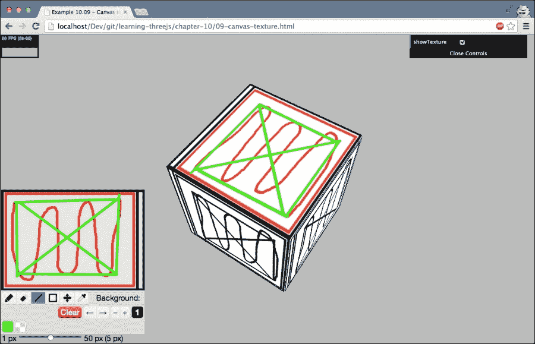

你在这张画布上绘制的任何内容都会直接作为纹理渲染到立方体上。在 Three.js 中实现这一点非常简单，只需几个步骤。首先，我们需要创建一个画布元素，并且在这个特定例子中，将其配置为与 `Literally` 库一起使用，如下所示：

```js
<div class="fs-container">
  <div id="canvas-output" style="float:left">
  </div>
</div>
...
var canvas = document.createElement("canvas");
$('#canvas-output')[0].appendChild(canvas);
$('#canvas-output').literallycanvas(
  {imageURLPrefix: '../libs/literally/img'});
```

我们只需使用 JavaScript 创建一个 `canvas` 元素并将其添加到特定的 `div` 元素中。通过 `literallycanvas` 调用，我们可以创建可以直接在画布上使用的绘图工具。接下来，我们需要创建一个使用画布绘制作为其输入的纹理：

```js
function createMesh(geom) {

  var canvasMap = new THREE.Texture(canvas);
  var mat = new THREE.MeshPhongMaterial();
  mat.map = canvasMap;
  var mesh = new THREE.Mesh(geom,mat);

  return mesh;
}
```

如代码所示，您需要做的只是在新创建纹理时传入画布元素的引用，`new THREE.Texture(canvas)`。这将创建一个使用画布元素作为其材质的纹理。剩下的事情就是在渲染时更新材质，以便在立方体上显示最新的画布绘制版本，如下所示：

```js
function render() {
  stats.update();

  cube.rotation.y += 0.01;
  cube.rotation.x += 0.01;

  cube.material.map.needsUpdate = true;
  requestAnimationFrame(render);
  webGLRenderer.render(scene, camera);
}
```

为了通知 Three.js 我们想要更新纹理，我们只需将纹理的 `needsUpdate` 属性设置为 `true`。在这个例子中，我们使用了画布元素作为最简单纹理的输入。当然，我们可以使用这个相同的概念来处理我们迄今为止看到的所有不同类型的贴图。在下一个示例中，我们将将其用作凹凸贴图。

### 使用画布作为凹凸贴图

如我们在本章前面所见，我们可以使用凹凸贴图创建一个简单的皱纹纹理。在这个地图中像素的强度越高，皱纹就越深。由于凹凸贴图只是一个简单的黑白图像，没有什么阻止我们在画布上创建这样的图像，并将其用作凹凸贴图的输入。

在以下示例中，我们使用画布生成一个随机灰度图像，并将该图像作为我们应用于立方体的凹凸贴图的输入。请参阅 `09-canvas-texture-bumpmap.html` 示例。以下截图显示了此示例：

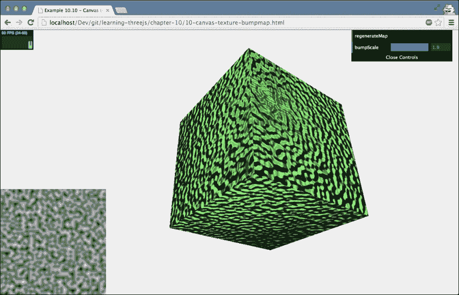

用于此目的的 JavaScript 代码与我们之前解释的示例没有太大区别。我们需要创建一个画布元素并将一些随机噪声填充到这个画布中。对于噪声，我们使用 **Perlin 噪声**。Perlin 噪声（[`en.wikipedia.org/wiki/Perlin_noise`](http://en.wikipedia.org/wiki/Perlin_noise)）生成了一种非常自然的外观随机纹理，正如您在前面的截图中所看到的。我们使用来自 [`github.com/wwwtyro/perlin.js`](https://github.com/wwwtyro/perlin.js) 的 Perlin 噪声函数：

```js
var ctx = canvas.getContext("2d");
function fillWithPerlin(perlin, ctx) {

  for (var x = 0; x < 512; x++) {
    for (var y = 0; y < 512; y++) {
      var base = new THREE.Color(0xffffff);
      var value = perlin.noise(x / 10, y / 10, 0);
      base.multiplyScalar(value);
      ctx.fillStyle = "#" + base.getHexString();
      ctx.fillRect(x, y, 1, 1);
    }
  }
}
```

我们使用 `perlin.noise` 函数根据画布元素的 *x* 和 *y* 坐标创建一个从 0 到 1 的值。这个值用于在画布元素上绘制单个像素。对所有像素执行此操作将创建一个随机地图，您也可以在上一张截图的左下角看到。这个地图可以很容易地用作凹凸贴图。以下是创建随机地图的方法：

```js
var bumpMap = new THREE.Texture(canvas);

var mat = new THREE.MeshPhongMaterial();
mat.color = new THREE.Color(0x77ff77);
mat.bumpMap = bumpMap;
bumpMap.needsUpdate = true;

var mesh = new THREE.Mesh(geom, mat);
return mesh;
```

### 小贴士

在这个例子中，我们使用 HTML 画布元素渲染了 Perlin 噪声。Three.js 还提供了一个动态创建纹理的替代方法。`THREE.ImageUtils`对象有一个`generateDataTexture`函数，你可以使用它来创建一个特定大小的`THREE.DataTexture`纹理。这个纹理在`image.data`属性中包含`Uint8Array`，你可以使用它来直接设置这个纹理的 RGB 值。

我们用于纹理的最终输入是另一个 HTML 元素：HTML5 视频元素。

## 使用视频输出作为纹理

如果你已经阅读了关于渲染到画布的上一段内容，你可能已经考虑过将视频渲染到画布上，并使用它作为纹理的输入。这是一个选项，但 Three.js（通过 WebGL）已经直接支持使用 HTML5 视频元素。查看`11-video-texture.html`。参考以下截图以获取此示例的静态图像：

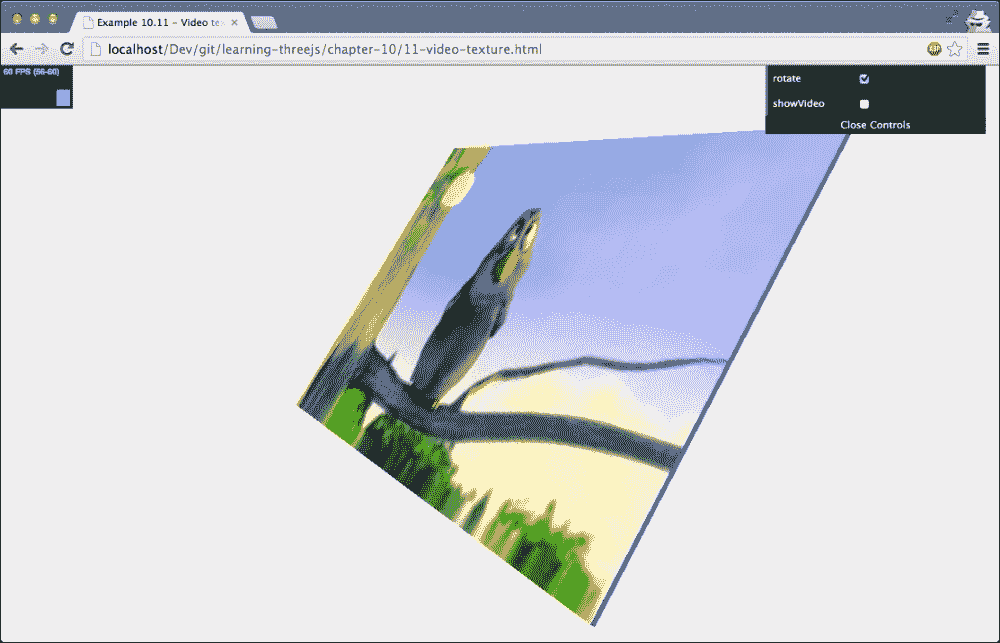

使用视频作为纹理的输入，就像使用画布元素一样，非常简单。首先，我们需要一个视频元素来播放视频：

```js
<video  id="video"
  style="display: none;
  position: absolute; left: 15px; top: 75px;"
  src="img/Big_Buck_Bunny_small.ogv"
  controls="true" autoplay="true">
</video>
```

这只是一个基本的 HTML5 视频元素，我们将其设置为自动播放。接下来，我们可以配置 Three.js 使用这个视频作为纹理的输入，如下所示：

```js
var video  = document.getElementById('video');
texture = new THREE.Texture(video);
texture.minFilter = THREE.LinearFilter;
texture.magFilter = THREE.LinearFilter;
texture.generateMipmaps = false;
```

由于我们的视频不是正方形，我们需要确保在材质上禁用 mipmap 生成。我们还设置了一些简单的、高性能的过滤器，因为材质经常改变。现在我们只剩下创建网格并设置纹理了。在这个例子中，我们使用了`MeshFaceMaterial`与`MeshBasicMaterial`：

```js
var materialArray = [];
materialArray.push(new THREE.MeshBasicMaterial({color: 0x0051ba}));
materialArray.push(new THREE.MeshBasicMaterial({color: 0x0051ba}));
materialArray.push(new THREE.MeshBasicMaterial({color: 0x0051ba}));
materialArray.push(new THREE.MeshBasicMaterial({color: 0x0051ba}));
materialArray.push(new THREE.MeshBasicMaterial({map: texture }));
materialArray.push(new THREE.MeshBasicMaterial({color: 0xff51ba}));

var faceMaterial = new THREE.MeshFaceMaterial(materialArray);
var mesh = new THREE.Mesh(geom,faceMaterial);
```

我们剩下要做的就是确保在我们的`render`循环中更新纹理，如下所示：

```js
if ( video.readyState === video.HAVE_ENOUGH_DATA ) {
  if (texture) texture.needsUpdate = true;
}
```

在这个例子中，我们只是将视频渲染到立方体的一个侧面，但由于这是一个普通纹理，我们可以用它做任何事情。例如，我们可以使用自定义 UV 映射沿着立方体的侧面分割它，或者甚至可以使用视频输入作为凹凸贴图或法线贴图的输入。

在 Three.js 版本 r69 中，引入了一种专门用于处理视频的纹理。这个纹理（`THREE.VideoTexture`）封装了你在本节中看到的代码，你可以使用`THREE.VideoTexture`方法作为替代。以下代码片段显示了如何使用`THREE.VideoTexture`创建纹理（你可以在`11-video-texture.html`示例中看到这个动作）：

```js
var video = document.getElementById('video');
texture = new THREE.VideoTexture(video);
```

# 摘要

因此，我们以纹理这一章节结束。正如你所见，Three.js 中提供了许多不同种类的纹理，每种纹理都有其不同的用途。你可以使用 PNG、JPG、GIF、TGA、DDS 或 PVR 格式的任何图像作为纹理。加载这些图像是异步进行的，所以记得在加载纹理时使用渲染循环或添加回调。使用纹理，你可以从低多边形模型创建外观出色的对象，甚至可以使用凹凸贴图和法线贴图添加虚假的深度细节。在 Three.js 中，使用 HTML5 画布元素或视频元素创建动态纹理也非常简单。只需定义一个以这些元素作为输入的纹理，并在需要更新纹理时将`needsUpdate`属性设置为`true`。

本章内容已经完成，我们基本上涵盖了 Three.js 的所有重要概念。然而，我们还没有探讨 Three.js 提供的一个有趣特性——**后期处理**。通过后期处理，你可以在场景渲染后添加效果。例如，你可以模糊或着色你的场景，或者使用扫描线添加类似电视的效果。在下一章中，我们将探讨后期处理以及如何将其应用于你的场景。
