# 第十一章. 自定义着色器和渲染后处理

我们即将结束这本书的阅读，在本章中，我们将探讨 Three.js 的一个主要特性，这是我们之前未曾涉及过的：渲染后处理。除此之外，在本章中，我们还将向您介绍如何创建自定义着色器。本章我们将讨论的主要内容包括以下几项：

+   为 Three.js 设置后处理

+   讨论 Three.js 提供的基礎后处理流程，例如`THREE.BloomPass`和`THREE.FilmPass`

+   使用遮罩对场景的一部分应用效果

+   使用`THREE.TexturePass`存储渲染结果

+   使用`THREE.ShaderPass`添加更多基本的后处理效果，例如棕褐色滤镜、镜像效果和颜色调整

+   使用`THREE.ShaderPass`实现各种模糊效果和更高级的滤镜

+   通过编写简单的着色器创建自定义后处理效果

在第一章的“介绍 requestAnimationFrame”部分中，即“使用 Three.js 创建您的第一个 3D 场景”，我们设置了一个渲染循环，这是我们全书用来渲染和动画化场景的方法。对于后处理，我们需要对这个设置进行一些修改，以便允许 Three.js 对最终渲染进行后处理。在第一部分，我们将探讨如何实现这一点。

# 为 Three.js 设置后处理

要为 Three.js 设置后处理，我们需要在我们的当前设置中进行一些修改。我们需要采取以下步骤：

1.  创建`THREE.EffectComposer`，我们可以用它来添加后处理流程。

1.  配置`THREE.EffectComposer`，使其渲染我们的场景并应用任何额外的后处理步骤。

1.  在渲染循环中使用`THREE.EffectComposer`渲染场景，应用流程，并显示输出。

如往常一样，我们有一个示例，您可以使用它进行实验，并将其用于您自己的用途。本章的第一个示例可以从`01-basic-effect-composer.html`访问。您可以使用右上角的菜单修改此示例中使用的后处理步骤的属性。在这个示例中，我们渲染了一个简单的地球仪，并添加了一个类似老式电视的效果。这个电视效果是在使用`THREE.EffectComposer`渲染场景之后添加的。以下截图显示了此示例：

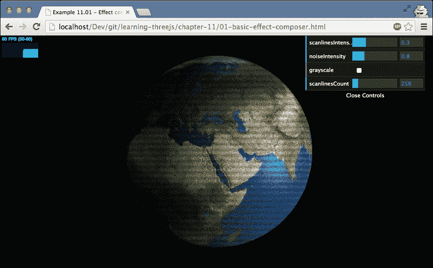

## 创建 THREE.EffectComposer

让我们先看看您需要包含的附加 JavaScript 文件。这些文件可以在 Three.js 发行版中的`examples/js/postprocessing`和`examples/js/shaders`目录中找到。

要使`THREE.EffectComposer`正常工作，您需要的最小设置如下：

```js
<script type="text/javascript" src="img/EffectComposer.js"></script>
<script type="text/javascript" src="img/MaskPass.js"></script>
<script type="text/javascript" src="img/RenderPass.js"></script>
<script type="text/javascript" src="img/CopyShader.js"></script>
<script type="text/javascript" src="img/ShaderPass.js"></script>
```

`EffectComposer.js`文件提供了允许我们添加后处理步骤的`THREE.EffectComposer`对象。`MaskPass.js`、`ShaderPass.js`和`CopyShader.js`由`THREE.EffectComposer`内部使用，而`RenderPass.js`允许我们将渲染 pass 添加到`THREE.EffectComposer`中。没有这个 pass，我们的场景根本不会渲染。

对于这个示例，我们添加了两个额外的 JavaScript 文件，以给我们的场景添加电影般的特效：

```js
<script type="text/javascript" src="img/FilmPass.js"></script>
<script type="text/javascript" src="img/FilmShader.js"></script>
```

我们需要做的第一件事是创建`THREE.EffectComposer`。您可以通过将其构造函数传递`THREE.WebGLRenderer`来实现这一点：

```js
var webGLRenderer = new THREE.WebGLRenderer();
var composer = new THREE.EffectComposer(webGLRenderer);
```

接下来，我们向这个合成器添加各种**passes**。

### 配置 THREE.EffectComposer 进行后处理

每个 pass 都是按照它添加到`THREE.EffectComposer`中的顺序执行的。我们首先添加的 pass 是`THREE.RenderPass`。接下来的 pass 渲染我们的场景，但尚未输出到屏幕：

```js
var renderPass = new THREE.RenderPass(scene, camera);
composer.addPass(renderPass);
```

要创建`THREE.RenderPass`，我们传递要渲染的场景和我们想要使用的相机。使用`addPass`函数，我们将`THREE.RenderPass`添加到`THREE.EffectComposer`中。下一步是添加另一个将输出其结果的 pass。并非所有可用的 passes 都允许这样做——稍后我们会详细介绍——但在这个示例中使用的`THREE.FilmPass`允许我们将其 pass 的结果输出到屏幕。要添加`THREE.FilmPass`，我们首先需要创建它并将其添加到合成器中。生成的代码如下：

```js
var renderPass = new THREE.RenderPass(scene,camera);
var effectFilm = new THREE.FilmPass(0.8, 0.325, 256, false);
effectFilm.renderToScreen = true;

var composer = new THREE.EffectComposer(webGLRenderer);
composer.addPass(renderPass);
composer.addPass(effectFilm);
```

如您所见，我们创建了`THREE.FilmPass`并设置了`renderToScreen`属性为`true`。这个 pass 在`renderPass`之后添加到`THREE.EffectComposer`中，所以当使用这个合成器时，首先渲染场景，然后通过`THREE.FilmPass`，我们也可以在屏幕上看到输出。

### 更新渲染循环

现在我们只需要对我们的渲染循环进行一些小的修改，以使用合成器而不是`THREE.WebGLRenderer`：

```js
var clock = new THREE.Clock();
function render() {
  stats.update();

  var delta = clock.getDelta();
  orbitControls.update(delta);

  sphere.rotation.y += 0.002;

  requestAnimationFrame(render);
  composer.render(delta);
}
```

我们所做的唯一修改是我们移除了`webGLRenderer.render(scene, camera)`并将其替换为`composer.render(delta)`。这将调用`EffectComposer`上的渲染函数，它反过来使用传入的`THREE.WebGLRenderer`，由于我们将`FilmPass`的`renderToScreen`设置为`true`，因此`FilmPass`的结果将显示在屏幕上。

使用这个基本设置，我们将在接下来的几节中查看可用的后处理 passes。

# 后处理 passes

Three.js 附带了一些可以直接与`THREE.EffectComposer`一起使用的后处理 passes。请注意，最好在本章的示例中尝试，以查看这些 passes 的结果并理解正在发生的事情。以下表格概述了可用的 passes：

| Pass 名称 | 描述 |
| --- | --- |
| `THREE.BloomPass` | 这是一个使光线区域渗透到较暗区域的效果。这模拟了当相机被极其明亮的光线淹没的效果。 |
| `THREE.DotScreenPass` | 这会在屏幕上应用一层代表原始图像的黑点层。 |
| `THREE.FilmPass` | 这通过应用扫描线和扭曲来模拟电视屏幕。 |
| `THREE.GlitchPass` | 这在随机的时间间隔内在屏幕上显示电子故障。 |
| `THREE.MaskPass` | 这允许您将蒙版应用于当前图像。后续流程仅应用于蒙版区域。 |
| `THREE.RenderPass` | 这根据提供的场景和相机渲染场景。 |
| `THREE.SavePass` | 当执行此流程时，它会复制当前渲染步骤，您可以在以后使用。实际上，这个流程并不那么有用，我们不会在我们的任何示例中使用它。 |
| `THREE.ShaderPass` | 这允许您为高级或定制的后处理流程传递自定义着色器。 |
| `THREE.TexturePass` | 这将合成器的当前状态存储在一个纹理中，您可以使用它作为其他 `EffectComposer` 实例的输入。 |

让我们从几个简单的流程开始。

## 简单的后处理流程

对于简单的流程，我们将查看 `THREE.FilmPass`、`THREE.BloomPass` 和 `THREE.DotScreenPass` 我们能做什么。对于这些流程，有一个示例 `02-post-processing-simple`，允许您实验这些流程并查看它们如何以不同的方式影响原始输出。以下截图显示了此示例：

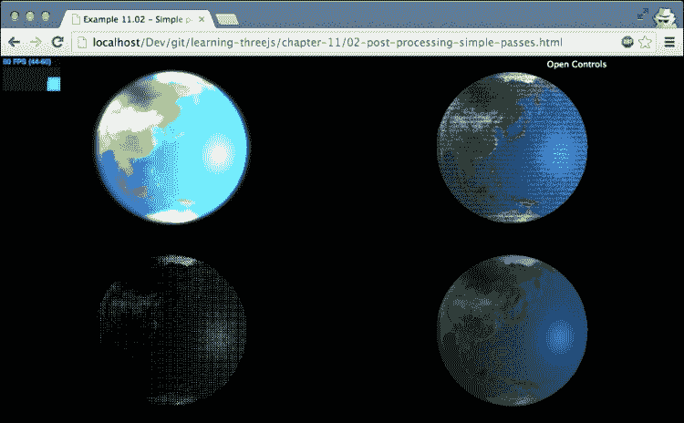

在这个示例中，我们同时展示了四个场景，并且在每个场景中添加了不同的后处理流程。左上角显示的是 `THREE.BloomPass`，右上角显示的是 `THREE.FilmPass`，左下角显示的是 `THREE.DotScreenPass`，右下角显示的是原始渲染。

在这个示例中，我们也使用了 `THREE.ShaderPass` 和 `THREE.TexturePass` 来重用原始渲染的输出作为其他三个场景的输入。因此，在我们查看单个流程之前，让我们首先看看这两个流程：

```js
var renderPass = new THREE.RenderPass(scene, camera);
var effectCopy = new THREE.ShaderPass(THREE.CopyShader);
effectCopy.renderToScreen = true;

var composer = new THREE.EffectComposer(webGLRenderer);
composer.addPass(renderPass);
composer.addPass(effectCopy);

var renderScene = new THREE.TexturePass(composer.renderTarget2);
```

在这段代码中，我们设置了 `THREE.EffectComposer`，它将输出默认场景（右下角的那个）。这个合成器有两个流程。`THREE.RenderPass` 渲染场景，而 `THREE.ShaderPass`，当配置为 `THREE.CopyShader` 时，渲染输出，如果我们设置 `renderToScreen` 属性为 `true`，则不会对屏幕进行任何进一步的后处理。如果您查看示例，您会看到我们展示了相同的场景四次，但每次都应用了不同的效果。我们可以使用 `THREE.RenderPass` 四次从头开始渲染场景，但这会有些浪费，因为我们可以直接重用第一个合成器的输出。为此，我们创建 `THREE.TexturePass` 并传入 `composer.renderTarget2` 的值。现在我们可以使用 `renderScene` 变量作为其他合成器的输入，而无需从头开始渲染场景。让我们首先回顾一下 `THREE.FilmPass`，看看我们如何使用 `THREE.TexturePass` 作为输入。

### 使用 THREE.FilmPass 创建类似电视的效果

我们已经在本章的第一节中看到了如何创建 `THREE.FilmPass`，现在让我们看看如何将这个效果与上一节中的 `THREE.TexturePass` 一起使用：

```js
var effectFilm = new THREE.FilmPass(0.8, 0.325, 256, false);
effectFilm.renderToScreen = true;

var composer4 = new THREE.EffectComposer(webGLRenderer);
composer4.addPass(renderScene);
composer4.addPass(effectFilm);
```

使用 `THREE.TexturePass` 的唯一步骤是将它添加到你的 composer 中的第一个通道。接下来，我们只需添加 `THREE.FilmPass`，效果就会应用。`THREE.FilmPass` 本身需要四个参数：

| `Property` | 描述 |
| --- | --- |
| `noiseIntensity` | 这个属性允许你控制场景看起来有多粗糙。 |
| `scanlinesIntensity` | `THREE.FilmPass` 会向场景添加一定数量的扫描线。通过这个属性，你可以定义这些扫描线显示的明显程度。 |
| `scanLinesCount` | 可以通过这个属性控制显示的扫描线条数。 |
| `grayscale` | 如果设置为 `true`，输出将被转换为灰度。 |

实际上，你有两种方式可以传递这些参数。在这个例子中，我们将它们作为构造函数的参数传递，但你也可以直接设置它们，如下所示：

```js
effectFilm.uniforms.grayscale.value = controls.grayscale;
effectFilm.uniforms.nIntensity.value = controls.noiseIntensity;
effectFilm.uniforms.sIntensity.value = controls.scanlinesIntensity;
effectFilm.uniforms.sCount.value = controls.scanlinesCount;
```

在这种方法中，我们使用 `uniforms` 属性，它用于直接与 WebGL 通信。在本章后面关于创建自定义着色器的部分，我们将更深入地探讨 `uniforms`；现在，你需要知道的是，通过这种方式，你可以直接更新后处理通道和着色器的配置，并直接看到结果。

### 使用 THREE.BloomPass 为场景添加光晕效果

你在上左角看到的效果被称为光晕效果。当你应用光晕效果时，场景中的明亮区域将被突出显示，并 *渗透* 到较暗区域。创建 `THREE.BloomPass` 的代码如下所示：

```js
var effectCopy = new THREE.ShaderPass(THREE.CopyShader);
effectCopy.renderToScreen = true;
...
var bloomPass = new THREE.BloomPass(3, 25, 5, 256);
var composer3 = new THREE.EffectComposer(webGLRenderer);
composer3.addPass(renderScene);
composer3.addPass(bloomPass);
composer3.addPass(effectCopy);
```

如果你将这个与 `THREE.EffectComposer` 进行比较，后者我们与 `THREE.FilmPass` 一起使用，你会注意到我们添加了一个额外的通道，`effectCopy`。这个步骤，我们同样用于正常输出，它不会添加任何特殊效果，只是将最后一个通道的输出复制到屏幕上。我们需要添加这个步骤，因为 `THREE.BloomPass` 不能直接渲染到屏幕上。

下表列出了你可以在 `THREE.BloomPass` 上设置的属性：

| `Property` | 描述 |
| --- | --- |
| `Strength` | 这是光晕效果的强度。这个值越高，明亮区域越亮，并且它们向较暗区域的“渗透”越多。 |
| `kernelSize` | 这个属性控制光晕效果的偏移量。 |
| `sigma` | 通过 `sigma` 属性，你可以控制光晕效果的锐度。值越高，光晕效果看起来越模糊。 |
| `Resolution` | `Resolution` 属性定义了光晕效果创建的精确度。如果你将其设置得太低，结果看起来会像方块。 |

通过使用前面提到的示例，`02-post-processing-simple`，来实验这些属性是更好地理解这些属性的方法。以下截图显示了具有高内核和 sigma 大小以及低强度的光晕效果：

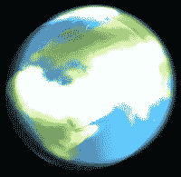

我们将要查看的最后一个简单效果是 `THREE.DotScreenPass`。

### 将场景输出为一系列点

使用 `THREE.DotScreenPass` 与使用 `THREE.BloomPass` 非常相似。我们刚刚看到了 `THREE.BloomPass` 的实际应用。现在让我们看看 `THREE.DotScreenPass` 的代码：

```js
var dotScreenPass = new THREE.DotScreenPass();
var composer1 = new THREE.EffectComposer(webGLRenderer);
composer1.addPass(renderScene);
composer1.addPass(dotScreenPass);
composer1.addPass(effectCopy);
```

使用此效果，我们再次需要添加 `effectCopy` 以将结果输出到屏幕。`THREE.DotScreenPass` 也可以配置多个属性，如下所示：

| 属性 | 描述 |
| --- | --- |
| `center` | 使用 `center` 属性，您可以微调点的偏移方式。 |
| `angle` | 点以某种方式对齐。使用 `angle` 属性，您可以更改这种对齐方式。 |
| `Scale` | 使用此功能，我们可以设置要使用的点的大小。`scale` 越低，点就越大。 |

对其他着色器适用的内容也适用于此着色器。通过实验，更容易获得正确的设置。

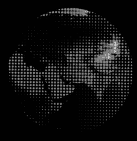

### 在同一屏幕上显示多个渲染器的输出

本节不深入介绍如何使用后处理效果，而是解释如何在同一屏幕上获取所有四个 `THREE.EffectComposer` 实例的输出。首先，让我们看看用于此示例的渲染循环：

```js
function render() {
  stats.update();

  var delta = clock.getDelta();
  orbitControls.update(delta);

  sphere.rotation.y += 0.002;

  requestAnimationFrame(render);

  webGLRenderer.autoClear = false;
  webGLRenderer.clear();

  webGLRenderer.setViewport(0, 0, 2 * halfWidth, 2 * halfHeight);
  composer.render(delta);

  webGLRenderer.setViewport(0, 0, halfWidth, halfHeight);
  composer1.render(delta);

  webGLRenderer.setViewport(halfWidth, 0, halfWidth, halfHeight);
  composer2.render(delta);

  webGLRenderer.setViewport(0, halfHeight, halfWidth, halfHeight);
  composer3.render(delta);

  webGLRenderer.setViewport(halfWidth, halfHeight, halfWidth, halfHeight);
  composer4.render(delta);
}
```

这里首先要注意的是，我们将 `webGLRenderer.autoClear` 属性设置为 `false`，然后显式调用 `clear()` 函数。如果我们每次在作曲家上调用 `render()` 函数时都不这样做，之前渲染的场景将被清除。采用这种方法，我们只在渲染循环的开始处清除一切。

为了避免所有作曲家都在相同的空间中渲染，我们将 `webGLRenderer` 的视口设置到屏幕的不同部分，该视口被我们的作曲家使用。此函数接受四个参数：`x`、`y`、`width` 和 `height`。如代码示例所示，我们使用此函数将屏幕分成四个区域，并让作曲家在各自区域进行渲染。请注意，如果您想使用多个场景、相机和 `WebGLRenderer`，也可以使用这种方法。

在本节开头的表格中，我们还提到了 `THREE.GlitchPass`。使用此渲染通道，您可以为场景添加一种电子故障效果。这种效果与您迄今为止看到的其它效果一样易于使用。要使用它，首先在您的 HTML 页面中包含以下两个文件：

```js
<script type="text/javascript" src="img/GlitchPass.js"></script>
<script type="text/javascript" src="img/DigitalGlitch.js"></script>
```

然后，创建 `THREE.GlitchPass` 对象，如下所示：

```js
var effectGlitch = new THREE.GlitchPass(64);
effectGlitch.renderToScreen = true;
```

结果是一个场景，除了在随机间隔发生故障外，渲染结果正常，如下面的截图所示：

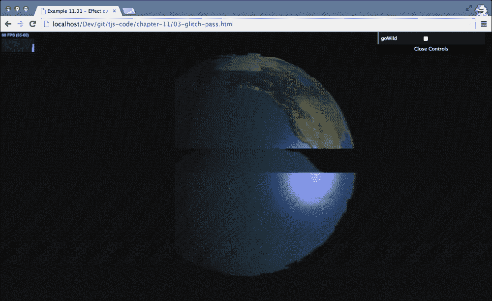

到目前为止，我们只链式连接了几个简单的步骤。在下一个示例中，我们将配置一个更复杂的`THREE.EffectComposer`，并使用遮罩将效果应用于屏幕的一部分。

## 使用遮罩的高级 EffectComposer 流程。

在前面的示例中，我们将后处理步骤应用于整个屏幕。然而，Three.js 也有能力只将步骤应用于特定区域。在本节中，我们将执行以下步骤：

1.  创建一个作为背景图像的场景。

1.  创建一个包含类似地球的球体的场景。

1.  创建一个包含类似火星的球体的场景。

1.  创建`EffectComposer`，将这些三个场景渲染成一张单独的图片。

1.  将渲染为火星的球体应用一个**colorify**效果。

1.  将渲染为地球的球体应用一个棕褐色效果。

这可能听起来很复杂，但实际上实现起来非常简单。首先，让我们看看`03-post-processing-masks.html`示例中我们想要达到的结果。以下截图显示了这些步骤的结果：

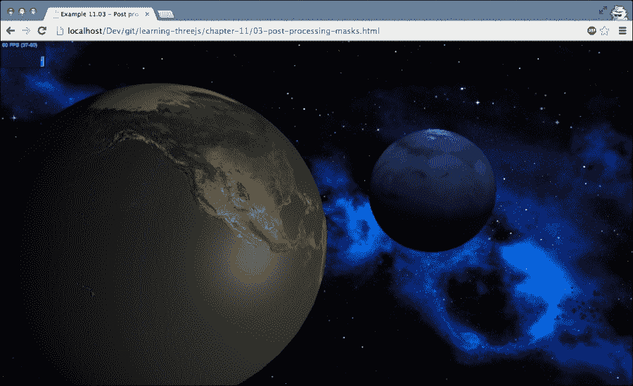

我们需要做的第一件事是设置我们将要渲染的各种场景，如下所示：

```js
var sceneEarth = new THREE.Scene();
var sceneMars = new THREE.Scene();
var sceneBG = new THREE.Scene();
```

要创建地球和火星的球体，我们只需创建具有正确材质和纹理的球体，并将它们添加到它们特定的场景中，如下面的代码所示：

```js
var sphere = createEarthMesh(new THREE.SphereGeometry(10, 40, 40));
sphere.position.x = -10;
var sphere2 = createMarshMesh(new THREE.SphereGeometry(5, 40, 40));
sphere2.position.x = 10;
sceneEarth.add(sphere);
sceneMars.add(sphere2);
```

我们还需要像在正常场景中一样向场景中添加一些灯光，但这里不会展示（详见第三章，*使用 Three.js 中可用的不同光源*，获取更多详细信息）。唯一需要记住的是，灯光不能添加到不同的场景中，因此你需要为这两个场景创建单独的灯光。这就是我们为这两个场景需要做的所有设置。

对于背景图像，我们创建`THREE.OrthoGraphicCamera`。记得从第二章，*组成 Three.js 场景的基本组件*，正射投影中物体的尺寸不依赖于相机距离，因此这也提供了一个创建固定背景的好方法。以下是创建`THREE.OrthoGraphicCamera`的方法：

```js
var cameraBG = new THREE.OrthographicCamera(-window.innerWidth, window.innerWidth, window.innerHeight, -window.innerHeight, -10000, 10000);
cameraBG.position.z = 50;

var materialColor = new THREE.MeshBasicMaterial({ map: THREE.ImageUtils.loadTexture("../assets/textures/starry-deep-outer-space-galaxy.jpg"), depthTest: false });
var bgPlane = new THREE.Mesh(new THREE.PlaneGeometry(1, 1), materialColor);
bgPlane.position.z = -100;
bgPlane.scale.set(window.innerWidth * 2, window.innerHeight * 2, 1);
sceneBG.add(bgPlane);
```

我们不会对这个部分进行过多细节的介绍，但我们必须采取几个步骤来创建一个背景图像。首先，我们从背景图像创建一个材质，并将这个材质应用到简单的平面上。接下来，我们将这个平面添加到场景中，并将其缩放到正好填满整个屏幕。因此，当我们用这个相机渲染这个场景时，我们的背景图像会拉伸到屏幕的宽度。

我们现在已经有了三个场景，可以开始设置我们的渲染通道和`THREE.EffectComposer`了。让我们先看看完整的渲染通道链，然后再看看单个的渲染通道：

```js
var composer = new THREE.EffectComposer(webGLRenderer);
composer.renderTarget1.stencilBuffer = true;
composer.renderTarget2.stencilBuffer = true;

composer.addPass(bgPass);
composer.addPass(renderPass);
composer.addPass(renderPass2);

composer.addPass(marsMask);
composer.addPass(effectColorify1);
composer.addPass(clearMask);

composer.addPass(earthMask);
composer.addPass(effectSepia);
composer.addPass(clearMask);

composer.addPass(effectCopy);
```

要使用遮罩，我们需要以不同的方式创建`THREE.EffectComposer`。在这种情况下，我们需要创建一个新的`THREE.WebGLRenderTarget`，并将内部使用的渲染目标的`stencilBuffer`属性设置为`true`。模板缓冲区是一种特殊的缓冲区，用于限制渲染区域。因此，通过启用模板缓冲区，我们可以使用我们的遮罩。首先，让我们看看添加的前三个通道。这三个通道渲染背景、地球场景和火星场景，如下所示：

```js
var bgPass = new THREE.RenderPass(sceneBG, cameraBG);
var renderPass = new THREE.RenderPass(sceneEarth, camera);
renderPass.clear = false;
var renderPass2 = new THREE.RenderPass(sceneMars, camera);
renderPass2.clear = false;
```

这里没有新的内容，只是我们将其中两个通道的`clear`属性设置为`false`。如果我们不这样做，我们只能看到`renderPass2`的输出，因为它会在开始渲染之前清除一切。如果你回顾一下`THREE.EffectComposer`的代码，接下来的三个通道是`marsMask`、`effectColorify`和`clearMask`。首先，我们将看看这三个通道是如何定义的：

```js
var marsMask = new THREE.MaskPass(sceneMars, camera );
var clearMask = new THREE.ClearMaskPass();
var effectColorify = new THREE.ShaderPass(THREE.ColorifyShader );
effectColorify.uniforms['color'].value.setRGB(0.5, 0.5, 1);
```

这三个通道中的第一个是`THREE.MaskPass`。当创建`THREE.MaskPass`时，你传入一个场景和一个相机，就像你为`THREE.RenderPass`做的那样。`THREE.MaskPass`将内部渲染这个场景，但不会在屏幕上显示，而是使用这些信息来创建一个遮罩。当`THREE.MaskPass`添加到`THREE.EffectComposer`中时，所有后续的通道将只应用于由`THREE.MaskPass`定义的遮罩，直到遇到`THREE.ClearMaskPass`。在这个例子中，这意味着添加蓝色光芒的`effectColorify`通道只应用于在`sceneMars`中渲染的对象。

我们使用相同的方法在地球对象上应用棕褐色滤镜。我们首先基于地球场景创建一个遮罩，并在`THREE.EffectComposer`中使用这个遮罩。在`THREE.MaskPass`之后，我们添加我们想要应用的效果（在这个例子中是`effectSepia`），完成之后，我们添加`THREE.ClearMaskPass`来移除遮罩。对于这个特定的`THREE.EffectComposer`的最后一步，我们已经见过。我们需要将最终结果复制到屏幕上，为此我们再次使用`effectCopy`通道。

当与`THREE.MaskPass`一起工作时，有一个有趣的额外属性，那就是`inverse`属性。如果这个属性设置为`true`，遮罩将被反转。换句话说，效果应用于除了`THREE.MaskPass`传入的场景之外的所有内容。这在上面的屏幕截图中显示：


到目前为止，我们一直使用 Three.js 提供的标准通道来应用我们的效果。Three.js 还提供了`THREE.ShaderPass`，它可以用于自定义效果，并附带大量你可以使用和实验的着色器。

## 使用 THREE.ShaderPass 进行自定义效果

使用 `THREE.ShaderPass`，我们可以通过传递自定义着色器来将大量额外的效果应用到我们的场景中。本节分为三个部分。首先，我们将探讨以下一系列简单着色器：

| 名称 | 描述 |
| --- | --- |
| `THREE.MirrorShader` | 这为屏幕的一部分创建镜像效果。 |
| `THREE.HueSaturationShader` | 这允许您更改颜色的**色调**和**饱和度**。 |
| `THREE.VignetteShader` | 这应用了一个晕影效果。此效果在图像中心显示暗色边缘。 |
| `THREE.ColorCorrectionShader` | 使用此着色器，您可以更改颜色分布。 |
| `THREE.RGBShiftShader` | 此着色器将颜色的红色、绿色和蓝色分量分离。 |
| `THREE.BrightnessContrastShader` | 这改变图像的亮度和对比度。 |
| `THREE.ColorifyShader` | 这将颜色叠加到屏幕上。 |
| `THREE.SepiaShader` | 这在屏幕上创建类似棕褐色效果。 |
| `THREE.KaleidoShader` | 这为场景添加了一个万花筒效果，在场景中心提供径向反射。 |
| `THREE.LuminosityShader` | 这提供了一个亮度效果，其中显示了场景的亮度。 |
| `THREE.TechnicolorShader` | 这模拟了在老电影中可以看到的双条技术彩色效果。 |

接下来，我们将探讨提供一些模糊相关效果的着色器：

| 名称 | 描述 |
| --- | --- |
| `THREE.HorizontalBlurShader` 和 `THREE.VerticalBlurShader` | 这些将模糊效果应用到整个场景。 |
| `THREE.HorizontalTiltShiftShader` 和 `THREE.VerticalTiltShiftShader` | 这些重新创建了**倾斜移位**效果。通过倾斜移位效果，可以确保只有图像的一部分是清晰的，从而创建出类似微缩景观的场景。 |
| `THREE.TriangleBlurShader` | 这使用基于三角形的方法应用模糊效果。 |

最后，我们将探讨一些提供高级效果的着色器：

| 名称 | 描述 |
| --- | --- |
| `THREE.BleachBypassShader` | 这创建了一个**漂白绕过**效果。使用此效果，将在图像上应用类似银色的叠加。 |
| `THREE.EdgeShader` | 此着色器可用于检测图像中的锐利边缘并突出显示它们。 |
| `THREE.FXAAShader` | 此着色器在后期处理阶段应用抗锯齿效果。如果应用渲染时的抗锯齿太昂贵，请使用此着色器。 |
| `THREE.FocusShader` | 这是一个简单的着色器，它产生一个清晰渲染的中心区域和其边缘的模糊。 |

由于如果您已经看到其中一个着色器的工作原理，您基本上就知道了其他着色器的工作原理。在接下来的几节中，我们将突出介绍几个有趣的着色器。您可以使用每个部分提供的交互式示例来实验其他着色器。

### 小贴士

Three.js 还提供了两种高级后处理效果，允许你将*散景*效果应用到场景中。散景效果在渲染主要主题时非常锐利，而对场景的一部分提供模糊效果。Three.js 提供了`THREE.BrokerPass`，你可以用它来实现这个效果，或者使用`THREE.BokehShader2`和`THREE.DOFMipMapShader`，你可以将它们与`THREE.ShaderPass`一起使用。这些着色器在实际应用中的例子可以在 Three.js 网站上找到，地址为[`threejs.org/examples/webgl_postprocessing_dof2.html`](http://threejs.org/examples/webgl_postprocessing_dof2.html)和[`threejs.org/examples/webgl_postprocessing_dof.html`](http://threejs.org/examples/webgl_postprocessing_dof.html)。

我们从几个简单的着色器开始。

### 简单着色器

为了实验基本着色器，我们创建了一个示例，你可以在这里玩转着色器并直接在场景中看到效果。你可以在`04-shaderpass-simple.html`中找到这个示例。以下截图显示了此示例：

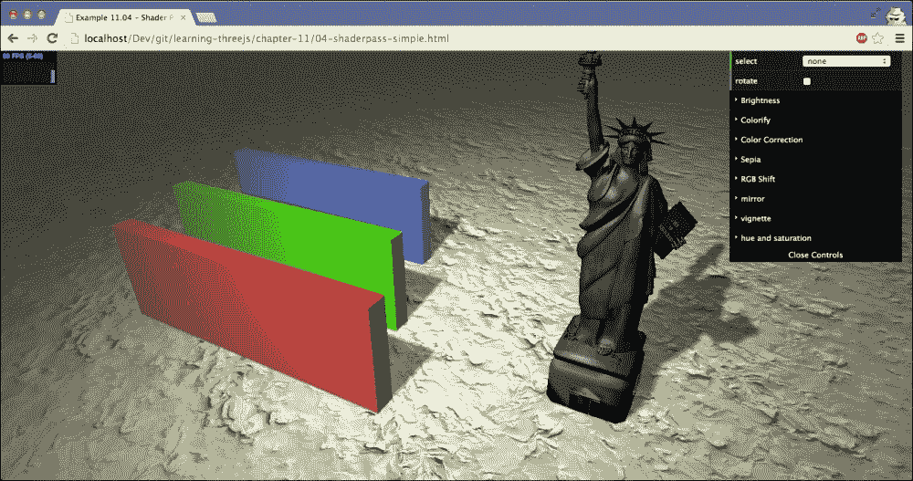

使用右上角的菜单，你可以选择要应用的具体着色器，并通过各种下拉菜单设置所选着色器的属性。例如，以下截图显示了`RGBShiftShader`的实际应用效果：


当你改变一个着色器的属性时，结果会直接更新。在这个例子中，我们直接在着色器上设置更改的值。例如，当`RGBShiftShader`的值发生变化时，我们像这样更新着色器：

```js
this.changeRGBShifter = function() {
  rgbShift.uniforms.amount.value = controls.rgbAmount;
  rgbShift.uniforms.angle.value = controls.angle;
}
```

让我们看看其他几个着色器。以下图像显示了`VignetteShader`的结果：

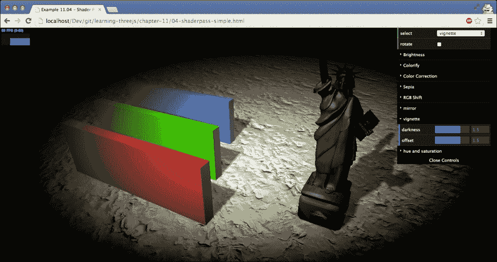

`MirrorShader`具有以下效果：


使用后处理，我们还可以应用极端效果。一个很好的例子是`THREE.KaleidoShader`。如果你从右上角的菜单中选择这个着色器，你会看到以下效果：

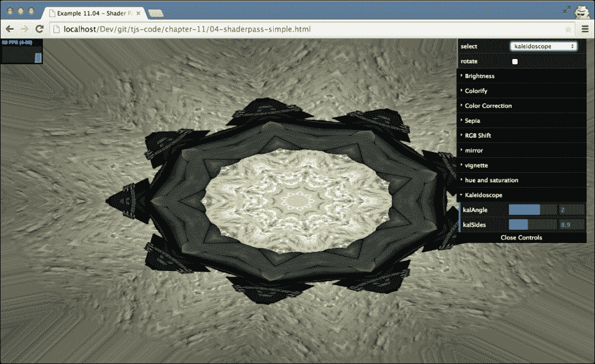

简单着色器就介绍到这里。正如你所见，它们非常灵活，可以创建非常有趣的效果。在这个例子中，我们每次只应用一个着色器，但你可以根据需要向`THREE.EffectComposer`添加任意多的`THREE.ShaderPass`步骤。

### 模糊着色器

在本节中，我们不会深入代码；我们只会展示各种模糊着色器的结果。你可以使用`05-shaderpass-blur.html`示例来实验这些效果。以下场景使用了`HorizontalBlurShader`和`VerticalBlurShader`进行模糊处理，这两个着色器你将在接下来的段落中学习：

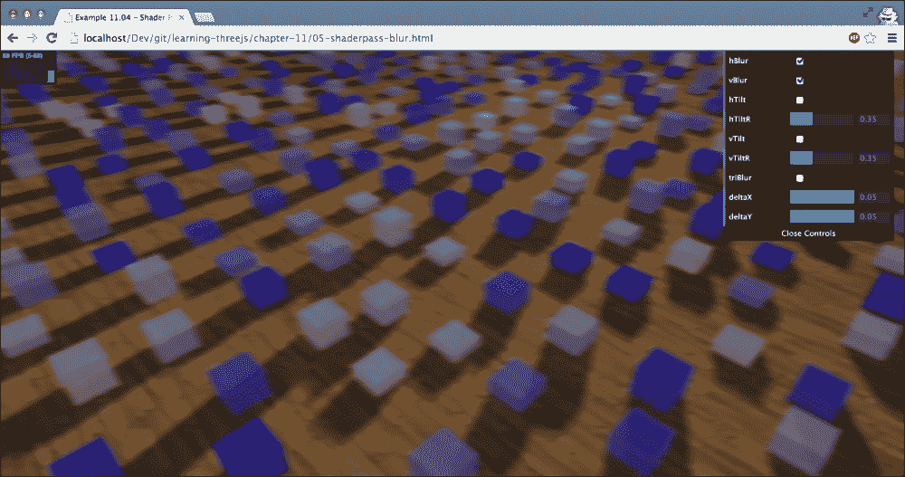

前面的图像展示了 `THREE.HorizontalBlurShader` 和 `THREE.VerticalBlurShader`。你可以看到效果是一个模糊的场景。除了这两个模糊效果之外，Three.js 还提供了一个可以模糊图像的着色器，`THREE.TriangleShader`，如下所示。例如，你可以使用这个着色器来描绘运动模糊，如下面的截图所示：

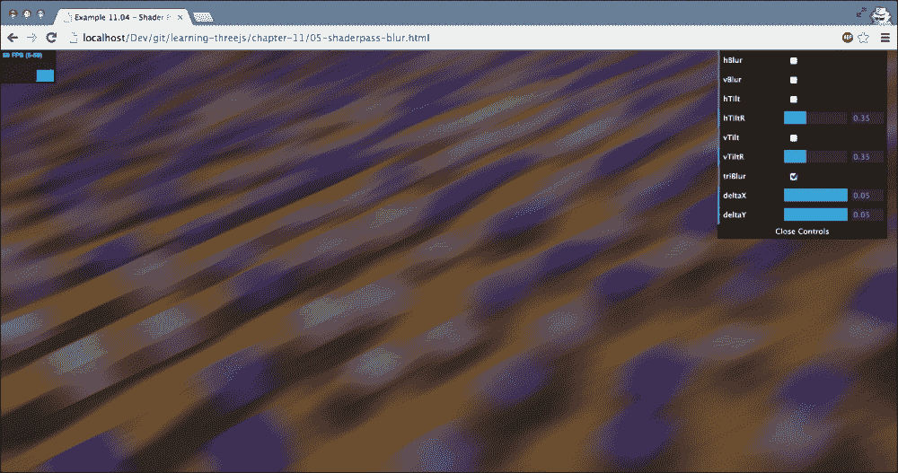

最后一个类似模糊的效果是由 `THREE.HorizontalTiltShiftShader` 和 `THREE.VerticalTiltShiftShader` 提供的。这个着色器不会模糊整个场景，而只是一个小区域。这提供了称为 *倾斜移位* 的效果。这通常用于从普通照片中创建类似微缩模型的效果。下面的图像展示了这个效果：

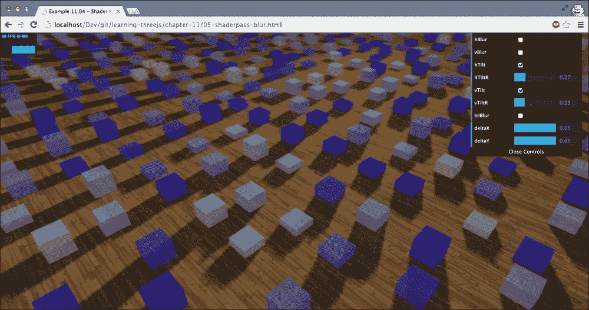

### 高级着色器

对于高级着色器，我们将做与之前模糊着色器相同的事情。我们只会展示着色器的输出。有关如何配置它们的详细信息，请查看 `06-shaderpass-advanced.html` 示例。下面的截图展示了这个示例：

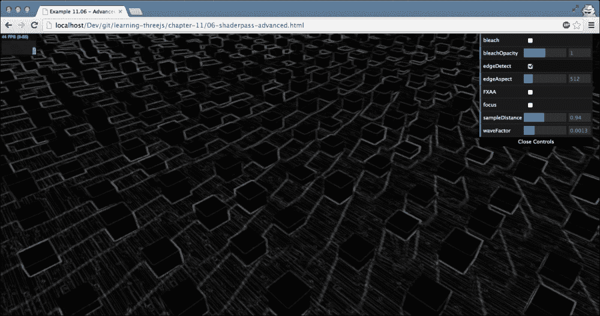

前面的示例展示了 `THREE.EdgeShader`。使用这个着色器，你可以检测场景中物体的边缘。

下一个着色器是 `THREE.FocusShader`。这个着色器只渲染屏幕的中心区域，如下面的截图所示：

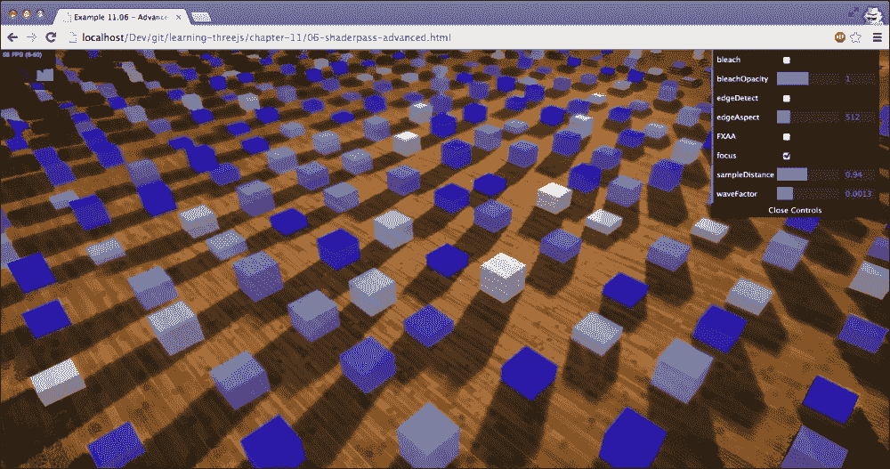

到目前为止，我们只使用了 Three.js 提供的着色器。然而，自己创建着色器也非常简单。

# 创建自定义后处理着色器

在本节中，你将学习如何创建一个自定义着色器，你可以在后处理中使用它。我们将创建两个不同的着色器。第一个将当前图像转换为灰度图像，第二个将通过减少可用的颜色数量将图像转换为 8 位图像。请注意，创建顶点和片段着色器是一个非常广泛的主题。在本节中，我们只触及了这些着色器可以做什么以及它们是如何工作的表面。对于更深入的信息，你可以在 [`www.khronos.org/webgl/`](http://www.khronos.org/webgl/) 找到 WebGL 规范。另一个充满示例的额外资源是 Shadertoy，网址为 [`www.shadertoy.com/`](https://www.shadertoy.com/)。

## 自定义灰度着色器

要为 Three.js（以及其它 WebGL 库）创建自定义着色器，你需要实现两个组件：一个顶点着色器和一个片段着色器。顶点着色器可以用来改变单个顶点的位置，而片段着色器用于确定单个像素的颜色。对于后期处理着色器，我们只需要实现一个片段着色器，并且可以保留 Three.js 提供的默认顶点着色器。在查看代码之前，需要指出的是，GPU 通常支持多个着色器管线。这意味着在顶点着色器步骤中，可以并行运行多个着色器——同样也适用于片段着色器步骤。

让我们先看看应用于我们图像的灰度效果的着色器的完整源代码（`custom-shader.js`）：

```js
THREE.CustomGrayScaleShader = {

  uniforms: {

    "tDiffuse": { type: "t", value: null },
    "rPower":  { type: "f", value: 0.2126 },
    "gPower":  { type: "f", value: 0.7152 },
    "bPower":  { type: "f", value: 0.0722 }

  },

  vertexShader: [
    "varying vec2 vUv;",
    "void main() {",
      "vUv = uv;",
      "gl_Position = projectionMatrix * modelViewMatrix * vec4( position, 1.0 );",
    "}"
  ].join("\n"),

  fragmentShader: [

    "uniform float rPower;",
    "uniform float gPower;",
    "uniform float bPower;",
    "uniform sampler2D tDiffuse;",

    "varying vec2 vUv;",

    "void main() {",
      "vec4 texel = texture2D( tDiffuse, vUv );",
      "float gray = texel.r*rPower + texel.g*gPower+ texel.b*bPower;",
      "gl_FragColor = vec4( vec3(gray), texel.w );",
    "}"
  ].join("\n")
};
```

如代码所示，这并不是 JavaScript。当你编写着色器时，你使用的是**OpenGL 着色语言**（**GLSL**），它看起来很像 C 编程语言。有关 GLSL 的更多信息可以在[`www.khronos.org/opengles/sdk/docs/manglsl/`](http://www.khronos.org/opengles/sdk/docs/manglsl/)找到。

首先，让我们看看这个顶点着色器：

```js
"varying vec2 vUv;","void main() {",
  "vUv = uv;",
  "gl_Position = projectionMatrix * modelViewMatrix * vec4( position, 1.0 );",
  "}"
```

对于后期处理，这个着色器实际上并不需要做任何事情。上面看到的代码是 Three.js 实现顶点着色器的标准方式。它使用`projectionMatrix`，这是从相机到投影，以及`modelViewMatrix`，它将对象的位映射到世界位置，以确定在屏幕上渲染对象的位置。

对于后期处理，这段代码中唯一有趣的是`uv`值，它指示从纹理中读取哪个 texel，通过使用"`varying` `vec2` `vUv`"变量传递到片段着色器。我们将使用`vUV`值在片段着色器中获取正确的像素进行操作。让我们看看片段着色器并看看代码在做什么。我们首先声明以下变量：

```js
"uniform float rPower;",
"uniform float gPower;",
"uniform float bPower;",
"uniform sampler2D tDiffuse;",

"varying vec2 vUv;",
```

在这里，我们可以看到四个`uniforms`属性的实例。`uniforms`属性的实例具有从 JavaScript 传递到着色器的值，并且对于每个处理的片段都是相同的。在这种情况下，我们传递了三个由类型`f`（用于确定要包含在最终灰度图像中的颜色的比例）标识的浮点数，以及一个纹理（`tDiffuse`），由类型`t`标识。这个纹理包含来自`THREE.EffectComposer`的前一个传递的图像。Three.js 确保它正确地传递到这个着色器中，并且我们可以从 JavaScript 中自行设置`uniforms`属性的其它实例。在我们能够从 JavaScript 中使用这些`uniforms`之前，我们必须定义哪个`uniforms`属性对于这个着色器是可用的。这是在着色器文件顶部这样做的：

```js
uniforms: {

  "tDiffuse": { type: "t", value: null },
  "rPower":  { type: "f", value: 0.2126 },
  "gPower":  { type: "f", value: 0.7152 },
  "bPower":  { type: "f", value: 0.0722 }

},
```

到目前为止，我们可以从 Three.js 接收配置参数，并且已经接收到了我们想要修改的图像。让我们看看将每个像素转换为灰度像素的代码：

```js
"void main() {",
  "vec4 texel = texture2D( tDiffuse, vUv );",
  "float gray = texel.r*rPower + texel.g*gPower + texel.b*bPower;",
  "gl_FragColor = vec4( vec3(gray), texel.w );"
```

这里发生的事情是我们从传入的纹理中获取正确的像素。我们通过使用 `texture2D` 函数来完成，我们传入当前图像（`tDiffuse`）和我们想要分析的像素位置（`vUv`）。结果是包含颜色和透明度（`texel.w`）的 texel（纹理中的像素）。

接下来，我们使用这个 texel 的 `r`、`g` 和 `b` 属性来计算一个灰度值。这个灰度值被设置为 `gl_FragColor` 变量，最终在屏幕上显示。就这样，我们得到了自己的自定义着色器。使用这个着色器就像使用其他着色器一样。首先，我们只需要设置 `THREE.EffectComposer`：

```js
var renderPass = new THREE.RenderPass(scene, camera);

var effectCopy = new THREE.ShaderPass(THREE.CopyShader);
effectCopy.renderToScreen = true;

var shaderPass = new THREE.ShaderPass(THREE.CustomGrayScaleShader);

var composer = new THREE.EffectComposer(webGLRenderer);
composer.addPass(renderPass);
composer.addPass(shaderPass);
composer.addPass(effectCopy);
```

在渲染循环中调用 `composer.render(delta)`。如果我们想在运行时更改着色器的属性，我们只需更新我们定义的 `uniforms` 属性：

```js
shaderPass.enabled = controls.grayScale;
shaderPass.uniforms.rPower.value = controls.rPower;
shaderPass.uniforms.gPower.value = controls.gPower;
shaderPass.uniforms.bPower.value = controls.bPower;
```

结果可以在 `07-shaderpass-custom.html` 中查看。以下截图展示了这个示例：

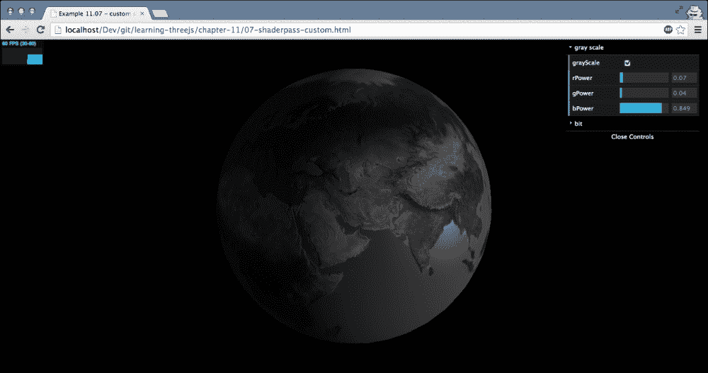

让我们创建另一个自定义着色器。这次，我们将 24 位输出降低到更低的位计数。

## 创建自定义位着色器

通常，颜色以 24 位值表示，这给我们提供了大约 1600 万种不同的颜色。在计算机的早期，这是不可能的，颜色通常以 8 位或 16 位颜色表示。使用这个着色器，我们将自动将 24 位输出转换为 8 位颜色深度（或任何你想要的）。

由于它与我们之前的示例没有变化，我们将跳过顶点着色器，直接列出 `uniforms` 属性的实例：

```js
uniforms: {

  "tDiffuse": { type: "t", value: null },
  "bitSize":  { type: "i", value: 4 }

}
```

这是片段着色器本身：

```js
fragmentShader: [

  "uniform int bitSize;",

  "uniform sampler2D tDiffuse;",

  "varying vec2 vUv;",

  "void main() {",

    "vec4 texel = texture2D( tDiffuse, vUv );",
    "float n = pow(float(bitSize),2.0);",
    "float newR = floor(texel.r*n)/n;",
    "float newG = floor(texel.g*n)/n;",
    "float newB = floor(texel.b*n)/n;",

    "gl_FragColor = vec4(newR, newG, newB, texel.w );",

  "}"

].join("\n")
```

我们定义了两个 `uniforms` 属性的实例，可以用来配置这个着色器。第一个是 Three.js 用来传入当前屏幕的，第二个是我们定义的整数（`type:` `"i"`），作为我们想要渲染结果的颜色深度。代码本身非常简单：

+   我们首先根据传入的像素位置 `vUv` 从纹理中获取 `texel` 和 `tDiffuse`。

+   我们根据 `bitSize` 属性计算可以拥有的颜色数量，通过计算 `2` 的 `bitSize` 次方（`pow(float(bitSize),2.0)`）。

+   接下来，我们通过将值乘以 `n`，四舍五入，`(floor(texel.r*n))`，然后再除以 `n` 来计算 `texel` 的颜色的新值。

+   结果被设置为 `gl_FragColor`（红色、绿色、蓝色值和透明度）并在屏幕上显示。

你可以在与之前自定义着色器相同的示例 `07-shaderpass-custom.html` 中查看这个自定义着色器的结果。以下截图展示了这个示例：

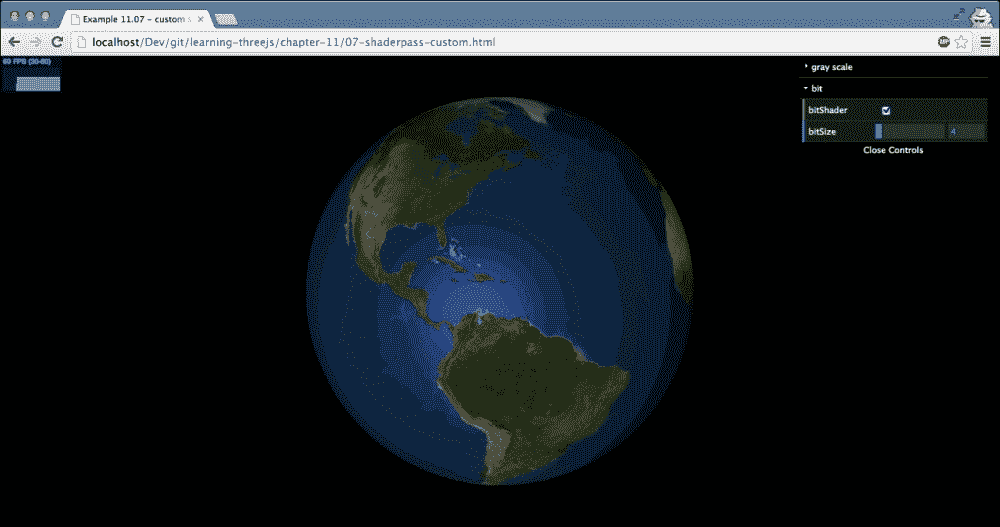

本章关于后处理的介绍就到这里。

# 摘要

在本章中，我们讨论了许多不同的后处理选项。正如你所见，创建`THREE.EffectComposer`并将多个步骤链接起来实际上非常简单。你只需记住几点。并非所有步骤都会输出到屏幕。如果你想输出到屏幕，你可以始终使用`THREE.ShaderPass`与`THREE.CopyShader`。将步骤添加到 composer 中的顺序很重要。效果是按照这个顺序应用的。如果你想重用特定`THREE.EffectComposer`实例的结果，你可以通过使用`THREE.TexturePass`来实现。当你有多个`THREE.RenderPass`在`THREE.EffectComposer`中时，请确保将`clear`属性设置为`false`。如果不这样做，你将只能看到最后一个`THREE.RenderPass`步骤的输出。如果你想只将效果应用到特定的对象上，你可以使用`THREE.MaskPass`。当你完成遮罩后，使用`THREE.ClearMaskPass`清除遮罩。除了 Three.js 提供的标准步骤外，还有大量标准着色器可用。你可以将这些着色器与`THREE.ShaderPass`一起使用。使用 Three.js 的标准方法创建自定义后处理着色器非常简单。你只需要创建一个片段着色器。

到目前为止，我们几乎涵盖了关于 Three.js 的所有知识。在下一章，也就是最后一章，我们将探讨一个名为**Physijs**的库，你可以使用它来扩展 Three.js 的功能，并应用碰撞、重力和约束。
