# 第十二章：向场景添加物理和声音

在最后一章中，我们将探讨 Physijs，这是另一个可以用来扩展 Three.js 基本功能的库。Physijs 是一个允许你将物理引入 3D 场景的库。通过物理，我们指的是你的物体受到重力作用，可以相互碰撞，可以通过施加冲量移动，并且可以通过铰链和滑块限制其运动。这个库内部使用了一个名为**ammo.js**的知名物理引擎。除了物理之外，我们还将探讨 Three.js 如何帮助你向场景添加空间声音。

在本章中，我们将讨论以下主题：

+   创建一个 Physijs 场景，其中你的物体受到重力作用并且可以相互碰撞

+   展示如何更改场景中物体的摩擦力和恢复（弹性）系数

+   解释 Physijs 支持的形状及其使用方法

+   展示如何通过组合简单形状来创建复合形状

+   展示高度场如何允许你模拟复杂形状

+   通过应用点、铰链、滑块和圆锥扭曲以及“自由度”约束来限制物体的运动

+   向场景添加声音源，其声音大小和方向基于它们与摄像机的距离。

我们将要做的第一件事是创建一个可以与 Physijs 一起使用的 Three.js 场景。我们将在第一个示例中完成这个任务。

# 创建一个基本的 Three.js 场景

设置 Physijs 的 Three.js 场景非常简单，只需几个步骤。我们首先需要做的是包含正确的 JavaScript 文件，你可以从 GitHub 仓库[`chandlerprall.github.io/Physijs/`](http://chandlerprall.github.io/Physijs/)获取。将 Physijs 库添加到你的 HTML 页面中，如下所示：

```js
<script type="text/javascript" src="img/physi.js"></script>
```

模拟场景相对处理器来说比较密集。如果我们把所有的模拟计算都在渲染线程上运行（因为 JavaScript 本质上是单线程的），这将严重影响我们场景的帧率。为了补偿这一点，Physijs 在其后台线程中进行计算。这个后台线程是通过大多数现代浏览器实现的“web workers”规范提供的。通过这个规范，你可以在单独的线程中运行 CPU 密集型任务，从而不会影响渲染。有关 web workers 的更多信息，可以在[`www.w3.org/TR/workers/`](http://www.w3.org/TR/workers/)找到。

对于 Physijs 来说，这意味着我们必须配置包含此工作任务的 JavaScript 文件，并告诉 Physijs 它可以在哪里找到用于模拟场景所需的 ammo.js 文件。我们需要包含 ammo.js 文件的原因是 Physijs 是围绕 ammo.js 的包装器，以便更容易使用。Ammo.js（你可以在 [`github.com/kripken/ammo.js/`](https://github.com/kripken/ammo.js/) 找到）是实现物理引擎的库；Physijs 只提供了对这个物理库的易于使用的接口。由于 Physijs 只是一个包装器，我们也可以将其他物理引擎与 Physijs 一起使用。在 Physijs 仓库中，你还可以找到一个使用 Cannon.js（一个不同的物理引擎）的分支。

要配置 Physijs，我们必须设置以下两个属性：

```js
Physijs.scripts.worker = '../libs/physijs_worker.js';
Physijs.scripts.ammo = '../libs/ammo.js';
```

第一个属性指向我们想要执行的工作任务，第二个属性指向内部使用的 ammo.js 库。我们需要执行的下一步是创建一个场景。Physijs 提供了围绕 Three.js 正常场景的包装器，因此在你的代码中，你将执行以下操作来创建一个场景：

```js
var scene = new Physijs.Scene();
scene.setGravity(new THREE.Vector3(0, -10, 0));
```

这创建了一个新的场景，其中应用了物理效果，并且我们设置了重力。在这种情况下，我们将 *y* 轴的重力设置为 `-10`。换句话说，物体会直接向下落。你可以设置或更改运行时的重力，使其适用于各个轴的任何值，场景将相应地做出反应。

在我们开始模拟场景中的物理效果之前，我们需要添加一些物体。为此，我们可以使用 Three.js 指定物体的常规方式，但我们必须将它们包裹在一个特定的 Physijs 物体中，以便它们可以被 Physijs 库管理，如下面的代码片段所示：

```js
var stoneGeom = new THREE.BoxGeometry(0.6,6,2);
var stone = new Physijs.BoxMesh(stoneGeom, new THREE.MeshPhongMaterial({color: 0xff0000}));
scene.add(stone);
```

在这个示例中，我们创建了一个简单的 `THREE.BoxGeometry` 对象。我们不是创建 `THREE.Mesh`，而是创建 `Physijs.BoxMesh`，这告诉 Physijs 在模拟物理和检测碰撞时将几何形状视为一个盒子。Physijs 提供了多种网格，你可以用于各种形状。有关可用形状的更多信息，请参阅本章后面的内容。

现在，`THREE.BoxMesh` 已经被添加到场景中，我们拥有了创建第一个 Physijs 场景的所有要素。剩下的唯一要做的事情就是告诉 Physijs 模拟物理效果并更新场景中物体的位置和旋转。我们可以通过在刚刚创建的场景上调用 simulate 方法来实现这一点。因此，为了这个目的，我们将基本的渲染循环更改为以下内容：

```js
render = function() {
  requestAnimationFrame(render);
  renderer.render(scene, camera);
  scene.simulate();
}
```

通过执行最后的步骤，通过调用 `scene.simulate()`，我们为 Physijs 场景设置了基本设置。如果我们运行这个示例，尽管如此，我们也不会看到太多。我们只会看到一个位于屏幕中央的单个立方体，一旦场景渲染，它就会立即开始下落。所以，让我们看看一个更复杂的示例，我们将模拟多米诺骨牌的下落。

对于这个示例，我们将创建以下场景：

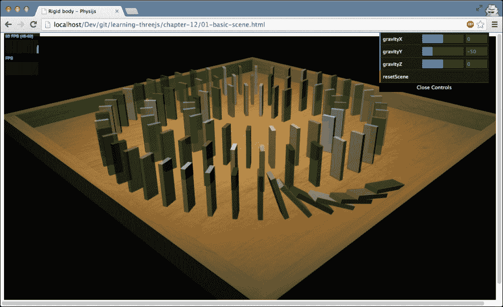

如果您在浏览器中打开`01-basic-scene.html`示例，您将看到一组多米诺骨牌，一旦场景加载，它们就会开始倒下。第一个会翻倒第二个，以此类推。这个场景的完整物理效果由 Physijs 管理。我们为了启动这个动画所做的唯一一件事就是翻倒第一个多米诺骨牌。实际上创建这个场景非常简单，只需几个步骤，如下所示：

1.  定义一个 Physijs 场景。

1.  定义放置石头的地面区域。

1.  放置石头。

1.  翻倒第一块石头。

让我们跳过这个第一步，因为我们已经看到了如何做，直接进入第二步，即定义包含所有石头的沙盒。这个沙盒是由几个组合在一起的盒子构成的。以下是需要完成此任务的代码：

```js
function createGround() {
  var ground_material = Physijs.createMaterial(new THREE.MeshPhongMaterial({ map: THREE.ImageUtils.loadTexture( '../assets/textures/general/wood-2.jpg' )}),0.9,0.3);

  var ground = new Physijs.BoxMesh(new THREE.BoxGeometry(60, 1, 60), ground_material, 0);

  var borderLeft = new Physijs.BoxMesh(new THREE.BoxGeometry (2, 3, 60), ground_material, 0);
  borderLeft.position.x=-31;
  borderLeft.position.y=2;
  ground.add(borderLeft);

  var borderRight = new Physijs.BoxMesh(new THREE. BoxGeometry (2, 3, 60), ground_material, 0);
  borderRight.position.x=31;
  borderRight.position.y=2;
  ground.add(borderRight);

  var borderBottom = new Physijs.BoxMesh(new THREE. BoxGeometry (64, 3, 2), ground_material, 0);
  borderBottom.position.z=30;
  borderBottom.position.y=2;
  ground.add(borderBottom);

  var borderTop = new Physijs.BoxMesh(new THREE.BoxGeometry (64, 3, 2), ground_material, 0);
  borderTop.position.z=-30;
  borderTop.position.y=2;
  ground.add(borderTop);

  scene.add(ground);
}
```

这段代码并不复杂。首先，我们创建一个简单的盒子，作为地面平面，然后我们添加一些边界，以防止物体从这个地面平面上掉落。我们将这些边界添加到地面对象中，以创建一个复合对象。这是一个 Physijs 将其视为单个对象的对象。在这段代码中还有一些其他的新内容，我们将在接下来的章节中深入解释。第一个是新创建的`ground_material`，我们使用`Physijs.createMaterial`函数创建这个材质。这个函数包装了一个标准的 Three.js 材质，但允许我们设置材质的`friction`和`restitution`（弹性）。更多关于这一点的内容将在下一节中介绍。另一个新方面是我们添加到`Physijs.BoxMesh`构造函数的最后一个参数。在本节中我们创建的所有`BoxMesh`对象中，我们添加`0`作为最后一个参数。使用这个参数，我们设置物体的重量。我们这样做是为了防止地面受到场景中的重力影响，以免它掉落。

现在我们有了地面，我们可以放置多米诺骨牌。为此，我们创建简单的`Three.BoxGeometry`实例，并将它们包装在`BoxMesh`中，放置在地面网格的特定位置，如下所示：

```js
var stoneGeom = new THREE.BoxGeometry(0.6,6,2);
var stone = new Physijs.BoxMesh(stoneGeom, Physijs.createMaterial(new THREE.MeshPhongMaterial(color: scale(Math.random()).hex(),transparent:true, opacity:0.8})));
stone.position.copy(point);
stone.lookAt(scene.position);
stone.__dirtyRotation = true;
stone.position.y=3.5;
scene.add(stone);
```

我们没有展示计算每个多米诺骨牌位置的代码（请参阅示例源代码中的`getPoints()`函数以了解此内容）；此代码仅显示多米诺骨牌是如何定位的。您在这里可以看到的是，我们再次创建了`BoxMesh`，它包装了`THREE.BoxGeometry`。为了确保多米诺骨牌正确对齐，我们使用`lookAt`函数来设置它们的正确旋转。如果我们不这样做，它们都会朝同一个方向，并且不会倒下。我们必须确保在手动更新 Physijs 包装对象的旋转（或位置）之后，我们告诉 Physijs 某些内容已更改，以便 Physijs 可以更新场景中所有对象的内部表示。对于旋转，我们可以使用内部的`__dirtyRotation`属性，而对于位置，我们将`__dirtyPosition`设置为`true`。

现在剩下的只是推动第一张多米诺骨牌。我们通过将*x*轴的旋转设置为 0.2 来实现这一点，这会使它略微倾斜。场景中的重力将完成剩下的工作，并将第一张多米诺骨牌完全倒下。以下是推动第一张多米诺骨牌的方法：

```js
stones[0].rotation.x=0.2;
stones[0].__dirtyRotation = true;
```

这完成了第一个示例，它已经展示了 Physijs 的许多功能。如果你想玩转重力，你可以通过右上角的菜单来改变它。当你按下**resetScene**按钮时，重力改变将被应用：

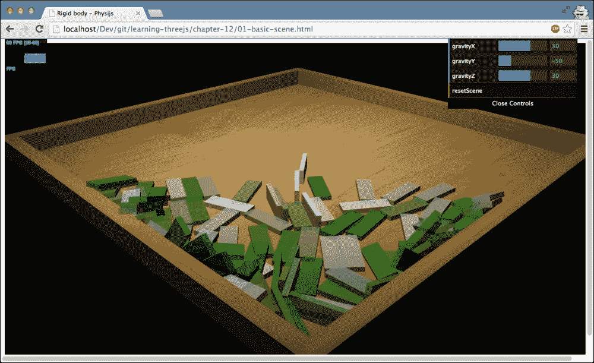

在下一节中，我们将更详细地探讨 Physijs 材料属性如何影响物体。

# 材料属性

让我们从对示例的解释开始。当你打开`02-material-properties.html`示例时，你会看到一个空箱子，它有点类似于之前的示例。这个箱子正在围绕其*x*轴上下旋转。在右上角的菜单中，有几个滑块可以用来改变 Physijs 的一些材料属性。这些属性适用于你可以通过**addCubes**和**addSpheres**按钮添加的立方体和球体。当你按下**addSpheres**按钮时，场景中会添加五个球体，当你按下**addCubes**按钮时，会添加五个立方体。以下是一个演示摩擦和弹性的示例：

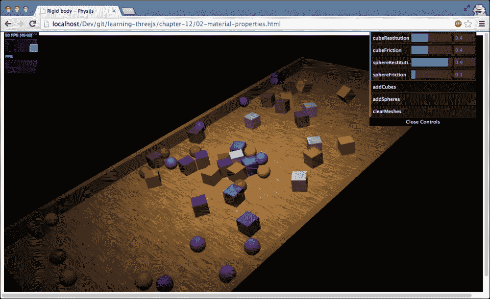

这个示例允许你玩转在创建 Physijs 材料时可以设置的`restitution`（弹性）和`friction`（摩擦）属性。例如，如果你将**cubeFriction**设置为最大值`1`并添加一些立方体，你会发现，即使地面在移动，立方体几乎不动。如果你将**cubeFriction**设置为**0**，你会发现立方体在地面停止水平时立即滑动。以下截图显示了高摩擦力允许立方体抵抗重力：

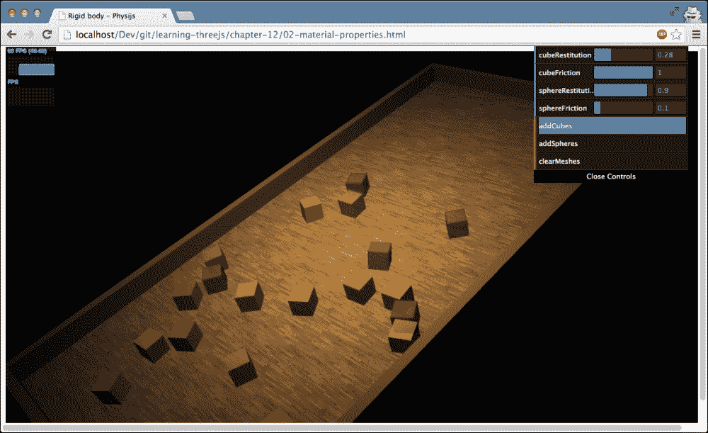

在这个示例中，你可以设置的另一个属性是`restitution`属性。`restitution`属性定义了物体在碰撞时有多少能量被恢复。换句话说，高恢复力创建了一个弹跳物体，而低恢复力会导致物体在撞击另一个物体时立即停止。

### 提示

当你使用物理引擎时，你通常不需要担心检测碰撞。引擎会处理这个问题。然而，有时在两个物体发生碰撞时得到通知是非常有用的。例如，你可能想创建一个声音效果，或者当创建游戏时扣除生命值。

使用 Physijs，你可以给一个 Physijs 网格添加事件监听器，如下面的代码所示：

```js
mesh.addEventListener( 'collision', function( other_object, relative_velocity, relative_rotation, contact_normal ) {
});
```

这样，每当这个网格与 Physijs 处理的另一个网格发生碰撞时，你都会得到通知。

一个演示这个功能的好方法是使用球体，将恢复系数设置为`1`，然后点击几次**addSpheres**按钮。这将创建多个球体，它们会在各个地方弹跳。

在我们进入下一节之前，让我们看看在这个示例中使用的部分代码：

```js
sphere = new Physijs.SphereMesh(new THREE.SphereGeometry( 2, 20 ), Physijs.createMaterial(new THREE.MeshPhongMaterial({color: colorSphere, opacity: 0.8, transparent: true}), controls.sphereFriction, controls.sphereRestitution));
box.position.set(Math.random() * 50 -25, 20 + Math.random() * 5, Math.random() * 50 -25);
scene.add( sphere );
```

这是当我们向场景中添加球体时执行的代码。这次，我们使用了一个不同的 Physijs 网格：`Physijs.SphereMesh`。我们创建`THREE.SphereGeometry`，从提供的网格集中，逻辑上最佳匹配的是`Physijs.SphereMesh`（关于这一点将在下一节中详细介绍）。当我们创建`Physijs.SphereMesh`时，我们传递我们的几何形状并使用`Physijs.createMaterial`创建一个 Physijs 特定的材质。我们这样做是为了能够设置此对象的`friction`和`restitution`。

到目前为止，我们已经看到了`BoxMesh`和`SphereMesh`。在下一节中，我们将解释并展示 Physijs 提供的不同类型的网格，您可以使用这些网格来包裹您的几何形状。

# 基本支持的形状

Physijs 提供了一些形状，您可以使用这些形状来包裹您的几何形状。在本节中，我们将带您了解所有可用的 Physijs 网格，并通过示例演示这些网格。请记住，您要使用这些网格，只需将`THREE.Mesh`构造函数替换为这些网格之一即可。

以下表格提供了 Physijs 中可用的网格概览：

| 名称 | 描述 |
| --- | --- |
| `Physijs.PlaneMesh` | 此网格可用于创建零厚度的平面。您也可以使用`BoxMesh`与`THREE.BoxGeometry`配合，并使用低高度来实现这一点。 |
| `Physijs.BoxMesh` | 如果您有看起来像立方体的几何形状，请使用此网格。例如，这对于`THREE.BoxGeometry`来说是一个很好的匹配。 |
| `Physijs.SphereMesh` | 对于球体形状，使用此几何形状。此几何形状与`THREE.SphereGeometry`相匹配。 |
| `Physijs.CylinderMesh` | 使用`THREE.Cylinder`，您可以创建各种类似圆柱体的形状。Physijs 根据圆柱体的形状提供多个网格。对于具有相同顶部半径和底部半径的普通圆柱体，应使用`Physijs.CylinderMesh`。 |
| `Physijs.ConeMesh` | 如果您将顶部半径指定为`0`并使用正值的底部半径，您可以使用`THREE.Cylinder`来创建一个圆锥体。如果您想将物理效果应用于此类对象，Physijs 的最佳选择是`ConeMesh`。 |
| `Physijs.CapsuleMesh` | 胶囊就像`THREE.Cylinder`，但顶部和底部都是圆形的。我们将在本节的稍后部分向您展示如何在 Three.js 中创建胶囊。 |
| `Physijs.ConvexMesh` | `Physijs.ConvexMesh`是一个可以用于更复杂对象的粗糙形状。它创建一个凸形（就像`THREE.ConvexGeometry`），以近似复杂对象的形状。 |
| `Physijs.ConcaveMesh` | 虽然 `ConvexMesh` 是一个粗略的形状，但 `ConcaveMesh` 是你复杂几何体的更详细表示。请注意，使用 `ConcaveMesh` 的性能惩罚非常高。通常，最好是创建具有自己特定 Physijs 网格的单独几何体，或者将它们组合在一起（就像我们在前面的示例中处理地板那样）。 |
| `Physijs.HeightfieldMesh` | 这个网格是一个非常专业的网格。使用这个网格，你可以从 `THREE.PlaneGeometry` 创建一个高度场。查看 `03-shapes.html` 示例以了解此网格。 |

我们将快速使用 `03-shapes.html` 作为参考，向您介绍这些形状。由于它的使用非常有限，我们不会进一步解释 `Physijs.ConcaveMesh`。

在我们查看示例之前，我们先快速了解一下 `Physijs.PlaneMesh`。这个网格基于 `THREE.PlaneGeometry` 创建了一个简单的平面，如下所示：

```js
var plane = new Physijs.PlaneMesh(new THREE.PlaneGeometry(5,5,10,10), material);

scene.add( plane );
```

在这个函数中，你可以看到我们只是传入一个简单的 `THREE.PlaneGeometry` 来创建这个网格。如果你将它添加到场景中，你会注意到一些奇怪的现象。你刚刚创建的网格不会对重力做出反应。原因是 `Physijs.PlaneMesh` 有一个固定的重量为 `0`，所以它不会对重力做出反应，也不会被其他物体的碰撞所移动。除了这个网格之外，所有其他的网格都会对重力做出反应，并发生碰撞，正如你所期望的那样。以下截图显示了可以放置各种支持形状的高度场：

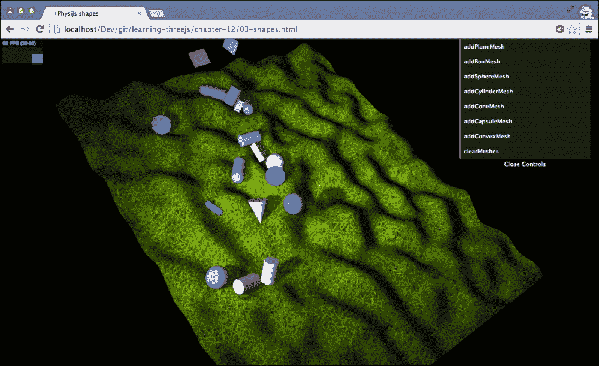

上一张图片显示了 `03-shapes.html` 示例。在这个示例中，我们创建了一个随机的高度场（关于这一点稍后会有更多介绍），并在右上角有一个菜单，你可以使用它来放置各种形状的对象。如果你玩这个示例，你会看到不同的形状如何对高度图和与其他物体的碰撞做出不同的反应。

让我们来看看这些形状的构建过程：

```js
new Physijs.SphereMesh(new THREE.SphereGeometry(3,20),mat);
new Physijs.BoxMesh(new THREE.BoxGeometry(4,2,6),mat);
new Physijs.CylinderMesh(new THREE.CylinderGeometry(2,2,6),mat);
new Physijs.ConeMesh(new THREE.CylinderGeometry(0,3,7,20,10),mat);
```

这里没有什么特别的地方；我们创建一个几何体，并使用 Physijs 中最佳匹配的网格来创建我们添加到场景中的对象。然而，如果我们想使用 `Physijs.CapsuleMesh` 呢？Three.js 不包含类似胶囊的几何体，所以我们必须自己创建一个。以下是实现此目的的代码：

```js
var merged = new THREE.Geometry();
var cyl = new THREE.CylinderGeometry(2, 2, 6);
var top = new THREE.SphereGeometry(2);
var bot = new THREE.SphereGeometry(2);

var matrix = new THREE.Matrix4();
matrix.makeTranslation(0, 3, 0);
top.applyMatrix(matrix);

var matrix = new THREE.Matrix4();
matrix.makeTranslation(0, -3, 0);
bot.applyMatrix(matrix);

// merge to create a capsule
merged.merge(top);
merged.merge(bot);
merged.merge(cyl);

// create a physijs capsule mesh
var capsule = new Physijs.CapsuleMesh(merged, getMaterial());
```

`Physijs.CapsuleMesh` 看起来像一个圆柱体，但顶部和底部是圆滑的。我们可以通过创建一个圆柱体（`cyl`）和两个球体（`top` 和 `bot`）并使用 `merge()` 函数将它们合并在一起来轻松地在 Three.js 中重新创建这个形状。以下截图显示了几个胶囊沿着高度场滚动：

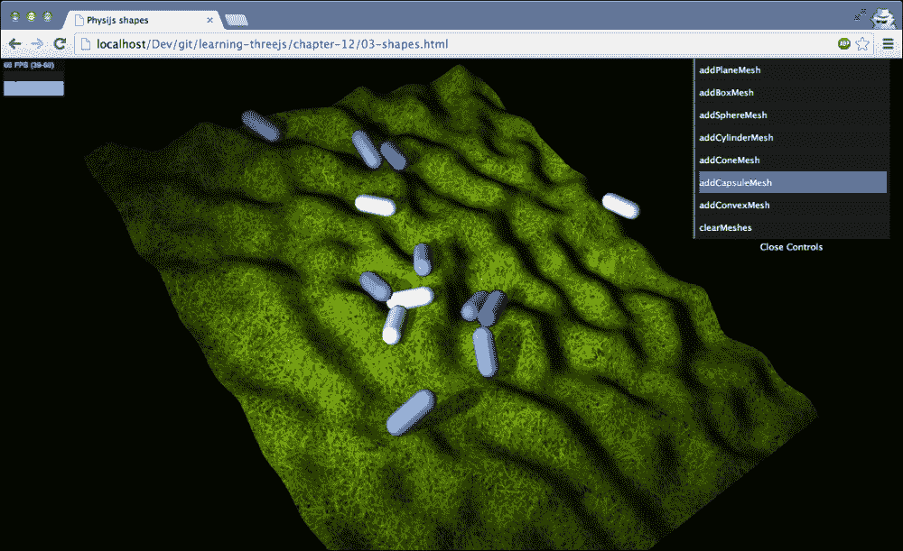

在我们查看高度图之前，让我们看看这个示例中可以添加的最后一个形状，`Physijs.ConvexMesh`。凸形是包裹一个几何体所有顶点的最小形状。生成的形状将只有小于 180 度的角度。你会使用这个网格来创建复杂的形状，如以下代码中所示的环面结：

```js
var convex = new Physijs.ConvexMesh(new THREE.TorusKnotGeometry(0.5,0.3,64,8,2,3,10), material);
```

在这个情况下，对于物理模拟和碰撞，我们将使用环面结的凸面。这是一种非常好的方法来应用物理和检测复杂对象的碰撞，同时最大限度地减少性能影响。

最后要讨论的 Physijs 网格是`Physijs.HeightMap`。以下截图显示了使用 Physijs 创建的高度图：

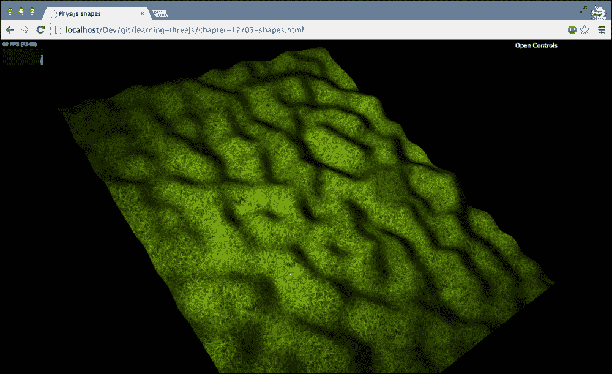

使用高度图，你可以非常容易地创建包含凹凸和浅滩的地形。使用`Physijs.Heightmap`，我们确保所有物体都正确地响应这个地形的起伏差异。让我们看看完成这个任务所需的代码：

```js
var date = new Date();
var pn = new Perlin('rnd' + date.getTime());

function createHeightMap(pn) {

  var ground_material = Physijs.createMaterial(
    new THREE.MeshLambertMaterial({
      map: THREE.ImageUtils.loadTexture('../assets/textures/ground/grasslight-big.jpg')
    }),
    0.3, // high friction
    0.8 // low restitution
  );

  var ground_geometry = new THREE.PlaneGeometry(120, 100, 100, 100);
  for (var i = 0; i < ground_geometry.vertices.length; i++) {
    var vertex = ground_geometry.vertices[i];
    var value = pn.noise(vertex.x / 10, vertex.y / 10, 0);
    vertex.z = value * 10;
  }
  ground_geometry.computeFaceNormals();
  ground_geometry.computeVertexNormals();

  var ground = new Physijs.HeightfieldMesh(
    ground_geometry,
    ground_material,
    0, // mass
    100,
    100
  );
  ground.rotation.x = Math.PI / -2;
  ground.rotation.y = 0.4;
  ground.receiveShadow = true;

  return ground;
}
```

在这个代码片段中，我们采取了一些步骤来创建示例中可以看到的高度图。首先，我们创建了 Physijs 材质和一个简单的`PlaneGeometry`对象。为了从`PlaneGeometry`创建凹凸地形，我们遍历这个几何体的每个顶点并随机设置`z`属性。为此，我们使用 Perlin 噪声生成器创建一个凹凸图，就像我们在第十章的“使用画布作为凹凸图”部分中使用的凹凸图一样，第十章，*加载和使用纹理*。我们需要调用`computeFaceNormals`和`computeVertexNormals`来确保纹理、光照和阴影被正确渲染。此时，我们有了包含正确高度信息`PlaneGeometry`。使用`PlaneGeometry`，我们可以创建`Physijs.HeightFieldMesh`。构造函数的最后两个参数接受`PlaneGeometry`的水平段和垂直段数，应该与构建`PlaneGeometry`时使用的最后两个属性匹配。最后，我们将`HeightFieldMesh`旋转到我们想要的位置并将其添加到场景中。现在，所有其他 Physijs 对象都将正确地与这个高度图交互。

# 使用约束限制物体的运动

到目前为止，我们已经看到了一些基本的物理效果。我们看到了各种形状如何响应重力、摩擦和恢复力，以及它们如何影响碰撞。Physijs 还提供了高级结构，允许你限制你物体的运动。在 Physijs 中，这些对象被称为约束。以下表格概述了 Physijs 中可用的约束：

| 约束 | 描述 |
| --- | --- |
| `PointConstraint` | 这允许你将一个物体的位置固定到另一个物体的位置。如果一个物体移动，另一个物体也会随之移动，保持它们之间的距离和方向不变。 |
| `HingeConstraint` | `HingeConstraint`允许你限制一个物体的运动，就像它在一个铰链上一样，例如一扇门。 |
| `SliderConstraint` | 正如名称所暗示的，这个约束允许你将一个物体的运动限制到一个单一轴上，例如滑动门。 |
| `ConeTwistConstraint` | 使用这个约束，你可以限制一个对象相对于另一个对象的旋转和移动。这个约束的作用类似于球窝关节，例如，你的手臂在肩窝中的移动方式。 |
| `DOFConstraint` | `DOFConstraint`允许你指定围绕三个轴中的任何一个轴的移动限制，并允许你设置允许的最小和最大角度。这是所有约束中最灵活的。 |

理解这些约束的最简单方法是通过观察它们在实际中的表现并与之互动。为此，我们提供了一个示例，其中使用了所有这些约束，`04-physijs-constraints.js`。以下截图显示了此示例：

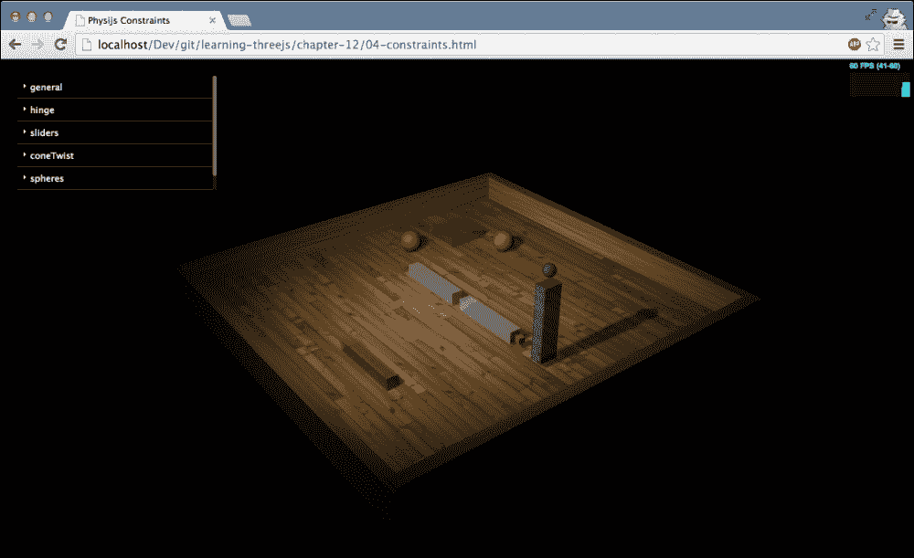

基于这个示例，我们将向您介绍这五个约束中的四个。对于`DOFConstraint`，我们创建了一个单独的示例。我们首先查看的是`PointConstraint`。

## 使用 PointConstraint 限制两点之间的移动

如果你打开示例，你会看到两个红色的球体。这两个球体通过`PointConstraint`连接在一起。通过左上角的菜单，你可以移动绿色的滑块。一旦其中一个滑块接触到其中一个红色球体，你就会看到它们以相同的方式移动，并且保持它们之间的距离不变，同时仍然遵守重量、重力、摩擦和其他物理方面的规则。

在本例中，`PointConstraint`的创建方式如下：

```js
function createPointToPoint() {
  var obj1 = new THREE.SphereGeometry(2);
  var obj2 = new THREE.SphereGeometry(2);

  var objectOne = new Physijs.SphereMesh(obj1, Physijs.createMaterial(new THREE.MeshPhongMaterial({color: 0xff4444, transparent: true, opacity:0.7}),0,0));

  objectOne.position.x = -10;
  objectOne.position.y = 2;
  objectOne.position.z = -18;

  scene.add(objectOne);

  var objectTwo = new Physijs.SphereMesh(obj2,Physijs.createMaterial(new THREE.MeshPhongMaterial({color: 0xff4444, transparent: true, opacity:0.7}),0,0));

  objectTwo.position.x = -20;
  objectTwo.position.y = 2;
  objectTwo.position.z = -5;

  scene.add(objectTwo);

  var constraint = new Physijs.PointConstraint(objectOne, objectTwo, objectTwo.position);
  scene.addConstraint(constraint);
}
```

在这里，你可以看到我们使用 Physijs 特定的网格（在本例中为`SphereMesh`）创建对象并将它们添加到场景中。我们使用`Physijs.PointConstraint`构造函数来创建约束。这个约束需要三个参数：

+   前两个参数定义了你想要连接到彼此的对象。在这种情况下，我们将两个球体连接在一起。

+   第三个参数定义了约束绑定到的位置。例如，如果你将第一个对象绑定到一个非常大的对象上，你可以设置这个位置，例如，设置到该对象的右侧。通常，如果你只是想将两个对象连接在一起，一个好的选择就是将其设置为第二个对象的位置。

如果你不想将一个对象固定到另一个对象上，而是将其固定到场景中的静态位置，你可以省略第二个参数。在这种情况下，第一个对象将保持与您指定的位置的相同距离，同时当然遵守重力和其他物理方面的规则。

一旦创建了约束，我们可以通过使用`addConstraint`函数将其添加到场景中来启用它。当你开始尝试使用约束时，你可能会遇到一些奇怪的问题。为了使调试更容易，你可以将`true`传递给`addConstraint`函数。如果你这样做，约束点和方向将在场景中显示出来。这可以帮助你正确地获取约束的旋转和位置。

## 使用 HingeConstraint 创建门状约束

`HingeConstraint`，正如其名所示，允许你创建一个像铰链一样行为的对象。它围绕一个特定的轴旋转，限制运动到指定的角度。在我们的例子中，`HingeConstraint`显示了场景中心的两个白色翻板。这些翻板被约束到小而棕色的立方体上，并且可以围绕它们旋转。如果你想玩这些铰链，你可以通过在**铰链**菜单中勾选`enableMotor`框来启用它们。这将加速翻板到**通用**菜单中指定的速度。负速度会使铰链向下移动，而正速度会使它们向上移动。以下截图显示了铰链在上位和下位的位置：

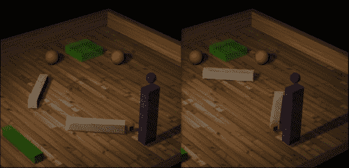

让我们更仔细地看看我们是如何创建这些翻板之一：

```js
var constraint = new Physijs.HingeConstraint(flipperLeft, flipperLeftPivot, flipperLeftPivot.position, new THREE.Vector3(0,1,0));
scene.addConstraint(constraint);
constraint.setLimits(-2.2, -0.6, 0.1, 0);
```

这个约束接受四个参数。让我们更详细地看看每个参数：

| 参数 | 描述 |
| --- | --- |
| `mesh_a` | 函数中传入的第一个对象是要被约束的对象。在这个例子中，第一个对象是作为翻板的白色立方体。这是在运动中受到约束的对象。 |
| `mesh_b` | 第二个对象定义了`mesh_a`被约束到的对象。在这个例子中，`mesh_a`被约束到那个小而棕色的立方体上。如果我们移动这个网格，`mesh_a`会跟随它移动，同时保持`HingeConstraint`的位置不变。你会看到所有约束都有这个选项。例如，如果你创建了一辆可以移动的汽车，并想为打开车门创建一个约束，你可以使用这个选项。如果省略了第二个参数，铰链将被约束到场景中（并且永远无法移动）。 |
| `position` | 这是应用约束的点。在这种情况下，它是`mesh_a`旋转的铰链点。如果你指定了`mesh_b`，这个铰链点将与`mesh_b`的位置和旋转一起移动。 |
| `axis` | 这是铰链应该旋转的轴。在这个例子中，我们已将铰链设置为水平（0,1,0）。 |

将`HingeConstraint`添加到场景中的方式与我们在`PointConstraint`中看到的方式相同。你使用`addConstraint`方法，指定要添加的约束，并可选地添加`true`以显示约束的确切位置和方向，用于调试目的。然而，对于`HingeConstraint`，我们还需要定义允许的运动范围。我们通过`setLimits`函数来完成这个操作。

这个函数接受以下四个参数：

| 参数 | 描述 |
| --- | --- |
| `low` | 这是运动的最小角度，以弧度为单位。 |
| `high` | 这是运动的最大角度，以弧度为单位。 |
| `bias_factor` | 这个属性定义了约束在位置错误后自我校正的速度。例如，当铰链被另一个对象推出其约束时，它会移动到其正确的位置。这个值越高，它校正位置的速度就越快。最好将其保持在`0.5`以下。 |
| `relaxation_factor` | 这定义了约束改变速度的速度。如果这个值设置得较高，当物体达到其最小或最大运动角度时，它将弹跳。 |

如果您想，您可以在运行时更改这些属性。如果您使用具有这些属性的`HingeConstraint`，您不会看到太多的运动。网格只有在被另一个对象撞击或基于重力的情况下才会移动。然而，这个约束，就像许多其他约束一样，也可以被内部电机移动。这就是您在从我们的例子中检查**铰链**子菜单中的`enableMotor`框时看到的情况。以下代码用于启用此电机：

```js
constraint.enableAngularMotor( controls.velocity, controls.acceleration );
```

这将通过提供的加速度将网格（在我们的例子中是翻板）加速到指定的速度。如果我们想将翻板移动到另一边，我们只需指定一个负速度。如果没有限制，这将导致我们的翻板在电机持续运行的情况下旋转。要禁用电机，我们可以调用以下代码：

```js
flipperLeftConstraint.disableMotor();
```

现在，网格将根据摩擦、碰撞、重力和其他物理方面的因素减速。

## 使用 SliderConstraint 限制单轴运动

下一个约束是`SliderConstraint`。使用这个约束，你可以将一个对象的运动限制在其任意一个轴上。在`04-constraints.html`示例中的绿色滑块可以通过**滑块**子菜单进行控制。以下截图显示了此示例：

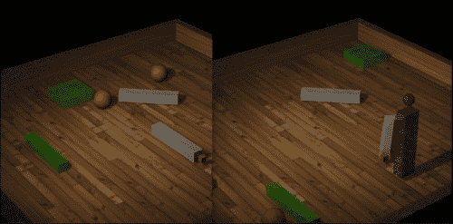

使用**SlidersLeft**按钮，滑块将移动到左侧（它们的下限），而使用**SlidersRight**按钮，它们将移动到右侧（它们的上限）。从代码中创建这些约束非常简单：

```js
var constraint = new Physijs.SliderConstraint(sliderMesh, new THREE.Vector3(0, 2, 0), new THREE.Vector3(0, 1, 0));

scene.addConstraint(constraint);
constraint.setLimits(-10, 10, 0, 0);
constraint.setRestitution(0.1, 0.1);
```

如您从代码中看到的，这个约束需要三个参数（如果您想将一个对象约束到另一个对象，则需要四个参数）。以下表格解释了这个约束的参数：

| 参数 | 描述 |
| --- | --- |
| `mesh_a` | 函数接收的第一个对象是要被约束的对象。在这个例子中，第一个对象是作为滑块的绿色立方体。这是将要被限制其运动的对象。 |
| `mesh_b` | 这是第二个对象，它定义了`mesh_a`被约束到哪个对象。这是一个可选参数，在这个例子中被省略。如果省略，网格将被约束到场景中。如果指定，当这个网格移动或其方向改变时，滑块将移动。 |
| `position` | 这是应用约束的点。当将`mesh_a`约束到`mesh_b`时，这一点尤为重要。 |

| `axis` | 这是`mesh_a`将滑动的轴。注意，如果指定了，这相对于`mesh_b`的方向。在 Physijs 的当前版本中，使用具有线性限制的线性电机时，似乎存在一个奇怪的偏移到这个轴。如果你想要滑动，以下适用于这个版本：

+   *x* 轴：`new` `THREE.Vector3(0,1,0)`

+   *y* 轴：`new` `THREE.Vector3(0,0,Math.PI/2)`

+   *z* 轴：`new` `THREE.Vector3(Math.PI/2,0,0)`

|

在你创建约束并将其使用`scene.addConstraint`添加到场景后，你可以设置`constraint.setLimits(-10,` `10,` `0,` `0)`限制，以指定滑块可以滑动的距离。你可以在`SliderConstraint`上设置以下限制：

| 参数 | 描述 |
| --- | --- |
| `linear_lower` | 这是对象的线性下限 |
| `linear_upper` | 这是对象的线性上限 |
| `angular_lower` | 这是对象的角下限 |
| `angular_higher` | 这是对象的角上限 |

最后，你可以设置当撞击这些限制时发生的恢复（反弹）。你可以通过`constraint.setRestitution(res_linear,` `res_angular)`来完成此操作，其中第一个参数设置撞击线性限制时的反弹量，第二个参数设置撞击角限制时的反弹量。

现在，完整的约束已经配置完成，我们可以等待发生碰撞，使对象在周围滑动或使用电机。对于`SlideConstraint`，我们有两种选择：我们可以使用角电机沿着我们指定的轴加速，遵守我们设置的角限制，或者使用线性电机沿着我们指定的轴加速，遵守线性限制。在这个例子中，我们使用了线性电机。对于使用角电机，请查看`DOFConstraint`，它将在本章后面解释。

## 使用 ConeTwistConstraint 创建类似球窝关节的约束

使用`ConeTwistConstraint`，可以创建一个运动限制在一系列角度的约束。我们可以指定从一个对象到另一个对象在*x*、*y*和*z*轴上的最小和最大角度。以下截图显示`ConeTwistConstraint`允许你在特定角度周围移动对象：

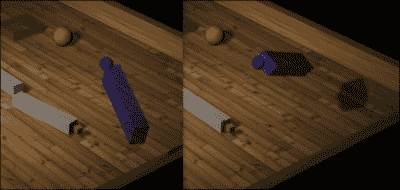

理解`ConeTwistConstraint`的最简单方法是通过查看创建一个所需的代码。完成此操作所需的代码如下：

```js
var baseMesh = new THREE.SphereGeometry(1);
var armMesh = new THREE.BoxGeometry(2, 12, 3);

var objectOne = new Physijs.BoxMesh(baseMesh,Physijs.createMaterial(new THREE.MeshPhongMaterial({color: 0x4444ff, transparent: true, opacity:0.7}), 0, 0), 0);
objectOne.position.z = 0;
objectOne.position.x = 20;
objectOne.position.y = 15.5;
objectOne.castShadow = true;
scene.add(objectOne);

var objectTwo = new Physijs.SphereMesh(armMesh,Physijs.createMaterial(new THREE.MeshPhongMaterial({color: 0x4444ff, transparent: true, opacity:0.7}), 0, 0), 10);
objectTwo.position.z = 0;
objectTwo.position.x = 20;
objectTwo.position.y = 7.5;
scene.add(objectTwo);
objectTwo.castShadow = true;

var constraint = new Physijs.ConeTwistConstraint(objectOne, objectTwo, objectOne.position);

scene.addConstraint(constraint);

constraint.setLimit(0.5*Math.PI, 0.5*Math.PI, 0.5*Math.PI);
constraint.setMaxMotorImpulse(1);
constraint.setMotorTarget(new THREE.Vector3(0, 0, 0));
```

在这段 JavaScript 代码中，您可能已经认识到了我们之前讨论的许多概念。我们首先创建连接到彼此的约束对象：`objectOne`（一个球体）和`objectTwo`（一个盒子）。我们将这些对象定位，使`objectTwo`悬挂在`objectOne`下方。现在我们可以创建`ConeTwistConstraint`。如果您已经看过其他约束，那么这个约束所接受的参数不会是什么新东西。第一个参数是要约束的对象，第二个参数是第一个对象要约束的对象，最后一个参数是约束构建的位置（在这种情况下，它是`objectOne`旋转的点）。在将约束添加到场景后，我们可以使用`setLimit`函数设置其限制。这个函数接受三个弧度值，指定每个轴的最大角度。

就像大多数其他约束一样，我们可以使用约束提供的电机来移动`objectOne`。对于`ConeTwistConstraint`，我们设置`MaxMotorImpulse`（电机可以施加的力的大小），并设置电机应将`objectOne`移动到的目标角度。在这个例子中，我们将其直接移动到球体下方的静止位置。您可以像以下截图所示，通过设置此目标值来尝试这个示例：

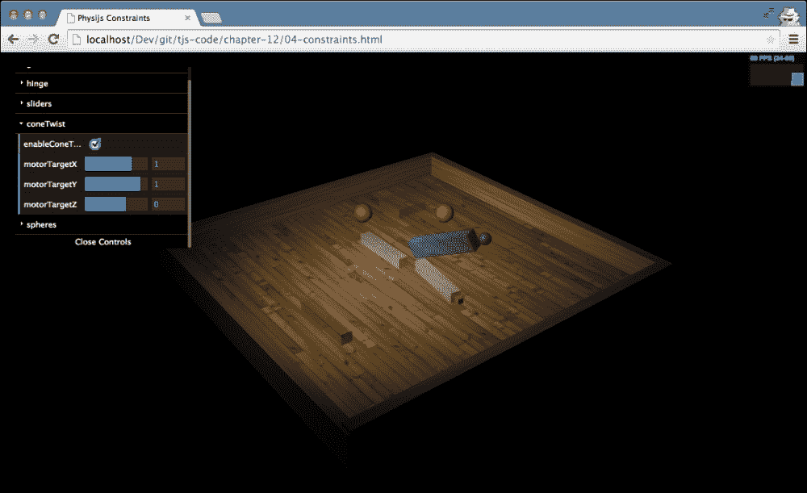

我们将要查看的最后一种约束也是最通用的——`DOFConstraint`。

## 使用 DOFConstraint 创建详细控制

`DOFConstraint`，也称为自由度约束，允许您精确控制对象的线性运动和角运动。我们将通过创建一个示例来展示如何使用这种约束，在这个示例中，您可以驾驶一个类似汽车的简单形状。这个形状由一个矩形组成，作为车身，四个球体作为车轮。让我们先从创建车轮开始：

```js
function createWheel(position) {
  var wheel_material = Physijs.createMaterial(
   new THREE.MeshLambertMaterial({
     color: 0x444444,
     opacity: 0.9,
     transparent: true
    }),
    1.0, // high friction
    0.5 // medium restitution
  );

  var wheel_geometry = new THREE.CylinderGeometry(4, 4, 2, 10);
  var wheel = new Physijs.CylinderMesh(
    wheel_geometry,
    wheel_material,
    100
  );

  wheel.rotation.x = Math.PI / 2;
  wheel.castShadow = true;
  wheel.position = position;
  return wheel;
}
```

在这段代码中，我们只创建了一个简单的`CylinderGeometry`和`CylinderMesh`对象，可以用作我们汽车的车轮。以下截图显示了上述代码的结果：

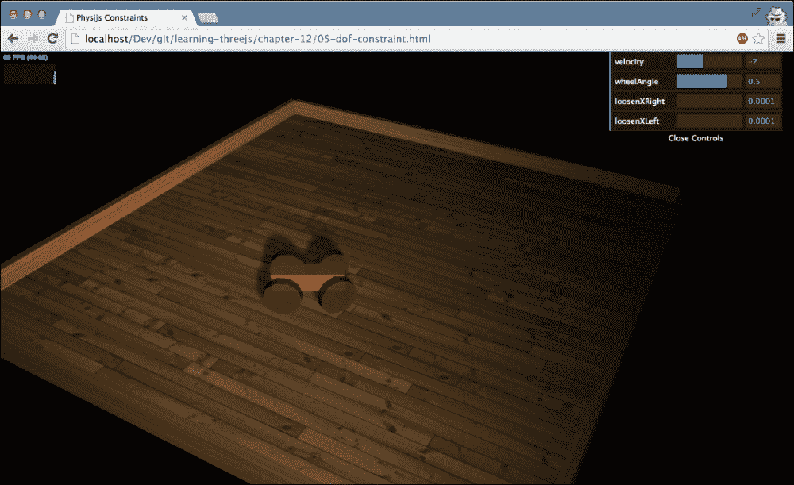

接下来，我们需要创建汽车的车身，并将所有内容添加到场景中：

```js
var car = {};
var car_material = Physijs.createMaterial(new THREE.MeshLambertMaterial({
    color: 0xff4444,
    opacity: 0.9,  transparent: true
  }),   0.5, 0.5 
);

var geom = new THREE.BoxGeometry(15, 4, 4);
var body = new Physijs.BoxMesh(geom, car_material, 500);
body.position.set(5, 5, 5);
body.castShadow = true;
scene.add(body);

var fr = createWheel(new THREE.Vector3(0, 4, 10));
var fl = createWheel(new THREE.Vector3(0, 4, 0));
var rr = createWheel(new THREE.Vector3(10, 4, 10));
var rl = createWheel(new THREE.Vector3(10, 4, 0));

scene.add(fr);
scene.add(fl);
scene.add(rr);
scene.add(rl);
```

到目前为止，我们只是创建了将组成我们汽车的各个独立组件。为了将所有这些组件结合起来，我们将创建约束。每个车轮都将被约束到`body`上。约束的创建方式如下：

```js
var frConstraint = new Physijs.DOFConstraint(fr,body, new THREE.Vector3(0,4,8));
scene.addConstraint(frConstraint);
var flConstraint = new Physijs.DOFConstraint (fl,body, new THREE.Vector3(0,4,2));
scene.addConstraint(flConstraint);
var rrConstraint = new Physijs.DOFConstraint (rr,body, new THREE.Vector3(10,4,8));
scene.addConstraint(rrConstraint);
var rlConstraint = new Physijs.DOFConstraint (rl,body, new THREE.Vector3(10,4,2));
scene.addConstraint(rlConstraint);
```

每个轮子（第一个参数）都有自己的约束，并且轮子连接到汽车上的位置（第二个参数）由最后一个参数指定。如果我们以这种配置运行，我们会看到四个轮子支撑着汽车的车身。为了使汽车移动，我们还需要做两件事：我们需要设置轮子的约束（它们可以沿哪个轴移动），并且我们需要配置正确的电机。首先，我们设置两个前轮的约束；我们希望这些前轮能够沿着*z*轴旋转，以便为汽车提供动力，并且不允许它们沿其他轴移动。

完成此操作所需的代码如下：

```js
frConstraint.setAngularLowerLimit({ x: 0, y: 0, z: 0 });
frConstraint.setAngularUpperLimit({ x: 0, y: 0, z: 0 });
flConstraint.setAngularLowerLimit({ x: 0, y: 0, z: 0 });
flConstraint.setAngularUpperLimit({ x: 0, y: 0, z: 0 });
```

乍一看，这可能会觉得奇怪。通过将上下限设置为相同的值，我们确保在指定方向上不可能发生旋转。这也意味着车轮不能围绕其*z*轴旋转。我们这样指定的原因是，当你为特定轴启用电机时，这些限制将被忽略。因此，此时在*z*轴上设置限制对我们的前轮没有任何影响。

我们将用后轮来转向，为了确保它们不会翻倒，我们需要固定*x*轴。以下代码中，我们固定了*x*轴（将上下限设置为`0`），固定*y*轴以便这些轮子已经初始转向，并禁用*z*轴上的任何限制：

```js
rrConstraint.setAngularLowerLimit({ x: 0, y: 0.5, z: 0.1 });
rrConstraint.setAngularUpperLimit({ x: 0, y: 0.5, z: 0 });
rlConstraint.setAngularLowerLimit({ x: 0, y: 0.5, z: 0.1 });
rlConstraint.setAngularUpperLimit({ x: 0, y: 0.5, z: 0 });
```

如您所见，为了禁用限制，我们必须将特定轴的下限设置得高于上限。这将允许在该轴周围自由旋转。如果我们不对*z*轴进行此设置，这两个轮子将只是被拖动。在这种情况下，由于与地面的摩擦，它们将与其他轮子一起转动。

剩下的工作就是设置前轮的电机，这可以按照以下方式完成：

```js
flConstraint.configureAngularMotor(2, 0.1, 0, -2, 1500);
frConstraint.conAngularMotor(2, 0.1, 0, -2, 1500);
```

由于我们可以为三个轴创建电机，因此我们需要指定电机工作的轴：0 是*x*轴，1 是*y*轴，2 是*z*轴。第二个和第三个参数定义了电机的角度限制。在这里，我们再次将下限(`0.1`)设置得高于上限(`0`)，以允许自由旋转。第三个参数指定了我们想要达到的速度，最后一个参数指定了该电机可以施加的力。如果这个值太小，汽车将无法移动；如果太高，后轮将离开地面。

使用以下代码启用它们：

```js
flConstraint.enableAngularMotor(2);
frConstraint.enableAngularMotor(2);
```

如果你打开`05-dof-constraint.html`示例，你可以玩转各种约束和电机，并在场景中驾驶汽车。以下截图显示了此示例：

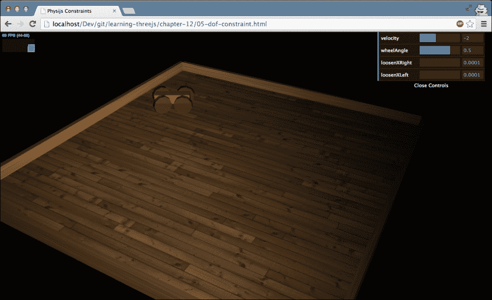

在下一节中，我们将探讨本书将要讨论的最后一个主题，即如何向你的 Three.js 场景添加声音。

## 向场景添加声音源

到目前为止，我们已经有了创建美丽场景、游戏和其他 3D 可视化的许多成分。然而，我们还没有展示如何将声音添加到你的 Three.js 场景中。在本节中，我们将探讨两个 Three.js 对象，允许你将声音源添加到场景中。这特别有趣，因为这些声音源会响应相机的位置：

+   声音源和相机之间的距离决定了声音源的音量。

+   相机左侧和右侧的位置分别决定了左侧扬声器和右侧扬声器的音量。

最好的解释方式就是看到这个动作。在你的浏览器中打开`06-audio.html`示例，你会看到三个带有动物图片的立方体。以下截图显示了此示例：

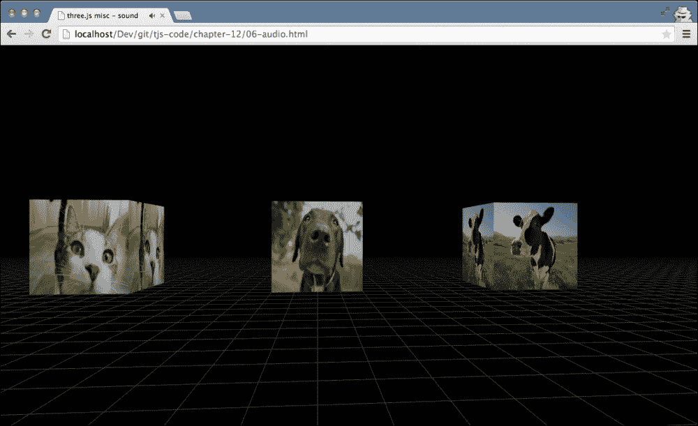

此示例使用了我们在第九章中看到的第一个视角控制，*动画和移动相机*，因此你可以使用箭头键与鼠标结合来在场景中移动。你会看到，当你靠近一个特定的立方体时，那个特定的动物声音会变得更响。如果你将相机置于狗和牛之间，你会从右侧听到牛的声音，从左侧听到狗的声音。

### 提示

在这个例子中，我们使用了 Three.js 中的一个特定助手`THREE.GridHelper`来创建立方体下面的网格：

```js
var helper = new THREE.GridHelper( 500, 10 );
helper.color1.setHex( 0x444444 );
helper.color2.setHex( 0x444444 );
scene.add( helper );
```

要创建一个网格，你需要指定网格的大小（本例中为 500）以及单个网格元素的大小（我们这里使用的是 10）。如果你想的话，你也可以通过指定`color1`和`color2`属性来设置水平线的颜色。

完成这个功能只需要很少的代码。我们首先需要做的是定义`THREE.AudioListener`并将其添加到`THREE.PerspectiveCamera`中，如下所示：

```js
var listener1 = new THREE.AudioListener();
camera.add( listener1 );
```

接下来，我们需要创建`THREE.Mesh`并添加一个`THREE.Audio`对象到该网格中，如下所示：

```js
var cube = new THREE.BoxGeometry(40, 40, 40);

var material_1 = new THREE.MeshBasicMaterial({
  color: 0xffffff,
  map: THREE.ImageUtils.loadTexture("../assets/textures/animals/cow.png")
});

var mesh1 = new THREE.Mesh(cube, material_1);
mesh1.position.set(0, 20, 100);

var sound1 = new THREE.Audio(listener1);
sound1.load('../assets/audio/cow.ogg');
sound1.setRefDistance(20);
sound1.setLoop(true);
sound1.setRolloffFactor(2);

mesh1.add(sound1);
```

如从这个代码片段中可以看到，我们首先创建了一个标准的`THREE.Mesh`实例。接下来，我们创建了一个`THREE.Audio`对象，并将其连接到我们之前创建的`THREE.AudioListener`对象。最后，我们将`THREE.Audio`对象添加到我们创建的网格中，这样就完成了。

我们可以在`THREE.Audio`对象上设置一些属性来配置其行为：

+   `load`: 这允许我们加载一个音频文件进行播放。

+   `setRefDistance`: 这决定了从哪个距离开始，声音的音量会降低。

+   `setLoop`: 默认情况下，声音只播放一次。通过将此属性设置为`true`，声音将循环播放。

+   `setRolloffFactor`: 这决定了当你远离声音源时，音量下降的速度。

在内部，Three.js 使用 Web Audio API（[http://webaudio.github.io/web-audio-api/](http://webaudio.github.io/web-audio-api/））来播放声音并确定正确的音量。并非所有浏览器都支持这个规范。目前最好的支持来自 Chrome 和 Firefox。

# 摘要

在最后一章中，我们探讨了如何通过添加物理来扩展 Three.js 的基本 3D 功能。为此，我们使用了 Physijs 库，它允许你添加重力、碰撞、约束等等。我们还展示了如何使用`THREE.Audio`和`THREE.AudioListener`对象将位置声音添加到你的场景中。通过这些主题，我们到达了 Three.js 这本书的结尾。在这些章节中，我们涵盖了众多不同的主题，几乎探索了 Three.js 所能提供的一切。在前几章中，我们解释了 Three.js 背后的核心概念和理念；之后，我们探讨了可用的光源以及材质如何影响对象的渲染。在基础知识之后，我们探索了 Three.js 提供的各种几何体以及如何组合几何体来创建新的几何体。

在本书的第二部分，我们探讨了几个更高级的主题。你学习了如何创建粒子系统，如何从外部源加载模型，以及如何创建动画。最后，在这最后几章中，我们探讨了在场景渲染后可以使用的先进纹理以及后处理效果。我们以这一章关于物理学的讨论结束本书，除了解释如何将物理添加到你的 Three.js 场景中，还展示了围绕 Three.js 的活跃社区项目，你可以使用这些项目为这个已经非常出色的库添加更多功能。

我希望你喜欢阅读这本书，就像我写作时一样喜欢尝试这些示例！
