# 第八章：创建和加载高级网格和几何体

在本章中，我们将探讨几种不同的方法来创建和加载高级和复杂的几何体和网格。在第*5 章*“学习与几何体一起工作”和第*6 章*“探索高级几何体”中，我们向您展示了如何使用 Three.js 的内置对象创建一些高级几何体。在本章中，我们将使用以下两种方法来创建高级几何体和网格：

+   几何分组和合并

+   从外部资源加载几何体

我们从“分组和合并”方法开始。使用这种方法，我们使用标准的 Three.js 分组（`THREE.Group`）和`BufferGeometryUtils.mergeBufferGeometries()`函数来创建新的对象。

# 几何分组和合并

在本节中，我们将探讨 Three.js 的两个基本功能：将对象分组在一起以及将多个几何体合并成一个单一的几何体。我们将从分组对象开始。

## 将对象分组在一起

在一些前面的章节中，您已经看到了在处理多个材质时如何分组对象。当您使用多个材质从几何体创建网格时，Three.js 会创建一个组。您的几何体的多个副本被添加到这个组中，每个副本都有其特定的材质。这个组被返回，所以它看起来像是一个使用多个材质的网格。然而，实际上，它是一个包含多个网格的组。

创建组非常简单。你创建的每个网格都可以包含子元素，可以使用`add`函数添加。将子对象添加到组中的效果是，你可以移动、缩放、旋转和平移父对象，所有子对象也会受到影响。当使用组时，你仍然可以引用、修改和定位单个几何体。你需要记住的唯一一点是，所有位置、旋转和平移都是相对于父对象进行的。

让我们看看以下截图中的示例（`grouping.html`）：

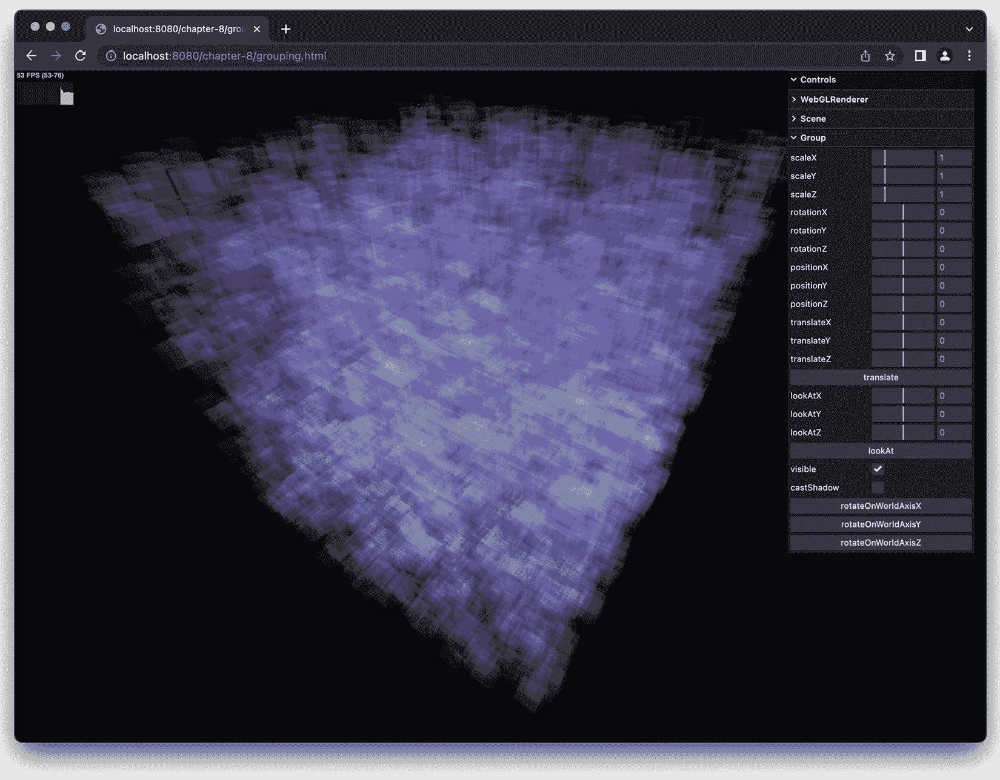

图 8.1 – 使用 THREE.Group 对象将对象分组在一起

在这个示例中，您可以看到大量被作为一个单一组添加到场景中的立方体。在我们查看控件和使用组的效果之前，让我们快速看看我们是如何创建这个网格的：

```js
  const size = 1
  const amount = 5000
  const range = 20
  const group = new THREE.Group()
  const mat = new THREE.MeshNormalMaterial()
  mat.blending = THREE.NormalBlending
  mat.opacity = 0.1
  mat.transparent = true
  for (let i = 0; i < amount; i++) {
    const x = Math.random() * range - range / 2
    const y = Math.random() * range - range / 2
    const z = Math.random() * range - range / 2
    const g = new THREE.BoxGeometry(size, size, size)
    const m = new THREE.Mesh(g, mat)
    m.position.set(x, y, z)
    group.add(m)
  }
```

在这个代码片段中，你可以看到我们创建了一个 `THREE.Group` 实例。这个对象几乎与 `THREE.Object3D` 相同，它是 `THREE.Mesh` 和 `THREE.Scene` 的基类，但本身不包含任何内容或导致任何渲染。在这个示例中，我们使用 `add` 函数将大量立方体添加到这个场景中。对于这个示例，我们添加了你可以用来改变网格位置的控件。每次你使用这个菜单改变一个属性时，`THREE.Group` 对象的相关属性也会改变。例如，在下一个示例中，你可以看到当我们缩放这个 `THREE.Group` 对象时，所有嵌套的立方体也会相应缩放：

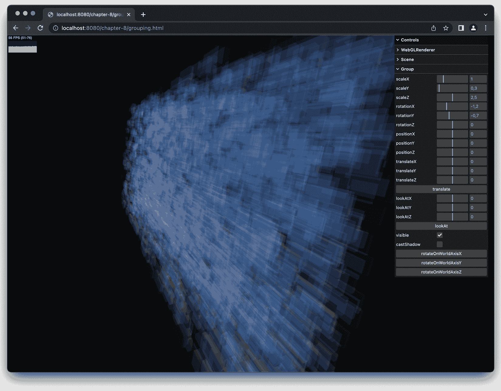

图 8.2 – 缩放一个组

如果你想要对 `THREE.Group` 对象进行更多实验，一个很好的练习是修改示例，使得 `THREE.Group` 实例本身在 *x* 轴上旋转，而单个立方体在其 *y* 轴上旋转。

使用 THREE.Group 的性能影响

在我们进入下一节，探讨合并之前，先快速说明一下性能问题。当你使用 `THREE.Group` 时，这个组内所有的单个网格都被当作独立对象处理，Three.js 需要管理并渲染这些对象。如果你场景中有大量对象，你会注意到性能的明显下降。如果你查看图 8.2 的左上角，你可以看到，当屏幕上有 5,000 个立方体时，我们大约得到 56 **帧每秒**（**FPS**）。还不错，但通常我们会以大约 120 FPS 的速度运行。

Three.js 提供了一种额外的方法，我们可以仍然控制单个网格，但获得更好的性能。这是通过 `THREE.InstancedMesh` 实现的。如果你想要渲染大量具有相同几何形状但具有不同变换（例如，旋转、缩放、颜色或任何其他矩阵变换）的对象，这个对象工作得非常好。

我们创建了一个名为 `instanced-mesh.html` 的示例，展示了这是如何工作的。在这个示例中，我们渲染了 250,000 个立方体，但性能依然出色：


图 8.3 – 使用实例网格对象进行分组

要与 `THREE.InstancedMesh` 对象一起工作，我们创建它的方式与创建 `THREE.Group` 实例的方式类似：

```js
  const size = 1
  const amount = 250000
  const range = 20
  const mat = new THREE.MeshNormalMaterial()
  mat.opacity = 0.1
  mat.transparent = true
  mat.blending = THREE.NormalBlending
  const g = new THREE.BoxGeometry(size, size, size)
  const mesh = new THREE.InstancedMesh(g, mat, amount)
  for (let i = 0; i < amount; i++) {
    const x = Math.random() * range - range / 2
    const y = Math.random() * range - range / 2
    const z = Math.random() * range - range / 2
    const matrix = new THREE.Matrix4()
    matrix.makeTranslation(x, y, z)
    mesh.setMatrixAt(i, matrix)
  }
```

与创建 `THREE.InstancedMesh` 对象相比，与 `THREE.Group` 的主要区别在于，我们需要事先定义我们想要使用哪种材质和几何形状，以及我们想要创建多少个这种几何形状的实例。为了定位或旋转我们的一个实例，我们需要提供一个使用 `THREE.Matrix4` 实例的变换。幸运的是，我们不需要深入研究矩阵背后的数学，因为 Three.js 在 `THREE.Matrix4` 实例上为我们提供了一些辅助函数来定义旋转、平移以及其他一些变换。在这个例子中，我们只是将每个实例随机定位。

因此，如果你正在处理少量网格（或使用不同几何形状的网格），如果你想将它们组合在一起，你应该使用 `THREE.Group` 对象。如果你处理的是大量共享几何和材质的网格，你可以使用 `THREE.InstancedMesh` 对象或 `THREE.InstancedBufferGeometry` 对象以获得极大的性能提升。

在下一节中，我们将探讨合并，你将结合多个单独的几何形状，最终得到一个单一的 `THREE.Geometry` 对象。

## 几何形状合并

在大多数情况下，使用组可以让你轻松地操作和管理大量网格。然而，当你处理一个非常大的对象数量时，性能将成为一个问题，因为 Three.js 必须单独处理组的所有子对象。使用 `BufferGeometryUtils.mergeBufferGeometries`，你可以将几何形状合并在一起，创建一个组合的几何形状，这样 Three.js 就只需要管理这个单一的几何形状。在 *图 8.4* 中，你可以看到这是如何工作的以及它对性能的影响。如果你打开 `merging.html` 示例，你会再次看到一个场景，其中包含相同的一组随机分布的半透明立方体，我们将它们合并成了一个单一的 `THREE.BufferGeometry` 对象：


图 8.4 – 500,000 个几何形状合并成一个单一的几何形状

如你所见，我们可以轻松渲染 50,000 个立方体而不会出现任何性能下降。为此，我们使用了以下几行代码：

```js
  const size = 1
  const amount = 500000
  const range = 20
  const mat = new THREE.MeshNormalMaterial()
  mat.blending = THREE.NormalBlending
  mat.opacity = 0.1
  mat.transparent = true
  const geoms = []
  for (let i = 0; i < amount; i++) {
    const x = Math.random() * range - range / 2
    const y = Math.random() * range - range / 2
    const z = Math.random() * range - range / 2
    const g = new THREE.BoxGeometry(size, size, size)
    g.translate(x, y, z)
    geoms.push(g)
  }
  const merged = BufferGeometryUtils.
    mergeBufferGeometries(geoms)
  const mesh = new THREE.Mesh(merged, mat)
```

在这个代码片段中，我们创建了大量 `THREE.BoxGeometry` 对象，我们使用 `BufferGeometryUtils.mergeBufferGeometries(geoms)` 函数将它们合并在一起。结果是单个大几何形状，我们可以将其添加到场景中。最大的缺点是，由于它们都被合并成了一个单一的几何形状，你将失去对单个立方体的控制。如果你想移动、旋转或缩放单个立方体，你无法做到（除非你搜索正确的面和顶点并将它们单独定位）。

通过构造实体几何创建新的几何形状

除了在本章中看到的方式合并几何形状外，我们还可以使用 `three-bvh-csg` ([`github.com/gkjohnson/three-bvh-csg`](https://github.com/gkjohnson/three-bvh-csg)) 和 `Three.csg` ([`github.com/looeee/threejs-csg`](https://github.com/looeee/threejs-csg)) 创建几何形状。

使用分组和合并方法，您可以使用 Three.js 提供的基本几何形状创建大型且复杂的几何形状。如果您想创建更高级的几何形状，那么使用 Three.js 提供的程序化方法并不总是最佳和最简单的方法。幸运的是，Three.js 提供了其他一些创建几何形状的选项。在下一节中，我们将探讨如何从外部资源加载几何形状和网格。

# 从外部资源加载几何形状

Three.js 可以读取大量 3D 文件格式，并导入这些文件中定义的几何形状和网格。这里需要注意的是，这些格式并非所有功能都始终得到支持。因此，有时可能会出现纹理问题，或者材质可能设置不正确。用于交换模型和纹理的新事实标准是 **glTF**，因此如果您想加载外部创建的模型，通常将那些模型导出为 glTF 格式会在 Three.js 中获得最佳结果。

在本节中，我们将更深入地探讨一些 Three.js 支持的格式，但不会向您展示所有加载器。以下列表显示了 Three.js 支持的格式概述：

+   **AMF**: AMF 是另一种 3D 打印标准，但现在已经不再处于积极开发状态。有关此标准的更多信息，请参阅以下 *维基百科* 页面：[`www.sculpteo.com/en/glossary/amf-definition/`](https://www.sculpteo.com/en/glossary/amf-definition/).

+   **3DM**: 3DM 是 Rhinoceros 所使用的格式，这是一个用于创建 3D 模型的工具。有关 Rhinoceros 的更多信息请在此处查看：[`www.rhino3d.com/`](https://www.rhino3d.com/).

+   **3MF**: 3MF 是 3D 打印中使用的标准之一。有关此格式的信息可以在 *3MF 联盟* 主页上找到：[`3mf.io`](https://3mf.io).

+   **COLLAborative Design Activity (COLLADA**): COLLADA 是一种基于 XML 格式定义数字资产的格式。这是一个广泛使用的格式，几乎所有 3D 应用程序和渲染引擎都支持它。

+   **Draco**: Draco 是一种高效存储几何形状和点云的文件格式。它指定了这些元素的最佳压缩和解压缩方式。有关 Draco 如何工作的详细信息可以在其 GitHub 页面上找到：[`github.com/google/draco`](https://github.com/google/draco).

+   **GCode**: GCode 是与 3D 打印机或**CNC**机器通信的标准方式。当模型打印时，3D 打印机可以通过发送 GCode 命令来控制。此标准的详细信息在以下论文中描述：[`www.nist.gov/publications/nist-rs274ngc-interpreter-version-3?pub_id=823374`](https://www.nist.gov/publications/nist-rs274ngc-interpreter-version-3?pub_id=823374)。

+   `.glb`扩展名和以`.gltf`扩展名的基于文本的格式。更多关于此标准的信息请参阅：[`www.khronos.org/gltf/`](https://www.khronos.org/gltf/)。

+   **Industry Foundation Classes (IFC)**: 这是一个由**建筑信息模型**（**BIM**）工具使用的开放文件格式。它包含了一个建筑模型以及大量关于所用材料的附加信息。更多关于此标准的信息请参阅：[`www.buildingsmart.org/standards/bsi-standards/industry-foundation-classes/`](https://www.buildingsmart.org/standards/bsi-standards/industry-foundation-classes/)。

+   **JSON**: Three.js 拥有自己的 JSON 格式，您可以使用它声明性地定义几何形状或场景。尽管这不是一个官方格式，但它非常易于使用，当您想要重用复杂的几何形状或场景时非常有用。

+   **KMZ**: 这是用于 Google Earth 上 3D 资产的格式。更多信息请参阅：[`developers.google.com/kml/documentation/kmzarchives`](https://developers.google.com/kml/documentation/kmzarchives)。

+   **LDraw**: LDraw 是一个开放标准，您可以使用它创建虚拟乐高模型和场景。更多信息请参阅 LDraw 主页：[`ldraw.org`](https://ldraw.org)。

+   **LWO**: 这是 LightWave 3D 使用的文件格式。更多关于 LightWave 3D 的信息请参阅：[`www.lightwave3d.com/`](https://www.lightwave3d.com/)。

+   **NRRD**: NRRD 是一种用于可视化体积数据的文件格式。例如，它可以用于渲染 CT 扫描。大量信息和示例可以在以下网站找到：[`teem.sourceforge.net/nrrd/`](http://teem.sourceforge.net/nrrd/)。

+   `OBJExporter`，如果您想从 Three.js 导出模型到 OBJ 格式。

+   **PCD**: 这是一个用于描述点云的开放格式。更多信息请参阅：[`pointclouds.org/documentation/tutorials/pcd_file_format.html`](https://pointclouds.org/documentation/tutorials/pcd_file_format.html)。

+   **PDB**: 这是一个非常专业的格式，由**蛋白质数据银行**（**PDB**）创建，用于指定蛋白质的外观。Three.js 可以加载并可视化指定在此格式中的蛋白质。

+   **Polygon File Format (PLY)**: 这是最常用于存储 3D 扫描器信息的格式。

+   **打包原始 WebGL 模型 (PRWM)**: 这是一个专注于高效存储和解析 3D 几何形状的格式。有关此标准和如何使用它的更多信息，请参阅此处：[`github.com/kchapelier/PRWM`](https://github.com/kchapelier/PRWM).

+   `STLExporter.js`，如果您想从 Three.js 导出模型到 STL。

+   `THREE.Path`元素，您可以使用它进行挤出或 2D 渲染。

+   **3DS**: 这是 Autodesk 3DS 格式。更多信息请参阅[`www.autodesk.com/`](https://www.autodesk.com/).

+   **TILT**: TILT 是 Tilt Brush 使用的格式，Tilt Brush 是一个 VR 工具，允许您在 VR 中绘画。更多信息请参阅此处：[`www.tiltbrush.com/`](https://www.tiltbrush.com/).

+   **VOX**: 这是 MagicaVoxel 使用的格式，MagicaVoxel 是一个免费工具，可用于创建体素艺术。更多信息可以在 MagicaVoxel 的主页上找到：[`ephtracy.github.io/`](https://ephtracy.github.io/).

+   **虚拟现实建模语言 (VRML)**: 这是一个基于文本的格式，允许您指定 3D 对象和世界。它已被 X3D 文件格式取代。Three.js 不支持加载**X3D**模型，但这些模型可以轻松转换为其他格式。更多信息请参阅[`www.x3dom.org/?page_id=532#`](http://www.x3dom.org/?page_id=532#).

+   **可视化工具包 (VTK)**: 这是用于定义和指定顶点和面的文件格式。有两种格式可供选择：一种二进制格式和基于文本的**ASCII**格式。Three.js 仅支持基于 ASCII 的格式。

+   **XYZ**: 这是一个用于描述 3D 空间中点的非常简单的文件格式。更多信息请参阅此处：[`people.math.sc.edu/Burkardt/data/xyz/xyz.html`](https://people.math.sc.edu/Burkardt/data/xyz/xyz.html).

在*第九章*，“动画和移动相机”中，当我们研究动画时，我们将重新审视这些格式（并查看一些额外的格式）。

如您从列表中看到的，Three.js 支持非常多的 3D 文件格式。我们不会描述所有这些格式，只描述其中最有趣的一些。我们将从 JSON 加载器开始，因为它提供了一种存储和检索您自己创建的场景的好方法。

## 在 Three.js JSON 格式中保存和加载

您可以在 Three.js 中使用 JSON 格式进行两种不同的场景。您可以使用它来保存和加载单个`THREE.Object3D`对象（这意味着您也可以使用它来导出`THREE.Scene`对象）。

为了演示保存和加载，我们基于 `THREE.TorusKnotGeometry` 创建了一个简单的示例。使用这个示例，你可以创建一个环面结，就像我们在 *第五章** 中所做的那样，并且，使用 **保存/加载** 菜单中的 **保存** 按钮，你可以保存当前的几何形状。对于这个示例，我们使用 HTML5 本地存储 API 进行保存。这个 API 允许我们轻松地在客户端浏览器中存储持久信息，并在稍后时间检索它（即使在浏览器关闭并重新启动之后）：


图 8.5 – 显示加载的网格和当前网格

在前面的屏幕截图中，你可以看到两个网格——红色的是我们加载的，黄色的是原始的。如果你自己打开这个示例并点击 **保存** 按钮，网格的当前状态将被存储。现在，你可以刷新浏览器并点击 **加载**，保存的状态将以红色显示。

从 Three.js 中导出 JSON 非常简单，不需要你包含任何额外的库。你需要做的只是将 `THREE.Mesh` 作为 JSON 导出，并将其存储在浏览器的 `localstorage` 中，如下所示：

```js
const asJson = mesh.toJSON()
localStorage.setItem('json', JSON.stringify(asJson))
```

在保存之前，我们首先使用 `JSON.stringify` 函数将 `toJSON` 函数的结果（一个 JavaScript 对象）转换成字符串。要使用 HTML5 本地存储 API 保存这些信息，我们只需调用 `localStorage.setItem` 函数。第一个参数是键值（json），我们稍后可以用它来检索我们作为第二个参数传递的信息。

这个 JSON 字符串看起来是这样的：

```js
{
  "metadata": {
    "version": 4.5,
    "type": "Object",
    "generator": "Object3D.toJSON"
  },
  "geometries": [
    {
      "uuid": "15a98944-91a8-45e0-b974-0d505fcd12a8",
      "type": "TorusKnotGeometry",
      "radius": 1,
      "tube": 0.1,
      "tubularSegments": 200,
      "radialSegments": 10,
      "p": 6,
      "q": 7
    }
  ],
  "materials": [
    {
      "uuid": "38e11bca-36f1-4b91-b3a5-0b2104c58029",
      "type": "MeshStandardMaterial",
      "color": 16770655,
      // left out some material properties    
      "stencilFuncMask": 255,
      "stencilFail": 7680,
      "stencilZFail": 7680,
      "stencilZPass": 7680
    }
  ],
  "object": {
    "uuid": "373db2c3-496d-461d-9e7e-48f4d58a507d",
    "type": "Mesh",
    "castShadow": true,
    "layers": 1,
    "matrix": [
      0.5,
      ...
      1
    ],
    "geometry": "15a98944-91a8-45e0-b974-0d505fcd12a8",
    "material": "38e11bca-36f1-4b91-b3a5-0b2104c58029"
  }
}
```

如你所见，Three.js 保存了关于 `THREE.Mesh` 对象的所有信息。将 `THREE.Mesh` 加载回 Three.js 也只需要几行代码，如下所示：

```js
const fromStorage = localStorage.getItem('json')
if (fromStorage) {
  const structure = JSON.parse(fromStorage)
  const loader = new THREE.ObjectLoader()
  const mesh = loader.parse(structure)
  mesh.material.color = new THREE.Color(0xff0000)
  scene.add(mesh)
}
```

在这里，我们首先使用保存时的名称（在这个例子中是 json）从本地存储中获取 JSON。为此，我们使用 HTML5 本地存储 API 提供的 `localStorage.getItem` 函数。接下来，我们需要将字符串转换回 JavaScript 对象（`JSON.parse`），并将 JSON 对象转换回 `THREE.Mesh`。Three.js 提供了一个名为 `THREE.ObjectLoader` 的辅助对象，你可以使用它将 JSON 转换为 `THREE.Mesh`。在这个例子中，我们使用了加载器的 `parse` 方法来直接解析 JSON 字符串。加载器还提供了一个加载函数，你可以传递包含 JSON 定义的文件的 URL。

如你所见，我们只保存了一个 `THREE.Mesh` 对象，因此我们失去了其他所有信息。如果你想保存完整的场景，包括灯光和相机，你可以使用相同的方法导出场景：

```js
const asJson = scene.toJSON()
localStorage.setItem('scene', JSON.stringify(asJson))
```

这种结果是一个完整的场景描述，以 JSON 格式呈现：


图 8.6 – 将场景导出为 JSON

这可以通过与我们之前展示的 `THREE.Mesh` 对象相同的方式进行加载。当你在 Three.js 中独立工作并存储当前场景和对象为 JSON 时，这非常有用，但这并不是一个可以轻松与其他工具和程序交换或创建的格式。在下一节中，我们将更深入地探讨 Three.js 支持的一些 3D 格式。

# 从 3D 文件格式导入

在本章开头，我们列出了一些 Three.js 支持的格式。在本节中，我们将快速浏览这些格式的几个示例。

## OBJ 和 MTL 格式

OBJ 和 MTL 是配套格式，通常一起使用。OBJ 文件定义几何形状，MTL 文件定义使用的材质。OBJ 和 MTL 都是文本格式。OBJ 文件的一部分看起来像这样：

```js
v -0.032442 0.010796    0.025935
v -0.028519 0.013697    0.026201
v -0.029086 0.014533    0.021409
usemtl Material 
s   1   
f   2731    2735 2736 2732
f   2732    2736 3043 3044
```

MTL 文件定义材质，如下所示：

```js
newmtl Material
Ns  56.862745   
Ka  0.000000    0.000000    0.000000
Kd  0.360725    0.227524    0.127497
Ks  0.010000    0.010000    0.010000
Ni  1.000000        
d 1.000000
illum 2
```

OBJ 和 MTL 格式在 Three.js 中得到了很好的支持，因此如果你想要交换 3D 模型，这是一个不错的选择。Three.js 有两个不同的加载器你可以使用。如果你只想加载几何形状，你使用 `OBJLoader`。我们使用了这个加载器作为我们的示例（`load-obj.html`）。以下截图显示了此示例：

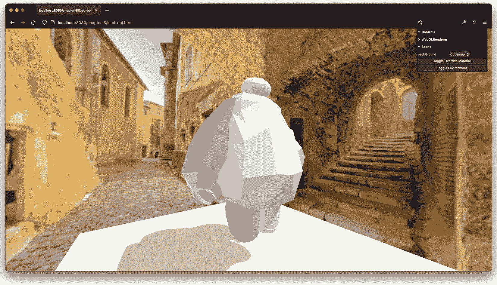

图 8.7 – 仅定义几何形状的 OBJ 模型

从外部文件加载 OBJ 模型的操作如下：

```js
import { OBJLoader } from 'three/examples/jsm/
  loaders/OBJLoader'
new OBJLoader().loadAsync('/assets/models/
  baymax/Bigmax_White_OBJ.obj').then((model) => {
  model.scale.set(0.05, 0.05, 0.05)
  model.translateY(-1)
  visitChildren(model, (child) => {
    child.receiveShadow = true
    child.castShadow = true
  })
  return model
})
```

在此代码中，我们使用 `OBJLoader` 从 URL 异步加载模型。这返回一个 JavaScript promise，当解析时，将包含网格。一旦模型加载完成，我们进行一些微调，并确保模型可以投射阴影并接收阴影。除了 `loadAsync`，每个加载器还提供了一个 `load` 函数，它不使用 promises，而是使用回调。这段代码将看起来像这样：

```js
const model = new OBJLoader().load('/assets/models/baymax
  /Bigmax_White_OBJ.obj', (model) => {
  model.scale.set(0.05, 0.05, 0.05)
  model.translateY(-1)
  visitChildren(model, (child) => {
    child.receiveShadow = true
    child.castShadow = true
  })
  // do something with the model
  scene.add(model)
})
```

在本章中，我们将使用基于 `Promise` 的 `loadAsync` 方法，因为它避免了嵌套回调，并使这些调用更容易串联。下一个示例（`oad-obj-mtl.html`）使用 `OBJLoader` 和 `MTLLoader` 一起加载模型并直接分配材质。以下截图显示了此示例：


图 8.8 – 带有模型和材质的 OBJ.MTL 模型

除了 OBJ 文件外，使用 `MTL` 文件遵循本节前面看到的相同原则：

```js
const model = mtlLoader.loadAsync('/assets/models/butterfly/
  butterfly.mtl').then((materials) => {
  objLoader.setMaterials(materials)
  return objLoader.loadAsync('/assets/models/butterfly/
    butterfly.obj').then((model) => {
    model.scale.set(30, 30, 30)
    visitChildren(model, (child) => {
      // if there are already normals, we can't merge 
        vertices
      child.geometry.deleteAttribute('normal')
      child.geometry = BufferGeometryUtils.
        mergeVertices(child.geometry)
      child.geometry.computeVertexNormals()
      child.material.opacity = 0.1
      child.castShadow = true
    })
    const wing1 = model.children[4]
    const wing2 = model.children[5]
    [0, 2, 4, 6].forEach(function (i) { 
      model.children[i].rotation.z = 0.3 * Math.PI })
    [1, 3, 5, 7].forEach(function (i) { 
      model.children[i].rotation.z = -0.3 * Math.PI })
    wing1.material.opacity = 0.9
    wing1.material.transparent = true
    wing1.material.alphaTest = 0.1
    wing1.material.side = THREE.DoubleSide
    wing2.material.opacity = 0.9
    wing2.material.depthTest = false
    wing2.material.transparent = true
    wing2.material.alphaTest = 0.1
    wing2.material.side = THREE.DoubleSide
    return model
  })
})
```

在查看代码之前，首先要提到的是，如果你收到一个`OBJ`文件、一个`MTL`文件和所需的纹理文件，你必须检查`MTL`文件如何引用纹理。这些应该相对于`MTL`文件进行引用，而不是绝对路径。代码本身与我们之前看到的`THREE.ObjLoader`代码没有太大区别。我们首先使用`THREE.MTLLoader`对象加载`MTL`文件，并通过`setMaterials`函数将加载的材质设置在`THREE.ObjLoader`中。

我们用作示例的模型很复杂。因此，我们在回调中设置了一些特定的属性来修复多个渲染问题，如下所示：

+   我们需要合并模型中的顶点，以便将其渲染为平滑的模型。为此，我们首先需要从加载的模型中移除已定义的`normal`向量，以便我们可以使用`BufferGeometryUtils.mergeVertices`和`computeVertexNormals`函数来为 Three.js 提供正确渲染模型所需的信息。

+   源文件中的不透明度设置不正确，导致翅膀不可见。因此，为了修复这个问题，我们自行设置了`opacity`和`transparent`属性。

+   默认情况下，Three.js 只渲染对象的单侧。由于我们从两个侧面观察翅膀，我们需要将`side`属性设置为`THREE.DoubleSide`值。

+   当翅膀需要叠加渲染时，它们产生了一些不希望出现的伪影。我们通过设置`alphaTest`属性来解决这个问题。

但正如您所看到的，您可以直接将复杂模型加载到 Three.js 中，并在浏览器中实时渲染它们。尽管如此，您可能需要调整各种材质属性。

## 加载 gltf 模型

我们已经提到，glTF 是导入 Three.js 数据时使用的一个非常好的格式。为了展示导入和显示甚至复杂场景的简单性，我们添加了一个示例，其中我们只是从[`sketchfab.com/3d-models/sea-house-bc4782005e9646fb9e6e18df61bfd28d`](https://sketchfab.com/3d-models/sea-house-bc4782005e9646fb9e6e18df61bfd28d)取了一个模型：

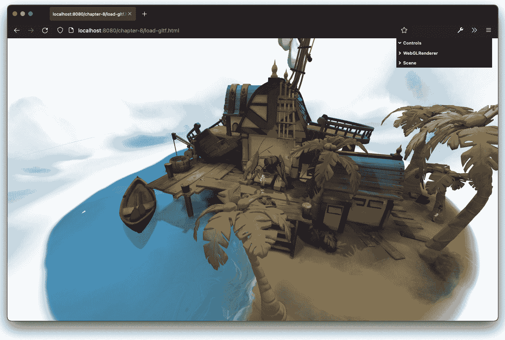

图 8.9 – 使用 Three.js 加载的复杂 3D 场景

如您从之前的屏幕截图中所见，这不仅仅是一个简单的场景，而是一个复杂的场景，包含许多模型、纹理、阴影和其他元素。要在 Three.js 中实现这一点，我们只需做以下操作：

```js
const loader = new GLTFLoader()
return loader.loadAsync('/assets/models/sea_house/
  scene.gltf').then((structure) => {
  structure.scene.scale.setScalar(0.2, 0.2, 0.2)
  visitChildren(structure.scene, (child) => {
    if (child.material) {
      child.material.depthWrite = true
    }
  })
  scene.add(structure.scene)
})
```

你已经熟悉了异步加载器，我们唯一需要修复的是确保材质的`depthWrite`属性设置正确（这似乎是一些 glTF 模型中常见的问题）。就这样了——它就是那么简单。glTF 还允许我们定义动画，我们将在下一章中更详细地探讨这一点。

## 展示完整的乐高模型

除了定义顶点、材质、灯光等 3D 模型的文件格式外，还有各种文件格式不明确定义几何形状，但具有更具体的用途。在本节中，我们将探讨的`LDrawLoader`加载器是为了在 3D 中渲染 LEGO 模型而创建的。使用此加载器的方式与我们之前已经看到几次的方式相同：

```js
loader.loadAsync('/assets/models/lego/10174-1-ImperialAT-ST-UCS.mpd_Packed.mpd').'/assets/models/lego/10174-1-ImperialAT-ST-UCS.mpd_Packed.mpd'.then((model) => {
  model.scale.set(0.015, 0.015, 0.015)
  model.rotateZ(Math.PI)
  model.rotateY(Math.PI)
  model.translateY(1)
  visitChildren(model, (child) => {
    child.castShadow = true
    child.receiveShadow = true
  })
  scene.add(model))
})
```

结果看起来非常棒：

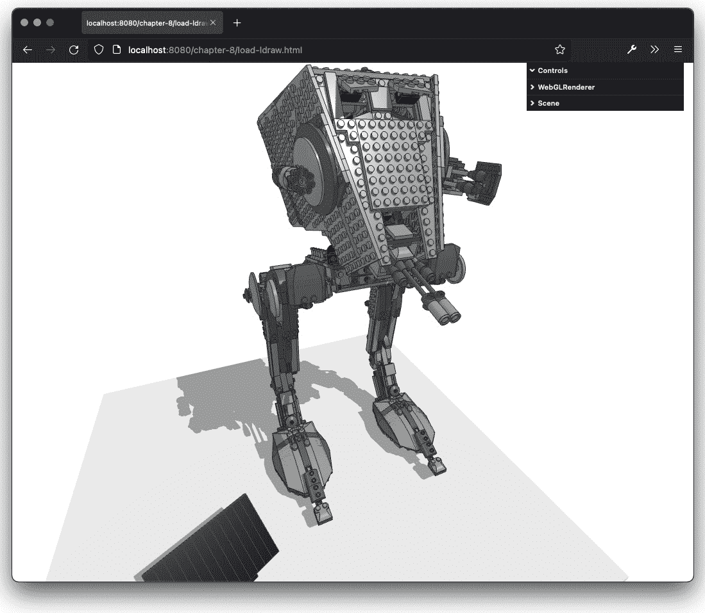

图 8.10 – LEGO 帝国 AT-ST 模型

如您所见，它显示了乐高套装的完整结构。有许多不同的模型可供您使用：

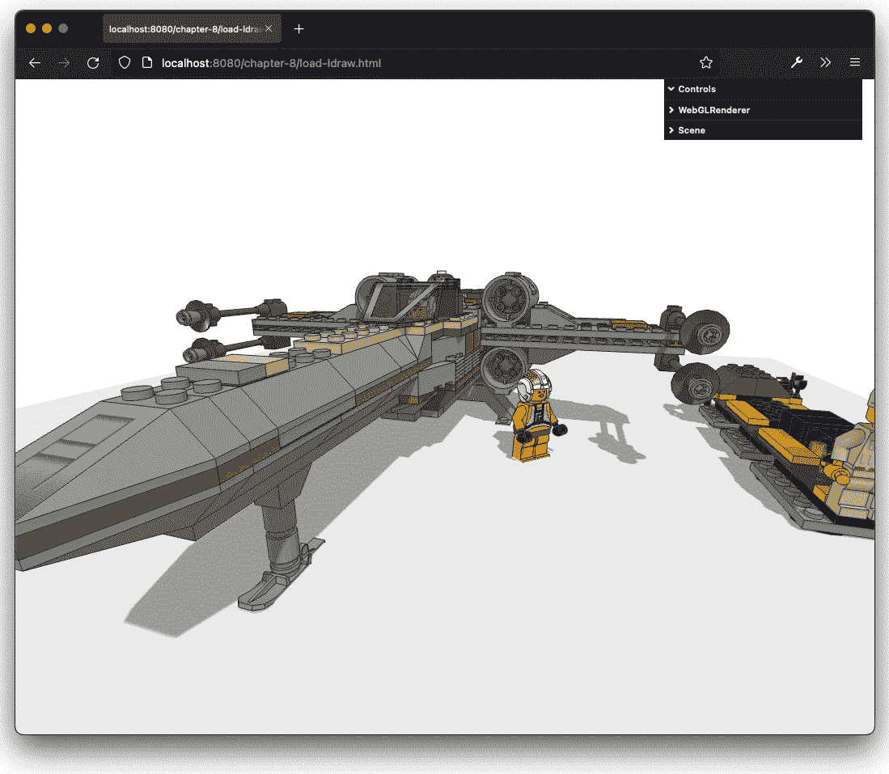

图 8.11 – LEGO X-Wing 战斗机

如果您想探索更多模型，您可以从 LDraw 仓库下载它们：[`omr.ldraw.org/`](https://omr.ldraw.org/)。

## 加载基于体素的模型

创建 3D 模型的另一种有趣的方法是使用体素。这允许您使用小立方体构建模型，并使用 Three.js 进行渲染。例如，您可以使用这样的工具在 Minecraft 之外创建 Minecraft 结构，并在稍后将其导入 Minecraft。一个用于实验体素的免费工具是 MagicaVoxel ([`ephtracy.github.io/`](https://ephtracy.github.io/))。此工具允许您创建如上所示的体素模型：

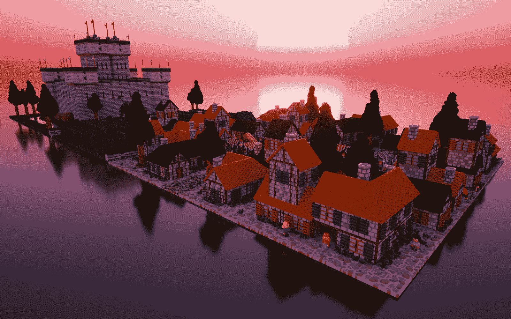

图 8.12 – 使用 MagicaVoxel 创建的示例模型

有趣的是，您可以使用`VOXLoader`加载器轻松地将这些模型导入 Three.js，如下所示：

```js
new VOXLoader().loadAsync('/assets/models/vox/monu9.vox').then((chunks) => {
  const group = new THREE.Group()
  for (let i = 0; i < chunks.length; i++) {
    const chunk = chunks[i]
    const mesh = new VOXMesh(chunk)
    mesh.castShadow = true
    mesh.receiveShadow = true
    group.add(mesh)
  }
  group.scale.setScalar(0.1)
  scene.add(group)
})
```

在`models`文件夹中，您可以找到一些体素模型。以下截图显示了使用 Three.js 加载后的样子：

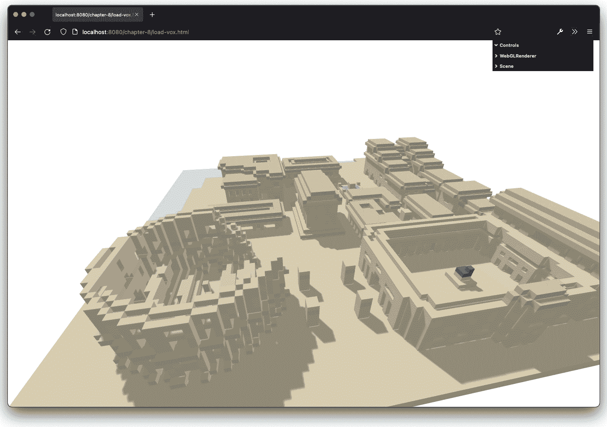

图 8.13 – 使用 Three.js 加载 Vox 模型

下一个加载器是另一个非常具体的加载器。我们将探讨如何从 PDB 格式渲染蛋白质。

## 从 PDB 显示蛋白质

PDB 网站 ([www.rcsb.org](http://www.rcsb.org)) 包含有关许多不同分子和蛋白质的详细信息。除了对这些蛋白质的解释外，它还提供了下载这些分子 PDB 格式的结构的方法。Three.js 为 PDB 格式的文件提供了加载器。在本节中，我们将给出一个示例，说明您如何解析 PDB 文件并使用 Three.js 进行可视化。

包含此加载器后，我们将创建以下分子描述的 3D 模型（请参阅`load-pdb.html`示例）：


图 8.14 – 使用 Three.js 和 PDBLoader 可视化蛋白质

加载 PDB 文件的方式与之前的格式相同，如下所示：

```js
PDBLoader().loadAsync('/assets/models/molecules/caffeine.pdb').then((geometries) => {
  const group = new THREE.Object3D()
  // create the atoms
  const geometryAtoms = geometries.geometryAtoms
  for (let i = 0; i < geometryAtoms.attributes.
    position.count; i++) {
    let startPosition = new THREE.Vector3()
    startPosition.x = geometryAtoms.attributes.
      position.getX(i)
    startPosition.y = geometryAtoms.attributes.
      position.getY(i)
    startPosition.z = geometryAtoms.attributes.position.getZ(i)
    let color = new THREE.Color()
    color.r = geometryAtoms.attributes.color.getX(i)
    color.g = geometryAtoms.attributes.color.getY(i)
    color.b = geometryAtoms.attributes.color.getZ(i)
    let material = new THREE.MeshPhongMaterial({
      color: color
    })
    let sphere = new THREE.SphereGeometry(0.2)
    let mesh = new THREE.Mesh(sphere, material)
    mesh.position.copy(startPosition)
    group.add(mesh)
  }
  // create the bindings
  const geometryBonds = geometries.geometryBonds
  for (let j = 0; j < 
    geometryBonds.attributes.position.count; j += 2) {
    let startPosition = new THREE.Vector3()
    startPosition.x = geometryBonds.attributes.
      position.getX(j)
    startPosition.y = geometryBonds.attributes.position.
      getY(j)
    startPosition.z = geometryBonds.attributes.position.
      getZ(j)
    let endPosition = new THREE.Vector3()
    endPosition.x = geometryBonds.attributes.position.
      getX(j + 1)
    endPosition.y = geometryBonds.attributes.position.
      getY(j + 1)
    endPosition.z = geometryBonds.attributes.position.
      getZ(j + 1)
    // use the start and end to create a curve, and use the 
      curve to draw
    // a tube, which connects the atoms
    let path = new THREE.CatmullRomCurve3([startPosition, 
      endPosition])
    let tube = new THREE.TubeGeometry(path, 1, 0.04)
    let material = new THREE.MeshPhongMaterial({
      color: 0xcccccc
    })
    let mesh = new THREE.Mesh(tube, material)
    group.add(mesh)
  }
  group.scale.set(0.5, 0.5, 0.5)
  scene.add(group)
})
```

如此示例代码所示，我们实例化了一个 `THREE.PDBLoader` 对象，并传入我们想要加载的模型文件，一旦模型加载完成，我们就对其进行处理。在这种情况下，模型包含两个属性：`geometryAtoms` 和 `geometryBonds`。`geometryAtoms` 中的位置属性包含单个原子的位置，而颜色属性可以用来为单个原子着色。对于原子之间的连接，使用 `geometryBonds`。

根据位置和颜色，我们创建一个 `THREE.Mesh` 对象并将其添加到一个组中：

```js
    let sphere = new THREE.SphereGeometry(0.2)
    let mesh = new THREE.Mesh(sphere, material)
    mesh.position.copy(startPosition)
    group.add(mesh)
```

关于原子之间的连接，我们采用相同的方法。我们获取连接的起始和结束位置，并使用这些位置来绘制连接：

```js
let path = new THREE.CatmullRomCurve3([startPosition, 
  endPosition])
let tube = new THREE.TubeGeometry(path, 1, 0.04)
let material = new THREE.MeshPhongMaterial({
  color: 0xcccccc
})
let mesh = new THREE.Mesh(tube, material)
group.add(mesh)
```

对于连接，我们首先使用 `THREE.CatmullRomCurve3` 创建一个 3D 路径。此路径用作 `THREE.TubeGeometry` 的输入，并用于在原子之间创建连接。所有连接和原子都添加到一个组中，然后将该组添加到场景中。您可以从 PDB 下载许多模型。例如，以下截图显示了钻石的结构：

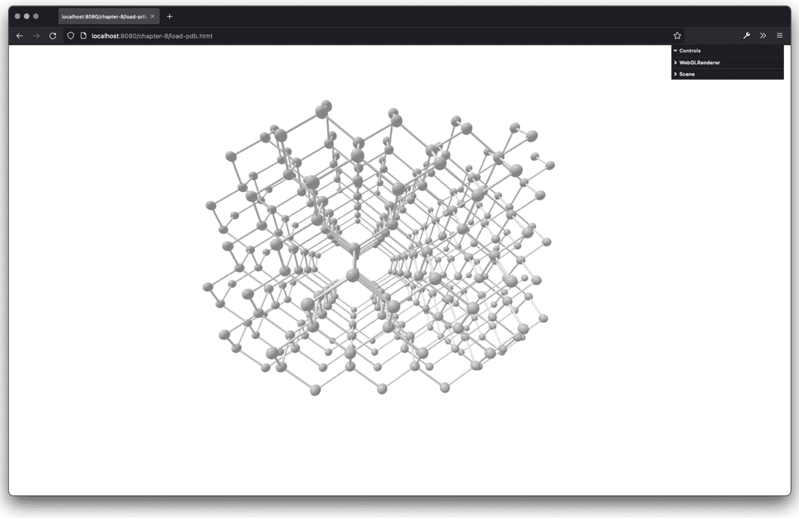

图 8.15 – 钻石的结构

在下一节中，我们将探讨 Three.js 对 PLY 模型的支持，该支持可用于加载点云数据。

## 从 PLY 模型加载点云

与 PLY 格式一起工作并不比其他格式复杂多少。您包含加载器并处理加载的模型。然而，对于最后一个示例，我们将做一些不同的事情。我们不会将模型作为网格渲染，而是将使用此模型的信息来创建一个粒子系统（请参阅以下截图中的 `load-ply.html` 示例）：

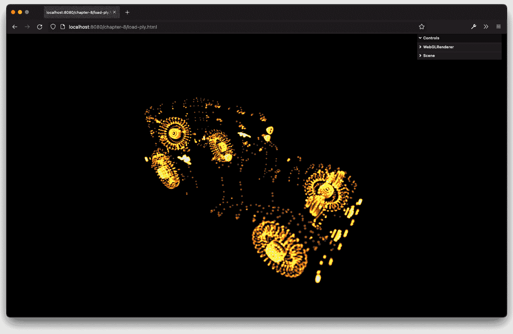

图 8.16 – 从 PLY 模型加载的点云

渲染前面截图的 JavaScript 代码实际上非常简单；它看起来像这样：

```js
const texture = new THREE.TextureLoader().load('/assets
  /textures/particles/glow.png')
const material = new THREE.PointsMaterial({
  size: 0.15,
  vertexColors: false,
  color: 0xffffff,
  map: texture,
  depthWrite: false,
  opacity: 0.1,
  transparent: true,
  blending: THREE.AdditiveBlending
})
return new PLYLoader().loadAsync('/assets/
  models/carcloud/carcloud.ply').then((model) => {
  const points = new THREE.Points(model, material)
  points.scale.set(0.7, 0.7, 0.7)
  scene.add(points)
})
```

如您所见，我们使用 `THREE.PLYLoader` 来加载模型，并将此几何形状作为 `THREE.Points` 的输入。我们使用的材质与我们在 *第七章* 的最后一个示例中使用的材质相同，即 *点和精灵*。如您所见，使用 Three.js，结合来自不同来源的模型并以不同方式渲染它们非常容易，所有这些只需几行代码即可完成。

## 其他加载器

在本章的开头，在 *从外部资源加载几何形状* 部分中，我们向您展示了一个由 Three.js 提供的所有不同加载器的列表。我们在 `chapter-8` 的源代码中提供了所有这些示例：

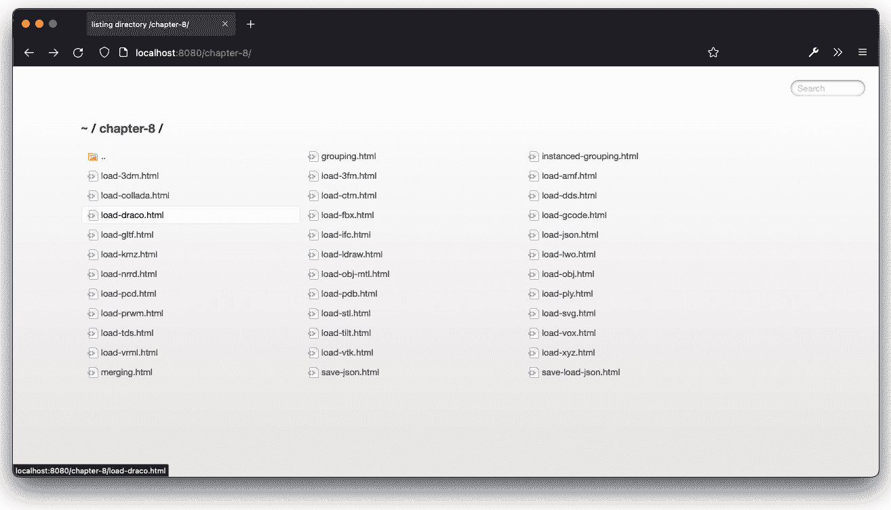

图 8.17 – 显示所有加载器示例的目录

所有这些加载器的源代码遵循我们在这章中解释的加载器相同的模式。只需加载模型，确定你想显示加载模型的哪一部分，确保缩放和位置正确，然后将其添加到场景中。

# 摘要

在 Three.js 中使用外部模型并不困难，特别是对于简单的模型——你只需要进行几个简单的步骤。

当与外部模型一起工作，或者通过分组和合并创建它们时，有一些事情需要牢记。首先，你需要记住的是，当你对对象进行分组时，它们仍然作为单独的对象可用。应用于父对象的变化也会影响子对象，但你仍然可以单独变换子对象。除了分组之外，你还可以合并几何体。采用这种方法，你会失去单独的几何体，而得到一个单一的新几何体。这在处理需要渲染成千上万的几何体且遇到性能问题时特别有用。如果你想要控制大量相同几何体的网格，最终的方法是使用`THREE.InstancedMesh`对象或`THREE.InstancedBufferGeometry`对象，这允许你定位和变换单独的网格，同时仍然获得良好的性能。

Three.js 支持大量外部格式。当使用这些格式加载器时，查看源代码并添加`console.log`语句以确定加载数据的真实外观是个好主意。这将帮助你理解需要采取的步骤以获取正确的网格并将其设置为正确的位置和比例。通常，当模型显示不正确时，这是由于其材质设置引起的。可能是使用了不兼容的纹理格式，不透明度定义不正确，或者格式包含指向纹理图像的错误链接。通常，使用测试材质来确定模型本身是否正确加载，并将加载的材质记录到 JavaScript 控制台以检查意外值是个好主意。

如果你想要重用你自己的场景或模型，你可以通过调用`asJson`函数简单地导出它们，然后使用`ObjectLoader`再次加载它们。

本章以及前几章中你使用的模型大多是静态模型。它们没有动画，不会移动，也不会改变形状。在*第九章*中，你将学习如何使你的模型动起来，使其栩栩如生。除了动画之外，下一章还将解释 Three.js 提供的各种相机控制。通过相机控制，你可以移动、平移和旋转相机，使其围绕场景移动。
