# 第九章：动画和移动相机

在前面的章节中，我们看到了一些简单的动画，但并没有什么太复杂的。在*第一章*，*使用 Three.js 创建你的第一个 3D 场景*中，我们介绍了基本的渲染循环，在随后的章节中，我们使用它来旋转一些简单的对象并展示了一些其他基本的动画概念。

在本章中，我们将更详细地探讨 Three.js 如何支持动画。我们将探讨以下四个主题：

+   基本动画

+   与相机一起工作

+   形变和骨骼动画

+   使用外部模式创建动画

我们将首先介绍动画背后的基本概念。

# 基本动画

在我们查看示例之前，让我们快速回顾一下在*第一章*中展示的内容，关于渲染循环。为了支持动画，我们需要告诉 Three.js 每隔一段时间渲染场景。为此，我们使用标准的 HTML5 `requestAnimationFrame`功能，如下所示：

```js
function animate() {
  requestAnimationFrame(animate);
  renderer.render(scene, camera);
}
animate();
```

使用这段代码，我们只需要在初始化场景后调用一次`render()`函数。在`render()`函数本身中，我们使用`requestAnimationFrame`来安排下一次渲染。这样，浏览器将确保`render()`函数在正确的间隔（通常每秒大约 60 次或 120 次）被调用。在`requestAnimationFrame`被添加到浏览器之前，使用的是`setInterval(function, interval)`或`setTimeout(function, interval)`。这些会在每个设定的时间间隔调用指定的函数。

这种方法的缺点在于它没有考虑到其他正在发生的事情。即使你的动画没有显示或者是在隐藏的标签页中，它仍然会被调用并且仍在使用资源。另一个问题是，这些函数在每次被调用时都会更新屏幕，而不是在浏览器认为最佳的时间，这导致 CPU 使用率更高。使用`requestAnimationFrame`，我们不是告诉浏览器何时需要更新屏幕；而是请求浏览器在最适合的时候运行提供的函数。通常，这会导致大约 60 或 120 FPS（取决于你的硬件）的帧率。使用`requestAnimationFrame`，你的动画将运行得更平滑，并且对 CPU 和 GPU 更友好，你不必担心时间问题。

在下一节中，我们将从创建一个简单的动画开始。

## 简单动画

使用这种方法，我们可以通过改变对象的`rotation`、`scale`、`position`、`material`、顶点、面以及你能想象到的任何其他内容来非常容易地动画化对象。在下一个渲染循环中，Three.js 将渲染更改后的属性。一个基于我们已经在*第七章*，*点和精灵*中看到的简单示例，可以在`01-basic-animations.html`中找到。以下截图显示了此示例：

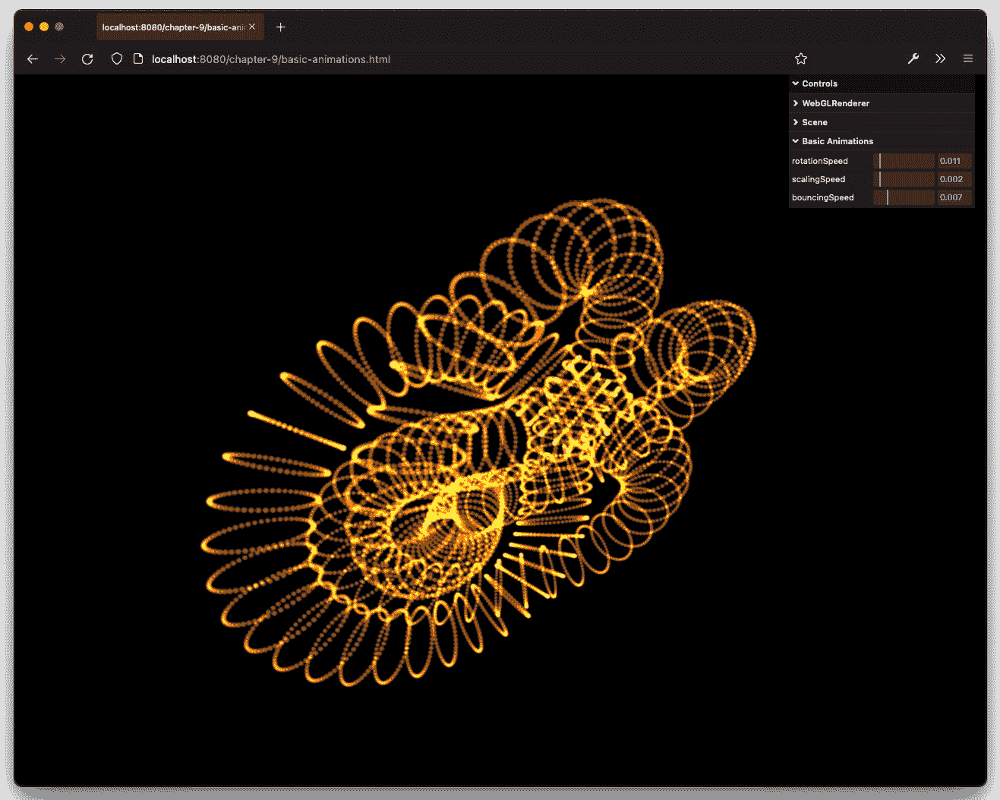

图 9.1 – 更改属性后的动画

这个渲染循环非常简单。首先，我们在`userData`对象上初始化各种属性，这是一个存储在`THREE.Mesh`本身中的自定义数据位置，然后使用我们在`userData`对象上定义的数据更新这些属性。在动画循环中，只需根据这些属性更改旋转、位置和缩放，Three.js 会处理其余部分。以下是我们的操作方法：

```js
const geometry = new THREE.TorusKnotGeometry(2, 0.5, 150, 50, 3, 4)
const material = new THREE.PointsMaterial({
  size: 0.1,
  vertexColors: false,
  color: 0xffffff,
  map: texture,
  depthWrite: false,
  opacity: 0.1,
  transparent: true,
  blending: THREE.AdditiveBlending
})
const points = new THREE.Points(geometry, material)
points.userData.rotationSpeed = 0
points.userData.scalingSpeed = 0
points.userData.bouncingSpeed = 0
points.userData.currentStep = 0
points.userData.scalingStep = 0
// in the render loop
function render() {
  const rotationSpeed = points.userData.rotationSpeed
  const scalingSpeed = points.userData.scalingSpeed
  const bouncingSpeed = points.userData.bouncingSpeed
  const currentStep = points.userData.currentStep
  const scalingStep = points.userData.scalingStep
  points.rotation.x += rotationSpeed
  points.rotation.y += rotationSpeed
  points.rotation.z += rotationSpeed
  points.userData.currentStep = currentStep + bouncingSpeed
  points.position.x = Math.cos(points.userData.currentStep)
  points.position.y = Math.abs(Math.sin
   (points.userData.currentStep)) * 2
  points.userData.scalingStep = scalingStep + scalingSpeed
  var scaleX = Math.abs(Math.sin(scalingStep * 3 + 0.5 * 
    Math.PI))
  var scaleY = Math.abs(Math.cos(scalingStep * 2))
  var scaleZ = Math.abs(Math.sin(scalingStep * 4 + 0.5 * 
    Math.PI))
  points.scale.set(scaleX, scaleY, scaleZ)
}
```

这里没有什么特别之处，但它很好地展示了我们将在这本书中讨论的基本动画背后的概念。我们只是更改`scale`、`rotation`和`position`属性，Three.js 会处理其余部分。

在下一节中，我们将快速跳转一下。除了动画之外，当你使用 Three.js 在更复杂的场景中工作时，你很快就会遇到的一个重要方面是使用鼠标在屏幕上选择对象的能力。

## 选择和移动对象

尽管这与动画没有直接关系，但由于我们将在本章中查看相机和动画，了解如何选择和移动对象是本章所解释主题的一个很好的补充。在这里，我们将向您展示如何完成以下操作：

+   使用鼠标从场景中选择一个对象

+   使用鼠标在场景中拖动一个对象

我们将首先查看选择对象所需的步骤。

### 选择对象

首先，打开`selecting-objects.html`示例，你会看到以下内容：

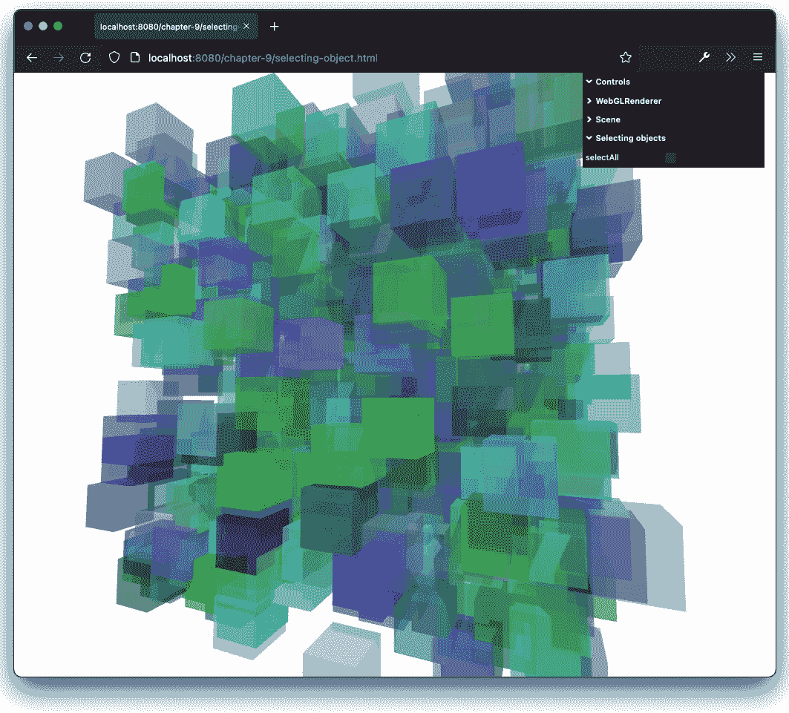

图 9.2 – 可以用鼠标选择的随机放置的立方体

当你在场景中移动鼠标时，你会看到每当你的鼠标击中一个对象时，该对象就会被突出显示。你可以通过使用`THREE.Raycaster`轻松创建这个效果。Raycaster 会查看你的当前相机，并从相机位置向鼠标位置发射一条射线。基于此，它可以根据鼠标的位置计算出被击中的对象。为了完成这个任务，我们需要采取以下步骤：

+   创建一个跟踪鼠标指向位置的对象

+   每当我们移动鼠标时，更新那个对象

+   在渲染循环中，使用这些更新信息来查看我们指向的 Three.js 对象

这在下面的代码片段中显示：

```js
// initially set the position to -1, -1
let pointer = {
  x: -1,
  y: -1
}
// when the mouse moves update the point
document.addEventListener('mousemove', (event) => {
  pointer.x = (event.clientX / window.innerWidth) * 2 - 1
  pointer.y = -(event.clientY / window.innerHeight) * 2 + 1
})
// an array containing all the cubes in the scene
const cubes = ...
// use in the render loop to determine the object to highlight
const raycaster = new THREE.Raycaster()
function render() {
  raycaster.setFromCamera(pointer, camera)
  const cubes = scene.getObjectByName('group').children
  const intersects = raycaster.intersectObjects(cubes)
  // do something with the intersected objects
}
```

在这里，我们使用`THREE.Raycaster`来确定哪些对象与相机点的鼠标位置相交。结果（在先前的示例中为`intersects`）包含所有与我们的鼠标相交的立方体，因为射线是从相机的位置发射到相机范围的末尾。在这个数组中的第一个是我们在悬停的对象，这个数组中的其他值（如果有）指向第一个网格后面的对象。`THREE.Raycaster`还提供了关于你击中对象的确切位置的其他信息：

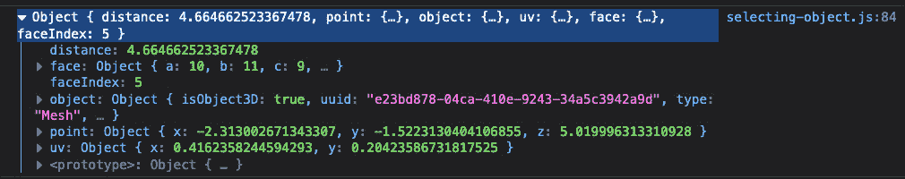

图 9.3 – 来自射线投射器的附加信息

在这里，我们点击了`face`对象。`faceIndex`指向所选网格的表面。`distance`值是从相机到点击对象的距离，而`point`是点击在网格上的确切位置。最后，我们有`uv`值，当使用纹理时，它决定了点击的点在 2D 纹理上的位置（范围从 0 到 1；有关`uv`的更多信息，请参阅*第十章*，*加载和操作* *纹理*)。

### 拖动对象

除了选择对象外，一个常见的需求是能够拖动和移动对象。Three.js 也为此提供了默认支持。如果你在浏览器中打开`dragging-objects.html`示例，你会看到一个类似于*图 9.2*所示的场景。这次，当你点击一个对象时，你可以将其拖动到场景中：

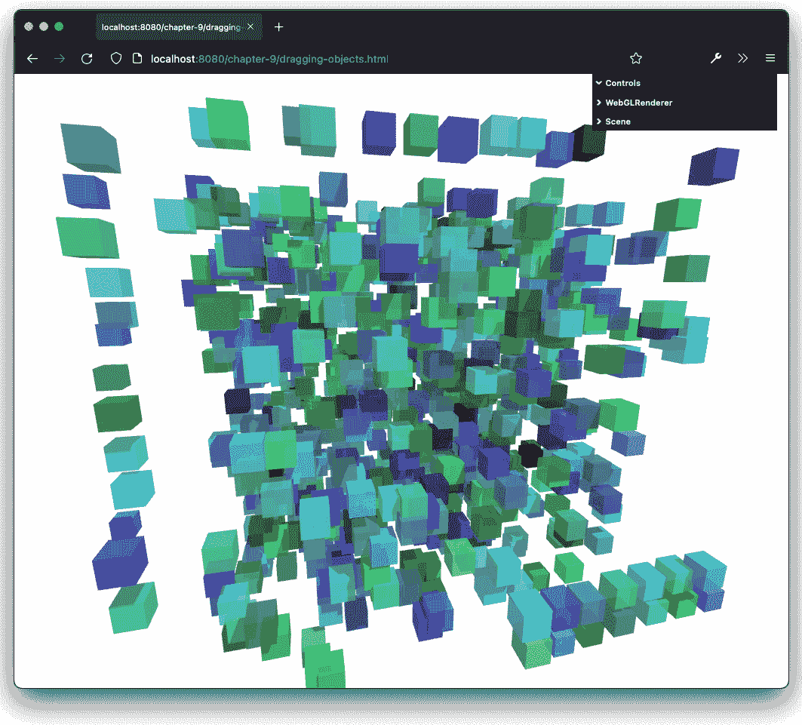

图 9.4 – 使用鼠标在场景中拖动对象

为了支持拖动对象，Three.js 使用一种称为`DragControls`的东西。它处理所有事情，并在拖动开始和停止时提供方便的回调。完成此操作的代码如下：

```js
const orbit = new OrbitControls(camera, renderer.domElement)
orbit.update()
const controls = new DragControls(cubes, camera, renderer.domElement)
controls.addEventListener('dragstart', function (event) {
  orbit.enabled = false
  event.object.material.emissive.set(0x33333)
})
controls.addEventListener('dragend', function (event) {
  orbit.enabled = true
  event.object.material.emissive.set(0x000000)
})
```

如此简单。在这里，我们添加了`DragControls`并传递了可以拖动的元素（在我们的例子中，是所有随机放置的立方体）。然后，我们添加了两个事件监听器。第一个，`dragstart`，在我们开始拖动立方体时被调用，而`dragend`在我们停止拖动对象时被调用。在这个例子中，当我们开始拖动时，我们禁用了`OrbitControls`（它允许我们使用鼠标在场景周围查看）并更改了所选对象的颜色。一旦我们停止拖动，我们将对象的颜色改回并再次启用`OrbitControls`。

还有一种更高级的`DragControls`版本，称为`TransformControls`。我们不会深入探讨这个控制器的细节，但它允许你使用简单的 UI 来变换网格的属性。当你打开浏览器中的`transform-controls-html`时，你可以找到一个此控制器的示例：

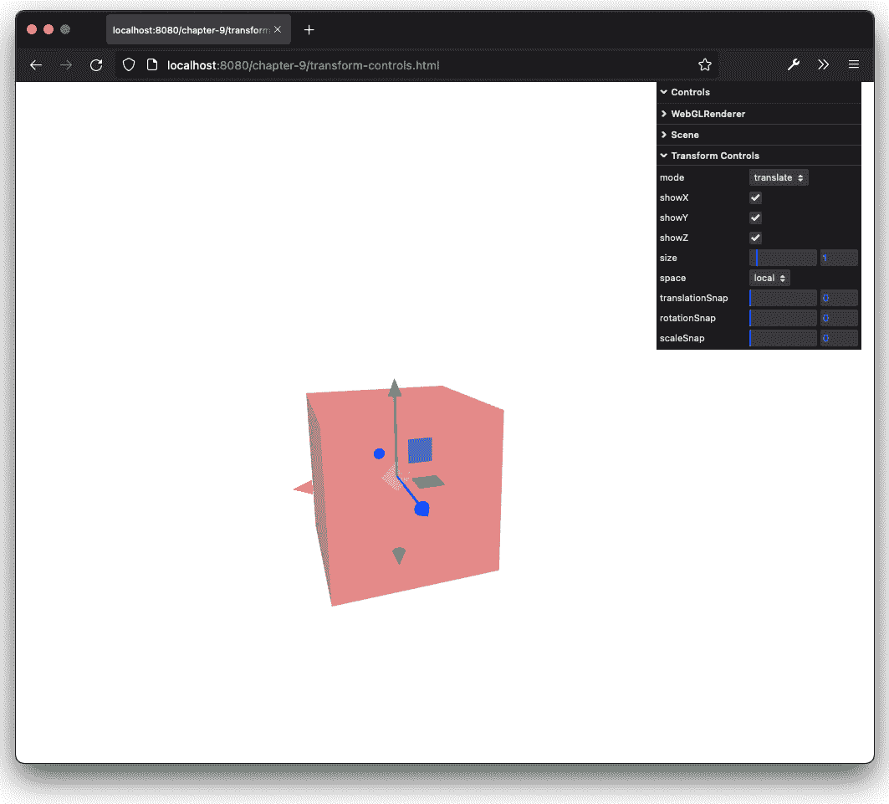

图 9.5 – 变换控制器允许你改变网格的属性

如果你点击这个控制器的各个部分，你可以轻松地改变立方体的形状：

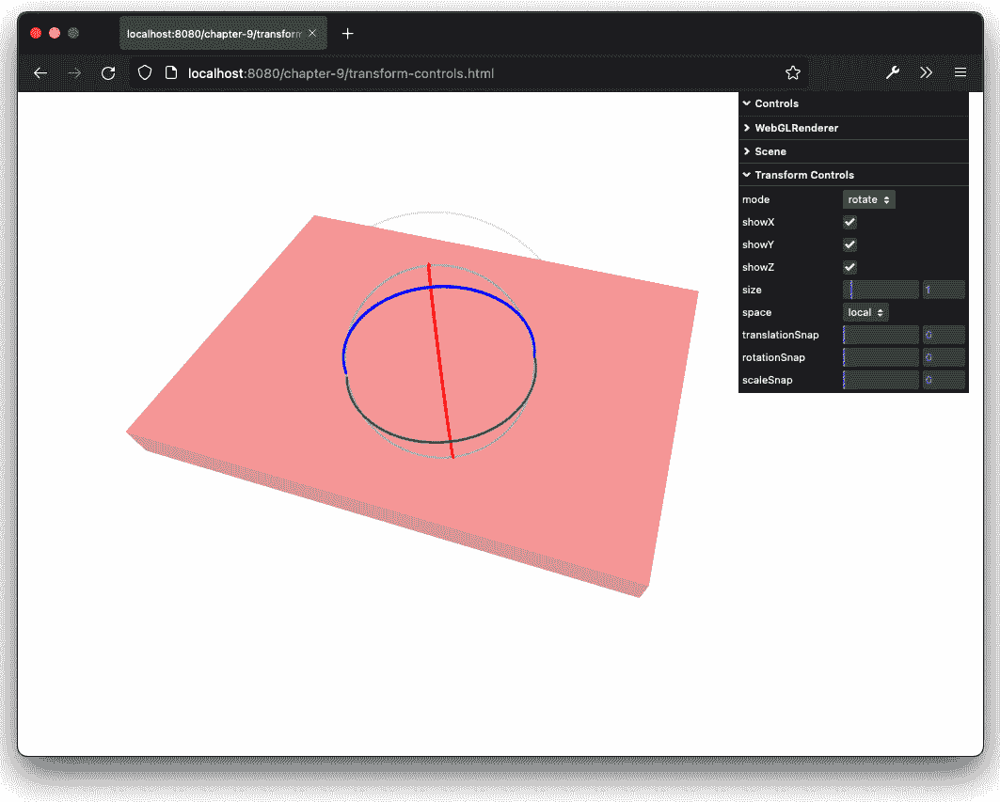

图 9.6 – 使用变换控制器修改的形状

在本章的最后一个例子中，我们将向你展示如何使用一个替代方法来修改对象的属性（正如我们在本章的第一个例子中所见），即使用缓动库。

## 使用 Tween.js 进行动画

Tween.js 是一个你可以从 [`github.com/sole/tween.js/`](https://github.com/sole/tween.js/) 下载的小型 JavaScript 库，你可以用它轻松地定义两个值之间属性的过渡。从开始值到结束值之间的所有中间点都会为你计算。这个过程被称为将网格的 `x` 位置从 10 移动到 3，如下所示：

```js
const tween = new TWEEN.Tween({x: 10}).to({x: 3}, 10000)
.easing(TWEEN.Easing.Elastic.InOut)
.onUpdate( function () {
  // update the mesh
})
```

或者，你可以创建一个单独的对象并将其传递到你想要与之工作的网格中：

```js
  const tweenData = {
    x: 10
  }
  new TWEEN.Tween(tweenData)
    .to({ x: 3 }, 10000)
    .yoyo(true)
    .repeat(Infinity)
    .easing(TWEEN.Easing.Bounce.InOut)
    .start()
  mesh.userData.tweenData = tweenData    
```

在这个例子中，我们创建了 `TWEEN.Tween`。这个缓动将确保 `x` 属性在 10,000 毫秒内从 10 变化到 3。Tween.js 还允许你定义这个属性随时间如何变化。这可以通过线性、二次或其他任何可能性（参见 [`sole.github.io/tween.js/examples/03_graphs.html`](http://sole.github.io/tween.js/examples/03_graphs.html) 以获取完整概述）来实现。值通过名为 `easing()` 的过程随时间变化。这个库还提供了额外的控制方式来决定如何进行缓动。例如，我们可以设置缓动应该重复的频率（`repeat(10)`）以及我们是否想要一个 yoyo 效果（在这个例子中，这意味着我们从 10 变化到 3，然后再回到 10）。

将这个库与 Three.js 一起使用非常简单。如果你打开 `tween-animations.html` 示例，你将看到 Tween.js 库在行动中的表现。以下截图显示了示例的静态图像：

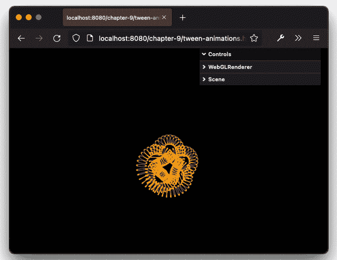

图 9.7 – 在动作中途缓动一个点系统

我们将使用 Tween.js 库通过特定的 `easing()` 来移动这个点到一个单一的位置，这在某个时刻看起来如下：

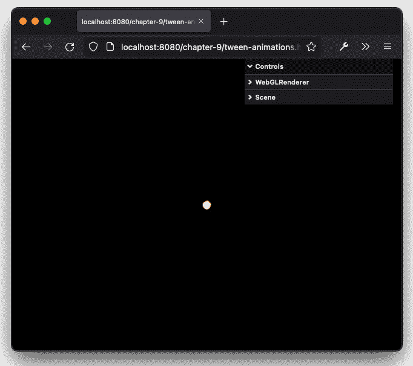

图 9.8 – 当所有内容合并成一个点时缓动一个点

在这个例子中，我们从一个点云（*第七章*）中提取了一个点，并创建了一个动画，其中所有点都缓慢地移动到中心。这些粒子的位置是通过使用 Tween.js 库创建的缓动来设置的，如下所示：

```js
const geometry = new THREE.TorusKnotGeometry(2, 0.5, 150, 50, 3, 4)
geometry.setAttribute('originalPos', geometry.attributes['position'].clone())
const material = new THREE.PointsMaterial(..)
const points = new THREE.Points(geometry, material)
const tweenData = {
  pos: 1
}
new TWEEN.Tween(tweenData)
  .to({ pos: 3 }, 10000)
  .yoyo(true)
  .repeat(Infinity)
  .easing(TWEEN.Easing.Bounce.InOut)
  .start()
points.userData.tweenData = tweenData    
// in the render loop
const originalPosArray = points.geometry.attributes.originalPos.array
const positionArray = points.geometry.attributes.position.array
TWEEN.update()
 for (let i = 0; i < points.geometry.attributes.position.count; i++) {
  positionArray[i * 3] = originalPosArray[i * 3] * points.userData.tweenData.pos
  positionArray[i * 3 + 1] = originalPosArray[i * 3 + 1] * points.userData.tweenData.pos
  positionArray[i * 3 + 2] = originalPosArray[i * 3 + 2] * points.userData.tweenData.pos
}
points.geometry.attributes.position.needsUpdate = true
```

通过这段代码，我们创建了一个缓动，它将值从 `1` 变化到 `0` 再变回来。要使用缓动中的值，我们有两种不同的选择：我们可以使用这个库提供的 `onUpdate` 函数来调用一个函数，该函数带有更新的值，每当缓动更新时（这是通过调用 `TWEEN.update()` 来完成的），或者我们可以直接访问更新的值。在这个例子中，我们使用了后者方法。

在我们查看需要在 `render` 函数中进行的更改之前，我们必须在加载模型后执行一个额外的步骤。我们想要在原始值和零之间进行缓动。为此，我们需要将顶点的原始位置存储在某个地方。我们可以通过复制起始位置数组来完成此操作：

```js
geometry.setAttribute('originalPos', geometry.attributes['position'].clone())
```

现在，无论何时我们想要访问原始位置，我们都可以查看几何体的 `originalPos` 属性。现在，我们可以直接使用 tween 的值来计算每个顶点的新位置。我们可以在渲染循环中这样做：

```js
const originalPosArray = points.geometry.attributes.originalPos.array
const positionArray = points.geometry.attributes.position.array
for (let i = 0; i < points.geometry.attributes.position.count; i++) {
  positionArray[i * 3] = originalPosArray[i * 3] * points.userData.tweenData.pos
  positionArray[i * 3 + 1] = originalPosArray[i * 3 + 1] * points.userData.tweenData.pos
  positionArray[i * 3 + 2] = originalPosArray[i * 3 + 2] * points.userData.tweenData.pos
}
points.geometry.attributes.position.needsUpdate = true
```

在这些步骤到位后， tween 库将负责处理屏幕上各个点的位置。正如你所见，使用这个库比手动管理过渡要容易得多。除了动画和改变对象，我们还可以通过移动相机来动画化场景。在前面的章节中，我们通过手动更新相机位置做了几次这样的操作。Three.js 也提供了几种更新相机位置的方法。

# 与相机一起工作

Three.js 提供了几个相机控制，你可以使用它们在场景中控制相机。这些控制位于 Three.js 分发中，可以在 `examples/js/controls` 目录中找到。在本节中，我们将更详细地查看以下控制：

+   `ArcballControls`：一个提供透明覆盖层的扩展控制，你可以用它轻松地移动相机。

+   `FirstPersonControls`：这些是像第一人称射击游戏中的控制方式。你可以用键盘移动，用鼠标环顾四周。

+   `FlyControls`：这些是类似飞行模拟器的控制。你可以用键盘和鼠标移动和操控。

+   `OrbitControls`：这模拟了一个围绕特定场景运行的卫星。这允许你使用鼠标和键盘移动。

+   `PointerLockControls`：这些与第一人称控制类似，但它们还会锁定鼠标指针到屏幕上，这使得它们成为简单游戏的一个很好的选择。

+   `TrackBallControls`：这些是最常用的控制，允许你使用鼠标（或轨迹球）轻松地移动、平移和缩放场景。

除了使用这些相机控制，你也可以通过设置其位置并使用 `lookAt()` 函数改变其指向来自行移动相机。

我们首先来看一下 `ArcballControls`。

## ArcballControls

解释 `ArcballControls` 的工作方式最简单的方法是查看一个示例。如果你打开 `arcball-controls.html` 示例，你会看到一个简单的场景，就像这样：

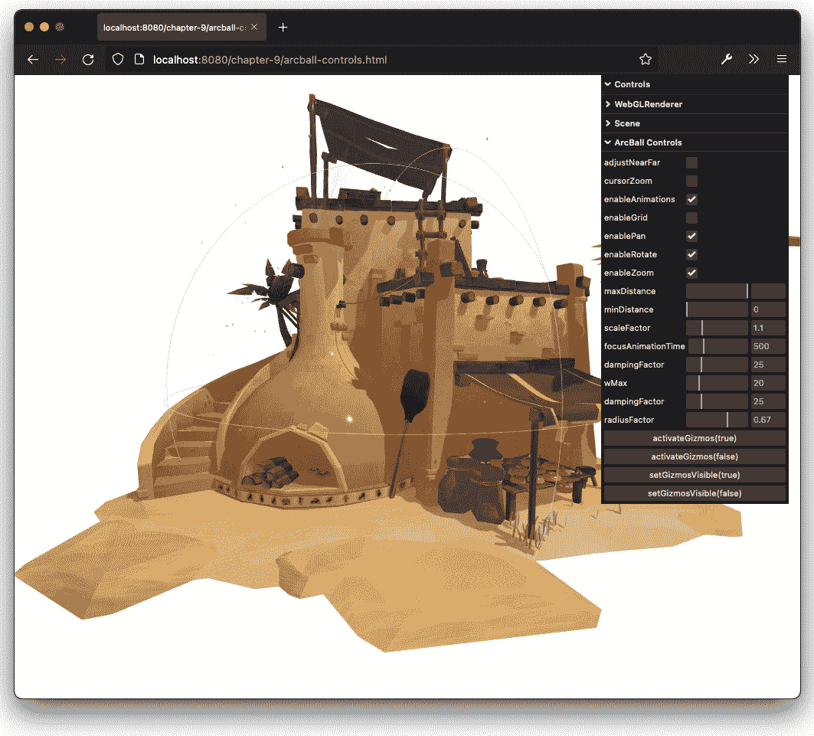

图 9.9 – 使用 ArcballControls 探索场景

如果你仔细观察这张截图，你会看到两条透明的线条穿过场景。这些是由 `ArcballControls` 提供的线条，你可以使用它们来旋转和平移场景。这些线条被称为 **gizmos**。左键用于旋转场景，右键可以用来平移，滚动鼠标滚轮可以放大。

除了这些标准功能外，此控件还允许您聚焦于显示的网格的特定部分。如果您在场景上双击，相机将聚焦于该部分场景。要使用此控件，我们只需要实例化它，并传入 `camera` 属性、由渲染器使用的 `domElement` 属性以及我们正在查看的 `scene` 属性：

```js
import { ArcballControls } from 'three/examples/jsm/controls/ArcballControls'
const controls = new ArcballControls(camera, renderer.domElement, scene)
controls.update()
```

此控件非常灵活，可以通过一系列属性进行配置。大多数这些属性可以通过使用此示例右侧的菜单在此示例中进行探索。对于这个特定的控件，我们将更深入地探讨此对象提供的属性和方法，因为它是一个多功能的控件，当您希望为用户提供一种良好的方式来探索您的场景时，它是一个很好的选择。让我们概述一下此控件提供的属性和方法。首先，让我们看看属性：

+   `adjustNearFar`: 如果设置为 `true`，则此控件在放大时将更改相机的 `near` 和 `far` 属性

+   `camera`: 创建此控件时使用的相机

+   `cursorZoom`: 如果设置为 `true`，当放大时，缩放将聚焦于光标的位置

+   `dampingFactor`: 如果 `enableAnimations` 设置为 `true`，则此值将确定动作后动画停止的速度

+   `domElement`: 此元素用于列出鼠标事件

+   `enabled`: 确定此控件是否启用

+   `enableRotate`, `enableZoom`, `enablePan`, `enableGrid`, `enableAnimations`: 这些属性启用和禁用此控件提供的功能

+   `focusAnimationTime`: 当我们双击并聚焦于场景的一部分时，此属性确定聚焦动画的持续时间

+   `maxDistance`/`minDistance`: 对于 `PerspectiveCamera`，我们可以缩放的最远和最近距离

+   `maxZoom`/`minZoom`: 对于 `OrthographicCamera`，我们可以缩放的最远和最近距离

+   `scaleFactor`: 我们缩放和缩小的速度

+   `scene`: 构造函数中传入的场景

+   `radiusFactor`: “辅助工具”相对于屏幕宽度和高度的大小

+   `wMax`: 我们允许场景旋转的速度

此控件还提供了一些方法来进一步交互或配置它：

+   `activateGizmos(bool)`: 如果为 `true`，则突出显示辅助工具

+   `copyState()`, `pasteState()`: 允许您将控件的当前状态以 JSON 格式复制到剪贴板

+   `saveState()`, `reset()`: 内部保存当前状态，并使用 `reset()` 应用保存的状态

+   `dispose()`: 从场景中移除此控件的全部部分，并清理任何监听器和动画

+   `setGizomsVisible(bool)`: 指定是否显示或隐藏辅助工具

+   `setTbRadius(radiusFactor)`: 更新 `radiusFactor` 属性并重新绘制辅助工具

+   `setMouseAction(operation, mouse, key)`: 确定哪个鼠标键提供哪个动作

+   `unsetMouseAction(mouse, key)`: 清除已分配的鼠标动作

+   `update()`: 当相机属性改变时，调用此函数以应用这些新设置到该控制。

+   `getRayCaster()`: 提供对 `rayCaster` 的访问，这些控制内部使用。

`ArcballControls` 是 Three.js 中一个非常有用且相对较新的功能，它允许使用鼠标对场景进行高级控制。如果你在寻找一个更简单的方法，可以使用 `TrackBallControls`。

## TrackBallControls

使用 `TrackBallControls` 的方法与我们在 `ArcballControls` 中看到的方法相同：

```js
import { TrackBallControls } from 'three/examples/jsm/
  controls/TrackBallControls'
const controls = new TrackBallControls(camera, renderer.
  domElement)
```

这次，我们只需要传递来自渲染器的 `camera` 和 `domeElement` 属性。为了使轨道球控制工作，我们还需要添加一个 `THREE.Clock` 并更新渲染循环，如下所示：

```js
const clock = new THREE.Clock()
function animate() {
  requestAnimationFrame(animate)
  renderer.render(scene, camera)
  controls.update(clock.getDelta())
}
```

在前面的代码片段中，我们可以看到一个新 Three.js 对象，`THREE.Clock`。`THREE.Clock` 对象可以用来计算特定调用或渲染循环完成所花费的经过时间。你可以通过调用 `clock.getDelta()` 函数来实现这一点。此函数将返回从上一次调用 `getDelta()` 到这次调用的经过时间。为了更新相机的位置，我们可以调用 `TrackBallControls.update()` 函数。在这个函数中，我们需要提供自上次调用此更新函数以来经过的时间。为此，我们可以使用 `THREE.Clock` 对象的 `getDelta()` 函数。你可能想知道为什么我们不直接将帧率（1/60 秒）传递给更新函数。原因是，使用 `requestAnimationFrame`，我们期望 60 FPS，但这并不是保证的。根据所有各种外部因素，帧率可能会变化。为了确保相机平稳地旋转和旋转，我们需要传递确切的经过时间。

你可以在 `trackball-controls-camera.html` 中找到一个使用此功能的示例。以下截图显示了该示例的静态图像：

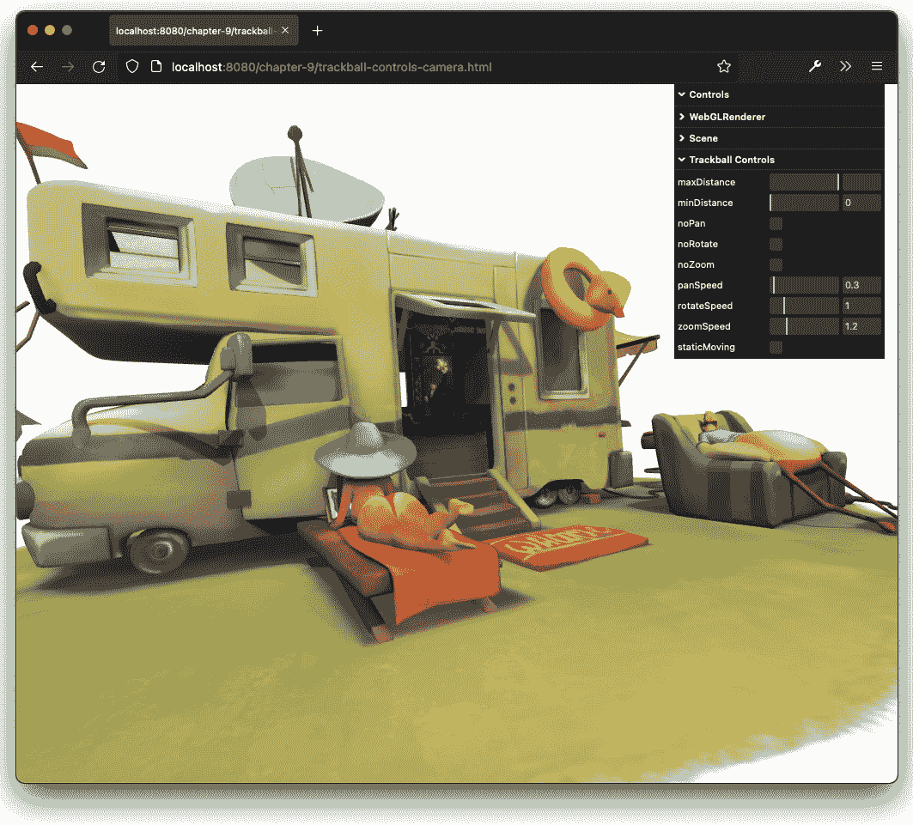

图 9.10 – 使用 TrackBallControls 控制场景

你可以通过以下方式控制相机：

+   **左键点击并移动**：绕场景旋转和翻滚相机。

+   **滚轮**：放大和缩小。

+   **中键点击并移动**：放大和缩小。

+   **右键点击并移动**：在场景中平移。

你可以使用一些属性来微调相机的行为。例如，你可以使用 `rotateSpeed` 属性设置相机旋转的速度，并通过将 `noZoom` 属性设置为 `true` 来禁用缩放。在本章中，我们不会详细介绍每个属性的作用，因为它们基本上是自我解释的。要了解完整的概述，请查看 `TrackBallControls.js` 文件的源代码，其中列出了这些属性。

## FlyControls

我们接下来要查看的控制是 `FlyControls`。使用 `FlyControls`，你可以使用在飞行模拟器中找到的控制来在场景中飞行。你可以在 `fly-controls-camera.html` 中找到一个示例。以下截图显示了该示例的静态图像：

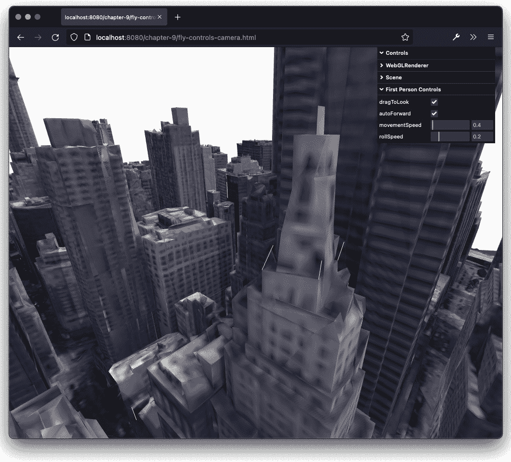

图 9.11 – 使用 FlyControls 在场景中飞行

启用 `FlyControls` 与其他控制的工作方式相同：

```js
import { FlyControls } from 'three/examples/jsm/controls/FlyControls'
const controls = new FlyControls(camera, renderer.domElement)
const clock = new THREE.Clock()
function animate() {
  requestAnimationFrame(animate)
  renderer.render(scene, camera)
  controls.update(clock.getDelta())
}
```

`FlyControls` 将相机和渲染器的 `domElement` 作为参数，并要求你在渲染循环中调用带有经过时间的 `update()` 函数。你可以用以下方式使用 `THREE.FlyControls` 来控制相机：

+   **左键和中间鼠标按钮**：开始向前移动

+   **右鼠标按钮**：向后移动

+   **鼠标移动**：四处查看

+   *W*：开始向前移动

+   *S*：向后移动

+   *A*：向左移动

+   *D*：向右移动

+   *R*：向上移动

+   *F*：向下移动

+   **左、右、上、下箭头**：分别向左、右、上、下查看

+   *G*：向左翻滚

+   *E*：向右翻滚

我们接下来要查看的控制是 `THREE.FirstPersonControls`。

## FirstPersonControls

如其名所示，`FirstPersonControls` 允许你像在第一人称射击游戏中一样控制相机。鼠标用于四处查看，键盘用于移动。你可以在 `07-first-person-camera.html` 中找到一个示例。以下截图显示了该示例的静态图像：


图 9.12 – 使用第一人称控制探索场景

创建这些控制遵循的原则与之前我们看到的其他控制相同：

```js
Import { FirstPersonControls } from 'three/examples/jsm/
  controls/FirstPersonControls'
const controls = new FirstPersonControls(camera, renderer.domElement)
const clock = new THREE.Clock()
function animate() {
  requestAnimationFrame(animate)
  renderer.render(scene, camera)
  controls.update(clock.getDelta())
}
```

这个控制提供的功能相当直接：

+   **鼠标移动**：四处查看

+   **左、右、上、下箭头**：分别向左、右、前、后移动

+   *W*：向前移动

+   *A*：向左移动

+   *S*：向后移动

+   *D*：向右移动

+   *R*：向上移动

+   *F*：向下移动

+   *Q*：停止所有移动

对于最后一个控制，我们将从第一人称视角转向太空视角。

## OrbitControls

`OrbitControls` 控制是一种很好的方法，可以在场景中心旋转和平移对象。这也是我们在其他章节中使用的方法，为你提供了一个简单的方式来探索提供的示例中的模型。

使用 `orbit-controls-orbit-camera.html`，我们提供了一个示例，展示了这个控制是如何工作的。以下截图显示了该示例的静态图像：


图 9.13 – OrbitControls 属性

使用 `OrbitControls` 与使用其他控制一样简单。包含正确的 JavaScript 文件，使用相机设置控制，并再次使用 `THREE.Clock` 来更新控制：

```js
import { OrbitControls } from 'three/examples/jsm/
  controls/OrbitControls'
const controls = new OrbitControls(camera, renderer.
  domElement)
const clock = new THREE.Clock()
function animate() {
  requestAnimationFrame(animate)
  renderer.render(scene, camera)
  controls.update(clock.getDelta())
}
```

`OrbitControls` 的控制主要依赖于鼠标操作，如下所示列表：

+   **左键点击并移动**：围绕场景中心旋转相机

+   **滚轮或中间鼠标点击并移动**：放大和缩小

+   **右键点击并移动**：在场景中平移

关于相机及其移动就到这里。在本节中，我们看到了许多允许你通过改变相机属性轻松交互和移动场景的控制。在下一节中，我们将探讨更高级的动画方法：形变和蒙皮。

# 形变和骨骼动画

当你在外部程序（例如 Blender）中创建动画时，通常有两个主要选项来定义动画：

+   **形变目标**：使用形变目标，你定义网格的变形版本——即关键位置。对于这个变形目标，存储了所有顶点的位置。要动画化形状，你只需将所有顶点从一个位置移动到另一个关键位置，并重复此过程。以下截图显示了用于展示面部表情的各种形变目标（此截图由 Blender 基金会提供）：


图 9.14 – 使用形变目标设置动画

+   **骨骼动画**：另一种选择是使用骨骼动画。在骨骼动画中，你定义网格的骨骼（即骨骼），并将顶点附着到特定的骨骼上。现在，当你移动一个骨骼时，任何连接的骨骼也会相应地移动，并且附着的顶点会根据骨骼的位置、运动和缩放进行移动和变形。以下截图，再次由 Blender 基金会提供，展示了如何使用骨骼来移动和变形对象：

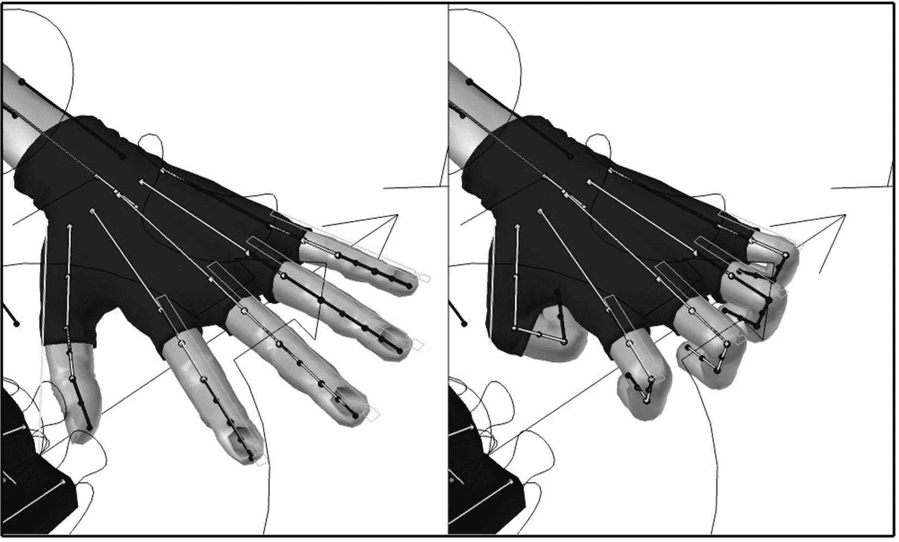

图 9.15 – 使用骨骼设置动画

Three.js 支持这两种模式，但在处理基于骨骼/骨骼的动画时，可能会遇到导出良好的问题。为了获得最佳结果，你应该将你的模型导出或转换为 glTF 格式，该格式正成为交换模型、动画和场景的默认格式，并且得到了 Three.js 的良好支持。

在本节中，我们将探讨这两种选项，并查看 Three.js 支持的几种外部格式，在这些格式中可以定义动画。

## 基于形变目标的动画

形变目标是定义动画最直接的方式。你为每个重要位置（也称为关键帧）定义所有顶点，并告诉 Three.js 将顶点从一个位置移动到另一个位置。

我们将通过两个例子向你展示如何使用变形目标。在第一个例子中，我们将让 Three.js 处理各种关键帧（或我们接下来将称之为变形目标）之间的过渡，而在第二个例子中，我们将手动完成这个操作。请记住，我们只是在 Three.js 动画的表面略作探讨。正如你将在本节中看到的那样，Three.js 对动画控制有出色的支持，支持动画同步，并提供从一种动画平滑过渡到另一种动画的方法，这足以写一本书来专门讨论这个主题。因此，在接下来的几个部分中，我们将为你提供 Three.js 动画的基础知识，这应该为你提供足够的信息来开始并探索更复杂的话题。

## 使用混合器和变形目标进行动画

在我们深入例子之前，首先，我们将探讨你可以使用 Three.js 进行动画的三种核心类。在本章的后面部分，我们将向你展示这些对象提供的所有函数和属性：

+   `THREE.AnimationClip`：当你加载包含动画的模型时，你可以在`response`对象中查找通常称为`animations`的字段。这个字段将包含一个`THREE.AnimationClip`对象的列表。请注意，根据加载器，动画可能定义在`Mesh`上、`Scene`上，或者完全独立提供。一个`THREE.AnimationClip`通常包含加载的模型可以执行的一定动画的数据。例如，如果你加载了一只鸟的模型，一个`THREE.AnimationClip`将包含拍打翅膀所需的信息，另一个可能包含张嘴和闭嘴的信息。

+   `THREE.AnimationMixer`：`THREE.AnimationMixer`用于控制多个`THREE.AnimationClip`对象。它确保动画的时间正确，并使得同步动画或从一种动画干净地过渡到另一种动画成为可能。

+   `THREE.AnimationAction`：尽管`THREE.AnimationMixer`本身并没有暴露大量的函数来控制动画，但这通过`THREE.AnimationAction`对象来完成，当你将一个`THREE.AnimationClip`添加到`THREE.AnimationMixer`时，会返回这些对象（尽管你可以通过`THREE.AnimationMixer`提供的函数在稍后获取它们）。

此外，还有一个`AnimationObjectGroup`，你可以使用它来提供动画状态，不仅限于单个`Mesh`，还可以是一组对象。

在以下示例中，你可以控制使用模型中的`THREE.AnimationClip`创建的`THREE.AnimationMixer`和`THREE.AnimationAction`。在这个例子中，`THREE.AnimationClip`对象将模型变形为一个立方体，然后变为一个圆柱体。

对于这个第一个变形例子，理解基于变形目标的动画工作原理的最简单方法是通过打开`morph-targets.html`示例。以下截图显示了该示例的静态图像：

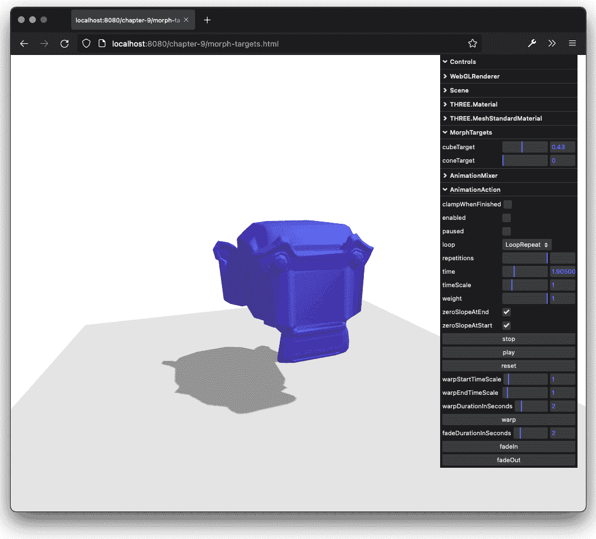

图 9.16 – 使用变形目标进行动画

在这个例子中，我们有一个简单的模型（猴子的头部），可以使用变形目标将其转换为立方体或圆柱体。你可以通过移动 `cubeTarget` 或 `coneTarget` 滑块轻松测试这一点，你会看到头部被变形为不同的形状。例如，当 `cubeTarget` 在 `0.5` 时，你会看到我们正在将猴子的初始头部变形为立方体的中途。一旦它达到 `1`，初始几何形状就完全变形了：

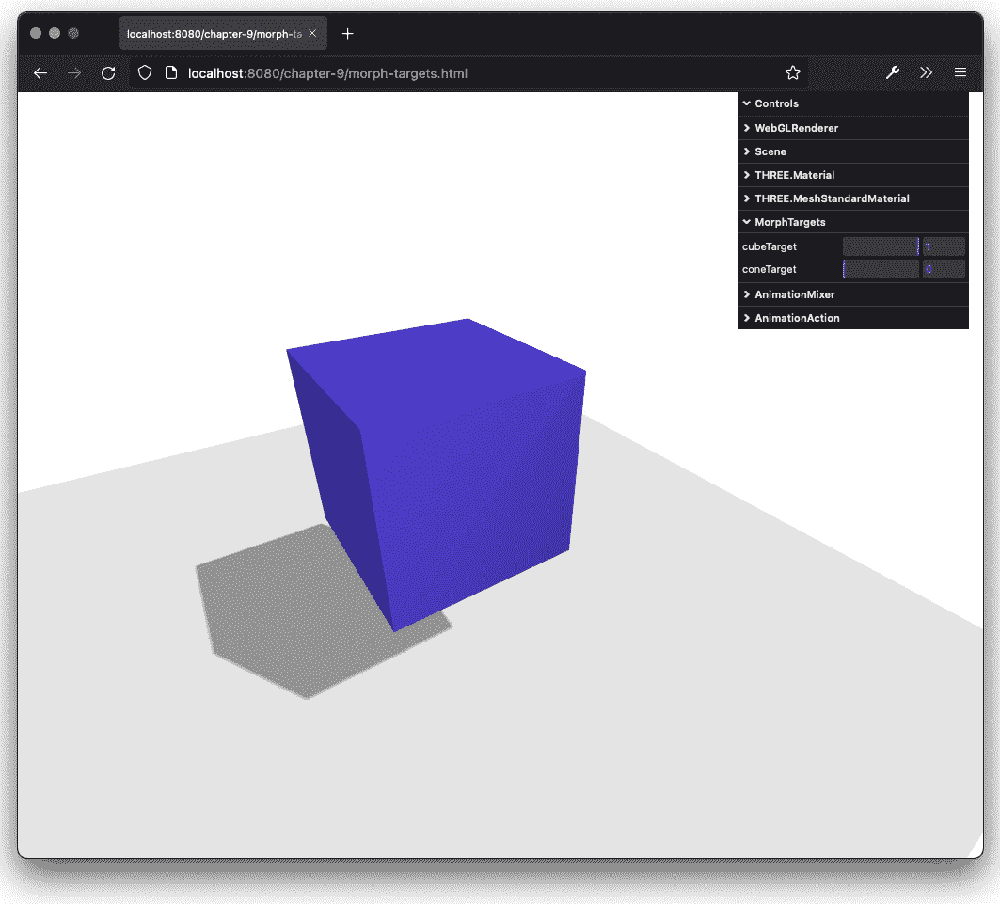

图 9.17 – 同样的模型，但现在将 cubeTarget 设置为 1

这就是变形动画的基本原理。你有几个可以控制的 `morphTargets`（影响），根据它们的值（从 0 到 1），顶点移动到期望的位置。使用变形目标的动画使用这种方法。它只是定义了在哪个时间某些顶点位置应该发生。当运行动画时，Three.js 将确保将正确的值传递给 `Mesh` 实例的 `morphTargets` 属性。

要运行预定义的动画，你可以打开此示例的 `AnimationMixer` 菜单，然后点击 **播放**。你会看到头部首先变成一个立方体，然后变成一个圆柱体，最后再变回头部形状。

在 Three.js 中设置完成此操作的必要组件可以使用以下代码片段完成。首先，我们必须加载模型。在这个例子中，我们将此示例从 Blender 导出为 glTF，因此我们的 `animations` 在顶层。我们只需将这些添加到一个变量中，我们可以在代码的其他部分访问它。我们也可以将此设置为网格的属性或添加到 `Mesh` 的 `userdata` 属性中：

```js
let animations = []
const loadModel = () => {
  const loader = new GLTFLoader()
  return loader.loadAsync('/assets/models/blender-morph-targets/morph-targets.gltf').then((container) => {
    animations = container.animations
    return container.scene
  })
}
```

现在我们已经从加载的模型中获得了动画，我们可以设置特定的 Three.js 组件，以便我们可以播放它们：

```js
const mixer = new THREE.AnimationMixer(mesh)
const action = mixer.clipAction(animations[0])
action.play()
```

我们需要采取的最后一步是确保每次渲染时都能显示网格的正确形状，那就是在渲染循环中添加一行代码：

```js
// in render loop
mixer.update(clock.getDelta())
```

在这里，我们再次使用了 `THREE.Clock` 来确定现在和上一个渲染循环之间经过的时间，并调用了 `mixer.update()`。这个信息被混音器用来确定它应该将顶点转换到下一个变形目标（关键帧）有多远。

`THREE.AnimationMixer` 和 `THREE.AnimationClip` 提供了其他一些你可以用来控制动画或创建新的 `THREE.AnimationClip` 对象的功能。你可以通过使用本节示例右侧的菜单来实验它们。我们将从 `THREE.AnimationClip` 开始：

+   `duration`：此轨道的持续时间（以秒为单位）。

+   `name`：此剪辑的名称。

+   `tracks`：用于跟踪模型某些属性如何动画化的内部属性。

+   `uuid`: 此剪辑的唯一 ID。这是自动分配的。

+   `clone()`: 创建此剪辑的副本。

+   `optimize()`: 优化 `THREE.AnimationClip`。

+   `resetDuration()`: 确定此剪辑的正确持续时间。

+   `toJson()`: 将此剪辑转换为 JSON 对象。

+   `trim()`: 将所有内部轨道修剪到在此剪辑上设置的持续时间。

+   `validate()`: 进行一些基本的验证，以查看此剪辑是否有效。

+   `CreateClipsFromMorphTargetSequences( name, morphTargetSequences,fps, noLoop)`: 根据一组形变目标序列创建一系列 `THREE.AnimationClip` 实例。

+   `CreateFromMorpTargetSequences( name, morphTargetSequence,fps,noLoop)`: 从一系列形变目标中创建单个 `THREE.AnimationClip`。

+   `findByName(objectOrClipArray, name)`: 通过名称搜索 `THREE.AnimationClip`。

+   `parse` 和 `toJson`: 允许你分别将 `Three.AnimationClip` 作为 JSON 恢复和保存。

+   `parseAnimation(animation, bones)`: 将 `THREE.AnimationClip` 转换为 JSON。

一旦你得到了 `THREE.AnimationClip`，你可以将其传递给 `THREE.AnimationMixer` 对象，该对象提供以下功能：

+   `AnimationMixer(rootObject)`: 此对象的构造函数。此构造函数接受一个 `THREE.Object3D` 参数（例如，一个 `THREE.Mesh` 或 `THREE.Group` 的 `THREE.Mesh`）。

+   `time`: 此混音器的全局时间。它从 0 开始，在创建此混音器的时间。

+   `timeScale`: 可以用来加快或减慢由此混音器管理的所有动画。如果此属性的值设置为 0，则所有动画都将被有效地暂停。

+   `clipAction(animationClip, optionalRoot)`: 创建一个 `THREE.AnimationAction`，可以用来控制传入的 `THREE.AnimationClip`。如果动画剪辑是为与 `AnimationMixer` 构造函数中提供的对象不同的对象，你也可以传入它。

+   `existingAction(animationClip, optionalRoot)`: 这返回了 `THREE.AnimationAction` 属性，可以用来控制传入的 `THREE.AnimationClip`。再次强调，如果 `THREE.AnimationClip` 是针对不同的 `rootObject`，你也可以传入它。

当你获取 `THREE.AnimationClip` 时，你可以用它来控制动画：

+   `clampWhenFinished`: 当设置为 `true` 时，当动画到达最后一帧时，这将导致动画暂停。默认为 `false`。

+   `enabled`: 当设置为 `false` 时，这将禁用当前动作，使其不影响模型。当动作重新启用时，动画将从上次停止的地方继续。

+   `loop`: 这是此动作的循环模式（可以使用 `setLoop` 函数设置）。可以设置为以下几种：

    +   `THREE.LoopOnce`: 只播放一次剪辑

    +   `THREE.LoopRepeat`: 根据设置的重复次数重复剪辑

    +   `THREE.LoopPingPong`: 根据重复次数播放剪辑，但会在正向和反向之间交替播放

+   `paused`: 将此属性设置为 `true` 将暂停此剪辑的执行。

+   `repetitions`: 动画将重复的次数。这由 `loop` 属性使用。默认值为 `Infinity`。

+   `time`: 此动作已运行的时间。这是从 `0` 到剪辑持续时间的包装。

+   `timeScale`: 这可以用来加快或减慢此动画。如果此属性的值设置为 `0`，则此动画将实际上暂停。

+   `weight`: 这指定了动画对模型的影响程度，范围从 `0` 到 `1`。当设置为 `0` 时，您将看不到模型因该动画而产生的任何变换，而当设置为 `1` 时，您将看到该动画的全部效果。

+   `zeroSlopeAtEnd`: 当设置为 `true`（默认值）时，这将确保在单独的剪辑之间有一个平滑的过渡。

+   `zeroSlopeAtStart`: 当设置为 `true`（默认值）时，这将确保在单独的剪辑之间有一个平滑的过渡。

+   `crossFadeFrom(fadeOutAction, durationInSeconds, warpBoolean)`: 这会导致此动作淡入，同时 `fadeOutAction` 淡出。总的淡入淡出时间为 `durationInSeconds`。这允许在动画之间进行平滑过渡。当 `warpBoolean` 设置为 `true` 时，它将对时间尺度应用额外的平滑处理。

+   `crossFadeTo(fadeInAction, durationInSeconds, warpBoolean)`: 与 `crossFadeFrom` 相同，但这次淡入提供的动作，并淡出此动作。

+   `fadeIn(durationInSeconds)`: 在指定的时间间隔内，将 `weight` 属性从 `0` 慢慢增加到 `1`。

+   `fadeOut(durationInSeconds)`: 在指定的时间间隔内，将 `weight` 属性从 `0` 慢慢减少到 `1`。

+   `getEffectiveTimeScale()`: 返回基于当前运行的扭曲的有效时间尺度。

+   `getEffectiveWeight()`: 返回基于当前运行的淡入淡出的有效权重。

+   `getClip()`: 返回此动作管理的 `THREE.AnimationClip` 属性。

+   `getMixer()`: 返回播放此动作的混音器。

+   `getRoot()`: 获取由此动作控制的基本对象。

+   `halt(durationInSeconds)`: 在 `durationInSeconds` 内逐渐将 `timeScale` 减少到 `0`。

+   `isRunning()`: 检查动画是否当前正在运行。

+   `isScheduled()`: 检查此动作是否当前在混音器中活动。

+   `play()`: 开始运行此动作（开始动画）。

+   `reset()`: 重置此动作。这将导致将 `paused` 设置为 `false`，`enabled` 设置为 `true`，以及 `time` 设置为 `0`。

+   `setDuration(durationInSeconds)`: 设置单个循环的持续时间。这将改变 `timeScale`，以便整个动画可以在 `durationInSeconds` 内播放。

+   `setEffectiveTimeScale(timeScale)`: 将 `timeScale` 设置为提供的值。

+   `setEffectiveWeight()`: 将 `weight` 设置为提供的值。

+   `setLoop(loopMode, repetitions)`: 设置 `loopMode` 和重复次数。请参阅 `loop` 属性以了解选项及其效果。

+   `startAt(startTimeInSeconds)`: 延迟`startTimeInSeconds`秒开始动画。

+   `stop()`: 停止此动作，并应用`reset`。

+   `stopFading()`: 停止任何计划中的淡入淡出。

+   `stopWarping()`: 停止任何计划中的扭曲。

+   `syncWith(otherAction)`: 将此动作与传入的动作同步。这将设置此动作的`time`和`timeScale`值与传入的动作相同。

+   `warp(startTimeScale, endTimeScale, durationInSeconds)`: 在指定的`durationInSeconds`内将`timeScale`属性从`startTimeScale`更改为`endTimeScale`。

除了您可以使用的所有控制动画的函数和属性之外，`THREE.AnimationMixer`还提供了两个事件，您可以通过在 mixer 上调用`addEventListener`来监听这些事件。当单个循环完成时，会发送`"loop"`事件，当整个动作完成时，会发送`"finished"`事件。

## 使用骨骼和皮肤进行动画

正如我们在*使用 mixer 和形态目标进行动画*部分所看到的，形态动画非常简单。Three.js 知道所有的目标顶点位置，只需要将每个顶点从当前位置过渡到下一个位置。对于骨骼和皮肤，这会变得稍微复杂一些。当您使用骨骼进行动画时，您移动骨骼，Three.js 必须确定如何相应地转换附着的皮肤（一组顶点）。对于此示例，我们将使用从 Blender 导出到 Three.js 格式的模型（`models/blender-skeleton`文件夹中的`lpp-rigging.gltf`）。这是一个包含一组骨骼的人体模型。通过移动骨骼，我们可以对整个模型进行动画。首先，让我们看看我们是如何加载模型的：

```js
let animations = []
const loadModel = () => {
  const loader = new GLTFLoader()
  return loader.loadAsync('/assets/models/blender-
    skeleton/lpp-rigging.gltf').then((container) => {
    container.scene.translateY(-2)
    applyShadowsAndDepthWrite(container.scene)
    animations = container.animations
    return container.scene
  })
}
```

我们已经将模型导出为 glTF 格式，因为 Three.js 对 glTF 的支持很好。加载用于骨骼动画的模型与其他模型没有太大区别。我们只需指定模型文件并像其他 glTF 文件一样加载它。对于 glTF，动画位于加载的对象的单独属性中，所以我们只需将其分配给`animations`变量以便于访问。

在此示例中，我们添加了一个控制台日志，显示了加载后`THREE.Mesh`的外观：

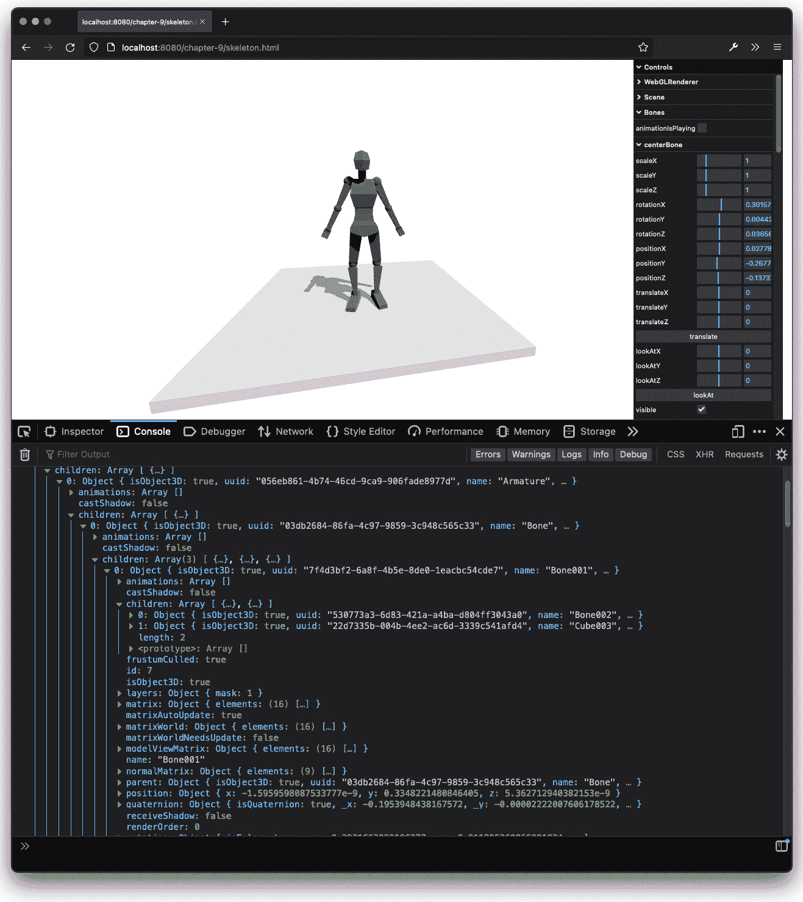

图 9.18 – 骨骼结构反映在对象的层次结构中

在这里，您可以看到网格由骨骼和网格的树组成。这也意味着如果您移动一个骨骼，相关的网格将与其一起移动。

以下截图显示了此示例的静态图像：

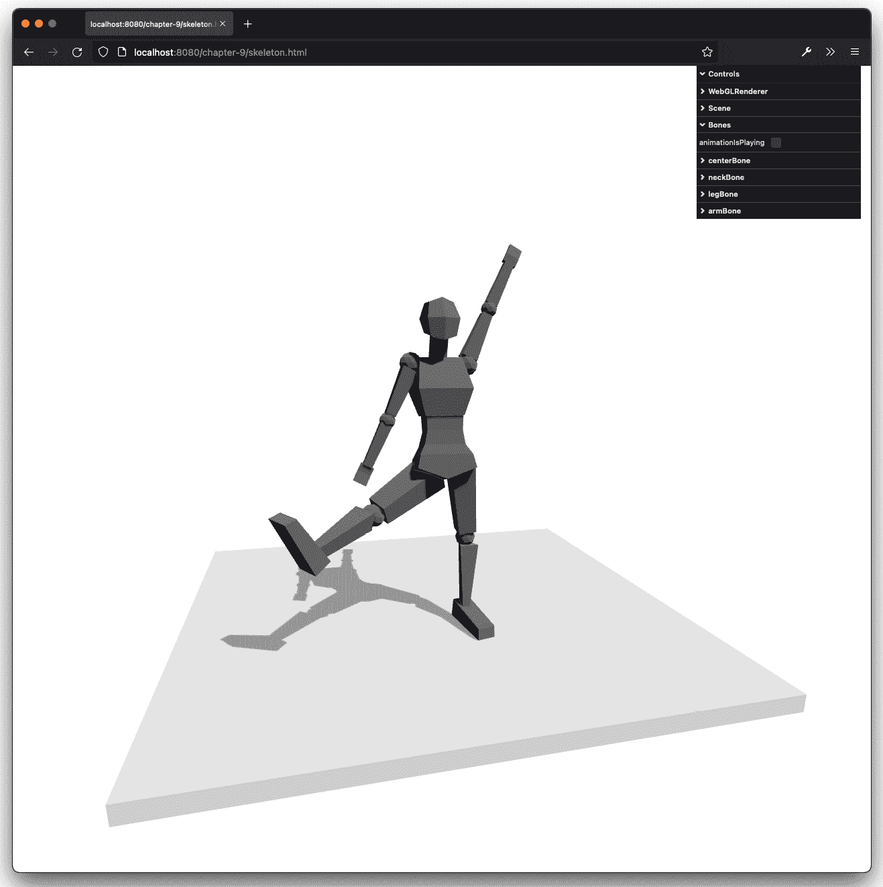

图 9.19 – 手动改变手臂和腿骨的旋转

此场景也包含一个动画，您可以通过勾选**animationIsPlaying**复选框来触发它。这将覆盖手动设置的骨骼的位置和旋转，使骨骼上下跳动：

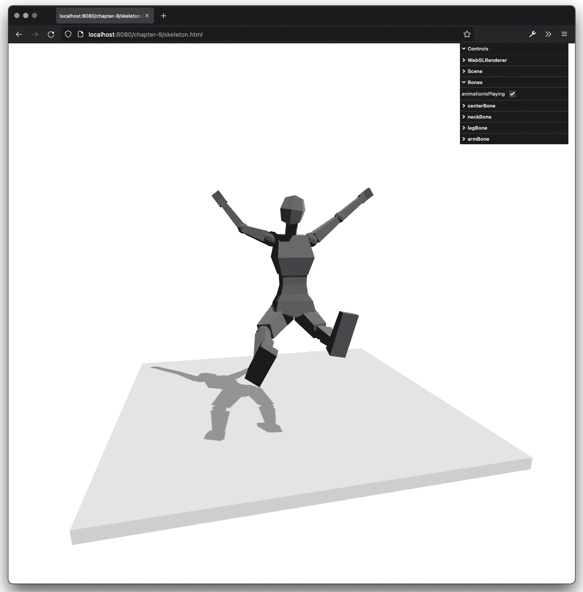

图 9.20 – 播放骨骼动画

要设置这个动画，我们必须遵循之前看到的相同步骤：

```js
const mixer = new THREE.AnimationMixer(mesh)
const action = mixer.clipAction(animations[0])
action.play()
```

如您所见，使用骨骼与使用固定形态目标一样简单。在这个例子中，我们只调整了骨骼的旋转；您也可以移动位置或改变比例。在下一节中，我们将探讨从外部模型加载动画。

# 使用外部模型创建动画

在 *第八章* *创建和加载高级网格和几何体* 中，我们探讨了几个 Three.js 支持的 3D 格式。其中一些格式也支持动画。在本章中，我们将探讨以下示例：

+   **COLLADA 模型**：COLLADA 格式支持动画。在这个例子中，我们将从一个 COLLADA 文件中加载一个动画，并使用 Three.js 进行渲染。

+   **MD2 模型**：MD2 模型是一种在较老的 Quake 引擎中使用的简单格式。尽管格式有些过时，但它仍然是一个非常好的用于存储角色动画的格式。

+   **glTF 模型**：**GL 传输格式**（**glTF**）是一种专门设计用于存储 3D 场景和模型的格式。它专注于最小化资产的大小，并试图在解包模型时尽可能高效。

+   **FBX 模型**：FBX 是由 Mixamo 工具生成的格式，可在 [`www.mixamo.com`](https://www.mixamo.com) 找到。使用 Mixamo，您可以轻松地为模型绑定和动画，而不需要大量的建模经验。

+   **BVH 模型**：与其它加载器相比，**Biovision**（**BVH**）格式略有不同。使用这个加载器，您不需要与骨骼或一系列动画一起加载几何形状。使用这种格式（由 Autodesk MotionBuilder 使用），您只需加载一个骨骼，您可以将它可视化，甚至将其附加到您的几何形状上。

我们将从一个 glTF 模型开始，因为这种格式正成为不同工具和库之间交换模型的标准。

## 使用 gltfLoader

最近越来越受到关注的格式是 glTF 格式。这种格式，您可以在 [`github.com/KhronosGroup/glTF`](https://github.com/KhronosGroup/glTF) 找到非常详尽的解释，专注于优化大小和资源使用。使用 `glTFLoader` 与使用其他加载器类似：

```js
import { GLTFLoader } from 'three/examples
  /jsm/loaders/GLTFLoader'
...
return loader.loadAsync('/assets/models/truffle_man/scene.gltf').
  then((container) => {
  container.scene.scale.setScalar(4)
  container.scene.translateY(-2)
  scene.add(container.scene)

  const mixer = new THREE.AnimationMixer( container.scene ); 
  const animationClip = container.animations[0];
  const clipAction = mixer.clipAction( animationClip ).
play(); 
})
```

这个加载器也加载了一个完整的场景，因此您可以将所有内容添加到组中，或者选择子元素。对于这个例子，您可以通过打开 `load-gltf.js` 来查看结果：

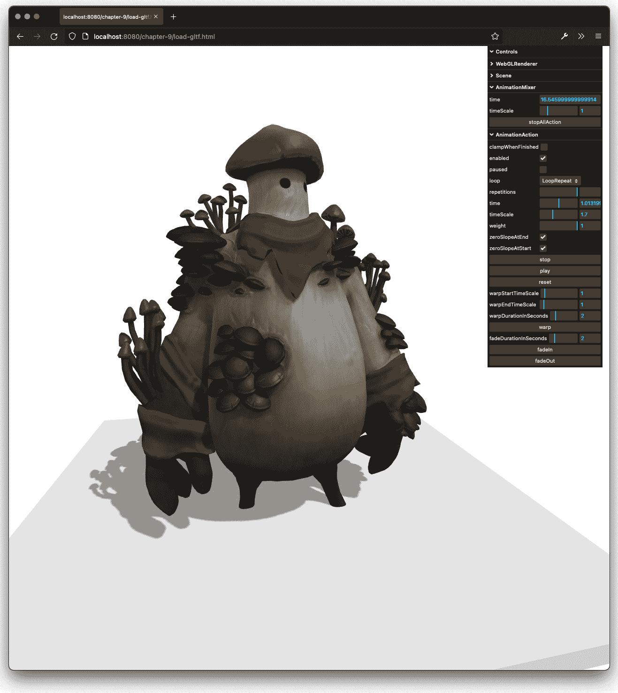

图 9.21 – 使用 glTF 加载的动画

对于下一个例子，我们将使用 FBX 模型。

## 使用 fbxLoader 可视化捕捉到的动作模型

Autodesk FBX 格式已经存在一段时间了，并且非常易于使用。网上有一个非常好的资源，您可以在这里找到许多可以下载的动画：[`www.mixamo.com/`](https://www.mixamo.com/)。该网站提供了 2,500 个您可以使用和定制的动画：

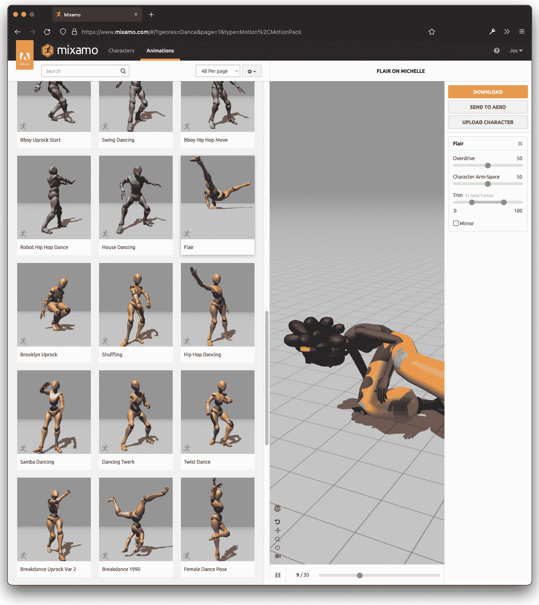

图 9.22 – 从 mixamo 加载动画

下载动画后，使用 Three.js 处理它很容易：

```js
import { FBXLoader } from 'three/examples/jsm/loaders/FBXLoader'
...
loader.loadAsync('/assets/models/salsa/salsa.fbx').then((mesh) => {
  mesh.translateX(-0.8)
  mesh.translateY(-1.9)
  mesh.scale.set(0.03, 0.03, 0.03)
  scene.add(mesh)
  const mixer = new THREE.AnimationMixer(mesh)
  const clips = mesh.animations
  const clip = THREE.AnimationClip.findByName(clips, 
    'mixamo.com')   
})
```

如您在 `load-fbx.html` 中所见，生成的动画看起来很棒：

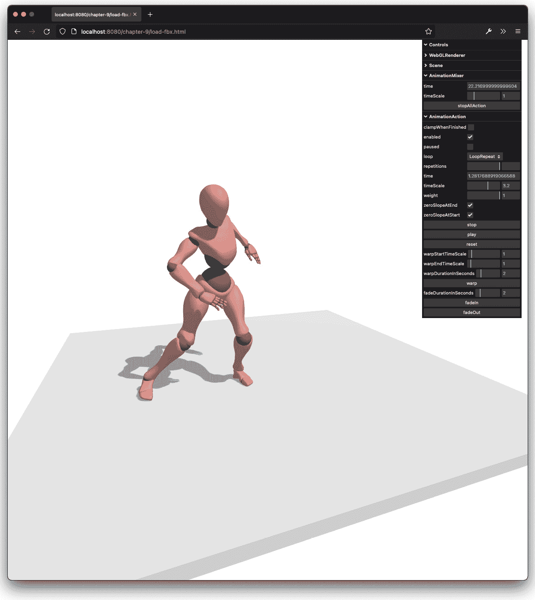

图 9.23 – 使用 fbx 加载的动画

FBX 和 glTF 是现代格式，被广泛使用，是交换模型和动画的好方法。还有一些旧的格式。一个有趣的是老式 FPS 游戏 Quake 使用的格式：MD2。

## 从 Quake 模型加载动画

MD2 格式是为了建模 1996 年一款伟大的游戏 Quake 中的角色而创建的。尽管较新的引擎使用不同的格式，但您仍然可以在 MD2 格式中找到许多有趣的模型。使用 MD2 文件与使用我们迄今为止看到的其他文件略有不同。当您加载 MD2 模型时，您会得到一个几何形状，因此您必须确保同时创建一个材质并将其分配给皮肤：

```js
let animations = []
const loader = new MD2Loader()
loader.loadAsync('/assets/models/ogre/ogro.md2').then
  ((object) => {
  const mat = new THREE.MeshStandardMaterial({
    color: 0xffffff,
    metalness: 0,
    map: new THREE.TextureLoader().load
      ('/assets/models/ogre/skins/skin.jpg')
  })
  animations = object.animations
  const mesh = new THREE.Mesh(object, mat)
  // add to scene, and you can animate it as we've seen 
    already
})
```

一旦您有了这个 `Mesh`，设置动画的方式与之前相同。这个动画的结果可以在这里看到（`load-md2.html`）：

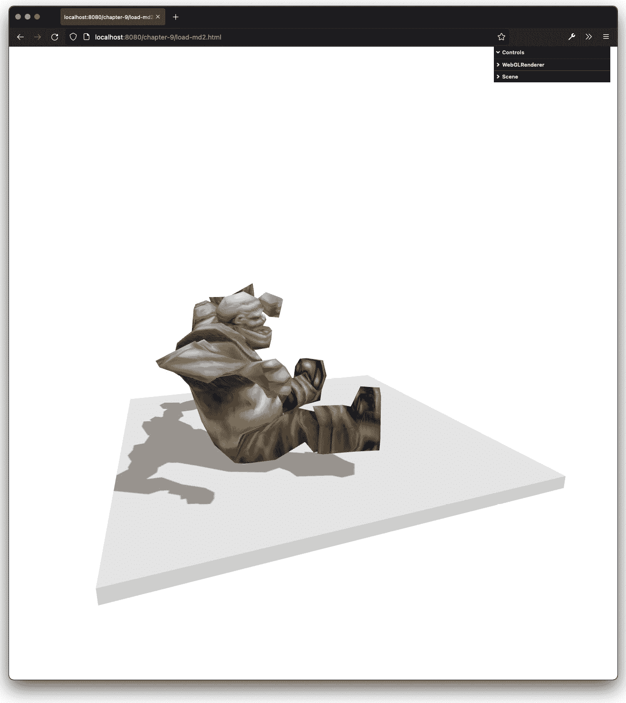

图 9.24 – 加载的 Quake 怪物

接下来是 COLLADA。

## 从 COLLADA 模型加载动画

虽然正常的 COLLADA 模型未压缩（并且它们可以变得相当大），但 Three.js 中还有一个 `KMZLoader`。这是一个压缩的 COLLADA 模型，所以如果您遇到 `KMZLoader` 而不是 `ColladaLoader`：

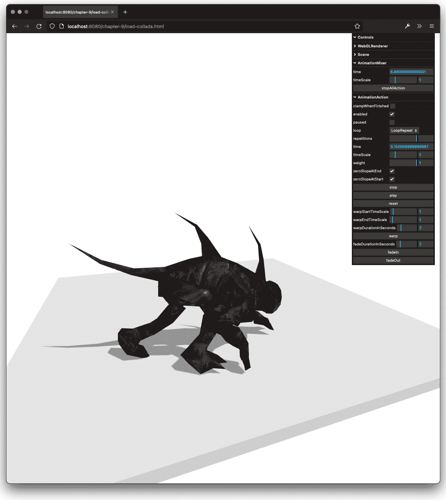

图 9.25 – 加载的 COLLADA 模型

对于最终的加载器，我们将查看 `BVHLoader`。

## 使用 BVHLoader 可视化骨骼

`BVHLoader` 是一种与我们迄今为止看到的不同的加载器。这个加载器不返回带有动画的网格或几何形状；相反，它返回一个骨骼和一个动画。一个例子可以在 `load-bvh.html` 中看到：

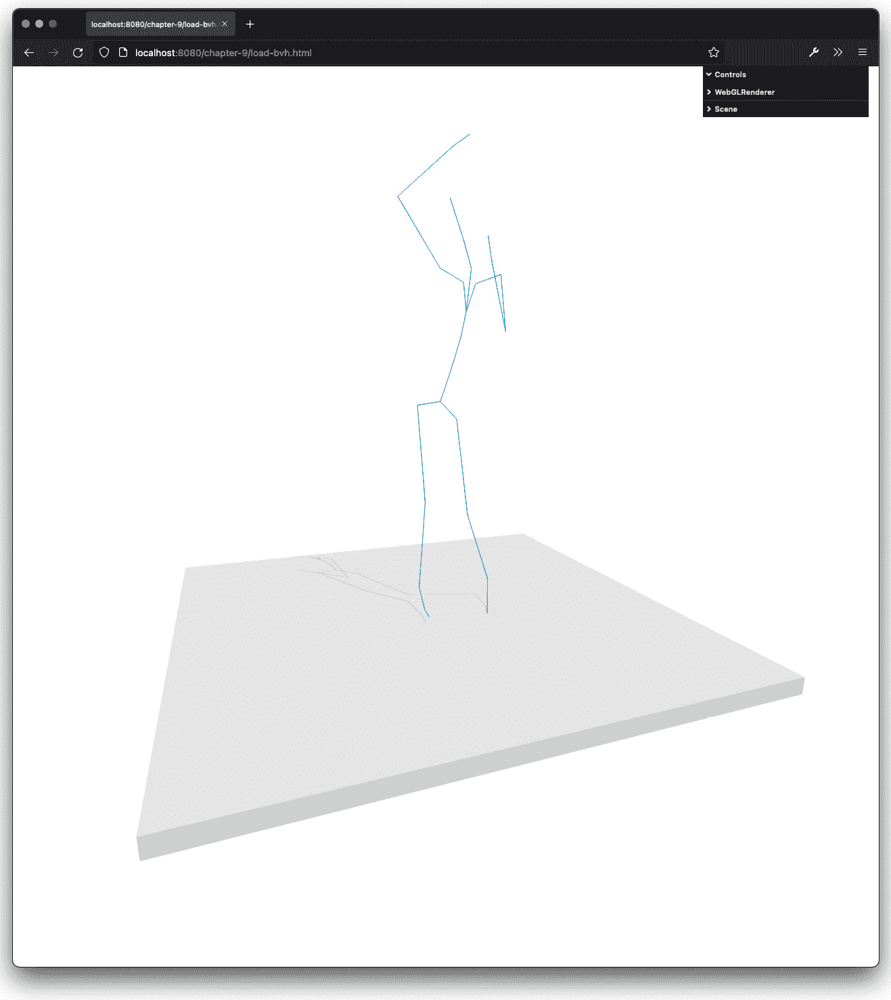

图 9.26 – 加载的 BVH 骨骼

为了可视化这一点，我们可以使用 `THREE.SkeletonHelper`，如下所示。使用 `THREE.SkeletonHelper`，我们可以可视化网格的骨骼。BVH 模型仅包含骨骼信息，我们可以像这样可视化：

```js
const loader = new BVHLoader()
let animation = undefined
loader.loadAsync('/assets/models//amelia-dance/DanceNightClub7_t1.bvh').then((result) => {
  const skeletonHelper = new THREE.SkeletonHelper
    (result.skeleton.bones[0])
  skeletonHelper.skeleton = result.skeleton
  const boneContainer = new THREE.Group()
  boneContainer.add(result.skeleton.bones[0])
  animation = result.clip
  const group = new THREE.Group()
  group.add(skeletonHelper)
  group.add(boneContainer)
  group.scale.setScalar(0.2)
  group.translateY(-1.6)
  group.translateX(-3)
  // Now we can animate the group just like we did for the 
    other examples
})
```

在 Three.js 的旧版本中，支持其他类型的动画文件格式。其中大多数已经过时，并随后从 Three.js 发行版中删除。如果您偶然发现了一种您想要展示动画的不同格式，您可以查看旧的 Three.js 版本，并可能重新使用那里的加载器。

# 摘要

在本章中，我们探讨了您可以为场景添加动画的不同方法。我们首先介绍了一些基本的动画技巧，然后转向摄像机运动和控制，最后通过使用形态目标以及骨骼/骨骼动画来查看如何对模型进行动画处理。

当您已经设置了渲染循环后，添加简单的动画变得非常容易。只需更改网格的一个属性；在下一个渲染步骤中，Three.js 将渲染更新后的网格。对于更复杂的动画，您通常会使用外部程序进行建模，并通过 Three.js 提供的加载器之一加载它们。

在前面的章节中，我们探讨了我们可以用来为对象着色的各种材质。例如，我们看到了如何更改这些材质的颜色、光泽度和透明度。然而，我们尚未详细讨论如何使用外部图像（也称为纹理）与这些材质结合使用。通过纹理，我们可以轻松创建看起来像是用木材、金属、石头等材料制成的对象。在*第十章*中，我们将探讨纹理的所有不同方面以及它们在 Three.js 中的使用方式。
