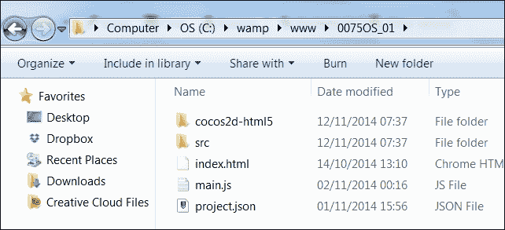
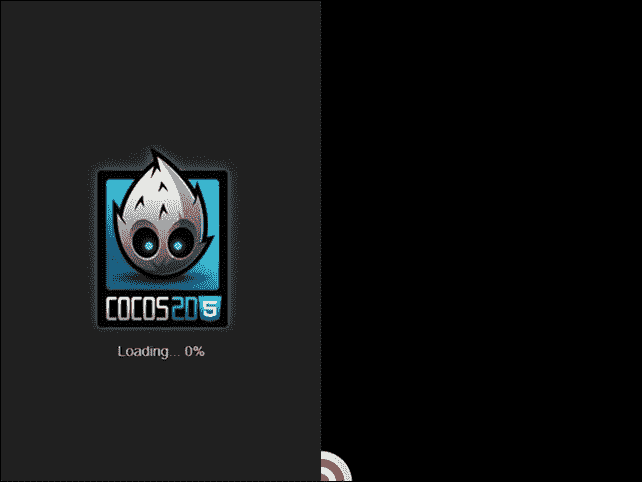

# 第一章. Hello World – 一个跨平台游戏

传说中，当你学习一门新语言时，第一个应该做的有效脚本就是将经典的 Hello World 打印在屏幕上的某个位置。

本章将指导你创建一个跨平台的 Hello World 示例，涵盖以下概念：

+   跨平台游戏创建背后的理论

+   Cocos2d-JS 安装和设置

+   Cocos2d-JS 项目蓝图

+   场景、层和精灵

+   预加载图片

+   添加图片

+   移除图片

到本章结束时，你将能够创建一个模板项目，用于创建任何类型的 Cocos2d-JS 跨平台游戏，该游戏能够在不同分辨率的多种设备上运行。

# 为什么我应该制作跨平台游戏？

这是一个非常重要的问题。当 HTML5 移动游戏开始变得流行时，我多次问自己这个问题。我只是认为仅仅关注不同的屏幕分辨率和宽高比是浪费时间，所以我的第一个 HTML5 游戏是为了完美适配我的 iPad 2 平板。

当我终于向赞助商展示它时，他们中的大多数人都说了类似这样的话：“嘿，我喜欢这个游戏，但不幸的是，它在我的 iPhone 上看起来并不好。”“别担心，”我说，“你会得到为 iPad 和 iPhone 优化的游戏。”不幸的是，它在 Galaxy Note 上看起来也不太好。在 Samsung S4 上也是一样。

你可以想象这个故事的其他部分。我发现自己几乎是用一系列的 `if.. then.. else` 循环重写游戏，试图让它在任何设备上都看起来不错。

这就是为什么你应该制作一个跨平台游戏的原因：*一次编码，统治所有*。专注于游戏开发，让框架为你做脏活。

# Cocos2d-JS 是什么以及它是如何工作的

**Cocos2d-JS** 是一个免费的开放源代码 2D 游戏框架。它可以帮助你开发跨平台浏览器游戏和原生应用程序。这个框架允许你用 JavaScript 编写游戏。所以，如果你已经开发了 JavaScript 应用程序，你不需要从头开始学习一门新语言。在这本书中，你将学习如何使用熟悉且直观的语言创建几乎任何类型的跨平台游戏。

## 运行 Cocos2d-JS 的要求

在你开始之前，让我们看看你需要在你电脑上安装哪些软件，以便开始使用 Cocos2d-JS 进行开发：

+   首先，你需要一个文本编辑器。Cocos2d-JS 编码的官方 IDE 是 **Cocos Code IDE**，你可以免费在 [`www.cocos2d-x.org/products/codeide`](http://www.cocos2d-x.org/products/codeide) 下载。它具有自动完成、代码提示和一些其他有趣的功能，可以帮助你加快编码速度。如果你习惯使用你喜欢的代码编辑器，那也行。有很多这样的编辑器，但我个人在我的 Windows 机器上使用 PSPad（你可以在 [`www.pspad.com/`](http://www.pspad.com/) 找到它），在 Mac 上使用 TextWrangler（你可以在 [`www.barebones.com/products/textwrangler/`](http://www.barebones.com/products/textwrangler/)) 找到它）。它们都是免费的，而且易于使用，所以你可以下载并在几分钟内安装它们。

+   要测试你的 Cocos2d-JS 项目，你需要在电脑上安装一个网络服务器来覆盖运行本地项目时的安全限制。我在我的 Windows 机器上使用 WAMP ([`www.wampserver.com/`](http://www.wampserver.com/))，在 Mac 上使用 MAMP ([`www.mamp.info/`](http://www.mamp.info/))。

    ### 小贴士

    再次强调，两者都是免费的，因为你不需要 PRO 版本，这个版本也适用于 Mac 电脑。解释所有背后的理论超出了本书的范围，但你可以在官方网站上找到所有必需的信息以及安装文档。

+   如果你愿意，你可以直接在线测试你的项目，通过上传到你拥有的 FTP 空间，并直接从网页上调用它们。在这种情况下，你不需要在电脑上安装网络服务器，但我强烈建议使用 WAMP 或 MAMP。

+   我个人使用 Google Chrome 作为默认浏览器来测试我的项目。由于这些项目旨在成为跨平台游戏，它们应该在每个浏览器上以相同的方式运行，所以请随意使用你喜欢的浏览器。

关于 Cocos2d-JS 的最新信息可以在官方网站 [`www.cocos2d-x.org/wiki/Cocos2d-JS`](http://www.cocos2d-x.org/wiki/Cocos2d-JS) 上找到，而最新版本可以在 [`www.cocos2d-x.org/download`](http://www.cocos2d-x.org/download) 下载。

### 注意

Cocos2d-JS 更新相当频繁，但截至本书编写时，最新的稳定版本是 v3.1。虽然新版本总是带来一些变化，但本书中包含的所有示例都应该与任何标记为 3.x 的版本兼容，因为路线图上没有巨大的变化。

你会注意到下载的文件是一个大于 250 MB 的 `ZIP` 文件。不用担心。包中的大部分内容是由文档、图形资产和示例组成的，而目前唯一必需的文件夹是名为 `cocos2d-html5` 的文件夹。

# 你的 Cocos2d-JS 项目的结构

每个 HTML5 游戏基本上都是一个带有一些魔法的网页；这就是你将使用 Cocos2d-JS 创建的：一个带有一些魔法的网页。

要执行这个魔法，需要创建一定的文件结构，所以让我们看看一个包含 Cocos2d-JS 项目的文件夹的截图：



这就是你将要构建的内容；说实话，这是我为本章要解释的示例项目所构建的实际项目文件夹的图片，它放置在我的电脑上的 WAMP `localhost` 文件夹中。它再真实不过了。

那么，让我们看看将要创建的文件：

+   `cocos2d-html5`: 这是你在 zip 压缩文件中找到的文件夹。

+   `index.html`: 这是将包含游戏的网页。

+   `main.js`: 这是一个由 Cocos2d-JS 调用的文件，用于启动游戏。你将在接下来的几分钟内创建它。

+   `project.json`: 这是一个包含一些基本配置的 **JavaScript 对象表示法** (**JSON**) 文件。这是你使游戏运行所必需的。好吧，几乎是这样，因为实际的游戏将放置在 `src` 文件夹中。我们先看看其他一些事情。

# 欢迎来到跨世界

时候到了，无聊的理论结束了，我们现在可以开始编写我们的第一个项目了。让我们开始吧！

1.  首先，在游戏文件夹的根目录下创建一个名为 `index.html` 的页面，并编写以下 HTML 代码：

    ```js
    <!DOCTYPE html>
      <head>
        <title>
          My Awesome game
        </title>
        <script src="img/CCBoot.js" type="text/javascript">
    </script>
        <script src="img/main.js" type="text/javascript">
    </script>
      </head>
      <body style="padding:0;margin:0;background-color:#000000;">
      </body>
    </html>
    ```

    目前里面没有什么有趣的东西，因为它只是普通的 HTML。让我们仔细看看这些行，看看发生了什么：

    ```js
    <script src="img/CCBoot.js "></script>
    ```

    在这里，我包括了 Cocos2d-JS 启动文件以启动框架：

    ```js
    <script src="img/main.js"></script>
    ```

    从上一行，这是我们调用实际将要构建的游戏脚本的地方。接下来，我们有以下代码：

    ```js
    <canvas id="gameCanvas"></canvas>
    ```

    这是我们将用来显示游戏的画布。注意这里，画布没有宽度和高度，因为它们将由游戏本身定义。

1.  接下来是创建 `main.js`: 我们将从主 `index.html` 页面调用的唯一文件。这更像是一个配置文件，而不是游戏本身，所以你现在不会编写任何与游戏相关的代码。然而，你将要构建的文件将成为你在所有 Cocos2d-JS 游戏中使用的蓝图。

    `main.js` 的内容如下：

    ```js
    cc.game.onStart = function(){
        cc.view.setDesignResolutionSize(320, 480, cc.ResolutionPolicy.SHOW_ALL);
        cc.director.runScene(new gameScene());
    };
    cc.game.run();
    ```

    目前不必担心代码；它看起来比实际复杂得多。目前，我们唯一需要担心的是定义分辨率策略的那一行。

    ### 小贴士

    在跨平台开发中最具挑战性的任务之一是提供良好的游戏体验，无论游戏运行在什么浏览器或设备上。然而，问题在于每个设备都有自己的分辨率、屏幕尺寸和比例。

    Cocos2d-JS 允许我们以类似于网页设计师在构建响应式设计时的方式处理不同的分辨率。目前，我们只想使游戏画布适应浏览器窗口，并针对最流行的分辨率，即 320x480（纵向模式）。这就是这一行的作用：

    ```js
     cc.view.setDesignResolutionSize(320, 480, cc.ResolutionPolicy.SHOW_ALL);
    ```

    使用这些设置，你应该相当确信你的游戏可以在每个设备上运行，尽管你将在低分辨率下工作。

    还请看看这一行：

    ```js
    cc.director.runScene(new gameScene());
    ```

    基本上，一个 Cocos2d-JS 游戏是由一个场景构成的，其中游戏本身运行。同一个游戏中可以有多个场景。想象一下，有一个标题屏幕的场景，一个游戏结束屏幕的场景，以及一个游戏本身的场景。目前，你只有一个名为`gameScene`的场景。记住这个名称，因为你稍后将会用到它。

1.  接下来，你将要构建的下一个必需的蓝图文件是`project.json`，它有一些有趣的设置。让我们首先看看这个文件：

    ```js
    {
      "debugMode" : 0,
      "showFPS" : false,
      "frameRate" : 60,
      "id" : "gameCanvas",
      "renderMode" : 0,
      "engineDir":"cocos2d-html5/",

      "modules" : ["cocos2d"],

      "jsList" : [
        "src/gamescript.js"
      ]
    }
    ```

    这些行代表什么意思？让我们逐个看看：

    +   `debugMode`：这是确定调试警告级别的对象键。它的范围从 0 到 6。目前，由于项目非常简单，我们不会出错，所以请将其保留为 0。

    +   `showFPS`：这个对象可以是**true**或**false**；它会在屏幕上显示或隐藏 FPS 计。

    +   `frameRate`：这个对象设置游戏的帧率。将其设置为`60`以获得流畅的游戏体验。

    +   `id`：这是运行游戏所需的 DOM 元素。你还记得你给你的 canvas 分配了`gameCanvas`的 id 吗？这里就是。

    +   `engineDir`：这是 Cocos2d-JS 安装的文件夹。

    +   `modules`：这个对象负责加载模块。目前，我们只需要基本的 Cocos2d 库。

    +   `jsList`：这是一个包含游戏中使用的文件的数组。这意味着我们将创建我们的游戏在`src/gamescript.js`中。

1.  最后，我们到达了游戏脚本本身。这是包含实际游戏内容的脚本，`gamescript.js`，目前它只是一个对游戏场景的简单声明：

    ```js
    var gameScene = cc.Scene.extend({
      onEnter:function () {
        this._super();
        console.log("my awesome game starts here");
      }
    });
    ```

    在这里，你想要保存一切，并在浏览器中从你的`localhost`（参考你的 WAMP 或 MAMP 文档）调用`index.html`页面。如果你现在打开开发者控制台，你应该会看到：

    **我令人惊叹的游戏从这里开始**

恭喜！这意味着你已经成功创建了一个 Cocos2d-JS 模板文件来构建你未来的游戏。

让我们立即构建我们的第一个迷你游戏！

# 预加载和添加图片

在这个例子中，我使用了一个 64x64 的`PNG`图像来表示一个目标，如图所示：


你显然可以使用你喜欢的任何图像。

当你加载一个网页时，在大多数情况下，页面会在所有图片加载之前加载并显示。这在网页上听起来可能没问题，因为读者不会介意在图片显示之前等待几秒钟，但在游戏中绝对不能这样。这意味着我们的图片需要预加载，而 Cocos2d-JS 可以轻松处理这一点。在游戏中预加载图片的步骤如下：

1.  这是第一次你在`project.json`文件中添加这一行：

    ```js
    {
      "debugMode" : 0,
      "showFPS" : false,
      "frameRate" : 60,
      "id" : "gameCanvas",
      "renderMode" : 0,
      "engineDir":"cocos2d-html5/",

      "modules" : ["cocos2d"],

      "jsList" : [
        "src/loadassets.js",
        "src/gamescript.js"
      ]
    }
    ```

    这意味着你需要在刚刚创建 `gamescript.js` 的同一 `src` 文件夹中创建另一个名为 `loadassets.js` 的文件。

    这是 `loadassets.js` 的内容：

    ```js
    var gameResources = [
         "assets/target.png"
    ];
    ```

    一个名为 `gameResources` 的数组存储要预加载的资产。因此，你应该创建一个名为 `assets` 的文件夹，并将 `target.png` 图像放入此文件夹中。

    ### 注意

    为了保持项目组织清晰，我打算将所有游戏资产放置在一个名为 `assets` 的文件夹中。

1.  现在，Cocos2d-JS 已知哪些图像需要预加载，我们只需要告诉游戏在场景开始之前必须预加载它们，因此我们需要在 `main.js` 中添加几行代码：

    ```js
    cc.game.onStart = function(){
      cc.view.setDesignResolutionSize(320, 480, cc.ResolutionPolicy.SHOW_ALL);
      cc.LoaderScene.preload(gameResources, function () {
        cc.director.runScene(new gameScene());
      }, this);
    };
    cc.game.run();
    ```

    `cc.LoaderScene.preload` 构造函数将预加载 `loadassets.js` 中定义的 `gameResources` 数组中指定的场景资源。所有拼图块都完美匹配。

1.  最后，让我们通过重写 `gamescript.js` 文件来将目标添加到游戏中：

    ```js
    var gameScene = cc.Scene.extend({
      onEnter:function () {
      this._super();
        var gameLayer = new game();
        gameLayer.init();
        this.addChild(gameLayer);
      }
    });
    var game = cc.Layer.extend({
      init:function () {
        this._super();
        var target = cc.Sprite.create("assets/target.png");
        this.addChild(target,0);
      }
    });
    ```

如果你使用 **AS3**（**ActionScript 3**）开发了 Flash 游戏，你会发现 Cocos2d-JS 的资产层次结构对显示对象很熟悉。如果你是新手，让我来解释一下发生了什么：

1.  就像所有处理图形资源的框架一样，Cocos2d-JS 有层次规则。在这个层次结构的顶部，我们找到了 `Scene` 对象。每个场景包含一些游戏逻辑；想想主菜单场景、游戏场景和游戏结束场景。

1.  每个场景包含一个或多个 `Layer` 对象；层定义了哪些内容应该位于其他内容之上。在现实世界的例子中，关卡背景位于最底层的层，玩家和敌人将在背景之上的层中创建，而游戏信息，如得分和剩余生命，将放置在最顶层的层上。

1.  最后，所有层都可以有一个或多个 `Sprite` 对象，它们是图形资产本身，如玩家、敌人，或者在这种情况下，目标是。

1.  总结来说，代码意味着一旦 `gameScene` 执行，就创建并添加 `game` 层，并在该层中添加 `target` 精灵。

是时候通过调用 `index.html` 文件来测试项目了，以下截图是你应该得到的：



尽管这只是一个基本项目，但有几个需要注意的事项：

+   图像已预加载，并显示默认的加载屏幕。这意味着预加载器正在工作。

+   尽管我们的项目设置为在 320x480 的分辨率下工作，但由于之前设置的分辨率策略，游戏会拉伸以填满整个浏览器。

+   图像在其中心的注册点，而大多数框架的图像注册点位于左上角。

+   场景的原始（0,0）位置位于左下角，而大多数框架的原始位置在左上角。

总之，你已经能够创建你的第一个项目。要更改目标位置并将其放置在屏幕中间，只需使用 `setPosition` 方法，这样修改 `gamescript.js`：

```js
var gameScene = cc.Scene.extend({
  onEnter:function () {
  this._super();
    var gameLayer = new game();
    gameLayer.init();
    this.addChild(gameLayer);
  }
});

var game = cc.Layer.extend({
  init:function () {
    this._super();
    var target = cc.Sprite.create("assets/target.png");
    this.addChild(target,0);
    target.setPosition(160,240);
  }
});
```

测试项目，你将在屏幕中间看到目标图像。

# 移除图片和更改背景颜色

现在你已经知道了如何添加图片，你可能还想知道如何移除它们。这非常直观：你使用 `addChild` 方法添加图片，所以你将使用 `removeChild` 方法移除它们。

此外，我们将通过添加一个实际的背景层来更改背景颜色，这个背景层将整个场景覆盖为一个纯色。

只需在 `gamescript.js` 中添加几行代码：

```js
var gameScene = cc.Scene.extend({
  onEnter:function () {
  this._super();
    var gameLayer = new game();
    gameLayer.init();
    this.addChild(gameLayer);
  }
});
var backgroundLayer;
var game = cc.Layer.extend({
  init:function () {
    this._super();
    backgroundLayer = cc.LayerColor.create(new cc.Color(40,40,40,255), 320, 480);
this.addChild(backgroundLayer);
    var target = cc.Sprite.create("assets/target.png");
    backgroundLayer.addChild(target,0);
    target.setPosition(160,240);
setTimeout(function(){
    backgroundLayer.removeChild(target);
    }, 3000);
  }
});
```

在前面的代码中，`backgroundLayer` 是一个新层，它将以 **RGBA** 格式（在这种情况下，全不透明的深灰色）填充新的颜色，并将包含目标图像。

自创建以来经过三秒钟，目标图像将通过 `removeChild` 方法从 `backgroundLayer` 中移除。

# 概述

在本章中，你学习了如何安装、配置和运行你的第一个 Cocos2d-JS 项目。你还学习了如何在屏幕上放置图片。

在下一章中，我们将讨论放置相同对象的更多实例，你还将创建你的第一个游戏，所以现在不要急于查看！

通过尝试在屏幕上随机位置放置 10 个目标来测试自己。
