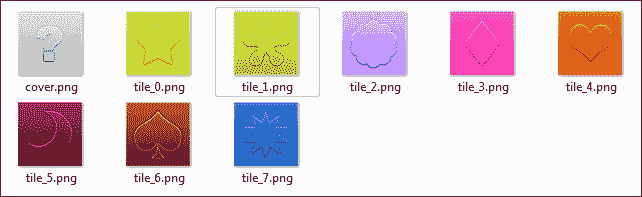
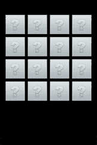
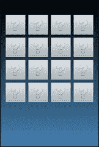
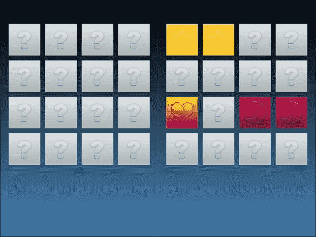
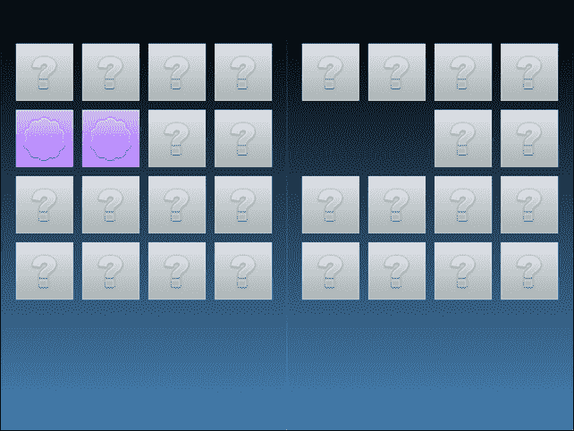
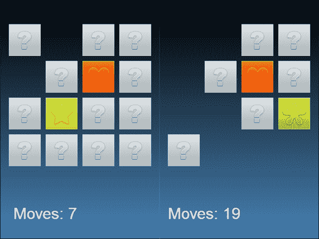

# 第二章. 添加交互性 – 制作注意力游戏

根据定义，游戏在某种程度上是交互式的。玩家必须通过做事情来成为游戏的一部分。最简单的交互形式是在游戏中点击或触摸瓷砖。

注意力游戏很容易解释，但它将涵盖一些新的重要概念，例如：

+   创建多个游戏资源实例

+   扩展类以增强其功能。实际上，JavaScript 中没有类，但它们通过变量和原型进行模拟

+   添加渐变

+   使资产对点击和触摸做出反应

+   动态更改精灵图像

+   添加文本标签

+   从游戏中移除精灵

到本章结束时，你将能够使用空间定制创建一个完整的注意力游戏。

由于上一章创建的项目不仅仅是 Hello World 游戏，而更像是你未来所有项目的蓝图，你将开始从之前完成的项目构建我们的注意力游戏。

# 创建多个游戏资源实例

制作注意力游戏的第一件事是绘制你将在游戏中使用的瓷砖。以下是用于覆盖瓷砖和可能匹配的八种不同瓷砖的图片，所有这些图片都保存在`assets`文件夹中，如前一章所述：



每个瓷砖是一个 64 x 64 的`PNG`文件，其中覆盖的瓷砖称为`cover.png`，而要匹配的瓷砖则用从 0 到 7 的递增数字命名：**tile_0**、**tile_1**，直到**tile_7**。这是因为实际的棋盘瓷砖值将存储在一个数组中，其值范围从 0 到 7，将值 0 分配给**tile_0**、值 1 分配给**tile_1**，以此类推。

在资产文件夹中有这九个文件后，你就可以通过位于我们项目`src`文件夹中的`loadassets.js`文件来加载它们，感谢这些文件：

```js
var gameResources = ["assets/cover.png",
  "assets/tile_0.png",
  "assets/tile_1.png",
  "assets/tile_2.png",
  "assets/tile_3.png",
  "assets/tile_4.png",
  "assets/tile_5.png",
  "assets/tile_6.png",
  "assets/tile_7.png"
];

```

图片的加载方式与上一章相同；然后放置所有 16 个覆盖瓷砖。

这是`gamescript.js`的内容，基本上与上一章中使用的相同，只是精灵创建在一个将执行 16 次的`for`循环中：

```js
var gameScene = cc.Scene.extend({
  onEnter:function () {
    this._super();
    gameLayer = new game();
    gameLayer.init();
    this.addChild(gameLayer);
  }
});

var game = cc.Layer.extend({
  init:function () {
    this._super();
    for(i=0;i<16;i++){
      var tile = cc.Sprite.create("assets/cover.png");
      this.addChild(tile,0);
      tile.setPosition(49+i%4*74,400-Math.floor(i/4)*74);
    }
  }
});
```

`setPosition`方法中的奇怪数字将 64 x 64 瓷砖组放置在舞台上的 4 x 4 网格中。你可以使用一些数学来以你喜欢的任何方式更改瓷砖的位置。

测试游戏，你将在屏幕上看到以下内容：



这是一个覆盖的瓷砖网格，但背景很糟糕。是时候再好好工作一下了。

# 添加渐变背景

改善背景的一个快速简单的方法是添加渐变。你最喜欢的游戏背景中看到的大部分天空和风景都是渐变。

你将通过在 `gamescript.js` 中添加这两行代码，方便地将名为 `gradient` 的渐变层添加到游戏中：

```js
var gameScene = cc.Scene.extend({
  // same as before
});

var game = cc.Layer.extend({
  init:function () {
    this._super();
    var gradient = cc.LayerGradient.create(cc.color(0,0,0,255), cc.color(0x46,0x82,0xB4,255));
 this.addChild(gradient);
    for(i=0;i<16;i++){
      var tile = cc.Sprite.create("assets/cover.png");
      this.addChild(tile,0);
      tile.setPosition(49+i%4*74,400-Math.floor(i/4)*74);
    }
  }
});
```

渐变层的创建是通过 `cc.LayerGradient.create` 方法实现的，它需要以 **RGBA**（**红，绿，蓝，透明度**）格式提供起始和结束渐变色。

关于添加的行，你需要注意两点：

1.  渐变层应该在瓦片之前添加，这样瓦片就会放在背景前面，因为你可以通过调整层的深度来动态调整 Z 调序中的层，但这并不是这种情况。

1.  渐变色可以用十进制（从 0 到 255）和十六进制（从 0x00 到 0xFF）的值指定。

现在，再次测试游戏，你应该会看到一个漂亮的黑到蓝的背景。



此时，你已经在美丽的渐变背景上放置了 16 个瓦片。现在，是时候让玩家有能力拾取其中的一些了。

不幸的是，精灵只是图像，不能被拾取。

# 超越 Sprite 类的能力

当我说 *有时*，我的意思是 *大多数时候*，默认的 Cocos2d-JS 类不允许你用它们做你需要做的所有事情。

虽然这看起来像是 Cocos2d-JS 的限制，但这却是它的最佳特性之一。你被提供了一组基本的类，你可以按需扩展，这意味着你可以添加新的功能。

那么，扩展一个类到底意味着什么呢？想象一个现实世界的例子：你走进一家自行车店，买了一辆山地自行车。你的山地自行车是一个类；使用这个类，你可以做所有你实际上可以用山地自行车做的事情，即踩踏和转向。

不幸的是，你有点懒惰，不想一直踩踏，所以你买了一个小马达并将其添加到你的山地自行车上。现在，你仍然可以像通常那样使用你的自行车，但你也可以休息你的腿，打开马达，让它代表你踩踏。

你只是扩展了山地自行车，创建了一辆电动山地自行车，这基本上仍然是一辆自行车，并继承了所有其功能以及一些新功能。

为了扩展 `Sprite` 类并使其能够完成制作你的注意力游戏所需的所有操作，你必须在 `gamescript.js` 中添加一些行：

```js
var gameScene = cc.Scene.extend({
  onEnter:function () {
    // same as before
  }
});

var game = cc.Layer.extend({
  init:function () {
    this._super();
    var gradient = cc.LayerGradient.create(cc.c4b(0,0,0,255), cc.c4b(0x46,0x82,0xB4,255));
    this.addChild(gradient);
    for(i=0;i<16;i++){
      var tile = new MemoryTile();
      this.addChild(tile,0);
      tile.setPosition(49+i%4*74,400-Math.floor(i/4)*74);
    }
  }
}); 
var MemoryTile = cc.Sprite.extend({
 ctor:function() {
 this._super();
 this.initWithFile("assets/cover.png");
 }
});

```

如果你此时测试游戏，你会看到与 4x4 网格覆盖瓦片相同的背景渐变。让我们看看有什么变化。

首先，瓦片的创建不再使用以下代码：

```js
var tile = cc.Sprite.create("assets/cover.png");
```

相反，它已经被以下内容替换：

```js
var tile = new MemoryTile();

```

现在，你并不是在创建精灵本身，而是在创建一个名为 `MemoryTile` 的新类型，它将扩展 `Sprite` 类。

这就是声明你正在扩展一个类的样子：

```js
var MemoryTile = cc.Sprite.extend({
  ctor:function() {
    this._super();
    this.initWithFile("assets/cover.png");
  }
})
```

在这里，`MemoryTile` 变量被声明为 `Sprite` 类的扩展。

`ctor`方法是一个构造函数，基本上是变量创建时立即执行的内容。在这种情况下，`initWithFile`使用你之前使用旧方法放置瓦片时分配的相同封面图像。

你可能会争论说，使用四行代码来做本可以用一行代码完成的事情，这是真的，但这是你为了向 Cocos2d-JS 内置类添加新功能所付出的微小代价。

现在，你有一个新的类，它扩展了 Sprite。让我们给它添加交互性。

# 使资产对点击和触摸做出反应

有两种选择瓦片的方法，无论你是使用触摸或鼠标驱动的设备。你可以轻触瓦片，或者点击它。

## 选择一个瓦片作为初始尝试

无论你如何使用 Cocos2d-JS，总的来说，你都在创建跨平台游戏。你必须告诉 Cocos2d-JS 你将允许用户触摸或点击一些瓦片，因此`MemoryTile`类将这样改变：

```js
var MemoryTile  = cc.Sprite.extend({
  ctor:function() {
    this._super();
    this.initWithFile("assets/cover.png");
    cc.eventManager.addListener(listener.clone(), this);
  }
})
```

刚才发生了什么？你刚刚向事件管理器添加了一个事件监听器。事件管理器是触发游戏或玩家引发的事件的实体。`addListener`方法向事件管理器添加了一个监听器，但目前你还没有监听器。让我们创建一个：

```js
var listener = cc.EventListener.create({
  event: cc.EventListener.TOUCH_ONE_BY_ONE,
  swallowTouches: true,
  onTouchBegan: function (touch, event) {
    var target = event.getCurrentTarget();
    var location = target.convertToNodeSpace(touch.getLocation());
    var targetSize = target.getContentSize();
    var targetRectangle = cc.rect(0, 0, targetSize.width, targetSize.height);
    if (cc.rectContainsPoint(targetRectangle, location)) {
      console.log("I picked a tile!!");
    }
  }
})
```

这是一个基本的监听器。你会在大多数项目中使用它，所以让我们更仔细地看看它：

```js
var listener = cc.EventListener.create({
```

这就是如何使用`cc.EventListener.create`方法创建一个监听器。你将其命名为`listener`以匹配之前的调用：

```js
cc.eventManager.addListener(listener.clone(), this);

```

然后，你修改了`MemoryTile`类：

```js
event: cc.EventListener.TOUCH_ONE_BY_ONE,
```

在这里，你指定事件类型：`cc.EventListener.TOUCH_ONE_BY_ONE`告诉游戏你正在等待触摸，但一次只等待一个。请注意，游戏谈论的是触摸，但游戏也可以与鼠标一起工作。这就是 Cocos2d-JS 在处理跨平台开发时的真正力量。

```js
swallowTouches: true,
```

这将基本上忽略所有触摸，当有一个活动触摸时：

```js
onTouchBegan: function (touch, event) {
```

现在，随着你准备在触摸或鼠标点击开始时触发，事情开始变得严肃：

```js
var target = event.getCurrentTarget();
```

`getCurrentTarget`方法返回当前的点击目标：

```js
var location = target.convertToNodeSpace(touch.getLocation());
```

通过调用`touch.getLocation`方法，你将获得游戏内触摸或点击的坐标，而`convertToNodeSpace`方法将此类坐标转换为相对于瓦片的坐标。这样，`location`变量将包含相对于瓦片的触摸或点击坐标：

```js
var targetSize = target.getContentSize();
```

`getContentSize`函数仅返回目标的宽度和高度，在这种情况下是瓦片：

```js
var targetRectangle = cc.rect(0, 0, targetSize.width, targetSize.height);
```

现在，你使用`cc.rect`方法定义一个与瓦片大小相同的矩形。这将使我们知道点击或触摸动作是否在这个矩形内部。某个瓦片已被点击：

```js
if (cc.rectContainsPoint(targetRectangle, location)) {
```

此外，这也是你确定一个点是否在矩形内部的方法，因此你可以说你点击了瓦片。

所以，基本上：

1.  每个瓦片都会检测到`touch`或`click`动作，这个动作可以在瓦片内部或外部。

1.  你得到相对于瓷砖的触摸/点击坐标。

1.  你可以看到这些坐标是否在瓷砖内。

1.  你可以说哪个瓷砖被点击了，如果有的话。

你准备好点击瓷砖了吗？运行游戏并点击一个瓷砖，你就会看到。

**我选中了一个瓷砖！！**

是的，它工作了！让我再展示这一行：

```js
cc.eventManager.addListener(listener.clone(), this);

```

你在第一次编写它时注意到 `clone()` 方法了吗？你使用 `clone` 方法是因为事件监听器只能添加一次。`addListener` 方法在事件监听器上设置一个注册标志，如果标志已经设置，则不会再次添加事件监听器。换句话说，你只能在分配给第一个瓷砖的事件监听器上检查点击或触摸。

使用 `clone`，你基本上是复制了监听器，所以每个瓷砖都将有自己的监听器运行起来。

# 在线更改精灵图片

现在我们来了解一下如何更改精灵图片。

## 显示瓷砖图片

一旦选中一个瓷砖，它必须显示其图片。图片只是瓷砖值的图形表示，你最初将其存储在一个名为 `gameArray` 的数组中，该数组在 `gamescript.js` 文件的开头声明：

```js
var gameArray = [0,0,1,1,2,2,3,3,4,4,5,5,6,6,7,7];
vargameScene = cc.Scene.extend({
  onEnter:function () {
    // same as before
  }
});
```

然后，一旦你创建了一个新的瓷砖，你可以通过将 `gameArray` 的 *i-th* 元素的值分配给一个自定义属性 `pictureValue` 来为它分配一个：

```js
var game = cc.Layer.extend({
  init:function () {
    this._super();
    var gradient = cc.LayerGradient.create(cc.color(0,0,0,255), cc.color(0x46,0x82,0xB4,255));
    this.addChild(gradient);
    for(i=0;i<16;i++){
      var tile = new MemoryTile();
      tile.pictureValue = gameArray[i];
      this.addChild(tile,0);
      tile.setPosition(49+i%4*74,400-Math.floor(i/4)*74);
    }
  }
});
```

此外，一旦选中瓷砖，你还可以再次使用 `initWithFile()` 方法根据其值分配另一个图片：

```js
var listener = cc.EventListener.create({
  event: cc.EventListener.TOUCH_ONE_BY_ONE,
  swallowTouches: true,
  onTouchBegan: function (touch, event) {
    var target = event.getCurrentTarget();
    var location = target.convertToNodeSpace(touch.getLocation());
    var targetSize = target.getContentSize();
    var targetRectangle = cc.rect(0, 0, targetSize.width, targetSize.height);
    if (cc.rectContainsPoint(targetRectangle, location)) {
      target.initWithFile("assets/tile_"+target.pictureValue+".png");
    }
  }
}
```

现在，应该很清楚为什么瓷砖图片文件是从 0 到 7 编号的。这是因为它们将与 `gameArray` 元素分配的瓷砖值相匹配。

运行游戏并开始选择瓷砖；看看它们是如何揭示它们的实际图片的：



现在，添加一些游戏逻辑，这将允许你只选择两个瓷砖，如果它们匹配，则从游戏中移除它们，或者再次覆盖它们。

你需要另一个名为 `pickedTiles` 的数组：

```js
Var gameArray = [0,0,1,1,2,2,3,3,4,4,5,5,6,6,7,7];
var pickedTiles = [];

```

然后，你需要在我们的 `listener` 变量中添加几行：

```js
  event: cc.EventListener.TOUCH_ONE_BY_ONE,
  swallowTouches: true,
  onTouchBegan: function (touch, event) {
    if(pickedTiles.length<2){
      var target = event.getCurrentTarget();
      var location = target.convertToNodeSpace(touch.getLocation());
      var targetSize = target.getContentSize();
      var targetRectangle = cc.rect(0, 0, targetSize.width, targetSize.height);
      if (cc.rectContainsPoint(targetRectangle, location)) {
        if(pickedTiles.indexOf(target)==-1){
          target.initWithFile("assets/tile_"+target.pictureValue+".png";
          pickedTiles.push(target);
          if(pickedTiles.length==2){
            checkTiles();
          }
        }
      }
    }
  }
})
```

一旦 `pickedTiles` 数组包含两个瓷砖，这阻止了玩家再次选择相同的瓷砖，然后调用 `checkTiles` 函数。

### 小贴士

在这个步骤中，我不会过多解释代码，因为没有与 Cocos2d-JS 相关的内容；这只是老式的 JavaScript 逻辑。

```js
function checkTiles(){
var listener = cc.EventListener.create({
  function checkTiles(){
    var pause = setTimeout(function(){
      if(pickedTiles[0].pictureValue!=pickedTiles[1].pictureValue){
        pickedTiles[0].initWithFile("assets/cover.png");
        pickedTiles[1].initWithFile("assets/cover.png");
      }
      else{
        gameLayer.removeChild(pickedTiles[0]);
        gameLayer.removeChild(pickedTiles[1]);
      }
      pickedTiles = [];
    },2000);
  }
```

基本上，`checkTiles` 等待两秒钟，给玩家一些时间来记住选中的瓷砖，然后如果它们不匹配，就简单地通过将它们的图片再次更改为覆盖瓷砖的图片，或者使用 `removeChild` 方法从游戏中移除它们。

在这两种情况下，玩家将被允许通过清空 `pickedTiles` 数组来选择新的瓷砖。

测试游戏并创建一些匹配，看看瓷砖是如何从游戏中移除的。



恭喜！你创建了你的第一个 Cocos2d-JS 工作游戏。现在，让我们添加一些收尾工作。

# 洗牌瓷砖并添加分数

你应该已经注意到游戏并不那么难，因为你只是匹配相邻的瓷砖。第一块瓷砖匹配第二块瓷砖，第三块瓷砖匹配第四块，以此类推。

首先，你需要洗牌，然后你将给游戏添加分数。玩家喜欢竞争高分。

你首先添加两个新变量 `scoreText` 和 `moves`，它们将处理显示分数的文本并计算玩家所做的移动（选择）次数：

```js
Var gameArray = [0,0,1,1,2,2,3,3,4,4,5,5,6,6,7,7];
var pickedTiles = [];
var scoreText;
var moves=0;

```

然后，你需要对 `gameArray` 进行洗牌。使用真正的随机化来洗牌超出了这本书的范围，所以对于这个游戏，你将使用可以在[`jsfromhell.com/array/shuffle`](http://jsfromhell.com/array/shuffle)找到的基本洗牌函数：

```js
var shuffle = function(v){
for(var j, x, i = v.length; i; j = parseInt(Math.random() * i),x = v[--i], v[i] = v[j], v[j] = x);
return v;
};

```

然后，在游戏开始时对 `gameArray` 进行洗牌：

```js
vargameScene = cc.Scene.extend({
  onEnter:function () {
    gameArray = shuffle(gameArray);
    this._super();
    gameLayer = new game();
    gameLayer.init();
    this.addChild(gameLayer);
  }
});
```

要将分数文本添加到游戏中，你需要一个标签。以下是如何创建一个名为 `scoreText` 的文本标签，它包含文本 `移动：0`，并使用 32 像素的 Arial 字体：

```js
var game = cc.Layer.extend({
  init:function () {
    this._super();
    var gradient = cc.LayerGradient.create(cc.color(0,0,0,255), cc.color(0x46,0x82,0xB4,255));
    this.addChild(gradient);
    scoreText = cc.LabelTTF.create("Moves: 0","Arial","32",cc.TEXT_ALIGNMENT_CENTER);
    this.addChild(scoreText);
    scoreText.setPosition(90,50);
    for(i=0;i<16;i++){
      var tile = new MemoryTile();
      tile.pictureValue = gameArray[i];
      this.addChild(tile,0);
      tile.setPosition(49+i%4*74,400-Math.floor(i/4)*74);
    }
  }
});
```

最后，一旦你检查到瓷砖匹配，很容易增加步数，并使用 `setString` 方法更新 `scoreText` 文本标签：

```js
function checkTiles(){
  moves++;
  scoreText.setString("Moves: "+moves);
  var pause = setTimeout(function(){
    if(pickedTiles[0].pictureValue!=pickedTiles[1].pictureValue){
      pickedTiles[0].initWithFile("assets/cover.png");
      pickedTiles[1].initWithFile("assets/cover.png");
    }
    else{
      gameLayer.removeChild(pickedTiles[0]);
      gameLayer.removeChild(pickedTiles[1]);
    }
    pickedTiles = [];
  },2000);
}
```

测试脚本，你将能够玩一个带有随机生成的棋盘和分数文本的完整游戏。



现在，你真的拥有了一个完整且精致的游戏！

# 摘要

通过扩展 Sprite 类并添加一些交互性，你创建了自己的专注力游戏。现在，你也知道了如何动态更改 Sprite 图像和处理文本标签。

专注力是一种很好的脑力游戏。然而，有时你想要更多的动作。为了使其更难，你可以尝试制作自己的 6 x 6 游戏，而不是这个简单的 4 x 4 游戏。翻到下一章，让我们让事情动起来吧！
