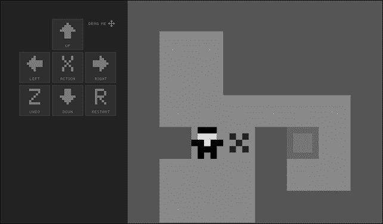
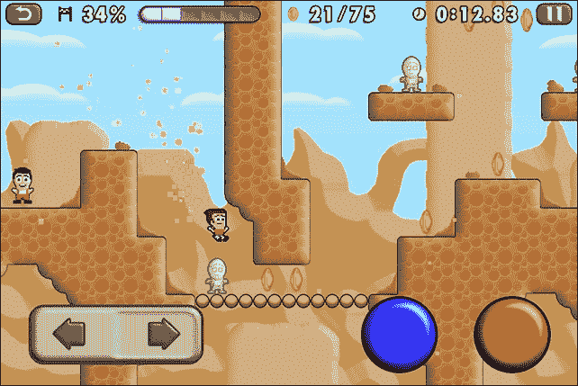
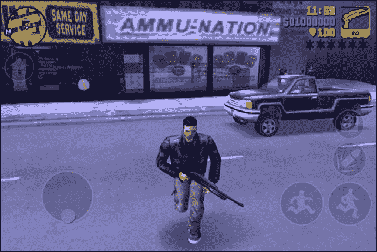
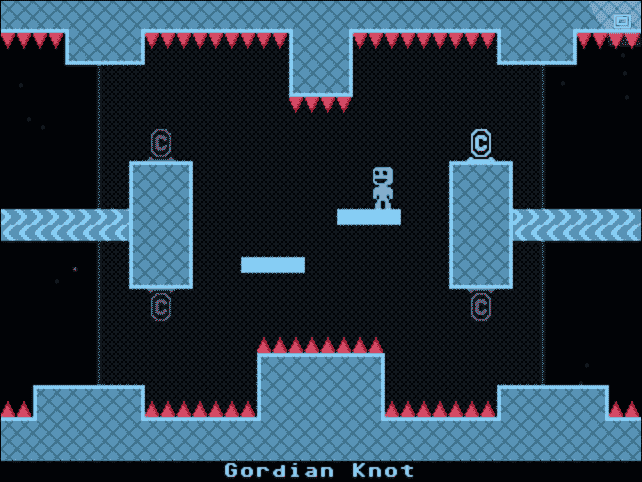
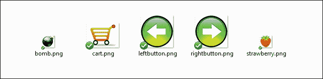
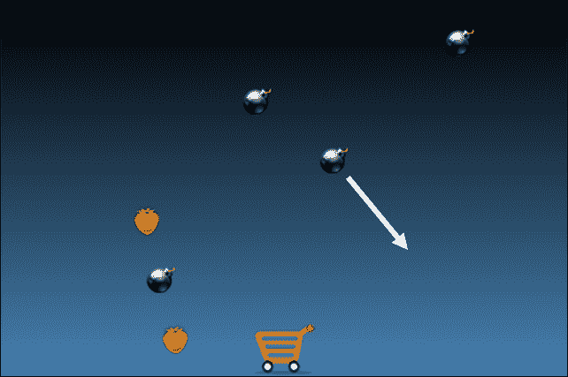
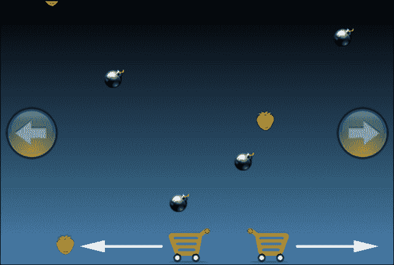
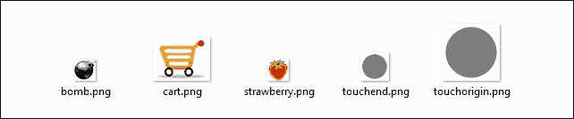
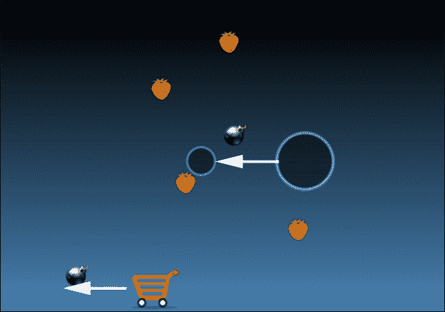

# 第六章 使用虚拟垫控制游戏

在制作跨平台游戏时，需要考虑的一个重要因素是玩家将如何控制主要角色。你游戏将运行的大多数设备都没有键盘或鼠标，尽管越来越多的便携式设备现在支持垫子，但你的游戏也必须在没有垫子的情况下可玩。

在本章中，我将向您展示在任意设备上创建虚拟垫的三种最流行的方法。除此之外，你还将学习如何：

+   滚动大图像以给出无限背景的印象

+   安排事件

+   控制帧率

+   检查精灵之间的碰撞

+   创建一个简单的粒子系统

+   手动移动精灵或使用动作

因此，首先要做的是看看成功游戏是如何让玩家通过虚拟垫与他们互动的。

# 虚拟垫概述

创建虚拟垫最古老、最简单且高度不建议的方式是在屏幕上放置方向按钮，并根据玩家按下的按钮来控制角色。

我在制作游戏可滑动操作之前，也在我的 *Sokoban* 游戏的第一个版本中使用了这种虚拟垫，正如我在 *Cocosban* 游戏制作过程中向您展示的那样。



*Sokoban* 游戏

在这个游戏中，你通过点击或轻触箭头按钮的精确位置来移动角色。它可以适应节奏较慢的解谜游戏，但在节奏较快的街机游戏中则无法玩。

正因如此，著名的平台游戏如 *Mikey Shorts* 使用幽灵按钮。幽灵按钮像正常按钮一样工作，但可感区域比图标本身大得多。



虽然按钮的大小并不比我在 *Sokoban* 游戏中使用的大，但可感区域覆盖了整个屏幕：实际红色按钮的可感区域是覆盖红色按钮图标的整个屏幕列，蓝色按钮的可感区域是覆盖蓝色按钮图标的整个屏幕列，以此类推。

处理虚拟垫的另一种方式是使用虚拟模拟垫。尽管控制 *Mikey Shorts* 的方式是数字的，这意味着一个按钮只能被按下或释放；有时，游戏需要像以下 *Grand Theft Auto* 系列截图所示的更精确的动作：



在屏幕的左下角，你可以看到一个虚拟模拟垫。垫子最初是通过触摸屏幕激活的，然后你将垫子从原始位置拖得越远，角色行走或奔跑的速度就越快。

我想提到的另一种创建虚拟垫的方式是 *VVVVVV* 游戏中使用的，它不显示任何图标。以下是一个 *VVVVVV* 游戏的截图：



你只需通过连续拖动，或者拖动并按住设备上的手指来左右移动角色，我必须说这比旧的虚拟摇杆要好得多，因为你可以虚拟地使用设备上的任何位置来移动。最重要的是，没有必须跨越的任何*原点*来改变方向：无论你将手指从开始触摸的点移动多远，一旦你将手指向相反方向移动，角色就会向另一个方向行走。

现在，除了我说过已经过时的第一个例子之外，你将看到如何使用虚拟摇杆创建所有这些控制角色的方法。

# 首先来看看游戏

我们正在制作一个小游戏来测试我们的虚拟摇杆：一个横幅游戏，购物车周围有下落的炸弹和草莓，试图抓住草莓同时避开炸弹？这听起来疯狂吗？是的。

这是我们的`assets`文件夹的内容：



整个游戏的制作与无尽太空跑者的制作非常相似，因此没有必要谈论你应该已经知道的代码。

这是`main.js`的内容：

```js
cc.game.onStart = function(){
  var screenSize = cc.view.getFrameSize();
  cc.view.setDesignResolutionSize(480, 320, cc.ResolutionPolicy.SHOW_ALL);
  cc.LoaderScene.preload(gameResources, function () {
    cc.director.runScene(new gameScene());
  }, this);
};
cc.game.run();
```

只需查看分辨率策略，就可以使游戏在横幅模式下运行。

这是`loadassets.js`的内容：

```js
var gameResources = [
  "assets/bomb.png",
  "assets/cart.png",
  "assets/strawberry.png",
  "assets/leftbutton.png",
  "assets/rightbutton.png"
];
```

如所说，`gamescript.js`的内容与无尽太空跑者的内容非常相似。

首先，让我们看看最终结果：



我们在舞台的底部中央有一个购物车，每秒都有水果和炸弹随机轨迹下落。

正如我已经告诉你的，没有什么新东西！你应该知道构建这个游戏所需的一切。这是`gamescript.js`：首先，你需要两个全局变量来处理购物车本身以及将要填充水果和炸弹的层：

```js
var itemsLayer;
var cart;
```

然后按常规定义`gameScene`：

```js
var gameScene = cc.Scene.extend({
  onEnter:function () {
    this._super();
    gameLayer = new game();
    gameLayer.init();
    this.addChild(gameLayer);
  }
});
```

`game`类声明包含了游戏本身的精髓：

```js
var game = cc.Layer.extend({
  init:function () {
    this._super();
    var backgroundLayer = cc.LayerGradient.create(cc.color(0,0,0,255), cc.color(0x46,0x82,0xB4,255));
    this.addChild(backgroundLayer);
    itemsLayer = cc.Layer.create()
    this.addChild(itemsLayer)
    topLayer = cc.Layer.create()
    this.addChild(topLayer)
    cart = cc.Sprite.create("assets/cart.png");
    topLayer.addChild(cart,0);
    cart.setPosition(240,24);
    this.schedule(this.addItem,1);
  },
  addItem:function(){
    var item = new Item();
    itemsLayer.addChild(item,1);
  },
  removeItem:function(item){
    itemsLayer.removeChild(item);
  }
});
```

这看起来像有很多代码，但没有什么新东西：我们只是添加了一个背景渐变，然后是两层：一层用于水果和炸弹，另一层用于购物车，最后添加了购物车本身。为了创建水果和炸弹，我们使用`schedule`方法，该方法每秒调用一次`addItem`函数来创建一个新的`Item`类实例，而`removeItem`函数将在水果和炸弹飞出屏幕后将其移除。

这与空间无尽跑者的创建非常相似，同样适用于在`Item`声明中创建水果和炸弹：

```js
var Item = cc.Sprite.extend({
  ctor:function() {
    this._super();
    if(Math.random()<0.5){
      this.initWithFile("assets/bomb.png");
      this.isBomb=true;
    }
    else{
      this.initWithFile("assets/strawberry.png");
      this.isBomb=false;
    }
  },
  onEnter:function() {
    this._super();
    this.setPosition(Math.random()*400+40,350);
    var moveAction = cc.MoveTo.create(8, new cc.Point(Math.random()*400+40,-50));
    this.runAction(moveAction);
    this.scheduleUpdate();
  },
  update:function(dt){
    if(this.getPosition().y<35 && this.getPosition().y>30 && Math.abs(this.getPosition().x-cart.getPosition().x)<10 && !this.isBomb){
      gameLayer.removeItem(this);
      console.log("FRUIT");
    }
    if(this.getPosition().y<35 && Math.abs(this.getPosition().x-cart.getPosition().x)<25 && this.isBomb){
      gameLayer.removeItem(this);
      console.log("BOMB");
    }
    if(this.getPosition().y<-30){
      gameLayer.removeItem(this)
    }
  }
});
```

再次，有很多代码，但其中大部分是纯 JavaScript，与 Cocos2d-JS 无关。但让我们看看它：

```js
ctor:function() {
  this._super();
  if(Math.random()<0.5){
    this.initWithFile("assets/bomb.png");
    this.isBomb=true;
  }
  else{
    this.initWithFile("assets/strawberry.png");
    this.isBomb=false;
  }
}
```

你如何决定当前物品是水果还是炸弹？只需简单地画一个随机数，然后根据其值，使用炸弹或水果图像。`isBomb`自定义属性将告诉我们它是炸弹（`true`）还是水果（`false`）：

```js
onEnter:function() {
  this._super();
  this.setPosition(Math.random()*400+40,350);
  var moveAction = cc.MoveTo.create(8, new cc.Point(Math.random()*400+40,-50));
  this.runAction(moveAction);
  this.scheduleUpdate();
}
```

当它需要放置在舞台上时，我们将其放置在屏幕顶部的随机水平位置，并创建一个 tween 将其移动到屏幕底部的不同随机水平位置。这与无尽跑酷中的小行星移动非常相似。

```js
update:function(dt){
  if(this.getPosition().y<35 && this.getPosition().y>30 && Math.abs(this.getPosition().x-cart.getPosition().x)<10 && !this.isBomb){
    gameLayer.removeItem(this);
    console.log("FRUIT");
  }
  if(this.getPosition().y<35 && Math.abs(this.getPosition().x-cart.getPosition().x)<25 && this.isBomb){
    gameLayer.removeItem(this);
    console.log("BOMB");
  }
  if(this.getPosition().y<-30){
    gameLayer.removeItem(this)
  }
}
```

每一帧都会调用`update`函数，检查三个条件：

1.  如果项目是水果并且它非常接近小车，那么我们移除项目，并向控制台输出一些文本以获取调试信息，显示玩家击中了水果。

1.  如果项目是炸弹并且它很近（不像水果那样近），但接近小车，那么我们移除项目，并向控制台输出一些文本以获取调试信息，显示玩家击中了炸弹。这是一个难度很高的游戏，因为被炸弹击中比收集水果更容易。

1.  如果项目（无论是什么类型的物品）位于舞台底部之外，我们需要将其移除。

游戏就到这里。现在，你需要让玩家以前面提到的方式控制小车。

## 使用幽灵按钮控制小车

要使用幽灵按钮控制小车，首先，你必须在屏幕上放置按钮，正如所说的，它将只作为一个假按钮，因为舞台的整个左右区域将代表实际的按钮。

你需要在脚本中添加一些全局变量来处理左右按钮以及水平速度：

```js
var itemsLayer;
var cart;
var xSpeed = 0;
var left;
var right;

```

`xSpeed`变量表示小车的水平速度，而`left`和`right`变量将被分配给左右箭头按钮。

现在，`init`函数需要放置按钮，设置`touch`监听器，并在每一帧安排更新：

```js
init:function () {
  this._super();
  var backgroundLayer = cc.LayerGradient.create(cc.color(0,0,0,255), cc.color(0x46,0x82,0xB4,255));
  this.addChild(backgroundLayer);
  itemsLayer = cc.Layer.create()
  this.addChild(itemsLayer)
  topLayer = cc.Layer.create()
  this.addChild(topLayer)
  cart = cc.Sprite.create("assets/cart.png");
  topLayer.addChild(cart,0);
  cart.setPosition(240,24);
  left = cc.Sprite.create("assets/leftbutton.png");
 topLayer.addChild(left,0);
 left.setPosition(40,160)
 left.setOpacity(128)
 right = cc.Sprite.create("assets/rightbutton.png");
 topLayer.addChild(right,0);
 right.setPosition(440,160);
 right.setOpacity(128)
 this.schedule(this.addItem,1);
 cc.eventManager.addListener(touchListener, this);
 this.scheduleUpdate();
}
```

我希望你能检查左右箭头按钮是否放置在`topLayer`上，并且它们的透明度设置为半透明。同时，看看我们将要创建的监听器变量的名称：`touchListener`。

此外，这是`touchListener`的声明：

```js
var touchListener = cc.EventListener.create({
  event: cc.EventListener.TOUCH_ONE_BY_ONE,
  swallowTouches: true,
  onTouchBegan: function (touch, event) {
    if(touch.getLocation().x < 240){
      xSpeed = -2;
      left.setOpacity(255);
      right.setOpacity(128);
    }
    else{
      xSpeed = 2;
      right.setOpacity(255);
      left.setOpacity(128);
    }
    return true;
  },
  onTouchEnded:function (touch, event) {
    xSpeed = 0;
    left.setOpacity(128);
    right.setOpacity(128);
  }
})
```

这是一个类似于我们之前遇到过的触摸事件。让我们更仔细地看看触发的事件：

```js
onTouchBegan: function (touch, event) {
  if(touch.getLocation().x < 240){
    xSpeed = -2;
    left.setOpacity(255);
    right.setOpacity(128);
  }
  else{
    xSpeed = 2;
    right.setOpacity(255);
    left.setOpacity(128);
  }
  return true;
}
```

当玩家触摸处理幽灵按钮的屏幕时，我们只需要检查屏幕的左侧或右侧是否被触摸，相应地设置`xSpeed`以及打开或关闭速度，并将相应的箭头按钮设置为全透明或半透明。

如果你想让 Cocos2d-JS 能够检查玩家何时停止触摸屏幕，函数必须返回`true`。为了实现这一点，请添加以下代码片段：

```js
onTouchEnded:function (touch, event) {
  xSpeed = 0;
  left.setOpacity(128);
  right.setOpacity(128);
}
```

当玩家停止触摸屏幕时，将`xSpeed`设置回零，并关闭两个按钮。

现在，你只需要在`game`类的`update`函数中移动小车：

```js
update:function(dt){
  if(xSpeed>0){
    cart.setFlippedX(true);
  }
  if(xSpeed<0){
    cart.setFlippedX(false);
  }
  cart.setPosition(cart.getPosition().x+xSpeed,cart.getPosition().y);
}
```

实际上没有必要解释任何事情，因为你只是通过`xSpeed`像素移动小车；只需看看`setFlippedX`方法，当小车向右移动时，它会水平翻转小车。

运行游戏，你将看到以下截图所示的内容：



在屏幕上的任何位置触摸，根据你触摸的屏幕位置将购物车移动到左边或右边。这就是幽灵按钮的全部内容。现在，让我们看看如何使用虚拟板控制游戏。

## 使用虚拟板控制购物车

要用虚拟板控制游戏，首先需要有一个虚拟板。因此，我们需要更改`assets`文件夹中的某些图像：



左右按钮已被移除，并由虚拟板图像替代，因此`loadassets.js`进行了如下更改：

```js
var gameResources = [
  "assets/bomb.png",
  "assets/cart.png",
  "assets/strawberry.png",
  "assets/touchorigin.png",
  "assets/touchend.png"
];
```

显然，游戏的大部分内容保持不变，因为你只是改变了控制购物车的方式。你需要稍微更改全局变量：

```js
var itemsLayer;
var cart;
var xSpeed = 0;
var touchOrigin;
var touching = false;
var touchEnd;

```

在游戏相关变量保持不变的情况下，我添加了两个新变量，分别称为`touchOrigin`和`touchEnd`，它们将处理虚拟板的触摸。之前用于处理按钮的变量也已删除。一个名为`touching`的布尔变量将告诉我们玩家是否在触摸屏幕。

现在，`game`类的`init`函数也需要一些更改：

```js
init:function () {
  this._super();
  var backgroundLayer = cc.LayerGradient.create(cc.color(0,0,0,255), cc.color(0x46,0x82,0xB4,255));
  this.addChild(backgroundLayer);
  itemsLayer = cc.Layer.create()
  this.addChild(itemsLayer)
  topLayer = cc.Layer.create()
  this.addChild(topLayer)
  cart = cc.Sprite.create("assets/cart.png");
  topLayer.addChild(cart,0);
  cart.setPosition(240,24);
  this.schedule(this.addItem,1);
  cc.eventManager.addListener(touchListener, this);
  this.scheduleUpdate();
}
```

基本上，所有关于左右按钮的行都已经删除，但脚本的主体在`touchListener`声明中：

```js
var touchListener = cc.EventListener.create({
  event: cc.EventListener.TOUCH_ONE_BY_ONE,
  swallowTouches: true,
  onTouchBegan: function (touch, event) {
    touchOrigin = cc.Sprite.create("assets/touchorigin.png");
    topLayer.addChild(touchOrigin,0);
    touchOrigin.setPosition(touch.getLocation().x,touch.getLocation().y);
    touchEnd = cc.Sprite.create("assets/touchend.png");
    topLayer.addChild(touchEnd,0);
    touchEnd.setPosition(touch.getLocation().x,touch.getLocation().y);
    touching = true;
    return true;
  },
  onTouchMoved: function (touch, event) {
    touchEnd.setPosition(touch.getLocation().x,touchEnd.getPosition().y);
  },
  onTouchEnded:function (touch, event) {
    touching = false;
    topLayer.removeChild(touchOrigin);
    topLayer.removeChild(touchEnd);
  }
})
```

我首先想让你看到的是三个事件：

1.  `onTouchBegan`：此事件将两个虚拟板精灵放置在触摸位置，并将布尔变量`touching`设置为`true`。

1.  `onTouchMoved`：此事件将`touchEnd`精灵更新到当前触摸位置。正如其名所示，此事件在玩家在屏幕上移动手指时触发。

1.  `onTouchEnded`：此事件移除两个虚拟板精灵，并将布尔变量`touching`设置为`false`。

很容易猜到我是如何在`game`类的`update`函数中移动购物车的。如果`touching`变量为`true`，购物车速度就是`touchEnd`和`touchOrigin`函数的*x*坐标之间的差异：

```js
update:function(dt){
  if(touching){
    xSpeed = (touchEnd.getPosition().x-touchOrigin.getPosition().x)/50;
    if(xSpeed>0){
      cart.setFlippedX(true);
    }
    if(xSpeed<0){
      cart.setFlippedX(false);
    }
    cart.setPosition(cart.getPosition().x+xSpeed,cart.getPosition().y);
  }
}
```

作为一款类比板，`touchEnd`和`touchOrigin`函数的*x*坐标之间的差异越大，购物车移动的速度就越快。我将这个差异除以`50`以保持游戏的可玩性；否则，游戏会移动得太快。

测试游戏并玩。



拖动屏幕以适当的速度移动购物车。对于类比虚拟板来说，这也是全部。

## 仅用手指控制购物车

尽管你一直在用手指控制购物车，但整个章节中你都有运动的视觉反馈。在本章中我将要展示的最后一种移动购物车的方法不提供任何视觉反馈，但在仅限于一个轴（如你现在所做的那样）的游戏中效果很好。

首先，你不需要任何与游戏直接相关的图形资源，所以我们的`loadassets.js`文件比以往任何时候都要小：

```js
var gameResources = [
"assets/bomb.png",
"assets/cart.png",
"assets/strawberry.png"
];
```

现在，这些更改甚至比你从幽灵按钮创建虚拟键盘时所做的更改还要小：你只需要稍微改变全局变量：

```js
var itemsLayer;
var xSpeed = 0;
var cart;
var detectedX;
var savedX;
var touching=false;
```

`detectedX`和`savedX`变量将存储当前和最后保存的手指或鼠标在水平位置。

`touchListener`的内容比以前简单得多，因为你不需要管理图像：

```js
var touchListener = cc.EventListener.create({
  event: cc.EventListener.TOUCH_ONE_BY_ONE,
  swallowTouches: true,
  onTouchBegan: function (touch, event) {
    touching = true;
    detectedX = touch.getLocation().x;
    savedX = detectedX
    return true;
  },
  onTouchMoved: function (touch, event) {
    detectedX = touch.getLocation().x;
  },
  onTouchEnded:function (touch, event) {
    touching = false;
  }
})
```

除了像之前那样设置`touching`布尔变量为`true`或`false`之外，你还可以通过`detectedX`和`savedX`来存储初始和当前的触摸水平坐标。

`game`类的`update`函数负责处理其余部分：

```js
update:function(dt){
  if(touching){
    var deltaX = savedX - detectedX
    if(deltaX>0){
      xSpeed = -2;
    }
    if(deltaX<0){
      xSpeed = 2;
    }
    savedX = detectedX;
    if(xSpeed>0){
      cart.setFlippedX(true);
    }
    if(xSpeed<0){
      cart.setFlippedX(false);
    }
    cart.setPosition(cart.getPosition().x+xSpeed,cart.getPosition().y);
  }
}
```

当玩家触摸屏幕时，通过比较当前和最后保存的水平触摸坐标之间的差异来判断购物车是否需要向左或向右移动。然后，将最后保存的水平触摸坐标更新为当前的横向触摸坐标，以便在触发`onTouchMoved`事件时再次改变。

测试游戏并来回移动你的手指，你会看到当你的手指改变方向时，购物车会立即改变方向。

# 摘要

恭喜！这是一个艰难且漫长的章节，因为它解释了三种不同的控制游戏的方法。现在，取决于你选择哪种方式更适合你的每款游戏，所以为什么不写下你最喜欢的移动游戏列表，并思考你会使用哪种方式来控制玩家呢？

现在，让我们继续到下一章，在那里你将遇到真实的物理。
