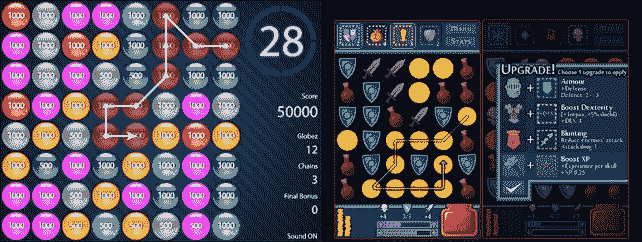
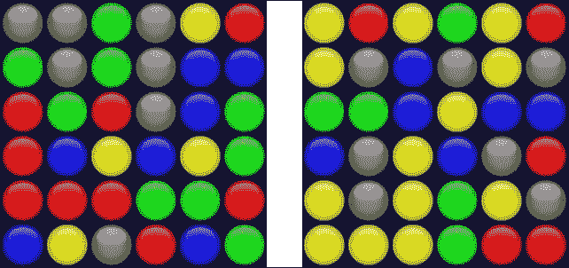
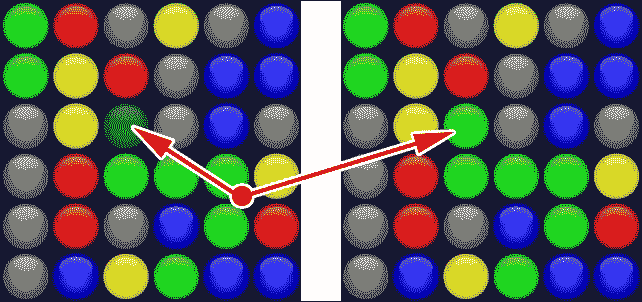
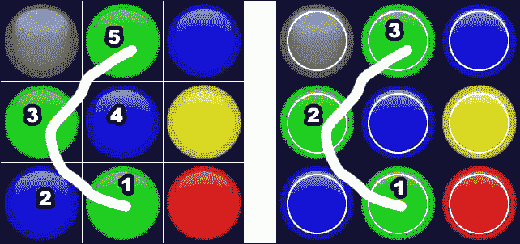
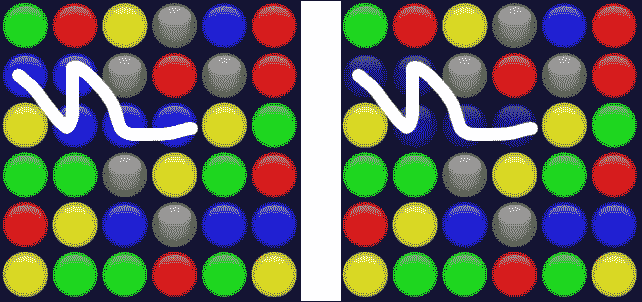
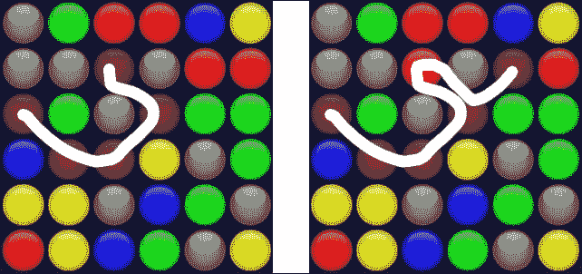
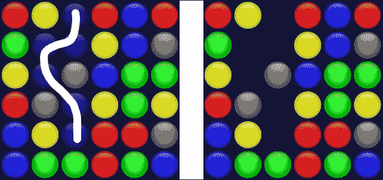
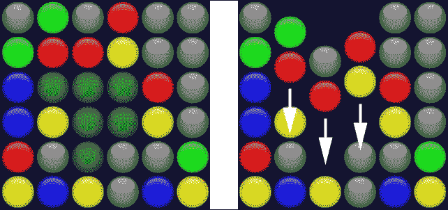
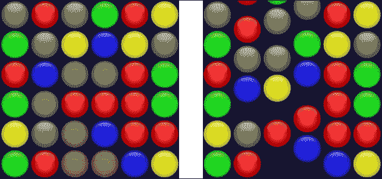
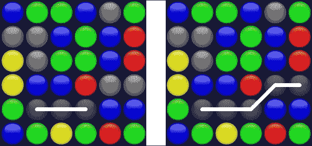

# 第九章。创建您自己的大片游戏 - 一个完整的匹配 3 游戏

这是这本书的最后一章，我真心希望您阅读这本书的乐趣和我写作的乐趣一样。当我为这本书制定初步大纲时，我计划将最后一章奉献给像 Candy Crush Saga 或 Farm Heroes Saga 这样的匹配 3 游戏。

我后来意识到，关于这些游戏在网络上有很多教程。因此，我决定向大家展示一些新内容，即 Dungeon Raid 游戏（可在[`itunes.apple.com/us/app/dungeon-raid/id403090531`](https://itunes.apple.com/us/app/dungeon-raid/id403090531)找到）的引擎，我将其改编成 Globez（可在[`www.mindjolt.com/globez.html`](http://www.mindjolt.com/globez.html)找到），这是一个被数百万次玩过的游戏。



在制作这个游戏的过程中，你不仅会使用这本书中描述的大多数概念来创建一个真实游戏引擎，你还会学习 Cocos2d-JS 绘图 API 的基础知识。

仔细遵循步骤；这是一个完整的游戏引擎，有很多事情要做。

# 设置游戏

由于这是一个没有物理的基本游戏，我们不需要包含外部库；因此，`project.json`返回其原始内容：

```js
{
  "debugMode" : 0,
  "showFPS" : false,
  "frameRate" : 60,
  "id" : "gameCanvas",
  "renderMode" : 0,
  "engineDir":"cocos2d-html5/",

  "modules" : ["cocos2d"],

  "jsList" : [
  "src/loadassets.js",
  "src/gamescript.js"
  ]
}
```

此外，`main.js`的内容基本上和以前一样：

```js
cc.game.onStart = function(){
  var screenSize = cc.view.getFrameSize();
  cc.view.setDesignResolutionSize(300, 300, cc.ResolutionPolicy.SHOW_ALL);
  cc.LoaderScene.preload(gameResources, function () {
    cc.director.runScene(new gameScene());
  }, this);
};
cc.game.run();
```

只看分辨率：300x300 是主要游戏区域。现在，我们只关注主要游戏区域，相信我，你会有足够的任务要做！

`loadassets.js`正在加载使用**TexturePacker**创建的精灵表：

```js
var gameResources = [
"assets/globes.png",
"assets/globes.plist",
];
```

`globes.png`只是一个包含所有彩色地球仪的单个文件：


`globes.plist`以这种方式定义了各种图像，每个颜色名称都分配了一个`key`节点。例如：

```js
<key>purple</key>
<dict>
  <key>frame</key>
  <string>{{2,2},{46,46}}</string>
  <key>offset</key>
  <string>{0,0}</string>
  <key>rotated</key>
  <false/>
  <key>sourceColorRect</key>
  <string>{{2,2},{46,46}}</string>
  <key>sourceSize</key>
  <string>{50,50}</string>
</dict>
```

现在我们完成了设置，我们可以开始编写游戏本身了。

## 创建游戏板

我们首先要做的是在`gamescript.js`中创建游戏板，我们将在上面玩游戏。我们试图使引擎尽可能可定制，所以我们从一些全局变量开始。更改其中大多数变量将导致游戏玩法快速改变。如下所示：

```js
var fieldSize = 6;
var tileTypes = ["red", "green", "blue", "grey", "yellow"];
var tileSize = 50;
var tileArray = [];
var globezLayer;
```

+   `fieldSize`：这个变量是场地尺寸的宽度和高度，以瓦片为单位。这意味着我们将在一个 6 x 6 瓦片场地上玩游戏。

+   `tileTypes`：这是一个数组，包含了在`globes.plist`文件中定义的精灵键。我只使用了五种不同类型的地球仪，因为我喜欢游戏提供制作大型组合的机会。你可以选择你想要的颜色数量；只需记住，游戏中颜色越多，游戏难度就越高。

+   `tileSize`：这个变量是一个瓦片的尺寸，以像素为单位。

+   `tileArray`：这是一个将包含所有地球仪对象的数组。

+   `globezLayer`：这个变量将是放置地球仪瓦片的层。

`gameScene`的定义没有改变：

```js
var gameScene = cc.Scene.extend({
  onEnter:function () {
    this._super();
    gameLayer = new game();
    gameLayer.init();
    this.addChild(gameLayer);
  }
});
```

让我们看看游戏定义，脚本的精髓：

```js
var game = cc.Layer.extend({
  init:function () {
    this._super();
    cc.spriteFrameCache.addSpriteFrames("assets/globes.plist", "assets/globes.png");
    var backgroundLayer = cc.LayerGradient.create(cc.color(0x00,0x22,0x22,255), cc.color(0x22,0x00,0x44,255));
    this.addChild(backgroundLayer);
    globezLayer = cc.Layer.create();
    // new cc.layer() can also be used
    this.addChild(globezLayer)
    this.createLevel();
  },
  createLevel: function(){
    // do something
  }
});
```

这里没有什么新内容；我们加载精灵图集，创建并放置一个背景层，创建并放置将包含所有 globez 的层，并调用`createLevel`函数。

让我们在`createLevel`中添加 globe 创建：

```js
createLevel: function(){
  for(var i = 0; i < fieldSize; i ++){
    tileArray[i] = [];
    for(var j = 0;j < fieldSize; j ++){
      this.addTile(i, j);
    }
  }
},
addTile:function(row,col){
  // do something
}
```

这里我们只是在根据`fieldSize`数字的条目数构建一个名为`tileArray`的两维数组。给定*i*和*j*的值，`addTile`函数会导致在游戏场中创建这样的瓦片，它接受该瓦片在游戏场中的行和列。

让我们看看`addTile`来了解如何设置游戏场：

```js
addTile:function(row,col){
  var randomTile = Math.floor(Math.random()*tileTypes.length);
  var spriteFrame = cc.spriteFrameCache.getSpriteFrame(tileTypes[randomTile]);
  var sprite = cc.Sprite.createWithSpriteFrame(spriteFrame);
  // new cc.Sprite(spriteFrame) can also be used
  sprite.val = randomTile;
  sprite.picked = false;
  globezLayer.addChild(sprite,0);
  sprite.setPosition(col*tileSize+tileSize/2,row*tileSize+tileSize/2);
  tileArray[row][col] = sprite;
}
```

在这个时候，你可以测试项目并看看会发生什么：



你注意到了吗？每次运行游戏时，你都会得到一个不同、随机的游戏场。

查看`addTile`函数将让你了解发生了什么：

```js
var randomTile = Math.floor(Math.random()*tileTypes.length);
```

首先，生成一个介于零和允许的瓦片类型数量减一之间的随机数。在这种情况下，是从零到五。

```js
var spriteFrame = cc.spriteFrameCache.getSpriteFrame(tileTypes[randomTile]);
```

从精灵图集中，我们将选择与`tileTypes[randomTile]`具有相同键的精灵：

```js
var sprite = cc.Sprite.createWithSpriteFrame(spriteFrame);
```

最后，从其分配的帧开始创建精灵：

```js
sprite.val = randomTile;
sprite.picked = false;
```

我为我们的小精灵添加了两个自定义属性：

+   `val`：这个变量代表由`randomTile`变量定义的瓦片的值

+   `picked`：这是一个布尔变量，表示瓦片是否已经被玩家选中

然后，精灵被添加到`globezLayer`层：

```js
globezLayer.addChild(sprite,0);
```

现在，我们必须用所有这些 globez 做些事情。

## 选择和取消选择第一个 globe

当我们想要玩家与游戏互动时，需要做的第一件事是什么？是的，添加一个监听器。我们将将其添加到游戏的`init`函数中：

```js
init:function () {
  this._super();
  cc.spriteFrameCache.addSpriteFrames("assets/globes.plist", "assets/globes.png");
  var backgroundLayer = cc.LayerGradient.create(cc.color(0x00,0x22,0x22,255), cc.color(0x22,0x00,0x44,255));
  this.addChild(backgroundLayer);
  globezLayer = cc.Layer.create();
  this.addChild(globezLayer)
  this.createLevel();
  cc.eventManager.addListener(touchListener, this);
}
```

这些都是你已经遇到的概念；我只是将它们组合起来以创建一个游戏。所以，你现在应该知道我们将要声明`touchListener`；但首先，让我添加两个额外的全局变量来跟踪我将要选择的瓦片和颜色：

```js
var fieldSize = 6;
var tileTypes = ["red","green","blue","grey","yellow"];
var tileSize = 50;
var tileArray = [];
var globezLayer;
var startColor = null;
var visitedTiles = [];

```

`visitedTiles`是一个数组，它将存储玩家捡起的瓦片，而`startColor`是第一个被选中的瓦片的颜色。我们以`null`开始，因为没有选择颜色。

现在，让我们转到`touchListener`的创建：

```js
var touchListener = cc.EventListener.create({
  event: cc.EventListener.MOUSE,
  onMouseDown: function (event) {
    var pickedRow = Math.floor(event._y / tileSize);
    var pickedCol = Math.floor(event._x / tileSize);
    tileArray[pickedRow][pickedCol].setOpacity(128);
    tileArray[pickedRow][pickedCol].picked = true;
    startColor = tileArray[pickedRow][pickedCol].val;
    visitedTiles.push({
      row: pickedRow,
      col: pickedCol
    });
  },
  onMouseUp: function(event){
    startColor=null;
    for(i = 0; i < visitedTiles.length; i ++){
      tileArray[visitedTiles[i].row][visitedTiles[i].col].setOpacity(255);
      tileArray[visitedTiles[i].row][visitedTiles[i].col].picked=false;
    }
  }
});
```

看起来代码很多，但别担心，它真的很简单。检查以下代码行：

```js
event: cc.EventListener.MOUSE
```

这次，我们将使用鼠标进行操作，但显然，如果你想的话也可以使用触摸。假设你应该能够使用两种方式来控制游戏。使用鼠标，我们必须处理两个事件，`onMouseDown`和`onMouseUp`：

```js
onMouseDown: function (event) {
  var pickedRow = Math.floor(event._y / tileSize);
  var pickedCol = Math.floor(event._x / tileSize);
  tileArray[pickedRow][pickedCol].setOpacity(128);
  tileArray[pickedRow][pickedCol].picked = true;
  startColor = tileArray[pickedRow][pickedCol].val;
  visitedTiles.push({
    row: pickedRow,
    col: pickedCol
  });
}
```

当鼠标按下时，`pickedRow` 和 `pickedCol` 变量根据点击坐标和 `tileSize` 获取鼠标选择的行和列的索引。一旦我知道我选择的 globe 的行和列，我可以通过将它的不透明度设置为 128 来使它半透明——记住在 Cocos2d-JS 中，不透明度范围从 0 到 255，使用 `setOpacity` 方法。我还将 globe 的 `picked` 值设置为 `true`，因为我实际上已经选择了它，而且由于它是第一个我选择的 globe，我还需要将 `startColor` 设置为 globe 的颜色。从现在起，我们只需要选择相同颜色的 globez。

最后但同样重要的是，我们需要用新选中的 globe 更新 `visitedTiles` 数组——在这个例子中，它被添加为一个对象。

目前，`onMouseUp` 非常简单，尽管它将成为整个游戏中最复杂的函数。它如下所示：

```js
onMouseUp: function(event){
  startColor=null;
  for(i = 0; i < visitedTiles.length; i ++){
    tileArray[visitedTiles[i].row][visitedTiles[i].col].setOpacity(255);
    tileArray[visitedTiles[i].row][visitedTiles[i].col].picked=false;
  }
  visitedTiles = [];
}
```

没什么好说的；一旦玩家释放鼠标，`startColor` 方法需要重置为 `null`，并且 `visitedTiles` 数组中的每个 globe 都必须设置为完全不透明，`picked` 属性设置为 `false`。有了空的 `visitedTiles` 数组，我们就准备好等待下一个玩家的选择了。

测试游戏并尝试选择和释放一个 globe：



如你所见，当你选择一个 globe 时，它会变成半透明。当你释放它时，它会恢复为完全不透明。

让我们制作我们的第一个链。

## 制作 globez 链条

游戏玩法很简单：你必须水平、垂直或对角线连接尽可能多的 globez。你也可以回溯。

让我们看看如何连接 globez。首先，不过，让我先向你介绍一个将在所有你的绘制匹配游戏中非常重要的变量：`tolerance`。查看以下代码片段：

```js
var fieldSize = 6;
var tileTypes = ["red","green","blue","grey","yellow"];
var tileSize = 50;
var tileArray = [];
var globezLayer;
var visitedTiles = [];
var startColor = null;
var tolerance = 400;

```

看看下面的截图：



假设玩家想要从下到上连接三个绿色 globez。当你用手指在小型表面上绘制，比如在手机上，也许是在火车上，你并不那么精确。所以，在左侧，我们可以看到如果我们在一个基于瓦片的游戏中检测到玩家移动会发生什么。不那么精确的绘制会触碰到五个不同的 globez，导致非法移动，这会让人感到沮丧。在右侧，使用容差，我们只有在瓦片中心附近检测到玩家移动。看出了区别吗？玩家只触碰到三个 globez，按照要求执行了合法移动。

我将中心到距离的平方——内白圆的半径——称为 `tolerance`，在这个例子中，我将它设置为 *20 像素 * 20 像素 = 400*。

当以下条件满足时，我们可以说我们有一个合法的移动：

+   我们处于容差区域内

+   当前 globe 还没有被选中——`picked` 属性是 `false`

+   当前 globe 与最后一个选中的 globe 相邻

+   当前 globe 与第一个选中的 globe 颜色相同

转换为 Cocos2d-JS，这意味着 `onMouseMove` 函数将包含：

```js
onMouseMove: function(event){
  if(startColor!=null){
    var currentRow = Math.floor(event._y / tileSize);
    var currentCol = Math.floor(event._x / tileSize);
    var centerX = currentCol * tileSize + tileSize / 2;
    var centerY = currentRow * tileSize + tileSize / 2;
    var distX = event._x - centerX;
    var distY = event._y - centerY;
    if(distX * distX + distY * distY < tolerance){
      if(!tileArray[currentRow][currentCol].picked){
        if(Math.abs(currentRow - visitedTiles[visitedTiles.length - 1].row) <= 1 && Math.abs(currentCol -visitedTiles[visitedTiles.length -1].col) <= 1){
          if(tileArray[currentRow][currentCol].val==startColor){
            tileArray[currentRow][currentCol].setOpacity(128);
            tileArray[currentRow][currentCol].picked=true;
            visitedTiles.push({
              row:currentRow,
              col:currentCol
            });
          }
        }
      }
    }
  }
}
```

看起来代码很多，但这只是前面提到的四个条件的表示。我想指出以下这一行：

```js
if(distX * distX + distY * distY < tolerance){ … }
```

在这里，我正在应用**勾股定理**而不使用平方根，以节省 CPU 时间。

测试脚本，看看会发生什么：



现在，即使你的绘制不够精确，你也能选择 globez。现在，如果你改变主意，想要回溯并尝试另一条路线怎么办？

## 回溯

当你将鼠标移回倒数第二个 globe 时，你可以回溯你的选择。在这种情况下，最后一个 globe 将从 `visitedTiles` 数组中移除，并且 `picked` 属性和透明度都恢复到默认值：`true` 和 `255`。

要检查回溯，你必须检查以下条件：

+   我们处于一个容差区域

+   当前 globe 已经被选中——`picked` 属性为 `true`

+   当前 globe 是 `visitedTiles` 数组的倒数第二个条目

这只是 `onMouseMove` 代码中的一个小改动：

```js
onMouseMove: function(event){
  if(startColor!=null){
    // same as before
    if(distX * distX + distY * distY < tolerance){
      if(!tileArray[currentRow][currentCol].picked){
        // same as before
      }
      else{
        if(visitedTiles.length>=2 && currentRow == visitedTiles[visitedTiles.length - 2].row && currentCol == visitedTiles[visitedTiles.length - 2].col){
          tileArray[visitedTiles[visitedTiles.length - 1].row][visitedTiles[visitedTiles.length - 1].col].setOpacity(255);
          tileArray[visitedTiles[visitedTiles.length - 1].row][visitedTiles[visitedTiles.length - 1].col].picked=false;
          visitedTiles.pop();
        }
      }
    }
  }
}
```

现在测试你的游戏，并尝试回溯。查看以下截图：



你看到这个了吗？现在，你可以改变主意，选择另一条路线。

现在还没结束，尽管我们已经完全处理了玩家的移动。

## 移除 globez

一句古老的谚语说，如果你不能移除物品，这不是一场匹配游戏。而且，这是正确的！一旦你选择了 globez，一旦你释放鼠标，你必须能够移除它们。

移除 globez 非常简单：一旦你知道 `visitedTiles` 数组至少有三个项目，只需从舞台和 `tileArray` 数组中移除这些项目。

这样修改 `onMouseUp`：

```js
onMouseUp: function(event){
  startColor=null;
  for(i = 0; i < visitedTiles.length; i ++){
    if(visitedTiles.length<3){
      tileArray[visitedTiles[i].row][visitedTiles[i].col].setOpacity(255);
      tileArray[visitedTiles[i].row][visitedTiles[i].col].picked=false;
    }
    else{
      globezLayer.removeChild        (tileArray[visitedTiles[i].row][visitedTiles[i].col]);
      tileArray[visitedTiles[i].row][visitedTiles[i].col]=null;
    }
  }
  visitedTiles = [];
}
```

在使用 `removeChild` 从舞台物理移除已移除的 globez 后，在 `tileArray` 数组中将它们设置为 `null` 将在我们要补充棋盘时很有用。

现在，尝试游戏：



你看到了吗？我们移除了 globez。现在，游戏完成了。等等。不。一旦移除 globez，一些 globez 必须坠落，并且更多的 globez 必须从屏幕顶部出现以填充舞台。我们将使用缓动使它们轻轻坠落。

## 制作 globez 坠落

一旦移除 globez，你需要检查是否有空隙在它们下面，并相应地使它们坠落。

记住，与大多数其他语言不同，Cocos2d-JS 将原点 (0,0) 坐标设置在舞台的左下角，所以最低行是行零。

我们需要大量编辑 `onMouseUp`：

```js
onMouseUp: function(event){
  startColor=null;
  for(i = 0; i < visitedTiles.length; i ++){
    if(visitedTiles.length<3){
      tileArray[visitedTiles[i].row][visitedTiles[i].col].setOpacity(255);
      tileArray[visitedTiles[i].row][visitedTiles[i].col].picked=false;
    }
    else{
      globezLayer.removeChild(tileArray[visitedTiles[i].row][visitedTiles[i].col]);
      tileArray[visitedTiles[i].row][visitedTiles[i].col]=null;
    }
  }
  if(visitedTiles.length>=3){
    for(i = 1; i < fieldSize; i ++){
      for(j = 0; j < fieldSize; j ++){
        if(tileArray[i][j] != null){
          var holesBelow = 0;
          for(var k = i - 1; k >= 0; k --){
            if(tileArray[k][j] == null){
              holesBelow++;
            }
          }
          if(holesBelow>0){
            var moveAction = cc.MoveTo.create(0.5, new cc.Point(tileArray[i][j].x,tileArray[i][j].y-holesBelow*tileSize));
            // cc,moveTo() can also be used
            tileArray[i][j].runAction(moveAction);
            tileArray[i - holesBelow][j] = tileArray[i][j];
            tileArray[i][j] = null;
          }
        }
      }
    }
  }
  visitedTiles = [];
}
```

运行脚本并查看会发生什么：



一旦绿色 globez 被移除，上面的 globez 会坠落。

让我们分析一下代码：

```js
if(visitedTiles.length>=3){   
```

一切都取决于我们是否选择了超过三个 globez。否则，不会有 globez 被移除，也就没有必要检查空位：

```js
for(i = 1; i < fieldSize; i ++){
```

我们从 `1` 开始循环所有行，即倒数第二行，到 `fieldsize`-1 行，这是最顶部的行。

```js
for(j = 0; j < fieldSize; j ++){
```

对于列我们也做同样的事情，但这次我们扫描它们。

```js
if(tileArray[i][j] != null){
```

如果在给定位置有一个 globe，那么是时候计算它下面的空位数量了。

```js
var holesBelow = 0;
```

`holesBelow` 变量将跟踪地球下方的空位。

```js
for(var k = i - 1; k >= 0; k --){
```

从当前行向下到第一行，我们必须计算空位数量。

```js
if(tileArray[k][j] == null){
```

当其 `tileArray` 值为 null 时，我们找到空位。

```js
holesBelow++;
```

在这种情况下，我们增加 `holesBelow` 变量：

```js
if(holesBelow>0){
```

一旦循环完成，我们检查是否有洞：

```js
var moveAction = cc.MoveTo.create(0.5, new cc.Point(tileArray[i][j].x,tileArray[i][j].y-holesBelow*tileSize));
tileArray[i][j].runAction(moveAction);
```

然后，相应地移动地球。

```js
tileArray[i - holesBelow][j] = tileArray[i][j];
tileArray[i][j] = null;
```

最后，我们可以更新 `tileArray` 以注册地球的新位置。

现在我们成功地让 globez 下落，只剩下最后一件事要做——创建新的 globez 来再次填充舞台。

## 创建新的 globez

创建新的 globez 与创建 globez 下落有相同的概念。对于每一列，我们计算空位的数量；这个数量是我们必须创建的 globez 的数量。

为了创建平滑的外观，每个 globe 都将在舞台顶部之外创建，并通过动画缓动将其放置在正确的位置。

这是我们最后一次需要修改 `onMouseUp`，保证！

```js
onMouseUp: function(event){
  // same as before
  if(visitedTiles.length>=3){
    // same as before
    for(i = 0; i < fieldSize; i ++){
      for(j = fieldSize-1; j>=0; j --){
        if(tileArray[j][i] != null){
          break;
        }
      }
      var missingGlobes = fieldSize-1-j;
      if(missingGlobes>0){
        for(j=0;j<missingGlobes;j++){
          this.fallTile(fieldSize-j-1,i,missingGlobes-j)
        }
      }
    }
  }
  visitedTiles = [];
}
```

这是扫描空位并调用 `fallTile` 方法以创建新瓷砖的代码，该瓷砖具有目标行、目标列和下落高度。我们使用下落高度来创建一个平滑的缓动到地球最终位置。

下面是 `fallTile` 的定义：

```js
fallTile:function(row,col,height){
  var randomTile = Math.floor(Math.random()*tileTypes.length);
  var spriteFrame = cc.spriteFrameCache.getSpriteFrame(tileTypes[randomTile]);
  var sprite = cc.Sprite.createWithSpriteFrame(spriteFrame);
  sprite.val = randomTile;
  sprite.picked = false;
  globezLayer.addChild(sprite,0);
  sprite.setPosition(col*tileSize+tileSize/2,(fieldSize+height)*tileSize);
  var moveAction = cc.MoveTo.create(0.5, new cc.Point(col*tileSize+tileSize/2,row*tileSize+tileSize/2));
  sprite.runAction(moveAction);
  tileArray[row][col] = sprite;
}
```

它真的很像几页前创建的 `addTile` 方法——这是一段漫长的旅程，不是吗？最终 Globez 成功了：



一旦你移除了一些 globez，新的 globez 将从顶部落下。

## 奖励 - 使用绘图 API 进行视觉反馈

正如承诺的那样，我们将使用绘图 API 为我们用鼠标绘制的路径提供视觉反馈。

首先，让我们创建一个新的全局变量来存储我们将绘制玩家移动的层。它被称为 `arrowsLayer`：

```js
var fieldSize = 6;
var tileTypes = ["red","green","blue","grey","yellow"];
var tileSize = 50;
var tileArray = [];
var globezLayer;
var arrowsLayer;
var visitedTiles = [];
var startColor = null;
var tolerance = 400;
```

我们将在 `init` 函数中在 `globezLayer` 之后创建和添加 `arrowLayer`：

```js
init:function () {
  this._super();
  cc.spriteFrameCache.addSpriteFrames("assets/globes.plist", "assets/globes.png");
  var backgroundLayer = cc.LayerGradient.create(cc.color(0x00,0x22,0x22,255), cc.color(0x22,0x00,0x44,255));
  this.addChild(backgroundLayer);
  globezLayer = cc.Layer.create();
  this.addChild(globezLayer)
  arrowsLayer = cc.DrawNode.create();
  // new cc.DrawNode() can also be used
  this.addChild(arrowsLayer);
  this.createLevel();
  cc.eventManager.addListener(touchListener, this);
}
```

我们可以绘制的实体是 `DrawNode`。

无论发生什么，当我们释放鼠标时，我们将使用 `clear` 方法清除绘图区域：

```js
onMouseUp: function(event){
  arrowsLayer.clear();
  // same as before
}
```

现在，我们知道如何清除一个绘图节点，并且我们必须看看如何在其中绘制线条。当玩家执行合法移动时，添加一个新的方法调用，无论你是选择一个新的地球还是回溯：

```js
onMouseMove: function(event){
  if(startColor!=null){
    // same as before
    if(distX * distX + distY * distY < tolerance){
      // same as before
      this.drawPath();
    }
  }
}
```

现在唯一要做的就是创建 `touchListener` 监听器的 `drawPath` 方法：

```js
drawPath:function(){
  arrowsLayer.clear();
  if(visitedTiles.length>0){
    for(var i=1;i<visitedTiles.length;i++){
      arrowsLayer.drawSegment(new cc.Point(visitedTiles[i-1].col*tileSize+tileSize/2,visitedTiles[i-1].row*tileSize+tileSize/2),new cc.Point(visitedTiles[i].col*tileSize+tileSize/2,visitedTiles[i].row*tileSize+tileSize/2), 4,cc.color(255, 255, 255, 255));
    }
  }
}
```

如您所见，我遍历 `visitedTiles` 数组，并使用 `drawSegment` 方法从第一个 `cc.Point` 参数绘制到第二个。

最后，你的游戏完成了。真的！！



看看你是如何用鼠标绘制线条，连接你选择的各个 Globez。

# 现在去哪里

通常，每个章节都以一个总结标题结束；无论如何，这次我认为你不需要总结。我的意思是，你已经制作了几个游戏，从注意力集中到推箱子，从无尽跑酷到 Globez。

首先，我想感谢你阅读整本书，我希望你阅读它的时候和我写作它的时候一样享受。

虽然你创建了几个游戏，但这只是进入跨平台游戏开发漫长旅程的开始。

首先，你应该通过添加声音、计分系统和一些其他功能来完善游戏，我相信你现在阅读这些最后几页时已经知道如何添加了。

然后，我只是想指出三个你可能觉得有用的网站，如果你想要深入研究跨平台 HTML5 开发。

## 保护你的代码

由于你的游戏是用 JavaScript 编写的，任何人都可以通过直接查看你页面的 HTML 来查看你的代码。有几个工具可以混淆你的代码，使其难以阅读——或者至少让代码偷窥者感到非常困难。我选择了其中两个：

1.  **JavaScript 混淆器** ([`javascriptobfuscator.com/`](http://javascriptobfuscator.com/))：这是一个在线免费工具，用于混淆你的代码；只需复制并粘贴你的代码或上传小文件，它就会为你完成艰苦的工作。

1.  **JScrambler** ([`jscrambler.com`](https://jscrambler.com))：这是我目前使用并推荐的。它为你提供了很多混淆级别、移动游戏优化、网站锁定、到期日期等功能。只需拖放你的项目并下载受保护的版本。

## 将你的游戏作为原生应用移植到移动设备上

一旦你的游戏在每个浏览器上运行，你可能会想将其转换为原生移动应用，以尝试征服新市场。有三个出色的工具允许你从 HTML、CSS 和 JavaScript 创建移动应用：

1.  Cocos2D 专有 JSB API ([`www.cocos2d-x.org/wiki/Basic_usage_of_JSB_API`](http://www.cocos2d-x.org/wiki/Basic_usage_of_JSB_API))：这是将 C++绑定到 JavaScript 的官方 API。从 Cocos2d-iphone 或 Cocos2d-x 项目开始，你可以让所有图形、渲染和物理代码以原生方式运行，而游戏逻辑则以 JavaScript 运行。

1.  **PhoneGap** ([`phonegap.com/`](http://phonegap.com/))：这个应用既可以从你的电脑使用原生 SDK 运行，也可以从云端运行。PhoneGap 编译你的 HTML5 游戏，创建原生应用，准备在苹果应用商店等市场发布。我用它创建了 BWBan 的 iOS 版本 ([`itunes.apple.com/us/app/bwban/id783208885?mt=8`](https://itunes.apple.com/us/app/bwban/id783208885?mt=8))，从一个 HTML5 游戏开始。

1.  **CocoonJS** ([`www.ludei.com/cocoonjs/`](https://www.ludei.com/cocoonjs/)): 这个平台为你提供了一个平台来测试、加速、部署和货币化你的 HTML5 应用和游戏，在所有移动设备上都有许多有趣的功能，帮助你更快地交付优秀的网络产品。

## 发布你的游戏

制作游戏很有趣，但让人们玩你的游戏更有趣。以下是两个顶级游戏门户，你应该上传你的游戏以获得播放、评分、评论和反馈：

1.  **Newgrounds** ([`www.newgrounds.com/`](http://www.newgrounds.com/)): 这个网页游戏门户收集了来自世界各地开发者的最佳独立音频、网络电影和游戏。

1.  **Kongregate** ([`www.kongregate.com/`](http://www.kongregate.com/)): 这是我的最爱网页游戏门户；它还提供有趣的收益分成。

## 许可你的游戏

游戏发行商一直在寻找高质量的游戏，并愿意支付你许可他们使用和定制你的游戏。不幸的是，与它们取得联系并获得足够的关注并不容易。幸运的是，有一个服务为你做了这项艰苦的工作，向数百位潜在买家展示你的游戏：

1.  **FGL** ([`www.fgl.com/`](https://www.fgl.com/)): 这是 HTML5、Android、iOS、Unity 和 Flash 行业领先的分发和货币化服务。多亏了 FGL，我获得了几个赞助。我强烈推荐与他们合作。

## 保持最新

HTML5 游戏市场是一个几乎每天都在变化的新市场。你需要保持最新，以了解新闻和趋势。这里有一个我强烈推荐的论坛：

1.  **HTML5GameDevs** ([`www.html5gamedevs.com/`](http://www.html5gamedevs.com/)): 这是顶级 HTML5 游戏开发论坛，有文章、游戏发布、框架、演示、视频、教程、博客文章等。

很明显，我的博客[`www.emanueleferonato.com/`](http://www.emanueleferonato.com/)几乎每天都有新闻和教程更新。

最后，你可以参考官方 Cocos2d-JS 网站[`www.cocos2d-x.org/wiki/Cocos2d-JS`](http://www.cocos2d-x.org/wiki/Cocos2d-JS)，在那里你可以找到所有新发布和正在开发的功能。

# 概述

在最后一章中，你使用这本书阅读过程中学到的几乎所有功能创建了一个完整的 Match-3 游戏原型。现在，你应该能够从头开始创建自己的游戏，将你的想法从纸笔转移到现代网络浏览器和移动设备上。
