# 第十一章：创建你自己的音效

为漫画制作音效本身就是一种艺术形式。将声音转化为文本需要大量的工作和技巧！你选择的代表声音的字母很重要，但字体、颜色，甚至是否选择扭曲这些字母以强调也很重要。

在本章中，我们将涵盖以下主题：

+   在对话框中添加音效以及如何组合音效图层

+   通过为字体添加颜色和线条来使用字体制作音效

+   手写字母和利用网格变换工具扭曲文本

+   制作引人注目的标题

到本章结束时，你将学会如何使用你的技能来处理字体、添加颜色、添加效果、使用网格变换工具将字体扭曲成你想要的形状，以及手写字母来为你的漫画创建最戏剧性的音效和标题。

让我们直接进入这些工具！

# 技术要求

要开始，你需要在你的设备上已经安装了 Clip Studio Paint，并打开一个带有白色纸张图层的空白画布。任何尺寸都可以，但我建议创建一个 300 dpi 的方形画布，以便通过本章的内容。

# 在对话框中添加音效

音效是漫画艺术的一部分。漫画读者在阅读故事时，不知不觉中会遇到大量的音效。这不仅仅是选择正确的词语；音效有创意空间，可以表达声音的尖锐、响亮和沉重。

大多数时候，我以手写的方式添加它们，因为这样音效自然地融入我的艺术中。如果你查看**刷子**工具中的**印度墨水**子类别，你会发现一些感觉很好的有机刷子，例如**比特粗犷**刷子。

当你写一个表达固体物体被压碎的声音时，最好在**校正**设置中打开**稳定化**和**后校正**，并将它们设置为强，以获得良好、干净的直线。

记住，艺术性的写作仍然需要易于阅读，并且应放置在发出声音的对象附近。如果你在单独的图层上写音效，那么在你想稍后编辑它们时，例如更改颜色或形状、选择不同的音效，甚至翻译成另一种语言时，会节省很多时间！*图 11.1*展示了几个手写音效的例子。

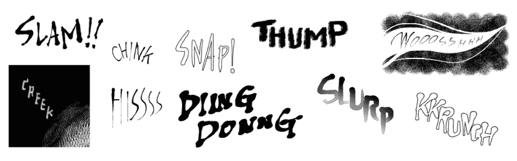

图 11.1：各种手写音效

当然，这并不是将它们添加到你的漫画中的唯一方法。你也可以使用对话框来处理音效。你可以应用这种方法来制作爆裂、哔哔、低语和喊叫等声音。你可以在*第七章*，*使用文本和对话框工具*中了解更多关于对话框的信息。

按照以下步骤创建带有气泡的音效：

1.  打开画布，用任何绘图工具勾勒出你想要的声音气泡的构想。

1.  点击**图层属性**调色板中的**图层颜色**图标，将草图颜色变为蓝色。

1.  通过点击**创建新矢量图层**图标，在铅笔绘制图层上方创建一个新的矢量图层，从**标记**工具组中选择**毡笔**子工具，并在矢量图层上追踪你的声音效果文本，如*图 11.2*所示。

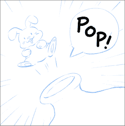

图 11.2：手写声音

1.  由于它位于矢量图层上，你可以使用**校正线**工具将文本校正到你想要的精确形状。有关矢量线编辑的更多详细信息，请参阅*第十章，探索矢量图层*。在*图 11.3*中，线条笔画的控制点可见，用于校正。

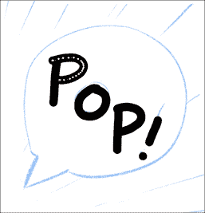

图 11.3：矢量图像上的控制点

1.  一旦你对声音文本的形状满意，从**文本**工具组中选择**椭圆气泡**子工具，然后点击画布并拖动以创建一个足够大的气泡来覆盖所有文本。如果气泡遮住了文本，不要慌张——你可以在创建气泡后总是将气泡图层移动到文本图层下方。

1.  从**文本**工具组中选择**气泡尾**子工具，点击画布，然后拖动鼠标或笔尖以获得你想要的气泡尾大小。你总是可以使用**操作**工具组中的**对象**子工具来调整文本、气泡和气泡尾的大小和位置。尝试旋转尾巴，使其指向声音来源的对象。*图 11.4*显示了当你使用**对象**子工具点击画布时出现的控制手柄和校正点。

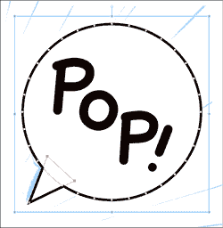

图 11.4：控制手柄和校正点

这是一种非常简单且有效的方法来添加声音效果。你还可以将这种方法应用于各种其他声音。但你可能已经注意到，在你的**图层**调色板中，对话框和声音效果图层太多了。你可以在混乱中丢失重要的声音效果图层之前对它们进行组织。

## 对声音效果和对话气泡图层进行分组

有方法可以整理你混乱的**图层**调色板。它们是使用图层文件夹进行分组，给它们一个独特的名称，以及给图层添加颜色标记。你总是可以回到*第三章，铅笔绘制：图层和图层属性调色板*，以提醒图层和如何使用图层调色板。

按照以下步骤整理你的声音效果和对话气泡图层：

1.  按住**Shift**键，点击多个图层以选择它们。在本教程中，选择包含写作的图层以及包含你刚才在上一节中创建的对话气泡的图层。

1.  在**文件**菜单中，点击**图层**|**创建文件夹并插入图层**，如图*图 11.5*所示。

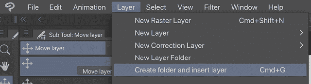

图 11.5：图层下拉菜单

1.  现在，您选中的图层在**图层**调板中已组合在一个文件夹中。双击文件夹名称，当前显示为**文件夹 1**，然后为文件夹输入一个独特的名称。按*Enter*键确认名称。

1.  在您刚刚命名的文件夹仍然被选中的情况下，点击**图层**调板中的方形**图层颜色**图标。颜色变化下拉菜单将显示如*图 11.6*所示。

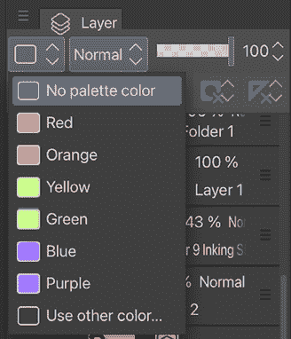

图 11.6：图层颜色下拉菜单

1.  点击您选择的颜色，文件夹将自动在**图层**调板中显示该颜色的标记。每次创建音效时，您都可以重复*步骤 1-5*。您可以将图层文件夹以与其他图层相同的方式分组。*图 11.7*显示了颜色协调的**图层**调板。

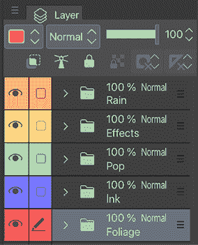

图 11.7：图层调板中的彩色图层

您的**图层**调板不是更加有组织，并且不是很容易就能找到特定的图层吗？通过这种方式，您可以移动组合相似音效的图层，但仍然能够单独编辑它们。

您不必一定亲自编写音效文本；有大量的现成字体可供选择。继续阅读以了解如何将它们用于音效。

# 使用字体进行音效

制作音效最简单的方法是使用字体，尤其是当您无法自己精确地创建音效时——尤其是当您无法创建像您希望那么专业的音效时。别担心，网站上有很多优秀的字体可供选择，其中一些是免费使用的！存在许多专业字体，非常适合创建爆炸、破裂、枪声等感觉。让我们看看如何添加字体。

**重要提示**

对于这类字体，一些优秀的资源网站有[www.blambot.com](https://www.blambot.com)和[www.1001freefonts.com](https://www.1001freefonts.com)，但请务必检查您下载的任何免费字体的使用条款！一些免费字体创作者不允许他们的字体用于商业项目，所以如果您正在制作要出售的漫画，您需要确保您没有违反任何版权法！

在下载新字体并将其安装到您的计算机后，您可能需要关闭 Clip Studio Paint 并重新启动程序，以便在**文本**工具中的字体列表中看到该字体。一旦出现在字体列表中，您就可以使用*第七章*，*使用文本和气泡工具*中的说明来布局您的文本。

如果您喜欢为每一个能想到的场合收集新字体，字体列表可能会变得有些混乱和令人不知所措。找到您去年二月下载的特定字体，可能需要花费大量时间，而您知道这个特定面板将在您的剧本中即将出现！

这是当在 Clip Studio Paint 中难以更改字体列表显示方式的时候。当**文本**工具处于活动状态时，点击**工具属性**面板中的**字体**下拉菜单。字体列表的示例如右图所示，*图 11.8*。

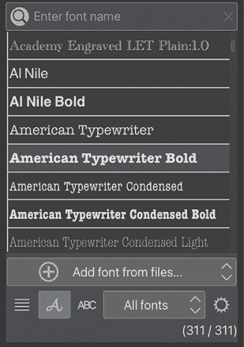

图 11.8：字体下拉菜单

在字体列表的底部，左侧有三个图标，用于控制字体列表的显示方式。最左侧的图标是**显示字体名称图标**，如下在*图 11.9*中所示。它以 Clip Studio Paint 用户界面的默认字体显示字体列表。

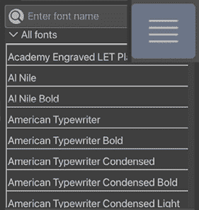

图 11.9：显示字体名称选项

第二个图标是**显示特定字体中的字体名称图标**，如*图 11.10*中所示，右图所示。每个字体名称都显示在那个特定的字体中，这使得它们很容易识别。

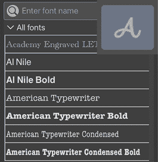

图 11.10：显示特定字体中的字体名称选项

第三个图标是**显示特定字体中的文本图标**，如右图所示，它将使用当前选定的文本来显示字体名称。这在制作音效时特别方便，因为您可以键入字母，然后查看这些字母在您拥有的所有字体中的样子！

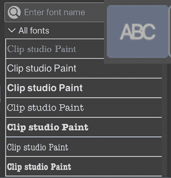

图 11.11：显示特定字体中的文本选项

*图 11.12*展示了一个使用 Badaboom Pro BB 字体键入的爆炸声效。

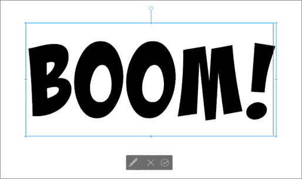

图 11.12：Badaboom Pro BB 字体中的文本

这是对爆炸声效完全可接受的音效，但如果我们想真正让它突出并添加一些颜色怎么办？请继续阅读以了解如何操作！

# 为文本添加轮廓、渐变和图案

现在您已经知道如何使您的字体出现在字体列表中，并且您在画布上已经有文本了，我们可以开始操作文本，使其更加独特或更具视觉吸引力。

当然，在输入文本时，您可以选择除了黑色或白色之外的颜色，但如果您想应用渐变、纹理或为文本创建轮廓使其从页面上突出出来怎么办？在本节中，我们将介绍这些确切的主题！所有这些效果都只需点击几个按钮和一些**图层**和**图层属性**调板中的技巧即可轻松实现。

## 添加轮廓

这种技巧适用于您可能想要添加轮廓的图层上的任何内容，而不仅仅是文本。在这里，我们将使用我们的**BOOM!**音效作为示例。使用**图层属性**调板在 Clip Studio Paint 中创建轮廓非常容易。

按照以下简单步骤为图层内容添加轮廓。在这种情况下，我们使用文本音效：

1.  确保您的文本层是当前活动层，通过检查它在**图层**调板中是否被选中。

1.  定位“图层属性”面板。如果你找不到它，请确保在“窗口”菜单中“图层属性”旁边有一个勾选标记。

1.  在“图层属性”面板中，找到设置中的“效果”部分。点击“边框效果”图标以显示*图 11.13*中显示的选项。

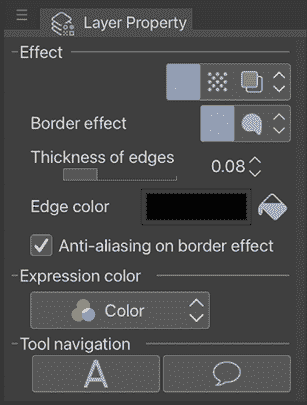

图 11.13：图层属性面板

1.  使用滑块或“边缘厚度”选项旁边的箭头来设置轮廓的宽度。

1.  点击“边缘颜色”旁边的框以从颜色选择器设置轮廓的颜色。

*图 11.14*显示了上一节中的音效，字体颜色设置为白色，周围有黑色轮廓。

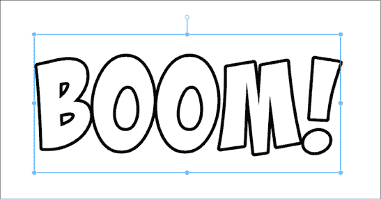

图 11.14：带轮廓的文本

使用“边框效果”选项创建轮廓允许稍后编辑轮廓，所以如果你决定将轮廓颜色改为其他颜色或使边框更厚或更薄，只需再次选择图层并更改“图层属性”面板中的设置！无需从头开始重新创建整个文本图层！

让我们继续使用渐变色为你的文本。

## 使用透明像素锁定添加渐变到文本

添加渐变到音效是一种很好的方式，可以使音效更加生动。如果使用得当，这可以使效果从页面上跳出来。同样，我们可以在几秒钟内完成这个操作！以下步骤展示了如何创建图层的副本，将其栅格化，并添加渐变：

1.  确保文本图层处于活动状态，在“图层”面板中找到它并点击以突出显示。

1.  在“文件”菜单中，点击“图层”，然后点击“复制图层”以创建文本图层的副本。或者，你还可以在“图层”面板中点击图层，并将其拖动到“新建图层”图标上以创建图层的副本。

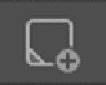

图 11.15：新建图层图标

1.  点击原始图层的眼睛形状图标使其在画布上不可见。选择复制的图层，然后在“文件”菜单中点击“图层”，接着点击“栅格化”将图层转换为栅格。

1.  在“图层”面板中，点击标有“透明像素锁定”的图标。这将允许我们只将效果应用到图层中的填充像素。选择“透明像素锁定”图标的“图层”面板如图*图 11.16*所示。

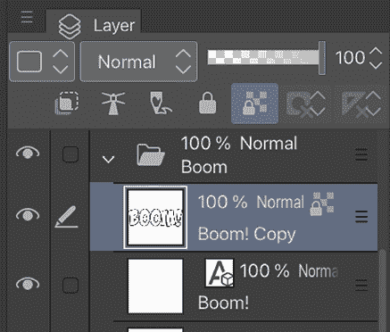

图 11.16：选择“透明像素锁定”图标

1.  在工具栏中选择工具栏中的“渐变”类别，然后选择一个“渐变”子工具。点击画布并拖动以将渐变应用到文本上。

1.  在“图层属性”面板中，如果需要，添加“边框效果”选项给你的音效添加轮廓。在*图 11.17*中，使用了 Clip Studio Paint 的“日落光辉”预设渐变给音效添加了火焰般的外观，然后添加了黑色轮廓使其突出：

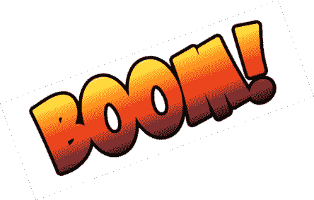

图 11.17：具有渐变效果的文本

除了使用预设之外，您还可以通过选择适当的颜色，将它们设置为前景色和背景色，然后在**渐变**子工具类别中选择**前景到背景**来自定义渐变。

**提示**

当文本图层被栅格化时，它变成了无法使用**文本**工具编辑的像素。如果您需要栅格化文本以应用效果，建议您复制文本图层并将副本栅格化，这样如果需要更改，您还可以回到原始文本。

太好了，现在您已经为文本添加了颜色、轮廓甚至渐变效果！文本看起来非常戏剧化。您甚至可以通过添加图案来更进一步。继续阅读以了解如何操作。

## 使用剪切图层为文本添加图案

对于额外的特殊声音效果，您可能想为文本添加一个图案以增加强调。这就是剪切图层派上用场的地方。剪切图层是一种剪切到其下方图层的图层，仅在下方图层有像素填充的地方显示顶层的内容。

剪切图层在各种情况下都很有用，但我们将通过示例展示如何使用它们来创建引人注目的声音效果。

按照以下步骤使用**材质**调板中的颜色图案创建声音效果：

1.  确保您的文本图层处于活动状态，通过在**图层**调板中找到它并点击它来突出显示。

1.  在**文件**菜单中，点击**图层**，然后点击**复制图层**以创建文本图层的副本。或者，您也可以在**图层**调板中点击图层并将其拖动到**新建图层**图标上以创建图层的副本。

1.  点击原始图层的眼睛图标使其在画布上不可见。选择复制的图层，然后在**文件**菜单中点击**图层**，然后点击**栅格化**以将图层转换为栅格。

1.  打开**材质**调板，并从**颜色图案**类别中选择一个图案添加到文本中。有关使用材质的更多信息，请参阅第九章，**材质调板和绘图特殊效果**。

1.  材质的图案可以粘贴在栅格化文本图层下方的一个图层中。在**图层**调板中点击并拖动位于栅格化文本图层上方的图层。您的**图层**调板应该看起来类似于图 11.18 中所示。

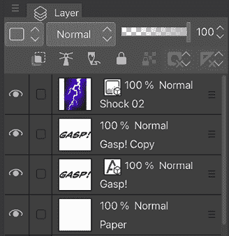

图 11.18：图层调板

1.  在**文件**菜单中，点击**图层**，然后转到**图层设置**，并点击**剪切到下方图层**。或者，您也可以在**图层**调板中右键单击图案图层，转到**图层设置**，然后点击**剪切到下方图层**，如图 11.19 所示。

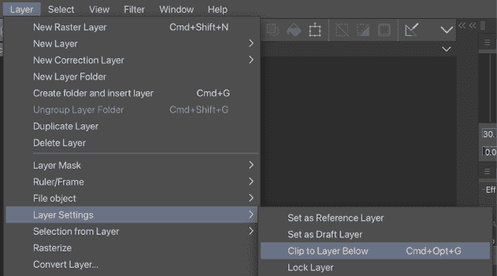

图 11.19：图层下拉菜单

1.  现在图案将仅显示在其下方图层的内容上。剪切图层通过在**图层**调板中图层缩略图旁边的红色标记进行标记，如图*图 11.20*所示。

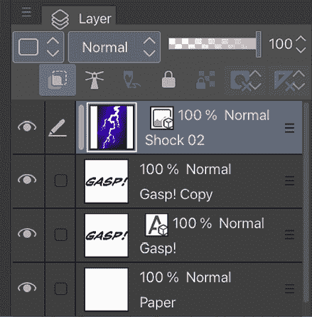

图 11.20：带有图层蒙版的图层调板

1.  要为声音效果添加轮廓，请按照本章*添加轮廓*部分的说明操作，但将其应用于堆叠底部的原始文本层。这将产生一个带有原始文本层的声音效果，如图*图 11.21*所示。

图 11.21：带图案的文本

文本现在有了强烈的闪电图案印象。您可以使用相同的方法添加任何喜欢的图案。接下来，我们将使用**网格变换**工具创建声音效果的透视或流动效果。

# 使用网格变换工具扭曲文本

在漫画和漫画中，许多声音效果都遵循曲线或动作线，以强调页面上的艺术。在*图 11.22*中，爆炸的声音效果被倾斜和塑形，以强调动作。

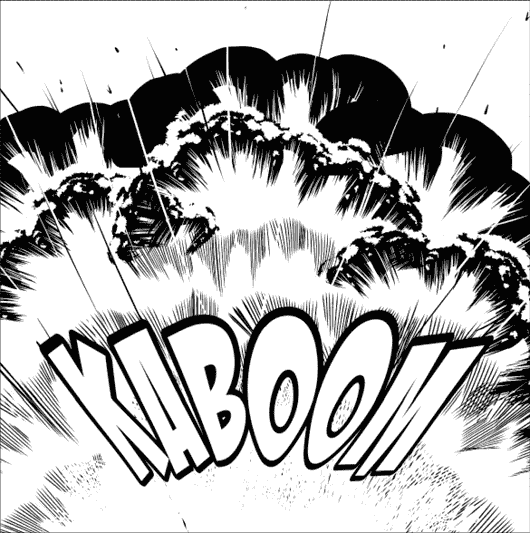

图 11.22：变换后的文本

虽然如果您愿意可以手动绘制这样的声音效果（并且手写是一项非常棒的技术），但您也可以使用**网格变换**工具创建弯曲和扭曲的文本，就像我们可以将工具应用于任何手绘文本一样。

按照以下步骤创建扭曲的声音效果：

1.  确保您的文本层处于活动状态，通过在**图层**调板中找到它并点击它来突出显示。

1.  在**文件**菜单中，点击**图层**，然后点击**复制图层**以创建文本层的副本。或者，您也可以在**图层**调板中点击图层并将其拖动到**新图层**图标上以创建图层的副本。

1.  在选择图层副本且原始文本层不可见的情况下，在**文件**菜单中点击**图层**，然后点击**栅格化**以将图层转换为栅格。

1.  在**文件**菜单中，点击**编辑**，然后下拉到**变换**，并点击**网格变换**。

在图层内容上会出现一个线和点的网格。

1.  在**工具属性**调板中，勾选**水平网格点数**和**垂直网格点数**选项。这两个选项默认为**4**个点。为了更好地控制文本的扭曲，可以将网格点数设置得更高。这必须在您开始移动任何点之前完成。在开始扭曲网格后，添加更多点的选项将消失！在*图 11.23*中，水平点的数量已增加到**6**，以适应声音效果的较长长度。

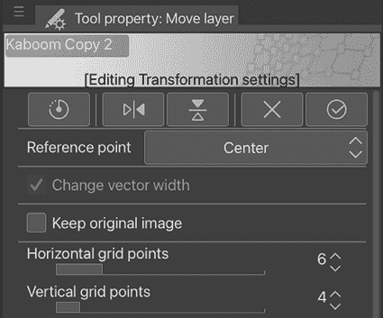

图 11.23：网格变换工具属性的一部分

1.  点击网格交叉点处的点并将它们拖动以扭曲声音效果。随着点的移动，移动点的周围区域将移动和扭曲，如*图 11.24*所示。

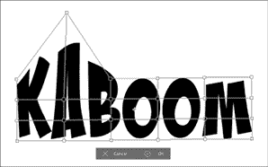

图 11.24：文本上的网格变换网格

1.  继续移动点以重塑网格的内容。在*图 11.25*中，通过交错控制点创建了一个弯曲效果。

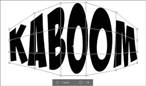

图 11.25：文本上的网格变换

1.  点击**确定**以提交变换。本例中创建的最终声音效果如*图 11.26*所示。

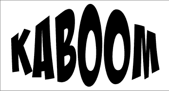

图 11.26：变换后的文本

**提示**

网格变换不仅用于声音效果！它还可以用于图案材料以创建更逼真的服装图案。您会用网格变换做什么？

了解更多关于网格变换的知识会更加有用。在这里，如果您查看*图 11.27*，显示**网格变换**工具属性面板的其余部分，您会注意到有许多方法可以选择网格以一起变换某些区域：

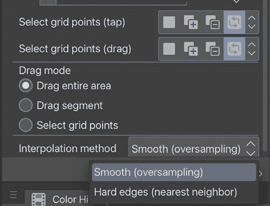

图 11.27：网格变换工具属性

+   **选择网格点（轻触）**：使用此功能，您可以在轻触网格点时选择选择模式。**新选择**模式在轻触时选择点，**添加到选择**模式在轻触时将点添加到选择中，**移除选择**模式在轻触时取消选择点，而**切换选择**模式切换选择状态。

+   **选择网格点（拖动）**：仅在**拖动模式**中**选择网格点**开启时才会激活。这可以在拖动网格点时选择选择模式。**新选择**模式在拖动时选择点，**添加到选择**模式在拖动时将点添加到选择中，**移除选择**模式在拖动时取消选择点，而**切换选择**模式切换选择状态。

+   **拖动模式**：使用此模式，您可以选择在拖动区域时发生什么。**拖动整个区域**将移动整个变换区域，而**拖动段**则只移动所选网格点内的区域，如*图 11.28*所示。

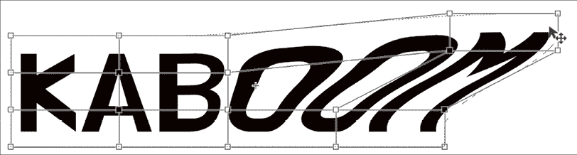

图 11.28：拖动段选项示例

+   **选择网格点**的行为如上所述，无论**选择网格点（拖动）**模式如何。*图 11.29*显示了四个网格点被选中并用控制手柄突出显示，并一起拖动。

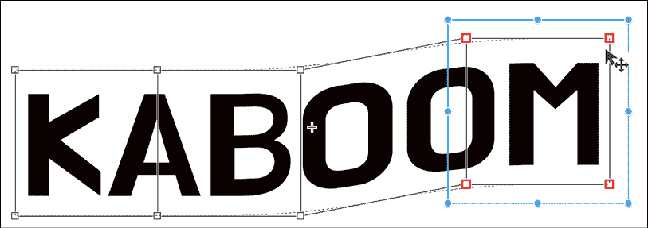

图 11.29：选择网格点选项示例

+   **插值方法**：**平滑（过采样**）混合相邻像素的颜色，使边缘平滑。**硬边（最近邻**）创建更锐利的线条，而不混合相邻像素的颜色。在图 11.30 中，左边的*h*是在**平滑（过采样**）设置下转换的，而右边的*h*是在**硬边（最近邻**）设置下转换的。

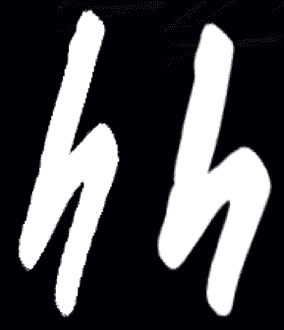

图 11.30：平滑和硬边设置样本

使用**网格变换**工具转换文本是一个如此有趣的过程！它给文本带来独特的魅力，并有助于在漫画页面上创造戏剧效果。现在，你知道这个功能不仅适用于绘图，也可以应用于文本！下次当你给你的漫画添加音效时，享受一段充满创意的时光！

你也可以用本章学到的技巧来创造性的设计漫画标题文本！

# 制作标题

我们将探讨一些使用本章学到的技巧来创建标题文本的可能性。标题文本不仅告诉我们漫画的名称，还展示了内容的情感和基调，例如惊悚、恐怖、浪漫、喜剧、时尚或悲剧。让我们看看标题文本的潜力。

*图 11.31*展示了一个轻松漫画故事的标题。我使用了一个现成的字体，并添加了一个矢量云图案，最后将它们设置为相同的颜色。云形状被放置在标题上方，像王冠一样，以强调“天空”的主题。这也是选择蓝色作为颜色的原因。

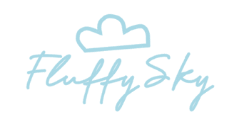

图 11.31：蓬松天空标题文本

*图 11.32*展示了第二个例子，这是一个科幻、恐怖漫画的标题。我使用了一个现成的字体，然后使用墨水工具添加了褪色、刮擦和滴落纹理。背景是黑色，上面只有白色，以强调故事的黑暗。

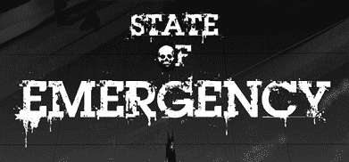

图 11.32：紧急状态标题文本

*图 11.33*展示了我们的第三个例子，这是一个惊险冒险漫画的标题。主要内容是严格的夜景。我用白色创建了手写标题，使用了**画笔**工具，然后在深蓝色背景上添加了星星和月牙形状的飞溅效果，以描绘夜景。最后，使用**软****喷枪**子工具，在新剪贴图层上围绕标题中心喷洒金色。你可以在第十二章“制作图层蒙版和网点纸”中找到更多关于剪贴图层的信息。

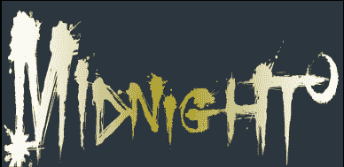

图 11.33：午夜标题文本

*图 11.34* 展示了我们的最终示例，一部浪漫喜剧漫画的标题。使用**网格变换**工具扭曲了一个现成的字体，以创建轻微的透视效果，这可以在本章的前面部分找到，即*使用网格变换工具扭曲文本*。通过图层属性**效果**设置添加轮廓，然后在新剪切图层上使用**软空气刷**子工具创建彩虹色渐变。矢量笔和剪辑板绘制是在标题下方的图层上完成的。在背景上，使用**装饰**工具添加了一个下载的花卉和蝴蝶图案。然后，最后，使用带有图层蒙版设置的新剪切图层上的**画笔**工具部分着色。

您可以在*第十二章*，*制作图层蒙版和屏幕网点*中找到更多关于图层蒙版的信息。

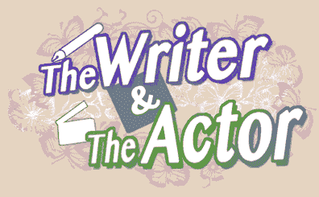

图 11.34：作家与演员标题文本

每个标题文本都展示了其独特的感受和基调，模糊地描述了内容是什么。

您可以使用我们在本章中学到的方法，为自己的标题文本设计非常具有创意！

# 摘要

在这个简短的章节中，我们探讨了创建音效的方法。我们使用了特殊字体来制作音效，并学习了如何通过轮廓和渐变效果使这些字体更加醒目。我们使用了剪切图层来为音效添加图案，并了解了网格变换如何扭曲和弯曲我们的音效。最后，我们查看了一些使用我们学到的某些技术（如下载字体、使用网格变换工具和使用剪切蒙版）制作的标题文本艺术作品。

如果您想知道为您的漫画添加哪些音效，这里有一个有用的资源：[`www.writtensound.com/index.php`](https://www.writtensound.com/index.php)。学习一些可以使用的单词很有趣！

在下一章中，我们将探索面具的奇妙世界。不是用于服装的面具，而是图层面具！继续阅读，了解更多关于 Clip Studio Paint 这一功能的信息。

# 加入我们的 Discord 社群！

与其他用户一起阅读这本书。提出问题，为其他读者提供解决方案，还有更多。

扫描二维码或访问链接加入社区。

[`packt.link/clipstudiopaint`](https://packt.link/clipstudiopaint)

