# 第十三章：尺子的所有内容

艺术家工具箱中最实用的工具之一就是谦逊的尺。无论是普通直线尺、直角尺还是法式曲线尺，尺子真的可以大大提高您的艺术作品。

Clip Studio Paint 中的尺工具在现实生活中就像直线尺或曲线尺一样工作，只是它们是数字的——并且可以自定义，以便轻松产生某些特殊效果，例如所有线条都指向一个特定的焦点（甚至弯曲到特定的焦点）。如果您在数字领域绘制或上墨，您需要确保您熟悉这些惊人的工具。

在本章中，我们将涵盖以下关键主题：

+   介绍尺和它们的类型

+   在 Clip Studio Paint 中使用尺

+   使用对称尺

+   焦点和平行线尺

+   理解透视尺

+   使尺子无效

+   在透视中绘制椭圆

+   切换活动尺

+   使用网格和辅助线

在本章中，我们将深入探讨 Clip Studio Paint 中的特殊尺子。我们将简要介绍基本尺子，然后我们将更深入地查看其他尺子选项以及它们如何应用于漫画绘制。

现在，让我们直接进入尺子的使用吧！

# 技术要求

要开始，您需要在您的设备上已经安装了 Clip Studio Paint，并且打开了一个带有白色纸张层的空白画布。任何尺寸都可以，但我建议创建一个 300 dpi 的方形画布来处理本章的内容。

# 介绍 Clip Studio Paint 中的尺和它们的类型

当您在数字中绘制直线时，您只需从**直接绘制**工具组中选择**直线**子工具，然后点击并拖动。就这样！这是一个相当简单的任务。但是，当您想要使用纹理笔刷创建直线时，您需要一个尺子来引导您创建直线，无论您的手部移动多么稳定。或者，如果您正在进行三点透视绘制，您需要一个准确的辅助线！是的，有很好的尺子工具适用于所有这些选项。

在 Clip Studio Paint 中，不仅有直线**Linear**尺，还有**曲线**尺、**图形**尺、**尺笔**、**特殊**尺、辅助线、**透视**尺和**对称**尺，您可以在*图 13.1*中看到它们。在本章中，我们将逐一通过示例介绍它们。所以，如果您对哪种尺最适合您感到困惑，您总是可以回到本章来查看丰富的样本截图中的描述！

# 使用尺子

在本节中，我们将了解不同的尺子类型，以及如何在 Clip Studio Paint 中捕捉和操作尺子。每种尺子都有其用途，它们肯定会帮助您创建精确的线条和形状，正好符合您的需求！

让我们先找出可用的尺子，并尝试使用它们。您将在工具栏中的**尺**部分找到尺子子工具。

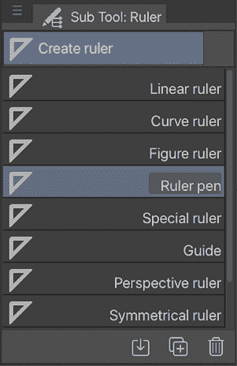

图 13.1：标尺子工具调板的截图

前四个工具，**线性标尺**、**曲线标尺**、**图形标尺**和**标尺笔**，是我们将在本节中简要介绍的。在这四个工具之下列出的工具稍微复杂一些，随着章节的继续，我们将更详细地探讨它们。

## 标尺吸附选项

在我们介绍如何使用每个标尺工具之前，我们需要了解吸附选项。当标尺不按预期工作时，大多数情况下是因为吸附被打开或关闭。因此，当使用标尺工具得到不期望的结果时，最好首先检查这些选项。

三个吸附选项可以在当前活动文档显示区域上方的命令栏中找到。它们在图 13.2 中显示。

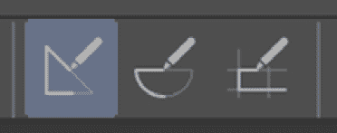

图 13.2：标尺吸附选项的截图

从左到右，这些选项是**吸附到标尺**、**吸附到特殊标尺**和**吸附到网格**。在前面的截图中，**吸附到标尺**选项是唯一一个当前激活的，并用浅蓝色框标记。现在，让我们看看它们具体做什么：

+   **吸附到标尺**将当前工具所做的标记限制在任何活动的基本标尺（线性标尺、图形标尺、标尺笔等）上。如果活动标尺是特殊标尺，例如透视标尺，则此选项不会迫使绘图工具遵循该标尺。

+   **吸附到特殊标尺**迫使工具将标记限制在当前激活的任何特殊标尺上，例如对称、焦点线和透视标尺。

+   **吸附到网格**在网格可见时迫使工具保持在网格范围内。关于网格的更多内容将在本章后面讨论。

要打开或关闭吸附选项，只需单击它。可以同时激活多个吸附选项。请记住，吸附选项将迫使您的工具约束自己到任何当前激活的符合其标准的标尺，因此如果您有一个不在您想要的位置绘制的绘图工具，并且您的图像中有一个标尺，请首先检查吸附选项，看看是否是这个问题！

现在我们已经讨论了吸附，让我们继续介绍基本标尺及其功能。

##  线性标尺

线性标尺的工作方式与您可能在任何商店购买的普通标尺相同。这是最简单的标尺，用于绘制单一直线。

要使用**线性标尺**，选择子工具，点击您的画布，并拖动。当您到达想要标尺结束的位置时，释放鼠标或笔。标尺将显示为单色线条，如下面的截图所示：

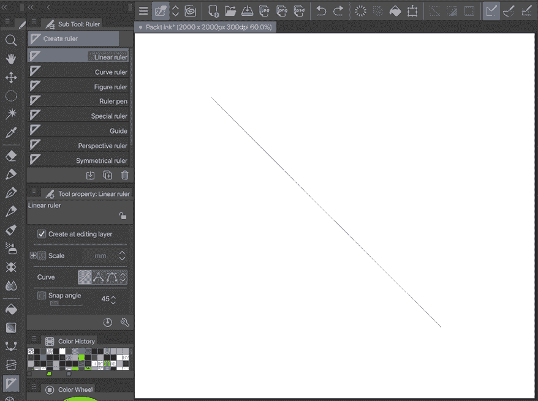

图 13.3：线性标尺示例的截图

当“**吸附到标尺**”选项处于活动状态时，使用像 G-笔这样的工具会在我们刚刚制作的标尺上绘制一条线，如下面的截图所示：

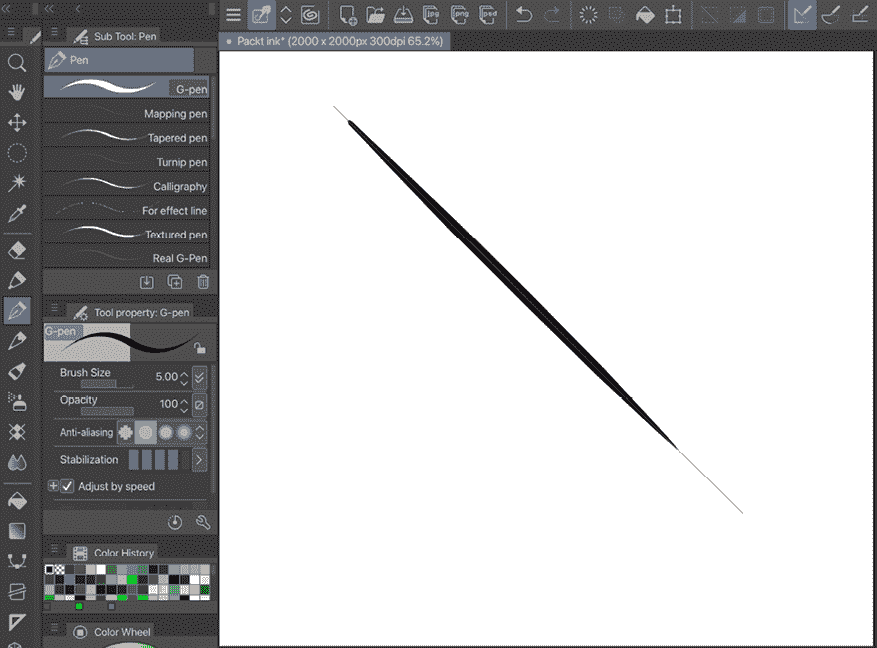

图 13.4：线性标尺线上的绘图截图

**提示**

需要调整已经制作的标尺线？使用“**操作**”|“**对象**”子工具并选择标尺，如图 13.5 中所示。

标尺周围会出现一个边界框，并且两端会出现一个把手。通过使用这个边界框和两端的把手，可以改变标尺的角度和长度，调整标尺的大小，甚至可以旋转标尺！

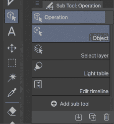

图 13.5：对象子工具的截图

由于线性标尺的帮助，你可以用 G-笔绘制一条平滑的直线。那么，尝试绘制一条曲线怎么样？继续阅读以了解更多信息。

##  曲线标尺

当我们绘制具有圆形的机械物体时，例如自行车、汽车、摩托车和眼镜，曲线标尺非常有帮助。它帮助我们绘制平滑的线条，并且可以随意编辑标尺形状。然而，曲线标尺的名称有点误导，因为它不仅可以用来制作多段直线标尺，还可以制作平滑曲线标尺，如图 13.6 所示。

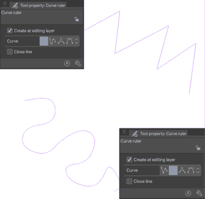

图 13.6：曲线标尺示例的截图

要使用曲线标尺，从“**标尺**”**子工具**调色板中选择它。在“**工具属性**”调色板中，您会在“**曲线**”设置下看到四个选项。第一个图标是“**直线**”，它将在标尺的点之间产生直线。第二个选项是“**样条**”设置，它将在标尺的每个点之间创建曲线。要使用这两个选项中的任何一个，只需在画布上点击您想要标尺开始的位置。然后，再次点击以确定第二个点。继续点击标尺的每个角落，直到达到您想要标尺结束的位置。双击以结束标尺。

如果您正在绘制一个封闭形状，您也可以绕回到标尺开始的位置，点击第一个点以结束它，如图 13.7 所示。

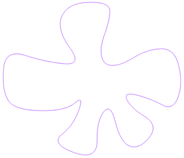

图 13.7：封闭形状的截图

在“**工具属性**”调色板中的“**曲线**”设置下，最后两个图标是“**二次贝塞尔**”和“**三次贝塞尔**”，它们是制作和控制标尺曲线的两种简单替代方法。让我们学习如何使用这些方法中的每一种来创建曲线。

### 使用二次贝塞尔

使用二次贝塞尔工具绘制标尺需要一点时间来适应，通常在初始点设置后需要进行一些细化。按照以下步骤创建一个二次贝塞尔曲线标尺：

1.  从**工具属性**调色板中选择**曲线标尺**，然后选择**二次贝塞尔**选项。

1.  点击画布一次，在您希望标尺开始的位置。

1.  点击您希望标尺开始弯曲的点。这将在此点击点创建一个小方块手柄。

1.  将光标移动到画布上的另一个点。标尺的线条将根据第二次点击的位置和光标现在的位置弯曲。

1.  继续点击以向标尺添加框和曲线，直到达到所需的长度。双击以结束标尺。

1.  要调整标尺，请选择**操作**工具 | **对象**子工具。点击标尺以选择它并显示手柄控制。在图 13.8 中，控制手柄位于直线和实际的标尺是曲线。

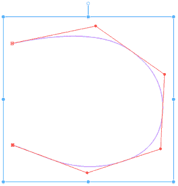

图 13.8：二次贝塞尔示例截图

要调整标尺的曲线，请使用**对象**子工具点击控制线上的一个点手柄并将其拖动到新位置。前一个截图中的标尺已在图 13.9 中修改。

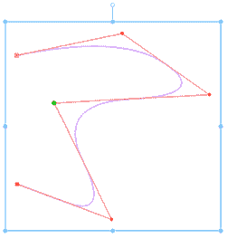

图 13.9：调整后的二次贝塞尔示例截图

让我们看看另一种绘制曲线线的方法，使用三次贝塞尔。

### 使用三次贝塞尔

制作曲线的另一种选项是使用**三次贝塞尔**设置。按照以下步骤创建使用三次贝塞尔的标尺：

1.  从曲线标尺的**工具属性**调色板中选择**三次贝塞尔**设置。

1.  点击标尺的第一个点。

1.  在添加第一条曲线时，按照线条的方向绘制。例如，如果您从画布的左侧开始并向右移动，则向右绘制。沿着线条的方向绘制可以防止控制手柄反向移动并在线条上形成“打结”。

1.  点击第三个点并绘制以继续制作曲线。

1.  要结束标尺，请双击另一个点。在此模式下，标尺将在双击之前创建的点处结束，因此请确保标尺的长度足够，点击终点，然后双击以完成标尺。

1.  要编辑三次贝塞尔标尺，请选择**操作**工具 | **对象**子工具。点击标尺以显示控制手柄。图 13.10 中，控制手柄由红色线条表示。

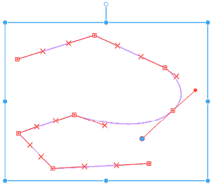

图 13.10：三次贝塞尔示例截图

使用**对象**工具，可以通过点击手柄并拖动它们来调整红色线条上的手柄以调整单个曲线。点击出现在控制点上的红色方块允许我们调整它们的位置。拖动红色控制线两端的红点手柄允许我们改变控制点两边的曲线。

现在我们已经知道了如何使用二次贝塞尔和三次贝塞尔选项绘制曲线，我们将继续介绍现成的形状直尺。

##  形状直尺

形状直尺允许我们通过几个简单的点击创建圆形、矩形和多边形直尺。这是绘制完美圆的最佳选择！按照以下步骤使用形状直尺：

1.  选择**形状直尺**子工具。

1.  在**工具属性**面板中，从**形状**工具中选择一个形状。

1.  点击画布并按住鼠标按钮或笔尖。拖动以在画布上创建所选形状的直尺。

1.  当使用多边形形状选项时，可以通过调整顶点数量来创建三角形、五边形和六边形等形状。要编辑顶点数量，选择直尺，然后点击**工具属性**面板右下角的**显示子工具详细** **面板**图标。在**子工具详细**面板中点击**形状**工具。在**形状**工具下方是**顶点数量**选项，可以通过滑动条或点击数字输入框并输入数字来调整，也可以使用键盘输入。在图 13.11 中，顶点数量为**3**，这将产生一个三角形。

在形状工具下方是**顶点数量**选项，可以通过使用滑动条或点击数字输入框并输入数字来调整，也可以使用键盘输入。在下面的截图里，顶点数量为**3**，这将产生一个三角形：

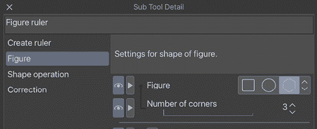

图 13.11：形状直尺子工具详细面板截图

绘制形状后，我们可以通过选择**操作** | **对象**工具并点击形状来改变其位置和大小。使用控制手柄编辑形状。

如果我们在形状上任何地方放置笔并开始沿着线条移动，形状将会平滑地绘制。

在本节中我们将介绍的最后一种基本直尺是多功能直尺笔。继续阅读以了解更多关于这个工具的信息。

##  直尺笔

直尺笔是一个多功能的工具，允许我们绘制任何形状的直尺。它有**稳定性**和**后校正**设置，因此在我们需要时可以创建平滑的形状。我们可以在**工具属性**面板或**子工具详细**面板中找到这些设置。

在下面的截图里，我使用直尺笔自由绘制了一个鸟形：

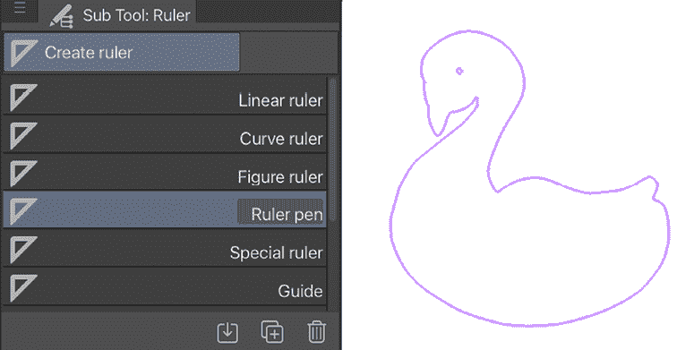

图 13.12：直尺笔示例截图

一旦我们用直尺笔完成绘制，任何绘图工具都可以用来追踪直尺！

**提示**

对于您刚刚创建的布局不确定？尝试使用黄金比例，这是所谓的神圣比例，通过 1:1.618 比例的和谐与比例创造出美感。

在以下图像中，我将左侧的 1:1 构图重新制作成了右侧的 1:1.618 构图：

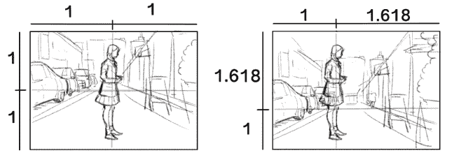

图 13.13：不同布局的截图

注意到地平线和人物位置略有不同吗？我们似乎对这种构图更感到舒适。

黄金比例的美学可以应用于动画分镜脚本、人脸、书封面设计等领域。您还可以通过开启**比例**选项，并将**黄金比例**从**创建标尺**类别中的下拉菜单中选择，将其添加到您的**线性**、**曲线**和**图形**标尺以及**标尺笔**中：

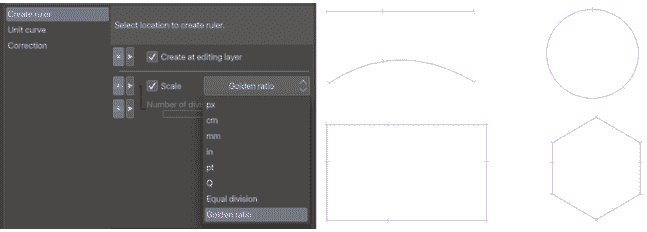

图 13.14：子工具详细面板和各种带有比例的标尺截图

类似地，在设计构图时，你应该记住**三分法规则**。这是一个将主题放置在图像的左侧或右侧三分之一中的指南，使其他两个三分之一更加开放。如果你看图 13.13 的右侧图像，你实际上已经看到了这一点，在人物位置上。当构图中有多个元素时，这是一种管理空间的好方法，同时也能使构图看起来更自然。

我们已经介绍了如何对齐到标尺以及基本标尺的使用，例如创建线条、曲线和图形的标尺，甚至涵盖了如何创建手绘标尺！现在，我们将继续介绍以下章节中的专业标尺工具。

## 使用对称标尺

你是否曾想创建一个两边都完美对称的设计，或者制作一个美丽的数字曼荼罗？如果是这样，对称标尺就是你的救星。作为额外的好处，它使用起来非常简单！

要开始使用对称标尺，从工具箱中选择**标尺**工具，然后从**子工具**面板中选择**对称标尺**。图 13.15 展示了**工具属性**面板。

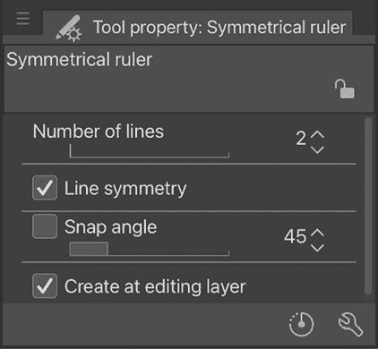

图 13.15：对称标尺工具属性截图

在**工具属性**面板中，最重要的选项是**线条数量**选项。这个选项控制完成后的标尺将有多少对称边。在这个选项中可以使用从 2 到 16 的任何数字。图 13.16 展示了将**线条数量**设置为**2**的标尺示例。

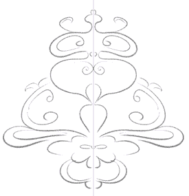

图 13.16：两条线对称标尺绘图截图

设计中心部的细紫色线是标尺，设计在标尺线的每一侧都进行了镜像。

这种对称绘图在设计漫画角色时很有用，在某些元素上，我们希望在身体的左右两侧都添加内容，如图 13.17 所示。

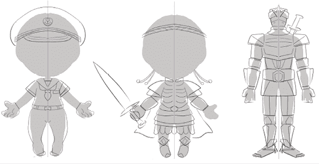

图 13.17：双线对称尺子设计

图 13.18 显示了将**线条数**设置为**8**的设计。

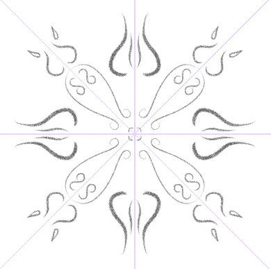

图 13.18：八线对称尺子绘制的截图

现在设计现在有八个对称部分，从尺子的中心辐射出来。图 13.19 展示了使用 16 条线制作的设计，这是在 Clip Studio Paint 中对称尺子可以拥有的最大数量。

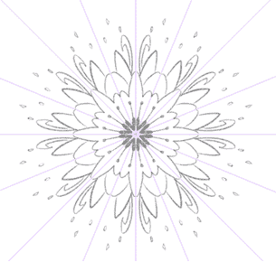

图 13.19：16 线对称尺子绘制的截图

创建对称尺子很容易，可以按照以下步骤进行：

1.  如果需要，在创建尺子之前先草拟设计的大致布局。

1.  从**尺子**工具中选择**对称尺子**子工具。

1.  在**工具属性**面板中设置所需的线条数。

1.  点击并按住图像画布。在按住鼠标或笔按钮的同时，拖动画布来创建线条。为了使尺子线条完全直线或 45 度角，在拖动鼠标或笔的同时按住键盘上的*Shift*键。

1.  释放鼠标或笔来完成尺子的创建。

1.  确保顶部的命令栏中的**吸附到特殊尺子**图标处于活动状态，以便使用尺子。

**提示**

与按住*Shift*键来约束尺子角度不同，可以在**工具属性**面板中使用**吸附角度**选项。只需勾选选项旁边的框，然后使用滑块或文本输入设置所需的角。

既然我们已经知道如何创建和使用对称尺子，让我们来了解一下更多特殊尺子的用法。

## 径向和平行线尺子

大多数情况下，漫画是黑白色调，因此线条必须粗壮，并且应清楚地显示动作，以及读者应该关注的点，因此线条工作非常引人注目。许多漫画家这样做的一种方式是使用平行线来显示动作，以及使用径向线引导读者的视线到画框中的兴趣点，在某些情况下，还可以表达物体相互碰撞的影响。Clip Studio Paint 自带可以制作平行线和径向线的尺子，这使得创建这些效果比用笔和纸更容易。

让我们看看以下来自我的漫画改编《仲夏夜之梦》的页面，展示了一些如何在漫画中使用径向线和平行线的例子：

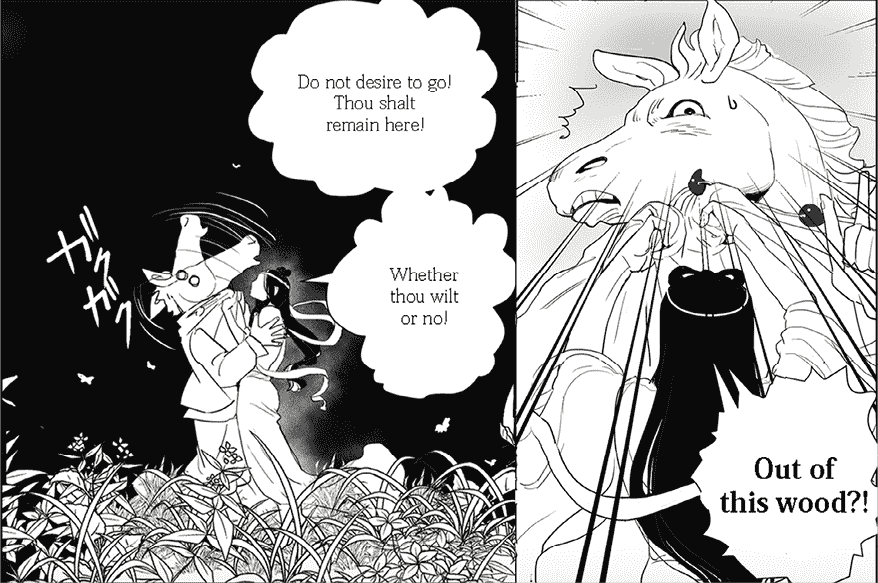

图 13.20：聚焦和平行线的漫画截图

在左侧面板中，使用平行线来显示蒂塔尼亚（Titania）挥动 Bottom 头部时的动作。在右侧面板中，使用径向线将读者的视线引导到 Bottom 震惊的面部。

让我们看看如何创建和使用径向线标尺。

### 径向线标尺

径向线标尺允许我们设置一个中心点，然后从这个点绘制辐射线条。通过使用 Clip Studio Paint 标尺的吸附功能，绘制径向线比用笔和纸的传统方式更快、更容易。只需设置您的中心点并开始绘制！按照以下步骤制作径向线标尺：

1.  从工具栏中选择**标尺**工具，然后选择**特殊标尺**子工具。

1.  在**工具属性**面板中，点击下拉菜单选择**径向线**选项。下拉菜单如图 13.21 所示。

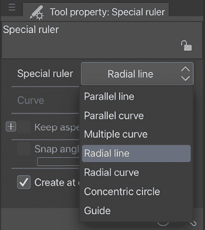

图 13.21：特殊标尺的工具属性面板截图

点击所需的径向线中心点。这是所有使用标尺绘制的线条辐射出的点。

1.  使用您选择的绘图工具绘制径向线条。当您向中心绘制线条时，您会看到标尺帮助您在每次笔触时保持平滑的直线轨迹，角度恰到好处。在图 13.22 中，焦点线是用 G 笔绘制的，您可以看到线条都正确地朝向中心拉伸。

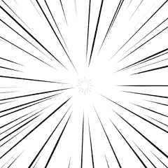

图 13.22：径向线标尺绘制截图

**提示**

在**图**工具下也有现成的平行线和径向线可供使用。它们位于**图子工具**面板中的**流线**和**饱和线**。您可以使用它们以与创建标尺相同的方式使用，但线条将自动为您绘制——多么节省时间啊！

也可以制作径向曲线标尺。使用径向曲线标尺，线条仍然共享相同的中心点，但它们是弯曲的而不是直的。按照以下步骤创建径向曲线标尺：

1.  从**工具属性**面板中的下拉菜单中选择**径向曲线**选项。

1.  点击径向曲线标尺的中心点。在曲线的下一个点再次点击。继续点击，直到达到所需的曲线。

1.  双击以结束曲线。

1.  使用您选择的绘图工具绘制焦点曲线。图 13.23 是使用 G 笔工具完成的。

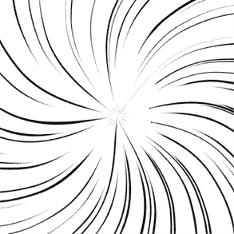图 13.23：径向曲线线标尺绘制截图

注意，塑造曲线的方法是**样条**。对于这些曲线创建方法的更深入解释，请参阅本章前面的**曲线标尺**部分。

现在您已经知道如何创建焦点线，让我们研究本节中要介绍的另一个标尺，即平行线标尺。

### 平行线标尺

按照以下步骤创建平行线标尺：

1.  从工具栏中选择**标尺**工具。

1.  选择**特殊标尺**子工具。

1.  从**工具属性**面板中的下拉菜单中选择**平行线**选项。

1.  点击画布并拖动以设置标尺的角度。按住键盘上的*Shift*键可以限制标尺为直线和 45 度角。

1.  释放鼠标按钮或笔触以完成创建标尺。

1.  使用你选择的绘图工具创建平行线。图 13.24 显示了使用标尺绘制的平行线的示例。

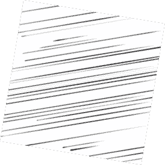

图 13.24：平行线标尺绘制的截图

与我们之前介绍的径向标尺一样，平行曲线也可以用标尺制作。按照以下步骤创建平行曲线标尺：

1.  从**工具属性**调色板中的下拉菜单中选择**平行曲线**。

1.  点击画布开始绘制标尺。点击曲线的下一个点。

1.  选择另一个点并点击以继续曲线。

1.  继续点击，直到达到所需的曲线数量和长度。要结束标尺，双击。

1.  使用绘图工具绘制你的平行曲线。图 13.25 中的线条是用 G 笔工具制作的。

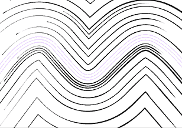

图 13.25：平行曲线线标尺绘制的截图

注意，塑造曲线的方法是**样条**。关于这些曲线创建方法的更深入解释，请参阅本章前面的*曲线标尺*部分。

**提示**

在创建标尺后，你需要更改标尺的角度或形状吗？只需选择**操作**|**对象**子工具，并点击标尺以显示控制手柄。**对象**工具可以用来移动、旋转和微调你的标尺。

现在我们已经介绍了一些高级二维标尺工具，你可以区分线性、曲线、图形、标尺笔、对称、径向和平行标尺之间的区别。让我们继续学习透视绘图，这可能是你最想了解的内容！

# 理解透视标尺

在本节中，我们将探讨透视标尺是什么，然后通过逐步教程创建一点、两点和三点标尺来理解它们，最后学习如何使用透视标尺的线性工具和图形工具。

透视标尺对于任何绘制背景的数字艺术家来说都是一个变革性的工具。使用数字透视标尺创建详细的城市场景和背景比以往任何时候都要容易。然而，如果你之前从未学习过透视，那么拥有透视标尺并不能让你突然成为透视专家。就像现实世界中的尺子一样，透视标尺是一种可以使绘图过程更简单的工具。

虽然可以使用透视标尺等工具，但这并不能取代对透视绘制原理的了解和实践。如果你不知道如何绘制具有深度的图形，那么这些标尺只能提供有限的帮助。你可以找到许多好书解释如何绘制透视背景。

在 Clip Studio Paint 中，透视标尺可以是单点、双点或三点透视标尺。随着你对透视绘制的熟悉，你也可以添加其他点，但为了本书的目的，我们将专注于单点、双点和三点透视。

让我们从最容易掌握的透视标尺开始，即一点透视标尺。对于以下每个标尺说明，你需要一个绘图画布和一个透视场景的草图来绘制。这就是透视知识发挥作用的地方！我建议你在创建场景的草图时，正确放置透视消失点。

## 一点透视

如前所述，我们将从一个带有草图画布开始。对于一点透视，我们将绘制一些建筑和通往远方的道路。如果你需要，可以从任何参考资料中获取灵感！

以下截图显示了我将基于其创建透视标尺的草图。拥有一个粗略草图会使放置消失点和参考线变得容易得多：

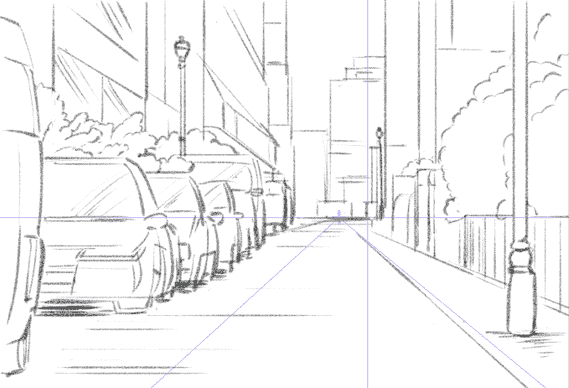

图 13.26：背景的草图

现在草图已经完成，我们可以按照以下步骤制作一点透视标尺：

1.  在**文件**菜单中，点击**图层**，转到**标尺/框架**，然后点击**创建透视标尺**。

将出现一个如图 13.27 所示的框。

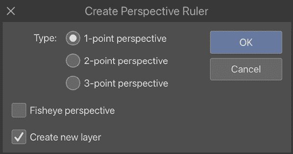

图 13.27：创建透视标尺窗口的截图

1.  从**类型**中选择**1 点透视**。激活**鱼眼透视**会将标尺扭曲成鱼眼形状，但我们现在不会使用这个功能。如果不勾选**创建新图层**框，则会在当前活动图层上创建标尺。由于我们想在草图图层之上创建一个图层来细化我们的草图，我们将勾选**创建新图层**框。

1.  点击**确定**以创建新的标尺。

1.  当标尺在画布上创建时，当前活动工具将自动切换到**对象**子工具。这将允许我们在画布上调整我们的透视标尺。

图 13.28 是透视标尺的截图，其背后没有草图，以便清晰地看到。从左到右穿过画布的线条是我们的地平线。线条两侧的两个蓝色圆点允许我们控制地平线的倾斜。地平线上的圆形点是我们的透视消失点。

从消失点辐射出的两条线是帮助我们将透视标尺放置在正确位置的参考线。

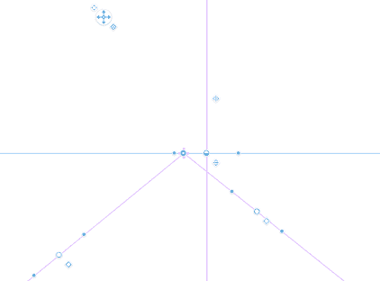

图 13.28：一点透视标尺参考线的截图

使用**对象**子工具，点击消失点并拖动，使其与粗糙草图上的消失点处于同一位置。确保透视标尺的视平线也与粗糙草图上的视平线相匹配。可以使用指南的把手来检查透视并确保标尺位于正确的位置。图 13.29 显示了透视标尺的正确位置。

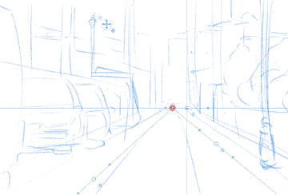

图 13.29：一点透视标尺指南的截图

现在透视标尺已定位，我们将确保主命令栏中的**捕捉到特殊标尺**图标处于激活状态。我们现在可以在清理后的场景中绘制，绘图工具将捕捉到标尺的线条。图 13.30 显示了此透视场景的完成铅笔草图：

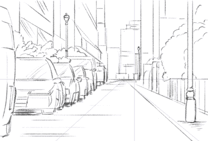

图 13.30：由一点透视标尺引导的草图

一旦场景草图完成，我们可以在草图层之上添加另一层来绘制墨迹，同时仍然能够看到并捕捉到我们的透视标尺。为了做到这一点，查看**图层**调板。选择标尺层后，点击**设置标尺显示区域**图标以打开下拉菜单，如图下截图所示，为一个三角形标尺形状，位于下拉菜单上方：

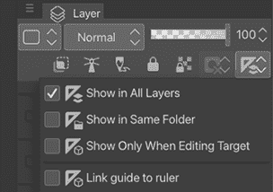

图 13.31：截图显示已选择设置标尺显示区域菜单选项，下拉菜单已显示

将**在所有图层中显示**选项设置为无论当前活动图层是什么，都可以看到和使用透视标尺。

标尺的显示区域有**在所有图层中显示**、**在相同文件夹中显示**、**仅当编辑目标时显示**和**链接指南到标尺**。以下是对每个选项的描述：

+   当标尺层设置为**在所有图层中显示**时，标尺将出现并能够捕捉到当前画布中的任何图层。

+   当设置为**在相同文件夹中显示**时，标尺仅在它位于与标尺相同的图层文件夹中的图层上时显示。（例如，如果我们的画布包含一个标记为**草图**的文件夹，其中包含一个标尺，那么标尺仅在它位于该同一文件夹中的组图层上时可见和可用。）

+   当设置为**仅当编辑目标时显示**时，标尺仅在标尺层是当前活动层时显示。

+   **链接标尺到指南**将标尺和同一层上创建的指南关联起来。当开启时，标尺和指南可以与**移动图层**工具一起移动。

现在，让我们在下一节中查看具有更多消失点的透视标尺。

## 双点透视

使用与本章*一点透视*部分所示相同的方法可以创建两点透视标尺。然而，也可以向现有标尺添加额外的透视消失点。以下截图显示了一个使用两点透视标尺创建的草图。请注意，两个消失点通常相距很远，并且超出画框，因为它们太接近会扭曲我们绘制的对象：

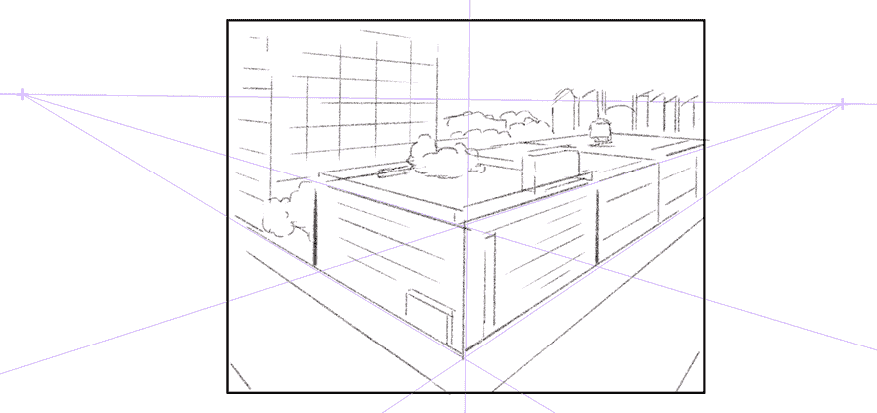

图 13.32：两点透视样本艺术截图

要创建一个基本的两点透视标尺，遵循上一节中的说明，但在*步骤 2*中从对话框中选择**2 点透视**选项。要向现有标尺添加一个点，请按照以下步骤操作：

1.  使用**对象**子工具点击现有的标尺以选择它。如果当前已选择标尺，则控制手柄将可见。

1.  从工具栏中选择**标尺**，然后从**标尺**子工具面板中点击**透视标尺**。确认在**工具属性**面板的**过程**下拉菜单中已选择**添加消失点**，如图 13.33 所示。

![img/B22275_13_13.33.png]

图 13.33：透视标尺的工具属性面板截图

1.  在画布上，点击你想添加新消失点的地方。

如*图 13.33*截图所示，透视标尺**工具属性**面板在**过程**下拉菜单中有几个选项可以帮助我们绘制透视标尺。我们已经涵盖了**添加消失点**选项，以下列表描述了此面板中可用的其他透视标尺工具：

+   **删除消失点**将删除当前选定的消失点。

+   **添加参考线**将从当前消失点创建一个新的参考线。

+   **删除参考线**将删除从消失点选定的参考线。

+   **固定消失点**将选定的消失点锁定在其当前位置。

+   **无限化**当选择时，将消失点移动到无限远。

现在，你可以创建多个消失点透视标尺。让我们看看如何使用透视标尺创建三点透视绘图。

## 三点透视

一旦你掌握了单点和两点透视，你就可以开始使用三点透视创建一些非常酷的场景。三点透视创建的场景看起来很炫酷，并为你的漫画场景增添了三维空间感。图 13.34 展示了我作品中一个三点透视城市景观的例子。

![img/B22275_13_13.34.png]

图 13.34：使用透视标尺绘制的背景图

通过缩小视图，我们可以看到透视标尺是如何设置以创建这个城市的鸟瞰图的。就像两点透视一样，消失点不应该太近，因为它们可能会扭曲我们绘制的对象，所以值得记住它们应该放置得远一些。图 13.35 显示了带有透视标尺的页面缩放视图。注意消失点与画布边缘的距离。

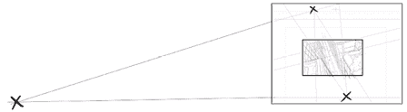

图 13.35：带有消失点的背景绘制

通过使用本章一点和两点透视部分中描述的任一方法可以创建三点透视标尺。然而，它们更难处理，因为程序试图捕捉到这么多点。有时，程序可能会选择错误的辅助线，你可能需要撤销你的线条并再次尝试。

一旦你掌握了三点透视标尺，它们是绘制你的人物居住的酷炫环境的无价之宝，特别是当摄像机向上看一座大建筑，或者城镇的鸟瞰图时，就像前面的样本艺术一样。这就像用无人机摄像机从地面低处或高空自由地观察世界一样！

在我们离开透视标尺之前，你知道你可以使用它们绘制完美的椭圆和其他形状吗？让我们在下一节中了解更多！

## 使用透视标尺的图形和线条工具

你知道你可以使用形状和线条工具与透视标尺一起使用吗？按照以下步骤使用透视标尺的**直接绘制**子工具：

1.  使用本章前面列出的方法之一，在你的画布上创建一个透视标尺。

1.  在工具栏中选择**图形**工具。

1.  选择**直接绘制**子工具。

1.  选择**矩形**子工具。

1.  确保主命令栏中的**捕捉到特殊标尺**图标处于激活状态。然后，使用矩形工具点击并拖动以创建一个矩形。只要**捕捉到特殊标尺**处于激活状态，形状将自动符合透视标尺。

在图 13.36 中，我们使用**捕捉到特殊标尺**选项在透视中绘制了一个圆、一个矩形和一个多边形。

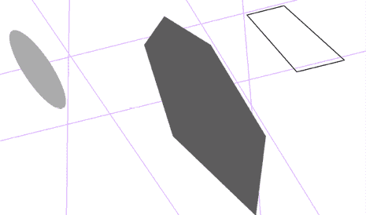

图 13.36：使用透视标尺的图形工具绘制

通过配置形状工具的设置，你可以显著加快你的对象绘制速度。

有方法可以控制多个标尺来组织你的画布；让我们在下一节中找出如何做到这一点。

# 使标尺非激活

在某些情况下，你可能需要在同一张图像中拥有多个标尺。这可能会让程序和我们都感到困惑！因此，在本节中，我们将检查使标尺和消失点激活或非激活的快速过程。这将使我们能够控制标尺的工作方式以及任何时刻标尺的哪些区域是激活的。

## 使用控制手柄开关标尺

使标尺变为活动或非活动状态非常简单但非常有价值。了解如何管理多个标尺可以在顺畅的绘图体验和与工具斗争数小时之间产生差异！按照以下步骤将活动标尺变为非活动状态：

1.  在新画布上创建一个标尺。在这个例子中，我们将查看同心圆标尺，但几乎任何标尺工具都可以。

1.  如果标尺尚未选中，请使用**对象**子工具点击标尺。当前选中的标尺将显示控制手柄。在图 13.37 中，控制手柄是围绕标尺的圆形和菱形图标，允许我们编辑它并改变其形状和旋转。

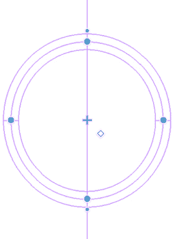

图 13.37：透视标尺和图线参考线的截图

定位形状像菱形的控制手柄。在前面的截图中，它位于圆标尺中心的右侧。点击菱形控制手柄以使标尺变为非活动状态。标尺将从紫色变为绿色，如图 13.38 所示。

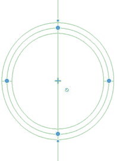

图 13.38：显示一个标尺非活动状态的截图

要再次使标尺变为活动状态，请点击带有斜杠图标的圆圈。标尺将变回其活动颜色并能够吸附。

此方法也可以应用于透视标尺上的单个消失点。在图 13.39 中显示的鱼眼透视标尺中，所有上方的消失点都已变为非活动状态，这样工具就只能吸附到中心消失点上。

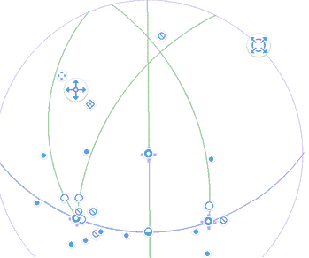

图 13.39：仅显示一个活动标尺的截图

现在我们已经了解了所有这些特殊标尺，让我们来谈谈一个经常被忽视的工具，如果你知道如何使用它，这个工具可以帮你节省头痛的时间和大量时间。

# 使用网格和参考线

许多 Clip Studio Paint 的新用户不知道该软件附带可自定义的网格，可以显示或隐藏，或者你可以在程序中创建参考线。网格和参考线对于许多任务都很有用，当然，并提供了一个易于计数和分割的视觉测量。此外，Clip Studio Paint 中的网格和参考线可以吸附到，这使得精确对齐元素变得非常容易。

在本节中，我们将学习如何显示和隐藏网格以及如何创建参考线。

## 显示和隐藏网格

要查看网格的实际效果，让我们看看以下截图：

图 13.40：带有网格的画布截图

仔细观察，我们可以看到有些线条较暗。这些较暗的线条是我们的网格线。在每条网格线之间有三条网格分割线，将每个较大的网格方格分割成四个部分，每个方向上共有 16 个方格。

按照以下步骤在你的作品中显示网格：

1.  在**文件**菜单中，或在 Mac 的顶部菜单栏上，点击**视图**选项。

1.  点击**网格**以显示网格。

1.  要隐藏可见的网格，请点击**视图**，然后再次点击**网格**以取消选中选项。

您也可以通过更改设置来调整网格；继续阅读以了解如何操作！

## 调整网格设置

有一些网格设置允许我们更改网格分割。这些设置可以通过在**文件**菜单中点击**视图**，然后点击**网格/标尺栏设置…**来访问。网格/标尺设置菜单在以下屏幕截图中显示：

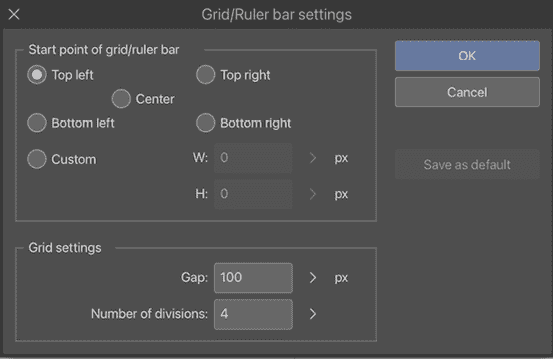

图 13.41：网格标尺设置截图

在**网格/标尺栏起点**下，可以设置网格的原点。默认情况下，它设置为左上角，这意味着网格将出现在画布的左上角。其他原点选项包括**右上角**、**中心**、**左下角**和**右下角**。还有一个选项可以设置**自定义**原点。点击**自定义**选项旁边的单选按钮将激活文本输入框，并可以设置文档宽度和高度的偏移像素的定制值。例如，如果在**W**中输入**10**，在**H**设置中输入**20**，则网格的原点将位于左侧 10 像素处和下方 20 像素处。

在**网格设置**下，可以设置**间隙**和**分割数**选项。**间隙**是网格线之间的空间，在先前的屏幕截图中设置为**100**像素。**分割数**是较大网格线应分割的次数。将此设置为更高的数字将在网格中产生更小的方块，因为增加了分割。

让我们看看另一个易于使用的标尺，足以满足您的创作需求。

## 创建引导标尺

引导标尺简单易用，但它们的用途却是无限的。它们可以与网格结合使用，标记文档的边距，找到画布的中心，或者对齐设计元素，如不同层级的文本和插图。

引导标尺的工作方式类似于线条标尺子工具，但它们只能在画布上水平或垂直延伸。按照以下步骤在您的画布上创建引导标尺：

1.  在工具栏中点击**标尺**子工具。

1.  点击**引导**子工具。

1.  点击画布，并水平或垂直拖动，具体取决于您希望引导标尺朝哪个方向延伸。

1.  当鼠标按钮或触控笔释放时，引导标尺将被创建。

**提示**

引导标尺会自动延伸到画布的约束之外，无论创建它们时拖动的线条有多长。

网格和引导标尺非常易于使用，因此知道这些标尺在您需要绘制直线时随时可用真是太好了！

# **总结**

哇，关于画尺的信息真是太多了！我希望你学到了一些非常有用的技巧和窍门，这些技巧将有助于你在未来的数字艺术创作中。

在本章中，我们学习了如何使用 Clip Studio Paint 的基本画尺，以及径向、平行和对称画尺。我们创建了单点、双点和三点透视画尺，并学习了如何使用直接绘图工具与它们一起使用。我们学习了如何使画尺处于活动或非活动状态，以及如何使用吸附设置。最后，我们了解了网格和参考线。在本章中，你获得了以下技能：自己创建各种画尺；操作和使用透视画尺，以及与图形工具一起使用；使用网格和参考线，按照你的要求进行组织。现在你了解了画尺，背景绘图再也不会让你感到害怕了。

在下一章，我们将进入一个新的维度：第三维度！继续阅读，了解更多关于如何在 Clip Studio Paint 中使用 3D 图形和对象的信息。

# 加入我们的 Discord 社群！

与其他用户一起阅读这本书。提出问题，为其他读者提供解决方案，等等。

扫描二维码或访问链接加入社区。

[`packt.link/clipstudiopaint`](https://packt.link/clipstudiopaint)

