# 第十六章：使用 Clip Studio Paint 为你的漫画上色

在本章中，我们将使用上一章学到的颜色选择技巧，开始为我们的漫画上色。以下是本章我们将涉及的主题：

+   使用参考图层

+   使用填充和笔工具创建平面

+   创建彩色线稿

+   探索图层混合模式

+   使用阴影辅助进行阴影处理

+   使用颜色匹配选项和过滤器

+   添加纸张纹理

+   液化工具调整

我们将探讨如何使用参考图层，并开始探索添加颜色而不发生意外，如溢出到你想要着色的区域。然后，我们将学习如何改变线稿中的颜色，以获得有机的外观。接下来，我们将学习图层混合模式是什么，以及使用它们的优点，并辅以丰富的视觉参考。然后，我们将探索节省时间的功能，阴影辅助。我们将继续学习如何使用颜色混合以实现创建所需颜色的逼真方式。最后，我们将探讨颜色匹配选项、过滤器以及液化工具，以改变艺术作品的最终外观。到本章结束时，你将能够轻松有效地处理数字上色，这意味着你可以扩展你的色彩表达范围。

让我们跳入色彩世界的奇妙之旅！

# 技术要求

要开始，你需要在你的设备上已经安装了 Clip Studio Paint，并且打开一个新的画布，包含任何线稿层和一个白色纸张层。任何尺寸都可以，但我建议创建一个 300 DPI 的正方形画布，以便在本章中通过内容。

# 使用参考图层

在本节中，我们将探讨一种基本且非常有用的方法来开始上色。在画布上已经有线稿，并且知道数字上色的巨大好处，这真的会改变你的创意生活。

让我们看看参考图层。**参考图层**对任何从事数字艺术的人来说都是一个变革。参考图层使我们能够使数字上色过程中的某些方面变得更加容易。许多数字艺术初学者在开始给他们的艺术作品上色时犯了一个错误。一旦他们画下了漂亮的墨水线条，他们就会在使用的任何软件中抓起填充工具，并开始随意在他们的线稿所在图层上添加颜色。这会产生与*图 16.1*中所示类似的结果。

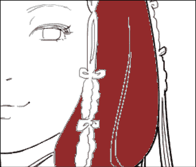

图 16.1：使用填充工具着色的图像

如果我们仔细观察黑色线条和颜色之间的区域，我们可以看到一条白色和灰色像素的细线，这些像素还没有被填充。这导致了一个未抛光的视觉效果，使用笔工具覆盖未填充的区域需要花费很多时间来清理。

每位艺术家都是独一无二的，都有自己的工作方式，但建议您充分利用图层，并使您的流程更加简便。线稿应位于一个图层上，上色应位于另一个图层上。如果您以数字方式创建墨线，这将非常容易做到，因为在图层上，您应该只有墨线，其余空间是透明的。如果您有来自扫描图像的墨线，整个图层将是完全不透明的，这意味着您无法分离墨线图层和背景颜色。您接下来需要做的就是创建一个位于墨线图层下方的新图层，然后将您的颜色放在那个图层上，如图*图 16.2*所示图层设置所示。

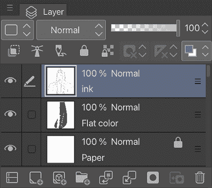

图 16.2：图层调色板

一些数字艺术初学者还会做的一件事是在他们的线条下方创建颜色图层，然后使用笔工具在新的图层上围绕每个区域的轮廓绘制，以便可以在颜色图层上填充。这也需要花费很多时间和精力，而使用 Clip Studio Paint 内置的工具和功能可以更容易、更有效地完成这项工作。

**提示**

如果您在纸上绘制墨线并将其扫描到电脑中，您仍然可以数字上色您的线条。您将想要将带有扫描线条的图层设置为**乘法**图层模式。这将使当颜色应用于下层图层时，白色区域变得透明，而黑色区域则不会通过它们显示颜色。

在我们开始填充实际颜色之前，让我们暂时谈谈参考图层。

参考图层是影响工具如何作用于其他图层的图层。此设置通过点击**图层**调色板顶部的灯塔图标来打开和关闭。在*图 16.3*中，此图标用红色圆圈突出显示。

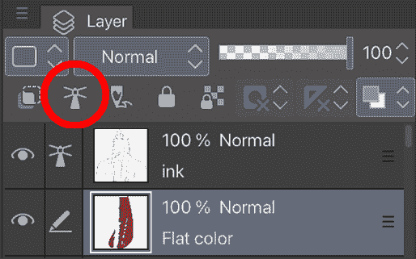

图 16.3：图层调色板上的参考图层图标

*图 16.3*显示墨线图层已被转换为参考图层。现在，即使我们转到其下方的**平面颜色**图层，任何我们设置的用于工作的工具都将被参考图层的内容所改变。

以一个例子来说明，当我们使用带有参考图层选项的笔工具时会发生什么。为了做到这一点，我们将打开带有**G-pen**选择的**子工具详情**窗口。我们在*第九章*，*材料调色板和上色特殊效果*中学习了如何这样做。然后，按照以下步骤使用笔工具的防溢出选项：

1.  在**子工具详情**调色板的菜单中点击**防溢出**选项。

1.  在**不要跨越参考图层线条**旁边的框中勾选。

1.  在除设置为参考图层的图层以外的图层上使用笔。笔只会填充在点击的线条内部。使用较粗的笔，效果会更明显。

1.  如果颜色区域周围仍有白色轮廓，请点击**区域缩放**选项旁边的框。此选项将自动扩展着色区域，使颜色略微延伸到线条艺术下方，消除白色像素。

在*图 16.4*中，我们可以看到**不要跨越参考层线条**选项的**防溢出**设置（由箭头指向），以及右侧的**图层**调色板，我们可以看到我们正在**平面颜色**层上上色。尽管线条艺术位于完全不同的层上，但我们可以使用这个简单的设置组合将颜色绑定到线条艺术边界。

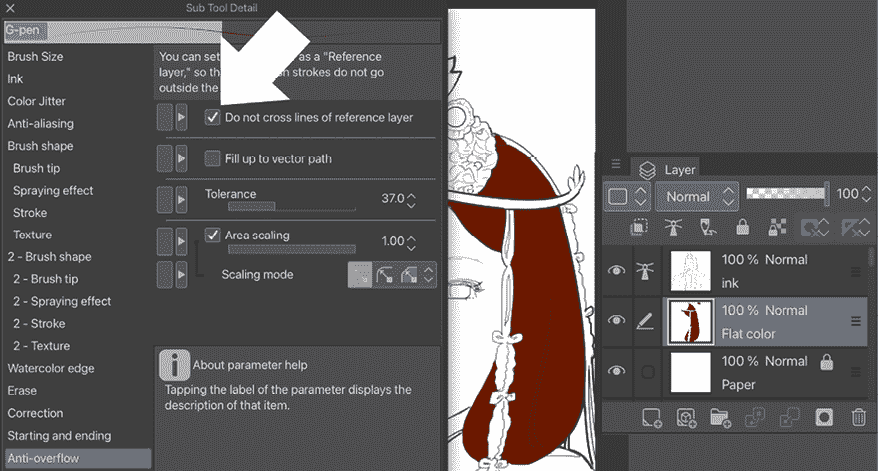

图 16.4：子工具细节和图层调色板

现在，你已经知道了使用参考层和**防溢出**设置在笔工具上开始上色的好方法。让我们在下一两节中探索制作颜色平面层的两种方法。

# 使用填充和笔工具创建平面层

在本节中，我们将使用填充工具，该工具以参考层作为其边界。*平面层*是*单色层*的简称；该层上的颜色是未进行阴影或光照处理的，因此看起来是平面的，具有二维外观。通常，艺术家在创建线条艺术层之后创建这些平面层，这意味着只需根据墨水线条艺术绘画基础颜色，然后稍后添加图案、阴影、光照和特殊效果。

要完成本节，我们需要打开一个文件，该文件包含一个图层上的线条集合，我们将该图层设置为参考层。一次只能设置一个参考层，但我们可以使用符合参考层的工具在文件中的任何其他图层上使用。

完成以下步骤以创建一个符合参考层的自定义填充工具：

1.  选择**填充**（油漆桶）工具。

1.  选择**参考其他层**子工具。

1.  在**工具属性**调色板中，找到**参考多个**选项。选择如图*图 16.5*所示的**参考层**图标为此选项。

1.  确保已勾选**区域缩放**框。

1.  这将自动扩展线条艺术下方颜色的边界，确保线条艺术到颜色的过渡平滑，没有任何多余的白色像素。你可能需要根据线条艺术的粗细调整此设置以获得最佳效果。使用橡皮擦工具清理任何进入不需要区域的溢出。

1.  如果你的墨水线条中有小缝隙，请勾选**关闭缝隙**选项旁边的框。这将自动关闭小缝隙，防止颜色流入其他区域。根据参考层线条中的缝隙大小，你可能需要调整滑块以获得最佳效果。设置如图*图 16.5*所示。

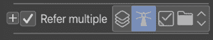

图 16.5：**参考多个**设置截图

1.  使用**填充**工具，点击绘图区域以应用该绘图所需的颜色。在*图 16.6*中，头发、皮肤、眼睛和衣服的颜色已经添加到角色上，但还有一些小白色区域被填充工具遗漏了，因为这些区域太小。

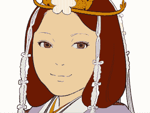

图 16.6：使用填充工具着色的图像

1.  使用笔或刷工具填充任何其他散乱的区域或添加细节，例如头发装饰或任何需要特别注意的区域。

    **提示**

    许多数字艺术初学者询问他们在创作作品时应该使用多少层。就像艺术中的几乎所有事情一样，这完全取决于艺术家。虽然你可以把所有东西都放在一个图层上，但建议将线条艺术和颜色图层分开，这样就可以在不改变线条艺术的情况下更改颜色，并且着色和特殊效果会更容易。一些艺术家将所有平面颜色放在一个图层上，然后有一个图层用于阴影，另一个图层用于高光。一些艺术家为作品中使用的每个颜色都设置了一个单独的图层。这取决于你作为艺术家如何工作，有时这也取决于你电脑的配置！内存和硬盘空间较少的电脑无法处理包含许多图层的文件，所以请记住这一点。

现在已经使用填充和笔工具完成了平面着色，我们可以使用自动选择（魔棒）工具从**平面**图层中选择平面颜色，然后在另一个图层上使用你选择的刷子添加阴影和高光。阴影是我们用来在我们的艺术作品中添加较暗的颜色以创建阴影的词，然后艺术作品将看起来三维，能够表现出一天中的时间，并描绘出一种情绪。高光是为了添加较浅的颜色，在闪亮的眼睛、头发、机械、工具、武器、星星和湿物体上创建发光效果。这两个过程都非常有乐趣和创造性。

你还可以将颜色和渐变添加到你的黑色线条艺术中，这在你想创建线条绘制看起来自然与彩色区域和谐融合的艺术时非常有用。继续阅读以了解如何操作。

# 创建彩色线条艺术

当你用实心黑色线条绘制黑白艺术作品时，这是可以的，但一旦开始着色图像，你不认为黑色线条的颜色对眼睛来说可能太刺眼了吗？在本节中，我们将探讨如何更改线条艺术颜色。

彩色线条艺术或颜色保留可以用于各种效果。它可以突出一个区域，使其与着色更好地融合，或者使背景元素远离，让前景成为焦点。彩色线条艺术可以通过不包含刺眼的黑色线条使图像看起来更加柔和。这是一个非常容易使用的技巧，可以真正为插图增添活力。

要遵循本节中的步骤，你需要在一个透明图层上完成的线条艺术，如图*图 16.7*所示。

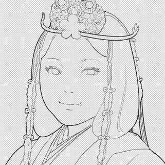

图 16.7：线条绘图

上一张图像是从纸上扫描的墨水绘图，使用 Clip Studio Paint 自动去除白色。您可以通过在 Clip Studio Paint 中打开扫描图像来完成此操作。如果需要，调整亮度和对比度以使墨水线条从纸张颜色中突出显示。这将使转换更加干净。完成此操作后，在**文件**菜单中，点击**编辑**然后**转换亮度为不透明度**。Clip Studio Paint 将使最亮的部分变为透明，最暗的部分变为不透明。

让我们按照以下步骤给线条绘图添加颜色：

1.  在**图层**调色板上，点击带有墨水线条的图层以选择它。

1.  点击位于图层列表上方的**锁定透明像素**图标，此图标在*图 16.8*中被圈出。

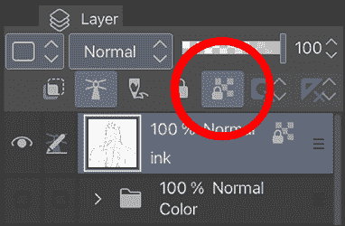

图 16.8：锁定透明像素图标

1.  选择您首选的笔或刷工具。

1.  选择您希望将线条艺术更改为的颜色。

1.  使用笔或刷在墨水线条上更改颜色，从黑色更改为当前颜色。

1.  要同时更改所有线条，选择要更改线条艺术颜色的颜色，然后点击 Clip Studio Paint 界面顶部的命令栏中的**填充**图标。这将同时填充所有线条。

当我们锁定绘图中的透明像素时，我们防止 Clip Studio 更改该层中不透明的像素。在这种情况下，所有墨水线条都是不透明的，因此我们只能更改它们的颜色。在*图 16.9*中，横跨线条艺术的粉红色涂鸦是随意画的，但它只显示在填充的线条上。

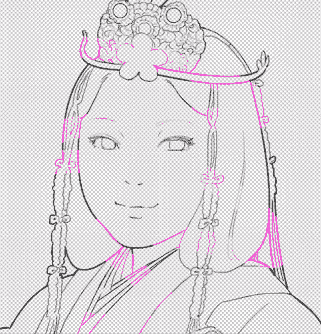

图 16.9：改变线条颜色

这种技术允许我们使用笔、刷甚至渐变工具来着色我们的线条。当您从漫画页面上的新设计商品中获取时，使用这种方法很有趣。*图 16.10*中的绘图在线条层上应用了**彩虹**渐变。

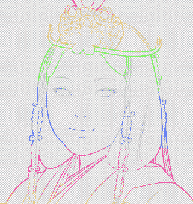

图 16.10：彩虹线条颜色

颜色也可以更加微妙，使线条工作不那么“直白”，如在*图 16.11*的头发内部以及面部和嘴唇上。

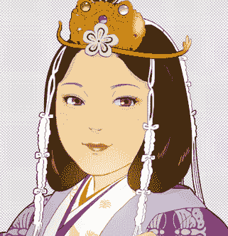

图 16.11：改变线条颜色的图像

让我们看看*图 16.12*中改变伞上线条颜色的另一个例子。

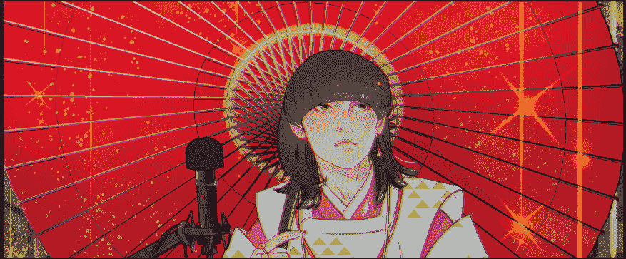

图 16.12：改变线条颜色的图像 2

您可以使用喷枪工具更改雨伞肋条的线条颜色以表达阴影。

**提示**

当然，您可以将相同的方法应用于单色图层以立即将其颜色更改为所需的颜色！但要做到这一点，您需要将每个颜色区域作为一个单独的图层。这完全取决于您设备的 RAM 限制。作为指导，8 GB 是足够的，16 GB 非常实用。32 GB 将安全地在单个图像中处理 30 个或更多的图层，甚至可以同时打开多个页面。

如果可能的话，拥有一个平坦的肤色、发色和服装颜色在不同的图层中总是很有用，然后使用图层蒙版或剪切图层来处理每个部分。有关图层蒙版或剪切图层的更多信息，请参阅*第十二章*，*制作图层蒙版和屏幕色调*。现在，你不仅对填充区域和阴影或光照效果有完全的颜色控制，而且对线条艺术也是如此！

当你完成你的艺术作品的平坦上色后，为什么不通过添加阴影和高光来增加更多的三维效果呢？图层混合模式是添加阴影和高光非常有用的功能，我们将在下一节中探讨。

# 探索图层混合模式

图层混合模式是彩色图层改变与其他图层混合颜色的功能。你可以通过与其他图层混合使颜色变暗，或变亮，或反转色调。当你想要给你的平坦色彩艺术作品添加阴影、光照、光反射和色彩增强时，图层混合模式会很有用，因为你可以在不隐藏或破坏平坦色彩艺术作品的情况下添加这些效果！我们将探讨图层混合模式是什么，以及如何通过示例使用它们。

在**图层**调色板顶部有一个下拉菜单，用于控制我们的图层混合模式。*图 16.13*显示了**图层**调色板以及我们可以用于我们的艺术的可用混合模式。

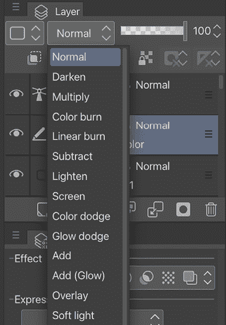

图 16.13：图层混合模式下拉菜单

有许多图层混合模式，每种模式都可以给我们带来不同的效果。然而，在本节中，我们将集中讨论**乘法**、**柔光**和**屏幕**图层混合模式。尽管如此，当然，你可能发现其他模式更适合你的风格。让我们看看我们列出的三种模式，看看我们如何使用它们来给我们的图像上色。

## 乘法模式

**乘法**模式是数字艺术家最常使用的模式。这是因为它使图层的白色区域“透明”，但保持黑色区域不透明。这使得它非常适合像扫描墨水图像这样的东西。通过将扫描图像设置为**乘法**，可以在线条艺术下方应用数字颜色，以完成插图。**乘法**模式还将颜色与下面的颜色结合，使颜色变暗。这使得**乘法**模式非常适合阴影图层。

如我们在*使用填充和笔工具创建平面*部分之前讨论的那样，阴影是一项非常棒的技能。与观察绘画相比，漫画绘画通常阴影非常有限，但同时也非常具有策略性。一个明显的添加阴影的地方是在脸部下方，这立刻提升了脸部的颜色，使其突出；此外，我们还可以让观众知道角色的头部是一个三维物体。其他阴影位置将在眼睑、鼻子、身体和一些明显位于更大物体下方的部分。在*图 16.14*中，从左到右，你可以看到单色艺术品、阴影部分和阴影艺术品。

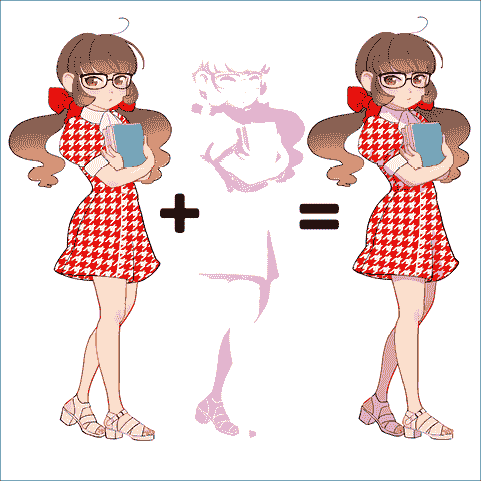

图 16.14：带有和没有阴影的三个图像

中间的图像显示了阴影的确切位置：在发丝、头部、手臂和她的左腿下方。它们有限但有效。我们将这个阴影区域的图层转换为**乘法**混合图层模式，并将其放置在单色图层之上。在结果中，即*图 16.14*右边的图像，我们可以看到角色绘制在颜色和维度上都有更多的深度。

深紫色是一个非常受欢迎的阴影颜色。在*图 16.15*中，紫色图层设置为**正常**混合模式，并且与下面的单色颜色没有混合。

图 16.15：带有浅紫色阴影的图像

现在，我们将使浅紫色颜色与**图层**调板下方的单色颜色交互并混合，通过改变图层混合模式到**乘法**来创建新的颜色和阴影。*图 16.16*是添加了浅紫色颜色的**乘法**混合模式图层后的艺术品。

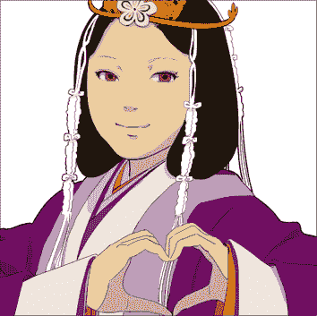

图 16.16：带有乘法阴影的图像

我们可以通过调整**乘法**模式阴影层的**不透明度**来控制基色与阴影之间的对比度。这是通过调整**混合模式**下拉菜单右侧的滑块来完成的。前面的截图已经将阴影层降低到**90**%，使得阴影变得不那么强烈。

建立多个阴影层可以提供更大的对比度和更深的阴影。我通常使用三个不同的**乘法**图层来处理阴影：一个用于标记光方向的较大阴影区域，例如日落、烛光或树叶阴影之间的光线。另一个是用于所有物体或角色身体，仅使用深橙色**渐变**工具创建更深的阴影，底部较暗，主要用于与背景区分。最后一个用于点阴影，例如*图 16.16*。

让我们看看如何使用**柔光**图层混合模式以微妙的方式添加颜色或光效。

## 柔光模式

**柔光**模式是在你想要非常柔和地添加颜色时最好的模式，例如创建红润的面颊或发色的渐变。首先，你可以使用**自动选择**魔法棒工具选择你想要添加颜色的区域，然后点击你想要选择的彩色区域。

然后，你只能在选择边界内添加颜色，新颜色不能覆盖旧颜色。*图 16.17*中的图像显示了使用**柔光**混合模式，仅在对选定的肤色区域使用**柔光**喷枪工具添加粉色。

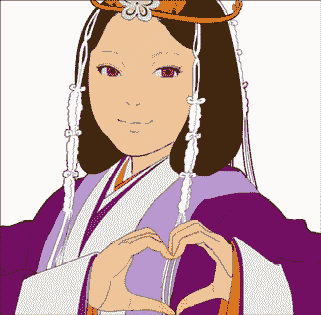

图 16.17：在面颊上使用柔光模式

这种效果非常柔和，你可以通过控制使用**柔光喷枪**工具添加的颜色量来很好地控制你想要添加的颜色密度。如果我们需要更柔和的效果，我们总是可以更改图层的**不透明度**。**柔光**模式也用于用亮色标记光区，以及用冷色调标记阴影区。除了面颊外，由于血液循环，它非常适合在关节（耳朵、肘部、膝盖等）上添加红色调。继续阅读以了解如何使用**屏幕**图层混合模式添加光照效果。

## 屏幕模式

**屏幕**模式对于创建生动的亮光非常有用。你甚至可以使用你可能不会想到用于亮光的颜色，在你的插图或漫画场景中创造出特定的氛围。在*图 16.18*中，高光层被设置为**正常**模式，以显示我们在这个图层上使用的是湖蓝色。

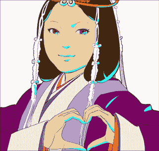

图 16.18：带有高光的图像

通过使用**图层**调板上的下拉菜单，我们可以将高光层设置为**屏幕**模式。使用这种混合模式，我们现在得到了*图 16.19*中显示的亮光。

图 16.19：使用屏幕模式带有高光的图像

现在，面部上的高光不再是湖蓝色，而是接近白色的浅色，而衣服上的高光仍然保留了湖蓝色的色调。这种模式产生的效果与**正片叠底**模式正好相反——**屏幕**模式使下层图层的颜色变亮，而**正片叠底**模式使它们变暗。

我们已经学习了如何使用**正片叠底**模式添加阴影，使用**柔光**模式添加红润的面颊，最后使用**屏幕**模式添加亮光效果。这些只是我们可用的许多混合模式中的三种。通过以不同的方式组合图层模式和透明度，我们可以创造出许多不同的效果。实验是关键，因为每位艺术家都是不同的，喜欢用他们的艺术创造出特定的外观。更改图层模式不会损坏原始图层，所以可以在你的艺术作品中尝试不同的图层模式，看看你可以用它们和不同的颜色创造出什么样的外观，以及如何在你的艺术作品中添加阴影和亮光。

考虑到图层混合模式，有一个节省大量时间的功能——阴影助手。

# 使用阴影助手进行阴影处理

自己添加阴影完全没问题，但有时使用专门用于在图片上生成阴影的特殊功能很有用，尤其是在你需要在一个有限的时间尺度内绘制大量字符时。当然，使用**阴影助手**只能通过建议不同的阴影方式和将特定阴影应用于不同的艺术品来帮助我们，但它不能替代我们自己的独特阴影：完美地表达艺术的环境和氛围。然而，它仍然是一个有趣且有用的工具。

让我们尝试使用它，看看我们的艺术作品将如何着色！请按照以下步骤操作：

1.  创建一个分为线条图层、单色图层和纸张色层的艺术品。

1.  将线条图层设置为参考图层，正如我们在*使用参考图层*部分所学。

1.  创建一个包含所有单色层的图层文件夹，如图*图 16.20*所示。

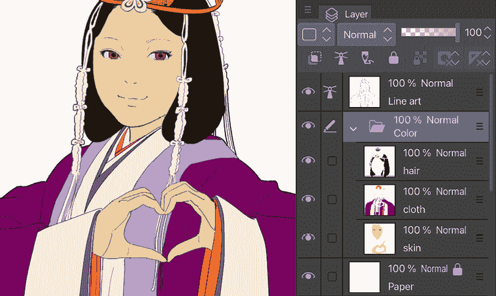

图 16.20：示例艺术作品（左），图层调板（右）

如果你不确定如何创建图层文件夹并向其中添加图层，请遵循*第三章*中*与图层一起工作*部分的步骤。

1.  在**图层**调板中选择**颜色**文件夹，在**文件**菜单中点击**编辑**，然后从下拉菜单中选择**阴影助手…**，如图*图 16.21*所示。

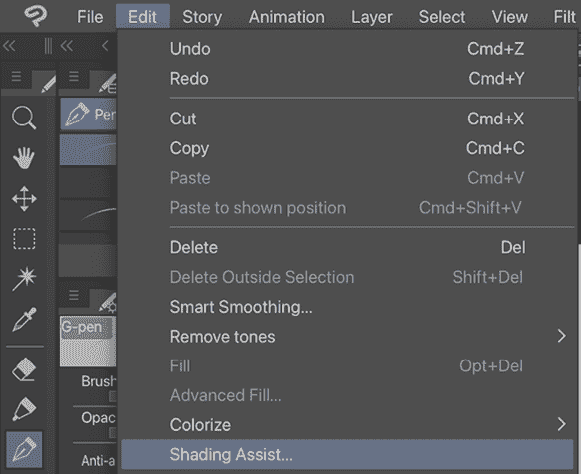

图 16.21：编辑下拉菜单

1.  选择**阴影助手…**将弹出一个对话框。正如我们在*使用参考图层*部分所学，将线条图层设置为参考图层，并勾选**参考图层上的线条**复选框，如图*图 16.22*中箭头所指。

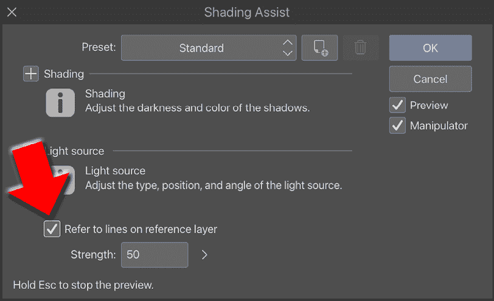

图 16.22：阴影助手对话框窗口

1.  通过从**预设**下拉菜单中选择不同的预设阴影，你可以在你的艺术作品上看到相应的阴影预览。下拉菜单和相应的阴影如图*图 16.23*和*16.24*所示。

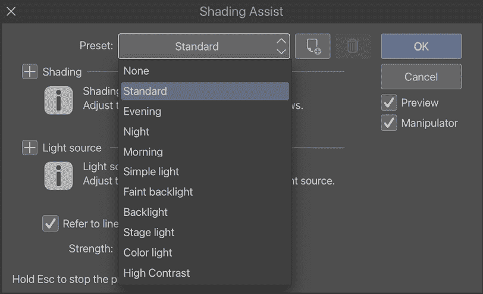

图 16.23：预设阴影菜单

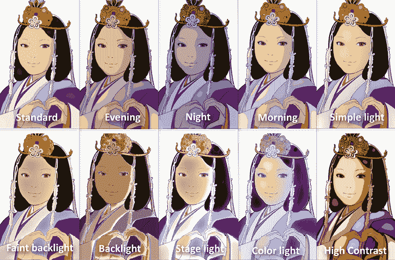

图 16.24：不同的预设阴影预览

1.  如我们所见，有各种阴影方式。然而，我们仍然需要我们的阴影技巧，因为其中一些并不完全有效。我们可以使用这些结果来学习在特定光照下选择什么色调进行着色，例如情绪化的**傍晚**阴影。

1.  在画布上，移动蓝色圆形形状和圆形控制器来调整光的位置、大小和强度。我们将在本节后面看到如何控制光源。当前选中的控制器颜色会变为橙色，如图 16.25 所示。

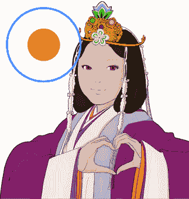

图 16.25：画布上的光照控制器

一旦将光照设置调整为所需的效果，点击对话框中的**确定**按钮，在**图层**调板中创建一个阴影层，如图 16.26 所示。

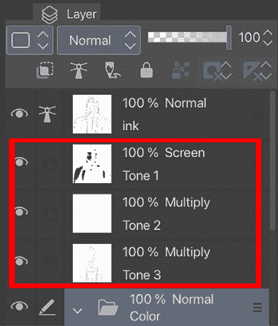

图 16.26：图层调板中的新图层

完成了！现在看看你的着色艺术品；这不是很快而且很容易吗？

你当然可以按照自己的意愿擦除或添加阴影进行编辑。

你知道我们可以自定义阴影和光照设置吗？

它们都在**阴影辅助**对话框窗口中；让我们首先从**阴影**设置开始。当你点击对话框中**阴影**旁边的**+**图标时，会打开如图 16.27 所示的菜单。

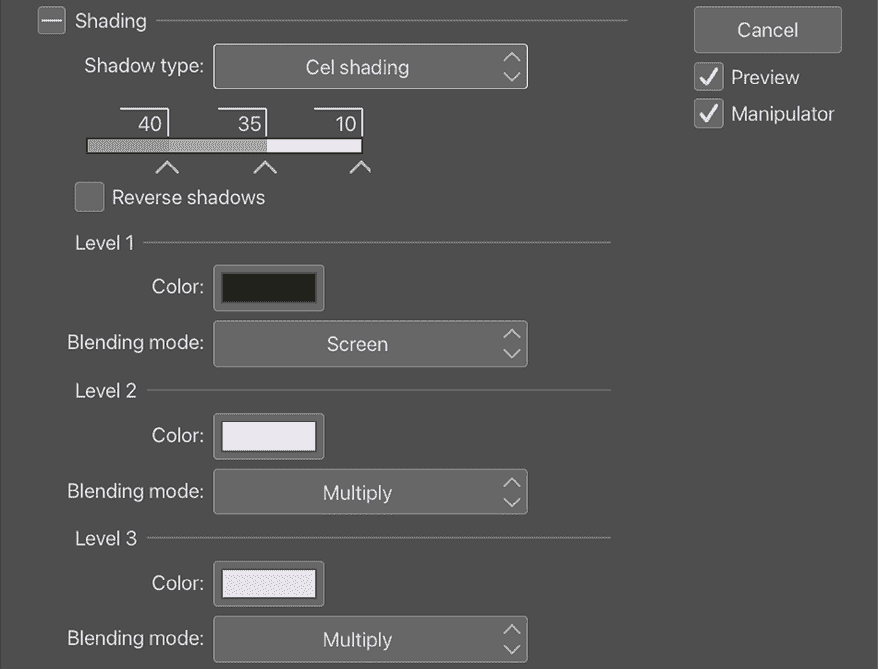

图 16.27：Cel 阴影的阴影辅助对话框

看起来有很多要学习的东西吗？实际上非常简单！以下分解将给你一个很好的了解它们是什么：

+   **阴影类型**: 这提供了两种阴影类型——**平滑阴影**，它会在阴影和非阴影区域之间创建平滑的混合过渡，以及**Cel 阴影**，它会在阴影和非阴影区域之间创建明显的边界；它可以生成多达四个阴影和亮部。

+   **阴影条**: 当在**阴影类型**中选择**Cel 阴影**时，会显示阴影条，你可以拖动箭头左右调整阴影范围。

+   **反转阴影**: 当此选项开启时，画布上应用的阴影和亮部会被反转。

+   **级别 1 颜色**: 这设置阴影的颜色。

+   **混合模式**: 这设置生成图层的混合模式。

当**阴影类型**设置为**平滑阴影**时，你会看到不同的设置，如图 16.28 所示。

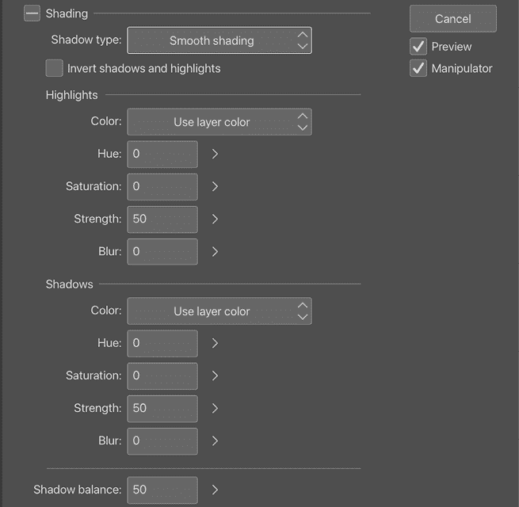

图 16.28：平滑阴影的阴影辅助对话框

有很多条，每个设置的分解如下：

+   **反转阴影和亮部**: 当此选项开启时，它会交换图像中的阴影区域和亮部区域。

+   **高光颜色**: 您可以选择**使用图层颜色**或**使用基础颜色**。当选择**使用图层颜色**时，所选图层用作基础颜色，高光和阴影根据它生成。当选择**使用基础颜色**时，您可以为新基础颜色选择一种新颜色，并可以设置**混合模式**、**强度**、**模糊级别**和**阴影平衡**。

+   **色调**: 这指定了相对于基础颜色的色调变化量，使得高光更亮，阴影更暗。

+   **饱和度**: 这指定了相对于基础颜色的饱和度变化量，使得高光更亮，阴影更暗。

+   **强度**: 这决定了高光和阴影的强度。

+   **模糊**: 值越大，高光和阴影的混合就越平滑。

+   **阴影平衡**: 这设置相对于生成的总阴影的阴影百分比。越接近 100，阴影区域就越大。

现在，你已经成为了**阴影设置**的大师！让我们继续到**光源设置**，您可以在*图 16.29*中看到。

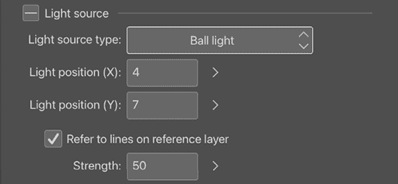

图 16.29：光源设置

与**阴影设置**相比，**光源设置**要紧凑得多。让我们仔细看看它们：

+   **光源类型**: 提供两种不同的光源类型。**球光**类型放置一个可以在画布上的任何位置移动的光源。

方向光类型将光应用于整个画布，以相同的角度和强度，以生成您选择角度的阴影。

+   **光源位置（X）**和**（Y）**: 当光源类型设置为**球光**时启用。这些设置光源在画布上的位置，相对于宽度和高度。您可以设置从-100 到 100 的任何值；当**X**和**Y**都设置为**50**时，**球光**位置位于画布的中间。如果我们想要直接在上方，尝试将**X**设置为**50**，**Y**设置为**0**，或者直接在下方，尝试将**X**设置为**50**，**Y**设置为**100**。当光源类型设置为**方向光**时，您可以设置**光角度**的值。

+   **参考图层上的线条**: 当开启时，这会参考参考图层上的线条来生成阴影。当关闭时，仅使用颜色图层上的信息生成阴影。

+   **强度**: 当**参考图层上的线条**被开启时启用。这设置了线条艺术影响阴影的强度。值越高，沿线条艺术生成阴影的可能性就越大。

太好了，你现在可以控制**阴影辅助**设置了！我相信你想要将刚刚调整的设置保存到**预设**阴影中。按照以下步骤学习如何保存和删除它：

1.  点击**预设**下拉菜单旁边的**创建预设**按钮来注册预设，这在*图 16.30*中以红色圆圈标注。

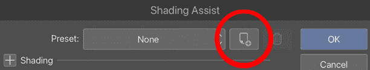图 16.30：创建预设按钮

1.  当**创建预设**对话框弹出时，输入一个名称并保存。要删除你创建的预设，选择你保存的预设并点击图 16.31 中圈出的垃圾桶按钮图标。

图 16.31：删除预设按钮

这是一种多么出色的阴影和突出显示图像的方法。你可能会偶然发现它们的出色协调！

你已经完成了勾画、上色、改变你的线条艺术和给你的艺术作品上阴影。现在，你有没有兴趣通过使用颜色匹配和过滤器来探索你刚刚完成的艺术作品的完整新色调？继续阅读以了解如何操作。

# 使用颜色匹配选项和过滤器

颜色匹配和过滤器是探索改变艺术作品最终效果的新可能性的有趣工具。这对于游戏艺术特别有帮助，尤其是在我们与许多艺术家一起工作时，使用来自不同艺术家的艺术作品，但仍希望游戏视觉保持一致性。例如，每当故事情节发生惊险转折时，所有角色都会获得相同的颜色匹配选项和过滤器，如果我们在整个游戏中保持这种设置，那么游戏中的色调将保持一致。这也帮助你尝试你普通选择的色彩组合或纹理上的不同颜色。这可能是一个跳出舒适区的好机会。

在本节中，我们将首先查看颜色匹配选项，然后了解如何使用它们，并学习过滤器是什么以及如何将它们应用到你的艺术作品中。继续阅读以探索你艺术作品最终效果中的不同色调和纹理。

## 颜色匹配选项

当你对色彩平衡不确定时，颜色匹配选项非常有用。是的，你可以通过匹配导入的图像或渐变的颜色来对你的艺术作品进行大幅度的色彩改变。

让我们通过以下步骤来了解如何使用它。

首先，你需要创建一个包含你想要应用颜色匹配的所有材料的图层，通过创建图层文件夹并选择**合并所选图层**来实现。你可以参考*第三章，铅笔：图层和图层属性面板*中的*处理图层*部分来了解如何操作。

在**文件**菜单中，点击**编辑** | **色调校正** | **颜色匹配…**，如图*图 16.32*所示。

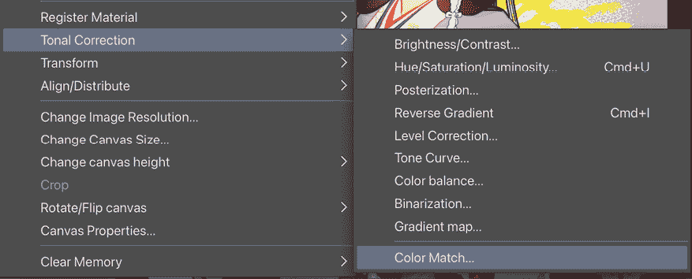

图 16.32：色调校正菜单

这将弹出一个颜色匹配对话框窗口。通过点击图像缩略图，你可以看到你的艺术作品相应地改变颜色，如*图 16.33*所示。当你禁用**保持亮度**时，你可以完全改变颜色。

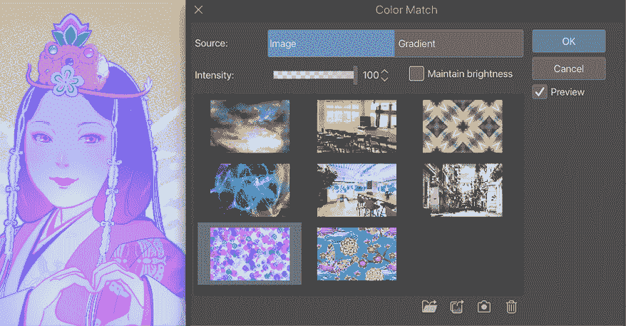

图 16.33：颜色匹配图像对话框窗口

使用前面屏幕截图中对话框中的**强度**滑块来控制颜色调整的强度。你还可以通过点击窗口底部右侧的三个图标之一来导入你的图像：从你的文件夹、从你的相册或拍照（这只能在平板电脑和手机上完成）。或者，通过点击底部的垃圾桶图标从画廊中删除图像。

如果你更喜欢使用**梯度**选项，点击**梯度**，对话框就会改变，如图*图 16.34*所示。

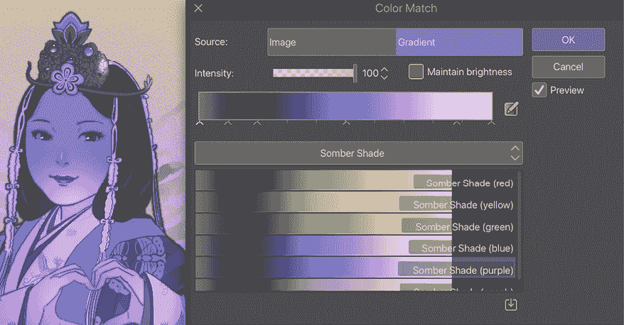

图 16.34：颜色匹配梯度对话框窗口

通过点击默认的**暗色调**梯度集，你可以从下拉菜单中选择任何默认梯度集，从**暗色调**、**天空**、**效果**和**工具（只读）**中选择。你可以在**Clip Studio Assets**中找到更多梯度，你可以在*第十八章，探索 Clip Studio Assets 和动画*中学习如何访问它们。然后，通过点击窗口底部的带有方形图标的向下箭头导入下载的梯度集。

一旦你选择了最合适的梯度，如果你想调整它，可以通过顶部调整栏滑动下方的细小箭头来调整。

当你对结果满意时，点击**确定**以关闭窗口。

**提示**

当然，你也可以将颜色匹配选项应用到你的灰度艺术作品中！只需用灰度绘制你的艺术作品，使用**颜色匹配梯度**选项，看看会发生什么。你可能会发现一种快速上色的绝妙方法！

干得好，通过使用颜色匹配选项，你竟然能以如此巧妙的方式改变你绘画的整体氛围！

## 过滤器

Clip Studio Paint 拥有大量过滤器，一旦你知道它们，就会非常有用！只需在**文件**菜单上点击**过滤器**，你将看到如图*图 16.35*所示的过滤器列表。

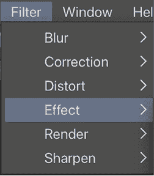

图 16.35：过滤器菜单

在前面的屏幕截图中看到的选项在这里解释：

+   **模糊**：这包含用于模糊图像的过滤器。通过玩不同的模糊过滤器，可以为我们的插图带来摄影效果和深度。完成绘画后，只对需要模糊的部分图层应用**模糊**过滤器。*图 16.36*显示了带有模糊的前景（顶部）、角色部分（左下角）和背景（右下角）的样本。

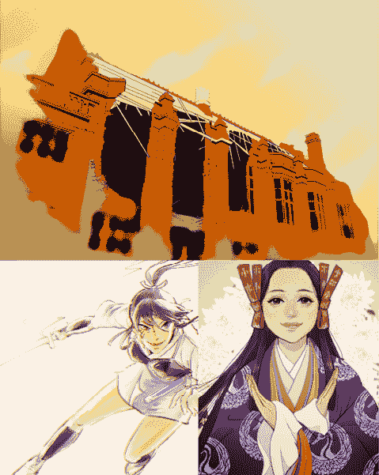

图 16.36：带有模糊滤镜的三个样本图像

+   **更正**：这包含调整线宽和去除灰尘的过滤器。

+   **扭曲**：这包含用于以任何你喜欢的样式扭曲图像的过滤器。

+   **效果**：这包含用于提供更多艺术特殊效果的过滤器。

+   **渲染**：这包含用于提供 Perlin 噪声的过滤器。

+   **锐化**：这包含用于锐化图像的过滤器。

我们特别关注两个惊人的滤镜：**色差**滤镜和**噪点**滤镜在**效果**滤镜中，因为它们将以非常有趣的方式在艺术作品中给你带来不完美但怀旧的视觉效果。让我们深入了解**效果**滤镜的奇妙用法！按照以下步骤操作：

1.  首先，通过将多个图层合并成一个（别忘了在合并之前复制它们）来创建一个包含你想要添加滤镜的材料的光栅层。

1.  前往**文件**菜单，然后点击**滤镜** | **效果** | **色差**来打开**色差**对话框，如图*图 16.37*所示。

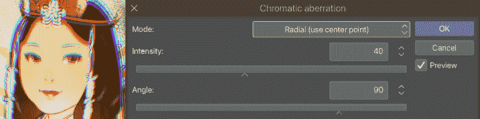

图 16.37：色差对话框

1.  通过点击前面截图顶部的**模式**下拉菜单，选择你想要应用的**色差**方式，是**径向（使用中心点）**还是**横向（使用角度）**。你可以看到应用效果的方式是如何变化的。

1.  通过滑动**强度**条来调整效果的强度。

1.  通过滑动**角度**条来调整效果的方向。

1.  一旦你喜欢了效果的结果，点击**确定**来关闭对话框窗口。

你是否看到了应用了色差效果的美术之美？颜色现在被分为红色、绿色和蓝色。然后，每种颜色的图像都稍微偏移了位置，所以你现在可以看到图像看起来像旧印刷品，颜色没有完美重叠。这给图像带来了一种怀旧的美感。让我们再享受另一个精彩的滤镜：**噪点**。

**噪点**滤镜会给你带来类似怀旧的感觉。它模拟了带有纹理不完美的旧杂志图像。按照以下步骤使用**噪点**滤镜：

1.  创建一个包含所有材料的栅格层，这是在前面指导中的*步骤 1*中完成的。

1.  前往**文件**菜单，然后点击**滤镜** | **效果** | **噪点**来打开**噪点**对话框，如图*图 16.38*所示。

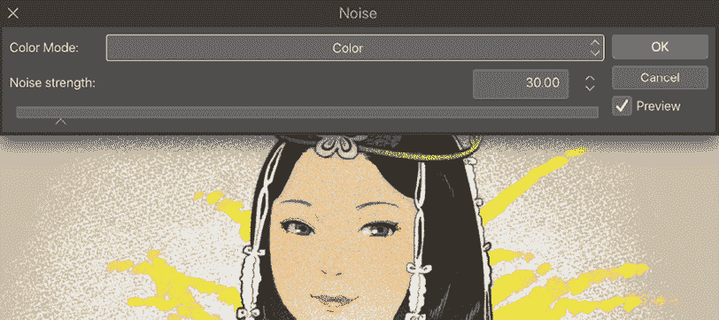

图 16.38：噪点对话框

1.  从对话框顶部的下拉菜单中选择一个**颜色模式**选项，可以是**彩色**或**灰度**。在**彩色**模式下，噪点将在 RGB 色调中应用，而在**灰度**模式下则应用黑白。

1.  通过滑动**噪点强度**条或在框中输入数字来增加或减少噪点粒子。

1.  一旦你喜欢了**噪点**效果的应用，点击**确定**来关闭对话框窗口。

现在，你可能会对噪点纹理如何改变整个图像印象感到非常印象深刻！是的，图像现在具有一种巧妙印刷在纸张上的感觉。当然，我们可以在一张图像上应用多个滤镜；继续实验，享受乐趣！

接下来，我们将在我们的艺术作品中添加一个美丽的纸张纹理；继续阅读以了解更多信息。

# 添加纸张纹理

当然，在数字绘画中不存在真正的纸张纹理，因为它们不是在物理纸张上绘制的，但我们可以将其作为艺术作品的最终修饰添加。我们可以在一定程度上使用铅笔或水彩工具在数字绘画上表达纸张纹理的感觉，但通过使用纹理材料和图层混合模式，将其添加到整个页面更容易。

按照以下步骤将粗糙纸张纹理添加到你的艺术作品中：

1.  打开带有艺术作品的画布，转到**文件**菜单，点击**窗口**|**材质**，然后从**材质**下拉菜单中选择**材质[单色图案]**，如图*图 16.39*所示。

图 16.39：材质下拉菜单

1.  现在材质调色板已打开，显示了一系列单色图案材质的缩略图。向下滚动列表，直到找到**粗糙纹理**并点击它。

1.  选择材质后，点击材质调色板底部的**将材质粘贴到画布**图标，如图*图 16.40*所示。

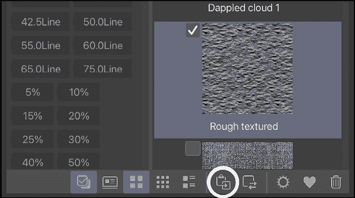

图 16.40：材质调色板

现在已经粘贴了**粗糙纹理**的纹理，我们可以看到画布上我们的艺术作品上方的图案。带有纹理的新图层现在在**图层**调色板中，如图*图 16.41*所示。

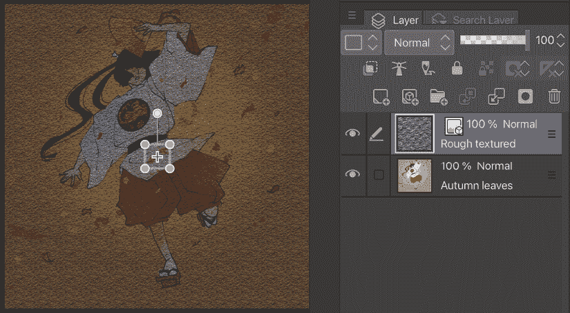

图 16.41：画布（左），图层调色板（右）

1.  画布中间带有正方形的把手用于通过点击和拖动来改变图案的角度和大小。当你使用把手编辑完图案后，点击**图层混合模式**菜单，在**图层**调色板顶部，然后从下拉菜单中选择**叠加**，如图*图 16.42*所示。

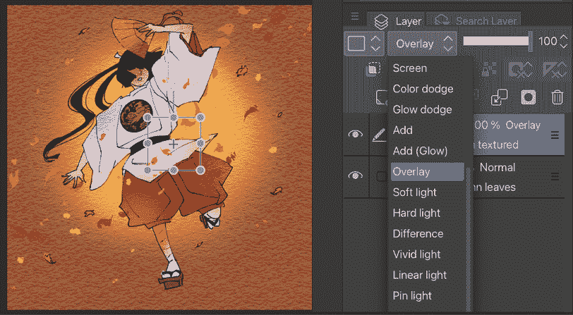

图 16.42：画布（左），带有下拉菜单的图层调色板（右）

1.  最后，通过移动**图层**调色板顶部的**不透明度**滑块来更改纹理图层的不透明度。在这个步骤中，将其更改为**45**%，如图*图 16.43*所示。

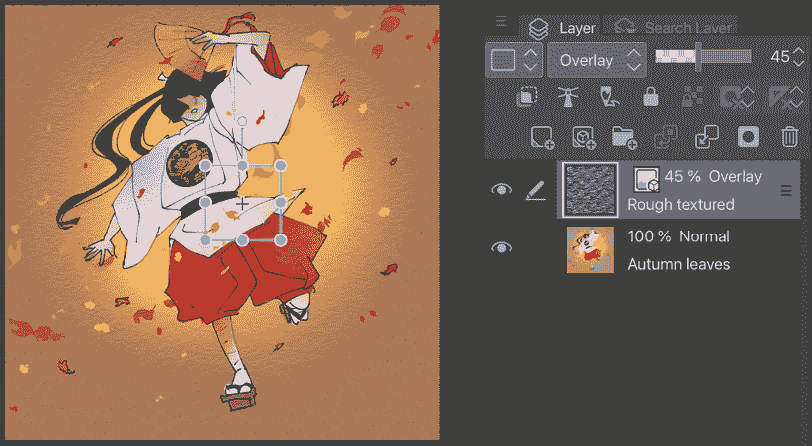

图 16.43：画布（左），带有 45%纹理透明度的图层调色板（右）

完成了！你的图像现在有了粗糙纸张纹理！

如果你查看**材质**调色板中的**纹理**类别，你会找到许多可用的纹理，而且你还可以从资产中下载新的！你可以尝试大量的纹理，并找到你最喜欢的添加到你的艺术作品中，使其真正独特！

# 流体工具调整

这不是一个上色工具，但在完成上色后，我们可能需要它来作最后的修饰。液化工具可以通过我们笔刷的运动来以任何我们想要的方式扭曲我们的艺术作品。所以，假设我们对角色绘画中的面部或身体平衡不满意；我们可以使用液化工具来修正这些不足！

按照以下步骤来润色你的完成作品：

1.  选择所有图层，转到**文件**菜单，然后点击**图层** | **创建文件夹并插入图层**。复制你刚刚创建的**图层**文件，转到**文件**菜单，然后点击**图层** | **合并** **所选图层**。

1.  从工具栏中选择**混合**工具，并在子工具栏中选择**液化**。在工具属性栏中，将**画笔大小**设置为`30`并选择**推**模式。

1.  点击并滑动你需要修改的任何艺术作品部分，就像*图 16.44*中显示的液化工具校正前后的对比。

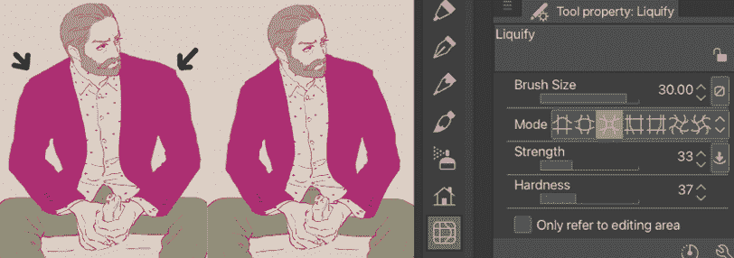

图 16.44：液化校正前后的对比

现在，你的艺术作品已经拥有了更好的面部平衡和身体比例！

# 摘要

在本章中，我们开始为我们的图像上色。我们首先讨论了参考图层以及我们如何使用它们通过防溢画笔和填充工具使我们的上色平面更容易。然后，我们探讨了如何更改线稿颜色，并查看 Clip Studio Paint 中可用的许多混合模式，这些模式可以帮助我们着色和突出图像。我们还学习了如何使用着色助手进行着色，使用颜色匹配选项更改完成的上色作品的色调，并探索了添加**色差**滤镜和**噪点**滤镜。我们还探索了在我们的艺术作品中添加纸张纹理。最后，我们学习了如何使用液化工具来润色完成的艺术作品。你可以将这些新的上色技巧应用到数字绘制的和扫描的漫画图像上，以获得更加精致和专业的效果。

在下一章中，我们将开始讨论自动操作。自动操作是可以在创建数字艺术时帮助你节省大量时间和精力的工具。继续阅读以了解如何使用它们！

# 加入我们的 Discord 社群！

与其他用户一起阅读这本书。提出问题，为其他读者提供解决方案，等等。

扫描二维码或访问链接加入社群。

[`packt.link/clipstudiopaint`](https://packt.link/clipstudiopaint)

