# 第十七章：自动操作与您的流程

自动操作是数字艺术的惊人功能。它们可以简化您的流程，并在创建绘画时节省您的时间和精力。什么是自动操作？自动操作是一系列可以回放的记录步骤，可以自动化任务或任务集，并通过按按钮来完成。

哪些任务可以制作成自动操作？**场景 1**：我们有一个空白漫画页面，要开始在上面创作艺术，我们需要一个分镜图层文件夹（我们可以在之后划分分镜），一个名为*Sketch*的草图图层，一个名为*Ink*或*Line art*的墨水图层，名为*Background 1*和*Background 2*的背景图层，用于添加阴影的灰度图层名为*Gray 1*和*Gray 2*，一个高光图层名为*Highlight*，以及一个音效图层名为*SE*。自动操作可以在一键中完成所有这些。**场景 2**：我们有一个空白画布，我们想在上面创建一个彩色角色插画。我们需要一个名为*Sketch*的草图图层，一个名为*Ink*的墨水图层，一个名为*Skin*的肤色图层，一个带有对下方肤色图层剪切蒙版的名为*Skin 2*的肤色细节图层，以及更多……同样，自动操作也可以一键完成所有这些。不仅如此，它几乎可以做你梦想中的任何事情！

在本章中，我们将涵盖以下主题：

+   探索自动操作面板

+   使用自动操作

+   创建自定义自动操作

+   下载自动操作资产

+   自动操作快捷键

我们将探讨自动操作是什么，以及如何将其应用到您的流程中。我们将学习如何创建新的自动操作集，下载自动操作资产，然后以两种不同的方式创建自动操作快捷键。

到本章结束时，您将通过创建和使用自动操作来加速常用操作集的速度，从而节省大量时间。让 Clip Studio Paint 自动执行重复性操作！这无疑会使创作长篇漫画或漫画系列变得更加轻松。

让我们开始吧！

# 技术要求

要开始使用，您需要在您的设备上安装 Clip Studio Paint，并打开一个新的画布，包含任何线条图层和一个白色纸张图层。任何尺寸都可以，但我建议创建一个 300 dpi 的方形画布，以便浏览本章内容。

# 探索自动操作面板

让我们先看看**自动操作**面板及其包含的内容。

当你创建数字绘画时，是否有特定的流程，比如总是为角色的服装颜色图层添加剪切蒙版，或者总是复制一个线条图层，然后对其添加模糊效果？如果你能让 Clip Studio Paint 自动执行这些操作，那岂不是节省了大量时间？你的梦想成真了。在本节中，你将学习如何使用自动操作的第一步：找到**自动操作**面板并打开它。

**自动动作**调色板（*图 17.1*）可以通过点击**文件**菜单中的**窗口**标题，然后点击**自动动作**来找到。如果这个菜单项已经被勾选，那么调色板已经在界面中的某个地方了。默认情况下，它是在**图层**调色板中的一个标签页。

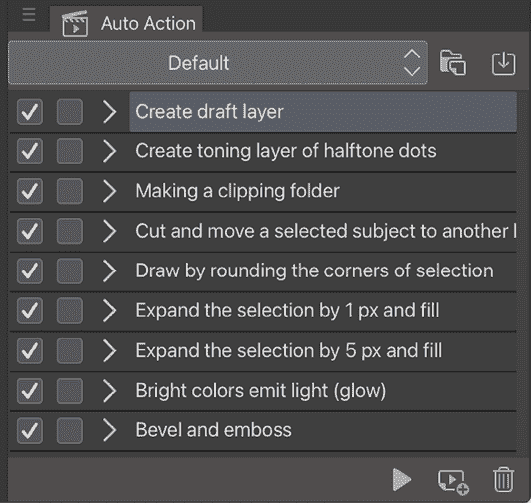

图 17.1：自动动作调色板（1）

让我们分解一下这个调色板的部分。调色板顶部的下拉菜单允许我们在不同的自动动作集合之间切换。前一张截图中的动作集合是**默认**集合，并包含在 Clip Studio Paint 中。

下拉菜单右侧的图标是**创建新的自动动作集合**和**添加自动动作集合**。右下角的垃圾桶图标是删除按钮，用于删除当前选定的自动动作步骤。删除动作图标旁边是**添加新的自动动作集合**按钮，然后是左侧的**播放动作**图标，当你点击它时，会播放选定的动作；最后，最左边的圆形图标是**录制自动动作**。

为了满足你的兴趣，让我们看看这个**默认**自动动作集合：

+   **创建草图层**：这会创建一个新的位图图层，将其命名，并将其设置为草图层。基本上，它为草图创建了一个基础，如图 17.2 所示。

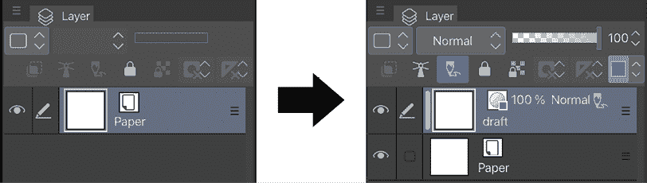

图 17.2：创建草图层结果

+   **创建半色调网点色调层**：这会创建一个 60.0 LPI 网点色调层。你可以在第十二章“制作图层蒙版和网点”的*添加网点*部分了解更多关于网点信息。你可以通过创建一个新图层并搜索合适的网点来开始给你的黑白漫画添加阴影。

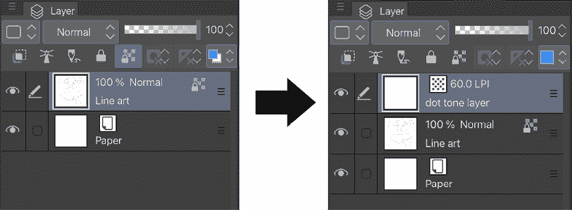

图 17.3：创建色调层结果

+   **制作剪辑文件夹**：这会在选定的图层上方创建两个剪辑图层，创建一个文件夹，并将三个图层放入其中。这是一个准备添加额外颜色而不溢出边界的流程。你可以在已经创建的平面色域内安全地添加阴影和光泽效果。结果将如图 17.4 所示。

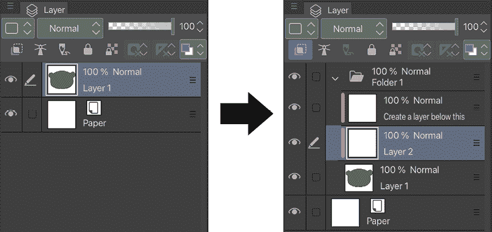

图 17.4：制作剪辑文件夹结果

+   **剪切并移动选定的主题到另一个图层**：这会复制并剪切选区的内容，在活动图层上方创建一个新图层，并将内容粘贴到新图层上。当你想要快速将某些内容移动到新图层时，这很有用。例如，你可能在一个图层中有几个项目，但只需要处理其中一个项目，比如一束头发。

+   **通过圆角选择来绘制**：这会创建一个具有圆角形状的图层，其原始形状为活动图层上的选区区域，边缘为前景色，填充为背景色。这是一个当你需要圆角漫画分镜时很好的自动动作！结果将如图 17.5 所示。

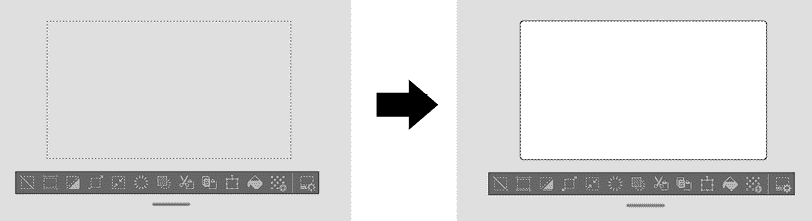

图 17.5：圆角绘制结果

+   **扩展选择区域 1 像素并填充**：这会使选定的彩色区域扩展 1 像素。当你在颜色和线条绘制之间有不必要的间隙时，这是一个很好的解决方案。

+   **扩展选择区域 5 像素并填充**：这与前面的自动动作做的是同样的事情，但它将彩色区域扩展到比选择区域宽 5 像素。

+   **明亮颜色发光（发光）**：这会给你的绘图添加一个戏剧性的发光效果。它复制了活动图层，在另一个图层上添加了额外的光模糊效果，然后合并了图层，最后将图层混合模式设置为**添加**。

+   **斜面和浮雕**：这会立即给活动图层中的绘图添加一个 3D 效果。这是一个简单的方法，可以在左上角添加一个亮色区域，并在右下角添加一个阴影。魔法是通过创建原始图层的亮色副本并将其稍微移动到左上角，然后创建原始图层的暗色副本并将其稍微移动到右下角，最后将副本合并到一个图层中。

现在你已经对自动动作有了些了解，知道了如何找到它们，了解了**默认**动作集是什么，以及它提供了什么。让我们看看如何使用自动动作。

# 使用自动动作

在本节中，我们将学习如何使用**默认**集中的第八个自动动作**明亮颜色发光（发光）**，因为它是最容易看到结果的动作集。

在**自动动作**面板的主窗口中，是我们可以选择的自动动作的名称。动作名称左侧的右箭头可以点击，以查看构成动作的记录步骤。在*图 17.6*中，显示了**明亮颜色发光（发光）**动作下的步骤。

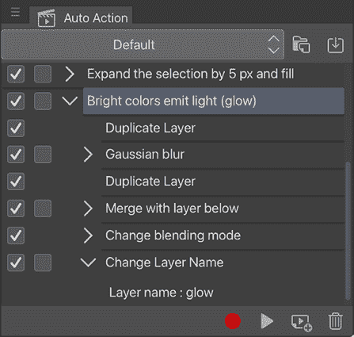

图 17.6：自动动作面板（2）

在前面的截图中，你可以看到在面板左侧有两行复选框，位于自动动作和它们所包含的步骤的名称旁边。第一列（截图中所有框都被勾选的列）控制哪些步骤或整个动作能够播放。如果复选框为空，则该步骤或动作将不会播放。

复选框的第二列指示一个步骤是否会弹出一个对话框，我们需要在其中输入信息或做出选择。

例如，在“**明亮颜色发光（发光）**”动作的截图上，如果我们点击**高斯模糊**步骤旁边的第二列复选框，那么当这些步骤在动作集中播放时，我们将在动作继续之前自己设置选项。

当我们选择一个动作并点击调板右下角的**播放动作**按钮，或者双击动作名称时，动作步骤将在当前活动图层或选择上播放。在*图 17.7*中，左侧的白色光照效果图层应用了**亮色发光（发光）**动作，这在右侧的结果中可以看到，使白色光照效果具有戏剧性的发光效果。

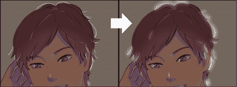

图 17.7：自动动作播放前后的对比（1）

**提示**

一些动作需要你为它们选择一个活动区域才能工作，而不是在整个图层上播放。大多数在**默认**动作集中需要活动选择的动作，其标题中都有*选择区域*，所以在播放动作时寻找这个线索！

我们将再看看两个**默认**自动操作，以了解你可以使用的动作种类。

**默认**集合的第四个选项被命名为**剪切并移动所选主题到另一个图层**，正如在本章前一部分提到的，它会从活动图层剪切所选区域并将其粘贴到新图层上。正如你在*图 17.8*中可以看到的，你可以通过点击**播放动作**按钮一次来移动**平面**图层上的头发部分。

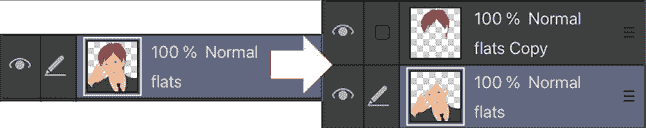

图 17.8：自动动作播放前后的对比（2）

这将帮助你将特定区域与其他部分分开工作，例如为角色头发的一部分添加不同类型的阴影或光照效果。

另一个**默认**自动操作是**斜面和浮雕**，它可以为简单的形状绘制添加即时 3D 效果，正如你在*图 17.9*中可以看到的。

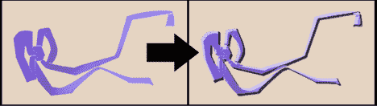

图 17.9：自动动作播放前后的对比（3）

自动操作立即在左上角添加了一个浅色区域，并在右下角添加了阴影！

既然我们已经了解了动作的用途以及我们可以用**默认**动作做的一些事情，那么让我们在下一节中创建一个自定义动作。

# 创建自定义自动动作

我们将创建一个自定义动作，通过按按钮来设置一个包含草图、最终草图和墨水层的文件，正如我在本章开头提到的两个不同场景中提到的。你可以将几乎任何东西变成自动动作，无论是几个按钮点击还是更长、更复杂的步骤序列。通过遵循本节中的说明，你将建立起未来开始创建自己的动作所需的基础知识。

在制作你自己的动作之前，多次完成动作的步骤，以确保你知道这个过程，并可以在创建过程中移除任何不必要的步骤或错误。这个预先规划步骤可以帮助你在以后节省大量的故障排除时间！

动作是在现有层或选择上执行的一组菜单命令。某些设置和命令，如设置画笔大小，无法录制。如果通过调色板更改了工具或层，这可能不会被添加到自动动作录制中。

按照以下步骤完成制作这个新的自动动作集和动作。在完成这些步骤之前，您需要创建一个新的空白文件：

1.  在**自动动作**调色板中，单击设置下拉菜单右侧的**创建新自动动作集**图标。（请注意，您可以将新动作添加到**默认**文件夹中，但为了组织，您也可以将您自己的动作放入一个新集中。）

1.  当对话框出现时，将新集命名为**自定义**，然后单击**确定**以完成创建新集。**创建新集**对话框如图*图 17.10*所示。

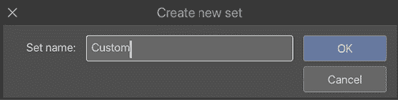

图 17.10：创建新集窗口

1.  在新动作集中，单击调色板左上角的调色板菜单。在这个菜单中，单击**添加自动动作**选项以创建新动作。

1.  通过在文本输入框中输入名称来命名新动作。例如，我们在这个例子中将我们的动作命名为`Layer Set Up`，如图*图 17.11*所示。

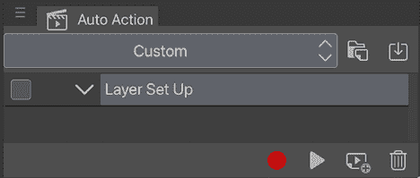

图 17.11：层设置集

现在您已经在**自定义**动作集中有了新的空动作，我们可以开始录制动作步骤！

1.  单击调色板底部的红色圆形图标，即**开始录制自动动作**图标，以开始记录步骤。一旦开始录制，此圆形图标将变成方形。

1.  创建一个新的栅格层，然后重命名该层为`Rough Sketch`。单击**层**调色板上的**设置为草稿层**图标，如图*图 17.12*所示。

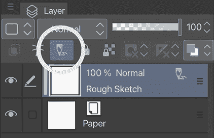

图 17.12：设置为草稿层图标

1.  在*步骤 2*中创建的层之上创建一个新的栅格层。将此层重命名为`Final Sketch`。

1.  在*步骤 3*中创建的层之上创建一个新的栅格层。将此层重命名为`Inks`。

1.  在**层**调色板中选择**Rough Sketch**层以使其成为活动层。

1.  返回到**自动动作**调色板，再次单击记录按钮（现在是一个方形而不是圆形——在旧技术中，方形通常用于标记**停止**按钮！）以停止录制。**Layer Set Up**动作下面的步骤应该类似于*图 17.13*。

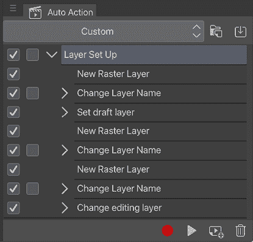

图 17.13：层设置自动动作

1.  打开一个新的画布，然后转到**自动动作**调色板。单击**Layer Set Up**动作的名称，然后单击调色板中的三角形**开始播放自动动作**图标以播放动作。

1.  如果自动动作已正确录制，新页面的**层**调色板应该如图*图 17.14*所示。

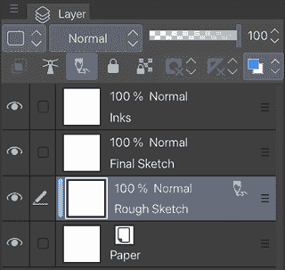

图 17.14：层设置自动动作结果

创建新的自动操作并记录它是多么简单！只需点击**创建新的自动操作集**图标，命名它，按下记录按钮让它记住所有过程，然后按下停止按钮。

你发现自己反复进行哪些单调乏味的步骤？你是否厌倦了在保存到网站之前手动调整漫画尺寸？你是否有一套步骤来制作特殊效果？从最简单的到最复杂的任何过程，都可以通过自动操作变得更容易。尝试制作一些自己的操作来在你的创作过程中使用！

你也可以从 Clip Studio Assets 下载自动操作资源；继续阅读以了解如何操作。

# 下载自动操作资源

在 Clip Studio Assets 上有很多资源可供下载用于你的艺术创作。我最喜欢的自动操作资源是**老式电视动作（内容 ID：1741400**），我在上色艺术的最后阶段使用它，这个自动操作通过调整色彩、添加纹理和色差，让你的艺术看起来就像在 1970 年代的电视屏幕上。你将在第十八章*探索 Clip Studio Assets 和动画*中了解更多关于 Clip Studio Assets 的功能，但现在，让我们专注于下载和使用自动操作资源。按照以下步骤操作：

1.  通过点击命令栏中圈出的图标，如图*图 17.15*所示，转到 Clip Studio Start 屏幕。

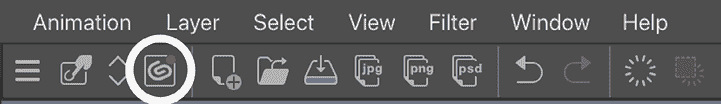

图 17.15：命令栏

1.  如果需要，输入你的 Clip Studio 用户名和密码，然后点击右上角的九宫格图标以弹出菜单窗口，如图*图 17.16*所示。

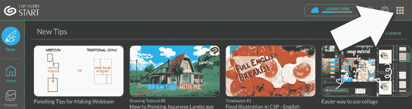

图 17.16：Clip Studio Start 屏幕

1.  当弹出**菜单**窗口时，点击如图*图 17.17*所示的**搜索材料**图标。

图 17.17：菜单窗口

1.  当你点击**搜索材料**时，会出现一个新屏幕，其中包含一个搜索栏和下面的新上传的资产缩略图。在搜索栏中输入`Auto`或`Autoaction`，然后按键盘上的*Enter*键。

1.  现在，你可以看到自动操作资源以缩略图的形式排列。向下滚动以找到你想要在艺术中使用的任何内容。目前，选择一个缩略图下有**免费**字样的资产，然后点击缩略图以查看资产详情。

1.  如果你对详情满意，点击左上角的红色**下载**按钮开始下载资产。

1.  请记住，下载资源可能需要一些时间。下载完成后，通过点击左侧菜单中的**DRAW**返回 Clip Studio Paint。

1.  在 Clip Studio Paint 中，在**文件**菜单中，点击**窗口**，然后在**窗口**下拉菜单中点击**材质**以弹出**材质**调色板，检查资产是否已添加到你的**材质**调色板中。

1.  在**材质**调板中，如果您找不到**下载**类别，点击**所有材质**旁边的箭头。如果您点击**下载**，最近下载的资产将显示在右侧，如图*图 17.18*所示。

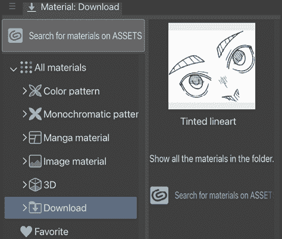

图 17.18：材质调板

1.  点击新下载的自动动作资产缩略图，然后点击位于**材质**调板底部的**将材质粘贴到画布**图标（*图 17.19*）。

图 17.19：将材质粘贴到画布图标

1.  一旦您点击**将材质粘贴到画布**图标，将弹出如图*图 17.20*所示的窗口，询问您是否要将自动动作资产添加到您的**自动动作**调板中；点击**确定**以确认。

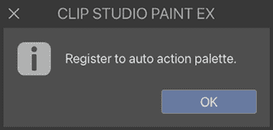

图 17.20：确认窗口

要检查资产是否已安全添加到您的**自动动作**调板中，请转到**自动动作**调板，如我们在本章的*探索自动动作调板部分*中所学。然后，点击调板顶部的下拉菜单。您将看到资产名称在那里，如图*图 17.21*所示。

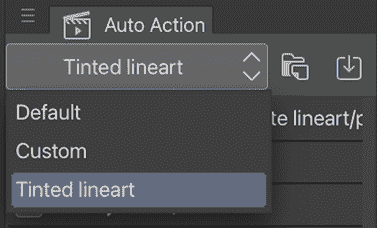

图 17.21：自动动作调板

现在您不仅可以使用**默认**自动动作和您创建的自动动作，还可以使用您下载的自动动作！一旦您下载了自动动作，您就可以详细了解工作流程，您可以亲自尝试以查看是否可以将其应用于后续的创作。

现在您有了两个新的自动动作集，您可以按照以下步骤自由编辑和组织它们：

1.  点击**自动动作**调板上的三个横条图标以显示**自动动作**下拉菜单。

1.  从下拉菜单中选择**编辑集…**，将弹出**编辑集**对话框，如图*图 17.22*所示。

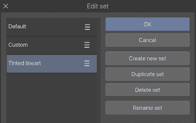

图 17.22：编辑集对话框

1.  点击并按住设置名称旁边的三个横条图标，上下移动以更改设置顺序。点击**创建新集**以创建新集。点击**复制集**以复制所选集。点击**删除集**以删除所选集。点击**重命名集**以重命名所选集。

1.  当您完成编辑集之后，点击**确定**。

1.  现在您的自动动作集已整齐存储并随时可用！您还可以根据需要编辑和自定义自动动作工作流程。在查看**自动动作**调板中的详细信息时，您可以删除、添加或更改步骤。

让我们看看如何快速访问您喜欢的自动动作！

# 自动动作快捷键

如果您经常使用某些自动动作，您可以将它们分配给快捷键，甚至将它们添加到 Clip Studio Paint 界面顶部的命令栏中。

在接下来的两个部分中，我们将使用之前创建的**层设置**动作创建两个快捷方式——一个键盘快捷方式和一条命令栏快捷方式！这是一个简单的过程，将减少您在调色板中查找最常使用的命令所花费的时间。让我们看看这两个过程以轻松访问我们的自动动作。

## 创建键盘快捷方式

按照以下步骤创建自动动作的键盘快捷方式：

1.  在**文件**菜单中，点击**CLIP STUDIO PAINT**或其图标，然后在下拉菜单中点击**快捷方式设置…**以打开键盘快捷方式首选项。

1.  在**类别**下拉菜单中，选择**自动动作**选项。

1.  点击自动动作集名称左侧的箭头，查看该集名下的动作。在**图 17.23**中，我们正在查看**自定义**集中的动作以找到我们之前创建的**层设置**动作。

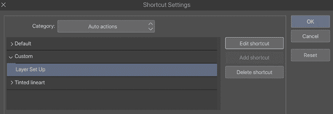

图 17.23：快捷方式设置窗口（1）

1.  点击**层设置**名称以选择它。然后，点击**编辑快捷方式**按钮。

1.  在键盘上按下您想用于快捷方式的键或键组合。在本组说明中，我们将使用*Ctrl* + *T1*键组合来激活我们的自动动作。此快捷方式现在显示在**层设置**自动动作名称旁边，如图**图 17.24**所示。

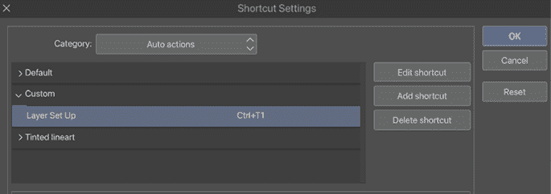

图 17.24：快捷方式设置窗口（2）

1.  要更改现有的快捷方式，请点击**编辑快捷方式**并选择新的快捷方式。您还可以在您的设备上配置这些快捷方式。

1.  要为同一自动动作添加另一个快捷方式，点击**添加快捷方式**按钮，然后按另一个键或键组合来设置第二个快捷方式。

1.  要删除快捷方式，选择快捷方式然后点击**删除快捷方式**按钮。

1.  完成快捷方式设置后，点击**确定**按钮退出**快捷方式设置**。

现在，当您按下*Ctrl*按钮并按键盘上的*F1*时，您的**层设置**动作将播放。

继续阅读以了解您可以创建的另一个快捷方式！

## 创建命令栏快捷方式

能够在命令栏上看到您常用的快捷方式是很方便的。要向命令栏添加快捷方式图标，请按照以下步骤操作：

1.  在**文件**菜单中，点击**CLIP STUDIO PAINT**或其图标，然后在下拉菜单中点击**命令栏设置…**以打开**命令栏设置**菜单。

1.  在设置菜单顶部的下拉菜单中，选择**自动动作**选项以查看自动动作。

1.  点击动作集旁边的箭头，查看该集下自动动作的名称。在**图 17.25**中，我们正在查看**层设置**动作的**自定义**集。

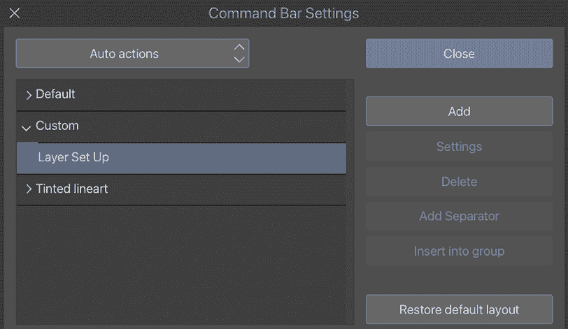

图 17.25：命令栏设置窗口

1.  选择自动动作的名称后，点击 **添加** 按钮。

1.  现在快捷图标将显示在命令栏中，如图 17.26 所示。

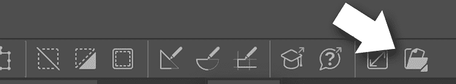

图 17.26：命令栏上可见的快捷图标

1.  要删除快捷键，按住快捷图标以打开下拉菜单，然后点击 **删除**。

哇，要在图层上完成自动动作是多么容易。你可以要么按住 *Ctrl* 键然后按 *F1* 键，要么点击命令栏上的图标来运行 **图层设置** 动作，而无需从面板中选择它。

# 摘要

在本章中，我们学习了如何通过使用记录的自动动作来自动化步骤，使繁琐的活动变得更容易忍受。我们查看了 **自动动作** 面板，并学习了如何播放默认动作。我们学习了如何创建新的自动动作集，如何创建新的自动动作并记录其步骤，然后如何下载自动动作资产。最后，我们学习了如何为自动动作创建两个不同的快捷键，以便更容易访问它。

在下一章中，我们将探索 Clip Studio Paint 的动画功能，并学习如何从 Clip Studio Assets 导入素材和其他资产。

# 加入我们的 Discord 社群！

与其他用户一起阅读这本书。提出问题，为其他读者提供解决方案，等等。

扫描二维码或访问链接以加入社区。

[`packt.link/clipstudiopaint`](https://packt.link/clipstudiopaint)

