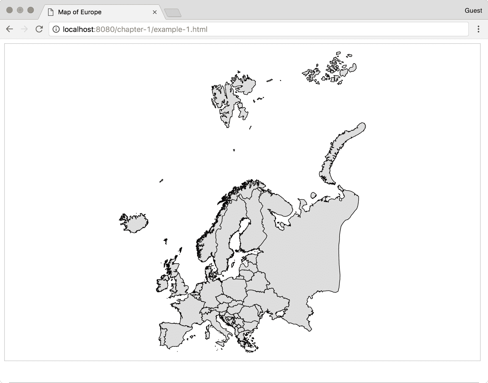
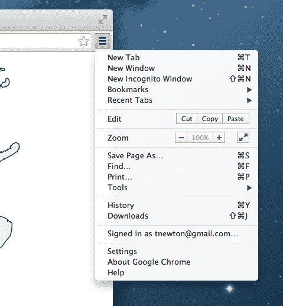
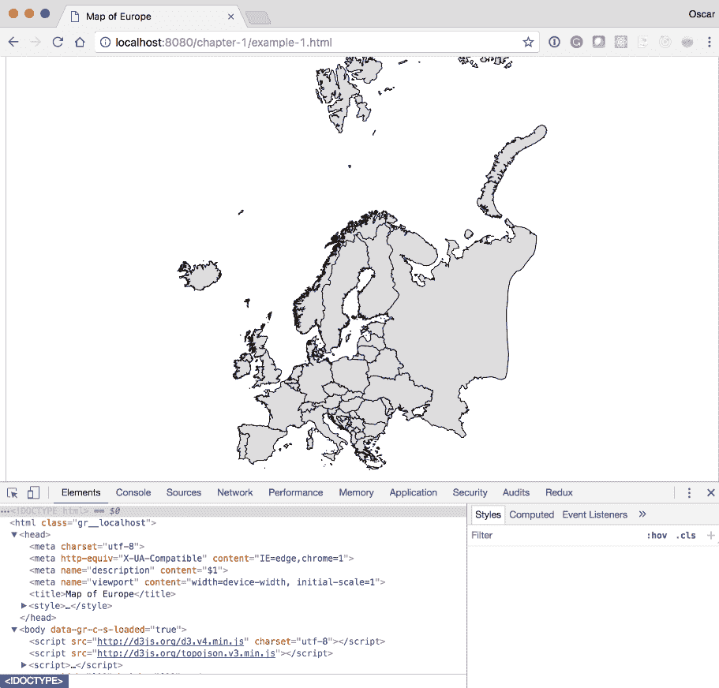

# 第一章：收集您的地图学工具箱

欢迎来到 D3 的地图学世界。在本章中，您将获得创建地图所需的所有工具，这些工具都是免费和开源的，得益于美好的开源世界。鉴于我们将使用网络术语进行讨论，我们的语言将是 HTML、CSS 和 JavaScript。阅读完这本书后，您将能够有效地使用这三种语言来创建自己的地图。

在本章中，我们将涵盖以下主题：

+   快速引导

+   逐步引导

+   安装关键库和工具

+   使用网络浏览器作为开发工具

在 D3 中创建地图时，您的工具箱非常轻便。目标是专注于创建数据可视化，并移除重 IDE 和地图制作软件的负担。

# 快速引导

以下说明假设 Node.js、`npm`和`git`已安装到您的系统上。如果没有，请随意遵循*逐步引导*部分。

在命令行中输入以下内容以安装轻量级网络服务器：

```js
npm install -g http-server
```

安装 TopoJSON：

```js
npm install -g topojson
```

克隆包含库的示例代码：

```js
git clone --depth=1 git@github.com:climboid/d3jsMaps.git
```

进入根项目：

```js
cd d3jsMaps
```

要启动服务器，请输入以下命令：

```js
http-server
```

您可以从[`www.packtpub.com`](http://www.packtpub.com)下载示例代码文件，这些文件存储在您购买的所有 Packt Publishing 书籍的账户中。如果您在其他地方购买了这本书，您可以访问[`www.packtpub.com/support`](http://www.packtpub.com/support)并注册，以便将文件直接通过电子邮件发送给您。

现在，打开您的网络浏览器到`http://localhost:8080/chapter-1/example-1.html`，您应该看到以下地图：



# 逐步引导

下一节将详细介绍如何设置开发环境，如果您没有安装所需的任何包。到本章结束时，您将拥有本书剩余部分的工作环境（一个运行中的地图示例以及创建可视化所使用的工具的初步了解）。

# 轻量级网络服务器

从技术上讲，我们将创建的大部分内容可以直接在浏览器中渲染，而无需使用网络服务器。然而，我们强烈建议您不要采取这种方法。在本地开发环境中运行网络服务器非常简单，并提供了一些好处：

+   地理信息、统计数据和可视化代码可以清晰地分离到独立的文件中

+   API 调用可以被模拟和模拟，允许轻松集成到未来的全栈应用程序中

+   它将防止在调用 AJAX 以获取地理和统计数据时出现常见错误（例如，同源策略）

对于我们选择的 Web 服务器和工具箱中的其他工具，我们将依赖于一个名为 `http-server` 的 Node.js 包。Node.js 是一个基于 Chrome 的 JavaScript 运行时的平台，用于构建快速、可扩展的网络应用程序。该平台包括 **Node 包管理器** (**npm**)，它是由充满活力的 Node.js 社区的其他成员创建的，允许开发者快速安装预构建软件的包。

要安装 Node.js，只需执行以下步骤：

1.  访问网站 [`nodejs.org`](http://nodejs.org)。

1.  点击安装按钮。

1.  打开下载的包并遵循默认设置。

要测试安装，请在命令行中输入以下内容：

```js
node -v
```

应该返回类似以下的内容：

```js
v0.10.26 
```

这意味着我们已经安装了本书编写时的给定版本的 Node.js。

TopoJSON 是一个命令行工具，用于创建 TopoJSON 序列化格式的文件。TopoJSON 格式将在第六章 [80f84fe0-7828-4ecc-9973-3e2bdef7ab55.xhtml] 中详细讨论，*寻找和操作地理数据*。TopoJSON 工具也是通过 `npm` 安装的。

我们已经安装了 Node.js 和 `npm`，所以请在命令行中输入以下内容：

```js
npm install -g topojson
```

安装完成后，你应该检查机器上安装的 TopoJSON 版本，就像我们检查 Node.js 一样：

```js
geo2topo --version
```

如果你看到版本 3.x，这意味着你已成功安装 TopoJSON。

TopoJSON 使用 `node-gyp`，它基于操作系统有几个依赖项。请访问 [`github.com/TooTallNate/node-gyp`](http://github.com/TooTallNate/node-gyp) 获取详细信息。

如果你使用的是 Windows 系统，使 TopoJSON 工作的基本步骤如下：

1.  安装 Python 2.x（本书编写时不支持 3.x）。

1.  安装桌面版 Microsoft Visual Studio C++ 2012。

# 使用网页浏览器作为开发工具

虽然任何现代浏览器都支持 **可缩放矢量图形** (**SVG**) 并有一些类型的控制台，但我们强烈建议你使用 Google Chrome 进行这些示例。它捆绑了开发者工具，这将使你能够非常容易地打开、探索和修改代码。如果你没有使用 Google Chrome，请访问 [`www.google.com/chrome`](http://www.google.com/chrome) 并安装 Google Chrome。

# 安装示例代码

访问 [`github.com/climboid/d3jsMaps`](https://github.com/climboid/d3jsMaps) 并根据你是否熟悉 Git 克隆，克隆仓库或简单地下载压缩版本。下载完成后，请确保如果你有压缩文件，将其解压。

使用命令提示符或终端转到你下载文件的目录。例如，如果你将文件下载到桌面，请输入以下内容：

```js
cd ~/Desktop/d3jsMaps
```

要启动服务器，请输入以下内容：

```js
http-server
```

最后一条命令将启动我们之前安装的用于提供示例代码的简单服务器。这意味着，如果你打开浏览器并转到 `http://localhost:8080/chapter-1/example-1.html`，你应该看到一个地图

欧洲的，类似于前面展示的。

# 使用开发者工具

是时候打开开发者工具了。在浏览器的右上角，你会看到以下截图所示的图标：



此图标打开一个子菜单。点击更多工具，然后点击开发者工具。

浏览器底部将打开一个面板，包含你可用的一切开发者工具。

这里提到的选项名称可能会根据你使用的 Chrome 版本而有所不同。



为了快速访问 Mac 上的开发者工具，使用 *alt* + command + *I*；对于 Windows PC，使用 *Ctrl* + *Shift* + *I*。

在开发者工具中，你有一系列标签（元素、网络、源等）。这些工具非常有价值，将允许你检查代码的不同方面。有关 Chrome 开发者工具的更多信息，请访问此链接：[`developer.chrome.com/devtools/docs/authoring-development-workflow`](https://developer.chrome.com/devtools/docs/authoring-development-workflow)。

由于我们将重点放在元素标签上，如果它尚未选中，请点击它。

你应该看到与前面的截图类似的内容；它将包含以下代码语句：

```js
<svg width="812" height="584"> 
```

如果你点击 SVG 项目，你应该看到它展开并显示路径标签。路径标签将包含与 `d` 属性相关联的几个数字和字符。这些数字是绘制路径的控制点。我们将在下一章中介绍路径的绘制方式以及路径标签如何用于创建地图，在第四章*,* *创建地图*和第五章*,* *点击-点击爆炸！为你的地图添加交互性*。

我们还希望引起你的注意，HTML5 应用程序如何加载 D3 库。同样，在元素标签中，在 SVG 标签之后，你应该看到指向 D3.js 和 TopoJSON 的 `<script>` 标签：

```js
<script src="img/d3.v4.min.js"></script>
<script src="img/topojson.v3.min.js"></script> 
```

如果你点击位于 SVG 标签内的路径，你会看到一个名为 CSS 检查器或样式检查器的新面板。它显示并控制应用于所选元素的所有样式，在这种情况下，是路径元素。

这三个组件创建了一个 D3 可视化：

+   HTML5（SVG 和路径元素）

+   JavaScript（D3.js 库和地图代码）

+   CSS（HTML5 元素的样式）

在整本书中，将讨论和分析使用这三个组件创建地图和可视化。

# 概述

本章简要介绍了基本设置的步骤，以便有一个组织良好的代码库来使用 D3 创建地图。你应该熟悉这个设置，因为我们将在整个书中使用这个约定。

剩余的章节将专注于使用 HTML、JavaScript 和 CSS 创建详细地图和实现逼真的可视化。

让我们开始吧！
