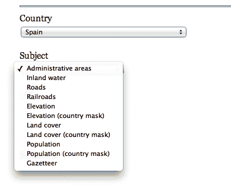
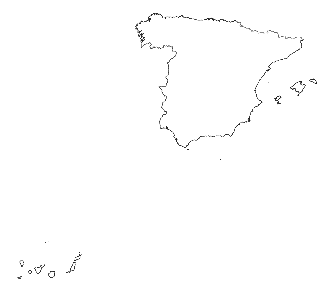
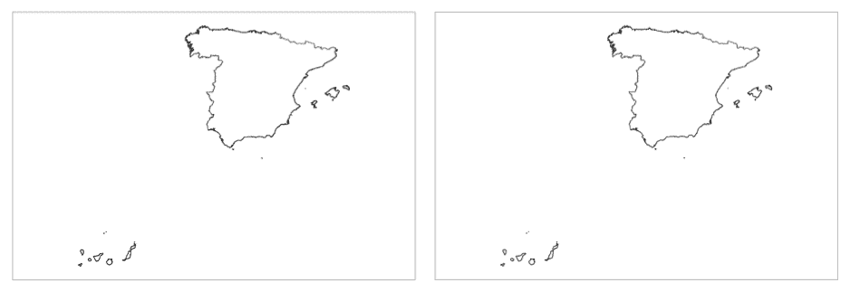
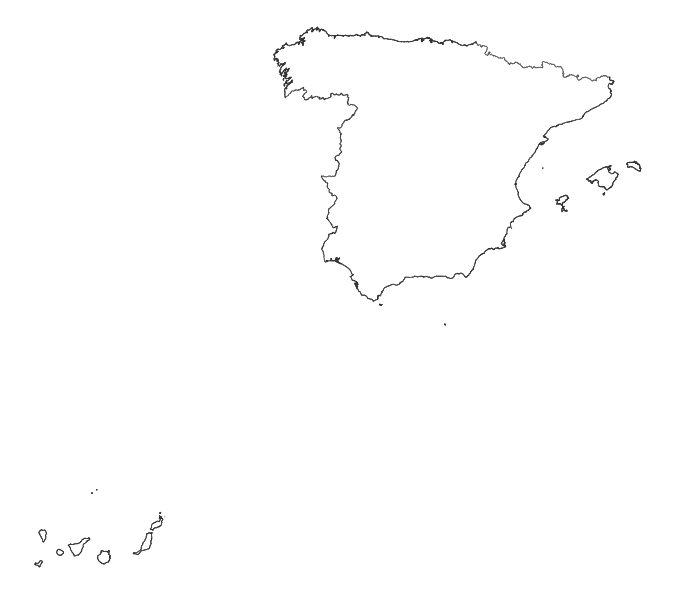
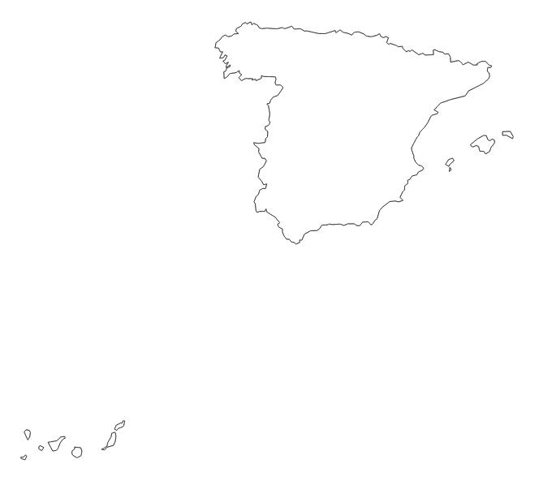
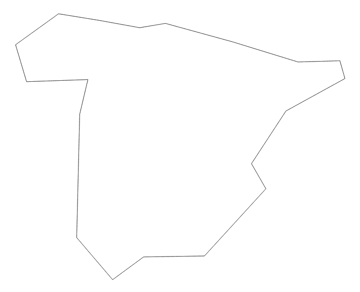
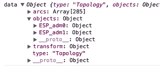
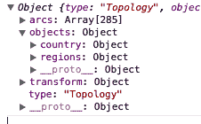

# 第六章：寻找和使用地理数据

我们在之前的章节中花费了大量时间创建和交互地图。在我们所有的例子中，都包含了地理数据。在本章中，我们将解释如何找到关于世界上任何国家的地理数据。

通常我们需要两组数据来在 D3 中创建地图：

+   表示我们地图地理形状的数据集（地理数据）

+   我们想在地图上可视化的有意义的数据（例如，按美国国家的人口密度，或按世界各国的失业率）

本章的重点是理解、操作和优化地图可视化中的地理数据。我们将通过以下方式实现这些目标：

+   解释包含地理空间矢量数据的三种重要格式

+   寻找、下载和使用大量地图数据

+   使用技术构建适合您地图的正确地理数据文件

# 地理数据文件类型

有数十种文件格式可以表示地理信息。在本节中，我们将关注三种文件类型：shapefiles、GeoJSON 和 TopoJSON。

# Shapefiles 是什么？我如何获取它们？

Shapefiles 是最受欢迎的基于向量的文件格式。它们包含代表地理边界的多边形和线条。Shapefile 格式是由 Esri 公司开发的，作为一个开放标准来与**地理信息系统**（GIS）一起使用。这种向量信息也可以描述其他地理实体（如河流、湖泊和铁路）。此外，该文件格式具有存储在可视化工作时有用的数据属性的能力（例如，地理对象名称、类型和一些关系）。对我们来说最重要的是，有一个位于[`diva-gis.org`](http://diva-gis.org)的大型免费 shapefiles 存储库。这个存储库包含不同详细程度和粒度的大量数据。

不幸的是，对于我们的情况，shapefiles 是二进制格式，并且可能非常大。这使得它们在标准 Web 开发中使用非常困难，如果不是不可能的话。幸运的是，有一些工具可以帮助我们利用 shapefiles 的大型存储库，并将它们转换为 GeoJSON 和 TopoJSON。GeoJSON 和 TopoJSON 对 JavaScript 友好，体积更小，在我们的 Web 开发环境中更容易使用。在前面的章节中，所有地理数据都提供为 TopoJSON。

# 为特定国家获取 shapefiles

让我们从西班牙的地图开始，通过获取我们的第一个 shapefile 的过程：

1.  访问[`www.diva-gis.org/gdata`](http://www.diva-gis.org/gdata)，从下拉列表中选择西班牙，如图下截图所示：

    

1.  一旦选择了西班牙，您将看到一大堆地理数据可供选择（道路、铁路等）。选择“行政区域”选项以绘制国家和地区的边界。点击“确定”；它将带您进入下载页面。

1.  下载后，您将得到一个包含西班牙行政区域形状文件数据的`ESP_adm.zip`文件。

1.  解压文件后，您会看到文件组织成递增的数字，从`ESP_adm0`到`ESP_adm4`。ESP 代表国家的缩写，每个数字代表每个数据文件中找到的细节量的增加。例如，`ESP_adm0`将仅绘制西班牙的轮廓，而`ESP_adm3`将包括国家的省份。

# GeoJSON

GeoJSON 是描述地理数据结构的特定 JSON 格式。重要的是要知道 GeoJSON 执行以下操作：

+   包含绘制地理数据所需的所有信息。

+   是一个标准的 JSON 格式，在构建网页时可以立即在 JavaScript 中使用。

+   在定义我们的`d3.geo.path`函数时，D3 需要它，如前几章所示。

+   精确定义每个地理形状。例如，如果两个国家共享边界，GeoJSON 文件将完全定义这两个国家，因此边界被定义了两次。它不提供任何优化数据文件的机制。

由于 D3 依赖于 GeoJSON，我们将解释规范的一些亮点。对于完整的解释，请参阅[`geojson.org`](http://geojson.org)。

通常，您不会直接将 GeoJSON 文件集成到您的 D3 工作中。下一节中解释的 TopoJSON 提供了一个更紧凑的解决方案。然而，了解规范仍然很重要，所以让我们通过西班牙的 GeoJSON 来了解一下：

```js
{ 
    "type": "FeatureCollection", 
    "features": [ 
        { 
            "type": "Feature", 
            "properties": { 
                "GADMID": 70, 
                "ISO": "ESP", 
                "NAME_ENGLI": "Spain", 
                "NAME_ISO": "SPAIN", 
                "NAME_FAO": "Spain", 
                "NAME_LOCAL": "España", 
                ... 
            }, 
            "geometry": { 
                "type": "MultiPolygon", 
                "coordinates": [ 
                    [ 
                        [ 
                            [ 
                                0.518472, 
                                40.53236 
                            ], 
                            [ 
                                0.518194, 
                                40.53236 
                            ], 
                            ... 
                        ] 
                    ] 
                ] 
            } 
        } 
    ] 
} 
```

JSON 对象的第一个属性标识该 GeoJSON 文件为特征集合（`FeatureCollection`）。集合的每个成员（在先前的`features`属性中的数组）包含一个特殊格式的 JSON 对象，称为`feature`。我们在前几章中使用的`d3.geo.path`函数知道如何使用 SVG 路径将`feature`对象转换为多边形。通过迭代这些特征的数组并逐个绘制每个多边形，我们创建了一个 D3 地图。

`feature`对象必须遵循以下属性，以便 D3 将对象转换为多边形：

+   `geometry`：这是另一个 GeoJSON 规范，它包含类型和坐标，指示如何精确绘制形状。我们不会花太多时间解释规范如何绘制对象。D3 会为我们做所有艰苦的工作。利用 enter/update/exit 模式，我们将一个特殊的`d3.geo.path`函数传递给每个特征。这个函数将获取特征的相关几何信息，并为我们自动创建形状。

+   `properties`：这是附加到特征上的任何附加数据。这是一个典型的名称/值对 JSON 对象。在前面的示例中，`properties` 属性被用来存储国家的名称。当我们需要稍后找到国家以绑定其他数据到可视化时，这非常有用。请参阅以下截图，了解可以绑定到特征对象上的属性示例：

    

+   `id`：这是一个占位符，可以用来存储集合中特定特征的唯一标识符。

# 在 D3 中使用仅 GeoJSON 的快速地图

让我们暂时假设 TopoJSON 不存在，并说明仅使用 GeoJSON 如何创建地图。这将在下一节中帮助说明 TopoJSON 的必要性。以下代码片段是一个快速示例，将所有内容结合起来；您也可以从 `chapter-6` 文件夹中打开 `example-1.html`（`http://localhost:8080/chapter-6/example-1.html`），在您的浏览器中查看以下代码生成的地图：

```js
  d3.json('geojson/spain-geo.json', function(data) { 
    var b, s, t; 
    projection.scale(1).translate([0, 0]); 
    var b = path.bounds(data); 
    var s = .9 / Math.max((b[1][0] - b[0][0]) / width, 
     (b[1][1] - b[0][1]) / height);    
     var t = [(width - s * (b[1][0] +
     b[0][0])) / 2, 
     (height - s * (b[1][1] + b[0][1])) / 2]; 
    projection.scale(s).translate(t); 

    map = svg.append('g').attr('class', 'boundary'); 
    spain = map.selectAll('path').data(data.features); 
```

注意，代码几乎与上一章的示例相同。唯一的例外是我们没有调用 `topojson` 函数（我们将在下一节中解释为什么 `topojson` 很重要）。相反，我们将 AJAX 调用中的数据直接传递到以下 `enter()` 调用的 *data join* 中：

```js
    spain.enter() 
       .append('path') 
       .attr('d', path); 

 }); 
```

如预期的那样，我们有了西班牙的地图：



虽然直接使用 GeoJSON 可能看起来是最好的方法，但存在一些问题。主要问题是，将 Esri shapefile 一对一转换为 GeoJSON 格式包含大量可能不必要的细节，这将创建一个巨大的 GeoJSON 文件。文件越大，下载所需的时间就越长。例如，`spain-geo.json` 生成了一个几乎 7 MB 的 GeoJSON 文件。

接下来，我们将探讨如何通过修改几个优化杠杆来帮助 TopoJSON，同时仍然保持重要的细节。

# TopoJSON 基础

TopoJSON 是另一种基于 JSON 的格式，用于编码地理数据。如果你还记得，GeoJSON 是离散地描述地理数据的。这意味着 GeoJSON 的边界可以被描述两次。TopoJSON 格式消除了这种重复行为，通常创建的文件大小可以缩小 80%。当在网络上构建时，这种格式非常有用，因为数据传输大小起着重要作用。

TopoJSON 这个术语可能会令人困惑。让我们将其分解为其三个维度：

+   **TopoJSON，序列化格式**：实际序列化的 JSON 格式，用于描述如何绘制地理形状。

+   **topojson，命令行工具**：这是一个用户可以运行的程序，用于从 shapefile 创建 TopoJSON 文件。该实用程序包含许多杠杆，可以进一步减小文件大小。

+   **topojson.js，JavaScript 库**：在您的 D3 地图中使用的库，用于将 TopoJSON 序列化格式转换回 GeoJSON，以便 `d3.geo.path` 函数能够正确工作。

为了说明 TopoJSON 可以减少文件大小的程度，让我们使用命令行工具对之前下载的 shapefiles 执行命令。打开命令行，并在下载并解压`ESP_adm.zip`文件的同一目录中执行以下操作：

```js
topojson -o spain-topo.json -p -- ESP_adm0.shp

```

接下来，我们通过 AJAX 注入我们刚刚创建的`topojson`文件：

并保留来自`ESP_adm0` shapefile 的所有数据属性（使用`-p`标志）

（注意，在命令行语法中，shapefile 需要位于`--`之后）。

简化

首先，让我们比较 GeoJSON 与 TopoJSON 在相同地理区域上的文件大小：

+   此命令创建了一个名为`spain-topo.json`的新 TopoJSON 格式文件。

+   TopoJSON: 379 KB

这是一种令人难以置信的压缩率，而我们只是使用了默认设置！

`-o`参数定义了结果 TopoJSON 文件的名字。

```js
<script src="img/topojson.v1.min.js"></script> 
```

首先，我们将 JavaScript 库作为`<script>`标签添加到我们的文件中。现在你知道为什么我们一直在使用这个库：

```js
d3.json('topojson/spain-topo.json', function(data) { 
```

保留特定属性

```js
var country = topojson.feature(data, data.objects.ESP_adm0); 
```

我们添加额外的代码行以将 TopoJSON 格式转换为 GeoJSON 特征格式：

```js
var b = path.bounds(country); 
```

我们需要记住使用插值特征创建我们的边界框：

```js
spain = map.selectAll('path').data(country.features); 
```

现在，我们在新的数据上使用*数据连接*。正如预期的那样，我们将看到西班牙的地图。让我们在下面的屏幕截图中并排展示它们，以比较 GeoJSON 和 TopoJSON（GeoJSON 在左侧，TopoJSON 在右侧）：



# TopoJSON 命令行技巧

TopoJSON 的命令行文档非常完整（[`github.com/mbostock/topojson/wiki/Command-Line-Reference`](https://github.com/mbostock/topojson/wiki/Command-Line-Reference)）。然而，这里有一些快速简便的技巧来帮助你入门。

# 为了将 TopoJSON 整合到我们的地图中，我们需要使用`topojson.js`JavaScript 库并修改几行代码。我们将从`example-1.html`开始。最终版本可以在`example-2.html`（`http://localhost:8080/chapter-6/example-2.html`）中查看：

在 GeoJSON 部分，我们说明了数据属性通常是地理数据的一部分。`topojson`命令允许你过滤掉你不想保留的属性，并为你想保留的属性提供更好的命名约定。这些功能在`-p`标志中，并传递给命令。例如：

```js
topojson -o spain-topo.json -p name=ISO -- ESP_adm0.shp 
```

我们将创建 TopoJSON 文件，移除除 ISO 以外的所有属性，并将 ISO 属性重命名为易于识别的名称。您可以通过逗号分隔列表来指定多个属性：

```js
-p target=source,target=source,target=source  
```

# GeoJSON: 6.4 MB

Mike Bostock 提供了一个关于简化及其工作原理的优秀教程，可以在[`bost.ocks.org/mike/simplify/`](http://bost.ocks.org/mike/simplify/)找到。

基本上，这是一种通过线简化算法来减少几何复杂度的方法。例如，如果你不需要一个国家非常崎岖的海岸线有太多细节，你可以应用线简化算法来平滑崎岖度，并显著减小 TopoJSON 文件的大小。你使用的命令行参数是 `-s` 以调整 TopoJSON 转换中的简化：

```js
-p  name=ISO -s 7e-7 -- ESP_adm0.shp
```

我们通常意识到，在处理 DIVA-GIS 的 shapefiles 时，最佳范围大约在 7e-7，以保持在每像素阈值内，这个阈值小于地图的面积。在这个范围内，尺寸压缩非常显著，并且对于网络开发来说，地图质量仍然非常可接受。考虑以下内容：

+   **原始**：378 KB，细节和质量极佳！

+   **简化到 -s 7e-7**：3.6 KB，质量可接受！

+   **在 -s 7e-5 时非常简单**：568 字节，但地图无法识别！

# 合并文件

最后一个技巧涉及将多个 shapefiles 合并成一个单独的 TopoJSON 文件。如果你需要单独的地理信息，但又想通过单个 AJAX 请求获取，这非常有用。要追加额外的文件，请在命令行中的 `-` 后面添加它们。考虑以下命令：

```js
topojson -o ../topojson/spain-topo-simple.json -p  name=ISO -s 7e-7 -
- ESP_adm0.shp ESP_adm1.shp  
```

它将产生以下对象结构，其中 `ESP_adm0` 的数据是国家数据，而 `ESP_adm1` 是地区数据：



你还有机会在生成的 TopoJSON 文件中将它们映射到的对象重命名。同样，这可以帮助创建可读的代码。重命名遵循与重命名特定属性相同的约定。例如，输入以下命令：

```js
topojson -o ../topojson/spain-topo-simple.json -p  name=ISO -s 7e-7 -
- country=ESP_adm0.shp regions=ESP_adm1.shp  
```

前面的命令将创建以下内容：



在这种情况下，你需要更改你的原始代码，如下所示：

```js
var country = topojson.feature(data, data.objects.ESP_adm0); 
```

你必须将其更改为以下代码：

```js
var country = topojson.feature(data, data.objects.country); 
```

这看起来要好得多！请查看 `example-3.html` (`http://localhost:8080/chapter-6/example-3.html`) 以了解所有这些信息是如何联系在一起的。

# 摘要

到这一点，你应该有信心可以找到并修改数据集以满足你的需求。我们已经涵盖了你可以获取数据的一些常见位置，并且我们已经提到了 TopoJSON 提供的不同类型的标志。有了这些技能，确保你的数据被修剪并且符合你的可视化需求就取决于你了。这完成了使用 D3 开发地图的循环。在下一章中，我们将通过专注于测试你的可视化来提高你的技艺。
