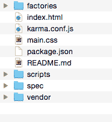

# 第七章：测试

在本章中，我们将介绍几个有助于长期维护您的 D3 代码库的话题。目标是建立一个基础，以构建可重用资产，这些资产可以轻松地进行单元测试，同时利用已经在 JavaScript 社区中确立的流行工具和技术。

单元测试在任何软件开发项目中都很重要，尤其是在 D3 代码库中。通常，这些项目涉及大量应用分析或操作数据结构的代码。对于这类问题，单元测试可以帮助以下方面：

+   **减少错误**：自动化的测试套件将允许开发者分解并测试单个组件。这些测试将在整个开发周期中不断运行，验证新功能不会破坏旧的工作代码。

+   **准确记录**：通常，测试是以人类可读的方式编写的；它们精确地描述了它们正在测试的问题。提供的代码示例比长段落提供了更好的文档。

+   **允许重构**：开发者可以自信地更改代码语义和设计，因为他们知道输入和输出仍然被跟踪和验证。

+   **加快开发速度**：大多数开发者花费时间验证他们的工作。我们见过开发者不懈地刷新浏览器、检查控制台日志和检查 DOM 元素。与其反复执行这些手动操作，不如简单地用框架将它们封装起来，由框架为您完成工作。

本章将探讨我们在开始新的可视化开发时喜欢使用的 Bootstrap 项目。项目中涵盖的概念包括：

+   项目结构

+   代码组织和可重用资产

+   单元测试

+   弹性代码库

# 代码组织和可重用资产

我们编写可重用和可测试 D3 代码的基础来自迈克·博斯托克的博客文章 *Towards Reusable Charts*，在 [`bost.ocks.org/mike/chart/`](http://bost.ocks.org/mike/chart/)。其核心是尝试将图表实现为具有 `getter` 和 `setter` 方法的闭包。这使得代码更易于阅读和测试。实际上，在继续之前阅读这篇文章是个好主意，因为我们可以借鉴一些我们的职业经验并将这些概念进一步扩展。项目结构旨在实现几个目标。

# 项目结构

Bootstrap 项目包含以下文件和目录：



项目自带示例代码即可运行。为了看到这一效果，我们将启动示例。从提供的示例 Bootstrap 代码开始，首先安装所有依赖项（请注意，您只需执行此命令一次）：

```js
npm install
```

然后，为了查看可视化效果，执行以下操作：

```js
node node_modules/http-server/bin/http-server  
```

接下来，打开浏览器到`http://localhost:8080`。你应该会看到一系列测试中基于随机数据的三个条形图在变化。请注意，如果你已经打开了之前的示例，你必须终止该进程才能运行这个，因为它们都使用了相同的端口。

要查看单元测试的工作情况，只需执行以下操作：

```js
node_modules/karma/bin/karma start 
```

你应该在终端中看到五个单元测试的摘要，以及一个持续运行的过程来监控你的项目：

```js
INFO [karma]: Karma v0.12.21 server started at 
http://localhost:9876/ 
INFO [launcher]: Starting browser Chrome 
INFO [Chrome 37.0.2062 (Mac OS X 10.9.5)]: Connected on socket 
goMqmrnZkxyz9nlpQHem with id 16699326Chrome 37.0.2062 (Mac OS X 10.9.5): Executed 5 of 5 SUCCESS 
(0.018 secs / 0.013 secs)
```

我们将在本章后面解释如何为项目编写单元测试。要快速查看正在运行的测试，请查看`spec/viz_spec.js`。

如果你更改此文件中的任何方法，你会注意到测试运行器会检测到代码中的更改并重新执行测试！这为开发者提供了一个极好的反馈循环，随着你继续完善你的工作。

# 探索代码目录

在本节中，我们将详细介绍每个文件并解释它在整体包中的重要性：

+   `index.html`: 此文件是可视化的起点，当你将浏览器指向`http://localhost:8080`时将自动启动。你会注意到该文件包含了许多在书中已经讨论过的点，例如加载适当的资源。随着我们遍历`index.html`文件，我们将识别项目中使用的其他目录和文件。

+   `main.css`: `main.css`文件用于应用特定的 CSS 样式：

    你的可视化：

```js
<link rel="stylesheet" type="text/css" href="main.css"> 
```

+   `vendor`: 此目录包含我们在可视化中需要使用的所有外部库，并在`index.html`文件的底部加载：

```js
<script src="img/d3.min.js"></script> 
<script src="img/topojson.v1.min.js"></script> 
```

+   我们喜欢将这些保持到最小，以便尽可能少地对外部世界有依赖。在这种情况下，我们只使用核心 D3 库和 TopoJSON 来帮助我们进行 GeoJSON 编码。

+   `scripts`: 这又是一个目录；我们在加载的文件中添加了一些新内容，以创建可视化：

```js
<!-- A base function for setting up the SVG and container --> 
<script src="img/base.js"></script> 

<!-- The main visualization code --> 
<script src="img/viz.js"></script> 
```

+   `base.js`脚本包含了一些在许多示例中重复使用的常见 D3 模式（例如，在具有预定义边距对象的`<g>`图表区域中包含可视化，基于此边距对象计算高度和宽度的常用方法，以及一个方便的实用工具来查找现有容器并绑定数据）。`base.js`脚本也是一个很好的位置来存放可重用代码。

+   `viz.js`脚本是一个示例，它利用了*《迈向可重用图表》*中的许多概念，并从`base.js`中获得了一些继承。`viz.js`脚本是项目的核心，大部分可视化代码都将驻留于此。

+   `factories`: 这也是一个目录。为了在我们的浏览器中展示我们的工作，我们需要一个脚本来生成一些数据，选择 DOM 中的元素，并启动可视化调用。这些脚本组织在`factories`目录中。这个示例可以在`viz_factory.js`文件中查看：

```js
<!-- The script acts as a proxy to call the visualization 
 and draw it with sample data --> 
<script src="img/viz_factory.js"></script> 
```

+   `spec`：你编写的测试以验证可视化代码中的方法，这里。将在本章后面提供详细示例。

# 其他管理文件

以下两个辅助文件用于 Bootstrap 项目的操作，这些文件很少需要任何修改：

+   `karma.conf.js`：用于设置单元测试运行

+   `package.json`：描述了要安装哪些 npm 包

# 编写可测试的代码

在创建可视化时需要考虑的因素有数十个。每个设计都将有其自己的一套独特的要求和配置能力。如果你基于 Mike Bostock 概述的可重复使用模式构建，你将有一个很好的框架开始。

当处理数据可视化时，我们将有一些形式的数据操作或逻辑必须应用于传入的数据。我们可以利用以下两个值得注意的最佳实践来测试和验证这些操作。它们将在以下部分中解释。

# 保持方法/函数小

小函数意味着低循环复杂度。这意味着每个函数中的逻辑分支更少，因此要测试的东西也更少。如果我们彻底且独立地测试每个简单函数，那么当我们将它们组合成更大的复杂计算时，出错的机会就会更少。一个好的指导原则是尽量保持方法在约 10 行代码左右。

# 防止副作用

这基本上意味着每个小函数不应在自身之外保存任何状态。尽可能限制全局变量的使用，并将每个函数视为以下过程：

1.  数据到达。

1.  对数据进行一些操作。

1.  返回结果。

这样我们就可以轻松地独立测试每个函数，而不必担心它对程序全局状态的影响。

# viz.js 的示例

为了在实践中学到这一点，让我们以`scripts/viz.js`程序为例，作为创建可视化中数据操作函数可测试代码的模板。在这个例子中，我们将创建一组基于任意数据集利润的简单条形图。我们得到了数据中的销售额和成本；然而，我们需要通过从成本中减去销售额来确定用于可视化的利润。在这个虚构的例子中，我们需要几个小的辅助函数，如下所示：

+   一个函数，用于从原始数据集生成一个新的数据集，其中包含计算出的利润

+   一个函数，用于检索一个唯一类别数组，以应用于序数尺度

+   一个函数，用于确定最大利润值，以便构建我们输入域的上限

如果我们使用前面概述的最佳实践来创建这些函数并公开它们，我们就可以在隔离和独立的情况下测试它们。

让我们浏览一下脚本，看看它是如何协同工作的：

```js
if (d3.charts === null || typeof(d3.charts) !== 'object') 
 { d3.charts = {}; }
```

在这里，我们将为图表定义命名空间。在这个例子中，我们的图表可以通过`d3.charts.viz`来实例化。如果带有图表属性的`d3`对象不存在，或者它不是一个`type`对象，则创建它，使用经典的功能继承来利用来自`base`函数的通用模式：

```js
d3.charts.viz = function () { 
  // Functional inheritance of common areas 
  var my = d3.ext.base(); 
```

一个方便的函数（见`base.js`），可以快速将`getters/setters`分配给遵循*Towards Reusable Charts*中模式的闭包，如下所示：

```js
  // Define getter/setter style accessors.. 
  // defaults assigned 
  my.accessor('example', true); 
```

我们在这个作用域级别使用`svg`变量来维护在快速添加选择器时的状态。`void 0`是一个初始化变量为 undefined 的安全方式：

```js
  // Data for Global Scope 
  var svg = void 0, 
      chart = void 0; 
```

定义在整个可视化过程中将使用的 D3 实例函数：

```js
  // Declare D3 functions, also in instance scope 
  var x = d3.scale.linear(), 
      y = d3.scale.ordinal(); 
```

以下函数代表了与外部世界的主要接口。还有一套在 D3 可视化中常见的前置函数。SVG 容器被设置为可以轻松地在选择器中查找现有的 SVG 容器并重新绑定数据的方式。这使得在后续调用新数据时重新绘制变得更加容易：

```js
  my.draw = function(selection) { 
    selection.each(function(data) { 
      // code in base/scripts.js 
      // resuable way of dealing with margins 
      svg = my.setupSVG(this); 
      chart = my.setupChart(svg); 

      // Create the visualization 
      my.chart(data); 
    }); 
  }; 

  // main method for drawing the viz 
  my.chart = function(data) { 
    var chartData = my.profit(data); 

    x.domain([0, my.profitMax(chartData)]) 
        .range([0,my.w()]); 
    y.domain(my.categories(chartData)) 
        .rangeRoundBands([0, my.h()], 0.2); 

    var boxes = chart.selectAll('.box').data(chartData); 

    // Enter 
    boxes.enter().append('rect') 
        .attr('class', 'box') 
        .attr('fill', 'steelblue'); 

    // Update 
    boxes.transition().duration(1000) 
        .attr('x', 0) 
        .attr('y', function(d) { return y(d.category) }) 
        .attr('width', function(d) {  return x(d.profit) }) 
        .attr('height', y.rangeBand()) 

    // Exit 
    boxes.exit().remove(); 
  }; 
```

注意，`chart`函数依赖于几个辅助函数（如下面的代码行所示）来处理数据。它也被编写成可以利用 enter/update/exit 模式的方式：

```js
  // Example function to create profit. 
  my.profit = function(data) { 
    return data.map(function(d) { 
      d.profit = parseFloat(d.sales) - parseFloat(d.cost); 
      return d; 
    }); 
  }; 
```

此函数用于创建一个新的数据结构，其中分配了利润。请注意，它接受一个数据数组作为参数，并返回一个新构造的数组，其中添加了利润属性。现在，此函数通过`viz().profit(data)`公开外部，可以轻松地进行测试。它不会更改任何外部全局变量。它只是输入数据和新数据：

```js
  my.categories = function(data) { 
    return data.map(function(d) { 
      return d.category; 
    }); 
  }; 
```

这与`my.profit(data)`的模式完全相同。我们将接受数据结构作为输入，并返回一个新的数据结构，即所有类别的数组。在前面的代码行中，你看到了它是如何被用来创建输入域的。

```js
  my.profitMax = function(data) { 
    return d3.max(data, function(d) { return d.profit; }); 
  }; 
```

再次强调，这是一个简单的函数，用于接收数据，计算最大值，并返回该最大值。使用`d3.charts.viz().profitMax(data)`非常容易进行测试和验证？

```js
   return my; 
  }; 
```

# 单元测试

既然我们已经用可测试的方式编写了代码库，让我们自动化这些测试，这样我们就不必手动执行它们，可以轻松地继续编码和重构。

如果你查看`spec/viz_spec.js`文件，你将注意到单元测试时的一些常见模式。以下代码是用一个名为 Jasmine 的 JavaScript 单元测试框架编写的，并利用 Karma 来执行测试。你可以在[`jasmine.github.io/1.3/introduction.html`](http://jasmine.github.io/1.3/introduction.html)了解更多关于 Jasmine 语法、断言和其他功能的信息。

Bootstrap 项目包含了你快速开始测试所需的一切。

第一步是使用以下代码行启动我们的 Karma 测试运行器：

```js
node_modules/karma/bin/karma start 
```

这个运行器将监视`viz.js`文件或`viz_spec.js`文件的每个编辑。如果检测到任何更改，它将自动重新运行每个测试套件，并在控制台上提供输出。如果所有测试都通过，则输出将全部为绿色。如果有任何失败，你将收到一个红色的警告消息：

```js
'use strict'; 

describe('Visualization: Stacked', function () { 
  var viz; 

  var data = [ 
    {"category": "gold",  "cost": "10",  "sales": "60"}, 
    {"category": "white", "cost": "20",  "sales": "30"}, 
    {"category": "black", "cost": "100", "sales": "140"} 
  ]; 
```

创建一些测试数据来测试你的 D3 数据操作函数。前面的`describe`语法定义了你即将执行的测试框架：

```js
  beforeEach(function() { 
    viz = d3.charts.viz() 
        .height(600) 
        .width(900) 
        .margin({top: 10, right: 10, bottom: 10, left: 10}); 
  }); 
```

在每次测试运行之前，创建一个具有一些默认设置器的 D3 可视化实例：

```js
  it ('sets the profit', function() { 
    var profits = viz.profit(data); 
    expect(profits.length).toBe(3); 
    expect(profits[0].profit).toBe(50) 
  }); 
```

这是我们第一个测试用例！在这个测试中，我们断言从测试数据中得到了一个新的数组，但增加了额外的利润属性。请记住，我们创建这个函数是为了没有副作用，并且是一个小的单元工作。我们将通过这种易于测试的方法收获我们的劳动成果。就像我们之前做的那样，我们现在将测试类别列表：

```js
  it ('returns a list of all categories', function() { 
    var categories = viz.categories(data); 
    expect(categories.length).toBe(3); 
    expect(categories).toEqual([ 'gold', 'white', 'black' ]); 
  }); 
```

按如下方式计算最大利润：

```js
  it ('calculates the profit max', function() { 
    var profits = viz.profit(data); 
    expect(viz.profitMax(profits)).toEqual(50); 
  }); 
```

以下是一些额外的示例测试，以验证`height`/`width`（考虑到边距）是否在`base.js`函数中正常工作：

```js
  it ('calculates the height of the chart box', function() { 
    expect(viz.h()).toBe(580); 
    viz.height(700); // change the height 
    viz.margin({top: 20, right: 10, bottom: 10, left: 10}) 
    expect(viz.h()).toBe(670); 
  }); 

  it ('calculates the width of the chart box', function() { 
    expect(viz.w()).toBe(880); 
    viz.height(700); // change the height 
    viz.margin({top: 10, right: 10, bottom: 10, left: 20}) 
    expect(viz.w()).toBe(870); 
  }); 
```

作为实验，尝试添加新的测试用例或编辑现有的测试用例。观察测试运行器报告不同的结果。

# 创建健壮的可视化代码

我们想确保我们的可视化可以最小化调用程序的努力来响应数据的变化。测试不同数据排列并确保可视化相应反应的一种方法是通过随机创建示例数据，多次调用可视化代码，并观察结果。这些操作在`factories`目录中处理。让我们以`viz_factory.js`文件为例：

```js
(function() { 
    var viz = d3.charts.viz(); 
```

创建一个变量以存储具有`getters`和`setters`闭包的函数。在这个例子中，我们将使用一个匿名函数作为包装器来执行代码。这可以防止与其他 JavaScript 代码冲突，并确保我们的可视化在受保护的环境中能够正常工作：

```js
    var rand = function() { 
      return Math.floor((Math.random() * 10) + 1) 
    }; 
```

一个简单的辅助函数，用于生成介于 1 到 10 之间的随机数，如下所示：

```js
    var data = function() { 
      return [1,2,3].map(function(d,i) { 
        var cost = rand(); 
        var sales = rand(); 

        return { 
          category: 'category-'+i, 
          cost: cost, 
          sales: cost + sales 
        }; 
      }); 
    }; 
```

基于随机数生成一个假数据集：

```js
    d3.select("#chart").datum(data()).call(viz.draw); 
```

使用这些代码行首次绘制可视化：

```js
      var id = setInterval(function() { 
        var d = data(); 
        console.log('data:', d); 
        d3.select("#chart").datum(d).call(viz.draw); 
      }, 2000); 
      setTimeout(function() { 
      clearInterval(id); 
      }, 10000); 
```

设置一个 10 秒的定时器，并在迭代中将新数据绑定到可视化上。预期的行为是可视化将在每次调用时重新绘制自己。注意将新数据传递给可视化是多么简单。它只是一个带有新数据集的简单选择器。我们已经以这种方式构建了可重用的可视化代码，使其知道如何适当地做出反应。

要查看实际效果，只需启动`http-server`，如下所示：

```js
node_modules/http-server/bin/http-server  
```

现在，访问`http://localhost:8080`。

# 添加一个新的测试用例

如果我们改变数组中的数据集数量会发生什么？为了测试这一点，让我们添加一个新的辅助函数（称为`set()`），它可以随机生成一个包含 1 到 10 之间随机元素数量的新数据集：

```js
    var set = function() { 
      var k = rand(); 
      var d = []; 
      for (var i = 1; i < k; i++) { 
        d.push[i]; 
      }; 
      return d; 
    }; 
```

稍微修改一下`data`函数。我们将打印到控制台以验证它是否正常工作：

```js
    var data = function() { 
      var d = set(); 
      console.log('d', d); 
      return d.map(function(d,i) { 
        var cost = rand(); 
        var sales = rand(); 

        return { 
          category: 'category-'+i, 
          cost: cost, 
          sales: cost + sales 
        }; 
      }); 
    }; 
```

现在，如果我们再次查看`http://localhost:8080`，我们可以看到，即使是有随机数量的数据，可视化也能正常工作。

# 摘要

在本章中，我们描述了帮助测试您的 D3 代码库并保持项目生命周期内健康的技巧。我们还逐步通过一个 Bootstrap 项目来帮助您开始使用这些示例，并查看了一种构建您工作的方法。

我们的建议基于多年的经验和许多使用 D3 完成的项目。我们强烈建议您遵循良好的软件模式并专注于测试；这将使您能够完善您的技艺。现在，质量掌握在您的手中。
