# 第十一章：使用数据塑造地图 - 六边形地图

不同类型的数据适合不同的可视化。当你想展示时间线时，你很少构建垂直条形图。你更有可能使用水平线形图。当然，在将数据编码到位置、形状或颜色时，你应该给自己一些表达的自由。然而，手头的数据、你想要传达的意义以及认知解码过程在决定如何编码你的数据时是非常重要的指南。

在本章中，我们将专注于一种特定的地图可视化技术：**六边形分箱**地图（**六边形地图**）。在专注于六边形地图之前，我们将简要回顾各种地图可视化技术。你将了解六边形地图的概念和认知优势，与其他形状相比，六边形有什么用途，以及它们是如何计算的。

然而，本章的大部分内容将是实践性的，从头开始构建六边形地图。大部分注意力将集中在数据准备和塑形上。D3 的**D3-hexbin**模块将使实际的可视化变得轻而易举。我们将关注一系列数据准备和可视化任务，这些任务旨在易于遵循。让我们开始吧！

# 回顾地图可视化技术

表示地理数据的方法有很多。不出所料，地图经常被用到。虽然地图是一种吸引人的方式来展示数据，大多数人可以轻松解读，但它们可能会被过度使用。如果你想展示哪个国家森林覆盖率最高，你可能会选择展示一个地球仪并使用颜色饱和度来编码森林比率。或者，你可以展示一个排序的垂直条形图，显示森林覆盖率最高的国家在最上面，最低的国家在最下面。地图版本可能看起来更漂亮，并给你的用户一个关于森林缺乏或丰富的位置的直观感受。然而，条形图提供了对森林覆盖率分布和各国比较的更简洁的概述。

因此，让我们假设你已经决定使用地图作为你视觉表示的基本形式。有哪些选择呢？

# 着色图

广为人知且可能被过度使用的着色图，如果你需要比较地理单元（如州、县或国家）之间的标准化比率时是一个不错的选择。你在第四章“创建地图”和第十章“为你的画布地图添加交互性”中构建了着色图，比较了每个国家的森林覆盖率比率

你唯一可以编码你选择的度量的视觉通道是颜色。这些单位的面积已经由这些单位的大小给出。这可能会将用户的注意力从较小的单位转移到较大的单位上。以我们的森林为例，像美国、俄罗斯或巴西这样的大国可能会比像卢森堡、海地或伯利兹这样的小国得到更多的初始关注。

为了减轻这种注意力问题，你应该在可视化的度量中对每个国家都公平。关键规则是不要可视化绝对数字，而是与国家相关的标准化比率。我们在森林示例中遵循了这一规则，通过可视化森林覆盖面积占总国家面积的百分比。这个度量对每个国家都有相同的范围，独立于国家的面积（0 到 100%）。这是一个标准化且因此公平的度量。树木的绝对数量将是一个不公平的度量。一个树木较少的大国可能仍然比一个树木繁茂的小国拥有更多的树木，这使得我们的比较变得有问题的甚至毫无意义。

此外，地理单位应该定义你可视化的度量。例如，税率是由国家制定的，跨国家比较非常有意义。森林覆盖率并不是（完全）由一个国家的行动和政策决定的，因此在渐变图中展示它意义不大。国家的行动仍然会影响其森林覆盖率，所以我不会完全忽视它（例如，多米尼加共和国对其森林的管理方式比邻国海地更为保守），但这应该是你选择可视化技术时的一个有意识的部分。

由于渐变图如此普遍，让我们看看另一个不同数据的例子：美国的农场市场。它们将在本章的剩余部分陪伴我们，所以这是一个深入了解的好时机。

我们将使用的*农场市场*数据由美国农业部发布于[`www.ams.usda.gov/local-food-directories/farmersmarkets`](https://www.ams.usda.gov/local-food-directories/farmersmarkets)。经过一番清理后，我们得到了一个包含美国大陆 8,475 个市场的数据集。每个市场都有一些有趣的变量，包括我们可以用于地图的经纬度值，以及它们所在的名字、州和城市。它还包括 29 个二元变量（即是/否），表示每个市场正在销售的产品。我们将在以后使用这些变量来可视化市场的子集。

这里是一个美国各州的渐变图（仅包括大陆部分以保持简单）。它显示了每 10 万人中的农场市场数量。浅蓝色表示市场少；深蓝色表示每 10 万人中有许多市场：

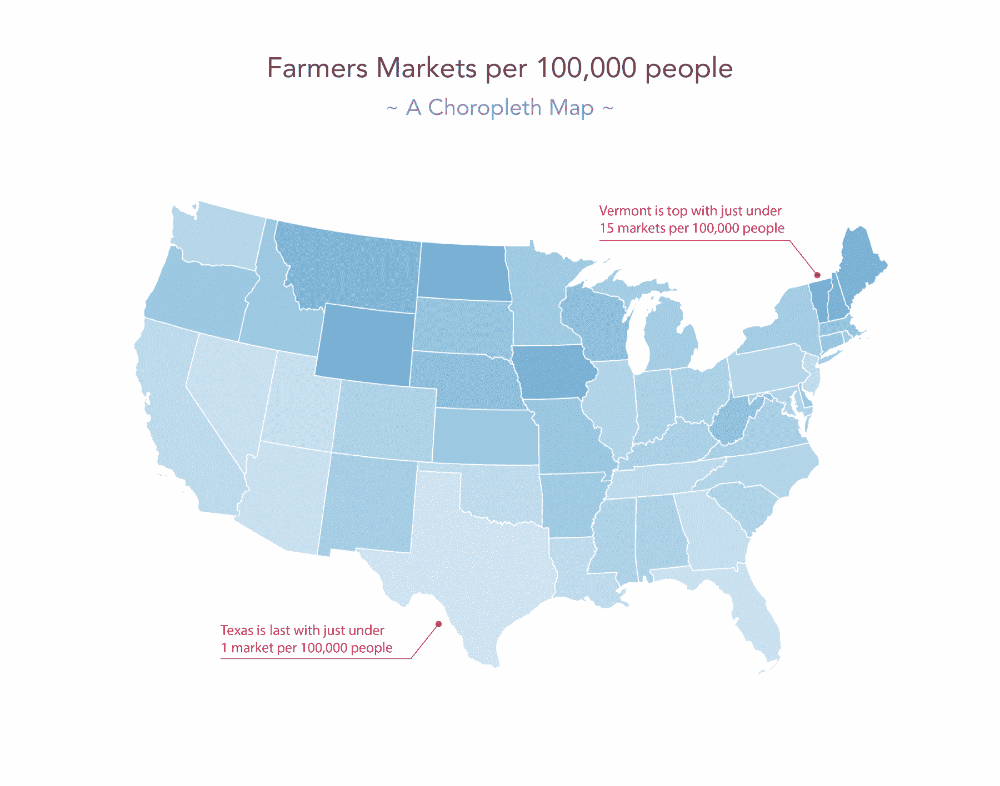

农场市场渐变图

这里有一个问题需要考虑，即按州比较农贸市场是否有很大意义。州政策或文化在促进或反对农贸市场中发挥作用吗？也许吧。然而，一旦我们决定进行州级比较，我们能否很好地进行比较？德克萨斯州由于其规模在视觉上占据了很大的权重，这暗示了南部农贸市场的匮乏。我们可以看到佛蒙特州的比例最高（我们用红线指向它也有帮助），但华盛顿特区呢？每 10 万人有 8.5 个市场？我们甚至无法在地图上看到它。

# 地形图

地形图通过将你的值编码到面积大小来消除面积问题。我们的农贸市场地形图将比例映射到颜色和面积大小，看起来如下：

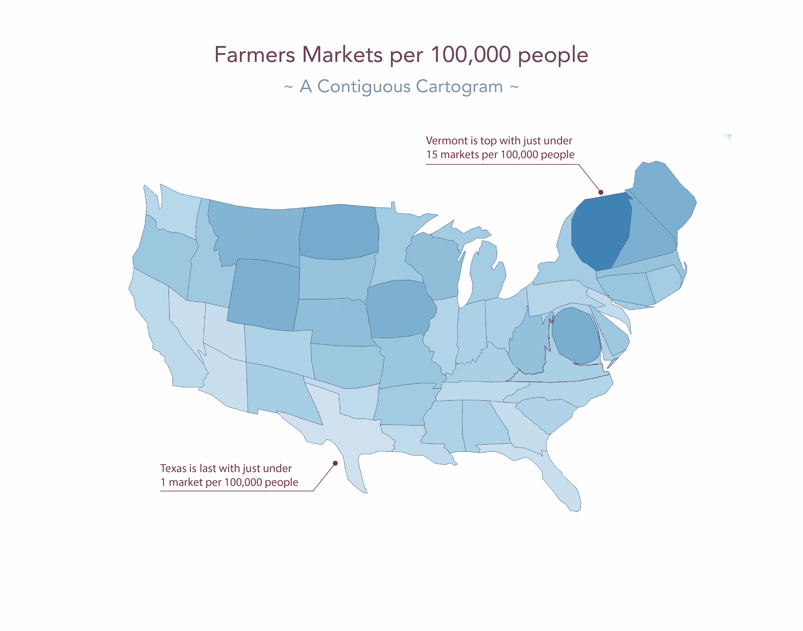

农贸市场的连续地图

你的地图的面积——以及随之而来的形状——以这种方式扭曲，以至于面积代表了你想要可视化的值。这对华盛顿特区来说很棒，它被显著放大，以便被识别为农贸市场的重量级市场。简而言之，它们解决了注意力盗窃的 choropleth 问题，但在我们的地理单位往往难以辨认的情况下，又产生了新的问题。你的用户会很好地接受他们对县、州和国家这种熟悉地区的现实扭曲，但他们会很难理解他们不熟悉形状的地区。这看起来太神秘了，可能会降低可读性，甚至可能导致对兴趣的完全丧失。

连续地图是通过[`github.com/shawnbot/topogram`](https://github.com/shawnbot/topogram)生成的。

# 点密度图

点密度图非常适合你想展示**事物数量**而不是比例的情况。每个事物在地图上都是一个点。以下是美国所有农贸市场的点密度图：

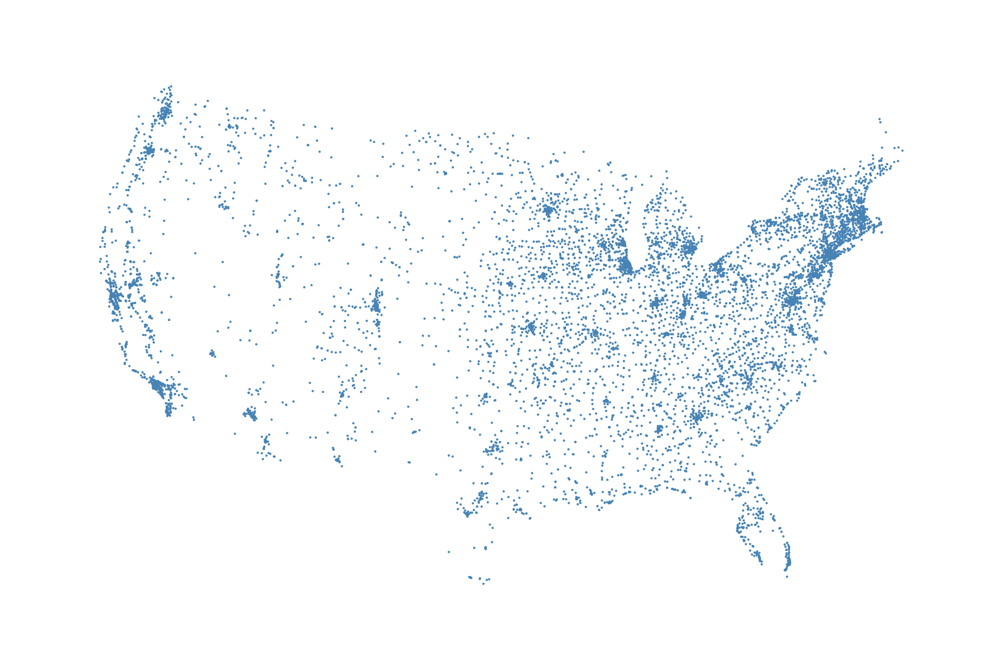

农贸市场的点密度图

这种可视化技术的优点很明显：它展示了所有数据。你可以轻松地看到它们都在哪里，并检测到全国范围内的农贸市场集群。问题是实际上它并没有展示所有数据。一些点在小而繁忙的地区重叠。第二个潜在问题是许多空间分析中的绝对度量与人口分布高度相关。所以当你想说“*看看所有农贸市场的位置*”时，你实际上是在说“*看看所有人的位置*”。这并不意味着你不应该展示它，但你应该意识到这一点。顺便说一句，我们的六边形图也会遇到同样的问题，所以要有意识。展示所有数据的另一个问题是，对于用户来说，查看如此多的数据和元素可能会显得混乱。我们可能希望以更有序的方式将注意力集中在集群上。这就是六边形图派上用场的地方。

注意，这份地图可视化技术列表并不完整。当然，还有其他地图可视化技术，如热力图、聚类图、渐变圆、比例符号或气泡图，以及非连续的地图。一个很好的地方是查看人们如何在地图上可视化的内容是[`flowingdata.com/category/visualization/mapping/`](https://flowingdata.com/category/visualization/mapping/)。

# 六边形的价值和用途

六边形可以解决我们前面提到的一些问题。它们可以帮助解决等面积问题，并为点簇带来有序的焦点。让我们先看看几个例子：

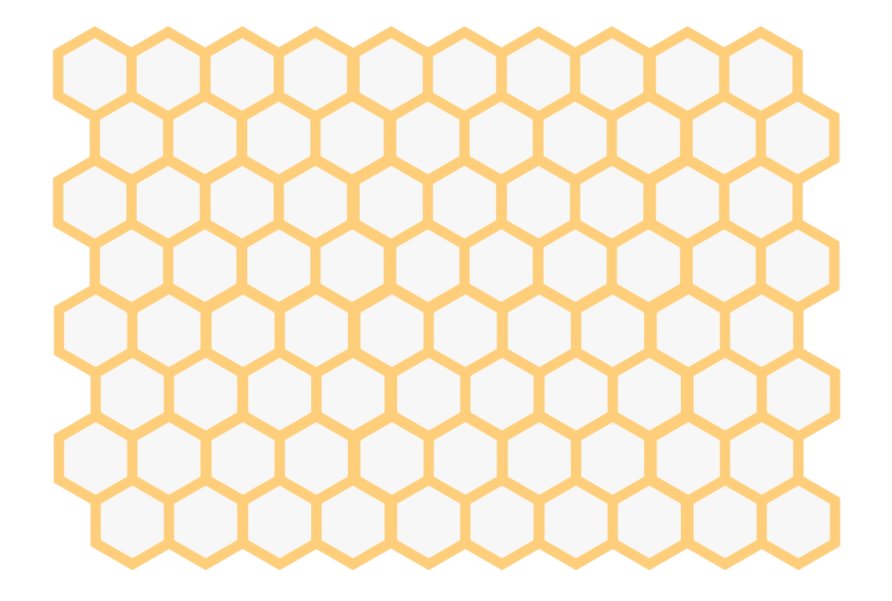

六边形镶嵌

如你所见，六边形有等长的边，并且可以很好地相邻排列。然而，它们不仅仅是外表漂亮，它们还拥有我们可以在数据可视化中充分利用的特性：

+   六边形将给定区域划分为大小相等的六边形。这被称为**镶嵌**，也可以用其他形状如圆形、三角形、矩形或其他多边形来完成。

+   然而，如果你用圆形铺满你的墙面，你会在圆形之间留下缝隙。用重复的对称形状无缝覆盖平面称为**规则**的**镶嵌**，实际上，这仅适用于正方形、三角形和六边形。

+   在这三个形状中，六边形是最接近圆形的最高边形状。因此，它们最适合表示——**分组**——一组点。三角形或正方形的角点比六边形的角点离它们的中心更远，这使得六边形天生适合对点数据进行分组。圆形在分组方面是最优的，但再次强调，它们不能进行镶嵌。

让我们再考虑一下分组。**分组**意味着将数据分组到大小相等的类别中。当我们有一组 100 人的年龄数据时，我们可以查看每个年龄的频率，或者我们将数据分组到更易于消化的年龄组，如 20-39 岁、40-69 岁和 70-99 岁。我们将单个数据点汇总到更大的——通常是大小相等的——组中。

在地图环境中，我们可以将点位置数据分组到大小相等的区域。六边形非常适合这项任务，因为它们很好地分组点，并且在平面上规则地镶嵌。这就是 D3 实现的六边形图能为你做的事情。我们不必像在点密度图中那样，可能将点堆叠在一起，我们可以定义大小相等的六边形区域，将点汇总到一个用颜色编码的汇总度量中。因此，**分组**比单个点更好地表示每个六边形区域的数据。**六边形**的**镶嵌**支持分组，因为它创建了最佳可能的、无缝的、相对公平的分组形状。

在接下来的章节中，我们将非常关注这些**六边形散点图**，其中每个六边形代表相等的面积。在我们深入探讨六边形散点图之前，让我们快速看一下你可能遇到过的另一种六边形应用：**六边形渐变色地图**。如上图所示的经典渐变色地图所提出的问题是，像佛蒙特州或华盛顿特区这样的小州很容易被忽视，因为它们的视觉重量很低。其他面积州，如德克萨斯州或蒙大拿州，通过 sheer size 吸引人们的注意。为了解决这个问题，我们可以用六边形替换州多边形：


在六边形渐变色地图中解放美国各州的大小

让我们明确一点，正如前图和以下各节所描述的，*六边形散点图*中的六边形代表相等的面积。然而，在这个图中，我们不想关注我们选择的单位（美国大陆各州）的空间面积；我们想关注的是仅由我们选择的单位进行分类的度量。

请注意，这会带来完全去除面积信息的代价，因为美国各州的面积差异很大，而且没有任何一个州看起来像六边形。然而，与先前的经典渐变色示例不同，这种六边形渐变色允许我们，例如，轻松地识别华盛顿特区作为一个农民市场中心，这可能是我们最想传达的信息。

理论已经足够。让我们制作一个六边形散点图。

# 制作六边形散点图

在改进了我们的美国州六边形渐变色地图后，现在让我们使用六边形来改变我们的点密度图。正如我们之前所看到的，点密度图有一些好处，所以我们即将进行的更改更多的是改进而不是明显的提升。以下是我们要构建的内容：


一张多边形六边形的彩色地图

这是一张显示农民市场热点的六边形散点图。没有农民市场的地区以白色六边形表示，拥有许多农民市场的地区以蓝色到深紫色表示。较浅且饱和度较低的黄色和绿色六边形代表市场较少的地区。

# 检查六边形散点图算法

我们想要达到什么目标？我们想要涵盖两个主要步骤。首先，我们想要展示美国作为一个六边形镶嵌。接下来，我们想要突出显示有农民市场的六边形，并使用颜色编码每个六边形内的市场数量。

或者，我们可能对只展示美国地图并仅显示有农民市场的六边形感到满意。这将涉及较少；然而，为了美观和清晰，走得更远似乎是值得的。

实际绘制六边形散点图很简单，多亏了`d3.hexbin()`模块完成了绘制六边形的工作。在制作美国六边形网格时需要更多的关注。但是，不用担心；这个过程很简单，就在这里：

1.  绘制地图。

1.  在整个地图上叠加一个对称的点网格。

1.  只保留在地图边界内的网格点。

1.  将网格点数据与我们要可视化的位置数据合并。

1.  使用 D3*-*hexbin 模块计算六边形位置。

1.  对于每个六边形，汇总你想要可视化的统计信息。

1.  可视化汇总统计（例如，通过颜色编码六边形）：


六边形地图演变

# 设置

设置很简单。你有一个带有 `id="vis"` 的单个 `<div>` 用于可视化。在 JavaScript 中，你设置一个全局 `projection` 变量以填充，并创建一个 `svg` 元素：

```js
var projection;

var margin = { top: 30, right: 30, bottom: 30, left: 30 },
    width = 900 - margin.left - margin.right,
    height = 600 - margin.top - margin.bottom;

var svg = d3.select('#vis')
  .append('svg')
    .attr('width', width + margin.left + margin.top)
    .attr('height', height + margin.top + margin.bottom)
  .append('g')
    .attr('transform', 'translate(' + margin.left + ', ' + margin.top + ')');
```

# 绘制地图

如同往常，我们首先将数据放入应用程序中。到目前为止，你只有美国数据；然而，为了预见到农民市场点数据，我们稍后会将其拉入——让我们使用 `d3.queue()` 来加载数据：

```js
d3.queue()
  .defer(d3.json, 'data/us.json')
  .await(ready);
```

`ready()` 函数在数据加载后异步调用：

```js
function ready(error, us) {
  if (error) throw error;

  var us = prepData(us);
  drawGeo(us);

}
```

在那里，你检查错误，准备美国数据，并绘制它。数据准备是一行代码，将 `topo` 转换为 GeoJSON 多边形的数组：

```js
function prepData(topo) {
  var geo = topojson.feature(topo, topo.objects.us);
  return geo;
}
```

绘图函数只接受 GeoJSON 作为其唯一参数。创建投影和路径生成器，并绘制美国。`projection` 是一个全局变量，因为我们稍后将在其他地方使用它：

```js
function drawGeo(data) {
  projection = d3.geoAlbers() // note: global
    .scale(1000).translate([width/2, height/2]);

  var geoPath = d3.geoPath()
    .projection(projection);

  svg
    .append('path').datum(data)
      .attr('d', geoPath)
      .attr('fill', '#ccc')
}
```

注意，我们在这里使用的是 `d3.geoAlbers()` 投影。*Albers* 投影是一种所谓的**等面积圆锥投影**，它扭曲了比例和形状，但保留了面积。在制作点密度图或六边形图时，不扭曲扭曲区域中点的感知密度是至关重要的。换句话说，我们的六边形在投影平面上代表相等的面积，因此我们需要确保投影平面使用适当的投影来尊重等面积。请注意，等面积圆锥投影要求地图制作者选择两个平行线（纬度圈）作为投影的基础。`d3.geoAlbers` 已经预先配置好了，选择了两个平行线 *[29.5,* *45.5]*。这为美国产生了一个优化的投影。当可视化其他国家或地图区域时，你可以使用 `.parallels()` 方法覆盖它，或者使用 `d3.geoConicEqualArea()` 投影自行设置。

结果并不令人惊讶：

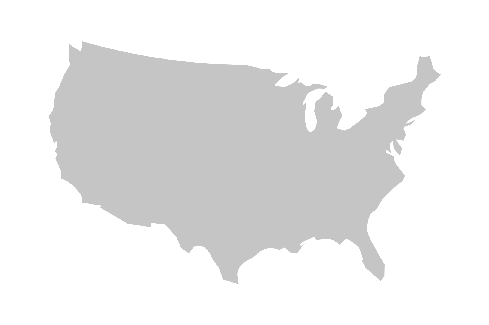

美国大陆

你可以在浏览器中查看此步骤，网址为 [`larsvers.github.io/learning-d3-mapping-11-1`](https://larsvers.github.io/learning-d3-mapping-11-1)。代码示例 ;[11_01.html](https://github.com/larsvers/Learning-D3.js-4-Mapping/blob/master/Chapter%2011%20-%20Hexbin%20Maps/11_01.html)。

在每个步骤结束时，您将在靠近相关图像的信息框中找到两个链接。第一个链接将带您到一个可以在浏览器中查看的此步骤的工作实现。第二个*代码示例*链接将带您到完整的代码。如果您正在阅读印刷版，您可以在[`github.com/larsvers/Learning-D3.js-4-Mapping`](https://github.com/larsvers/Learning-D3.js-4-Mapping)的相关章节中找到所有代码示例。

在我们继续之前，让我们退一步，看看我们是如何在命令行上生成*TopoJSON*数据的。原始的美国地图数据来自[`www.census.gov/geo/maps-data/data/cbf/cbf_nation.html`](https://www.census.gov/geo/maps-data/data/cbf/cbf_nation.html)，并且通过以下六个步骤从 shapefile 转换为 TopoJSON：

1.  如果您还没有安装，请安装`shapefile`：

```js
npm install -g shapefile 
```

1.  如果您还没有安装，请安装`topojson`：

```js
npm install -g topojson
```

1.  将 shapefile 转换为 GeoJSON：

```js
shp2json cb_2016_us_nation_20m.shp --out us-geo.json 
```

1.  将 Geo 转换为 TopoJSON：

```js
geo2topo us-geo.json > us-topo.json 
```

1.  压缩数字精度：

```js
topoquantize 1e5 < us-topo.json > us-quant.json 
```

1.  简化几何形状：

```js
toposimplify -s 1e-5 -f < us-quant.json > us.json 
```

您可以在[`bit.do/cl-carto`](http://bit.do/cl-carto)上了解更多关于命令行制图的信息。

# 为我们的六边形绘制点网格

我们的目的是在美国地图上绘制一个六边形网格。D3-hexbin 稍后会为我们做这件事，但它只能在有点的位置绘制六边形。因此，我们需要向它提供点。这些点对我们用户的任何信息价值都没有。它们将仅用于生成布局。因此，我们可以区分我们将需要的两种点：

+   **布局点**用于生成六边形镶嵌

+   **数据点**用于渲染颜色分级的信息

我们很快就会到达数据点，但在这个阶段，我们只关心我们的布局点。一旦完成，您将产生这个美妙而规则的点模式，它横跨我们的整个绘图区域：

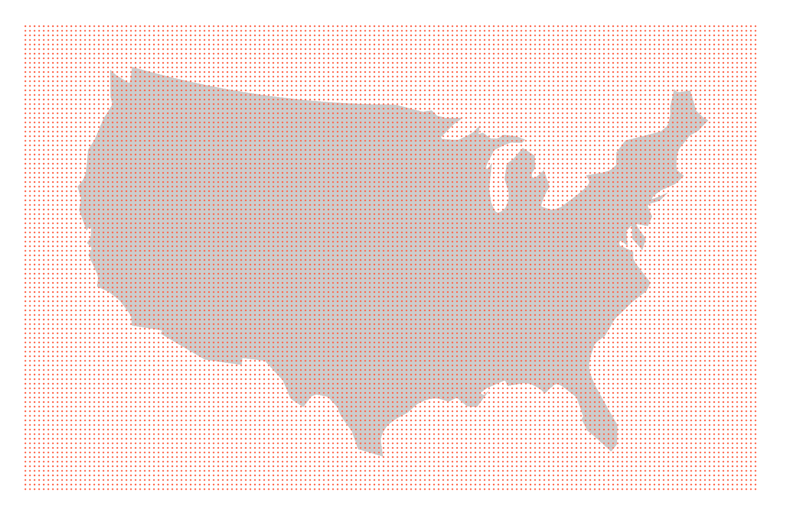

在美国上方的点网格

您可以在浏览器中查看此步骤，请访问[`larsvers.github.io/learning-d3-mapping-11-2`](https://larsvers.github.io/learning-d3-mapping-11-2)，以及代码示例在[11_02.html](https://github.com/larsvers/Learning-D3.js-4-Mapping/blob/master/Chapter%2011%20-%20Hexbin%20Maps/11_02.html)。

在下一个步骤中，我们将切割这个网格以适应美国的轮廓，但让我们先布局。请注意，这将是最复杂的计算部分。这不是火箭科学，但如果它一开始没有立即理解，请不要担心。一旦在调试器中逐步通过代码并/或使用几个`console.log()`，事情通常会变得清晰。无论如何，我们开始吧：

```js
var points = getPointGrid(160);
```

`getPointGrid()` 只接受一个参数：我们想要的点的列数。这足以让我们计算网格。首先，我们将获取每个点之间的像素距离。每个点之间的距离代表六边形中心之间的距离。`d3.hexbin()` 将为我们精确计算这个距离，但现在我们想要一个好的近似值。所以，如果我们决定有 160 列的点，我们的宽度是 840，最大距离将是*840 / 160 = 5.25*像素。然后我们计算行数。高度是 540，因此我们可以容纳*540 / 5.25*行，向下取整等于 108 行点：

```js
function getPointGrid(cols) {
  var hexDistance = width / cols;
  var rows = Math.floor(height / hexDistance);

  hexRadius = hexDistance/1.5;
```

接下来，我们将计算`hexRadius`。这看起来可能有点奇怪。为什么要把距离除以*1.5*？如果我们将**点**和期望的六边形**半径**输入 D3-hexbin 模块，它将为我们生成六边形。我们在这里设置的六边形半径应该保证生成的六边形足够大，至少包含我们生成的网格中的一个点。毕竟，我们想要一个无缝的六边形铺砖。所以，一个紧密的网格应该有一个小的半径，而一个宽的网格应该有一个更宽的半径。如果我们有一个宽的网格和小的半径，我们就不会为每个点得到一个六边形。会有缝隙。

幸运的是，六边形是规则的形状，它们的尺寸和属性是相互关联的。六边形中心之间的垂直距离是其半径的 1.5 倍，水平距离是√3（大约 1.73）：

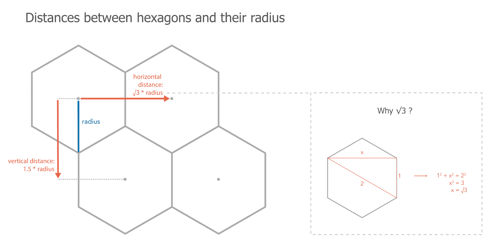

六边形距离和半径之间的关系

我们的网络点作为六边形中心的代理。因此，它们在布局上并不“完美”，因为它们的垂直距离与水平距离相同，都是*5.25*像素。在一个完美的六边形网格中，垂直距离会比水平距离略短，如图所示。为了在我们的代理网格的基础上获得相对紧密的六边形网格，我们应该选择一个安全的——即**宽的**——半径传递给 D3-hexbin 模块，它确实会提供一个完美的六边形网格。我们可以通过前图中的公式以及我们的距离（5.25 像素）通过求解*半径*来计算这个半径。当重新排列垂直距离的方程时，*距离 = 1.5 * 半径*变为*半径 = 距离 / 1.5*。在我们的情况下，距离是*5.25 / 1.5 =* 半径为*3.5*。使用水平距离将给我们一个更安全的——即更紧的——半径，*5.25 / √3 = 3.03*，这实际上会在我们的最终铺砖中产生一些缝隙。

接下来，我们将立即创建并返回网格——好吧，网格的坐标：

```js
return d3.range(rows * cols).map(function(el, i) {
    return {
      x: Math.floor(i % cols * hexDistance),
      y: Math.floor(i / cols) * hexDistance,
      datapoint: 0
    }
  });
} // end of getPointGrid() function
```

`d3.range(rows * columns)`创建一个数组，每个点对应一个元素。然后我们使用`.map()`遍历每个点，返回一个具有三个属性的对象：`x`、`y`和`datapoint`。这些属性将定义我们的每个网格点。*x*坐标在每个点增加`hexDistance`，并在每一行重置为*0*（或者换句话说，在它运行完所有列之后）。*y*坐标在每一行增加`hexDistance`。

同样重要的是，每个网格点都将获得一个名为`datapoints`的属性，我们将将其设置为*0*。这个属性将区分所有布局点（*0*）和数据点（*1*），这样我们就可以专注于后者。

恭喜！这是最困难的部分，而你仍然自豪地举起一个方形的番茄色点阵。

注意，虽然不是关键，但将我们在路上标记的网格和点可视化是非常有帮助的。这里有一个小函数，如果点存储在具有`x`和`y`属性的数组对象中，它会绘制这些点：

```js
function drawPointGrid(data) {
  svg.append('g').attr('id', 'circles')
    .selectAll('.dot').data(data)
    .enter().append('circle')
      .attr('cx', function(d) { return d.x; })
      .attr('cy', function(d) { return d.y; })
      .attr('r', 1)
      .attr('fill', 'tomato');
}
```

# 仅保留地图内的点

这些点的正方形网格与美国地图的形状仍然相距甚远。让我们改变一下。多亏了 D3 的`d3.polygonContains()`方法，这相当简单。该方法接受多边形的屏幕坐标和一个点，对于每个点，如果点在多边形内则返回`true`，否则返回`false`。这非常有帮助。

为了获取我们的美国地图的多边形，我们编写了一个名为`getPolygonPoints()`的小函数，并将其用作`ready()`函数的下一步，到目前为止，这个函数看起来是这样的：

```js
function ready(error, us) {
  var us = prepData(us);
  drawGeo(us);
  var points = getPointGrid(160);
 var polygonPoints = getPolygonPoints(us); }
```

我们传递的唯一参数是我们地图的 GeoJSON 对象数组，称为`us`。出于简单起见，我们决定只查看美国大陆。因此，我们首先需要将数据集中在美国大陆上：

```js
function getPolygonPoints(data) {
  var features = data.features[0].geometry.coordinates[7][0];

  var polygonPoints = []
  features.forEach(function(el) {
    polygonPoints.push(projection(el));
  });

  return polygonPoints;
}
```

`data.features[0].geometry.coordinates`包含 11 个多边形点对数组，描述了美国大陆、阿拉斯加、夏威夷以及更远的海域。我们想专注于美国大陆，其轮廓由第七数组中的第一个元素表示。请注意，如果您的数据来自不同的来源或以不同的方式组装，这可能会不同。

然后，我们将遍历所有`polygonPoints`，它们位于经纬度上，并将它们转换为*x*和*y*坐标以供进一步使用。

现在，我们既有美国地图的多边形边界，也有我们的网格点在像素坐标中。我们现在需要做的就是识别位于美国大陆内的网格点：

```js
var usPoints = keepPointsInPolygon(points, polygonPoints);
```

我们将这两个数组传递给一个我们大胆命名的`keepPointsInPolygon()`函数：

```js
function keepPointsInPolygon(points, polygon) {
  var pointsInPolygon = [];
  points.forEach(function(el) {
    var inPolygon = d3.polygonContains(polygon, [el.x, el.y]);
    if (inPolygon) pointsInPolygon.push(el);
  });
  return pointsInPolygon;
}
```

在这里，我们创建了一个名为`pointsInPolygon`的空数组，它将存储我们的美国专属点。然后我们遍历我们的网格点，并检查每个点是否位于美国多边形内。如果是，我们就将其传递到`pointsInPolygon.`中。

如果我们绘制这些点，我们会看到一个尖锐的美国地图：


美国在点上的表示

您可以在浏览器中查看此步骤：[`larsvers.github.io/learning-d3-mapping-11-3`](https://larsvers.github.io/learning-d3-mapping-11-3)，以及代码示例：[11_03.html](https://github.com/larsvers/Learning-D3.js-4-Mapping/blob/master/Chapter%2011%20-%20Hexbin%20Maps/11_03.html)。

# 制作六边形瓦片

点看起来很漂亮，但我们是来画六边形的。所以，让我们最终绘制它们并介绍 D3-hexbin 插件。

它需要我们从以下两个方面获取信息，并返回两个更有价值的东西：

+   我们需要提供一组在屏幕坐标中的**点**以及我们希望看到的**半径**。

+   它返回一个**六边形中心点**的网格（每个六边形一个）和一个**六边形路径生成器**。

然后，我们使用新的中心点和路径生成器，按照 D3 的惯例，使用我们选择的渲染器自己绘制它。首先，让我们获取六边形的中心点，然后用 SVG 绘制它们。在我们的 `ready()` 函数中，我们将添加以下两行：

```js
function ready(error, us) {
  //previous steps

  var hexPoints = getHexPoints(usPoints);
  drawHexmap(hexPoints);

}
```

`getHexPoints()` 获取中心点，`drawHexmap()` 绘制它们。

# 获取六边形中心点

如前所述，`d3.hexbin()` 有两个头。它的第一个用途是作为 D3 **布局函数**，例如 D3 提供的力布局、树布局或圆包布局函数。输入数据，输出增强数据。我们传递我们的数据和所需的六边形半径给它，对于它可以围绕其形状包裹的每一组数据点，它将返回该六边形的中心坐标。

如果我们只给它一个数据点，它将返回一个六边形。如果我们给出两个靠近的数据点，这样它们可以适应由半径定义的六边形的宽度和高度，它也将只返回一个六边形。如果第二个数据点离第一个数据点很远，以至于六边形无法用给定的半径覆盖它，`d3.hexbin()` 将产生第二个六边形，包围那个第二个点。

在这里，我们使用它的布局能力：

```js
function getHexPoints(points) {
  hexbin = d3.hexbin() // note: global
    .radius(hexRadius)
    .x(function(d) { return d.x; })
    .y(function(d) { return d.y; });

  var hexPoints = hexbin(points);
    return hexPoints;
}
```

首先，我们配置布局。我们将半径 3.5（5.25 的距离除以 1.5）添加到其中，并引导它的注意力到它可以找到 `x` 和 `y` 坐标的地方。在下一行，我们在我们的 `points` 网格上使用它，并返回如下所示的结果数组：

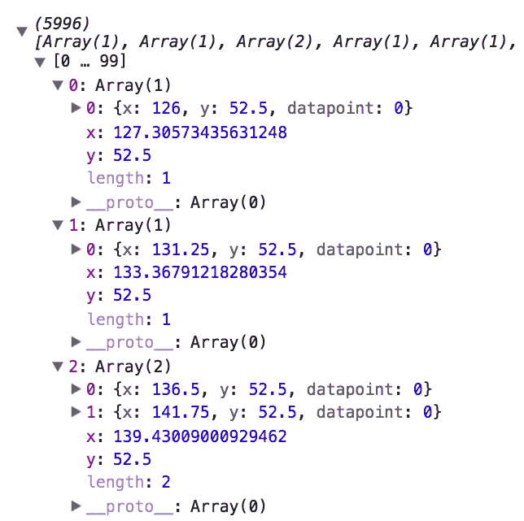

我们通过 d3.hexbin() 返回的 hexPoints

我们的网络点由 5,996 个六边形中心点表示，我们将其简称为**hex points**。让我们简要地了解一下。hexbin 布局返回一个数组。每个元素代表一个单独的六边形。在每个元素中，每个对象代表六边形覆盖的点。此外，`d3.hexbin()` 向数组添加两个键：`x` 和 `y`。它们的值代表六边形的中心。因此，对于每个六边形，我们都有所有点数据以及六边形的中心坐标。

如您在前面的截图中所见，前两个六边形仅覆盖一个网格点，而第三个覆盖两个网格点。您还可以看到数组键中的中心点与对象中的布局点略有不同。让我们可视化一下。

# 绘制六边形瓦片

我们已经有了六边形，现在只需要绘制它们。我们在`ready()`函数中通过一个新的函数`drawHexmap(hexPoints)`来完成这个任务。它就是它所说的那样：

```js
function drawHexmap(points) {
  var hexes = svg.append('g').attr('id', 'hexes')
    .selectAll('.hex').data(points)
    .enter().append('path')
      .attr('class', 'hex')
      .attr('transform', function(d) { 
        return 'translate(' + d.x + ', ' + d.y + ')'; })
      .attr('d', hexbin.hexagon())
      .style('fill', '#fff')
      .style('stroke', '#ccc')
      .style('stroke-width', 1);
}
```

我们将数据（以`points`的形式传入）与我们的虚拟选择`.hex`六边形连接，并使用`d.x`和`d.y`移动到每个六边形的中心。在每个中心，我们解开我们六边形实例的第二次使用：**六边形路径生成器**。`hexbin.hexagon()`将返回路径的`d`属性所需的字符串来绘制形状。六边形的尺寸将基于我们在配置期间传递给它的半径。其余的都是基本的样式。

`hexbin.hexagon()`也可以接受一个半径作为参数。使用访问器函数，我们甚至可以通过一个六边形点特定的参数传递，这意味着我们可以根据数据值改变每个六边形的大小。太棒了！然而，我们现在没有时间或数据来做这件事，所以让我们稍后再说。

好吧，那么。这是你的六边形瓦片；你应得的：


六边形地图

在浏览器中查看此步骤：[`larsvers.github.io/learning-d3-mapping-11-4`](https://larsvers.github.io/learning-d3-mapping-11-4)，以及代码示例：[11_04.html](https://github.com/larsvers/Learning-D3.js-4-Mapping/blob/master/Chapter%2011%20-%20Hexbin%20Maps/11_04.html)。

# 将数据点与布局点连接

到目前为止，我们只关注了基础层设置，将布局点可视化成六边形。现在，我们终于要添加一些真实数据了。首先，我们需要将其加载到我们的`d3.queue()`中：

```js
d3.queue()
  .defer(d3.json, 'data/us.json')
  .defer(d3.json, 'data/markets_overall.json')
  .await(ready);
```

在`ready()`函数中，我们只是向我们的可视化管道添加另一行，触发一个将为我们准备数据的函数：

```js
function ready(error, us) {
  // … previous steps
  var dataPoints = getDatapoints(markets)
}
```

`getDatapoints()`简单地接受加载的 CSV 数据，并返回一个更简洁的对象，具有*x*和*y*屏幕坐标以及`datapoint`标志，表示这不是布局点，而是一个实际的数据点。其余的是市场特定的数据，如`name`、`state`、`city`和`url`，我们可以用来为每个六边形添加信息：

```js
function getDatapoints(data) {

  return data.map(function(el) {
    var coords = projection([+el.lng, +el.lat]);
    return {
      x: coords[0],
      y: coords[1],
      datapoint: 1,
      name: el.MarketName,
      state: el.State,
      city: el.city,
      url: el.Website
    }
  });

}
```

回到`ready()`函数中，您只需将这些数据点连接到布局点，以获得您将用于最终六边形地图的完整数据集：

```js
function ready(error, us) {
  // … previous steps

  var dataPoints = getDatapoints(markets)
 var mergedPoints = usPoints.concat(dataPoints)
}
```

这里是市场数据，以蓝色表示的经典点密度图可视化，以及与红色表示的网格布局数据一起：

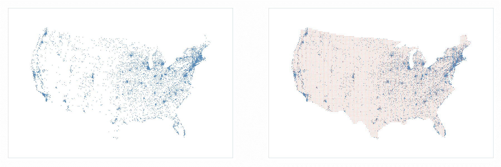

左图显示了农民市场点；右图显示了用蓝色表示的农民市场点和用红色表示的布局点。

在浏览器中查看此步骤，请访问 [`larsvers.github.io/learning-d3-mapping-11-5`](https://larsvers.github.io/learning-d3-mapping-11-5) 以及代码示例 [11_05.html](https://github.com/larsvers/Learning-D3.js-4-Mapping/blob/master/Chapter%2011%20-%20Hexbin%20Maps/11_05.html)。

太好了！我们离我们的六边形图又近了一步。我们需要创建一个可以可视化的值：市场的数量。

# 为最终表演打扮我们的数据

你有一些关于农民市场的真实数据，这些数据与六边形相关联，但你现在还不能使用它。所有你的数据仍然被存储在每个六边形对象的数组中。让我们将这些数据卷曲起来。

我们想要可视化的度量是每个六边形区域中农民市场的数量。因此，我们只需要计算具有 `datapoint` 值设置为 *1* 的对象数量。在此过程中，我们还将移除布局点对象，即 `datapoint` 值为 *0* 的对象；我们不再需要它们。

我们将把我们的任务添加到 `ready()` 函数中：

```js
function ready(error, us) {
  // … previous steps

  var hexPointsRolledup = rollupHexPoints(hexPoints);
}
```

主要的 `rollupHexPoints()` 函数将卷曲每个六边形点的市场数量。它将上图的六边形数据转换为以下图的下方六边形数据：

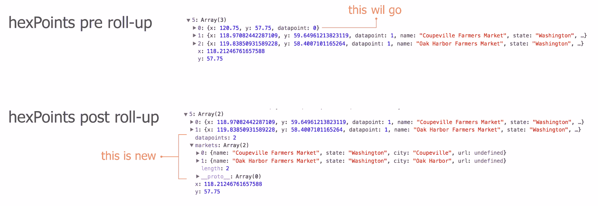

卷曲前后的六边形数据

`rollupHexPoints()` 将按以下顺序执行以下操作：

1.  移除布局网格点。

1.  计算数据点的数量，并将计数作为一个新的属性 `datapoints` 添加。

1.  收集关键市场数据到一个名为 `markets` 的单一数组中，以便于轻松访问交互。

1.  最后，它将产生我们迫切需要的用于六边形着色的颜色刻度。

我们开始：

```js
function rollupHexPoints(data) {
  var maxCount = 0;
```

我们首先初始化一个 `maxCount` 变量，它将后来包含单个六边形中农民市场的最大数量。我们需要这个变量来设置颜色刻度。

接下来，我们将遍历所有的布局和数据点：

```js
  data.forEach(function(el) {

    for (var i = el.length - 1; i >= 0; --i) {
      if (el[i].datapoint === 0) {
        el.splice(i, 1);
      }
    }
```

首先，我们将移除所有 `datapoint` 属性值为 `0` 的布局点对象。

接下来，我们将创建卷曲的数据。将有两个卷曲数据元素：一个表示六边形内农民市场的总数，以及一个我们可以用于后续交互的市场数据数组。首先，我们将设置变量：

```js
    var count = 0,
        markets = [];

    el.forEach(function(elt) {
      count++;
      var obj = {};
      obj.name = elt.name;
      obj.state = elt.state;
      obj.city = elt.city;
      obj.url = elt.url;
      markets.push(obj);
    });

    el.datapoints = count;
    el.markets = markets;
```

我们遍历六边形对象数组中的每个对象，一旦收集了数据，我们就将其作为键添加到数组中。现在这些数据与六边形点的 *x* 和 *y* 坐标处于同一级别。

注意，我们可以通过简化市场计数来取捷径。我们的 `datapoints` 属性只是计算数组中的元素数量。这与内置的 `Array.length` 属性所做的是完全相同的。然而，这是一个更自觉且更具描述性的方法，而且不会增加太多的复杂性。

在循环的最后一件事是更新 `maxCount`，如果特定六边形的计数值高于我们之前遍历的所有六边形的 `maxCount` 值：

```js
    maxCount = Math.max(maxCount, count);

  }); // end of loop through hexagons

  colorScale = d3.scaleSequential(d3.interpolateViridis)
    .domain([maxCount, 1]);

  return data;

} // end of rollupHexPoints()
```

在我们的`roll-up`函数中，我们最后要做的事情是创建我们的`colorScale`。我们使用的是*Viridis*颜色尺度，它具有很好的可视化计数数据的特性。请注意，*Viridis*将低数值映射到紫色，高数值映射到黄色。然而，我们希望高数值更暗（更多紫色），低数值更亮（更多黄色）。我们将通过翻转我们的域映射来实现这一点。

尺度内部工作的方式是，我们从域中提供的每个值都将被归一化到*0*到*1*之间的值。我们传递给`.domain()`数组的第一个数字将被归一化到*0*——在我们的例子中是`maxCount`或 169。第二个数字（1）将被归一化到*1*。输出范围也将映射到*0*到*1*的范围，对于*Viridis*来说意味着*0 = 紫色*和*1 = 黄色*。当我们向我们的尺度发送一个值时，它将归一化该值并返回*0*到*1*之间的相应范围值。以下是将数字 24 输入时的结果：

1.  尺度接收*24*作为输入（如`colorScale(24)`）。

1.  根据`.domain()`输入（`[max, min]`而不是`[min, max]`），尺度将*24*归一化到*0.84*。

1.  接下来，尺度查询*Viridis*插值器，询问哪种颜色对应于*Viridis*颜色尺度上的*0.84*值。插值器返回颜色`#a2da37`，这是一种浅绿色。这很有道理，因为 0.84 更接近 1，代表黄色。浅绿色显然比深紫色更接近黄色，而插值器将其编码为*0*。

那就是全部了！

几乎是。我们最后要做的就是跳入我们的`drawHexmap()`函数，并将六边形的着色更改为我们的`colorScale:`。

```js
function drawHexmap(points) {
  var hexes = svg.append('g').attr('id', 'hexes')
   .selectAll('.hex').data(points)
   .enter().append('path')
     .attr('class', 'hex')
     .attr('transform', function(d) { 
        return 'translate(' + d.x + ', ' + d.y +')'; 
     })
     .attr('d', hexbin.hexagon())
 .style('fill', function(d) { 
        return d.datapoints === 0 ? 'none' : colorScale(d.datapoints); 
     })     .style('stroke', '#ccc')
     .style('stroke-width', 1);
}
```

如果六边形不覆盖任何市场，其数据点的属性将为 0，我们不会对其进行着色。否则，我们选择适当的 Viridis 颜色。

这里就是它：

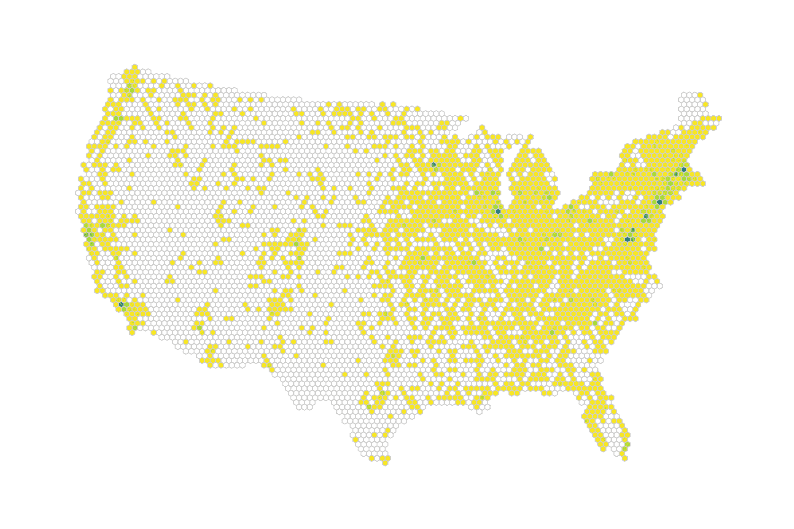

一个非常黄色的六边形图

看起来很黄，不是吗？问题是我们的数据中有一两个异常值。东海岸的那个单独的深紫色点就是纽约，它的农民市场数量比任何其他地区都多得多（169）。华盛顿和波士顿也很繁忙。然而，这使得我们的视觉效果不那么有趣。观察数字的分布告诉我们，大多数六边形包含 20 个或更少的农民市场：

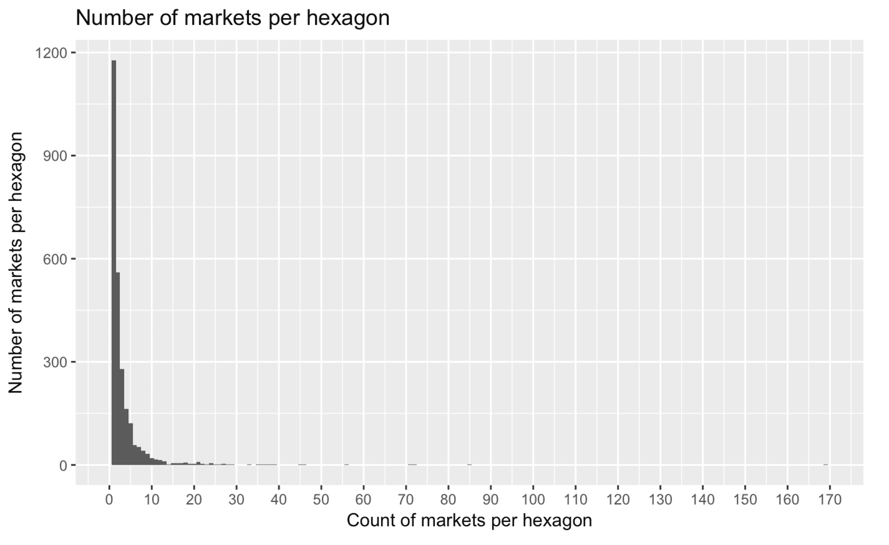

每个六边形内的农民市场数量

然而，每个六边形内的市场数量最高目前是 169。我们可以做两件事。我们可以选择一个较低的值作为我们的最大颜色尺度值，比如说 20。这样，我们的值将从 1 缩放到 20 到*Viridis*光谱。所有具有更高值的六边形将默认接收最大颜色（紫色）。

一个更优雅的替代方案是使用 **指数插值器** 作为颜色刻度。我们的域将不是线性映射，而是指数映射到我们的颜色输出，有效地使用更低的值达到颜色光谱的末端（紫色）。为了实现这一点，我们只需要一个新的具有自定义插值器的颜色刻度。让我们首先看看代码：

```js
colorScale = d3.scaleSequential(function(t) {

    var tNew = Math.pow(t,10);
    return d3.interpolateViridis(tNew)

}).domain([maxCount, 1]);
```

我们在这里究竟做了什么？让我们重新考虑在前面代码中经历的缩放步骤：

1.  刻度接收一个数字 *24*（如在 `colorScale(24)` 中）。

1.  根据 `.domain()` 输入（`[max, min]` 而不是 `[min, max]`），刻度将 *24* 归一化为 0.84。对于点 *1* 和 *2* 没有变化。

1.  在旧的 `colorScale` 中，我们只是简单地通过这个在 *1* 和 *0* 之间的 *线性归一化值*，没有我们的干预。现在，我们将其作为一个回调函数的参数。惯例让我们称这个为 `t`。现在，我们可以按需使用和转换它。正如我们之前看到的，许多六边形围绕着 1 到 20 个市场，围绕更多的很少。因此，我们希望在值域的较低范围内遍历 Viridis 颜色空间的大部分，以便颜色刻度编码我们数据的有兴趣的部分。我们如何做到这一点？

1.  在我们将 `t` 传递给我们的颜色插值器之前，我们将其设置为 *10 的幂*。我们可以使用不同的指数，但 *10* 就足够了。一般来说，取一个介于 *0* 和 *1* 之间的数字的幂会得到一个更小的数字。幂越高，输出就越小。我们的线性 `t` 是 *0.84*；我们的指数 `tNew` 等于 *0.23*。

1.  最后，我们将 `tNew` 传递给 *Viridis* 插值器，它输出相应的——更暗的——颜色。

让我们绘制这个转换以澄清：

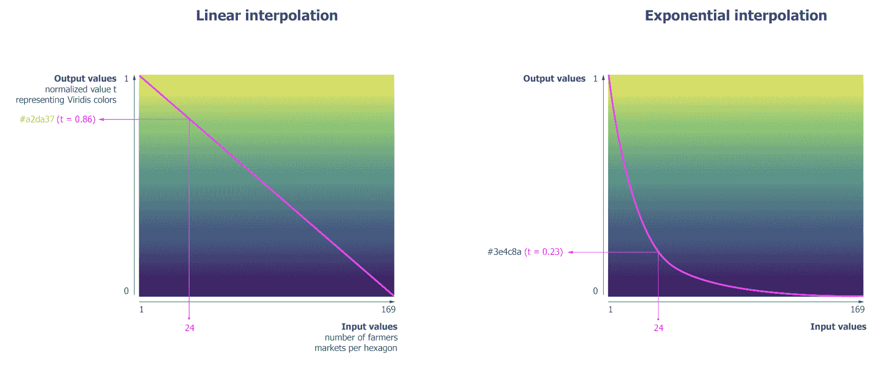

线性与指数颜色插值

*x 轴* 显示输入值，*y 轴* 显示我们发送到插值器以检索相应颜色的刻度归一化值 `t`。**左图** 显示线性插值做了什么。它将值的增加线性地转换为 `t` 的减少。**右图** 中的曲线显示我们调整后的 `tNew` 在将 `t` 设置为 *10 的幂* 后的行为：我们使用更小的输入值进入 `t` 的较低区域（更紫的区域）。换句话说，我们在一个更小的域值范围内遍历从黄色到紫色的颜色空间。将我们的示例值 24 通过 *线性插值* 会返回一个黄绿色的值；通过我们的 *指数插值* 已经返回了颜色光谱末端的紫色值。

这个主要的优势是，颜色差异可以在数据所在的位置而不是在主要数据簇和异常值之间的差距处看到。以下是我们的指数刻度六边形图：

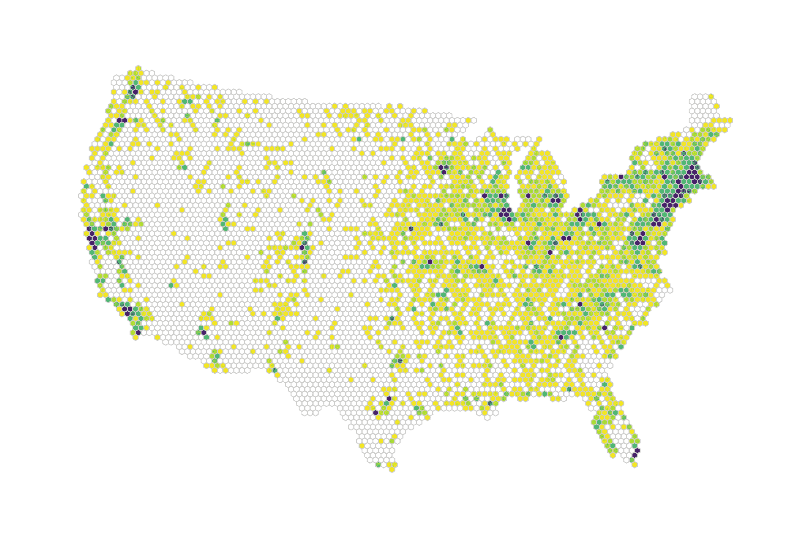

一个更有趣颜色的六边形图

在浏览器中查看此步骤：[`larsvers.github.io/learning-d3-mapping-11-6`](https://larsvers.github.io/learning-d3-mapping-11-6)，以及代码示例：[11_06.html](https://github.com/larsvers/Learning-D3.js-4-Mapping/blob/master/Chapter%2011%20-%20Hexbin%20Maps/11_06.html)。

让我们暂时陶醉于我们的成就，但我们已经完成了吗？我们迫不及待地想更深入地探索这个地图。毕竟，人们习惯于玩地图，试图在其中定位自己或轻松地从一处移动到另一处。这就是我们在最后一步将允许的事情。

# 将我们的视觉应用转变为一个交互式应用

您已正式构建了一个六边形地图，这确实是本章的关键焦点。然而，在本节的最后，让我们悠闲地考虑如何使这个应用对我们和我们的用户来说更加吸引人和信息丰富。我们不会像前几节那样详细，但会概述如何改进应用的一般步骤。

这里有一份我们可以做的事情列表：

1.  在悬停时以列表形式显示市场。

1.  允许用户更改六边形的尺寸。

1.  允许用户更改颜色插值器的指数。

1.  显示哪些市场销售特定产品，例如奶酪、葡萄酒、海鲜等。

1.  将第二个变量编码为六边形大小。

第一点是标准的。第二和第三点对于数据探索非常有帮助。第四点是可能的，因为数据还涵盖了指定每个市场销售什么产品的变量。最后一点将有助于我们使用`d3.hexbin()`模块进行实践。

我们不会详细说明这些点的每个细节，但请查看完成的[`larsvers.github.io/learning-d3-mapping-11-8`](https://larsvers.github.io/learning-d3-mapping-11-8)应用。代码有注释，并在`Chapter 11`文件夹中的示例[11_08.html](https://github.com/larsvers/Learning-D3.js-4-Mapping/blob/master/Chapter%2011%20-%20Hexbin%20Maps/11_08.html)中提供，位于[`github.com/larsvers/Learning-D3.js-4-Mapping`](https://github.com/larsvers/Learning-D3.js-4-Mapping)上。

# 在悬停和点击时添加额外信息

工具提示是大多数可视化中的一种有用的探索技术，以便向用户提供有关特定数据点或区域的信息。在这种情况下，应用的最小数据单元是六边形。然而，一些六边形包含更多适合工具提示的信息——多达 169 个，如我们上面所见。为了允许用户按区域浏览市场，我们将添加一个侧面板，列出所有悬停六边形中的市场。这将是它的样子：


带有标题、工具提示和每个六边形市场列表的交互式六边形地图

在浏览器中查看此步骤的[`larsvers.github.io/learning-d3-mapping-11-8`](https://larsvers.github.io/learning-d3-mapping-11-8)。代码示例在[11_08.html](https://github.com/larsvers/Learning-D3.js-4-Mapping/blob/master/Chapter%2011%20-%20Hexbin%20Maps/11_08.html)。请使用较新的 Chrome 浏览器查看或工作在这些示例中。

当用户移动时，列表会迅速变化，因此点击六边形会锁定列表视图，以便用户可以探索并可能使用链接访问市场的网站。

# 改变六边形的大小

与点密度地图相比，六边形地图的一个关键优势是交互更容易。如果你在地图上有许多点，你可能必须保持它们很小（1-3 像素）以传达良好的数据感。这样的小目标很难用鼠标捕捉。此外，一些点不可避免地会重叠，因此你根本无法到达它们。在六边形地图中，每个六边形都是可到达的，如果它不是太小。我甚至可以说，我们选择的六边形大小可能有点小，**3.5**像素。让我们添加一个下拉控制，允许用户更改区域的大小。以下是一些六边形大小变体：


不同的六边形半径

这里有两个注意事项：当我们构建像我们这样的规则六边形镶嵌地图时，可能会遇到**边界问题**。想象一个六边形刚好接触佛罗里达州的尖端。这个六边形的 5%在陆地上，95%在海上。然而，地图读者看不到真正的海岸线。他们假设六边形代表海岸线，覆盖 100%的陆地面积。如果佛罗里达州这个角落有高密度点，这个六边形应该编码它。然而，因为它只覆盖了 5%的陆地，也许大约 5%的点密度，它对读者来说就像佛罗里达州的海岸线没有点一样。

当你观察上面不同大小的六边形时，会出现另一个明显的问题，即所谓的**可修改面积单位问题**（MAUD）。我们编码的汇总值高度依赖于我们聚合单元的形状和规模。这是一个问题，因为当相同的分析应用于相同的数据时，结果可能会有所不同。你可以在上面看到*尺度效应*；改变六边形的大小会导致对农贸市场密度的不同感知。*形状*或*区域效应*可能更加成问题。例如，使用与相同规模不同的形状，比如 10 英里正方形而不是 10 英里六边形，可以改变总体和因此分析。这样，分析就变成了对不同箱子的分析，而不是对基础数据的分析。这种效应在表示非任意单位（如县或人口普查区）时尤其成问题，这些单位可能会随时间改变形状，但在读者的心目中保持一致。

您可以通过叠加国家轮廓来解决边界问题，但缓解任何这些问题的关键步骤是您的意识，向读者解释潜在问题。

# 改变颜色比例插值器

在探索性显示中，用户改变比例以发现感兴趣的数据区域可能是有益的。通过允许我们的用户调整插值器，他们可以关注他们感兴趣的价值范围。我们想要公开的参数是我们指数插值器使用的指数：


改变颜色比例插值器

# 浏览不同的数据集

我们在这里使用的农民市场数据也提供了超过 29 个二元变量，表明市场提供的产品或设施。展示不同产品地理分布的多个数据集是一个好选择。或者，我们可以为用户添加下拉菜单，让他们选择他们最感兴趣的产品。以下是一些示例：

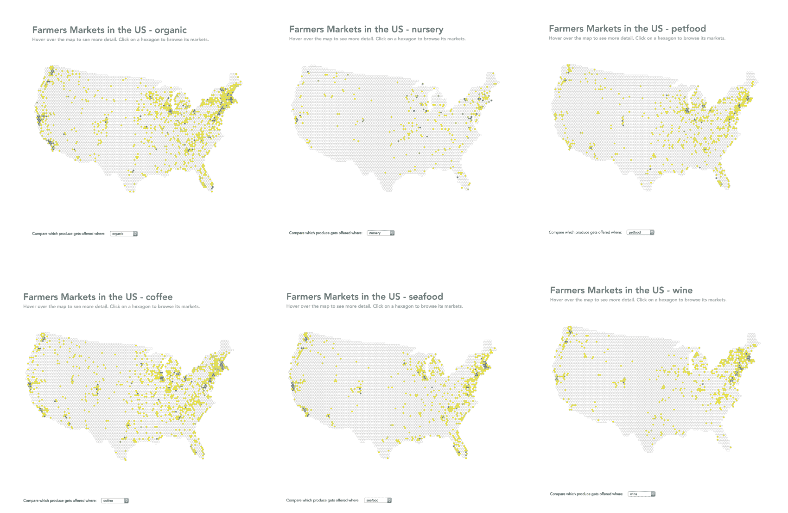

不同数据集的六边形图（我们选择了 29 个二元变量中的 20 个）

# 将数据编码为六边形大小

到目前为止，我们只将数据编码为颜色。`d3.hexbin()`使得通过六边形大小编码数据变得非常简单。理论上，你只需进入你的`drawHexmap()`函数并更改一行：

```js
  .attr('d', function(d) { return hexbin.hexagon(d.datapoints); })
```

您只需将六边形特定的半径添加到您的`hexbin`路径生成器中（作为`.hexagon()`方法的可选参数），在我们的例子中，这确保每个六边形都得到一个与该六边形农民市场的数量一样小或大的半径。然而，这看起来会过于夸张，因为大多数将得到半径为*0*，而一些将得到超过*100*的半径。我将省略视觉效果。

相反，我们将添加变量`radiusScale`到混合中（在`rollUpHexPoints()`中），这将使大小在`3.5`到`15`像素之间缩放：

```js
radiusScale = d3.scaleSqrt().domain([0, maxCount]).range([3.5, 15]);
```

现在当您绘制六边形时，您也应该按升序排序，以便较大的六边形不会被周围的许多小六边形覆盖：

```js
function drawHexmap(points) {
  var hexes = svg.append('g').attr('id', 'hexes')
    .selectAll('.hex')
 .data(points.sort(function(a,b) { 
        return a.datapoints - b.datapoints;        
    }))    .enter().append('path')
      .attr('class', 'hex')
      .attr('transform', function(d) { 
        return 'translate(' + d.x + ', ' + d.y + ')'; 
      })
 .attr('d', function(d) { 
        return hexbin.hexagon(radiusScale(d.datapoints)); 
      })      .style('fill', function(d) { return 
        d.datapoints === 0 ? 'none' : colorScale(d.datapoints); 
      })
      .style('stroke', '#ccc')
      .style('stroke-width', 1);
}
```

您得到的六边形不仅着色，而且根据六边形内的市场数量进行大小编码：

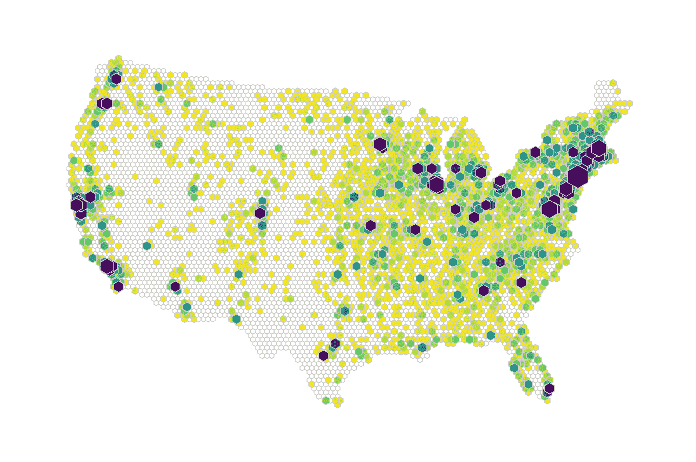

市场数量编码为颜色和半径大小

在浏览器中查看此步骤的链接为[`larsvers.github.io/learning-d3-mapping-11-7`](https://larsvers.github.io/learning-d3-mapping-11-7)，代码示例在[11_07.html](https://github.com/larsvers/Learning-D3.js-4-Mapping/blob/master/Chapter%2011%20-%20Hexbin%20Maps/11_07.html)。

我们在这里通过颜色和大小双重编码市场数量。这有时很有用，但您现在有两个编码通道可供使用，您可以使用两个变量来生成**双变量六边形图**。这是您的选择。

我们介绍了几种改进和添加到我们的六边形地图的选项。当然，还有更多选项可以让我们玩得开心。例如，我们还没有涉及到缩放和平移，这当然是一种标准的地图交互技术，对于想要深入研究更小六边形的人来说，这将是一个很好的补充。我相信你还能想到更多构建它的方法。

# 摘要

我们首先比较了几种地图可视化技术。我们介绍了等值线图、地图图和点密度图的使用、优点和注意事项。我们迅速转向六边形形状，并探讨了其几何属性如何帮助等值线图和点密度图。

然而，大部分时间都花在了制图工作坊中，从头开始构建一个六边形地图。我们本可以构建一个简单的六边形地图，只需覆盖有数据点的区域，但我们的目标是打造一个完全由六边形构成的地图，以追求乐趣和美观。这意味着需要更多的数据准备——创建地图形状的布局网格，连接数据点，最终添加并使用颜色编码六边形——但难道它看起来不漂亮吗？

最后，我们将静态地图转换成了一个交互式应用程序，将形状和信息获取的控制权交给了用户。交互可以实现很多事情，尤其是对于地图来说！

在创建了一个完全功能性的交互式可视化之后，你可能想要向世界展示它。有许多方式可以在线占据一些空间；在下一章中，我们将探讨一个方便简单的方法：*GitHub 页面*。
