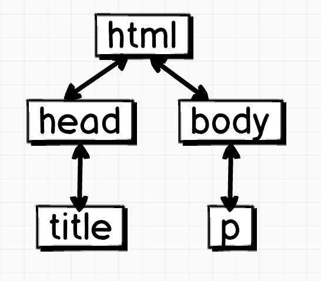
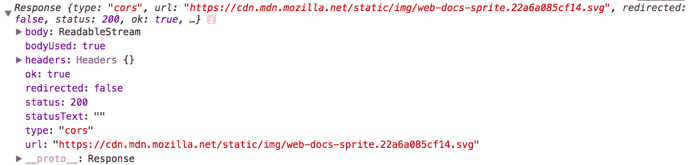

# 第九章：网页上的 JavaScript

你好！到目前为止，我们已经学习和创建了对 JavaScript 的坚实基础理解，包括它在底层是如何工作的以及它包含的内容。但我们实际上是如何使用它的呢？我们如何开始构建一些东西？这就是本章要处理的内容。

在本章中，我们将学习以下内容：

+   HTML5 和现代 JavaScript 的兴起

+   **文档对象模型 (DOM**) 是什么？

+   DOM 方法/属性

+   现代 JavaScript 浏览器 API

+   页面可见性 API

+   导航器 API

+   剪贴板 API

+   Canvas API - 网络的画板

+   Fetch API

# HTML5 和现代 JavaScript 的兴起

HTML5 规范于 2008 年发布。然而，HTML5 在 2008 年的技术如此先进，以至于预测它至少要到 2022 年才准备好！然而，结果证明这是不正确的，现在我们有了完全支持的 HTML5 和支持 ES6/ES7/ES8 的浏览器。

许多 HTML5 使用的 API 都与 JavaScript 密不可分。在查看这些 API 之前，让我们了解一下 JavaScript 如何看待网络。这将最终使我们处于强大的位置，以理解各种有趣的 JavaScript 相关事物，例如 Web Workers API，它值得拥有自己的章节（剧透警告：它包含在这本书中！）

# HTML DOM

HTML DOM 是文档外观的树形版本。以下是一个非常简单的 HTML 文档示例：

```js
<!doctype HTML>
<html>
    <head>
        <title>Cool Stuff!</title>
    </head>
    <body>
        <p>Awesome!</p>
    </body>
</html>
```

它的树形版本将看起来如下：



之前的图只是一个 DOM 树的大致表示。HTML 标签由 **head** 和 **body** 组成；此外，`<body>` 标签包含一个 `<p>` 标签，而 `<head>` 标签包含 `<title>` 标签。简单！

JavaScript 可以直接访问 DOM，并可以修改这些节点之间的连接，添加节点，删除节点，更改内容，附加事件监听器等。

# 文档对象模型 (DOM) 是什么？

简而言之，DOM 是一种将 HTML 或 XML 文档表示为节点的方式。这使得其他编程语言更容易连接到遵循 DOM 的页面并相应地修改它。

为了清楚起见，DOM 不是一个编程语言。DOM 为 JavaScript 提供了一种与网页交互的方式。你可以将其视为一个标准。每个元素都是 DOM 树的一部分，可以通过暴露给 JavaScript 的 API 进行访问和修改。

DOM 不限于只能由 JavaScript 访问。它是语言无关的，并且有各种语言模块可用于解析 DOM（就像 JavaScript 一样），包括 PHP、Python、Java 等。

如前所述，DOM 为 JavaScript 提供了一种与之交互的方式。如何？嗯，访问 DOM 就像访问 JavaScript 中的预定义对象一样简单：`document`。DOM API 指定了你将在 `document` 对象中找到的内容。`document` 对象实际上为 JavaScript 提供了对由你的 HTML 文档形成的 DOM 树的访问。如果你注意到，不首先访问 `document` 对象，你根本无法访问任何元素。

# DOM 方法/属性

所有 HTML 元素在 JavaScript 中都是对象。最常用的对象是 `document` 对象。它将整个 DOM 树附加到它上面。你可以在那里查询元素。让我们看看这些方法的几个非常常见的例子：

+   `getElementById` 方法

+   `getElementsByTagName` 方法

+   `getElementsByClassName` 方法

+   `querySelector` 方法

+   `querySelectorAll` 方法

这绝不是所有可用方法的详尽列表。然而，这个列表至少应该能让你开始 DOM 操作。使用 MDN 作为你参考各种其他方法的依据。以下是链接：[`developer.mozilla.org/en-US/docs/Web/API/Document#Methods`](https://developer.mozilla.org/en-US/docs/Web/API/Document#Methods)。

# 使用 `getElementById` 方法

在 HTML 中，你可以给一个元素分配一个 `ID`，然后在 JavaScript 中检索它以进行操作。下面是如何做的：

```js
<div id="myID">My Content Here</div>
<script>
const myID = document.getElementById('myID'); // myID now contains reference to the div above
</script>
```

一旦你有了这个，你就可以访问这个对象的属性，这实际上会根据需要修改屏幕上的元素。

# 使用 `getElementsByTagName` 方法

与 `ID` 方法类似，`getElementsByTagName(<标签名>)` 获取元素有一些区别：

+   它给你一组元素而不是单个元素（数组）

+   它基于元素的标签名查询元素，而不是 `ID` 值

下面是一个例子：

```js
<div>My Content Here</div>
<script>
const div = document.getElementsByTagName('div')[0];
div.innerHTML = "Cool"; // above div's text is replaced with "Cool"
</script>
```

注意到单词 `getElements`。它返回给我们一堆元素。因此，我们从 `NodeList` 中选择第一个元素并将其内容设置为 `Cool`。

`innerHTML` 用于更改你正在工作的元素内部的 HTML 内容。

# 使用 `getElementsByClassName` 方法

`getElementsByClassName` 方法将返回具有相同类的元素作为一个 `NodeList`，而不是一个 `Array`！`NodeList` 并不完全是一个 `Array`；然而，它是可迭代的，并且很容易转换成 `Array`：

```js
<span class="tag">Hello</span>
<span class="tag">Hi</span>
<span class="tag">Wohoo!</span>

<script>
const tags = document.getElementsByClassName('tag'); // This is a NodeList (not Array)
try {
  tags.map(tag => console.log(tag)); // ERROR! map is not a function
} catch(e) {
  console.log('Error ', e);
}

[...tags].map(tag => console.log(tag)); // No error
</script>
```

如前所述，`tags` 实际上是一个 `NodeList`。首先，我们使用一个解构操作符并用方括号包围它，实际上将其转换为一个 `Array`。然后我们使用 `map`（我们可以在 `Array` 上使用它，但不能在 `NodeList` 上使用）来遍历每个标签，即 `<span>` 元素，我们只是控制台输出这个元素。

从这段代码中我们可以学到的是我们如何在其中使用解构操作符。你经常会发现自己经常使用我们之前学过的重要概念。

# 使用 `querySelector` 方法

`querySelector`方法以与通过 CSS 选择器选择元素相同的方式返回一个元素。然而，`document.querySelector`只返回一个元素。因此，一旦我们查询到该元素，我们就可以直接操作它：

```js
<div data-attr="coolDIV">Make me red!</div>
<script>
document.querySelector('div[data-attr]').style.color = 'red'; // div becomes red
</script>
```

如果在文档中只有一个`<div>`标签，这相当于执行`document.querySelector('div').style.color = 'red';`。

# 使用 querySelectorAll 方法

就像您可以使用`querySelector`获取任何元素一样，您也可以使用`querySelectorAll`获取符合特定标准的多个元素。您已经在`getElementsByClass`方法中看到了如何使用`NodeList`。试着理解以下代码：

```js
<div data-attr="red">Make me red!</div>
<div data-attr="blue">Make me blue!</div>

<script>
[...document.querySelectorAll('div[data-attr]')].map(div => {
    div.style.color = div.attributes['data-attr'].value;
});
</script>
```

首先，我们使用解构将`NodeList`转换为`Array`。然后我们映射数组，并根据每个`<div>`的 data-attr 值更改其样式。

# 现代 JavaScript 浏览器 API

HTML5 从一开始就为 JavaScript 中一些很棒和酷的 API 提供了大量支持。尽管一些 API 是与 HTML5 本身一起发布的（例如 Canvas API），但也有一些是在之后添加的（例如 Fetch API）。

让我们看看一些这些 API 以及如何使用它们的代码示例。

# 页面可见性 API - 用户是否仍然在页面上？

**Page Visibility API**允许开发者在其页面的用户获得或失去焦点时运行特定的代码。想象一下，如果你运营一个游戏托管网站，并且希望在用户失去对您的标签的焦点时暂停游戏。这就是你该采取的方法！

```js
function pageChanged() {
  if (document.hidden) {
    console.log('User is on some other tab/out of focus') // line #1
  } else {
    console.log('Hurray! User returned') // line #2
  }
}

document.addEventListener("visibilitychange", pageChanged);
```

我们向文档添加了一个事件监听器；它会在页面更改时触发。当然，`pageChanged`函数也会在参数中接收到一个事件对象，但我们可以简单地使用`document.hidden`属性，该属性返回一个布尔值，取决于代码调用时的页面可见性。

你将在`line #1`处添加你的`*pause game*`代码，并在`line #2`处添加你的`*resume game*`代码。

# navigator.onLine API – 用户网络状态

`navigator.onLine` API 会告诉你用户是否在线。想象一下，如果你正在开发一个多人游戏，并且希望当用户断开互联网连接时游戏自动暂停。这就是你该采取的方法！

```js
function state(e) {
    if(navigator.onLine) {
        console.log('Cool we\'re up');
    } else {
        console.log('Uh! we\'re down!');
    }
}

window.addEventListener('offline', state);
window.addEventListener('online', state);
```

在这里，我们向 window 全局对象附加了两个事件监听器。我们希望在用户离线或在线时调用`state`函数。

浏览器会在用户离线或在线时调用`state`函数。我们可以通过`navigator.onLine`访问它，如果存在互联网连接，则返回一个布尔值`true`，如果没有，则返回`false`。

# Clipboard API - 以编程方式操作剪贴板

**Clipboard API**最终允许开发者在不使用那些令人讨厌的 Adobe Flash 插件黑客手段的情况下将内容复制到用户的剪贴板。以下是您将如何将选择复制到用户剪贴板的方法：

```js
<script>
function copy2Clipboard(text) {
  const textarea = document.createElement('textarea');
  textarea.value = text;
  document.body.appendChild(textarea);
  textarea.focus();
  textarea.setSelectionRange(0, text.length);
  document.execCommand('copy');
  document.body.removeChild(textarea);
}
</script>

<button onclick="copy2Clipboard('Something good!')">Click me!</button>
```

首先，我们需要用户实际点击按钮。一旦用户点击按钮，我们就调用一个函数，在后台使用`document.createElement`方法创建一个`textarea`。然后脚本将`textarea`的值设置为传入的文本（这很好！）我们接着聚焦到那个`textarea`并选择其中的所有内容。

一旦内容被选中，我们就使用`document.execCommand('copy')`执行复制；这会将文档中的当前选择复制到剪贴板。由于现在`textarea`中的值被选中，它就被复制到剪贴板。最后，我们从文档中移除`textarea`，以免它破坏文档布局。

你不能在没有用户交互的情况下触发`copy2Clipboard`。我的意思是，显然你可以，但如果事件不是来自用户（点击、双击等），`document.execCommand('copy')`将不会工作。这是一个安全实现，以确保用户的剪贴板不会被他们访问的每个网站所干扰。

# Canvas API - 网页的绘图板

HTML5 终于引入了对`<canvas>`的支持，这是一种在网页上绘制图形的标准方式！Canvas 几乎可以用于你所能想到的与图形相关的任何事情；从用笔数字化签名，到在网页上创建 3D 游戏（3D 游戏需要 WebGL 知识，感兴趣吗？- 访问[`bit.ly/webgl-101`](http://bit.ly/webgl-101))。

让我们通过一个简单的例子来看看 Canvas API 的基础：

```js
<canvas id="canvas" width="100" height="100"></canvas>

<script>
  const canvas = document.getElementById("canvas");
  const ctx = canvas.getContext("2d");
  ctx.moveTo(0,0);
  ctx.lineTo(100, 100);
  ctx.stroke();
</script>
```

这将产生以下结果：


它是如何做到这一点的？

1.  首先，`document.getElementById('canvas')`给我们提供了文档中画布的引用。

1.  然后我们获取画布的**上下文**。这是指明我想对画布做什么的一种方式。当然，你可以在那里放一个 3D 值！当你使用 WebGL 和 canvas 进行 3D 渲染时，情况确实如此。

1.  一旦我们有了对上下文的引用，我们就可以做很多事情，并直接添加 API 提供的方法。在这里，我们将光标移动到了(0, 0)坐标。

1.  然后我们画了一条线到(100,100)（这在正方形画布上基本上是斜线）。

1.  然后我们调用 stroke 来实际上在我们的画布上绘制。很简单！

Canvas 是一个广泛的话题，值得有一本自己的书！如果你对使用 Canvas 开发酷炫的游戏和应用程序感兴趣，我建议你从 MDN 文档开始：[`bit.ly/canvas-html5`](http://bit.ly/canvas-html5)。

# Fetch API - 基于 Promise 的 HTTP 请求

浏览器中引入的最酷的异步 API 之一是 Fetch API，它是`XMLHttpRequest` API 的现代替代品。你有没有发现自己只是为了简化 AJAX 请求而使用 jQuery 的$.ajax？如果你有，那么这个 API 对你来说肯定是一块金子，因为它**本地**更容易编写和阅读！

如果你还记得，我们在第四章“异步编程”中自己创建了一个`XMLHttpRequest`的承诺版本。然而，`fetch`是原生的，因此，它有性能优势。让我们看看它是如何工作的：

```js
fetch(link) 
.then(data => {
    // do something with data
})
.catch(err => {
    // do something with error
});
```

太棒了！所以`fetch`使用承诺！如果是这样，我们可以将其与 async/await 结合使用，使其看起来完全同步且易于阅读！

```js


const get2Images = async () => {
    const image1 = await fetch('https://cdn.mdn.mozilla.net/static/img/web-docs-sprite.22a6a085cf14.svg');
    const image2 = await fetch('https://www.google.com/images/branding/googlelogo/1x/googlelogo_color_150x54dp.png');
    console.log(image1); // gives us response as an object
    const blob1 = await image1.blob();
    const blob2 = await image2.blob();

    const url1 = URL.createObjectURL(blob1);
    const url2 = URL.createObjectURL(blob2);

    document.getElementById('img1').src = url1;
    document.getElementById('img2').src = url2;

    return 'complete';
}

get2Images().then(status => console.log(status));
```

`console.log(image1)`这一行将打印以下内容：



您可以看到`image1`响应提供了关于请求的大量信息。它有一个有趣的字段 body，实际上是一个`ReadableStream`，以及可以转换为我们的**二进制大对象（BLOB**）的数据字节流。

一个`blob`对象代表一个不可变和原始数据的文件样对象。

在获取到`Response`之后，我们将其转换为`blob`对象，这样我们就可以将其用作图像。在这里，`fetch`实际上直接获取图像，因此我们可以将其作为`blob`（而不是将其链接到主网站）提供给用户。

因此，这可以在服务器端完成，`blob`数据可以通过 WebSocket 或其他类似方式传递下来。

# Fetch API 自定义

Fetch API 非常可定制。您甚至可以在请求中包含自己的头信息。假设您有一个网站，只有拥有有效令牌的认证用户才能访问图像。以下是您如何向请求添加自定义头信息的方法：

```js
const headers = new Headers();
headers.append("Allow-Secret-Access", "yeah-because-my-token-is-1337");

const config = { method: 'POST', headers };

const req = new Request('http://myawesomewebsite.awesometld/secretimage.jpg', config);

fetch(req)
.then(img => img.blob())
.then(blob => myImageTag.src = URL.createObjectURL(blob));
```

在这里，我们向我们的`Request`添加了一个自定义头，然后创建了一个名为`Request`的对象（一个包含我们`Request`信息的对象）。第一个参数，即`http://myawesomewebsite.awesometld/secretimage.jpg`，是 URL，第二个是配置。以下是一些其他配置选项：

+   **Credentials**：用于在启用**跨源资源共享（CORS**）的服务器上跨域请求中传递 cookie。

+   **Method**：指定请求方法（GET、POST、HEAD 等）。

+   **Headers**：与请求相关的头信息。

+   **完整性**：一个安全特性，由你请求的文件的（可能）SHA-256 表示组成，用于验证请求是否被篡改（数据被修改）或未被篡改。除非你在非常大规模且不在 HTTPS 上构建东西，否则可能无需过多担心。

+   **Redirect**：重定向可以有三个值：

    +   Follow：将跟随 URL 重定向

    +   错误：如果 URL 重定向，将抛出错误

    +   手动：不跟随重定向，但返回一个包装重定向响应的过滤响应

+   **Referrer**：HTTP 请求中作为引用头出现的 URL。

# 使用 history API 访问和修改历史记录

您可以通过`history` API 在一定程度上访问用户的历史记录，并根据您的需求进行修改。它包括长度和状态属性：

```js
console.log(history, history.length, history.state);
```

输出如下：

```js
{length: 4, scrollRestoration: "auto", state: null}
4
null
```

在你的情况下，`length`显然会根据你从该特定标签页访问的页面数量而有所不同。

`history.state`可以包含任何你想要的内容（我们很快就会看到其用例）。在查看一些有用的历史方法之前，让我们看看`window.onpopstate`事件。

# 处理 window.onpopstate 事件

当用户在开发者设置的历史状态之间导航时，浏览器会自动触发`window.onpopstate`事件。当你向历史对象推送信息，并在稍后用户按下浏览器的后退/前进按钮时检索信息时，处理此事件非常重要。

这是我们将如何编程一个简单的`popstate`事件：

```js
window.addEventListener('popstate', e => {
    console.log(e.state); // state data of history (remember history.state ?)
})
```

现在我们将讨论一些与`history`对象相关的方法。

# 修改历史记录 - `history.go(distance)`方法

`history.go(x)`等同于用户在浏览器中点击前进按钮`x`次。然而，你可以指定移动的距离，即`history.go(5);`。这相当于用户在浏览器中点击前进按钮五次。

同样，你也可以指定负值来使其向后移动。指定 0 或无值将简单地刷新页面：

```js
history.go(5); // forwards the browser 5 times
history.go(-1); // similar effect of clicking back button
history.go(0); // refreshes page
history.go(); // refreshes page
```

# 向前跳跃 - `history.forward()`方法

此方法简单地等同于`history.go(1)`。

当你想将用户推回到他们之前所在的页面时，这很有用。一个用例是当你可以创建一个全屏沉浸式 Web 应用，并且在你的屏幕上有一些在幕后操作历史的最小控件：

```js
if(awesomeButtonClicked && userWantsToMoveForward()) {
    history.forward()
}
```

# 向后移动 - `history.back()`方法

此方法简单地等同于`history.go(-1)`。

负数会使历史记录向后移动。再次强调，这仅仅是一种简单（且无数字）的方式回到用户之前访问的页面。其应用可能类似于前进按钮，即创建一个全屏 Web 应用，并为用户提供一个界面来导航。

# 向历史记录中推送 - `history.pushState()`

这真的很有趣。你可以不通过 HTTP 请求击中服务器来更改浏览器 URL。如果你在浏览器中运行以下 JS，你的浏览器将从当前路径（`domain.com/abc/egh`）更改为`/i_am_awesome`（`domain.com/i_am_awesome`），而实际上并没有导航到任何页面：

```js
history.pushState({myName: "Mehul"}, "This is title of page", "/i_am_awesome");
history.pushState({page2: "Packt"}, "This is page2", "/page2_packt"); // <-- state is currently here
```

历史 API 并不关心页面是否真的存在于服务器上。它只会按照指示替换 URL。

当使用浏览器的后退/前进按钮触发`popstate`事件时，将触发下面的函数，我们可以这样编程：

```js
window.onpopstate = e => { // when this is called, state is already updated.
    // e.state is the new state. It is null if it is the root state.
    if(e.state !== null) {
        console.log(e.state);
    } else {
        console.log("Root state");
    }
}
```

要运行此代码，首先运行`onpopstate`事件，然后运行之前的两行`history.pushState`。然后按下浏览器的后退按钮。你应该会看到类似以下的内容：

```js
{myName: "Mehul"}
```

这与父状态相关的信息。再按一次后退按钮，你会看到消息`根状态`。

`pushState`不会触发`onpopstate`事件。只有浏览器的后退/前进按钮会。

# 在历史记录栈上推进 - history.replaceState()

`history.replaceState()` 方法与 `history.pushState()` 方法完全相同，唯一的区别是它会用另一个页面替换当前页面，也就是说，如果您使用 `history.pushState()` 并按下后退按钮，您将被导向您之前所在的页面。

然而，当您使用 `history.replaceState()` 并按下后退按钮时，您不会被导向您之前所在的页面，因为它是用栈上的新页面替换的。以下是一个使用 `replaceState` 方法的示例：

```js
history.replaceState({myName: "Mehul"}, "This is title of page", "/i_am_awesome");
```

这将（而不是推送）当前状态替换为新状态。

虽然直接在您的代码中使用 History API 可能目前对您没有好处，但许多框架和库，如 React，在底层使用 History API 来为最终用户提供无缝、无需重新加载、流畅的体验。

# 摘要

在本章中，我们介绍了一些由 HTML5 和现代 JavaScript 一起引入的最佳 API，以及它们如何塑造人们浏览和与网站交互的方式。

在下一章中，我们将简要概述 HTTP 协议以及 JavaScript 中可用的某些存储 API，这些 API 可以用于本地存储数据和与服务器通信。让我们开始吧！
