# 第一章. 介绍 Google Apps Script

我知道在世界上可能没有一个人在一生中从未使用过谷歌的任何产品或服务。

谷歌以其著名的搜索引擎、视频服务门户 YouTube，以及其众多的网络应用而闻名，包括 Gmail、日历、Drive、文档、表格和表单。它还提供云计算和其他软件服务。

“谷歌”这个词甚至已经成为一个动词，指的是进行网络搜索。如今，你听到人们说“我 Googled 某事”而不是“我在网上搜索某事”。在本章中，你将了解 Google 应用、应用脚本以及如何创建自定义公式/函数。

# Google 应用

Google 应用是一系列应用的集合，包括 Gmail、日历、Drive、文档、表格和表单。从现在起，我们将使用“Google 应用”或简称“Apps”这个术语。

在我们开始之前，我会快速回答你可能会有的几个问题：

+   所有这些应用在哪里运行？在你的电脑上？

    不，所有这些应用都运行在谷歌的基于云的服务器上。

+   你如何获取这些应用的访问权限？

    你可以通过网络浏览器与这些应用交互。除了在你的桌面、笔记本电脑、平板电脑或智能手机上安装的现代网络浏览器外，不需要特殊的硬件或软件安装。

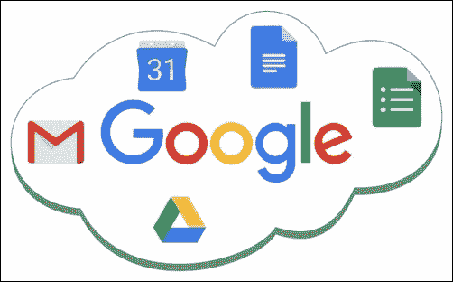

# Google Apps Script

你可以使用 JavaScript 脚本语言以及谷歌定义的类（称为**Google Apps Script**（**GAS**））来自定义或自动化 Google 应用。谷歌基于 JavaScript 1.6 以及 1.7 和 1.8 的部分实现 GAS。GAS 服务和 API 提供了方便的访问，用户可以自动化跨谷歌产品和第三方服务的任务。

你可以使用 GAS 在 Google Docs、Sheets 和 Forms 中编写代码，并自动化类似于 Visual Basic for Applications 在 Microsoft Office 中执行的任务。然而，GAS 在谷歌的服务器上运行，结果在浏览器中呈现。集成的脚本编辑器允许你在浏览器内编辑和调试你的脚本，你不需要安装任何东西。你可以激活调试和测试过的脚本功能，使其基于你的交互或基于对事件或时间间隔（分钟、小时、天、周、未来日期等）的触发器运行。这些事件包括`onOpen`、`onEdit`、`onInstall`等。GAS 还用于创建 Docs、Sheets 和 Forms 的附加组件。

GAS 可以帮助你自动化任务的各个方面——你甚至可以用它来在预定的时间/日期订购披萨！

## Visual Basic for Applications

微软实现了**应用程序的 Visual Basic**（**VBA**）来帮助自动化如 Excel 和 Word 等 Office 应用程序。对于每个相应的应用程序，VBA 被称为 Excel VBA 或 Word VBA 等等。使用 Excel VBA，您可以创建 Excel 的宏，称为“Excel 宏”。GAS 是针对谷歌应用的，其操作方式与 VBA 对微软 Office 应用程序的方式相同。尽管 VBA 和 GAS 都不需要单独的编译过程，但它们是两种非常不同的脚本语言，并使用不同的编程 API、方法和属性。

我希望你们中的许多人熟悉使用 VBA 进行 Office 应用程序；如果不熟悉，那也没关系——这并不是学习 GAS 的障碍。

## GAS 相对于 VBA 的优势

+   **版本无关性**：Sheets/Docs 以及脚本会自动保存在云端，附加到您的谷歌账户，并且可以从任何带有浏览器的计算机访问。您无需担心其他计算机是否安装了相同的 Sheets/Docs 版本，而我们也无法保证 Excel/Word 宏的一个版本能在另一个版本上工作。

+   **平台无关性**：当您在 Windows 平台上创建 Excel/Word 的 VBA 宏时，它们可能在 Mac 平台上不起作用，反之亦然。使用 Google Sheets/Docs，您的工作平台无关紧要——它都会工作。

## GAS 的限制

GAS 在谷歌的服务器上运行，因此它不能连续运行超过六分钟（这可能在将来有所变化）。您所有的函数都应该在规定时间内完成运行并返回结果。不要慌张，因为您将在后面学习如何有效地使用触发器来克服这些限制。

在以下章节中，我们将探讨最受欢迎的谷歌应用以及如何使用 GAS 来自定义和/或自动化任务。

# Google Drive

Google Drive 是一个文件存储应用程序，从现在起我们将简单地称之为“Drive”，您可以在谷歌的服务器上存储和同步您的文件。让我们看看使用 Drive 的一些优点：

+   您可以实时编辑和分享 Google Docs、Sheets 和 Forms 与您的朋友或协作者。

+   您甚至可以在您的台式机上停止编辑一个文档，并继续使用智能手机或平板电脑，反之亦然，无论您身在何处，使用什么设备。这是因为您的文件存储在谷歌的云服务器上。

+   使用谷歌应用创建的文件存储在 Drive 中，使用谷歌的本地格式和扩展名。例如，Google Docs（文档）文件是`.gdoc`，Google Sheets（电子表格）是`.gsheet`，等等。

+   除了谷歌的本地文件外，您还可以从您的桌面存储或上传任何其他类型的文件到 Google Drive。

    ### 注意

    如果你想要将计算机或设备上的文件与驱动器同步，那么你可以安装名为**Google Drive 客户端应用程序**的专用软件。当此应用程序在您的计算机或设备上运行时，它会同步本地存储的文件与驱动器中相同的文件。

你可能想知道同步文件的目的？有时你可能需要，或者有人可能要求你使用 GAS 解析存储在桌面上的 CSV 文件以处理数据并将其组织到表格中。在这种情况下，GAS 不会在桌面执行，但可以在 Google 服务器上执行。这样，你可以访问你的驱动器文件并在同步的 CSV 文件内解析数据。你不必每次都手动将 CSV 文件上传到驱动器。

以下截图显示了`驱动器`文件夹视图：

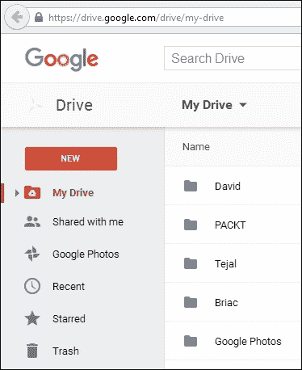

# Gmail

Gmail 是最受欢迎的基于网络的电子邮件服务，由 Google 提供。使用它，偶尔手动给一个人或几个人发送电子邮件消息不是问题。但如果你想在你不醒的时候或在多个收件人那里发送电子邮件怎么办？考虑以下场景：

+   你想在固定时间给你的朋友发送一个惊喜的生日问候，既不早也不晚

+   你需要一次向数百人发送定制电子邮件

+   你需要定期发送电子邮件

对于所有这些场景，GAS 都有解决方案：

+   使用 GAS，你可以构建一个邮件合并应用程序，向*n*个数量的人发送带有定制问候语或消息的电子邮件。

+   你可以从你的收件箱中提取电子邮件中的隐藏信息，并将它们存储和组织在 Google 表格或文档中。

+   你甚至可以将 Google 表格或文档的数据或内容转换为 PDF 或其他文件格式，并将其作为电子邮件附件发送，或者只需将创建的文件保存在驱动器中，并在电子邮件消息中仅包含文件的 URL 作为超链接。

+   此外，GAS 还允许你将选定的消息标记为重要或星标。你还可以使用`联系人`服务添加、删除和更新你的 Gmail 联系人。

以下截图显示了 Gmail 如何使用标签对消息进行分类或分组：

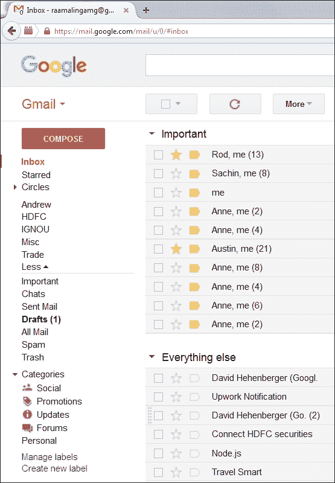

# Google 日历

Google 的在线日历服务与 Gmail 集成。GAS 通过使用`CalendarApp`类来提供对日历服务的访问。使用 GAS 代码，你可以访问和修改你的日历以及你订阅的日历。使用 GAS，你可以以编程方式创建日历事件并邀请你的朋友。或者，你可以获取事件详情并将它们填充到表格中。

# Google 文档

Google 文档是一个文字处理程序，在 Google Drive 服务中的基于网络的软件上运行。文档允许你在网上创建和编辑文档，同时与其他用户实时协作。使用 GAS，你可以创建文档、格式化内容、将它们翻译成其他语言、在驱动器中保存它们，或者将它们通过电子邮件发送给你的朋友。

# Google 表格

Google Sheets 是一个类似于 Microsoft Excel 的电子表格程序。您可以创建 Sheets，与他人共享，并实时编辑它们。Google 在 Sheets 中提供了内置的公式/函数。您也可以创建自己的简单到复杂的公式。换句话说，您可以创建自定义公式。在您的 GAS 代码中使用 `SpreadsheetApp` 类，您可以与其他应用程序交互。

# Google Apps 服务

Google 提供了 Apps 服务，以使 GAS 能够与 Apps 交互。几乎所有的 Apps 都提供一项或多项服务。您可以在您的 GAS 代码中使用这些服务类来自定义或自动化 Apps。服务被分为**基本**和**高级**两类。您可以直接使用基本服务，但使用高级服务之前需要先启用它们。稍后您将看到如何启用它们。

## 在 Drive 中创建 Google Sheets 并与您的朋友和公众共享

创建 Google Sheet 的步骤如下：

1.  运行您喜欢的浏览器，并在地址栏中输入 [`drive.google.com/`](https://drive.google.com/)。

    ### 小贴士

    为了使用 Google Drive，您应该有一个 Google 账户。如果您没有账户，那么请创建一个。

1.  现在，Google Drive 页面将打开。在左侧面板中，点击**新建**按钮，然后点击**Google Sheets**：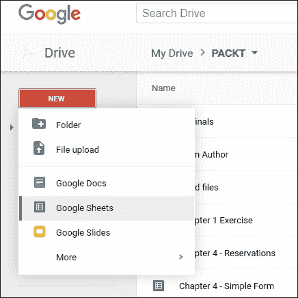

1.  在创建新的 Sheet 后，右键单击它（Windows）或使用上下文菜单（Mac）并选择**共享...**选项：

1.  将会打开一个新弹窗，如下面的截图所示。之后，输入您想要共享文档的电子邮件地址，或地址。最后，点击**完成**按钮：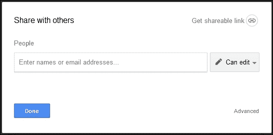

    Google 将向您的朋友发送共享通知。当您的朋友点击提供的访问链接时，他们将能够访问您的文档。

恭喜！您已成功创建了一个新的 Sheet 并与您的朋友共享。

# 脚本项目

脚本被组织成项目。项目可以是两种类型之一，独立或绑定到 `gtype`（Google Drive 原生文件类型，例如 Sheets、Docs 和 Forms）文件。独立脚本是在单独的脚本文件中创建的，您可以在 Drive 中的其他文件列表中看到这些文件。绑定脚本嵌入在单个 `gtype` 文件中，并使用相应的应用程序创建。如您所见，在 Drive 中的其他文件中，您可以直接从 Drive 打开独立脚本文件，但绑定脚本只能在相应的应用程序中打开。然而，绑定脚本比独立脚本对父文件有更多的权限。例如，您可以在绑定脚本中访问活动文档，但在独立脚本中则不行。

## 创建独立脚本项目

要创建一个独立的脚本文件，请按照以下步骤操作：

1.  按照前面“在 Drive 中创建 Google Sheets 并与朋友及公众分享”部分中描述的步骤进行操作。

1.  导航到**新建** | **更多** | **Google Apps Script**，而不是电子表格，如图所示：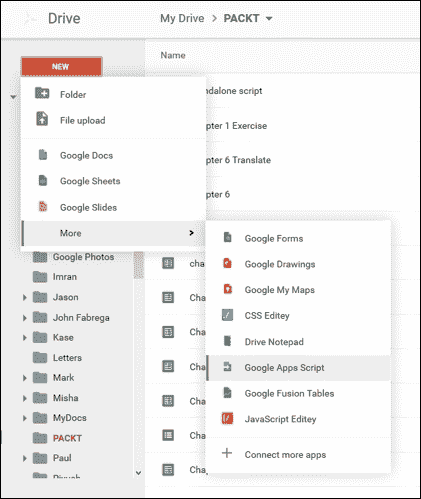

1.  一个新无标题项目将在新的浏览器标签页或窗口中打开。新项目包含一个代码文件`Code.gs`，其中包含一个空白函数`myFunction`，如图所示：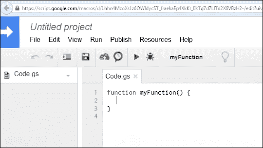

1.  要保存或重命名新项目，请按键盘上的*Ctrl* + *S*或点击编辑器中的**保存**图标（软盘）。如果您是第一次保存项目，则会出现提示输入新项目名称。输入项目名称（您喜欢的任何名称）并点击**确定**按钮。新的脚本文件将保存在当前文件夹中：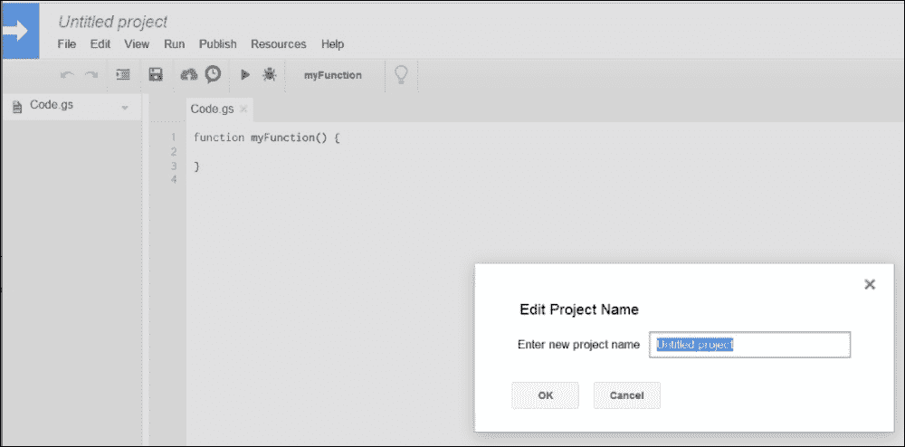

## 在 Sheets 中创建新项目

创建一个新的工作表或打开现有的工作表。您将在窗口顶部看到一些菜单项。现在，按照以下步骤操作：

1.  点击**工具**并选择**脚本编辑器...**，如图所示：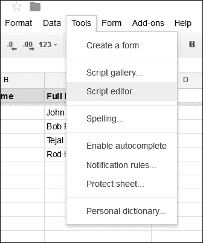

1.  将出现一个新的带有新项目选择对话框的浏览器标签页或窗口，如图所示：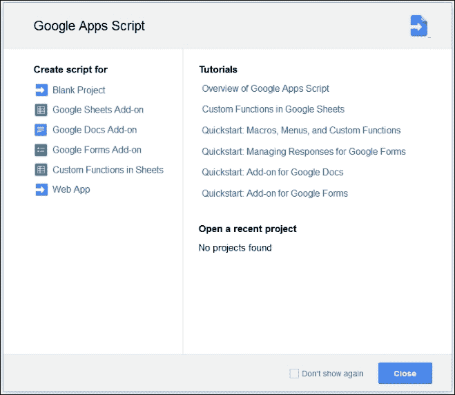

1.  点击**空白项目**或关闭对话框（您不必每次都选择**空白项目**，只是这次）。一个新无标题项目将在新的浏览器标签页或窗口中打开。

1.  按照前面章节所述保存项目。

    ### 小贴士

    虽然您可以创建尽可能多的有界项目，但每个文件一个项目就足够了。每个文件只创建一个项目可能有助于您避免重复的函数和变量名的问题。

恭喜！您已创建了一个新的脚本项目。通过遵循前面的步骤，您也可以在 Docs 和 Forms 中创建脚本项目。

## 在 Sheets 中创建自定义公式

打开您之前创建的电子表格并做出以下更改：

1.  在列*A*和*B*中输入一些名字的首尾。

1.  在单元格*C2*中输入（包括等号）`=CONCATENATE(A2," ", B2)`。

现在，您可以在单元格*A2*和*B2*中分别看到名字的首尾，它们之间用空格连接。

`CONCATENATE`是 Google Sheets 的内置公式。您也可以创建自己的，称为自定义公式：

1.  打开脚本编辑器并复制粘贴以下代码：

    ```js
    function myFunction(s1,s2) {
      return s1 + " " + s2;
    }
    ```

    下面是同样的截图：

    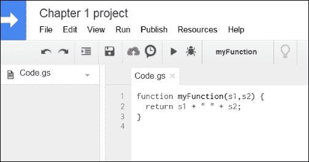

1.  在键盘上按*Ctrl* + *S*或点击编辑器中的**保存**图标来保存脚本。

1.  现在返回到电子表格，并在单元格*C2*中输入`=myFunction(A2,B2)`。

    这与内置公式的工作方式完全相同。您可以将您的公式扩展到 C2 以下的其它单元格。这是一个简单的公式，但您可以根据需求创建复杂的公式。

1.  您自定义的公式应返回单个值或二维数组。以下截图显示了自定义函数的工作方式：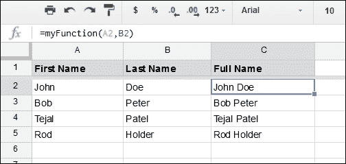

恭喜！您已创建了一个自定义公式。

### 注意

要为您的自定义函数添加代码补全和/或工具提示，请在函数前面的代码行中添加以下注释：

```js
/**
 * Concatenates two strings
 *
 * @customfunction
 */
function myFunction(s1,s2){
      …
```

# Google 表单

Google 表单是一个 Google 应用程序，您可以使用它来收集用户信息。用户响应或答案将被收集并存储在表单本身中，然后可以填充到连接的表格中。您还可以在需要时更改响应的目标表格。您可以使用 GAS 动态创建 Google 表单。

## 在 Google 表格中创建表单

在您之前创建的表格中，点击**工具**菜单并选择**创建表单**选项。将自动创建一个新的表单，并将其绑定到一个新的表格。新表格的名称将与`Form Responses 1`类似。在新表单中，创建与表格列标题完全相同的表单字段：

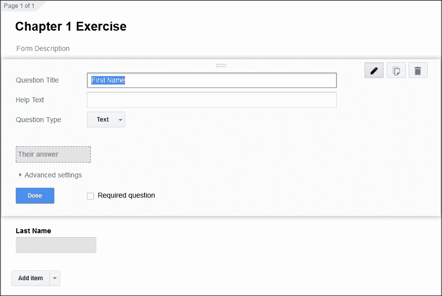

完成后，尝试使用实时表单提交数据。

## 一些研究

如果您被提供了一个文档的 ID 或密钥，例如 `11CEeHWygGKqxGS7jmQzLpeO7Fs3cjetT4HTrWXHTDSU`，您能否打开该文档，前提是它已被公开分享？

### 小贴士

每个 Google 文档、表格、文件夹和项目都有一个 ID 或密钥，您可以从相应项目的 URL 中获取。

# 摘要

在本章中，您了解了 Google 应用程序，并获得了对 GAS 的介绍，以及如何创建项目和自定义公式。还有许多其他 Google 应用程序可用，但我们只介绍了最受欢迎的。将相同的脚本概念和原则应用于其他应用程序不会很难。在下一章中，您将学习如何创建基本元素，例如自定义菜单、对话框和侧边栏。
