# 第八章. 构建工作流应用程序

在上一章中，您学习了如何使用`ContentService`、`HtmlService`、`doGet`和`doPost`函数创建交互式网页。您还构建了 RSS 源和考勤应用程序。

在本章中，您将学习：

+   创建工作流应用程序

+   订单处理系统涉及的工作流程

Google 表格包含了创建工作流应用程序所需的所有数据，涉及各个步骤。它作为订单处理系统的骨架。

### 小贴士

在处理已发布的 Web 应用程序时，请注意以下脚本代码版本是相互独立的：

+   已保存的版本

+   发布版本

+   最后保存的代码

因此，请记住每次对代码进行更新时都要发布应用程序。

# 订单处理工作流 - 步骤说明

以下是在订单处理工作流程中涉及的步骤：

1.  用户打开在线表格，通过提及项目、数量、送达地址和支付方式来发送订单。

1.  Google 表格向**用户**和**账户**部门发送确认电子邮件。

1.  **账户**部分验证支付并将支付信息转发到**订单处理**部分。

1.  **订单处理**部门将订单发送到送达地址并更新发货详情。

1.  用户确认交付。

您还可以参考以下图像中这些步骤的图示表示：

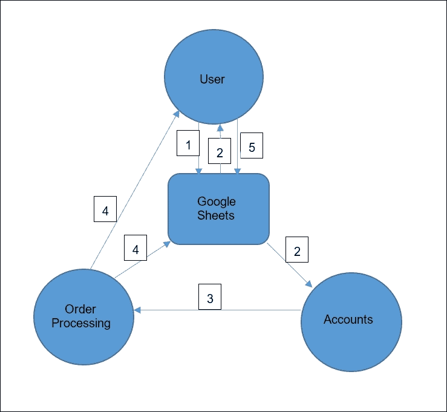

# 配置 Google 表格

以下解释了各种表格、电子邮件及其组成部分：

+   用户表格：

    +   项目

    +   单价

    +   数量

    +   总价（计算得出）

    +   送达地址

    +   电话

    +   电子邮件

    +   支付详情

    ### 备注

    在订单提交后，脚本向**用户**和**账户**部门发送确认电子邮件。

+   发送给用户的确认电子邮件：

    +   订单号

    +   项目

    +   单价

    +   数量

    +   总价

    +   送达地址

    +   电话号码

    +   支付详情

+   发送给**账户**部门的电子邮件：

    它与用户确认电子邮件相同；然而，还包括一个到发货表格的链接。

    ### 备注

    在收到订单电子邮件后，**账户**部分会验证支付详情是否正确，然后将该电子邮件转发到**订单处理**部分。**订单处理**/**发货**部分会点击链接打开发货表格，填写发货详情，并提交表格。

+   发货表格：

    +   订单号

    +   项目

    +   数量

    +   送达地址

    +   发货详情

    ### 备注

    在提交发货表格时，脚本会在表格中更新发货详情，并向用户发送发货通知电子邮件。

+   发货后发送给用户的电子邮件：

    +   订单号

    +   送达地址

    +   发货详情

    +   确认交付（链接）

    ### 备注

    用户点击确认链接，然后脚本会更新表格中对应订单号行的交付日期。

现在，创建一个新的 Google 表格，包含两个名为`订单`和`库存`的工作表/标签。按以下截图所示格式化`订单`表头：

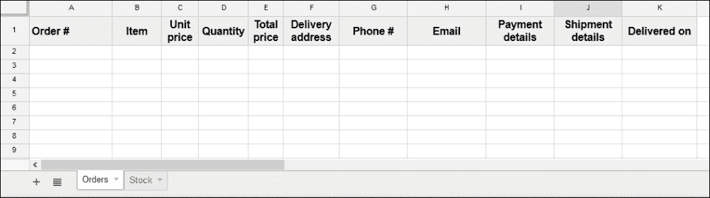

格式化`库存`表列并按如下所示填充测试数据：

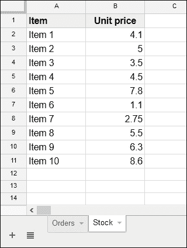

项目和相应的单价将在`订单`表中填充。

# 创建订单表单

在`Code.gs`文件中，定义以下全局变量：

```js
// Replace with your spreadsheet's ID.
var ss = SpreadsheetApp
    .openById("spreadsheet's id");

var SheetOrders = ss.getSheetByName("Orders");
var SheetStock = ss.getSheetByName("Stock");
```

创建`doGet`函数：

```js
function doGet(){
  var template = HtmlService.createTemplateFromFile("Order");
  var html = template.evaluate();
  return HtmlService.createHtmlOutput(html);
}
```

前面的函数从`Order.html`模板返回`订单`表单。创建一个名为`Order`的新 HTML 文件，并在其中输入以下代码：

```js
<!-- Order.html -->
<!DOCTYPE html>
<html>

  <head>
    <base target="_top">
  </head>

  <body>
    <form>
      <table>
        <tr>
        <td><label>Select Item:</label></td>
        <td>
          <select>
            <option value="Item 1">Item 1</option>
            <option value="Item 2">Item 2</option>
            <option value="Item 3">Item 3</option>
            <option value="Item 4">Item 4</option>
            <option value="Item 5">Item 5</option>
          </select>
        </td>
        </tr>

        <tr>
        <td><label>Unit price:</label></td>
        <td><input type="text" /></td>
        </tr>

        <tr>
        <td><label>Quantity:</label></td>
        <td><input type="number" value="1" /></td>
        </tr>

        <tr>
        <td><label>Total price:</label></td>
        <td><input type="text" /></td>
        </tr>

        <tr>
        <td><label>Deliver to:</label></td>
        <td><textarea placeholder="Enter delivery address.">
        </textarea></td>
        </tr>

        <tr>
        <td><label>Phone:</label></td>
        <td><input placeholder="Enter phone number." /></td>
        </tr>

        <tr>
        <td><label>E-Mail:</label></td>
        <td><input placeholder="Enter email address." /></td>
        </tr>

        <tr>
        <td><label>Payment details:</label></td>
        <td><input type="text"
              placeholder="Enter payment details." /></td>
        </tr>
      </table>

      <br />
      <input type="button" value="Submit" />
    </form>
  </body>

</html>
```

使用以下设置发布脚本：

+   以以下方式执行应用：

    **我**（你的电子邮件 ID）

+   哪些人可以访问该应用：

    **任何人，即使是匿名用户**

点击**部署**按钮，如果需要则进行授权。渲染的应用程序将类似于以下截图：

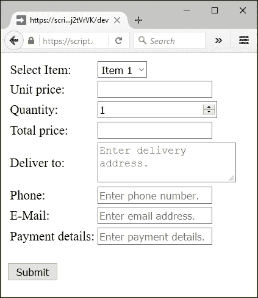

此表单是一个基本的，不是花哨的。项目的选择是硬编码的；只有五个固定项目。用户可能不知道供应商目前有哪些项目，列表中添加了哪些新项目，或者每个项目的当前单价。更重要的是，我们没有为**提交**按钮添加任何功能。

# 增强订单表单

为了增强`订单`表单，更新`doGet`函数如下：

```js
function doGet(){
  var template = HtmlService.createTemplateFromFile("Order");
  template.pricelist = getPrice();

  var html = template.evaluate();
  return HtmlService.createHtmlOutput(html);
}
```

价格列表被分配给模板作为二维数组，并由以下函数返回：

```js
function getPrice(){
  var data = SheetStock.getDataRange().getValues();

  // remove header row.
  data.shift();

  return data;
}
```

在`Order.html`文件中，更新`select`标签标记，如以下代码片段所示：

```js
<td>
  <select id="item" name="item">
    <? for(var i in pricelist){ ?>
      <option value="<?= pricelist[i][0] ?>" > <?= pricelist[i][0] ?></option>
    <? } ?>
  </select>
</td>
```

下拉菜单将反映`库存`表中包含或更新的内容。默认项将是列表中最上面的或第一项。因此，我们必须为该项设置一个默认单价。因此，更新如此处所示的**单价**输入字段：

```js
<td><input id="unit_price" name="unit_price" type="text" readonly value="<?= pricelist[0][1] ?>" /></td>
```

用户不会在`订单`表单中输入单价，因此它应该是只读的。我们将`数量`的默认值设置为`1`，将总价的默认值设置为单价。

更新`body`标签如下：

```js
  <body>
    <form>
      <table>
        <tr>
        <td><label>Select Item:</label></td>
        <td><select id="item" name="item">
          <? for(var i in pricelist){ ?>
              <option value="<?= pricelist[i][0] ?>" ><?= pricelist[i][0] ?></option>
          <? } ?>
        </select></td>
        </tr>

        <tr>
        <td><label>Unit price:</label></td>
        <td><input id="unit_price" name="unit_price" type="text" readonly value="<?= pricelist[0][1] ?>" /></td>
        </tr>

        <tr>
        <td><label>Quantity:</label></td>
        <td><input id="quantity" name="quantity" type="number" value="1" /></td>
        </tr>

        <tr>
        <td><label>Total price:</label></td>
        <td><input id="total_price" name="total_price" type="text" readonly value="<?= pricelist[0][1] ?>" /></td>
        </tr>

        <tr>
        <td><label>Deliver to:</label></td>
        <td><textarea name="delivery_address"
              placeholder="Enter delivery address.">
              </textarea></td>
        </tr>

        <tr>
        <td><label>Phone:</label></td>
        <td><input name="phone" type="phone"
              placeholder="Enter phone number." /></td>
        </tr>

        <tr>
        <td><label>E-Mail:</label></td>
        <td><input name="email" type="email"
              placeholder="Enter email address." /></td>
        </tr>

        <tr>
        <td><label>Payment details:</label></td>
        <td><input name="payment_details" type="text" placeholder="Enter payment details." /></td>
        </tr>
      </table>

      <br />
      <input class="blue" id="btnSubmit" type="button" value="Submit" />
    </form>
  </body>
```

对于`select`元素，我们需要一个`onchange`事件处理器，以便如果用户选择任何项目，相应的单价应从电子表格中检索并显示在**单价**输入字段中。同时，根据数量和单价计算总价。在`head`元素中添加脚本处理器以及 CSS 样式表。更新`head`标签的代码如下：

```js
  <head>
    <base target="_top">

    <link rel="stylesheet" href="//ssl.gstatic.com/docs/script/css/add-ons1.css" />

    <script src="img/jquery.min.js"></script>

    <script>
        // On document load, assigns events to elements.
        $(function(){
        $("#item").change(getUnitPrice);
        $("#quantity").change(calcTotalPrice);
        $("#btnSubmit").click(submit);
      });

      /*
       * Retrieves corresponding unit price for the selected item
       * and calculates the total price.
       *
       */
      function getUnitPrice(){
        google.script.run
        .withSuccessHandler(function(price){
          $("#unit_price").val(price);
          calcTotalPrice();
        })
        .getPrice( $("#item").prop("selectedIndex") );
      };

      function calcTotalPrice(){
        $("#total_price").val( $("#unit_price").val() * $("#quantity").val() );
      };

      function submit(){
        // Remove already displayed messages, if any.
        $("#success,#error").remove();

        this.disabled = true;

        google.script.run
          .withSuccessHandler(function(msg,elm){
             elm.disabled = false;
             showSuccess(msg,elm);
           })
          .withFailureHandler(function(msg, elm){
             elm.disabled = false;
             showError(msg, elm);
           })
          .withUserObject(this)
          .postOrder( this.parentNode );
          // submit button's parent, i.e. form.
      }

      function showSuccess(msg,elm) {
        var span = $('<span id="success"> <font color="green"> ' + msg + '</font></span>');

        $(elm).after(span);
      }

      function showError(msg,elm) {
        var span = $('<span id="error" class="error"> ' + msg + '</span>');

        $(elm).after(span);
      }
    </script>
  </head>
```

`getPrice`服务器函数需要识别所选项目索引作为参数，因此我们将更新如下所示：

```js
function getPrice(index){
  var data = SheetStock.getDataRange().getValues();

  // remove header row.
  data.shift();

  return typeof index == "undefined" ? data : data[index][1];
}
```

现在，这个函数在从`doGet`函数调用以及从前面的 HTML 客户端代码调用时都起作用。当从`doGet`函数调用时，它返回完整的价格列表，否则只返回所选项目的单价。

此辅助函数验证电子邮件。如果有效则返回`true`，否则返回`false`：

```js
function isValidEmail_(email) {
  var regex = /^([\w-\.]+@([\w-]+\.)+[\w-]{2,6})?$/;
  return regex.test(email);
}
```

接下来，添加一个表单提交处理函数（`postOrder`）。如果订单已下，则此处理程序应更新电子表格并发送电子邮件确认给用户以及**会计部门**：

```js
function postOrder(form){

  // Validate user email
  if( !isValidEmail_(form.email) )
    throw "please provide a valid email id.";

  /*
   *  Date used as order number, 
   *  which helps to have distinctive number.
   *  However, you may use any other number or string.
   *
   *  Prepend 'new' with '+' to get 'value' (number) of the date.
   *
   */
  var orderNumber = +new Date();

  // Construct form element values in an array.
  var order = [
    orderNumber,
    form.item,
    form.unit_price,
    form.quantity,
    form.total_price,
    form.delivery_address,
    form.phone,
    form.email,
    form.payment_details
  ];

  SheetOrders.appendRow(order);

  var htmlBody = "<p>Order number: " + orderNumber + "</p>";
  htmlBody += "<p>Item: " + form.item + "</p>";
  htmlBody += "<p>Unit price: " + form.unit_price + "</p>";
  htmlBody += "<p>Quantity: " + form.quantity + "</p>";
  htmlBody += "<p>Total price: " + form.total_price + "</p>";
  htmlBody += "<p>Delivery address: " + form.delivery_address
              + "</p>";

  htmlBody += "<p>Phone number: " + form.phone + "</p>";
  htmlBody += "<p>Payment details: " + form.payment_details
              + "</p>";

  htmlBody += "<p>Please quote the order number in your " + "correspondence.</p>";

  // Send an e-mail to the user.
  MailApp.sendEmail({
    to: form.email,
    subject: "Order placed",
    htmlBody: htmlBody
  });

  htmlBody += "<p>&nbsp;</p>";
  htmlBody += '<p>Click <a href="'
              + ScriptApp.getService().getUrl()
              + '?order_number=' + orderNumber
              + '" >here</a> to dispatch the order.</p>';

  /*
   * Send an e-mail to the Accounts department with the same * content as to the user e-mail, additionally a clickable URL * with the order number appended as a query to the published * URL.
   *
   */
  MailApp.sendEmail({
    to: "Accounts department email id",
    subject: "Order - " + orderNumber,
    htmlBody: htmlBody
  });

  // Return confirmation message to user.
  return "Order placed successfully and more details " \+ "has been sent to " + form.email;
};
```

记得再次发布脚本，使用新版本。现在，表单应如下所示：

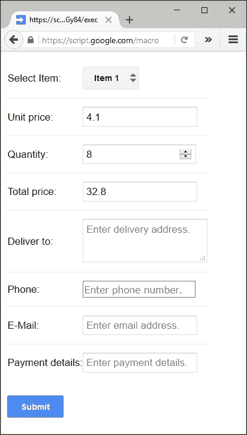

电子表格中提交的样本数据如下：

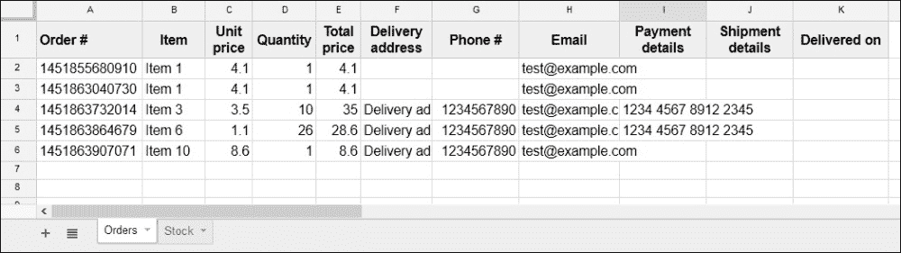

用户电子邮件样本内容如下：

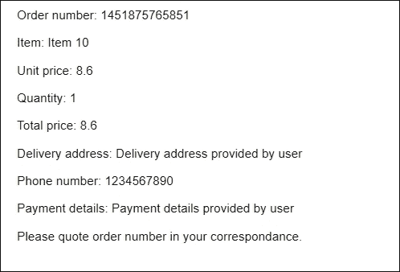

电子邮件内容与**会计部门**部分的不同之处在于附加了一个分发表单的链接（你可以在样本电子邮件内容截图如下看到）。（我们将在下一部分创建此表单）。

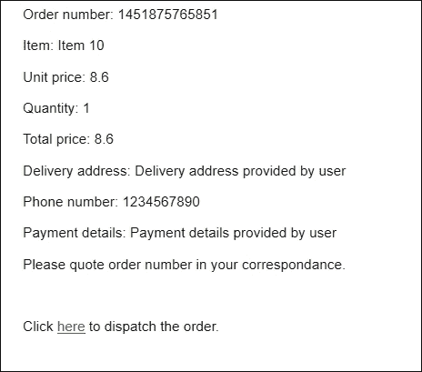

到目前为止，我们已经设置如下：

+   用户可以提交`Order`表单

+   脚本将提交的数据附加到电子表格中

+   脚本向用户和**会计部门**发送确认电子邮件

# 创建分发表单

如前所述，我们现在将创建分发表单。创建一个名为`Dispatch`的新 HTML 文件，并在其中输入以下代码：

```js
<!-- Dispatch.html -->
<!DOCTYPE html>
<html>
  <head>
    <base target="_top">
    <link rel="stylesheet" href="//ssl.gstatic.com/docs/script/css/add-ons1.css" />
    <script src="img/jquery.min.js"></script>

    <script>
      // On document load, assign submit function to the submit
      //  button's click event
      $(function(){
        $("#btnSubmit").click(submit);
      });

      function submit(){
        // Remove already displayed messages, if any.
        $("#success,#error").remove();
        this.disabled = true;

        google.script.run
          .withSuccessHandler(function(msg,elem){
             elem.disabled = false;
             showSuccess(msg,elem);
           })
          .withFailureHandler(function(msg, elm){
             elm.disabled = false;
             showError(msg, elm);
           })
          .withUserObject(this)
          .dispatchOrder( this.parentNode );
      }

      function showSuccess(msg,elm) {
        var span = $('<span id="success"> <font color="green"> ' + msg + '</font></span>');
        $(elm).after(span);
      }

      function showError(msg,elm) {
        var span = $('<span id="error" class="error"> ' + msg + '</span>');
        $(elm).after(span);
      }
    </script>
  </head>

  <body>
    <form>
      <table>
        <tr>
        <td><label>Order number:</label></td>
        <td><input name="order_number" type="text" readonly value="<?= order[0] ?>" /></td>
        </tr>

        <tr>
        <td><label>Item:</label></td>
        <td><input type="text" readonly
             value="<?= order[1] ?>" /></td>
        </tr>

        <tr>
        <td><label>Quantity:</label></td>
        <td><input type="number" readonly
             value="<?= order[3] ?>" /></td>
        </tr>

        <tr>
        <td><label>Deliver to:</label></td>
        <td><textarea readonly value="<?= order[5] ?>"> </textarea></td>
        </tr>

        <tr>
        <td><label>Shipment details:</label></td>
        <td><textarea name="shipment_details" placeholder="Enter shipment details." >
              </textarea></td>
        </tr>

        <tr>
        <td><input name="email" type="hidden"
             value="<?= order[7] ?>" /></td>
        </tr>
      </table>

      <br />
      <input class="blue" id="btnSubmit" type="button" value="Submit" />
    </form>
  </body>
</html>
```

脚本处理程序是`Order`表单处理程序的子集，并且大多数 HTML 元素都是只读的，除了运输详情。分发表单如下所示：

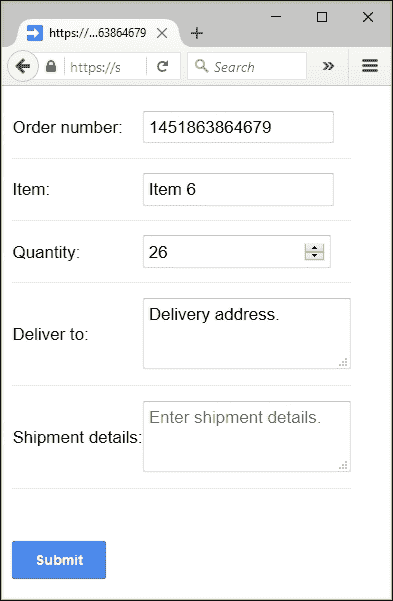

在脚本项目或 Web 应用程序中，我们只能使用一个`doGet`函数，但我们必须使用两个具有相同发布 URL 的表单。我们如何使用相同的发布 URL 打开两个不同的表单？

你记得我们在`postOrder`处理程序中向发布 URL 附加了订单号。带有订单号作为查询字符串的分发 URL 示例如下：

```js
https://script.google.com/macros/s/AKfycbwRUVS6z5rjrAw8M- au9_ICYzixTVB3msLOCmoF5JCBVFNzY_7k/exec?order_number=1451875765851

```

前面的 URL 只是带有订单号附加为查询字符串的发布 URL。

我们将更新`doGet`函数以解析此查询字符串。如果存在订单号，则返回分发表单；否则，返回`Order`表单：

```js
function doGet(e){
  var orderNumber = e.parameter.order_number;

  if(orderNumber){

    /*
     *  If order number present in query string
     *  then serve dispatch form to order processing unit.
     *
     */
    var template = HtmlService.createTemplateFromFile("Dispatch");
    var data = SheetOrders.getDataRange().getValues();

    for(var i in data){
      if( data[i][0] == orderNumber ){
        template.order = data[i];
        break;
      }
    };

  } else {

    /*
     *  If order number not present in query string
     *  then serve order form to the user.
     *
     */
    var template = HtmlService.createTemplateFromFile("Order");
    template.pricelist = getPrice();

  };

  var html = template.evaluate();
  return HtmlService.createHtmlOutput(html);
}
```

现在，`doGet`函数可以处理这两种情况。

# 分发文章

一旦分发人员将运输详情输入到分发表单并提交，脚本应更新电子表格中的运输详情，并向用户发送通知电子邮件。因此，我们将添加`dispatchOrder`服务器函数来处理这些任务：

```js
function dispatchOrder(form){
  // Shipment details column number minus 1.
  const SHIPMENT_DETAILS = 9;

  var orderNumber = form.order_number;
  var deliveryAddress = form.delivery_address;
  var userEmail = form.email;
  var shipmentDetails = form.shipment_details;

  var data = SheetOrders.getDataRange().getValues();

  for(var i = 0; i < data.length; i++){
    if(data[i][0] == orderNumber){
      SheetOrders.getRange(i+1, SHIPMENT_DETAILS+1)
        .setValue(shipmentDetails);

      var htmlBody = "<p>Order number: "
          + orderNumber + " has been dispatched to </p>"
          + "<p>" + deliveryAddress + "</p>"
          + "<p>By " + shipmentDetails + "</p>"
          + "<p>&nbsp;</p>"
          + '<p>Click <a href="' + ScriptApp.getService().getUrl()
          + '?order_number=' + orderNumber
          + '&delivered=true" >here</a> '
          + 'to acknowledge the delivery.</p>';

      // Send email to the user
      MailApp.sendEmail({
        to: userEmail,
        subject: "Order dispatched",
        htmlBody: htmlBody
      });

      // Return confirmation to the dispatch team.
      return "Shipment details updated and user notified by " \+ "an e-mail.";
    }
  };

  // Displays error if query order_number not found in sheet.
  throw "Order number not found.";
};
```

这里显示了分发通知电子邮件的样本内容：

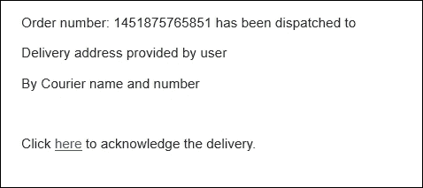

# 启用用户确认文章交付

如果用户收到物品，则他/她点击链接以确认。这次也使用相同的发布 URL，并附加一个交付查询字符串。

例如：

```js
https://script.google.com/macros/s/AKfycbwaqlj_kBAn9LLav0qv6GmXlWk-hwIosHA- 1_1YoMutiiuGy84/exec?order_number=1451875765851&delivered=true

```

为了处理此查询，`doGet`函数应再次更新如下：

```js
function doGet(e){
  var delivered = e.parameter.delivered;

  if(delivered){
    // If order delivered then just update delivery date.
    updateDelivery(e);

    // Returning text content is enough, HtmlService not needed.
    return ContentService.createTextOutput("Thank you!");
  }

  var orderNumber = e.parameter.order_number;

  if(orderNumber){

    /*
     *  If order number present in query string
     *  then serve dispatch form to order processing unit.
     *
     */
    var template = HtmlService.createTemplateFromFile("Dispatch");
    var data = SheetOrders.getDataRange().getValues();

    for(var i in data){
      if( data[i][0] == orderNumber ){
        template.order = data[i];
        break;
      }
    };

  } else {

    /*
     *  If order number not present in query string
     *  then serve order form to the user.
     *
     */
    var template = HtmlService.createTemplateFromFile("Order");
    template.pricelist = getPrice();

  };

  var html = template.evaluate();
  return HtmlService.createHtmlOutput(html);
}
```

应添加另一个处理程序，即`updateDelivery`函数，如下所示：

```js
function updateDelivery(e){
  // Delivery date column number minus one.
  const DELIVERED_ON = 10;

  var orderNumber = e.parameter.order_number;
  var deliveryDate = new Date();
  var data = SheetOrders.getDataRange().getValues();

  // Update delivery date on matched order number.
  for(var i = 0; i < data.length; i++){
    if(""+data[i][0] == orderNumber){
      SheetOrders.getRange(i+1, DELIVERED_ON+1)
        .setValue(deliveryDate);
    }
  };
}
```

此函数将当前日期更新为交付日期。以下是一个已更新“交付日期”列的示例电子表格：

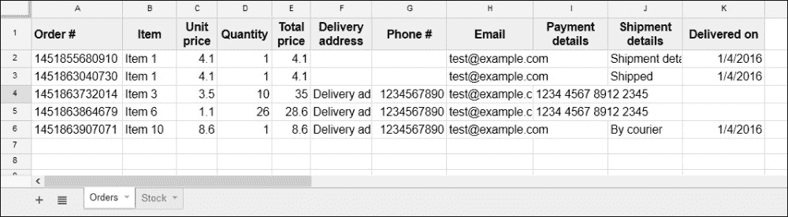

恭喜！您已创建了一个完整的、真实的订单处理工作流应用程序。

# 摘要

在本章中，您学习了并创建了一个有用的真实世界订单处理应用程序。在下一章中，您将学习如何克服最大执行时间限制，并学习如何使用来自其他脚本文件或库的脚本代码，包括 OAuth 库。您还将学习如何创建附加组件。
