# 第九章。更多技巧和窍门以及创建插件

在上一章中，你构建了一个订单处理工作流应用程序。在本章中，你将学习：

+   要克服脚本最大执行时间限制

+   要使用来自其他脚本文件或库的脚本代码

+   创建使用 OAuth2 外部库的插件

# 克服“脚本超出最大执行时间”错误

如果你的脚本函数中存在一个导致无限（不终止）执行的错误，例如无限循环和/或 while 循环。除了仔细检查循环终止语句外，没有其他补救措施。

有时候，你的脚本可能完美无瑕或无错误，但如果它需要处理大型电子表格或外部数据，它可能需要很长时间才能完成执行。你的脚本连续运行的最大允许时间是 6 分钟。如果超过这个限制，GAS 会抛出“超出最大执行时间”异常。

### 小贴士

有关其他限制的列表，请访问：[`developers.google.com/apps-script/guides/services/quotas#current_limitations`](https://developers.google.com/apps-script/guides/services/quotas#current_limitations)。

要克服这个瓶颈，你可以遵循以下步骤。例如，如果你的`doLengthyProcess`函数需要很长时间才能完成，那么你可以手动为`doLengthyProcess`函数创建一个分钟的触发器，使其每 10 分钟执行一次。你的函数应该定期检查自开始以来的经过时间。如果在时间限制内成功完成，则在函数结束时删除触发器。否则，触发器值存储在专门的 Sheet 中的循环计数器或脚本属性中。当函数再次被触发时，应该读取并分配给循环计数器。

这里给出这样一个函数的示例结构：

```js
var ss = SpreadsheetApp.getActiveSpreadsheet();

// A dedicated sheet to store values temporarily.
var sheet = ss.getSheetByName("Settings");

function doLengthyProcess() {
  // Prefix '+' to get date as epochy number.
  var elapsedTime, startTime = +new Date();

  // Loop variable.
  // Load value of 'i' from spreadsheet cell, or default 0.
  var i = sheet.getRange("A1").getValue() || 0;

  for(; i<1000; i++){
    // Your time consuming process goes here.
    …
    …
    …
    …

    // Recalculate elapsedTime.
    elapsedTime = +new Date() - startTime;

    if(elapsedTime> 300000){ // 300000 ms or 5 minutes.
      sheet.getRange("A1").setValue(i);
      return;
    }
  };

  // Loop completed successfully, so delete trigger.
  deleteTriggers_();
}

// Helper function
function deleteTriggers_(){
  var triggers = ScriptApp.getProjectTriggers();
  triggers.forEach(function(trigger){
    ScriptApp.deleteTrigger(trigger);
    /*
     * Wait a moment before calling deleteTrigger again.
     * Otherwise you may get warning message something like
     * "Service invoked too many times..."
     *
     */
    Utilities.sleep(1000); // In millisecond.
  });

};
```

总结来说，你手动创建一个“每分钟”触发器，然后函数执行直到成功完成。

如果你犹豫是否手动创建触发器，你可以按照我们在第三章中讨论的方法，通过脚本创建它们，*解析和发送电子邮件*，但这次创建每分钟的触发器：

```js
function createTrigger_(funcName,minutes){
// Delete already created triggers if any.
deleteTriggers_();
  ScriptApp.newTrigger(funcName).timeBased()
    .everyMinutes(minutes).create();
}
```

在这里，你为那些不是立即开始而是有延迟的函数创建了一个触发器。然而，如果你想自动化一切，这意味着创建一个触发器并立即调用函数。创建另一个函数`startProcess`，如下所示：

```js
function startProcess(){
  createTrigger_("doLengthyProcess",10);
  doLengthyProcess();
}
```

现在，你只需要运行`startProcess`函数。此外，你还可以为此函数分配一个菜单。

# 配置你的脚本项目以使用外部库

有时候，你可能希望在你的项目中重用来自其他脚本项目或其他程序员代码的代码。你可以将外部代码导入当前项目中，你需要在当前项目中进行简单的配置。

例如，我们将解释如何将上一章的代码导入当前项目。

1.  在脚本编辑器中打开你之前创建的任何脚本（例如，第八章 *构建工作流应用程序*），如果你还没有保存，请保存一个版本。

1.  现在，点击**文件**菜单，然后**项目属性**。**项目属性**对话框将打开，如下所示：

1.  复制**项目密钥**值（这个值对于你的项目应该是不同的）。

1.  打开当前脚本，导航到**资源** | **库…**，然后**包含的库**对话框将打开，如下所示：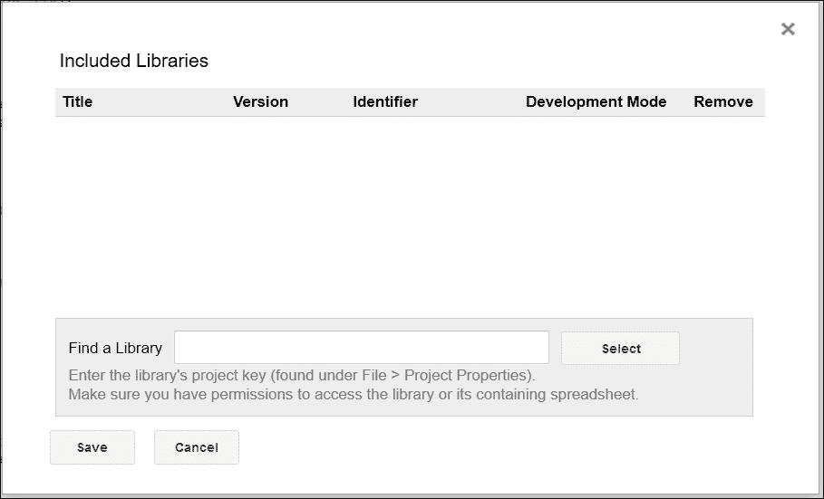

1.  将**项目密钥**（你在第 1 步中已经复制）粘贴到**查找库**文本框中，然后点击**选择**按钮。

现在，`Chapter 8` 项目将包含在库列表中，如下所示：

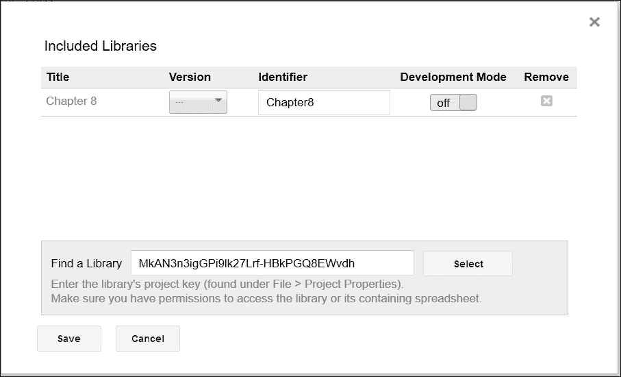

选择版本（你将在当前项目中使用的版本）；如果你愿意，你还可以更改标识符（`Chapter8`）。关闭**开发模式**意味着使用所选版本；将其设置为**开启**以覆盖所选版本并使用当前版本。点击**保存**按钮以保存更改。

现在所有函数（除了私有函数，即以"`_`"结尾的函数名）和全局变量都可以在当前项目中使用。例如，你可以通过在标识符前加上前缀来使用来自第八章 *构建工作流应用程序* 的 `doGet` 函数。这意味着你可以将 `doGet` 函数作为 `Chapter8.doGet()` 使用，将 `getPrice` 函数作为 `Chapter8.getPrice()` 使用，依此类推。

如果你需要更多解释，请参考以下示例用法：

```js
function test(){

  var pricelist = Chapter8.getPrice();

  Logger.log(pricelist);
}
```

# 使用 JSDoc 注解

在前面的测试函数中，你可以看到，一旦你在标识符名称（`Chapter8`）旁边输入一个'.'，代码提示就会立即激活。这显示了外部库中所有可用的函数和全局变量，如下所示：

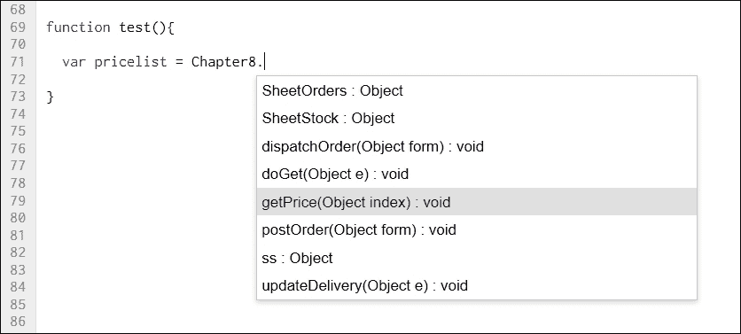

上述代码提示是通用的，例如，`index` 显示为 `Object`。对于详细的代码提示，你应该使用 JSDoc 风格的文档（函数定义顶部的注解或注释）。

例如，如果你在第八章 *构建工作流应用程序*中对 `getPrice` 函数使用了以下注解：

```js
/**
 *  Returns price list data from the Stock tab/sheet
 *
 *  @param {number} index 
 *  @return {array}
 *
 */
function getPrice(index){
          …
}
```

然后，代码提示将如下所示：

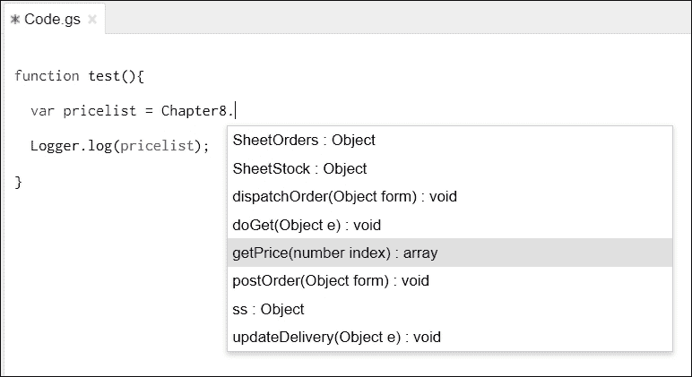

现在，你可以注意到代码提示如何返回有关 `getPrice` 函数的有用信息。

### 小贴士

要进一步了解 JSDoc，请访问：[`developers.google.com/closure/compiler/docs/js-for-compiler`](https://developers.google.com/closure/compiler/docs/js-for-compiler)。

# 使用开源 OAuth 库

如果您的应用程序与 Google 基本服务以外的外部库交互，则应该进行认证。换句话说，如果您的应用程序代表用户运行，那么该用户应该授权您的应用程序访问其数据。GAS 不提供任何内置的认证服务，但您可以使用开源的 OAuth 库。

# 创建、测试和发布插件

如果您需要在当前项目中使用其他外部库，您需要知道项目密钥，并且您应该至少有对该项目的读取权限。同时，除非客户端选择当前版本，否则主项目的每个新版本都不会反映在客户端项目中。插件可以覆盖此配置麻烦。

插件可以通过点击按钮安装，无需配置。您可以在其他程序员发布的 Sheets、Docs 和/或 Forms 中，或从 Google Chrome Web Store 安装插件。

## 从 Chrome Web Store 安装插件

要从 Chrome Web Store 安装插件，打开文档（Sheets、Docs 或 Forms），然后从 **插件** 菜单点击 **获取插件…**。从 **插件** 对话框中选择您喜欢的任何一个插件（如果您将鼠标悬停在任何一个插件上，则应用程序上会出现一个加号符号；点击它并在需要时进行授权）。这里显示了一个示例 **插件** 对话框，但实际包含的插件可能会随时间而变化。

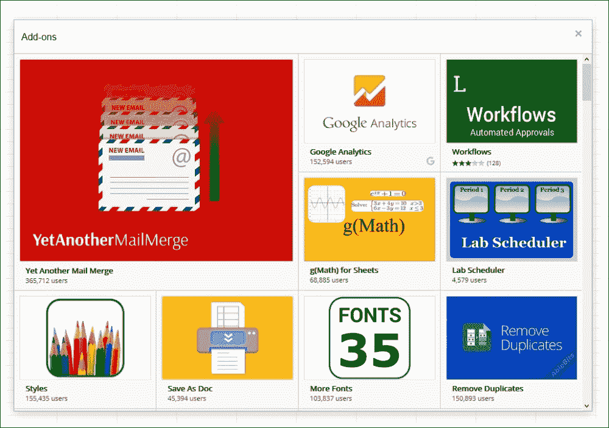

您将安装该插件并将其添加到文档的 **插件** 菜单中。每个插件都附带易于使用的菜单项。例如，如果您安装了 **autoCrat**，则菜单项将类似于此处显示的截图：

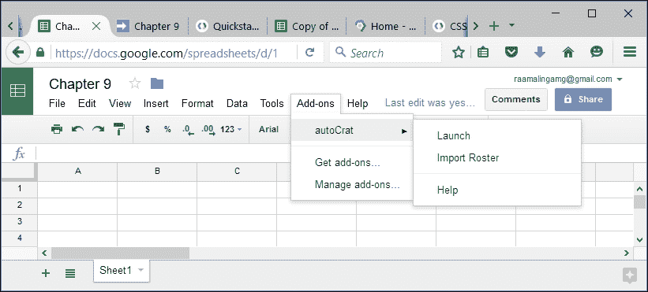

## 创建自定义插件

您可以自己创建插件，在您的其他文档中使用，或与其他用户共享。您的用户可以使用您的插件，但不能看到代码。因此，您可以保持您的知识产权（即代码和数据）的秘密。

将菜单项添加到 **插件** 菜单，以便：

```js
function onOpen(e){
  SpreadsheetApp.getUi().createAddonMenu()
  .addItem("Show Sidebar", "showSidebar")
  .addToUi();
}
```

`addItem` 方法的第一个参数是菜单项的标签，下一个是函数名。如果您打算为 Chrome Web Store 发布插件，请添加 `onInstall` 事件函数：

```js
function onInstall(e){
  onOpen(e);
}
```

前面的函数在 Sheets、Docs 或 Forms 中首次安装插件时调用 `onOpen` 函数。如果您的插件需要用户界面，则创建侧边栏对话框：

```js
/**
 *  Opens sidebar in the document containing the add-on's
 *   user interface.
 *
 */
function showSidebar() {
  SpreadsheetApp.getUi().showSidebar(
    HtmlService.createHtmlOutputFromFile('Sidebar')
  );
}
```

要样式化侧边栏（创建 `Sidebar.html`），您可以使用从 [`ssl.gstatic.com/docs/script/css/add-ons1.css`](https://ssl.gstatic.com/docs/script/css/add-ons1.css) 网址提供的官方支持的 CSS 包。

### 注意

如需更多关于此包的帮助，请访问 [`developers.google.com/apps-script/add-ons/css`](https://developers.google.com/apps-script/add-ons/css)。

## 测试您的插件

要在脚本编辑器中测试您的插件，请转到 **发布** | **测试为插件…** 菜单，然后在出现的对话框中选择您想要测试插件的文档，如下所示：

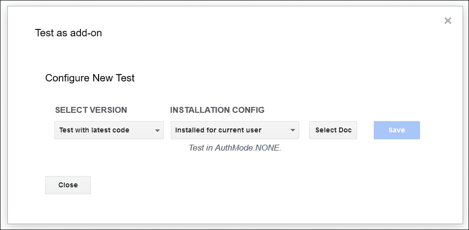

要与他人共享您的插件，只需共享文档即可。更多的话，如果您想发布脚本，请按照 **发布** | **部署为插件** 菜单操作。在出现的对话框中填写所需字段并遵循提供的指南。您的插件应严格遵守 Chrome Web Store 的内容和风格指南，并在上市和向公众提供之前经过审查流程。

### 注意

如需有关插件的更多信息，请访问 [`developers.google.com/apps-script/add-ons/`](https://developers.google.com/apps-script/add-ons/)。

## 创建使用 OAuth2 外部库的插件

为了获得上述所有概念的实际操作经验，我们将创建一个插件，可以将活动电子表格作为 PDF 附件发送到活动用户的电子邮件地址。

在 Sheets 中创建一个新的脚本项目。在脚本编辑器中，我们首先创建几个全局变量，如下所示：

```js
var ss = SpreadsheetApp.getActiveSpreadsheet();
var activeSheet = ss.getActiveSheet();
var activeSheetName = activeSheet.getSheetName();
```

接下来，查看 `onOpen` 和 `onInstall` 触发器函数。

```js
/**
 * Creates a menu entry in the Google Sheets UI when the document
 * is opened.
 *
 * @param {object} e The event parameter for a simple onOpen
 * trigger.
 *
 */
function onOpen(e){
  // Create an Add-on menu item and associate a function.
  SpreadsheetApp.getUi().createAddonMenu()
  .addItem("Sheet To PDF", "sendSheetAsPdfToActiveUser")
  .addToUi();
}

/**
 * Runs when the add-on is installed.
 *
 * @param {object} e The event parameter for a simple onInstall
 * trigger.
 *
 */
function onInstall(e){
  onOpen(e);
}
```

在 `onOpen` 触发器中，我们将 `sendSheetAsPdfToActiveUser` 函数关联到 **Sheet To PDF** 菜单项。我们现在将创建该函数：

```js
/** 
* Sends PDF attachment to the active user e-mail id. 
* 
*/ 
function sendSheetAsPdfToActiveUser(){ 
  // Get active user's email id. 
  var mailTo = Session.getActiveUser().getEmail(); 
  // Returns either pdf or false. 
  var attachments = getAttachments(); 
  // Send only if there is attachment. 
  if(attachments){ 
    MailApp.sendEmail( 
        mailTo, activeSheetName, '', {attachments:attachments} 
); 
  } 
}
```

该功能通过 `getAttachments` 函数返回的 PDF 附件发送带有附件的电子邮件。以下是一个示例：

```js
/**
 * Authorizes the application for the first time or the token
 *  expires. If authentication token is valid then returns the pdf
 *  file with other attachment parameter otherwise prompts the 
 *  user to authorize.
 *
 *  @return {Object} Array of attachment objects.
 */
function getAttachments(){
  // Authenticated service object.
  var service = getGoogleService();

  // Proceed further only if authenticated, otherwise prompt for
  // authentication.
  if (service.hasAccess()) {

    // The url to download activesheet as pdf.
    var url = ss.getUrl()
        .replace("edit", "export?gid=" + activeSheet.getSheetId()
          + "&format=pdf&attachment=false");

    // The access token should be sent on every request.
    var headers = {
        Authorization:'Bearer ' + service.getAccessToken()
    };

    // Send request to the pdf url with the access token.
    var response = UrlFetchApp.fetch(url, { headers:headers });

    // Returned content.
    var content = response.getContent();

    // Returns as an array of objects.
    return [{
      fileName: activeSheetName + ".pdf",
      content: content,
      mimeType:"application/pdf"
    }];

  } else {

    // Authorization url from the service object.
    var authorizationUrl = service.getAuthorizationUrl();

    // Side bar with the authorization link.
var template = HtmlService 
    .createTemplate( 
    '<a href="<?= authorizationUrl ?>" 
    target="_blank">Authorize</a>.' 
);

    // Authorization url assigned to template
    template.authorizationUrl = authorizationUrl;

    // Finally evaluate the template and show sidebar.
    var page = template.evaluate();
    SpreadsheetApp.getUi().showSidebar(page);

    // Attracting user attention.
    Browser.msgBox('Authorize on sidebar and run again.');

    // Return false, so no need to send e-mail.
    return false;
  }
}
```

该功能提示用户在首次使用或已有一个有效的认证令牌但已过期时对应用程序进行认证。如果认证令牌有效，则返回 PDF 附件，否则返回 false。

现在，我们唯一剩下要做的就是实现 OAuth2 流程。我们将为同一目的创建一个函数：

```js
/**
 * Executes OAuth2 flow.
 *
 * @return {Object} Authentication service object.
 *
 */
function getGoogleService(){
  /*
   * Create a new service with the given name (here 'PACKT').
   * The name will be used when persisting the authorized token,
   * so ensure it is unique within the scope of the property
   * store.
   *
   */
  return OAuth2.createService("PACKT")

// Endpoint URLs are same for all Google services. 
.setAuthorizationBaseUrl( 
'https://accounts.google.com/o/oauth2/auth' 
)
.setTokenUrl('https://accounts.google.com/o/oauth2/token')
  /*
   * Replace with your client ID and secret got from developers
   * console.
   *
   */
  .setClientId('...')
  .setClientSecret('...')

  // A callback function to complete the OAuth2 flow.
  .setCallbackFunction('authCallback')

  // A place to store authenticated tokens.
  .setPropertyStore(PropertiesService.getUserProperties())

  /*
   * Scopes to request, separate with space if more than one
   * scope.
   *
   */
  .setScope('https://docs.google.com/feeds/')

  /*
   * Google-specific parameters.
   *
   * Sets the login hint, which will prevent the account chooser
   * screen from being shown to users if logged in with multiple
   * accounts.
   *
   */
  .setParam('login_hint', Session.getActiveUser().getEmail())

  // Requests offline access.
  .setParam('access_type', 'offline')

  /*
   * Forces the approval prompt every time to show up.
   * This is useful for testing, but not desirable in a production
   * application.
   *
   */
  .setParam('approval_prompt', 'force');
}
```

不要忘记替换您自己的客户端 ID 和密钥。我们将看到如何获取它们。您还记得在 第五章 *创建 Google 日历和 Drive 应用程序* 中您做了什么来启用高级服务吗？在这里使用相同的步骤，但增加一些额外的任务。

在脚本编辑器中，转到 **资源** | **开发者控制台项目…** 并在打开的对话框中点击 **查看开发者控制台**：

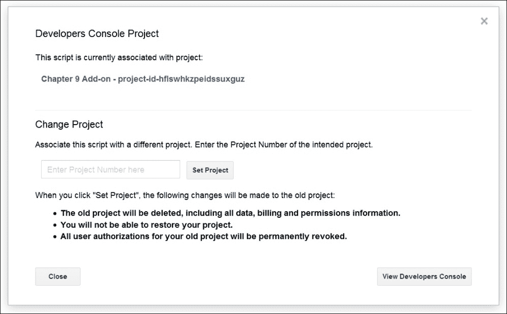

这应该会带您到开发者控制台仪表板，您可以在其中点击 **启用和管理 API** 选项。

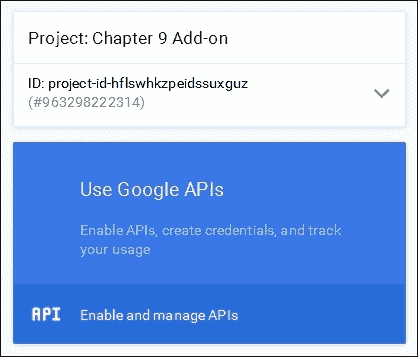

一旦启用，点击控制台仪表板左侧的 **凭证**：

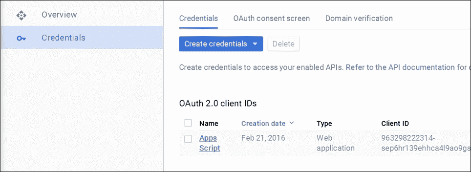

为了完成 OAuth2 流程，此回调函数将被调用，并向用户显示一条消息。然后，OAuth2 客户端 ID 被列为**Apps Script**。点击**Apps Script**以查看如下所示的详细信息：

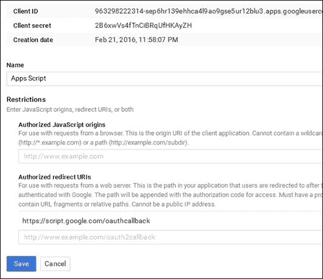

您需要为此项目添加一个授权的重定向 URL。输入如下所示的 URL，但替换为您的项目密钥：

```js
https://script.google.com/macros/d/[[PROJECT KEY]]/usercallback
```

在点击**保存**之前，`getGoogleService`函数中需要客户端 ID 和客户端密钥的副本。一旦完成，点击**保存**；之后您任何时候都可以返回此仪表板。

还需添加如下所示的`authCallback`函数：

```js
function authCallback(request) {
  var service = getGoogleService();
  var isAuthorized = service.handleCallback(request);

  if (isAuthorized) {
return HtmlService 
  .createHtmlOutput('Success! You can close this tab.'); 
  } else {
return HtmlService 
  .createHtmlOutput('Denied. You can close this tab'); 
  }
}
```

在测试插件之前，使用项目密钥导入 OAuth2 客户端库：

```js
MswhXl8fVhTFUH_Q3UOJbXvxhMjh3Sh48
```

### 小贴士

以下是一些示例密钥：

+   OAuth1 库密钥：`Mb2Vpd5nfD3Pz-_a-39Q4VfxhMjh3Sh48`

+   OAuth2 库密钥：`MswhXl8fVhTFUH_Q3UOJbXvxhMjh3Sh48`

### 注意

有关开源 OAuth2 外部库的更多信息，请访问[`github.com/googlesamples/apps-script-oauth2`](https://github.com/googlesamples/apps-script-oauth2)。

现在，您已完成了所有设置步骤。刷新电子表格窗口，以便您的插件出现在**插件**菜单中。

此外，一旦认证，您可以使用此功能重置或撤销认证：

```js
function clearService(){
  OAuth2.createService('PACKT')
  .setPropertyStore(PropertiesService.getUserProperties())
  .reset();
}
```

注意这里使用的相同的服务名称（`PACKT`）。

# 其他有用链接

+   教程：[`developers.google.com/apps-script/articles`](https://developers.google.com/apps-script/articles)

+   文档：[`developers.google.com/apps-script/`](https://developers.google.com/apps-script/)

+   博客：[`googleappsdeveloper.blogspot.in/search/label/Apps%20Script`](http://googleappsdeveloper.blogspot.in/search/label/Apps%20Script)

# 摘要

在本章中，您学习了如何克服脚本最大运行时间限制，如何导入外部库，如何使用 OAuth，以及如何创建插件。我们希望您喜欢阅读这本书，学习，并在 Google Apps Script 的大部分方面积累实践经验。祝您编码愉快，享受编程！
