# 第六章。量表、极坐标和范围图表

在本章中，我们将逐步学习如何创建量表图表。量表图表与其他 Highcharts 图表非常不同。我们将通过绘制类似于双表盘菲亚特 500 速度表的图表来探索新设置。之后，我们将回顾极坐标图表的结构及其与其他图表的相似性。然后，我们将继续探讨如何通过使用前一章的示例来创建范围图表。最后，我们将使用量表图表逐步调整径向渐变以达到预期效果。在本章中，我们将涵盖以下主题：

+   绘制速度表量表图表

+   展示一个简单的实心量表图表

+   将折线图转换为极坐标/雷达图

+   使用市场指数数据绘制范围图表

+   在量表图中使用径向渐变

# 加载量表、极坐标和范围图表

为了使用任何量表、极坐标和范围类型图表，我们首先需要包含一个额外的文件，即包中提供的`highcharts-more.js`：

```js
 <script type="text/javascript" 
     src="img/highcharts.js"></script>
 <script type="text/javascript" 
     src="img/highcharts-more.js"></script>
```

# 绘制速度表量表图表

量表图与其他 Highcharts 图表的结构非常不同。例如，量表图的核心是由一个面板组成的。**面板**是一个圆形绘图区域，用于布局图表内容。我们可以调整面板的大小、位置和背景。一旦面板布局完成，我们就可以在上面放置轴。Highcharts 支持图表内的多个面板，因此我们可以在图表内显示多个量表（即多个量表系列）。量表系列由两个特定组件组成——一个枢轴和一个表盘。

在量表图中，另一个显著的区别是系列实际上是单维数据：一个单一值。因此，这种图表中只有一个轴，即 y 轴。`yAxis`属性的使用方式与其他系列类型图表相同，可以是`linear`、`datetime`或`logarithmic`刻度，并且它也响应`tickInterval`选项等。

## 绘制双表盘图表——菲亚特 500 速度表

到目前为止，我们已经提到了构成量表图表的所有部分及其关系。有许多可用的选项可以与量表图表一起使用。为了充分利用它们，我们将逐步学习如何按照菲亚特 500 速度表的设计构建一个复杂的量表图表，如下所示：

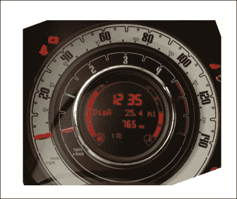

速度表是由两个叠在一起的表盘组装而成的。外层表盘有两个轴——英里/小时和千米/小时。内层表盘是转速表，具有不同的刻度和样式。另一个不常见的特性是，两个表盘的机身部分都隐藏在下面：只显示顶部指针部分。量表中心有一个 LED 屏幕显示行程信息。尽管所有这些独特特性，Highcharts 仍然提供了足够的灵活性来组装一个看起来非常相似的图表。

## 绘制仪表图面板

首先，让我们看看在 Highcharts 中面板的作用。为了做到这一点，我们应该先从构建一个单独的表盘速度表开始。以下是一个带有单个面板和单个轴的仪表图的图表配置代码：

```js
     chart: {
            renderTo: 'container'
     },
     title: {  text: 'Fiat 500 Speedometer' },
     pane: [{
             startAngle: -120,
             endAngle: 120,
             size: 300,
             backgroundColor: '#E4E3DF'
     }],
     yAxis: [{
             min: 0,
             max: 140,
             labels: {
                   rotation: 'auto'
             }
     }],
     series: [{
             type: 'gauge',
             data: [ 0 ]
     }]
```

上述代码片段生成了以下仪表图：

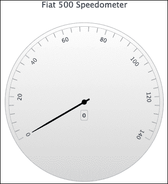

目前，这看起来根本不像菲亚特 500 的速度表，但我们将看到图表逐渐演变。配置声明了一个从-120 度到 120 度的圆形绘图区域的面板，y 轴水平放置，而 0 度位于 12 点钟位置。`rotation`选项通常采用数值度值；`'auto'`是特殊关键字，用于启用 y 轴标签自动旋转，以便与面板角度对齐。表盘下面的这个小方块是默认的数据标签，显示系列中的当前值。

### 设置面板背景

仪表图支持比单一背景颜色更高级的背景设置，正如我们在上一个示例中看到的那样。相反，我们可以在接受不同背景设置数组的`pane`选项内部指定另一个属性`background`。每个设置都可以声明为一个内环，其中定义了`innerRadius`和`outerRadius`值，或者作为一个只有`outerRadius`选项的圆形背景。两种选项都分配了相对于面板大小的百分比值。在这里，我们将多个背景设置到面板中，如下所示：

```js
            chart: {
                type: 'gauge',
                .... 
            },
            title: { .... },
            series: [{
                name: 'Speed',
                data: [ 0 ],
                dial: { backgroundColor: '#FA3421' }
            }],
            pane: [{
                startAngle: -120,
                endAngle: 120,
                size: 300,
                background: [{
                    backgroundColor: { 
                       radialGradient: {
                          cx: 0.5,
                          cy: 0.6,
                          r: 1.0 
                        },
                       stops: [
                           [0.3, '#A7A9A4'],
                           [0.45, '#DDD'],
                           [0.7, '#EBEDEA'],
                       ]
                    },
                    innerRadius: '72%',
                    outerRadius: '105%'
                 }, {
                    // BG color in between speed and rpm
                    backgroundColor: '#38392F',
                    outerRadius: '72%',
                    innerRadius: '67%'
                 }, {
                    // BG color for rpm
                    .....
                 }]
```

如我们所见，定义了几个背景，包括内仪表的背景：转速表盘。其中一些背景是环形，最后一个是一个圆形背景。此外，针的颜色`series.dial.backgroundColor`默认设置为黑色。我们最初将表盘颜色设置为红色，这样我们仍然可以看到黑色背景下的针，这也更接近现实生活中的例子。在本节稍后，我们将探讨塑造和着色表盘和枢轴的细节。至于具有`radialGradient`功能的背景，我们将在本章稍后进行考察。

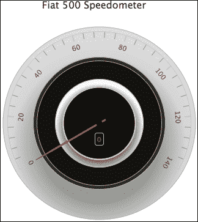

### 管理不同刻度的轴

下一个任务是为 km/h 刻度创建一个次要的*y*轴，我们将把这个新轴设置在当前显示轴的下方。我们按照以下方式插入新的轴配置：

```js
            yAxis: [{
                min: 0,
                max: 140,
                labels: {
                   rotation: 'auto'
                }
            }, {
                min: 0,
                max: 220,
                tickPosition: 'outside',
                minorTickPosition: 'outside',
                offset: -40,
                labels: {
                   distance: 5,
                   rotation: 'auto'
                }
            }],
```

新轴的刻度范围从`0`到`220`，我们使用具有负值的`offset`选项，这使轴的线条向面板中心推进。此外，`tickPosition`和`minorTickPosition`都设置为`'outside'`。这改变了间隔刻度的方向，与默认设置相反。现在两个轴都面向对方，这使得它们类似于以下图示：

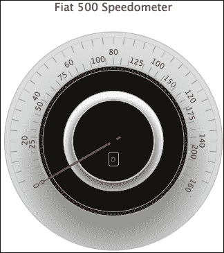

然而，出现了一个问题，因为顶部轴的刻度已经被打乱：它不再在 0 到 140 之间。这是因为次要轴的默认行为是对多个轴之间的间隔进行对齐。为了解决这个问题，我们必须将`chart.alignTicks`选项设置为`false`。之后，问题得到解决，两个轴都按照预期布局：

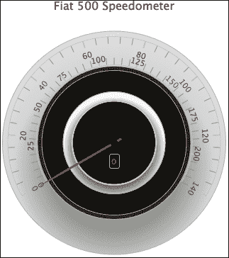

### 扩展到多个窗格

由于量规由两个刻度盘组成，我们需要为第二个刻度盘添加一个额外的窗格。以下是对窗格的配置：

```js
            pane: [{
                // First pane for speed dial
                startAngle: -120,
                endAngle: 120,
                size: 300,
                background: [{
                    backgroundColor: { 
                       radialGradient: {
                       .....
                }]
            }, {
                // Second pane for rpm dial
                startAngle: -120,
                endAngle: 120,
                size: 200
            }]
```

第二个窗格的绘图区域从与第一个窗格相同的角度开始和结束，但尺寸更小。由于我们没有使用`center`选项在图表内定位任何窗格，内窗格自动放置在外窗格的中心。下一步是创建另一个轴，转速轴，它在 4.5 和 6 之间的值之间有一个红色区域标记。然后，我们将所有轴绑定到它们的窗格，如下所示：

```js
            yAxis: [{
                // axis for rpm - pane 1
                min: 0,
                max: 6,
                labels: {
                   rotation: 'auto',
                   formatter: function() {
                       if (this.value >= 4.5) {
                          return '<span style="color:' + 
                          '#A41E09">' + this.value +
                          "</span>";
                       }
                       return this.value;
                   }
                },
                plotBands: [{
                    from: 4.5,
                    to: 6,
                    color: '#A41E09',
                    innerRadius: '94%'
                }],
                pane: 1
            }, {
                // axis for mph - pane 0
                min: 0,
                max: 140,
                .....
                pane: 0
            }, {
                // axis for km/h - pane 0
                min: 0,
                max: 220,
                ....
                pane: 0
          }]
```

对于转速轴，我们使用`labels.formatter`来标记高转速区域的字体颜色，并为轴创建一个绘图带。`innerRadius`选项用于控制红色区域看起来有多厚。下一个任务是创建一个新的量规系列，即新窗格的第二个刻度盘。由于图表包含两个不同的刻度盘，我们需要使刻度盘的运动相对于一个轴，因此我们将`yAxis`选项分配给绑定系列到轴。此外，我们将新系列的初始值设置为`4`，只是为了演示两个刻度盘是如何构建的，而不是相互叠加，如下所示：

```js
            series: [{
                type: 'gauge',
                name: 'Speed',
                data: [ 0 ],
                yAxis: 0
            }, {
                type: 'gauge',
                name: 'RPM',
                data: [ 4 ],
                yAxis: 2
            }]
```

在所有这些额外更改之后，内部刻度盘的新外观如下：

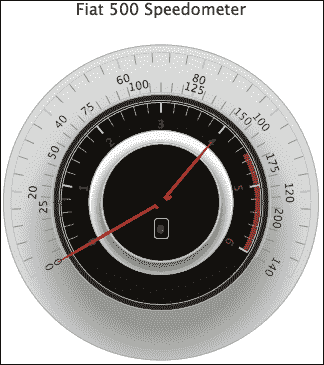

在下一部分，我们将学习如何设置刻度针的外观和感觉。

## 量规系列 – 刻度盘和枢轴

有一些特定于量规系列的属性，即`plotOptions.gauge.dial`和`plotOptions.gauge.pivot`。`dial`选项控制针本身的外观和感觉，而`pivot`是连接到刻度盘的量规中心的小圆圈对象。

首先，我们想要改变刻度盘的颜色和厚度，如下所示：

```js
            series: [{
                type: 'gauge',
                name: 'Speed',
                ....
                dial: {
                    backgroundColor: '#FA3421',
                    baseLength: '90%',
                    baseWidth: 7,
                    topWidth: 3,
                    borderColor: '#B17964',
                    borderWidth: 1
                }
            }, {
                type: 'gauge',
                name: 'RPM',
                ....
                dial: {
                    backgroundColor: '#FA3421',
                    baseLength: '90%',
                    baseWidth: 7,
                    topWidth: 3,
                    borderColor: '#631210',
                    borderWidth: 1
                }
            }]
```

上述代码片段产生以下输出：

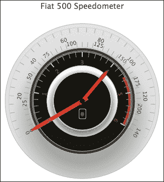

首先，我们通过将`baseWidth`选项设置为针尖宽度为`7`像素，针尖末端为`3`像素来加宽针。然后，我们不是让针逐渐变细到针尖的末端，而是将`baseLength`选项设置为`'90%'`，这是针在刻度盘上开始变细到尖点的位置。

如我们所见，表盘仍然不太对劲，因为它们不够长，无法达到轴线条，如前一个屏幕截图所示。其次，其余的表盘主体没有被覆盖。我们可以通过调整`rearLength`选项来解决这个问题。以下是对系列设置的修正：

```js
            series: [{
                type: 'gauge',
                name: 'Speed',
                .....
                dial: {
                    .....
                    radius: '100%',
                    rearLength: '-74%'
                },
                pivot: { radius: 0 }   
            }, {    
                type: 'gauge',
                name: 'RPM',
                .....
                dial: { 
                    .....
                    radius: '100%',
                    rearLength: '-74%'
                },
                pivot: { radius: 0 }
            }] 
```

技巧在于，我们不像大多数仪表图那样使用正值，而是输入一个负值以产生覆盖效果。最后，我们通过指定`radius`值为`0`来移除枢轴。以下是对表盘的最终调整：

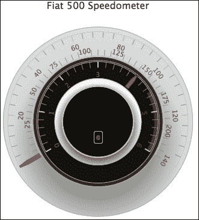

## 用字体和颜色润色图表

下一步是应用轴选项来调整刻度间隔的颜色和大小。轴标签使用来自 Google 网络字体服务的字体（有关 Google 网络字体，请参阅[`www.google.com/fonts`](http://www.google.com/fonts)）。然后，我们调整字体大小和颜色，使其与屏幕截图中的显示一致。Google 网络字体提供了众多选择，并且应用它们有简单的说明。以下是将 Squada One 字体嵌入 HTML 文件`<head>`部分的示例：

```js
<link href='http://fonts.googleapis.com/css?family=Squada One'  
 rel='stylesheet' type='text/css'>
```

我们将新导入的字体应用到 y 轴标题和标签上，如下例所示：

```js
   yAxis: {
        // axis for rpm - pane 1
        min: 0,
        max: 6,
        labels: { 
            style: {
                fontFamily: 'Squada One',
                fontSize: 22
                ....
            }
        }
```

这显著提高了仪表的外观，如下所示：

中找到。以下是对润色后的仪表图的最终外观：

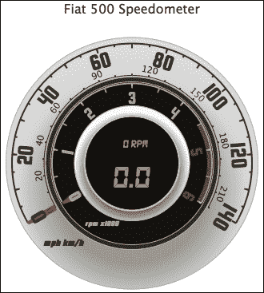

# 绘制实心仪表图

Highcharts 提供了另一种类型的仪表图，即实心仪表图，其呈现方式不同。图表背景不是表盘，而是填充了另一种颜色以指示水平。以下是从 Highcharts 在线演示中提取的示例：

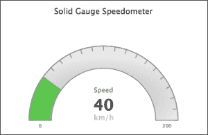

制作实心仪表图的原理与仪表图相同，包括面板、y 轴和系列数据，但不需要设置表盘。以下是我们第一次尝试：

```js
            chart: {
                renderTo: 'container',
                type: 'solidgauge'
            },
            title: ....,
            pane: {
               size: '90%',
                background: {
                    innerRadius: "70%",
                    outerRadius: "100%"
                }
            },
            // the value axis
            yAxis: {
                min: 0,
                max: 200,
                title: {
                    text: 'Speed'
                }
            },
            series: [{
               data: [40],
               dataLabels: {
                    enabled: false
               }
            }]
```

我们从指定`innerRadius`和`outerRadius`选项的环形面板开始。然后，我们将 y 轴范围分配到背景面板上，并将初始值设置为 40 以显示仪表水平。以下是我们第一次实心仪表的结果：

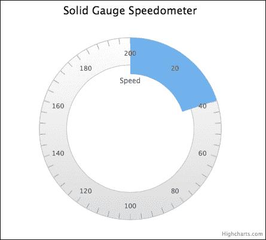

如我们所见，面板从 12 点钟位置开始和结束，面板的一部分被蓝色填充作为实心仪表表盘。让我们使轴顺时针从 9 点钟到 3 点钟移动，并配置间隔以在颜色仪表上可见。此外，我们将增加间隔的厚度，并且只允许显示第一个和最后一个间隔标签。以下是修改后的配置：

```js
            chart: .... ,
            title: .... ,
            pane: {
                startAngle: -90,
                endAngle: 90,
                ....
            },
            yAxis: {
                lineColor: '#8D8D8D',
                tickColor: '#8D8D8D',
                intervalWidth: 2,
                zIndex: 4,
                minorTickInterval: null,
                tickInterval: 10,
                labels: {
                    step: 20,
                    y: 16
                },
                ....
           },
           series: ....
```

`startAngle`和`endAngle`选项是面板上标签的有效起始和结束位置，因此-90 度和 90 度分别是 9 点钟和 3 点钟的位置。接下来，`lineColor`（外边界上的轴线颜色）和`tickColor`都应用了较深的颜色，因此通过结合`zIndex`选项，间隔以不同的仪表颜色级别变得可见。

以下是修改后图表的输出：

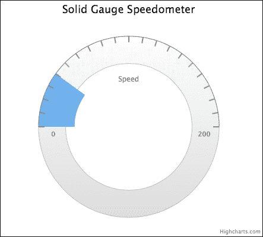

接下来，我们移除背景面板的下半部分，留下半圆形形状，并使用阴影（在本章后面详细描述）配置背景。然后，我们将颜色仪表的大小调整为与背景面板相同的宽度。我们提供了一组颜色带，用于不同的速度值，这样 Highcharts 将根据值自动将仪表水平线从一种颜色带切换到另一种颜色带：

```js
 chart: ...
            title: ...
            pane: {

                background: {

                    shape: 'arc',
                    borderWidth: 2,
                    borderColor: '#8D8D8D',
                    backgroundColor: {
                        radialGradient: {
                            cx: 0.5, 
                            cy: 0.7, 
                            r: 0.9
                        },
                        stops: [
                            [ 0.3, '#CCC' ],
                            [ 0.6, '#E8E8E8' ]
                        ]
                    },
                }
            },

            yAxis: {
                        ... ,
          stops: [
                    [ 0, '#4673ac' ], // blue
                    [ 0.2, '#79c04f' ], // green
                    [ 0.4, '#ffcc00'], // yellow
                    [ 0.6, '#ff6600'], // orange
                    [ 0.8, '#ff5050' ], // red
                    [ 1.0, '#cc0000' ]
                ],
            },

            plotOptions: {
                      solidgauge: {
                                    innerRadius: '71%'
                                }
                    },

                   series: [{
                            data: [100],
                            }]
```

`shape`选项，`'arc'`，将面板转换为弧形。y 轴上的颜色带通过`stops`选项提供，该选项是一个包含比例（y 轴范围的比率）和颜色值的数组。为了使仪表水平与面板对齐，我们将`plotOptions.solidgauge`的`innerRadius`值设置为略小于面板的`innerRadius`值，这样仪表水平线的移动就不会覆盖面板的内边框。我们将系列值设置为 100 以显示仪表水平线显示不同颜色的如下：

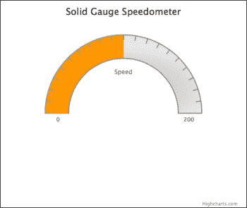

现在我们图表的下半部分有额外的空间，我们可以简单地向下移动图表并使用以下方式装饰它：

```js
            pane: {
                .... ,
                center: [ '50%', '65%' ]
            },
            plotOptions: {
                solidgauge: {
                   innerRadius: '71%',
                    dataLabels: {
                           y: 5,
                           borderWidth: 0,
                           useHTML: true
                    }
               }
            },
            series: [{
                 data: [100],
                 dataLabels: {
                      y: -60,
                      format: '<div style="text-align:center">' + 
      '<span style="font-size:35px;color:black">{y}</span><br/>' +
     '<span style="font-size:16px;color:silver">km/h</span></div>'
              }
            }]
```

我们使用`center`选项将图表的垂直位置设置为绘图区域高度的 65%。最后，我们启用`dataLabels`以在 HTML 中以文本装饰的形式显示：

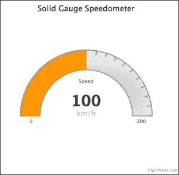

# 将折线图转换为极坐标/雷达图

极坐标图（或雷达图）通常用于发现数据趋势。它们与线型和柱状图有一些不同。尽管它们可能看起来像饼图，但它们与它们没有任何共同之处。实际上，极坐标图是传统二维图表的圆形表示。为了以另一种方式可视化，它是一个折叠的线或柱状图，以圆形方式放置，x 轴的两端相遇。

再次强调，为了绘制极坐标图，我们需要包含 `highcharts-more.js`。以下截图展示了极坐标图的结构：

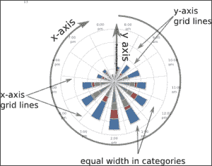

在原则上几乎没有差异，Highcharts 的配置也是如此。让我们使用我们第一个浏览器使用情况图表的例子，在 第一章 *网络图表* 中，将其转换为雷达图。回忆起浏览器折线图，我们做了以下操作：


要将折线图转换为极坐标图，我们只需将 `chart.polar` 选项设置为 `true`，这样就将正交的 x 和 y 坐标转换为极坐标系。为了使新的极坐标图更容易阅读，我们将 *x* 轴标签的 `rotation` 值设置为 `'auto'`，如下所示：

```js
             chart: { 
                 ....,
                 polar: true
             },
             ....,
             xAxis: {
                 ....,
                 labels: { rotation:  'auto' }
             },
```

以下为折线图的极坐标版本：

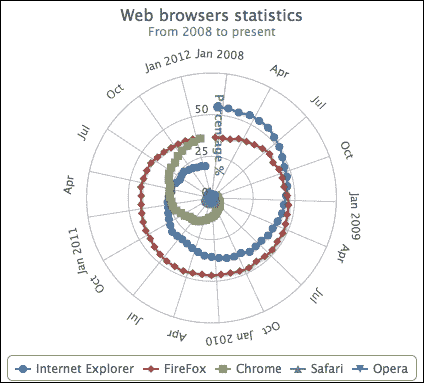

如我们所见，极坐标图的一个特点是它以与传统图表不同的方式揭示数据趋势。从顺时针方向看，对于上升趋势（Chrome），数据线“螺旋上升”，而对于下降趋势（Internet Explorer），数据线“螺旋下降”，而 Firefox 的数据线没有太多移动。至于 Safari 和 Opera，这些系列基本上是丢失的，除非我们放大图表容器，这在实际操作中是不切实际的。另一个特点是系列中的最后一个和第一个数据点连接在一起。因此，Firefox 系列显示一个闭合的环，而 Internet Explorer 系列（Chrome 系列没有连接，因为 Chrome 浏览器直到 2008 年晚些时候才发布，所以在系列开头有空值）有一个突然的跳跃。

为了纠正这种行为，我们可以在每个系列数据数组的末尾添加一个空值，以打破连续性，如下面的截图所示：

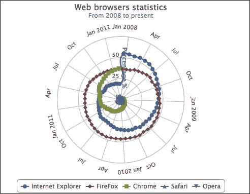

Highcharts 支持在 *y* 轴网格线上进行多边形插值，而不是圆形极坐标图。这意味着网格线被拉直，整个图表就像一个蜘蛛网。

为了说明，我们将 *x* 轴和 *y* 轴线条的宽度设置为 0，从而从图表中移除了圆形轮廓。然后，我们在 *y* 轴上设置了一个特殊选项 `gridLineInterpolation`，将其设置为 `polygon`。最后，我们将 x 轴的 `tickmarkPlacement` 选项从默认值 `between` 改为 `'on'`。这样，x 轴上的间隔刻度就会与每个类别的开始对齐。以下代码片段总结了我们需要做出的更改：

```js
            xAxis: {
                categories: [ ..... ],
                tickmarkPlacement: 'on',
                labels: {
                    rotation: 'auto',
                },
                lineWidth: 0,
                plotBands: [{
                    from: 10,
                    to: 11,
                    color: '#FF0000'
                }]
            },
            yAxis: {
                .....,
                gridLineInterpolation: 'polygon',
                lineWidth: 0,
                min: 0
            },
```

为了演示蜘蛛网形状，我们将从之前的图表中删除大部分数据样本（或者，您也可以放大图表容器以保留所有数据）。我们还将添加一些网格线装饰和一个 x 轴绘图带（11 月 – 12 月），只是为了显示其他轴选项仍然可以应用于极坐标图：

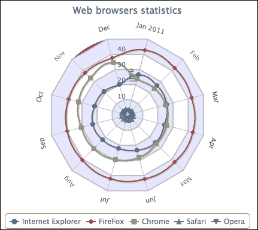

# 使用市场指数数据绘制范围图

范围图实际上是线形和柱形图，用于展示一系列数据范围。范围类型的系列可以是`arearange`、`areasplinerange`和`columnrange`。这些系列期望在数据选项中有一个包含三个数据点的数组，x，y 最小值，y 最大值，或者在`xAxis.cateogries`已经指定的情况下，是一个包含 y 最小值和 y 最大值的数组。

让我们用过去的例子来看看我们是否可以改进范围图。在第二章中，*Highcharts 配置*，我们有一个包含纳斯达克 100 月度数据的五系列图表：开盘价、收盘价、最高价、最低价和成交量，如下面的截图所示：

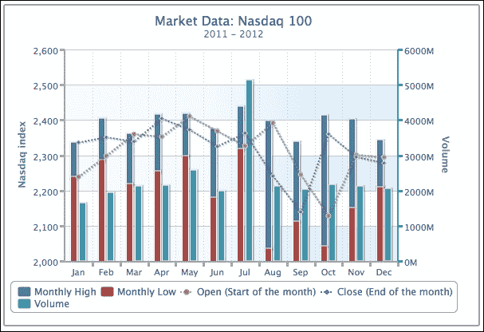

使用新的范围系列，我们排序系列数据，并将**月最高价**和**月最低价**列合并为一个柱形范围系列，将**开盘价**和**最低价**列合并为一个区域样条线范围系列，如下所示：

```js
            series: [{
              type: 'columnrange',
              name: 'High & Low',
              data: [ [ 2237.73, 2336.04 ], 
                      [ 2285.44, 2403.52 ], 
                      [ 2217.43, 2359.98 ],  ...... ]
            }, {
              type: 'areasplinerange',
              name: 'Open & Close',
              // This array of data is pre-sorted,
              // not in Open, Close order.
              data: [ [ 2238.66, 2336.04 ], 
                      [ 2298.37, 2350.99 ], 
                      [ 2338.99, 2359.78 ], ...... ]
            }, {
              name: 'Volume',
              ......
```

下面的截图显示了范围图版本：

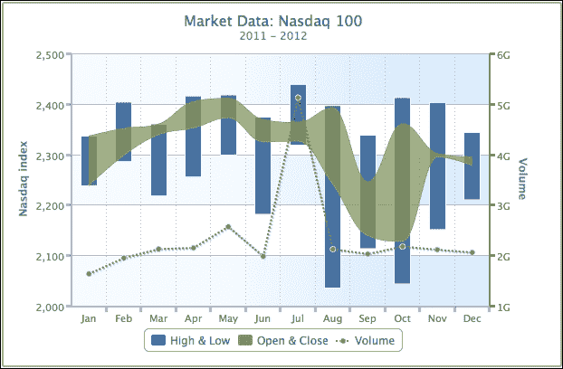

新图表看起来更容易阅读，图形也更紧凑。值得注意的是，对于柱形范围系列，必须保持范围在最小值到最大值的顺序。至于区域样条线和区域范围系列类型，我们仍然可以绘制范围系列，即使在没有事先排序的情况下也可以。

例如，**高低**范围系列必须按照系列名称的自然含义，以最小值和最大值的顺序排列。然而，对于**开盘价与收盘价**范围系列来说，情况并非如此，因为我们不知道哪一个是开盘价或收盘价。如果我们按照从开盘到收盘的顺序，而不是从 y 最小值到 y 最大值的顺序，来绘制**开盘价与收盘价**区域范围系列，那么区域范围将显示不同，如下面的截图所示：

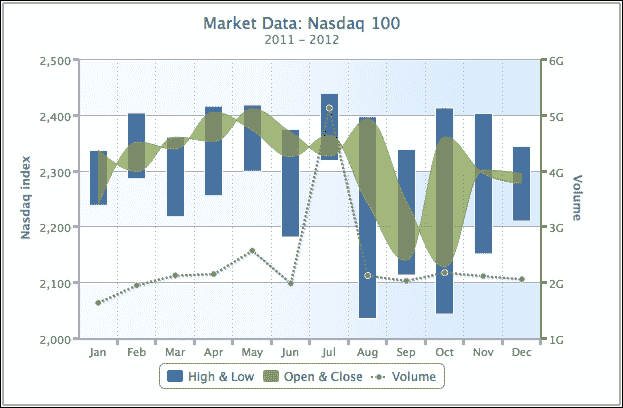

如我们所见，区域范围系列中存在扭曲的部分；这些交叉是由数据对中的反向顺序引起的。然而，我们不知道开盘价是否高于收盘价，反之亦然。如果我们只想知道**开盘价与收盘价**系列之间的范围有多宽，那么前面的区域范围图就达到了目的。通过将它们作为单独的系列，就不会出现这样的问题。总的来说，这是在绘制具有模糊意义的范围系列数据时的微妙差异。

# 在仪表图上使用径向渐变

径向渐变设置基于 SVG。正如其名所示，**径向渐变**是以圆形方向向外辐射的颜色阴影。因此，它需要三个属性来定义渐变圆——`cx`、`cy` 和 `r`。渐变圆是阴影的最外层圆，这样阴影就不会超出这个范围。

所有渐变位置都是相对于其包含元素的比例值在零到一之间定义的。`cx` 和 `cy` 选项位于最外层圆的 x、y 中心位置，而 `r` 是最外层圆的半径。如果 `r` 是 0.5，这意味着渐变半径是其元素直径的一半，与包含面板大小相同。换句话说，渐变从中心开始，一直延伸到仪表的边缘。`stop` 偏移选项与线性渐变的工作方式相同：第一个参数是渐变圆中停止阴影的比率位置。这控制了颜色之间的阴影强度。间隔越短，颜色之间的对比度越高。

让我们探索如何设置颜色渐变。以下是一个没有颜色渐变的情绪波动检测器：

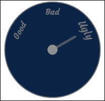

我们将使用以下设置将径向渐变应用于前面的图表：

```js
                background: [{ 
                   backgroundColor: {
                       radialGradient: {
                           cx: 0.5,
                           cy: 0.5,
                            r: 0.5
                       },
                       stops: [
                           [ 0, '#CCD5DE' ],
                           [ 1, '#002E59' ]
                       ]  
                   }
                }]
```

我们将 `cx`、`cy` 和 `r` 设置为 `0.5`，以便渐变从中心位置开始阴影，一直延伸到圆的边缘，如下所示：

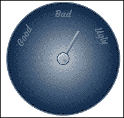

如我们所见，前面的图表显示了从中心均匀辐射的白色阴影。让我们改变一些参数并看看效果：

```js
              backgroundColor: {
                  radialGradient: {
                      cx: 0.5,
                      cy: 0.7,
                      r: 0.25
                  },
                  stops: [
                      [ 0.15, '#CCD5DE' ],
                      [ 0.85, '#002E59' ]
                  ]  
              }
```

在这里，我们将渐变圆的大小改为仪表大小的一半，并将圆向下移动。明亮的颜色直到达到渐变圆大小的 15% 才开始阴影，因此在中间有一个明显的白色块，阴影在圆的 85% 处停止：

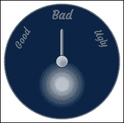

在 SVG 辐射渐变中，还有两个其他选项，`fx` 和 `fy`，它们用于设置阴影的焦点位置；它们也被称为内圆设置。

### 注意

`fx` 和 `fy` 选项可能与 Chrome 和 Safari 浏览器不兼容。在撰写本文时，只有 Firefox 和 Internet Explorer 浏览器与这里显示的图像正常工作。

让我们实验一下焦点如何影响阴影效果：

```js
                   backgroundColor: {
                       radialGradient: {
                           cx: 0.5,
                           cy: 0.7,
                            r: 0.25,
                           fx: 0.6,
                           fy: 1.0
                       },
                       stops: [
                           [ 0.15, '#CCD5DE' ],
                           [ 0.85, '#002E59' ]
                       ]  
                   }
```

以下代码片段产生以下输出：

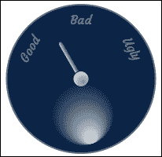

我们可以观察到`fx`和`fy`选项将亮色从渐变圆的底部开始，略微向右移动。这使得阴影变得更加有方向性。让我们通过将亮斑位置移动到仪表图表的中心来做出最终的改变。此外，我们将焦点方向与**良好**标签对齐：

```js
                background: [{ 
                   backgroundColor: {
                       radialGradient: {
                           cx: 0.32,
                           cy: 0.38,
                            r: 0.25,
                           fx: 1.3,
                           fy: 0.95 
                       },
                       stops: [
                           [ 0.1, '#CCD5DE' ],
                           [ 0.9, '#002E59' ]
                       ]  
                   }]
```

最后，我们可以通过将亮面移动到我们想要的位置来完成图表，如下所示：

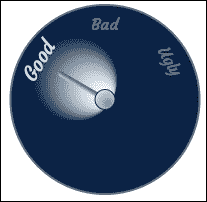

### 注意

`fx`和`fy`选项仅适用于 SVG，而旧版本的 Internet Explorer（8.0 或更早版本）使用 VML 则不支持。

# 摘要

在本章中，我们学习了仪表、极坐标和范围图表。一个详尽的分步演示展示了如何通过利用大多数仪表选项来绘制一个复杂的速度计。我们还演示了极坐标、柱状图和折线图在原理和配置方面的差异。我们使用范围图表来改进过去章节的示例，并研究它们在图表中引入的细微差异。最后，我们探讨了如何通过逐步调整选项来定义径向渐变。

在下一章中，我们将通过从在线体育图表中重新创建它来学习气泡图表的结构。然后，我们将简要讨论箱线图表的特性，通过将蜘蛛图表中的数据转换而来，接着展示使用误差线图表呈现的 F1 赛车数据。
