# 第九章。3D 图表

3D 图表一直是 Highcharts 中最受期待和最希望拥有的功能。这是一个在用户社区中引起激烈争论的话题。有些用户同意使用 3D 图表，例如在销售和营销报告中或信息图表海报中。反对者认为，3D 图表在数据可视化和比较的准确性方面具有误导性，因此应将开发资源集中在其他地方。至于 Highcharts，它选择了支持的方向。

本章重点介绍 3D 配置的基础知识，并展示了一系列以 3D 形式呈现的图表，以及每个支持系列中的几个特定选项。在本章中，我们将学习：

+   高 charts 中的 3D 图表是什么以及不是什么

+   尝试 3D 图表的方向：`alpha`、`beta`、`depth`和`viewDistance`

+   配置 3D 图表背景

+   在 3D 图表中绘制柱状图、饼图、环形图和散点图系列

+   使用 3D 图表导航

# 高 charts 3D 图表是什么以及不是什么

在撰写本文时，3D 图表功能是将 2D 图表以真实 3D 演示的形式显示出来，即我们可以从不同维度旋转和倾斜图表，并调整视图距离。3D 功能目前仅适用于柱状图、饼图和散点图系列。

3D 图表无法做到的是构建一个真正的三维、*x*、*y*和*z*轴图表，除了散点图；我们甚至会在散点图中看到一些不足之处。由于这是 3D 图表的第一个主要版本，这种限制可能很快就会消失。

# 尝试 3D 图表的方向

要启用 3D 功能，我们首先需要包含以下扩展：

```js
<script 
 src="img/highcharts-3d.js"></script>
```

在 Highcharts 中，存在两个级别的 3D 选项：图表和系列。图表级别的选项位于`chart.options3d`中，主要处理绘图区域的朝向和框架，而系列的三维选项仍然位于常规的`plotOptions`区域，例如`plotOptions.column.depth`。

目前，Highcharts 支持两个旋转轴：水平和垂直，分别对应于`chart.options3d`中的`alpha`和`beta`选项。这些选项的值以度为单位。以下图表通过箭头说明了随着度值增加和减少图表旋转的方向：

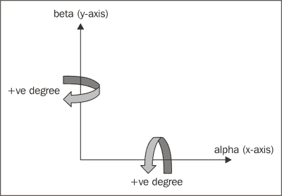

## Alpha 和 beta 方向

在前面的图表中，我们展示了方向的指向。让我们尝试一个柱状图。我们将使用来自第四章的图表，*条形图和柱状图*，看起来如下：

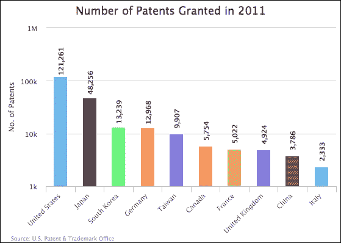

然后我们按照以下方式向图表添加 3D 选项：

```js
             chart: {
                renderTo: 'container',
                type: 'column',
                borderWidth: 1,
                options3d: {
                    alpha: 0,
                    beta: 0,
                    enabled: true
                }
            },
```

我们将图表切换到 3D 显示模式，启用选项，并在两个轴上没有旋转，从而产生以下图表：

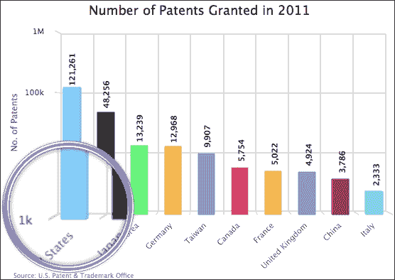

注意，在没有旋转的情况下，图表看起来几乎与原始图表相同，正如预期的那样。当我们仔细观察时，柱子实际上是构建在 3D 中，具有深度。让我们将 alpha 轴设置为 30 度，将 beta 轴保持为零：

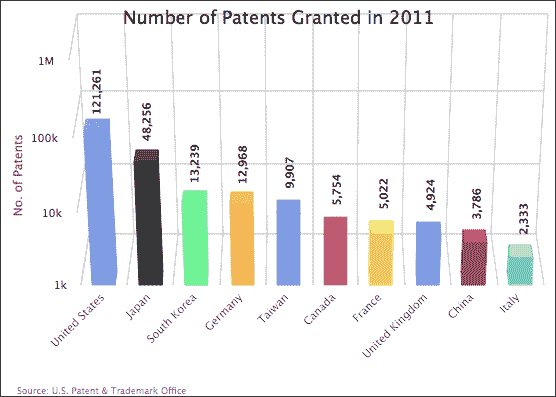

当 alpha 轴增加时，我们可以更清楚地看到 3D 结构，因为我们正倾斜着从上到下查看图表。让我们将 alpha 轴重置为零，并将 beta 轴设置为 30 度：

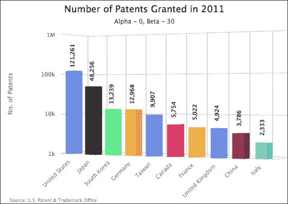

图表在垂直主轴上水平旋转。请注意，一旦图表在 beta 轴上旋转，标题和 *y* 轴之间会出现一个很大的间隙。我们可以通过使用 `x` 和 `y` 选项定位标题来消除这个间隙：

```js
            yAxis: {
                title: {
                    text: 'No. of Patents',
                    x: 35,
                    y: -80
                }
            },
```

让我们将两个旋转都设置为 30：

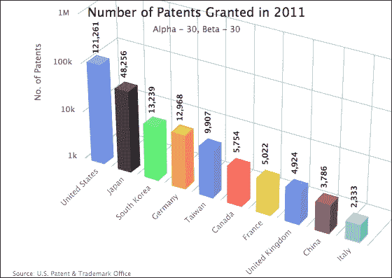

注意，当我们旋转 3D 图表时，绘图区域可能会与其他组件（如图表标题和每侧的间距）发生干扰。在这种情况下，我们需要使用边距设置来手动适当地调整图表，这取决于大小和视图角度。以下是一个示例：

```js
        var chart = new Highcharts.Chart({
              chart: {
                    ....,
                    marginTop: 105,
                    marginLeft: 35,
                    spacingBottom: 25
              }
              ....
```

## 深度和视图距离

除了 `alpha` 和 `beta` 选项之外，我们还可以使用 `depth` 选项来控制数据显示与 3D 背景之间的距离。让我们将 `depth` 选项设置为与 3D 柱子的默认深度完全相同，即 25 像素深。我们还指定 `viewDistance` 选项为默认值 `100`（在撰写本文时，更改深度值也会更改 `viewDistance` 值），如下所示：

```js
                options3d: {
                    alpha: 30,
                    beta: 30,
                    enabled: true,
                    viewDistance: 100,
                    depth: 25
                }
```

如我们所见，柱子背靠背景框架：

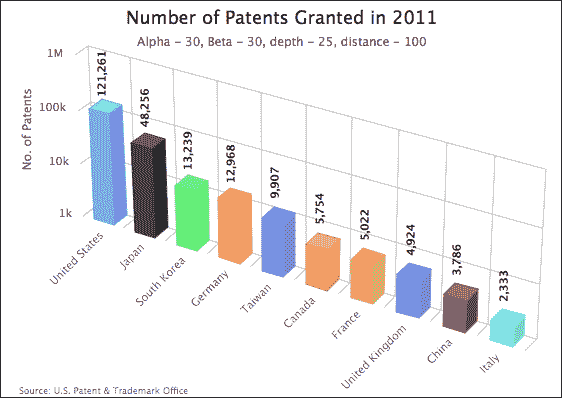

让我们将 `viewDistance` 选项更改为 0 以获得更近的视角：

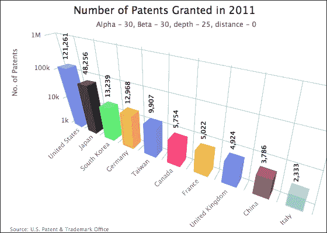

# 配置 3D 图表背景

而不是使用白色背景和深色标签，让我们用不同的设置替换围绕绘图区域的侧面、底部和背面框架。在 Highcharts 中，我们可以指定这些框架的颜色和厚度，如下所示：

```js
                   options3d: {
                       ....,
                       frame: {
                            back: {
                                color: '#A3A3C2',
                                size: 4
                            },
                            bottom: {
                                color: '#DBB8FF',
                                size: 10
                            },
                            side: {
                                color: '#8099E6',
                                size: 2
                            }
                       }
                   }
```

同时，我们也更改了数据标签颜色为白色，这与新的背景颜色形成很好的对比：

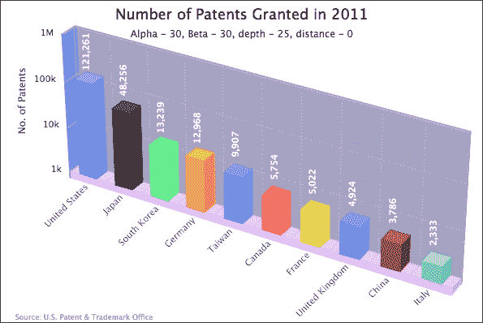

注意，如果我们将背景图像应用于 3D 图表，Highcharts 不会自动将图像沿背景倾斜。

# 在 3D 图表中绘制柱状图、饼图、环形图和散点图系列

在本节中，我们将绘制一个画廊，展示当前支持用于 3D 展示的柱状图、饼图、环形图和散点图系列。我们还将检查每个系列特定的 3D 选项。这里使用的一些示例来自前面的章节。

## 堆叠和多个系列中的 3D 柱子

让我们从嵌入 `options3d` 设置的多系列堆叠柱状图开始：

```js
                options3d: {
                    alpha: 10,
                    beta: 30,
                    enabled: true
                }
```

这是一个多系列分组和堆叠的 3D 柱状图的样子：


### 柱深和 Z 内边距

从前面的图表中可以看出，英国/德国堆叠列的侧面被韩国/日本列覆盖。假设我们想显示英国/德国列的一部分侧面。为了做到这一点，我们可以使用`plotOptions.column.depth`选项减少韩国/日本列的厚度，例如：

```js
            series: [{
                name: 'UK',
                data:  ....,
                stack: 'Europe'
            }, {
                name: 'Germany',
                data:  ....,
               stack: 'Europe'
            }, {
                name: 'S.Korea',
                data:  ....,
                stack: 'Asia',
                depth: 12
            }, {
                name: 'Japan',
                data: ....,
                stack: 'Asia',
                depth: 12
            }]
```

在这里，我们将韩国/日本列的厚度减少到 12 像素，大约是默认值的一半。以下图表显示了一组比另一组更细的列：

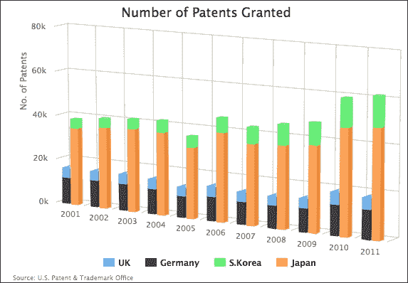

注意，即使我们减少了一组列的深度，英国/德国列的侧面仍然被遮挡。这是因为 Highcharts 默认情况下将 3D 柱状图的表面沿彼此对齐。为了改变这种行为，我们使用`groupZPadding`选项。为了理解`groupZPadding`选项的概念，最好用多个系列 3D 柱状图的俯视图来展示：

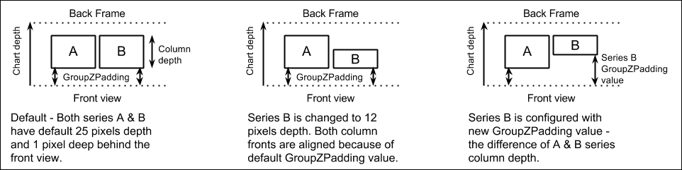

`groupZPadding`选项是前视图和柱状图面之间的距离。为了使两个系列列的背面对齐，我们需要增加具有减少深度的系列 B 的`groupZPadding`值，即：

*B 列深 + B 组 Z 内边距 = A 列深 + A 组 Z 内边距*

我们添加以下`groupZPadding`选项（3D 柱状图默认深度为 25 像素，默认`groupZPadding`为 1 像素）：

```js
           series: [{
                name: 'UK',
                data:  ....,
                stack: 'Europe',
            }, {
                name: 'Germany',
                data:  ....,
               stack: 'Europe',
            }, {
                name: 'S.Korea',
                data:  ....,
                stack: 'Asia',
                depth: 12,
                groupZPadding: 14
            }, {
                name: 'Japan',
                data: ....,
                stack: 'Asia',
                depth: 12,
                groupZPadding: 14
            }]
```

如预期，韩国/日本列被推后，显示了其他系列列的侧面：

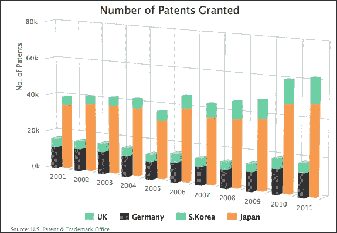

## 绘制信息图表 3D 柱状图

让我们看看我们是否可以使用 Highcharts 绘制信息图表风格的 3D 图表。在本节中，我们将使用 Arno Ghelfi 设计的并在《Wired》杂志上发表的图表，即《任何价格下的极客精神》（见[`starno.com/client/wired/#geekiness-at-any-price-wired`](http://starno.com/client/wired/#geekiness-at-any-price-wired)）。以下是信息图表海报的一部分：

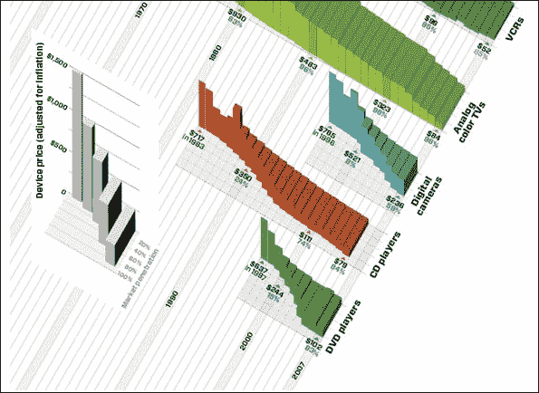

虽然图表看起来难以理解，但我们将专注于使用 Highcharts 重现这些特殊 3D 风格柱状图之一。从之前的练习中，我们知道我们可以设置具有增加深度或具有减少`groupZPadding`值的列，以达到相同的效果。这是因为深度和`groupZPadding`选项来自`plotOptions.column`配置，该配置是基于每个系列设计的。因此，我们需要将每个数据项作为单独的系列放置，以便具有不同深度和`groupZPadding`值的列，如下所示：

```js
            series: [{
                data: [ 1500 ],
                depth: 5,
                groupZPadding: 95
            }, {
                data: [ 1300 ],
                depth: 10,
                groupZPadding: 90
            }, {
                data: [ 1100 ],
                depth: 15,
                groupZPadding: 85
            }, {
```

其次，示例图表中的柱子之间没有间隔。我们可以通过将`groupPadding`和`pointPadding`选项的填充空间设置为零来实现相同的效果。然后，我们使用颜色选项将所有柱子的颜色设置为相同。没有间隔且柱子颜色相同会使它们看起来无法区分。幸运的是，3D 柱状图还有一个特定的选项，即`edgeColor`，它是用于柱子边缘的颜色。以下是配置的结果：

```js
            plotOptions: {
                column: {
                    pointPadding: 0,
                    groupPadding: 0,
                    color: '#C5542D',
                    edgeColor: '#953A20'
                }
            },
```

这里是我们尝试使用 Highcharts 创建信息图表风格图表的尝试：

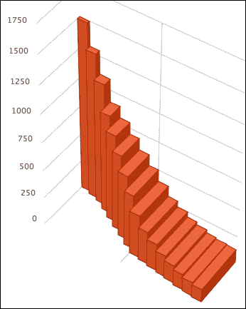

## 绘制 3D 饼图和环形图

绘制 3D 饼图和环形图遵循与柱状图相同的原理。只需包含用于方向的`options3d`配置即可。为了控制饼图的厚度，我们使用`plotOptions.pie.depth`以类似的方式。

让我们使用一些实时数据来绘制 3D 饼图和环形图。首先，我们从 Highcharts 在线演示（[`www.highcharts.com/demo/pie-gradient`](http://www.highcharts.com/demo/pie-gradient)）中借用一些代码，该代码将 Highcharts 标准系列颜色转换为一些渐变风格的颜色。这自动使图表更具吸引力，并带有轻微的阴影：

```js
Highcharts.getOptions().colors = 
   Highcharts.map(Highcharts.getOptions().colors, function(color)  
     {
          return {
            radialGradient: { cx: 0.5, cy: 0.3, r: 0.7 },
            stops: [
                [0, color],
                [1, Highcharts.Color(color).
                 brighten(-0.3).get('rgb')] // darken
            ]
        };
   });
```

在这个饼图中，我们将饼图的`depth`和`alpha`旋转选项分别设置为 50 和 55：

```js
chart: {
    ....,
    options3d: {
        alpha: 55,
        beta: 0,
        enabled: true
    }
   },
....,
plotOptions: {
     pie: {
         center: [ '50%', '45%' ],
         depth: 50,
         slicedOffset: 40,
         startAngle: 30,
         dataLabels: {
             ....
         },
         size: "120%"
     }
},
series: [{
    type: 'pie',
    data: [ { 
        name: 'Sleep', 
        y: 8.74, 
        sliced: true, 
    }, { 
        name: 'Working and work-related activities', 
        y: 3.46 
    }, {
        ....
    }]
}]
```

如我们所见，`depth`选项产生了一个相当厚的 3D 饼图，并具有很好的颜色阴影：

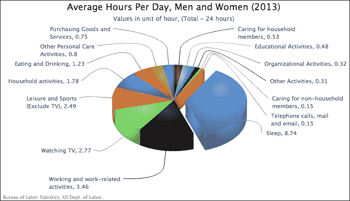

在下一个饼图中，我们将所有部分设置为通过`sliced`选项设置为`true`来分隔，并应用方向：

```js
     chart: {
         ....
         options3d: {
             alpha: 50,
             beta: 40,
             enabled: true
         }
     },
     ....,
     plotOptions: {
         pie: {
             depth: 40,
             center: [ '50%', '44%' ],
             slicedOffset: 15,
             innerSize: '50%',
             startAngle: 270,
             size: "110%",
             ....
         }
     },
     series: [{
         type: 'pie',
         data: [{ 
             name: 'Swiss & UK', 
             y: 790,
             sliced: true, 
             // color, dataLabel decorations
             ....
         }, { 
             name: 'Australia, U.S & South Africa', 
             y: 401,
             ....
            }, {
             ....
         }]
     }]
```

这里是一个所有切片都相互分离的 3D 环形图：

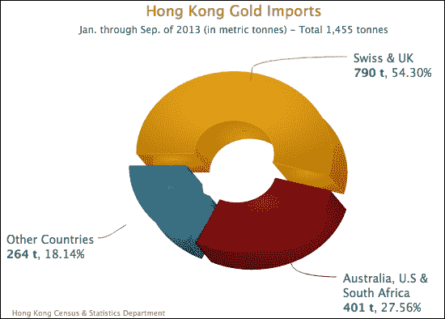

## 3D 散点图

Highcharts 支持真实的三维散点系列，尽管它们在视觉上相当模糊。尽管如此，我们可以使用`zAxis`选项来定义第三个轴的范围。图表没有像其他图表那样在 *z* 轴上显示任何细节。让我们用一些三维数据构建图表。为了绘制三维散点系列，除了`options3d`配置之外，我们还需要在三元组数组中定义数据系列：

```js
            series: [{
                name: 'China',
                data: [ [ 2000, 23.32, 20.91 ], 
                        [ 2001, 22.6, 20.48 ], 
                        [ 2002, 25.13, 22.56 ], 
                        ....,
```

在多个三维散点系列中，它看起来是这样的：

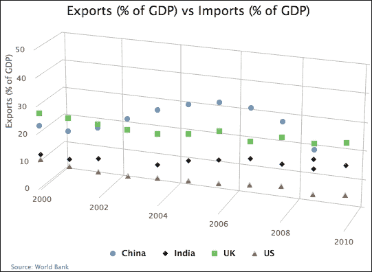

如我们所见，在三维空间中悬挂的数据点很难理解。请注意，Highcharts 目前没有在 *z* 轴上显示任何间隔。让我们添加一些导航来辅助数据可视化：

```js
  var orgColors = Highcharts.getOptions().colors;
  // Apply color shading to Highcharts.getOptions().colors
  ....
  chart: ....,
  ....,
  tooltip: {
   crosshairs: [ { width: 2, color: '#B84DDB' },
                 { width: 2, color: '#B84DDB' },
                 { width: 2, color: '#B84DDB' } ],
   formatter: function() {
       var color = orgColors[this.series.index];
       return '<span style="color:' + color + '">\u25CF</span> ' + 
              this.series.name + ' - In <b>' + this.point.x + 
              '</b>: Exports: <b>' + this.point.y + 
              '%</b>, Imports: <b>' + this.point.z + '%</b><br/>';
   },
   shape: 'square',
   positioner: function(width, height, point) {
       var x = chart.plotLeft + chart.plotWidth - width + 20;
       var y = 40;
       return { x: x, y: y };
   } 
  }
```

我们将所有维度的工具提示更改为十字准线。为了避免工具提示遮挡十字准线线，我们使用`positioner`选项将工具提示位置固定在图表的右上角。接下来，我们使用`formatter`来设置工具提示内容。我们从 Highcharts 在线演示（[`www.highcharts.com/demo/3d-scatter-draggable`](http://www.highcharts.com/demo/3d-scatter-draggable)）借用工具提示格式化代码；`\u25CF`是一个点 Unicode 符号，用作具有系列颜色的项目符号。由于工具提示远离悬停点，将工具提示设置为矩形形状而不是默认的气球样式（Highcharts 中的`callout`）会更少引起混淆。以下截图显示了带有悬停十字准线的图表：

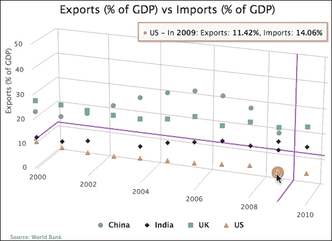

如我们所见，即使我们在 z 维度指定了十字准线，也没有十字准线线沿轴投射。

# 使用 3D 图表进行导航

在本节中，我们将探讨如何与 3D 图表进行交互。在第二章中，*Highcharts 配置*，我们已经探讨了钻取功能，我们将在 3D 图表中简要回顾它。3D 图表特有的另一个交互功能是令人印象深刻的点击并拖动功能。

## 钻取 3D 图表

让我们将之前的钻取示例转换为 3D 图表。首先，我们添加`options3d`选项（和其他定位选项）：

```js
              options3d: {
                  enabled: true,
                  alpha: 25,
                  beta: 30,
                  depth: 30,
                  viewDistance: 100
              },
```

这里，我们有我们的顶级 3D 图表：

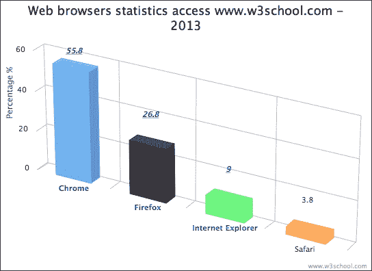

下一步是改进我们的 3D 钻取饼图，使其具有不同的方向。由于顶层列已经配置为 3D，钻取饼图（在`drilldown.series`选项中定义，具有匹配的`id`值）也将相应地配置。然而，我们不会注意到 3D 中的饼图，因为默认深度是 0。因此，我们需要使用`depth`选项设置饼图的厚度：

```js
                plotOptions: {
                    pie: {
                       depth: 30,
                       ....,
```

为了将钻取图表设置为不同的旋转，我们在`drilldown`事件回调中更改图表选项：

```js
chart: {
    renderTo: 'container',
    ....,
    events: {
        drilldown: function(e) {
           .... 
           if (e.point.name == 'Internet Explorer') {
               // Create the '9%' string in the center of 
               // the donut chart
               pTxt = chart.renderer.text('9%', 
                  (chart.plotWidth / 2) + chart.plotLeft - 25, 
                     (chart.plotHeight / 2) + chart.plotTop + 25). 
               css({
                  // font size, color and family
                  ....,
                  '-webkit-transform': 
                        'perspective(600) rotateY(50deg)'
               }).add();

               chart.options.chart.options3d.alpha = 0;                          
               chart.options.chart.options3d.beta = 40;
           }
        },
        drillup: function() {
            // Revert to original orientation
            chart.options.chart.options3d.alpha = 25;
            chart.options.chart.options3d.beta = 30;
            ....
        }
    } 
```

当从`Internet Explorer`列触发`drilldown`事件，它缩放到一个环形图时，我们将图表的新`alpha`和`beta`方向分别设置为 0 和 40。我们使用 CSS3 `-webkit-transform`设置在`9%`符号上，使其看起来与环形图具有相同的旋转。最后，我们在`drillup`回调中重置图表到其原始方向，该回调在用户点击**返回到…**按钮时触发。以下是缩放后的环形图的显示：

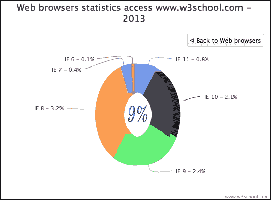

## 点击并拖动 3D 图表

与 3D 图表的另一个令人印象深刻的交互功能是点击并拖动功能，我们可以使用它将图表拖动到任何方向。这种交互实际上来自 Highcharts 3D 散点图在线演示（[`www.highcharts.com/demo/3d-scatter-draggable`](http://www.highcharts.com/demo/3d-scatter-draggable)）。在这里，我们将探讨这是如何实现的。在我们这样做之前，让我们重用我们的信息图表示例，并将点击并拖动 jQuery 演示代码复制到这个练习中。以下是对点击并拖动代码的轻微修改：

```js
    $(function () {
        $(document).ready(function() {
            document.title = "Highcharts " + Highcharts.version;

            var chart = new Highcharts.Chart({
                ....
            });
            // Add mouse events for rotation
            $(chart.container).bind('mousedown.hc touchstart.hc', 
              function (e) {
                e = chart.pointer.normalize(e);

                var posX = e.pageX,
                    posY = e.pageY,
                    alpha = chart.options.chart.options3d.alpha,
                    beta = chart.options.chart.options3d.beta,
                    newAlpha,
                    newBeta,
                    sensitivity = 5; // lower is more sensitive

                $(document).bind({
                    'mousemove.hc touchdrag.hc': 
                       function (e) {
                          // Run beta
                          newBeta = 
                            beta + (posX - e.pageX) / sensitivity;
                          newBeta = 
                            Math.min(100, Math.max(-100,
                                     newBeta));
                          chart.options.chart.options3d.beta =              
                            newBeta;

                        // Run alpha
                        newAlpha = 
                           alpha + (e.pageY - posY) / sensitivity;
                        newAlpha = Math.min(100, Math.max(-100,
                                    newAlpha));
                        chart.options.chart.options3d.alpha =
                            newAlpha;

                        // Update the alpha, beta and viewDistance 
                        // value in subtitle continuously
                        var subtitle = "alpha: " + 
                            Highcharts.numberFormat(newAlpha, 1) + 
                            ", beta: " + 
                            Highcharts.numberFormat(newBeta, 1) + 
                            ", viewDistance: " +    
                            Highcharts.numberFormat(
                  chart.options.chart.options3d.viewDistance, 1);
                        chart.setTitle(null, 
                               { text: subtitle }, false);

                        chart.redraw(false);
                    },              

                    'mouseup touchend': function () { 
                        $(document).unbind('.hc');
                    }
                });
            });
```

图表容器的元素绑定在`mousedown`和`touchstart`事件上。以`'.hc'`结尾的事件名称意味着事件处理程序被分组到同一个命名空间`'.hc'`。这后来被用来解绑在命名空间下声明的所有事件处理程序。

因此，当用户在图表容器中执行`mousedown`或`touchstart`事件时，它将执行处理程序。该函数首先为跨浏览器事件兼容性标准化事件对象。然后，它记录`mousedown`事件下的当前指针位置值（`pageX`，`pageY`）以及`alpha`和`beta`值。进一步在`mousedown`或`touchstart`事件下，我们在同一个`'.hc'`命名空间中绑定一个额外的处理程序，带有`mousemove`和`touchdrag`事件。换句话说，这意味着在`mousedown`或`touchstart`动作下，移动鼠标和通过触摸拖动将绑定第二个处理程序到容器。

第二个处理程序的实现是通过比较当前移动坐标与`mousedown`处理程序中记录的初始位置来计算 x 和 y 方向上的移动。然后，它将滚动距离转换为方向，并更新新的`alpha`和`beta`值。`Math.max`和`Math.min`表达式是为了将`alpha`和`beta`限制在-100 和 100 之间的范围。请注意，代码并没有限制我们只能使用事件对象中的`pageX/Y`。我们可以使用其他类似属性，如`screenX/Y`或`clientX/Y`，只要两个处理程序都引用相同的。

最后，我们调用`chart.draw(false)`以新的方向重新绘制图表，但不进行动画。没有动画的原因是，移动处理程序在滚动动作和动画中被频繁调用，这将需要额外的开销，降低显示的响应性。

以下截图展示了点击并拖动操作后的图表：

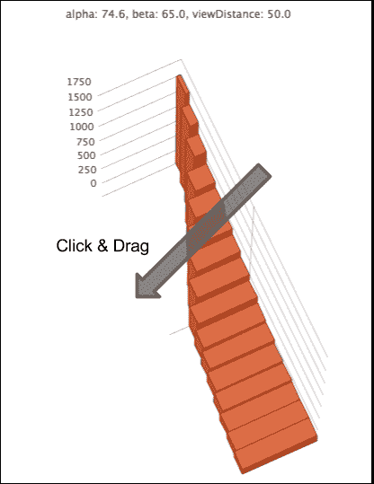

## 鼠标滚轮滚动和视图距离

我们可以通过引入另一个交互，即`mousewheel`，来提高用户体验，使图表的视图距离响应`mousewheel`动作。为了实现跨浏览器的兼容性解决方案，我们使用了 Brandon Aaron 的 jQuery mousewheel 插件（[`github.com/brandonaaron/jquery-mousewheel/`](http://github.com/brandonaaron/jquery-mousewheel/)）。

以下是对处理程序的代码：

```js
// Add mouse events for zooming in and out view distance
$(chart.container).bind('mousewheel', 
     function (e) {
         e = chart.pointer.normalize(e);
         var sensitivity = 10; // lower is more sensitive
         var distance = 
             chart.options.chart.options3d.viewDistance;

         distance += e.deltaY / sensitivity;
         distance = Math.min(100, Math.max(1, distance));

         chart.options.chart.options3d.viewDistance = distance;

         var subtitle = "alpha: " + 
              Highcharts.numberFormat(
              chart.options.chart.options3d.alpha, 1) +
                ", beta: " + 
              Highcharts.numberFormat(
             chart.options.chart.options3d.beta, 1) +
                ", viewDistance: " + 
              Highcharts.numberFormat(distance, 1);

            chart.setTitle(null, { text: subtitle }, false);

            chart.redraw(false);
     });
```

以类似的方式，`deltaY` 是鼠标滚轮滚动值，我们将此变化应用于 `viewDistance` 选项。以下是当我们应用点击拖动和鼠标滚轮滚动操作时的结果：

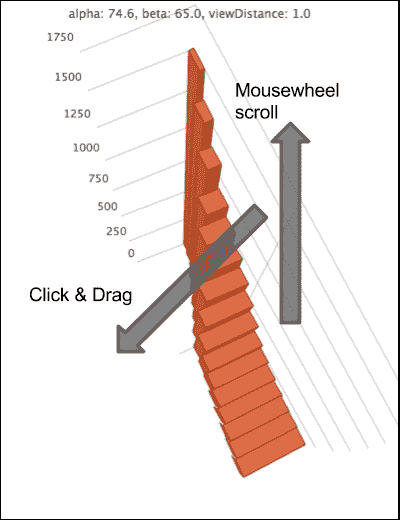

# 摘要

在本章中，我们学习了如何创建 3D 柱状图、散点图和饼图，以及如何操作每个系列特有的方向和配置。我们通过制作 3D 图表画廊来测试这些选项。除此之外，我们还探讨了 Highcharts 中 3D 图表的多种用户交互方式。

在下一章中，我们将探讨 Highcharts API，这些 API 负责创建动态图表，例如使用 Ajax 查询更新图表内容，访问 Highcharts 对象中的组件，以及将图表导出为 SVG 格式。
