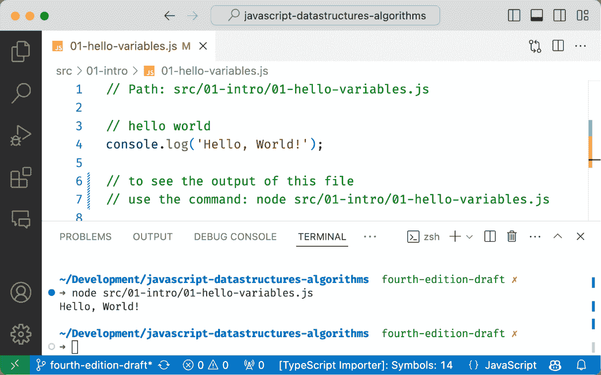
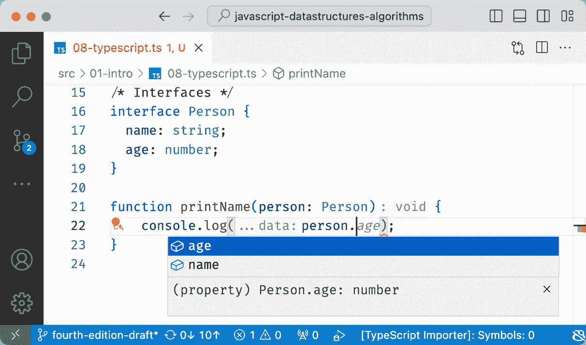
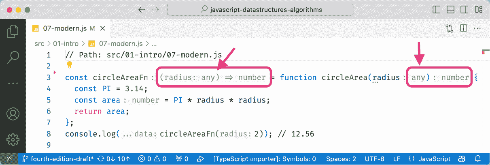
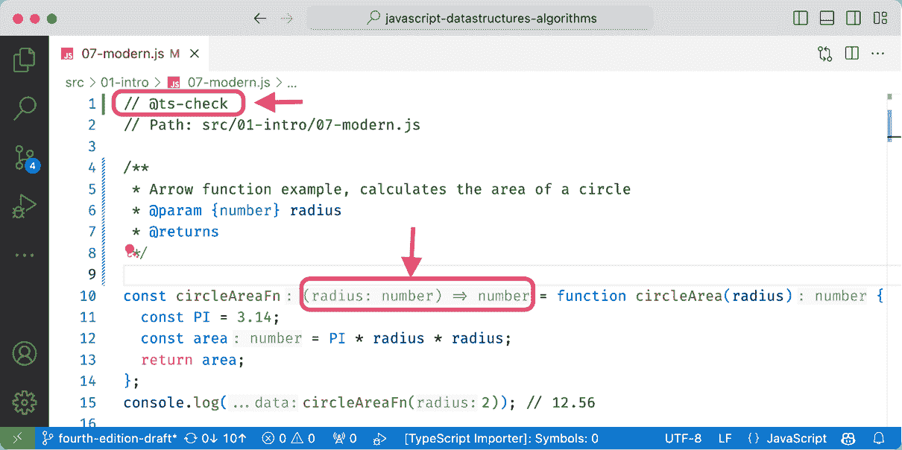
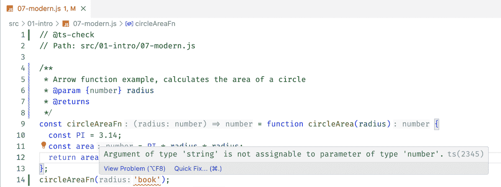

# 第二章：1 在 JavaScript 中介绍数据结构和算法

**在开始之前：加入我们的 Discord 书籍社区**

直接向作者本人提供反馈，并在我们的 Discord 服务器上与其他早期读者聊天（在“EARLY ACCESS SUBSCRIPTION”下找到“learning-javascript-dsa-4e”频道）。


[`packt.link/EarlyAccess/`](https://packt.link/EarlyAccess/)

**JavaScript** 是一种功能强大的语言。它是世界上最流行的语言之一，也是互联网上最突出的语言之一。例如，GitHub（世界上最大的代码托管平台，网址为 [`github.com`](https://github.com)）在撰写本文时托管了超过 300,000 个 JavaScript 仓库（GitHub 上活跃的仓库中，JavaScript 仓库数量最多；请参阅 [`githut.info`](http://githut.info)）。JavaScript 在 GitHub 上的项目数量每年都在增长。

JavaScript 是任何网页开发人员必备的技能。它提供了一个方便的环境来学习数据结构和算法，只需要一个文本编辑器或浏览器就可以开始。更重要的是，JavaScript 在网页开发中的广泛应用，允许你直接将此知识应用于构建高效、可扩展的网页应用程序，优化性能并处理复杂任务。

数据结构和算法是软件开发的基本构建块。数据结构提供了组织和存储数据的方法，而算法定义了对这些数据执行的操作。掌握这些概念对于创建结构良好、易于维护和性能高的 JavaScript 代码至关重要。

在本章中，我们将介绍开始构建自己的数据结构和算法所需的必要 JavaScript 语法和功能。此外，我们还将介绍 TypeScript，这是一种基于 JavaScript 的语言，它提供了增强的代码安全性、结构和工具。这将使我们能够使用 JavaScript 和 TypeScript 创建数据结构和算法，展示它们各自的优势。我们将涵盖：

+   数据结构的重要性

+   为什么算法很重要

+   为什么公司在面试中要求这些概念

+   为什么选择 JavaScript 来学习数据结构和算法

+   设置环境

+   JavaScript 基础

+   **TypeScript** 基础

## 数据结构的重要性

数据结构是一种在计算机内存中组织和存储数据的方式，使数据能够被高效地访问和修改。

将数据结构视为设计用来存储特定类型信息的容器，它们有自己安排和管理信息的方式。例如，在你的家中，你在厨房烹饪食物，在卧室睡觉，在浴室洗澡。房屋或公寓中的每个地方都是为了完成特定任务而设计的，以便我们可以保持家庭整洁有序。

在现实世界中，数据往往可能过于复杂，这归因于诸如数量、各种形式（数字、日期、文本、图像、电子邮件）以及数据生成速度等因素。数据结构为这种混乱带来了秩序，使得计算机能够系统且高效地处理大量信息。想象一下，这就像一个组织良好的图书馆与一大堆书籍相比。在图书馆中，由于书籍按类型和作者（按字母顺序）组织，因此找到特定书籍要容易得多。

良好的数据结构选择有助于程序在处理的数据量不同的情况下保持一致的性能。想象一下，需要存储 10 天或 10 年的天气预报数据。使用正确的数据结构可以在算法崩溃或能够扩展之间产生差异。

最后，数据结构可以极大地影响编写与该数据一起工作的算法的难易程度。例如，使用显示城市之间距离的图数据结构来找到地图上的最短路线可以高效地解决，而不是使用无序的城市名称数组。

## 为什么算法很重要

计算机是强大的工具，但它们的智能源于我们提供的指令。算法是一系列规则和程序，指导计算机的行动，使其能够解决问题、做出决策和执行复杂任务。本质上，算法是我们与计算机沟通的语言，将它们从单纯的机器转变为智能问题解决者。

算法可以将任务转化为可重复和自动化的过程。如果你需要在工作中每天生成一份报告，那么这是一个可以通过算法自动化的任务。

算法无处不在，从搜索引擎到社交网络，再到自动驾驶汽车。算法和数据结构是它们运作的基础。理解数据结构和算法能够解锁在技术世界中创造和创新的能力。

作为软件开发者，编写算法和处理数据是我们工作的核心方面。这正是为什么公司在招聘面试中强调这些概念——它们是评估应聘者问题解决能力和他们为软件开发项目有效贡献潜力的关键技能。

## 为什么公司在面试中要求这些概念

公司在招聘面试中关注数据结构和算法概念的原因有很多，即使你在日常任务中不会使用这些概念，包括：

+   问题解决技能：数据结构和算法是评估应聘者问题解决能力的优秀工具。它们可以用来评估一个人如何处理不熟悉的问题，将它们分解成更小的任务，并设计解决方案。

+   编码能力：公司可以评估候选人如何将解决方案转化为干净高效的代码，候选人如何为问题选择合适的数据结构，设计具有正确逻辑的算法，考虑边缘情况并优化代码。

+   软件性能：对数据结构和算法的深刻理解直接转化为成功交付每个开发任务，例如通过选择合适的数据结构和算法来设计可扩展的解决方案，尤其是在处理大量数据集时。在处理大数据集的大数据领域，你的解决方案不仅需要正确运行，而且还需要在规模上高效运行。性能优化通常依赖于选择最佳的数据结构或调整现有算法。

+   调试和故障排除：对数据结构和算法的扎实掌握可以帮助工程师确定代码中可能出现问题的位置。

+   学习和适应能力：技术始终在发展，编程语言和框架也是如此，然而，数据结构和算法的概念在多年间一直保持基本。这就是我们经常说这些概念是计算机科学基础知识之一的原因。一旦你学会了这些概念，你就可以轻松地适应不同的编程语言。这有助于公司测试一个人是否能够适应不断变化的要求，这对于这个行业至关重要。

+   沟通：通常，当公司提出使用数据结构和算法解决的问题时，他们并不是在寻找最终的答案，而是在寻找候选人到达最终答案的过程。公司可以评估候选人如何解释他们的思维过程和决策背后的原因；以及候选人在讨论选择不同数据结构和算法以解决程序时涉及的不同权衡的能力。这可以用来评估一个人是否能够在团队环境中协作，以及候选人是否能够清楚地传达信息。

当然，这些只是公司评估的一些因素，而特定领域的知识、经验和文化适应性也是选择合适职位候选人时的关键因素。

## 为什么选择 JavaScript 来学习数据结构和算法？

根据各种行业调查，JavaScript 是世界上最受欢迎的编程语言之一，如果你已经熟悉编程的基础知识，那么它是一个很好的选择。繁荣的 JavaScript 社区和丰富的在线资源为学习、协作和提升 JavaScript 开发者职业生涯提供了一个支持性和动态的环境。

JavaScript 也是一种适合初学者的语言，您无需担心像 C++ 这样的其他语言中存在的复杂内存管理概念。这对于学习像链表、树和图这样的数据结构非常有帮助，这些数据结构由于其能够在程序执行（运行时）期间增长或缩小尺寸的能力而具有动态性，并且在使用 JavaScript 时，您可以专注于数据结构概念，而无需与内存管理控制混合。

由于 JavaScript 用于网页开发，使用 JavaScript 学习数据结构和算法可以使您直接将这些技能应用于构建交互式网页应用。

然而，使用 JavaScript 的一大缺点是它缺乏像 C++ 和 Java 这样的其他语言中存在的严格类型。JavaScript 是一种动态类型语言，这意味着您不需要显式声明变量的数据类型。在处理数据结构时，我们需要注意不要在同一个数据结构中混合数据类型，因为这可能导致微妙的错误。通常，当处理数据结构时，确保同一结构内的所有数据类型相同被认为是最佳实践。在本书中，我们将通过始终为同一数据结构实例使用相同的数据类型来弥补这一差距，并且我们还将通过提供扩展 JavaScript 并向语言添加类型的 **TypeScript** 源代码来解决缺乏严格类型的问题。

并且重要的是要记住：最好的语言是您最舒适使用并且能激励您学习的语言。本书将使用 JavaScript 和 TypeScript 展示不同的数据结构和算法，您也可以将这些概念适应到其他编程语言中。

## 设置环境

与其他语言相比，JavaScript 语言的优点之一是您无需安装或配置复杂的环境即可开始使用。为了跟随本书中的示例，您需要从 [`nodejs.org`](https://nodejs.org) 下载 Node.js，这样我们才能执行源代码。在下载页面，您将找到在您的操作系统上下载和安装 Node.js 的详细步骤。

作为一条经验法则，始终下载 *LTS* (*长期支持*) 版本，这通常是企业公司所使用的。

虽然 JavaScript 可以在浏览器和 Node.js 中运行，但后者为学习数据结构和算法提供了一个更流畅和专注的环境。Node.js 消除了浏览器特定的复杂性，提供了强大的调试工具，并促进了学习这些核心概念的更直接的方法。

本书源代码也以 TypeScript 格式提供，它提供了增强的类型安全和结构。要运行 TypeScript 代码，包括本书中的示例，我们需要将其转换为 JavaScript，这个过程我们将在详细说明。

### 安装代码编辑器或 IDE

我们还需要一个编辑器或 **IDE** (*集成开发环境*) 来在舒适的环境中开发应用程序。对于本书的示例，作者使用了 **Visual Studio Code** (**VSCode**)，这是一个免费的开源编辑器。但是，您可以使用任何您选择的编辑器（Notepad++、WebStorm 以及市场上可用的其他编辑器或 IDE）。

> 您可以在 [`code.visualstudio.com`](https://code.visualstudio.com) 下载适用于您操作系统的 **VSCode** 安装程序。

现在我们已经拥有了所有需要的东西，我们可以开始编写我们的示例了！

## JavaScript 基础知识

在我们开始深入各种数据结构和算法之前，让我们快速了解一下 JavaScript 语言。本节将介绍实现后续章节中我们将创建的算法所需的 JavaScript 基本概念。

### Hello World

我们将从经典的 "Hello, World!" 示例开始，这是一个简单的程序，显示消息 "Hello, World!"。

让我们一起创建第一个示例。请按照以下步骤操作：

1.  创建一个名为 `javascript-datastructures-algorithms` 的文件夹。

1.  在其中，创建一个名为 `src` 的文件夹（源文件夹，我们将为本书创建文件）。

1.  在 `src` 文件夹中，创建一个名为 `01-intro` 的文件夹

我们可以将本章的所有示例都放在这个目录中。现在让我们创建一个 `Hello, World` 示例。为此，创建一个名为 `01-hello-variables.js` 的文件。在文件中，添加以下代码：

```js
console.log('Hello, World!');
```

要运行此示例，您可以使用默认的操作系统终端或命令提示符（或者如果您正在使用 Visual Studio Code，请打开内置终端）并执行以下命令：

```js
node src/01-intro/01-hello-variables.js
```

你将看到如以下图片所示的 "`Hello, World!`" 输出：



图 1.1 – Visual Studio Code 与 JavaScript Hello, World! 示例

> 对于本书的每个源文件，你将在第一行看到文件的路径，然后是我们将一起创建的源代码，文件将以可以在终端中查看输出的命令结束。

### 变量和数据类型

在 JavaScript 中有三种声明变量的方式：

1.  `var`: 声明一个变量，并且可以选择初始化它。这是在 JavaScript 中声明变量的最古老方式。

1.  `let`: 声明一个局部变量，块级作用域（这意味着变量仅在特定的代码块内可访问，例如在循环或条件语句内），并且也可以选择初始化它。对于我们的算法，这将是我们的首选方式，因为它具有更可预测的行为。

1.  `const`: 声明一个只读常量。它必须初始化，并且我们无法重新分配它。

让我们看看几个示例：

```js
var num = 1;
num = 'one' ;
let myVar = 2;
myVar = 4;
const price = 1.5;
```

位置：

1.  在第一行，我们有一个如何在 JavaScript 中声明变量（传统方式，在现代 JavaScript 之前）的例子。尽管使用`var`关键字声明不是必需的，但始终指定我们声明新变量是一个好习惯。

1.  在第二行，我们更新了一个现有的变量。JavaScript 不是一种强类型语言。这意味着你可以声明一个变量，用数字初始化它，然后更新为文本或其他任何数据类型。将不同类型的值赋给变量通常不被认为是良好的实践，尽管这是可能的。

1.  在第三行，我们也声明了一个数字，但这次我们使用`let`关键字来指定这是一个局部变量。

1.  在第四行，我们可以将`myVar`的值更改为不同的数字；

1.  在第五行，我们声明了另一个变量，但这次使用`const`关键字。这意味着这个变量的值是最终的，如果我们尝试赋予另一个值，我们将得到一个错误（*常量变量赋值错误*）。

让我们看看 JavaScript 支持哪些数据类型。

#### 数据类型

+   在编写本文时，最新的**ECMAScript**标准（JavaScript 规范）定义了一些原始数据类型：

    +   **Number**：整数或浮点数；

    +   **String**：文本值；

    +   **Boolean**：真或假值；

    +   **null**：表示空值的特殊关键字；

    +   **undefined**：没有值或尚未初始化的变量；

    +   **Symbol**，它们是唯一且不可变的；

    +   **BigInt**：任意精度的整数：`1234567890n`；

    +   以及**Object**。

让我们看看如何声明不同数据类型的变量的例子：

```js
const price = 1.5; // number
const publisher = 'Packt'; // string
const javaScriptBook = true; // boolean
const nullVar = null; // null
let und; // undefined
```

如果我们想查看我们声明的每个变量的值，我们可以使用`console.log`来实现，如下面的代码片段所示：

```js
console.log('price: ' + price);
console.log('publisher: ' + publisher);
console.log('javaScriptBook: ' + javaScriptBook);
console.log('nullVar: ' + nullVar);
console.log('und: ' + und);
```

> console.log 方法也接受多个参数。而不是`console.log('num: ' + num)`，我们也可以使用`console.log('num: ', num)`。第一个选项将结果连接成单个字符串，而第二个选项允许我们添加描述并可视化变量内容，如果它是对象的话。

在 JavaScript 中，`typeof`运算符是一个帮助确定变量或表达式数据类型的运算符。它返回一个表示操作数类型的字符串。如果我们想检查声明变量的类型，我们可以使用以下代码：

```js
console.log('typeof price: ', typeof price); // number
console.log('typeof publisher: ', typeof publisher); // string
console.log('typeof javaScriptBook: ', typeof javaScriptBook); // boolean
console.log('typeof nullVar: ', typeof nullVar); // object
console.log('typeof und: ', typeof und); // undefined
```

> 在 JavaScript 中，`typeof null`返回"object"，这可能令人困惑，因为`null`实际上不是一个对象。这被认为是语言中的历史怪癖或错误。

##### 对象和 Symbol 数据类型

在 JavaScript 中，对象是一种基本的数据结构，它作为一个**键值对**的集合。这些键值对通常被称为对象的属性或方法。可以将其视为一个可以存储各种类型的数据和功能的容器。

如果我们想在 JavaScript 中使用像标题这样的属性来表示一本书，我们可以有效地使用对象来实现：

```js
const book = {
  title: 'Data Structures and Algorithms',
}
```

对象是 JavaScript 编程的基石，提供了一种强大的方式来结构化数据、封装逻辑以及模拟现实世界的实体。

如果我们想要输出书的标题，我们可以使用点符号如下进行操作：

```js
console.log('book title: ', book.title);
```

尽管我们不能重新赋值常量的值，但如果其数据类型是对象，我们可以*修改*它。让我们看一个例子：

```js
book.title = 'Data Structures and Algorithms in JavaScript';
// book = {anotherTitle:'Data Structures'} this will not work
```

修改对象意味着改变现有对象中的属性，就像我们刚才做的那样。重新赋值对象意味着改变变量所引用的整个对象，如下面的示例所示：

```js
let book2 = {
  title: 'Data Structures and Algorithms',
}
book2 = { title: 'Data Structures' };
```

这个概念很重要，因为我们将在很多例子中使用它。

JavaScript 还支持一种特殊且独特的数据类型，称为**符号**。符号作为唯一的标识符，主要用于以下目的：

+   独特的属性键：符号可以用作对象属性的键，确保这些属性是独特的，不会与其他键（即使是具有相同名称的字符串）冲突。这在处理库或模块时尤其有用，因为可能会出现命名冲突。

+   隐藏属性：符号默认是不可枚举的，这意味着它们不会出现在`for...in`循环或`Object.keys()`中。这使得它们非常适合在对象中创建*私有*属性。

让我们通过一个例子来更好地理解：

```js
const title = Symbol('title');
const book3 = {
  [title]: 'Data Structures and Algorithms'
};
console.log(book3[title]); // Data Structures and Algorithms
```

在这个例子中，我们创建了一个符号`title`，并使用它作为`book3`对象的键。当我们需要访问这个属性时，我们不能简单地使用点符号`book3.title`，而必须使用方括号符号`book3.[title]`。

在本书的示例中，我们不会使用符号，但了解这个概念是有趣的。

### 控制结构

JavaScript 与 C 和 Java 语言具有类似的控制结构集。条件语句由`if...else`和`switch`支持。JavaScript 还支持不同的循环语句，如`for`、`while`、`do…while`、`for…in`和`for…of`。

在本节中，我们将探讨条件语句和循环语句，从条件语句开始。

#### 条件语句

JavaScript 中的条件语句是控制代码流程的基本构建块。它们允许你根据某些条件做出决策，并相应地执行不同的代码块。

如果我们只想在条件为真时执行一段代码，我们可以使用`if`语句。如果条件为假，我们可以使用可选的`else`语句：

```js
let number = 0;
if (number === 1) {
  console.log('number is equal to 1');
} else {
  console.log('number is not equal to 1, the value of number is ' + number);
}
```

`if...else`语句也可以用三元运算符来表示。例如，看看下面的 if...else 语句：

```js
if (number === 1) {
  number--;
} else {
  number++;
}
```

它也可以表示如下：

```js
number === 1 ? number-- : number++;
```

三元运算符是返回一个值的表达式，而 if 语句只是一个命令式语句。这意味着我们可以在另一个表达式中直接使用它，将其结果赋给一个变量，或者将其用作函数调用的参数。例如，我们可以将前面的例子重写如下，而不改变其输出：

```js
number = number === 1 ? number - 1 : number + 1;
```

此外，如果我们有多个脚本，我们可以多次使用 `if...else` 来根据不同的条件执行不同的脚本，如下所示：

```js
let month = 5;
if (month === 1) {
  console.log('January');
} else if (month === 2) {
  console.log('February');
} else if (month === 3) {
  console.log('March');
} else {
  console.log('Month is not January, February or March');
}
```

最后，我们有 `switch` 语句。`switch` 语句提供了一种编写多个 `if...else` 条件链的替代方法。它评估一个表达式，然后将其值与一系列情况匹配。当找到匹配项时，将执行与该情况关联的代码：

```js
switch (month) {
  case 1:
    console.log('January');
    break;
  case 2:
    console.log('February');
    break;
  case 3:
    console.log('March');
    break;
  default:
    console.log('Month is not January, February or March');
}
```

JavaScript 将在 `case` 语句中查找值的匹配（在这个例子中，是变量 `month`）。如果没有找到匹配项，则执行 `default` 语句。每个 `case` 语句内部的 `break` 子句将停止执行并跳出 `switch` 语句。如果我们不添加 `break` 语句，后续每个 `case` 语句内部的代码也会执行，包括 `default` 语句。

#### 循环

在 JavaScript 中，循环是基本结构，允许你在指定的条件为 `true` 时重复执行代码块。它们对于自动化重复性任务和遍历数据集合（如数组或对象）是必不可少的。

`for` 循环与 C 和 Java 中的相同。它由一个通常赋值为数值的循环计数器组成，然后变量与条件比较以跳出循环，最后数值增加或减少。

在下面的例子中，我们有一个 `for` 循环。它在控制台输出 `i` 的值，当 `i` 小于 `10` 时。`i` 的初始值为 0，因此下面的代码将输出从 0 到 9 的值：

```js
for (let i = 0; i < 10; i++) {
  console.log(i);
}
```

在 `for` 循环中，首先我们有初始化（`let i = 0`），这仅在循环开始之前发生一次。接下来，我们有在每次迭代之前评估的条件（`i < 10`）。如果评估结果为 `true`，则执行循环体。如果为 `false`，则循环结束。然后我们有最终表达式（`i++`），这通常用于更新计数器变量。最终表达式在执行循环体之后执行。

我们接下来要查看的下一个循环结构是 `while` 循环。当条件为真时，while 循环内部的脚本将被执行。

在下面的代码中，我们有一个变量 `i`，其初始值为 0，我们希望当 `i` 小于 10（或小于或等于 9）时记录 `i` 的值。输出将是从 0 到 9 的值：

```js
let i = 0;
while (i < 10) {
  console.log(i);
  i++;
}
```

`do...while` 循环与 `while` 循环类似。唯一的区别是，在 `while` 循环中，条件在执行脚本之前被评估，而在 `do...while` 循环中，条件在脚本执行后被评估。`do...while` 循环确保脚本至少执行一次。以下代码也输出了从 0 到 9 的值：

```js
i = 0;
do {
  console.log(i);
  i++;
} while (i < 10);
```

`for…in` 循环遍历对象的属性。这个循环在处理字典和集合时特别有用。

在以下代码中，我们将声明一个对象，并输出每个属性的名称及其值：

```js
const obj = { a: 1, b: 2, c: 3 };
for (const key in obj) {
  console.log(key, obj[key]);
}
// output: a 1 b 2 c 3
```

`for…of` 循环遍历数组、映射或集合的值，如下面的代码所示：

```js
const arr = [1, 2, 3];
for (const value of arr) {
  console.log(value);
}
// output: 1 2 3
```

### 函数

在使用 JavaScript 时，函数非常重要。函数是设计用来执行特定任务的代码块。它们是 JavaScript 的基本构建块之一，提供了一种组织代码、提高可重用性和可维护性的方法。我们也会在我们的示例中使用函数。

以下代码演示了函数的基本语法：

```js
function sayHello(name) {
  console.log('Hello! ', name);
}
```

这个函数的目的是创建一段可重用的代码，通过名字问候一个人。我们有一个名为 `name` 的参数。参数在函数被调用时充当提供值的占位符。

要执行此代码，我们只需使用以下语句：

```js
sayHello('Packt');
```

将字符串 "Packt" 作为参数传递。这个值被分配给函数内部的 `name` 参数。

函数也可以返回一个值，如下所示：

```js
function sum(num1, num2) {
  return num1 + num2;
}
```

> 注意，在 JavaScript 中，函数总是会返回一个值。函数可以使用 `return` 关键字后跟一个表达式显式地返回一个值。
> 
> > 如果一个函数没有 `return` 语句（如上面的 `sayHello` 示例）或者在其代码块结束时没有遇到 `return`（没有返回），它将隐式返回 `undefined`。

这个函数计算两个给定数字的和，并返回其结果。我们可以如下使用它：

```js
const result = sum(1, 2);
console.log(result); // outputs 3
```

我们也可以为参数分配默认值。如果我们没有传递值，函数将使用默认值：

```js
function sumDefault(num1, num2 = 2) { // num2 has a default value
    return num1 + num2;
}
console.log(sumDefault(1)); // outputs 3
console.log(sumDefault(1, 3)); // outputs 4
```

在这本书中，我们将探索更多关于函数的内容，以及与函数相关的其他高级特性，尤其是在介绍算法部分时。

#### 变量作用域

作用域指的是在算法的哪个位置我们可以访问变量。为了理解变量作用域是如何工作的，让我们使用以下示例：

```js
let movie = 'Lord of the Rings';
function starWarsFan() {
  const movie = 'Star Wars';
  return movie;
}
function marvelFan() {
  movie = 'The Avengers';
  return movie;
}
```

现在让我们记录一些输出，以便我们可以看到结果：

```js
console.log(movie); // Lord of the Rings
console.log(starWarsFan()); // Star Wars
console.log(marvelFan()); // The Avengers
console.log(movie); // The Avengers
```

以下是为什么我们得到这个输出的解释：

+   我们首先在全局作用域中声明一个名为 `movie` 的变量，并将其值设置为 "指环王"。这个变量可以从代码的任何地方访问。第一个 `console.log` 语句正在打印这个变量的初始值。

+   对于 `starWarsFan` 函数，我们使用 `const` 声明了一个名为 `movie` 的新变量。这个变量与全局变量 `movie` 有相同的名称，但它只存在于函数的作用域内。这被称为 "**遮蔽**"，在函数的上下文中，局部变量隐藏了全局变量。第二个 `console.log` 调用了 `starWarsFan` 函数。它打印 "Star Wars"，因为在函数内部我们正在使用局部变量 `movie`，而全局的 `movie` 变量保持不变。

+   接下来，我们有 `marvelFan` 函数，它没有使用 `let` 或 `const` 声明一个新的 `movie` 变量。相反，它直接通过将其赋值为 "The Avengers" 来修改全局的 `movie` 变量。这是可能的，因为没有局部变量会遮蔽全局变量。因此，当我们调用这个函数的第三个 `console.log` 时，输出是 "The Avengers"。

+   最后，我们有最后一个 `console.log(movie)`。这再次打印了全局的 `movie` 变量，由于之前的 `marvenFan` 函数调用，它现在持有值 "The Avengers"。

让我们回顾第二个例子，这次只使用一个函数，来展示变量作用域如何影响代码不同部分中变量的可见性和值：

```js
function blizzardFan() {
  const isFan = true;
  let phrase = 'Warcraft';
  console.log('Before if: ' + phrase);
  if (isFan) {
    let phrase = 'initial text';
    phrase = 'For the Horde!';
    console.log('Inside if: ' + phrase);
  }
  phrase = 'For the Alliance!';
  console.log('After if: ' + phrase);
}
```

当我们调用 `blizzardFan()` 函数时，输出将是：

```js
Before if: Warcraft
Inside if: For the Horde!
After if: For the Alliance!
```

让我们理解一下原因：

1.  我们首先声明一个常量变量 `isFan` 并将其初始化为 `true`。由于它使用 `const` 声明，其值不能被更改。

1.  使用 `let` 声明了一个名为 `phrase` 的变量并将其赋值为 'Warcraft'。

1.  接下来，我们有一个第一个 `console.log` 输出 `phrase` 变量的当前值，它是 Warcraft。

1.  然后我们有 `if (isFan)` 块。由于 `isFan` 是 `true`，if 块内的代码被执行。

1.  在 if 块内部，我们在 if 块的作用域内声明了一个新的变量，也命名为 `phrase`。这创建了一个独立的、块级作用域的变量，它遮蔽了外部的 `phrase` 变量。

1.  内部 `phrase` 变量的值（在 if 块内声明的那个）被更改为 "For the Horde!"。

1.  `console.log('Inside if: ' + phrase)` 打印 "Inside if: For the Horde!"，因为这是内部的 `phrase` 变量。

1.  在 if 块之后，外部的 `phrase` 变量（在函数开始时声明的那个）仍然可访问。它的值被更改为 "For the Alliance!"。

1.  最后，`console.log('After if: ' + phrase)` 打印 "After if: For the Alliance!"，因为我们正在打印函数第一行声明的变量。

现在我们已经了解了 JavaScript 语言的基础知识，让我们看看我们如何使用面向对象编程方法来使用它。

### JavaScript 中的面向对象编程

**面向对象编程（OOP）** 在 JavaScript 中包含五个概念：

1.  对象：这些是面向对象编程（OOP）的基本构建块。它们代表现实世界的实体或抽象概念，封装了数据（属性）和行为（方法）。

1.  类：这是一种更结构化的创建对象的方式。类作为创建多个类似类型对象（实例）的蓝图。

1.  封装：这涉及到将数据和操作这些数据的函数捆绑成一个单一的单位（对象）。它保护对象的内部状态，并允许你控制对其属性和方法访问的控制。

1.  继承：这允许我们创建新的类（子类），这些子类可以从现有的类（父类）继承属性和方法。这促进了代码的重用，并在类之间建立了关系。

1.  多态：这意味着*多种形式*。在面向对象编程（OOP）中，它指的是不同类的对象以自己独特的方式响应相同方法调用的能力。

面向对象编程（OOP）有助于组织代码，促进重用，使代码更易于维护，并允许更好地模拟现实世界的关系。让我们回顾每个概念，以了解它们在 JavaScript 中的工作方式。

#### 对象、类和封装

JavaScript 对象是简单的键值对集合。

在 JavaScript 中创建简单对象有两种方式。第一种方式的例子如下：

```js
let obj = new Object();
```

第二种方式的例子如下：

```js
obj = {};
```

第二种方式的例子称为对象字面量，这是一种在代码中直接使用方便的符号创建和定义对象的方法。这是在 JavaScript 中处理对象最常见的方式之一，也是比第一个例子中的`new Object`构造函数更受欢迎的方式，因为其便利性（紧凑的语法）以及在创建对象时的整体性能。

我们也可以完全创建一个对象，如下所示：

```js
obj = {
  name: {
    first: 'Gandalf',
    last: 'the Grey'
  },
  address: 'Middle Earth'
};
```

要声明 JavaScript 对象，使用*[键，值]*对，其中键可以被认为是对象的属性，而值是属性值。在先前的例子中，`address`是键，其值是"Middle Earth"。我们将使用这个概念来创建一些数据结构，例如集合或字典。

对象可以作为其属性包含其他对象。我们称它们为嵌套对象。这创建了一个层次结构，其中对象可以在多个级别上嵌套，就像我们可以在先前的例子中看到的那样，其中`name`是`obj`中的嵌套对象。

在面向对象编程（OOP）中，对象是类的实例。类定义了对象的特性，并帮助我们进行封装，将属性和方法捆绑在一起，以便它们可以作为一个单元（对象）一起工作。对于我们的算法和数据结构，我们将创建一些代表它们的类。这就是我们如何定义一个代表书籍的类的例子：

```js
class Book {
  #percentagePerSale = 0.12;
  constructor(title, pages, isbn) {
    this.title = title;
    this.pages = pages;
    this.isbn = isbn;
  }
  get price() {
    return this.pages * this.#percentagePerSale;
  }
  static copiesSold = 0;
  static sellCopy() {
    this.copiesSold++;
  }
  printIsbn() {
    console.log(this.isbn);
  }
}
```

我们可以通过构造函数在 JavaScript 类中声明属性。JavaScript 将自动声明一个公共属性，这意味着它可以被直接访问和修改。

在构造函数内部，`this`指向正在创建的对象实例。在我们的例子中，这指的是自身。我们可以将代码解释为这本书的标题正在被分配给构造函数传递的标题值。

现代 JavaScript 还允许我们通过添加前缀`#`来声明私有属性，例如`#percentagePerSale`。这个属性仅在类内部可见，不能直接访问。

> 公共成员（属性和方法）可以从任何地方访问，无论是类内部还是外部。默认情况下，JavaScript 类中的所有成员都是公共的。
> 
> > 私有成员只能在类内部访问。它们不能从类外部直接访问或修改，这提供了更好的封装和数据保护。

我们还可以使用`get`关键字（`get price()`）创建 getter。这些可以用来声明一个基于对象其他属性的返回计算值的属性。在这种情况下，书的定价取决于`pages`（这是一个公共属性）的数量和每笔销售的利润百分比，这是一个私有属性。我们通过引用关键字`this`在类内部访问本地属性。

我们还可以在类中声明方法（`printIsbn`）。方法只是与类关联的函数。它们定义了从类（实例）创建的对象可以执行的操作或行为。

现代 JavaScript 也允许我们使用`static`关键字声明静态属性和静态方法。静态属性在类的所有实例之间共享，这是一种跟踪类中每个对象共享属性（例如，例如，总共卖出了多少本书）的绝佳方式。在其他语言，如 Ruby 中，它们是类变量。

静态方法不需要类的实例，可以直接访问，例如`Book.sellCopy()`。

要实例化这个类，我们可以使用以下代码：

```js
let myBook = new Book('title', 400, 'isbn');
```

然后，我们可以访问其公共属性并更新它们如下：

```js
console.log(myBook.title); // outputs the book title
myBook.title = 'new title'; // update the value of the book title
console.log(myBook.title); // outputs the updated value: new title
```

我们可以使用 getter 方法来找出书的定价如下：

```js
console.log(myBook.price); // 48
```

然后我们可以这样访问静态属性和方法：

```js
console.log(Book.copiesSold); // 0
Book.sellCopy();
console.log(Book.copiesSold); // 1
Book.sellCopy();
console.log(Book.copiesSold); // 2
```

如果我们想表示另一种类型的书，比如电子书？我们能否重用`Book`类中声明的某些定义？让我们在下一节中找出答案。

#### 继承和多态

JavaScript 还允许使用继承，这是面向对象编程中的一种强大机制，允许我们创建新的类（子类），这些类从现有的类（父类或超类）继承属性和方法。让我们看一个例子：

```js
class Ebook extends Book {
  constructor(title, pages, isbn, format) {
    super(title, pages, isbn);
    this.format = format;
  }
  printIsbn() {
    console.log('Ebook ISBN:',this.isbn);
  }
}
Ebook.sellCopy();
console.log(Ebook.copiesSold); // 3
```

我们可以使用`extends`关键字扩展另一个类并继承其行为。在我们的例子中，Ebook 是子类，而 Book 是超类。

在`constructor`中，我们可以使用关键字`super`来引用`superclass`构造函数。我们可以在子类中添加更多属性（`format`）。子类仍然可以访问超类中的静态方法（`sellCopy`）和属性（`copiesSold`）。

子类也可以为其在超类中最初声明的方法提供自己的实现。这被称为*方法覆盖*，允许子类的对象对同一方法调用表现出不同的行为。

通过覆盖超类的方法，我们可以实现一个称为多态的概念，字面上意味着多种形式。在面向对象编程（OOP）中，多态是不同类的对象以它们独特的方式响应相同方法调用的能力。例如：

```js
const myBook = new Book('title', 400, 'isbn');
myBook.printIsbn(); // isbn
const myEbook = new Ebook('DS Ebook', 401, 'isbn 123', 'pdf');
myEbook.printIsbn(); // Ebook ISBN: isbn 123
```

我们这里有两组书实例，其中一个是电子书。我们可以从两个实例中调用`printIsbn`方法，由于每个实例中的行为不同，我们将得到不同的输出。

在本书中，我们将涵盖的大部分数据结构都将遵循 JavaScript 类方法。

> 尽管 JavaScript 中的类语法与其他编程语言（如 Java 和 C/C++）非常相似，但记住 JavaScript 面向对象编程是通过原型来完成的，这是很好的。

### 现代技术

JavaScript 是一种不断进化并每年都获得新特性的语言。有一些特性使得在处理数据结构和算法时某些概念更容易。让我们来看看它们。

#### 箭头函数

箭头函数是 JavaScript 中编写函数的一种简洁且富有表现力的方式。它们提供了一种更短的语法，并且在行为上与传统函数表达式有一些关键的区别。考虑以下示例：

```js
const circleAreaFn = function(radius) { 
  const PI = 3.14; 
  const area = PI * radius * radius; 
  return area; 
};
console.log(circleAreaFn(2)); // 12.56
```

使用箭头函数，我们可以将前面代码的语法简化为以下代码：

```js
const circleArea = (radius) => {
  const PI = 3.14; 
  return PI * radius * radius; 
};
```

主要区别在于示例的第一行，我们可以省略关键字`function`使用`=>`，因此得名箭头函数。

如果函数只有一个语句，我们可以使用更简单的版本，通过省略关键字`return`和大括号，如下面的代码片段所示：

```js
const circleAreaSimp = radius => 3.14 * radius * radius;
console.log(circleAreaSimp(2)); // 12.56
```

如果函数没有接收任何参数，我们可以使用空括号如下所示：

```js
const hello = () => console.log('hello!');
hello(); // hello!
```

我们将在本书的后面使用箭头函数来编写一些算法，以实现更简单的语法。

#### 扩展和剩余操作符

在 JavaScript 中，我们可以使用`apply()`函数将数组转换为参数。现代 JavaScript 有扩展操作符（`...`）用于此目的。例如，考虑以下`sum`函数：

```js
const sum = (x, y, z) => x + y + z;
```

我们可以执行以下代码来传递`x`、`y`和`z`参数：

```js
const numbers = [1, 2, 3];
console.log(sum(...numbers)); // 6
```

上述代码与以下经典 JavaScript 编写的代码相同：

```js
console.log(sum.apply(null, numbers));
```

扩展操作符（`...`）也可以用作函数中的剩余参数来替换`arguments`。考虑以下示例：

```js
const restParamaterFunction = (x, y, ...a) => (x + y) * a.length;
console.log(restParamaterFunction(1, 2, 'hello', true, 7)); // 9
```

上述代码与以下代码相同（在控制台中也输出 9）：

```js
function restParamaterFunction(x, y) {
  const a = Array.prototype.slice.call(arguments, 2);
  return (x + y) * a.length;
}
console.log(restParamaterFunction(1, 2, 'hello', true, 7));
```

剩余和扩展运算符将在本书的一些数据结构和算法中非常有用。

#### 指数运算符

当处理数学算法时，指数运算符可能会很有用。让我们以使用公式计算圆的面积为例，这个例子可以用指数运算符来改进/简化：

```js
let area = 3.14 * radius * radius; 
```

表达式 `radius * radius` 与半径的平方相同。我们也可以使用 JavaScript 中可用的 `Math.pow` 函数来编写相同的代码：

```js
area = 3.14 * Math.pow(radius, 2); 
```

在 JavaScript 中，指数运算符用两个星号（**）表示。它用于将一个数（基数）提升到另一个数（指数）的幂。我们可以使用指数运算符来计算圆的面积，如下所示：

```js
area = 3.14 * (radius ** 2); 
```

## TypeScript 基础知识

TypeScript 是由 Microsoft 创建和维护的开源 **渐进式类型化**的 JavaScript 超集。渐进式类型化是一种类型系统，它将静态类型和动态类型的元素结合在同一编程语言中。

TypeScript 允许我们在 JavaScript 代码中添加类型，提高代码可读性，提高早期错误检测，因为我们可以在开发过程中捕捉到类型相关错误，并增强工具，因为代码编辑器和 IDE 提供了更好的代码自动完成和导航。

关于本书的范围，使用 TypeScript，我们可以使用一些在 JavaScript 中不可用的面向对象概念，例如接口 - 这在处理数据结构和排序算法时可能很有用。当然，我们还可以利用类型化功能，这对于某些数据结构尤为重要。在修改数据结构的算法中，如搜索或排序，确保集合中数据类型的一致性对于平稳运行和可预测的结果至关重要。TypeScript 在自动强制执行这种类型一致性方面表现出色，而 JavaScript 需要采取额外措施才能达到相同水平的保证。

所有这些功能都在**编译时**可用。在 TypeScript 代码能够在浏览器或 Node.js 环境中运行之前，它需要被编译成 JavaScript。TypeScript 编译器（**tsc**）会将你的 TypeScript 文件（*.ts 扩展名）转换为相应的 JavaScript 文件。在编译过程中，TypeScript 会检查代码中的类型相关错误并提供反馈。这有助于在开发早期就捕捉到潜在问题，从而产生更可靠且易于维护的代码。

要在我们的数据结构和算法源代码中工作 TypeScript，我们将利用 **npm**（*Node 包管理器*）。让我们在 "`javascript-datastructures-algorithms`" 文件夹内设置 TypeScript 作为开发依赖项。这涉及到创建一个 `package.json` 文件，该文件将管理项目依赖项。要启动此过程，请在项目目录中使用终端执行以下命令：

```js
npm init
```

您将收到一些问题，只需按 Enter 键继续。最后，我们将有一个包含以下内容的`package.json`文件：

```js
{
  "name": "javascript-datastructures-algorithms",
  "version": "4.0.0",
  "description": "Learning JavaScript Data Structures and Algorithms",
  "scripts": {
    "test": "echo \"Error: no test specified\" && exit 1"
  },
  "author": "Loiane Groner"
}
```

接下来，我们将安装 TypeScript：

```js
npm install --save-dev typescript
```

运行此命令后，我们将 TypeScript 保存为开发依赖项，这意味着这将在开发期间仅本地使用。此命令还将创建一个`package-lock.json`文件，这可以帮助确保从本书中安装依赖项的人将使用与示例中完全相同的包。

> 如果您想下载源代码，要本地安装依赖项，请运行以下命令：

```js
npm install
```

接下来，我们需要创建一个扩展名为`ts`的文件，这是 TypeScript 文件的扩展名，例如`src/01-intro/08-typescript.ts`，内容如下：

```js
let myName = 'Packt';
myName = 10;
```

上面的代码是一个简单的 JavaScript 代码。现在让我们使用`tsc`命令来编译它：

```js
npx tsc src/01-intro/08-typescript.ts
```

位置：

+   `npx`是 Node Package eXecute，这意味着它是一个包运行器，我们将使用它来执行 TypeScript 编译器命令。

+   `tsc`是 TypeScript 编译器命令，它将编译并将 src/01-intro/08-typescript.ts 中的源代码转换为 JavaScript。

在终端上，我们将得到以下警告：

```js
src/01-intro/08-typescript.ts:4:1 - error TS2322: Type 'number' is not assignable to type 'string'.
4 myName = 10;
  ~~~~~~
Found 1 error in src/01-intro/08-typescript.ts:4
```

警告是由于将数字值 10 分配给初始化为字符串的变量`myName`。

但如果我们检查我们创建文件的`src/01-intro`文件夹，我们会看到它创建了一个`08-typescript.js`文件，内容如下：

```js
var myName = 'Packt';
myName = 10;
```

上面的生成代码是 JavaScript 代码。即使在终端中存在错误（实际上是一个警告，而不是错误），TypeScript 编译器仍然生成了应该生成的 JavaScript 代码。这证实了 TypeScript 在编译时进行所有类型和错误检查的事实，它不会阻止编译器生成 JavaScript 代码。这允许开发者在编写代码时利用所有这些验证，并得到一个错误或错误更少的 JavaScript 代码。

### 类型推断

在使用 TypeScript 时，您可能会找到如下代码：

```js
let age: number = 20;
let existsFlag: boolean = true;
let language: string = 'JavaScript';
```

TypeScript 允许我们为变量分配一个类型。但上面的代码比较冗长。TypeScript 具有类型推断功能，这意味着 TypeScript 会根据分配给变量的值自动验证并应用类型。让我们用更简洁的语法重写前面的代码：

```js
let age = 20; // number
let existsFlag = true; // boolean
let language = 'JavaScript'; // string
```

如上面的代码所示，TypeScript 仍然知道`age`是数字，`existsFlag`是布尔值，`language`是字符串，基于它们被分配的值，因此不需要显式地为这些变量分配类型。

因此，我们在什么时候为变量指定类型？如果我们声明了变量但没有初始化它，那么根据下面的代码示例，建议分配一个类型：

```js
let favoriteLanguage: string;
let langs = ['JavaScript', 'Ruby', 'Python'];
favoriteLanguage = langs[0];
```

如果我们没有为变量指定类型，那么它将自动被指定为`any`类型，这意味着它可以接收任何值，就像在 JavaScript 中一样。

> 尽管在 JavaScript 中有如 `String`、`Number`、`Boolean` 等对象类型，但在 TypeScript 中声明变量时，使用首字母大写的对象类型并不是一个好的做法。在 TypeScript 中声明变量时，始终优先使用 `string`、`number`、`boolean`（小写）。
> 
> > `String`、`Number` 和 `Boolean` 是对应原始类型的包装对象。它们提供了额外的方法和属性，但通常效率较低，并且不常用于基本变量类型。原始类型（小写类型）确保与现有 JavaScript 代码和库有更好的兼容性。

### 接口

在 TypeScript 中，接口有两个概念：类型和面向对象接口。让我们逐一回顾。

#### 接口作为类型

在 TypeScript 中，接口是一种强大的定义对象结构或形状的方法。考虑以下代码：

```js
interface Person {
  name: string;
  age: number;
}
function printName(person: Person) {
  console.log(person.name);
}
```

通过声明一个 `Person` 接口，我们指定了一个对象可能具有的属性和方法，以便符合 `Person` 的描述，这意味着我们可以将接口 `Person` 作为类型使用，正如我们在 `printName` 函数中声明的参数一样。

这使得像 VSCode 这样的编辑器能够具有如以下所示的自动完成和智能感知功能：



图 1.2 – 带有类型接口智能感知的 Visual Studio Code

现在我们尝试使用 `printName` 函数：

```js
const john = { name: 'John', age: 21 };
const mary = { name: 'Mary', age: 21, phone: '123-45678' };
printName(john);
printName(mary);
```

上面的代码没有编译错误。变量 `john` 有 `name` 和 `age` 属性，符合 `printName` 函数的预期。变量 `mary` 有 `name` 和 `age` 属性，但还有 `phone` 信息。

那么为什么这段代码能正常工作呢？TypeScript 有一个称为 **鸭子类型** 的概念。如果它看起来像鸭子，发出像鸭子的声音，并且表现得像鸭子，那么它一定就是鸭子！在示例中，变量 `mary` 的行为符合 `Person` 接口，因为它具有 `name` 和 `age` 属性，所以它必须是 `Person`。这是 TypeScript 的一个强大特性。

再次运行 `npx tsc src/01-intro/08-typescript.ts` 命令后，我们将在 `08-typescript.js` 文件中得到以下输出：

```js
function printName(person) {
    console.log(person.name);
}
var john = { name: 'John', age: 21 };
var mary = { name: 'Mary', age: 21, phone: '123-45678' };
```

上面的代码是纯 JavaScript。代码补全、类型和错误检查仅在编译时可用。

> 默认情况下，TypeScript 编译为 ECMAScript 3。变量声明 `let` 和 `const` 仅在 ECMAScript 6 中引入。你可以通过创建一个 `tsconfig.json` 文件来指定目标版本。如果你想要更改此行为，请查阅文档中的步骤。

#### 面向对象接口

TypeScript 接口的第二个概念与面向对象编程相关，这与 Java、C#、Ruby 等其他面向对象语言中的概念相同。接口是一个合约。在这个合约中，我们可以定义将实现此合约的类或接口应该具有的行为。以 ECMAScript 标准为例。ECMAScript 是 JavaScript 语言的接口。它告诉 JavaScript 语言它应该具备哪些功能，但每个浏览器可能对此有不同的实现。

让我们看看一个有用的例子，我们将在这个书中实现的数据结构和算法中用到。考虑下面的代码：

```js
interface Comparable {
  compareTo(b): number;
}
class MyObject implements Comparable {
  age: number;

  constructor(age: number) {
    this.age = age;
  }
  compareTo(b): number {
    if (this.age === b.age) {
      return 0;
    }
    return this.age > b.age ? 1 : -1;
  }
}
```

接口 `Comparable` 告诉类 `MyObject` 应该实现一个名为 `compareTo` 的方法，该方法接收一个参数。在这个方法内部，我们可以编写所需的逻辑。在这种情况下，我们正在比较两个数字，但我们可以使用不同的逻辑来比较两个字符串，甚至是一个具有不同属性的更复杂对象。`compareTo` 方法在对象相同的情况下返回 0，如果当前对象大于另一个对象时返回 1，如果当前对象小于另一个对象时返回 -1。这个接口的行为在 JavaScript 中不存在，但它在处理排序算法等任务时非常有帮助。

为了演示多态的概念，我们可以使用下面的代码：

```js
function compareTwoObjects(a: Comparable, b: Comparable) {
  console.log(a.compareTo(b));
  console.log(b.compareTo(a));
}
```

在这种情况下，函数 `compareTwoObjects` 接收两个实现了 `Comparable` 接口的对象。它可以是由 `MyObject` 或任何其他实现了此接口的类实例。

### 泛型

*泛型* 是 TypeScript（以及许多其他强类型编程语言）中的一个强大功能，它允许你编写可重用的代码，这些代码可以与各种类型一起工作，同时保持类型安全。可以将它们视为函数、类或接口的模板或蓝图，这些模板或蓝图可以用不同的类型进行参数化。

让我们修改 `Comparable` 接口，以便我们可以定义方法 `compareTo` 应接收作为参数的对象类型：

```js
interface Comparable<T> {
  compareTo(b: T): number;
}
```

通过将类型 `T` 动态传递给 `Comparable` 接口——在菱形运算符 `<>` 之间，我们可以指定 `compareTo` 函数的参数类型：

```js
class MyObject implements Comparable<MyObject> {
  age: number;

  constructor(age: number) {
    this.age = age;
  }
  compareTo(b: MyObject): number {
    if (this.age === b.age) {
      return 0;
    }
    return this.age > b.age ? 1 : -1;
  }
}
```

这很有用，因为我们确保正在比较的是相同类型的对象。这是通过确保参数 `b` 的类型与菱形运算符内的 `T` 匹配来实现的。通过使用此功能，我们还可以从编辑器中获得代码补全。

### 枚举

**枚举**（简称 *枚举*）是一种定义一组命名常量的方式。它们通过给值赋予有意义的名称来帮助组织代码，并使代码更易于阅读。

我们可以使用 TypeScript 的 `枚举` 来避免代码异味，如 *魔法数字*。魔法数字是指没有明确解释其含义的数值常量。

当处理比较值或对象时，这在排序算法中相当常见，我们经常看到 -1、1 和 0 这样的值。但这些数字代表什么意思呢？

正是在这个时候，枚举（`enums`）出现以改善代码的可读性。让我们使用枚举对前面的示例中的 `compareTo` 函数进行重构：

```js
enum Compare {
  LESS_THAN = -1,
  BIGGER_THAN = 1,
  EQUALS = 0
}
function compareTo(a: MyObject, b: MyObject): number {
  if (a.age === b.age) {
    return Compare.EQUALS;
  }
  return a.age > b.age ? Compare.BIGGER_THAN : Compare.LESS_THAN;
}
```

通过为每个枚举常量分配值，我们可以用简短的说明替换 -1、1 和 0 的值，而不会改变代码的输出。

### 类型别名

TypeScript 还有一个名为 **类型别名** 的酷特性。它允许你为现有类型创建新名称。它也使得代码更容易理解，尤其是在处理复杂类型时。

让我们检查一个示例：

```js
type UserID = string;
type User = {
  id: UserID;
  name: string;
}
```

在前面的示例中，我们创建了一个名为 `UserID` 的类型，它是 `string` 的别名。当我们声明第二个类型 `User` 时，我们表示 `id` 的类型是 `UserID`，这使得阅读代码和理解 `id` 的含义更加容易。

当处理排序算法时，这个特性将会很有用，因为我们能够创建比较函数的别名，这样我们就可以以最通用的可行方式编写算法，以处理任何数据类型。

### 在 JavaScript 文件中进行 TypeScript 编译时检查

一些开发者仍然更喜欢使用纯 JavaScript 来开发他们的代码，而不是 TypeScript。但如果我们能在 JavaScript 中也使用 TypeScript 的一些类型和错误检查功能，那会很好，因为 JavaScript 不提供这些功能。

好消息是 TypeScript 有一个特殊的功能，允许我们在编译时进行错误和类型检查！要使用它，我们需要在计算机上全局安装 TypeScript，使用 `npm install -g TypeScript` 命令。

让我们看看 JavaScript 是如何处理我们在本章中之前使用的代码类型的：



图 1.3 – 无 TypeScript 编译时检查的 VSCode 中的 JavaScript 代码

在 JavaScript 文件的第 一行，如果我们想使用类型和错误检查，我们需要添加 `// @ts-check`，如下所示：



图 1.4 – 使用 TypeScript 编译时检查的 VSCode 中的 JavaScript 代码

当我们向代码中添加 JSDoc（JavaScript 文档）时，类型检查被启用。为此，请在函数声明之前添加以下代码：

```js
/**
 * Arrow function example, calculates the area of a circle
 * @param {number} radius
 * @returns
 */
```

然后，如果我们尝试向我们的圆（或 `circleAreaFn`）函数传递一个字符串，我们将得到一个编译错误：



图 1.5 – JavaScript 的类型检查动作

> 要在 VSCode 中启用推断变量名称和类型，请打开您的设置，并通过 *内联提示* 进行搜索，然后启用此功能。在编码时，这可能会带来（更好的）差异。

### 其他 TypeScript 功能

这只是一个对 TypeScript 的快速介绍。TypeScript 文档是一个学习所有其他功能并深入了解本章中快速覆盖的主题细节的绝佳地方：[`www.typescriptlang.org`](https://www.typescriptlang.org)。

> 本书源代码包还包含本书中将要开发的 JavaScript 数据结构和算法的 TypeScript 版本，作为额外资源。并且每当 TypeScript 使与数据结构和算法相关的概念更容易理解时，我们也会在本书中使用它。

## 摘要

在本章中，我们学习了学习数据结构和算法的重要性，以及它如何使我们成为更好的开发者，并帮助我们通过技术面试。我们还回顾了我们选择 JavaScript 来学习和应用这些概念的原因。

你学习了如何设置开发环境，以便能够创建或执行本书中的示例。我们还涵盖了在开始开发本书中将要涵盖的算法和数据结构之前所需的 JavaScript 语言的基础知识。

我们还全面介绍了 TypeScript，展示了它如何通过静态类型和错误检查增强 JavaScript，以实现更可靠的代码。我们探讨了接口、类型推断和泛型等基本概念，使我们能够编写更健壮和可维护的数据结构和算法。

在下一章中，我们将重点转向一个关键主题——大 O 表示法，这是评估和理解我们代码实现效率和性能的基本工具。
