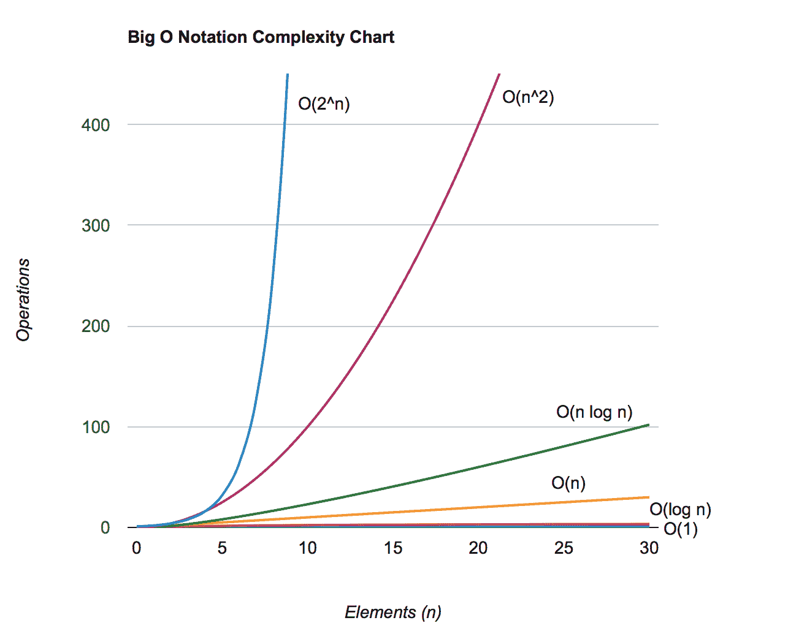

# 第三章：2 Big O 表示法

**在开始之前：加入我们的 Discord 书籍社区**

直接向作者本人提供反馈，并在我们的 Discord 服务器上与其他早期读者聊天（在“学习-javascript-dsa-4e”频道下找到“EARLY ACCESS SUBSCRIPTION”）。


[`packt.link/EarlyAccess/`](https://packt.link/EarlyAccess/)

在本章中，我们将揭示**Big O 表示法**的力量，这是一个分析算法效率的基本工具，它涉及**时间复杂度**（运行时间如何随着输入规模的变化而变化）和**空间复杂度**（内存使用率如何变化）。我们将探讨常见的如 *O(1)*、*O(log n)*、*O(n)* 等时间复杂度，以及它们在选择正确算法和优化代码方面的实际影响。理解 Big O 表示法不仅对于编写可扩展和性能良好的软件至关重要，而且对于通过技术面试也至关重要，因为它展示了你批判性地思考算法效率的能力。在本章中，我们将涵盖：

+   Big O 时间复杂度

+   空间复杂度

+   计算算法的复杂度

+   Big O 表示法和技术面试

+   练习

## 理解 Big O 表示法

Big O 表示法用于描述和分类算法的性能或复杂度，根据输入规模增长时算法运行所需的时间来衡量。

我们如何衡量算法的效率呢？我们通常使用资源，如 CPU（时间）使用率、内存使用率、磁盘使用率和网络使用率。当谈到 Big O 表示法时，我们通常考虑 CPU（时间）使用率。

用更简单的话来说，这种表示法是一种描述算法运行时间如何随着输入规模增大而增长的方法。虽然算法实际运行所需的时间可能会因处理器速度和可用资源等因素而变化，但 Big O 表示法允许我们关注算法必须执行的基本步骤。把它想象成测量算法相对于输入规模执行的操作数量。

想象你桌子上有一摞文件。如果你需要找到一份特定的文件，你必须逐张搜索直到找到它。对于 10 张小文件堆，这不会花很长时间。但是如果你有 20 张文件，搜索可能需要两倍的时间，而有 100 张文件时，可能需要十倍的时间！

开发者必须每天完成的任务包括选择使用哪些数据结构和算法来解决特定问题。这可能是一个现有的算法，或者你可能需要编写自己的逻辑来解决业务用户故事。需要注意的是，任何算法在处理低量级数据时可能运行良好，看起来也还不错，然而，当输入数据的量增加时，效率低下的算法将变得缓慢，并影响应用程序。了解如何衡量性能是实现这些任务成功的关键。

大 O 符号很重要，因为它帮助我们比较不同的算法，并为特定任务选择最有效的算法。例如，如果你在一个大型在线商店中寻找特定的产品，你不会想使用需要查看每个产品的算法。相反，你会使用一个更高效的算法，该算法只需要查看产品的小子集。

## 大 O 时间复杂度

大 O 符号使用大写 *O* 来表示上界。它表示实际运行时间可能小于但不大于函数所表达的时间。它并不告诉我们算法的确切运行时间。相反，它告诉我们当输入大小增大时，事情可能变得有多糟糕。

想象你有一个杂乱的房间，需要找到一只特定的袜子。在最坏的情况下，你必须逐件检查每一件衣服（这就像线性时间算法）。大 O 告诉你，即使你的房间变得非常杂乱，你也不需要查看比实际存在的物品更多的物品。你可能很幸运，能快速找到袜子！实际时间可能远小于大 O 预测的时间。

在分析算法时，最常遇到的时间复杂度和空间复杂度的分类如下：

| **符号** | **名称** | **说明** |
| --- | --- | --- |
| O(1) | 常数 | 算法的运行时间或空间使用量不随输入大小（n）的变化而变化。 |
| O(log(n)) | 对数 | 算法的运行时间或空间使用量与输入大小（n）的对数成正比。这意味着当输入大小加倍时，操作次数或内存使用量增加一个常数量。 |
| O(n) | 线性 | 算法的运行时间或空间使用量与输入大小（n）线性增长。这意味着当输入大小加倍时，操作次数或内存使用量也会加倍。 |
| O(n²) | 二次方 | 算法的运行时间或空间使用量与输入大小（n）的平方成正比。这意味着当输入大小加倍时，操作次数或内存使用量会增加到原来的四倍。 |
| O(n^c) | 多项式 | 算法的运行时间或空间使用量随着输入大小（n）的多项式函数增长。这意味着当输入大小加倍时，操作次数或内存使用量增加一个因子（c），该因子是输入大小的多项式函数。 |
| O(c^n) | 指数 | 算法的运行时间或空间使用量与输入大小（n）的指数成正比。这意味着当输入大小增加时，操作次数或内存使用量的增长速度会越来越快。 |

表 2.1：大 O 符号的时间复杂度和空间复杂度分类

让我们逐一回顾，以详细了解时间复杂度。

### O(1)：常数时间

*O(1)* 表示算法的运行时间（或有时是空间复杂度）保持不变，无论输入数据的大小如何。无论是处理小输入还是大输入，执行算法所需的时间都不会显著变化。

例如，假设我们想要计算给定天数内的秒数。我们可以创建以下函数来解决这个问题：

```js
function secondsInDays(numberOfDays) {
  if (numberOfDays <= 0 || !Number.isInteger(numberOfDays)) {
    throw new Error('Invalid number of days');
  }
  return 60 * 60 * 24 * numberOfDays;
}
```

每分钟有 60 秒，每小时有 60 分钟，每天有 24 小时。

我们可以使用`console.log`来查看通过不同天数传递的结果输出：

```js
console.log(secondsInDays(1)); // 86400
console.log(secondsInDays(10)); // 864000
console.log(secondsInDays(100)); // 8640000
```

如果我们传递参数`1`来调用这个函数（`secondsinDays(1)`），这段代码输出结果将需要几毫秒。如果我们再次执行函数，传递参数`10`（`secondsinDays(10)`），代码输出结果同样需要几毫秒。

这个`secondsInDays`函数的时间复杂度是*O(1)*——常数时间。它执行的操作（乘法）是固定的，不会随着输入`numberOfDays`的变化而变化。无论你输入 1 天还是 1000 天，计算结果所需的时间都是相同的。

*O(1)*算法通常不涉及遍历数据或递归调用，这些调用会乘以操作数。它们通常涉及直接访问数据，比如通过索引查找数组中的值或执行简单的计算。虽然*O(1)*算法非常高效，但它们并不总是适用于每个问题。有些任务本质上需要处理输入中的每个项目，从而导致不同的时间复杂度。

### O(log(n))：对数时间

*O(log n)*算法的运行时间（有时是空间复杂度）随着输入大小（*n*）的对数增长。这意味着算法的每一步都会显著减小问题规模，通常是通过将其分成一半或类似的分数。输入规模越大，每个额外元素对整体运行时间的影响就越小。换句话说，当输入规模加倍时，运行时间增加一个常数（例如，只增加一步）。

想象你正在玩一个“猜数字”游戏。你从一个 1 到 64 的范围开始，每次猜测都把可能的数字范围减半。假设你的第一次猜测是 30。如果太高，你现在知道数字在 1 到 29 之间。你实际上已经将搜索空间减半了！接下来，你猜测 10（太低），进一步缩小范围到 11 到 29。你的第三次猜测，20，恰好是正确的！

即使你从一个更大的数字范围开始（比如 1 到 1000，甚至 1 到 100 万），这种折半策略仍然可以让你在出人意料的小次数猜测中找到这个数字——对于 1 到 64，大约需要 7 次，对于 1 到 1000，大约需要 10 次，对于 1 到 100 万，大约需要 20 次。这展示了对数增长的力量。

我们可以说这种方法的复杂度是*O(log(n))*。在每一步中，算法都会消除输入数据的一个很大部分，使得剩余的工作量大大减小。

时间复杂度为*O(log(n))的函数通常在每一步将问题规模减半。这种复杂性与分而治之算法相关，我们将在第十八章“算法设计和技巧”中介绍。

对数算法非常高效，尤其是在处理大数据集时。它们通常用于需要快速搜索或操作排序数据的场景，我们将在本书的后面部分介绍这些内容。

### O(n)：线性时间

*O(n)*表示算法的运行时间（有时是空间复杂度）与输入大小*n*线性且成比例增长。如果我们加倍输入数据的大小，算法运行所需的时间大约也会加倍。如果我们增加输入的三倍，它将大约需要三倍的时间，依此类推。

假设你有一个月度费用的数组，并想计算总支出金额。以下是我们可以这样做的方法：

```js
function calculateTotalExpenses(monthlyExpenses) {
  let total = 0;
  for (let i = 0; i < monthlyExpenses.length; i++) {
    total += monthlyExpenses[i];
  }
  return total;
}
```

for 循环遍历数组中的每个元素（`monthlyExpense`），将其添加到`total`变量中，然后返回总费用的金额。

我们可以使用以下代码来检查此函数的输出，传递不同的参数：

```js
console.log(calculateTotalExpenses([100, 200, 300])); // 600
console.log(calculateTotalExpenses([200, 300, 400, 50])); // 950
console.log(calculateTotalExpenses([30, 40, 50, 100, 50])); //270
```

迭代次数（以及`total`的增加）直接取决于数组的大小（`monthlyExpenses.length`）。如果数组有 12 个月的费用，循环运行 12 次。如果它有 24 个月，循环运行 24 次。运行时间与数组中的元素数量成比例增加。

这是因为该函数包含一个运行*n*次的循环。因此，运行此函数所需的时间与输入大小*n*成正比。如果*n*加倍，运行函数的时间大约也会加倍。因此，我们可以说前面的函数具有*O(n)*的复杂度，在这个上下文中，*n*代表输入大小。

虽然*O(n)*算法不如常数时间(*O(1)*)算法快，但它们对于许多任务仍然被认为是高效的。有许多情况需要处理输入的每个元素，使得线性时间是一个合理的期望。

### O(n²)：二次时间

*O(n²)*表示算法的运行时间（有时是空间复杂度）随着输入大小*n*的平方增长。这意味着当输入大小加倍时，运行时间大约会增加到四倍。如果你将输入增加到三倍，运行时间将增加九倍，依此类推。*O(n²)*算法通常涉及嵌套循环，其中内循环在外循环的每次迭代中迭代*n*次。这导致大约*n * n*（或*n²*）次操作。

让我们回到计算费用的例子。假设你在电子表格中有以下数据，每个月的费用如下：

| **月份/费用** | **一月** | **二月** | **三月** | **四月** | **五月** | **六月** |
| --- | --- | --- | --- | --- | --- | --- |
| 水务公用事业 | 100 | 105 | 100 | 115 | 120 | 135 |
| 功率公用事业 | 180 | 185 | 185 | 185 | 200 | 210 |
| 垃圾处理费 | 30 | 30 | 30 | 30 | 30 | 30 |
| 租金/抵押贷款 | 2000 | 2000 | 2000 | 2000 | 2000 | 2000 |
| 杂货 | 600 | 620 | 610 | 600 | 620 | 600 |
| 爱好 | 150 | 100 | 130 | 200 | 150 | 100 |

表 2.2：每月费用示例

如果我们想编写一个函数来计算几个月的总费用呢？这个函数的代码如下：

```js
function calculateExpensesMatrix(monthlyExpenses) {
  let total = 0;
  for (let i = 0; i < monthlyExpenses.length; i++) {
    for (let j = 0; j < monthlyExpenses[i].length; j++) {
      total += monthlyExpenses[i][j];
    }
  }
  return total;
}
```

这个函数有两个嵌套循环：

1.  外循环（`i`）遍历矩阵的行（每个月份内的类别或费用类型）。

1.  内循环（`j`）遍历矩阵的列（每个月份）的每一行。

在嵌套循环中，我们只需将费用加到`total`上，然后在函数结束时返回。

让我们用之前表示的数据来测试这个函数：

```js
const monthlyExpenses = [
  [100, 105, 100, 115, 120, 135],
  [180, 185, 185, 185, 200, 210],
  [30, 30, 30, 30, 30, 30],
  [2000, 2000, 2000, 2000, 2000, 2000],
  [600, 620, 610, 600, 620, 600],
  [150, 100, 130, 200, 150, 100]
];
console.log('Total expenses: ', calculateExpensesMatrix(monthlyExpenses)); // 18480
```

我们可以说前面的函数具有*O(nˆ2)*的复杂度。这是因为函数包含两个嵌套循环。外循环将运行 6 次（*n*），内循环也将运行 6 次，因为我们有 6 个月（*m*）。我们可以说操作的总数是*n * m*。如果*n*和*m*是相似的数字，我们可以说是*n * n*，因此是*nˆ2*。

在大 O 记号中，我们简化为最高阶的量级，即*nˆ2*。这意味着函数的时间复杂度随着输入大小的平方（输入大小平方）而增长。所以，如果你有一个 12x12 的矩阵（12 个费用类别和 12 个月份），内循环在每个月份的 12 次中运行 12 次，总共 144 次操作。如果我们扩展费用列表和月份数量，使用一个 24x24 的矩阵，操作次数变为 576（24 * 24）。这是具有*O(nˆ2)*时间复杂度的算法的特征。

### O(2^n)：指数时间复杂度

*O(2^n)* 表示算法的运行时间（有时是空间复杂度）随着输入大小（*n*）的每个额外单位而加倍。如果你向输入中添加一个更多元素，算法大约需要两倍的时间。如果你添加两个更多元素，它大约需要四倍的时间，以此类推。运行时间呈指数增长。具有指数时间复杂度的算法性能不令人满意。

一个经典的*O(2ˆn)*算法的例子是当我们有穷举法，会尝试一组值的所有可能的组合。

想象一下，我们想知道我们可以有多少种独特的冰淇淋配料组合，或者完全没有配料。可用的配料有巧克力酱、樱桃和彩虹糖。

可能的组合有哪些？

由于每种配料可以是有的也可以是没有，而我们有三中不同的配料，所以可能的组合总数是：2 * 2 * 2 = 2³ = 8。

这里是以下组合的列表：

+   没有配料

+   只有巧克力酱

+   只有樱桃

+   只有彩虹糖

+   巧克力酱 + 樱桃

+   巧克力酱 + 彩虹糖

+   樱桃 + 彩虹糖

+   巧克力酱 + 樱桃 + 彩虹糖

如果我们有 10 种配料可供选择，我们将有 2 ^ 10 种可能的组合，总共 1024 种不同的组合。

另一个指数复杂度算法的例子是破解密码或 PIN 的暴力攻击。如果我们有一个 4 位（0-9）的 PIN 码，我们总共有 10ˆ4 种组合，总共 10000 种组合。如果我们使用仅包含字母的密码，我们将有 26ˆn 种组合，其中 n 是密码中字母的数量。如果我们允许密码中包含大小写字母，我们将有 62ˆn 种组合。这就是为什么始终创建包含字母（大小写）、数字和特殊字符的长密码很重要的原因，因为可能的组合数量呈指数增长，这使得通过暴力破解密码变得更加困难。

指数算法通常被认为对于大输入不切实际，因为它们的运行时间增长非常快。它们甚至对于中等大小的数据集也可能变得不可行。在可能的情况下，找到更有效的算法至关重要。

### O(n!): 阶乘时间复杂度

*O(n!)* 表示一个算法的运行时间（有时是空间复杂度）随着输入大小 (*n*) 的增加而急剧增长。这种增长甚至比指数时间复杂度还要快。具有阶乘时间复杂度的算法性能最差。

数字 *n* 的阶乘（表示为 *n!*) 的计算方法是 *n * (n-1) * (n-2) , …, * 1*. 例如，4!是 4 * 3 * 2 * 1 = 24 。1 如我们所见，阶乘增长得非常快

一个 *O(n!)* 算法的经典例子是当我们尝试找到集合的所有可能的排列，例如，字母 ABCD 如下所示：

| ABCD | BACD | CABD | DABC |
| --- | --- | --- | --- |
| ABDC | BADC | CADB | DACB |
| ACBD | BCAD | CBAD | DBAC |
| ACDB | BCDA | CBDA | DBCA |
| ADBC | BDAC | CDAB | DCAB |
| ADCB | BDCA | CDBA | DCBA |

表 2.3：字母 ABCD 的所有排列

具有阶乘时间复杂度的算法通常被认为效率极低，应尽可能避免。对于许多最初似乎需要 *O(n!)* 解决方案的问题，通常存在更聪明的算法，具有更好的时间复杂度（例如：动态规划技术）。

> 我们将在第十八章“算法设计与技术”中介绍具有指数和阶乘时间的算法。

### 比较复杂度

我们可以创建一个表格，列出一些值，以说明算法的成本，基于其时间复杂度和输入大小，如下所示：

| **输入大小 (n)** | **O(1)** | **O(log (n))** | **O(n)** | **O(n log(n))** | **O(n²)** | **O(2^n)** | **O(n!)** |
| --- | --- | --- | --- | --- | --- | --- | --- |
| 10 | 1 | 1 | 10 | 10 | 100 | 1024 | 3628800 |
| 20 | 1 | 1.30 | 20 | 26.02 | 400 | 1048576 | 2.4329E+18 |
| 50 | 1 | 1.69 | 50 | 84.94 | 2500 | 1.1259E+15 | 3.04141E+64 |
| 100 | 1 | 2 | 100 | 200 | 10000 | 1.26765E+30 | 9.33262E+157 |
| 500 | 1 | 2.69 | 500 | 1349.48 | 250000 | 3.27339E+150 | 非常大的数字 |
| 1000 | 1 | 3 | 1000 | 3000 | 1000000 | 1.07151E+301 | 非常大的数字 |
| 10000 | 1 | 4 | 10000 | 40000 | 100000000 | 非常大的数字 | 非常大的数字 |

表 2.4：基于输入大小比较大 O 时间复杂度

我们可以根据前表中提供的信息绘制一张图表，以显示不同大 O 表示法复杂性的成本如下：



图 2.1 – 大 O 表示法复杂度图表

> 前面的图表也是使用 JavaScript 绘制的。您可以在源代码包的`src/02-bigOnotation`目录中找到其源代码。

当我们将具有不同时间复杂度的算法的运行时间与输入大小在图表上绘制时，会出现不同的模式：

+   ***O(1) - 常数时间***：一条水平线。无论输入大小如何，运行时间都保持不变。

+   ***O(log n) - 对数时间***：一条随着输入大小增加而逐渐变平缓的曲线。可以将其视为越来越不陡峭的斜率。每个额外的输入元素对整体运行时间的影响逐渐减小。

+   ***O(n) - 线性时间***：一条具有正斜率的直线。运行时间与输入大小成比例增加。输入加倍，运行时间大约也加倍。

+   ***O(n²) - 二次时间***：一条开始时较浅但变得越来越陡峭的曲线。运行时间增长速度远快于输入大小。输入加倍，运行时间大约增加四倍。

+   ***O(2^n) - 指数时间***：一条最初看似平坦但随后随着输入大小略微增加而急剧上升的曲线。运行时间增长速度极快。

+   ***O(n!) - 阶乘时间***：一条几乎垂直上升的曲线。即使对于相对较小的输入，运行时间也会变得极其巨大，很快变得不切实际。

这些可视化是理解算法随着输入大小增长长期行为的宝贵工具。它们帮助我们做出明智的选择，关于哪些算法最适合不同的场景，尤其是在处理大数据集时。

## 空间复杂度

空间复杂度指的是算法解决问题时使用的内存（或空间）量。它是衡量算法除输入数据本身占用的空间外还需要多少额外存储的指标。

理解空间复杂度很重要，因为现实世界的计算机内存是有限的。如果算法的空间复杂度太高，它可能在处理大数据集时耗尽内存。即使我们有足够的内存，具有高空间复杂度的算法也可能因为内存访问时间增加和缓存问题等因素而变慢。此外，这完全是关于权衡。有时，如果我们选择的算法在时间复杂度上提供了显著的改进，我们可能会选择稍微高一点的空间复杂度。当然，这需要根据具体情况逐一审查。

大 O 符号在空间复杂度方面与时间复杂度一样适用。它表达了随着输入大小增加，算法内存使用量增长的界限。让我们回顾常见的 Big O 空间复杂度：

+   ***O(1) - 常数空间*：算法使用固定数量的内存，无论输入大小如何。这是理想的，因为内存使用不会成为瓶颈。

    +   例如：交换两个变量。

+   ***O(n) - 线性空间*：算法的内存使用量随着输入大小的增加而线性增长。如果我们加倍输入，内存使用量大致也会加倍。

    +   例如：存储输入数组的副本。

+   ***O(log n) - 对数空间*：算法的内存使用量以对数方式增长。这对于大型数据集来说相对高效。

    +   例如：某些递归算法，其递归深度是对数级的。

+   ***O(n²) - 二次空间*：算法的内存使用量呈二次增长。对于大输入，这可能会成为一个问题。

    +   例如：在一个二维数组中存储乘法表。

+   ***O(2^n) - 指数空间*：类似于指数时间复杂度，这表明内存使用量会极其迅速地增长。这通常不实用，应避免。

## 计算算法的复杂度

理解如何阅读算法代码并识别其以大 O 符号表示的复杂度也很重要。通过分析算法的复杂度，我们可以识别潜在的瓶颈，并专注于改进该特定区域。

为了确定代码在时间复杂度方面的成本，我们需要逐步审查它，并关注以下要点：

+   基本操作，如赋值、位运算和数学运算，通常具有常数时间复杂度（*O(1)*）。

+   对数算法（*O(log(n))*）通常遵循分而治之的策略。它们将问题分解成更小的子问题并递归地解决它们。

+   循环：循环执行的次数直接影响时间复杂度。嵌套循环会放大其效果。因此，如果我们有一个循环遍历大小为*n*的输入，它将是线性时间（*O(n)*），两个嵌套循环（*O(n²)*），依此类推。

+   递归：递归函数会调用自身，如果不精心设计，可能会导致指数级的时间复杂度。我们将在*第九章，递归*中介绍递归。

+   函数调用：考虑代码中调用的任何函数的时间复杂度。

为了确定代码在空间复杂度方面的成本，我们需要逐步审查它，并关注以下要点：

+   变量：算法中使用的变量消耗多少内存？变量的数量是否随着输入大小的增加而增长？

+   数据结构：正在使用哪些数据结构（数组、列表、树等）？它们的大小如何与输入规模成比例？

+   函数调用：如果算法使用递归，会进行多少次递归调用？每次调用都会增加调用栈的空间复杂度。

+   分配：算法中是否动态分配内存？分配了多少内存，它与输入大小有何关系？

让我们看看一个函数的示例，该函数记录给定数字的乘法表：

```js
function multiplicationTable(num, x) {
  let s = '';
  let numberOfAsterisks = num * x;
  for (let i = 1; i <= numberOfAsterisks; i++) {
    s += '*';
  }
  console.log(s);
  for (let i = 1; i <= num; i++) {
    console.log(`Multiplication table for ${i} with x = ${x}`);
    for (let j = 1; j <= x; j++) {
      console.log(`${i} * ${j} = `, i * j);
    }
  }
}
```

让我们使用 Big O 表示法分解 `multiplicationTable` 函数的时间和空间复杂度。首先，让我们关注时间复杂度：

+   ***O(1) 操作***:

    +   赋值变量（`let s = ''` 和 `let numberOfAsterisks = num * x`）

    +   打印固定字符串（`console.log('Calculating the time complexity of a function')`）

+   ***O(n) 操作***:

    +   构建星号字符串：循环迭代 *num * x* 次，每次迭代涉及字符串连接，这取决于 JavaScript 实现的线性操作。

    +   打印星号字符串：输出长度为 *num * x* 的字符串所需的时间与其实际长度成比例。

+   ***O(nˆ2) 操作***:

    +   嵌套循环：外循环运行 `num` 次，对于每次迭代，内循环运行 *x* 次。这导致大约 *num * x*（或 *nˆ2*）次内层 `console.log` 语句的迭代，其中实际进行乘法操作。

虽然函数中存在 *O(1)* 和 *O(n)* 操作，但时间复杂度中的主导因素是嵌套循环结构，这导致二次时间复杂度 *O(n²)*。在 Big O 表示法中，我们将其简化为最高阶数，即 *n²*。因此，函数的整体时间复杂度是 *O(n²)*。

现在，让我们回顾空间复杂度：

+   ***O(1) 空间***:

    +   简单变量（`s`，`numberOfAsterisks`，循环计数器 `i` 和 `j`）使用固定数量的内存，无论输入值 `num` 和 `x` 如何。

+   ***O(n) 空间复杂度*** (*潜在*):

    +   字符串 `s` 可能会增长到 *num * x* 的大小，这意味着其空间使用与输入大小成线性关系。然而，在大多数实现中，字符串连接是经过优化的，所以这可能不是一个大问题，除非输入值非常大。

因此，总体而言，由于星号字符串的潜在增长，空间复杂度可以被认为是 *O(n)*。然而，出于实际目的，空间使用通常不是一个重大问题，我们通常关注此函数的主要关注点是 *O(n²)* 时间复杂度。

## Big O 表示法和技术面试

在软件工程师职位的技术面试中，公司通常会在一些在线服务（如 **LeetCode**，**Hackerrank** 和其他类似服务）上执行编码测试。

选择正确的数据结构或算法来解决问题可以告诉公司一些关于你如何解决可能出现的解决问题的信息。

面试官可能会要求你分析代码并预测在不同的输入大小下其运行时间或内存使用情况可能会有何变化。一旦你编写了代码来解决问题，面试官还可能会要求你指出代码中可能存在的性能问题，以及你是否能够识别出优化的区域。此外，不同的算法和数据结构具有不同的时间复杂度，了解大 O 符号可以帮助你做出明智的决定，选择最适合特定问题的解决方案，考虑到所有的权衡。

在面试过程中，你也可以展示你解决问题的速度以及如何优化它们。例如，如果遇到任何涉及数组搜索的问题，你可以从一个简单的算法开始，以展示你能够快速解决问题，根据问题的紧急程度，一旦问题得到解决，如果你有更多时间解决问题，可以展示如何将其优化为使用更高效的搜索算法。

在本书的每一章中，我们将涵盖一些与章节主题相关的问题，以及我们可以如何进一步优化它们。

## 练习

现在你已经通过大 O 符号探索了时间和空间复杂性的基础知识，是时候测试你的理解了！分析以下 JavaScript 函数并确定它们的时间和空间复杂度。尝试不同的输入以查看函数的行为。

***1***：确定数组的大小是奇数还是偶数：

```js
const oddOrEven = (array) => array.length % 2 === 0 ? 'even' : 'odd';
```

***2***：计算并返回一个数字数组的平均值：

```js
function calculateAverage(array) {
  let sum = 0;
  for (let i = 0; i < array.length; i++) {
    sum += array[i];
  }
  return sum / array.length;
}
```

***3***：检查两个数组是否有任何共同值：

```js
function hasCommonElements(array1, array2) {
  for (let i = 0; i < array1.length; i++) {
    for (let j = 0; j < array2.length; j++) {
      if (array1[i] === array2[j]) {
        return true;
      }
    }
  }
  return false;
}
```

***4***：从输入数组中过滤出奇数：

```js
function getOddNumbers(array) {
  const result = [];
  for (let i = 0; i < array.length; i++) {
    if (array[i] % 2 !== 0) {
      result.push(array[i]);
    }
  }
  return result;
}
```

你将在本章的源代码中找到答案（文件 `src/02-bigOnotation/03-exercises.js`）。将你的分析结果与提供的解决方案进行比较，以巩固你在实际 JavaScript 代码中对大 O 符号的理解！

## 摘要

在本章中，我们深入探讨了 Big O 符号的基本概念，这是一个分析并表达算法效率的强大工具。我们探讨了如何计算时间复杂度（输入大小与运行时间之间的关系）和空间复杂度（输入大小与内存使用之间的关系）。我们还讨论了 Big O 分析对于软件开发者来说是一个关键技能，有助于算法选择、性能优化和技术面试。

在下一章中，我们将深入探讨我们的第一个数据结构：多才多艺的**数组**。我们将探讨其常见操作，分析它们的时间复杂度，并解决一些实际的编码挑战。
