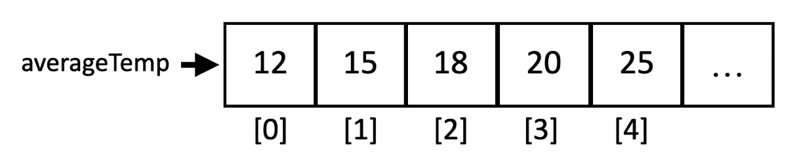
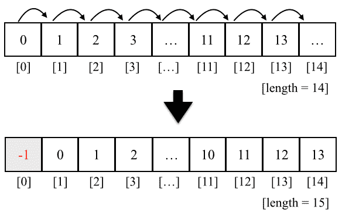
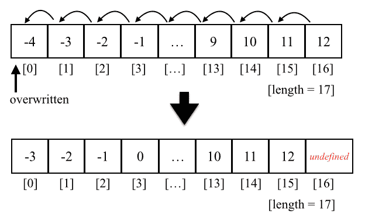
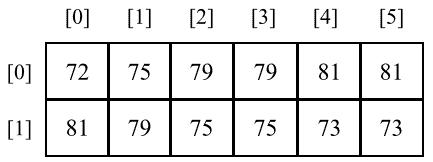
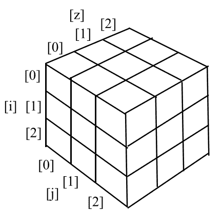
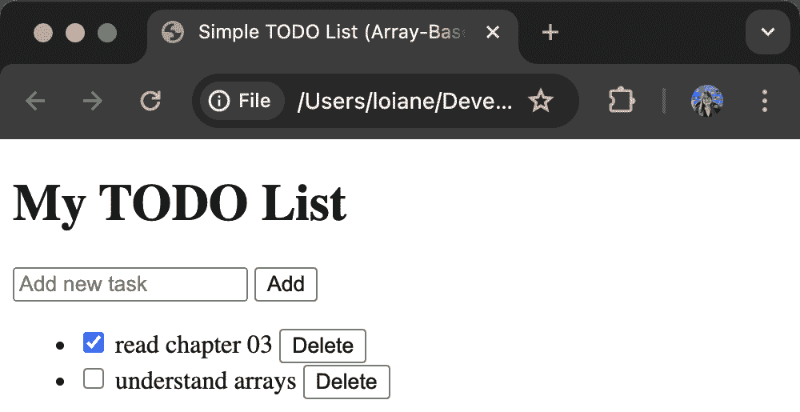

# 第四章：3 数组

**在开始之前：加入我们的 Discord 书籍社区**

直接向作者本人提供反馈，并在我们的 Discord 服务器上与其他早期读者聊天（在“学习 JavaScript 数据结构与算法”第四版下的“EARLY ACCESS SUBSCRIPTION”中找到“learning-javascript-dsa-4e”频道）。


[`packt.link/EarlyAccess/`](https://packt.link/EarlyAccess/)

**数组**是最简单的内存数据结构。因此，所有编程语言都有内置的数组数据类型。JavaScript 也原生支持数组，尽管它的第一个版本发布时没有数组支持。在本章中，我们将深入研究数组数据结构和其功能。

数组按顺序存储相同数据类型的值。尽管 JavaScript 允许我们创建包含不同数据类型值的数组，但我们将遵循最佳实践，并假设我们无法这样做（大多数语言都没有这种功能）。

## 为什么我们应该使用数组？

让我们考虑我们需要存储我们居住的城市每年每个月的平均温度。我们可以使用以下代码片段来存储这些信息：

```js
const averageTempJan = 12;
const averageTempFeb = 15;
const averageTempMar = 18;
const averageTempApr = 20;
const averageTempMay = 25;
```

然而，这并不是最佳方法。如果我们只存储一年的温度，我们可以管理 12 个变量。但是，如果我们需要存储 50 年的平均温度怎么办？幸运的是，这就是数组被创建的原因，我们可以轻松地用以下方式表示之前提到的相同信息：

```js
const averageTemp = [12, 15, 18, 20, 25];
// or
averageTemp[0] = 12;
averageTemp[1] = 15;
averageTemp[2] = 18;
averageTemp[3] = 20;
averageTemp[4] = 25;
```

我们也可以用图形表示 `averageTemp` 数组：



图 3.1：

## 创建和初始化数组

在 JavaScript 中声明、创建和初始化数组很简单，如下面的示例所示：

```js
let daysOfWeek = new Array(); // {1}
daysOfWeek = new Array(7); // {2}
daysOfWeek = new Array('Sunday', 'Monday', 'Tuesday', 'Wednesday', 'Thursday', 'Friday', 'Saturday'); // {3}
// preferred
daysOfWeek = []; // {4}
daysOfWeek = ['Sunday', 'Monday', 'Tuesday', 'Wednesday', 'Thursday', 'Friday', 'Saturday']; // {5}
```

我们可以：

+   行 `{1}`：使用关键字 `new` 声明并实例化一个新的数组——这将创建一个空数组。

+   行 `{2}`：指定数组的 *长度*（我们计划在数组中存储多少个元素）来创建一个空数组。

+   行 `{3}`：通过在构造函数中直接传递元素来创建和初始化数组。

+   行 `{4}`：通过分配空括号（`[]`）创建一个空数组。使用关键字 `new` 并不是最佳实践，因此使用括号是首选方式。

+   行 `{5}`：使用括号作为最佳实践创建和初始化数组。

如果我们想知道数组中有多少个元素（其大小），我们可以使用 `length` 属性。以下代码将输出 `7`：

```js
console.log('daysOfWeek.length', daysOfWeek.length); // output: 7
```

## 访问元素和迭代数组

要访问数组的特定位置，我们也可以使用括号，传递我们想要访问的位置的索引。例如，假设我们想要输出 `daysOfWeek` 数组中的所有元素。为此，我们需要循环数组并打印元素，从索引 0 开始如下：

```js
for (let i = 0; i < daysOfWeek.length; i++) {
  console.log(`daysOfWeek[${i}]`, daysOfWeek[i]);
}
```

让我们看看另一个例子。假设我们想找出斐波那契数列的前 20 个数字。斐波那契数列的前两个数字是 1 和 2，每个后续数字都是前两个数字的和：

```js
// Fibonacci: 0, 1, 1, 2, 3, 5, 8, 13, 21, 34, ...
const fibonacci = []; // {1}
fibonacci[1] = 1; // {2}
fibonacci[2] = 1; // {3}
// create the fibonacci sequence starting from the 3rd element
for (let i = 3; i < 20; i++) {
  fibonacci[i] = fibonacci[i - 1] + fibonacci[i - 2]; // //{4}
}
// display the fibonacci sequence
for (let i = 1; i < fibonacci.length; i++) { // {5}
  console.log(`fibonacci[${i}]`, fibonacci[i]); // {6}
}
```

下面的代码是对前面代码的解释：

1.  在行 `{1}` 中，我们声明并创建了一个数组。

1.  在行 `{2}` 和 `{3}` 中，我们将斐波那契数列的前两个数字赋给了数组的第二个和第三个位置（在 JavaScript 中，数组的第一个位置始终通过 0（零）引用，由于斐波那契数列中没有零，我们将跳过它）。

1.  然后，我们只需要创建序列的第 3 到第 20 个数字（因为我们已经知道了前两个数字）。为此，我们可以使用循环并将数组前两个位置的值之和赋给当前位置（从数组的索引 3 开始到第 19 个索引，行 `{4}`）。

1.  然后，为了查看输出（行 `{6}`），我们只需要从数组的第一个位置循环到其长度（行 `{5}`）。

> 我们可以使用 `console.log` 输出数组的每个索引（行 `{5}` 和 `{6}`），或者我们也可以使用 `console.log(fibonacci)` 输出数组本身。

如果你想要生成超过 20 个斐波那契数列的数字，只需将数字 20 改为你想要的任何数字。

### 使用 for..in 循环

使用 `for..in` 循环的好处是，我们不需要跟踪数组长度，因为循环将遍历所有数组索引。以下代码实现了与前面的 `for` 循环相同的输出。

```js
for (const i in fibonacci) {
  console.log(`fibonacci[${i}]`, fibonacci[i]);
}
```

这是一种编写循环的另一种方式，你可以使用你感觉最舒服的一种。

### 使用 for…of 循环

另一种方法，如果你想要直接提取数组的值，可以使用以下 `for..of` 循环：

```js
for (const value of fibonacci) {
  console.log('value', value);
}
```

使用这个循环，我们不需要访问数组中的每个索引来检索值，因为每个位置上的值可以直接在循环中访问。

## 添加元素

向数组中添加和删除元素并不那么困难；然而，它可能有点棘手。对于本节中我们将创建的示例，让我们假设我们有一个初始化了从 0 到 9 的数字的数组：

```js
let numbers = [0, 1, 2, 3, 4, 5, 6, 7, 8, 9];
```

### 在数组的末尾插入一个元素

如果我们想向这个数组中添加一个新元素（例如，数字 10），我们只需要引用数组的最后一个空闲位置并将其赋值：

```js
numbers[numbers.length] = 10;
```

> 在 JavaScript 中，数组是一个可变对象。我们可以很容易地向其中添加新元素。随着我们添加新元素，对象会动态增长。在许多其他语言中，例如 C 和 Java，我们需要确定数组的大小，如果我们需要向数组中添加更多元素，我们需要创建一个全新的数组；我们不能简单地按需添加新元素。

#### 使用 push 方法

JavaScript API 还有一个名为 `push` 的方法，允许我们将新元素添加到数组的末尾。我们可以将任意数量的元素作为参数传递给 `push` 方法：

```js
numbers.push(11); 
numbers.push(12, 13);
```

数字数组的输出将是从 0 到 13 的数字。

### 在第一个位置插入元素

假设我们需要向数组添加一个新元素（数字 `-1`）并希望将其插入到第一个位置，而不是最后一个位置。要做到这一点，首先我们需要通过将所有元素向右移动来释放第一个位置。我们可以遍历数组的所有元素，从最后一个位置（`length` 的值将是数组的末尾）开始，将前一个元素（`i-1`）移动到新位置（`i`），最后将我们想要的新值赋给第一个位置（索引 0）。我们可以创建一个函数来表示这个逻辑，甚至可以直接添加一个新方法到 Array 原型中，使得 `insertAtBeginning` 方法对所有数组实例都可用。以下代码表示了这里描述的逻辑：

```js
Array.prototype.insertAtBeginning = function(value) { 
    for (let i = this.length; i >= 0; i--) { 
      this[i] = this[i - 1]; 
    } 
    this[0] = value; 
  };  
numbers.insertAtBeginning(-1);
```

我们可以用以下图表来表示这个动作：



图 3.2：

#### 使用 unshift 方法

JavaScript 数组类还有一个名为 `unshift` 的方法，它将方法参数中传递的值插入到数组的开头（幕后逻辑与 `insertAtBeginning` 方法的行为相同）：

```js
numbers.unshift(-2); 
numbers.unshift(-4, -3); 
```

因此，使用 `unshift` 方法，我们可以将值 -2 然后是 -3 和 -4 添加到 `numbers` 数组的开头。这个数组的输出将是从 -4 到 13 的数字。

## 移除元素

到目前为止，你已经学习了如何在数组中添加元素。让我们看看我们如何从数组中移除一个值。

### 从数组末尾移除元素

要从数组的末尾移除一个值，我们可以使用 `pop` 方法：

```js
numbers.pop(); // number 13 is removed
```

`pop` 方法也会返回被移除的值，如果没有元素被移除（数组为空），则返回 `undefined`。因此，如果需要，我们也可以将返回的值捕获到变量或控制台中：

```js
console.log('Removed element: ', numbers.pop());
```

我们数组的输出将是从 -4 到 12 的数字（移除一个数字后）。我们数组的长度（大小）是 17。

> `push` 和 `pop` 方法允许数组模拟基本的 `栈` 数据结构，这是下一章的主题。

### 从第一个位置移除元素

要手动从数组的开头移除一个值，我们可以使用以下代码：

```js
for (let i = 0; i < numbers.length; i++) { 
  numbers[i] = numbers[i + 1]; 
} 
```

我们可以用以下图表来表示前面的代码：



图 3.3：

我们将所有元素向左移动了一个位置。然而，数组的长度仍然是相同的（`16`），这意味着我们仍然在数组中有一个额外的元素（具有 `undefined` 值）。最后一次代码在循环中执行时，`i+1` 是一个引用不存在位置的引用。在某些语言中，例如 Java、C/C++ 或 C#，代码将抛出异常，并且我们必须在 `numbers.length -1` 处结束我们的循环。

我们只是覆盖了数组的原始值，并没有真正删除值（因为数组的长度仍然是相同的，并且我们有一个额外的 `undefined` 元素）。

要从数组中删除值，我们还可以创建一个 `removeFromBeginning` 方法，其中包含本主题中描述的逻辑。然而，要真正从数组中删除元素，我们需要创建一个新的数组，并将原始数组中除 `undefined` 值之外的所有值复制到新数组中，并将新数组赋值给我们的变量。为此，我们还可以创建一个 `reIndex` 方法，如下所示：

```js
Array.prototype.reIndex = function(myArray) {  
    const newArray = []; 
    for(let i = 0; i < myArray.length; i++ ) { 
        if (myArray[i] !== undefined) { 
            newArray.push(myArray[i]); 
        } 
    } 
    return newArray; 
} 
// remove first position manually and reIndex 
Array.prototype.removeFromBeginning = function() { 
    for (let i = 0; i < this.length; i++) { 
        this[i] = this[i + 1]; 
    } 
    return this.reIndex(this); 
}; 
numbers = numbers.removeFromBeginning();
```

> 前面的代码仅用于教育目的，不应在实际项目中使用。要删除数组中的第一个元素，我们应该始终使用下一节中介绍的 `shift` 方法。

#### 使用 shift 方法

要从数组的开头删除元素，我们可以使用 `shift` 方法，如下所示：

```js
numbers.shift(); 
```

如果我们在执行前面的代码后认为我们的数组具有从 -4 到 12 的值和 17 的长度，那么数组将包含从 -3 到 12 的值，并且长度为 16。

> `shift` 和 `unshift` 方法允许数组模拟基本的 `队列` 数据结构，这是 *第五章，队列和双端队列* 的主题。

## 从特定位置添加和删除元素

到目前为止，我们已经学习了如何在数组的末尾和开头添加元素，我们也学习了如何从数组的开头和末尾删除元素。如果我们还想从数组的任何位置添加或删除元素怎么办？我们如何做到这一点？

我们可以使用 `splice` 方法通过指定我们想要从其中删除的位置/索引以及我们想要删除多少个元素来从数组中删除一个元素，如下所示：

```js
numbers.splice(5,3); 
```

此代码将从数组的 `5` 个索引处开始删除三个元素。这意味着 `numbers[5]`、`numbers[6]` 和 `numbers[7]` 将从 `numbers` 数组中删除。我们的数组内容将是 `-3, -2, -1, 0, 1, 5, 6, 7, 8, 9, 10, 11` 和 `12`（因为数字 `2`、`3` 和 `4` 已被删除）。

> 与 JavaScript 数组和对象一样，我们也可以使用 `delete` 操作符从数组中删除一个元素，例如，`delete numbers[0]`。然而，数组的 `0` 位置将具有 `undefined` 的值，这意味着它将与执行 `numbers[0] = undefined` 相同，并且我们需要重新索引数组。因此，我们应该始终使用 `splice`、`pop` 或 `shift` 方法来删除元素。

现在，假设我们想从位置 5 开始将数字 2、3 和 4 插入数组中。我们可以再次使用 splice 方法来完成这个操作：

```js
numbers.splice(5, 0, 2, 3, 4); 
```

方法的第一参数是我们想要从中删除元素或插入元素的位置索引。第二个参数是我们想要删除的元素数量（在这种情况下，我们不想删除任何元素，所以我们将传递值 0（零））。从第三个参数开始，我们有我们想要插入到数组中的值（元素 2、3 和 4）。输出将再次是-3 到 12 的值。

最后，让我们执行以下代码：

```js
numbers.splice(5, 3, 2, 3, 4); 
```

输出将是从-3 到 12 的值。这是因为我们从索引 5 开始删除了三个元素，并且我们也在索引 5 处添加了元素 2、3 和 4。

## 迭代器方法

JavaScript 也有一些内置方法作为 Array API 的一部分，这些方法在日常编码任务中非常有用。这些方法接受一个回调函数，我们可以使用它来根据需要操作数组中的数据。

让我们看看这些方法。考虑以下数组作为本节示例的基础：

```js
const numbers = [1, 2, 3, 4, 5, 6, 7, 8, 9, 10];
```

### 使用 forEach 方法迭代

如果我们需要无论什么情况都要完全迭代数组，我们可以使用`forEach`函数。它具有与在`for`循环中包含函数代码相同的输出，如下所示：

```js
numbers.forEach((value, index) => {
  console.log(`numbers[${index}]`, value);
});
```

大多数时候，我们只对使用数组每个位置的值感兴趣，而不必像前面的例子那样访问每个位置。以下是一个更简洁的例子：

```js
numbers.forEach(value => console.log(value));
```

根据个人喜好，你可以使用这个方法或传统的`for`循环。在性能方面，两种方法都是*O(n)*，即线性时间，因为它将遍历数组的所有值。

### 使用 every 方法迭代

`every`方法迭代数组的每个元素，直到函数返回`false`。让我们看看一个例子：

```js
const isBelowSeven = numbers.every(value => value < 7);
console.log('All values are below 7?:', isBelowSeven); // false
```

该方法将遍历数组中的每个值，直到找到一个等于或大于 7 的值。对于前面的例子，它返回`false`，因为我们数组中有 7 这个值。如果我们没有大于或等于 7 的值，变量`isBelowSeven`将具有`true`的值。

我们可以使用 for 循环重写这个例子，以了解其内部工作原理：

```js
let isBelowSevenForLoop = true;
for (let i = 0; i < numbers.length; i++) {
  if (numbers[i] >= 7) {
    isBelowSevenForLoop = false;
    break;
  }
}
console.log('All values are below 7?:', isBelowSevenForLoop);
```

`break`语句将在找到等于或大于 7 的值时停止循环。

通过使用`every`方法，我们可以编写更简洁的代码以实现相同的结果。

### 使用 some 方法迭代

`some`方法与`every`方法的行为相反。然而，`some`方法会迭代数组的每个元素，直到函数返回`true`。以下是一个例子：

```js
const isSomeValueBelowSeven = numbers.some(value => value < 7);
console.log('Is any value below 7?:', isSomeValueBelowSeven); // true
```

在这个例子中，数组的第一个数字是 1，它将立即返回 true，停止代码的执行。

我们可以使用 for 循环`for`重写前面的代码，以更好地理解逻辑：

```js
let isSomeValueBelowSevenForLoop = false;
for (let i = 0; i < numbers.length; i++) {
  if (numbers[i] < 7) {
    isSomeValueBelowSevenForLoop = true;
    break;
  }
}
```

## 搜索数组

JavaScript API 提供了一些不同的方法，我们可以使用它们在数组中搜索或查找元素。尽管我们将学习如何重新创建经典算法来搜索数组中的元素，但在*第十五章，搜索和洗牌算法*中，了解我们可以使用现有的 API 而不必自己编写代码总是好的。

让我们看看现有的 JavaScript 方法，这些方法允许我们在数组中搜索元素。

### 使用`indexOf`、`lastIndexOf`和`includes`方法进行搜索

`indexOf`、`lastIndexOf`和`includes`方法有非常相似的语法如下：

+   `indexOf(element, fromIndex)`：从索引`fromIndex`开始搜索`element`，如果元素存在，则返回其索引，否则返回值`-1`。

+   `includes(element, fromIndex)`：从索引`fromIndex`开始搜索`element`，如果元素存在，则返回`true`，否则返回`false`。

如果我们尝试在我们的`numbers`数组中搜索一个数字，让我们检查数字 5 是否存在：

```js
console.log('Index of 5:', numbers.indexOf(5)); // 4
console.log('Index of 11:', numbers.indexOf(11)); // -1
console.log('Is 5 included?:', numbers.includes(5)); // true
console.log('Is 11 included?:', numbers.includes(11)); // false
```

如果我们想要在整个数组中进行搜索，我们可以省略`fromIndex`，默认情况下将使用索引 0。

`lastIndexOf`也是类似的，但是它会返回找到的最后一个匹配元素的索引。把它想象成从数组的末尾向数组开头搜索：

```js
console.log('Last index of 5:', numbers.lastIndexOf(5)); // 4
console.log('Last index of 11:', numbers.lastIndexOf(11)); // -1
```

当数组中有重复元素时，此方法很有用。

### 使用`find`、`findIndex`和`findLastIndex`方法进行搜索

在现实世界的任务中，我们经常处理更复杂的对象。`find`和`findIndex`方法对于更复杂的场景特别有用，但这并不意味着我们不能在更简单的情况下使用它们。

`find`和`findIndex`方法都接收一个回调函数，该函数将搜索满足测试函数（回调）中提出的条件的元素。让我们从一个简单的例子开始：假设你想要找到数组中第一个值低于 7 的数字。我们可以使用以下代码：

```js
const firstValueBelowSeven = numbers.find(value => value < 7);
console.log('First value below 7:', firstValueBelowSeven); // 1
```

我们使用一个回调函数，即箭头函数来测试数组的每个元素（`value < 7`），并且第一个返回`true`的元素将被返回。这就是为什么输出是`1`，因为它是数组的第一个元素。

`findIndex`方法类似，但是它将返回元素的索引而不是元素本身：

```js
console.log('Index: ', numbers.findIndex(value => value < 7)); // 0
```

同样，还有一个`findLastIndex`方法，它将返回匹配回调函数的元素的最后一个索引。

```js
console.log('Index of last value below 7:', numbers.findLastIndex(value => value < 7)); // 5
```

在前面的例子中，返回索引 5 是因为数字 6 是数组中低于 7 的最后一个元素。

现在，让我们检查一个更复杂的例子，更接近现实生活。考虑以下数组，一组书籍：

```js
const books = [
    { id: 1, title: 'The Fellowship of the Ring' },
    { id: 2, title: 'Fourth Wing' },
    { id: 3, title: 'A Court of Thorns and Roses' }
];
```

如果我们需要查找`id`为 2 的书籍，我们可以使用`find`方法：

```js
console.log('Book with id 2:', books.find(book => book.id === 2));
```

它将输出`{ id: 2, title: 'Fourth Wing' }`。如果我们尝试找到《霍比特人》这本书，我们将得到输出`undefined`，因为这本书不在数组中：

```js
console.log(books.find(book => book.title === 'The Hobbit'));
```

假设我们想要从数组中移除`id`为 3 的书籍。我们首先找到书籍的索引，然后使用`splice`方法在给定索引处移除书籍：

```js
const bookIndex = books.findIndex(book => book.id === 3);
if (bookIndex !== -1) {
    books.splice(bookIndex, 1);
}
```

当然，在尝试从列表中移除书籍之前，先检查书籍是否被找到（`bookIndex`不等于-1）是一个好习惯，以避免逻辑错误。

### 过滤元素

让我们再次回顾以下示例：

```js
const firstValueBelowSeven = numbers.find(value => value < 7);
console.log('First value below 7:', firstValueBelowSeven); // 1
```

`find`方法返回第一个符合给定条件的元素。如果我们想了解数组中小于 7 的所有元素怎么办？这时`filter`方法就派上用场了：

```js
const valuesBelowSeven = numbers.filter(value => value < 7);
console.log('Values below 7:', valuesBelowSeven); // [1, 2, 3, 4, 5, 6]
```

`filter`方法返回所有匹配元素的数组，输出将是：`[1, 2, 3, 4, 5, 6]`。

## 排序元素

在整本书中，你将学习如何编写最常用的排序算法。然而，JavaScript 也提供了一个排序方法，我们可以在需要排序数组时使用，而无需编写自己的逻辑。

首先，让我们取我们的数字数组并将元素顺序打乱（`[1, 2, 3, ... 10]`已经是排序好的）。为此，我们可以应用`reverse`方法，其中最后一个元素将成为第一个，反之亦然，如下所示：

```js
numbers.reverse();
```

因此，现在数字数组的输出将是`[10, 9, 8, 7, 6, 5, 4, 3, 2, 1]`。然后，我们可以应用排序方法，如下所示：

```js
numbers.sort();
```

然而，如果我们输出数组，结果将是`[1, 10, 2, 3, 4, 5, 6, 7, 8, 9]`。这不是正确的顺序。这是因为 JavaScript 中的`sort`方法按字典顺序排序元素，并假设所有元素都是字符串。

我们也可以编写自己的比较函数。由于我们的数组包含数字元素，我们可以编写以下代码：

```js
numbers.sort((a, b) => a - b);
```

如果`b`大于`a`，此代码将返回一个负数，如果`a`大于`b`，则返回一个正数，如果它们相等，则返回 0（零）。这意味着如果返回负值，则意味着`a`小于`b`，这进一步被`sort`函数用于排列元素。

之前的代码可以用以下代码表示：

```js
function compareNumbers(a, b) {
    if (a < b) {
      return -1;
    }
    if (a > b) {
      return 1;
    }
    // a must be equal to b
    return 0;
  }
  numbers.sort(compareNumbers);
```

这是因为 JavaScript 数组类的`sort`函数可以接收一个名为`compareFunction`的参数，该参数负责排序数组。在我们的例子中，我们声明了一个将负责比较数组元素的函数，结果是一个按升序排序的数组。

### 自定义排序

我们可以用任何类型的对象来排序数组，我们也可以创建一个`compareFunction`来比较所需的元素。例如，假设我们有一个名为 Person 的对象，包含姓名和年龄，我们想根据人的年龄对数组进行排序。我们可以使用以下代码：

```js
const friends = [
  { name: 'Frodo', age: 30 },
  { name: 'Violet', age: 18 },
  { name: 'Aelin', age: 20 }
];
const compareFriends = (friendA, friendB => friendA.age - friendB.age;
friends.sort(compareFriends);
console.log('Sorted friends:', friends);
```

在这种情况下，之前代码的输出将是 Violet（18），Aelin（20），和 Frodo（30）。

### 排序字符串

假设我们有以下数组：

```js
let names = ['Ana', 'ana', 'john', 'John'];
console.log(names.sort());
```

你认为输出会是什么？答案是如下：

```js
["Ana", "John", "ana", "john"]
```

为什么 `ana` 在字母表中排在 `John` 之后，尽管 `a` 排在前面？答案是 JavaScript 会根据每个字符的 **ASCII** 值进行比较（[`www.asciitable.com`](http://www.asciitable.com)）。

例如，A，J，a，和 j 的十进制 ASCII 值分别为 A：65，J：74，a：97，和 j：106。因此，J 的值小于 a，因此它在字母表中排在前面。

现在，如果我们向 `sort` 方法传递一个函数，该函数包含忽略字母大小写的代码，我们将得到以下输出：[`"Ana", "ana", "john", "John"`]：

```js
names = ['Ana', 'ana', 'john', 'John']; // reset the array to its original state
names.sort((a, b) =>  {
  const nameA = a.toLowerCase();
  const nameB = b.toLowerCase();
  if (nameA < nameB) {
    return -1;
  }
  if (nameA > nameB) {
    return 1;
  }
  return 0;
});
```

在这种情况下，排序函数将不会有任何效果；它将遵循当前的大小写字母顺序。

如果我们想让排序后的数组中字母小写字母排在前面，那么我们需要使用 `localeCompare` 方法：

```js
names.sort((a, b) => a.localeCompare(b));
```

输出将是 `['ana', 'Ana', 'john', 'John']`。

对于带重音的字符，我们也可以使用 `localeCompare` 方法：

```js
const names2 = ['Maève', 'Maeve'];
console.log(names2.sort((a, b) => a.localeCompare(b)));
```

输出将是 `['Maeve', 'Maève']`。

## 转换数组

JavaScript 还支持可以修改数组元素或改变其顺序的方法。到目前为止，我们已经介绍了两种转换方法：`reverse` 和 `sort`。让我们了解其他有用的可以转换数组的方法。

### 映射数组的值

`map` 方法是使用 JavaScript 或 TypeScript 进行日常编码任务时最常用的方法之一。让我们看看它的实际应用：

```js
const numbers = [1, 2, 3, 4, 5, 6, 7, 8, 9, 10];
const squaredNumbers = numbers.map(value => value * value);
console.log('Squared numbers:', squaredNumbers);
```

假设我们想要找到数组中每个数字的平方。我们可以使用 `map` 方法转换数组中的每个值，并返回一个包含结果的数组。对于我们的例子，输出将是：`[1, 4, 9, 16, 25, 36, 49, 64, 81, 100]`。

我们可以使用 `for` 循环重写前面的代码以实现相同的结果：

```js
const squaredNumbersLoop = [];
for (let i = 0; i < numbers.length; i++) {
  squaredNumbersLoop.push(numbers[i] * numbers[i]);
}
```

这也是为什么 `map` 方法经常被使用的原因，因为它在我们需要修改数组中所有值时可以节省时间。

### 将数组拆分并合并为字符串

想象我们有一个逗号分隔的 CSV 文件，包含不同的名称，并且我们想要将这些值添加到数组中进行处理（可能需要通过 API 保存到数据库中）。我们可以使用 String 的 `split` 方法，它将返回一个包含这些值的数组：

```js
const namesFromCSV = 'Aelin,Gandalf,Violet,Poppy';
const names = namesFromCSV.split(',');
console.log('Names:', names); // ['Aelin', 'Gandalf', 'Violet', 'Poppy']
```

如果我们不需要使用逗号分隔的文件，而是需要使用分号，我们可以使用 JavaScript 数组的 `join` 方法来输出一个包含数组值的单个字符串：

```js
const namesCSV = names.join(';');
console.log('Names CSV:', namesCSV); // 'Aelin;Gandalf;Violet;
```

### 使用 `reduce` 方法进行计算

`reduce` 方法用于从数组中计算出一个值。该方法接收一个带有以下参数的回调函数：`accumulator`（计算结果），数组的`element`，`index`以及数组本身，第二个参数是初始值。通常，索引和数组不太常用，可以省略。让我们看看几个例子。

当我们想要计算总和时，`reduce` 方法经常被使用。例如，假设我们想知道给定数组中所有数字的总和：

```js
const numbers = [1, 2, 3, 4, 5, 6, 7, 8, 9, 10];
const sum = numbers.reduce((acc, value) => acc + value, 0); // 55
```

其中 `0` 是初始值，`acc` 是总和。我们可以使用循环重写前面的代码来理解其背后的逻辑：

```js
let sumLoop = 0;
for (let i = 0; i < numbers.length; i++) {
  sumLoop += numbers[i];
}
```

我们也可以使用 `reduce` 方法在数组中找到最小或最大值：

```js
const scores = [30, 70, 85, 90, 100];
const highestScore = scores.reduce((max, score) => score > max ? score : max, scores[0]); // 100
```

此外，还有 `reduceRight` 方法，它将执行相同的逻辑，但是它将从数组的末尾开始迭代。

> 这些方法 `map`、`filter` 和 `reduce` 是 JavaScript 中 *函数式编程* 的基础。

## 其他 JavaScript 数组方法的参考

JavaScript 数组非常有趣，因为它们功能强大，并且比其他语言中的原始数组具有更多可用功能。这意味着我们不需要自己编写基本功能，并且可以利用这些强大的功能。

我们在本章中已经介绍了许多不同的方法。让我们看看其他有用的方法。

### 使用 isArray 方法

在 JavaScript 中，我们可以使用 `typeof` 运算符检查变量或对象的类型，如下所示：

```js
console.log(typeof 'Learning Data Structures'); // string
console.log(typeof 123); // number
console.log(typeof { id: 1 }); // object
console.log(typeof [1, 2, 3]); // object
```

注意，对象 `{ id: 1}` 和数组 `[1, 2, 3]` 的类型都是 `object`。

但如果我们想再次检查类型是否为数组，以便我们可以调用任何特定的数组方法呢？幸运的是，JavaScript 也提供了一个通过 `Array.isArray` 的方法：

```js
console.log(Array.isArray([1, 2, 3])); // true
```

这样我们就可以始终检查我们是否收到了未知类型的数据。例如，当在客户端使用 JavaScript 时，我们经常从服务器端的 API 接收 JSON 对象。我们可以将接收到的数据解析成对象，并检查接收到的对象是否为数组，这样我们就可以使用我们学到的方法来查找特定信息：

```js
const jsonString = JSON.stringify('[{"id":1,"title":"The Fellowship of the Ring"},{"id":2,"title":"Fourth Wing"}]');
const dataReceived = JSON.parse(jsonString);
if (Array.isArray(dataReceived)) {
  console.log('It is an array');
  // check if The Fellowship of the Ring is in the array
  const fellowship = dataReceived.find((item) => {
    return item.title === 'The Fellowship of the Ring';
  });  
  if (fellowship) {
    console.log('We received the book we were looking for!');
  } else {
    console.log('We did not receive the book we were looking for!');
  }
}
```

这有助于确保我们的代码不会抛出错误，并且在处理我们代码中未创建的数据结构时是一种良好的实践。

### 使用 from 方法

`Array.from` 方法从一个现有的数组创建一个新的数组。例如，如果我们想将数组 `numbers` 复制到一个新的数组中，我们可以使用以下代码：

```js
const numbers = [1, 2, 3, 4, 5];
const numbersCopy = Array.from(numbers);
console.log(numbersCopy); // [1, 2, 3, 4, 5]
```

也可以传递一个函数，这样我们就可以确定我们想要映射的值。考虑以下代码：

```js
const evens = Array.from(numbers, x => (x % 2 == 0)); 
console.log(evens); // [false, true, false, true, false]
```

前面的代码创建了一个名为 evens 的新数组，如果原始数组中的数字是偶数，则值为 true，否则为 false。

重要的是要注意，`Array.from()` 方法创建了一个新的、*浅拷贝*。让我们看看另一个例子：

```js
const friends = [
  { name: 'Frodo', age: 30 },
  { name: 'Violet', age: 18 },
  { name: 'Aelin', age: 20 }
];
const friendsCopy = Array.from(friends);
```

复制完成后，让我们将第一个朋友的名字修改为 Sam：

```js
friends[0].name = 'Sam';
console.log(friendsCopy[0].name); // Sam
```

被复制的数组的第一个朋友的名字也会更新，所以在使用这个方法时我们必须小心。

如果我们需要复制数组，并且有不同实例的内容，可以通过 JSON 使用一种解决方案：

```js
const friendsDeepCopy = JSON.parse(JSON.stringify(friends));
friends[0].name = 'Frodo';
console.log(friendsDeepCopy[0].name); // Sam
```

通过将数组的所有内容转换为 JSON 格式的字符串，然后再将此内容解析回数组结构，我们创建全新的数据。然而，根据我们需要实现的目标，还有更健壮的方法来做这件事。

### 使用 Array.of 方法

`Array.of` 方法可以从传递给方法的方法参数创建一个新的数组。例如，让我们考虑以下示例：

```js
const numbersArray = Array.of(1, 2, 3, 4, 5);
console.log(numbersArray); // [1, 2, 3, 4, 5]
```

上述代码等同于执行以下操作：

```js
const numbersArray = [1, 2, 3, 4, 5];
```

我们还可以使用这个方法来复制现有的数组。以下是一个示例：

```js
let numbersCopy2 = Array.of(...numbersArray);
```

上述代码等同于使用 `Array.from(numbersArray)`。这里的区别在于我们使用了扩展运算符。扩展运算符（`...`）将 `numbersArray` 的每个值展开为参数。

### 使用 `fill` 方法

`fill` 方法用值填充数组。例如，假设一个新的游戏锦标赛即将开始，我们想要将所有结果存储在数组中。随着比赛的结束，我们可以更新每个结果。

```js
const tornamentResults = new Array(5).fill('pending');
```

`tornamentResults` 数组的长度为 5，这意味着我们有五个位置。每个位置都初始化为 `pending` 值。

现在，假设比赛 1 和 2 已经获胜。我们也可以使用 `fill` 方法通过传递起始位置（包含）和结束位置（不包含）来填充这两个位置：

```js
tornamentResults.fill('win', 1, 3);
console.log(tornamentResults);
// ['pending', 'win', 'win', 'pending', 'pending']
```

这个方法很有用，因为它提供了一种紧凑的方式来使用单个值初始化数组，并且通常比手动循环填充数组更快（在编写代码所需的时间方面）。

### 合并多个数组

考虑一个场景，你拥有不同的数组，并且需要将它们全部合并成一个单一的数组。我们可以遍历每个数组，并将每个元素添加到最终的数组中。幸运的是，JavaScript 已经有一个可以为我们完成这个任务的方法，名为 `concat` 方法，其语法如下：

```js
const zero = 0;
const positiveNumbers = [1, 2, 3];
const negativeNumbers = [-3, -2, -1];
let allNumbers = negativeNumbers.concat(zero, positiveNumbers); 
```

我们可以向这个数组传递任意数量的数组、对象/元素。数组将按照传递给方法的参数顺序连接到指定的数组中。在这个例子中，0 将连接到 `negativeNumbers`，然后 `positiveNumbers` 将连接到结果数组。数字数组的输出将是值 `[-3, -2, -1, 0, 1, 2, 3]`。

## 二维数组

在本章的开头，我们使用了一个温度测量的例子。现在我们将再次使用这个例子。让我们考虑一下，我们需要测量几天内的每小时温度。既然我们已经知道可以使用数组来存储温度，我们可以轻松地编写以下代码来存储两天的温度：

```js
let averageTempDay1 = [72, 75, 79, 79, 81, 81]; 
let averageTempDay2 = [81, 79, 75, 75, 73, 72];
```

然而，这不是最佳方法；我们可以做得更好！我们可以使用一个 **矩阵**（一个二维数组或 *数组数组*）来存储这些信息，其中每一行将代表一天，每一列将代表温度的小时测量值，如下所示：

```js
let averageTempMultipleDays = [];
averageTempMultipleDays[0] = [72, 75, 79, 79, 81, 81];
averageTempMultipleDays[1] = [81, 79, 75, 75, 73, 73];
```

JavaScript 只支持一维数组；它不支持矩阵。然而，我们可以使用数组数组实现矩阵或任何多维数组，就像前面的代码一样。同样的代码也可以写成以下形式：

```js
averageTempMultipleDays = [
  [72, 75, 79, 79, 81, 81],
  [81, 79, 75, 75, 73, 73]
];
```

或者，如果你更喜欢为每个位置单独分配值，我们也可以将代码重写为以下代码片段：

```js
// day 1
averageTemp[0] = [];
averageTemp[0][0] = 72;
averageTemp[0][1] = 75;
averageTemp[0][2] = 79;
averageTemp[0][3] = 79;
averageTemp[0][4] = 81;
averageTemp[0][5] = 81;
// day 2
averageTemp[1] = [];
averageTemp[1][0] = 81;
averageTemp[1][1] = 79;
averageTemp[1][2] = 75;
averageTemp[1][3] = 75;
averageTemp[1][4] = 73;
averageTemp[1][5] = 73;
```

我们分别指定了每一天和每个小时的价值。我们也可以将这个二维数组表示为以下图表：



图 3.4:

每一行代表一天，每一列代表一天中每个小时的温度。

另一种可视化二维数组的方法是想象一个 Excel 文件（或 Google Sheets）。我们可以使用二维数组存储任何类型的表格数据，例如棋盘、剧院座位，甚至表示图像，其中数组的每个位置可以存储每个像素的颜色值。

### 遍历二维数组的元素

如果我们想验证矩阵的输出，我们可以创建一个通用函数来记录其输出：

```js
function printMultidimensionalArray(myArray) {
  for (let i = 0; i < myArray.length; i++) {
    for (let j = 0; j < myArray[i].length; j++) {
      console.log(myArray[i][j]);
    }
  }
}
```

我们需要遍历所有行和列。为此，我们需要使用嵌套的 `for` 循环，其中变量 `i` 代表行，`j` 代表列。在这种情况下，每个 `myMatrix[i]` 也代表一个数组，因此我们还需要在嵌套的 `for` 循环中迭代 `myMatrix[i]` 的每个位置。

我们可以使用以下代码输出 `averageTemp` 矩阵的内容：

```js
printMatrix(averageTemp);
```

> 我们还可以使用 `console.table(averageTemp)` 语句输出一个二维数组。这将提供更友好的用户输出，显示表格数据格式。

## 多维数组

我们还可以在 JavaScript 中处理多维数组。例如，假设我们需要存储多个地点和多个天气条件下的多天的平均温度。我们可以使用一个三维矩阵来做到这一点：

+   维度 1 (`i`): 每天的时间

+   维度 2 (`j`): 地点

+   维度 3 (`z`): 温度

假设我们只存储过去 3 天，3 个不同地点和 3 种不同的天气条件。我们可以用一个立方图表示一个 3x3x3 矩阵，如下所示：



图 3.5:

我们可以表示一个 3x3 矩阵，如下所示：

```js
let averageTempMultipleDaysAndLocation = [];
// day 1
averageTempMultipleDaysAndLocation[0] = [];
averageTempMultipleDaysAndLocation[0][0] = [19, 20, 21]; // location 1
averageTempMultipleDaysAndLocation[0][1] = [20, 22, 23]; // location 2
averageTempMultipleDaysAndLocation[0][2] = [30, 31, 32]; // location 3
// day 2
averageTempMultipleDaysAndLocation[1] = [];
averageTempMultipleDaysAndLocation[1][0] = [21, 22, 23]; // location 1
averageTempMultipleDaysAndLocation[1][1] = [22, 23, 24]; // location 2
averageTempMultipleDaysAndLocation[1][2] = [29, 30, 30]; // location 3
// day 3
averageTempMultipleDaysAndLocation[2] = [];
averageTempMultipleDaysAndLocation[2][0] = [22, 23, 24]; // location 1
averageTempMultipleDaysAndLocation[2][1] = [23, 24, 23]; // location 2
averageTempMultipleDaysAndLocation[2][2] = [30, 31, 31]; // location 3
```

而且，如果我们想输出这个矩阵的内容，我们需要迭代每个维度（`i`、`j` 和 `z`）：

```js
function printMultidimensionalArray3D(myArray) {
  for (let i = 0; i < myArray.length; i++) {
    for (let j = 0; j < myArray[i].length; j++) {
      for (let z = 0; z < myArray[i][j].length; z++) {
        console.log(myArray[i][j][z]);
      }
    }
  }
}
```

在性能方面，前面的代码是 *O(nˆ3)*，即立方时间，因为我们有三个嵌套循环。

我们可以使用三维矩阵来表示医学图像，例如 MRI 扫描，这是一系列身体的二维图像幻灯片。每个幻灯片是一个像素网格，将这些幻灯片组合起来，我们就有了身体扫描区域的 3D 表示。另一种用途是可视化 3D 打印机的模型，甚至是视频数据（每一帧都是一个二维像素数组，第三个维度是时间）。

如果我们有一个 3x3x3x3 矩阵，我们的代码中就会有四个嵌套的 `for` 循环，依此类推。作为开发者，你很少需要四维数组，因为它有非常专业的用途，例如交通模式分析。二维数组在开发者日常活动中最为常见，他们将在大多数项目中使用。

## TypedArray 类

我们可以在 JavaScript 数组中存储任何数据类型。这是因为 JavaScript 数组不像 C 和 Java 等其他语言那样是强类型。

**TypedArray** 的创建是为了让我们能够处理具有单一数据类型的数组。其语法是 `let myArray = new TypedArray(length)`，其中 `TypedArray` 需要替换为以下表中定义的特定类：

| **TypedArray** | **描述** |
| --- | --- |
| `Int8Array` | 8 位二进制补码有符号整数 |
| `Uint8Array` | 8 位无符号整数 |
| `Uint8ClampedArray` | 8 位无符号整数 |
| `Int16Array` | 16 位二进制补码有符号整数 |
| `Uint16Array` | 16 位无符号整数 |
| `Int32Array` | 32 位二进制补码有符号整数 |
| `Uint32Array` | 32 位无符号整数 |
| `Float32Array` | 32 位 IEEE 浮点数 |
| `Float64Array` | 64 位 IEEE 浮点数 |
| `BigInt64Array` | 64 位大整数 |
| `BigUint64Array` | 64 位无符号大整数 |

表 3.1：

以下是一个示例：

```js
const arrayLength = 5;
const int16 = new Int16Array(arrayLength);
for (let i = 0; i < arrayLength; i++) {
  int16[i] = i + 1;
}
console.log(int16);
```

Typed 数组非常适合与 WebGL API 一起工作，操作位，以及操作文件、图像和音频。Typed 数组的工作方式与简单数组完全相同，我们还可以使用本章中学到的相同方法和功能。

使用 `TypedArray` 的一个实际例子是在使用 **TensorFlow** ([`www.tensorflow.org`](https://www.tensorflow.org)) 时，这是一个用于创建 **机器学习** 模型的库。TensorFlow 有 **张量** 的概念，它是 TensorFlow.js 的核心数据结构。它内部使用 `TypedArrays` 来表示张量数据。这有助于提高库的效率和性能，尤其是在处理大型数据集或复杂模型时。

## TypeScript 中的数组

本章中所有源代码都是有效的 TypeScript 代码。区别在于 TypeScript 会在编译时进行类型检查，以确保我们只操作所有值具有相同数据类型的数组。

让我们回顾一下本章前面提到的先前示例：

```js
const numbers = [1, 2, 3, 4, 5, 6, 7, 8, 9, 10];
```

由于类型推断，TypeScript 能够理解数字数组的声明与 `const numbers: number[]` 相同。因此，如果我们初始化变量时，我们不需要总是显式声明变量的类型。

如果我们回到 `friends` 数组的排序示例，我们可以将 TypeScript 中的代码重构如下：

```js
interface Friend {
  name: string;
  age: number;
}
const friends = [
  { name: 'Frodo', age: 30 },
  { name: 'Violet', age: 18 },
  { name: 'Aelin', age: 20 }
];
const compareFriends = (friendA: Friend, friendB: Friend) => {
  return friendA.age - friendB.age;
};
friends.sort(compareFriends);
```

通过声明 `Friend` 接口，我们确保 `compareFriend` 函数只接收具有 `name` 和 `age` 属性的对象。朋友数组没有显式的类型，因此在这种情况下，如果我们想的话，我们可以显式地使用 `const friends: Friend[]` 声明其类型。

总结来说，如果我们想使用 TypeScript 来编写 JavaScript 变量，我们只需使用 `const` 或 `let variableName: <type>[]`，或者在具有 `.js` 扩展名的文件中，我们也可以通过在 JavaScript 文件的第 一行添加注释 `// @ts-check` 来进行类型检查。

在运行时，输出将与我们使用纯 JavaScript 时完全相同。

## 使用数组创建简单的 TODO 列表

数组是通用中最常用的数据结构之一，无论我们使用的是 JavaScript、.NET、Java、Python 还是任何其他语言。这也是大多数语言都有对这种数据结构原生支持的原因之一，JavaScript 对 `Array` 类提供了出色的 API（应用程序编程接口）。

每当我们访问数据库时，我们都会得到一个记录集合，我们可以使用数组来管理从数据库检索到的信息。如果我们在前端使用 JavaScript，并且调用服务器 API，我们通常将以 **JSON**（JavaScript 对象表示法）格式返回一个记录集合，我们可以将 JSON 解析成数组，以便按需管理和操作数据，这样我们就可以在屏幕上显示给用户。

让我们看看一个简单的 HTML 页面示例，使用 JavaScript 我们可以创建任务、完成任务和删除任务。当然，我们将使用数组来管理我们的 TODO 列表：

```js
<!-- Path: src/03-array/10-todo-list-example.html -->
<!DOCTYPE html>
<html>
<head>
  <title>Simple TODO List (Array-Based)</title>
</head>
<body>
  <h1>My TODO List</h1>
  <input type="text" id="newTaskInput" placeholder="Add new task">
  <button onclick="addTask()">Add</button>
  <ul id="taskList"></ul>
  <script>
    const taskList = document.getElementById('taskList');
    const newTaskInput = document.getElementById('newTaskInput');
    let tasks = []; // Initialize empty task array
    function addTask() {}
    function renderTasks() {}
    function toggleComplete(index) {}
    function removeTask(index) {}
  </script>
</body>
</html>
```

这段 HTML 代码将帮助我们渲染一个基本的 TODO 应用程序。一旦我们完成这个页面的开发，并在浏览器中打开它，我们将得到以下应用程序：

图 3.6：

让我们检查用于渲染任务项目符号列表的代码：

```js
function addTask() {
  const taskText = newTaskInput.value.trim(); // {1}
  if (taskText !== "") {
    tasks.push({ text: taskText, completed: false }); // {2}
    renderTasks(); // Update the displayed list
    newTaskInput.value = ""; // Clear input
  }
}
```

当我们点击 **添加** 按钮，将调用 `addTask` 函数。我们将使用 `trim` 方法去除文本开头和结尾的所有额外空格（`{1}`），如果文本不为空，我们将以包含文本和表示任务未完成的对象格式将其添加到我们的数组（`{2}`）中。然后我们将调用 `renderTasks` 函数，并清空输入，以便我们可以输入更多任务。

接下来，让我们看看 `renderTasks` 函数：

```js
function renderTasks() {
  taskList.innerHTML = ''; // Clear the list
  tasks.forEach((task, index) => { // {3}
    const listItem = document.createElement("li");
    listItem.innerHTML = `
      <input type="checkbox" ${task.completed ? "checked" : ""}
        onchange="toggleComplete(${index})">
      <span class="${task.completed ? "completed" : ""}">
        ${task.text}</span>
      <button onclick="removeTask(${index})">Delete</button>
    `;
    taskList.appendChild(listItem);
  });
}
```

每次我们添加一个新任务或删除一个任务时，我们都会调用这个 `renderTasks` 函数。首先，我们将通过在屏幕上渲染一个空格来清除列表，然后，对于数组中的每个任务（`{3}`），我们将在 HTML 列表中创建一个元素，该元素包含一个复选框，如果任务已完成则被选中，任务文本以及一个按钮，我们可以使用它来删除任务，传递数组中任务的索引。

最后，让我们检查 `toggleComplete` 函数（在勾选或取消勾选复选框时调用）和 `removeTask` 函数：

```js
function toggleComplete(index) { // Toggle task completion status
  tasks[index].completed = !tasks[index].completed; // {4}
  renderTasks();
}
function removeTask(index) {
  tasks.splice(index, 1); // {5} Remove from array
  renderTasks();
}
```

两个函数都接收数组的`index`作为参数，因此我们可以轻松访问正在切换或删除的任务。对于切换，我们可以直接访问数组位置并标记任务为完成或不完成（`{4}`），要删除任务，我们可以使用本章学到的`splice`方法从数组中删除任务（`{5}`），当然，每次我们进行更改时，我们都会重新渲染任务。

数组无处不在，因此掌握这种数据结构的重要性不言而喻。

## 练习

我们将使用本章学到的概念解决**Hackerrank**的一些数组练习。

### 反转数组

我们将解决的第一个问题是可用的反转数组问题，链接为[`www.hackerrank.com/challenges/arrays-ds/problem`](https://www.hackerrank.com/challenges/arrays-ds/problem)。

当使用 JavaScript 或 TypeScript 解决问题时，我们需要在函数`reverseArray(a: number[]): number[] {}`中添加我们的逻辑，该函数接收一个数字数组并期望返回一个数字数组。

给定的示例输入是`[1,4,3,2]`，预期的输出是`[2,3,4,1]`。

我们需要实现的逻辑是反转数组，这意味着第一个元素将成为最后一个元素，依此类推。

最直接的方法是使用现有的`reverse`方法：

```js
function reverseArray(a: number[]): number[] {
  return a.reverse();
}
```

这是一个通过所有测试并解决问题的解决方案。然而，如果这个练习在技术面试中使用，面试官可能要求你尝试一个不同的解决方案，该方案不包括使用现有的`reverse`方法，这样他们就可以评估你的思考方式和沟通解决方案的能力。

第二种解决方案是手动编写代码来反转数组。

```js
function reverseArray2(a: number[]): number[] {
  const result = [];
  for (let i = a.length - 1; i >= 0; i--) {
    result.push(a[i]);
  }
  return result;
}
```

我们将创建一个新的数组，我们将从数组的末尾开始遍历给定的数组（因为我们必须反转它），直到我们达到第一个索引，即 0。然后，对于每个元素，我们将将其(`push`)到新数组中，并可以返回`result`。这个解决方案是*O(n)*，因为我们需要遍历数组的长度。

说到*大 O 表示法*，正如你可能已经注意到的，我们经常需要遍历一个数组。遍历数组是线性时间，直接访问元素是*O(1)*，因为我们可以通过访问其索引来访问数组的任何位置。

如果你更喜欢从数组的开始遍历到其最后一个位置，我们可以使用`unshift`方法：

```js
function reverseArray3(a: number[]): number[] {
  const result = [];
  for (let i = 0; i < a.length; i++) {
    result.unshift(a[i]);
  }
  return result;
}
```

然而，这是最差的一种解决方案。考虑到我们需要遍历数组，我们谈论的是*O(n)*复杂度。`unshift`方法也有*O(n)*复杂度，因为它需要移动数组中已经存在的所有元素，这使得这个解决方案的复杂度达到*O(n²)*，即二次时间复杂度。

你能想到一个不需要遍历整个数组的解决方案吗？如果我们只遍历数组的一半并交换元素，意味着我们交换第一个元素与最后一个元素，第二个元素与倒数第二个元素，依此类推：

```js
function reverseArray4(a: number[]): number[] {
  for (let i = 0; i < a.length / 2; i++) {
    const temp = a[i];
    a[i] = a[a.length - 1 - i];
    a[a.length - 1 - i] = temp;
  }
  return a;
}
```

这个函数的循环将大约运行 *n/2* 次，其中 `n` 是数组的长度。在 Big O 表示法中，这仍然是一个复杂度为 *O(n)* 的算法，因为我们忽略了常数因子和低阶项，然而，*n/2* 比更优，所以这个最后的解决方案可能稍微快一些。

### 数组左旋转

我们将要解决的下一个练习是位于 https://www.hackerrank.com/challenges/array-left-rotation/problem 的数组左旋转问题。

当使用 JavaScript 或 TypeScript 解决问题时，我们将在函数 `function rotLeft(a: number[], d: number): number[] {}` 内部添加我们的逻辑，该函数接收一个数字数组，一个数字 `d`，表示左旋转的次数，并且它还期望返回一个数字数组。

给定的示例输入是 `[1,2,3,4,5]`，`d` 是 2，预期的输出是 `[3,4,5,1,2]`。

我们需要实现的逻辑是将数组的第一个元素移除并添加到数组的末尾，重复此操作 `d` 次。

让我们检查第一个解决方案：

```js
function rotLeft(a: number[], d: number): number[] {
  return a.concat(a.splice(0, d));
}
```

我们通过使用现有的 JavaScript 方法，通过 `splice` 方法移除需要旋转的元素数量，来使用现有的 JavaScript 方法。然后，我们将原始数组与移除的元素数组连接起来。基本上，我们将原始数组分成两个数组并交换它们的顺序。

这个解决方案的复杂度是 *O(n)*，因为：

+   `a.splice(0, d)`: 这个操作的时间复杂度为 *O(n)*，因为它需要在移除前 `d` 个元素后，将数组中剩余的所有元素进行移动。

+   `a.concat()`: 这个操作的时间复杂度也是 *O(n)*，因为它需要遍历两个数组（原始数组和被截取的数组）的所有元素以创建一个新数组。

由于这些操作是按顺序执行的（不是嵌套的），时间复杂度会累加，导致总的时间复杂度为 *O(n + n) = O(2n)*。然而，在 Big O 表示法中，我们忽略常数项，所以最终的时间复杂度是 *O(n)*。

另一个类似的解决方案如下：

```js
function rotLeft2(a: number[], d: number): number[] {
  return [...a.slice(d), ...a.slice(0, d)];
}
```

我们从索引 `d` 的元素开始创建一个新数组（`a.slice(d)`），并通过移除我们被要求旋转的元素数量（`a.slice(0, d)`）来创建一个新数组。扩展运算符（`…`）用于展开两个新数组的元素，当它被方括号包围时，我们创建一个新数组。

让我们回顾这个解决方案的复杂度，它也是 *O(n)*：

+   `a.slice(d)`: 这个操作的时间复杂度为 *O(n - d)*，因为它需要创建一个包含从索引 `d` 到数组末尾的元素的新数组。

+   `a.slice(0, d)`: 这个操作的时间复杂度为 *O(d)*，因为它需要创建一个包含数组前 `d` 个元素的新数组。

+   扩展运算符（`...`）：这个操作的时间复杂度为 *O(n)*，因为它需要遍历两个数组中的所有元素以创建一个新数组。

由于这些操作是顺序执行的（而不是嵌套的），时间复杂度会累加，导致总时间复杂度为 *O((n - d) + d + n) = O(2n)*。因此，最终的时间复杂度是 *O(n)*。

再次强调，在面试过程中，我们可能会被要求实现一个手动解决方案，所以让我们回顾第三种可能的解决方案：

```js
function rotLeft3(a: number[], d: number): number[] {
  for (let i = 0; i < d; i++) {
    const temp = a[0]; // {1}
    for (let j = 0; j < a.length - 1; j++) {
      a[j] = a[j + 1]; // {2}
    }
    a[a.length - 1] = temp; // {3}
  }
  return a;
}
```

外层循环将运行 `d` 次，因为我们需要旋转元素。对于每个需要旋转的元素，我们将将其保存在一个临时变量中（`{1}`）。然后，我们将遍历数组，将下一个位置的元素移动到当前索引位置（`{2}`）。最后，我们将之前保存在临时变量中的元素移动到数组的最后一个位置（`{3}`）。这与我们创建的从第一个位置删除元素算法非常相似。这里的区别是我们不是从数组的开始删除元素并丢弃它，而是将其移动到数组的末尾。

这个解决方案的时间复杂度是 *O(n*d)*。前面提出的解决方案可能更快，因为它们是 *O(n)*。

## 摘要

在本章中，我们介绍了最常用的数据结构：数组。我们学习了如何声明、初始化和赋值，以及如何添加和删除元素。我们还了解了二维和多维数组，以及数组的主要方法，这些方法在我们开始创建自己的算法时将特别有用。

我们还学习了如何通过使用 TypeScript 或 TypeScript 对 JavaScript 文件的编译时检查能力来确保数组只包含相同类型的值。

最后，我们解决了一些可能成为技术面试主题的练习，并回顾了它们的复杂度。

在下一章中，我们将学习栈，它可以被视为具有特殊行为的数组。
