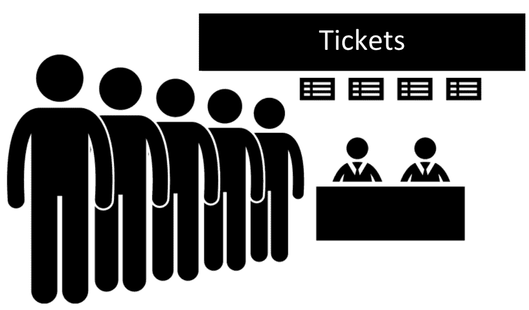
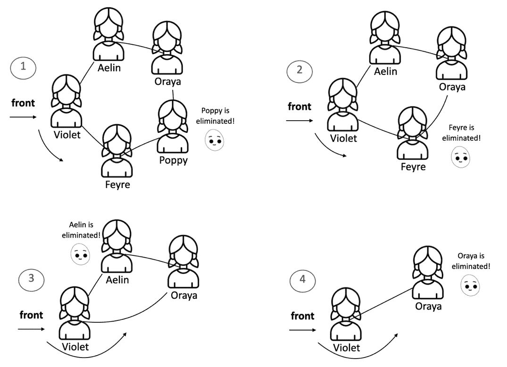

# 第六章：5 队列和双端队列

**开始之前：加入我们的 Discord 书籍社区**

直接向作者本人提供反馈，并在我们的 Discord 服务器上与其他早期读者聊天（在“EARLY ACCESS SUBSCRIPTION”下找到“learning-javascript-dsa-4e”频道）。


[`packt.link/EarlyAccess/`](https://packt.link/EarlyAccess/)

我们已经探讨了**栈**的内部工作原理，这是一种遵循*LIFO*（后进先出）原则的数据结构。现在，让我们将注意力转向**队列**，这是一种类似但不同的数据结构。虽然栈优先考虑最新的添加项，但队列基于*FIFO*（先进先出）原则，优先考虑最早的条目。我们将深入研究队列的机制，然后探索**双端队列**，这是一种多功能混合数据结构，结合了栈和队列的元素。到本章结束时，您将对这些基本数据结构和它们的实际应用有一个扎实的理解。

在本章中，我们将涵盖以下主题：

+   队列数据结构

+   双端队列数据结构

+   向队列和双端队列中添加元素

+   从队列和双端队列中移除元素

+   通过“热土豆”游戏模拟循环队列

+   使用双端队列检查一个短语是否是回文

+   我们可以使用队列和双端队列解决的问题

## 队列数据结构

在日常生活中，队列无处不在。想想买电影票的队伍、午餐时的自助餐厅队伍，或者杂货店的结账队伍。在这些场景中，基本原理是相同的：第一个加入队列的人将是第一个被服务的人。



图 5.1：现实生活中的排队示例：一群人排队购票

计算机科学中一个非常流行的例子是打印队列。假设我们需要打印五份文件。我们打开每一份文件并点击*打印*按钮。每一份文件都将被发送到打印队列。我们要求打印的第一份文件将会首先打印，以此类推，直到所有文件都打印完毕。

在数据结构的领域，队列是一个遵循*First In, First Out*（FIFO）原则的线性元素集合，通常被称为*先到先得*。新元素始终添加到队列的尾部（末尾），而元素的移除始终发生在队列的前部（开始）。

让我们通过使用 JavaScript 和 TypeScript 创建自己的 Queue 类来将这些概念付诸实践。

## 创建队列类

我们将创建自己的类来表示队列。本章的源代码可在 GitHub 上的 `src/05-queue-deque` 文件夹中找到。我们将首先创建 `queue.js` 文件，该文件将包含我们使用基于数组的策略表示栈的类。

> 在本书中，我们将采取渐进式的方法来构建我们对数据结构的理解。我们将利用我们在上一章中学到的概念，并在我们前进的过程中逐渐增加复杂性（因此请确保您不要跳过章节）。这种方法将使我们能够建立一个坚实的基础，并自信地处理更复杂的数据结构。

首先，我们将声明我们的`Queue`类：

```js
class Queue {
  #items = [];
  // other methods
}
```

我们需要一个数据结构来存储队列的元素。我们可以使用数组来完成这项工作，因为我们已经熟悉数组数据结构，并且在上一章中我们已经了解到，基于数组的方案比基于对象的方案更受欢迎。

再次强调，我们将变量`items`前缀为哈希`#`以表示此属性是私有的，并且只能在`Queue`类内部引用，因此，允许我们在元素插入和删除时遵循 FIFO 原则。

以下方法将在`Queue`类中可用：

+   `enqueue(item)`: 此方法将新项目添加到队列的末尾。

+   `dequeue()`: 此方法从队列的开始处移除第一个项目。它还返回被移除的项目。

+   `front()`: 此方法从队列的开始处返回第一个元素。队列不会被修改（它不会移除元素；它仅返回元素以供信息用途）。这就像`Stack`类中的`peek`方法。

+   `isEmpty()`: 此方法返回`true`，如果队列不包含任何元素，如果栈的大小大于 0 则返回`false`。

+   `clear()`: 此方法移除队列中的所有元素。

+   `size()`: 此方法返回队列包含的元素数量。

我们将在以下小节中为每个方法编写代码。

### 将元素入队到队列的末尾

我们将要实现的第一种方法是`enqueue`方法。此方法负责向队列中添加新元素，有一个特别重要的细节：我们只能将新项目添加到队列的末尾，如下所示：

```js
enqueue(item) {
  this.#items.push(item);
}
```

由于我们正在使用数组来存储队列的元素，我们可以使用 JavaScript `Array`类的`push`方法，该方法将新项目添加到数组的末尾。`enqueue`方法与`Stack`类中的`push`方法具有相同的实现；从代码的角度来看，我们只是在更改方法名称。

### 从队列的开始处出队元素

接下来，我们将实现`dequeue`方法。此方法负责从队列中移除项目。由于队列使用 FIFO 原则，队列开始处的项目（我们内部数组的索引 0）将被移除。因此，我们可以使用 JavaScript `Array`类的`shift`方法，如下所示：

```js
dequeue() {
  return this.#items.shift();
}
```

`Array`类的`shift`方法从数组中移除第一个元素并返回它。如果数组为空，则返回`undefined`，并且数组不会被修改。因此，这与队列的行为完美匹配。

`enqueue`方法的复杂度是常数时间（*O(1)*）。`dequeue`方法可以有线性时间复杂度（*O(n)*），因为我们使用`shift`方法来移除数组的第一个元素，在最坏的情况下，这可能导致*O(n)*的性能，因为剩余的元素需要向下移动。

### 查看队列前端的元素

接下来，我们将在我们的类中实现额外的辅助方法。如果我们想知道队列的前端元素是什么，我们可以使用`front`方法。此方法将返回位于我们内部数组索引 0 处的项目：

```js
front() {
  return this.#items[0];
}
```

### 验证它是否为空，获取大小和清空队列

我们将要创建的下一个方法是`isEmpty`方法、`size`获取器和`clear`方法。这三个方法与`Stack`类的实现完全相同：

```js
 isEmpty() {
    return this.#items.length === 0;
  }
  get size() {
    return this.#items.length;
  }
  clear() {
    this.#items = [];
  }
```

使用`isEmpty`方法，我们可以简单地验证内部数组的长度是否为 0。

对于大小，我们为队列的`size`创建了一个 getter，它只是内部数组的长度。

对于`clear`方法，我们可以简单地分配一个新的空数组来表示一个空队列。

最后，我们有`toString`方法，其代码与`Stack`类相同如下：

```js
toString() {
  if (this.isEmpty()) {
    return 'Empty Queue';
  } else {
    return this.#items.map(item => {
      if (typeof item === 'object' && item !== null) {
        return JSON.stringify(item);
      } else {
        return item.toString();
      }
    }).join(', ');
  }
}
```

### 将队列数据结构导出为库类

我们已经创建了一个名为`src/05-queue-deque/queue.js`的文件，其中包含我们的`Queue`类。我们希望在另一个文件中使用`Queue`类进行测试，以便于我们代码的易于维护（`src/05-queue-deque/01-using-queue-class.js`）。我们如何实现这一点？

我们在上一章也讨论了这个问题。我们将使用`CommonJS`模块的`module.exports`来导出我们的类：

```js
// queue.js
class Queue {
  // our Queue class implementation
}
module.exports = Queue;
```

### 使用队列类

现在是时候测试和使用我们的`Queue`类了！如前一小节所述，让我们创建一个单独的文件，这样我们就可以编写尽可能多的测试：`src/05-queue-deque/01-using-queue-class.js`。

我们需要做的第一件事是从`queue.js`文件中导入代码并实例化我们刚刚创建的`Queue`类：

```js
const Queue = require('./queue');
const queue = new Queue();
```

接下来，我们可以验证它是否为空（输出为`true`，因为我们还没有向我们的队列中添加任何元素）：

```js
 console.log(queue.isEmpty()); // true
```

接下来，让我们模拟一个打印机的队列。假设我们在电脑上打开了三个文档。然后我们点击每个文档中的打印按钮。这样做会将文档按打印按钮点击的顺序入队到队列中：

```js
queue.enqueue({ document: 'Chapter05.docx', pages: 20 });
queue.enqueue({ document: 'JavaScript.pdf', pages: 60 });
queue.enqueue({ document: 'TypeScript.pdf', pages: 80 });
```

如果我们调用`front`方法，它将返回文件`Chapter05.docx`，因为它是第一个被添加到队列中等待打印的文档：

```js
console.log(queue.front()); // { document: 'Chapter05.docx', pages: 20 }
```

让我们也检查队列的大小：

```js
 console.log(queue.size); // 3
```

现在，让我们通过出队直到队列为空来“打印”队列中的所有文档：

```js
// print all documents
while (!queue.isEmpty()) {
  console.log(queue.dequeue());
}
```

以下图显示了从队列中打印第一个文档时的出队操作：


图 5.2：打印机队列的模拟

### 检查我们队列类的效率

让我们通过考虑执行时间的大 O 符号来检查队列类中每个方法的效率：

| **方法** | **复杂度** | **说明** |
| --- | --- | --- |
| `enqueue` | *O(1)* | 将元素添加到数组的末尾通常是一个常数时间操作。 |
| `dequeue` | *O(n)* | 删除第一个元素需要将所有剩余元素进行移动，所需时间与队列的大小成比例。 |
| `front` | *O(1)* | 通过索引直接访问第一个元素是一个常数时间操作。 |
| `isEmpty` | *O(1)* | 检查数组的长度属性是一个常数时间操作。 |
| `size` | *O(1)* | 访问长度属性是一个常数时间操作。 |
| `clear` | *O(1)* | 使用空数组覆盖内部数组被认为是常数时间操作。 |
| `toString` | *O(n)* | 遍历元素，可能将它们转换为字符串，并将它们连接成一个字符串，所需时间与元素数量成比例。 |

表 5.1：

使用数组实现的队列中，出队操作通常是性能最敏感的操作。这是由于在删除第一个元素后需要移动元素。有其他队列实现方式（例如使用链表，我们将在下一章中介绍，或者使用**循环队列**），这些方式可以在大多数情况下将出队操作优化为常数时间复杂度。我们将在本章后面创建循环队列。

## 双端队列数据结构

**deque** 数据结构，也称为**双端队列**，是一种特殊的队列，允许我们从队列的末尾或前端插入和删除元素。

双端队列可以用来存储用户的网页浏览历史。当用户访问新页面时，它被添加到双端队列的前端。当用户导航回退时，最近的页面从前端被移除，而当用户导航前进时，页面被重新添加到前端。

另一个应用将是撤销/重做功能。我们在上一章中了解到我们可以使用两个栈来实现此功能，但我们也可以使用双端队列作为替代。用户操作被推入双端队列，撤销操作从队列前端弹出操作，而重做操作将它们推回。

## 创建 Deque 类

如同往常，我们将从声明位于文件 `src/05-queue-deque/deque.js` 中的 `Deque` 类开始：

```js
class Deque {
  #items = [];
}
```

我们将继续使用基于数组的实现来构建我们的数据结构。鉴于双端队列数据结构允许从两端插入和删除元素，我们将有以下方法：

+   `addFront(item)`: 此方法将新元素添加到双端队列的前端。

+   `addRear(item)`: 此方法将新元素添加到双端队列的后端。

+   `removeFront()`: 此方法从双端队列中移除第一个元素。

+   `removeRear()`: 此方法从双端队列中移除最后一个元素。

+   `peekFront()`: 此方法返回双端队列中的第一个元素。

+   `peekRear()`: 此方法返回双端队列中的最后一个元素。

> `Deque` 类还实现了 `isEmpty`、`clear`、`size` 和 `toString` 方法（你可以通过下载本书的源代码包来查看完整的源代码）。这些方法的代码与 `Queue` 类相同。

### 向双端队列中添加元素

让我们检查两种方法，这些方法将允许我们向双端队列的前端和后端添加元素：

```js
addFront(item) {
  this.#items.unshift(item);
}
addRear(item) {
  this.#items.push(item);
}
```

`addFront` 方法通过使用 `Array.unshift` 方法在内部数组的索引 0 处插入一个元素。

`addRear` 方法在双端队列的末尾插入一个元素。它的实现与 `Queue` 类的 `enqueue` 方法相同。

### 从双端队列中删除元素

从双端队列的前端和后端删除元素的方法如下所示：

```js
removeFront() {
  return this.#items.shift();
}
removeRear() {
  return this.#items.pop();
}
```

`removeFront` 方法移除并返回双端队列开头（前端）的元素。如果双端队列为空，则返回 `undefined`。它的实现与 `Queue` 类的 `dequeue` 方法相同。

`removeRear` 方法移除并返回双端队列末尾（后端）的元素。如果双端队列为空，则返回 `undefined`。它的实现与 `Stack` 类的 `pop` 方法相同。

### 查看双端队列的元素

最后，让我们检查以下 peek 方法：

```js
peekFront() {
  return this.#items[0];
}
peekRear() {
  return this.#items[this.#items.length - 1];
}
```

`peekFront` 方法允许你在不删除它的情况下查看双端队列开头（前端）的元素。它的实现与 `Queue` 类的 `peek` 方法相同。

`peekRear` 方法允许你在不删除它的情况下查看双端队列末尾（后端）的元素。它的实现与 `Stack` 类的 `peek` 方法相同。

> 注意双端队列方法实现与 `Stack` 和 `Queue` 类的相似性。我们可以认为双端队列数据结构是栈和队列数据结构的混合版本。请参考队列和栈效率回顾，以检查这些方法的时间复杂度。

### 使用 `Deque` 类

是时候测试我们的 `Deque` 类了（`src/05-queue-deque/03-using-deque-class.js`）。我们将在浏览器的 "*后退*" 和 "*前进*" 按钮功能场景中使用它。让我们看看如何使用我们的 `Deque` 类来实现这一点：

```js
const Deque = require('./deque');
class BrowserHistory {
  #history = new Deque(); // {1}
  #currentPage = null; // {2}
  visit(url) {
    this.#history.addFront(url); // {3}
    this.#currentPage = url; // {4}
  }
  goBack() {
    if (this.#history.size() > 1) { // {5}
      this.#history.removeFront();  // {6}
      this.#currentPage = this.#history.peekFront(); // {7}
    }
  }
  goForward() {
    if (this.#currentPage !== this.#history.peekBack()) { // {8}
      this.#history.addFront(this.#currentPage);  // {9}
      this.#currentPage = this.#history.removeFront(); // {10}
    }
  }
  get currentPage() { // returns the current page for information
    return this.#currentPage;
  }
}
```

以下是对其的解释：

+   创建一个名为 `history` 的 `Deque` 来存储已访问页面的 URL（`{1}`）。`currentPage` 变量跟踪当前显示的页面（`{2}`）。

+   `visit(url)` 方法将新的 `url` 添加到 `history` 双端队列的前端（`{3}`），并更新 `currentPage` 为新的 URL（`{4}`）。

+   `goBack()` 方法：

    +   检查 `history` 中是否有至少两个页面（当前和上一个 - `{5}`）。

    +   如果是这样，它将从历史双端队列的前端移除当前页面（`{6}`）。

    +   将`currentPage`更新为现在的前端元素，它代表上一页（`{7}`）。

+   `goForward()`方法：

    +   检查`currentPage`是否与历史双端队列的最后一个元素不同（意味着存在“下一页”- `{8}`）。

    +   如果是这样，将当前页面重新添加到历史双端队列的前端（`{9}`）。

    +   移除并设置`currentPage`为现在的前端元素，即“下一页”（`{10}`）。

在我们的浏览器模拟准备就绪后，我们可以使用它：

```js
const browser = new BrowserHistory();
browser.visit('loiane.com');
browser.visit('https://loiane.com/about'); // click on About menu
browser.goBack();
console.log(browser.currentPage); // loiane.com
browser.goForward();
console.log(browser.currentPage); // https://loiane.com/about
```

我们将模拟访问[`loiane.com`](https://loiane.com)，这是作者的博客。接下来，我们将访问“关于”页面，这样我们就可以将另一个 URL 添加到浏览器的历史记录中。然后，我们可以点击“后退”按钮回到主页。我们还可以点击“前进”按钮回到“关于”页面。当然，我们还可以查看当前页面或历史记录。以下图像展示了这个模拟：


图 5.3：浏览器后退和前进按钮的模拟

## 在 TypeScript 中创建 Queue 和 Deque 类

在完成 JavaScript 实现后，我们可以使用 TypeScript 重写我们的 Queue 和 Deque 类：

```js
// src/05-queue-deque/queue.ts
class Queue<T> {
  private items: T[] = [];
  enqueue(item: T): void {}
  // all other methods are the same as in JavaScript
}
export default Queue;
```

以及`Deque`类：

```js
// src/05-queue-deque/deque.ts
class Deque<T> {
  private items: T[] = [];
  addFront(item: T): void {}
  addRear(item: T): void {}
  // all other methods are the same as in JavaScript
}
export default Deque;
```

我们将使用泛型使我们的数据结构更加灵活，并使项目仅包含一种类型。方法内部的代码与 JavaScript 实现相同。

## 使用队列和双端队列解决问题

现在我们已经知道了如何使用`Queue`和`Deque`类，让我们用它们来解决一些计算机科学问题。在本节中，我们将介绍使用队列模拟*热土豆*游戏以及如何使用双端队列检查一个短语是否是*回文*。

### 循环队列：热土豆游戏

热土豆游戏是一个经典的儿童游戏，参与者围成一圈，在音乐播放时尽可能快地传递一个物体（“热土豆”）。当音乐停止时，持有土豆的人被淘汰。游戏继续进行，直到只剩下一个人。

#### CircularQueue 类

我们可以使用**循环队列**的实现完美地模拟这个游戏：

```js
class CircularQueue {
  #items = [];
  #capacity = 0; // {1}
  #front = 0; // {2}
  #rear = -1; // {3}
  #size = 0; // {4}
  constructor(capacity) { // {5}
    this.#items = new Array(capacity);
    this.#capacity = capacity;
  }
  get size() { return this.#size; }
}
```

循环队列是使用固定大小数组实现的队列，意味着一个预定义的容量（`{1}`），其中前端（`{2}`）和后端（`{3}`）指针可以在达到数组末尾时“环绕”到数组的开始。这有效地重用了数组空间，避免了不必要的调整大小。`front`指针初始化为 0，指向第一个元素的位置。`rear`指针初始化为-1，表示一个空队列。`size`属性（`{4}`）跟踪队列中的当前元素数量。

当我们创建循环队列时，我们需要告知我们计划存储多少个元素（`{5}`）。

让我们接下来回顾`enqueue`和`isFull`方法：

```js
enqueue(item) {
  if (this.isFull()) { // {6}
    throw new Error("Queue is full");
  }
  this.#rear = (this.#rear + 1) % this.#capacity; // {7}
  this.#items[this.#rear] = item; // {8}
  this.#size++; // {9}
}
isFull() { return this.#size === this.#capacity; }
```

在向队列添加任何元素之前，我们需要检查它是否未满，这意味着大小与容量相同（`{6}`）。由于容量固定，这使得循环队列在内存使用方面可预测，但这也可能被视为一种限制。

如果队列未满，我们将`rear`指针增加 1。这里的关键点是使用取模运算符（`%`）将`rear`回绕到 0，如果它达到数组的末尾（`{7}`）。然后我们在新的`rear`位置插入项，并增加大小计数器（`{9}`）。

最后，我们有`dequeue`和`isEmpty`方法：

```js
dequeue() {
  if (this.isEmpty()) { throw new Error("Queue is empty"); } // {10}
  const item = this.#items[this.#front]; // {11}
  this.#size--; // {12}
  if (this.isEmpty()) {
    this.#front = 0; // {13}
    this.#rear = -1; // {14}
  } else {
    this.#front = (this.#front + 1) % this.#capacity; // {15}
  }
  return item; // {16}
}
isEmpty() { return this.#size === 0;  }
```

要移除队列前端的项，首先需要检查队列大小（`{10}`）。如果队列不为空，我们可以检索当前存储在队列前端位置的项（`{11}`），以便稍后返回（`{16}`）。然后，我们减少大小计数器（`{12}`）。

如果出队后队列不为空，我们需要通过取模运算符（`{15}`）将`front`指针增加 1 并回绕。如果出队后队列为空，我们将`front`（`{13}`）和`rear`（`{14}`）指针重置为其初始值。

循环队列最大的优点是入队和出队操作通常都是*O(1)*（常数时间），这是由于直接操作指针。

#### 热土豆游戏模拟

新的类已经准备好使用，让我们将其应用于热土豆游戏的模拟：

```js
function hotPotato(players, numPasses) {
  const queue = new CircularQueue(players.length); // {1}
  for (const player of players) { // {2}
    queue.enqueue(player);
  }
  while (queue.size > 1) { // {3}
    for (let i = 0; i < numPasses; i++) { // {4}
      queue.enqueue(queue.dequeue()); // {5}
    }
    console.log(`${queue.dequeue()} is eliminated!`); // {6}
  }
  return queue.dequeue(); // {7} The winner
}
```

此函数接受一个玩家数组和一个表示“土豆”传递次数的数字`num`，在玩家被淘汰之前，它返回获胜者。

首先，我们创建一个包含玩家数量的循环队列（`{1}`），并将所有玩家入队（`{2}`）。

我们运行循环直到只剩下一个玩家（`{3}`）：

+   另一个循环将土豆通过出队然后重新入队的方式传递给同一个玩家`numPasses`次（`{4}`）。

+   前端的玩家被移除并宣布淘汰（`{6}`）。

最后剩下的玩家被出队并宣布为获胜者（`{7}`）。

我们可以使用以下代码来尝试`hotPotato`算法：

```js
const players = ["Violet", "Feyre", "Poppy", "Oraya", "Aelin"];
const winner = hotPotato(players, 7);
console.log(`The winner is: ${winner}!`);
```

算法的执行将产生以下输出：

```js
Poppy is eliminated!
Feyre is eliminated!
Aelin is eliminated!
Oraya is eliminated!
The winner is: Violet!
```

以下是对应的模拟图：



图 5.4：使用循环队列的热土豆游戏模拟

您可以使用`hotPotato`函数更改传递次数来模拟不同的场景。

### 回文检查器

以下是根据维基百科的定义的**回文**：

> *回文是一个单词、短语、数字或其他字符序列，它从后向前读与从前向后读相同，例如 madam 或 racecar。*

我们可以使用不同的算法来验证一个短语或字符串是否是回文。最简单的方法是将字符串反转并与原始字符串比较。如果两个字符串相等，那么我们有一个回文。我们也可以使用一个栈来做这件事，但使用数据结构解决此问题的最简单方法是使用双端队列：字符被添加到双端队列中，然后从两端同时移除。如果在整个过程中移除的字符匹配，则字符串是回文。

以下算法使用双端队列来解决这个问题：

```js
const Deque = require('./deque');
function isPalindrome(word) {
  if (word === undefined || word === null ||
     (typeof word === 'string' && word.length === 0)) { // {1}
    return false;
  }
  const deque = new Deque(); // {2}
  word = word.toLowerCase().replace(/\s/g, ''); // {3}
  for (let i = 0; i < word.length; i++) {
    deque.addRear(word[i]); // {4}
  }
  while (deque.size() > 1) { // {5}
    if (deque.removeFront() !== deque.removeRear()) { // {6}
      return false;
    }
  }
  return true;
}
```

在我们开始算法逻辑之前，我们需要验证传递给参数的字符串是否有效，包括边缘情况（`{1}`）。如果它无效，那么我们返回`false`，因为空字符串或不存在的单词不能被认为是回文。

我们将使用本章实现的`Deque`类（`{2}`）。由于我们可以接收包含小写和大写字母的字符串，我们将所有字母转换为小写，并且我们还将删除所有空格（`{3}`）。如果您愿意，您还可以删除所有特殊字符，例如!?-()等。为了使此算法简单，我们将跳过这部分。接下来，我们将字符串的所有字符入队到双端队列（`{4}`）。

当双端队列（`{5}` - 如果只剩下一个字符，它就是回文）中至少有两个元素时，我们将从前面和后面各移除一个元素（`{6}`）。为了成为回文，从双端队列中移除的两个字符需要匹配。如果字符不匹配，那么字符串就不是回文（`{7}`）。

我们可以使用以下代码来尝试`isPalindrome`算法：

```js
console.log(isPalindrome("racecar")); // Output: true
```

## 练习

我们将使用本章学到的概念解决**LeetCode**的一个练习。

### 无法吃午餐的学生数量

我们将解决的练习是可在[`leetcode.com/problems/number-of-students-unable-to-eat-lunch/`](https://leetcode.com/problems/number-of-students-unable-to-eat-lunch/)找到的*1700. 无法吃午餐的学生数量*问题。

当使用 JavaScript 或 TypeScript 解决问题时，我们将在`function countStudents(students: number[], sandwiches: number[]): number {}`函数内部添加我们的逻辑，该函数接收一个队列`students`，这些学生愿意吃 0 或 1 个三明治，以及一个三明治的堆，它们将具有相同的大小。

这是一个模拟练习，根据问题描述：

+   如果排在队首的学生喜欢栈顶的三明治，他们将取走它并离开队伍。

+   否则，他们将留下它并走到队伍的末尾。

+   这将继续，直到没有队列中的学生想要取走顶部的三明治，因此无法吃午餐。

解决这个问题的关键是将三明治的堆也视为一个队列（*FIFO*）而不是一个栈（*LIFO*）。

让我们编写`countStudents`函数：

```js
function countStudents(students: number[], sandwiches: number[]) {
    while (students.length > 0) { // {1}
      if (students[0] === sandwiches[0]) { // {2}
          students.shift(); // {3}
          sandwiches.shift(); // {4}
      } else {
          if (students.includes(sandwiches[0])) { // {5}
              let num = students.shift(); // {6}
              students.push(num); // {7}
          } else {
              break; // {8}
          }
      }
  }
  return students.length;
}
```

当队列为空时，while 循环会继续运行（`{1}`）。

如果第一个学生的偏好（`students[0]`）与（`{2}`）队列前部的三明治（顶部三明治 `sandwiches[0]`）相匹配，那么学生（`{3}`）和三明治（`{4}`）都会从各自队列的前端移除。

如果没有匹配，我们使用 JavaScript `Array` 类的 `includes` 方法检查潜在的匹配，看看队列中的任何学生是否愿意接受当前顶部的三明治（`{5}`）。如果有潜在的匹配，当前学生（`{6}`）会被移动到队列的末尾（`{7}`）。

如果队列中没有剩下想要当前三明治的人，循环会中断（`{8}`）。这表明剩余的学生将无法吃到三明治。

该函数返回 `students` 数组的长度。这个长度代表了仍然在队列中等待且未能得到他们喜欢三明治的学生数量。

这个解决方案通过了所有测试并解决了问题。`includes` 检查（`{5}`）对于效率很重要。如果没有它，代码会在没有任何学生想要顶部的三明治时无谓地旋转队列，因此我们得到了额外的分数，尽管这种方法并不是队列数据结构的标准做法。

该函数的时间复杂度和空间复杂度是 *O(n²)*，其中 *n* 是学生数量。这是因为外层循环会一直运行，直到没有学生为止，在最坏的情况下需要 *n* 次迭代。

在循环内部，有两个可能代价高昂的操作：`students.shift()`，其复杂度为 *O(n*)，以及 `students.includes(sandwiches[0])`，其复杂度也是 *O(n*)。由于这些操作嵌套在循环内部，总复杂度是 *O(n²)*。

空间复杂度是 *O(1)*，不包括输入数组所需的额外空间。这是因为该函数仅使用固定数量的额外空间来存储 `num` 变量。

> 你能想到一个更优化的方法来解决这个问题，可能不涉及队列数据结构吗？在技术面试中，考虑优化也很重要。尝试一下，你将在源代码中找到解决方案以及解释，包括 *2034. 买票所需时间* 问题解决方案。

## 摘要

在本章中，我们深入探讨了队列的基本概念及其多才多艺的表亲，双端队列（deque）。我们自行设计了一个队列算法，掌握了以先进先出（FIFO）的方式添加（入队）和移除（出队）元素的艺术。在探索双端队列时，我们发现其从两端插入和删除元素时的灵活性，这为创造性的解决方案提供了更多可能性。

为了巩固我们的理解，我们将知识应用于现实世界的场景。我们模拟了经典的“热土豆”游戏，利用循环队列来模拟其循环性质。此外，我们还创建了一个回文检查器，展示了双端队列在处理来自两个方向的数据时的强大功能。我们还解决了来自 LeetCode 的模拟挑战，强化了队列在问题解决中的实际应用。

现在，我们已牢固掌握了这些线性数据结构（数组、栈、队列和双端队列），我们准备进入下一章动态链表的世界，在那里我们将解锁更复杂的数据操作和管理潜力。
