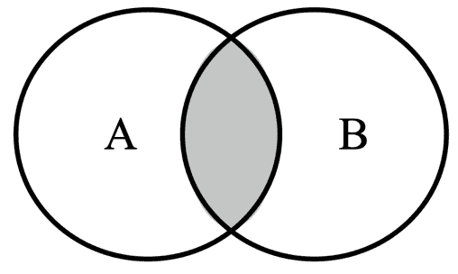

# 第八章：7 集合

**开始之前：加入我们的 Discord 书籍社区**

直接向作者本人提供反馈，并在我们的 Discord 服务器上与其他早期读者聊天（在“学习 JavaScript 数据结构与算法”第四版下的“EARLY ACCESS SUBSCRIPTION”中找到“learning-javascript-dsa-4e”频道）。


[`packt.link/EarlyAccess/`](https://packt.link/EarlyAccess/)

建立在您对顺序数据结构的了解之上，本章将带您进入独特的集合世界，这是一个只存储唯一值的集合。我们将介绍创建集合、添加或删除元素以及高效检查成员资格的基本原理。然后我们将发现如何利用集合的并集、交集和差集等数学运算的强大功能。为了使事情更加简单，我们将探索 JavaScript 的内置 `Set` 类，为您提供直接处理集合的便捷工具。因此，在本章中，我们将涵盖：

+   从零开始创建 Set 类

+   使用集合执行数学运算

+   JavaScript 原生 Set 类

+   练习

## 集合数据结构

**集合**是数学和计算机科学中的基本概念。它是一个无序的不同项（元素）的集合。把它想象成一个袋子，你可以往里放东西，但你放东西的顺序不重要，而且你不能有重复。

集合是数学和计算机科学中的基本概念，在各个领域的实际应用中有着众多的应用。

在我们深入计算机科学实现之前，先看看集合的数学概念。在数学中，集合是一组不同的对象。例如，我们有一个自然数集合，它由大于或等于 0 的整数组成——即 N = {0, 1, 2, 3, 4, 5, 6, ...}。集合中对象的列表被大括号 `{}` 包围。

还有空集的概念。没有元素的集合称为**空集**或**空集**。例如，24 和 29 之间的质数集合。由于在 24 和 29 之间没有质数（一个大于 1 的自然数，除了 1 和它本身没有其他正除数），该集合将是空的。我们将用 `{}` 来表示空集。

在数学中，集合也有一些基本操作，如并集、交集和差集。我们也将在这章中介绍这些操作。

在计算机科学中，例如，集合用于模拟数据之间的关系，并执行过滤、排序和搜索等操作。集合还可以从列表等其他集合中删除重复元素，非常有用。

您也可以想象集合为一个没有重复元素且没有顺序概念的数组。

## 创建 MySet 类

ECMAScript 2015 (ES6) 将原生的 `Set` 类引入 JavaScript，提供了一种内置且高效的方式来处理集合。然而，理解集合的底层实现对于掌握数据结构和算法至关重要。我们将深入了解创建我们自己的自定义 `MySet` 类，该类模仿原生 `Set` 的功能，但具有额外的功能，如并集、交集和差集操作。

我们的实现将位于 `src/07-set/set.js` 文件中。我们首先定义 `MySet` 类：

```js
class MySet {
  #items = {};
  #size = 0;
} 
```

我们选择名称 `MySet` 以避免与原生的 `Set` 类冲突。我们利用对象 (`{}`) 而不是数组来存储 `#items` 私有属性中的元素。该对象的键代表集合的唯一值，而相应的值可以是任何东西（我们将使用 true 作为简单的占位符）。这种选择利用了 JavaScript 对象不能有重复键的事实，自然地强制集合元素的唯一性。虽然也可以使用数组，但它们需要额外的逻辑来防止重复，并且在某些情况下可能会稍微慢一些。在其他语言中，这种数据结构（使用类似哈希表的方法）通常被称为 **哈希集**。我们还将使用 `size` 属性跟踪集合中的元素数量。

接下来，我们需要声明集合可用的方法：

`MySet` 类将提供以下方法：

+   `add(value)`: 向集合添加一个唯一的值。

+   `delete(value)`: 如果存在，则从集合中移除该值。

+   `has(value)`: 如果元素存在于集合中，则返回 true，否则返回 false。

+   `clear()`: 从集合中移除所有值。

+   `size()`: 返回集合包含的值的数量。

+   `values()`: 返回集合中所有值的数组。

+   `union(otherSet)`: 合并两个集合。

+   `intersection(otherSet)`: 查找两个集合之间的公共元素。

+   `difference(otherSet)`: 查找仅存在于一个集合中的元素。

我们将在以下章节中详细实现这些方法。

### 在集合中查找值

我们在自定义 `MySet` 类中首先实现的方法是 `has(value)`。这个方法在添加和移除元素等其他操作中扮演着至关重要的基础角色。它允许我们有效地确定给定值是否已经存在于集合中。以下是实现方法：

```js
has(value) {
  return this.#items.hasOwnProperty(value);
}
```

该方法直接利用 JavaScript 内置的 `hasOwnProperty` 函数在内部 `#items` 对象上。这是一种高度优化的方式来检查特定键（表示值）是否存在于对象中。

`hasOwnProperty` 方法在平均情况下提供常数时间复杂度 (*O(1)*)，这使得它成为检查集合中存在性的极快方式。这种效率是我们经常在 JavaScript 中使用对象而不是数组来实现集合的关键原因。

现在我们有了这个方法，我们可以继续实现添加和移除值的方法的实现。

### 向集合添加值

接下来，我们将在自定义的`MySet`类中实现`add`方法。这个方法负责将新元素插入到集合中，但只有当它尚未存在时（保持集合的唯一性属性）如下所示：

```js
add(value) {
  if (!this.has(value)) {
    this.#items[value] = true; // mark the value as present
    this.#size++;
    return true;
  }
  return false;
}
```

我们首先使用我们之前实现的`has(value)`方法高效地检查值是否已经存在于集合中。如果值不存在，我们将其插入到`#items`对象中。我们使用`value`本身作为键，并给它分配一个值为`true`的值。这作为一个简单的标志，表示该值是集合的一部分。插入成功后，我们将`#size`属性增加以准确反映集合中新的元素数量。

我们返回`true`以表示值已成功添加（它不在集合中）。否则，我们返回`false`以指示值没有被添加，因为它是一个重复项。

### 移除和清除所有值

接下来，我们将实现`delete`方法，如下所示：

```js
delete(value) {
  if (this.has(value)) {
    delete this.#items[value];
    this.#size--;
    return true;
  }
  return false;
}
```

我们首先使用之前实现的`has(value)`方法检查指定的值是否存在于集合中。这确保我们只尝试删除存在的元素。如果找到值，我们使用`delete`运算符从`#items`对象中删除相应的键值对。这直接从集合的内部存储中删除了元素。删除成功后，我们将`#size`属性减少以保持集合中元素数量的准确计数。

我们返回`true`以表示值已成功从集合中删除，并返回`false`以表示值未在集合中找到，因此无法删除。

如果我们想从集合中移除所有元素，可以使用`clear`方法，如下所示：

```js
clear() {
  this.#items = {};
  this.#size = 0;
}
```

我们通过直接将`#items`对象重新分配给一个新的空对象`{}`来实现集合的完全清除。这有效地丢弃了所有之前的关键值对（代表集合的元素），并为未来的添加创建了一个全新的空容器。我们还把`#size`属性重置为 0，以准确反映集合现在不包含任何元素。

这种实现方式非常高效，因为重新分配`#items`对象是一个常数时间操作（*O(1)*）。逐个迭代并删除每个元素的方法会慢得多，尤其是对于大型集合。除非我们有特定的原因需要在清除操作期间跟踪被移除的元素，否则通常不推荐这样做。

### 获取大小并检查是否为空

我们接下来要实现的方法是大小方法（技术上是一个获取器方法），如下所示：

```js
 get size() {
    return this.#size;
  }
```

此方法简单地返回我们用来计数的`size`属性。

如果我们没有跟踪`#size`属性，我们可以通过以下方式确定集合的大小：

1.  遍历`#items`对象的键（元素）。

1.  为遇到的每个键增加计数器。

下面是这个替代方法的代码：

```js
getSizeWithoutSizeProperty() {
  let count = 0;
  for (const key in this.#items) {
    if (this.#items.hasOwnProperty(key)) {
      count++;
    }
  }
  return count;
}
```

代码使用 `for...in` 循环遍历 `#items` 对象中的键（即集合的值）。在循环内部，使用 `hasOwnProperty` 确保我们只计算属于对象本身的属性（而不是从原型链继承的属性）。

这种方法对于大型集合来说效率较低，因为它需要遍历所有元素，导致时间复杂度为 *O(n)*，其中 *n* 是集合中元素的数量。

为了确定 `MySet` 是否为空，我们实现了 `isEmpty()` 方法，遵循与其他数据结构一致的模板：

```js
isEmpty() {
  return this.#size === 0;
}
```

此方法直接比较私有 `#size` 属性与 0。属性 `#size` 被精心维护，始终反映集合中的元素数量。

### 检索所有值

为了检索包含 `MySet` 中所有元素（值）的数组，我们可以如下实现 `values` 方法：

```js
values() {
  return Object.keys(this.#items);
}
```

我们可以利用内置的 `Object.keys()` 方法来实现简洁的代码。这个内置的 JavaScript 方法接受一个对象（在我们的例子中，是 `this.#items`），并返回一个包含所有可枚举属性键的字符串数组。记住，在我们的 `MySet` 实现中，我们使用 `#items` 对象的键来存储实际添加到集合中的值。

现在我们已经完成了自定义 `MySet` 数据结构的实现，让我们来看看如何将其付诸实践！

### 使用 MySet 类

我们将深入探讨一些实际例子，展示 `MySet` 的实用性和灵活性，演示它如何高效地管理唯一元素集合。想象一下，我们正在构建一个博客或内容管理系统，用户可以为他们的文章或帖子添加标签（关键词）。我们希望确保每篇文章都有一个唯一标签列表，没有重复。

此示例的源代码可以在文件 src/07-set/01-using-myset-class.js 中找到。让我们首先定义文章：

```js
const MySet = require('./set');
const article = {
  title: 'The importance of data structures in programming',
  content: '...',
  tags: new MySet()  // using MySet to store tags
};
```

现在，让我们为我们的文章添加一些标签：

```js
article.tags.add('programming');
article.tags.add('data structures');
article.tags.add('algorithms');
article.tags.add('programming');
```

注意，第一个和最后一个标签是重复的。我们可以确认集合中有三个标签，这意味着没有重复：

```js
console.log(article.tags.size);  // 3
```

我们还可以使用 `has` 方法来再次确认哪些标签是文章的一部分：

```js
console.log(article.tags.has('data structures'));  // true
console.log(article.tags.has('algorithms'));  // true
console.log(article.tags.has('programming'));  // true
console.log(article.tags.has('javascript'));  // false
```

我们还可以使用 `values` 方法来检索所有标签：

```js
console.log(article.tags.values()); 
// output: ['programming', 'data structures', 'algorithms']
```

现在，假设我们想要移除标签编程并添加标签 JavaScript：

```js
article.tags.delete('programming');
article.tags.add('JavaScript');
console.log(article.tags.values()); 
// output: ['data structures', 'algorithms', 'JavaScript']
```

因此，现在我们有一个与 ECMAScript 2015 中的 Set 类非常相似的实现。但我们可以通过添加一些基本操作来增强我们的实现，例如并集、交集和差集。

## 使用集合执行数学运算

集合是数学中的一个基本概念，在计算机科学中有着广泛的应用，尤其是在数据库领域。数据库是无数应用程序的骨架，集合在它们的设计和运行中起着至关重要的作用。

当我们构建查询以从关系型数据库（如 Oracle、Microsoft SQL Server、MySQL 等）检索数据时，我们实际上是在使用集合符号来定义所需的结果。数据库反过来返回一组符合我们标准的数据。

SQL 查询允许我们指定我们想要检索的数据范围。我们可以选择表中的所有记录，或者我们可以根据某些条件缩小搜索范围到特定的子集。此外，SQL 利用集合操作来执行各种类型的数据操作。SQL 中的*连接*概念在本质上基于集合操作。以下是一些常见的例子：

+   **并集**：将两个或多个表中的数据合并，创建一个包含所有唯一行的新的集合。

+   **交集**：识别多个表中共同存在的行，结果是一个只包含共享数据的集合。

+   **差异**（除法/减法）：找出存在于一个表中但不存在于另一个表中的行，从第一个表中创建一个包含唯一行的集合。

除了 SQL 中使用的操作之外，还有其他重要的集合操作，例如：

+   **子集**：确定一个集合是否完全包含在另一个集合中。这有助于建立集合之间的关系，并且对于各种逻辑和分析任务可能很有用。

理解集合及其操作对于处理数据库和其他数据密集型应用至关重要。有效地操作集合的能力使我们能够有效地从复杂的数据集中提取、过滤和分析信息。让我们看看我们如何使用我们的`MySet`类来模拟这些操作。

### 并集：合并两个集合

两个集合 A 和 B 的并集是一个新集合，它包含来自两个集合的所有唯一元素。这就像将两个包的内容合并到一个更大的包中，确保不放入任何重复的元素。

例如，假设我们有两个集合：A 和 B 如下所示：

+   集合 A = {1, 2, 3}

+   集合 B = {3, 4, 5}

+   A ∪ B = {1, 2, 3, 4, 5}

在这个例子中，值 3 同时出现在两个集合中，但在结果的并集集合中只包含一次，因为集合不能包含重复的元素。

集合 A 和 B 的并集用符号∪表示。因此，A 和 B 的并集在数学表示法中写作 A ∪ B。以下图表展示了并集操作：


两个集合的并集操作，突出显示两个集合的所有区域

现在，让我们用以下代码在我们的`MySet`类中实现并集方法：

```js
union(otherSet) {
  const unionSet = new MySet();
  this.values().forEach(value => unionSet.add(value));
  otherSet.values().forEach(value => unionSet.add(value));
  return unionSet;
}
```

要执行两个集合的并集，我们需要三个步骤：

1.  创建一个新的空集合：这将是一个用于存储并集结果的集合。

1.  遍历第一个集合：将第一个集合中的每个元素添加到新集合中。

1.  遍历第二个集合：将第二个集合中的每个元素添加到新集合中。

在执行添加操作时，它将评估值是否重复，从而得到一个包含原始集合中所有唯一元素的新集合。

> 重要的是要注意，我们在本章中实现的并集、交集和差集方法不会修改当前的 `MySet` 类实例，也不会修改作为参数传递的 `otherSet`。没有副作用的方法或函数被称为**纯函数**。纯函数不会修改当前实例或参数；它只产生一个新的结果。

让我们看看这个方法是如何工作的。假设一个在线广告平台想要根据用户的兴趣进行定位，这些兴趣来自各种来源（例如：访问的网站和社交媒体活动）。为了能够发起活动，我们需要：

1.  收集来自不同来源的兴趣关键词集合。

1.  计算这些集合的并集，以获得一个全面的用户兴趣列表。

1.  使用这个组合集合来匹配相关广告的用户。

以下代码将代表这个逻辑。让我们首先收集来自网站的兴趣：

```js
const interestsFromWebsites = new MySet();
interestsFromWebsites.addAll(['technology', 'politics', 'photography']);
```

接下来，让我们收集来自社交媒体的兴趣：

```js
const interestsFromSocialMedia = new MySet();
interestsFromSocialMedia.addAll(['technology', 'movies', 'books']);
```

使用这两个来源，我们可以计算它们的并集，得到一个包含所有兴趣的列表：

```js
const allInterests = interestsFromWebsites.union(interestsFromSocialMedia);
console.log(allInterests.values()); 
// output: ['technology', 'politics', 'photography', 'movies', 'books']
```

现在我们可以尝试发起一个成功的活动！

为了方便我们的示例，我们还可以创建一个新的方法，它将接受一个值数组作为输入：

```js
addAll(values) {
  values.forEach(value => this.add(value));
}
```

这个方法将逐个添加每个元素，这样我们可以在下一个示例中节省一些时间。

### 交集：识别两个集合中的共同值

两个集合 A 和 B 的交集是一个新集合，它只包含两个集合共有的元素。将其视为寻找两个袋子内容的重叠部分。

例如，考虑我们有两个集合：A 和 B，如下所示：

+   集合 A = {1, 2, 3, 4}

+   集合 B = {3, 4, 5, 6}

+   A ∩ B = {3, 4}

在这个例子中，值 3 和 4 同时存在于两个集合中，因此它们被包含在结果交集集合中。

集合 A 和 B 的交集用符号 ∩ 表示。因此，A 和 B 的交集写作 A ∩ B。以下图表展示了交集操作：



两个集合的交集操作，仅突出显示中间部分，这是两个集合的共享区域

现在，让我们用以下代码在 `MySet` 类中实现交集方法：

```js
intersection(otherSet) {
  const intersectionSet = new MySet();
  this.values().forEach(value => {
    if (otherSet.has(value)) {
      intersectionSet.add(value);
    }
  });
  return intersectionSet;
}
```

要执行两个集合的交集，我们需要三个步骤：

1.  创建一个新的空集合：这将是一个用于存储交集结果的集合。

1.  遍历第一个集合：对于第一个集合中的每个元素，检查它是否也存在于第二个集合中。

1.  条件添加：如果元素在两个集合中都找到，则将其添加到新集合中。

让我们看看这个方法在实际中的应用。假设一个招聘平台想要根据求职者的技能来匹配职位发布。为了这个实现，我们需要以下逻辑：

1.  将求职者的技能和职位所需的技能表示为集合。

1.  找出这些集合的交集，以确定求职者拥有的技能和职位所需的技能。

1.  根据交集的大小对职位发布进行排名，以显示对求职者最相关的职位。

以下将代表此逻辑的代码。首先，我们将定义可用的职位发布：

```js
const job1Skills = new MySet();
job1Skills.addAll(['JavaScript', 'Angular', 'Java', 'SQL']);
const job2Skills = new MySet();
job2Skills.addAll(['Python', 'Machine Learning', 'SQL', 'Statistics']);
const jobPostings =
 [{
      title: 'Software Engineer',
      skills: job1Skills
  },
  {
      title: 'Data Scientist',
      skills: job2Skills
  }];
```

`jobPostings` 变量是一个包含职位对象的数组，每个对象都有一个 `title` 和一个名为 `skills` 的 `MySet`，其中包含该职位的所需技能。

接下来，我们将定义具有名字和技能的求职者：

```js
const candidateSkills = new MySet();
candidateSkills.addAll(['JavaScript', 'Angular', 'TypeScript', 'AWS']);
const candidate = {
  name: 'Loiane',
  skills: candidateSkills
};
```

`candidate` 是一个对象，代表一个求职者，包含一个名字和一个名为 `skills` 的 `MySet`，其中包含他们的技能。

然后，我们可以创建一个函数，该函数将计算求职者和可用的职位发布之间的最佳潜在匹配：

```js
function matchCandidateWithJobs(candidate, jobPostings) {
  const matches = [];
  for (const job of jobPostings) {
      const matchingSkillsSet = candidate.skills.intersection(job.skills);
      if (!matchingSkillsSet.isEmpty()) {
          matches.push({
              title: job.title,
              matchingSkills: matchingSkillsSet.values()
          });
      }
  }
  return matches;
}
```

下面是 `matchCandidateWithJobs` 函数的解释：

+   将 `candidate` 和 `jobPostings` 作为输入。

+   初始化一个空数组 `matches` 来存储匹配的职位。

+   遍历 `jobPostings` 数组中的每个职位。

+   对于每个职位，它计算求职者技能和职位所需技能的交集。

+   如果交集集合不为空（意味着存在匹配的技能），则将职位标题和匹配的技能（作为一个数组）添加到 `matches` 数组中。

+   最后，我们返回包含职位标题及其与求职者匹配的技能的 `matches` 数组。

将所有这些放在一起：

```js
const matchingJobs = matchCandidateWithJobs(candidate, jobPostings);
console.log(matchingJobs);
// output: [{ title: 'Software Engineer', matchingSkills: [ 'JavaScript', 'Angular' ] }]
```

我们得到的结果是，对于这个求职者来说，最佳职位发布将是软件工程师职位，因为求职者还拥有 JavaScript 和 Angular 技能。

我们创建的交集逻辑工作得很好，然而，我们可以进行一些改进。

#### 改进交集逻辑

考虑以下场景：

+   集合 A 包含以下值：{1, 2, 3, 4, 5, 6, 7}

+   集合 B 包含以下值：{4, 6}

在我们最初的交集方法中，我们会遍历集合 A 的所有七个元素，并检查它们是否存在于集合 B 中。然而，存在一种更有效的方法。

我们可以通过遍历两个集合中较小的一个来优化交集方法。当其中一个集合明显小于另一个集合时，这显著减少了所需的迭代和比较次数。优化后的代码如下所示：

```js
intersection(otherSet) {
  const intersectionSet = new MySet();
  const [smallerSet, largerSet] = this.size <= otherSet.size ? [this, otherSet] : [otherSet, this];
  smallerSet.values().forEach(value => {
    if (largerSet.has(value)) {
      intersectionSet.add(value);
    }
  });
  return intersectionSet;
}
```

我们使用简洁的三元表达式来确定哪个集合元素较少：`this.size <= otherSet.size ? [this, otherSet] : [otherSet, this]`。这会将较小的集合分配给 `smallerSet`，较大的集合分配给 `largerSet`。然后，我们遍历 `smallerSet` 的 `values()`。这立即将循环迭代次数减少到较小集合的大小。

在一个集合远小于另一个集合的情况下，这种优化显著减少了迭代和比较的次数，从而提高了执行时间。特别是对于集合大小差异大的场景，交集操作的整体性能得到了提升。

### 两个集合之间的差集

两个集合 A 和 B 之间的差集（表示为 A - B 或 A \ B），是一个包含 A 中所有不在 B 中的元素的新集合。换句话说，它是集合 A 中独特的元素集合。

例如，考虑我们有两个集合：A 和 B，如下所示：

+   集合 A = {1, 2, 3, 4}

+   集合 B = {3, 4, 5, 6}

+   A - B = {1, 2}

+   B - A = {5, 6}

在这个例子中，A - B 的结果是集合 {1, 2}，因为这些元素在 A 中但不在 B 中。同样，B - A 的结果是 {5, 6}。

集合 A 和 B 的差集表示为：

+   A - B（有时读作 *A 减去 B*）

+   A \ B

以下图表展示了 A - B 的差集操作：


两个集合 A - B 的差集操作，突出显示 A 中不与 B 共同的部分

现在，让我们用以下代码在我们的 `MySet` 类中实现差集方法：

```js
difference(otherSet) {
  const differenceSet = new MySet();
  this.values().forEach(value => {
    if (!otherSet.has(value)) {
      differenceSet.add(value);
    }
  });
  return differenceSet;
}
```

要执行两个集合的差集，我们需要三个步骤：

1.  创建一个新的空集合：这将保存差集的结果。

1.  遍历第一个集合：对于第一个集合中的每个元素，检查它是否存在于第二个集合中。

1.  条件添加：如果元素在第二个集合中未找到，则将其添加到新集合中。

让我们看看实际操作。假设我们正在运行一个在线商店，有一份接收促销电子邮件的订阅者列表。我们已经根据他们的兴趣（书籍、时尚、技术）对订阅者进行了细分。我们想要发送关于书籍的目标电子邮件活动，但我们希望排除已经对这些书籍表示过兴趣的订阅者。

因此，让我们首先声明我们在这个场景中需要的所有集合：

```js
const allSubscribers = new MySet();
allSubscribers.addAll(['Aelin', 'Rowan', 'Xaden', 'Poppy', 'Violet']);
const booksInterested = new MySet();
booksInterested.addAll(['Aelin', 'Poppy', 'Violet']);
const alreadyPurchasedBooks = new MySet();
alreadyPurchasedBooks.addAll(['Poppy']);
```

我们有三个集合：

+   `allSubscribers`：所有电子邮件订阅者的集合。

+   `booksInterested`：一组表示对书籍感兴趣的用户。

+   `alreadyPurchasedBooks`：一组已经购买书籍的用户。

接下来，我们将找到对书籍感兴趣但尚未购买的订阅者：

```js
const targetSubscribers = booksInterested.difference(alreadyPurchasedBooks);
```

我们使用 `booksInterested.difference(alreadyPurchasedBooks)` 来找到对书籍感兴趣但尚未在该类别中购买的订阅者。这给我们带来了 `targetSubscribers` 集合。

最后，我们将向目标订阅者发送电子邮件：

```js
targetSubscribers.values().forEach(subscriber => {
  sendEmail(subscriber, 'New books you will love!');
});
function sendEmail(subscriber, message) {
  console.log(`Sending email to ${subscriber}: ${message}`);
}
```

我们将得到的输出是：

```js
Sending email to Aelin: New books you will love!
Sending email to Violet: New books you will love!
```

我们只剩下一个最后操作要覆盖：子集

### 子集：检查一个集合是否包含所有值

如果集合 A 的每个元素也是集合 B 的元素，则集合 A 是集合 B 的子集。用更简单的话说，A 完全包含在 B 内。

例如，考虑我们有两个集合：A 和 B，如下所示：

+   集合 A = {1, 2}

+   集合 B = {1, 2, 3, 4}

+   A ⊆ B

在这个例子中，A 是 B 的子集，因为 A 中的每个元素也在 B 中。

子集关系用符号⊆表示。所以，如果 A 是 B 的子集，我们写成：A ⊆ B。以下图表展示了子集关系：


A 是 B 的子集，因为 A 中的元素也在 B 中

现在，让我们用以下代码在`MySet`类中实现`isSubsetOf`方法：

```js
isSubsetOf(otherSet) {
  if (this.size > otherSet.size) {
    return false;
  }
  return this.values().every(value => otherSet.has(value));
}
```

我们首先检查当前集合的大小（`this.size`）是否大于`otherSet`的大小。如果是这样，我们立即知道当前集合不能是`otherSet`的子集，因为子集不能比它所组成的集合有更多的元素。在这种情况下，方法提前返回`false`，节省了不必要的进一步检查。

如果大小检查通过，我们调用`this.values()`来获取当前集合中所有值的数组。然后，我们在这个数组上使用`every()`方法来检查另一个集合是否有当前集合中的值。如果当前集合中的每个值都在`otherSet`中找到，那么`every()`方法返回`true`（意味着当前集合是一个子集）。如果当前集合中的任何一个值在`otherSet`中没有找到，`every()`返回`false`（意味着它不是子集）。

让我们看看这个操作的实际效果。想象一下，我们正在开发一个拥有大量食谱数据库的食谱应用。每个食谱都有一组食材。用户可以根据他们拥有的食材来筛选食谱。

我们首先声明存储我们食谱食材的集合：

```js
const chickenIngredients = new MySet()
chickenIngredients.addAll(['chicken', 'tomato', 'onion', 'garlic', 'ginger', 'spices']);
const spaghettiIngredients = new MySet();
spaghettiIngredients.addAll(['spaghetti', 'eggs', 'bacon', 'parmesan', 'pepper']);
```

接下来，我们将声明食谱及其食材：

```js
const recipes =
[{
      name: 'Chicken Tikka Masala',
      ingredients: chickenIngredients
  },
  {
      name: 'Spaghetti Carbonara',
      ingredients: spaghettiIngredients
  }];
```

`recipes`变量是一个食谱对象的数组，每个对象都有一个名称和一个名为`ingredients`的`MySet`，表示该食谱所需的食材。

然后，我们还需要一个包含我们有可用食材的列表的集合：

```js
const userIngredients = new MySet();
userIngredients.addAll(['chicken', 'onion', 'garlic', 'ginger']);
```

下一步将是检查我们是否有匹配我们食材的食谱的逻辑：

```js
function filterRecipes(recipes, userIngredients) {
  const filteredRecipes = [];
  for (const recipe of recipes) {
      if (userIngredients.isSubsetOf(recipe.ingredients)) {
          filteredRecipes.push({ name: recipe.name });
      }
  }
  return filteredRecipes;
}
```

这里是`filterRecipes`函数的解释：

+   接收`recipes`和`userIngredients`作为输入。

+   初始化一个空的数组`filteredRecipes`来存储匹配的食谱名称。

+   遍历`recipes`数组中的每个食谱。

+   对于每个食谱，它检查`recipe.ingredients.isSubsetOf(userIngredients)`。如果为`true`（意味着食谱的所有食材都在用户的食材中），则将食谱的名称添加到`filteredRecipes`。

+   返回`filteredRecipes`数组。

最后，将所有这些放在一起：

```js
const matchingRecipes = filterRecipes(recipes, userIngredients);
console.log(matchingRecipes);
```

我们将得到以下输出：

```js
[ { name: 'Chicken Tikka Masala' } ]
```

> 我们还可以实现`isSupersetOf`方法，该方法将检查当前集合 A 是否是另一个集合 B 的超集，如果 B 中的每个元素也是 A 的元素。用更简单的术语来说，B 完全包含在 A 中。尝试一下，你可以在下载本书源代码时在`MySet`类中找到源代码。

现在我们已经向`MySet`类添加了一些额外的逻辑，让我们来看看原生的 JavaScript Set 类是如何工作的。

## JavaScript Set 类

让我们深入了解 ECMAScript 2015（ES6）中引入的原生 Set 类，并探讨如何有效地使用它。

Set 类提供了在 JavaScript 中处理集合的内置、高效方式。它提供了所有基本集合操作，并针对性能进行了优化。

现在，让我们看看原生 Set 类中可用的方法和功能：

+   两个构造函数：

    +   `new Set()`: 创建一个空的 Set。

    +   `new Set(iterable)`: 从可迭代对象（例如，数组）创建一个 Set。

+   `add(value)`: 向集合中添加一个值（如果它尚未存在）。返回 Set 对象本身以实现链式调用。

+   `delete(value)`: 从集合中删除指定的值。如果值存在并已删除，则返回 `true`，否则返回 `false`。

+   `clear()`: 从集合中删除所有元素。

+   `has(value)`: 如果值存在于集合中，则返回 `true`，否则返回 `false`。

+   遍历集合的不同方法：

    +   `forEach(callbackFn)`: 对集合中的每个值执行提供的 `callbackFn`。

    +   `values()`: 返回集合值的迭代器。

    +   `keys()`: `values()` 的别名。

    +   `entries()`: 返回一个遍历 `[value, value]` 对的迭代器（因为在 Set 中键和值是相同的）。

+   `size`: 返回集合中元素数量的属性。

如果我们想要重写文章及其标签的示例，我们可以简单地用 `Set` 替换 `MySet`，代码仍然可以按以下方式工作：

```js
const article = {
  title: 'The importance of data structures in programming',
  content: '...',
  tags: new Set() 
};
article.tags.add('programming');
article.tags.add('data structures');
article.tags.add('algorithms');
article.tags.add('programming');
```

由于 Set 类还有一个接受数组的构造函数，我们可以简化之前的代码，并将标签直接传递给构造函数：

```js
const article = {
  title: 'The importance of data structures in programming',
  content: '...',
  tags: new Set(['programming', 'data structures', 'algorithms'])
};
```

其他方法，如删除、检查大小、存在和值，也会按预期工作。

构建我们的自定义 `MySet` 类是一个有价值的练习，它让我们深入了解集合数据结构的内部工作和机制。虽然在日常 JavaScript 开发中，我们可能会使用高效且方便的内建 Set 类，但通过实现自己的集合所获得的知识使我们能够理解底层原理，在内置和自定义解决方案之间做出明智的选择，并更有效地解决与集合相关的问题。

## 检查集合的效率

让我们通过查看每个方法的 Big O 符号来回顾其执行时间效率：

| **方法** | **MySet** | **Set** | **说明** |
| --- | --- | --- | --- |
| `add(value)` | *O(1)* | *O(1)* | 将值插入到对象或底层数据结构中具有恒定时间的操作。 |
| `addAll(values)` | *O(n)* | *O(n)* | 对输入数组中的每个值调用 `add(value)`，其中 *n* 是数组的大小。 |
| `delete(value)` | *O(1)* | *O(1)* | 从对象或底层数据结构中删除具有恒定时间的操作。 |
| `has(value)` | *O(1)* | *O(1)* | 在两种情况下，对象查找都具有恒定时间 |
| `values()` | *O(n)* | *O(n)* | 在 `MySet` 中，它遍历对象的键。在 `Set` 中，它创建一个迭代器，以线性时间产生每个值。 |
| `size (getter)` | *O(1)* | *O(1)* | 返回 `#size` 属性或原生的 Set 中的等效值。 |
| `isEmpty()` | *O(1)* | *O(1)* | 检查 `#size` 是否为 0。 |
| `values()` | *O(n)* | *O(n)* | 在 `MySet` 中，它遍历对象的键。在 `Set` 中，它创建一个迭代器，以线性时间产生每个值。 |
| `clear()` | *O(1)* | *O(1)* | 将 `#items` 对象重新赋值为空对象，并重置 `#size`。 |

集合的整体空间复杂度被认为是 O(n)，其中 n 是集合中存储的唯一元素的数量。这意味着集合数据结构使用的内存与其包含的元素数量成线性增长。

回顾时间复杂度，向集合中添加、删除值以及检查值是否存在都具有常数时间。有人可能会问，为什么我们总是使用集合而不是数组或列表？虽然集合在特定任务上表现出色，但也有一些原因说明为什么我们不会总是选择它们而不是数组或列表：

+   如果元素的顺序至关重要，数组是最佳选择。集合不保证元素的任何特定顺序。

+   如果我们经常需要通过位置访问元素（例如，获取列表中的第三个元素），数组由于直接索引而要快得多。集合需要迭代来查找特定元素。

+   如果数据自然包含重复项，并且这些重复项是有意义的，那么数组是更合适的选择。

让我们将我们的知识运用到一些练习中。

## 练习

我们将使用集合数据结构解决来自 **LeetCode** 的一个练习，以从数组中删除重复值。

### 从排序数组中删除重复项

我们将要解决的练习是位于 [`leetcode.com/problems/remove-duplicates-from-sorted-array/description/`](https://leetcode.com/problems/remove-duplicates-from-sorted-array/description/) 的 *26\. 删除排序数组中的重复项* 问题。

当使用 JavaScript 或 TypeScript 解决问题时，我们需要在 `function removeDuplicates(nums: number[]): number` 函数内部添加我们的逻辑，该函数接收一个数字数组并期望返回数组中的唯一元素数量。为了使我们的解决方案被接受，我们还需要在原地从 `nums` 数组中删除重复项，这意味着我们不能简单地为其分配一个新的引用。

让我们使用集合数据结构来编写 `removeDuplicates` 函数，以便轻松地从数组中删除重复项：

```js
export function removeDuplicates2(nums: number[]): number {
  const set = new Set(nums);
  const arr = Array.from(set);
  for (let i = 0; i < arr.length; i++) {
    nums[i] = arr[i];
  }
  return arr.length;
}
```

这里是解决方案的解释：

我们首先创建一个新的 JavaScript Set 对象，并用输入数组 `nums` 的值初始化它。集合自动存储唯一值，因此 `nums` 中的任何重复项都会被消除。

接下来，我们将集合转换回一个常规数组 `arr`。这个新数组只包含从原始 `nums` 数组中提取的唯一元素，并按顺序排列。这一步是必要的，因为我们不能直接访问集合中的每个值，就像访问 `array[i]` 一样。

for 循环遍历`arr`（唯一元素）数组，并将每个元素复制回原始的`nums`数组，覆盖任何现有的重复值。由于`arr`的长度保证不会超过`nums`，我们只需要遍历到`arr`的长度。这一步是必需的，因为问题评判者也会检查`nums`数组是否被就地修改。

最后，该方法返回`arr.length`，即原始数组中的唯一元素个数。这是 LeetCode 问题的预期输出。

这个函数的时间复杂度是*O(n)*，其中*n*是数组`nums`中的值数。我们创建集合，添加所有元素（*O(n)*），然后将集合转换为数组（*O(n)*），还有一个循环来覆盖原始数组（*O(k)*，其中*k*是唯一元素的个数）。因此，整体时间复杂度是*O(n)*，因为它受创建集合并将其转换为数组的线性时间操作的支配。

空间复杂度是*O(k)*，因为我们创建了一个集合来存储唯一元素。在最坏的情况下，即所有元素都是唯一的，它将存储所有*n*个元素。然而，在大多数情况下，*k*（唯一元素的个数）将小于*n*。我们还有一个只存储唯一元素的数组`arr`，所以其大小是*k*。因此，整体空间复杂度是*O(k)*，其中*k*是输入数组中唯一元素的个数。

虽然算法是正确的并且解决了问题，但它并不是最*空间高效*的解决方案。我们将在本书的后面部分使用不同的技术解决相同的问题。在此期间，请尝试使用*O(1)*空间复杂度解决这个问题。

## 摘要

在本章中，我们通过实现自定义的`MySet`类深入探讨了集合数据结构的内部工作原理。这种动手方法反映了 ECMAScript 2015 中引入的 Set 类的核心功能，使你对集合在底层如何操作有了更深入的理解。我们还扩展了我们的探索，通过实现并集、交集、差集和子集等额外方法，丰富了你在处理集合时的工具箱。

为了将我们新获得的知识付诸实践，我们解决了一个真实的 LeetCode 问题，展示了集合在解决算法挑战中的力量。

在下一章中，我们将把重点转向非顺序数据结构，特别是哈希和字典。准备好发现这些多才多艺的结构如何通过键值对实现高效的数据存储和检索！
