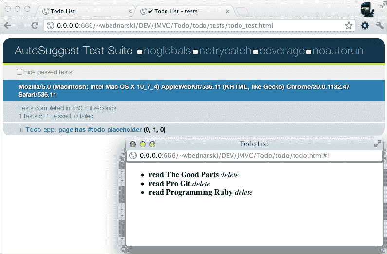

# 第三章。FuncUnit

**FuncUnit** 是一个具有类似 jQuery 语法的功能测试框架。它建立在 **QUnit** 单元测试框架之上。

使用 FuncUnit，我们可以在 OS X、GNU/Linux 或 Windows 下的所有现代网络浏览器中运行测试。

编写测试非常简单快捷，尤其是如果读者熟悉 jQuery 语法和/或 QUnit 框架。

FuncUnit 允许我们在网络浏览器中运行测试，同时将其与自动化工具（如 Selenium）集成，或使用包装器（如 PhantomJS）从命令行运行测试。

FuncUnit 可以与构建工具集成，例如 Maven，作为构建过程的一部分运行。它还可以与持续集成工具集成，例如 Jenkins。有关 FuncUnit 的更多信息，可以在以下网址找到：

+   **文档**：[`javascriptmvc.com/docs.html#!FuncUnit`](http://javascriptmvc.com/docs.html#!FuncUnit)

+   **源代码**：[`github.com/bitovi/funcunit`](https://github.com/bitovi/funcunit)

+   **QUnit**：[`docs.jquery.com/QUnit`](http://docs.jquery.com/QUnit)

根据维基百科，功能测试被定义为如下：

> *功能测试是一种黑盒测试，其测试用例基于正在测试的软件组件的规范。通过提供输入并检查输出来测试函数，很少考虑内部程序结构。*

在本章中，我们将概述 FuncUnit 功能测试框架，创建测试，并将它们运行在我们的 `Todo` 应用程序上。

### 注意

**单元测试与功能测试**

单元测试测试单个类似单元的方法或函数，而功能测试通过产品用户界面测试整个功能。

# 创建测试

创建测试是编写运行针对应用程序代码的代码，以确保代码符合其设计和预期行为。编写测试可以在早期开发阶段发现错误，从而节省时间。

让我们为 `Todo` 应用程序添加第一个测试：

1.  在 `Todo/todo` 文件夹中，创建一个名为 `tests` 的文件夹。在其内部，创建一个名为 `todo_test.html` 的文件，包含以下内容：

    ```js
    <!doctype html>

    <html>
      <head>
     <title>Todo List - tests</title>
        <meta charset="UTF-8" />
        <link rel="stylesheet" href="../../funcunit/qunit/qunit.css" />
      </head>
      <body>
        <h1 id="qunit-header">AutoSuggest Test Suite</h1>

        <h2 id="qunit-banner"></h2>

        <div id="qunit-testrunner-toolbar"></div>
        <h2 id="qunit-userAgent"></h2>
        <ol id="qunit-tests"></ol>
     <script src="img/todo_test.js"></script>	
      </body>
    </html>
    ```

    此文件提供了一个页面骨架，其中包含 FuncUnit 输出，对于所有未来的测试用例都保持不变——将其用作模板；只有标题和测试文件的路径会更改（高亮代码）。

1.  接下来，创建一个包含以下内容的 `todo_test.js` 文件：

    ```js
    steal(
      'funcunit',
      function ($) {

        module('Todo app', {
          setup: function () {
            S.open('//todo/todo.html');
          }
        });

        test('page has #todos placeholder', function () {
          ok(S('body > #todos').size(), 'The #todo is child of the body');
        });
      }
    );
    ```

## 模块

模块签名由 `module(name, [lifecycle]);` 提供。

模块方法来自 QUnit 项目，它提供了将测试划分为模块的功能。

第一个参数是一个包含模块名称的字符串。第二个参数是一个包含两个可能方法的对象，`setup` 和 `teardown`。`setup` 回调方法在每个测试之前运行，而 `teardown` 在模块中的每个测试之后运行。

### 打开

`open(path, [success], [timeout])` 提供了一个开放签名。

在我们的示例中，我们使用了 `open` 方法来打开给定的 URL 并对其运行测试 `'page has #todos placeholder'`。

## 测试

测试签名由 `test(name, [expected], test)` 提供。

此方法运行实际的测试代码。

第一个参数是测试的名称，而第二个是实际运行代码所必需的。

### Ok

一个好的签名由 `ok(state, [message])` 提供。

`ok` 方法是一个布尔断言。如果第一个参数评估为真，则测试通过。第二个参数是可选的，它描述了测试。

### S

`S` 主要是 jQuery 短路 `$` 的副本，通过 FuncUnit 特定方法进行了扩展。

# 运行测试

运行测试的方法有很多。使用网络浏览器，命令行工具将在测试执行完成后打开并关闭浏览器。我们还可以使用独立的 JavaScript 环境运行测试。

## 网络浏览器

禁用弹出窗口阻止程序，并在浏览器中打开 `tests/todo_test.html`。测试将打开 `Todo` 应用程序并对其运行测试用例。之后，你应该能够看到以下截图类似的内容：



## Selenium

从 `Todo` 应用程序目录中运行以下命令：

```js
$ ./js funcunit/run selenium todo/tests/todo_test.html
```

此命令将打开 Firefox，运行与网络浏览器示例中完全相同的测试，关闭浏览器，并在命令行上打印结果。

## PhantomJS

使用 PhantomJS 运行测试是一个更快的解决方案，因为它不会启动网络浏览器。

执行以下命令以运行测试：

```js
$ ./js funcunit/run phantomjs todo/tests/todo_test.html
```

此前命令将在 PhantomJS 环境中运行测试，因此它不会像上一个案例那样打开任何网络浏览器。但是，它将在 WebKit 包装器内运行测试。

命令行输出应类似于以下内容：

```js
Opening file:///Users/wbednarski/Sites/DEV/JMVC/Todo/todo/tests/todo_test.html
starting steal.browser.phantomjs
steal.js INFO: Opening //todo/todo.html
steal.js INFO: using a dynamic fixture for GET /todos
steal.js INFO: ajax request to todos.ejs, no fixture found
steal.js INFO: ajax request to todos.ejs, no fixture found
default route

Todo app
 page has #todos placeholder
  [x] The #todo is child of the body

Time: 3 seconds, Memory: 81.06 MB

OK (1 tests, 0 assertions)
```

## EnvJS

运行测试的另一种方式是使用用 JavaScript 编写的 EnvJS 模拟浏览器环境。

EnvJS 只能用于运行单元测试，因为它没有准确实现事件模拟。

通过执行以下命令来运行测试：

```js
$ ./js funcunit/run envjs todo/tests/todo_test.html

```

# 集成

集成是可能的，可以使用流行的构建或 CI 工具，如 Jenkins 或 Maven：

+   **Jenkins**: [`javascriptmvc.com/docs.html#!funcunit.jenkins`](http://javascriptmvc.com/docs.html#!funcunit.jenkins)

+   **Maven**: [`javascriptmvc.com/docs.html#!funcunit.maven`](http://javascriptmvc.com/docs.html#!funcunit.maven)

# 摘要

如我们所见，FuncUnit 是一个易于使用且功能强大的测试框架。

编写测试用例既快又简单。能够在多种方式下运行它们以及与自动化和构建工具集成，使 FuncUnit 成为一个可靠的工具。

现在，我们没有借口不编写测试了。
