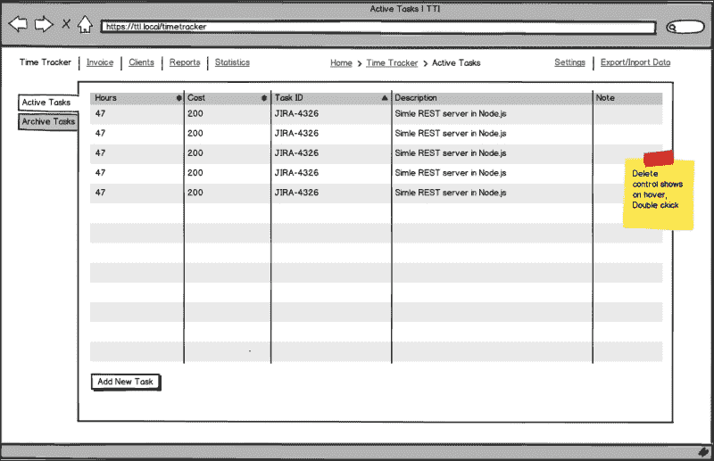
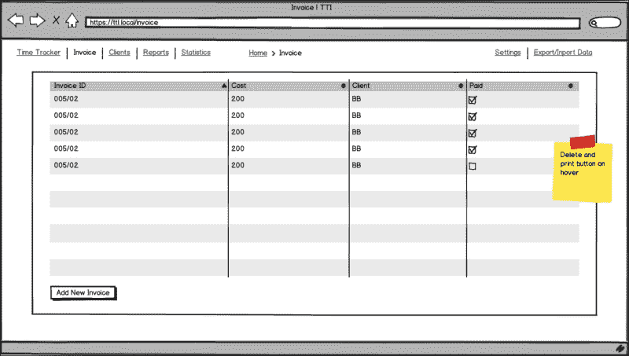
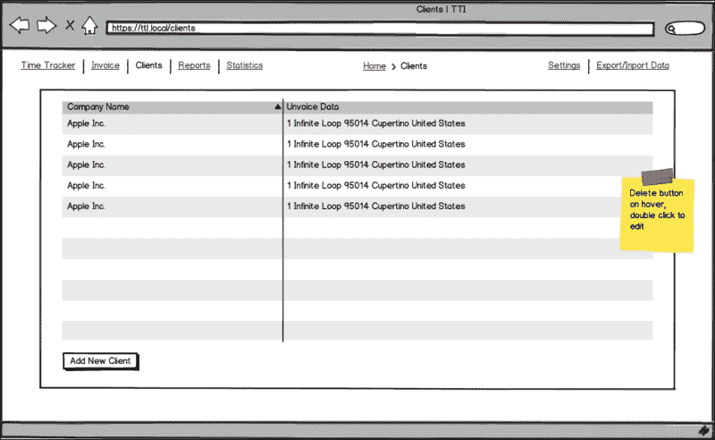

# 第六章：构建应用程序

在过去的几章中，我们学习了什么是 JavaScriptMVC，如何安装它，并了解了其组件。

现在是任何开发者最激动人心的章节。我们将构建一个真实世界的应用程序。由于本书的范围限制，我们不会编写后端 API 设置服务器等，而是将使用浏览器存储。

由于 JavaScriptMVC 中的层分离，这可以通过更改模型中的代码轻松完成，将应用程序持久层从浏览器存储选项切换到任何后端语言、框架或系统，例如 Sinatra、Ruby on Rails、Django 和 Node.js。

本章的目标是展示如何从概念到设计、实现、文档和测试构建一个真实世界的应用程序。我们将开发一个真正有用的应用程序，对读者有帮助，并且可以轻松定制以满足读者的需求。

# 自由职业者的时间跟踪和开票

本章我们将构建的应用程序称为自由职业者的时间跟踪和开票；让我们简称它为 TTI。

应用开发将从这里开始。我们不会编写完整的代码库，因为这会太大，无法在这里容纳。这就像一个家庭作业练习，当学生在大学开始写应用程序并在家里完成它们时。要有创意！

## 规划

好的，所以我们将编写一个应用程序。现在是我们回答最重要的问题的时候了：*我们的应用程序将要解决什么问题？*

我们可以清楚地识别出两个主要的应用程序领域：

+   跟踪我们在任务上花费的时间

+   制作发票

让我们把应用程序的主要区域分解成一个功能列表，如下所示：

+   客户列表

+   时间跟踪器

    +   跟踪时间

    +   固定成本任务

+   报告

    +   每日

    +   每周

+   统计数据

    +   每月

    +   每年

+   开票

+   导出和导入数据

一个功能列表将帮助我们制定开发计划。现在我们可以考虑完成每个功能所需的时间。我们可以只用日历来写下我们的估计，或者使用许多免费的问题跟踪工具之一，例如[`trello.com/`](https://trello.com/)或[`trac.edgewall.org/`](http://trac.edgewall.org/)。

理想解决方案是使用一种方法，如 Scrum—[`en.wikipedia.org/wiki/Scrum_(development)`](http://en.wikipedia.org/wiki/Scrum_(development))或商业中最优秀的任务跟踪工具之一，JIRA—[`en.wikipedia.org/wiki/JIRA`](http://en.wikipedia.org/wiki/JIRA)。

## 准备线框

下一步是准备应用程序线框。这是应用程序开发周期中的一个非常重要的步骤。它允许我们快速绘制不同页面的应用程序界面，以及非常快速地重新设计页面，并在未来的开发中节省时间。一旦我们开始编写代码，任何更改都将比更改线框更困难且成本效益更低。

下一步是创建原型和线框。然而，我们这里没有图形设计师，也没有客户来展示业务逻辑，最终这超出了本书的范围，所以我们直接进入下一步。

**线框**通常是应用程序中使用的组件的基本草图，用于展示用户界面和应用程序功能。

**原型**是线框的下一级，基本上包含了线框上所有我们能找到的内容，但它们是在实际设计中。

**原型**是半功能性的应用程序，用于展示业务逻辑。

我们可以使用一张纸和一支铅笔来创建线框；很多人更喜欢这种方式。有许多不同的软件可以帮助我们在这一步。我将使用 Balsamiq Mockups，但实际上任何工具都适用。

为了更好地了解 TTI 应用程序，让我们看看线框：

由于本书的定位是纵向而网页浏览器的定位是横向，因此要求读者从不同的角度查看以下线框。

下面的线框显示了时间追踪器的主要页面。

主要菜单位于左上角，允许我们在主要应用程序功能之间切换。

面包屑导航位于顶部中央，允许我们轻松地指示我们当前在应用程序的哪个部分。

**设置**和**导出/导入数据**标签位于右上角。

**时间追踪器**位于中心位置，有两个主要标签：**活动任务**和**存档任务**。每个任务都有字段：**小时数**、**成本**、**任务 ID**、**描述**和**备注**。**添加新任务**按钮位于底部，允许我们添加新任务。当鼠标悬停在任务上时，**存档**按钮可见。要编辑任务，请双击它。时间追踪器页面的 URL 是`/timetracker`。



下面的线框显示了发票的主要页面。URL 是`/invoice`：



下面的线框显示了客户端的主要页面。URL 是`/clients`。



## 设置项目

我们假设读者已经安装了网络服务器，例如 Apache 或 Nginx。在服务器工作目录中，我们需要创建`TTI`文件夹。另一个选项是使用专门为本书创建并由 Vagrant 提供的环境，可在[`github.com/wbednarski/JavaScriptMVC_kick-starter`](https://github.com/wbednarski/JavaScriptMVC_kick-starter)找到。

在这个文件夹中，我们将初始化 Git 仓库以跟踪所有更改，安装 JavaScriptMVC，并创建应用程序结构。

### 在 VCS 下跟踪更改

从一开始就保持所有项目文件在版本控制系统下是一个好主意。这样做的原因非常简单，并且对未来的开发有益——我们可以轻松地回滚任何更改并跟踪它们。

使用去中心化的 VCS 比集中式 VCS 具有无价的优点，因为我们可以在不推送的情况下提交更改，因此即使在代码库中进行小的更改后，我们也可以频繁提交。另一个好的做法是使用一个分支来处理一个特性。

在这本书中我们将使用 Git，但实际上任何**分布式版本控制系统**（**DVCS**）都是好的。Mercurial 是另一个流行的 DVCS。

创建新的 Git 仓库、添加所有文件并提交它们的以下步骤应该执行：

1.  在`TTI`目录下，输入以下命令安装 JavaScriptMVC：

    ```js
    $ git init
    $ git submodule add git://github.com/jupiterjs/steal.git
    $ git submodule add git://github.com/jupiterjs/documentjs.git
    $ git submodule add git://github.com/jupiterjs/funcunit.git
    $ git submodule add git://github.com/jupiterjs/jquerymx.git jquery

    ```

1.  使用以下命令安装和更新 JavaScriptMVC 子模块：

    ```js
    $ git submodule init
    $ git submodule update

    ```

1.  使用以下命令安装 Syn：

    ```js
    $ cd funcunit
    $ git submodule init
    $ git submodule update

    ```

1.  将`js`命令移动到项目的根目录（从根目录运行）：

    ```js
    $ ./steal/js steal/make.js

    ```

    默认情况下，所有仓库都在 master 分支上。让我们切换到 JavaScriptMVC 的最新版本，本书编写时为 3.2.2。

1.  在所有子模块目录中，输入以下命令：

    ```js
    $ git checkout v3.2.2

    ```

1.  在`TTI`目录下创建我们的应用程序目录`tti`并将其添加到 Git 中。

    ```js
    $ mkdir tti
    $ git add .
    $ git commit -m "initial commit"

    ```

### 注意

如果读者希望将代码库副本保留在服务器上，他们可以使用[`github.com`](https://github.com)或[`bitbucket.org`](https://bitbucket.org)提供的免费代码托管解决方案来完成此操作。

我们将要开发的全部代码都将放置在`tti`文件夹中。

### 应用程序结构

我们的应用程序结构将类似于以下层次结构：

```js
TTI/
   |
   |tti/
   |   |controllers/
   |   |
   |   |docs/
   |   |
   |   |models/
   |   |
   |   |tests/
   |   |     |unit/
   |   |     |    |models/
   |   |     | 
   |   |     |functional/
   |   |
   |   |views/
   |         |styles/
   |         |      |css/
   |         |      |
   |         |      |sass/
   |         |
   |         |templates/
   |                   |tasks
   |                   |
   |                   |clients
   |
   |vendors/
           |jquery_ui/
           |
           |pouchdb/
```

## IndexedDB

由于本地存储对我们应用程序来说太简单，而 Web SQL 数据库已被弃用，因此自然的选择是 IndexedDB。

在根级别创建`vendors`目录以存储所有第三方代码、插件等。

下载并将 PouchDB 复制到`vendors`目录库，该库为 IndexedDB 提供了良好的跨浏览器 API。您可以从以下位置下载 PouchDB：

+   [`pouchdb.com`](http://pouchdb.com)

+   [`github.com/daleharvey/pouchdb`](https://github.com/daleharvey/pouchdb)

## 创建模型

让我们在`models`目录下创建一个`task.js`文件。在`Task`模型中，我们将保留所有与任务相关的 CRUD 方法，这些方法在本地数据库上操作。

```js
steal(
    'jquery/model',
    'vendors/pouchdb.js',

    function ($) {
        'use strict'

        // local variable to keep reference to time-tracker database
        var db;

        /**
         * @class TTI.Models.Task
         * @parent index
         * @constructor
         * @author Wojciech Bednarski
         */
        $.Model('TTI.Models.Task', {

                /**
                 * @function init
                 * @hide
                 * Creates database time-tracker or get it if exists
                 */
                init: function () {
                    Pouch('idb://time-tracker', function (err, timeTracker) {
                        db = timeTracker;

                        console.log('TTI.Models.Task.init() | idb://time-tracker | err:', err, 'db:', db);
                    })
                },
```

`init`方法负责创建一个`time-tracker`数据库或获取其引用（如果它已存在）。`idb://`协议告诉 PouchDB 使用`IndexedDB`作为存储选项。

```js
                /**
                 * @function findAll
                 * Get all tasks
                 * @return {Object} an object contains objects with all tasks
                 *
                 * ### Example:
                 * @codestart
                 * TTI.Models.Task.findAll(function (tasks) {
                 *      // do something with tasks
                 * },
                 * function (error) {
                 *      // handle error here
                 * });
                 * task.save(function (task) {
                 *     console.log(task);
                 * });
                 * @codeend
                 */
                findAll: function (success, error) {
                    return db.allDocs(
                        {
                            include_docs: true // this is needed to return not only task ID but task it self
                        },
                        function (err, response) {
                            console.log('TTI.Models.Task.findAll() | GET | err:', err, 'client:', response);

                            if (response) {
                                success(response);
                            }
                            else if (err) {
                                error(err);
                            }
                        }
                    );
                },
```

`findAll`方法负责从我们的数据库中检索包含所有条目的对象。读者可以查看前述代码列表中的注释中的示例用法。

```js
                /**
                 * @function findOne
                 * Find task by given ID
                 * @param {String} task ID
                 * Task object
                 * @codestart
                 * String (UUID)
                 * @codeend
                 *
                 * @return {Object} an object contains requested task
                 * @codestart
                 * {
                 *     id: String (UUID),
                 *     hours: Number,
                 *     cost: {
                 *          rate: Number,
                 *          total: Number
                 *     },
                 *     taskID: String,
                 *     description: String,
                 *     note: String
                 * }
                 * @codeend
                 *
                 * ### Example:
                 * @codestart
                 * TTI.Models.Task.findOne('UUID', function (success, error) {
                 *      // code goes here
                 * });
                 * @codeend
                 */
                findOne: function (id, success, error) {
                    return db.get(id, function (err, doc) {

                        if (doc) {
                            success(doc);
                        }
                        else if (err) {
                            error(err);
                        }

                    });
                },
```

`findOne`方法负责从我们的数据库中检索具有特定条目的对象。读者可以查看前述代码列表中的注释中的示例用法。

```js
                /**
                 * @function create
                 * Create new task
                 * @param {Object} task
                 * Task object
                 * @codestart
                 * {
                 *     hours: Number,
                 *     cost: {
                 *          rate: Number,
                 *          total: Number
                 *     },
                 *     taskID: String,
                 *     description: String,
                 *     note: String
                 * }
                 *
                 * {
                 *      hours: 7,
                 *      cost: {
                 *          rate: 100,
                 *          total: 700
                 *      },
                 *      taskID: 'JIRA-2789',
                 *      description: 'Implement new awesome feature!',
                 *      note: ''
                 *  }
                 * @codeend
                 *
                 * @return {Object} an object contains newly created task UUID
                 * @codestart
                 * {
                 *      id: "8D812FF6-4B96-4D73-8D18-01FACEF33531"
                 *      ok: true
                 *      rev: "1-c5a4055b6c3edac099083cc0b485d4e3"
                 * }
                 * @codeend
                 *
                 * ### Example:
                 * @codestart
                 * var task = new TTI.Models.Task({ task object goes here });
                 * task.save(function (task) {
                 *     console.log(task);
                 * });
                 * @codeend
                 */
                create: function (task, success, error) {
                    return db.post(task, function (err, response) {
                        console.log('TTI.Models.Task.create() | POST | err:', err, 'client:', response);

                        if (response) {
                            success(response);
                        }
                        else if (err) {
                            error(err);
                        }
                    });
                },
```

`create`方法负责在我们的数据库中创建一个新的条目。读者可以查看前述代码列表中的注释中的示例用法。

```js
                /**
                 * @function update
                 * Update task by given ID
                 * @param {Object} task
                 * Task object
                 * @codestart
                 * {
                 *      _id: String (UUID),
                 *      hours: Number,
                 *      cost: {
                 *          rate: Number,
                 *          total: Number
                 *      },
                 *      taskID: String,
                 *      description: String,
                 *      note: String
                 * }
                 * @codeend
                 *
                 * @return {Object} an object contains updated task UUID
                 * @codestart
                 * {
                 *      id: "8D812FF6-4B96-4D73-8D18-01FACEF33531"
                 *      ok: true
                 *      rev: "1-c5a4055b6c3edac099083cc0b485d4e3"
                 * }
                 * @codeend
                 *
                 * ### Example:
                 * @codestart
                 * TTI.Models.Task.update({ task object goes here });
                 * @codeend
                 */
                update: function (task, success, error) {
                    return db.put(task, function (err, response) {
                        console.log('TTI.Models.Task.update() | POST | err:', err, 'client:', response);

                        if (response) {
                            success(response);
                        }
                        else if (err) {
                            error(err);
                        }
                    });
                },
```

`update` 方法负责更新数据库中的特定项。读者可以查看前面代码列表中的注释中的示例用法。

```js
                /**
                 * @function destroy
                 * Destroy task by given ID
                 * @param {Object} task
                 * Task object
                 * @codestart
                 * String (UUID)
                 * @codeend
                 *
                 * @return {Object} an object contains destroyed task UUID
                 * @codestart
                 * {
                 *      id: "8D812FF6-4B96-4D73-8D18-01FACEF33531"
                 *      ok: true
                 *      rev: "1-c5a4055b6c3edac099083cc0b485d4e3"
                 * }
                 * @codeend
                 *
                 * ### Example:
                 * @codestart
                 * TTI.Models.Task.destroy('UUID', function (success, getError, removeError) {
                 *      // handle errors here
                 * });
                 * @codeend
                 */
                destroy: function (id, success, getError, removeError) {
                    return db.get(id, function (getErr, doc) {

                        if (getErr) {
                            getError(getErr);
                        }

                        db.remove(doc, function (removeErr, response) {

                            if (response) {
                                success(response);
                            }
                            else if (removeErr) {
                                removeError(removeErr);
                            }

                        });
                    });
                }
            },
            {

            }
        );

    }
);
```

这个 `destroy` 方法负责销毁数据库中的特定项。读者可以查看前面代码列表中的注释中的示例用法。

让我们在 `models` 目录下创建一个名为 `client.js` 的文件。在 `Client` 模型中，我们将保留所有与任务相关的 CRUD 方法，这些方法在本地数据库上操作。创建一个引导文件：

```js
steal(
    'jquery/model',

    function ($) {
        'use strict';

        $.Model('TTI.Models.Client', {
                init: function () {
                    // create database clients or get it if exists.

                    console.log('TTI.Models.Client.init() | idb://clients | err:');

                },

                findAll: function () {

                },

                findOne: function () {

                },

                create: function () {

                },

                update: function () {

                },

                destroy: function () {

                }
            },
            {

            }
        );
    }
);
```

## 创建控制器

让我们在 `controllers` 目录下创建一个 `tasks.js` 文件，以便我们可以处理所有应用程序操作。

```js
steal(
    'jquery/view/ejs',
    'jquery/controller',
    'tti/models/task.js'
).then(
    function ($) {
        'use strict';

        console.log('TTI.Controllers.Tasks');

        /**
         * @class TTI.Controllers.Tasks
         * Creates a new Tasks controller
         * @parent index
         * @constructor
         * @param {String} DOMElement DOM element
         * @return {Object}
         */
        $.Controller('TTI.Controllers.Tasks', {
            'init': function (element, options) {
                var self = this;

                $('title').text('Time Tracker | TTI');

                TTI.Models.Task.findAll(function (data) {
                    if (!data.rows.length) {
                        data.rows = [
                            {
                                doc: {
                                    hours: '',
                                    cost: {
                                        total: ''
                                    },
                                    taskID: '',
                                    description: 'No tasks so far!',
                                    note: ''

                                }
                            }
                        ];
                    }

                    self.element.html('tti/views/templates/tasks/tasks.ejs', data.rows);

                });

            },

            '{TTI.Models.Task} created': function (Task, e, task) {
                console.log('task', task);
                console.log('this.element', this.element);
                $('tbody tr:last', this.element).after('tti/views/templates/tasks/task.ejs', task);
                $('tbody tr:last', this.element).effect('highlight', {}, 3000);
            },

            '{TTI.Models.Task} destroyed': function (Task, e, task) {
                task.elements(this.element).remove();
            },

            '.add-task click': function () {
                this.element.append('tti/views/templates/tasks/add_task.ejs', {}).find('.create-new-task-dialog-form').dialog({
                    autoOpen: false,
                    modal:    true,
                    buttons:  {
                        'Create New Task': function () {
                            var self = this;

                            window.task = new TTI.Models.Task({
                                hours: $('input[name="hours"]', this).val(),
                                taskID: $('input[name="task-id"]', this).val(),
                                cost: {
                                    rate: 0,
                                    total: 0
                                },
                                description: $('input[name="description"]', this).val(),
                                note: $('input[name="note"]', this).val()
                            });

                            window.task.save(function () {
                                $(self).dialog('destroy').remove();
                            });

                        },
                        Cancel: function () {
                            $(this).dialog('destroy').remove();
                        }
                    },
                    close: function () {
                        $(this).dialog('destroy').remove();
                    }
                }).dialog('open');

            }

        });

    }
);
```

让我们在 `controllers` 目录下创建一个 `clients.js` 文件。

```js
steal(
    'jquery/view/ejs',
    'jquery/controller'
).then(
    function ($) {
        'use strict';

        console.log('TTI.Controllers.Client');

        /**
         * @class TTI.Controllers.Client
         * Creates a new Tasks controller
         * @parent index
         * @constructor
         * @param {String} DOMElement DOM element
         * @return {Object}
         */
        $.Controller('TTI.Controllers.Client', {
            'init': function () {

                $('title').text('Clients | TTI');

                var testData = [
                    {
                        name: 'The First Awesome Client!'
                    },
                    {
                        name: 'The Second Awesome Client!'
                    }
                ];

                this.element.html('tti/views/templates/clients.ejs', testData);

            }

        });

    }
);
```

让我们在 `controllers` 目录下创建一个 `router.js` 文件。

```js
steal(
    'tti/controllers/navigation.js',
    'tti/controllers/client.js',
    'tti/controllers/tasks.js',
    'jquery/controller',
    'jquery/controller/route'
).then(
    function ($) {
        'use strict';

        /**
        * @class TTI.Controllers.Router
        * Creates application router
        * @parent index
        * @constructor
        * @param {String} DOMElement DOM element
        * @return {Object}
        */
        $.Controller('TTI.Controllers.Router', {
            init: function () {
                console.log('r init');
            },

            // the index page
            'route': function (e) {
                console.log('default route', e);
            },

            ':page route': function (data) {
                $('#content').empty().append('<div>');

                if (data.page === 'time-tracker') {
                    new TTI.Controllers.Tasks('#content div');
                }
                else if (data.page === 'clients') {
                    new TTI.Controllers.Client('#content div');
                }
            }

        });

        // create new Router controller instance
        $('body').bind('TTI/db-ready', function () {
            new TTI.Controllers.Router(document.body);
        });
    }
);
```

让我们在 `controllers` 目录下创建一个 `navigation.js` 文件。

```js
steal(
    'jquery/view/ejs',
    'jquery/controller',
    'jquery/dom/route'
).then(
    function ($) {
        'use strict';

        /**
         * @class TTI.Controllers.Navigation
         * Creates application main navigation controller
         * @parent index
         * @constructor
         * @param {String} DOMElement DOM element
         * @return {Object}
         */
        $.Controller('TTI.Controllers.Navigation', {
            init: function () {
                var navItems = [
                    {
                        name: 'Time Tracker',
                        className: 'time-tracker'
                    },
                    {
                        name: 'Invoice',
                        className: 'invoice'
                    },
                    {
                        name:      'Clients',
                        className: 'clients'
                    },
                    {
                        name: 'Reports',
                        className: 'reports'
                    },
                    {
                        name: 'Statistics',
                        className: 'statistics'
                    }
                    ];

                this.element.html('tti/views/templates/navigation.ejs', navItems);
            },

            '.time-tracker click': function (e) {
                $.route.attr('page', 'time-tracker');
            },

            '.clients click': function (e) {
                $.route.attr('page', 'clients');
            }

        });

    }
);
```

## 创建视图

让我们在 `tti` 目录下创建一个 `views` 文件夹，并在其中创建两个文件夹：`styles` 和 `templates`。

在 `templates` 目录下创建一个名为 `client.ejs` 的文件，内容如下：

```js
<h2>Clients List</h2>

<ol>
    <% $.each(this, function(i, client) { %>

        <li <%= ($el) -> $el.model(client) %>>
            <strong><%= client.name %></strong>
        </li>

    <% }) %>
</ol>
```

在 `templates` 目录下创建一个名为 `navigation.ejs` 的文件，内容如下：

```js
<% $.each(this, function(i, item) { %>

    <li class="<%= item.className %>">
        <%= item.name %>
    </li>

<% }) %>
```

在 `templates` 目录下创建一个名为 `tasks` 的文件夹。创建一个名为 `tasks.ejs` 的文件，内容如下：

```js
<table summary="Time Tracker list of tasks.">
    <thead>
        <tr>
            <th scope="col">Hours</th>
            <th scope="col">Cost</th>
            <th scope="col">Task ID</th>
            <th scope="col">Description</th>
            <th scope="col">Note</th>
        </tr>
    </thead>
    <tbody>
        <% $.each(this, function(i, task) { %>
            <tr <%= ($el) -> $el.model(task) %>>
                <td>
                    <%= task.doc.hours %>
                </td>
                <td>
                    <%= task.doc.cost.total %>
                </td>
                <td>
                    <%= task.doc.taskID %>
                </td>
                <td>
                    <%= task.doc.description %>
                </td>
                <td>
                    <%= task.doc.note %>
                </td>
            </tr>
        <% }) %>
    </tbody>
</table>

<span class="add-task">Add Task</span>
```

在 `tasks` 目录下创建一个名为 `task.ejs` 的文件，内容如下：

```js
<tr <%= ($el) -> $el.model(task) %>>
    <td>
        <%= task.hours %>
    </td>
    <td>
        <%= task.cost.total %>
    </td>
    <td>
        <%= task.taskID %>
    </td>
    <td>
        <%= task.description %>
    </td>
    <td>
        <%= task.note %>
    </td>
</tr>
```

在 `tasks` 目录下创建一个名为 `add_task.ejs` 的文件，内容如下：

```js
<div class="create-new-task-dialog-form" title="Create New Task">
    <form>
        <fieldset>
            <label><span>Hours</span> <input type="text" name="hours" /></label>
            <label><span>Task ID</span> <input type="text" name="task-id" /></label>
            <label><span>Description</span> <input type="text" name="description" /></label>
            <label><span>Note</span> <input type="text" name="note" /></label>
        </fieldset>
    </form>
</div>
```

在 `styles` 目录下创建两个文件夹：`css` 和 `sass`。

在 `sass` 目录下创建一个名为 `tti.scss` 的文件，内容如下：

```js
@import 'reset';
@import 'static';
@import 'mixins';
@import 'skelton';
```

在 `sass` 目录下创建一个名为 `_static.scss` 的文件，内容如下：

```js
$blue: #5C94BF;
$black: #3E4246;
$white: #F6F6F7;
$vlGreen: #B7D190;
$lGreen: #9CBA6E;
$dGreen: #424A38;
$mGrey: #5B5B5B;
$yellow: #F8AE03;
$lBlue: #167BBE;
$dBlue: #0E69B3;
$gBlue: #7489A1;
```

在 `sass` 目录下创建一个名为 `_mixins.scss` 的文件，内容如下：

```js
@mixin link {
    color: $lGreen;
    cursor: pointer;
    text-decoration: none;

    &:hover {
        text-decoration: underline;
    }
}

@mixin borderRadius($topLeft, $topRight, $bottomRight, $bottomLeft) {
    -moz-border-radius-topleft: $topLeft;
    -moz-border-radius-topright: $topRight;
    -moz-border-radius-bottomright: $bottomRight;
    -moz-border-radius-bottomleft: $bottomLeft;
    -webkit-border-radius: $topLeft $topRight $bottomRight $bottomLeft;
    border-radius: $topLeft $topRight $bottomRight $bottomLeft;
}

@mixin button {
    @include borderRadius(5px, 5px, 5px, 5px);
    display: inline-block;
    padding: 0 7px;
    line-height: 20px;
    height: 20px;
    cursor: pointer;
}
```

在 `sass` 目录下创建一个名为 `_reset.scss` 的文件，内容如下：

```js
//   http://meyerweb.com/eric/tools/css/reset/
//   v2.0 | 20110126
//   License: none (public domain)

html, body, div, span, applet, object, iframe,
h1, h2, h3, h4, h5, h6, p, blockquote, pre,
a, abbr, acronym, address, big, cite, code,
del, dfn, em, img, ins, kbd, q, s, samp,
small, strike, strong, sub, sup, tt, var,
b, u, i, center,
dl, dt, dd, ol, ul, li,
fieldset, form, label, legend,
table, caption, tbody, tfoot, thead, tr, th, td,
article, aside, canvas, details, embed,
figure, figcaption, footer, header, hgroup,
menu, nav, output, ruby, section, summary,
time, mark, audio, video {
    margin: 0;
    padding: 0;
    border: 0;
    font-size: 100%;
    font: inherit;
    vertical-align: baseline;
}
// HTML5 display-role reset for older browsers
article, aside, details, figcaption, figure,
footer, header, hgroup, menu, nav, section {
    display: block;
}

body {
    line-height: 1;
}

ol, ul {
    list-style: none;
}

blockquote, q {
    quotes: none;
}

blockquote:before, blockquote:after,
q:before, q:after {
    content: '';
    content: none;
}

table {
    border-collapse: collapse;
    border-spacing: 0;
}

textarea {
    min-height: 100px;
}
```

在 `sass` 目录下创建一个名为 `skelton.scss` 的文件，内容如下：

```js
html,
body {
    color: $black;
    background: $white;
    font: 11px/18px "Helvetica Neue", Helvetica, Verdana, sans-serif;
}

input,
select,
textarea {
    font: 12px/18px "Helvetica Neue", Helvetica, Verdana, sans-serif;
}

table {
    width: 100%;
    border: 1px solid $gBlue;

    thead {
        color: $white;
        background: $blue;

        tr {

            &:last-child {
                @include borderRadius(5px, 5px, 5px, 5px);
            }

            th {
                padding: 7px 0;
            }
        }
    }

    tbody {

        tr {

            td {
                padding: 3px 0;
                border-bottom: 1px solid $gBlue;
                text-align: center;
            }
        }
    }

}

#container {
    width: 1100px;
    margin: 0 auto;

    #header {
        padding: 10px;
        height: 50px;

        #main-navigation {

            li {
                @include link;
                margin-right: 7px;
                display: inline-block;
            }
        }
    }

    h2 {
        font-size: 14px;
    }

    ol {
        margin: 7px;
        list-style-type: decimal;
        list-style-position: inside;
    }

    .add-task {
        @include button;
        margin-top: 20px;
        color: $white;
        background: $lGreen;

        &:hover {
            background: $yellow;
        }
    }
}
```

## 创建引导

在根目录下创建一个名为 `index.html` 的文件，代码如下。引导负责加载应用程序运行所需的所有文件。

```js
<!doctype html>

<html>
    <head>
        <title>TTI</title>
        <meta charset="UTF-8" />
    </head>
    <body>
        <div id="container">
            <header id="header">
                <nav id="main-navigation">
                    <ul></ul>
                </nav>
                <div id="breadcrumb"></div>
                <nav id="secondary-navigation"></nav>
            </header>

            <div id="content">
                <div><p>Loading...</p></div>
            </div>

            <footer id="footer">

            </footer>

        </div>

        <script src="img/steal.js?tti"></script>

    </body>
</html>
```

在 `tti` 目录下创建一个名为 `tti.js` 的文件，代码如下：

```js
steal(
    function ($) {
        console.log('tti.js');
    },
    'vendors/jquery_ui/css/smoothness/jquery.ui.core.css',
    'vendors/jquery_ui/css/smoothness/jquery.ui.dialog.css',
    'vendors/jquery_ui/css/smoothness/jquery.ui.theme.css',
    'tti/views/styles/css/tti.css',
    'tti/models/task.js',
    'tti/models/client.js',
    'tti/controllers/tasks.js',
    'tti/controllers/router.js',
    'tti/controllers/navigation.js'
).then(
    'vendors/jquery_ui/jquery.ui.core.js'
).then(
    'vendors/jquery_ui/jquery.effects.core.js'
).then(
    'vendors/jquery_ui/jquery.effects.highlight.js'
).then(
    'vendors/jquery_ui/jquery.ui.widget.js'
).then(
    'vendors/jquery_ui/jquery.ui.position.js',
    'vendors/jquery_ui/jquery.ui.dialog.js'
).then(
    function ($) {
        new TTI.Controllers.Navigation('#main-navigation ul');
    }
);
```

## 运行应用程序

为了运行我们的应用程序，我们将 SASS 文件转换为浏览器可以读取的 CSS 文件。

我们使用 SASS 而不是纯 CSS 来将代码拆分成许多小文件，以提高可读性和更好的代码重用。这个方面非常重要，尤其是在大型应用程序中。

可以通过执行 `$ gem install sass` 命令或从 Git 仓库 [`sass-lang.com/download.html`](http://sass-lang.com/download.html) 下载来安装 SASS。

要将 SASS 代码编译成 CSS 代码，请转到视图文件夹并输入：

```js
$ sass --watch sass:css
```

然后运行 Web 服务器并导航到 `index.html`。

# 概述

在本章中，我们学习了如何构建一个 JavaScriptMVC 应用程序，以及如何以更高效和更少出错的方式组织和编写代码以及工作流程。
