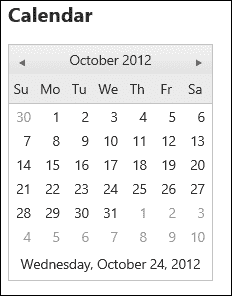
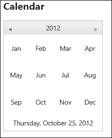
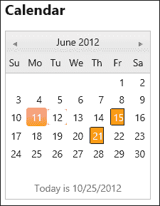
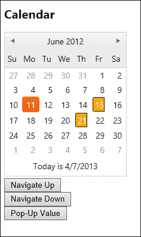
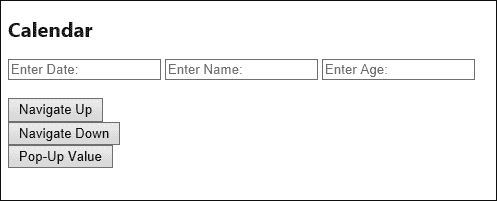
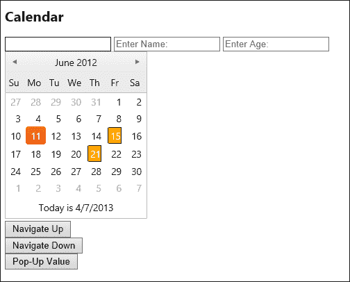

# 第三章. 使用和自定义日历

日历长期以来一直是需要一些巧妙 JavaScript 的网页功能。HTML5 正在努力使这一切变得更加简单，但浏览器的支持仍然不统一。这就是 Kendo UI 成为完美解决方案的地方，因为它是一个结合 HTML5 和 JavaScript 的框架，使用最新的标准创建跨浏览器的统一性。像往常一样，Kendo UI 解决方案的实施非常简单。

# 日历小部件 – 基础

Kendo UI 日历小部件将一个简单的 HTML 元素，例如`div`，转换成一个显示日历的专用 HTML 表格。它还为此表格连接 JavaScript 功能，以支持所有日历小部件事件和方法。要查看此小部件的最简单实现，请在 Kendo 控制器中创建一个新的操作方法，以便我们有一个“calendar”的 URL：

```js
public ActionResult Calendar()
{
    return View();
}
```

然后为这个操作方法添加一个视图，并设置一个空的`div`来容纳 Kendo 日历小部件：

```js
@{
    ViewBag.Title = "Calendar";
}

<h2>Calendar</h2>
<div id="calendar">
</div>
<script type="text/javascript">
    $("#calendar").kendoCalendar();
</script>
```

考虑到我们编写的代码如此之少，输出效果令人惊叹：



在日历上点击并观察它已经具有多少功能。日历顶部的箭头可以向前或向后导航一个月。日历顶部的文本（如前一个截图中的**2012 年 10 月**所示）可以导航到更广泛的日期级别，这使得选择不同的年份或十年变得容易。日历底部的日期是一个超链接，可以直接导航到当前日期。随着我们在本章后面添加功能，我们可以使日历做得更多。

# 配置日历小部件

由于日历小部件只有少数属性，让我们先检查它们，然后再转到使用它们的示例。日历小部件有两种不同类型的属性：

+   **数据/模板属性**：这些属性配置了日历小部件背后的数据

+   **显示/格式化属性**：这些属性配置了日历在页面上的渲染方式以及数据的格式化方式

这里以代码格式列出这些属性。将此代码添加到页面并运行它：

```js
$("#calendar").kendoCalendar({
    culture: 'en-US', // specifies the culture
    depth: 'month',   // specifies navigation depth
                      //(century/decade/month/year)
    max: new Date(2012,11,31), // latest date calendar can show
    min: new Date(1980, 0, 1), // oldest date calendar can show
    start: 'year',    // specifies the start view (century/decade/month/year)
    value: new Date(2012,9,25), // initially selected date
    format: 'yyyy/MM/dd'  // format string used when the value() of this
                          //calendar is requested
});
```

当日历配置如上所述时，它最初通过显示当前选中年份内可用的月份来渲染（`start: 'year'`）。由于我们已配置它允许进入每个月份的导航深度（`depth: 'month'`），我们可以点击一个月份，然后看到该月份及其所有可用日期：



### 注意

即使当前视图是“年”，今天的日期仍然在日历页脚中可见。

谈到页脚，让我们看看日历提供的哪些数据/模板属性。这里的主要属性有三个：`data`、`month`和`footer`，它们是自定义日历小部件的主要方式。为了演示如何自定义日历中特定日期的简单示例，将以下代码添加到页面中并运行它：

```js
<h2>Calendar</h2>
<div id="calendar">
</div>
<style type="text/css">
    .specialDay {
        color: white;
        background-color: orange;
        border:1px solid black;
    }
</style>
<script type="text/x-kendo-template" id="redDays">
    # if ($.inArray(+data.date, data.dates) != -1) { #
        <div class="specialDay">#= data.value #</div>
    # } else { #
        #= data.value #
    # } #
</script>
<script type="text/javascript">
    var datesArray = [+new Date(2012, 5, 15), +new Date(2012, 5, 21)];

    $("#calendar").kendoCalendar({
        culture: 'en-US', // specifies the culture
        depth: 'month',    // specifies navigation depth
        max: new Date(2012, 5,31), // latest date calendar can show
        min: new Date(2012, 5, 1), // oldest date calendar can show
        start: 'month',    // specifies the start view
        value: new Date(2012,5,11), // initially selected date
        format: 'yyyy/MM/dd',  // format string used to format the date values
        dates: datesArray,
        month: {
            content: $("#redDays").html(),
            empty: "X"
        },
        footer: "Today is #= kendo.toString(data, 'd') #"
});
</script>
```

让我们一起逐步分析这段代码。首先，我们有一个特殊的样式指令，用于显示特殊日期的方式。在这种情况下，橙色背景上的白色文本和实线黑色边框。我们还指定了一个 Kendo UI 模板块和 JavaScript，以确定正在渲染的日期是否是我们特殊日期之一。如果是特殊日期之一，则我们希望将其应用自定义样式；否则，按常规渲染。

```js
<style type="text/css">
    .specialDay {
        color: white;
        background-color: orange;
        border:1px solid black;
    }
</style>
<script type="text/x-kendo-template" id="redDays">
    # if ($.inArray(+data.date, data.dates) != -1) { #
        <div class="specialDay">#= data.value #</div>
    # } else { #
        #= data.value #
    # } #
</script>
```

接下来，我们定义日历小部件的实际配置。在这里，`month`属性和`dates`属性之间的关系变得明显：`dates`属性提供了`month`属性用来在日历上渲染日期所需的数据。在我们定义的模板中，我们检查当前正在渲染的日期是否包含在`dates`数组中，然后使用`data.value`来渲染当前正在执行的日期编号。注意，我们还将在`dateArray`中的日期前面加上加号`+`，以强制它们成为我们可以轻松与`$.inArray()`比较的数字日期。这不是每个情况下的要求，但适用于这个示例。

```js
<script type="text/javascript">
    var datesArray = [+new Date(2012, 5, 15), +new Date(2012, 5, 21)];

    $("#calendar").kendoCalendar({
        culture: 'en-US', // specifies the culture
        depth: 'month',    // specifies navigation depth
        max: new Date(2012, 5,31), // latest date calendar can show
        min: new Date(2012, 5, 1), // oldest date calendar can show
        start: 'month',    // specifies the start view
        value: new Date(2012,5,11), // initially selected date
        format: 'yyyy/MM/dd',  // format string used to format the date values
        dates: datesArray,
        month: {
            content: $("#redDays").html(),
            empty: "X"
        },
        footer: "Today is #= kendo.toString(data, 'd') #"
});
</script>
```

其他需要注意的事项是，有一个名为`footer`的新属性，用于渲染日历页脚的模板，它可以通过传递给它的`data`属性访问今天的日期。此外，请注意，`month`对象还有一个名为`empty`的属性，用于渲染位于`min`或`max`属性值范围之外的日期。

以这种方式设置日历后，在浏览器中的外观如下：


### 注意

注意通过`dateArray`提供的日期的特殊显示、范围之外的日期以及页脚中使用的新的文本。

# 使用 MVC 的日历小部件

日历小部件也可以通过 ASP.NET MVC 扩展方法进行配置。为了模仿我们刚刚创建的日历，你可以用以下代码替换你的视图内容：

```js
<h2>Calendar</h2>
<style type="text/css">
    .specialDay {
        color: white;
        background-color: orange;
        border:1px solid black;
    }
</style>
<script type="text/x-kendo-template" id="redDays">
    # if ($.inArray(+data.date, data.dates) != -1) { #
<div class="specialDay">#= data.value #</div>
    # } else { #
        #= data.value #
    # } #
</script>
<script type="text/javascript">
    var datesArray = [+new Date(2012, 5, 15), +new Date(2012, 5, 21)];
</script>
@(Html.Kendo().Calendar()
    .Name("mvcCalendar")
    .Depth(CalendarView.Month)
    .Max(new DateTime(2012, 6, 30))
    .Min(new DateTime(2012, 6, 1))
    .Start(CalendarView.Month)
    .Value(new DateTime(2012, 6, 11))
    .Format("yyyy/MM/dd")
    .MonthTemplate("# if ($.inArray(+data.date, datesArray) != -1) { #" +
                    "<div class='specialDay'>#= data.value #</div>" +
                    "# } else { #" +
                    "#= data.value #" +
                    "# } #")
    .Footer("Today is #= kendo.toString(data, 'd') #")
    )
```

使用此新代码的输出如下：



很相似，不是吗？注意，MVC 扩展隐藏了`max`和`min`以下的日期，并且在`month`上没有提供空属性。还有一些其他独特的事情需要注意。首先，请注意我们仍然在视图中通过 JavaScript 使用日期数组。这是因为`month`模板是在 JavaScript 中运行的，而不是通过 MVC 扩展，并且需要在客户端访问这些数据。由于这个原因，以及 MVC 扩展不提供`dates`属性的事实，我们必须将模板从使用`data.dates`更改为实际的 JavaScript 数组名称——`datesArray`。在这个例子中，我直接将模板代码输入到 MVC 扩展方法中，但还有一个名为`MonthTemplateId()`的方法，你可以传递页面上已经存在的模板的 HTML `id`。

此外，请记住始终在每个 Kendo MVC 扩展对象上调用`.Name()`方法；这是代码正常工作的必要条件。这就是 MVC 扩展方法如何为渲染的 HTML 输出分配唯一的`name`和`id`属性，以及如何将所有 JavaScript 方法和事件正确地连接到网页浏览器中。如果你不包括`.Name()`方法，当你尝试运行页面时，你也会看到运行时错误。

# 日历小部件上的可用方法

日历小部件公开了几个可以在页面上与之交互的方法。这些方法可以通过更改其属性或实时触发特定功能来配置小部件。以下是针对 Kendo UI 日历小部件的特定可用方法的代码形式：

```js
var calendar = $("calendarId").data("kendoCalendar");

// Set a new max date
calendar.max(new Date(2013,11,31));
// Retrieve the current max date
var lastDay = calendar.max();

// Set a new min date
calendar.min(new Date(2011, 11, 31);
// Retrieve the current min date
var oldestDay = calendar.min();

// Navigate to a specific date using a specific view
calendar.navigate(new Date(2012,2,5), "month");

// Navigate down to a lower view (i.e. goes from "year" to "month")
calendar.navigateDown(new Date(2012,6,7)); // date is optional

// Navigate to the future
calendar.navigateToFuture();

// Navigate to the past
calendar.navigateToPast();

// Navigate up to a higher view (i.e. goes from "year" to "decade")
calendar.navigateUp("year");

// Set a new value (selected date) for the calendar
calendar.value(new Date(2012,4,7));

// Get the current value (selected date) of the calendar
var selectedDate = calendar.value();
```

让我们以其中的一些为例，看看它们在我们页面上的实际效果。修改我们为 MVC 视图创建的代码如下：

```js
<h2>Calendar</h2>
<style type="text/css">
    .specialDay {
        color: white;
        background-color: orange;
        border:1px solid black;
    }
</style>
<script type="text/x-kendo-template" id="redDays">
    # if ($.inArray(+data.date, data.dates) != -1) { #
<div class="specialDay">#= data.value #</div>
    # } else { #
        #= data.value #
    # } #
</script>
<script type="text/javascript">
    var datesArray = [+new Date(2012, 5, 15), +new Date(2012, 5, 21)];
</script>
@(Html.Kendo().Calendar()
    .Name("mvcCalendar")
    .Depth(CalendarView.Month).Start(CalendarView.Month)
    .Value(new DateTime(2012, 6, 11))
    .Format("yyyy/MM/dd")
    .MonthTemplate("# if ($.inArray(+data.date, datesArray) != -1) { #" +
                    "<div class='specialDay'>#= data.value #</div>" +
                    "# } else { #" +
                    "#= data.value #" +
                    "# } #")
    .Footer("Today is #= kendo.toString(data, 'd') #")
    )
<br />
<button type="button" id="navigateUp">Navigate Up</button><br />
<button type="button" id="navigateDown">Navigate Down</button><br />
<button type="button" id="showValue">Pop-Up Value</button>
<script type="text/javascript">
    $("#navigateUp").click(function () {
        var calendar = $("#mvcCalendar").data("kendoCalendar");
        calendar.navigateUp();
    });
    $("#navigateDown").click(function () {
        var calendar = $("#mvcCalendar").data("kendoCalendar");
        calendar.navigateDown(calendar.value());
    });
    $("#showValue").click(function () {
        var calendar = $("#mvcCalendar").data("kendoCalendar");
        alert(calendar.value());
    });
</script>
```

为了将日历小部件作为 JavaScript 对象使用，我们必须在包含我们创建的日历的页面元素上调用`.data()`函数。点击页面上的按钮并观察它们的行为。这应该能给你一些关于日历小部件能提供什么以及如何将你自己的交互式代码插入日历以改善用户体验的思路。



# 日历小部件触发的事件

Kendo UI 日历小部件有两个事件——`change`和`navigate`。这些事件在它们命名的动作发生后触发。当选定的日期改变时，`Change`事件被触发，当日历被导航时（例如，当月份改变或视图从“月份”移动到“年份”时），`navigate`事件被触发。

如果你想让日历只在用户在页面上选择某个输入框时出现，并将它的值放入该输入元素中，你会怎么做？你可以尝试这样做。修改我们正在工作的页面的最终`script`块，使其看起来像以下示例：

```js
<script type="text/javascript">
    $(function () {
        $("#mvcCalendar").hide();
    });
    $(document).ready(function () {
        $("#mvcCalendar").data("kendoCalendar").bind("change", function (e) {
            var date = $("#mvcCalendar").data("kendoCalendar").value();
            $("#showTheCalendar").val(kendo.toString(date, 'd'));
        });
    });
    $("#showTheCalendar").focusin(function () {
        $("#mvcCalendar").slideDown();
    });
    $("#nameInput").focusin(function () {
        $("#mvcCalendar").slideUp();
    });
    $("#ageInput").focusin(function () {
        $("#mvcCalendar").slideUp();
    });
    $("#navigateUp").click(function () {
        var calendar = $("#mvcCalendar").data("kendoCalendar");
        calendar.navigateUp();
    });
    $("#navigateDown").click(function () {
        var calendar = $("#mvcCalendar").data("kendoCalendar");
        calendar.navigateDown(calendar.value());
    });
    $("#showValue").click(function () {
        var calendar = $("#mvcCalendar").data("kendoCalendar");
        alert(calendar.value());
    });
</script>
```

在这里，我们有一些由简单的 jQuery 和 jQuery UI 连接的事件，它们可以显示或隐藏日历，并在选择时获取其值。日历的 `change` 事件用于确定何时将新的日期值放入页面的输入元素中。这就是页面首次渲染时的样子。



日历在用户点击第一个文本框之前是隐藏的。一旦发生这种情况，我们连接的事件就会使日历出现，以便用户可以选择页面的适当日期。



# 摘要

Kendo UI 日历小部件易于配置，并在您的页面上提供了一个丰富的元素，可以使处理日期变得简单得多。它可以由 JavaScript 或 MVC 扩展进行配置，并使用 Kendo 模板进行高度可定制的格式化和显示。我仅展示了使用模板和事件可以完成的基本示例；您可以使用这些示例来创建一些非常有用的交互式内容。

在下一章中，我们将学习 Kendo UI 框架中最强大的功能之一，即模型-视图-视图模型（MVVM）框架。这个框架允许您通过简单的 HTML 属性将数据和功能绑定到您的页面上，并启用对数据的实时更改，或对服务器进行更改，同时为用户提供即时反馈。MVVM 框架是一个您希望在所有页面上都想要使用的强大工具。
