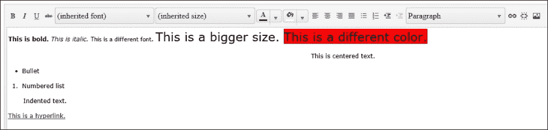
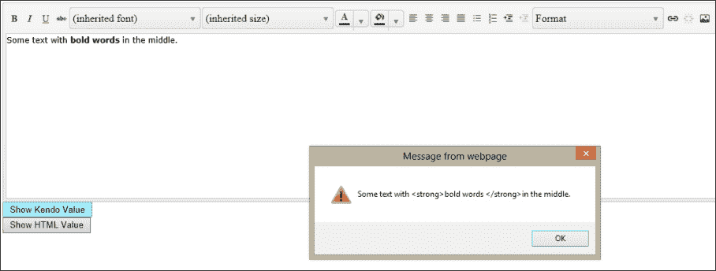
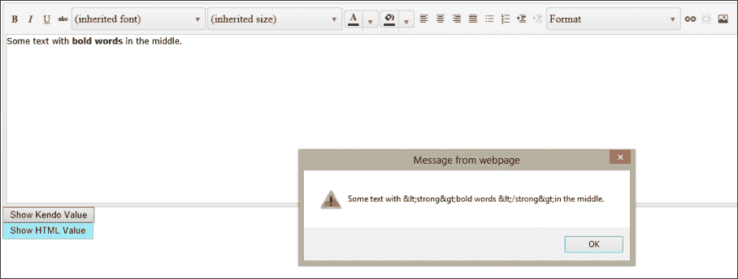
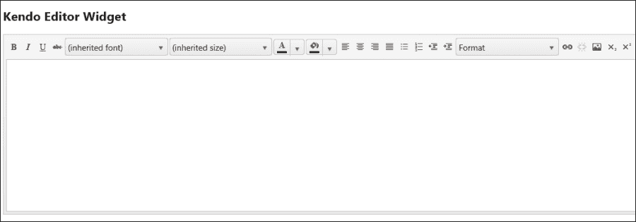
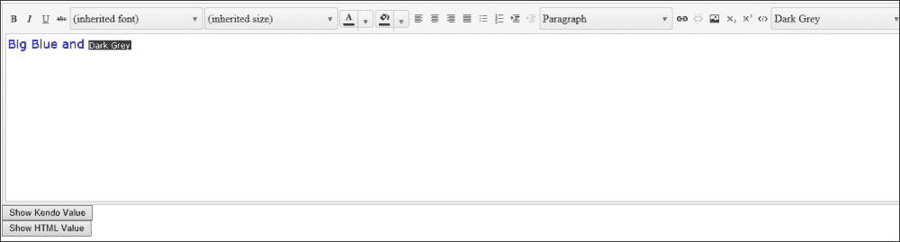
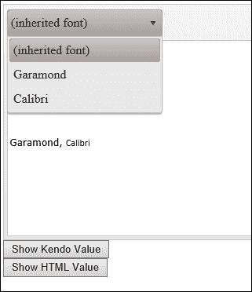
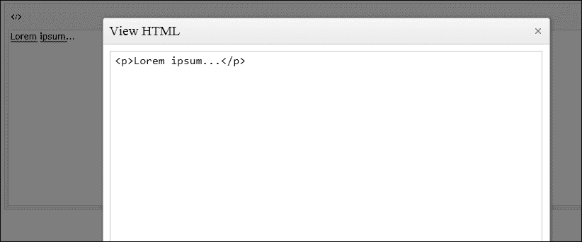
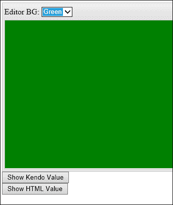
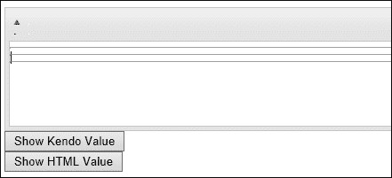

# 第五章。HTML 编辑器和自定义工具

交互式 HTML 编辑器是任何鼓励用户发布自己书面内容的网站的的重要组成部分。论坛和博客经常提供这些控件，以便用户可以像在文字处理程序中创建内容一样创建具有吸引力的样式的内容。对于不熟悉如何使用 HTML 标签或 CSS 样式格式化文本的用户来说，这尤其有用。就这一点而言，甚至熟悉 HTML 和 CSS 的用户也会欣赏不必全部输入。本章将介绍以下主题：

+   Kendo 编辑器小部件基础

+   配置编辑器小部件工具

+   使用 HTML 片段

+   自定义编辑器小部件工具

# 理解 HTML 编辑器

Kendo 编辑器小部件在网页上创建了一个区域，用户可以在其中创建格式化文本内容。要查看一个基本示例的实际操作，请将此代码复制到一个名为 `HtmlEditor.html` 的新 HTML 页面中。这将允许您在真实页面上查看小部件的使用情况，并为本章的其余部分提供一个起点。

```js
<!DOCTYPE html>
<html>
<head>
<title></title>
<script src="img/jquery.js"></script>
<script src="img/kendo.all.js"></script>
<link href="/Content/kendo/kendo.common.css" rel="stylesheet" />
<link href="/Content/kendo/kendo.default.css" rel="stylesheet" />
<style type="text/css">
textarea {
width: 100%;
height: 300px;
        }
</style>
</head>
<body>
<textarea id="editor"></textarea>
<script type="text/javascript">
        $(document).ready(function () {
            $("#editor").kendoEditor();
        });
</script>
</body>
</html>
```

这是假设所有默认设置，因为没有明确设置任何设置或选项。

### 注意

注意，我们已经将 `kendoEditor` 函数绑定到 `textarea` 元素上，这是很重要的，您应该始终将 HTML 编辑器控件绑定到 `textarea` 元素上，以便在可能不支持所需 JavaScript 功能的浏览器中功能可以优雅地降级。

如果我们使用 ASP.NET MVC 实现了这个功能，那么在视图中看起来会是这样：

```js
@using Kendo.Mvc.UI;

@{
ViewBag.Title = "Html Editor";
}
<style type="text/css">
textarea {
width: 100%;
height: 300px;
    }
</style>

<h2>Html Editor</h2>
@(Html.Kendo().Editor()
        .Name("htmlEditor"))
```

再次注意，Kendo MVC 扩展将在 `textarea` 元素内生成 HTML 编辑器，这就是为什么 `textarea` 元素的样式声明在页面输出中起作用的原因。

无论您使用 HTML 还是 MVC 视图，这是在所有默认设置假设下的页面输出外观。我使用 HTML 编辑器功能添加了一些文本，以说明控件的目的：



查看编辑器小部件顶部的所有工具按钮。在键入文本时单击它们，以观察它们的作用。此外，请注意，Kendo HTML 编辑器生成的不同按钮都支持 HTML `tabindex`，因此您可以使用 *Tab* 键和 *Shift* + *Tab* 键组合来分别在前一个和下一个命令之间移动，如果您想这样做的话。

对于许多网站来说，这已经足够的功能了。要使用用户创建的格式化文本，只需检索 `textarea` 元素的值，它将包含内容和 HTML 标记。

### 小贴士

**不要忘记检查您的输入**

由于你允许用户在其数据内容中公开发布 HTML 标记，因此在将其放入数据库或加载到另一个页面之前，请务必对输入进行清理。即使 Kendo 工具生成的 HTML 标记是安全的，你也永远不能信任从用户的浏览器发送到服务器的最终标记，并且必须始终将其视为可能包含有害代码。

然而，在使用格式化文本之前，你还需要检查你正在处理的值是否已被 HTML 编码。如果你从 DOM 中检索 `textarea` 元素的原始值，你将得到 HTML 编码的数据。这意味着 `<strong>text</strong>` 变为 `&lt;strong&gt;text&lt;/strong&gt;`，这可能是你想要的，也可能不是。

要获取非 HTML 编码的数据，你需要使用如下代码在 `kendoEditor` 对象上调用 `value()` 函数：

```js
var editor = $("#editor").data("kendoEditor");
var nonEncodedText = editor.value();
```

但再次提醒，你需要小心行事。你不能在不绕过一些重要安全措施的情况下将非 HTML 编码的数据像这样发布到大多数 Web 服务器上。更安全的选项是将数据以 HTML 编码的形式发布到 Web 服务器上，然后在服务器端对其进行解码和清理，然后再使用它。这样，你仍然可以在开始解释用户输入之前，直接拒绝页面中的一些潜在恶意代码。

这里是一个更新后的页面，其中包含一些按钮，展示了 DOM `val()` 函数与 `kendoEditor value()` 函数的不同输出：

```js
<!DOCTYPE html>
<html>
<head>
<title></title>
<scriptsrc="img/jquery.js"></script>
<scriptsrc="img/kendo.all.js"></script>
<link href="/Content/kendo/kendo.common.css" rel="stylesheet" />
<link href="/Content/kendo/kendo.default.css" rel="stylesheet" />
<style type="text/css">
textarea {
width: 100%;
height: 300px;
        }
</style>
</head>
<body>
<textarea id="editor"></textarea>
<button name="showKendoVal" id="showKendoVal" type="button">Show Kendo Value</button><br />
<button name="showHtmlVal" id="showHtmlVal" type="button">Show HTML Value</button>
<script type="text/javascript">
        $(document).ready(function () {
            $("#editor").kendoEditor();
            $("#showHtmlVal").click(function () {
alert($("#editor").val());
            });
var editor = $("#editor").data("kendoEditor");
            $("#showKendoVal").click(function () {
alert(editor.value());
            });
        });
</script>
</body>
</html>
```

这是从 Kendo `value()` 函数检索到的文本。



这是从编辑器小部件的 `innerHTML` 中检索到的文本。



# 从工具栏添加和删除按钮

HTML 编辑器工具栏中还有一些标准工具，默认情况下并未包含：

+   下标

+   上标

+   查看 HTML

要包含这些工具，你需要在创建 `kendoEditor` 对象时指定 `tools` 属性，如下所示，并列出你想要显示的具体工具：

```js
$("#editor").kendoEditor({
tools: [
"bold",
"italic",
"underline",
"strikethrough",
"fontName",
"fontSize",
"foreColor",
"backColor",
"justifyLeft",
"justifyCenter",
"justifyRight",
"justifyFull",
"insertUnorderedList",
"insertOrderedList",
"indent",
"outdent",
"formatBlock",
"createLink",
"unlink",
"insertImage",
"subscript",
"superscript",
"viewHtml"
]
});
```

如果你指定了 `tools`，则需要命名所有标准工具，如果你省略了任何工具，它们将不会显示在你的页面工具栏上。相反，以下是使用 ASP.NET MVC 添加下标和上标工具的方法，令人好奇的是，这种方法中不可用 `viewHtml`：

```js
@(Html.Kendo().Editor()
.Name("htmlEditor")
.Tools(tools => tools
.SubScript()
.SuperScript()))
```

这几乎是最简洁的，特别是使用这种方法时，所有默认工具都被假定，你只需要添加你想要包含的工具。如果你想清除默认的工具列表，然后只添加你想要的工具，你首先需要在 `Tools` lambda 表达式中调用 `Clear()`，然后添加你想要的特定工具。

这里是包含所有标准工具的输出：



# 添加样式工具

样式工具可以被添加到 HTML 编辑器工具栏中，使用户能够访问一些预定义的样式。如果您的用户正在使用特殊的主题，或者如果存在用户需要轻松访问的全局样式，这可能很有用。要启用此功能，您通过`kendoEditor`对象配置工具，并指定哪些选项应该出现在样式下拉列表中。以下是一个示例：

```js
$("#editor").kendoEditor({
tools: [
"bold",
"italic",
"underline",
"strikethrough",
"fontName",
"fontSize",
"foreColor",
"backColor",
"justifyLeft",
"justifyCenter",
"justifyRight",
"justifyFull",
"insertUnorderedList",
"insertOrderedList",
"indent",
"outdent",
"formatBlock",
"createLink",
"unlink",
"insertImage",
"subscript",
"superscript",
"viewHtml",
"style"
],
style:[
{text: "Big Blue", value:"bigBlue"},
{text: "Dark Grey", value:"darkGrey"}
],
stylesheets:[
"css/StyleTool.css"
]
});
```

这里是`StyleTool.css`文件的内容：

```js
.bigBlue {
font-size:large;
color:blue;
}
.darkGrey {
color:white;
background-color:#111111;
}
```

要使这生效，我向工具列表中添加了样式工具，然后添加了`style`配置属性和可选的`stylesheets`配置属性。`style`配置属性定义了在样式下拉列表中出现的不同选项，以及当这些样式被选中应用于 HTML 编辑器`textarea`中的某些文本时，应该应用哪些 CSS 类名。`stylesheets`配置选项允许您导入一些额外的样式表，如果它们对于显示自定义样式是必要的。

下面是如何使用 ASP.NET MVC 实现这些样式的示例：

```js
@(Html.Kendo().Editor()
.Name("htmlEditor")
.Tools(tools => tools
.SubScript()
.SuperScript()
.Styles(styles => styles
.Add("Big Blue", "bigBlue")
.Add("Dark Grey", "darkGrey"))
)
.StyleSheets(css =>css
.Add("/Content/StyleTool.css"))
)
```

下面是这段代码的输出结果：



我为了演示的目的添加了一些样式化的文本，并点击了**样式**下拉列表来展示该列表中的选项也是按照它们各自的 CSS 类进行样式的。

## 插入 HTML 片段的工具

Snippets 工具是一个特殊的工具栏选项，它设计用来通过单次点击将预定义的文本块插入到编辑器窗口中。它可以用来添加常见的问答模板、签名块、时间戳，或者任何需要预输入文本的场景。要启用此功能，就像**样式**选项一样，您通过`kendoEditor`对象配置工具，并指定哪些选项应该出现在样式下拉列表中。以下是一个示例：

```js
$("#editor").kendoEditor({
tools: [
"bold",
"italic",
"underline",
"strikethrough",
"fontName",
"fontSize",
"foreColor",
"backColor",
"justifyLeft",
"justifyCenter",
"justifyRight",
"justifyFull",
"insertUnorderedList",
"insertOrderedList",
"indent",
"outdent",
"formatBlock",
"createLink",
"unlink",
"insertImage",
"subscript",
"superscript",
"viewHtml",
"style",
"insertHtml"
],
style:[
{text: "Big Blue", value:"bigBlue"},
{text: "Dark Grey", value:"darkGrey"}
],
stylesheets:[
"css/StyleTool.css"
],
insertHtml:[
{ text: "Today's date", value: "December 7, 2012" },
{ text: "Signature", value: "<p>Sincerely,<br/>John Adams</p>" }
]
});
```

注意，这只需要非常少的配置即可启用。我们在`tools`配置属性中包含了`insertHtml`选项，并在`kendoEditor`定义的末尾添加了`insertHtml`配置属性。在`insertHtml`配置属性内部，我们包含了一个非常简单的对象数组。它们定义了应该出现在下拉列表中的每个项目的标题，以及当选择标题时应该粘贴到 HTML 编辑器中的确切标记。

下面是如何使用 ASP.NET MVC 实现这些片段的示例：

```js
@(Html.Kendo().Editor()
.Name("htmlEditor")
.Tools(tools => tools
.SubScript()
.SuperScript()
.Styles(styles => styles
.Add("Big Blue", "bigBlue")
.Add("Dark Grey", "darkGrey"))
.Snippets(snippets => snippets
.Add("Today's Date", DateTime.Today.Date.ToShortDateString())
.Add("Signature", "<p>Sincerely,<br/>John Adams</p>"))
)
.StyleSheets(css =>css
.Add("/Content/StyleTool.css"))
)
```

下面是这段代码的输出结果：


# 自定义 HTML 编辑器工具

Kendo HTML 编辑器控件允许您将自定义选项添加到工具栏中。这是 Kendo UI 框架中的一个显著灵活性体现，如果您觉得现有的内置工具不完全满足您的需求，这可能会非常有用。HTML 编辑器可以接受至少三种类型的自定义工具。可能还有更多，但这些三种在 Kendo UI 网站上发布的文档中有所体现：

+   覆盖内置工具

+   自定义模板工具

+   自定义内联工具

## 下拉列表工具

如果您想修改一些内置的下拉列表工具，您可以重新定义其中显示哪些选项。这不会改变工具的本质或工具的功能。它只决定当您点击工具时，下拉列表中显示哪些选项。例如，考虑限制字体工具中显示的选项。通过替换`items`数组的内容，您可以自定义工具在页面显示时精确显示哪些选项：

```js
$("#editor").kendoEditor({
tools: [
{
name: "fontName",
items: 
[{text:"Garamond", value: "Garamond, serif"},
{text:"Calibri", value:"calibri, sans-serif"}]
}
]
});
```

这个代码示例演示了一个自定义的`fontName`工具，限制为两个特定的选项。这两个字体在我们之前看到的默认`fontName`工具中并未包含，但您也可以在这个自定义列表中包含默认字体。以下是使用此自定义工具配置的 HTML 编辑器的输出：



您会注意到列表中的前两个选项并不是我在源代码中定义的选项——**继承的字体**和**Verdana**。这是因为 HTML 编辑器正在从外部的包含 HTML 标记中启用字体，并将其称为**继承的字体**。然后它通过名称标记这个相同的字体，以便帮助用户进行字体选择，所以**继承的字体**和**Verdana**实际上都指的是从整个页面的外部 HTML 标记中继承的同一字体。

这种自定义工具配置应该适用于任何以下拉列表形式出现的自定义工具，例如字体名称、字体大小和格式块工具。

## 按钮工具

您可能不需要覆盖许多这些控件，因为创建自己的工具可能更有效。不过，如果您想看看如何实现，这里有一个从 Kendo UI 网站上摘取的代码示例，展示了如何用自定义代码替换`viewHtml`工具的功能：

```js
<script type="text/x-kendo-template" id="viewHtml-template">
<div>
<textarea style="width: 400px; height: 300px;"></textarea>
<div class="viewHtml-actions">
<button class="k-button viewHtml-update">Update</button>
<button class="k-button viewHtml-cancel">Cancel</button>
</div>
</div>
</script>
<script>
$("#editor").kendoEditor({
tools: 
[{
name: "viewHtml",
tooltip: "View HTML",
exec: function(e) {
var editor = $(this).data("kendoEditor");

var dialog = $($("#viewHtml-template").html())
.find("textarea").val(editor.value()).end()
.find(".viewHtml-update")
.click(function() {
editor.value(dialog.element
.find("textarea").val());
dialog.close();
})
.end()
.find(".viewHtml-cancel")
.click(function() {
dialog.close();
})
.end()
.kendoWindow({
modal: true,
title: "View HTML",
deactivate: function() {
dialog.destroy();
}
}).data("kendoWindow");

dialog.center().open();
}
}]
})
</script>
```

这是页面上的代码显示：



此源代码包括一个模板和 `kendoEditor` 配置。您可以看到，此代码基本上是打开一个对话框，用 HTML 编辑器控件的内容填充它，连接对话框内按钮的事件，然后将其显示给用户。它至少提供了一个示例，说明如何覆盖内置工具之一。请注意，工具执行的逻辑位于一个名为 `exec` 的属性中；这对于所有自定义按钮工具也是常见的。`tooltip` 属性是鼠标悬停在工具栏上的按钮上时显示的文本。

## 自定义模板工具

如果您想创建一个具有选项下拉列表的自定义工具，自定义模板工具是最佳选择。它允许您使用 Kendo UI 模板来标记工具在工具栏上的显示方式，并且您可以单独连接其功能，以便您的工具可以执行它需要的任何操作：

```js
<textarea id="editor"></textarea>
<button name="showKendoVal" id="showKendoVal" type="button">Show Kendo Value</button><br />
<button name="showHtmlVal" id="showHtmlVal" type="button">Show HTML Value</button>
<script type="text/x-kendo-template" id="editorColor-template">
<label for="customTool">Editor BG:</label>
<select name="customTool" id="customTool"><option value=''>None</option><option value="blue">Blue</option><option value="green">Green</option></select>
</script>
<script type="text/javascript">
$(document).ready(function () {
$("#editor").kendoEditor({
tools: [
{
name: "editorBackground",
template: $("#editorColor-template").html()
}
]
});
$("#showHtmlVal").click(function () {
alert($("#editor").val());
});
var editor = $("#editor").data("kendoEditor");
$("#showKendoVal").click(function () {
alert(editor.value());
});
$("#customTool").change(function (e) {
$("#editor").data("kendoEditor").body.style.backgroundColor =
$("#customTool").val();
});
});
</script>
```

您可以看到 Kendo 模板中声明的 `label` 和 `select` 元素。`select` 元素的行定义为 jQuery 代码，但自定义下拉列表工具是通过 `tools` 属性添加到 HTML 编辑器的。

这是带有此自定义工具的页面的输出：



这就是您创建作为下拉列表行为的自定义工具的方法。如您所见，行为完全由您决定，因此您可以创建您网站用例所需的任何工具。

## 自定义内联工具

如果您想在工具栏上创建自己的按钮工具，内联工具是正确的选择。它允许您定义工具名称和当从工具栏中选择该工具时要执行的代码。

```js
$("#editor").kendoEditor({
tools: [
{
name: "addHr",
tooltip: "Insert Horizontal Rule",
exec: function (e) {
var editor = $(this).data("kendoEditor");
editor.exec("insertHtml", { value: "<hr/>" });
}
}
]
});
```

此代码显示了一个名为 `addHr` 的自定义工具，当点击时将在 HTML 编辑器控件中添加一个 `hr` 元素。您还可以看到在 `kendoEditor` 上的 `exec` 函数的使用，您可以在其中指示 HTML 编辑器的一个内置函数/工具，然后提供一个对象，该对象提供其参数。

这是此代码的输出：



# 使用 HTML 编辑器 API

Kendo HTML 编辑器小部件提供了一组庞大的 API 配置选项，这些选项允许您根据您网页的具体需求和情况对小部件进行微调。它还公开了一组方法和事件，您可以使用这些方法和事件在页面运行时以编程方式启用并响应用户界面小部件公开的功能。这些选项综合起来，就是您如何扩展编辑器小部件超出其开箱即用的能力。

## 配置选项

我们已经在上面的材料中介绍了一些内容，但以下是 HTML 编辑器控件可用的配置选项。始终请检查 Kendo UI Web 文档在 `docs.kendoui.com/api/web/editor`，以获取这些选项的更详细配置设置列表，以及获取 API 的最新更改或新增内容。

```js
$("#editor").kendoEditor({
encoded: true,  // whether or not the editor should emit encoded html tags
messages: {     // define custom labels for the built-in tools and dialogs
bold: "Bold",
      …
   },
stylesheets: {…}, // see above, custom stylesheets to load for editor
tools: {…},  // see above, custom and built-in tools to display in the editor
imageBrowser: {  // the imageBrowser tool can accept a custom configuration
transport: {  // the endpoints to use for image operations
read: "imagebrowser/read",
destroy: "imagebrowser/destroy",
create: "imagebrowser/createDirectory",
uploadUrl: "imagebrowser/upload",
thumbnailUrl: "imagebrowser/thumbnail" // path for thumbnails of images
imageUrl: "/content/images/{0}",  // "{0}" is placeholder for virtual
                                           // path and image name
},
path: "/myInitialPath/",  // Initial path of images to display
fileTypes: ".png,.gif,.jpg,.jpeg",  // Allowed image file extensions
schema: {…}, // a schema can be defined to interpret data returned from
              // a remote endpoint when parsing data to display images
messages: {…} // custom messages for imageBrowser controls and dialogs
   }
});
```

## 事件

就像在复杂网站中的任何 HTML 元素或 JavaScript 对象一样，当用户在页面内执行某些操作时，网页会触发事件。通过使用自己的 JavaScript 代码挂钩到这些事件，你可以实时响应页面的变化和数据，并根据用户执行的操作组织页面的功能。HTML 编辑器控件会根据用户操作触发以下事件：

+   `change`: 当编辑器窗口内的数据发生变化时，此事件会触发。

+   `execute`: 当一个工具被执行时，此事件会触发。它会在每次工具栏按钮被点击且该按钮背后的代码被执行时触发。

+   `keydown`: 当用户在编辑器窗口内按下键时，keydown 事件会触发。通过挂钩到这个事件，你可以对用户正在输入的文本做出响应。

+   `keyup`: 当用户在编辑器窗口内按下并释放键时，keydown 事件会触发。通过挂钩到这个事件，你可以对用户正在输入的文本做出响应。

+   `paste`: 当文本被粘贴到编辑器窗口区域时，paste 事件会触发。

+   `select`: 当用户在编辑器窗口内选择文本时，select 事件会触发。

# 摘要

HTML 编辑器为你提供了大量的功能，而所需的编码量却很少。在大多数情况下，默认控件将满足你在普通网站上对 HTML 编辑的所有需求。但是，如果你发现自己需要高度定制的工具，这个 HTML 编辑器支持丰富的 API、详细的配置选项以及易于访问的事件，用于捕获和响应用户操作。这是一个不适合每个网站的控件，但当你需要这样的工具时，在这样一个有用且易用的包中找到它将极大地提高生产力。

在下一章中，我们将介绍两个非常重要的 Kendo 控件——菜单和 ListView。这些控件允许你使用在所有前几章中看到过的相同的 Kendo 方法，在你的页面中创建响应式和功能丰富的级联页面菜单以及组织良好的数据结构。基于你已有的知识，使用这些新控件将会很容易，你很快就会开始运行。
