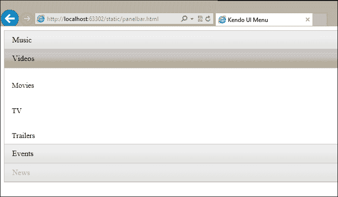
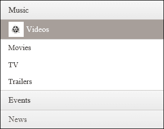
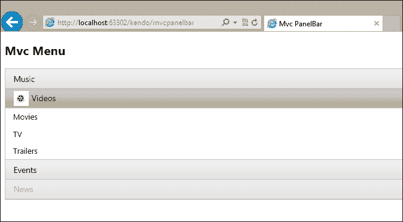
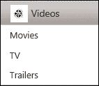
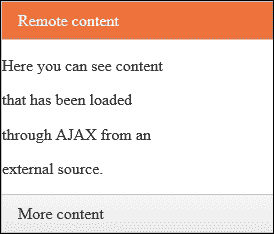
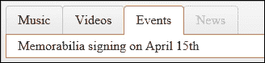
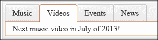
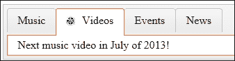
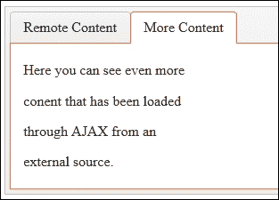

# 第七章：实现 PanelBar 和 TabStrip

PanelBar 和 TabStrip 小部件是用于组织数据的特殊 Kendo UI 控件，使得网页能够包含大量内容，但一次只显示其中的一部分内容。这些内容部分被 PanelBar 小部件分割成面板，或者被 TabStrip 小部件分割成标签页。在两种情况下，效果都非常相似，并且是保持网页不过于杂乱的一种非常有用的方式。本章将解释使用 HTML 和 ASP.NET MVC 实现 PanelBar 和 TabStrip 控件的基础知识，然后说明以下功能：

+   将图片添加到 PanelBar 和 TabStrip 项目中

+   将 URL 添加到 PanelBar 和 TabStrip 项目中

+   使用 PanelBar 和 TabStrip 加载 AJAX 内容

+   控制 PanelBar 和 TabStrip 动画效果

# PanelBar 基础知识

PanelBar 小部件是 Kendo UI 在网页上实现交互式 JavaScript “折叠”的方式。这种类型的控件对于显示可能占用大量屏幕空间的数据列表非常有用，但将其压缩成对用户仍有意义的格式。作为介绍，这里是一个从静态无序列表 HTML 创建的基本 PanelBar 的代码示例。此 HTML 列表将被重新格式化为一个折叠控件，一次显示列表的一个区域。正如您将看到的，当运行代码示例时，这允许大量数据在视觉上压缩到更小的空间。它还允许用户选择他们感兴趣查看的列表区域，并隐藏其他部分的详细信息。这展示了 Kendo 小部件实现之间的一些共同点：

### 注意

注意，我在 Menu 控制中使用了与上一章相同的数据。

```js
<!DOCTYPE html>
<html>
<head>
    <title>Kendo UI PanelBar</title>
    <script src="img/jquery.js"></script>
    <script src="img/kendo.all.js"></script>
    <link href="/Content/kendo/kendo.common.css" rel="stylesheet" />
    <link href="/Content/kendo/kendo.default.css" rel="stylesheet" />
</head>
<body>
        <div id="panelBarDemo">
            <ul id="panelBar">
                <li>
                    Music
                    <ul>
                        <li>
                            Blues / Folk
                            <ul>
                                <li>Contemporary Blues</li>
                                <li>Contemporary Folk</li>
                                <li>Traditional American</li>
                                <li>World Folk</li>
                            </ul>
                        </li>
                        <li>
                            Christian / Gospel
                            <ul>
                                <li>Christian Rock / Hip Hop</li>
                                <li>Contemporary Christian</li>
                                <li>Traditional Gospel</li>
                            </ul>
                        </li>
                    ...
                    </ul>
                </li>
                <li>
                    Videos
                    <ul>
                        <li>Movies</li>
                        <li>TV</li>
                        <li>Trailers</li>
                    </ul>
                </li>
                <li>
                    Events
                </li>
                <li disabled="disabled">
                    News
                </li>
            </ul>
        </div>
        <script>
            $(document).ready(function () {
                $("#panelBar").kendoPanelBar();
            });
        </script>
</body>
</html>
```

此源代码创建了一个 PanelBar，其数据与上一章中 Menu 的数据相同。无序列表中的顶级 `<li>` 元素在输出中均显示为实际的折叠标题。在这个例子中，正如菜单示例中一样，它们是 **音乐**、**视频**、**活动** 和 **新闻**。请注意，这些顶级元素都包含自己的名称，并且可以可选地包含一个嵌套的无序列表 (`<ul>`)，当在页面上选择该顶级项目时，它将显示为选项。向下移动链，嵌套列表中的每个 `<li>` 元素也可以包含自己的 `<ul>` 列表，以创建进一步嵌套的选项菜单，这在不是所有折叠实现都能处理这种级别嵌套数据的情况下是非常令人印象深刻的。这创建了一个级联效果，其中菜单选项可以随着您将鼠标移动到不同的选项而继续展开。此外，请注意，最终的顶级 `<li>` 项目 `新闻` 被标记为 `disabled` 属性，这意味着它仍然会在输出中显示，但不能被选择。

下面是此代码的输出：



在此截图拍摄之前，点击了**视频**面板，以便您可以看到一些打开的数据，它通常以所有面板都关闭开始。

就像之前的菜单小部件一样，PanelBar 小部件不必从静态 HTML 运行，它可以由本地或远程数据的`DataSource`对象提供动力。以下是使用数据源而不是静态 HTML 的代码修改示例：

```js
<body>
    <div id="panelBarDemo">
    </div>
    <style type="text/css">
      #panelBarDemo img{
        max-height: 30px;
        max-width: 30px;
      }
    </style>
    <script type="text/javascript">

        var panelBarData = [
            {
                text: "Music",
                items: [
                    {
                        text: "Blues/Folk",
                        items: [
                            { text: "Contemporary Blues" },
                            { text: "Contemporary Folk" },
                            { text: "Traditional American" },
                            { text: "World Folk" }
                        ]
                    },
                    {
                        text: "Christian / Gospel",
                        items: [
                            { text: "Christian Rock / Hip Hop" },
                            { text: "Contemporary Christian" },
                            { text: "Traditional Gospel" }
                        ]
                    },
                    ...
                ]
            },
            {
                text: "Videos",
                imageUrl: "/Images/reel.png",
                items: [
                    { text: "Movies" },
                    { text: "TV" },
                    { text: "Trailers" }
                ]
            },
            {
                text: "Events"
            },
            {
                text: "News",
                enabled: false
            }
        ];
    </script>
    <script type="text/javascript">
        $(document).ready(function () {
            $("#panelBarDemo").kendoPanelBar({ dataSource: panelBarData} );
        });
    </script>
</body>
</html>
```

### 备注

注意，`DataSource`对象可以配置为所有您在早期章节中看到的选项，也可以通过传输属性配置远程数据。

在这个代码示例中，我们还实现了一个新功能，即**视频**标签页的`imageUrl`属性。通过指定项目中的图像 URL，输出将显示屏幕上标签页标题旁边的此图像，您可以在下面的屏幕截图中看到：



要适应使用 MVC 扩展方法，您需要在`cshtml`文件中创建一个 MVC 视图，并包含以下源代码：

```js
@using Kendo.Mvc.UI;

@{
    ViewBag.Title = "Mvc PanelBar";
}

<style type="text/css">
    li img {
        max-height: 25px;
        max-width: 25px;
    }
</style>

<h2>Mvc Menu</h2>
@(Html.Kendo().PanelBar()
    .Name("panelBarDemo")
    .Items(items =>
        {
            items.Add().Text("Music").Items(sub =>
            {
                sub.Add().Text("Blues / Folk").Items(subsub =>
                {
                    subsub.Add().Text("Contemporary Blues");
                    subsub.Add().Text("Contemporary Folk");
                    subsub.Add().Text("Traditional American");
                    subsub.Add().Text("World Folk");
                });
                sub.Add().Text("Christian / Gospel").Items(subsub =>
                {
                    subsub.Add().Text("Christian Rock / Hip Hop");
                    subsub.Add().Text("Contemporary Christian");
                    subsub.Add().Text("Traditional Gospel");
                });
                ...
            });
            items.Add().Text("Videos").ImageUrl("/static/images/reel.png").Items(sub => {
                sub.Add().Text("Movies");
                sub.Add().Text("TV");
                sub.Add().Text("Trailers");
            });
            items.Add().Text("Events");
            items.Add().Text("News").Enabled(false);
        })
)
```

备注，在这个代码示例中，我们已经声明了数据是静态的。它也可以通过 C#代码中的逻辑从不同的来源收集，或者甚至作为 JavaScript 的一部分留下，并通过 HTTP 从远程源检索。我们还可以看到，这里的图像是通过 ASP.NET MVC 语法而不是通过上一个示例中的 JavaScript 提供的。

从这个屏幕截图中，您可以看到输出与另外两个代码示例完全相同：



这说明了创建 Kendo UI PanelBar 小部件的三种独特方法，就像之前的菜单小部件一样，以及它们之间的区别。

## 将精灵图像添加到 PanelBar 项

我们已经看到了一些示例，说明了 PanelBar 小部件如何包含`imageUrl`属性来显示与部分标题并排的图像。它还可以通过指定`spriteCssClass`属性来使用更高级的图像选项。在两种情况下，图像或精灵都将作为菜单项文本左侧的图标出现。

正如我们之前部分看到的，以下是一个使用`imageUrl`属性显示`视频`菜单项图标的示例：

```js
...
{
  text: "Videos",
  imageUrl: "/images/reel.png",
  items: [
    { text: "Movies" },
    { text: "TV" },
    { text: "Trailers" }
  ]
},
...
```

通过添加此属性，输出现在在菜单中显示图像：



这就是使用 MVC 语法时的代码示例：

```js
items.Add().Text("Videos").ImageUrl("/images/reel.png").Items(sub => {
  sub.Add().Text("Movies");
  sub.Add().Text("TV");
  sub.Add().Text("Trailers");
});
```

注意，添加到输出中的`ImageUrl`扩展方法。

要使用精灵，您首先需要设置应显示图标的菜单项的背景图像，然后使用`spriteCssClass`属性指定一个 CSS 类，该类将指定每个特定图标的像素偏移。每个指定了`spriteCssClass`属性的菜单项将自动装饰上`k-sprite` CSS 类，以确保正确连接。以下是一个可能的示例：

```js
<style>
#panelBarDemo .k-sprite {
  background-image: url("images/sprites.png");
}
.someIcon {
  background-position: 0 0;
}
.someOtherIcon {
  background-position: 0 -32px;
}
</style>
...
<script>
...
{
  text: "Videos",
  spriteCssClass: "someIcon",
  items: [
    { text: "Movies" },
    { text: "TV" },
    { text: "Trailers" }
  ]
},
...
```

此示例的 CSS 部分显示了为所有`k-sprite`类装饰的元素分配`background-image`属性，并指定了两个精灵像素`background-position`样式。脚本部分显示了正在使用的`spriteCssClass`属性，它将分配精灵图像的相应部分作为该菜单项的图标。

## 向 PanelBar 项添加 URL

到目前为止，我们看到的所有示例都是当选择时不会执行任何操作的 PanelBar 项。我们唯一需要做的就是向 PanelBar 项添加`url`属性，以便在点击时导航。因此，对于任何我们希望将用户导航到不同页面的 PanelBar 项，包括一个`url`属性，它就会这样做：

```js
...
{
  text: "Videos",
  spriteCssClass: "someIcon",
   url: "http://www.microsoft.com",
  items: [
    { text: "Movies" },
    { text: "TV" },
    { text: "Trailers" }
  ]
},
...
```

## 使用 PanelBar 加载 AJAX 内容

与将所有内容嵌入一个页面不同，可以使用 PanelBar 小部件通过 AJAX 动态地从其他 URL 加载内容。这将减少页面的整体大小，因为一次只会加载 PanelBar 的一个部分。它还可以允许您从您的站点中的其他位置加载内容，这些位置可能独立于包含您的 PanelBar 的站点而变化，这可以减少重复文本或标记。要启用此功能，请使用 PanelBar 的`contentUrls`属性来指示哪些站点包含应放置在手风琴内部的标记：

```js
$("#panelId").kendoPanelBar({
  ...
  contentUrls: [
    "content1.html",
    "content2.html"  ]
});
```

其次，我们必须在 HTML 标记中创建占位符，以指示 AJAX 内容加载后会出现的位置。这只需要以下代码的结构，其中包含包含空`<div>`元素的`<li>`元素，这些元素将在适当的时间接收 AJAX 内容：

```js
<ul id="panelBarDemo">
    <li>
      Remote content
      <div></div>
    </li>
    <li>
      More content
      <div></div>
    </li>
</ul>
```

使用这种标记和 JavaScript 代码的组合，PanelBar 将加载第一个标签页的`content1`，第二个标签页的`content2`，依此类推。保持这些页面上的内容非常简单是个好主意，这样它就可以适应 PanelBar 区域而不会变形。



## 控制 PanelBar 动画效果

可以通过在 JavaScript 中配置 PanelBar 对象时使用动画属性来控制 PanelBar 的动画功能。可以将`animation`属性设置为`false`以完全禁用所有动画效果，或者可以像以下代码示例那样进行配置以实现特定行为：

```js
$("#panelId").kendoPanelBar({
  ...
  expandMode: "single",  // "multiple" for multiple open tabs at once
  animation: {
    collapse: {
      duration: 1000,  // milliseconds for animation effect
      effects: "fadeOut"  //"fadeout" is the only option for collapse
    },
    expand: {
      duration: 500,
      effects: "expandVertical fadeIn" // choose either or both of these
    }
});
```

可用的唯一折叠动作动画效果是`fadeOut`。对于`expand`动作，可以选择`expandVertical`，这是展开 PanelBar 的正常动作，以及`fadeIn`，它在展开时改变不透明度。

# 介绍 TabStrip 小部件

TabStrip 小部件与 PanelBar 小部件非常相似。实际上，它们执行的功能几乎相同，只是 PanelBar 小部件将内容组织成垂直堆叠的面板，而 TabStrip 小部件将内容组织成水平堆叠的面板。它们如此相似，以至于我们将使用几乎相同的代码来演示这两个小部件。你已经在前面几节中看到了 PanelBar 小部件。现在我们将查看 TabStrip 小部件，并了解它在网页中的功能。

## TabStrip 基础

TabStrip 小部件创建了一系列标签，用于一次只显示特定内容的一个部分。标签内的内容可以是几乎所有东西，从简单的文本和标记到足够填充整个网页的 `<div>` 部分都可以。你肯定见过网页顶部有标签的网页，用于将不同类型的材料组织到单个网页上。Kendo TabStrip 小部件是在自己的页面上创建这种效果的一种方法。首先，将以下代码复制到一个新的 HTML 页面中，并在网页浏览器中运行它：

```js
<!DOCTYPE html>
<html>
<head>
    <title>Kendo UI TabStrip</title>
    <script src="img/jquery.js"></script>
    <script src="img/kendo.all.js"></script>
    <link href="/Content/kendo/kendo.common.css" rel="stylesheet" />
    <link href="/Content/kendo/kendo.default.css" rel="stylesheet" />
</head>
<body>
        <div id="panelBar">
            <ul>
                <li>
                    Music
                </li>
                <li>
                    Videos
                </li>
                <li>
                    Events
                </li>
                <li disabled="disabled">
                    News
                </li>
            </ul>
            <div>Next concert in May of 2013!</div>
            <div>Next music video in July of 2013!</div>
            <div>Memorabilia signing on April 15th</div>
            <div></div>
        </div>
        <script>
            $(document).ready(function () {
                $("#panelBar").kendoTabStrip();
            });
        </script>
</body>
</html>
```

对于此小部件，标记必须遵循特定的模式。TabStrip 本身必须在包含无序列表 (`<li>`) 和紧随无序列表之后的一组 `<div>` 元素的 `<div>` 元素上声明。这在上面的代码示例中都很明显。无序列表包含所有标签标题。`<div>` 元素集合包含在每个标签中出现的所有内容，其顺序与在标记中出现的顺序相同。这就是这个特定示例在网页浏览器中运行时的样子：



## 使用数据源与 TabStrip 结合

与 PanelBar 类似，TabStrip 可以配置为使用数据源，而不是在网页上现有的 HTML 标记之上创建。要将上一节中的代码示例适应这种模式，用以下代码替换页面主体：

```js
<body>
  <div id="panelBar">
  </div>
  <script>
    $(document).ready(function () {
      $("#panelBar").kendoTabStrip({
        dataTextField: 'text',
        dataContentField: 'content',
        dataSource: [
        {
          text: 'Music',
          content: 'Next concert in May of 2013!'
        },
        {
          text: 'Videos',
          content: 'Next music video in July of 2013!'
        },
        {
          text: 'Events',
          content: 'Memorabilia signing on April 15th'
        },
        {
          text: 'News',
          content: ''
        }
        ]
      });
    });
  </script>
</body>
```

此代码的输出与之前完全相同，只是由于没有属性可以定义使用数据源禁用的元素，因此**新闻**标签没有被禁用：



## 将图片添加到 TabStrip 小部件

到目前为止，所有的 TabStrip 标签都只包含文本。然而，TabStrip 小部件（就像 PanelBar 小部件一样），也可以包含一个 `imageUrl` 属性来在标签的标题旁边显示图片。它还可以通过指定 `spriteCssClass` 属性来使用更高级的图片选项。在任一情况下，图片或精灵都将作为图标出现在标签标题文本的左侧。以下是一个使用 `imageUrl` 属性来显示 `Videos` 菜单项图标的示例：

```js
...
{
  text: "Videos",
  imageUrl: "/images/reel.png",
  content: "Next music video in July of 2013!"
}
...
```

通过添加此属性，输出现在在菜单中显示了图片：



当使用 MVC 语法时，相同的代码示例看起来是这样的：

```js
@using Kendo.Mvc.UI;

@{
    ViewBag.Title = "Mvc TabStrip";
}

<style type="text/css">
    li img {
        max-height: 25px;
        max-width: 25px;
    }
</style>

<h2>Mvc TabStrip</h2>
@(Html.Kendo().TabStrip()
    .Name("tabStripDemo")
    .Items(items =>
        {
            items.Add().Text("Music")
                .Content("Next concert in May of 2013!");
            items.Add().Text("Videos")
                .Content("Next music video in July of 2013!")
                .ImageUrl("/images/reel.png");
            items.Add().Text("Events")
                .Content("Memorabilia signing on April 15th");
            items.Add().Text("News").Enabled(false);
        }) 
)
```

你应该能够注意到与我们之前用于 PanelBar 小部件的代码有很多相似之处。要使用与 TabStrip 一起的精灵，你可以遵循我们之前讨论的 PanelBar 的相同程序。

## 向 TabStrip 标签页添加 URL

要将 TabStrip 标签页用作指向另一页面的超链接，你可以配置该标签页的 `url` 属性，并承担此角色。通过这样做，我们不再使用标签页在页面上显示任何内容，它只是在点击时直接导航到另一个网页。

```js
...
{
  text: 'News',
  content: '',
  url: 'http://www.kendoui.com'
}
...
```

通过这种方式修改代码后，`新闻`标签页将变成一个超链接，而不是实际显示内容的标签页。

## 使用 TabStrip 加载 AJAX 内容

要将 AJAX 内容加载到标签页中，我们需要在配置中指定每个标签页内容的 URL。这与 TabStrip 中的其他选项遵循相同的模式，因此现在你应该非常熟悉这种格式：

```js
<script>
  $(document).ready(function () {
    $("#panelBar").kendoTabStrip({
      dataTextField: 'text',
      dataContentField: 'content',
      dataImageUrlField: 'dataImageUrl',
      dataUrlField: 'url',
      dataContentUrlField: 'contentUrl',
      dataSource: [
        {
            text: 'Remote Content',
            contentUrl: 'content1.html'
        },
          {
            text: 'More Content',
            contentUrl: 'content2.html'
          }
        ]
    });
  });
</script>
```

当我们在浏览器中运行网页时，它将呈现如下，随着我们点击标签页标题，远程内容会动态加载：



## 控制 TabStrip 小部件的动画效果

TabStrip 小部件的动画效果与 PanelBar 小部件完全相同。它们通过在 JavaScript 中配置 TabStrip 对象时通过 `animation` 属性来控制。可以将 `animation` 属性设置为 `false` 以完全禁用所有动画效果，或者可以像以下代码示例那样配置以实现特定行为：

```js
$("#tabSripId").kendoTabStrip({
  ...
  animation: {
    collapse: {
      duration: 1000,  // milliseconds for animation effect
      effects: "fadeOut"  //"fadeout" is the only option for collapse
    },
    expand: {
      duration: 500,
      effects: "expand:vertical fadeIn" // choose either or both of these
    }
});
```

可用的折叠动作的唯一动画效果是 `fadeOut`。对于 `expand` 动作，你可以选择 `expand:vertical`，这是展开 TabStrip 的正常动作，以及 `fadeIn`，它在展开时改变透明度。

# 摘要

PanelBar 小部件是一个高度可配置的 JavaScript 折叠小部件，为你提供了相当大的“物有所值”。对于需要压缩到更小屏幕空间中的分类数据元素列表，PanelBar 小部件是网页的完美选择。TabStrip 小部件是一个简单的 JavaScript 标签框架，允许你使用标签组织页面内容，甚至在点击标签时动态将远程内容加载到页面上。这两个出色的组件都应该为你的网站添加有用的功能。

在下一章中，你将了解 Kendo UI 滑块小部件及其如何以图形化的方式收集用户输入。滑块小部件将 HTML 输入显示为可视化的条形，用户可以拖动滑块到所需选项，而不是在表单字段中输入数字。
